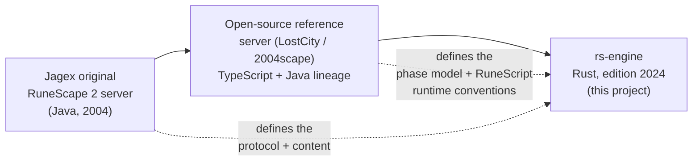
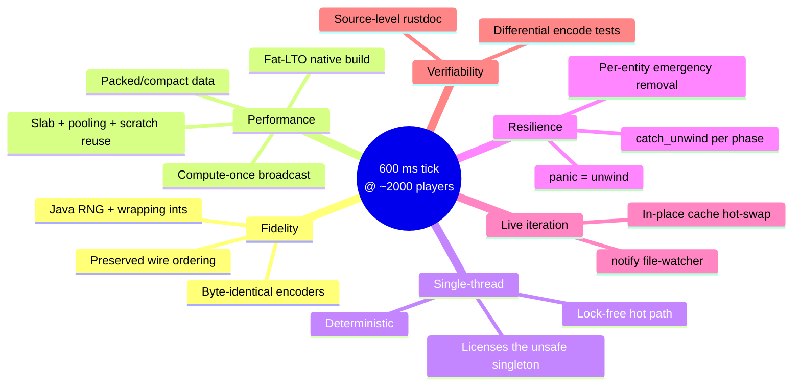

**[← Whitepaper index](../README.md)**  ·  [Single-file version](whitepaper-full.md)

# Part I · Foundations & Motivation

> *Why this engine exists, what it values, and why it is written in Rust rather than reusing the reference server.*

---

## 1. Introduction

### What rs-engine Is

`rs-engine` is a complete authoritative game server: a long-running process that holds the entire mutable state of a
virtual world — every player, non-player character (NPC), ground item, scenery object, inventory, variable, and script
in flight — and advances that world one discrete *tick* at a time while streaming the results to connected game clients.
It is the server half of a client/server massively-multiplayer game, specifically the *build 225* revision of *
*RuneScape 2**, a tile-based 3D MMORPG whose original client dates to 2004.

Concretely, the engine:

- **Accepts and authenticates connections** from the stock game client over a custom binary protocol (RSA-secured login
  handshake, ISAAC-whitened opcode stream), as well as a WebSocket transport for browser clients.
- **Simulates the world** on a fixed 600 ms heartbeat: it resolves movement and pathfinding, runs NPC artificial
  intelligence, executes content scripts, applies combat and skills, manages ground items and scenery changes, and
  maintains each player's area of interest.
- **Encodes and transmits** the per-tick delta of everything each player can see — other players, NPCs, map changes,
  inventory updates, interface state — in the exact byte layout the 2004 client expects.
- **Persists** player profiles to PostgreSQL and **coordinates** across multiple world nodes through a cross-world
  messaging fabric (the "ether") for login arbitration, friends, and private messaging.
- **Runs content** written in **RuneScript**, the original server-side scripting language, compiled to bytecode and
  executed by an embedded stack-based virtual machine — so that quests, objects, NPCs, and skills are defined as
  data/scripts rather than hard-coded engine logic.

The defining adjective throughout is *authoritative*: the client is a thin renderer that trusts the server for all game
state. Every rule, every random roll, every collision check, and every byte on the wire is the server's responsibility,
and must match the original closely enough that a client built in 2004 cannot tell the difference.

### The Game It Emulates

RuneScape 2 (build 225) is a 2D-grid world rendered in 3D. The world is addressed as a lattice of **tiles**, grouped
into **8×8 zones**, grouped into **64×64 map squares**, across four vertical **levels** (height planes). Players and
NPCs occupy tiles and move between them; **locs** (scenery/location objects — doors, trees, walls, furniture) and **objs
** (ground items) populate the tiles. Interaction is verb-on-noun: a player clicks an *option* on a loc, npc, obj,
player, or inventory item, optionally with another item or target, and the server resolves the approach, validates it,
and dispatches the bound script.

Two external artifacts define the game and are treated by `rs-engine` as fixed inputs it must satisfy exactly:

1. **The cache** — the binary content archive: maps, models, animations, interfaces, and the configuration tables for
   every obj, npc, loc, and parameter. `rs-engine` reads (and can compile) this content but does not redefine its
   formats; see [The Game Cache & Content Pipeline](part-07-content-persistence-and-distribution.md#sec-21).
2. **The client** — the unmodified 2004 executable/applet. Its expectations about packet structure, bit packing,
   RNG-driven visuals, and string encoding are the specification the server's wire layer is written against;
   see [Emulation Fidelity](part-09-engineering-deep-dives.md#sec-28).

This is why "emulation" is the right word: `rs-engine` is not *a* game server that happens to look like RuneScape, it is
a re-implementation of *the* RuneScape 2 build-225 server contract, validated by the fact that real cache content and a
real client work against it without modification.

### Lineage: From Jagex to the Reference Server to Rust

The intellectual lineage of this project runs in three stages:

1. **The original Jagex server** (Java, ~2004) defined the protocol, the cache formats, RuneScript, and the
   single-threaded tick model. It is not public; it is the *behavioral specification* that the community has
   reverse-engineered.
2. **The open-source reference server** — the *LostCity / 2004scape* lineage, written primarily in TypeScript (with Java
   antecedents) — is the public, documented, content-complete re-implementation that codified the phase ordering, the
   RuneScript trigger conventions, the info-block protocols, and the overall server shape that the community builds on.
3. **`rs-engine`** is a Rust re-implementation in that lineage. It deliberately preserves the *observable contract* (
   protocol, content, RuneScript semantics, phase ordering, single-threaded determinism) while replacing the
   *implementation substrate* to remove the performance and predictability ceilings of a garbage-collected,
   dynamically-typed runtime. The reasoning for that substrate change is the subject
   of [Why Rust Over the TypeScript Reference Engine](#sec-03).

### What "Emulation" Means Here

Emulation in this project is a hard, testable constraint, not an aesthetic. It has three faces:

- **Byte-identical wire output.** The player-info and NPC-info blocks, zone updates, inventory packets, and interface
  packets are bit-packed to the exact layout the client decodes. The encoder is validated by differential tests that
  compare optimized paths against field-by-field reference encoders over exhaustive mask combinations and tens of
  thousands of random streams (see [Emulation Fidelity](part-09-engineering-deep-dives.md#sec-28)
  and [Info Blocks](part-06-networking-and-the-wire.md#sec-18)).
- **Java-faithful arithmetic and randomness.** RuneScape's mechanics were computed with Java's 32-bit wrapping integer
  arithmetic and `java.util.Random`. `rs-engine` reproduces both: a hand-ported `JavaRandom` linear-congruential
  generator (seeded identically — `engine.rs` constructs `JavaRandom::new(1084838400000)`), and a release profile that
  disables overflow checks so Rust integers wrap exactly as Java's did. RNG-dependent mechanics therefore resolve the
  same way they did on the original server.
- **RuneScript semantics.** The same scripts, compiled to the same bytecode shape, executed with the same
  trigger-resolution and suspension rules. Content authored for the reference server runs unmodified.

When these three hold, the engine is *substitutable* for the original from the client's and content's point of view —
which is the whole point.

### Scope and Non-Goals

**In scope:** the authoritative world simulation; the wire protocol and login; content execution (RuneScript VM); the
cache/content pipeline; persistence; multi-world coordination; and the operational shell (HTTP service for the web
client and cache, a live terminal dashboard, hot-reload of content).

**Out of scope (by design):** the game client itself (unmodified, external); the cache *content* (maps, models, scripts
are inputs, authored separately, though `rs-engine` ships the compiler for them); and game-design balance decisions (
these live in content/RuneScript, not the engine). The engine's job is to be a fast, faithful, resilient *substrate* for
that content.

### The Shape of the System

At the highest level, `rs-engine` is a single-threaded deterministic simulation wrapped in a multi-threaded async host:

- A **`tokio` shell** (`rs-server`) owns the sockets, the HTTP service, the database client, the ether client, and the
  terminal UI. Every connection is an independent async task.
- A **single world task** runs the engine. It never blocks on I/O; it exchanges *owned byte buffers* with the async host
  exclusively through channels. This is the boundary that lets a lock-free single-threaded simulation coexist with
  concurrent network and database work — examined in [System Architecture](part-02-architecture-and-the-tick.md#sec-04)
  and [The Async I/O Boundary](part-08-runtime-and-host.md#sec-24).
- Inside the world task, **`Engine::cycle()`** runs thirteen ordered phases per tick, each isolated by a `catch_unwind`
  boundary so that a panic in one player's logic removes that player rather than crashing the world.

The chapters that follow build this picture bottom-up and top-down at once: Part II lays out the architecture and the
tick; Parts III–VIII descend into each subsystem; Part IX steps back to the cross-cutting engineering — performance,
safety, fidelity, and tooling — that ties the whole together.

[↑ Back to top](#top)

---

## 2. Design Philosophy & Goals

Every non-trivial system embodies a small number of priorities that, when they conflict, decide the design. `rs-engine`
has six, and they are remarkably consistent across the codebase — the same handful of principles explain the
slab-allocated registries, the single-encode info pipeline, the `catch_unwind` phase boundaries, and the global `Engine`
singleton alike. This section states them explicitly and ties each to the concrete mechanisms that follow.

### Pillar 1 — Emulation Fidelity Is Non-Negotiable

The first question asked of any change is: *does the client still see exactly the right bytes?* Fidelity is the
constraint that outranks everything else, because the entire value of the project is that real content and a real client
work against it.

This manifests as:

- **Byte-identical encoders**, validated by differential tests rather than trusted by
  inspection ([Info Blocks](part-06-networking-and-the-wire.md#sec-18), [Emulation Fidelity](part-09-engineering-deep-dives.md#sec-28)).
- **Java-semantics arithmetic and RNG** — wrapping 32-bit integers (`overflow-checks = false`) and a ported
  `java.util.Random` seeded identically to the original world — so probabilistic and arithmetic mechanics match
  tick-for-tick.
- **Preservation of observable ordering** where the client depends on it (e.g. the tracked-entity insertion order in
  info blocks), even when the internal algorithm that produces it is replaced with a faster one.

A performance optimization that changes a single wire byte is, by default, *rejected* — unless it is proven
reference-faithful or explicitly opted into as a wire change. This is the discipline that keeps a heavily-optimized hot
path trustworthy.

### Pillar 2 — Performance & Efficiency as a First-Class Feature

The engine is built to carry **~2,000 concurrent players on a single world thread within a 600 ms tick**. That budget is
the organising number of the whole project: at two thousand players, the per-player-per-tick info encode and the
per-zone broadcast dominate, and everything in the data model is shaped to keep those paths cache-resident and
allocation-light.

The performance posture is *mechanical sympathy*, not micro-optimization for its own sake:

- **Compact, packed data.** Coordinates are a single `u32`; entity UIDs, `Loc`s, and `Obj`s pack their fields into one
  integer; stats are const-generic fixed arrays. Hot structures are deliberately small so more of the working set fits
  in
  cache ([Coordinates](part-03-spatial-world-and-entities.md#sec-09), [Entities](part-03-spatial-world-and-entities.md#sec-11)).
- **Allocation discipline.** Fixed-capacity slab arrays for players and NPCs, a pooled `ScriptState`, reused scratch
  buffers, and write-once shared encode buffers replace per-operation heap
  traffic ([Engine Core](part-02-architecture-and-the-tick.md#sec-07), [Performance Engineering](part-09-engineering-deep-dives.md#sec-26)).
- **Compute-once, broadcast-many.** Each entity's update block and each zone's event stream are encoded a single time
  per tick and then copied into every observer's packet — not re-derived per
  observer ([Info Blocks](part-06-networking-and-the-wire.md#sec-18), [Zones](part-03-spatial-world-and-entities.md#sec-10)).
- **A release build tuned for throughput:** fat LTO, a single codegen unit, `target-cpu=native`, and stripped
  symbols ([Build & Toolchain](part-09-engineering-deep-dives.md#sec-29)).

Performance is treated as correctness's equal partner: the optimization work is extensive, but it is always gated by the
fidelity tests of Pillar 1.

### Pillar 3 — Single-Threaded Determinism

The world advances on **one thread**. This is a deliberate, defended choice, not a limitation waiting to be removed. A
single-threaded tick gives:

- **Determinism** — given the same inputs and the same RNG seed, the world evolves identically, which makes the
  simulation reproducible and the fidelity tests meaningful.
- **No lock contention, no data races, no synchronization overhead** on the hot path — the engine holds plain `&mut`
  references to its registries, zones, renderers, and inventories with zero atomics.
- **A simple mental model** — phases run in a fixed order, each fully completing before the next begins, so "what is
  true right now" is always well-defined.

The cost — that the tick cannot use multiple cores — is accepted. The design instead
pursues cache-locality and algorithmic wins within one thread. The single-threaded invariant is what licenses the
engine's most aggressive choices (the global `Engine` pointer, `unsafe impl Send` without `Sync`, the in-place cache
hot-swap); it is examined in [Memory Safety](part-09-engineering-deep-dives.md#sec-27).

### Pillar 4 — Resilience: One Bad Entity Must Never Kill the World

At scale, content bugs are inevitable: a script divides by zero, an interaction dereferences a stale target. The
engine's stance is that **such a fault must cost at most one entity, never the whole world.**

This is implemented with `std::panic::catch_unwind` boundaries:

- Each of the thirteen phases is wrapped so a panic is caught, logged, and
  contained ([The Game Tick](part-02-architecture-and-the-tick.md#sec-05)).
- The hot per-entity loops (input, npcs, players, info, output) catch panics *per entity* and **emergency-remove** just
  the offending player or NPC — saving the player's profile first — then continue the loop.
- Only an unrecoverable phase-level panic escalates to a full, durable evacuation of all players.

This resilience model is the reason the release profile keeps **`panic = "unwind"`** rather than `abort`: under `abort`,
every `catch_unwind` net silently becomes dead code and a single content bug takes down two thousand sessions.
Preserving unwinding through an aggressive LTO build is a conscious trade of a little code size for production
survivability.

### Pillar 5 — Live Iteration

Content development is the day-to-day workload, and recompiling/restarting a stateful world server for every script
tweak is unacceptable. The engine therefore supports **hot reload**: a file-watcher (`notify`) detects content changes,
the cache and scripts are recompiled, and the new `CacheStore` is swapped *in place* into the same `'static` allocation
every reference already points to — under the single-threaded invariant that makes the raw-pointer swap
sound ([Cache Pipeline](part-07-content-persistence-and-distribution.md#sec-21), [Build & Toolchain](part-09-engineering-deep-dives.md#sec-29)).
Online players keep playing across the reload.

This is the one place where the reference server's greatest strength — rapid, data-driven content iteration via
RuneScript — is explicitly preserved rather than traded away. Rust buys performance; it must not cost the content
workflow, and it doesn't.

### Pillar 6 — Documentation & Verifiability

The codebase is unusually heavily documented at the source level (the engine's core file carries extensive rustdoc on
every public item, including call-stack and side-effect notes), and the correctness-critical paths are covered by
*differential* tests that pin optimized code to reference implementations. The philosophy is that a system this
aggressive about performance and this strict about fidelity can only stay maintainable if its invariants are written
down and machine-checked. This whitepaper is the capstone of that principle.

### The Tick Budget as the Organizing Constraint

If one idea unifies all six pillars, it is the **600 ms tick budget**. Fidelity defines *what* must be produced each
tick; performance defines *how fast*; single-threading defines *on what*; resilience defines *what happens when a tick
goes wrong*; hot-reload defines *how the rules change between ticks*; and documentation/verification defines *how we
know it's still right*. Every chapter that follows can be read as an answer to the same question: **how does this
subsystem do its job within 600 ms, two thousand players at a time, without ever lying to the client?**

[↑ Back to top](#top)

---

## 3. Why Rust Over the TypeScript Reference Engine

The single most common question about this project is: *the reference server already exists and works — why rewrite it
in Rust?* This section answers it directly. The short version: the reference engine's substrate imposes a performance
and predictability ceiling that becomes the binding constraint at MMO scale, and Rust removes that ceiling **without**
forcing the project to give up the things the reference engine does well. The argument is not "Rust is better"; it is "
for an authoritative, latency-bounded, single-threaded simulation that must produce exact bytes, Rust's specific
trade-offs line up almost perfectly with the workload."

### The Reference Engine and Its Ceiling

The *LostCity / 2004scape* reference server is, at its core, a single-threaded tick loop written in TypeScript on
Node.js (with Java antecedents). That is a thoroughly reasonable choice: TypeScript is approachable, the iteration loop
is fast, and a single-threaded event loop maps naturally onto a single-threaded game tick. The reference server is
content-complete and authoritative; `rs-engine` owes it the entire phase model, the RuneScript conventions, and the
protocol knowledge.

But the substrate has structural costs that matter precisely in the hottest part of an MMO server:

- **Garbage collection introduces non-deterministic latency.** A tick must complete within 600 ms *every* time; a V8
  major GC pause lands whenever the allocator decides, not when the tick budget allows. At a few hundred players this is
  invisible; at two thousand, with thousands of short-lived encode buffers churned per tick, GC pressure and pause
  jitter eat into the budget unpredictably. The reference server's per-player-per-tick info encode is exactly the kind
  of high-allocation hot path that feeds the GC the most.
- **Dynamic typing and boxed values defeat cache locality.** A RuneScape world is millions of tile/zone/entity lookups
  per tick. In a JIT'd dynamic language, the "compact" representations the engine wants — a coordinate as one integer,
  an entity as a small struct in a dense array — are not guaranteed; objects are heap-boxed, fields are property-bag
  lookups, and arrays of objects are arrays of pointers. The working set balloons and the cache misses multiply.
- **No direct control over memory layout or allocation.** The reference engine cannot choose to pool a script state,
  slab-allocate its entity table, or write a single shared byte buffer and `memcpy` it into every observer's packet with
  confidence about the resulting machine code. These are the techniques that make the 2,000-player tick fit; they
  require a language that lets you say exactly where bytes live.
- **Bit-twiddling the wire format is unnatural.** The protocol is bit-packed and byte-exact. A systems language with
  `u8`/`u32`/`u128`, explicit wrapping arithmetic, and no hidden number coercions expresses the encoder more safely and
  more literally than a language whose only number is an IEEE double.

None of these make the reference engine *wrong* — they make it the wrong tool for pushing a single world to its absolute
scale ceiling while holding a hard per-tick deadline.

### What Rust Buys

Rust's value here is not abstract "speed"; it is a specific set of capabilities that map onto the six pillars
of [the design philosophy](#sec-02):

- **Total control of memory layout.** `CoordGrid` is a `u32`; `Loc` is a `u128`; `Obj` is a `u64`; player/NPC tables are
  `Vec<Option<T>>` slabs indexed by id; `Stats<N>` is a const-generic fixed array. Hot structures are small, contiguous,
  and cache-friendly *by construction*. The info optimization work — boxing cold fields out of `ActivePlayer` to shrink
  the players `Vec` from tens of megabytes to a cache-friendlier footprint, and reading a 12-byte per-tick snapshot
  instead of a large entity slot — is only expressible because the language exposes layout.
- **No garbage collector, no pause jitter.** Memory is freed deterministically at scope end. The 600 ms budget is spent
  on simulation, not on a collector that runs on its own schedule. Latency is a function of work done, not of allocator
  state.
- **Zero-cost abstractions and monomorphisation.** Generics, iterators, and trait dispatch compile down to the same
  machine code a hand-written specialization would produce. The const-generic `Stats<N>`, the width-generic
  `BitWriter::pbit::<N>`, and the trait-based VM bridge cost nothing at runtime.
- **Fearless, *checked* unsafe where it pays.** The single-threaded invariant lets the engine use a global `Engine`
  pointer and an in-place cache swap that would be reckless in a multi-threaded design. Rust makes these explicit (
  `unsafe`, `unsafe impl Send`, raw pointers) and lets the rest of the codebase remain safe — the danger is
  *localized and documented* rather than ambient ([Memory Safety](part-09-engineering-deep-dives.md#sec-27)).
- **The borrow checker enforces architecture.** The crate graph is a strict DAG because Cargo refuses to compile a
  path-dependency cycle. The reference server's natural entity↔VM cycle is broken in `rs-engine` by inverting it through
  traits — and that inversion is a *compiler-checked* invariant, not a style
  guideline ([Architecture](part-02-architecture-and-the-tick.md#sec-04)).
- **Native compilation with aggressive optimization.** Fat LTO across the whole workspace, one codegen unit, and
  `target-cpu=native` produce a binary tuned to the host's instruction set, with cross-crate inlining into the hot tick
  path ([Build & Toolchain](part-09-engineering-deep-dives.md#sec-29)).
- **Honest integer types for an honest wire.** `wrapping_*` arithmetic, fixed-width integers, and
  `overflow-checks = false` in release reproduce Java's 32-bit semantics exactly, while debug builds still catch
  unintended overflow. The encoder reads like the specification.

### What Was Deliberately Kept

A rewrite is only worth it if it keeps the strengths of what it replaces. `rs-engine` is conservative about *what* it
changes:

- **RuneScript stays.** Content is still authored in the original scripting language, compiled to bytecode, and executed
  by an embedded
  VM ([VM Core](part-04-the-runescript-engine.md#sec-13), [Opcode Catalog](part-04-the-runescript-engine.md#sec-14)).
  The rewrite is of the *engine*, not the *content language* — quests and skills remain data, not Rust.
- **The phase model stays.** The same thirteen-phase ordering, the same trigger-resolution and suspension rules, the
  same area-of-interest and info-block protocols. A contributor who knows the reference server's tick will recognise
  this one.
- **Single-threaded determinism stays.** Rust is used to make the *single* thread faster, not to parallelise the tick.
  The model the reference server pioneered is preserved; only its execution speed and predictability change.
- **Rapid iteration stays.** Hot-reload of content/scripts keeps the edit-test loop tight despite the move to a compiled
  language ([Cache Pipeline](part-07-content-persistence-and-distribution.md#sec-21)).

The thesis, then, is *substrate replacement*: keep the contract and the content workflow, swap the runtime for one that
can hold the deadline at scale.

### A Side-by-Side Comparison

| Dimension          | TypeScript / Node reference                 | `rs-engine` (Rust)                                          |
|--------------------|---------------------------------------------|-------------------------------------------------------------|
| Tick model         | Single-threaded event loop                  | Single-threaded deterministic loop (preserved)              |
| Latency profile    | Subject to V8 GC pause jitter               | No GC; latency ∝ work done                                  |
| Memory layout      | Heap-boxed objects, pointer arrays          | Packed integers, dense slabs, const-generic arrays          |
| Allocation control | Implicit, GC-managed                        | Explicit: pooling, slabs, scratch reuse, write-once buffers |
| Numeric model      | IEEE double everywhere                      | Fixed-width ints + explicit wrapping (Java-faithful)        |
| Concurrency safety | Single-threaded by runtime                  | Single-threaded by design; `unsafe` localized + checked     |
| Module boundaries  | Convention                                  | Compiler-enforced acyclic crate DAG                         |
| Wire encoding      | Manual on dynamic numbers                   | Bit-packed on native integer types, differentially tested   |
| Content language   | RuneScript                                  | RuneScript (preserved)                                      |
| Hot reload         | Yes                                         | Yes (in-place `'static` cache swap)                         |
| Build/runtime      | Interpreted/JIT, instant start              | Compiled, fat-LTO native, tuned to host CPU                 |
| Primary cost       | Performance/predictability ceiling at scale | Longer compile times; steeper language                      |

### The Honest Trade-offs

Choosing Rust is not free, and the project pays real costs:

- **Compile times.** A fat-LTO, single-codegen-unit release build of a 50k-line workspace is slow. This is mitigated
  structurally — fine-grained crates localise incremental recompiles, and a `dev-opt` profile offers a middle ground —
  but a release build is never instant ([Build & Toolchain](part-09-engineering-deep-dives.md#sec-29)).
- **Language difficulty.** The borrow checker, lifetimes, and the discipline around `unsafe` raise the bar to contribute
  relative to TypeScript. The mitigation is that the dangerous parts are few, isolated, and documented, and the safe
  majority of the codebase is ordinary Rust.
- **The cost of the rewrite itself.** Re-implementing a content-complete server is a large undertaking, justified only
  because the performance ceiling is a genuine, binding problem for the target scale.

The conclusion is narrow and defensible: **for this specific workload — an authoritative, byte-exact, single-threaded
simulation under a hard per-tick deadline at MMO scale — Rust's control over layout, its absence of GC jitter, its
zero-cost abstractions, and its checked-unsafe escape hatch are worth the compile times and the learning curve.** The
rest of this whitepaper is the evidence for that claim, subsystem by subsystem.

[↑ Back to top](#top)

---

— ·  [↑ Index](../README.md)  ·  [Part II →](part-02-architecture-and-the-tick.md)
