<a id="top"></a>

**[← Whitepaper index](../README.md)**  ·  [Single-file version](whitepaper-full.md)

# Part II · Architecture & the Tick

> *The static crate graph and the dynamic 600 ms heartbeat that drives everything.*


---

<a id="sec-04"></a>

## 4. System Architecture — Topology, Crate Graph & Data Flow

This section is the reader's map of the whole engine. It establishes the *static* shape of rs-engine — the workspace
topology and the exact crate-dependency graph derived from every member `Cargo.toml` — and then the *dynamic* shape —
how bytes flow from a client socket through decode, handler, script/engine mutation, zone/info encoding, and back out as
bytes, and how a login traverses the network, engine, ether, and database boundaries. Everything below is grounded in
the workspace manifests and the subsystem behavior documented elsewhere in this whitepaper; the deep mechanics of each
subsystem live in its own dedicated section, cross-referenced here.

rs-engine is a Cargo workspace pinned to **edition 2024** with `rust-version = "1.95"` and `resolver = "2"` (
`Cargo.toml:23-28`). It is composed of **19 workspace members** (`Cargo.toml:2-22`): the host crate `rs-engine`,
fourteen focused subcrates nested under `rs-engine/`, the sibling content crate `rs-pack`, the wire-protocol crate
`rs-protocol` with its proc-macro helper `rs-protocol/macros`, and the binary crate `rs-server`. Versions are
centralized: every internal dependency and every third-party crate is declared once under `[workspace.dependencies]` (
`Cargo.toml:33-99`) and each member opts in via `{ workspace = true }`, so the entire tree resolves a single coherent
version set and a single lint policy (`[workspace.lints]`, `Cargo.toml:101-106`).

### Workspace Topology

The workspace is layered by *responsibility*, not by directory depth. The host crate `rs-engine` owns the mutable world
state and the 13-phase tick; the nested subcrates are leaf data/algorithm libraries with deliberately narrow APIs;
`rs-pack` and `rs-protocol` are the content and wire boundaries; `rs-server` is the async shell and process entry point.
LOC figures below are source-line counts across each crate's `src/` (including tests, which are extensive and
co-located).

| Crate                | Path                      | Purpose                                                                                                                                                                         | LOC (~) |
|----------------------|---------------------------|---------------------------------------------------------------------------------------------------------------------------------------------------------------------------------|---------|
| `rs-engine`          | `rs-engine`               | World-state container + 13-phase tick orchestrator; owns `Engine`, players/NPCs slabs, world mutation, login/logout/save/ether/zone/info phase code, the script executor bridge | 22,500  |
| `rs-pack`            | `rs-pack`                 | Game cache + content pipeline: `pack_all` compiler, `CacheStore`, `ScriptProvider`, RuneScript bytecode, config TLV decoders, MIDI/wordenc/DB index; also a `rs-pack` bin       | 16,200  |
| `rs-vm`              | `rs-engine/rs-vm`         | RuneScript stack-based bytecode interpreter: `vm::execute`, `ScriptState`, `OpsRegistry`, opcode handlers, `with_engine` thread-local bridge, suspension protocol               | 11,200  |
| `rs-protocol`        | `rs-protocol`             | Logic-free wire codec: `ClientProt`/`ServerProt` opcode enums, frame sizes, per-packet encode/decode, login handshake types, info-block wrappers                                | 4,500   |
| `rs-entity`          | `rs-engine/rs-entity`     | The four world-entity kinds (Player, Npc, Loc, Obj), `PathingEntity`, interaction state, masks, `BuildArea`, packed UIDs                                                        | 3,400   |
| `rs-info`            | `rs-engine/rs-info`       | Player/NPC info wire-encoding: `EntityMasks`, `BitWriter`, `Slot` renderer, pre-coalesced delta blocks                                                                          | 2,400   |
| `rs-zone`            | `rs-engine/rs-zone`       | Area-of-interest layer: 8×8-tile `Zone`, `ZoneMap`, `ZoneEvent`, single-encode broadcast buffer                                                                                 | 2,300   |
| `rs-grid`            | `rs-engine/rs-grid`       | Packed-integer coordinate newtypes: `CoordGrid`/`ZoneCoordGrid`/`MapsquareCoordGrid`, distance/AABB/wilderness predicates                                                       | 1,700   |
| `rs-util`            | `rs-engine/rs-util`       | Shared low-level helpers (e.g. base37, RNG, misc utilities) used across VM and engine                                                                                           | 1,800   |
| `rs-inv`             | `rs-engine/rs-inv`        | Single flat `Inventory` type for every container kind; `StackMode`, add/delete/move/transfer, certs                                                                             | 1,500   |
| `rs-datastruct`      | `rs-engine/rs-datastruct` | Arena-backed intrusive containers: `LinkList<T>` ring, bucketed `HashTable<T>`                                                                                                  | 1,200   |
| `rs-var`             | `rs-engine/rs-var`        | Per-entity `VarSet` (varps/varns) with type-aware defaults and client sync                                                                                                      | 366     |
| `rs-queue`           | `rs-engine/rs-queue`      | Triple-lane `LinkList`-based script queue (queue/weak/engine)                                                                                                                   | 448     |
| `rs-timer`           | `rs-engine/rs-timer`      | Dual-lane (Normal/Soft) timer registry keyed by script id                                                                                                                       | 378     |
| `rs-stat`            | `rs-engine/rs-stat`       | Const-generic `Stats<N>` (21 player / 6 NPC) levels/base/xp + RS2 XP curve                                                                                                      | 321     |
| `rs-hero`            | `rs-engine/rs-hero`       | Fixed 16-slot damage-attribution leaderboard                                                                                                                                    | 264     |
| `rs-cam`             | `rs-engine/rs-cam`        | Queued absolute-coordinate camera ops localized to build-area                                                                                                                   | 49      |
| `rs-server`          | `rs-server`               | Binary: tokio shell, bootstrap, `engine_tick` scheduler, HTTP/TUI, login handshake, sockets                                                                                     | 2,400   |
| `rs-protocol/macros` | `rs-protocol/macros`      | Proc-macros emitting `ClientProt`/`ServerProt` frame/category/priority consts                                                                                                   | 106     |

Two crates ship binaries in addition to libraries: `rs-server` is the game server (`[[bin]] name = "rs-server"`,
`rs-server/Cargo.toml:9-11`) and `rs-pack` exposes the offline content toolchain (`[[bin]] name = "rs-pack"`,
`rs-pack/Cargo.toml:12-14`) wired to the `cargo unpack`/`cargo verify` aliases (`.cargo/config.toml:2-3`).
`rs-protocol/macros` is a `proc-macro = true` crate (`rs-protocol/macros/Cargo.toml:8-9`) and is therefore a
compile-time-only dependency.

The defining structural choice is **fine-grained crate splitting**. Each subcrate compiles independently (parallel
`codegen-units` during dev builds, incremental recompiles scoped to one leaf), enforces module boundaries the
borrow-checker can reason about, and keeps the public surface of each data structure minimal. This is the Rust answer to
the reference TS server's single monolithic class graph: where the original keeps `Player`, `Npc`, `Zone`,
`Inventory`, and the VM in one process and one type namespace, rs-engine partitions them so that, e.g., `rs-grid` knows
nothing about entities and `rs-info` knows nothing about the cache. The penalty — more `Cargo.toml` files and explicit
re-exports — is paid once; the payoff is faster builds, clearer ownership, and the ability to unit-test a leaf (note the
extensive in-crate test suites inflating the LOC counts) without booting the world.

### The Crate-Dependency Graph

The following graph is derived **exactly** from the `[dependencies]` table of each member manifest. Internal edges are
solid; the external crates each subsystem pulls in are listed in the rationale below rather than drawn, except for the
load-bearing externals (`rs-io`, `rs-pathfinder`/`rsmod`, `rs-crypto`, `rs-runec`, `tokio`, `tokio-postgres`) which are
shown to make the trust boundaries explicit.

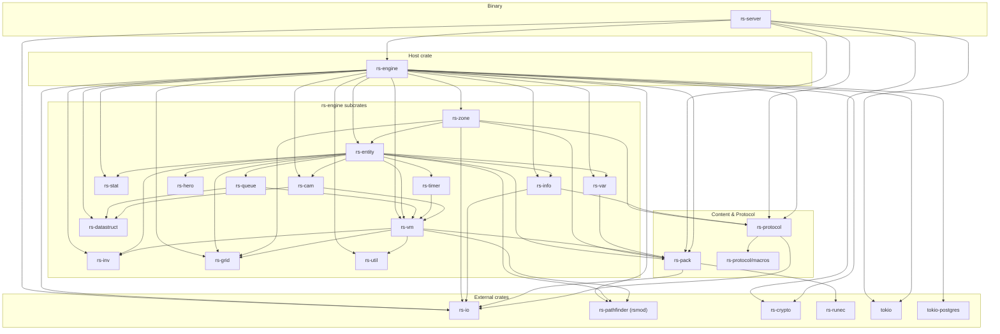

#### Reading the graph

- **`rs-server` is the only crate that touches `tokio` accept/listen and the only entry point.** Its dependencies are
  deliberately thin (`rs-server/Cargo.toml:13-33`): `rs-engine`, `rs-protocol`, `rs-pack`, `rs-io`, `rs-crypto`, plus
  the async/TUI stack (`tokio`, `tracing*`, `tokio-tungstenite`, `futures-util`, `sailfish`, `ratatui`, `crossterm`,
  `sysinfo`, `notify`, `clap`, `rand`). It depends on `rs-engine` for the world and on `rs-pack` only to call `pack_all`
  at boot. See [§25](part-08-runtime-and-host.md#sec-25).
- **`rs-engine` is the convergence hub.** It pulls in **all** of `rs-cam`, `rs-datastruct`, `rs-entity`, `rs-grid`,
  `rs-inv`, `rs-vm`, `rs-zone`, `rs-var`, `rs-stat`, `rs-info`, `rs-util` plus `rs-pack`, `rs-protocol`, `rs-crypto`,
  `rs-io`, `rs-pathfinder` (under the import name `rsmod`), and the async crates `tokio`, `tokio-postgres`, `argon2`,
  `num_enum`, `rustc-hash` (`rs-engine/Cargo.toml:9-32`). It is the *only* subsystem that holds the `tokio-postgres` and
  `argon2` edges — persistence and password hashing live exclusively here (
  see [§22](part-07-content-persistence-and-distribution.md#sec-22)).
- **`rs-entity` is the second-densest node.** It depends on twelve crates (`rs-entity/Cargo.toml:9-22`): `rs-cam`,
  `rs-grid`, `rs-hero`, `rs-info`, `rs-inv`, `rs-pack`, `rs-pathfinder`, `rs-queue`, `rs-timer`, `rs-var`, `rs-vm`,
  `rs-stat`. This reflects that a `Player`/`Npc` *aggregates* every per-entity subsystem (its stats, vars, timers,
  queues, inventory, hero list, camera, info masks, pathing). Notably `rs-entity` depends on `rs-vm` (entities own
  `ScriptState`-adjacent data and interaction targets), so the dependency runs entity → vm, not the reverse.
- **`rs-vm` sits below entities.** Its only edges are `rs-grid`, `rs-inv`, `rs-pack`, `rs-pathfinder`, `rs-util` (
  `rs-engine/rs-vm/Cargo.toml:9-19`). The VM does **not** depend on `rs-entity`; instead it defines the `ScriptEngine`/
  `ScriptPlayer`/`ScriptNpc` *traits* that `rs-engine` implements, inverting the dependency so opcode handlers reach
  world state through trait objects resolved via the `with_engine` thread-local bridge rather than through a concrete
  entity type. This is the keystone that breaks the entity↔vm cycle (
  see [§13](part-04-the-runescript-engine.md#sec-13)).
- **The pure leaves** are `rs-grid`, `rs-inv`, `rs-datastruct`, `rs-stat`, `rs-hero`, and `rs-util`, which have **no
  internal dependencies at all** (their manifests carry no `[dependencies]` section or only external ones). These are
  the foundation: packed coordinates, the flat inventory, the intrusive containers, the stat arrays, the hero
  leaderboard, and shared helpers. `rs-cam` is nearly a leaf (only `rs-datastruct` + `rs-vm`,
  `rs-engine/rs-cam/Cargo.toml:9-12`).
- **`rs-pack` is the content trust boundary.** It depends only on `rs-io` (byte cursor) and `rs-runec` (RuneScript
  compiler) plus tooling (`rs-engine/../rs-pack/Cargo.toml:16-26`: `clap`, `anyhow`, `tracing*`, `num_enum`,
  `rustc-hash`, `image`). Many subsystems depend *on* `rs-pack` (engine, vm, entity, zone, var) because they read static
  cache definitions; nothing in `rs-pack` depends back into the engine, keeping content decode acyclic.
- **`rs-protocol` is the wire trust boundary.** It depends on `rs-io` and the proc-macro crate `rs-protocol-macros` (
  `rs-protocol/Cargo.toml:10-13`), nothing else. `rs-info`, `rs-zone`, `rs-engine`, and `rs-server` consume it.
  Crucially `rs-protocol` carries **no game logic** — it is encode/decode only (
  see [§19](part-06-networking-and-the-wire.md#sec-19)).
- **`rs-io` is the universal byte primitive.** It is the lowest external dependency, pulled by `rs-protocol`, `rs-info`,
  `rs-zone`, `rs-pack`, `rs-engine`, and `rs-server` — wherever bytes are read or written, `rs-io::Packet` is the
  cursor.

The graph is a **strict DAG**: every cycle the reference server tolerates (entities referencing the VM that references
entities) has been broken by trait inversion (`rs-vm` defines traits, `rs-engine` implements them) or by routing through
`rs-pack`/`rs-grid` leaves. This is enforced by Cargo — a dependency cycle between path crates fails to compile — so the
acyclic structure is a *checked* invariant, not a convention.

### The Layered Runtime Architecture

The crate graph is a build-time view. At runtime the system stratifies into five layers with a single hard rule: **only
the world task ever touches `Engine`**, and it communicates with every other thread exclusively through channels
carrying owned buffers. This is what makes the single-threaded tick deterministic and wall-clock-bounded despite a
multi-threaded host.

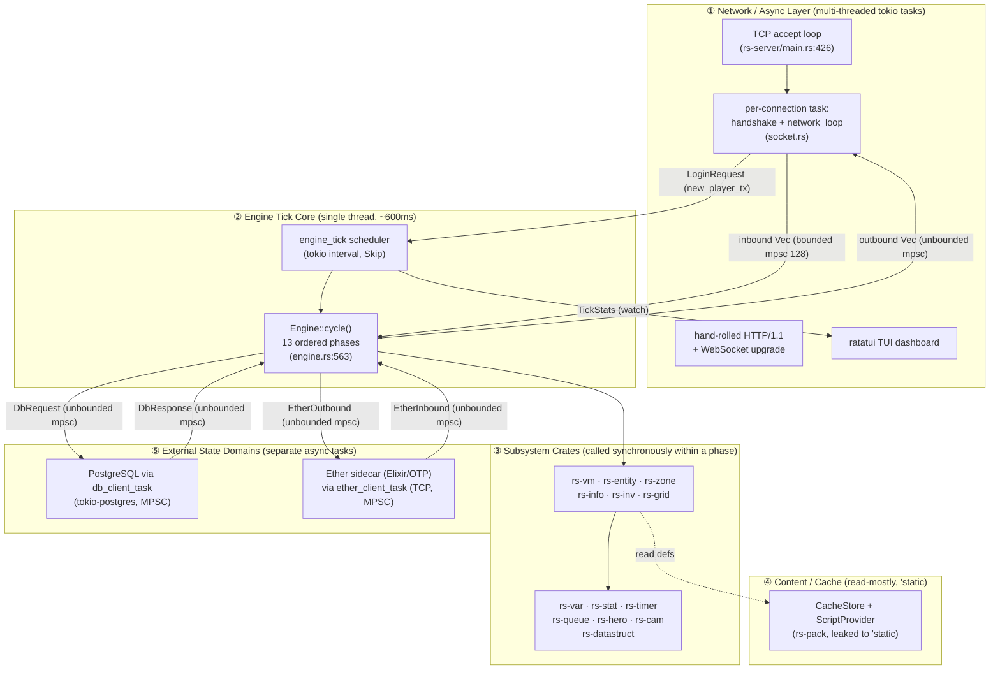

**Layer ① — Network / async.** One `tokio` task per connection runs `handshake` then `network_loop` (
`rs-server/src/socket.rs`). The accept loop sets `TCP_NODELAY` (`main.rs:428`) and spawns the per-connection task. These
tasks never see `Engine`; they push inbound bytes into a **bounded** mpsc (`INBOX_CAPACITY = 128`, which is the
backpressure policy) and receive outbound bytes from an **unbounded** mpsc. A successful handshake sends exactly one
`LoginRequest` over `new_player_tx` — the sole point at which a `ClientHandle` crosses into the engine. The same layer
hosts the hand-rolled HTTP/1.1 service (serving the web client and cache archives) and the ratatui TUI.
See [§24](part-08-runtime-and-host.md#sec-24) and [§25](part-08-runtime-and-host.md#sec-25).

**Layer ② — Engine tick core.** `engine_tick` (spawned at `main.rs:379`) drives `Engine::cycle()` on a
`tokio::time::interval` at 600 ms with `MissedTickBehavior::Skip` and a `watch`-channel clock-rate control. `cycle()` (
`engine.rs:563`) runs the 13 phases in fixed order — world, input, npcs, players, logouts, autosave, logins, ether,
saves, zones, info, out, cleanup (`engine.rs:582-594`) — each wrapped in the `phase!` macro's
`catch_unwind(AssertUnwindSafe(...))` panic boundary, then advances `engine.clock` once. The engine never `.await`s I/O;
it drains every channel with non-blocking `try_recv`. See [§5](#sec-05) and [§6](#sec-06).

**Layer ③ — Subsystem crates.** These are *called*, never *spawned*. Within a phase the engine invokes `rs-vm` to run
scripts, mutates `rs-entity` state, queues `rs-zone` events, encodes `rs-info` blocks, edits `rs-inv` containers, all
synchronously on the world thread. The const-generic and packed-integer designs in these crates (`Stats<N>`, `CoordGrid`
u32, `Loc` u128, `Obj` u64) exist precisely so this synchronous hot path stays cache-resident.

**Layer ④ — Content / cache.** `pack_all` compiles all content in memory at boot and the resulting `CacheStore` is
leaked to `'static` via `Box::into_raw` (`main.rs:288-289`). Subsystems read definitions through `&'static CacheStore`
while the raw `*mut CacheStore` is retained for in-place hot reload under the single-threaded invariant.
See [§21](part-07-content-persistence-and-distribution.md#sec-21).

**Layer ⑤ — External state domains.** The database (`db_client_task`, spawned `main.rs:345`) and the ether sidecar (
`ether_client_task`, spawned `main.rs:326`) run as independent async tasks. They exchange owned messages with the engine
over unbounded MPSC channels (`DbRequest`/`DbResponse`, `EtherOutbound`/`EtherInbound`), so the 600 ms loop never blocks
on Postgres latency or BEAM round-trips. See [§22](part-07-content-persistence-and-distribution.md#sec-22)
and [§23](part-07-content-persistence-and-distribution.md#sec-23).

The asymmetry between **bounded inbound** (128) and **unbounded outbound** channels is a deliberate backpressure design:
a slow or flooding client is throttled at ingest so it cannot bloat engine memory, while the engine itself must never
block when emitting, so its sends are unbounded and drained by the network tasks at their own pace.

### End-to-End Data Flow: A Client Action

The following sequence traces a single world-target action (e.g. clicking an NPC to attack, or an `oploc`-style "use
option on object"). It shows the full journey **bytes → decode → handler → script/engine mutation → zone/info → encode →
bytes**, and crucially shows that a world-target click does *not* execute immediately: it arms an *approach interaction*
in the input phase, which the *player phase* later resolves via pathfinding and trigger dispatch, with the results
surfacing in *zone* and *info* phases of the **same or a later** tick.

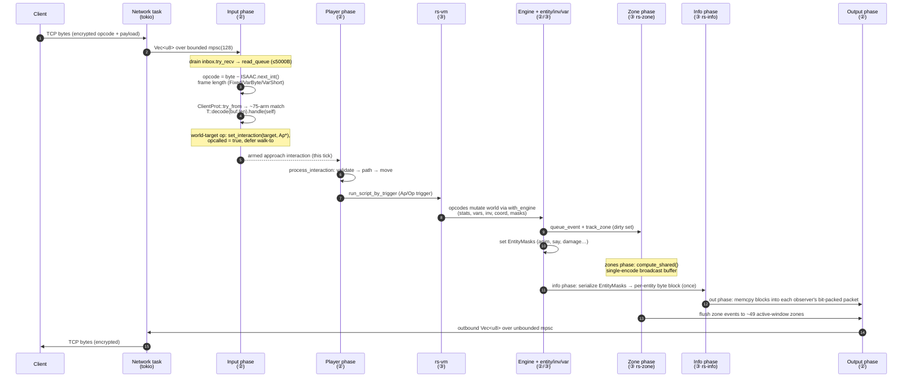

Key points the diagram encodes (all detailed
in [§20](part-06-networking-and-the-wire.md#sec-20), [§15](part-04-the-runescript-engine.md#sec-15), [§10](part-03-spatial-world-and-entities.md#sec-10), [§18](part-06-networking-and-the-wire.md#sec-18)):

- **Decode is ISAAC-whitened and frame-aware.** The opcode is recovered as
  `wire_byte.wrapping_sub(isaac_decode.next_int() as u8)`, then `ClientProt::try_from` selects one of ~75 match arms;
  frame size (Fixed / VarByte / VarShort) determines length parsing. Unknown bytes return `Err(())`.
- **Two handler families.** *Immediate* handlers (`opheld`, `inv_button`, `if_button`) run a script synchronously inside
  the input phase. *Approach* handlers (world-target `oploc`/`opnpc`/`opobj`/`opplayer` + T/U variants) only **arm** an
  interaction (`set_interaction`, `opcalled = true`) and defer the walk-to and trigger to the *player phase* — this is
  why the diagram routes them IN → PL.
- **Mutation is funnelled through the VM bridge.** Opcode handlers reach world state through `with_engine` thread-locals
  exposing the `ScriptEngine`/`ScriptPlayer`/`ScriptNpc` traits, so a handler signature stays parameter-free while still
  mutating the live `Engine`.
- **Producer/consumer split for output.** The *info* phase serializes each entity's `EntityMasks` into a reusable byte
  block **exactly once** (O(entities)); the *output* phase then `memcpy`s those pre-coalesced blocks into each
  observer's bit-packed packet (O(observers × viewport) but cheap per entry). Zone events are likewise pre-encoded once
  into a shared buffer (`compute_shared`) and flushed only to the ~49 zones in each player's 7×7 active window. This
  single-encode-broadcast contrasts sharply with the reference server's per-player re-walk.

### Login Flow: Network → Engine → Ether + DB → Session

Login is intrinsically asynchronous and spans every layer. The handshake validates and authenticates synchronously on
the network task, but *completing* a login requires two independent async confirmations — cross-world ether
authorisation and database credential/profile resolution — that the engine accumulates across ticks in a `PendingLogin`
before promoting the connection to a live `ActivePlayer`.

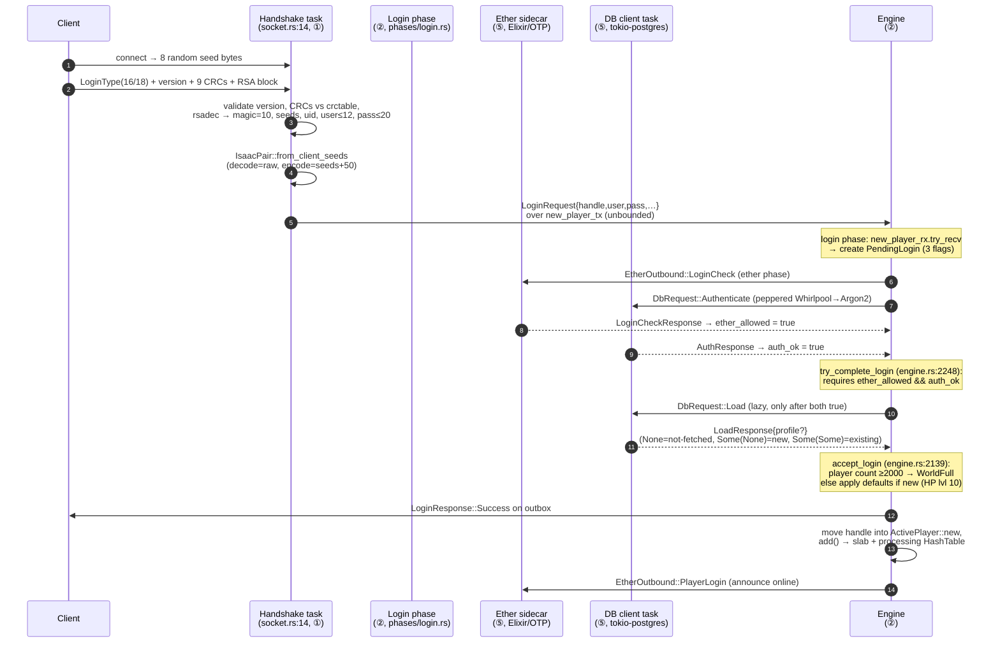

The mechanics, grounded in source:

- **Handshake (Layer ①).** `socket.rs:14` writes 8 random seed bytes, reads `LoginType` (New=16 / Reconnect=18),
  validates payload length, version (mismatch → `RuneScapeUpdated`), and 9 cache CRCs against `cache.crctable`; `rsadec`
  reveals `magic=10`, 4 seed words, the uid, username (≤12) and password (≤20). It derives
  `IsaacPair::from_client_seeds` (decode = raw seeds, encode = seeds **+50**), calls `create_io` to build the four
  channel pairs, and emits a single `LoginRequest` over `new_player_tx`.
- **Three-flag accumulation (Layer ②/⑤).** The login phase drains `new_player_rx.try_recv` and creates a `PendingLogin`
  tracking `ether_allowed`, `auth_ok`, and a **tri-state** `profile: Option<Option<PlayerProfile>>` (`None` = not
  fetched, `Some(None)` = new player, `Some(Some)` = existing). The ether phase pushes an `EtherOutbound::LoginCheck`
  and the DB task verifies credentials (two-stage peppered Whirlpool→Argon2). Their responses set the two booleans on
  later ticks.
- **`try_complete_login` (`engine.rs:2248`).** This gate requires `ether_allowed && auth_ok`; only then does it *lazily*
  issue `DbRequest::Load` if the profile is still unfetched, and once the profile arrives it calls `accept_login`.
- **`accept_login` (`engine.rs:2139`).** Rejects with `WorldFull` if the active count is ≥2000; otherwise detects a new
  player *by content* (all 21 XP == 0), applies new-player defaults (Hitpoints set to level 10), sends
  `LoginResponse::Success` on the outbox, moves the `ClientHandle` into `ActivePlayer::new`, and inserts the player into
  the fixed-capacity slab plus the processing `HashTable`. From the next tick the player is iterated by the
  input/player/info/output phases like any other.

The engineering payoff of this design is that **login latency is fully decoupled from the tick budget**. Postgres and
the BEAM mesh can take hundreds of milliseconds; the engine simply observes the boolean flags flip on whichever tick the
responses land, never stalling the 600 ms heartbeat. This is the same channel-and-accumulate pattern used for saves and
ether messaging — the unifying architectural motif that lets a single-threaded simulation coexist with a multi-threaded,
network- and database-bound host.

### Cross-Subsystem Consistency Notes

- The **`with_engine` bridge** (defined in `rs-vm`, installed once per `cycle` and again per script invocation) is what
  unifies layers ② and ③: it lets `rs-vm` opcode handlers mutate `rs-engine` state without `rs-engine` and `rs-vm`
  having a cyclic crate dependency. The trait-based inversion in `rs-vm`'s manifest (no `rs-entity` edge) is the
  build-time half of this story.
- **`rs-io::Packet`** is the single byte-cursor type threading through decode (Layer ①), zone/info encode (Layer ③),
  persistence blobs (Layer ⑤), and cache decode (Layer ④). Its presence in five manifests is why wire/disk/cache formats
  stay byte-consistent.
- The **`panic = "unwind"`** release profile (`.cargo/config.toml:16`) is an architecture-level dependency, not a
  subsystem detail: the `catch_unwind` panic boundaries in every phase (Layer ②) and the per-entity emergency-removal
  nets depend on unwinding being preserved through `lto = "fat"`, `codegen-units = 1`, `opt-level = 3`, `strip = true`,
  `overflow-checks = false`.

<sub>[↑ Back to top](#top)</sub>


---

<a id="sec-05"></a>

## 5. The Game Tick — Cycle Orchestration

The beating heart of rs-engine is a single function: `Engine::cycle` (`rs-engine/src/engine.rs:563`). Once every game
tick — nominally every 600 milliseconds — the world-tick task invokes `cycle`, which drives the entire simulation
forward by exactly one quantum: it reads all queued client input, advances every NPC and player, materializes world
changes, computes the per-client view of the world, serializes it to the wire, and resets transient state for the next
tick. Everything the server does is, ultimately, a side effect of one `cycle` call.

This section is an exhaustive reference for that orchestration layer: the heartbeat scheduler that calls `cycle`, the
thirteen ordered phases and *why* they run in that order, the `phase!` timing-and-panic-isolation harness, the
fatal-panic emergency recovery, clock advance, and the `TickStats` telemetry that is published every tick. It
deliberately treats each phase as a black box (their internals are documented in their own sections) and focuses on the
*orchestration*: sequencing, isolation, timing, and lifecycle.

### Design philosophy: deterministic single-threaded simulation

rs-engine inherits its execution model wholesale from the classic TypeScript RuneScape 2 reference servers (the
*LostCity* / *2004scape* lineage): a single thread owns all mutable world state and processes the world in a fixed,
ordered sequence of phases per tick. There is no locking, no parallelism, no message-passing *within* a tick. This is a
deliberate and load-bearing design decision, not an accident of porting.

The rationale is threefold:

1. **Determinism.** A single thread visiting entities in a stable order produces byte-identical output for identical
   input. This is essential both for protocol fidelity (the original client expects a specific update ordering) and for
   debuggability — a desync is reproducible.
2. **Zero synchronization overhead.** With no locks or atomics on the hot path, the engine can touch shared structures (
   `ZoneMap`, renderers, inventories, the collision map) through raw `&mut` references. The cost of the classic "actor
   per entity" or "lock per zone" model — contention, cache-line bouncing, false sharing — is simply absent.
3. **Memory-layout control.** Because exactly one thread accesses `Engine`, fields can be laid out for cache locality
   and accessed via a thread-local raw pointer (`with_engine`, below) rather than threaded through every call as an
   explicit argument.

The `Engine` struct itself encodes this contract in its type signature:

```rust
// rs-engine/src/engine.rs:420
unsafe impl Send for Engine {}
```

`Engine` is `Send` (so it can be *moved* into the tokio task that owns it) but is deliberately **not** `Sync` — it must
never be shared across threads. The SAFETY comment at `engine.rs:416` states this explicitly: "Engine is only accessed
from the single world-tick tokio task." The project's standing engineering guidance reinforces this: parallelising the
tick (e.g. rayon over `outputs()`) was evaluated as the single largest throughput win at 2000 players and **deliberately
declined**, because the entire design — thread-local accessors, shared `&mut` renderers/zones/invs — assumes
single-threaded access.

### The heartbeat: `engine_tick` scheduler

`cycle` does not schedule itself. The driving loop lives in the binary crate, `engine_tick` (
`rs-server/src/main.rs:696`), spawned as a tokio task at startup (`main.rs:379`). It is the only caller of
`Engine::cycle`.

```rust
// rs-server/src/main.rs:701-730 (condensed)
let mut interval = time::interval(Duration::from_millis(600));
interval.set_missed_tick_behavior(time::MissedTickBehavior::Skip);
loop {
tokio::select ! {
_ = interval.tick() => {
if engine.cycle() {            // fatal-panic signalled
error ! ("Engine shutting down due to fatal phase panic");
engine.ether_tx = None;    // close outbound channels
engine.db_tx = None;
while engine.db_rx.recv().await.is_some() {} // drain saves
return;                    // task exits -> server stops
}
},
Some((store, scripts)) = reload_rx.recv() => { /* hot-reload */ }
Ok(()) = clock_rate_rx.changed() => { /* re-rate */ }
}
}
```

Three things deserve emphasis:

- **`MissedTickBehavior::Skip`.** A tokio `Interval` would, by default, attempt to "catch up" if a tick overran its
  budget, firing back-to-back ticks until it caught up to wall-clock. That would be catastrophic for a game server: an
  overloaded tick that took 1200ms would immediately trigger two more ticks with no gap, compounding the overload.
  `Skip` instead drops the missed deadlines and resumes on the next aligned boundary, trading temporal accuracy for
  stability under load. Game logic measures time in *ticks*, not wall-clock, so a skipped real-time deadline does not
  corrupt game state — it only means players experience a momentary slowdown.
- **The boolean return of `cycle` is a fatal-shutdown signal.** `cycle` returns `true` only on a fatal phase panic (see
  below). The scheduler reacts by tearing the channels down and draining outstanding DB saves before exiting — a
  graceful, durability-preserving shutdown rather than a hard crash.
- **The same `select!` arm-set handles hot-reload and clock-rate changes**, so asset reloads and speed changes are
  interleaved *between* ticks, never during one.

#### Clock rate as a watch channel

The tick interval is not a constant. `Engine` holds a `clock_rate_tx: Sender<u64>` (`engine.rs:398`), the sending half
of a tokio `watch` channel created in `Engine::new` (`engine.rs:479`) with an initial value of `600`. The receiving
half (`clock_rate_rx`) is returned from `Engine::new` and handed to `engine_tick`. `Engine::set_clock_rate` (
`engine.rs:675`) sends a new interval in milliseconds:

```rust
// rs-engine/src/engine.rs:675-677
pub fn set_clock_rate(&self, ms: u64) {
    let _ = self.clock_rate_tx.send(ms);
}
```

When the scheduler observes `clock_rate_rx.changed()`, it rebuilds the `Interval` at the new rate (`main.rs:724-728`). A
`watch` channel is the right primitive here: it is lossy-but-latest (only the most recent value matters, intermediate
values can be coalesced) and the receiver can cheaply poll the current value. This mechanism backs developer/admin speed
controls — e.g. accelerating ticks for testing, or throttling under emergency load — without touching the tick logic
itself. The original Java server hard-codes a 600ms loop; expressing the rate as a runtime-tunable channel is a modest
improvement in operability.

### `cycle`: anatomy of one tick

`cycle` is structured as: (1) install the global engine pointer, (2) run thirteen phases under a timing-and-panic
harness, (3) advance the clock, (4) branch to fatal recovery if needled, otherwise (5) publish telemetry. The full flow:

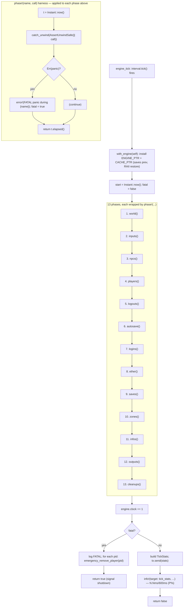

#### Installing the global engine: `with_engine`

The very first thing `cycle` does is capture a raw self-pointer and wrap the entire body in `with_engine`:

```rust
// rs-engine/src/engine.rs:563-566
pub fn cycle(&mut self) -> bool {
    let engine = self as *mut Engine;
    with_engine(self, || {
        let engine = unsafe { &mut *engine };
        ...
```

`with_engine` (`rs-engine/rs-vm/src/engine.rs:1671`) installs `self` (and its `CacheStore`) into two thread-local `Cell`
s, `ENGINE_PTR` and `CACHE_PTR` (`rs-vm/src/engine.rs:1620-1623`):

```rust
// rs-engine/rs-vm/src/engine.rs:1671-1685 (condensed)
pub fn with_engine<E: ScriptEngine, R>(engine: &mut E, f: impl FnOnce() -> R) -> R {
    let cache = engine.cache() as *const CacheStore;
    let ptr = engine as *mut E as *mut ();
    let prev_engine = ENGINE_PTR.get();
    let prev_cache = CACHE_PTR.get();
    set_ptrs(ptr, cache);
    struct Restore(*mut (), *const CacheStore);
    impl Drop for Restore { fn drop(&mut self) { set_ptrs(self.0, self.1); } }
    let _guard = Restore(prev_engine, prev_cache);
    f()
}
```

This is the mechanism by which the *entire* call tree beneath `cycle` — every phase, every opcode handler, every
utility — can reach world state via the free functions `engine()` / `engine_mut()` (`engine.rs:67`, `:91`) and
`cache()` (`rs-vm/src/engine.rs:1704`) **without threading an `&mut Engine` argument through hundreds of signatures**.
The RuneScript VM in particular is full of opcode handlers that need ambient access to the world; passing the engine
explicitly would pollute every signature. The thread-local indirection is the price paid for that ergonomics, and it is
sound *because* the engine is single-threaded: there is exactly one writer, and the pointer is only ever read on the
same thread that installed it.

Key properties of `with_engine`:

- **Save/restore via RAII.** The previous pointer values are captured and restored by the `Restore` drop guard, even on
  unwind. This makes `with_engine` **re-entrant**: scripts that themselves call back into `runescript_vm_execute` (which
  calls `with_engine` again, `engine.rs:789-792`) nest correctly, and the outer pointer is restored when the inner scope
  ends. During the top-level `cycle`, the "previous" values are null, so they are restored to null when the tick ends —
  outside a tick, `engine()` is a null-pointer deref (UB in release, a `debug_assert` failure in debug; see
  `rs-vm/src/engine.rs:1780`).
- **Type erasure.** The pointer is stored as `*mut ()` and recovered as the concrete `Engine` type by
  `engine_typed::<Engine>()` (`engine.rs:67-69`). The `unsafe impl` of `ScriptEngine for Engine` is what makes the
  generic accessor monomorphise to the right type. Calling with a mismatched `E` is UB — but there is only ever one
  engine type in this binary.
- **Note the double install.** `cycle` calls `with_engine` once around the whole tick, and the per-script
  `runescript_vm_execute` calls it *again* around each VM invocation. The inner install is redundant during a tick (the
  pointer is already set) but harmless (it installs the same pointer and restores it), and is necessary for script
  invocations that originate *outside* `cycle` (e.g. `reload_assets` broadcasts, `main.rs:720`). The cost is two
  thread-local writes per script — negligible.

#### The `phase!` macro: timing + panic isolation

Each of the thirteen phases is invoked through a single hygienic macro, `phase!`, defined inline inside `cycle` (
`engine.rs:571-580`):

```rust
// rs-engine/src/engine.rs:571-580
macro_rules! phase {
    ($name:expr, $call:expr) => {{
        let t = Instant::now();
        if let Err(panic) = catch_unwind(AssertUnwindSafe(|| { $call; })) {
            error!("FATAL panic during {} phase: {}", $name, panic_message(&panic));
            fatal = true;
        }
        t.elapsed()
    }};
}
```

The macro does two jobs at once:

1. **Timing.** It brackets the phase call with `Instant::now()` / `t.elapsed()` and *returns* the `Duration`. Each phase
   site binds that duration to a named local (`let world = phase!("world", engine.world());`, `engine.rs:582`), which is
   later read into `TickStats`. Timing every phase, every tick, costs two `Instant::now()` calls per phase (26 per
   tick) — cheap, and the visibility it buys is invaluable for diagnosing which phase is eating the budget.
2. **Panic isolation.** It wraps the call in `std::panic::catch_unwind(AssertUnwindSafe(...))`. If the phase panics, the
   panic is *caught* at the phase boundary, logged as `FATAL panic during {name} phase`, and a `fatal` flag is set — but
   the remaining phases still run, the clock still advances, and the recovery path (below) executes in an orderly
   fashion rather than the whole process aborting.

`AssertUnwindSafe` is required because the closure captures `&mut Engine` (via the `engine` raw-deref), and `&mut T` is
not `UnwindSafe` by default — the standard library worries that a panic could leave the borrowed state in a torn,
inconsistent condition. Here the assertion is justified by design: the recovery path *expects* possibly-inconsistent
state and repairs it by removing the offending entity (or, at the tick level, evacuating all players). `panic_message` (
`rs-engine/src/phases/shared.rs:710`) extracts a human-readable string from the type-erased `Box<dyn Any>` payload by
attempting downcasts to `&str` then `String`, falling back to `"unknown panic"`:

```rust
// rs-engine/src/phases/shared.rs:710-718
pub(crate) fn panic_message(panic: &Box<dyn std::any::Any + Send>) -> Cow<'_, str> {
    if let Some(s) = panic.downcast_ref::<&str>() { Cow::Borrowed(*s) } else if let Some(s) = panic.downcast_ref::<String>() { Cow::Borrowed(s.as_str()) } else { Cow::Borrowed("unknown panic") }
}
```

##### Why panic isolation matters — and the release-profile dependency

A RuneScript-driven game server runs an enormous amount of content code: thousands of scripts, edge cases, off-by-ones,
and integer overflows that no test suite fully covers. In the original Java server an uncaught exception in one player's
processing is caught per-entity and that player is booted; the world survives. rs-engine reproduces that resilience with
`catch_unwind`, at two granularities:

- **Phase granularity** (`phase!` in `cycle`): a coarse safety net. If a panic escapes *past* a phase's own per-entity
  handling, the phase boundary catches it and triggers full evacuation.
- **Entity granularity** (inside the phases): the hot phases that iterate over entities — `inputs` (
  `phases/input.rs:50`), `npcs` (`phases/npc.rs:61`), `players` (`phases/player.rs:54`), `infos` (`phases/info.rs:38`),
  `outputs` (`phases/output.rs:42`) — each wrap their per-entity loop in their *own* `catch_unwind`, and on a caught
  panic call `emergency_remove_player(pid)` / `emergency_deactivate_npc(nid)`, then resume the loop from the *next*
  entity (`start += 1`). One bad player or NPC is surgically removed; the other 1999 keep ticking, in the very same
  tick.

This entire mechanism is silently dead under `panic = "abort"`: an aborting panic terminates the process before
`catch_unwind` can run, turning every safety net into a no-op. The release profile therefore **must** keep
`panic = "unwind"` — and it does (`.cargo/config.toml:16`), alongside `lto = "fat"`, `codegen-units = 1`,
`opt-level = 3`, `strip = true`, and `overflow-checks = false`. This is a non-obvious coupling: a well-meaning attempt
to shave binary size or gain a sliver of speed by switching to `panic = "abort"` would silently convert a fault-tolerant
server into a fragile one where a single content bug crashes the entire world. The unwind requirement is a hard
constraint, not a preference.

The per-entity loops use a reusable, *owned* pid/nid snapshot to make this safe. `take_pids`/`put_pids` (
`engine.rs:238-248`) lend out a `Vec<u16>` filled from the processing list; the loop iterates the snapshot, not the live
structure, so an emergency removal *during* iteration cannot invalidate the iterator. The buffer is returned for reuse
to avoid a per-tick allocation. This is a small but characteristic rs-engine pattern: own a stable snapshot, mutate the
live structure freely, recycle the allocation.

### The thirteen phases, in order, and why that order

`cycle` runs the phases in exactly this sequence (`engine.rs:582-594`):

| #  | Phase        | Call site           | Responsibility (one line)                                                   |
|----|--------------|---------------------|-----------------------------------------------------------------------------|
| 1  | **world**    | `engine.world()`    | Drain world-script queue, spawn delayed objs, run player-hunt acquisition   |
| 2  | **input**    | `engine.inputs()`   | Decode client packets, AFK roll, server-side pathing, zone/collision update |
| 3  | **npcs**     | `engine.npcs()`     | NPC delay/resume/respawn, hunt, regen, AI timers/queues, movement           |
| 4  | **players**  | `engine.players()`  | Player delay/resume, queues, timers, interaction, movement                  |
| 5  | **logouts**  | `engine.logouts()`  | Finalise disconnects/voluntary logouts, run `Logout` trigger, save, remove  |
| 6  | **autosave** | `engine.autosave()` | Increment playtime; every 250 ticks persist all profiles                    |
| 7  | **logins**   | `engine.logins()`   | Accept new sessions, fire ether/DB auth, park pending logins                |
| 8  | **ether**    | `engine.ether()`    | Drain cross-world messages (friends/PMs/login-checks/resync)                |
| 9  | **saves**    | `engine.saves()`    | Drain DB responses (ready/auth/load/save-ack), complete logins              |
| 10 | **zones**    | `engine.zones()`    | Apply timed zone events; recompute encoded shared zone buffers              |
| 11 | **info**     | `engine.infos()`    | Compute per-player/NPC info snapshots (appearance, movement masks)          |
| 12 | **out**      | `engine.outputs()`  | Encode + flush all per-client packets to the network                        |
| 13 | **cleanup**  | `engine.cleanups()` | Reset per-tick transient state; free despawned slots; restock shops         |

The ordering is not arbitrary; it is a dependency-respecting pipeline that mirrors the original Java server's
`World.cycle` structure. The governing principle is: **mutate the world fully before observing it, and observe it fully
before transmitting it.**

- **World before entities (1 → 3,4).** The world phase drains the world-script queue and the delayed-obj queue, and —
  critically — runs *player-type hunts* (`process_npc_hunt_players`, `phases/world.rs:140`). Player hunts are pulled
  forward into the world phase, *before* per-NPC processing, "so that every NPC sees a consistent snapshot of player
  positions before individual NPC processing begins" (`phases/world.rs:131-135`). This is a determinism guarantee: all
  NPCs hunt against the same frozen view of player positions, rather than each NPC seeing positions partially mutated by
  earlier NPCs in the same tick.
- **Input before entity processing (2 → 3,4).** Client packets are decoded first so that the movement/interaction state
  they set (paths, op-calls, target selection) is in place before `npcs()` and `players()` act on it. The input phase
  also performs server-side pathfinding (`post_process`, `phases/input.rs:128`) so that the players phase finds queued
  waypoints ready to consume.
- **NPCs before players (3 → 4).** This matches the reference server's ordering. NPCs resolve their AI and movement
  first; players then process interactions and movement against NPC positions. (The relative order is a fidelity
  choice — the original server processes NPC tick logic ahead of player movement so that, e.g., aggressive NPCs and
  combat resolve in a fixed order.)
- **Lifecycle housekeeping in the middle (5 → 9).** Logouts run after entity processing (a player who died or finished a
  queued action this tick can now be cleanly removed), and *before* logins, so a slot freed by a logout can be reused by
  a login in the same tick. Autosave (6) increments playtime every tick and bulk-saves on the interval. Logins (7),
  ether (8), and saves (9) are the asynchronous-I/O integration points: they drain inbound channels (new connections,
  cross-world messages, DB responses) and advance the multi-step login state machine. Their placement after entity
  processing but before zone/info/out means any state they mutate (a newly-logged-in player) is correctly reflected in
  this tick's outbound view.
- **Zone → info → out (10 → 11 → 12).** This is the rigid observe-then-transmit ordering. The zones phase first
  *applies* all due timed events (obj reveals/deletes/respawns, loc reverts) and then *recomputes* the encoded
  shared-zone buffers for every dirty zone (`phases/zone.rs:27-30`). The info phase computes per-entity info snapshots (
  it begins by resetting all snapshots to `ABSENT`, `phases/info.rs:27-28`). The out phase encodes player-info,
  NPC-info, map rebuilds, zone updates, inventory deltas, and stat deltas into each client's buffer and flushes it (
  `phases/output.rs:9-21`). Each stage strictly consumes the output of the previous: out reads the snapshots info
  produced, which describe the world zones produced. Reordering any of these three would transmit a stale or half-built
  view.
- **Cleanup last (13).** Cleanup is the symmetric counterpart to the per-tick mutations: it drains the dirty-zone
  tracking set and resets those zones (`reset_zones`, `phases/cleanup.rs:61`), removes single-tick renderer entries (
  `reset_renderers`), resets per-tick pathing flags on every player and NPC (`reset_players`/`reset_npcs`), frees the
  slots of despawned `Despawn`-lifecycle NPCs (`remove_despawned_npcs`), and ticks shop restock timers (`restock_invs`).
  It runs *after* out precisely because the transient state it clears (dirty inventory slots, movement deltas, temporary
  renderer entries) must survive long enough to be transmitted. The ordering within cleanup is itself load-bearing:
  `reset_shared_invs` runs *before* `restock_invs`, because restocking re-dirties inventories and those new dirty marks
  must survive into the next tick's output (`phases/cleanup.rs:158-167`).

#### Phase-by-phase, in brief

- **world** (`phases/world.rs:31`): `process_world_queue` decrements each queued world script's delay and runs those
  reaching zero, redispatching `WorldSuspended`/`Suspended`/`NpcSuspended` results; `process_obj_delayed_queue` spawns
  timed objects; `process_npc_hunt_players` runs player-target hunts against a frozen position snapshot.
- **input** (`phases/input.rs:46`): per-player (panic-isolated) — record previous coord, AFK roll (`check_afk`, once per
  500 ticks, `phases/input.rs:102`), `decode()` client packets, `post_process` server-side pathing, then
  `check_zones_and_collision` to migrate the player between zones and update the collision map.
- **npcs** (`phases/npc.rs:57`): per-NPC (panic-isolated) — check delay, resume `NpcSuspended` scripts, respawn dead
  NPCs and fire `ai_spawn`, revert temporary type changes, then (if alive and not delayed) hunt, regen, AI timers,
  script queue, face-entity, and movement/mode AI; finally zone/collision update.
- **players** (`phases/player.rs:50`): per-player (panic-isolated) — check delay, resume `Suspended` scripts (with
  protect+force), process primary/weak queues, normal+soft timers, engine queue, face-entity, interaction/movement,
  zone/collision update.
- **logouts** (`phases/logout.rs:50`): poll each player's `disconnect_rx`; honour logout-prevention windows (e.g. in
  combat); for players cleared to leave, close modals, run the `Logout` trigger, persist via `DbRequest::Save`, notify
  ether via `EtherOutbound::PlayerLogout`, and `remove_player`.
- **autosave** (`phases/autosave.rs:31`): increment non-bot `playtime` every tick; every `AUTOSAVE_INTERVAL = 250`
  ticks (~150s) bulk-extract and save every non-bot profile for crash durability.
- **logins** (`phases/login.rs:41`): drain `new_player_rx`; reject if DB not ready or already logged in; otherwise fire
  `EtherOutbound::LoginCheck` + `DbRequest::Authenticate` and park a `PendingLogin`; expire entries older than
  `LOGIN_TIMEOUT_TICKS = 10`.
- **ether** (`phases/ether.rs:40`): drain up to `MAX_PLAYERS` inbound cross-world messages (cap prevents starvation) —
  friend/ignore-list updates, private messages, login-check responses, and ether-reconnect resync.
- **saves** (`phases/saves.rs:35`): drain DB responses — `DbReady`/`DbDisconnected` toggle `db_ready`, `AuthResponse`/
  `LoadResponse` advance pending logins toward completion, `SaveAck` deletes the local backup save on success.
- **zones** (`phases/zone.rs:27`): `process_pending_zone_events` (a `BTreeMap` `split_off` at `clock+1` selects all due
  events) then `compute_zone_shared` rebuilds encoded buffers for dirty zones.
- **info** (`phases/info.rs:26`): reset all player/NPC snapshots to `ABSENT`, then compute per-entity info (appearance
  rebuilds, reorientation, movement masks), per-entity panic-isolated.
- **out** (`phases/output.rs:38`): per-player, panic-isolated, the player is `take()`-n out of its slot for the duration
  of encoding and always restored. Encodes player-info, NPC-info, conditional map rebuild on level change, zone updates,
  inventory and stat deltas, AFK-zone tracking, then flushes the buffer to the network.
- **cleanup** (`phases/cleanup.rs:42`): reset dirty zones, remove temporary renderer entries, reset per-tick player/NPC
  pathing flags and clear dirty inventory sets, free despawned NPC slots, clear shared-inv change sets, and tick shop
  restock.

### Clock advance and the fatal-panic recovery path

After all thirteen phases return, the clock advances unconditionally:

```rust
// rs-engine/src/engine.rs:595
engine.clock += 1;
```

`Engine::clock` is a `u64` (`engine.rs:374`) — the monotonic tick counter that is the engine's sole notion of time.
Every scheduled event in the system is keyed off it: zone-event `BTreeMap` keys, respawn timers, autosave/login
timeouts, obj despawn clocks, AFK checks. It advances *exactly once per `cycle`*, after the phases and **before** the
fatal branch, so the clock value is consistent regardless of whether the tick succeeded or is about to evacuate.

A subtlety in telemetry: because the clock is already incremented, the published tick number is `engine.clock - 1` (
`engine.rs:614`, `:640`) — the tick that *just ran*, not the one about to run.

If any phase set `fatal` (a panic escaped a phase's own per-entity handling and was caught by `phase!`), `cycle` enters
emergency recovery (`engine.rs:597-605`):

```rust
// rs-engine/src/engine.rs:597-605
if fatal {
error!("Fatal phase panic detected -- emergency saving and removing all players");
let pids = engine.player_list.pids();
for pid in pids {
error!("emergency removing player {pid} due to fatal phase panic");
engine.emergency_remove_player(pid);
}
return true;
}
```

The philosophy is **durability over availability**: a phase-level panic means engine state is suspect, so rather than
risk corrupting saves by continuing, the engine snapshots and persists *every* online player, then signals shutdown.
`emergency_remove_player` (`engine.rs:1996`) is the last-resort persistence path: it extracts the player's profile,
serializes it to a binary blob, and fires a `DbRequest::Save` and an `EtherOutbound::PlayerLogout`, then calls
`remove_player` for full cleanup:

```rust
// rs-engine/src/engine.rs:1996-2018 (condensed)
pub fn emergency_remove_player(&mut self, pid: u16) {
    if let Some(active) = self.player_list.players[pid as usize].as_ref() {
        let user37 = active.uid().username37();
        let username = active.uid().username();
        if let Some(tx) = &self.db_tx {
            let profile = extract_profile(&active.player, self.cache);
            let binary = save_binary(&profile, self.cache);
            let _ = tx.send(DbRequest::Save {
                user37,
                username,
                profile: Box::new(profile),
                binary
            });
        }
        if let Some(tx) = &self.ether_tx {
            let _ = tx.send(EtherOutbound::PlayerLogout { user37 });
        }
    }
    self.remove_player(pid);
}
```

The `return true` propagates to `engine_tick`, which (as shown above) nulls `ether_tx`/`db_tx` to close the outbound
channels — signalling the background DB task to drain — then awaits `db_rx` until all saves are flushed before the task
exits (`main.rs:706-715`). The result is a clean, no-data-loss shutdown even from an unanticipated panic deep in content
code.

Note the two tiers of recovery and how they relate. The *common* case is the **entity-level** `catch_unwind` inside a
phase: it removes one player/NPC and the tick continues normally — `fatal` is never set, the server stays up. The
*fatal* tier is reached only when a panic escapes *past* a phase's own per-entity loop (e.g. a panic in `world()` or
`zones()`, which have no per-entity isolation, or a panic in the phase scaffolding itself). That coarser failure is
treated as unrecoverable, triggering the world-wide evacuate-and-shutdown. The same emergency-save routine (
`emergency_remove_player`) services both tiers — at the entity tier it is called for the single offender; at the fatal
tier it is called for every online player.

```mermaid
stateDiagram-v2
    [*] --> Running
    Running --> EntityPanic : per-entity catch_unwind fires (input/npcs/players/info/out)
    EntityPanic --> Running : emergency_remove/deactivate ONE entity, resume loop (fatal NOT set)
    Running --> PhasePanic : panic escapes a phase (caught by phase! macro)
    PhasePanic --> Fatal : fatal = true
    Fatal --> Evacuate : clock += 1; emergency_remove_player(ALL pids)
    Evacuate --> Shutdown : cycle returns true
    Shutdown --> Drain : engine_tick nulls db_tx/ether_tx, awaits db_rx drain
    Drain --> [*] : task returns, server stops
```

### Telemetry: `TickStats` and the `tick_stats` trace line

On the non-fatal path, `cycle` measures total cycle time and publishes a full breakdown. `start.elapsed()` (
`engine.rs:607`) captures end-to-end wall time; `player_count`/`npc_count` are read from the processing-list lengths (
`engine.rs:609-610`).

`TickStats` (`engine.rs:116-135`) is a flat, `Clone`/`Default`/`Debug` struct of `f64` millisecond timings — one field
per phase — plus `clock`, `total_ms`, `player_count`, and `npc_count`:

| Field                                                                                                                     | Meaning                                     |
|---------------------------------------------------------------------------------------------------------------------------|---------------------------------------------|
| `clock`                                                                                                                   | The tick that just ran (`engine.clock - 1`) |
| `total_ms`                                                                                                                | End-to-end cycle wall time                  |
| `player_count`, `npc_count`                                                                                               | Active entity counts this tick              |
| `world`, `input`, `npcs`, `players`, `logouts`, `autosave`, `logins`, `ether`, `saves`, `zones`, `info`, `out`, `cleanup` | Per-phase wall time (ms), one per phase     |

Each `f64` is computed from the corresponding `Duration` as `d.as_secs_f64() * 1000.0`. The struct is sent through
`tick_stats_tx` — an `Option<Sender<TickStats>>` over a tokio `watch` channel (`engine.rs:384`):

```rust
// rs-engine/src/engine.rs:612-632 (condensed)
if let Some(tx) = & engine.tick_stats_tx {
let _ = tx.send(TickStats {
clock: engine.clock - 1,
total_ms: cycle.as_secs_f64() * 1000.0,
player_count, npc_count,
world: world.as_secs_f64() * 1000.0, /* ...one field per phase... */
cleanup: cleanup.as_secs_f64() * 1000.0,
});
}
```

A `watch` channel is again the apt choice: a monitoring consumer (an admin dashboard or the project's terminal UI) only
cares about the *latest* tick's stats; if it falls behind it should skip to current, not replay history. The send is
best-effort (`let _ =`) — if no receiver is listening, the tick is unaffected. `tick_stats_tx` being `Option` allows the
engine to run head-less (e.g. in tests) with no telemetry consumer.

Independently of the channel, `cycle` emits a structured tracing line under the dedicated target `tick_stats` (
`engine.rs:634-658`):

```text
Tick 14320 | 3.42ms/600ms (0.6%) | players=187 npcs=4213 |
 world=0.12 logins=0.00 logouts=0.01 autosave=0.00 input=0.34 npcs=1.05
 players=0.88 zones=0.07 ether=0.00 saves=0.00 info=0.41 clients_out=0.51 cleanup=0.03ms
```

The headline metric is **budget utilisation**: `(cycle.as_secs_f64() / 0.6) * 100.0` (`engine.rs:642`) — the fraction of
the 600ms tick budget consumed, hard-coded to the nominal rate. A line reading `3.42ms/600ms (0.6%)` says the tick used
0.6% of its budget; the engine could absorb roughly 175× more load before missing deadlines. This single number is the
primary capacity signal. Because every phase is timed separately, the line *also* tells operators exactly *where* time
goes when utilisation climbs — typically `npcs`, `players`, `info`, and `clients_out` (the `out` phase, labelled
`clients_out` in the message) dominate at scale, since those scale with entity and viewer counts. Using a dedicated
tracing target (`target: "tick_stats"`) lets operators route this high-frequency line to its own appender/filter without
drowning the main log.

The 600ms budget is the same quantum the original RuneScape 2 server used; rs-engine's value proposition is doing the
*same* per-tick work — same ordering, same byte-output — in a tiny fraction of that budget, leaving enormous headroom
for player and NPC counts far beyond what the Java original could sustain on one thread.

### Lifecycle summary

One full revolution of the heartbeat, end to end: the tokio interval fires; `cycle` installs the engine pointer via
`with_engine`; thirteen phases run in order, each timed and panic-isolated by `phase!`; the clock ticks once; if a
phase-level panic occurred, every player is emergency-saved and the engine signals shutdown; otherwise a `TickStats`
snapshot and a `tick_stats` trace line are published; control returns to the scheduler, which sleeps until the next
aligned 600ms boundary (skipping any it missed). The thread-local engine pointer is restored to its prior (null, between
ticks) value by the `with_engine` drop guard. Nothing carries across the boundary except `Engine`'s own persistent
fields and the queues/maps that phases populated for future ticks — the cleanup phase has scrubbed all single-tick
transient state. The world is now exactly one tick older, deterministically, on one thread, with full byte-fidelity to
the protocol the original client expects.

<sub>[↑ Back to top](#top)</sub>


---

<a id="sec-06"></a>

## 6. The Thirteen Phases in Detail

The engine heartbeat is a single function, `Engine::cycle` (`rs-engine/src/engine.rs:563`), that executes thirteen
ordered phases per ~600 ms tick and then increments `engine.clock` (`engine.rs:595`). Each phase is invoked through a
`phase!` macro (`engine.rs:571`) that wraps the call in `catch_unwind(AssertUnwindSafe(...))` and times it with
`Instant::now()`. The macro classifies any escaped panic as *fatal* — a panic that the phase's own per-entity recovery
did not absorb — and sets a `fatal` flag; after the cleanup phase, a fatal tick emergency-saves and removes every
player (`engine.rs:597-605`) rather than risk continuing on corrupted state. The phases, in source order, are:

| #  | Phase    | Method       | File                 |
|----|----------|--------------|----------------------|
| 1  | World    | `world()`    | `phases/world.rs`    |
| 2  | Input    | `inputs()`   | `phases/input.rs`    |
| 3  | NPC      | `npcs()`     | `phases/npc.rs`      |
| 4  | Player   | `players()`  | `phases/player.rs`   |
| 5  | Logout   | `logouts()`  | `phases/logout.rs`   |
| 6  | Autosave | `autosave()` | `phases/autosave.rs` |
| 7  | Login    | `logins()`   | `phases/login.rs`    |
| 8  | Ether    | `ether()`    | `phases/ether.rs`    |
| 9  | Saves    | `saves()`    | `phases/saves.rs`    |
| 10 | Zone     | `zones()`    | `phases/zone.rs`     |
| 11 | Info     | `infos()`    | `phases/info.rs`     |
| 12 | Output   | `outputs()`  | `phases/output.rs`   |
| 13 | Cleanup  | `cleanups()` | `phases/cleanup.rs`  |

This ordering is the defining invariant of the engine. It encodes a strict producer→consumer pipeline: **decisions →
world mutations → derived/encoded snapshots → client transmission → reset**. Phase *N* may only read state that earlier
phases have finalized, and may only mutate state that later phases consume. The remainder of this section dissects each
phase and then walks the cross-phase data dependencies that force the order.

### The shared iteration and recovery idiom

Five phases (input, npc, player, info, output) iterate over every active entity, and all five share an identical
structure that is worth describing once. Each calls `self.player_list.take_pids()` / `npc_list.take_nids()` (
`engine.rs:238`), which clears a reusable `pid_scratch` Vec and copies the current `processing` set into it, returning
the Vec by value. The phase iterates the *snapshot*, not the live `processing` set, so that scripts run during the phase
may freely add or remove entities from `processing` without invalidating the iteration. At the end, `put_pids` (
`engine.rs:246`) returns the Vec to `pid_scratch`, so the snapshot buffer is allocated once for the process lifetime and
reused every tick — zero per-tick allocation for the hot iteration path.

Around the inner loop, each phase wraps the body in `catch_unwind` with a `start` cursor:

```rust
let mut start = 0;
loop {
let result = catch_unwind(AssertUnwindSafe( | | {
for & pid in & pids[start..] { Self::process_input( self, pid); }
}));
match result {
Ok(()) => break,
Err(panic) => {
self.emergency_remove_player(pids[start]);
start += 1; // skip the offender, resume after it
}
}
}
```

This is the *emergency-remove* idiom (`input.rs:49-66`, `npc.rs:60-77`, `player.rs:53-70`, `info.rs:37-54`,
`output.rs:41-58`). If a single entity panics — a malformed script, an out-of-range index — the catch boundary unwinds
to the loop, the offending pid (which is always `pids[start]`, because the panic aborts at the first unprocessed entry)
is emergency-removed (NPCs are *emergency-deactivated*), and processing resumes at `start + 1`. One toxic entity cannot
abort the whole phase; only an escape past *this* boundary (e.g. a panic inside `emergency_remove_player` itself, or in
a non-looping phase) reaches the outer `phase!` macro and becomes fatal. This depends on the release profile keeping
`panic=unwind` so `catch_unwind` actually catches rather than aborting.

> Note: many per-entity helpers take `*mut ActivePlayer` / `*mut ActiveNpc` and immediately re-`&mut` it (e.g.
`player.rs:165-166`). This is deliberate. Script execution re-enters the engine through `engine_mut()`, which aliases
> the very same entity slot; passing a raw pointer drops the `noalias` LLVM attribute that a `&mut` would carry, so the
> compiler must not cache field reads across the `engine_mut()` calls — without it, release builds would observe stale
> fields after a script mutates the entity.

### Phase 1 — World (`world.rs`)

The world phase runs global logic that belongs to no single entity, in three steps (`world.rs:31-38`):

1. **`process_world_queue`** (`world.rs:59`) walks the intrusive `world_queue` linked list. Each entry's `delay` is
   decremented; when it hits zero the script is `unlink`ed and run via `runescript_vm_execute`. The result is
   dispatched: `WorldSuspended` re-enqueues with a freshly popped delay (`pop_int()`); `Suspended` / `NpcSuspended` park
   the half-run `ScriptState` as `active_script` on the owning player/NPC for the relevant phase to resume; anything
   else means the script finished and is dropped (`world.rs:73-93`).
2. **`process_obj_delayed_queue`** (`world.rs:107`) ticks down delayed ground-item spawns; on expiry it builds an `Obj`
   with `EntityLifeTime::Despawn` and calls `add_obj` with the configured receiver and despawn duration (
   `world.rs:119-125`).
3. **`process_npc_hunt_players`** (`world.rs:140`) runs *only* `HuntModeType::Player` hunts, for every active NPC with a
   hunt mode and at least one observer.

The ordering rationale for step 3 is explicit in the code comment (`world.rs:14-17`, `129-136`): player-target hunts are
pulled out of the per-NPC phase and run *first*, against a single consistent snapshot of player positions taken before
any NPC moves this tick. If each NPC hunted players during its own turn (phase 3), NPC #2 would see player positions
already perturbed by whatever NPC #1 did, breaking determinism and fairness. All non-player hunts (Npc/Obj/Scenery,
which target entities that *do* change during phase 3) are deferred into the per-NPC phase. World runs first overall
because its queued scripts can suspend onto players and NPCs, and those parked scripts must be in place before phases 3
and 4 look for them.

### Phase 2 — Input (`input.rs`)

Input decodes each player's buffered client packets and translates them into server-side intent. Per player (
`input.rs:69-89`):

1. Record `prev_coord` (used later for zone/collision diffing).
2. **`check_afk`** (`input.rs:102`): once every 500 ticks, roll a random AFK event. The probability differs for the
   accelerated AFK zone 1000 (`AFK_CHANCE2 = 1/12`) versus a normal zone (`AFK_CHANCE1 = 1/24`), and the result is
   stored in `afk_event_ready` for hunt filters and random-event scripts to read.
3. **`active.decode()`**: drains the client's inbound packet queue, mutating coordinate intent, the waypoint path, and
   interaction targets.
4. **`post_process`** (`input.rs:128`): if the player has a path or a pending `opcalled` and is not `delayed`, it
   computes a server-side path toward the interaction target via `path_to_target`. Crucially it *skips* players
   following another player (`ApPlayer3`/`OpPlayer3`, `input.rs:141-142`) — their pathing is recomputed in phase 4
   against the leader's live position, which input cannot yet know. A delayed player has its waypoints cleared instead (
   `input.rs:135-138`).
5. **`check_zones_and_collision`** (shared, `input.rs:81`): updates zone membership and the collision map if the decode
   moved the player.

Input must precede NPC and player processing because it establishes *this tick's* player intent (where they want to
walk, what they want to interact with). NPC AI in phase 3 reads player positions and busy/AFK state; player movement in
phase 4 consumes the paths built here. Input runs after world so that any world-queued scripts that affect players are
already applied.

### Phase 3 — NPC (`npc.rs`)

The NPC phase is the largest (≈2000 lines). Per NPC (`npc.rs:80-155`), after recording `prev_coord`:

1. **Delay check** (`check_delay`) and **suspended-script resume**: if not delayed and an `active_script` is parked in
   `NpcSuspended`, it is `take`n and resumed via `run_script_by_state` (`npc.rs:91-111`).
2. **Respawn**: a dead (inactive) NPC whose `respawn_at <= clock` is respawned by `respawn_npc` (`npc.rs:180`), which
   restores spawn coordinate, base combat levels from the NPC type, resets pathing/vars/defaults, re-adds it to its
   zone, and re-applies collision flags per `block_walk`; then `ai_spawn` fires its spawn script (`npc.rs:114-121`).
3. **Type revert**: a temporary `changetype` whose `revert_at` elapsed is undone (`revert_type`, `npc.rs:124-128`).
4. If alive and not delayed, the AI pipeline runs in a fixed order (`npc.rs:135-141`): `npc_process_hunt` →
   `npc_consume_hunt_target` → `npc_process_regen` → `npc_process_timers` → `npc_process_queue` → `set_face_entity` →
   `npc_process_movement_interaction`.
5. If the coordinate changed, stamp `last_movement = clock + 1`; then `check_zones_and_collision` (`npc.rs:143-154`).

**Hunt acquisition** (`npc_process_hunt`, `npc.rs:444`) scans nearby zones in a radius of `1 + (hunt_range >> 3)` zones,
choosing a uniformly random qualifying target by *reservoir sampling*:
`count += 1; if random.next_int_bound(count) == 0 { chosen = candidate }` — single pass, O(1) memory, no candidate
list (`npc.rs:730-733`). Player hunts are the most elaborate filter (`npc_hunt_players`, `npc.rs:546`): distance,
line-of-sight/walk via `rsmod`, not-busy, not-AFK, not-too-strong (outside-wilderness vislevel gate),
multi-combat-zone + recent-combat varp/varn windows (`+8` ticks), arbitrary extra-var conditions, and
inventory/inv-param quantity checks. NPC/Obj/Scenery scanners (`npc.rs:752`, `859`, `967`) are simpler
ID/category/visibility filters. `npc_consume_hunt_target` (`npc.rs:1084`) then either fires a queue script (when
`find_newmode` is `Queue1..=Queue20`) or sets the interaction; if `find_keephunting` is off, `hunt_mode` is cleared.

**Mode dispatch** (`npc_process_movement_interaction`, `npc.rs:1167`) reads `interaction.target_op` and routes to
`npc_no_mode`, `npc_wander_mode` (1/8 chance to pick a tile within `wanderrange` of spawn; teleport home after 500 idle
ticks), `npc_patrol_mode` (route points with per-point delay and a 30-tick stuck-teleport), `npc_player_escape_mode` (
flee one tile opposite the player, single-axis fallback at `maxrange`), `npc_player_follow_mode`, `PlayerFace`/
`PlayerFaceClose`, or the generic `npc_ai_mode` (`npc.rs:1541`) which interacts-then-moves-then-interacts and drops the
target if `givechase` is false. The Op/Ap classification (`npc_is_op_trigger`/`npc_is_ap_trigger`, `npc.rs:1864-1872`)
is pure arithmetic over the `target_op` range 7..=46 and is property-tested against the `NpcMode` enum (`npc.rs:1985`).

NPCs are processed *before* players because the reference server processes NPC movement and AI ahead of player
interaction, and because a player interacting with an NPC in phase 4 reads that NPC's just-finalized position. NPCs are
processed *after* input so they see the player intent established in phase 2.

### Phase 4 — Player (`player.rs`)

Per player (`player.rs:73-142`), after `prev_coord`:

1. `check_delay`, then **resume suspended script** (`Suspended` state, `player.rs:84-104`).
2. **`process_queues`** (`player.rs:222`): scans the primary queue for any `Strong` entry; if found, requests a modal
   close before scripts run. Then drains the **primary** queue (`process_queue`, `player.rs:265`), the **weak** queue (
   `process_weak_queue`, `player.rs:331`). Each entry decrements `delay` and executes when `delay == 0` and
   `can_access()`. `Long` queue entries strip their leading int arg and are force-expired during logout when that arg is
   `0` (`player.rs:270-291`).
3. **Timers**: `process_timers` for `Normal` then `Soft` priority (`player.rs:111-112`). Normal timers require
   `can_access()`; soft timers fire unconditionally (`player.rs:172-173`). A timer fires when
   `clock >= timer.clock + interval`.
4. **`process_engine_queue`** (`player.rs:382`): system-generated entries, same delay/execute pattern.
5. `set_face_entity`, bot-movement simulation (test harness, `player.rs:1063`), then set
   `follow_coord = last_step_coord`.
6. **Interaction vs. movement** (`player.rs:124-128`): if an interaction target is set, `process_interaction` (
   `player.rs:442`); otherwise `process_movement` (`player.rs:1040`). `process_interaction` validates the target, fires
   the walktrigger (unless following), tries to interact, and if not yet reachable paths toward the target, moves one
   tick, and retries — showing "I can't reach that!" when out of waypoints with zero steps taken. Scripts can set
   `next_target` (e.g. `p_oploc`) to chain into the next cycle (`player.rs:498-503`).
7. `last_movement` stamp and `check_zones_and_collision` (`player.rs:130-141`).

`try_interact` (`player.rs:861`) resolves OP (offset 7) and AP (offset 0) triggers via `get_trigger` (`player.rs:727`)
and executes whichever applies given operable/approach distance; `p_aprange` causes saved waypoints to be restored for
continued approach (`player.rs:944-950`). Player runs after NPC so interactions and follows resolve against NPCs' final
positions; it runs before logout so a logging-out player completes one final tick of queued actions.

### Phase 5 — Logout (`logout.rs`)

Logout (`logout.rs:50`) iterates `processing` and, per player: latches `logout_requested` from the non-blocking
`disconnect_rx` channel; if logout is already `logout_sent`, schedules removal; if requested but
`logout_prevented_until` is in the future (e.g. recent combat), shows the prevention message and cancels; otherwise
calls `active.logout()` (`logout.rs:58-74`). For each removal, it closes the modal, checks that the player is
`can_access()`, has an empty engine queue, and that the primary queue contains only discardable `Long`-with-arg-`1`
entries (`queue_discard`, `logout.rs:94-119`). Only then does it run the `Logout` trigger with the
`ProtectedActivePlayer` pointer, send a `DbRequest::Save` (extracting the profile and `save_binary`), notify the ether
with `EtherOutbound::PlayerLogout`, and finally `remove_player` (`logout.rs:119-160`). Logout runs after player
processing so the player's last tick of scripts/queues completed, and before login so a freed pid/slot can be reused the
same tick.

### Phase 6 — Autosave (`autosave.rs`)

Autosave (`autosave.rs:31`) increments every non-bot player's `playtime` every tick, then every
`AUTOSAVE_INTERVAL = 250` ticks (~150 s, skipping tick 0) extracts and `save_binary`-serializes each non-bot profile and
ships it via `DbRequest::Save` (`autosave.rs:40-62`). This is durability insurance: a crash loses at most ~2.5 minutes
of progress. It runs after logout so a just-logged-out player is not redundantly autosaved (its slot is already gone).

### Phase 7 — Login (`login.rs`)

Login (`login.rs:41`) drains `new_player_rx`. Each request is rejected immediately if `!db_ready` (`LoginServerOffline`)
or already logged in on this world (`AlreadyLoggedIn`); otherwise it fans out an `EtherOutbound::LoginCheck` (
cross-world duplicate detection) and a `DbRequest::Authenticate`, then parks a `PendingLogin` with `clock`,
`ether_allowed=false`, `auth_ok=false`, `profile=None` (`login.rs:42-83`). Pending logins older than
`LOGIN_TIMEOUT_TICKS = 10` are swept and rejected with `CouldNotComplete` (`login.rs:85-98`). Login is *initiated* here
but only *completed* asynchronously in phases 8/9 once all three preconditions (ether-allowed, auth-ok, profile-loaded)
arrive, via `try_complete_login`.

### Phase 8 — Ether (`ether.rs`) and Phase 9 — Saves (`saves.rs`)

These two phases drain the cross-server and database response channels respectively; they are the *completion* half of
the asynchronous login/social plumbing initiated in phase 7.

**Ether** (`ether.rs:40`) processes up to `MAX_PLAYERS` inbound messages per tick (a starvation cap):
`UpdateFriendList`/`UpdateIgnoreList`/`MessagePrivate` write packets to the target player's output buffer;
`LoginCheckResponse` flips `ether_allowed` and calls `try_complete_login` (or rejects with `AlreadyLoggedIn`);
`EtherReconnected` fails all in-flight logins and re-syncs every active player with `PlayerResync` + `RefreshAll` (
`ether.rs:89-135`).

**Saves** (`saves.rs:35`) drains `db_rx`: `DbReady`/`DbDisconnected` toggle `db_ready` (the latter rejecting all pending
logins); `AuthResponse` sets `auth_ok` and tries completion; `LoadResponse` attaches the loaded `profile` and tries
completion; `SaveAck` deletes the local backup save on success or keeps it on failure (`saves.rs:36-86`).

Ether and saves run after login (which created the pending entries this tick) and write into player output buffers, so
they must precede the info/output phases (11/12) for their packets to ship this tick. Their relative order (ether before
saves) is immaterial because they touch disjoint channels.

### Phase 10 — Zone (`zone.rs`)

The zone phase finalizes world geometry/items and pre-encodes it. Two steps (`zone.rs:27-30`):

1. **`process_pending_zone_events`** (`zone.rs:54`): events live in a `BTreeMap` keyed by tick; `split_off(&(clock+1))`
   cleanly partitions everything *due* (≤ clock). It handles `ObjReveal` (private→public), `ObjDelete` (by creation
   clock), `ObjAdd` (respawn static obj), and `LocDelete` — which despawns temporary locs, respawns hidden static locs (
   restoring collision via `apply_loc_collision`), or reverts changed locs (`zone.rs:61-117`). Every touched zone is
   `track_zone`d.
2. **`compute_zone_shared`** (`zone.rs:131`): for every zone in `zones_tracking`, calls `zone.compute_shared()` (
   `rs-zone/src/zone.rs:273`) to pre-encode the zone's per-tick update bytes once, so the output phase can broadcast the
   same buffer to every observer without re-encoding.

Zone runs after all entity movement (phases 2-4) so the dirty-zone set is complete, and after the network-drain phases
so any obj/loc changes those triggered are included. It must precede info and output, which read the freshly computed
shared buffers.

### Phase 11 — Info (`info.rs`)

Info computes the per-entity *render snapshots* the output phase will encode, but transmits nothing. It first resets the
snapshot arrays to `ABSENT` (`info.rs:27-28`), then runs `process_player_info` and `process_npc_info`. Per player (
`compute_player_info`, `info.rs:58`): resolve the live facing coordinate of any pathing-entity target (
`resolve_pathing_face`, `info.rs:173` — needed because `InteractionTarget::{Player,Npc}` store only an index),
`reorient`, `rebuild_normal`, regenerate appearance bytes if the `Appearance` mask is set, then
`player_renderer.compute_info` (`info.rs:69-75`). It records a compact `PlayerSnapshot` capturing exactly the fields
`write_players` branches on — packed coord, high-definition length, run/walk dirs, and flags (`PRESENT`, `ACTIVE`,
`TELE`, `VIS_HARD`, `HAS_EXACTMOVE`) (`info.rs:80-104`). The comment is explicit (`info.rs:77-79`): movement and
visibility are *frozen* after info and unchanged through output, so these value copies are byte-identical to reading the
live `ActivePlayer` — but reading the flat snapshot array avoids a cold pointer-chase per observed entity in output's
inner loops. NPC snapshots are the analogous, smaller `NpcSnapshot`.

Info must run after zones (the observed world is settled) and immediately before output (its sole consumer). Splitting
compute (info) from encode (output) is the key performance lever: each entity's info is computed *once* per tick, then
the cheap snapshot is read by *every* observer during encoding.

### Phase 12 — Output (`output.rs`)

Output encodes and flushes one player's entire outbound packet stream. Per player (`process_output`, `output.rs:62`),
the `ActivePlayer` is `take()`-n out of its slot for the duration (so encoding holds an owned `&mut active` while still
reading the global `player_list`/`npc_list` immutably) and *always* restored afterward (`output.rs:63`, `107`), even on
the panic path via emergency-remove. It computes `dx`/`dz`/`rebuild` from `last_coord` vs `coord`, encodes player info
and NPC info from the renderers + snapshot arrays, then in fixed order: `update_map` (if level changed), `player_info`,
`npc_info`, `update_zones` (shared zone buffers, `output.rs:100`), `update_invs` / `update_other_invs`, `update_stats`,
`update_afk_zones`, and finally `encode()` which flushes the assembled buffer to the network channel (
`output.rs:97-105`). Output is the terminal *producer*: it consumes everything every prior phase finalized and is the
only phase that writes to the wire.

### Phase 13 — Cleanup (`cleanup.rs`)

Cleanup resets per-tick transient state so tick *N+1* starts clean (`cleanup.rs:42-50`): `reset_zones` drains
`zones_tracking` and resets each modified zone; `reset_renderers` removes single-tick temporary renderer entries (now
that output transmitted them); `reset_players`/`reset_npcs` call `reset_pathing_entity(false)` to clear step
counters/movement deltas and clear per-player inventory dirty sets; `remove_despawned_npcs` frees slots of inactive
`Despawn`-lifetime NPCs; `reset_shared_invs` clears shared-inventory change sets; `restock_invs` ticks shared-shop
restock timers toward base stock. The ordering inside cleanup matters in one place: `reset_shared_invs` must run
*before* `restock_invs` (`cleanup.rs:48-49`, `158-167`), because restocking re-dirties inventories and those changes
must survive into next tick's output. Cleanup runs dead last because every reset target was read by output earlier this
tick; resetting any sooner would erase data the wire still needed.

### Cross-phase data dependencies

The thirteen phases form a directed acyclic data-flow. The spine is: **input establishes intent → NPC/player AI mutate
world state (movement, interactions, items) → zone finalizes geometry and pre-encodes → info snapshots entities → output
transmits → cleanup resets**. The async login/social phases (7-9) are a side-channel that feeds packets into player
buffers before output. The diagram below shows the load-bearing producer→consumer edges (not every phase pair).

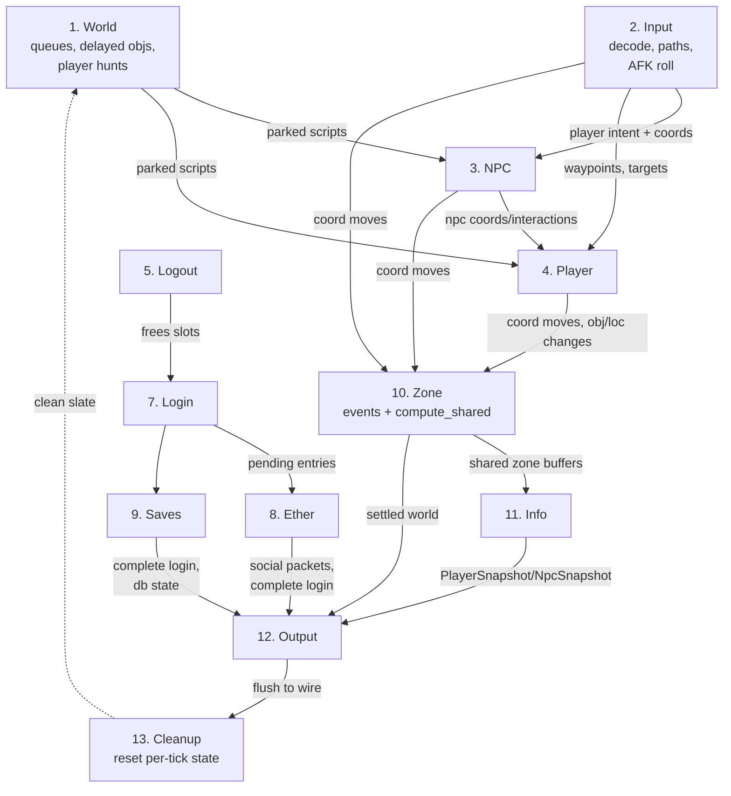

The hard constraints, restated as *why each edge cannot be reversed*:

- **Input before NPC/Player.** AI reads player coordinates, `busy`/`afk_event_ready` state, and the paths input built (
  `npc.rs:574-688`, `player.rs` interaction). Reversing would make AI act on stale, last-tick intent.
- **World player-hunts before NPC.** All NPCs must hunt players against one frozen snapshot (`world.rs:129-136`);
  folding it into phase 3 would let earlier NPCs perturb the positions later NPCs hunt against.
- **NPC before Player.** A player following/interacting with an NPC in phase 4 reads the NPC's just-finalized position (
  `player.rs:546-556`); the follow-coord propagation (`player.rs:120`) depends on the NPC's movement being done.
- **Movement (2-4) before Zone (10).** `zones_tracking` and the collision map must be complete before `compute_shared`
  pre-encodes them. A zone modified after `compute_shared` would ship stale bytes (or none).
- **Login (7) before Ether/Saves (8-9).** The pending-login entry must exist before its async responses can complete
  it (`login.rs:69`, `ether.rs:97`, `saves.rs:55`).
- **Ether/Saves before Output (12).** They write packets into player output buffers (`ether.rs:55-85`); those buffers
  flush in phase 12.
- **Zone (10) before Info (11) before Output (12).** Info reads a settled world and produces snapshots; output reads the
  shared zone buffers *and* the snapshots. This compute-once/encode-per-observer split is the engine's central scaling
  decision.
- **Output (12) before Cleanup (13).** Every structure cleanup resets (renderers, dirty inv sets, zone tracking, pathing
  deltas) was just read by output; resetting earlier would corrupt the wire output.

### Batching, buffering, and deferral

Several deliberate deferrals reduce per-tick work and preserve determinism:

- **World player-hunt deferral** (`world.rs`): player hunts hoisted to phase 1 for snapshot consistency; non-player
  hunts deferred into phase 3 because their targets move during phase 3.
- **Zone pre-encode batching** (`zone.rs:131`): each dirty zone is encoded once into a shared buffer, then broadcast to
  N observers in output — O(zones) encode instead of O(zones × observers).
- **Info snapshot batching** (`info.rs`): each entity's render data is computed once into a flat `PlayerSnapshot`/
  `NpcSnapshot` array; output reads the array, never the cold `ActivePlayer`, in its per-observer inner loops.
- **Channel-drain caps** (`ether.rs:41`): ether drains at most `MAX_PLAYERS` messages per tick to bound worst-case phase
  time and prevent a flooded ether from starving the heartbeat.
- **Autosave staggering** (`autosave.rs:9`): full saves every 250 ticks, not every tick.
- **Async login completion** (phases 7-9): login never blocks the tick on DB/ether I/O; it parks a request and completes
  it whenever the responses arrive, with a 10-tick timeout sweep.
- **Scratch-buffer reuse** (`engine.rs:238-248`): `take_pids`/`put_pids` recycle one Vec for all five iterating phases,
  eliminating per-tick allocation on the hottest loops.

<sub>[↑ Back to top](#top)</sub>


---

<a id="sec-07"></a>

## 7. The Engine Core — State Container, Registries & World Mutation

The `Engine` struct (`rs-engine/src/engine.rs:373`) is the single mutable
container for the entire game world. It owns every player, every NPC, the zone
map, every shared inventory, the script provider, the collision-aware cache, and
the bookkeeping for deferred world mutations. There is exactly one `Engine` per
world process; it is driven by a single tokio task that calls
`Engine::cycle` (`engine.rs:563`) once per game tick (nominally every 600 ms).
This section documents the container itself, the two slab-backed entity
registries (`PlayerList`/`NpcList`), the engine-level world-mutation API
(ground objects, locs, zone events), and the reusable `ScriptState` pool. Deep
VM internals are deferred to the VM sections; here we cover only how the engine
*drives* the VM and recycles its state.

The design philosophy throughout is the same one that made the original
single-threaded TypeScript server (the LostCity/2004scape lineage)
tractable: **a single owner of mutable state, processed deterministically in a
fixed phase order, with no locks and no cross-thread sharing.** rs-engine keeps
that determinism but rebuilds the state container around fixed-capacity slab
arrays, intrusive linked lists, and scratch-buffer reuse, eliminating the
per-tick garbage that the JVM/V8 versions hide behind a GC.

### 1. The single-instance, thread-local-pointer model

#### 1.1 Ownership and the `'static` accessor

`Engine` is constructed once in `Engine::new` (`engine.rs:459`), moved into the
world-tick task, and accessed everywhere else through two free functions:

```rust
pub fn engine() -> &'static Engine { unsafe { engine_typed::<Engine>() } }
pub fn engine_mut() -> &'static mut Engine { unsafe { engine_typed_mut::<Engine>() } }
```

(`engine.rs:67`, `engine.rs:91`). A subtle but important fidelity point: the
"global" engine reference is **not** a leaked `static` variable. The pointer is
stashed in *thread-local storage* by `with_engine`
(`rs-vm/src/engine.rs:1671`), which writes `self as *mut Engine` into a TLS
`Cell<*mut ()>` (`ENGINE_PTR`, `engine.rs:1621`) for the duration of a closure,
then restores the previous value via an RAII `Restore` guard. `engine_typed`
/`engine_typed_mut` (`engine.rs:1778`, `engine.rs:1817`) read that TLS pointer
back and reconstitute a typed reference, `debug_assert!`-ing it is non-null
("called outside with_engine scope").

This indirection exists so that the RuneScript VM — which calls back into the
engine through the `ScriptEngine` trait from deep inside opcode handlers — can
reach world state without threading an `&mut Engine` through every VM frame.
`Engine::cycle` installs the pointer once for the whole tick
(`with_engine(self, …)` at `engine.rs:565`), and each script invocation
re-installs it (`runescript_vm_execute`, `engine.rs:789`) so nested
`engine()`/`engine_mut()` calls resolve to the same live object.

#### 1.2 `unsafe impl Send`, `!Sync`

```rust
// SAFETY: Engine is only accessed from the single world-tick tokio task.
unsafe impl Send for Engine {}
```

(`engine.rs:416`). The struct holds a raw `cache_ptr: *mut CacheStore`
(`engine.rs:383`), which makes it auto-`!Send` and `!Sync`. The manual `Send`
impl is required only so the engine can be *moved into* the spawned world task;
it is deliberately **not** `Sync`, and the safety contract is that it is touched
from that one task and nowhere else. The raw pointer aliases the same
`Box::leak`'d allocation that every `&'static CacheStore` reference shares, and
it is written exclusively by `reload_assets` (`engine.rs:757`), which runs on
the same task. This is the Rust-idiomatic encoding of an invariant the Java
server got for free from its single game thread: there is no shared mutable
state to race on because there is only one accessor.

#### 1.3 The `Engine` field groups

| Group           | Fields                                                                                                                                                              | Purpose                                                              |
|-----------------|---------------------------------------------------------------------------------------------------------------------------------------------------------------------|----------------------------------------------------------------------|
| Clock / mode    | `clock: u64`, `members: bool`, `client_pathfinder: bool`, `node_id: u8`                                                                                             | Tick counter, world flags, multi-world node id                       |
| Entities        | `player_list: PlayerList`, `npc_list: NpcList`                                                                                                                      | Slab registries (§2)                                                 |
| World map       | `zones: ZoneMap`, `zones_tracking: FxHashSet<ZoneCoordGrid>`, `pending_zone_events: BTreeMap<u64, Vec<PendingZoneEvent>>`                                           | Zone storage, dirty set, time-ordered deferred mutations (§4)        |
| Cache / scripts | `cache: &'static CacheStore`, `cache_ptr: *mut CacheStore`, `scripts: ScriptProvider`, `ops: OpsRegistry`                                                           | Static content, hot-reload handle, compiled scripts, VM opcode table |
| Info / render   | `player_renderer`, `npc_renderer`, `player_info`, `npc_info`, `player_snapshots: Box<[PlayerSnapshot; MAX_PLAYERS]>`, `npc_snapshots: Box<[NpcSnapshot; MAX_NPCS]>` | Appearance-block builders and hot-field snapshot arrays              |
| Inventories     | `invs: FxHashMap<u16, Inventory>`                                                                                                                                   | World-level *shared* inventories (keyed by inv id)                   |
| Queues          | `world_queue: LinkList<ScriptState>`, `obj_delayed_queue: LinkList<ObjDelayedRequest>`                                                                              | Deferred world scripts / delayed obj spawns (§3, §4)                 |
| I/O channels    | `new_player_rx`, `ether_tx/rx`, `db_tx/rx`, `db_ready`, `pending_logins`, `clock_rate_tx`, `tick_stats_tx`, `reload_tx`                                             | Login, cross-world (ether), database, scheduler, stats, reload       |
| Misc            | `random: JavaRandom`, `reusable_script: Option<ScriptState>`                                                                                                        | Java-compatible RNG, pooled script state (§5)                        |

Two design notes stand out. First, `player_snapshots`/`npc_snapshots` are
heap-boxed fixed-size arrays (`Box<[PlayerSnapshot; MAX_PLAYERS]>`,
`engine.rs:390`) initialised to the `ABSENT` sentinel; they are the hot,
cache-friendly mirror of each entity's position used by the info encoders,
cleared on removal (`engine.rs:1750`, `engine.rs:1938`). Second, `invs` holds
only *shared* (world-scoped) inventories — per-player inventories live on the
`Player` itself — which is why `update_invs` distinguishes `InvScope::Shared`
from private inventories (`active_player.rs:1026`).

The `JavaRandom` is seeded with the literal `1084838400000`
(`engine.rs:514`) to reproduce the Java `java.util.Random` sequence
bit-for-bit, preserving spawn/loot determinism against the reference server.

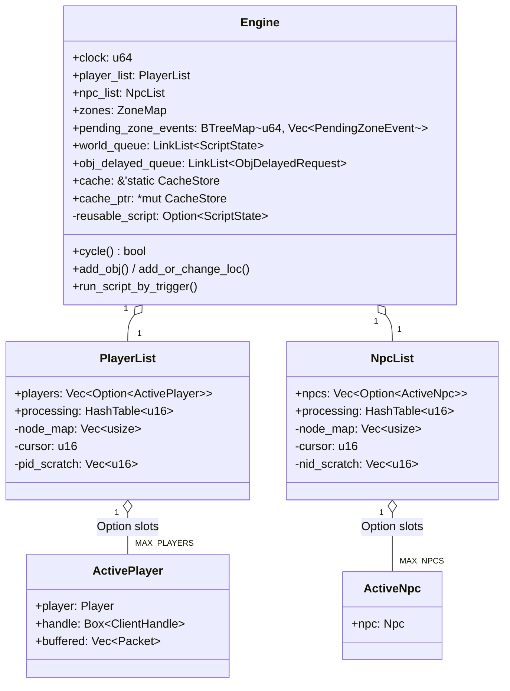

### 2. `PlayerList` / `NpcList` — slab registry + intrusive processing list

The two registries are structurally identical (`PlayerList` at `engine.rs:213`,
`NpcList` at `engine.rs:287`), so the discussion below covers both, naming the
player variant. Capacities are compile-time constants: `MAX_PLAYERS = 2048`,
`MAX_NPCS = 8192` (`rs-entity/src/build.rs:4`).

#### 2.1 Three cooperating structures

```rust
pub struct PlayerList {
    pub players: Vec<Option<ActivePlayer>>, // fixed-capacity slab, indexed by pid
    pub processing: HashTable<u16>,         // intrusive list giving iteration order
    node_map: Vec<usize>,                   // pid -> HashTable handle, for O(1) unlink
    cursor: u16,                            // free-id allocation cursor (last assigned)
    pid_scratch: Vec<u16>,                  // reusable pid snapshot buffer
}
```

- **`players` — the slab.** A `Vec<Option<ActivePlayer>>` of exactly
  `MAX_PLAYERS` slots, allocated once in `PlayerList::new` via
  `resize_with(MAX_PLAYERS, || None)` (`engine.rs:223`). The *index is the
  pid*. `Some` = occupied, `None` = free. Direct `players[pid as usize]`
  indexing is O(1) and never reallocates, so `&mut` borrows of a player are a
  single bounds-checked array access — the engine relies on this throughout
  (e.g. `runescript_execute_script_player` indexes `self.player_list.players[pid]`
  directly, `engine.rs:1082`). This mirrors the Java server's fixed
  `Player[2048]` "world list" but with Rust's `Option` encoding occupancy in
  the niche of the slot rather than a parallel boolean array.

- **`processing` — the intrusive iteration order.** A `HashTable<u16>`
  (an intrusive doubly-linked hash list, §2.3) holding the pids that should be
  *processed* this tick, in insertion order. The slab gives random access; the
  hash table gives an ordered, cheaply-mutable traversal set. `count()` returns
  `processing.len()` (`engine.rs:282`), so "online player count" is the size of
  the processing list, not a scan of the slab.

- **`node_map` — O(1) unlink.** `Vec<usize>` of `MAX_PLAYERS` entries mapping
  `pid -> HashTable node handle`. When a player is added, `processing.put`
  returns the arena index of its node, which is stored at
  `node_map[pid]` (`engine.rs:258`). Removal then unlinks in O(1) via
  `processing.unlink(node_map[pid])` (`engine.rs:265`) instead of searching the
  list. This is the key data-structure trick: it decouples "find by pid" (slab)
  from "remove from processing order" (intrusive handle) so both are constant
  time.

#### 2.2 The free-id cursor with wraparound

New ids are assigned by `next_pid`/`next_nid`, which delegate to the
free-function `next_free_id` (`engine.rs:204`):

```rust
fn next_free_id(cursor, upper, lower, is_free) -> Option<u16> {
    for i in (cursor + 1)..upper {          // scan forward from last assignment
        if is_free(i) { return Some(i); }
    }
    (lower..=cursor).find(|&i| is_free(i))   // wrap around to the bottom
}
```

`cursor` records the *last assigned* id. Allocation scans upward from
`cursor+1` to `upper`, then wraps to scan `lower..=cursor`. `add` sets
`self.cursor = pid` (`engine.rs:257`), so consecutive logins get monotonically
increasing pids until the top of the range is reached, at which point the search
recycles freed low slots. The ranges differ deliberately:

| List         | `lower` | `upper`                | initial `cursor`       |
|--------------|---------|------------------------|------------------------|
| `PlayerList` | `1`     | `MAX_PLAYERS-1` = 2047 | `MAX_PLAYERS-2` = 2046 |
| `NpcList`    | `0`     | `MAX_NPCS-1` = 8191    | `MAX_NPCS-2` = 8190    |

Players start at pid `1` (pid `0` is reserved — the client treats pid `0`
specially / as the local-player sentinel), while NPCs start at nid `0`. Both
exclude the top index from the assignable range (`upper` is exclusive). Starting
the cursor near the top means the very first allocation immediately wraps to the
low end, so ids begin at the bottom of the range and climb — matching the
original server's id-reuse behavior, which is observable on the wire (pid
appears in player-info ordering and hint arrows). The wraparound spreads reuse
across the whole range rather than aggressively reusing the just-freed slot,
which reduces the chance a client confuses a departed player with a freshly
joined one occupying the same pid in the same tick window.

`PlayerUid` packs the pid into its low 11 bits: `(username37 << 11) | (pid &
0x7FF)` (`rs-vm/src/player_uid.rs:6`), so `pid()` is `self.0 & 0x7FF`
(`player_uid.rs:62`) — 11 bits hold 0..2047, exactly `MAX_PLAYERS`. `NpcUid`
packs `(id << 16) | nid` (`rs-vm/src/npc_uid.rs:4`); `nid()` is the low 16 bits
(`npc_uid.rs:54`), `id()` the high 16 (the NPC *type*, so morphing an NPC keeps
its nid but changes its id — see §6).

#### 2.3 `HashTable<T>` — the intrusive processing list

`HashTable<T>` (`rs-datastruct/src/hashtable.rs:8`) is a closed-arena,
bucketed, doubly-linked list. It is constructed with `HashTable::new(8)`
(`engine.rs:227`) — 8 sentinel buckets — and `bucket_count` is required to be a
power of two so `(key as usize) & (bucket_count - 1)` is a fast mask
(`hashtable.rs:69`). Each `HashEntry` carries `value: Option<T>`, `key`, and
intrusive `prev`/`next` indices (`hashtable.rs:1`). Indices `0..bucket_count`
are permanent self-looping sentinels; real entries are appended after them.

- `put(key, value)` (`hashtable.rs:67`) allocates a slot (reusing the internal
  `free` list first — `alloc`, `hashtable.rs:34`), links it at the tail of its
  bucket's ring, increments `len`, and **returns the arena index** — this is the
  handle stored in `node_map`.
- `unlink(handle)` (`hashtable.rs:91`) splices the node out of its ring in O(1),
  `take`s the value, and pushes the slot onto `free` for reuse.
- `iter()` (`hashtable.rs:106`) walks bucket by bucket, yielding values in a
  stable order.

For the player/NPC processing list the *key* is the entity's packed coordinate
(`coord.packed() as i64`, e.g. `engine.rs:1785` for NPCs); players pass a `key:
i64` supplied by the caller (`add`, `engine.rs:256`). The arena + free-list
design means adding/removing players never allocates after warm-up, and the
intrusive `prev`/`next` make mid-tick removal safe and cheap.

#### 2.4 Scratch-buffer reuse: `take_pids`/`put_pids`

Phase loops iterate over a *snapshot* of the processing order rather than the
live list, because a phase may remove an entity mid-iteration (notably emergency
removal). To avoid allocating that snapshot `Vec<u16>` every tick,
`PlayerList` keeps a reusable `pid_scratch` buffer:

```rust
pub fn take_pids(&mut self) -> Vec<u16> {
    let mut v = std::mem::take(&mut self.pid_scratch); // steal the allocation
    v.clear();
    v.extend(self.processing.iter().copied());          // refill in processing order
    v
}
pub fn put_pids(&mut self, v: Vec<u16>) { self.pid_scratch = v; } // give it back
```

(`engine.rs:238`, `engine.rs:246`). The caller `take`s the buffer, iterates the
owned snapshot, then `put`s it back so its capacity (`MAX_PLAYERS`, reserved up
front at `engine.rs:230`) is reused next tick. `NpcList` has the symmetric
`take_nids`/`put_nids` (`engine.rs:311`, `engine.rs:319`). The plain
`pids()`/`nids()` methods (`engine.rs:278`) still allocate a fresh `Vec` and are
used where a throwaway list is acceptable (e.g. the fatal-panic emergency loop,
`engine.rs:599`).

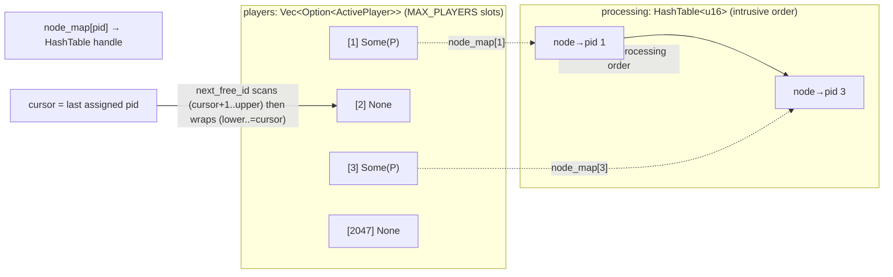

#### 2.5 Add / remove lifecycle and zone coupling

The list-level `add`/`remove` only touch the three structures
(`engine.rs:256`–`268`). The engine-level wrappers additionally maintain zone
membership and collision:

- `add_player` (`engine.rs:1732`) inserts into the list, then registers the pid
  in the destination zone's player set (`zone.add_player(pid)`).
- `remove_player` (`engine.rs:1745`) is heavier: it removes the renderer's
  permanent entry, `clear()`s the hot-field snapshot
  (`player_snapshots[pid].clear()`, `engine.rs:1750` — so any observer still
  processed later this tick encodes a *remove*), removes the player from its
  zone, **decrements the `observers` counter on every NPC in the player's build
  area** (`engine.rs:1764`, saturating) so unwatched NPCs can idle, and finally
  unlinks the slot.
- `add_npc` (`engine.rs:1779`) allocates a nid (`next_nid()?` — returns `None`
  if the world is NPC-full), rewrites the NPC's uid with the assigned nid, adds
  it to the list keyed by packed coord, registers it in its zone, then fires the
  `ai_spawn` trigger (`engine.rs:1797`).

### 3. Driving the VM: the reusable `ScriptState` pool

Scripts are the bulk of per-tick work — the comment at `state.rs:264` notes
"20,000+ script invocations per tick". A fresh `ScriptState::init`
(`rs-vm/src/state.rs:198`) allocates roughly **4 KB** (a 128-entry int stack,
128 `String`s for the string stack, plus gosub/goto frame stacks). Allocating
and freeing that per invocation would dominate the tick. The engine therefore
keeps **one** pooled state in `reusable_script: Option<ScriptState>`
(`engine.rs:413`) and cycles it.

#### 3.1 Build / run / reclaim

The pool has three touch points:

1. **Build.** `build_state` (`engine.rs:851`) and the private
   `run_script_inner` (`engine.rs:982`) both do: if `reusable_script.take()`
   yields a state, call `state.reset(script, subject, target, args)`
   (`state.rs:289`) to overwrite all fields *in place* — reusing the int/string
   stack buffers and only `clear()`+`resize()`-ing the variable-size local
   vectors; otherwise fall back to `ScriptState::init`. `reset` resets the stack
   pointers (`isp`/`ssp`) to 0 rather than zeroing the buffers (stale values are
   overwritten before read) and `clear()`s string-stack slots to release any
   large string buffers (`state.rs:321`).

2. **Run.** `run_script_inner` dispatches on subject kind to
   `runescript_execute_script_player` (`engine.rs:1073`) or
   `runescript_execute_script_npc` (`engine.rs:1191`), which call
   `runescript_vm_execute` (`engine.rs:789`) → `vm::execute`.

3. **Reclaim.** The executors return `Some(state)` **only when the script
   finished or aborted** (i.e., was *not* suspended), `None` otherwise. The
   caller then stores the returned state back:
   `self.reusable_script = Some(returned_state)` (`engine.rs:1029`,
   `engine.rs:838`). Suspended states must **not** be pooled — they are parked
   on the player, NPC, or world queue and resumed later, so reusing their
   buffers would corrupt a live suspension.

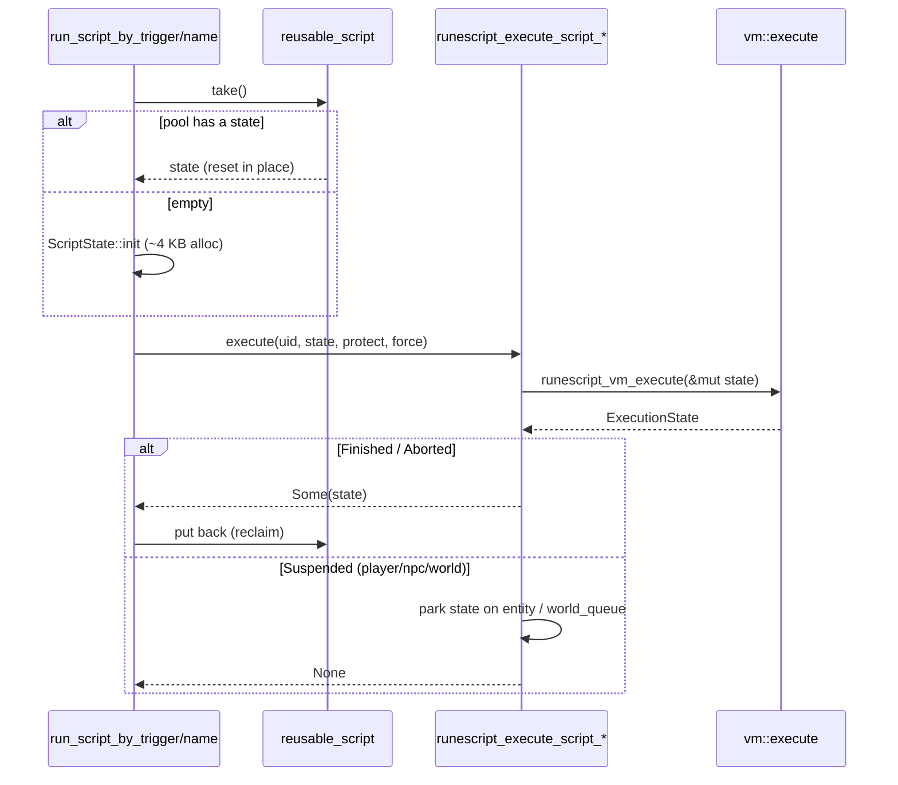

#### 3.2 Trigger lookup and suspension routing

`trigger_lookup_key` (`engine.rs:701`) encodes a trigger into the `i32` script
lookup key the provider uses. It tries most-specific first: a *type-id* key
`base | (0x2 << 8) | (t << 10)`, then a *category* key `base | (0x1 << 8) | (c
<< 10)` (only if `c != -1`), and finally the bare trigger ordinal `base`. Each
candidate is probed against `scripts.get_by_lookup` and the first that resolves
wins — exactly the three-level specialization (`[trigger,obj]` > `[trigger,_category]`
> `[trigger,_]`) of the RuneScript engine.

After VM execution, the executors interpret the returned `ExecutionState`
(`engine.rs:1125`):

| Result                    | Routing                                                                                                                                                |
|---------------------------|--------------------------------------------------------------------------------------------------------------------------------------------------------|
| `Finished` / `Aborted`    | clear the entity's `active_script` (if it matches `root_script_id`), close a stale modal if appropriate; reclaim the state                             |
| `WorldSuspended`          | `delay = state.pop_int()`; `enqueue_world_script(state, delay)` (`engine.rs:1303`), which sets `script.delay = delay + 1` and appends to `world_queue` |
| `NpcSuspended`            | park on the referenced NPC's `state.active_script` (the NPC is chosen by `int_operand()`: 0 → `active_npc`, else `active_npc2`)                        |
| other suspension (player) | park on the player's `state.active_script`, re-set `protect`                                                                                           |

The player executor also enforces **protection**: if `protect && !force` and the
player is already `protect` or `delayed`, execution is skipped entirely
(`engine.rs:1081`); otherwise it sets the flag and a `ProtectedActivePlayer`
script pointer for the duration, clearing both afterward — including chasing
down `ProtectedActivePlayer`/`ProtectedActivePlayer2` flags on any *other*
players the script touched (`engine.rs:1104`–`1123`) so no stale protection
lingers. This is the engine's encoding of the original "delay/protect"
single-action guard that prevents a player from running two competing scripts in
one tick.

### 4. Engine-level world mutation

All mutations that change the visible world go through engine methods that
(a) update the authoritative zone/collision state immediately, (b) schedule any
*future* reversal/despawn into a time-ordered queue, and (c) mark the affected
zone dirty so the zones phase flushes deltas to clients.

#### 4.1 Dirty-tracking and time-ordered events

- `track_zone(x, y, z)` (`engine.rs:1267`) inserts a `ZoneCoordGrid` into the
  `zones_tracking: FxHashSet`. The zones phase iterates this set and flushes
  each dirty zone's queued messages, then clears it. Using a *set* deduplicates
  many mutations to the same zone within one tick into a single flush.
- `schedule_zone_event(clock, event)` (`engine.rs:1282`) pushes a
  `PendingZoneEvent` into `pending_zone_events: BTreeMap<u64, Vec<…>>` keyed by
  the tick it should fire. The `BTreeMap` keeps events in chronological order so
  the world phase can drain all entries with `key <= clock` cheaply; the `Vec`
  value batches multiple events landing on the same tick.

`PendingZoneEvent` (`engine.rs:147`) has four variants, all describing deferred
world changes:

| Variant                               | Meaning                                                |
|---------------------------------------|--------------------------------------------------------|
| `ObjReveal { coord, id, receiver37 }` | promote a receiver-only ground obj to globally visible |
| `ObjDelete { coord, id, clock }`      | despawn a ground obj after its lifetime                |
| `ObjAdd { coord, id }`                | respawn an obj that was picked up/removed              |
| `LocDelete { coord, layer, clock }`   | revert/remove a temporary loc change                   |

#### 4.2 Ground objects: stacking, reveal, despawn

`add_obj(obj, receiver37, duration)` (`engine.rs:1340`) is the core spawn path:

1. **Merge.** If the obj type is `stackable`, the obj's lifetime is `Despawn`,
   and a `receiver37` is given, it first tries `merge_obj` (`engine.rs:1414`).
   `merge_obj` finds an existing same-id stack owned by the same receiver at the
   tile (`get_obj_of_receiver`), checks it is also `Despawn`, and that the
   combined count `<= STACK_LIMIT` (`engine.rs:1427`). On success it bumps the
   existing stack's `count` and `last_clock`, emits an `ObjCount` zone message
   (so clients see the new total) via `zone.queue_event`, reschedules the
   `ObjDelete`, marks the zone dirty, and returns `true` — the new obj is *not*
   created. This is the wire-faithful "drops merge into one stack" behavior.
2. **Reveal scheduling.** If a `receiver37` is present, the obj starts
   receiver-only; `reveal` is set to `clock + REVEAL_TICKS` (`REVEAL_TICKS =
   100`, `rs-entity/src/obj.rs:5`) and an `ObjReveal` event is scheduled — but
   **only if the reveal happens before the despawn** (`reveal_clock < clock`,
   `engine.rs:1361`), avoiding a pointless reveal of an obj that despawns first.
3. **Despawn scheduling.** An `ObjDelete` is *always* scheduled at `clock =
   self.clock + duration` (`engine.rs:1355`).
4. Finally the obj is inserted into its zone (`zone.add_obj`) and the zone is
   tracked.

`remove_obj(coord, id, receiver37, duration)` (`engine.rs:1481`) removes the obj
from its zone, and — if `duration > 0` — schedules an `ObjAdd` respawn at
`clock + scale_by_player_count(duration)`. `scale_by_player_count`
(`engine.rs:2300`) returns `(4000 - min(players, 2000)) * rate / 4000`, so
respawn delays shorten as population grows (full delay at 0 players, halved at

2000) — a load-aware resource-respawn knob inherited from the original server.

#### 4.3 Locs: add/change, remove, revert

`add_or_change_loc(coord, id, shape, angle, duration)` (`engine.rs:1541`)
resolves the loc layer from the shape (`shape.layer()`) and looks for an
existing loc on that layer at the tile:

- **Change path** (existing found, `engine.rs:1561`): if the old loc is
  `visible()`, its collision is removed (`apply_loc_collision(…, false)`), the
  loc is mutated in place (`zone.locs[idx].change(…)`), new collision is applied
  by id (`apply_collision_by_id(…, true)`), and `zone.change_loc(idx)` queues
  the client delta. If the result is a *change* or a `Despawn`, a `LocDelete` is
  scheduled at `clock + duration` and `last_clock` recorded; otherwise
  `last_clock` is cleared.
- **Add path** (none found, `engine.rs:1591`): a brand-new `Despawn` `Loc` is
  built (width/length from the cache type, defaulting to 1×1), collision is
  applied, the loc is appended to the zone, and — if `duration > 0` — a
  `LocDelete` is scheduled.

`remove_loc` (`engine.rs:1654`) clears a visible loc's collision and marks it
removed; if the loc is `Respawn` and `duration > 0` it schedules a `LocDelete`
that will *restore* it. `revert_loc` (`engine.rs:1703`) undoes a prior `change`:
remove current collision → `loc.revert()` → apply the reverted loc's collision →
`change_loc` → clear `last_clock`. In every loc path the collision map
(`rsmod`/`apply_loc_collision`) is kept in lockstep with the zone's loc list,
so the pathfinder never sees stale geometry — a correctness invariant the engine
upholds eagerly rather than lazily.

#### 4.4 Hot-reload in place

`reload_assets(new_store, new_scripts)` (`engine.rs:757`) swaps content live:

```rust
unsafe {
std::ptr::drop_in_place( self .cache_ptr);     // drop the old CacheStore
std::ptr::write( self .cache_ptr, * new_store);  // write the new one in the SAME alloc
}
self .scripts = new_scripts;
```

Because every `&'static CacheStore` reference (and `self.cache`) points at the
*same* `Box::leak`'d allocation that `cache_ptr` addresses, overwriting that
allocation in place atomically updates all references without invalidating any
of them. This is sound only because the operation runs on the single world task
while no borrow of the cache is live. In debug builds it also broadcasts a
"Hot-reload applied" chat line to all players (`engine.rs:766`).

### 5. The tick loop and fault isolation

`Engine::cycle` (`engine.rs:563`) installs the engine pointer via `with_engine`
and runs **13 phases** in a fixed order, each wrapped in the `phase!` macro
(`engine.rs:571`) which times it and runs it inside
`catch_unwind(AssertUnwindSafe(…))`:

`world → input → npcs → players → logouts → autosave → logins → ether → saves
→ zones → info → out → cleanup`

(`engine.rs:582`–`594`). A panic in any phase is caught, logged as `FATAL`, and
sets a `fatal` flag instead of crashing the process — relying on the release
profile keeping `panic = "unwind"` so `catch_unwind` can actually intercept. If
`fatal` is set, the engine emergency-saves and removes **every** player via
`emergency_remove_player` (`engine.rs:599`) and returns `true` to signal the
host to recycle the world. `emergency_remove_player` (`engine.rs:1996`) extracts
and saves the player's profile (`extract_profile`/`save_binary` → `DbRequest::Save`),
notifies ether (`EtherOutbound::PlayerLogout`), then calls `remove_player`. The
NPC analogue `emergency_deactivate_npc` (`engine.rs:2043`) skips the
`ai_despawn` script (to avoid re-panicking) and frees `Despawn` NPCs outright.

After the phases, `clock` is incremented (`engine.rs:595`) and a `TickStats`
snapshot (`engine.rs:117`) — per-phase millisecond timings plus player/NPC
counts — is published to `tick_stats_tx` and logged under the `tick_stats`
target for live monitoring.

### 6. `ActivePlayer` and `ActiveNpc` — the engine-side entity handles

The registries hold `ActivePlayer`/`ActiveNpc`, the engine-side wrappers around
the pure `Player`/`Npc` data entities.

#### 6.1 `ActivePlayer`

```rust
pub struct ActivePlayer {
    pub player: Player,
    pub handle: Box<ClientHandle>,
    pub buffered: Vec<Packet>,
    pub client_limit: u8,
    pub user_limit: u8,
    pub restricted_limit: u8,
}
```

(`active_player.rs:128`). It pairs the `Player` entity with its network
`ClientHandle` (boxed to keep `ActivePlayer` small in the slab) and a per-tick
`buffered` packet vector. The three `*_limit` counters rate-limit inbound
messages per category each tick (reset in `decode`, `active_player.rs:1679`).

`ActivePlayer` is the home of all *server protocol* output. `write<M>`
(`active_player.rs:197`) routes by `M::PRIORITY`: `Buffered` messages are
encoded into a `Packet` and pushed onto `self.buffered` (`queue_buffered`,
`active_player.rs:221`), flushed at end-of-tick by `encode`→`write_buffered`
(`active_player.rs:330`, `active_player.rs:252`); `Immediate` messages bypass
the queue via `write_immediate` (`active_player.rs:272`). Both paths
ISAAC-encrypt the opcode byte (`buf.data[0] + isaac_encode.next_int()`) and drop
oversized (>5000 byte) messages. `write_immediate` notably **recycles outbound
buffers**: it drains returned buffers from `recycle_rx` into a `buffer_pool`
(capped at `OUTPUT_POOL_CAP = 8`, `active_player.rs:116`) and reuses one instead
of allocating a fresh `Vec` per immediate message — the same
allocation-avoidance philosophy as the script pool, applied to the network path.

`encode` (`active_player.rs:330`) also reconciles modal UI state: it diffs
`modal_main`/`modal_chat`/`modal_side` against their `last_*` shadows and emits
the appropriate `if_open_*`/`if_close` packets only on change. The dozens of
`if_set*`, `cam_*`, `update_*`, `varp_*` helpers are thin typed wrappers over
`write`. Higher-level helpers (`update_invs`, `update_other_invs`,
`sync_varps`, `update_map`) implement the per-tick sync logic and lean heavily
on `thread_local!` scratch buffers and `std::mem::take` of player sub-maps to
iterate while holding `&mut self` without cloning (e.g. `active_player.rs:1016`,
`active_player.rs:1127`).

#### 6.2 `ActiveNpc`

```rust
pub struct ActiveNpc {
    pub npc: Npc
}
```

(`active_npc.rs:14`) — a thin newtype over `Npc`, carrying engine behavior as
methods. `ActiveNpc::new` (`active_npc.rs:39`) seeds combat stats
(attack/defence/strength/hitpoints/ranged/magic), hunt config
(`hunt_mode`/`hunt_range`), movement restriction, and the recurring timer from
the cache NPC type. Key methods:

- `anim` (`active_npc.rs:82`) plays a sequence respecting priority (a new anim
  replaces the current only if its seq priority is `>=`).
- `damage` (`active_npc.rs:122`) subtracts saturating from `Hitpoints` and
  populates the `NpcInfoProt::Damage` info fields.
- `change_type` (`active_npc.rs:200`) morphs the NPC into another type for a
  duration: it rewrites `uid = NpcUid::new(new_type, nid)` (keeping the *nid*,
  changing the *id*), sets the `ChangeType` info mask, optionally recomputes
  combat levels preserving buff/debuff deltas, and schedules a revert via
  `revert_at = clock + duration` — unless reverting to base on a `Respawn` NPC,
  in which case `revert_at` is cleared. `revert_type` (`active_npc.rs:245`)
  restores the base type and, if `revert_reset`, fully restores stats and clears
  hero points.
- `tele` (`active_npc.rs:277`) moves the NPC and sets `pathing.tele = true` (so
  the info encoder transmits a remove+add), but **silently no-ops if the target
  zone isn't allocated** in the collision map — defensive against teleporting
  into unloaded space.

Both wrappers implement the VM's `ScriptPlayer`/`ScriptNpc` and (via `Engine`)
`ScriptSubject` plumbing; `ActivePlayer::uid()`/`ActiveNpc::uid()`
(`engine.rs:2997`, `engine.rs:4668`) expose the packed identifier the registries
and snapshots key on.

### Summary of engineering rationale

The Engine Core trades a small amount of `unsafe` (one manual `Send`, one raw
cache pointer, a TLS engine pointer) for three concrete wins over the GC-backed
reference server: **zero per-tick allocation on the hot paths** (slab arrays,
intrusive lists with internal free lists, scratch-buffer and `ScriptState`
reuse, output-buffer recycling), **O(1) random-access *and* O(1) ordered
removal** of entities (slab index + `node_map` handle into the intrusive
`HashTable`), and **deterministic, fault-isolated mutation** (time-ordered
`BTreeMap` zone events, eager collision coupling, `catch_unwind` per phase with
emergency save). Every wire-visible behavior — pid reuse order, drop stacking,
reveal/despawn timing, NPC morph identity, population-scaled respawns — is
preserved byte-for-byte against the TS original while the underlying memory
layout is rebuilt for Rust.

<sub>[↑ Back to top](#top)</sub>


---

<a id="sec-08"></a>

## 8. Core Data Structures — Intrusive Lists & Open-Addressed Tables

The `rs-datastruct` crate is small — three files (`lib.rs`, `hashtable.rs`, `linklist.rs`) totalling roughly 450 lines
of non-test code — but it is load-bearing for the entire tick loop. It supplies two arena-backed containers,
`HashTable<T>` and `LinkList<T>`, that the engine uses wherever it needs **stable iteration order that survives
mid-iteration mutation**, **O(1) removal by a previously-handed-out handle**, and **zero per-element heap allocation**.
Both are deliberate re-implementations of structures from the TypeScript reference server,
not thin wrappers over `std` collections, and the divergence is
intentional: the reference server's semantics — including one specific iteration *bug* — are part of the
wire-and-behavior contract this server must reproduce.

This section dissects both structures field-by-field, derives their invariants, walks the hot call sites (`PlayerList`/
`NpcList` processing order, `world_queue`, `obj_delayed_queue`, the per-entity `ScriptQueue` lanes), and explains the
engineering rationale against the `std` alternatives that were *not* used.

### 20.1 Design thesis: why not `HashMap`, `LinkedList`, or `Vec`?

The reference server is written in a garbage-collected language where every `Player`, `Npc`, `Obj`, and queued script is
a heap object threaded into intrusive doubly-linked lists. Iteration walks pointer chains; removal is O(1) because the
node already knows its neighbors; and the GC hides the allocation cost. A naive Rust port cannot replicate
this directly — intrusive pointers fight the borrow checker, and `std::collections::LinkedList` neither exposes node
handles nor permits safe removal during iteration.

`rs-datastruct` resolves the tension by **moving the intrusiveness into an arena**. Instead of pointers embedded in the
value, each container owns a contiguous `Vec` of nodes; "pointers" become `usize` indices into that `Vec`; and a node
*handle* is just an index. This buys the engine four properties that the `std` types cannot jointly provide:

| Requirement                                 | `std::HashMap`   | `std::collections::LinkedList` | `Vec` + swap_remove   | `rs-datastruct`                   |
|---------------------------------------------|------------------|--------------------------------|-----------------------|-----------------------------------|
| O(1) removal by stored handle               | no (key only)    | no handle API                  | yes, but **reorders** | **yes, order-preserving**         |
| Stable iteration order across removals      | no (no order)    | yes                            | no                    | **yes**                           |
| Safe `unlink` of current node mid-iteration | n/a              | unsafe/awkward                 | invalidates indices   | **yes (cursor caches successor)** |
| No per-element heap alloc; slot reuse       | per-bucket nodes | per-node alloc                 | flat, but shifts      | **flat arena + free list**        |
| Reproduces reference iteration quirks       | n/a              | n/a                            | n/a                   | **yes (by construction)**         |

The "stable iteration order across removals" row is the one that motivates `HashTable` specifically: the engine must
process players and NPCs in a deterministic order every tick even as entities log out or are emergency-removed
mid-phase, and that order must not depend on the hashing of their identifiers.

### 20.2 `LinkList<T>` — arena-backed intrusive ring with a caching cursor

#### 20.2.1 Layout

`LinkList<T>` (`rs-datastruct/src/linklist.rs:24`) is three fields:

```rust
pub struct LinkList<T> {
    entries: Vec<Entry<T>>,  // node arena; index 0 is the sentinel
    free: Vec<usize>,        // LIFO stack of recycled slot indices
    cursor: usize,           // single traversal cursor (0 = exhausted)
}
```

The node type is shared with the hash table's conceptual model and lives in `lib.rs`:

```rust
pub(crate) struct Entry<T> {
    pub(crate) value: Option<T>,  // None = sentinel or freed slot
    pub(crate) prev: usize,
    pub(crate) next: usize,
}
```

Index **0 is a permanent sentinel** (`const SENTINEL: usize = 0`, `linklist.rs:10`). `new()` (`linklist.rs:45`) seeds
`entries` with exactly one node whose `prev` and `next` both point at itself — the canonical empty circular ring. The
sentinel's `value` is always `None`, and callers never receive index 0 as a handle: every handle returned by `head`/
`tail`/`next`/`prev` is `>= 1`.

Memory layout consequence: nodes are dense in a single `Vec`, so a forward walk touches contiguous-ish cache lines
rather than chasing GC-scattered heap objects as the reference does. `Entry<T>` is `Option<T>` plus two `usize`, so for
a small `T` the node is a handful of words and many nodes share a cache line.

#### 20.2.2 The ring and the operations

The list is a circular doubly-linked ring closed through the sentinel. `add_tail` (`linklist.rs:118`) splices a freshly
allocated node between the old tail (`entries[SENTINEL].prev`) and the sentinel; `add_head` (`linklist.rs:144`) splices
between the sentinel and the old head. Both are four pointer writes and run in O(1). `remove_head` (`linklist.rs:170`)
reads `entries[SENTINEL].next`, returns `None` if it is the sentinel (empty), else delegates to `unlink`.

`unlink` (`linklist.rs:355`) is the core O(1)-removal primitive:

```rust
pub fn unlink(&mut self, handle: usize) -> T {
    let prev = self.entries[handle].prev;
    let next = self.entries[handle].next;
    self.entries[prev].next = next;          // patch neighbors to skip us
    self.entries[next].prev = prev;
    self.entries[handle].prev = SENTINEL;    // detach
    self.entries[handle].next = SENTINEL;
    let value = self.entries[handle].value.take().expect("double unlink");
    self.free.push(handle);                  // recycle slot
    value
}
```

Three invariants are enforced here. First, **slot recycling**: the freed index is pushed onto `free`, and the next
`alloc` (`linklist.rs:80`) pops it LIFO before ever growing the `Vec`. The arena therefore reaches a steady-state size
equal to the high-water mark of *concurrently live* nodes and never reallocates again. Second, **double-unlink detection
**: `value.take().expect("double unlink")` panics if the slot's `Option` is already `None`, catching use-after-free of a
stale handle. Third, **`unlink` never touches `cursor`** — this is what makes mid-iteration removal safe (next
subsection).

`clear()` (`linklist.rs:415`) resets the sentinel to self-referential, clears the cursor, and pushes every index
`1..len` onto `free` without shrinking the `Vec` — a bulk recycle that preserves capacity for the next fill. The doc
note at `linklist.rs:406` makes the no-shrink behavior explicit; this is what lets a per-entity `ScriptQueue` lane be
reused tick after tick with no reallocation.

#### 20.2.3 The caching cursor and the authentic "speedup bug"

`LinkList` carries a **single** `cursor` field, not an iterator object, and forward/reverse traversal share it.
`head()` (`linklist.rs:200`) returns the head handle but sets `cursor` to the head's *successor* — it reads one step
ahead. `next()` (`linklist.rs:253`) then returns the current `cursor` and advances it to that node's `next`. The crucial
property: **by the time a node's handle is yielded, the cursor has already moved past it.** Removing the just-yielded
node only repatches its neighbors (`unlink` doesn't touch `cursor`), so the cached successor is still valid and
iteration proceeds correctly. This is exactly why the phase loops can `unlink` the current entry while walking — see
`process_world_queue` (`rs-engine/src/phases/world.rs:59`), which calls `next()` to advance *before* it calls
`unlink(idx)`:

```rust
h = self .world_queue.next();           // cursor already advanced
let mut script = self .world_queue.unlink(idx);   // safe to remove now
```

The same one-step-ahead caching reproduces a famous reference-server quirk, documented verbatim at the top of
`linklist.rs:1-6`. If a node is appended to the tail **while iterating**, behavior depends on where the cursor is:

- If the cursor already points at the sentinel (iteration was on the last element), the newly appended node is **skipped
  this tick** — the cursor never reaches it.
- If there are still nodes ahead, the cursor chain naturally walks through them and *also* reaches the freshly appended
  tail node, giving it an **early execution this same tick** — the "speedup bug."

The crate's own tests pin this down: `speedup_bug_add_at_last_element_no_speedup` (`linklist.rs:623`) asserts a node
added while processing the last element is not visited, whereas `speedup_bug_two_elements_speedup` (`linklist.rs:605`)
and `speedup_bug_middle_insert_speedup` (`linklist.rs:641`) assert the appended node *is* visited. This is not an
accident to be fixed — it is **byte-and-behavior fidelity** with the original `LinkList.ts` cursor semantics,
where `head()`/`next()` likewise cache `node.next` before yielding. Reproducing
it matters because scripts re-queue themselves into `world_queue` (`world.rs:76`, `enqueue_world_script` on
`ExecutionState::WorldSuspended`), and the exact tick on which a re-queued world script next runs must match the
reference.

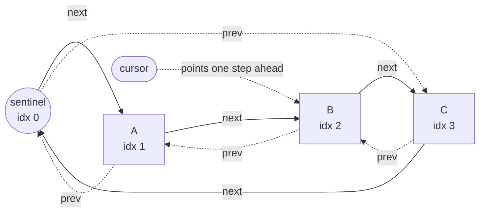

The diagram shows the state immediately after `head()` returned A: the loop holds handle A, but `cursor` already
references B, so `unlink(A)` cannot strand the walk.

#### 20.2.4 `iter()` vs the cursor

`iter()` (`linklist.rs:389`) returns a `std::iter::from_fn` closure that walks the `next` chain from the sentinel *
*without touching `self.cursor`**. This is the *re-entrant* read path: it is safe to call while a cursor-based `head`/
`next` loop is already in flight (e.g. a queued script that inspects the queue during the drain). The two iteration
modes are complementary — cursor-based for mutating drains, `iter()` for nested read-only passes. The reference's
generator-based saves/restores the cursor to achieve nestability;
`rs-datastruct` instead sidesteps the cursor entirely for the read path, which is simpler and allocation-free.

#### 20.2.5 Where `LinkList` is used

- **`Engine::world_queue: LinkList<ScriptState>`** (`rs-engine/src/engine.rs:396`) — deferred world scripts. Pushed via
  `enqueue_world_script`/`add_tail` (`engine.rs:1305`), drained by `process_world_queue` with per-entry `delay`
  countdown and conditional `unlink` (`world.rs:59-95`).
- **`Engine::obj_delayed_queue: LinkList<ObjDelayedRequest>`** (`engine.rs:397`) — delayed ground-object spawns.
  `ObjDelayedRequest` (`engine.rs:174`) carries `coord/id/count/receiver37/duration/delay`; appended by
  `add_obj_delayed`/`add_tail` (`engine.rs:2602`), drained identically by `process_obj_delayed_queue` (`world.rs:107`).
- **`ScriptQueue` lanes** (`rs-engine/rs-queue/src/lib.rs:12-16`) — three lanes (`queue`, `weak`, `engine`), each a
  `LinkList<QueuedScript>`, owned per entity. `unlink_matching` (`rs-queue/src/lib.rs:133`) walks a lane with `head`/
  `next` and `unlink`s every entry matching a `script_id`, relying precisely on the cursor-caches-successor guarantee to
  remove mid-walk while preserving relative order.

### 20.3 `HashTable<T>` — open-bucketed table with arena chains and stable processing order

#### 20.3.1 Layout and the power-of-two bucket array

`HashTable<T>` (`hashtable.rs:8`) co-locates the bucket sentinels and the data nodes in a single `Vec`:

```rust
struct HashEntry<T> {
    value: Option<T>,
    key: i64,
    prev: usize,
    next: usize
}

pub struct HashTable<T> {
    bucket_count: usize,        // must be a power of two
    entries: Vec<HashEntry<T>>, // [0..bucket_count) are bucket sentinels; rest are data
    free: Vec<usize>,           // recycled data-slot indices
    len: usize,                 // live element count
}
```

`new(bucket_count)` (`hashtable.rs:16`) pre-fills `entries[0..bucket_count]` with sentinel nodes, each
self-referential (`prev = next = i`). Indices `0..bucket_count` are therefore the **bucket heads**; every chain is a
circular doubly-linked ring closed through its own bucket sentinel — the same arena-intrusive scheme as `LinkList`, but
with `bucket_count` independent rings instead of one.

Hashing is `(key as usize) & (bucket_count - 1)` (`hashtable.rs:56,69`). This is a raw bit-mask, which is **only correct
because `bucket_count` is a power of two** — the mask `bucket_count - 1` keeps the low bits. There is no rehashing and
no resize: the table is open-addressed in the sense of fixed buckets with chaining, and load factor is allowed to exceed
1 (chains simply lengthen). The engine instantiates these tables at `bucket_count = 8` (`engine.rs:227,301`), which the
chaining strategy tolerates gracefully even at thousands of entries.

#### 20.3.2 put / get / unlink

`put` (`hashtable.rs:67`) allocates a data slot via `alloc` (reusing a freed index or growing the `Vec`), then **appends
to the tail of its bucket chain** — splicing between `entries[sentinel].prev` and the sentinel. Tail insertion is the
detail that makes processing order *insertion order within a bucket*, which the tests verify (`iter_bucket_order`,
`hashtable.rs:240`). `put` returns the slot index as a stable **handle**.

`get` (`hashtable.rs:55`) hashes the key to its sentinel and walks `next` until it either finds a matching `key` or
returns to the sentinel (chain exhausted → `None`). Average cost is O(chain length), i.e. O(1) under reasonable load.

`unlink` (`hashtable.rs:91`) is the O(1)-by-handle removal:

```rust
pub fn unlink(&mut self, handle: usize) -> T {
    let prev = self.entries[handle].prev;
    let next = self.entries[handle].next;
    self.entries[prev].next = next;
    self.entries[next].prev = prev;
    let value = self.entries[handle].value.take().expect("double unlink");
    self.free.push(handle);
    self.len -= 1;
    value
}
```

Note the asymmetry with `LinkList::unlink`: the hash-table version does **not** reset the removed node's own `prev`/
`next` to the sentinel, because it is taken straight onto the free list and `alloc` fully overwrites it on reuse — a
micro-optimization that drops two writes. The `expect("double unlink")` guard is retained.

`value`/`value_mut` (`hashtable.rs:83,87`) and the `Index`/`IndexMut` impls (`hashtable.rs:148-160`) dereference a
handle to its payload, panicking on a vacated slot. `iter()` (`hashtable.rs:106`) walks **all buckets in order** (bucket
0, then bucket 1, …), and within each bucket follows the chain head-to-tail; the `Iter` state machine (
`hashtable.rs:126`) advances `current` along a chain and steps `bucket` forward when it returns to that bucket's
sentinel. The yielded order is therefore *deterministic*: a function purely of `(key & mask)` and per-bucket insertion
order, **never of insertion time across buckets**.

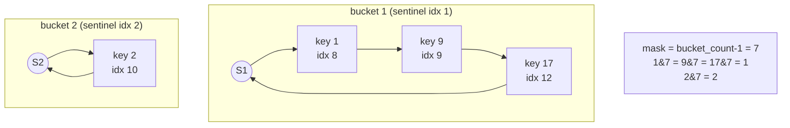

#### 20.3.3 The handle indirection: `node_map`, and why this beats a plain `HashMap`

`HashTable` alone gives a key→handle map; the engine layers a **reverse index** on top to get O(1) removal *without*
re-hashing. In `PlayerList` (`engine.rs:213`) and `NpcList` (`engine.rs:287`):

```rust
pub struct PlayerList {
    pub players: Vec<Option<ActivePlayer>>, // dense array indexed by pid
    pub processing: HashTable<u16>,         // key (e.g. user37) -> pid, in processing order
    node_map: Vec<usize>,                   // pid -> HashTable handle
    cursor: u16,                            // round-robin pid allocator
    pid_scratch: Vec<u16>,                  // reusable snapshot buffer
}
```

`add(pid, active, key)` (`engine.rs:256`) does three writes: store the active entity in the dense `players[pid]` slot,
`put(key, pid)` into `processing` (capturing the returned handle), and record `node_map[pid] = handle`. `remove(pid)` (
`engine.rs:263`) then unlinks in O(1) **by handle** — `self.processing.unlink(self.node_map[pid])` — with no need to
recompute the hash or re-find the chain node. This two-level scheme (dense `Vec` for payload + `HashTable` for ordered
membership + `node_map` for handle lookup) is the Rust equivalent of the reference's intrusive `Player.next/prev`
pointers, achieving the same O(1) splice-out while keeping the payload in a flat, cache-friendly array indexed by the
wire `pid`/`nid`.

A plain `std::HashMap<i64, u16>` would lose the deterministic ordering entirely (its iteration order is randomised
per-process by the default hasher) and would not yield a stable handle for O(1) removal. The deterministic order matters
because **player/NPC processing order is observable** — script side effects, combat resolution, and info-block ordering
can depend on it, and the reference server's order must be matched tick-for-tick.

#### 20.3.4 Stable iteration through emergency removal: `take_pids`/`put_pids`

The processing-order snapshot is taken via `take_pids` (`engine.rs:238`) / `take_nids` (`engine.rs:311`):

```rust
pub fn take_pids(&mut self) -> Vec<u16> {
    let mut v = std::mem::take(&mut self.pid_scratch); // steal the reusable buffer
    v.clear();
    v.extend(self.processing.iter().copied());          // ordered snapshot
    v
}
```

The phase loops iterate this **owned `Vec` snapshot**, not the live table, because an entity may be emergency-removed (
e.g. via `catch_unwind`) mid-phase; mutating `processing` while iterating it would otherwise be unsound. The snapshot
decouples "the set we decided to process this tick" from concurrent mutation. Critically the buffer is **recycled**:
`pid_scratch`/`nid_scratch` is `mem::take`-n out, refilled, and handed back via `put_pids`/`put_nids` (
`engine.rs:246,319`), so the per-tick processing snapshot costs zero steady-state allocation. (The older `pids()`/
`nids()` helpers at `engine.rs:278,351` allocate a fresh `Vec` each call and survive only for non-hot paths.) This
mirrors the engine-wide allocation discipline noted in the perf roadmap — the tick loop avoids per-cycle heap churn.

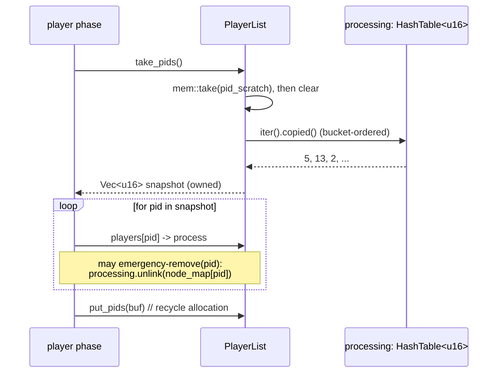

#### 20.3.5 Bit-layout reference: the bucket mask

```
key (i64) ─────────────────────────────────────────────────────────────┐
                                                                       │
            cast to usize, then AND with (bucket_count - 1)            ▼
bucket_count = 8  →  mask = 0b0000_0111                                │
   key = 17 = 0b...0001_0001  &  0b0111  =  0b001  = bucket 1          │
   key =  9 = 0b...0000_1001  &  0b0111  =  0b001  = bucket 1          │  collide → same chain
   key =  2 = 0b...0000_0010  &  0b0111  =  0b010  = bucket 2          │
negative key: e.g. -5 cast to usize wraps to 0xFFFF...FFFB,            │
   low 3 bits = 0b011 = bucket 3  (handled; see test negative_key)     ┘
```

Negative keys are well-defined: the `i64 → usize` cast reinterprets the two's-complement bit pattern, and masking the
low bits still selects a valid bucket. `hashtable.rs:232` (`negative_key` test) exercises this.

### 20.4 Shared invariants and failure modes

Both structures share a tightly specified contract:

| Invariant                                               | `LinkList<T>`           | `HashTable<T>`            |
|---------------------------------------------------------|-------------------------|---------------------------|
| Sentinel(s) at low indices, `value = None`              | index 0                 | indices `0..bucket_count` |
| Handles are always `>= sentinel_count`                  | `>= 1`                  | `>= bucket_count`         |
| Freed slot pushed to `free`, reused LIFO before growth  | yes (`linklist.rs:363`) | yes (`hashtable.rs:97`)   |
| Double-unlink panics via `Option::take().expect`        | yes (`linklist.rs:362`) | yes (`hashtable.rs:96`)   |
| Stale-handle deref panics `"invalid handle"`            | yes (`get`/`get_mut`)   | yes (`value`/`value_mut`) |
| O(1) removal by handle, order-preserving                | yes                     | yes (within bucket)       |
| No `Vec` shrink on `clear`/`unlink` (capacity retained) | yes                     | yes                       |

The panic-on-misuse posture is deliberate: handles are plain `usize` with no generational tag, so the structures cannot
*statically* prevent use-after-free, but they *dynamically* trap it at the first dereference or second unlink. Given the
engine runs each entity's tick inside `catch_unwind` (release builds keep `panic=unwind` precisely so a corrupted entity
can be emergency-removed rather than crashing the process), a panic here degrades to removing one bad entity, not a
server outage — turning an otherwise-`unsafe` intrusive design into a recoverable one.

A subtle non-invariant worth flagging: neither container resizes or rehashes. `HashTable` chains lengthen without bound
as `len` grows past `bucket_count`; the fixed `bucket_count = 8` works because the engine's tables are small relative to
chain-walk cost and lookups are O(chain). And `LinkList` has no length counter at all — emptiness is tested structurally
via `entries[SENTINEL].next == SENTINEL` (`linklist.rs:375`), so a `len()` query would be O(n). Callers that need a
count (player/NPC totals) read it from `HashTable::len` instead (`count()` at `engine.rs:282,355`).

### 20.5 Summary

`rs-datastruct` is the substrate that lets `rs-engine` be both *deterministic* and *fast*. By relocating the reference
server's intrusive pointers into index-based arenas, it delivers GC-free O(1) handle removal, allocation-free slot
reuse, cache-dense traversal, and — uniquely — **byte-and-behavior-faithful iteration semantics**, including the
cursor "speedup bug" that the original RuneScape 2 server exhibits. `HashTable<T>` supplies the ordered,
handle-addressable membership set behind `PlayerList`/`NpcList`; `LinkList<T>` supplies the mutable-during-drain queues
behind `world_queue`, `obj_delayed_queue`, and the per-entity `ScriptQueue` lanes. The two together encode the single
most important property of the tick loop: that the same inputs produce the same ordering of effects, every cycle, on
every machine.

<sub>[↑ Back to top](#top)</sub>

---

[← Part I](part-01-foundations-and-motivation.md)  ·  [↑ Index](../README.md)  ·  [Part III →](part-03-spatial-world-and-entities.md)
