<a id="top"></a>

**[← Whitepaper index](../README.md)**  ·  [Single-file version](whitepaper-full.md)

# Part III · The Spatial World & Entities

> *How the world is addressed, partitioned, populated, and navigated.*


---

<a id="sec-09"></a>

## 9. The Coordinate System & Spatial Addressing

Every entity, tile, collision flag, map file, network update, and pathfinding query in rs-engine ultimately resolves to
a position in a single global tile grid. The `rs-grid` crate (`rs-engine/rs-grid/`) defines the canonical addressing
scheme for that grid. It is deliberately tiny — three packed-integer newtypes and a leaf set of `const fn` accessors —
but it is load-bearing: it is the lingua franca that lets the zone subsystem, the collision/map subsystem, the
player/NPC info encoders, and the scripting VM all agree, byte-for-byte, on where things are. This section dissects the
three coordinate types, their exact bit layouts, the conversion arithmetic between the three nested spatial scales (
world → mapsquare → zone → tile), and the engineering rationale for representing positions as packed integers rather
than structs.

The crate's public surface is intentionally narrow. `rs-grid/src/lib.rs:1-6` declares three modules and re-exports
exactly two types:

```rust
mod coord;
pub mod mapsquare_coord;
mod zone_coord;

pub use coord::CoordGrid;
pub use zone_coord::ZoneCoordGrid;
```

`CoordGrid` and `ZoneCoordGrid` are flattened to the crate root; `MapsquareCoordGrid` is reachable only through its
module path `rs_grid::mapsquare_coord::MapsquareCoordGrid` (`rs-grid/src/mapsquare_coord.rs:22`). That asymmetry is not
an accident: `MapsquareCoordGrid` is an *internal* addressing primitive used almost exclusively inside the map decoder (
`rs-engine/src/game_map.rs`), whereas the other two are pervasive engine-wide types. The module visibility encodes the
intended blast radius of each type.

### The three spatial scales

The world is a regular grid of tiles. Three nested partitions sit on top of it, each a power-of-two subdivision so that
conversion is a single shift, never a divide:

| Scale           | Tile span    | Shift from tile  | Type                    | Backing int | Purpose                                                 |
|-----------------|--------------|------------------|-------------------------|-------------|---------------------------------------------------------|
| Tile            | 1×1          | —                | `CoordGrid`             | `u32`       | Absolute entity/tile position, the universal currency   |
| Zone            | 8×8          | `>> 3`           | `ZoneCoordGrid`         | `u32`       | Spatial partition for streaming, events, dirty-tracking |
| Mapsquare       | 64×64        | `>> 6`           | (index via `CoordGrid`) | —           | Cache map-file granularity; one square = 8×8 zones      |
| Mapsquare-local | within 64×64 | masked to 6 bits | `MapsquareCoordGrid`    | `u16`       | Per-tile index into a single map file's flag arrays     |

A mapsquare is `64×64 = 4096` tiles and exactly `8×8 = 64` zones. The hierarchy is strictly nested because `64 = 8 × 8`
and `8 = 8 × 1`: the high bits of a tile coordinate name the mapsquare, the next bits name the zone within it, and the
low 3 bits name the tile within the zone. This is the same partitioning the TS reference server uses (`>> 3` for
zones, `>> 6` for mapsquares), reproduced here so map files, collision data, and client build-area packets line up
byte-identically.

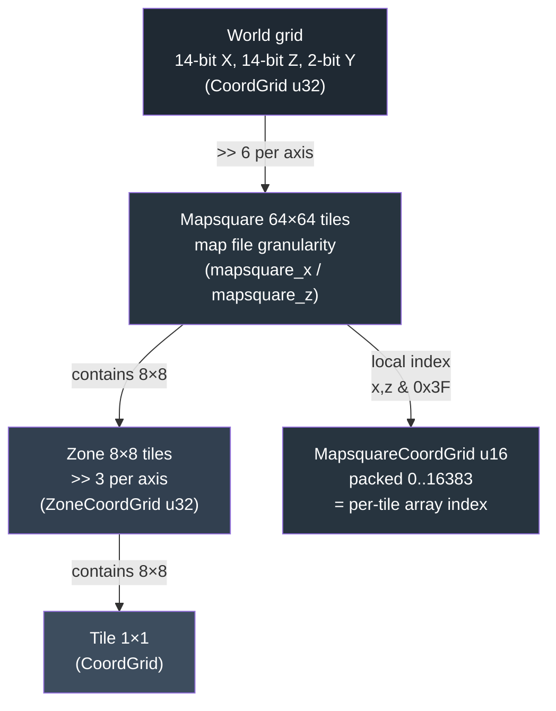

### `CoordGrid`: the 30-bit packed tile coordinate

`CoordGrid` (`rs-grid/src/coord.rs:22`) is a tuple struct wrapping a single `u32` and deriving
`Debug, Clone, Copy, PartialEq, Eq, Hash, Default`. Those derives are the entire point of the design — more on that
below. It packs three axes into 30 of the 32 bits; the top 2 bits are always zero.

#### Bit layout

```text
 bit  31 30 | 29 28 | 27 26 25 ............... 15 14 | 13 12 11 ............... 1  0
      ─────── ─────── ────────────────────────────── ──────────────────────────────
       0  0  |  y  y |  x  x  x  ...............  x  x |  z  z  z  ...............  z  z
      unused | level |        X  (north-south)        |        Z  (east-west)
      (zero) | 2 bit |            14 bit              |            14 bit

 packed = (z & 0x3FFF) | ((x & 0x3FFF) << 14) | ((y & 0x3) << 28)
```

| Field | Bits  | Mask     | Width | Range    | Axis meaning           |
|-------|-------|----------|-------|----------|------------------------|
| Z     | 0–13  | `0x3FFF` | 14    | 0–16383  | east–west tile column  |
| X     | 14–27 | `0x3FFF` | 14    | 0–16383  | north–south tile row   |
| Y     | 28–29 | `0x3`    | 2     | 0–3      | vertical plane / floor |
| —     | 30–31 | —        | 2     | always 0 | unused headroom        |

The constructor masks each component to its field width, so out-of-range inputs wrap silently rather than corrupting
neighbouring fields (`coord.rs:48-53`):

```rust
pub const fn new(x: u16, y: u8, z: u16) -> Self {
    CoordGrid(((z & 0x3FFF) as u32) | (((x & 0x3FFF) as u32) << 14) | (((y & 0x3) as u32) << 28))
}
```

The test suite pins this wrapping behavior: `x_z_overflow_masked` (`coord.rs:751`) asserts `new(0x4000, 0, 0x4000)`
yields `x() == 0`, and `y_wraps_at_4` (`coord.rs:734`) asserts `y == 4` reads back as `0`. Masking-on-construct is a
defensive choice — the engine never has to validate a coordinate it constructed, and a malformed script offset degrades
to a wrapped (still in-bounds) tile instead of bleeding into the level field.

`from(packed: u32)` (`coord.rs:77`) is the unchecked counterpart: it wraps a pre-packed `u32` with no masking, for the
hot path of deserializing coordinates that are already in layout (map data, packets, script variables). `packed()` (
`coord.rs:98`) returns the raw `u32`. The accessors are pure shift-and-mask:

| Accessor  | Expression                         | Returns |
|-----------|------------------------------------|---------|
| `x()`     | `((self.0 >> 14) & 0x3FFF) as u16` | `u16`   |
| `y()`     | `((self.0 >> 28) & 0x3) as u8`     | `u8`    |
| `z()`     | `(self.0 & 0x3FFF) as u16`         | `u16`   |
| `index()` | `(self.x(), self.y(), self.z())`   | tuple   |

Every accessor is `#[inline(always)]` and `const fn`, so they collapse to a couple of machine instructions at the call
site and can be evaluated at compile time (e.g. for `const` spawn points).

#### Why packed integers, not a struct

A naive `struct { x: u16, y: u8, z: u16 }` would occupy 6 bytes (8 padded) and would not be a viable hash-map key or a
cheap equality target. `CoordGrid`'s `u32` representation buys, concretely:

- **One-word copy.** `CoordGrid` is `Copy` and fits in a register. Passing it by value is free; it never touches the
  heap and never aliases.
- **Trivial, collision-free hashing.** Because the whole position is one `u32`, `Hash` hashes a single word. This is
  what makes `FxHashMap<ZoneCoordGrid, Box<Zone>>` (`rs-zone/src/zone_map.rs:17`) and `FxHashSet<ZoneCoordGrid>` (the
  engine's `zones_tracking`) fast — the key is a primitive, not a multi-field struct, and FxHash over a `u32` is a
  single multiply-xor.
- **Single-instruction equality and ordering.** `==` is a `u32` compare; the `inzone`/zone-change patterns in the test
  module reduce to integer comparisons.
- **Branch-free axis math.** Distance, zone, and mapsquare derivations are shifts and masks on one register with no
  field loads.
- **Round-trips through integer channels.** `packed()` lets a coordinate ride inside a script `int`, a network field, or
  a cache key with no serialization logic. The test `packed_to_i32_and_back` (`coord.rs:1114`) confirms the value
  survives a `u32 → i32 → u32` round-trip unchanged, which matters because the scripting VM stores coordinates as signed
  32-bit ints.

The 2 bits of headroom (30–31) are why a coordinate can be cast to `i32` and back without sign-bit contamination: a
valid `CoordGrid` never sets bit 31, so the `i32` reinterpretation is always non-negative. This mirrors the Java
reference, where coordinates are likewise a single packed `int`.

### Derived addressing: zones, mapsquares, build area

`CoordGrid` carries the conversion arithmetic for the coarser scales as `const fn` helpers, in both a static (
single-axis) and an instance form.

#### Zone derivation (`>> 3`)

| Method      | Definition      | Meaning                |
|-------------|-----------------|------------------------|
| `zone(pos)` | `pos >> 3`      | zone index of one axis |
| `zone_x()`  | `self.x() >> 3` | zone index along X     |
| `zone_z()`  | `self.z() >> 3` | zone index along Z     |

A zone is 8×8 tiles, so the zone index is the tile coordinate with its low 3 bits dropped. Zone-change detection
compares `zone_x`/`zone_z`/`y` between successive ticks: two tiles in the same 8×8 block produce identical zone indices
and so do not trigger a rebuild (test `zone_change_detection_same_zone`, `coord.rs:1039`), whereas crossing an 8-tile
boundary or changing level does (`coord.rs:1049`, `coord.rs:1059`).

#### Build-area / "center zone" arithmetic (`- 6`, `<< 3`)

The client renders a 13×13 zone build area around the player. The engine computes its origin from the player's zone with
a fixed `-6` offset (half of `13 - 1`), then converts back to tile space with `<< 3`:

| Method              | Definition               | Result                                          |
|---------------------|--------------------------|-------------------------------------------------|
| `zone_center(pos)`  | `zone(pos) - 6`          | origin zone index of the 13×13 build area       |
| `zone_center_x/z()` | `zone_x/z() - 6`         | per-axis origin zone index                      |
| `zone_origin(pos)`  | `zone_center(pos) << 3`  | south-west *tile* of the build-area origin zone |
| `zone_origin_x/z()` | `zone_center_x/z() << 3` | per-axis origin tile                            |

The composition `(>> 3) - 6) << 3` re-quantizes a tile to the south-west corner of the build-area origin zone, exactly
the value the client expects in a map-rebuild packet. Test `zone_origin_calculations` (`coord.rs:783`) pins
`zone_origin(3200) == ((3200 >> 3) - 6) << 3`. The build-area code in `rs-entity` consumes these:
`BuildArea::rebuild_zones` (`rs-entity/src/build.rs:209-232`) walks a 7×7 window centered on `coord.zone_x()/zone_z()`,
clips it to the `±6` build-area extent, and pushes `ZoneCoordGrid::new(x << 3, coord.y(), z << 3)` for each surviving
cell — converting back from zone index to a zone-aligned tile coordinate via `<< 3`.

These helpers do **not** guard against underflow: `zone_center` subtracts 6 from an unsigned zone index, so a coordinate
within 6 zones of the world origin would underflow. In practice no live content sits near tile (0,0); callers in the
build path use `saturating_sub(6)` explicitly (`build.rs:218-221`) where clipping is required, leaving the raw helper as
the fast unchecked form.

#### Mapsquare derivation (`>> 6`)

| Method           | Definition      | Meaning                     |
|------------------|-----------------|-----------------------------|
| `mapsquare(pos)` | `pos >> 6`      | mapsquare index of one axis |
| `mapsquare_x()`  | `self.x() >> 6` | mapsquare index along X     |
| `mapsquare_z()`  | `self.z() >> 6` | mapsquare index along Z     |

`>> 6` drops the low 6 bits (the 64-tile intra-mapsquare offset). For tile 3200, `mapsquare(3200) == 50` and the local
offset is `3200 & 0x3F == 0` (test `mapsquare_calculations`, `coord.rs:793`; `mapsquare_boundary`, `coord.rs:1104`). The
map loader keys cache map files by `(mapsquare_x, mapsquare_z)` and, having located the file, addresses individual tiles
inside it with `MapsquareCoordGrid` (below).

#### "Fine" coordinates for info packets

`fine(pos, size)` (`coord.rs:442`) computes `pos * 2 + size`, producing a half-tile-resolution position whose anchor
sits at the *center* of a `size`-wide entity rather than its south-west corner. This is the sub-tile granularity the
client expects in player/NPC info updates. It is called from the info encoders — `phases/info.rs:178-186` passes
`CoordGrid::fine(coord.x(), size)` / `fine(coord.z(), size)` for both players and NPCs, and `info.rs:830-831`/
`info.rs:1280-1281` use the size-1 form for relative position deltas. This is a direct port of the reference server's
`CoordGrid.fine`, preserving wire fidelity for the build-area-relative coordinate system the client decodes.

### Distance, area, and region predicates

`CoordGrid` carries the engine's spatial geometry. All of it operates on the X–Z plane and **ignores Y** — combat range,
visibility, and search never cross floors implicitly.

- **`in_distance(other, distance)`** (`coord.rs:471`) — Chebyshev (L-∞, "king-move") box test: true iff
  `|Δx| ≤ distance` and `|Δz| ≤ distance`. Branch-free, returns `bool`. Used for visibility and interaction-range
  gating. Test `in_distance_ignores_y` (`coord.rs:850`) confirms Y is disregarded.
- **`distance(other)`** (`coord.rs:498`) — Chebyshev distance `max(|Δx|, |Δz|)` as `i32`. The pathfinding/interaction
  range metric.
- **`euclidean_squared_distance(other)`** (`coord.rs:627`) — `Δx² + Δz²`, no `sqrt`. Used where only relative ordering
  matters (nearest-entity sorting), avoiding a floating-point root.
- **`distance_to(...)`** (`coord.rs:535`) — Chebyshev distance between two axis-aligned bounding boxes, each given as
  origin + `(w, l)`. It calls the private `closest(...)` (`coord.rs:577`) twice to find the nearest perimeter point on
  each rectangle (each axis independently clamped to `[src, src + size - 1]`), then takes the Chebyshev distance between
  them. Overlapping boxes yield 0. This is the metric for "can this player reach that large NPC/loc," where multi-tile
  footprints make point distance wrong.
- **`intersects(...)`** (`coord.rs:687`) — AABB overlap test using strict inequality, so edge-touching boxes do **not**
  intersect (test `intersects_touching_edge_no_overlap`, `coord.rs:867`). Note it takes `u16` args and computes
  `src_x + src_w` without widening, so callers must keep `origin + extent ≤ 65535`.
- **`is_in_wilderness()`** (`coord.rs:653`) — hard-coded membership in two rectangles: overworld
  `X∈[2944,3392), Z∈[3520,6400)` and the mirrored instance `X∈[2944,3392), Z∈[9920,12800)`. A `const fn` predicate
  gating PvP eligibility and multi-combat rules.

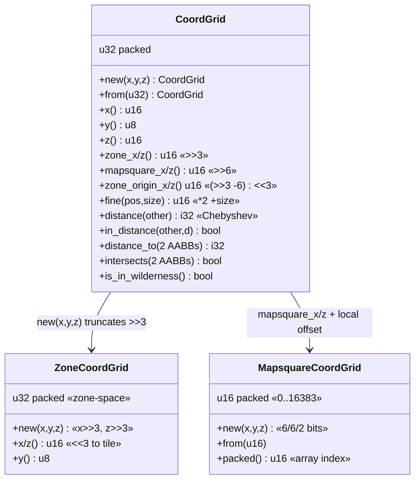

### `ZoneCoordGrid`: the 24-bit zone-space key

`ZoneCoordGrid` (`rs-grid/src/zone_coord.rs:23`) is the canonical key for everything zone-scoped. It packs zone
indices (not tile coordinates) into a `u32` and derives `Debug, Clone, Copy, PartialEq, Eq, Hash` — but notably **not**
`Default`, since a zero zone is a meaningful real location and the type is only ever constructed from an explicit
coordinate.

#### Bit layout

```text
 bit  31 ... 24 | 23 22 | 21 20 ............... 11 | 10 9 ................. 1  0
      ────────── ─────── ───────────────────────── ───────────────────────────────
       0  ...  0 |  y  y |  zZ  zZ  ...........  zZ |  zX  zX  ...........  zX  zX
       unused    | level |     zone Z (z >> 3)      |       zone X (x >> 3)
                 | 2 bit |        11 bit            |          11 bit

 packed = ((x>>3) & 0x7FF) | (((z>>3) & 0x7FF) << 11) | ((y & 0x3) << 22)
```

| Field   | Bits  | Mask    | Width | Range  | Meaning                      |
|---------|-------|---------|-------|--------|------------------------------|
| zone X  | 0–10  | `0x7FF` | 11    | 0–2047 | `x >> 3`, zone index along X |
| zone Z  | 11–21 | `0x7FF` | 11    | 0–2047 | `z >> 3`, zone index along Z |
| level Y | 22–23 | `0x3`   | 2     | 0–3    | vertical plane               |

`new(x, y, z)` takes **tile** coordinates and shifts them into zone space inside the constructor (
`zone_coord.rs:49-55`):

```rust
pub const fn new(x: u16, y: u8, z: u16) -> Self {
    ZoneCoordGrid(
        (((x >> 3) & 0x7FF) as u32)
            | ((((z >> 3) & 0x7FF) as u32) << 11)
            | (((y & 0x3) as u32) << 22),
    )
}
```

This `>> 3`-on-construct is the type's defining behavior: **every tile inside the same 8×8 zone produces the
same `ZoneCoordGrid`**. Tests `zone_coord_truncates_to_zone_boundary` (`zone_coord.rs:180`) and `zone_coord_alignment` (
`zone_coord.rs:258`) confirm `new(3200,…)` and `new(3207,…)` are equal, while `new(3208,…)` differs. The 11-bit zone
fields cover 0–2047 zones per axis = 0–16376 tiles in steps of 8, matching `CoordGrid`'s 14-bit tile range (
`2047 << 3 == 16376`).

The accessors invert the packing back to **zone-aligned tile** coordinates: `x()` is `(self.0 & 0x7FF) << 3` and `z()`
is `((self.0 >> 11) & 0x7FF) << 3` (`zone_coord.rs:114-155`), so they always return a multiple of 8 — the south-west
tile of the zone. `y()` is `(self.0 >> 22) as u8`; because the 2-bit field is the top occupied region with nothing above
it, no mask is needed.

#### Role in the engine

`ZoneCoordGrid` is the hash key that ties the spatial world together:

- **Zone storage.** `ZoneMap` holds `FxHashMap<ZoneCoordGrid, Box<Zone>>` (`rs-zone/src/zone_map.rs:17`).
  `ZoneMap::zone` / `zone_mut` (`zone_map.rs:52,75`) accept raw tile `(x, y, z)`, build a `ZoneCoordGrid::new(...)` (
  which auto-truncates to the zone), and look up the `Box<Zone>`. Each `Zone` also stores its own
  `coord: ZoneCoordGrid` (`rs-zone/src/zone.rs:42`).
- **Dirty tracking.** `Engine::track_zone(x, y, z)` (`rs-engine/src/engine.rs:1267`) inserts
  `ZoneCoordGrid::new(x, y, z)` into a `FxHashSet<ZoneCoordGrid>` of zones that changed this tick. Because the key
  truncates to the zone, multiple obj/loc mutations within the same 8×8 block coalesce into one set entry — the
  deduplication is free, a direct consequence of the packing. The zone phase (`rs-engine/src/phases/zone.rs:74-110`)
  calls `track_zone` whenever map state mutates.
- **Build-area streaming.** `BuildArea::rebuild_zones` pushes `ZoneCoordGrid::new(x << 3, …)` into `active_zones` (
  `rs-entity/src/build.rs:229`), the list of zones streamed to a player's client.

Using a packed `u32` here is what makes the per-tick zone set and the zone map cheap: insertion, lookup, and dedup all
hinge on hashing and comparing a single word.

### `MapsquareCoordGrid`: the 14-bit per-mapsquare array index

`MapsquareCoordGrid` (`rs-grid/src/mapsquare_coord.rs:22`) addresses one tile *within* a single 64×64 mapsquare, packed
into a `u16`. It derives the full set including `Default` (a zero offset is a valid corner tile). Its decisive property:
the packed value is a dense index `0–16383` usable directly as an array subscript.

#### Bit layout

```text
 bit  15 14 | 13 12 | 11 10 9 8 7 6 | 5 4 3 2 1 0
      ─────── ─────── ─────────────── ─────────────
       0  0  |  y  y |  x x x x x x  |  z z z z z z
      unused | level |   X (0..63)   |   Z (0..63)
             | 2 bit |    6 bit      |    6 bit

 packed = (z & 0x3F) | ((x & 0x3F) << 6) | ((y & 0x3) << 12)
```

| Field   | Bits  | Mask   | Width | Range | Meaning               |
|---------|-------|--------|-------|-------|-----------------------|
| Z       | 0–5   | `0x3F` | 6     | 0–63  | local Z within square |
| X       | 6–11  | `0x3F` | 6     | 0–63  | local X within square |
| level Y | 12–13 | `0x3`  | 2     | 0–3   | vertical plane        |
| —       | 14–15 | —      | 2     | zero  | unused                |

The 14 occupied bits give the full index range `0..=16383 == 64 × 64 × 4` — every tile across all four levels of one
mapsquare. The constructor `new(x, y, z)` masks each field (`mapsquare_coord.rs:48-52`), so `x = 64` wraps to `0` (test
`overflow_masked`, `mapsquare_coord.rs:189`). `from(packed)` (`mapsquare_coord.rs:76`) wraps an already-accumulated
`u16` with no masking — used by the sequential map decoder, which builds coordinate offsets arithmetically rather than
from discrete axes. Accessors `x()`, `y()`, `z()` (`mapsquare_coord.rs:116-156`) take `self` by value (the type is 2
bytes, so by-value is optimal) and shift-and-mask out each field.

#### Role in map decoding

The whole purpose of this type is to be a `usize` array index. In `GameMap` (`rs-engine/src/game_map.rs`), the
per-mapsquare collision/terrain flag array `lands` is indexed by `coord.packed() as usize`:

- `load_lands` decodes terrain opcodes and writes `lands[coord.packed() as usize] = opcode - 49` (
  `game_map.rs:160-172`).
- `load_locs` reads the bridge flag with `(lands[coord.packed() as usize] & LINK_BELOW) == LINK_BELOW` (
  `game_map.rs:183-204`, `255-266`). When a tile is bridged, it reconstructs the level-1 lookup coordinate via
  `MapsquareCoordGrid::new(coord.x(), 1, coord.z())` — re-using the decoded X/Z but forcing the level to 1 to read the
  flag below the bridge.
- `load_locs` / `load_objs` rebuild a typed coordinate from an accumulated offset with
  `MapsquareCoordGrid::from(coord as u16)` (`game_map.rs:257,365,426`).

Because the packed layout is contiguous and dense, the `lands` table is a flat `[_; 16384]`-style array rather than a
hash map: indexing is a bounds-checked array read with no hashing, which is exactly what a per-tile flag lookup hammered
during map load and collision queries needs. The 6/6/2 bit split mirrors the cache's own map-file coordinate encoding,
so the decoder reads cache bytes straight into this layout without remapping — preserving byte-fidelity with the
reference content pipeline.

### Conversions and the round-trip invariant

The three types form a one-way refinement chain from fine to coarse, with `CoordGrid` as the hub:

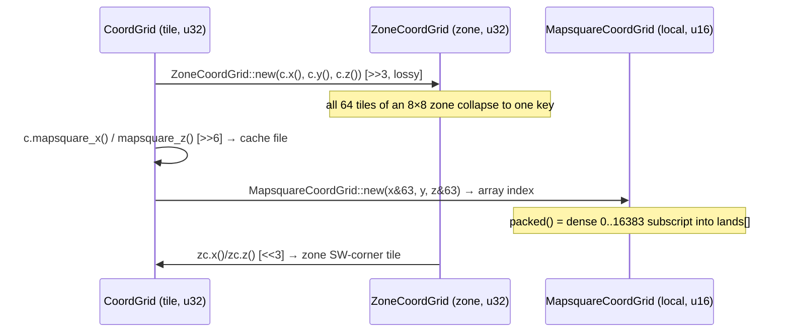

The conversions are deliberately **lossy in one direction**: tile → zone discards the intra-zone offset, tile →
mapsquare-local discards the mapsquare identity. They are reconstructible only with external context (the zone-aligned
`<<3` returns the SW corner; the mapsquare-local index is meaningful only paired with its `(mapsquare_x, mapsquare_z)`
file). The one *lossless* round-trip is `CoordGrid` ↔ `u32` via `packed()`/`from()`, the invariant the entire
serialization story rests on. The cross-type construction is exercised end-to-end by tests
`zone_coord_from_coord_grid` (`zone_coord.rs:249`) and `mapsquare_from_coord_grid` (`mapsquare_coord.rs:253`), the
latter confirming `CoordGrid::new(3200,1,3200)` → `mapsquare_x/z() == 50` → `MapsquareCoordGrid` local `(50, 1, 50)`.

### Design summary and trade-offs

The grid crate makes a single, consistent bet: **positions are integers, and spatial scale is a shift.** The pay-offs
are pervasive — `Copy` register-width values, primitive-key hash maps, branch-free axis math, lossless integer
serialization, and free deduplication of zone mutations. The costs are accepted deliberately: silent wrap-on-overflow
instead of validation (mitigated by masking-on-construct and the absence of live content near the world origin),
unchecked underflow in the raw `zone_center` helpers (mitigated by callers using `saturating_sub`), and `u16` arithmetic
in `intersects` that assumes bounded inputs. None of these can corrupt a *valid* coordinate, and every one trades a
runtime check for a cycle saved in code that runs for every entity, every tile, every tick. The layout choices — 14/14/2
for tiles, 11/11/2 for zones, 6/6/2 for mapsquare-local — are not arbitrary: they are the minimal bit widths that cover
the world's `16384`-tile span, `2048`-zone span, and `64`-tile mapsquare span respectively, and they reproduce the
reference server's encodings exactly so that map files, collision flags, and client build-area packets remain
byte-identical.

<sub>[↑ Back to top](#top)</sub>


---

<a id="sec-10"></a>

## 10. Zones — Spatial Partitioning & Event Broadcasting

The zone subsystem (`rs-zone`) is rs-engine's **area-of-interest (AOI) layer**. It answers one question very
efficiently, every tick, for every player: *"what changed in the patch of the world I can currently see, and who needs
to hear about it?"* The world is statically partitioned into a grid of **8×8-tile zones**; every dynamic world
mutation — a dropped item, a felled tree, an opened door, a fired projectile — is routed to exactly one zone,
accumulated there as a `ZoneEvent`, and flushed once per tick into the output buffers of only those players whose render
window overlaps the zone. This is the same locality-of-interest discipline used by the TS reference server (
LostCity/2004scape), where the unit is also an 8×8 `Zone`, but here it is rebuilt around bit-packed coordinates, boxed
hash-map storage, and a per-zone *pre-serialized shared buffer* so that a broadcast event is encoded **once** and
memcpy'd into N players rather than re-encoded per player.

This section covers the `ZoneMap` container and its `pack_zone_coord` keying, the `Zone` struct and its entity lists,
the `ZoneEvent` / `ZoneEventType` / `ZoneMessage` event model, the enclosed-vs-follows delivery split, the
buffer-then-flush tick discipline, and the full obj/loc lifecycle within a zone.

---

### Why 8×8? Locality of interest and bandwidth

A RS2 client at revision ~225 renders a window of roughly 104×104 tiles (13×13 zones), but the *build area* it is told
about is a 13×13 zone grid centred on the player, and the actively-streamed inner window is a **7×7 zone** ring (
`BuildArea::rebuild_zones`, `rs-entity/src/build.rs:209`, iterating `center ± 3` zones, i.e. 7 across). The 8×8 zone is
the quantum that makes this tractable:

- **Coarse enough** that the per-zone bookkeeping (entity `Vec`s, an event `Vec`) is tiny and the number of zones a
  player observes is a fixed ~49, not thousands of tiles.
- **Fine enough** that an event in one corner of the world is never serialized to, or even considered by, a player on
  the other side. A mutation touches exactly one zone; broadcasting it costs work proportional to *observers of that
  zone*, not *players online*.
- **Cheap to address**: an 8×8 partition means tile→zone is a 3-bit right shift (`>> 3`), and tile-within-zone is a
  3-bit mask (`& 7`). Both the zone key and the intra-zone packet coordinate fall out of pure bit ops with no division.
  The 8-tile size is also baked into the wire protocol — `pack_zone_coord` packs `x&7` and `z&7` into a single byte (
  `zone_message.rs:122`), so the geometry choice *is* a protocol constant, not a tunable.

The trade-off is the classic AOI one: a player standing on a zone boundary must observe up to 4 zones to see entities a
few tiles away, and the 7×7 active window deliberately over-covers the 13×13 build area so border movement does not pop
entities in and out. The engine accepts a slightly larger observed-zone set in exchange for never having to do per-tile
visibility math.

---

### ZoneCoordGrid — the 24-bit packed zone key

Zones are keyed by `ZoneCoordGrid` (`rs-grid/src/zone_coord.rs:23`), a newtype over a single `u32`. Tile coordinates are
shifted into zone space (`>> 3`) and packed:

```
bit:  23 22 | 21 ............ 11 | 10 ............. 0
      [ Y  ] [   zone Z (z>>3)   ] [  zone X (x>>3)  ]
       2 bit        11 bit               11 bit
```

Construction is a single `const fn` of shifts and masks (`zone_coord.rs:49`):

```rust
ZoneCoordGrid(
(((x > > 3) & 0x7FF) as u32)
| ((((z > > 3) & 0x7FF) as u32) < < 11)
| (((y & 0x3) as u32) < < 22),
)
```

| Field   | Bits  | Width  | Range  | Encodes                 |
|---------|-------|--------|--------|-------------------------|
| zone X  | 0–10  | 11 bit | 0–2047 | `x >> 3` (tile X / 8)   |
| zone Z  | 11–21 | 11 bit | 0–2047 | `z >> 3` (tile Z / 8)   |
| level Y | 22–23 | 2 bit  | 0–3    | height plane (no shift) |

Because the low 3 bits of X and Z are discarded, **every tile inside the same 8×8×1 cell maps to the
identical `ZoneCoordGrid`** — this is the property that makes the type usable directly as a hash key (it derives `Hash`,
`Eq`, `Copy`). The accessors `x()` / `z()` re-shift left by 3, so they always return *zone-origin tile coordinates* (
multiples of 8), which is exactly what the build-area offset math in `update_zones` expects. Note the level is masked to
2 bits and **wraps** at 4 (`y_wraps_at_4` test, `zone_coord.rs:187`) — there are only 4 height planes.

---

### ZoneMap — lazy, boxed, FxHashMap-backed storage

The global zone table is `ZoneMap` (`zone_map.rs:16`):

```rust
pub struct ZoneMap {
    pub zones: FxHashMap<ZoneCoordGrid, Box<Zone>>,
}
```

Three deliberate choices:

1. **`FxHashMap`, not a flat array.** A fully-dense world is 2048×2048×4 ≈ 16.7M zones; the overwhelming majority are
   empty water/void. A sparse hash map allocates storage only for zones that actually hold entities or fire events. The
   key is already a packed `u32`, and `FxHashMap` (rustc's `fxhash`) is the fast non-cryptographic hasher — ideal for an
   integer key on the hot lookup path.

2. **`Box<Zone>` values.** A `Zone` inlines five `Vec`s plus an `Option<Vec<u8>>` (~170 B). Boxing means each hash-map
   slot stores only a pointer (~8–12 B), so the open-addressing probe array stays compact and cache-resident. The
   lookup-heavy info phase (`get_nearby_*`, `update_zones`) walks many zones per tick; keeping the probe sequence in
   cache matters more than the one pointer indirection per *hit* (documented rationale at `zone_map.rs:11`).

3. **Lazy creation via `or_insert_with`.** `zone_mut` (`zone_map.rs:75`) only constructs a `Zone` on an actual insert:
   ```rust
   self.zones.entry(coord).or_insert_with(|| Box::new(Zone::new(coord)))
   ```
   The comment notes the prior eager `or_insert` built a throwaway `Zone` on *every* call even on a hit; the closure
   form avoids that allocation. The read path `zone()` (`zone_map.rs:52`) returns `Option<&Zone>` and **never**
   instantiates — critical because `update_zones` (below) deliberately uses the read path so that merely *observing* an
   empty zone does not litter the map with empty entries.

---

### The Zone struct

```rust
pub struct Zone {
    pub coord: ZoneCoordGrid,
    pub players: Vec<u16>,   // PIDs present
    pub npcs: Vec<u16>,      // NPC indices present
    pub locs: Vec<Loc>,      // map objects / scenery
    pub objs: Vec<Obj>,      // ground items
    events: Vec<ZoneEvent>,  // pending, this-tick only
    shared: Option<Vec<u8>>, // pre-encoded enclosed bytes
}
```

(`zone.rs:41`)

`players` and `npcs` are occupancy registries. They use **linear `contains` on add and `swap_remove` on delete** (
`add_player` `zone.rs:92`; `remove_player` `zone.rs:112`) — O(n) but n is tiny (a handful of entities per 8×8 cell), and
`swap_remove` is O(1) with order irrelevant. `locs` and `objs` are the authoritative storage for *dynamic* world
geometry and ground items in this cell. `events` is the per-tick mutation log; `shared` is its pre-serialized broadcast
form. Both `events` and `shared` are transient — wiped every tick by `reset()`.

#### Loc and Obj entity identity

Each entity carries a **zone-local identity** used to cancel superseded events:

- `Loc::lid()` (`rs-entity/src/loc.rs:204`) packs local `x&7` (3 bits), `z&7` (3 bits) and the 2-bit collision `layer` →
  a `u64`. Two locs at the same tile on different layers have distinct lids (`loc_entity_key_differs_by_layer` test).
- `Obj::oid()` (`rs-entity/src/obj.rs:108`) packs local `x&7`, `z&7`, the 16-bit type `id`, **and** the receiver's lower
  32 bits. So the same item type at the same tile owned by two different players is two distinct oids (
  `obj_entity_key_differs_by_receiver`). Public objs use receiver `0` in the key.

These ids are the join key for `clear_queued_events` (below). They intentionally collapse to the *tile*, not an instance
handle, because the protocol addresses zone updates by tile-within-zone — a second `LocAddChange` at a tile *replaces*
the first on the client, so the server must cancel the stale queued event rather than send both.

#### Lifetime semantics: Respawn vs Despawn

`EntityLifeTime` (`rs-entity/src/lifetime.rs:8`, `#[repr(u8)]`, `Respawn = 0`, `Despawn = 1`) governs storage and
visibility:

| Lifetime  | Origin             | On add to zone                               | On remove                                    | Visibility rule                                                                    |
|-----------|--------------------|----------------------------------------------|----------------------------------------------|------------------------------------------------------------------------------------|
| `Respawn` | map cache (static) | **not** re-pushed (already in `locs`/`objs`) | stays in storage, hidden until respawn clock | locs: visible iff changed or never-clocked; objs: visible iff `clock ≥ last_clock` |
| `Despawn` | runtime (scripts)  | pushed into `locs`/`objs`                    | `swap_remove`d from storage                  | locs: always visible while present; objs: visible iff `clock < last_clock`         |

The asymmetry is the heart of the design: **static map entities never leave their `Vec`** — removing a respawnable tree
just reverts/hides it and arms a respawn timer, so the slot is reused — whereas **runtime entities are physically
inserted and swap-removed**. `Obj::visible(clock)` (`obj.rs:91`) encodes this: `last_clock == u64::MAX` ⇒ always
visible; otherwise despawn objs are visible *before* their clock, respawn objs *at/after* it. `Loc::visible()` (
`loc.rs:82`) is clockless: despawn locs are always visible, respawn locs are visible only when `is_changed()` or
`last_clock.is_none()`.

---

### The event model: ZoneEvent, ZoneEventType, ZoneMessage

A queued mutation is a `ZoneEvent` (`zone_event.rs:21`):

```rust
pub struct ZoneEvent {
    pub event_type: ZoneEventType,   // Enclosed | Follows
    pub receiver37: Option<u64>,     // target player UID (lower 37 bits) for Follows
    pub message: ZoneMessage,        // the wire payload
    pub id: Option<u64>,             // oid/lid for cancellation, None for map anims
}
```

`ZoneEventType` (`zone_event_type.rs:7`) is a two-variant enum that is the **delivery-scope discriminator**:

- **`Enclosed`** — broadcast to *every* player observing the zone. Batched into the shared buffer and written once.
- **`Follows`** — delivered to a *single* receiver identified by `receiver37`. Filtered per-player at flush time.

`ZoneMessage` (`zone_message.rs:21`) is a closed enum wrapping the ten server-protocol payload structs that a zone can
emit:

| Variant        | Meaning                                       | Queued by                              |
|----------------|-----------------------------------------------|----------------------------------------|
| `ObjAdd`       | ground item appears                           | `add_obj`, `respawn_obj`               |
| `ObjDel`       | ground item removed                           | `remove_obj_at`                        |
| `ObjCount`     | stack count changed (merge/stack)             | engine merge paths                     |
| `ObjReveal`    | private item becomes public                   | `reveal_obj`                           |
| `LocAddChange` | loc placed or its type/shape/angle changed    | `add_loc`, `change_loc`, `respawn_loc` |
| `LocDel`       | loc removed/hidden                            | `remove_loc`                           |
| `LocAnim`      | loc plays an animation sequence               | `anim_loc`                             |
| `LocMerge`     | multi-tile loc render merge across boundary   | `merge_loc`                            |
| `MapAnim`      | tile spot animation (entity-less)             | `anim_map`                             |
| `MapProjAnim`  | projectile flight between tiles (entity-less) | `map_proj_anim`                        |

`ZoneMessage` carries the **self-serialization contract** for zone updates. `sizeof_zone()` returns
`1 + message.sizeof()` (the `+1` is the protocol opcode byte) and `encode_zone()` writes `p1(PROT)` then the payload (
`zone_message.rs:73`, `:49`, free fn `encode` at `:99`). This pairing is what lets `compute_shared` size the buffer
exactly before encoding — no reallocation, no over-allocation.

Two free packers complete the wire contract:

- `pack_zone_coord(x, z) = (x&7)<<4 | (z&7)` (`zone_message.rs:122`) — intra-zone tile into one byte (high nibble X, low
  nibble Z).
- `pack_shape_angle(shape, angle) = (shape<<2) | (angle&3)` (`zone_message.rs:141`) — loc shape (6 bits) + angle (2
  bits).

---

### Enclosed vs Follows — receiver-scoped privacy

The enclosed/follows split exists because RS2 ground items are **per-player private on drop**. When a player drops loot,
only they (the `receiver37`) see it for `REVEAL_TICKS = 100` ticks (`rs-entity/src/obj.rs:5`); after that it "reveals"
to everyone. The zone models this directly:

- `add_obj(obj, receiver37)` (`zone.rs:714`): if `receiver37.is_none()` ⇒ `Enclosed` event (public); else ⇒ `Follows`
  event targeted at that UID. The obj's `oid()` (which folds in the receiver) is the cancellation key.
- `reveal_obj(...)` (`zone.rs:820`): clears `receiver37` to `NO_RECEIVER`, sets `reveal = u64::MAX`, and queues an *
  *`Enclosed`** `ObjReveal` — the item flips from private to public, so its update must now reach all observers.
- `remove_obj_at(...)` (`zone.rs:955`): mirrors current visibility — a still-private obj emits a `Follows` `ObjDel` (
  only the owner sees the removal), a public obj emits `Enclosed`. The test pair
  `remove_obj_revealed_then_delete_uses_enclosed` / `remove_obj_unrevealed_delete_uses_follows` pins this exactly.

Visibility is enforced again at read time. `visible_objs(user37, clock)` (`zone.rs:378`) yields an obj only if
`obj.visible(clock) && (receiver37 == NO_RECEIVER || receiver37 == user37)`. `visible_follows_events(user37)` (
`zone.rs:401`) filters queued follows events by `receiver37.is_none_or(|r| r == user37)`. So privacy is
belt-and-suspenders: at queue time (event type), at flush time (per-player follows filter), and at zone-entry snapshot
time (`visible_objs`).

---

### Per-tick discipline: buffer → compute shared → flush → reset

Zone events are **double-buffered against the tick**: mutations accumulate during the world/script phases, are
pre-serialized in the zones phase, flushed during output, then cleared in cleanup. This maps onto four distinct points
in `Engine::cycle()`'s 13-phase loop.

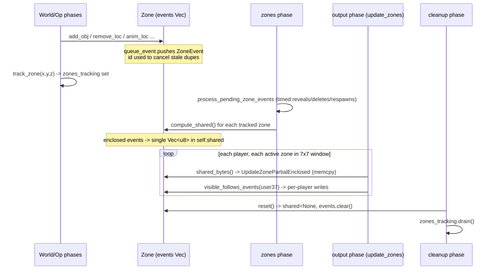

#### 1. Queue (world / op / script phases)

Every mutating `Zone` method funnels through `queue_event` (`zone.rs:223`), which simply pushes a `ZoneEvent`.
Crucially, the engine also calls `track_zone(x, y, z)` (`engine.rs:1267`) to insert the `ZoneCoordGrid` into
`self.zones_tracking: FxHashSet<ZoneCoordGrid>` (`engine.rs:394`). **Only tracked zones are ever serialized or reset** —
a zone that fired no events this tick is skipped entirely, so the per-tick work is proportional to *dirty* zones, not
loaded zones.

**Event cancellation** is the subtle correctness mechanism. `clear_queued_events(id)` (`zone.rs:253`) does
`self.events.retain(|e| e.id != Some(id))`. Before queuing a `LocDel`, `remove_loc` first cancels any pending
`LocAddChange` for the same `lid` (`zone.rs:533`); `reveal_obj` and `remove_obj_at` do the same on `oid`. Without this,
a loc added and removed in the *same tick* would send the client a phantom add followed by a delete (the test
`remove_loc_cancels_previous_events` asserts only the `LocDel` survives). Because the protocol is tile-addressed and
idempotent-by-replacement, the server must coalesce to the *final* state per entity per tick.

#### 2. Timed events + compute_shared (zones phase)

`Engine::zones()` (`phases/zone.rs:27`) runs two steps. First, `process_pending_zone_events` (`:54`) drains the
`BTreeMap<u64, Vec<PendingZoneEvent>>` (`engine.rs:395`) of events whose tick has arrived — using
`split_off(&(clock+1))` to cleanly partition due-vs-future in log time. These deferred events (
`PendingZoneEvent::{ObjReveal, ObjDelete, ObjAdd, LocDelete}`, `engine.rs:147`) call back into the zone (`reveal_obj`,
`remove_obj_by_clock`, `respawn_obj`, and the loc despawn/respawn/revert logic) and **re-`track_zone`** the affected
cells, so their freshly-queued `ZoneEvent`s get serialized this same tick. This is how a 100-tick reveal timer or a
respawn delay surfaces as a wire update.

Then `compute_zone_shared` (`phases/zone.rs:131`) iterates `zones_tracking` and calls `Zone::compute_shared()` on each.
`compute_shared` (`zone.rs:273`):

1. Sums `sizeof_zone()` over **enclosed-only** events.
2. If 0, leaves `shared = None` and returns (no allocation for follows-only zones — see
   `compute_shared_empty_when_no_enclosed`).
3. Allocates one `Packet` of exact length and `encode_zone`s every enclosed event into it.
4. Stores `Some(buf.data[..buf.pos].to_vec())`.

This is the **single most important performance lever in the subsystem**: a zone observed by 30 players encodes its
broadcast payload **once**, not 30 times. The Java reference re-walks the event list per player; here the byte buffer is
computed in the zones phase and every observer just memcpy's it. Follows events are intentionally *excluded* from the
shared buffer because they are receiver-specific.

#### 3. Flush (output phase → `update_zones`)

`Engine::outputs()` calls `ActivePlayer::update_zones(&self.zones, self.clock)` per player (`phases/output.rs:100`; impl
at `active_player.rs:1944`). For each of the player's `active_zones` (the 7×7 window, `rs-entity/src/build.rs:228`):

- It prunes `loaded_zones` to those still active, then for each active zone computes the build-area-relative `(x, z)`
  offset from the zone-origin coordinate (`active_player.rs:1965`).
- Zones not allocated in `rsmod` are skipped (`is_zone_allocated`, `:1959`).
- It uses the **read-only** `zones.zone(...)` (`:1974`). A `None` (never-instantiated) zone newly entering the window
  emits only `UpdateZoneFullFollows` (a clear) — it has no entities or events, so nothing else is needed, and no empty
  `Zone` is created.
- **Newly loaded** zones get a full snapshot: `UpdateZoneFullFollows`, then a `visible_objs` walk emitting `ObjAdd`s,
  then a `locs` walk emitting `LocDel` for hidden respawn locs or `LocAddChange` for despawn/changed locs (`:1976`–
  `:2014`). This is the "you just walked into view, here is everything" path.
- **Every** in-window zone then appends incremental updates: if `shared_bytes()` is `Some`, one
  `UpdateZonePartialEnclosed { x, z, bytes }` memcpy's the whole broadcast blob (`:2017`); if `has_follows_events()`, an
  `UpdateZonePartialFollows` header is written followed by per-message writes for the events
  `visible_follows_events(user37)` yields (`:2021`).

So a single player's zone output is: full snapshots for zones just entered + a memcpy'd enclosed blob + filtered follows
messages, for ~49 zones.

#### 4. Reset (cleanup phase)

`Engine::cleanups()` → `reset_zones()` (`phases/cleanup.rs:61`) **drains** `zones_tracking` and calls `Zone::reset()` (
`zone.rs:418`) on each: `shared = None; events.clear()`. Draining the tracking set means next tick starts with zero
dirty zones. The entity `Vec`s (`locs`, `objs`, `players`, `npcs`) are *not* touched — only the transient per-tick
event/shared state is wiped. This is the buffer flip: the zone's authoritative state persists, its tick journal resets.

---

### Obj lifecycle within a zone

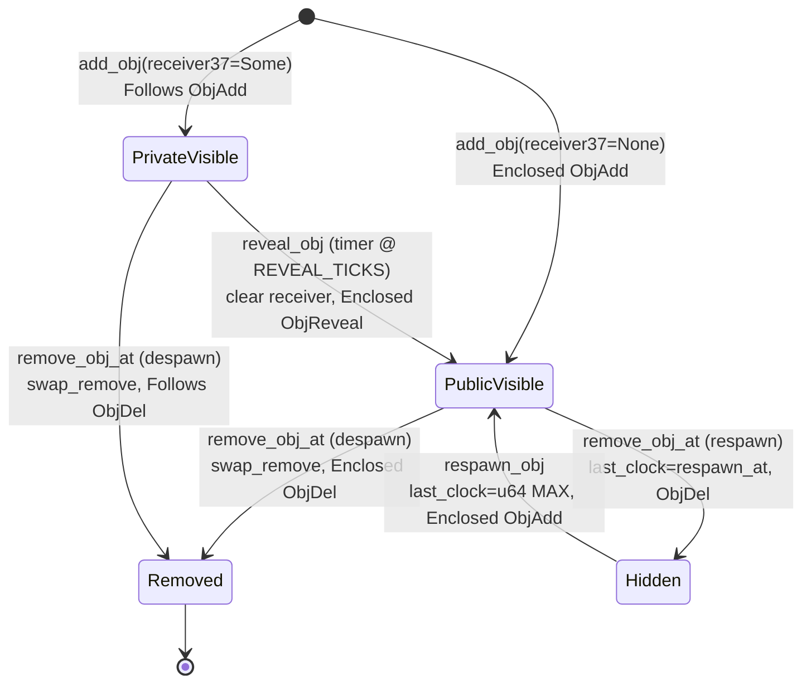

Key invariants enforced in code:

- **Clock-guarded deletion.** `remove_obj_by_clock(x, z, id, expected_clock)` (`zone.rs:864`) only matches an obj whose
  `last_clock == expected_clock`. If a merge/stack updated the clock since the despawn was scheduled, the stale delete
  is a **no-op** (`merge_obj_stale_delete_ignored`). This prevents a scheduled despawn from deleting a freshly-merged
  stack that legitimately reset its timer.
- **Receiver-aware lookup.** `get_obj(..., Some(r))` (`zone.rs:780`) matches public objs *or* the receiver's own;
  `get_obj_of_receiver` (`:754`) requires an exact receiver match. `remove_obj` additionally requires `Despawn` lifetime
  *or* `last_clock == u64::MAX` (currently-visible respawn obj) so it never "removes" an already-hidden respawn obj (
  `remove_obj_skips_already_hidden_respawn`).
- **Respawn objs persist.** `add_obj` only pushes `Despawn` objs into the `Vec` (`zone.rs:723`); respawn objs are
  assumed already present (loaded as statics). Removal of a respawn obj sets `last_clock = respawn_at` rather than
  deleting (`:969`), and `respawn_obj` flips it back to `u64::MAX`.

`ObjReveal` after `clear_queued_events` is what makes the private→public transition atomic on the wire: any
still-pending `Follows ObjAdd` for that oid is cancelled, and a single `Enclosed ObjReveal` carrying the original
owner's `receiver_pid` (for client-side render attribution) is sent (`zone.rs:826`–`:841`).

---

### Loc lifecycle within a zone

Locs are world geometry (walls, doors, scenery). Their lifecycle interacts with the **collision map**, so the zone phase
couples loc transitions with `apply_loc_collision` / `revert_loc` / `remove_loc` in the engine:

- `add_loc(loc)` (`zone.rs:444`): reverts the loc to base, clears `last_clock`, pushes it (despawn only), queues
  `Enclosed LocAddChange`.
- `change_loc(idx)` (`zone.rs:486`): caller has already mutated the loc via `Loc::change` (e.g. door open); this clears
  the clock and emits the changed `LocAddChange`.
- `remove_loc(idx)` (`zone.rs:527`): cancels stale events; despawn locs are `swap_remove`d, respawn locs are `revert()`
  ed in place (kept for later respawn); emits `Enclosed LocDel`.
- `respawn_loc(idx)` (`zone.rs:613`): reverts, clears clock, emits `LocAddChange` to re-show the static loc.
- `anim_loc` / `merge_loc` (`:645`, `:683`): emit `LocAnim` / a pre-built `LocMerge` without changing storage.

The deferred `PendingZoneEvent::LocDelete` handler (`phases/zone.rs:88`) shows the three-way fork: a despawn loc whose
timer fired is fully removed (`remove_loc`); a hidden respawn loc is respawned and its **collision re-applied** (
`apply_loc_collision(..., true)`, `:109`); a changed-but-still-visible loc is reverted (`revert_loc`). This is why locs
and the collision grid must stay in lock-step — a respawned wall must re-block movement the same tick it reappears.

Static locs/objs loaded at startup use `add_static_loc` / `add_static_obj` (`zone.rs:174`, `:194`) which push to storage
**without queuing any event** — the client receives static geometry through the map-load / build-area protocol, not the
per-tick zone-update stream, so emitting events for them would be redundant wire traffic.

---

### End-to-end: a world mutation becomes per-player packets

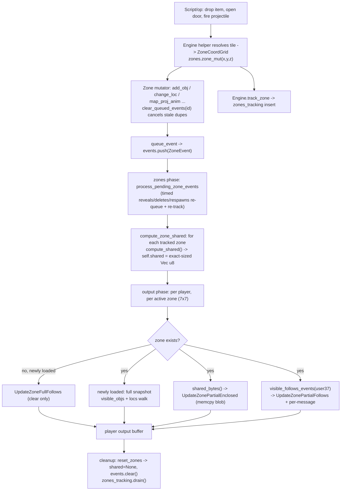

The throughline: **one mutation → one zone → one queued event → one shared encode → N memcpy flushes → wipe.** Work
scales with dirty zones and their observers, never with world size or total player count, and the broadcast payload is
encoded exactly once per tick per zone.

---

### Engineering rationale & fidelity notes

- **Single encode, many sends.** The `shared: Option<Vec<u8>>` cache is the rs-engine improvement over the reference
  server's per-player re-walk. The cost is one heap `Vec` per dirty zone per tick (allocated exact-sized via the
  pre-sum), amortized across all observers; for a zone seen by even a few players this is a clear win, and follows-only
  zones skip the allocation entirely.
- **Tile-addressed idempotency drives cancellation.** Because zone updates are addressed by tile-within-zone and the
  client replaces state per tile, the server must collapse to final per-entity state each tick — hence
  `clear_queued_events` keyed on `lid`/`oid`. This faithfully reproduces the reference behavior where re-adding a loc
  supersedes the prior add.
- **Dirty-set, not full-scan.** `zones_tracking` (an `FxHashSet`) means `compute_zone_shared` and `reset_zones` touch
  only mutated zones. The reference server similarly tracks "active zones"; rs-engine makes the set explicit and
  integer-keyed.
- **Lazy + boxed map.** Sparse `FxHashMap<_, Box<Zone>>` trades a pointer indirection for a cache-resident probe array
  and zero storage for the millions of empty world cells — the read path never instantiates, so observation is
  allocation-free.
- **Privacy is triple-checked.** Event type at queue time, follows filter at flush time, and `visible_objs` receiver
  check at zone-entry snapshot — matching the original's per-player ground-item visibility while keeping broadcast items
  on the cheap shared path.

<sub>[↑ Back to top](#top)</sub>


---

<a id="sec-11"></a>

## 11. Entities — Players, NPCs, Locs & Objs

The `rs-entity` crate (`rs-engine/rs-entity/src/`) defines the four world-entity
kinds the engine simulates — **players**, **NPCs**, **locs** (placed scenery /
"locations"), and **objs** (ground items) — together with the shared building
blocks they are composed from: the movement/pathing model (`pathing.rs`), the
interaction state machine (`interaction.rs`), the script/delay state
(`state.rs`), the update-mask container (`rs-info::EntityMasks`), the packed
unique identifiers (`PlayerUid`/`NpcUid`, defined in `rs-vm`), and the viewport
tracker (`BuildArea`). This is the data layer the 13-phase tick loop mutates;
every other subsystem (the VM, the info renderer, the zone broadcaster) reads or
writes the structs described here.

The design philosophy throughout is *aggressive struct-of-fields composition for
the active, mutating entities* (Player, Npc) and *bit-packing for the dense,
mostly-immutable ground entities* (Loc, Obj). Players and NPCs are large,
heap-resident, individually-owned structs touched dozens of times per tick;
clarity and cache-friendly direct field access win. Locs and objs exist by the
hundreds of thousands across the map, are copied around freely, and have a
small, fixed set of fields — so they collapse into a single `u128`/`u64` word.
This split mirrors the TS reference server's logical model while replacing
its object-graph-of-class-instances representation with flat, allocation-light
Rust types.

### 1. Entity taxonomy and the two representation strategies

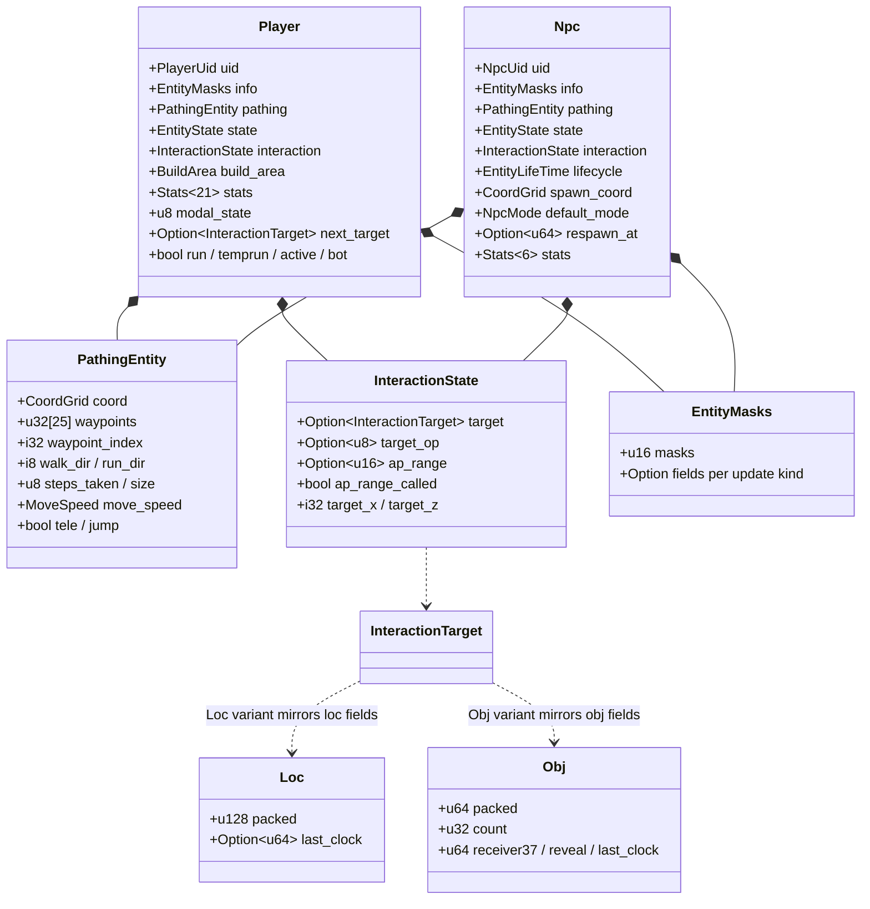

Player and Npc both *embed* (by value, no indirection) a `PathingEntity`, an
`EntityState`, an `InteractionState`, and an `EntityMasks`. The same four
components reused across both means the movement, interaction, delay, and
update-encoding logic is written once and shared via the `FocusKind`
discriminator (`rs-info/src/lib.rs:16`) rather than duplicated per entity type —
the Rust analogue of the reference server's `PathingEntity` base class, but with
composition instead of inheritance.

### 2. Identity: packed UIDs

Both UID types are single-integer newtypes (`rs-vm/src/player_uid.rs`,
`rs-vm/src/npc_uid.rs`) so they are `Copy`, fit in a register, and can be pushed
onto the script VM stack as an `i32`/`i64` without allocation.

`PlayerUid(u128)` packs the base37 username hash with the player slot index:

```
PlayerUid bit layout (u128)
┌─────────────────────────────────────────┬───────────────┐
│ username37  (base37 hash, upper bits)    │ pid  (11 bits)│
└─────────────────────────────────────────┴───────────────┘
 packed = (to_userhash(name) << 11) | (pid & 0x7FF)
```

`pid()` masks the low 11 bits → range `0..=2047`, which is exactly
`MAX_PLAYERS = 2048` (`build.rs:4`). `username37()` shifts right 11 to recover
the hash, decodable back to a string via `username()`/`screen_name()`
(`player_uid.rs:73,88`). Packing identity *and* slot in one value lets the engine
carry "who and where" in a single comparison; the base37 hash is also how
receiver-only objs are matched to a player (`find_pid_by_user37`).

`NpcUid(u32)` packs the NPC **type id** in the high 16 bits and the **slot
index** (`nid`) in the low 16 bits: `packed = (id << 16) | nid`
(`npc_uid.rs:26`). `nid()` is a direct index into the engine's NPC array
(`npcs[nid as usize]`), bounded by `MAX_NPCS = 8192` (`build.rs:6`). Storing the
type id in the UID is what makes `Npc::reset_pathing_entity(respawn=true)` able to
*restore the original type* after a polymorph: `self.uid = NpcUid::new(self.base_type, self.uid.nid())`
(`npc.rs:238`) rebuilds the UID from the immutable `base_type` while keeping the
slot.

| Constant       | Value      | Source       | Meaning                                |
|----------------|------------|--------------|----------------------------------------|
| `MAX_PLAYERS`  | 2048       | `build.rs:4` | player slots; matches 11-bit pid       |
| `MAX_NPCS`     | 8192       | `build.rs:6` | NPC slots; low 16 bits of `nid`        |
| `REVEAL_TICKS` | 100        | `obj.rs:5`   | ticks before a private obj goes public |
| `NO_RECEIVER`  | `u64::MAX` | `obj.rs:7`   | sentinel: obj visible to all           |

### 3. The Player struct

`Player` (`player.rs:103`) is the largest and most heavily-mutated struct in the
engine — ~70 fields. It is *not* bit-packed: it is touched many times per tick by
input decoding, the VM, movement, interaction, and info encoding, so direct named
field access (and the cache locality of one contiguous allocation) matters more
than shrinking it. Fields group into:

- **Identity / flags**: `uid`, `bot`, `active`, `low_memory`, `is_member`,
  `staff_mod_level` (defaults to `Developer` under `debug_assertions`, `Normal`
  otherwise — `player.rs:217-220`), `allow_design`.
- **Embedded components**: `info: EntityMasks`, `pathing: PathingEntity`,
  `state: EntityState`, `interaction: InteractionState`, `build_area: BuildArea`,
  `cam_queue: CamQueue`.
- **Stats / progression**: `stats: Stats<21>` (21 skills), `combat_level`,
  `hero_points`, `runenergy` (starts 10000 — `player.rs:203`), `runweight`,
  `varps: VarSet`, `playtime`.
- **Movement intent**: `run`, `temprun`, `run_step`, `move_request`,
  `path: Option<Vec<CoordGrid>>` (the smart-path result, separate from the
  pathing waypoint ring).
- **Interface / modal state**: `modal_state: u8` bitmask plus per-slot component
  ids (`modal_main`, `modal_chat`, `modal_side`, `modal_tutorial`), `last_*`
  shadow copies for delta detection, the 14-element `tabs` array, and refresh
  flags.
- **Interaction continuation**: `next_target: Option<InteractionTarget>`,
  `opcalled`, `walktrigger`.
- **Inventories / interface listeners**: `invs: HashMap<u16, Inventory>` plus
  three transmit-tracking maps and an `inv_first_seen` set.
- **AFK / anti-macro**: `afk_zones: [u32; 2]`, `last_afk_zone`,
  `afk_event_ready`.
- **Logout**: `logout_requested`, `logout_prevented_until`,
  `logout_prevented_message`, `logout_sent`.

#### 3.1 Modal state as a bitmask

The five `MODAL_*` constants (`player.rs:20-28`) are a one-byte bitfield:

| Flag         | Bit    | Blocks input? |
|--------------|--------|---------------|
| `MODAL_NONE` | `0`    | —             |
| `MODAL_MAIN` | `1<<0` | **yes**       |
| `MODAL_CHAT` | `1<<1` | **yes**       |
| `MODAL_SIDE` | `1<<2` | no            |
| `MODAL_TUT`  | `1<<3` | no            |

`contains_modal_interface()` tests only `MODAL_MAIN | MODAL_CHAT`
(`player.rs:282`); those two are the *blocking* modals. This feeds the central
gate `busy() = delayed || contains_modal_interface()` and
`can_access() = !protect && !busy()` (`player.rs:390-398`), which the interaction
phase consults before letting a player act. The `open_*_modal` helpers
(`player.rs:536-649`) enforce mutual exclusion: opening a chat modal clears
`MODAL_MAIN`/`MODAL_SIDE`; opening a main modal clears `MODAL_CHAT`/`MODAL_SIDE`;
the side modal *coexists* (no eviction). Each opener also calls
`clear_suspended_script()` (`player.rs:375`), which drops an `active_script`
whose `ExecutionState` is `CountDialog` or `PauseButton` — opening a new
interface invalidates a dialog that was waiting for the old one's input.

#### 3.2 Per-tick reset

`reset_pathing_entity(respawn)` (`player.rs:741`) is the per-tick "clear the
slate" called at the top of the cycle. It resets the info masks
(`info.reset()`), nulls the pathing step/dir/tele/jump fields, records
`last_coord = coord`, zeroes `steps_taken`, drops `protect`/`opcalled`/
`ap_range_called`, and sets `move_speed` from the `run` flag. When `respawn` is
true it additionally `unfocus()`es (resets orientation south). Crucially it does
**not** clear `interaction.target` or the waypoint queue — the tests
`reset_does_not_clear_interaction` / `reset_does_not_clear_waypoints`
(`player.rs:1075,1083`) pin this, because interactions must persist across ticks
while the player walks toward the target.

#### 3.3 Combat level — verified integer rewrite

`get_combat_level()` (`player.rs:412`) is a noteworthy fidelity case. The
original RS formula is floating-point: `floor(0.25*base + 0.325*max(melee,
range, magic))`. The Rust version factors out the irrational-in-binary constant
`0.325` into exact integer arithmetic — `0.25 = 10/40`, `0.325 = 13/40` — and
computes `floor((10*base_sum + 13*max_sum) / 40)` using only shifts and one
divide (`player.rs:433`). The module `combat_level_tests` (`player.rs:766`)
*exhaustively* proves bit-identity against the `f64` reference over the entire
reachable domain (`base_sum 0..=247`, `max_sum 0..=198`), guarding against any
rounding boundary where `0.325`'s f64 representation would diverge.

### 4. The Npc struct

`Npc` (`npc.rs:20`) mirrors the Player's component layout (`pathing`, `state`,
`interaction`, `info`, `vars`, `stats: Stats<6>`, `hero_points`) plus AI-specific
state:

- **Spawn / lifecycle**: `spawn_coord`, `base_type`, `lifecycle: EntityLifeTime`
  (defaults `Respawn` — `npc.rs:91`), `respawn_at: Option<u64>`, `active`.
- **AI modes**: `default_mode: NpcMode`, `wander_range`, `max_range`,
  `wander_counter`, `target_player`.
- **Hunt**: `hunt_mode`, `hunt_range`, `hunt_clock`, `hunt_target`.
- **Patrol**: `next_patrol_point`, `next_patrol_tick`, `delayed_patrol`.
- **Timers / regen**: `timer_interval`, `timer_clock`, `regen_clock`.
- **Polymorph / revert**: `revert_at: Option<u64>`, `revert_reset`.
- **Visibility bookkeeping**: `observers: u16` (how many players currently track
  this NPC).

NPCs default to `MoveStrategy::Naive` and `MoveRestrict::Normal`
(`npc.rs:78`), versus players which use `MoveStrategy::Smart` and
`MoveRestrict::Player` (`player.rs:197`). NPC interactions are keyed by
`NpcMode` rather than the player `ServerTriggerType`: `clear_interaction()` resets
`target_op` to `NpcMode::None` (`npc.rs:122`) rather than fully `None`, since an
NPC is always *in* some behavior mode. `reset_defaults()` (`npc.rs:183`)
reconfigures hunt/timer settings from config when an NPC returns to its default
mode.

`Npc::reset_pathing_entity(respawn)` (`npc.rs:236`) splits sharply by branch. On
`respawn` it does a **full restore**: rebuild the UID from `base_type`,
`unfocus`, `stats.reset()`, clear hero points, clear the script `queues`, set
`tele = true` (so the client snaps to the respawn position), and clear
`revert_at`/`revert_reset`. The non-respawn branch is the lightweight per-tick
reset (info masks, walk step/dirs, steps, protect, `ap_range_called`,
`set_face_entity`).

### 5. Movement and pathing (`pathing.rs`)

`PathingEntity` (`pathing.rs:24`) owns all movement state. The waypoint store is
a **fixed inline array `waypoints: [u32; 25]`** with an `i32 waypoint_index`
acting as a LIFO stack pointer (`-1` = empty). Each waypoint is a packed coord
`(x << 14) | z` (`pathing.rs:150`). The fixed array avoids per-step heap traffic;
25 is the protocol's path-length ceiling.

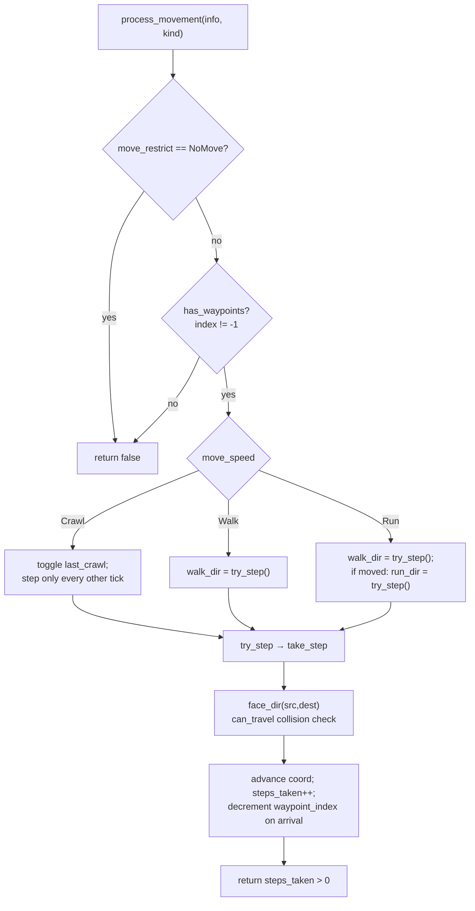

**Speed model** (`MoveSpeed`, `player.rs:48`): `Stationary=0` (no move),
`Crawl=1` (one tile every *other* tick, via the `last_crawl` toggle —
`pathing.rs:113`), `Walk=2` (one tile/tick), `Run=3` (two tiles/tick — a second
`try_step` populates `run_dir`, `pathing.rs:120`). The two direction outputs
`walk_dir`/`run_dir` (`i8`, `-1` = none) are exactly what the info protocol
encodes per tick.

**`take_step()`** (`pathing.rs:315`) is the collision-aware stepper. It computes
the octant toward the current waypoint with `face_dir()` (sign-of-delta lookup,
`pathing.rs:442`), gets the tile delta from `dir_delta()` (`pathing.rs:465`), and
validates the move via `rsmod::can_travel` using a `CollisionType` and an extra
collision flag both derived from `MoveRestrict`:

| `MoveRestrict`  | `collision_type`     | `block_walk_extra_flag` |
|-----------------|----------------------|-------------------------|
| `Normal`        | `Normal`             | `CollisionFlag::Npc`    |
| `Player`        | `Normal`             | `CollisionFlag::Player` |
| `Blocked`       | `Blocked`            | `Open`                  |
| `BlockedNormal` | `LineOfSight`        | `Npc`                   |
| `Indoors`       | `Indoors`            | `Npc`                   |
| `Outdoors`      | `Outdoors`           | `Npc`                   |
| `Passthru`      | `Normal`             | `Open`                  |
| `NoMove`        | `None` (cannot move) | `Null`                  |

(`pathing.rs:195,219`). For 1×1 entities a blocked diagonal falls back to an
axis-aligned step (try x-only, then z-only — `pathing.rs:385-423`). For
multi-tile NPCs (`size > 1`) the diagonal is never attempted; x and z are tried
independently (`pathing.rs:333`). `try_step()` (`pathing.rs:254`) applies the
delta, updates `info.focus(...)` so the entity looks where it walks, increments
`steps_taken`, and decrements `waypoint_index` on arrival — recursing to skip
already-reached waypoints.

**Teleport vs jump**: `tele` snaps the entity to a new coord and forces a full
client reposition; `jump` marks an instantaneous non-walked relocation. Both are
cleared every tick in the reset. A new `Player`/`PathingEntity` starts with
`tele = true`, `jump = true` (`pathing.rs:71`, `player.rs:198`) so the very first
info block sends an absolute position.

`MoveStrategy` selects *who computes the route*: `Smart` (players —
`pathing.rs:13`) runs full A*-style pathfinding upstream, depositing the result
in `Player::path` and the waypoint ring; `Naive` (NPCs) steps greedily toward the
destination each tick with no precomputed route. `queue_waypoints()`
(`pathing.rs:165`) stores the path **reversed** so the LIFO `waypoint_index`
consumes it in travel order — verified by `queue_waypoints_reverses_input`
(`player.rs:1116`).

### 6. Interaction model (`interaction.rs`)

`InteractionTarget` (`interaction.rs:13`) is a four-variant enum naming what an
entity is acting on:

| Variant                                                 | Carries           | `is_pathing_entity` | `fine_coord`               |
|---------------------------------------------------------|-------------------|---------------------|----------------------------|
| `Obj { coord, id, count }`                              | full obj snapshot | false               | `Some` (1×1 center)        |
| `Loc { coord, id, width, length, shape, angle, layer }` | full loc snapshot | false               | `Some` (size-aware center) |
| `Npc { nid }`                                           | index only        | **true**            | `None` (resolved live)     |
| `Player { pid }`                                        | index only        | **true**            | `None` (resolved live)     |

The split between *snapshot* targets (obj/loc carry their full geometry) and
*index-only* targets (npc/player carry just a slot) is deliberate: a static obj or
loc cannot move, so its face coordinate is computed once via `fine_coord()`
(`interaction.rs:66`). A pathing target *can* move, so `fine_coord()` returns
`None` and the caller must read the live position each tick from the target's
`PathingEntity` (see `Engine::resolve_pathing_face`, referenced at
`interaction.rs:65`). `coord()` returns origin `(0,0,0)` for pathing variants
(`interaction.rs:43`) for the same reason.

`InteractionState` (`interaction.rs:91`) is the per-entity machine:

- `target`, `target_op` (the trigger opcode), `target_subject_type` (the obj/loc
  type id, or `None` for npc/player — `interaction.rs:140`), `target_subject_com`
  (an attached interface component).
- `ap_range: Option<u16>` (approach range, default `10`) and `ap_range_called`
  (did a script set the range *this tick*).
- `target_x`/`target_z` (stationary fine face coord, `-1` sentinel) and the
  `last_path_src`/`last_path_dst` path-dedup keys.

`set()` (`interaction.rs:130`) installs a target, resets `ap_range` to 10, clears
`ap_range_called`, records the subject type for obj/loc, and returns the fine
coord for non-pathing targets (so the caller can `focus_*` immediately).
`has_interaction()` (`interaction.rs:177`) returns `false` for the *follow*
op (`ApPlayer3`/`OpPlayer3`) because pure-follow does nothing on the server.

#### 6.1 The AP→OP and `next_target` lifecycle

The interaction lifecycle is the subtlest part of the entity layer, and the test
suite in `player.rs:847-1506` documents it precisely. Two trigger families fire
as a player approaches a target: **AP** ("approach", fires while in approach
range but before adjacency) and **OP** ("operate", fires on adjacency). They are
laid out so `OP = AP + 7` for every interaction class
(`ap_to_op_offset_is_7`, `player.rs:1133`), and each class has 5 sequential
slots (`ApObj1..5`, `OpLoc1..5`, …).

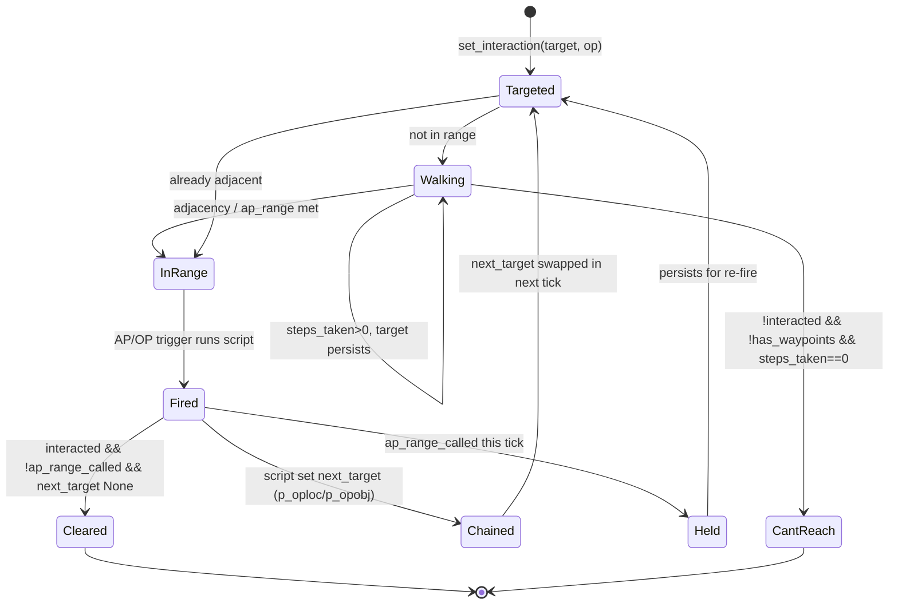

The end-of-tick cleanup (modeled by `simulate_interaction_cleanup`,
`player.rs:1200`) is: **if `next_target` is set, swap it in; else if the entity
interacted and `ap_range_called` is false, clear the interaction.** This single
rule expresses every gameplay pattern:

- **Woodcutting / door chains**: the OP script calls `p_oploc`, which sets
  `next_target` → interaction persists and re-fires next tick
  (`woodcutting_p_oploc_persists_interaction`, `player.rs:1210`).
- **Firemaking / `world_delay`**: the OP script suspends to the world queue
  *without* re-setting the target → `next_target` is `None`, interaction clears,
  so the OP does not spuriously re-trigger (`world_delay_no_p_opobj_clears_interaction`,
  `player.rs:1241`).
- **`ap_range_called` hold**: an AP script that sets the approach range keeps the
  interaction alive *within the tick* even though OP fired
  (`ap_range_called_survives_within_tick`, `player.rs:1281`); the flag is reset
  between ticks by `reset_pathing_entity`, so it must be re-asserted each tick.
- **"I can't reach that!"**: emitted only when all three of `!interacted`,
  `!has_waypoints`, and `steps_taken == 0` hold (`cant_reach_requires_all_three_conditions`,
  `player.rs:1389`) — i.e. the player neither acted, has nowhere left to walk, nor
  moved this tick.

#### 6.2 Orientation and the face masks

Facing is split between *continuous tracking of a moving target* and *one-shot
facing of a static one*. `set_face_entity()` (`interaction.rs:190`) encodes the
`FaceEntity` info mask: a player target becomes `pid + 32768`, an NPC target the
raw `nid`, anything else clears it — and the mask bit is set only if the value
*changed*, minimizing wire churn. `reorient()` (`interaction.rs:226`) prefers a
live `pathing_face` (re-faced every tick with `client=false`, since the client
already tracks the entity via `FaceEntity`); only if there is no live target and
the entity stopped moving this tick does it face the stored stationary coord once
(`client=true`, broadcasting a `FaceCoord`) and then clear it. `unfocus()`
(`interaction.rs:211`) faces south by setting the orientation one tile to the
`-z`.

### 7. Update masks — the basis of delta encoding

`EntityMasks` (`rs-info/src/lib.rs:105`) is the per-entity "what changed this
tick" container that drives the info-block delta protocol. The `masks: u16`
field is a bitset of pending update kinds; each set bit tells the
`PlayerRenderer`/`NpcRenderer` which payload fields to serialize. The bit values
differ between the two entity protocols, abstracted by `FocusKind`:

| Update     | `PlayerInfoProt` | `NpcInfoProt` |
|------------|------------------|---------------|
| Appearance | `0x1`            | —             |
| Anim       | `0x2`            | `0x2`         |
| FaceEntity | `0x4`            | `0x4`         |
| Say        | `0x8`            | `0x8`         |
| Damage     | `0x10`           | `0x10`        |
| FaceCoord  | `0x20`           | `0x80`        |
| ChangeType | —                | `0x20`        |
| Chat       | `0x40`           | —             |
| SpotAnim   | `0x100`          | `0x40`        |
| ExactMove  | `0x200`          | —             |
| BigInfo    | `0x80`           | —             |

(`rs-protocol/src/network/game/info_prot.rs`). Note `FaceCoord` is `0x20` for
players but `0x80` for NPCs — exactly why `FocusKind::face_coord_mask()`
(`rs-info/src/lib.rs:54`) exists. `face_entity_mask()` returns `0x4` for both.

The critical lifecycle distinction is **persistent vs temporary** fields
(`rs-info/src/lib.rs:90-104`). `reset()` (`lib.rs:286`), called by the engine's
cleanup phase, zeroes `masks` and all *temporary* payloads (anim, say, damage,
chat, spotanim, exactmove, changetype, `face_x`/`face_z`) but **preserves**
persistent ones (`appearance`, the walk/run/turn/ready anims, `face_entity`,
`orientation_x/z`, `anim_protect`, `vis`). This is what makes the delta encoding
correct: a newly-arriving observer needs the persistent orientation/appearance
even on a tick where nothing changed, while transient events (a hit splat, a
chat line) are sent once and cleared. `set_anim()` (`lib.rs:240`) shows the
priority/`anim_protect` gate that decides whether an animation overrides the
current one before OR-ing its mask bit. The `Visibility` enum (`Default`/`Soft`/
`Hard`, `lib.rs:69`) is persistent and governs whether the entity is rendered at
all.

`Player::reset_pathing_entity` calls `info.reset()` then `set_face_entity()`
(`player.rs:745,762`), re-deriving the face mask from the current interaction
every tick — so the face follows the target without the game logic re-issuing it.

### 8. Locs — packed placed scenery (`loc.rs`)

A `Loc` (`loc.rs:26`) is **two fields**: a `u128 packed` and an
`Option<u64> last_clock`. Everything geometric and type-related lives in the
`u128`:

```
Loc packed (u128) layout
bits   0..31   coord (CoordGrid::packed u32)
bits  32..39   width  (u8)
bits  40..47   length (u8)
bit      48    lifecycle (0=Respawn, 1=Despawn)
bits  49..73   base_info    (25 bits) — original map state
bits  74..98   current_info (25 bits) — possibly modified state

info (25 bits): id[0..15] | shape[16..20] | angle[21..22] | layer[23..24]
```

(`loc.rs:6-17,231`). The **dual base/current info** is the heart of loc
semantics: opening a door, mining a rock, etc. mutate `current_info` via
`change()` (`loc.rs:179`) while leaving `base_info` untouched, so `revert()`
(`loc.rs:193`) can copy base→current to restore the original. `is_changed()`
(`loc.rs:161`) is a single `u128` comparison of the two 25-bit fields. Accessors
read `id`/`shape`/`angle` from *current* info but `layer` from *base*
(`loc.rs:152`) — the collision layer never changes under a runtime modification.
`shape()`/`angle()`/`layer()` use `transmute` on the masked bits to the
`LocShape`/`LocAngle`/`LocLayer` enums (the documented unsafety, `loc.rs:129`).

Helper packers produce wire-ready bytes directly: `packed_zone_coord()` packs
`(x&7)<<4 | (z&7)` (`loc.rs:214`), `packed_shape_angle()` packs `shape<<2 | angle`
(`loc.rs:223`), and `lid()` builds a zone-local key from local x/z (3 bits each)
plus layer (`loc.rs:204`).

### 9. Objs — packed ground items (`obj.rs`)

An `Obj` (`obj.rs:23`) packs `coord | lifecycle | id` into a `u64` and keeps four
side fields:

```
Obj packed (u64) layout
bits  0..31   coord (CoordGrid::packed u32)
bit      32   lifecycle (0=Respawn, 1=Despawn)
bits 33..48   id (u16)

side fields:
  count: u32          stack size
  receiver37: u64     base37 hash of the only player who sees it (NO_RECEIVER = all)
  reveal: u64         tick it becomes public
  last_clock: u64     tick of scheduled state change (u64::MAX = none)
```

(`obj.rs:9-14,46`). `oid()` (`obj.rs:108`) builds a dedup key from local x/z
(3 bits each), the id (16 bits), and the receiver's low 32 bits (22-bit shift) so
a player's "already seen" tracking distinguishes private drops.

### 10. EntityLifeTime and the obj/loc lifecycle state machine

`EntityLifeTime` (`lifetime.rs:8`) is the two-state discriminant that governs
every ground entity:

- **`Respawn = 0`** — a *permanent map fixture*. It is removed/changed
  temporarily but reverts to its base state. Loaded from the map cache.
- **`Despawn = 1`** — a *runtime spawn*. It exists until its timer expires, then
  is gone for good. A dropped item or scripted scenery.

Visibility is time-driven and lifecycle-dependent. For locs, `visible()`
(`loc.rs:82`) returns `true` for `Despawn`, and for `Respawn` returns
`is_changed() || last_clock.is_none()` — i.e. a static loc is only "visible" (an
override the client must be told about) when it differs from the map or has never
been clocked. For objs, `visible(clock)` (`obj.rs:91`) returns `true` when
`last_clock == u64::MAX` (no pending transition); otherwise `Despawn` is visible
while `clock < last_clock` and `Respawn` becomes visible once `clock >= last_clock`.

The engine drives the transitions through scheduled zone events
(`rs-engine/src/phases/zone.rs:54`, `PendingZoneEvent`):

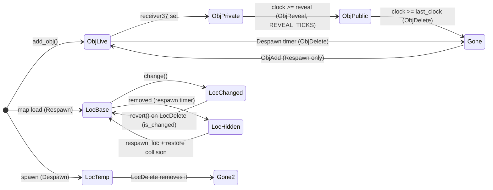

When a script drops a private item, `Engine::add_obj`
(`rs-engine/src/engine.rs:1340`) sets `last_clock = clock + duration`, and if a
receiver is given sets `receiver37`, `reveal = clock + REVEAL_TICKS`
(`engine.rs:1359`), and schedules an `ObjReveal` to fire at `reveal_clock` (when
it precedes deletion) plus always an `ObjDelete` at `last_clock`. The
`LocDelete` handler (`zone.rs:88-114`) routes by lifecycle: a `Despawn` loc is
removed outright; a hidden `Respawn` loc is respawned and its collision
re-applied; a `is_changed()` loc is reverted to base. NPC respawn uses the same
clock pattern: on death the engine sets `npc.respawn_at = Some(clock + respawnrate)`
(`engine.rs:1947`), and `reset_pathing_entity(respawn=true)` performs the full
restore.

### 11. BuildArea — the per-player viewport

`BuildArea` (`build.rs:133`) is each player's view of the world: which zones are
loaded/active, which players and NPCs are in range, cached appearance clocks, and
a *dynamic* view distance. It contains two `IdBitSet`s (`players`, `npcs`) and a
boxed `[u64; MAX_PLAYERS]` appearance-clock cache.

`IdBitSet` (`build.rs:13`) is a hybrid: a `Vec<u32>` bit vector for O(1)
membership (`contains`/`insert`/`remove` via raw-pointer word arithmetic,
`build.rs:38-54`) plus a `Vec<u16> ids` insertion-ordered list for iteration. The
unusual `remove_bit` + `retain_bits` pair (`build.rs:84,93`) lets the engine bulk
clear bits during a rebuild and reconcile the ordered list afterward in one pass,
and `swap_ids` (`build.rs:104`) hands the list out for iteration without copying
— allocation-conscious patterns for the hot info-tracking loop.

The **dynamic view distance** (`resize()`, `build.rs:300`) is an adaptive
load-shedder: if `>= PREFERRED_PLAYERS` (250) are tracked it shrinks
`view_distance` by 1 (min 1) immediately; otherwise it grows by 1 (up to
`PREFERRED_VIEW_DISTANCE = 15`) every `INTERVAL = 10` ticks. This keeps per-tick
info-encoding cost bounded in crowded areas while restoring full range as
crowds disperse — the same congestion control the reference server applies, here
expressed as plain counters. `needs_rebuild()` (`build.rs:281`) triggers a full
13×13-zone rebuild when the player drifts more than 4 zones from the build
origin; `rebuild_zones()` recomputes the 7×7 active window each zone crossing
(`update_map`, `player.rs:659`). `has_appearance`/`save_appearance`
(`build.rs:337,348`) compare a stored per-player appearance "clock" so a player's
appearance block is re-sent only when it actually changed.

### 12. EntityState — script and delay state (`state.rs`)

`EntityState` (`state.rs:10`), embedded in both Player and Npc, holds the
script-execution glue: `delayed`/`delayed_until` (the entity is blocked until a
future tick), `protect` (shielded from new interactions mid-script),
`active_script: Option<Box<ScriptState>>` (the suspended VM frame, boxed to keep
the parent struct small and moves cheap), and the `queues: ScriptQueue` /
`timers: ScriptTimer` collections. `check_delay(clock)` (`state.rs:43`) lifts the
delay once the clock reaches `delayed_until`. Together with the Player's
`can_access()`/`busy()` gates, this is the mechanism by which scripts pause an
entity for a number of ticks and resume it deterministically — the foundation the
single-threaded VM relies on for reproducible behavior.

### Cross-cutting design rationale

The recurring theme is **representation chosen per access pattern**: hot,
individually-owned, frequently-mutated entities (Player/Npc) are wide structs of
named fields embedding shared components; cold, numerous, copy-heavy ground
entities (Loc/Obj) are single packed words with bit-accessor methods. Identity
and small enums are packed integers so they live in registers and cross the VM
boundary without allocation. The update-mask split into persistent/temporary
fields is what makes the delta-encoded info protocol both correct (late joiners
get persistent state) and cheap (transient events sent once). And the
interaction state machine's `next_target` + `ap_range_called` rules reproduce the
reference server's exact multi-tick gameplay timing — pinned by an unusually
thorough in-crate test suite — while running on flat, deterministic,
single-threaded Rust state.

<sub>[↑ Back to top](#top)</sub>


---

<a id="sec-12"></a>

## 12. Collision & Pathfinding

Movement in rs-engine is governed by a single, authoritative, server-side **collision map** and a family of grid
algorithms that read it: step validation, line-of-sight/line-of-walk, reachability, and a BFS flood-fill route finder.
Unlike the rendering-oriented original client, the server treats the collision grid as a *correctness* substrate — every
wall, ground decoration, floor block, NPC, and player occupies one or more 32-bit flag words, and every movement
decision is a bitmask test against those words. Crucially, none of the collision/pathfinding *algorithms* live in the
engine crates: they are supplied by two external crates, `rs-pathfinder` (version `0.1`, `Cargo.toml:68`) and `rsmod`.
rs-engine owns only the **integration surface** — how the cache map data is decoded into collision flags, how loc/entity
mutations toggle those flags, and how movement phases call into the pathfinder. This section documents that surface
exhaustively and characterizes the external crates only to the depth needed to read the engine's calls correctly.

### The two external crates and how they are wired

The dependency declared in the workspace is `rs-pathfinder = "0.1"` (`Cargo.toml:68`), re-exported into `rs-engine`,
`rs-entity`, and `rs-vm` via `rs-pathfinder = { workspace = true }` (`rs-engine/Cargo.toml:24`,
`rs-engine/rs-entity/Cargo.toml:16`, `rs-engine/rs-vm/Cargo.toml:13`). The crate is imported under the name **`rsmod`
** — every call site in the engine is `rsmod::<fn>(...)` and every type import is `rsmod::rsmod::<...>`. The doubled
path is not a typo: the *crate* is aliased to `rsmod`, and inside it there is a public module `pub mod rsmod` (
`rs-pathfinder-0.1.0/src/lib.rs:14`) that holds the strategy/flag/algorithm types. Thus:

- `rsmod::find_path`, `rsmod::can_travel`, `rsmod::reached`, `rsmod::change_wall`, … are the **free functions** at the
  crate root (`lib.rs`), which the engine calls directly.
- `rsmod::rsmod::collision::collision_strategy::CollisionType`, `rsmod::rsmod::flag::collision_flag::CollisionFlag` are
  the **enums** the engine imports for typing those calls (e.g. `pathing.rs:6-7`, `phases/shared.rs:11`).

These crates are external; their A\*/BFS internals are out of scope and are summarized, not reproduced. What follows
documents the *engine's* obligations: build the map, keep it coherent, and call the right entry point with the right
arguments.

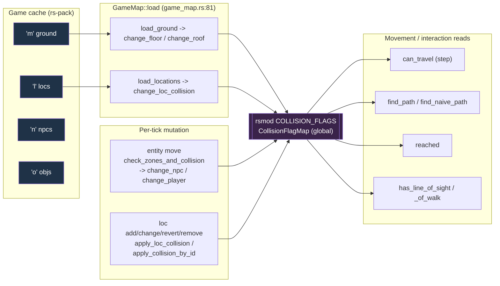

### The collision map: storage model

The map is a single process-global, owned by the `rsmod` crate, not by `Engine`:

```rust
// rs-pathfinder-0.1.0/src/lib.rs:20
static mut COLLISION_FLAGS: Lazy<CollisionFlagMap> = Lazy::new(CollisionFlagMap::new);
static mut PATHFINDER: Lazy<PathFinder> = Lazy::new(PathFinder::new); // lib.rs:26
```

`CollisionFlagMap` (`collision/collision.rs:4`) is `flags: Vec<Option<Box<[u32; 64]>>>`. The world is partitioned into *
*8×8-tile zones**; each zone is one heap-allocated array of 64 `u32` tile-flag words, lazily boxed on first write (
`None` until allocated). The outer `Vec` is sized `256 * 256 * 4 * 64` slots (`TOTAL_ZONE_COUNT`, `collision.rs:10`)
covering the 16384×16384 tile / 4-level world.

Addressing is pure bit-arithmetic (`collision.rs:13-20`):

```
zone_index = ((x>>3) & 0x7ff) | (((z>>3) & 0x7ff) << 11) | ((y & 0x3) << 22)
tile_index = (x & 0x7) | ((z & 0x7) << 3)
```

Design consequences the engine relies on:

- **Sparse, lazy allocation.** A zone array is materialized only when a flag is first added (
  `allocate_if_absent_return`, `collision.rs:71`, fills with `CollisionFlag::Open = 0`). An unallocated zone reads back
  as `CollisionFlag::Null = 0x7FFF_FFFF` (`collision.rs:38`) — i.e. *every* bit but the sign set, so any walkability
  test against it fails closed. This is why `load_ground` explicitly calls `rsmod::allocate_if_absent` on a sparse 7×7
  stride (`game_map.rs:186-188`): it pre-materializes the zones touched by a mapsquare so that genuinely open tiles read
  `Open`, not `Null`. Players also probe `is_zone_allocated` before allowing movement into a region (
  `active_player.rs:1959`, `:2202`; `active_npc.rs:278`).
- **`u32` per tile, bit-packed.** All wall, projectile, route-blocker, floor, roof, npc, and player state for a tile fit
  in one word; a step test is a single `tile_flag & block_flag == 0`.
- **Single-threaded writer invariant.** The comment at `lib.rs:16-19` is the load-bearing safety argument: writes happen
  only on the engine tick thread (loc/npc/player add/remove); reads may also come from a pooled/async pathfinding phase,
  but no writer runs during an async phase, so concurrent reads are sound. This is the same determinism guarantee the
  whole engine is built on (see *Engine single-threaded* memory note) projected onto the collision map.

### CollisionFlag bit layout

`CollisionFlag` (`flag/collision_flag.rs:5`) is `#[repr(u32)]`. The low bits encode walls in 8 compass directions, then
a `Loc` blocker, then projectile-blocker mirrors, then the custom `Npc`/`Player`/`Floor`/`Roof` flags and route-blocker
mirrors:

| Bit                 | Flag                         | Meaning                                     |
|---------------------|------------------------------|---------------------------------------------|
| 0x1–0x80            | `WallNorthWest` … `WallWest` | Movement-blocking wall edges (8 directions) |
| 0x100               | `Loc`                        | Full-tile loc blocker                       |
| 0x200–0x10000       | `Wall*ProjBlocker`           | Projectile-blocking wall mirrors            |
| 0x20000             | `LocProjBlocker`             | Projectile-blocking loc                     |
| 0x40000             | `FloorDecoration`            | Floor decoration                            |
| 0x80000             | `Npc`                        | Custom: blocks NPCs                         |
| 0x100000            | `Player`                     | Custom: blocks players/projectiles          |
| 0x200000            | `Floor`                      | Floor present (walkable ground)             |
| 0x400000–0x20000000 | `Wall*RouteBlocker`          | Route-finding wall mirrors                  |
| 0x40000000          | `locRouteBlocker`            | Route-finding loc mirror                    |
| 0x80000000          | `Roof`                       | Custom: roof (keeps NPCs indoors)           |
| —                   | `WalkBlocked = 0x240100`     | Shorthand: `Floor                           | FloorDecoration | Loc` |
| —                   | `Null = 0x7FFFFFFF`          | Returned for unallocated zones              |

The triple mirroring — a wall has a *movement* flag (low bits), a *projectile* flag (0x200 range), and a *route-blocker*
flag (0x400000 range) — is what lets the same grid answer "can I walk here", "can an arrow pass", and "can the route
finder path through this (e.g. a banker's booth)" with different masks. The engine never composes these masks by hand
for walls; it passes semantic parameters (`blockrange`, `breakroutefinding`) and lets `change_wall` choose the right
bit (see below). It *does* use the composite masks directly in a few script ops: `is_flagged(..., WalkBlocked)` for "is
this tile walkable" (`rs-vm/src/ops/server.rs:105`, `:135`, `:159`) and `is_flagged(..., Roof)` for "is this tile
indoors" (`:178`).

### Building the collision map at load

`GameMap::load` (`game_map.rs:81`) is called once at startup. It enumerates every `'m'` mapsquare key in the cache, and
for each `(mx, mz)` computes the tile origin `originx = mx << 6`, `originz = mz << 6` (64 tiles per mapsquare; constants
`X = Z = 64`, `Y = 4`, `game_map.rs:14-18`). It then decompresses and loads up to four data layers per square — ground (
`'m'`), locations (`'l'`), npcs (`'n'`), objects (`'o'`) — each a BZip2 blob prefixed with a 4-byte big-endian
uncompressed size (`decompress_map`, `game_map.rs:49`).

#### Ground → floor and roof flags

`load_ground` (`game_map.rs:156`) runs two passes over the 64×4×64 = `MAPSQUARE` tiles:

1. **Decode pass.** A per-tile opcode stream populates a local `lands: [u8; MAPSQUARE]` of land flags. Opcodes ≤ 49
   carry skippable height/overlay bytes; opcodes 50–81 store `opcode - 49` as the land flag (`game_map.rs:161-174`).
   Only the *flags* survive into collision; heights/overlays are rendering data the server discards.
2. **Apply pass.** For each tile it (a) sparsely allocates the zone on a 7×7 stride (`game_map.rs:186`), (b) sets `Roof`
   if `REMOVE_ROOFS (0x4)` is set (`change_roof`, `:193`), and (c) if `BLOCK_MAP_SQUARE (0x1)` is set, sets `Floor` via
   `change_floor` — but with **bridge logic**: if the level-1 tile carries `LINK_BELOW (0x2)`, the floor flag is pushed
   down one level (`bridge = y - 1`), and a resulting negative level is skipped (`:200-212`).

The land-flag constants (`game_map.rs:23-33`) are: `BLOCK_MAP_SQUARE 0x1`, `LINK_BELOW 0x2`, `REMOVE_ROOFS 0x4`,
`VISIBLE_BELOW 0x8`, `NOT_LOW_DETAIL 0x10`. Only the first three affect collision; the rest are rendering hints retained
for completeness but never written to the grid.

This is a direct, byte-faithful port of the reference `GameMap.ts` decode, but the output target differs: the original
feeds a `CollisionFlagMap` written in TypeScript; rs-engine writes the Rust `rsmod` grid. The bridge handling (
`LINK_BELOW` collapsing collision down a level) is preserved exactly because path determinism depends on it — a bridge's
walkable surface must live on the lower level's grid.

#### Locations → wall / loc / decoration flags

`load_locations` (`game_map.rs:239`) walks the delta-encoded loc stream (`gsmart1or2` deltas for both id and packed
coord, `:248-260`), applies the same bridge adjustment per loc (`:262-276`), and for each loc resolves its `LocType`
from the cache. It extracts geometry directly from the 8-bit `info` byte:

```rust
let shape = LocShape::try_from_primitive(info > > 2).unwrap();   // game_map.rs:285
let layer = shape.layer();                                       // :286 (LocShape::layer())
let angle = LocAngle::try_from_primitive(info & 0x3).unwrap();   // :287
```

If `loc_type.blockwalk` is true, it calls `change_loc_collision` to write flags (`:294-306`); independently, if
`loc_type.active == Some(true)`, the loc is also added to the zone map as a static loc (`:308-324`). Collision and zone
membership are deliberately decoupled — a `blockwalk` non-`active` loc blocks movement but is never a per-tick
interactable, and vice versa.

### The `change_loc_collision` dispatch — the heart of loc collision

`change_loc_collision` (`game_map.rs:553`) is the single funnel that turns a
`(shape, layer, angle, blockrange, width, length, active)` tuple into `rsmod` writes. It switches on **layer** (
`game_map.rs:567`):

| `LocLayer`    | rsmod call                                                       | behavior                                                      |
|---------------|------------------------------------------------------------------|---------------------------------------------------------------|
| `Wall`        | `change_wall(x,z,y, angle, shape as i8, blockrange, false, add)` | Edge flags chosen by wall shape + angle                       |
| `WallDecor`   | *(none)*                                                         | Decorations never block; the arm is empty (`game_map.rs:571`) |
| `Ground`      | `change_loc(x,z,y, len/wid, wid/len, blockrange, false, add)`    | Full-tile rectangle; **width/length swap on E/W angles**      |
| `GroundDecor` | `change_floor(x,z,y, add)` *only if* `active == Some(true)`      | Treated as floor for collision                                |

Two engineering details:

- **The angle-driven dimension swap** (`game_map.rs:572-579`): for a `Ground` loc, North/South orientation passes
  `(length, width)`; West/East passes `(width, length)`. This rotates the loc's footprint without rotating the data —
  the rectangle the route finder blocks matches the loc's on-screen orientation.
- **`change_wall` shape decoding lives in `rsmod`** (`lib.rs:203`). It maps `LocShape` to one of three wall geometries —
  straight (`WallStraight`), corner (`WallDiagonalCorner`/`WallSquareCorner`), or L (`WallL`) — and for each angle sets
  the *pair* of complementary edge flags on the two tiles a wall separates (e.g. a West wall sets `WallWest` on the tile
  and `WallEast` on `x-1`, `lib.rs:270-277`). It also handles the `blockrange`/`breakroutefinding` mirrors by
  *recursing* to lay down the movement, projectile, and route-blocker copies in one call (`lib.rs:307-312`). The engine
  passes `breakroutefinding = false` and `blockrange = loc_type.blockrange` at every site, so route-blocker bits come
  only from the wall-mirror recursion, never from the engine directly.

The same dispatch serves three callers, which is the key to runtime coherence:

- `GameMap::load_locations` — static map load (`:295`).
- `apply_loc_collision(cache, loc, coord, add)` (`game_map.rs:469`) — looks up the live loc's type, and only if
  `blockwalk`, forwards `loc.shape()/layer()/angle()`. Used by every dynamic loc transition.
- `apply_collision_by_id(cache, id, shape, layer, angle, coord, add)` (`game_map.rs:503`) — same, but with
  caller-supplied shape/angle (used when a loc *changes* into a different type).

### Dynamic loc changes keep the grid in lock-step

The collision grid must never lag the zone's loc list, or the pathfinder would route through a wall that visually
exists (or stop at a door that visually opened). The engine enforces this *eagerly* on every loc mutation (`engine.rs`):

- **`add_or_change_loc`** (`engine.rs:1541`): if an existing visible loc is being replaced, remove its collision (
  `apply_loc_collision(..., false)`, `:1564`), mutate `zone.locs[idx].change(...)`, then add the new type's collision (
  `apply_collision_by_id(..., true)`, `:1570`). A brand-new loc just adds collision (`apply_loc_collision(..., true)`,
  `:1608`).
- **`remove_loc`** (`engine.rs:1654`): remove collision (`:1665`) before removing the loc from the zone.
- **`revert_loc`** (`engine.rs:1703`): remove current collision (`:1714`), `loc.revert()`, then re-apply the reverted
  loc's collision (`:1719`).
- **Deferred respawn** (`phases/zone.rs:106-110`): when a `LocDelete` event fires for a hidden static loc, the loc is
  respawned and its collision re-applied the *same tick* (`apply_loc_collision(&reverted, coord, true)`).

The ordering is invariant: **remove-old-collision → mutate-storage → add-new-collision**. Because all of this runs
inside the single-threaded tick, there is no window in which the grid and the zone disagree.

### Entity occupancy: NPCs and players on the grid

Moving entities also occupy the grid. `change_npc`/`change_player` (`lib.rs:152`, `:172`) stamp a `size × size` square
of `Npc`/`Player` bits. The engine toggles them in `check_zones_and_collision` (`phases/shared.rs:656`), called whenever
an entity's tile changes, driven by the loc/npc `BlockWalk` setting (`rs-pack/src/types.rs:338`):

| `BlockWalk` | Old tile                                 | New tile                                |
|-------------|------------------------------------------|-----------------------------------------|
| `Npc`       | `change_npc(prev,false)`                 | `change_npc(next,true)`                 |
| `All`       | `change_npc + change_player(prev,false)` | `change_npc + change_player(next,true)` |
| `None`      | —                                        | —                                       |

The same toggling happens on spawn/despawn (`engine.rs:1928-1932`, `:2065-2069`, `phases/npc.rs:224-240`). Players are
stamped `Player`, NPCs `Npc`; this asymmetry is what `block_walk_extra_flag` exploits below — an NPC pathing through the
world adds `Npc` to its block mask (so it won't walk through other NPCs) while a player adds `Player`.

### `MoveRestrict` → `CollisionType` and extra-flag mapping

Every pathing entity carries a `MoveRestrict` (`rs-pack/src/types.rs:310`). `PathingEntity` maps it to the pathfinder's
`CollisionType` and to an extra block flag, both in `pathing.rs`:

| `MoveRestrict`     | `collision_type()` → `CollisionType` (`pathing.rs:195`) | `block_walk_extra_flag()` (`pathing.rs:219`) |
|--------------------|---------------------------------------------------------|----------------------------------------------|
| `Normal`, `Player` | `Normal`                                                | `Npc` / `Player` respectively                |
| `Blocked`          | `Blocked`                                               | `Open (0)`                                   |
| `BlockedNormal`    | `LineOfSight`                                           | `Npc`                                        |
| `Indoors`          | `Indoors`                                               | `Npc`                                        |
| `Outdoors`         | `Outdoors`                                              | `Npc`                                        |
| `Passthru`         | `Normal`                                                | `Open (0)`                                   |
| `NoMove`           | `None` → cannot move                                    | `Null`                                       |

`CollisionType` (`collision_strategy.rs:6`) selects which *strategy function* the pathfinder applies to each
`(tile_flag, block_flag)` pair (`collision_strategy.rs:16-57`): `Normal` is plain `tile & block == 0`; `Blocked`
additionally *requires* `Floor` to be present (used by entities that must stay on solid ground); `Indoors`/`Outdoors`
require/forbid the `Roof` bit; `LineOfSight` shifts wall/route bits to test sight rather than walk. The `None` arm for
`NoMove` is checked first in both `process_movement` (`pathing.rs:105`) and `take_step` (`pathing.rs:321`) — a `NoMove`
entity returns before any grid access.

### Per-step movement validation (`take_step` / `can_travel`)

`PathingEntity` (`pathing.rs:24`) holds the live movement state: `coord`, a 25-slot `waypoints: [u32; 25]` ring (packed
`(x<<14)|z`), a `waypoint_index`, `walk_dir`/`run_dir` outputs, `size`, `move_restrict`, `move_strategy`, and
`move_speed`. Waypoints are stored **reversed** so the destination is consumed last as a LIFO (`queue_waypoints`,
`pathing.rs:165-177`).

Each tick `process_movement` (`pathing.rs:104`) consumes waypoints into `walk_dir` and (for `Run`) `run_dir`, honoring
`MoveSpeed` (`rs-entity/src/player.rs:48`: `Stationary 0`, `Crawl 1` moves every other tick, `Walk 2` one step, `Run 3`
two steps). The actual collision gate is `take_step` (`pathing.rs:315`):

1. Compute the desired direction toward the current waypoint via `face_dir` (`pathing.rs:442`, signum-of-delta → octant
   0–7), and the tile delta via `dir_delta` (`pathing.rs:465`).
2. **Size > 1**: try X-axis then Z-axis cardinal moves separately, each validated by `rsmod::can_travel` (
   `pathing.rs:333-362`). Large entities never move diagonally through the validator.
3. **Size 1**: try the diagonal `can_travel` first; if blocked, fall back to X-only, then Z-only (`pathing.rs:365-425`).
   This reproduces the classic "slide along the wall" behavior.

`can_travel` (`lib.rs:514`) takes `(y, x, z, offset_x, offset_z, size, extra_flag, collision)` and delegates to
`rsmod::step_validator::can_travel`, OR-ing the entity's `extra_flag` (its `Npc`/`Player` block bit) into the strategy's
block mask. NPC AI wandering uses the identical gate before committing a step (`phases/npc.rs:1433`). The result of a
valid step is applied by `try_step` (`pathing.rs:254`): advance `coord`, update the entity's facing focus, increment
`steps_taken`, and decrement `waypoint_index` when the waypoint tile is reached (recursing to skip already-reached
waypoints).

### Route finding: `find_path` (BFS) vs `find_naive_path`

The pathfinder proper is `rsmod::find_path` (`lib.rs:36`). It is **not** a heap-based A\*; it is a breadth-first flood
fill over a fixed **128×128 local search window** (`PathFinder::DEFAULT_SEARCH_MAP_SIZE = 128`) using a **4096-entry
power-of-two ring buffer** as the frontier queue (`DEFAULT_RING_BUFFER_SIZE = 4096`; `pathfinder.rs:24-25`). It keeps
two flat `Vec`s of `directions` and `distances` (`pathfinder.rs:11-12`), and dispatches to one of three specialized
inner kernels by source size — `find_path_1`, `find_path_2`, `find_path_n` (`pathfinder.rs:233`, `:443`, `:699`) — so
the common 1×1 player case has no size loop. If the exact destination is unreachable it can return a best-effort
*alternative* route within bounded tolerances (`MAX_ALTERNATIVE_ROUTE_*` constants, `pathfinder.rs:28-30`). It returns a
`&'static [u32]` slice of packed waypoints (zero-copy from the reused `PATHFINDER` instance), which the engine feeds
straight into `queue_waypoints`.

`find_naive_path` (`lib.rs:74`) is the cheap straight-line stepper used when no obstacle avoidance is wanted (NPC
strategy, or when source already overlaps target).

The engine chooses between them in `entity_path_to_target` (`phases/shared.rs:513`):

- **Naive** when `move_strategy == MoveStrategy::Naive` (`pathing.rs:12`; NPCs default to `Naive`, players to `Smart`),
  or when `client_pathfinder` is on *and* source/target footprints already intersect (`CoordGrid::intersects`,
  `shared.rs:594-605`).
- **Full BFS** otherwise, threading the target's `width/length/angle/shape` and — for locs — its `forceapproach` flag
  into `find_path` so the route stops at a tile from which the target is operable (`shared.rs:566-587`).

Note the **shape sentinels** the engine passes as the `shape: i8` argument to `find_path`/`reached`: `-1` for default
reach (Obj, move-click; `shared.rs:546`, `move_click.rs:198`), `-2` for entity targets / melee reach (`shared.rs:612`,
`:630`). These negative shapes are not `LocShape` values; they are reach-strategy selectors consumed by `rsmod`'s
`ReachStrategy`.

### Server-side vs client-side pathfinding (`client_pathfinder`)

`Engine` carries a boolean `client_pathfinder` (`engine.rs:376`), wired from a CLI argument at startup (
`rs-server/src/main.rs:128`, `:366`). It selects who is trusted to compute routes:

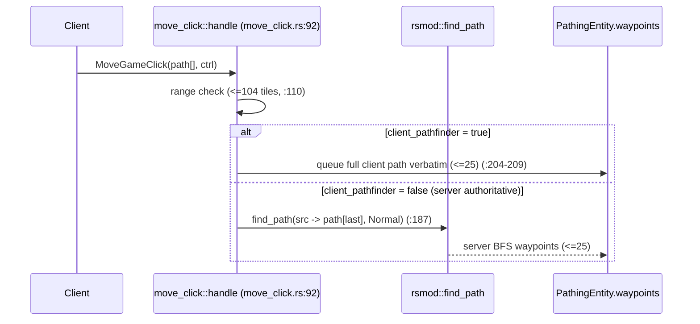

When `client_pathfinder` is **true**, the engine trusts the client's per-tile path: it stores the full unpacked path (
`move_click.rs:127-134`) and queues it verbatim (`path_to_move_click`, `:204-209`), only re-validating later via
`can_travel` as each step is taken. When **false** (server-authoritative), the engine discards the intermediate client
coordinates, keeps only the *final* destination (`:139-140`), and recomputes the entire route server-side with
`find_path(..., CollisionType::Normal)` (`:187-202`). The same fork appears in `entity_path_to_target` for
interaction-driven movement: `client_pathfinder` only short-circuits to a naive path when footprints already overlap;
the heavy BFS path is taken regardless of the flag for non-overlapping interaction targets. The trade-off is explicit —
`true` offloads routing CPU to clients (cheaper server, but trusts client geometry, mitigated by per-step `can_travel`);
`false` is fully authoritative and immune to path spoofing at the cost of one BFS per click. Both modes cap waypoints at
25 (`move_click.rs:205`, the `find_path` `max_waypoints` arg).

### Reachability and line-of-sight

Two further families of grid queries gate interactions rather than movement:

- **`reached`** (`lib.rs:660`) answers "is the entity adjacent enough to *operate* on the target", honoring the target's
  footprint, `angle`, reach `shape`, and `forceapproach`. The engine uses it in `entity_in_operable_distance` (
  `phases/shared.rs:218`): Obj targets test both shape `-2` and `-1` (`:232-233`); Loc targets thread
  `width/length/shape/angle/forceapproach` (`:252-264`); entity targets use an NxN default (`:272`, `:294`).
- **`has_line_of_sight` / `has_line_of_walk`** (`lib.rs:540`, `:570`) Bresenham-walk the grid testing wall/loc
  projectile or movement bits. The engine uses LoS for approach-distance checks (`entity_in_approach_distance`,
  `shared.rs:354`, `:389`, `:435`, `:474`, always OR-ing `CollisionFlag::Player` as the extra flag), for NPC hunt/target
  validation (`phases/npc.rs:584`, `:600`, …), for script iterators (`rs-vm/src/iterators.rs:141`, `:157`, …), and for
  the `huntmode`/LoS script ops (`rs-vm/src/ops/server.rs:80`, `:95`). `line_of_sight`/`line_of_walk` (`lib.rs:600`,
  `:630`) return the full traced path slice for callers that need it.

Approach distance is the conjunction of a Chebyshev-distance bound (`CoordGrid::distance_to`, size-aware) **and**
line-of-sight, with an explicit non-overlap requirement for entity targets (`shared.rs:410-420`, `:458`) — you cannot "
approach" a target you are standing on top of.

### Engineering rationale and fidelity notes

- **Bitmask grid over object graph.** Representing collision as one `u32` per tile (vs. the reference server's per-tile
  flag object) collapses every walkability question to a single AND, and packs an 8×8 zone into 256 bytes that stays
  L1-resident during a BFS flood. Lazy zone boxing keeps the resident set proportional to *loaded* world, not the 16k²
  address space.
- **Externalizing the algorithms.** Pinning route finding, LoS, and reach in `rs-pathfinder`/`rsmod` keeps the
  byte-for-byte-fidelity-critical grid math in one audited crate shared across `rs-engine`, `rs-entity`, and `rs-vm`,
  and lets the engine's responsibility shrink to *decode + mutate + call*. The doubled `rsmod::rsmod::` path is the
  visible seam of that split.
- **Eager coherence.** Toggling collision on the same tick as every loc/entity mutation (never deferred) is what
  guarantees the pathfinder "never sees stale geometry" — a correctness invariant the engine pays for up front rather
  than reconciling lazily.
- **Fidelity to the reference.** The ground/loc decode (`load_ground`, `load_locations`), bridge handling (
  `LINK_BELOW`), wall edge-pairing, the width/length swap on E/W angles, and the negative reach-shape sentinels all
  mirror the LostCity/2004scape `GameMap.ts`/`PathingEntity.ts` semantics so that server routes are byte-compatible with
  client expectations.

<sub>[↑ Back to top](#top)</sub>

---

[← Part II](part-02-architecture-and-the-tick.md)  ·  [↑ Index](../README.md)  ·  [Part IV →](part-04-the-runescript-engine.md)
