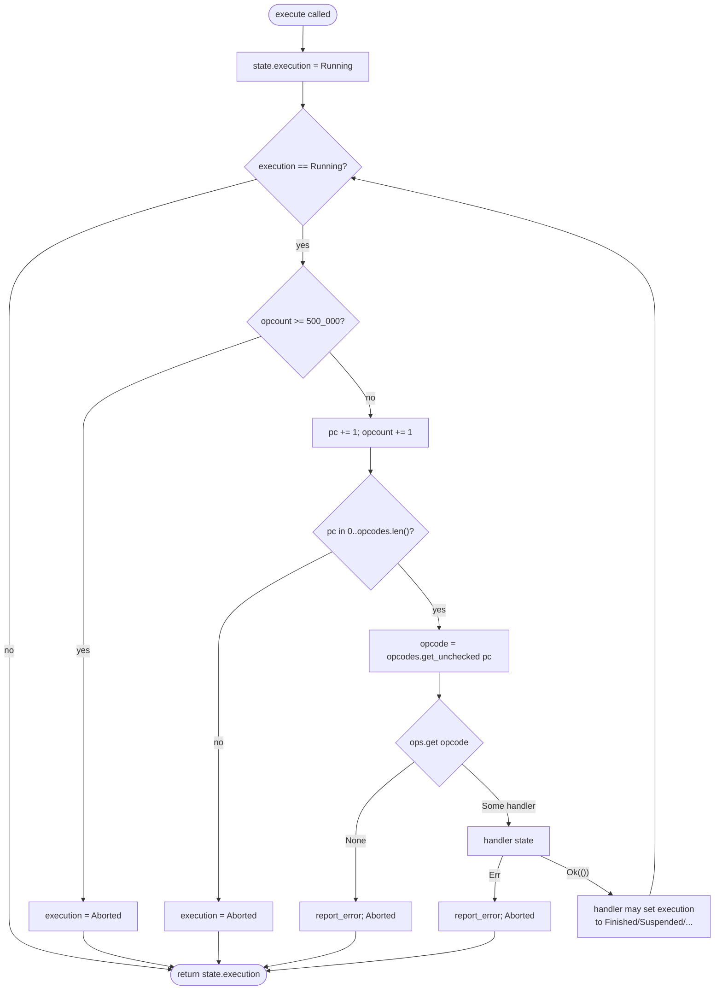
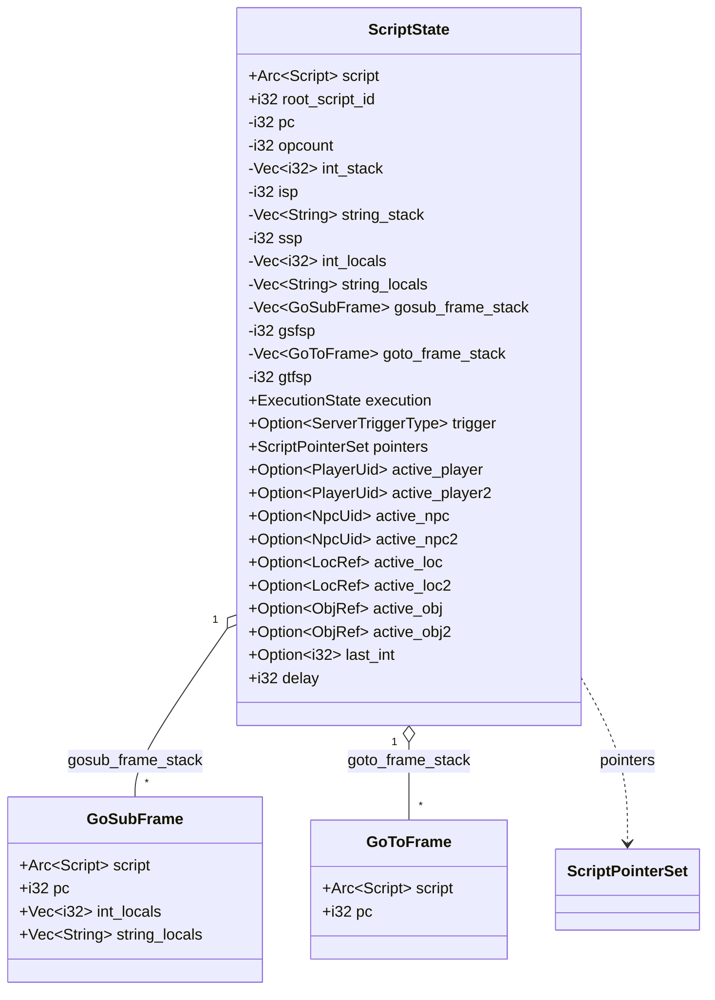
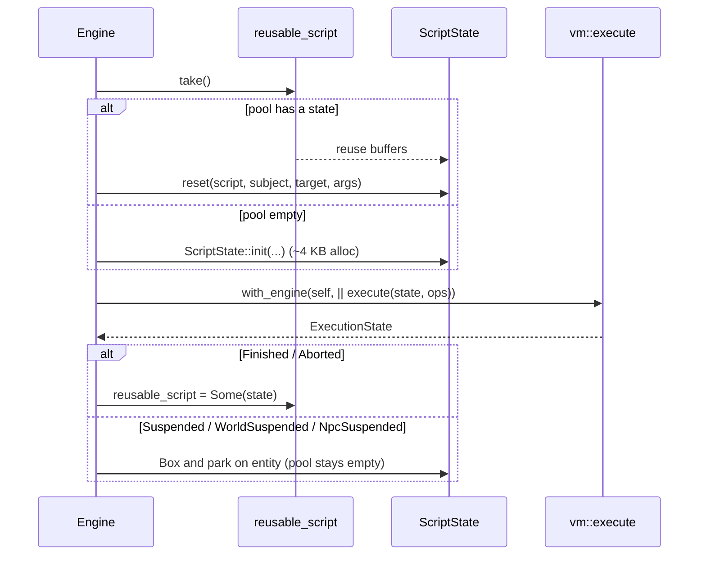
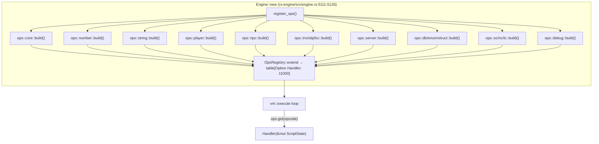
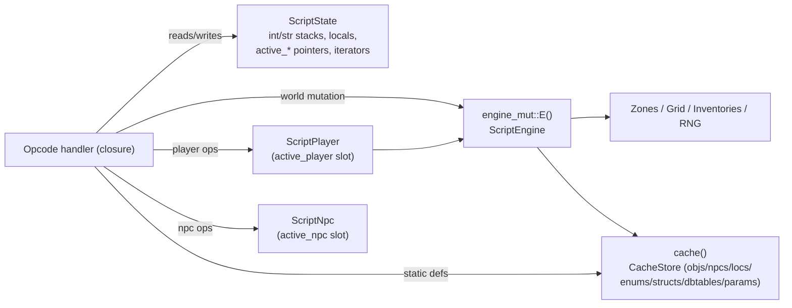
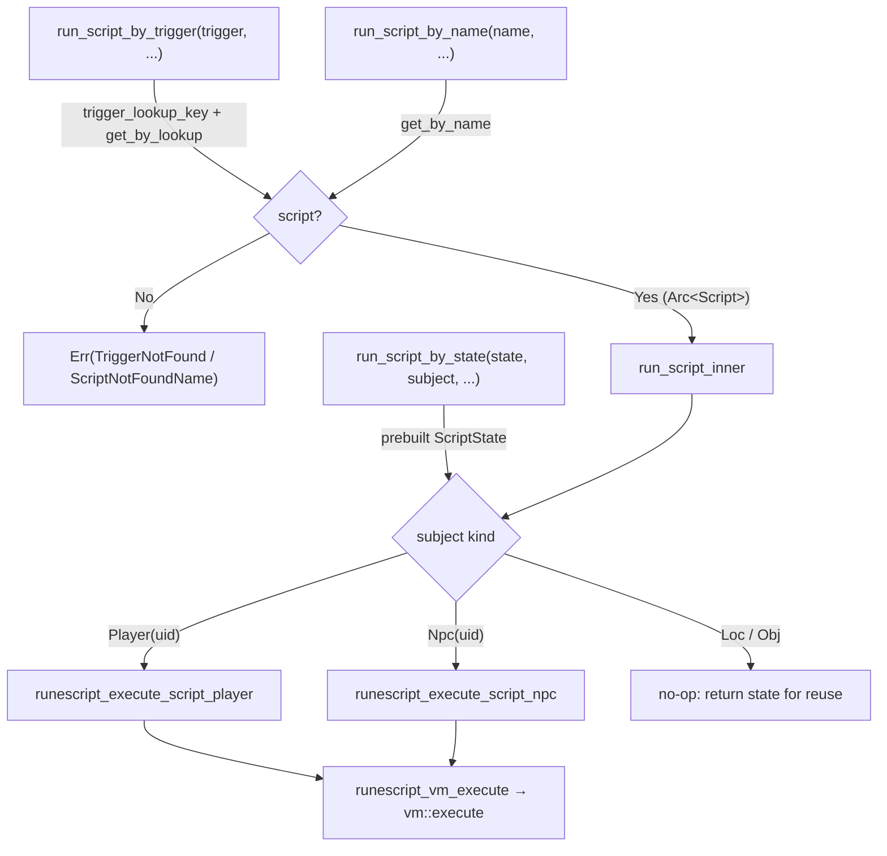
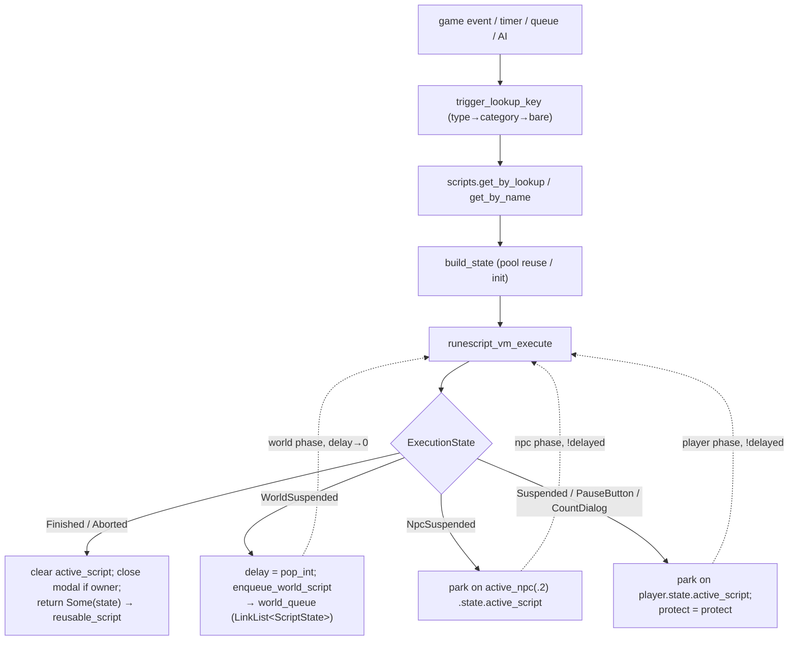
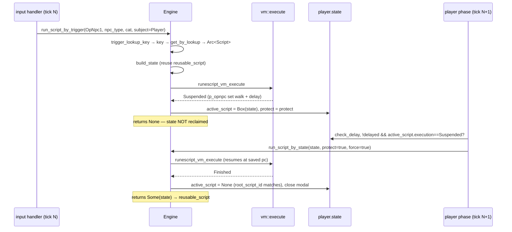

<a id="top"></a>

**[← Whitepaper index](../README.md)**  ·  [Single-file version](whitepaper-full.md)

# Part IV · The RuneScript Engine

> *The embedded virtual machine, its instruction set, and how game events reach it.*


---

<a id="sec-13"></a>

## 13. The RuneScript Virtual Machine — Architecture & Execution Model

The RuneScript virtual machine (the `rs-vm` crate) is the beating heart of game-logic
execution in rs-engine. Every piece of content behavior — NPC AI, dialogue, combat,
skilling, queues, timers, login/logout, zone transitions — is authored in *RuneScript*,
compiled offline into a compact bytecode, and interpreted at runtime by a **stack-based
bytecode interpreter**. This section documents that interpreter as if it were a CPU
instruction-set reference: the fetch-decode-dispatch core, the per-invocation register
file (`ScriptState`), the opcode dispatch table (`OpsRegistry`), the suspension/resumption
protocol, the global-engine bridge that lets opcode handlers reach world state, the
pointer-guard system that protects against stale entity references, and the packed UID
encodings that identify entities on the operand stack.

The design goal is byte-identical emulation of the classic single-threaded TypeScript
reference server (the LostCity / 2004scape lineage) while exploiting Rust's control over
memory layout to eliminate the allocator pressure and indirection that dominate the JVM
implementation. The VM runs ~20,000+ script invocations per 600 ms tick on a single thread;
the architecture below is engineered around that number.

### 1. The VM as a stack-based bytecode interpreter

RuneScript has no general-purpose registers. Computation flows through two **operand
stacks** — an integer stack and a string stack — plus two **local-variable arrays** (one
per type). An opcode consumes its operands from the top of a stack, computes, and pushes
its result back. Arguments to subroutines are likewise passed on the stacks and copied into
the callee's locals on entry. This is a textbook stack machine, but with a crucial
optimized: the integer and string domains are *physically separate*. A given opcode
operates on one domain or the other, never a tagged union. This mirrors the reference
server exactly (where ints and strings have distinct stacks) and lets the Rust port store
ints as a dense `Vec<i32>` and strings as a `Vec<String>` with no per-value type tag.

A compiled script is the `Script` struct (`rs-pack/src/cache/script.rs:118`). Its bytecode
is **decoded ahead of time** into three parallel, index-aligned arrays so the interpreter
never re-parses bytes at runtime:

| Field                                    | Type                        | Role                                                    |
|------------------------------------------|-----------------------------|---------------------------------------------------------|
| `opcodes`                                | `Box<[u16]>`                | The opcode for each instruction (`script.rs:124`)       |
| `int_operands`                           | `Box<[i32]>`                | The inline integer operand at each pc (`script.rs:125`) |
| `string_operands`                        | `Box<[Box<str>]>`           | The inline string operand at each pc (`script.rs:126`)  |
| `switch_tables`                          | `Box<[FxHashMap<i32,i32>]>` | Jump tables for `switch` opcodes (`script.rs:127`)      |
| `int_arg_count` / `string_arg_count`     | `u16`                       | How many stack args this script consumes on entry       |
| `int_local_count` / `string_local_count` | `u16`                       | Sizes of the locals arrays                              |
| `info`                                   | `ScriptInfo`                | Name, source path, pc→line map (`script.rs:90`)         |

The program counter `pc` indexes all three operand arrays simultaneously: at pc `i`,
`opcodes[i]` is the instruction and `int_operands[i]` / `string_operands[i]` are its inline
operand. Because the arrays are `Box<[T]>` (fixed-length, contiguous, no capacity slack),
the layout is cache-friendly and the operand fetch is a single bounds-checked (debug) or
unchecked (release) load. This is the first major departure from the JVM reference, where
the equivalent data lives in separately-allocated `int[]` / `String[]` arrays inside a
`Script` object behind a reference — same logical shape, but the Rust version owns the bytes
inline behind a single `Arc<Script>`.

### 2. The fetch-decode-dispatch loop

The interpreter core is `vm::execute` (`rs-vm/src/vm.rs:51`). It is a single tight `while`
loop gated on `state.execution == ExecutionState::Running`:



The decode step is trivial because decoding happened at load time: the loop reads a `u16`
opcode and immediately dispatches. Each iteration performs, in order:

1. **Instruction-limit guard** (`vm.rs:59`). If `opcount` reaches `MAX_INSTRUCTIONS`
   (`500_000`, `vm.rs:9`), the script is `Aborted`. This is a hard runaway-loop fuse: a
   buggy `while`/`goto` cycle cannot wedge the single tick thread forever. It mirrors the
   reference server's opcount ceiling.
2. **Pre-increment** of `pc` and `opcount` (`vm.rs:68`). Critically, `pc` starts at `-1`
   (set in `ScriptState::new`, `state.rs:133`) and is incremented *before* fetch, so the
   first fetched instruction is at index 0. Jump opcodes set `pc` to *one less than* their
   target so the subsequent pre-increment lands correctly.
3. **PC range check** (`vm.rs:71`). An out-of-range `pc` aborts — this catches a jump to a
   bad offset before the unchecked fetch below would invoke UB.
4. **Fetch** (`vm.rs:81`): `unsafe { *state.script.opcodes.get_unchecked(pc) }`. The
   preceding range check makes the unchecked access sound while shaving the bounds check off
   the hottest line in the engine.
5. **Dispatch** (`vm.rs:83`): `ops.get(opcode)` returns `Option<Handler>`. A `None`
   (unregistered opcode) is reported and aborts.
6. **Invoke** (`vm.rs:94`): `handler(state)`. The handler returns `crate::Result<()>`; an
   `Err` is reported via `report_error` and aborts.

The loop continues until a handler mutates `state.execution` away from `Running`. There is
no explicit "halt" branch in the loop body for the normal cases — termination is *data-driven*
through the `execution` field, which is the single source of truth the engine reads
afterward. This keeps the hot loop branch-minimal: the only per-iteration branches are the
limit check, the pc check, the dispatch `Option`, and the handler `Result`.

#### 2.1 Error reporting and stack backtraces

On an unhandled opcode or a handler error, `report_error` (`vm.rs:184`) emits a full
RuneScript stack backtrace. It walks `goto_frame_stack[..gtfsp]` in reverse (`vm.rs:188`),
producing one frame per `(script name, source file, line number)` triple. The line number
is recovered from `ScriptInfo::line_number(pc)` (`script.rs:100`), which binary-walks the
`pcs`/`lines` debug tables. In debug builds the same backtrace is mirrored to every active
player as a wrapped game message via `report` (`vm.rs:146`), so content authors see script
faults in-game. `report` iterates both the primary and secondary active-player slots
(`vm.rs:150`), skipping empty slots.

#### 2.2 CPU-time watchdog (debug only)

Behind `#[cfg(debug_assertions)]`, `execute` timestamps entry with `Instant::now()`
(`vm.rs:56`) and, on exit, warns if the script ran longer than 1000 µs (`vm.rs:108`),
emitting `time` and `opcount` to the log and to active players. This is a development-only
profiling aid; it compiles to nothing in release.

### 3. ScriptState — the per-invocation register file

`ScriptState` (`state.rs:30`) is the complete machine context for one script run. Think of
it as the VM's register file plus its stacks, frames, and entity bindings. It is `Clone` so
suspended states can be boxed and parked.



#### 3.1 The operand stacks: preallocated, unchecked, pointer-tracked

Both operand stacks are **preallocated to a fixed capacity of 128** in `ScriptState::new`
(`state.rs:135`): `int_stack: vec![0; 128]` and `string_stack: vec![String::new(); 128]`.
They are *never* resized at runtime. Instead, `isp` and `ssp` (the integer and string stack
pointers, `state.rs:36`, `state.rs:38`) track the logical top, and push/pop write/read into
the fixed buffer via raw pointer arithmetic:

```rust
pub(crate) fn push_int(&mut self, value: i32) {
    debug_assert!((self.isp as usize) < self.int_stack.len(), ...);
    unsafe { *self.int_stack.as_mut_ptr().add(self.isp as usize) = value };
    self.isp += 1;
}
pub fn pop_int(&mut self) -> i32 {
    self.isp -= 1;
    debug_assert!(self.isp >= 0, ...);
    unsafe { *self.int_stack.as_ptr().add(self.isp as usize) }
}
```

(`state.rs:676`, `state.rs:713`.) The bounds are checked **only in debug builds** via
`debug_assert!`; release builds elide them. This is the central performance decision of the
stack machine: with 128 slots reserved up front and a compiler that knows scripts never
overflow in practice, every push/pop is a register-relative store/load with no bounds check,
no capacity check, and no reallocation. A 128-deep operand stack is far beyond what any
real RuneScript reaches, so the fixed bound is effectively infinite for valid content while
the underflow/overflow `debug_assert!`s catch compiler/content bugs during development.

The string stack adds a second optimization: **slot reuse**. `push_string` (`state.rs:773`)
does not allocate a new `String`; it `clear()`s the existing slot and `push_str`s into it,
reusing the slot's heap buffer. `push_string_local` (`state.rs:812`) copies a local into the
slot the same way, using a `*const str` raw pointer to dodge the borrow checker (both
`string_locals` and `string_stack` are fields of `self`). `pop_string` (`state.rs:959`) uses
`std::mem::take` to move the owned `String` out, leaving an empty string behind rather than
cloning. `join_strings` (`state.rs:856`) concatenates the top `count` strings into the
bottom-most slot in place. These tricks keep string-heavy scripts (dialogue, `tostring`,
`append`) close to allocation-free.

The `i32` choice for `isp`/`ssp`/`pc` (rather than `usize`) is deliberate: it matches the
reference server's signed counters, allows the `-1` initial `pc`, and lets underflow be
detected by a `>= 0` assert rather than a wrap-to-huge-`usize`.

#### 3.2 Locals: the only resizable arrays

`int_locals` and `string_locals` (`state.rs:39`–`40`) are sized to the script's declared
local counts. In `new` (`state.rs:116`) they are constructed `with_capacity` from
`script.int_local_count` / `string_local_count`, pre-filled from the caller's `args`, then
`resize`d to the full count with defaults (`0` / `String::new()`). Arguments are positional:
`ScriptArgument::Int` values fill the int locals in order, `String` values fill the string
locals. This is exactly the reference server's local-frame model.

#### 3.3 Call frames: gosub vs goto

RuneScript has two control-transfer primitives, modeled by two frame stacks:

- **`gosub`** (subroutine call, returns). `gosub_frame` (`state.rs:554`) saves the current
  `script`, `pc`, and *both* locals arrays into a `GoSubFrame` and pushes it. It uses
  `std::mem::replace` on `self.script` and `std::mem::take` on the locals so the save is a
  cheap move, not a clone (`state.rs:555`, `state.rs:564`). The callee's new locals are then
  populated by popping its declared args off the operand stacks in reverse. `Return`
  restores via `pop_frame` (`state.rs:515`), which pops the `GoSubFrame` and moves the saved
  `script`/`pc`/locals back. Locals *are* preserved across a gosub because control returns.

- **`goto`** (tail jump, never returns). `goto_frame` (`state.rs:616`) pushes a lightweight
  `GoToFrame` (only `script` + `pc`, no locals — `state.rs:1070`) *for the backtrace*, then
  **clears the entire gosub stack** (`state.rs:622`) because there is no return path, and
  calls `new_program` to swap in the target script and reset locals from its args
  (`state.rs:472`). Locals are *not* preserved across a goto.

Both stacks are seeded `with_capacity(16)` (`state.rs:141`, `state.rs:143`) — deep enough
for typical call nesting without reallocation. `gsfsp`/`gtfsp` are the matching stack-pointer
counters. The two-stack split is what lets `report_error` reconstruct a full backtrace
(`goto_frame_stack` records every script entered, even tail jumps) while keeping the active
return chain (`gosub_frame_stack`) precise.

A subtle but important detail: `gosub_frame` pushes onto *both* stacks (`state.rs:556` and
`state.rs:561`) — the goto stack gets a backtrace entry and the gosub stack gets the return
frame. `goto_frame` pushes only the backtrace entry and wipes the return chain. This keeps
the debugging backtrace complete across both call styles.

#### 3.4 Active-entity bindings and the subject/target convention

Eight `Option<…>` fields hold the entities the script operates on, in primary/secondary
pairs: `active_player`/`active_player2`, `active_npc`/`active_npc2`, `active_loc`/`active_loc2`,
`active_obj`/`active_obj2` (`state.rs:49`–`56`). The **convention** is: the primary slot holds
the *subject* entity, the secondary the *target* — **unless** subject and target are the same
entity type, in which case the target goes into the `2` slot so it does not clobber the
subject. `ScriptState::init` (`state.rs:198`) and `reset` (`state.rs:289`) both implement this
with identical `matches!` logic: bind subject to primary, then bind target to secondary iff
`subject` is the same `ScriptSubject` variant, otherwise to primary (`state.rs:213`–`243`).
This is how, e.g., a player-on-player interaction puts the initiator in `active_player` and
the target in `active_player2`, while a player-on-NPC puts the player in `active_player` and
the NPC in `active_npc`.

`last_int` (`state.rs:58`) caches the most recent integer result for opcodes like
`last_int`. The iterator-state fields (`npc_iterator`, `loc_iterator`, `obj_iterator`,
`player_iterator`, `state.rs:67`–`70`) hold search cursors (see §7). The `db_*` fields hold
the current database row/table cursor for `db_find`-style opcodes. `delay` (`state.rs:72`) is
the suspension duration written by delay opcodes and read by the engine on suspension.

### 4. ScriptState lifecycle and pooling

A script run begins with a `ScriptState` and ends with one of the terminal/suspension
states. Because the engine fires **tens of thousands of scripts per tick**, the construction
cost matters enormously.

`ScriptState::init` (`state.rs:198`) is the fresh constructor: it allocates a 128-slot
`int_stack` (512 bytes), 128 empty `String`s (`string_stack`), two 16-deep frame stacks, and
the locals arrays — roughly **4 KB of heap per call** as the doc comment notes (`state.rs:262`).
At 20,000 invocations/tick that is ~80 MB/tick of churn through the allocator.

The fix is `ScriptState::reset` (`state.rs:289`), which **reuses an existing state's heap
buffers in place**. It clears and repopulates the locals, swaps in the new `script`, resets
`pc` to `-1` and `opcount`/`isp`/`ssp` to `0`, clears the string-stack slots (to free any
large string buffers that accumulated, `state.rs:326`), `clear()`s the frame stacks
*retaining their capacity*, re-nulls all entity bindings, re-binds subject/target, resets
misc state, and rebuilds the pointer bitset. Crucially, the `int_stack` and `string_stack`
**backing buffers are never reallocated** — `reset` only resets the stack pointers, since
stale values are overwritten before they are read (`state.rs:321`).

The engine maintains a single-slot pool: `Engine::reusable_script: Option<ScriptState>`
(`rs-engine/src/engine.rs:413`). `run_script_inner` (`engine.rs:982`) takes the pooled state
if present and calls `reset`, otherwise falls back to `init` (`engine.rs:1010`–`1015`). After
execution, if the script *finished or aborted* (i.e. did not suspend), the state is reclaimed
back into the pool (`engine.rs:1029`). If it *suspended*, the state is boxed and parked on the
entity instead (see §6) and the pool stays empty for the next allocation. Because per-tick
timer/queue scripts dominate and almost always finish synchronously, this single-slot pool
cycles one buffer through the vast majority of invocations, eliminating nearly all of the
4 KB/call allocation. This is a Rust-specific optimization with no analog in the JVM
reference, where the GC absorbs the equivalent garbage.



### 5. OpsRegistry — the instruction-set dispatch table

`OpsRegistry` (`rs-vm/src/register.rs:21`) is the VM's instruction-set: a **function-pointer
table indexed by opcode**. Internally it is a `Box<[Option<Handler>; LAST]>` plus a populated
`count`, where `LAST = 11000` (`script.rs:680`) is the opcode-space size and `Handler` is
`fn(&mut ScriptState) -> crate::Result<()>` (`register.rs:9`).

| Method                      | Behavior                                           | Cost                  |
|-----------------------------|----------------------------------------------------|-----------------------|
| `new` (`register.rs:31`)    | All `LAST` slots `None`                            | one boxed array       |
| `insert` (`register.rs:50`) | Set slot, bump `count` if newly filled             | O(1)                  |
| `extend` (`register.rs:69`) | Merge another registry, no double-count            | O(LAST)               |
| `get` (`register.rs:97`)    | `unsafe get_unchecked(opcode)` → `Option<Handler>` | O(1), no bounds check |

The table is built once at engine startup by `register_ops` (which composes per-module
sub-registries via `extend`) and is thereafter immutable for the engine's lifetime. Because
the opcode is a `u16` and `LAST` is the table length, `get` uses `get_unchecked` (`register.rs:98`)
— the dispatch is a single array load and an `Option` branch, with the array kept hot in
cache across the tens of thousands of invocations per tick. Using a dense array indexed by
opcode (rather than a `HashMap`) is the single most important dispatch decision: it turns
opcode dispatch into pointer-table indirection identical in cost to a C `switch` compiled to
a jump table, with no hashing and no collision handling.

The choice of `Option<Handler>` (rather than a default "abort" handler in empty slots) means
an unregistered opcode is distinguishable at dispatch and produces a precise diagnostic
("unhandled opcode N at pc=…", `vm.rs:84`) rather than a generic abort. This matters during
development as opcode coverage is filled in. The reference server uses a parallel-arrays /
command-id dispatch; the dense function-pointer table is the idiomatic Rust equivalent and
removes the JVM's virtual-call/megamorphic-dispatch overhead.

### 6. ExecutionState and the suspension/resumption protocol

`ExecutionState` (`state.rs:1017`) is the eight-state status enum that controls the loop and
signals the engine how a run ended:

| State            | Meaning                                  | Engine response                            |
|------------------|------------------------------------------|--------------------------------------------|
| `Running`        | Actively interpreting                    | loop continues                             |
| `Finished`       | Completed normally                       | clear active script, reclaim state to pool |
| `Aborted`        | Error / instruction-limit / bad pc       | clear active script, reclaim state         |
| `Suspended`      | Awaiting player movement/interaction     | park boxed state on the player             |
| `PauseButton`    | Player paused a message dialog           | park on the player                         |
| `CountDialog`    | Awaiting numeric input in a count dialog | park on the player                         |
| `NpcSuspended`   | Awaiting NPC movement/interaction        | park boxed state on the NPC                |
| `WorldSuspended` | Awaiting a world-level event/delay       | enqueue into the world queue               |

Only `Running` keeps the loop alive (`vm.rs:58`); every other value yields control back to
the engine, which then inspects the value. The terminal vs. suspended distinction drives the
state-pooling logic (§4): `Finished`/`Aborted` reclaim the buffer; the rest move the state
into storage.

The engine's response is in `runescript_execute_script_player` (`engine.rs:1073`). After
`runescript_vm_execute` returns (`engine.rs:1096`), if the result is neither `Finished` nor
`Aborted` (`engine.rs:1125`) it routes by suspension kind:

- **`WorldSuspended`** (`engine.rs:1126`): the delay is popped off the int stack
  (`state.pop_int() as u16`) and the state is enqueued via `enqueue_world_script(state, delay)`.
  The world queue resumes it after `delay` ticks. This is how `delay`-style world events that
  must run after a fixed number of ticks suspend and resume.
- **`NpcSuspended`** (`engine.rs:1129`): the relevant NPC is chosen by the current
  `int_operand()` (`0` → `active_npc`, else `active_npc2`, `engine.rs:1130`) and the boxed
  state is parked on that NPC's `active_script` (`engine.rs:1137`). It resumes when the NPC's
  pending movement/interaction completes.
- **Player suspension** (`Suspended`/`PauseButton`/`CountDialog`, `engine.rs:1140`): the boxed
  state is parked on the player's `state.active_script` and the player's `protect` flag is
  set to the script's protect value (`engine.rs:1141`–`1142`). It resumes when the player's
  movement/dialog/interaction completes.

When a script **finishes or aborts** (`engine.rs:1146`), the engine checks whether the
player's parked `active_script` belongs to the *same root script* (`root_script_id` match,
`engine.rs:1148`). If so it clears the parked script and, if no main modal is open, closes any
open modal (`engine.rs:1150`). `root_script_id` (`state.rs:32`, set from `script.id` in `new`
and preserved across `goto`/`gosub`) is the identity used to match a resumption against the
script that originally suspended — even after the running `script` has changed via `goto`.

Suspension is fundamentally a **continuation**: the entire `ScriptState` (pc, both stacks,
locals, both frame stacks, entity bindings) is preserved exactly, boxed, and stashed.
Resumption later calls `execute` again on the same state; because `pc` already points past
the suspending opcode and the stacks are intact, execution continues seamlessly. This is the
RuneScript analog of a coroutine yield, and it is why the reference server (and this port)
can express multi-tick interactions as straight-line scripts with embedded `delay`/`walk`/
`arrivedelay` calls rather than explicit state machines.

The delay mechanism on the player side is illustrated by `ScriptPlayer::arrivedelay`
(`engine.rs:1018` in the trait): it records an arrive timestamp and returns `true` only if a
delay was actually applied (the player moved this/last tick) — `true` tells the caller to
suspend, `false` means continue this same tick. This avoids a spurious one-tick stall when a
script's `walk` target is already reached.

### 7. The global-engine bridge — `with_engine` and the trait triad

Opcode handlers receive only `&mut ScriptState`. They have no engine parameter — yet they
must read and mutate world state (players, NPCs, zones, the cache, the RNG). The bridge is a
**thread-local raw-pointer install** (`engine.rs:1620` in `rs-vm`):

```rust
thread_local! {
    static ENGINE_PTR: Cell<*mut ()> = const { Cell::new(null_mut()) };
    static CACHE_PTR:  Cell<*const CacheStore> = const { Cell::new(null()) };
}
```

`with_engine(engine, f)` (`engine.rs:1671`) stores a type-erased `*mut E` for the engine and
a `*const CacheStore` into these cells, runs the closure `f`, and restores the previous
values via an RAII `Restore` drop guard (`engine.rs:1677`) — so the previous pointers are
restored even if `f` unwinds, and nested `with_engine` calls are safe (they save/restore
correctly). The engine enters this scope exactly once around `vm::execute`
(`rs-engine/src/engine.rs:791`):

```rust
with_engine( self , move | | vm::execute::<Engine>(state, unsafe { & * ops }))
```

Inside that scope, any handler reaches the engine through four accessors:

| Accessor                                                                    | Returns               | Safety                                  |
|-----------------------------------------------------------------------------|-----------------------|-----------------------------------------|
| `cache()` (`engine.rs:1704`)                                                | `&'static CacheStore` | debug-asserts non-null                  |
| `engine::<E>()` (`engine.rs:1726`)                                          | `&'static E`          | safe wrapper over `engine_typed`        |
| `engine_mut::<E>()` (`engine.rs:1746`)                                      | `&'static mut E`      | safe wrapper over `engine_typed_mut`    |
| `engine_typed::<E>()` / `engine_typed_mut::<E>()` (`engine.rs:1778`/`1817`) | typed refs            | `unsafe`: caller must pass the same `E` |

The type parameter `E` flows from `vm::execute::<E>` down to the handlers' `engine::<E>()`
calls, recovering the concrete type that was type-erased into `*mut ()`. The `'static`
lifetime is a deliberate lie of convenience: the reference is *logically* scoped to the
enclosing `with_engine` call, but expressed as `'static` because it comes from a thread-local
cell. The soundness obligation — that `E` matches and that no aliasing reference exists — is
upheld by the single call site (`engine.rs:791` always passes `Engine`) and by the
single-threaded tick model (no concurrent access, so the `&mut` is genuinely unique).

This pattern trades a small amount of `unsafe` for a large ergonomic and performance win:
handlers do not thread an engine reference through every signature, and the engine is a
plain thread-local load rather than a passed-and-borrowed parameter. It is the Rust port's
answer to the reference server's ambient `World.getWorld()` singleton — same "reach the world
from anywhere in a script handler" capability, but scoped and unwind-safe via RAII.

The three traits define the world surface scripts can touch:

- **`ScriptEngine`** (`engine.rs:19`): clock, cache, script lookup, player/NPC lookup by
  slot, zone queries, NPC/obj/loc spawn-mutate-remove, projectile/map anims, the `JavaRandom`
  RNG (`engine.rs:367`, deterministic to match Java), and `members()`.
- **`ScriptPlayer`** (`engine.rs:385`): the large per-player surface — coords, the
  `last_*` interaction fields, vars (varp), stats/xp, inventories, interfaces (`if_*`),
  movement (`walk`/`teleport`/`telejump`), interaction targets (`set_interaction_*`),
  camera, queues/timers, hint arrows, and the suspension primitives `delay`/`arrivedelay`/
  `countdialog`.
- **`ScriptNpc`** (`engine.rs:1366`): the per-NPC surface — coords/size, vars (varn),
  stats, AI mode/hunt, movement (`walk`/`tele`), interaction targets, `change_type`
  transforms, queues/timers, and `delay`.

Active entities are resolved from the state's UID fields in `util.rs`:
`get_active_player_mut` (`util.rs:44`) reads `active_player`/`active_player2` based on the
`secondary` flag, extracts `uid.pid()`, and calls `engine_mut::<E>().get_player_mut(pid)` —
turning the stored UID into a live `&mut dyn ScriptPlayer`. `set_active_player`
(`util.rs:111`) does the inverse and updates the pointer bitset. Parallel helpers exist for
NPCs, locs, and objs.

### 8. ScriptPointer guards — protecting against stale entity references

Storing entities as `Option<Uid>` is necessary but not sufficient: an opcode that requires
`active_npc` must fail cleanly if no NPC is bound, and certain player references must survive
nested script calls. This is the job of the **pointer guard system**.

`ScriptPointer` (`pointer.rs:14`) is a `#[repr(u8)]` enum whose discriminants are bit
indices:

| Variant                  | Bit | Name (diagnostic)  |
|--------------------------|-----|--------------------|
| `ActivePlayer`           | 0   | `active_player`    |
| `ActivePlayer2`          | 1   | `.active_player`   |
| `ProtectedActivePlayer`  | 2   | `p_active_player`  |
| `ProtectedActivePlayer2` | 3   | `.p_active_player` |
| `ActiveNpc`              | 4   | `active_npc`       |
| `ActiveNpc2`             | 5   | `.active_npc`      |
| `ActiveLoc`              | 6   | `active_loc`       |
| `ActiveLoc2`             | 7   | `.active_loc`      |
| `ActiveObj`              | 8   | `active_obj`       |
| `ActiveObj2`             | 9   | `.active_obj`      |

`ScriptPointerSet` (`pointer.rs:64`) wraps a single `u32` as a bitset over these indices,
with `const`-fn `add`/`remove`/`has`/`clear` doing one bit op each (`pointer.rs:93`–`200`).
`ScriptState::sync_pointers` (`state.rs:425`) rebuilds the set from the eight `Option`
fields: clear, then set the bit for each `Some` field. It runs after every `init`/`reset`
entity binding so the bitset is always a faithful mirror of which entities are present. A
`u32` bitset is chosen over eight `bool`s because the whole "which entities are bound" state
fits in one word, copies trivially (the set is `Copy`), and `check`/`has` is a single
mask-and-test.

The enforcement entry point is `ScriptPointerSet::check` (`pointer.rs:155`): it returns
`Ok(())` if the bit is set, else `Err(ScriptError::Runtime("required pointer not set: <name>"))`
with the human-readable pointer name for diagnostics. Handlers call this *before* touching an
entity. The `require_active_*` helpers in `util.rs` wire this to the **current opcode's
operand**: `require_active_player` (`util.rs:328`) does
`pointers.check(ACTIVE_PLAYER[int_operand() as usize])` — the int operand (`0` or `1`)
selects primary vs. secondary, so a single opcode form can address either slot and is checked
against the matching bit. Parallel `require_active_npc`/`loc`/`obj` exist, plus
`require_protected_active_player` (`util.rs:396`) which checks the *protected* bits.

The `Protected` variants (bits 2–3) are the mechanism that prevents nested scripts from
invalidating a player reference. When a script runs with `protect`, the engine sets
`ProtectedActivePlayer` on the state's pointer set and marks the live player's `protect` flag
(`rs-engine/src/engine.rs:1091`–`1092`). After execution the engine clears these protected
bits and the players' `protect` flags (`engine.rs:1104`–`1123`) regardless of outcome,
ensuring protection is strictly scoped to the run. The pre-execution guard
(`engine.rs:1081`–`1086`) is the other half: if `force` is false and the target player is
already `protect`ed or `delayed`, the script is *not* run and its state is returned to the
pool — a busy/protected player cannot be hijacked by a non-forced script. This is a direct
port of the reference server's `protect`/`p_*` pointer semantics, which exist to stop one
script's `gosub`/queue from corrupting another script's active-player binding mid-flight.

The `ScriptState` exposes the slot-pair constants `ACTIVE_PLAYER`, `ACTIVE_NPC`, `ACTIVE_LOC`,
`ACTIVE_OBJ`, and `PROTECTED_ACTIVE_PLAYER` (`state.rs:76`–`91`) — `[primary, secondary]`
arrays indexed by the `bool`/operand selector, used throughout `util.rs` to pick the right bit.

### 9. UID encoding — packing entity identity onto the operand stack

Because the operand stack holds only `i32`s, entity identity must be packable into integers.
Two packed UID types do this.

**`NpcUid`** (`npc_uid.rs:13`) packs a `u32` as `(id << 16) | nid`:

```
NpcUid  (u32)
 31                16 15                 0
+--------------------+--------------------+
|  NPC type/config id |   NPC index (nid)  |
+--------------------+--------------------+
```

`id()` returns the upper 16 bits — the NPC *type* (config/definition) — and `nid()` the lower
16 bits — the slot index into the engine's NPC array (`npc_uid.rs:44`, `npc_uid.rs:54`;
`MAX_NPCS = 8192`). Packing the type alongside the index lets a script both index the live
NPC (`npcs[nid]`) and validate it is still the *same kind* of NPC, catching the case where the
slot was recycled to a different NPC since the UID was captured.

**`PlayerUid`** (`player_uid.rs:15`) packs a `u128` as `(username37 << 11) | (pid & 0x7FF)`:

```
PlayerUid  (u128)
127                              11 10            0
+----------------------------------+--------------+
|  base37 username hash (u64-range) |  pid (11 bit) |
+----------------------------------+--------------+
```

The low **11 bits** are the player index (`0..=2047`, since `MAX_PLAYERS = 2048`), and the
upper bits are the base37-encoded username hash (`player_uid.rs:33`). `pid()` masks `& 0x7FF`
(`player_uid.rs:62`); `username37()` shifts right 11 (`player_uid.rs:52`) and can be decoded
back to a display name via `username()`/`screen_name()` (`player_uid.rs:73`/`88`). Embedding
the username hash (not just the slot) makes the UID *identity-stable*: a script can verify
the player in slot `pid` is still the same human, since slots are reused across logins. The
base37 hash is the classic RuneScape username encoding, preserved here for wire and
save-file fidelity.

`ScriptSubject` (`subject.rs:15`) is the tagged sum the engine hands to `ScriptState::init` —
`Player(PlayerUid)`, `Npc(NpcUid)`, `Loc(LocRef)`, `Obj(ObjRef)` — translated into the
appropriate active-entity slot by the subject/target binding logic of §3.4.
`LocRef`/`ObjRef`/`NpcRef` (`state.rs:1139`–`1167`) are the small `Copy` snapshot structs
(`coord`, `id`, plus shape/angle/layer or count/size) that opcodes read; they are captured
into the active slots and into iterator result sets.

### 10. Search iterators

Multi-result opcodes (`npc_findnext`, `loc_find`, hunt) materialize a result set once and
then walk a cursor. The four iterator-state structs (`iterators.rs:14`–`48`) each hold a
`Vec` of refs (`NpcRef`/`LocRef`/`ObjRef` or bare `pid` `u16` for players) plus a `cursor:
usize`. They are stored in the corresponding `ScriptState` fields (`state.rs:67`–`70`). The
collection functions live in `iterators.rs`: zone collectors (`npc_zone`/`loc_zone`/`obj_zone`,
`iterators.rs:62`/`69`/`87`) call `engine::<E>().get_zone_*`, and distance searches
(`npc_distance_inner`, `iterators.rs:110`; `hunt_players`, `iterators.rs:251`) sweep a square
of zones whose radius is `1 + (distance >> 3)` (one zone is 8 tiles), filter by exact
Chebyshev `coord.distance()` and an optional `HuntCheckVis` line-of-sight/line-of-walk check
(via `rsmod`), and collect matches **in reverse zone order**. Iterating reverse-zone-order is
a fidelity detail: it reproduces the reference server's NPC/player enumeration order so that
"find nearest"-style scripts pick the same entity the original would.

### Engineering summary

The rs-vm core is a deliberately spartan stack machine wrapped in performance-critical Rust
idioms. The hot loop (`vm::execute`) does the absolute minimum per instruction: a pre-increment,
a range check that licenses an unchecked fetch, a single dense-array dispatch, and a handler
call. `ScriptState` keeps its operand stacks fixed-size and pointer-tracked so push/pop are
register-relative memory ops with debug-only bounds checks, and the engine recycles a single
`ScriptState` through `reset` to defeat the ~4 KB/invocation allocation that would otherwise
dominate. Dispatch is a function-pointer table indexed by `u16` opcode — a jump table in all
but name. The world is reached through a thread-local, RAII-scoped, type-erased engine
pointer so handlers stay parameter-free. Suspension is full-continuation: the entire machine
context is preserved and parked, letting multi-tick game logic read as straight-line script.
And the pointer-guard bitset plus `Protected` flags reproduce the reference server's
active-entity safety model precisely. Every one of these choices either matches the
TypeScript reference for byte- and behavior-fidelity, or improves on it by removing JVM
indirection and GC churn that the single-threaded 600 ms heartbeat cannot afford.

<sub>[↑ Back to top](#top)</sub>


---

<a id="sec-14"></a>

## 14. The RuneScript Instruction Set — Opcode Catalog

This section is the instruction-set reference for the `rs-vm` RuneScript interpreter. It catalogs the opcode
*families* — one per source module under `rs-vm/src/ops/` — and documents, per family, how each opcode consumes and
produces operands on the script stacks, how it mutates the world (almost always through the `ScriptEngine`/
`ScriptPlayer`/`ScriptNpc` traits in `rs-vm/src/engine.rs`), and how the config-type families (`oc`/`nc`/`lc`/`enum`/
`struct`/`db`) read static definitions out of the cache. The opcode numeric space is partitioned into contiguous ranges
by category; the `LAST` sentinel (`11000`, `rs-pack/src/cache/script.rs:680`) bounds the whole space and sizes the
dispatch table.

RuneScript is the in-house scripting language of the LostCity/2004scape lineage. Each compiled `Script` is a flat array
of `u16` opcodes paired with parallel arrays of int and string operands (one per program-counter slot). The VM is a
register-poor, stack-rich machine: there is a 128-deep int stack, a 128-deep string stack, two local-variable arrays,
and a set of "active entity" pointers. `rs-vm` re-implements the reference server's `ScriptRunner` dispatch model but
trades the Java `switch`-on-opcode and `instanceof`/`HashMap` lookups for a flat function-pointer table, closures
captured at startup, and unchecked stack arithmetic.

### Opcode definition: the `handlers!` / `none!` macros

Opcodes are not defined by a giant `match`. Each `ops` module exposes a `build()` that returns an `OpsRegistry` (
`rs-vm/src/register.rs:21`) populated through three macros declared in `rs-vm/src/macros.rs`.

`OpsRegistry` is the heart of dispatch. It is a `Box<[Option<Handler>; LAST as usize]>` plus a populated-slot `count` (
`register.rs:21-24`), where `Handler = fn(&mut ScriptState) -> crate::Result<()>` (`register.rs:9`). A direct-indexed
array of `11000` function-pointer slots is chosen over a hash map precisely because dispatch is on the VM hot path:
`get()` is `#[inline(always)]` and uses `get_unchecked` (`register.rs:96-99`), turning opcode dispatch into a single
bounds-free load. `insert()` increments `count` only on a transition from empty (`register.rs:50-56`), and `extend()`
merges a sub-registry without double-counting (`register.rs:69-78`).

The `handlers!` macro opens a build block by creating a fresh `OpsRegistry` named by the caller, runs the body, and
returns the registry (`macros.rs:115-122`):

```rust
handlers! { |m|
    none!(m, ADD => |s| { /* ... */ });
}
```

`none!` is the workhorse for opcodes that need no active-entity guard. It wraps the body so the closure returns `Ok(())`
automatically (`macros.rs:124-132`):

```rust
none!(m, PUSH_CONSTANT_INT => |s| { s.push_int(s.int_operand()); });
```

The entity-scoped macros — `active_player!`, `active_player_mut!`, `active_npc!`, `active_npc_mut!`, `active_loc!`,
`active_loc_mut!`, `active_obj!`, `active_obj_mut!`, and the two `protected_active_player*!` variants (
`macros.rs:134-288`) — do three things before running the body: (1) call a `require_*` guard (`util.rs:328-400`) that
checks the `ScriptPointerSet` bit for the operand-selected slot; (2) resolve the active entity via
`engine_typed::<E>()` / `engine_typed_mut::<E>()` and `get_player(_mut)` / `get_npc(_mut)`; and (3) bind it as a named
variable for the body. For example:

```rust
active_player_mut!(m, MES => |s, player| {
    let text = s.pop_string();
    player.mes(&text);
});
```

Two design choices in these macros are worth noting. First, the *secondary*-slot selection is driven by `int_operand()`:
`active_player_pid` (`macros.rs:22-31`) reads the operand, and a non-zero value selects `active_player2` instead of
`active_player`. This mirrors the reference engine's `.active_player` vs `active_player` dual-pointer convention encoded
directly into the compiled operand. Second, the `protected_active_player*!` macros check `PROTECTED_ACTIVE_PLAYER` bits
instead of `ACTIVE_PLAYER` (`macros.rs:251-288`, `util.rs:396-400`); only opcodes that hold a *protected* (
logout/movement-safe) lock on the player — `P_WALK`, `P_TELEPORT`, `P_OPLOC`, `P_LOCMERGE`, etc. — are gated this way,
which is how the VM prevents one player's script from issuing protected actions against a stale player reference.



### Registry assembly and dispatch

`Engine::new` calls `register_ops` (`rs-engine/src/engine.rs:5111-5126`), which builds every sub-registry and `extend`s
them into one flat table. The families are merged in fixed order (core, db, debug, enum, inv, lc, loc, nc, npc, number,
obj, oc, player, server, string, struct); because opcode ranges are disjoint, merge order is immaterial for correctness.
Note that only the families touching live entities or the engine are generic over `E: ScriptEngine` — `db`, `debug`,
`enum`, `lc`, `nc`, `oc`, `struct` are *non-generic* `build()` functions (`db.rs:27`, `enum.rs:21`, `struct.rs:19`,
`oc.rs:25`, `nc.rs:23`, `lc.rs:8`, `debug.rs:19`) because they only read the cache, which is reached through the
thread-local `cache()` accessor rather than the typed engine pointer.

The interpreter loop is `vm::execute` (`rs-vm/src/vm.rs:51-121`). Each iteration: bumps the instruction counter (capped
at `MAX_INSTRUCTIONS = 500_000`, `vm.rs:9`), pre-increments `pc`, range-checks `pc` against `script.opcodes.len()`,
fetches the opcode with `get_unchecked` (`vm.rs:81`), looks up the handler, and invokes it. Termination conditions: the
handler sets `state.execution` to a non-`Running` value (`Finished`, `Suspended`, `PauseButton`, `CountDialog`,
`NpcSuspended`, `WorldSuspended`), the instruction cap is hit, `pc` leaves range, an opcode has no handler, or a handler
returns `Err` (the latter three all set `Aborted`). Errors flow to `report_error` (`vm.rs:184-226`), which walks
`goto_frame_stack` to print a script-level backtrace; in debug builds the same trace is mirrored to active players as
in-game messages.

The engine is reached from handlers through thread-local pointers installed by `with_engine` (`engine.rs:1671-1685`): a
RAII guard stashes the prior engine/cache pointers, installs the new ones, and restores on drop, making nested
`with_engine` calls (and unwinds) safe. Handlers then read them through `cache()` (`engine.rs:1704`), `engine::<E>()` (
`engine.rs:1726`), and `engine_mut::<E>()` (`engine.rs:1746`). This is the mechanism that lets a `fn(&mut ScriptState)`
mutate the whole world without threading the engine through every call.

### Opcode-number space

Each family owns a contiguous numeric block, defined as `pub const` opcode IDs in `rs-pack/src/cache/script.rs`. The
table below is grounded in the first/last constants observed in that file and the per-module handler ranges.

| Family (module)                      | Numeric range | First → last (script.rs)                        | Reaches                                      |
|--------------------------------------|---------------|-------------------------------------------------|----------------------------------------------|
| `core` — control flow / stack / vars | 0–46          | `PUSH_CONSTANT_INT=0` … `POP_ARRAY_INT=46`      | ScriptState, varp/varn cache, engine scripts |
| `server` — world/map                 | 1000–1021     | `COORDX=1000` … `WORLD_DELAY=1021`              | engine, cache, `rsmod` pathfinding           |
| `player` — live player               | 2000–2132     | `AFK_EVENT=2000` … `WEIGHT=2132`                | `ScriptPlayer`, engine, cache                |
| `npc` — live NPC                     | 2500–2547     | `NPC_ADD=2500` … `SPOTANIM_NPC=2547`            | `ScriptNpc`, engine, cache, iterators        |
| `loc` — locations                    | 3000–3013     | `LOC_ADD=3000` … `LOC_TYPE=3013`                | engine, cache, iterators                     |
| `obj` — ground items                 | 3500–3511     | `OBJ_ADD=3500` … `OBJ_TYPE=3511`                | engine, cache, iterators                     |
| `nc` — NPC config                    | 4000–4007     | `NC_CATEGORY=4000` … `NC_VISLEVEL=4007`         | cache (`npcs`)                               |
| `lc` — Loc config                    | 4100–4107     | `LC_CATEGORY=4100` … `LC_WIDTH=4107`            | cache (`locs`)                               |
| `oc` — Obj config                    | 4200–4215     | `OC_CATEGORY=4200` … `OC_WEARPOS3=4215`         | cache (`objs`)                               |
| `inv` — inventory                    | 4300–4332     | `BOTH_DROPSLOT=4300` … `INVOTHER_TRANSMIT=4332` | `ScriptPlayer` invs, engine, cache           |
| `enum` — enum lookup                 | 4400–4401     | `ENUM=4400`, `ENUM_GETOUTPUTCOUNT=4401`         | cache (`enums`)                              |
| `string` — strings                   | 4500–4517     | `APPEND_NUM=4500` … `SPLIT_PAGECOUNT=4517`      | ScriptState, cache (`fonts`/`mesanims`)      |
| `number` — math/bitwise              | 4600–4628     | `ADD=4600` … `ABS=4628`                         | ScriptState, engine RNG                      |
| `struct` — struct param              | 4700          | `STRUCT_PARAM=4700`                             | cache (`structs`/`params`)                   |
| `db` — database                      | 7501–7508     | `DB_FINDNEXT=7501` … `DB_FIND=7508`             | cache (`dbtables`/`dbrows`/`db_index`)       |
| `debug`                              | 10000–10003   | `CONSOLE=10000` … `TIMESPENT=10003`             | tracing log, ScriptState                     |

### `core` — control flow, stack housekeeping, variables

`core` (`ops/core.rs`) is the irreducible VM substrate: constants, branches, subroutine calls, locals, discards, and
player/NPC variable access. All branch opcodes funnel through `branch_if` (`core.rs:262-269`), which pops two ints and
conditionally adds `int_operand()` to `pc`. The unconditional `BRANCH` simply does `s.pc += s.int_operand()` (
`core.rs:110-112`).

| Opcode                                                  | Operands / stack     | Effect                                                                                        |
|---------------------------------------------------------|----------------------|-----------------------------------------------------------------------------------------------|
| `PUSH_CONSTANT_INT` (0)                                 | → int                | Push `int_operand()`                                                                          |
| `PUSH_CONSTANT_STRING` (3)                              | → str                | Push `string_operand()`                                                                       |
| `PUSH_VARP` (1) / `POP_VARP` (2)                        | int/str ↔ player var | Read/write a player varp; `id` is `operand & 0xFFFF`, secondary-slot bit is `(operand>>16)&1` |
| `PUSH_VARN` (4) / `POP_VARN` (5)                        | int/str ↔ NPC var    | Read/write an NPC varn                                                                        |
| `BRANCH` (6)                                            | —                    | `pc += operand`                                                                               |
| `BRANCH_NOT/EQUALS/LESS_THAN/GREATER_THAN` (7–10)       | int,int →            | Conditional jump (`!=`,`==`,`<`,`>`)                                                          |
| `BRANCH_LESS_THAN_OR_EQUALS/…GREATER…` (31,32)          | int,int →            | Conditional jump (`<=`,`>=`)                                                                  |
| `RETURN` (21)                                           | —                    | Pop gosub frame, or `Finished` if `gsfsp==0`                                                  |
| `GOSUB` (22) / `GOSUB_WITH_PARAMS` (40)                 | script id →          | Push a call frame, enter subroutine (overflow at `gsfsp>=50`)                                 |
| `JUMP` (23) / `JUMP_WITH_PARAMS` (41)                   | script id →          | One-way tail jump, clearing the gosub stack                                                   |
| `SWITCH` (24)                                           | key →                | Jump via `script.switch_tables[operand][key]`, default 0                                      |
| `PUSH/POP_INT_LOCAL` (33,34)                            | int ↔ local          | Local int read/write                                                                          |
| `PUSH/POP_STRING_LOCAL` (35,36)                         | str ↔ local          | Local string read/write                                                                       |
| `JOIN_STRING` (37)                                      | n strs → str         | Concatenate top `operand` strings                                                             |
| `POP_INT_DISCARD/POP_STRING_DISCARD` (38,39)            | x →                  | Drop one stack entry                                                                          |
| `PUSH_VARS/POP_VARS` (11,12), `PUSH/POP_VARBIT` (25,27) | —                    | No-op stubs                                                                                   |
| `DEFINE_ARRAY`/`PUSH_ARRAY_INT`/`POP_ARRAY_INT` (44–46) | —                    | Error stub ("Not implemented")                                                                |

`POP_VARP` (`core.rs:54-71`) is the most instructive: it looks up the varp definition in `cache().varps`, enforces
protection (if the varp's `protect` flag is set and the operand-selected slot lacks the `PROTECTED_ACTIVE_PLAYER`
pointer it errors), decodes a typed `VarValue` (string vs `from_int`), and writes through
`ScriptPlayer::set_var(id, value, varp.transmit)` so the client is notified only when the def says to. Subroutine
management (`GOSUB`, `JUMP`, `RETURN`) is delegated to `ScriptState::gosub_frame`/`goto_frame`/`pop_frame` (
`state.rs:514-625`), which preserve locals across gosub and clear the gosub stack across goto.

### `number` — arithmetic, bitwise, trigonometry, RNG

`number` (`ops/number.rs`, opcodes 4600–4628) is a pure stack calculator. Every binary op pops `b` then `a` (note the
order) and pushes the result, and all integer arithmetic uses *wrapping* semantics (`wrapping_add`, `wrapping_mul`,
`wrapping_div`, `wrapping_rem`, `wrapping_pow`, `core.rs`/`number.rs`) — a deliberate fidelity choice so results
bit-match the original Java's silent 32-bit overflow rather than panicking in debug or saturating.

| Opcode                                                                    | Stack         | Effect                                                                   |
|---------------------------------------------------------------------------|---------------|--------------------------------------------------------------------------|
| `ADD/SUB/MULTIPLY/DIVIDE/MODULO` (4600–4603,4611)                         | a,b → r       | `a (op) b`, wrapping                                                     |
| `RANDOM` (4604) / `RANDOMINC` (4605)                                      | a → r         | `floor(rng.next_double()*a)` / `*(a+1)`; uses engine `JavaRandom`        |
| `INTERPOLATE` (4606)                                                      | a,b,c,d,e → r | Linear interpolation `floor((b-a)/(d-c))*(e-c)+a`                        |
| `ADDPERCENT` (4607)                                                       | a,b → r       | `a*b/100 + a`                                                            |
| `SETBIT/CLEARBIT/TESTBIT/TOGGLEBIT` (4608–4610,4620)                      | a,b → r       | Single-bit ops on `a` at position `b`                                    |
| `POW` (4612) / `INVPOW` (4613)                                            | a,b → r       | `a^b` / integer b-th root (special-cased for 1–4)                        |
| `AND/OR` (4614,4615)                                                      | a,b → r       | Bitwise                                                                  |
| `MIN/MAX` (4616,4617)                                                     | a,b → r       | `a.min(b)` / `a.max(b)`                                                  |
| `SCALE` (4618)                                                            | a,b,c → r     | `a*c/b`                                                                  |
| `BITCOUNT` (4619)                                                         | a → r         | `a.count_ones()`                                                         |
| `SETBIT_RANGE/CLEARBIT_RANGE/GETBIT_RANGE/SETBIT_RANGE_TOINT` (4621–4624) | …             | Multi-bit field ops (delegates to `rs_util::bits`)                       |
| `SIN_DEG/COS_DEG/ATAN2_DEG` (4625–4627)                                   | … → r         | Fixed-point trig scaled by `65536`, RS angle units (`/ (180.0*65536.0)`) |
| `ABS` (4628)                                                              | a → r         | `a.abs()`                                                                |

The trig opcodes (`number.rs:228-247`) reproduce RuneScape's fixed-point angle encoding: inputs/outputs are scaled by
`65536` and degrees are pre-divided so that the same integer values the client expects come back out.

### `string` — text manipulation and pagination

`string` (`ops/string.rs`, 4500–4517) handles concatenation, conversion, comparison, search, substring, and the
message-splitting machinery used for dialogue boxes. Integer-to-string conversion uses the `itoa` crate to avoid
allocation in the hot `APPEND_NUM`/`TOSTRING` paths (`string.rs:30-79`). `COMPARE` (4506) is notable for using raw
`*const str` pointers to compare two stack strings before dropping both, sidestepping the borrow checker without
copying (`string.rs:82-88`).

| Opcode                                                                          | Stack                   | Effect                                                            |
|---------------------------------------------------------------------------------|-------------------------|-------------------------------------------------------------------|
| `APPEND_NUM/APPEND/APPEND_SIGNNUM/APPEND_CHAR` (4500,4501,4502,4508)            | … → str                 | Append int / string / signed int / char                           |
| `LOWERCASE` (4503) / `TOSTRING` (4505)                                          | … → str                 | Lowercase / int→string                                            |
| `TEXT_GENDER` (4504)                                                            | male,female → str       | Pick by `player.gender()` (active player)                         |
| `COMPARE` (4506)                                                                | a,b → int               | `a.cmp(b)` as int                                                 |
| `TEXT_SWITCH` (4507)                                                            | a,b,c → str             | Pick `a` if `c==1` else `b`                                       |
| `STRING_LENGTH` (4509) / `SUBSTRING` (4510)                                     | …                       | Byte length / `s[a..b]`                                           |
| `STRING_INDEXOF_CHAR/STRING_INDEXOF_STRING` (4511,4512)                         | … → int                 | First index or `-1`                                               |
| `SPLIT_INIT` (4515)                                                             | text,width,lines,font → | Paginate via `FontType::split`; detects `<p,name>` mesanim prefix |
| `SPLIT_GET/SPLIT_GETANIM/SPLIT_LINECOUNT/SPLIT_PAGECOUNT` (4513,4514,4516,4517) | …                       | Read paginated pages/lines/anim                                   |

The `SPLIT_*` family stores results on the `ScriptState` itself (`split_pages: Option<Vec<Vec<String>>>`,
`split_mesanim: Option<u16>`, `state.rs:60-61`). `SPLIT_INIT` (`string.rs:193-213`) pops a font (`pop_font` →
`cache().fonts`), word-wraps the text to a pixel width, chunks lines into pages, and — if the text begins with a
`<p,NAME>` tag — resolves a message animation (`cache().mesanims`). This is exactly how scripted NPC dialogue paginates
and gestures in lockstep with the client.

### `player` — the largest family

`player` (`ops/player.rs`, 2000–2132) is by far the broadest family and the primary surface for `ScriptPlayer` (the
trait spans `engine.rs:385-1355`). Handlers cover identity/state reads, stats, animations, all `IF_*` interface
manipulation, movement, combat/hero points, queues and timers, hint arrows, audio, camera, and player search. Almost
every mutating opcode is wrapped in `active_player_mut!` or `protected_active_player_mut!`; pure reads use
`active_player!`.

Representative opcodes by sub-group:

| Sub-group      | Opcodes                                                                                                                                                                                                 | Effect                                                                                                                                     |
|----------------|---------------------------------------------------------------------------------------------------------------------------------------------------------------------------------------------------------|--------------------------------------------------------------------------------------------------------------------------------------------|
| Identity/state | `UID`, `COORD`, `NAME`, `DISPLAYNAME`, `GENDER`, `BUSY`, `BUSY2`, `LOWMEM`, `PLAYERMEMBER`, `STAFFMODLEVEL`, `RUNENERGY`, `WEIGHT`                                                                      | Push player state; `BUSY` ORs `busy()` with `logging_out()`, `BUSY2` ORs `has_interaction()` with `has_waypoints()`                        |
| Stats          | `STAT`, `STAT_BASE`, `STAT_TOTAL`, `STAT_ADD/SUB/HEAL/BOOST/DRAIN`, `STAT_ADVANCE`, `STAT_RANDOM`                                                                                                       | Read/modify skills via `ScriptPlayer::stat_*`; `STAT_RANDOM` computes a level-scaled success roll against `rng*256`                        |
| Interfaces     | `IF_CLOSE`, `IF_OPENCHAT/OPENMAIN/OPENMAIN_SIDE/OPENSIDE`, `IF_SETANIM/SETCOLOUR/SETHIDE/SETMODEL/SETNPCHEAD/SETOBJECT/SETPLAYERHEAD/SETPOSITION/SETRECOL/SETTAB/SETTABACTIVE/SETTEXT/SETRESUMEBUTTONS` | Drive client interfaces; `IF_SETANIM` validates the seq id against `cache().seqs`; colors pass through `rgb24_to_15`                       |
| Movement       | `P_WALK`, `P_TELEJUMP`, `P_TELEPORT`, `P_EXACTMOVE`, `P_RUN`, `P_ARRIVEDELAY`, `FACESQUARE`, `WALKTRIGGER`, `GETWALKTRIGGER`                                                                            | Protected movement; `P_ARRIVEDELAY` suspends the script if `arrivedelay()` reports motion in-flight                                        |
| Interactions   | `P_OPLOC`, `P_OPNPC(T)`, `P_OPOBJ`, `P_OPPLAYER(T)`, `P_STOPACTION`, `P_CLEARPENDINGACTION`, `P_LOCMERGE`, `P_APRANGE`                                                                                  | Set protected interaction targets after a `stopaction()`; opcodes validate the op index ∈ 0..5 and that the target type defines that op    |
| Queues/timers  | `QUEUE`, `QUEUEVARARG`, `WEAKQUEUE(VARARG)`, `STRONGQUEUE(VARARG)`, `LONGQUEUE(VARARG)`, `SETTIMER`, `SOFTTIMER`, `CLEARTIMER`, `CLEARSOFTTIMER`, `CLEARQUEUE`, `GETQUEUE`, `GETTIMER`                  | Schedule deferred scripts with a `QueuePriority`/`TimerPriority`; vararg variants use `pop_script_args` to decode a type-descriptor string |
| Delays/dialog  | `P_DELAY`, `P_COUNTDIALOG`, `P_PAUSEBUTTON`                                                                                                                                                             | Suspend with `Suspended`/`CountDialog`/`PauseButton` execution states                                                                      |
| Search         | `FINDUID`, `P_FINDUID`, `FINDHERO`, `HUNTALL`, `HUNTNEXT`                                                                                                                                               | Bind an active player by uid/hero/hunt; `P_FINDUID` additionally acquires the protected pointer and respects `can_access()`                |
| Combat/hero    | `DAMAGE`, `BOTH_HEROPOINTS`, `FINDHERO`, `HEADICONS_GET/SET`, `P_ANIMPROTECT`, `PROJANIM_PL`                                                                                                            | Apply damage / award hero points / projectile graphics                                                                                     |
| Audio/camera   | `MES`, `SAY`, `MIDI_JINGLE`, `MIDI_SONG`, `SOUND_SYNTH`, `CAM_LOOKAT/MOVETO/SHAKE/RESET`                                                                                                                | Push messages/sound/music/camera; jingle/song/synth are skipped when `player.lowmem()`                                                     |

Two patterns recur. First, `P_OP*` opcodes (`player.rs:710-869`) consistently: validate the op index, look up the
target's config to confirm the op exists (`cache().locs`/`npcs`/`objs`), call `player.stopaction()`, optionally enqueue
a waypoint toward the target, then `set_interaction_*` with a `ServerTriggerType` computed as `ApLoc1 as u8 + op`. This
is the script-driven equivalent of a player clicking an entity. Second, the suspension opcodes don't return special
values — they set `s.execution` to a non-`Running` variant (`player.rs:601,614,624,874`), and the `vm::execute` loop
observes that and yields, letting the engine resume the script on a later tick.

### `npc` — live NPC control and AI

`npc` (`ops/npc.rs`, 2500–2547) is the `ScriptNpc` surface (trait at `engine.rs:1366+`). It covers lifecycle (`NPC_ADD`/
`NPC_DEL`/`NPC_CHANGETYPE`), identity/config reads, movement, combat, AI mode and hunting, and a rich family of search
iterators. `NPC_ADD` (`npc.rs:41-48`) goes through `engine_mut().add_npc_spawned` and, on success, binds the new NPC as
active. `NPC_SETMODE` (`npc.rs:466-514`) is the AI dispatcher: it maps a mode integer onto `NpcMode` ranges and wires up
the corresponding interaction (`set_interaction_npc/obj/loc/player`) or, for `None`/`Wander`/`Patrol`, just sets the
mode; `-1` resets to defaults.

| Sub-group        | Opcodes                                                                                                                                                | Effect                                                                            |
|------------------|--------------------------------------------------------------------------------------------------------------------------------------------------------|-----------------------------------------------------------------------------------|
| Lifecycle        | `NPC_ADD`, `NPC_DEL`, `NPC_CHANGETYPE`, `NPC_CHANGETYPE_KEEPALL`                                                                                       | Spawn/despawn/transform                                                           |
| Identity/config  | `NPC_UID`, `NPC_TYPE`, `NPC_NAME`, `NPC_CATEGORY`, `NPC_COORD`, `NPC_STAT`, `NPC_BASESTAT`, `NPC_HASOP`, `NPC_GETMODE`, `NPC_PARAM`, `NPC_ATTACKRANGE` | Read live + cached NPC state                                                      |
| Movement         | `NPC_WALK`, `NPC_TELE`, `NPC_FACESQUARE`, `NPC_ARRIVEDELAY`, `NPC_RANGE`, `NPC_INRANGE`, `NPC_WALKTRIGGER`                                             | Movement + range checks; `NPC_ARRIVEDELAY` suspends with `NpcSuspended`           |
| Combat           | `NPC_ANIM`, `NPC_DAMAGE`, `NPC_HEROPOINTS`, `NPC_SAY`, `PROJANIM_NPC`, `SPOTANIM_NPC`                                                                  | Animations, damage, hero points, graphics                                         |
| AI/behavior      | `NPC_SETMODE`, `NPC_SETHUNT`, `NPC_SETHUNTMODE`, `NPC_SETTIMER`, `NPC_QUEUE`                                                                           | AI mode, hunt range/type, timers, queues                                          |
| Stats            | `NPC_STAT`, `NPC_STATADD/STATHEAL/STATSUB`                                                                                                             | Stat read/modify                                                                  |
| Search/iterators | `NPC_FIND`, `NPC_FINDALL(ANY/ZONE/CAT/EXACT)`, `NPC_FINDNEXT`, `NPC_FINDUID`, `NPC_FINDHERO`, `NPC_HUNT`, `NPC_HUNTALL`                                | Spatial/zone/category search; results stored in `npc_iterator` for `NPC_FINDNEXT` |

The search opcodes delegate the heavy lifting to the `iterators` module (`npc_distance`, `npc_distance_any`, `npc_zone`,
`hunt_players`) and store match cursors on the `ScriptState` (`npc_iterator`, `player_iterator`, etc.,
`state.rs:67-70`). `NPC_QUEUE` (`npc.rs:412-418`) is a good example of cache-config-to-trigger mapping: it converts a
queue id into `ServerTriggerType::AiQueue1 + queue_id - 1` before enqueuing.

### `inv` — inventory management

`inv` (`ops/inv.rs`, 4300–4332) is the densest mutating family and is the most security-conscious. Nearly every handler
begins with the same protected-access guard: if the operand-selected `PROTECTED_ACTIVE_PLAYER` bit is unset *and* the
inventory's `protect` flag is set *and* its scope isn't `Shared`, the op errors (e.g. `inv.rs:113-117`). This is the
literal Rust transcription of the reference server's inventory-access rule and prevents a script holding a non-protected
reference from silently editing protected inventories.

| Sub-group   | Opcodes                                                                                                                                                                              | Effect                                                                         |
|-------------|--------------------------------------------------------------------------------------------------------------------------------------------------------------------------------------|--------------------------------------------------------------------------------|
| Add/remove  | `INV_ADD`, `INV_DEL`, `INV_DELSLOT`, `INV_CLEAR`, `INV_SETSLOT`, `INV_CHANGESLOT`                                                                                                    | Mutate slots; overflow drops to the ground via `engine.add_obj`                |
| Movement    | `INV_MOVEITEM`, `INV_MOVEITEM_CERT`, `INV_MOVEITEM_UNCERT`, `INV_MOVEFROMSLOT`, `INV_MOVETOSLOT`, `BOTH_MOVEINV`                                                                     | Transfer between invs/slots/players; cert/uncert remap via `cert()`/`uncert()` |
| Drops       | `INV_DROPITEM`, `INV_DROPSLOT`, `INV_DROPALL`, `INV_DROPITEM_DELAYED`, `BOTH_DROPSLOT`                                                                                               | Spawn ground objects; respects `tradeable`, splits non-stackables one-per-tile |
| Queries     | `INV_TOTAL`, `INV_TOTALCAT`, `INV_TOTALPARAM(_STACK)`, `INV_GETOBJ`, `INV_GETNUM`, `INV_FREESPACE`, `INV_ITEMSPACE(2)`, `INV_SIZE`, `INV_STOCKBASE`, `INV_ALLSTOCK`, `INV_DEBUGNAME` | Read item totals, free space, stock data                                       |
| Client sync | `INV_TRANSMIT`, `INV_STOPTRANSMIT`, `INVOTHER_TRANSMIT`                                                                                                                              | Bind/unbind an inventory to an interface component for client updates          |

Overflow handling is uniform and faithful to the original: when `Inventory::add` returns leftover items, the handler
drops them at the player's coordinate, looping one obj per unit for non-stackables (`inv.rs:124-133`). `INV_TRANSMIT` (
`inv.rs:643-660`) routes by `InvScope`: `Temp`/`Perm` invs are created on the player via `get_or_create_inv`, `Shared`
invs through `engine.get_shared_inv`, then bound to the component with `add_inv_transmit`. The inventory routing helpers
`get_inv`/`get_inv_mut`/`get_inv_pair_mut` (`util.rs:747-835`) centralize the scope decision so individual opcodes never
special-case shared vs personal inventories.

### `obj` and `loc` — world entities

`obj` (`ops/obj.rs`, 3500–3511) manages ground items. `OBJ_ADD` (3500) spawns an item visible only to the active
player (`receiver37 = active_player.username37()`), while `OBJ_ADDALL` (3501) spawns a globally visible item (
`receiver37 = None`) — both split non-stackables across the floor and bind the result as the active obj. `OBJ_DEL` (

3504) and `OBJ_TAKEITEM` (3510) remove via `engine.remove_obj` using the obj type's `respawnrate` as the removal
      duration, and `OBJ_TAKEITEM` adds the item into a target inventory with the same overflow-to-floor handling as
      `inv`.
      Search uses `OBJ_FIND` / `OBJ_FINDALLZONE` / `OBJ_FINDNEXT` with an `obj_iterator`.

`loc` (`ops/loc.rs`, 3000–3013) manages scenery. `LOC_ADD` (3000) computes the collision layer from the shape via
`LocShape::layer()` and calls `engine.add_or_change_loc`, then binds an `active_loc`. `LOC_CHANGE` (3004) and
`LOC_DEL` (3006) mutate or remove an already-active loc, `LOC_ANIM` (3002) plays a sequence on it, and the query ops (
`LOC_ANGLE`, `LOC_SHAPE`, `LOC_COORD`, `LOC_TYPE`, `LOC_CATEGORY`, `LOC_NAME`, `LOC_PARAM`) read from either the bound
`LocRef` or the cache's `LocType`. Both families lean on `set_active_*` helpers (`util.rs:253,300`) that also set the
corresponding pointer bit, so subsequent `active_loc!`/`active_obj!` guards pass.

### `server` — world/map utilities

`server` (`ops/server.rs`, 1000–1021) provides coordinate decoding, distance/zone tests, pathfinding bridges,
world-state reads, map effects, and a world-level suspend.

| Opcode                                                                                                                                 | Effect                                                       |
|----------------------------------------------------------------------------------------------------------------------------------------|--------------------------------------------------------------|
| `COORDX/COORDY/COORDZ` (1000–1002), `MOVECOORD` (1016)                                                                                 | Decode/offset packed `CoordGrid`                             |
| `DISTANCE` (1003), `INZONE` (1004)                                                                                                     | Tile distance / bounding-box test                            |
| `LINEOFSIGHT/LINEOFWALK` (1005,1006), `MAP_FINDSQUARE` (1009)                                                                          | `rsmod` LoS/LoW; free-world tiles gated by `cache().is_free` |
| `MAP_BLOCKED/MAP_INDOORS/MAP_MULTIWAY` (1007,1010,1014)                                                                                | Collision-flag/roof/multiway tests                           |
| `MAP_CLOCK` (1008), `PLAYERCOUNT` (1017), `MAP_PLAYERCOUNT` (1015), `MAP_MEMBERS` (1013), `MAP_LIVE` (1011), `MAP_LOCADDUNSAFE` (1012) | World-state reads                                            |
| `PROJANIM_MAP` (1018), `SPOTANIM_MAP` (1020), `SEQLENGTH` (1019)                                                                       | Map graphics + seq duration                                  |
| `WORLD_DELAY` (1021)                                                                                                                   | Set `WorldSuspended`                                         |

Pathfinding opcodes call into the external `rsmod` crate (`has_line_of_sight`, `has_line_of_walk`, `is_flagged`) and
consistently short-circuit on free-to-play worlds when the target tile isn't free (`server.rs:76-95`), reproducing
members-only map gating. `MAP_PLAYERCOUNT` (`server.rs:205-228`) iterates the zone grid covering the query box and
filters by `get_zone_player_coords`, illustrating how a script reaches the spatial index without holding any entity
pointer.

### Config-lookup families — `oc`, `nc`, `lc`, `enum`, `struct`, `db`

These families never touch live entities; they translate a numeric/string id into static cache data. This is why their
`build()` functions are non-generic — they only need `cache()`. All of them share the same shape: pop an id, `get_by_id`
against a `CacheType` provider, push a field. Param lookups everywhere use the identical idiom —
`params.get_param_or_default(p)` with a fallback to `param.default_param()` (`oc.rs:75-87`, `nc.rs:62-74`,
`lc.rs:46-58`, `loc.rs:139-154`, `struct.rs:22-34`).

- **`oc` (Obj config, 4200–4215)** reads `ObjType`: `OC_NAME`, `OC_DEBUGNAME`, `OC_DESC`, `OC_CATEGORY`, `OC_COST`,
  `OC_STACKABLE`, `OC_TRADEABLE`, `OC_MEMBERS`, `OC_WEARPOS(2/3)`, `OC_CERT`/`OC_UNCERT` (via `cert()`/`uncert()`),
  `OC_PARAM`. `OC_IOP` (4205) is an unimplemented stub.
- **`nc` (NPC config, 4000–4007)** reads `NpcType`: `NC_NAME`, `NC_DEBUGNAME`, `NC_DESC`, `NC_CATEGORY`, `NC_SIZE`,
  `NC_VISLEVEL`, `NC_OP` (the right-click op label), `NC_PARAM`.
- **`lc` (Loc config, 4100–4107)** reads `LocType`: `LC_CATEGORY`, `LC_DEBUGNAME`, `LC_DESC`, `LC_NAME`, `LC_LENGTH`,
  `LC_WIDTH`, `LC_PARAM`. `LC_OP` (4105) is an unimplemented stub.
- **`enum` (4400–4401)** reads `EnumType`: `ENUM` validates the input/output types against the def, looks up the key in
  `e.values`, and pushes the matching int/string or `default_int` (`enum.rs:24-49`); `ENUM_GETOUTPUTCOUNT` pushes
  `values.len()`.
- **`struct` (4700)** reads `StructType`: `STRUCT_PARAM` pops a param + struct id and pushes the struct's param value (
  or default).
- **`db` (7501–7508)** is the richest: `DB_FIND` (7508) queries `cache().db_index` with an int or string key and a
  packed table/column descriptor, caching the matching row ids into `db_row_query` on the `ScriptState`; `DB_FINDNEXT` (
    7501) advances the row cursor; `DB_GETFIELD` (7502) unpacks `(table, column, tuple)` from a packed int and pushes
          typed values from the row (or the table default); `DB_GETFIELDCOUNT` (7503) pushes the multi-value count. The
          `(packed >> 12) & 0xFFFF` / `>> 4 & 0x7F` / `& 0xF` bit layout in `db.rs:49-51` is the wire-faithful column
          descriptor
          encoding from the reference cache format.



### `debug` — diagnostics

`debug` (`ops/debug.rs`, 10000–10003) is the smallest family: `CONSOLE` (10000) logs a popped string at info level,
`ERROR` (10001) at error level, `GETTIMESPENT` (10002) pushes `0` (per-script profiling is not tracked), and
`TIMESPENT` (10003) is a no-op marker. These mirror the reference engine's profiling/diagnostic opcodes but are
intentionally inert in `rs-vm` because the host engine measures CPU time at the `vm::execute` level instead (the
debug-build >1000µs warning at `vm.rs:105-118`).

### Engineering notes

Three cross-cutting design decisions characterize this ISA implementation. First, **closures-as-handlers over a `switch`
**: each opcode is a `fn` pointer in a flat 11000-slot table, so dispatch is one unchecked array load and an indirect
call — no `match` jump-table, no per-opcode branch prediction tax beyond the indirect call. Second, **the active-entity
macro layer** factors out the repetitive pointer-guard + resolve + bind boilerplate, so the body of every
player/NPC/loc/obj opcode reads as if it had the entity in hand, while still enforcing the protected-pointer security
model byte-for-byte with the original. Third, **state-as-the-only-mutable-argument**: handlers receive only
`&mut ScriptState` and reach the world through thread-local engine/cache pointers installed by `with_engine`, which
keeps `Handler` a plain `fn` (cheaply table-stored, no captured environment) while still allowing arbitrary world
mutation. The cost is `unsafe`: stack access, operand reads, and the engine/cache accessors are all unchecked in release
and guarded only by `debug_assert!` — the same speed-for-safety trade the reference server makes implicitly in the JVM,
made explicit here.

<sub>[↑ Back to top](#top)</sub>


---

<a id="sec-15"></a>

## 15. Triggers, Scheduling & the World Queue

This section documents how game events are bound to RuneScript programs, how the engine resolves an event to a concrete
script, how a script invocation is constructed and dispatched, and how scripts that cannot complete in a single pass are
*suspended* and later *resumed*. It is the connective tissue between the discrete, data-driven event sources (player
input, NPC AI, timers, queues, lifecycle hooks) and the RuneScript virtual machine (`rs-vm`). Three artifacts carry the
load: the `ServerTriggerType` enum (`rs-vm/src/trigger.rs`), the trigger-resolution and dispatch machinery on `Engine` (
`rs-engine/src/engine.rs:684-1306`), and the world script queue drained in the world phase (
`rs-engine/src/phases/world.rs`).

### 13.1 Binding events to scripts: `ServerTriggerType`

Every script in the cache is compiled with a 32-bit `lookup` field (`rs-pack/src/cache/script.rs:93`). A script is "
bound" to an event by encoding a *trigger key* into that field; at startup the `ScriptProvider` indexes every script
whose `lookup != -1` into a `FxHashMap<i32, i32>` mapping key → script id (`rs-pack/src/cache/script.rs:43-45, 76-78`).
The low byte of every trigger key is a `ServerTriggerType` ordinal, the single source of truth for "what kind of event
can run a script."

`ServerTriggerType` is a `#[repr(u8)]` enum of 168 explicit discriminants (`rs-vm/src/trigger.rs:18-182`). It derives
`TryFromPrimitive`, which is load-bearing: the engine reconstructs trigger variants from raw `u8` values pulled out of
NPC queue entries and hunt modes (`phases/npc.rs:392, 1108`). The discriminants are *not* contiguous — gaps at 22-23,
29-30, 50-51, etc. mirror the original RuneScript trigger table layout so that ordinals stay byte-stable against the
reference compiler's output.

The variants partition into families by naming convention (documented at `trigger.rs:9-16`):

| Prefix / Suffix              | Meaning                                                 | Example variants                                                      |
|------------------------------|---------------------------------------------------------|-----------------------------------------------------------------------|
| `Proc`, `Label`, `DebugProc` | Internal callable procedures, not event-bound           | `Proc=0`, `Label=1`, `DebugProc=2`                                    |
| `Ap*`                        | "Approach" — fires as the player walks toward an entity | `ApNpc1=3`, `ApLocU=64`                                               |
| `Op*`                        | "Operate" — menu option click (1-5) on an entity        | `OpNpc1=10`, `OpObj5=42`                                              |
| `*U`                         | "Use item on" variant                                   | `OpNpcU=15`, `ApLocU=64`                                              |
| `*T`                         | "Spell/target" variant                                  | `OpNpcT=16`, `ApObjT=37`                                              |
| `Ai*`                        | NPC-AI-initiated mirror of a player trigger             | `AiApNpc1=17`, `AiOpLoc5=84`                                          |
| `AiQueue1..20`               | Deferred AI scripts, 20 priority slots                  | `AiQueue1=117 .. AiQueue20=136`                                       |
| Timers                       | Per-entity periodic triggers                            | `SoftTimer=137`, `Timer=138`, `AiTimer=139`                           |
| Held / Inventory             | Item interaction in the inventory                       | `OpHeld1=140`, `InvButtonD=154`                                       |
| Interface                    | Modal/widget events                                     | `IfButton=147`, `IfClose=148`                                         |
| Walk                         | Tile-step triggers                                      | `WalkTrigger=155`, `AiWalkTrigger=156`                                |
| Lifecycle / world            | Login, zones, stats, spawn/despawn                      | `Login=157`, `Logout=158`, `Zone=163`, `AiSpawn=166`, `AiDespawn=167` |

The four target families (`Npc`, `Obj`, `Loc`, `Player`) each repeat the full `Ap1-5/ApU/ApT/Op1-5/OpU/OpT`
cross-product, plus their `Ai`-prefixed counterparts. This symmetry is what lets the same lookup-key formula serve
player-driven and AI-driven interactions uniformly.

#### Trigger capability predicates

A handful of `pub(crate)` predicates on `ServerTriggerType` gate which *last-* context variables a script may legally
read (`trigger.rs:184-312`). These are consulted by the corresponding `last_useitem` / `last_slot` / `last_targetslot`
opcodes to decide whether the value is meaningful for the firing trigger:

| Predicate                                                         | True for                                                 | Backs opcode                                 |
|-------------------------------------------------------------------|----------------------------------------------------------|----------------------------------------------|
| `allows_last_use` / `allows_last_useitem` / `allows_last_useslot` | all 9 `*U` variants                                      | `LAST_USEITEM` (2057), `LAST_USESLOT` (2058) |
| `allows_last_slot`                                                | `OpHeld1-5/U/T` + `InvButton1-5/D`                       | `LAST_SLOT` (2055)                           |
| `allows_last_item`                                                | `OpHeld1-5/U/T` + `InvButton1-5` (excludes `InvButtonD`) | `LAST_ITEM` (2053)                           |
| `allows_last_targetslot`                                          | `InvButtonD` only                                        | `LAST_TARGETSLOT` (2056)                     |

The asymmetry at `allows_last_item` is deliberate: a drag-drop (`InvButtonD`) has a destination slot but no single "
source item," so it grants `last_slot` and `last_targetslot` but not `last_item` (`trigger.rs:233-267`).

### 13.2 The lookup-key encoding and most-specific-first fallback

`Engine::trigger_lookup_key` (`engine.rs:701-726`) is the heart of trigger resolution. It packs a trigger ordinal, a
2-bit *specificity tag*, and an entity *type* or *category* id into one `i32`:

```
key = base | (specificity << 8) | (id << 10)
      └ base = trigger as i32 (low 8 bits)
        specificity: 0x2 = "by type", 0x1 = "by category", absent = bare
```

Bit layout of a resolved key:

```
 31                         10  9   8   7        0
+-----------------------------+---+---+----------+
|        type or category     | spec  |  trigger |   (spec occupies bits 8-9)
+-----------------------------+---+---+----------+
        id << 10               0x2/0x1   base
```

The method probes in strict most-specific-to-least order, and — critically — **each probe is conditional on the key
actually existing in the provider**:

```rust
pub fn trigger_lookup_key(&self, trigger, t: Option<u16>, c: Option<i32>) -> i32 {
    let base = trigger as i32;
    if let Some(t) = t {
        let key = base | (0x2 << 8) | ((t as i32) << 10);   // by type
        if self.scripts.get_by_lookup(key).is_some() { return key; }
    }
    if let Some(c) = c && c != -1 {
        let key = base | (0x1 << 8) | (c << 10);             // by category
        if self.scripts.get_by_lookup(key).is_some() { return key; }
    }
    base                                                     // bare trigger
}
```

This yields a three-tier override system. A content author can bind a script to one specific NPC type (
`[opnpc1,goblin]`), or to a whole NPC category (`[opnpc1,_undead]`), or as a global default (`[opnpc1,_]`). The engine
prefers the most specific *that exists*: a type-bound script wins, else a category-bound script, else the bare-trigger
default. Returning `base` unconditionally as the final fallback means the caller still gets a well-formed key even when
nothing is bound — the subsequent `get_by_lookup(base)` simply returns `None`, surfacing as
`ScriptError::TriggerNotFound` (`engine.rs:901-902`).

Two implementation notes matter for fidelity and cost:

- **The `c != -1` guard** (`engine.rs:716-718`) treats `-1` as the sentinel "no category," matching how the cache stores
  `category: Option<u8>` and maps the absence to `-1` upstream. Without it, `(-1) << 10` would form a garbage key.
- **The double lookup.** When a type-bound script exists, the key is hashed twice — once here to validate, once at the
  call site (`get_by_lookup(lookup)` in `run_script_by_trigger`). The hot AI paths sidestep this: `npc_process_timers` (
  `phases/npc.rs:331-332`) and `npc_process_queue` (`phases/npc.rs:395-396`) call `trigger_lookup_key` once and then
  `get_by_lookup(key)` directly, fusing the existence check with the fetch.

### 13.3 Three invocation entry points

Once a key (or name) resolves to an `Arc<Script>`, execution flows through one of three public methods, all converging
on `run_script_inner`:



- **`run_script_by_trigger`** (`engine.rs:891-906`) — resolves an event tuple
  `(ServerTriggerType, Option<type_id>, Option<category>)` to a key, clones the `Arc<Script>`, and delegates to
  `run_script_inner`. This is the workhorse for input handlers, AI timers, hunt-queue dispatch, and lifecycle hooks.
- **`run_script_by_name`** (`engine.rs:932-946`) — resolves by the script's string name via `get_by_name`. Used for
  explicit invocations where there is no event binding: cheat/command handlers (`handlers/client_cheat.rs:213`) and
  quest/proc calls.
- **`run_script_by_state`** (`engine.rs:819-842`) — accepts an already-constructed `ScriptState`. This is the path for
  *prebuilt* states: timers, queues, and resumed (suspended) scripts where the caller has already populated locals/args,
  and for `AiSpawn`/`AiDespawn` (`engine.rs:1830-1832, 1866-1868`).

`run_script_inner` (`engine.rs:982-1034`) is the shared core. It classifies the subject into a small `SubjectKind`
enum (`Player`/`Npc`/`Other`) *before* moving the subject into the state — `PlayerUid`/`NpcUid` are `Copy`, so the kind
survives the move. It then builds the state and routes to the per-entity executor. A `None` subject short-circuits to
`ScriptError::NoSubject` (`engine.rs:991-993`); `Loc`/`Obj` subjects are presently no-ops that simply hand the state
back (`engine.rs:1006, 1025`) — a documented gap, since loc/obj scripts in the reference run with no entity "self."

#### State pooling: `build_state` / `reusable_script`

A per-tick allocation hazard lurks here: a `ScriptState` carries fixed-capacity int/string stacks (128 each) plus local
vectors and frame stacks, roughly 4 KB of heap per construction. Per-tick timer and queue scripts would otherwise
allocate and free one of these every fire. The engine pools exactly **one** state in
`self.reusable_script: Option<ScriptState>` (`engine.rs:413`). `build_state` (`engine.rs:851-864`) and the inline logic
in `run_script_inner` (`engine.rs:1010-1015`) both *take* the pooled state and call `ScriptState::reset` (
`rs-vm/src/state.rs:289-348`) — which clears locals, repopulates from args, resets stack pointers, clears string
buffers (freeing large allocations) while retaining capacity, and re-derives `trigger` from
`script.info.lookup & 0xFF` — falling back to `ScriptState::init` only when the pool is empty.

After execution, any state that *finished or aborted* is reclaimed into `reusable_script` (
`engine.rs:838-840, 1029-1031`). Suspended states are deliberately **not** reclaimed — they are moved into per-entity or
world storage and must not be reused until they complete. Because the pool holds a single slot, this optimization is
single-threaded by design and pairs with the engine's overall single-threaded tick model; reuse cycles one buffer rather
than allocating ~4 KB per timer/queue fire.

### 13.4 The VM execution boundary

`runescript_vm_execute` (`engine.rs:789-792`) installs `self` as the thread-global engine (`with_engine`) so VM opcodes
can reach world state through the `ScriptEngine` trait, then calls `vm::execute` (`rs-vm/src/vm.rs:51-121`). The
interpreter loop runs while `execution == Running`, pre-incrementing `pc`, fetching the opcode, and dispatching through
`OpsRegistry`. It exits with a terminal `ExecutionState` when a handler sets one, when `opcount` exceeds
`MAX_INSTRUCTIONS` (500,000 — an anti-infinite-loop guard, `vm.rs:9, 59-66`), when `pc` leaves the opcode range, on an
unhandled opcode, or on a handler `Err` (all → `Aborted`, `vm.rs:64-101`).

The six non-`Running` outcomes drive every scheduling decision downstream:

| `ExecutionState`             | Set by                                                 | Meaning / routing                                       |
|------------------------------|--------------------------------------------------------|---------------------------------------------------------|
| `Finished`                   | `RETURN` at root (`ops/core.rs:135`)                   | Clean completion; state reclaimed                       |
| `Aborted`                    | VM guards / handler errors (`vm.rs`)                   | Error termination; treated like Finished for cleanup    |
| `Suspended`                  | `P_*` player-action opcodes (`ops/player.rs:601, 624`) | Park on player; resume next tick                        |
| `NpcSuspended`               | NPC-action opcodes (`ops/npc.rs:69, 134`)              | Park on NPC; resume next tick                           |
| `WorldSuspended`             | `WORLD_DELAY` opcode 1021 (`ops/server.rs:293-296`)    | Enqueue into world queue                                |
| `PauseButton`, `CountDialog` | dialog opcodes                                         | Player-modal suspensions (routed via the player branch) |

### 13.5 Suspension routing and protection semantics

After the VM returns, `runescript_execute_script_player` (`engine.rs:1073-1162`) and `runescript_execute_script_npc` (
`engine.rs:1191-1247`) decide the fate of the state. Both return `Option<ScriptState>`: `Some(state)` when the script
terminated (caller may reclaim), `None` when it was parked.



**Protection (`protect`)** prevents a player from being interrupted by another script while a protected one runs. When
`protect` is set and `force` is false, the player executor *bails early* if the player is already `protect`ed or
`delayed` (`engine.rs:1081-1087`), returning the unused state for reuse. Otherwise it raises the
`ScriptPointer::ProtectedActivePlayer` flag on the state and sets `player.state.protect = true` for the duration (
`engine.rs:1089-1094`), clearing it afterward (`engine.rs:1098-1102`). NPCs have no protection concept —
`runescript_execute_script_npc` takes neither flag.

**Force (`force`)** bypasses the protection/delay guard entirely. It is set when *resuming* a suspended player script (
`phases/player.rs:96-97` passes `protect=Some(true), force=Some(true)`), because the script already owns the player and
must be allowed to continue even though the player is mid-action.

**Protected-pointer cleanup.** A script can mark a *secondary* player (`active_player`/`active_player2`) as protected
via the `ProtectedActivePlayer`/`ProtectedActivePlayer2` pointer flags (e.g. a trade or combat script touching another
player). Both executors defensively clear `protect` on any such referenced player after execution and strip the pointer
flag (`engine.rs:1104-1123` for players, `1198-1217` for NPCs), guaranteeing no stale protection survives a script that
touched a second player.

**Suspension dispatch (player executor, `engine.rs:1125-1144`):**

- `WorldSuspended` → pop the delay int off the stack and `enqueue_world_script(state, delay)`.
- `NpcSuspended` → choose `active_npc` if `int_operand() == 0` else `active_npc2` (`engine.rs:1130-1134`); the
  suspending opcode's immediate operand selects which NPC slot owns the parked script. Park it on that NPC's
  `state.active_script` as a `Box<ScriptState>`.
- any other suspension → park on the *player's* `state.active_script` and write back `protect` so the protection state
  is restored on resume (`engine.rs:1140-1143`).

**Suspension dispatch (NPC executor, `engine.rs:1219-1236`):** `WorldSuspended` enqueues (clamping delay to `>= 0` with
`.max(0)`, `engine.rs:1221`); `NpcSuspended` parks on the subject NPC; otherwise it parks on `active_player` then
`active_player2` — an NPC script that suspended on a player action stores itself on that player.

**Terminal cleanup.** On `Finished`/`Aborted`, the player executor clears the player's `active_script` *only if* its
`root_script_id` matches the state that just ran (`engine.rs:1146-1149`) — guarding against clobbering a different,
newer parked script — and closes the modal if the player owns no main modal (`engine.rs:1150-1156`). The NPC executor
performs the same `root_script_id`-guarded clear (`engine.rs:1238-1244`). `root_script_id` is captured at `init`/`reset`
from `script.id` (`state.rs:128, 312`) and is the identity used throughout to correlate a parked state with its owner.

### 13.6 The world script queue

The world queue is the only scheduler that is neither per-player nor per-NPC. It is
`Engine::world_queue: LinkList<ScriptState>` (`engine.rs:396`), an arena-backed intrusive doubly-linked ring (
`rs-datastruct/src/linklist.rs:24-28`) — index-based `Entry { value, prev, next }` slots with a free-list, a sentinel
node at index 0, and an internal `cursor` for in-place iteration. Storing the `ScriptState` *inline* (not boxed) keeps
world entries in one contiguous arena and lets the free-list recycle slots, avoiding per-enqueue allocation.

**Enqueue.** `enqueue_world_script(state, delay)` (`engine.rs:1303-1306`) sets `state.delay = (delay + 1) as i32` and
appends to the tail. The `+1` bias is the documented semantic that `delay = 0` fires on the *next* tick, never the
current one (`engine.rs:1293`) — a script that calls `~world_delay(0)` yields exactly one tick.

**Drain.** `process_world_queue` (`phases/world.rs:59-95`) runs first in the world phase (`phases/world.rs:31-38`),
which is itself the **first** of the 13 ordered phases of `Engine::cycle` (`engine.rs:582`). It walks the ring with the
`head`/`next` cursor protocol. Crucially, it advances the cursor *before* unlinking the current node (`world.rs:69-70`),
so removing the node mid-iteration cannot strand the walk — a known hazard the `LinkList` cursor design is built to
tolerate. Per entry:

1. Decrement `entry.delay`. If still `> 0`, advance and continue (`world.rs:62-67`).
2. Otherwise unlink the `ScriptState` out of the arena and run it via `runescript_vm_execute` (`world.rs:70-71`).
3. Re-dispatch on the result (`world.rs:73-93`):
    - `WorldSuspended` → pop a fresh delay and re-enqueue (a world script can yield repeatedly).
    - `Suspended` → park on `active_player.state.active_script`.
    - `NpcSuspended` → park on `active_npc.state.active_script`.
    - anything else → discard (finished).

Running the world phase first means delayed world scripts observe a *consistent pre-tick snapshot* and can set up
state (spawn NPCs, fire global effects) before player/NPC phases consume it — mirroring the reference server's "world
queue runs at the top of the cycle" ordering.

### 13.7 How timers, queues, and AI feed triggers

The trigger system has many upstream feeders. Each constructs an invocation and routes it through one of the three entry
points:

| Source                    | Location                   | Trigger / path                                                           | Notes                                                                                |
|---------------------------|----------------------------|--------------------------------------------------------------------------|--------------------------------------------------------------------------------------|
| Player normal/soft timers | `phases/player.rs:165-204` | prebuilt state via `run_script_by_state`, `protect = (priority==Normal)` | soft timers fire even when inaccessible; normal require `can_access`                 |
| Player primary queue      | `phases/player.rs:265-314` | prebuilt state, `protect=true`                                           | `Long` entries strip the leading int arg; logout force-expires `Long(0)` entries     |
| Player weak queue         | `phases/player.rs:331-365` | prebuilt state, `protect=true`                                           | drained after primary                                                                |
| Player engine queue       | `phases/player.rs:382+`    | prebuilt state                                                           | system-generated callbacks                                                           |
| Suspended player resume   | `phases/player.rs:84-104`  | `run_script_by_state(protect=true, force=true)`                          | only when `!delayed` and parked state is `Suspended`                                 |
| NPC AI timer              | `phases/npc.rs:311-345`    | `run_script_by_trigger(AiTimer, type, category)`                         | pre-checks key existence; resets `timer_clock`                                       |
| NPC queue                 | `phases/npc.rs:365-422`    | `script_id` → `ServerTriggerType::try_from` → `AiQueue*` key             | extracts `last_int` from args, sets `state.last_int`; skipped while `delayed`        |
| NPC hunt-queue            | `phases/npc.rs:1102-1126`  | `find_newmode` in `Queue1..20` → `AiQueue1 + offset`                     | hunt result routed to a queue trigger instead of an interaction                      |
| Suspended NPC resume      | `phases/npc.rs:91-111`     | `run_script_by_state`                                                    | only when `!delayed` and parked state is `NpcSuspended`                              |
| `AiSpawn` / `AiDespawn`   | `engine.rs:1821-1873`      | `run_script_by_state(AiSpawn/AiDespawn key)`                             | fired from `add_npc` / `deactivate_npc`                                              |
| Login                     | `engine.rs:2215`           | `run_script_by_trigger(Login, None, None)`                               | bare trigger, no type/category                                                       |
| Logout                    | `phases/logout.rs:120-133` | direct `get_by_lookup(Logout key)` + `runescript_vm_execute`             | runs only when accessible with empty engine queue; pre-flags `ProtectedActivePlayer` |

Two reconstruction patterns are worth isolating because they invert the normal "name → key" flow. The NPC queue stores a
*trigger ordinal* directly in its `script_id` field; `npc_process_queue` does
`ServerTriggerType::try_from(request.script_id as u8)` to recover the `AiQueue*` variant, then re-resolves it by
type/category (`phases/npc.rs:392-396`). The hunt system does arithmetic on the enum: a hunt's `find_newmode` of
`NpcMode::Queue1..Queue20` is converted to a trigger by adding the offset to `ServerTriggerType::AiQueue1 as u8` (
`phases/npc.rs:1106-1108`). Both rely on `TryFromPrimitive` and on the `AiQueue1..20` discriminants being contiguous (
117-136), which they are by construction.

### 13.8 Lifecycle of a suspended script — worked example

Consider a player clicking "Talk-to" on an NPC, where the script walks the player to the NPC (`~p_opnpc`, a `Suspended`
-producing op) before continuing dialogue:



The key invariants: the parked `Box<ScriptState>` preserves `pc`, the operand stacks, locals, and active-entity pointers
across the tick boundary, so resumption continues exactly where `p_opnpc` yielded. The resume path forces execution (
`force=true`) past the protection guard because the script legitimately owns the player. Terminal cleanup is
`root_script_id`-gated so that if a *newer* script displaced this one between ticks, the stale completion does not wipe
it.

### 13.9 Engineering rationale and trade-offs

- **One enum, one key formula, every event.** Collapsing 168 event kinds into a single `u8`-keyed lookup with a uniform
  `type → category → bare` fallback means content authors bind scripts declaratively and the engine never needs
  per-event dispatch code. The cost is a hash lookup per resolution; the hot AI paths fuse the existence check into the
  fetch to halve that.
- **Suspension as a first-class state, not a thread.** Rather than blocking a coroutine or spawning a task, a "waiting"
  script is a plain `Box<ScriptState>` parked on its owning entity and re-entered next tick. This is what keeps the
  entire engine single-threaded and deterministic: there is no scheduler races, no async runtime, just a `pc` and a
  stack frozen between ticks (consistent with the engine's single-threaded mandate).
- **Pooling one state.** A single `reusable_script` slot is enough because, within a tick, script invocations are
  strictly nested/sequential — only one non-suspended state is "in flight" at a time. This trades a microscopic amount
  of complexity (reclaim-only-if-terminal) for the elimination of the dominant per-tick allocation.
- **World-first phase ordering.** Draining `world_queue` at the top of the cycle reproduces the reference server's
  global-event-before-entities ordering, ensuring delayed world effects are visible to that tick's player and NPC
  processing.
- **Intrusive arena lists.** `LinkList<ScriptState>` stores states inline with a free-list and cursor-stable iteration,
  so enqueue/dequeue are allocation-free after warm-up and unlinking during a drain walk is safe.

### Cross-references

- The opcodes that *set* the suspension states (`P_*`, NPC actions, `WORLD_DELAY`) and the `OpsRegistry` dispatch live
  in the VM core (see the "RuneScript VM" section).
- `ScriptState` field-level layout, stack mechanics, and `init`/`reset` are detailed in the "Script State & Calling
  Convention" section.
- Per-player and per-NPC timer/queue data structures (`QueueSet`, `TimerSet`) are covered in the entity-state sections;
  this section only documents how they *feed* triggers.
- The 13-phase `Engine::cycle` ordering and the world phase's sibling steps (`process_obj_delayed_queue`,
  `process_npc_hunt_players`) are covered in the tick-loop section.

<sub>[↑ Back to top](#top)</sub>

---

[← Part III](part-03-spatial-world-and-entities.md)  ·  [↑ Index](../README.md)  ·  [Part V →](part-05-player-state-and-items.md)
