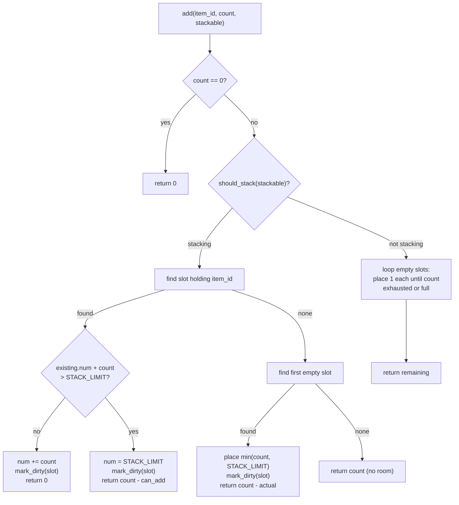
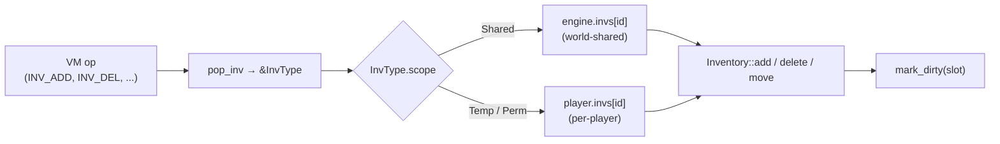
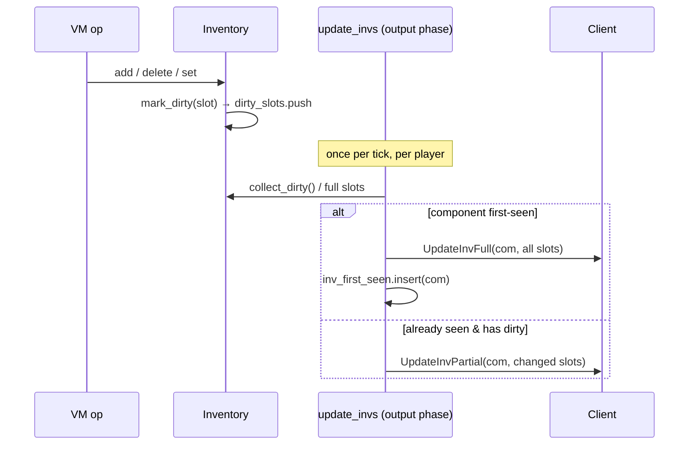
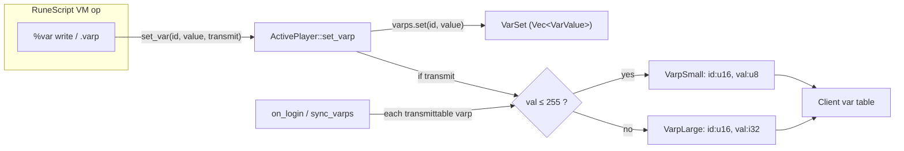
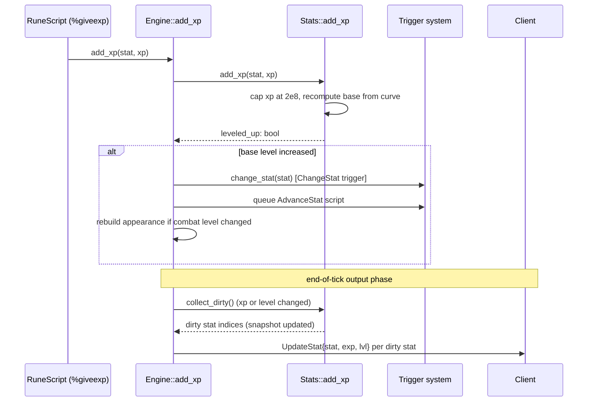
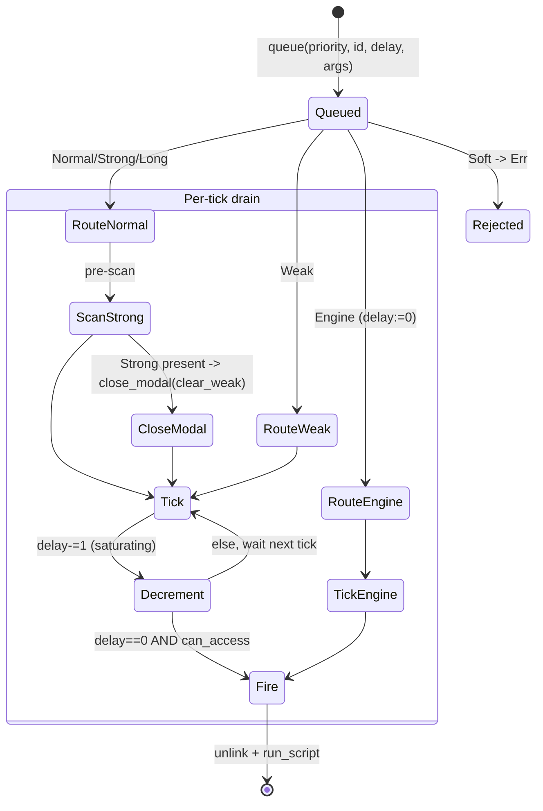

<a id="top"></a>

**[← Whitepaper index](../README.md)**  ·  [Single-file version](whitepaper-full.md)

# Part V · Player State & Items

> *The containers and per-entity sub-systems that make up a character.*


---

<a id="sec-16"></a>

## 16. Inventories & Items

Every container in rs-engine — the 28-slot player backpack, the 800-slot bank, a shop's stock, equipment worn slots, the
trade/exchange screens — is a single concrete type: `rs_inv::Inventory`. There is no class hierarchy, no
`PlayerInventory` versus `ShopInventory` split. The differences between a bank and a backpack are encoded entirely in
three values: the slot count (`capacity`), the stacking policy (`stack_mode`), and an optional restock template (
`stockobj`). This is a deliberate departure from the TS reference, which
carries behavior on the object; rs-engine keeps the container a flat, `Copy`-friendly data structure and pushes all
*policy* into the cache-driven `InvType` and the VM ops that drive it. The result is one tested, branch-light
implementation (`rs-inv/src/lib.rs` is ~510 lines of logic plus ~950 lines of tests) reused for every container kind.

This section covers the `Inventory` data structure field by field, the add/remove/move/transfer algorithms and their
overflow semantics, the `StackMode` policy, certs/notes, how inventories are keyed and shared between players and the
world, and how mutations are converted into partial-versus-full client update packets.

### The `Inventory` data structure

`rs-inv/src/lib.rs:17` defines the container:

```rust
pub struct Inventory {
    pub capacity: usize,
    pub slots: Vec<Option<Item>>,
    pub stack_mode: StackMode,
    pub dirty: bool,
    pub dirty_slots: Vec<u16>,
    pub stockobj: Box<[u16]>,
}
```

| Field         | Type                | Purpose                                                                                                     |
|---------------|---------------------|-------------------------------------------------------------------------------------------------------------|
| `capacity`    | `usize`             | Fixed slot count, set at construction; never grows. Used by `valid_slot` and dirty-slot filtering.          |
| `slots`       | `Vec<Option<Item>>` | The backing store, length `== capacity`. `None` is an empty slot, `Some(Item)` an occupied one.             |
| `stack_mode`  | `StackMode`         | The stacking policy (`rs-inv/src/lib.rs:3`); see below.                                                     |
| `dirty`       | `bool`              | Coarse "something changed this tick" flag.                                                                  |
| `dirty_slots` | `Vec<u16>`          | Append-only log of every slot index touched this tick (duplicates allowed).                                 |
| `stockobj`    | `Box<[u16]>`        | The set of item IDs that are this inventory's *base stock* (shops). Empties to count-0 instead of clearing. |

`Item` (`rs-inv/src/lib.rs:512`) is the per-slot payload and is intentionally tiny and `Copy`:

```rust
#[derive(Debug, Clone, Copy, PartialEq, Eq)]
pub struct Item {
    pub obj: u16,
    pub num: u32
}
```

`obj` is the object/item ID (a `u16`, matching the cache's `ObjType` key space), and `num` is the stack count. Because
`Item` is `Copy`, the entire `Slots` vector is `Vec<Option<Item>>` of 6-byte-payload `Option`s (8 bytes with
alignment/niche), and every read path uses `.copied()` rather than borrowing — see `inventory.get(slot).copied()`
throughout `rs-vm/src/ops/inv.rs`. This makes slot reads allocation-free and lets ops snapshot an item, mutate the
container, and still hold the old value without borrow-checker friction.

`capacity` is stored separately from `slots.len()` even though they are always equal after construction (`new`/
`with_stack_mode` both do `vec![None; capacity]`). The duplication lets `valid_slot` and `collect_dirty` bound-check
against a `usize` field without re-reading the vector's length, and documents the invariant that the backing vector is
never resized.

### StackMode: the stacking policy

`StackMode` (`rs-inv/src/lib.rs:2`) is a three-state enum that decides whether two items of the same ID merge into one
slot:

| Variant            | Meaning                                          | Used by                         |
|--------------------|--------------------------------------------------|---------------------------------|
| `Normal` (default) | Stack iff the item's `ObjType.stackable` is true | Player backpack                 |
| `Always`           | Stack unconditionally, ignoring `stackable`      | Bank, shop (any `stackall` inv) |
| `Never`            | Never stack; every unit takes its own slot       | Equipment, trade                |

The policy is applied by `should_stack` (`rs-inv/src/lib.rs:94`), a `const fn` that collapses the three modes against
the per-item `stackable` flag the caller supplies:

```rust
const fn should_stack(&self, stackable: bool) -> bool {
    match self.stack_mode {
        StackMode::Normal => stackable,
        StackMode::Always => true,
        StackMode::Never => false,
    }
}
```

The crucial design point is that `Inventory` itself never reads the item cache. The `stackable` bit is *passed in* by
the VM op (which has already resolved the `ObjType`). This keeps `rs-inv` a zero-dependency leaf crate with no knowledge
of `rs-pack`, and means the stacking decision is a single branch on a `Copy` enum plus one bool — no map lookup. The
mode is chosen at the call site by `stackmode(inv)` (`rs-vm/src/util.rs:725`): `StackMode::Always` when
`InvType.stackall` is set, else `Normal`. `StackMode::Never` is reserved for containers constructed directly (
equipment/trade) rather than via the generic `stackall` path.

`STACK_LIMIT` (`rs-inv/src/lib.rs:14`) is `0x7FFF_FFFF` (2 147 483 647) — `i32::MAX`. A single stacked slot can never
exceed this; the protocol transmits counts as `i32` (`num as i32`), so the limit is a wire-format constraint as much as
a gameplay one.

### Adding items: stack-or-slot resolution

`Inventory::add` (`rs-inv/src/lib.rs:136`) is the heart of the container. It takes `(item_id, count, stackable)` and
returns the count that could **not** be placed (0 = full success). The return-the-overflow convention is uniform across
the API and is what lets every VM op spill leftovers onto the ground without a second capacity query.



**Stacking path** (`should_stack` true): a linear `position` scan finds an existing slot of the same `obj`. If found,
the new total is computed in `u64` to avoid overflow, clamped to `STACK_LIMIT`, and the surplus returned. If no matching
stack exists, the first empty slot receives `min(count, STACK_LIMIT)` and any excess is returned. If neither a matching
stack nor a free slot exists, the whole `count` is returned.

**Non-stacking path**: a loop walks empty slots, dropping exactly one unit (`num: 1`) into each, decrementing `count`,
until `count` hits zero or the inventory is full. The leftover `remaining` is returned. This is how a `Never`-mode
equipment container or a non-stackable item like a sword behaves — five swords occupy five slots.

The linear scans are O(capacity). For a 28-slot backpack this is trivially fast; for an 800-slot bank in `Always` mode
the first-match scan still walks up to 800 slots per add. This mirrors the reference server's `Inventory.ts` (which also
scans), and is acceptable because adds are not on the per-tick hot path — they are driven by discrete player actions,
not the movement/info loop. The memory layout (`Vec` of `Copy` options) keeps the scan cache-friendly: it is a single
contiguous sweep of 8-byte cells.

### Removing items

There are three removal entry points with distinct contracts:

- **`delete(item_id, count)`** (`rs-inv/src/lib.rs:194`) — remove up to `count` of an ID *by scanning all slots*,
  draining stacks/units front-to-back, and returns the amount actually removed. This is the workhorse used by `INV_DEL`,
  drops, and the delete-half of every transfer.
- **`remove(slot, count)`** (`rs-inv/src/lib.rs:222`) — remove `count` from one specific slot; clears the slot if
  `num <= count`. Returns `true`/`false` for found/not-found.
- **`delete_slot(slot)`** (`rs-inv/src/lib.rs:323`) — unconditionally empty one slot.

`delete` carries the only piece of shop-aware logic inside `rs-inv`. Before scanning, it checks
`self.stockobj.contains(&item_id)`. If the ID is a base-stock item, a slot drained to zero is **kept occupied
at `num = 0`** rather than set to `None`:

```rust
if new_count == 0 & & ! stock_obj {
self .slots[i] = None;          // ordinary item: clear the slot
} else {
self.slots[i].as_mut().unwrap().num = new_count;  // stock item: keep the empty slot
}
```

This is the mechanism that lets a sold-out shop slot show "out of stock" and then restock over time: the slot stays in
place at count 0 so the cleanup-phase `restock_invs` (`rs-engine/src/phases/cleanup.rs:194`) can find it and increment
it back toward its base count. A non-stock item that hits zero is simply removed. The unit test
`delete_keeps_stock_obj_slot_at_zero` (`rs-inv/src/lib.rs:697`) pins this behavior.

### Moving and transferring

`Inventory` provides four move primitives, split by whether the source and destination are the same container:

| Method                                              | Scope     | Semantics                                                                    |
|-----------------------------------------------------|-----------|------------------------------------------------------------------------------|
| `move_to_slot(a, b)` (`:299`)                       | same inv  | Swap two slots (`slots.swap`); marks both dirty. Empty slots swap as `None`. |
| `move_from_slot(slot, stackable)` (`:425`)          | same inv  | Lift the item out and re-`add` it (restacks/re-slots); returns overflow.     |
| `move_from_slot_to(dest, slot, stackable)` (`:438`) | cross inv | Delete from self, `add` to `dest`; returns overflow.                         |
| `move_to_slot_to(dest, from, to)` (`:451`)          | cross inv | Positional swap between two containers (read both, write each to the other). |

`move_from_slot`/`move_from_slot_to` go through `add`, so they inherit stacking and overflow behavior: dragging a
stackable item back into the same inventory will merge it into an existing stack (test `move_from_slot_restacks`,
`:880`), while in a non-stackable case it lands in the first free slot. `move_to_slot_to` is a *positional* swap that
bypasses stacking entirely — it is used for drag-and-drop between, e.g., inventory and bank-tab interfaces where the
client dictates exact slot positions.

The cross-inventory variants require two simultaneous mutable borrows. The engine supplies them through
`get_inv_pair_mut` (`rs-engine/src/engine.rs:4378`), which `assert_ne!(a, b)` then splits the `FxHashMap` borrow via raw
pointers:

```rust
let pa = self .player.invs.get_mut( & a) ? as * mut Inventory;
let pb = self .player.invs.get_mut( & b) ? as * mut Inventory;
Some( unsafe { ( & mut * pa, & mut * pb) })
```

This is sound precisely because the keys are asserted distinct, so the two `&mut` never alias. It is the idiomatic Rust
answer to a problem the Java reference never had (Java aliases freely); the `assert_ne!` is the safety contract made
explicit.

### Certs and notes (certificate items)

rs-engine has no special "noted" container or item subtype. A note is just a different `ObjType` linked to its real form
via two cache fields, `certtemplate` and `certlink` (decoded in `rs-pack/src/unpack/config.rs:909`). Two helpers in
`rs-vm/src/util.rs` resolve between forms:

- `uncert(obj)` (`:886`) — if `obj` *is* a note (`certtemplate.is_some()`), return its `certlink` (the real item); else
  return `obj.id`.
- `cert(obj)` (`:907`) — if `obj` is *not* a note (`certtemplate.is_none()`) and has a `certlink`, return the note form;
  else `obj.id`.

The VM ops `INV_MOVEITEM_CERT` (`rs-vm/src/ops/inv.rs:436`) and `INV_MOVEITEM_UNCERT` (`:464`) compose these with
`delete` + `add`: cert deletes the real item from the source and adds the cert form (forced `stackable = true`, since
notes always stack) to the destination; uncert does the reverse, looking up the real item's true `stackable` flag. This
matches the TypeScript reference note/unnote branch exactly, but as a pair of free functions over a
flat container rather than a method on the inventory.

### Keying and sharing: who owns an inventory

Inventories live in two places, selected by the cache-defined `InvScope` (`rs-pack/src/types.rs:272`):

| Scope    | Value | Storage                                                                               | Lifetime                       |
|----------|-------|---------------------------------------------------------------------------------------|--------------------------------|
| `Temp`   | 0     | Per-player `player.invs: FxHashMap<u16, Inventory>`                                   | Cleared between sessions/areas |
| `Perm`   | 1     | Per-player `player.invs`                                                              | Persisted to the player save   |
| `Shared` | 2     | World-level `Engine::invs: FxHashMap<u16, Inventory>` (`rs-engine/src/engine.rs:392`) | World lifetime                 |

Both maps are keyed by the `InvType.id` (`u16`). A player's backpack and bank are distinct keys in *their own* map; a
shop is a single key in the *world's* map, so every player who opens that shop reads and mutates the same `Inventory`
instance. This is the structural mechanism for shops and the global exchange: there is one container, many viewers.

Routing is centralized in `rs-vm/src/util.rs`: `get_inv`/`get_inv_mut`/`get_inv_pair_mut` look up the `InvType`, compute
the `StackMode` from `stackall`, and dispatch on scope — `engine_mut().get_shared_inv(...)` for `Shared`,
`player.get_or_create_inv(...)` for `Temp`/`Perm`. Both creation paths (`Engine::get_shared_inv` at `engine.rs:2377`,
`get_or_create_inv` at `engine.rs:4395`) lazily insert via `entry(id).or_insert_with(...)` and, if the cache `InvType`
defines `stockobj`/`stockcount`, pre-populate slots and copy `stockobj` into the container so the restock/sold-out
machinery works. Inventories are therefore created on first access, not at login — a player who never opens a shop never
allocates that container.



### Protected-access guard

Most mutating ops begin with a uniform guard (e.g. `rs-vm/src/ops/inv.rs:113`):

```rust
if ! s.pointers.has(PROTECTED_ACTIVE_PLAYER[secondary])
& & inv.protect
& & inv.scope != InvScope::Shared {
return Err(/* requires protected access */);
}
```

An inventory whose `InvType.protect` is true (the default — `protect: true` at `cache/inv.rs:37`, cleared only by config
code 7) may only be mutated when the script holds the protected-active-player lock. Shared inventories are exempt, since
they are not tied to a single player's protected state. This prevents a non-protected script (e.g. one running during
another player's tick) from silently corrupting a player's backpack mid-action, replicating the reference server's
protected-access discipline.

### Overflow handling: spill to ground

Because `add` returns the un-placed count, ops handle a full inventory uniformly: drop the overflow as a ground object
owned by the player. `INV_ADD` (`rs-vm/src/ops/inv.rs:123`) is the canonical pattern:

```rust
let overflow = get_inv_mut::<E>(inv.id, player) ?.add(obj_id, count, obj.stackable);
if overflow > 0 {
if ! obj.stackable | | overflow == 1 {
for _ in 0..overflow {
engine_mut().add_obj(coord, obj_id, 1, receiver37, LOOTDROP_DURATION);
}
} else {
engine_mut().add_obj(coord, obj_id, overflow, receiver37, LOOTDROP_DURATION);
}
}
```

Non-stackable overflow becomes N separate single-item ground piles; stackable overflow becomes one pile of `overflow`.
The same idiom appears in `BOTH_MOVEINV`, `INV_MOVEITEM`, `INV_MOVEFROMSLOT`, and the drop ops, always with
`LOOTDROP_DURATION` (`rs-vm/src/util.rs:22`, `= (200*3)>>1 = 300` ticks). The capacity-prediction op `INV_ITEMSPACE`/
`INV_ITEMSPACE2` (`:353`/`:369`) lets scripts pre-check via `inv_itemspace` (`rs-vm/src/util.rs:855`): for
stackable/cert/stockall items it computes `count - (STACK_LIMIT - total)`, for non-stackable items
`count - (freespace - (inv.size - size))`, both clamped to `max(0)`.

### Dirty tracking and client update packets

Every mutator calls `mark_dirty(slot)` (`rs-inv/src/lib.rs:107`), which sets `dirty` and *appends* the slot index to
`dirty_slots` — duplicates and all. Deduplication is deferred to read time in `collect_dirty` (`rs-inv/src/lib.rs:123`),
which sorts, dedups, bound-filters against `capacity`, and maps each surviving slot to its *current* contents:

```rust
slots.into_iter()
.filter( | & s| (s as usize) < self .capacity)
.map( | s| (s, self .get(s).map( | i| (i.obj, i.num as i32))))
.collect()
```

Appending-then-deduping is cheaper than maintaining a set on the hot mutation path: a slot touched five times in one
tick costs five `Vec::push`es and one dedup, not five hash probes. Reading current contents (rather than logging old
values) means a slot edited twice reports only its final state — test `collect_dirty_reflects_current_value` (`:1352`)
confirms a slot set then emptied reports `None`.

The output phase (`rs-engine/src/phases/output.rs:101`) calls `ActivePlayer::update_invs` (
`rs-engine/src/active_player.rs:1003`) once per player. For each registered transmit binding it decides **partial vs
full** per interface component:

- **First time** a component (`com`) sees an inventory → a **full** update (`update_inv_full`, every slot) and the `com`
  is recorded in `player.inv_first_seen`.
- **Subsequent ticks** with changes → a **partial** update (`update_inv_partial`, only `collect_dirty()` slots).



The payload buffers are reused per-player via `thread_local!` scratch `Vec`s (`FULL`, `PARTIAL`) so the per-tick
transmit allocates nothing. The whole `inv_transmits` map is taken out with `std::mem::take` and put back after the
loop, sidestepping a clone-the-map borrow conflict against the `&mut self` send calls. `update_invs` also feeds
`runweight`: if any transmitted player inventory has `InvType.runweight` set and changed (or was first-seen), it
recomputes and sends `UpdateRunWeight`.

#### Wire layout

`UpdateInvFull` (`rs-protocol/.../update_inv_full.rs`) is a `VarShort`-length `Immediate` packet:

```
p2  com                       (interface component id)
p1  count = objs.len()        (slot count)
repeat count times:
    p2  obj == 0 ? 0 : id+1   (item id, +1 so 0 means "empty")
    if count < 255:  p1  count
    else:            p1 0xFF; p4 count   (4-byte extended count)
```

`UpdateInvPartial` is identical *per entry* but prefixes each with the absolute slot index and omits the leading count,
since only changed slots are sent:

```
p2  com
repeat per changed slot:
    p1  slot                  (actual slot index, not sequential)
    p2  id+1 (0 = empty)
    count: p1, or 0xFF + p4 if >= 255
```

Two fidelity details: item IDs are written `id+1` so the wire value 0 unambiguously means "empty slot" (matching the
original client), and counts ≥ 255 escape to a 4-byte form via the `0xFF` sentinel — which is exactly why `STACK_LIMIT`
is `i32::MAX` and counts are carried as `i32`. `INV_STOPTRANSMIT`/`update_inv_stop_transmit` (`:907`) tears the binding
down and tells the client to stop expecting updates; `clear_inv_transmits` also drops the component from
`inv_first_seen` so a later re-bind starts with a full update again.

### Cross-player viewing (invother)

`INVOTHER_TRANSMIT` (`rs-vm/src/ops/inv.rs:663`) registers a listener that mirrors *another* player's inventory onto a
component (used for trade/duel screens). `update_other_invs` (`rs-engine/src/active_player.rs:1115`) resolves the source
player by script-uid each tick, sending a full update on first sight and partials thereafter from the *source's* dirty
set — which survives until the cleanup phase, so every viewer this tick sees the same changes. Listeners whose source
player logged out (or whose slot was reused, detected by uid mismatch) are skipped.

### Tick lifecycle and restock

The dirty set is per-tick. After output transmits everything, cleanup (`rs-engine/src/phases/cleanup.rs`) runs
`reset_shared_invs` (`:168`) which `clear_dirty()`s every shared inventory, then `restock_invs` (`:194`). The ordering
is deliberate and documented: restock must run *after* the reset, because restocking re-dirties slots that must survive
into next tick's output. Per-player inventories are cleared implicitly — `collect_dirty` is read once per tick and the
dirty log is overwritten/cleared on the next mutation cycle. `restock_invs` walks each restockable inventory's slots,
comparing each `num` against its base `stockcount` and, when `tick.is_multiple_of(stockrate)`, nudging it one unit
toward base (up if under-stocked, down if over-stocked); `allstock` inventories shed excess at the default
`INV_STOCKRATE = 100` (`cleanup.rs:6`). This, combined with `delete`'s keep-at-zero behavior for stock items, is the
complete shop economy loop.

### Why this design

The single-`Inventory`-type approach trades the reference server's object-oriented polymorphism for a flat, `Copy`
-dense, dependency-free data structure whose policy is injected (stack mode, stackable flag) rather than inherited. The
wins are concrete: slot reads are allocation-free `Copy`s; the stacking decision is one enum branch plus one bool, no
cache lookup inside the container; transmit buffers are thread-local and reused; dirty tracking is append-then-dedup to
keep the mutation path branch-light; and the overflow-return convention lets every op spill to ground uniformly. The
cost is O(capacity) linear scans on add/delete, which is acceptable because container mutations are action-driven, not
part of the per-tick movement/info hot loop. Byte-level wire fidelity (`id+1` empty encoding, `0xFF` extended-count
escape, `i32` counts capped at `STACK_LIMIT`) is preserved exactly so the original client cannot tell it is talking to a
Rust server.

<sub>[↑ Back to top](#top)</sub>


---

<a id="sec-17"></a>

## 17. Player Sub-Systems — Vars, Stats, Timers, Queues, Hero, Camera

This section documents six small, single-purpose crates that hold the mutable per-entity state a RuneScript needs to act
on a player or NPC: `rs-var` (variables), `rs-stat` (skills/levels/experience), `rs-timer` (recurring scheduled
scripts), `rs-queue` (delayed one-shot scripts), `rs-hero` (damage attribution), and `rs-cam` (camera control). Each
crate is deliberately tiny — none exceeds a few hundred lines of logic — and each is a pure data structure with *no*
engine dependencies beyond shared cache/VM value types. The integration logic (transmission to the client, draining
during a tick, script dispatch) lives in `rs-engine` and is documented inline below so this section is self-contained.

The design philosophy these crates share is the same one that governs the whole engine: **separate the storage primitive
from the policy**. The crates own the bytes and the arithmetic; `rs-engine`'s phase code and trait `impl`s own *when*
and *how often* those bytes are read, mutated, and flushed. This keeps the data structures trivially testable (each
crate ships an extensive `#[cfg(test)]` block) and keeps the hot per-tick loops in one place where the ordering
invariants are visible.

---

### rs-var — Player and NPC Variables (varps / varns)

#### Storage model

`VarSet` (`rs-var/src/lib.rs:18`) is a single newtype over `Vec<VarValue>`:

```rust
pub struct VarSet {
    values: Vec<VarValue>,
}
```

`VarValue` is the type-tagged value enum defined in the cache crate (`rs-pack/src/cache/mod.rs:112`). It has one variant
per `ScriptVarType` (`Int(i32)`, `String(String)`, `Obj(i32)`, `Coord(i32)`, `Npc(i32)`, `Boolean(i32)`, …). Every
variant except `String` wraps an `i32`; `as_int()` (`rs-pack/src/cache/mod.rs:200`) collapses any non-string variant to
its inner `i32` and maps `String` to `-1`.

A `VarSet` is constructed from an iterator of `ScriptVarType` (`VarSet::new`, `rs-var/src/lib.rs:46`); the iterator
length fixes the slot count, and each slot is seeded by `VarValue::default_for` (`rs-pack/src/cache/mod.rs:171`). The
default is **type-aware**, which is the key fidelity detail:

| Var type                                                                                                                          | Default value   | Rationale                                       |
|-----------------------------------------------------------------------------------------------------------------------------------|-----------------|-------------------------------------------------|
| `Int`, `AutoInt`                                                                                                                  | `Int(0)`        | numeric counters start at zero                  |
| `String`                                                                                                                          | `String("")`    | empty text                                      |
| `Boolean`                                                                                                                         | `Boolean(-1)`   | "unset" tri-state, distinct from false=0        |
| `Obj`, `NamedObj`, `Npc`, `Loc`, `Component`, `Enum`, `Struct`, `Coord`, `Category`, `Spotanim`, `Inv`, `Synth`, `Seq`, `Stat`, … | `<variant>(-1)` | `-1` is the universal "null reference" sentinel |

Using `-1` (not `0`) for reference types matches the TS reference server, where `-1` is the canonical "no object /
no coordinate" marker; a `0` would be a *valid* id and would silently corrupt script logic.

`VarSet` is used in two contexts, both noted in the doc comment at `rs-var/src/lib.rs:11`:

- **varps** (player variables): one `VarSet` lives on each `Player`, built from `cache().varps` type definitions.
- **varns** (NPC variables): one `VarSet` lives on each NPC, built from `cache().varns`.

#### API surface

The whole crate is six methods: `get(id: u16) -> &VarValue` (`:76`), `set(id, value)` (`:105`), `len`/`is_empty`,
`reset(types)` (`:148`), plus `new`. `get`/`set` index directly into the `Vec` with `id as usize` and are `#[inline]`;
they **panic on out-of-bounds** rather than returning `Option`, because the var id space is fixed at construction from
the cache and an out-of-range id indicates a content/compile bug, not a runtime condition. `reset` re-seeds existing
slots from a fresh type iterator (capped at `min(types.count(), len)`), used on login/save-load to clear transient varps
back to defaults before persisted values are layered in.

Crucially, `set` does **no** type checking against the original `ScriptVarType` (`rs-var/src/lib.rs:84`): the caller is
trusted to supply a compatible `VarValue`. The engine's `set_var` paths enforce this — for a string-typed varp the
engine constructs `VarValue::String(s)`, otherwise it routes through `VarValue::from_int(var_type, value)` (the pattern
exercised in the `string_varp_pattern` test at `:306`).

#### Engine integration and client sync

The VM reaches varps/varns through trait methods on the engine. For players:

- `PlayerEngine::get_var` (`rs-engine/src/engine.rs:3157`) → `self.player.varps.get(id).clone()`.
- `PlayerEngine::set_var` (`rs-engine/src/engine.rs:3167`) → `ActivePlayer::set_varp` (
  `rs-engine/src/active_player.rs:1620`).

For NPCs the analogous `get_var`/`set_var` (`rs-engine/src/engine.rs:4698`, `:4708`) read/write `self.npc.vars`; **NPC
varns are never transmitted** — there is no client representation of an NPC's private variables.

`set_varp` is where storage meets the wire (`rs-engine/src/active_player.rs:1620`):

```rust
pub fn set_varp(&mut self, id: u16, value: VarValue, transmit: bool) {
    self.player.varps.set(id, value.clone());
    if transmit {
        self.varp_transmit(id, value.as_int());
    }
}
```

`varp_transmit` (`:970`) picks the wire encoding by magnitude — this is the byte-fidelity rule:

| Condition                | Packet               | Payload               |
|--------------------------|----------------------|-----------------------|
| `val <= u8::MAX` (≤ 255) | `VarpSmall` (`:984`) | `id: u16`, `val: u8`  |
| `val > 255`              | `VarpLarge` (`:979`) | `id: u16`, `val: i32` |

The original client expects exactly this split (a one-byte "small" varp opcode and a four-byte "large" one); choosing
the smaller form for the common case (most varps are small flags/counters) minimizes per-tick bandwidth. On login,
`sync_varps` (`rs-engine/src/active_player.rs:1229`) walks every slot, skips varps whose cache definition has
`transmit == false`, and pushes the rest via `varp_transmit` — a full resync so the client's var table matches the
server before any gameplay runs.

#### Varbits — a cache/script concept, not an rs-var concept

It is important to state precisely what `rs-var` does **and does not** do. `rs-var` stores *raw varps* only. **Varbits
** — the RS2 mechanism of packing a small bit-range into a host varp so many boolean/small-range flags share one 32-bit
player variable — are **not** implemented inside `rs-var`. A repository-wide search finds `varbit` only in cache type
definitions (`ScriptVarType`, `rs-pack/src/types.rs:174`), script opcode tables, and content `.rs2` scripts; there is no
bit-masking, shifting, or `base_varp`/`low_bit`/`high_bit` logic in `rs-var/src/lib.rs` or in the engine's `get_var`/
`set_var`. (See caveats.) Consequently the diagram below shows the *raw varp* path that `rs-var` actually owns; varbit
decode/encode, where present, would resolve to a host varp id + value before reaching `VarSet::set`.



---

### rs-stat — Skills, Levels, Experience

#### The `Stats<N>` block

`Stats<N>` (`rs-stat/src/lib.rs:10`) is a const-generic fixed-size stat block. `N` is a compile-time constant — **21 for
players, 6 for NPCs** — so the entire structure is five stack-allocated arrays with zero heap allocation:

```rust
pub struct Stats<const N: usize> {
    pub levels: [u8; N],        // current (boosted/drained) level
    pub base_levels: [u8; N],   // permanent level derived from xp
    pub xp: [i32; N],           // cumulative experience (players; zeroed for NPCs)
    pub last_xp: [Option<i32>; N],   // delta-tracking snapshot
    pub last_levels: [Option<u8>; N], // delta-tracking snapshot
}
```

The player stat indices are fixed by `PlayerStat` (`rs-pack/src/types.rs:825`):
`Attack=0, Defence=1, Strength=2, Hitpoints=3, Ranged=4, Prayer=5, Magic=6, Cooking=7 … Runecraft=20`. New players are
seeded by `apply_new_player_defaults` (`rs-engine/src/player_save.rs:502`): all stats xp=0/level=1 *except* Hitpoints,
which is set to level 10 with `get_exp_by_level(10)` xp and base level 10 — exactly mirroring the canonical RS2 starting
account.

`levels` vs `base_levels` is the boost/drain split: `base_levels[i]` is the "real" level computed from xp; `levels[i]`
is what the player currently shows after potions, prayers, poison, etc. `reset()` (`:116`) snaps every current level
back to base in one array copy (`self.levels = self.base_levels`).

#### Level/XP arithmetic — the seven mutators

All level adjustments are flat-plus-percentage and clamp into `u8` range. The percentage base differs by operation,
which is a subtle but load-bearing distinction faithfully copied from the original:

| Method (`rs-stat/src/lib.rs`) | Formula                                                | Clamp     | % is taken of |
|-------------------------------|--------------------------------------------------------|-----------|---------------|
| `add` (`:60`)                 | `current + (c + base·p/100)`                           | `[0,255]` | **base**      |
| `sub` (`:71`)                 | `current − (c + base·p/100)`                           | `≥0`      | **base**      |
| `heal` (`:83`)                | `min(current + (c + base·p/100), base)` (never lowers) | ≤ base    | **base**      |
| `boost` (`:96`)               | `min(current + amt, base + amt)` (never lowers)        | `[0,255]` | **base**      |
| `drain` (`:108`)              | `current − (c + current·p/100)`                        | `≥0`      | **current**   |

`drain` uniquely scales by *current* level (so successive drains compound on the diminishing value), whereas `boost`/
`add`/`sub`/`heal` scale by *base* (so a boost is stable regardless of prior boosts). `heal` and `boost` both guard
against *lowering* an already-elevated stat (`.max(current)`), so a weak heal cannot undo a strong potion. These exact
semantics let RuneScript `%stat` operations map 1:1 onto the original server's `Player.addStat/boostStat/healStat`
family.

#### Experience curve

`get_level_by_exp` (`rs-stat/src/lib.rs:162`) and `get_exp_by_level` (`:186`) implement the standard RuneScape XP curve:

```
points(L) = floor(L + 300 · 2^(L/7))
xp_to_reach(level) = (Σ_{L=1}^{level-1} points(L)) / 4
```

`get_level_by_exp` accumulates `points` until the running threshold exceeds `exp`, returning 1..99. The
`exp_level_roundtrip` test (`:298`) pins the full 99-entry table (level 2 = 83 xp, … level 99 = 13,034,431 xp) and
verifies both directions are inverse, guaranteeing byte-identical leveling to the reference client's local XP display.

`add_xp` (`:143`) is the write path: it caps cumulative xp at **200,000,000**, recomputes the base level from the curve,
and reconciles the current level:

- if `current == old_base`, the current level tracks the new base (an unboosted player levels up normally);
- else if the base rose *and* `current < old_base`, the gap is preserved by adding the delta (a *drained* player still
  gets the level-up's worth of points).

It returns `true` iff the base level increased — the signal the caller uses to fire level-up side effects.

#### Engine integration: triggers and client sync

`add_xp` on the engine (`rs-engine/src/engine.rs:3287`) delegates to `Stats::add_xp`; on a `true` return it calls
`change_stat`, enqueues the `AdvanceStat` trigger script for that stat, and rebuilds appearance if combat level changed.
The `stat_add/boost/heal/sub/drain` engine wrappers (`:3320` onward) each capture `prev = level(stat)`, apply the
mutator, and — if Hitpoints was *restored to or above base* — clear `hero_points` (so a fully-healed entity drops its
damage-attribution table; see Hero). When the displayed level actually changed they call `update_stat` (push to client)
and `change_stat` (fire the `ChangeStat` trigger, `:3420`).

Client transmission uses the dirty-tracking snapshot. `Stats::collect_dirty` (`rs-stat/src/lib.rs:122`) yields the
indices where `xp` *or* `levels` differs from `last_xp`/`last_levels`, updating the snapshot as it goes — so each
changed stat is reported exactly once. `ActivePlayer::update_stats` (`rs-engine/src/active_player.rs:930`) drains that
iterator and sends an `UpdateStat { stat, exp, lvl }` packet per dirty stat (`update_stat`, `:945`), and
opportunistically pushes run-energy when its 0–100 percentage bucket changes. On login all 21 stats are force-sent (
`on_login`, `:401`).



---

### rs-timer — Recurring Scheduled Scripts

#### Dual-lane registry

`ScriptTimer` (`rs-timer/src/lib.rs:8`) holds two `FxHashMap<i32, TimedScript>` lanes keyed by script id:

```rust
pub struct ScriptTimer {
    pub normal: FxHashMap<i32, TimedScript>,
    pub soft: FxHashMap<i32, TimedScript>,
}
```

`TimedScript` (`rs-vm/src/state.rs:1126`) is
`{ clock: u64, args: Option<Vec<ScriptArgument>>, script_id: i32, interval: u16, priority: TimerPriority }`.
`TimerPriority` (`:1113`) has exactly two variants, `Normal` and `Soft`. The lane split is the whole point: **Normal**
timers run only when the player is accessible (not mid-modal, not busy), whereas **Soft** timers run unconditionally —
they are for cosmetic/idle effects that must keep ticking regardless of player state.

The `FxHashMap` (rustc-hash) choice over `std::HashMap` is deliberate: keys are small `i32` script ids, the map is hot
every tick, and `FxHashMap`'s non-cryptographic hash is markedly faster for this workload. Keying by `script_id`
enforces the **at-most-one-timer-per-script-per-lane** invariant for free: `add` (`:52`) is an `insert`, so
re-registering the same script id replaces its interval/clock/args (test `add_replaces_existing_same_id`, `:182`). The
same id *can* exist in both lanes simultaneously (test `same_id_different_priorities`, `:233`); `get` (`:125`) checks
`normal` first, then `soft`.

Removal: `remove(id, priority)` (`:89`) targets one lane; `remove_any(id)` (`:107`) clears both — `remove_any` is what
the engine's `cleartimer` calls (`rs-engine/src/engine.rs:4282`), since RuneScript's `cleartimer` op is
priority-agnostic.

#### Firing semantics

A timer is **ready** when `clock >= timer.clock + timer.interval`, where `timer.clock` is the tick at which it was last
set/fired and `interval` is the cadence in ticks. `Player::process_timers` (`rs-engine/src/phases/player.rs:165`) drives
it:

```rust
let accessible = priority == TimerPriority::Soft | | can_access;
for timer in timers.values_mut() {
if clock < timer.clock + timer.interval as u64 | | ! accessible { continue; }
timer.clock = clock;                 // re-arm: next fire is +interval from NOW
// build_state(...) + run_script_by_state(...)
}
```

Two important behaviors fall out of this. First, **`timer.clock = clock` re-arms from the firing tick**, not from
`clock + interval`, so timers do not "drift forward" or batch-catch-up after a stall — a missed window simply fires once
and reschedules. Second, the accessibility gate (`accessible`) applies *only* to the `Normal` lane; soft timers fire
even while the player is in a modal or otherwise inaccessible. Logged-out players are skipped entirely (`logout_sent`
early-return, `:167`).

Both lanes are processed back-to-back in phase order — `process_timers(Normal)` then `process_timers(Soft)` (
`rs-engine/src/phases/player.rs:111`–`112`) — and the run flag passed to `run_script_by_state` distinguishes them (
`Some(priority == TimerPriority::Normal)`, `:197`).

The pointer-passing convention (`active: *mut ActivePlayer`, `:165`) is a recurring engine idiom: the raw pointer
sidesteps Rust's `noalias`/borrow rules so a timer script can re-enter and mutate the same player it was fired from.
This is sound here because the engine is single-threaded and the script runs to completion before the loop advances.

---

### rs-queue — Delayed One-Shot Scripts

#### Triple-lane queue over a `LinkList`

`ScriptQueue` (`rs-queue/src/lib.rs:12`) routes scripts by priority into three intrusive linked lists:

```rust
pub struct ScriptQueue {
    pub queue: LinkList<QueuedScript>,  // Normal | Strong | Long
    pub weak: LinkList<QueuedScript>,  // Weak
    pub engine: LinkList<QueuedScript>,  // Engine (delay forced to 0)
}
```

`LinkList` is the engine's intrusive doubly-linked list from `rs-datastruct`, chosen over `Vec` because queue entries
are unlinked from arbitrary positions mid-iteration (a `Vec` would force O(n) shifts or tombstones). `QueuedScript` (
`rs-vm/src/state.rs:1103`) is
`{ priority: QueuePriority, script_id: i32, delay: u16, args: Option<Vec<ScriptArgument>> }`. `QueuePriority` (`:1081`)
has six variants: `Normal, Long, Engine, Weak, Strong, Soft`.

`add` (`rs-queue/src/lib.rs:66`) is the router:

| Priority                   | Lane     | Special handling                                                   |
|----------------------------|----------|--------------------------------------------------------------------|
| `Normal`, `Strong`, `Long` | `queue`  | appended to tail                                                   |
| `Engine`                   | `engine` | **`delay` forced to 0**                                            |
| `Weak`                     | `weak`   | appended to tail                                                   |
| `Soft`                     | —        | returns `Err(ScriptError::Runtime)` — soft queueing is unsupported |

Forcing Engine delay to 0 (`:84`) reflects that engine-internal scripts (login, zone entry, interface callbacks) must
run *this* tick, not on a content-author-chosen delay. `Soft` is explicitly rejected with the script id in the message (
test `soft_error_message_contains_script_id`, `:324`).

Two query/mutation helpers: `remove_any(id)` (`:103`) unlinks every matching entry from `queue` and `weak` (not
`engine`); `count_by_script(id)` (`:156`) counts matches across `queue` + `weak`. `remove_any` delegates to
`unlink_matching` (`:133`), whose correctness rests on a precise `LinkList` cursor invariant documented in the source:
`head()`/`next()` return a node *after* advancing the cursor to that node's successor, and `unlink` only repatches
neighbors (never the cursor), so unlinking the just-yielded node mid-walk is safe and every survivor is visited once.

#### Draining order and the Strong→Weak displacement rule

The player phase drains queues in a fixed order (`Player::process_queues`, `rs-engine/src/phases/player.rs:222`):

1. **Pre-scan for `Strong`.** If any primary-queue entry is `Strong`, set `request_modal_close` and `close_modal(true)`
   *before* running anything (`:226`–`241`). Closing the modal with `clear_weak_queue = true` is the engine's
   realization of the "strong action displaces weak actions" rule from the original server — a deliberate player
   action (Strong) cancels pending low-priority (Weak) scripts.
2. **`process_queue`** (`:265`) — primary lane.
3. **`process_weak_queue`** (`:331`) — weak lane.

Later in the tick, **`process_engine_queue`** (`:382`) drains the engine lane. The drain loop is identical across lanes:
decrement `delay` (saturating), and when the *pre-decrement* delay was `0` **and** `can_access()`, unlink the entry and
run its script. Two nuances live in the primary lane (`process_queue`):

- **Logout force-expiry**: if `logout_sent` and the entry is `Long` with a leading `Int(0)` arg, its delay is zeroed so
  it runs immediately during logout drain (`:270`–`280`).
- **Long arg stripping**: `Long` entries have their first argument removed before execution (`:288`–`292`) — that
  leading int is the logout-control flag, not a script argument.



---

### rs-hero — Damage Attribution ("who gets the kill")

#### Fixed-capacity leaderboard

`HeroPoints` (`rs-hero/src/lib.rs:25`) is a 16-slot array of `Hero { user37: u64, points: i32 }`:

```rust
const MAX_HEROES: usize = 16;
pub struct HeroPoints {
    heroes: [Hero; MAX_HEROES]
}
```

Each `Hero` maps a contributor's **base37-encoded username** (`user37`) to cumulative contribution points. The
empty-slot sentinel is `Hero { user37: u64::MAX, points: 0 }` (`Hero::EMPTY`, `:16`) — `u64::MAX` is chosen because it
can never collide with a real base37 username hash. The fixed 16-entry array means `HeroPoints` is a flat ~192-byte
value with **no heap allocation** and is `const`-constructible (`new`, `:40`), so it can be embedded directly in
`Player`/`Npc` structs and created in `const` contexts.

`add_hero(user37, points)` (`:81`):

- ignores `points < 1` (the original ignores zero/negative contribution);
- if `user37` already has a slot, accumulates into it;
- else fills the first empty slot;
- if all 16 slots are full and the user is new, **silently drops** the contribution.

The 16-cap matches the reference server: only the top contributors matter for loot/XP, and the cap bounds the per-entity
memory and the sort cost.

`find_hero()` (`:108`) answers "who dealt the most damage": it clones the array, `quicksort`s it descending by `points`,
and returns `Some(top.user37)` unless the top slot is still the empty sentinel (in which case `None`). Cloning before
sorting keeps the insertion-order array intact for future `add_hero` accumulation.

`quicksort`/`quicksort_inner` (`:138`, `:172`) is a bespoke middle-pivot quicksort. It carries a curious tiebreaker —
the partition predicate is `compare(...) < (loop_index & 1)` — that uses index parity to break ties non-stably. This is
a faithful port of the reference server's exact sort (the JS server's hand-rolled quicksort with the same parity trick);
reproducing it bit-for-bit guarantees that when two players have *equal* contribution the *same* one is awarded the kill
as on the original, preserving behavioral fidelity even in this edge case.

#### Engine integration and lifecycle

The VM reaches the table through `heropoints` and `findhero` trait methods on both player and NPC engines:

- player: `heropoints` → `self.player.hero_points.add_hero` (`rs-engine/src/engine.rs:3438`); `findhero` →
  `self.player.hero_points.find_hero()` (`:3459`).
- NPC: `heropoints` → `self.npc.hero_points.add_hero` (`:4896`).

The table is **cleared on full heal**: when a stat heal/boost/add restores Hitpoints to ≥ its base level, the engine
calls `hero_points.clear()` (`rs-engine/src/engine.rs:3327`, `:3350`, `:3373`; NPC equivalent at
`rs-engine/src/active_npc.rs:262`). Rationale: once an entity is back to full health, prior aggressors have "lost" their
claim — a subsequent killer should get the kill. Typical flow: each hit a script calls `~heropoints` with the attacker's
`user37` and the damage as points; on death the death script calls `~findhero` to decide loot/XP recipient.

---

### rs-cam — Camera Control

`rs-cam` is the smallest crate — a queue of camera operations flushed to the client each tick. `CamKind` (
`rs-cam/src/lib.rs:4`) is `#[repr(u8)]` with `MoveTo = 0` and `LookAt = 1` (the wire opcodes). `CamInfo` (`:10`) carries
`{ kind, x: u16, z: u16, height: u16, rate: u8, rate2: u8 }` — **absolute** world tile coordinates plus a vertical
height and two interpolation rates. `CamQueue` (`:19`) wraps a single `LinkList<CamInfo>`; `add` (`:30`) appends to the
tail.

The VM enqueues via `cam_lookat`/`cam_moveto` (`rs-engine/src/engine.rs:4319`, `:4332`), each a thin
`self.player.cam_queue.add(CamKind::…, x, z, height, rate, rate2)`. `cam_shake` (`:4345`) bypasses the queue and writes
its packet immediately (it has no coordinate to localize).

The queue exists because camera packets carry **build-area-local** coordinates, but scripts specify **absolute** world
coordinates — and the local origin isn't known until the output phase fixes the player's build area for the tick.
Draining happens in `ActivePlayer::update_map` (`rs-engine/src/active_player.rs:453`), once per tick in the output
phase:

```rust
let origin_x = CoordGrid::zone_origin( self .player.build_area.origin.x());
let origin_z = CoordGrid::zone_origin( self .player.build_area.origin.z());
while let Some(idx) = h {
let info = self.cam_queue.queue.unlink(idx);
let local_x = info.x.wrapping_sub(origin_x) as u8;  // absolute -> local
let local_z = info.z.wrapping_sub(origin_z) as u8;
match info.kind {
CamKind::MoveTo => self.cam_moveto(local_x, local_z, info.height, info.rate, info.rate2),
CamKind::LookAt => self.cam_lookat(local_x, local_z, info.height, info.rate, info.rate2),
}
}
```

Each `CamInfo` is converted to a build-area-local `(u8, u8)` via `wrapping_sub(origin)` and emitted as the matching
`CamMoveTo`/`CamLookAt` packet (`rs-engine/src/active_player.rs:410`, `:420`), whose payload is
`{ x: u8, z: u8, height: u16, rate: u8, rate2: u8 }`. Deferring the localization to `update_map` guarantees the camera
coordinates are consistent with the *same* build-area origin used for the rest of the zone/scene update in that tick —
emitting them at script time could use a stale origin if the player crossed a zone boundary mid-tick. `add` returns
`Result<(), ScriptError>` for signature uniformity with the other queue crates even though it is currently infallible (
always `Ok`).

---

### Cross-cutting design notes

- **No heap in the hot path.** `Stats<N>` and `HeroPoints` are fixed arrays; `VarSet` allocates once at construction and
  never grows. Only timer/queue maps/lists allocate, and only on `add`.
- **Sentinels over `Option`.** `-1` for null var references, `u64::MAX` for empty hero slots, `Option<i32>`/`Option<u8>`
  only where "never seen" must differ from a real zero (stat delta snapshots). This keeps values copyable and packs them
  densely.
- **Storage vs policy split.** Every crate here is a passive data structure; the *scheduling*, *accessibility gating*,
  *displacement rules*, and *client transmission* all live in `rs-engine`'s phase code and trait `impl`s, where the
  single-threaded tick ordering makes the invariants auditable in one place.
- **Byte- and behavior-fidelity.** Type-aware var defaults, the exact XP curve, the small/large varp encoding split, and
  even the non-stable hero quicksort tiebreaker are reproduced precisely so the Rust server is observationally identical
  to the TS reference.

<sub>[↑ Back to top](#top)</sub>

---

[← Part IV](part-04-the-runescript-engine.md)  ·  [↑ Index](../README.md)  ·  [Part VI →](part-06-networking-and-the-wire.md)
