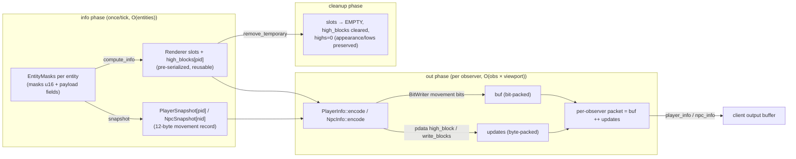
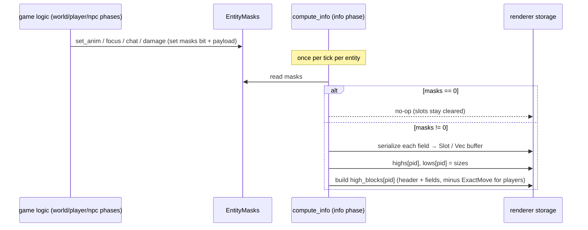
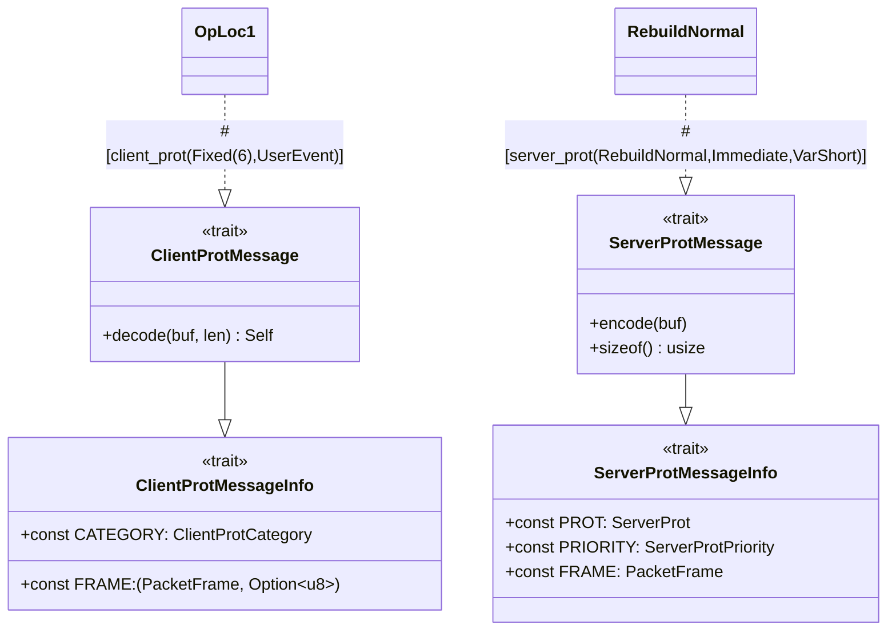
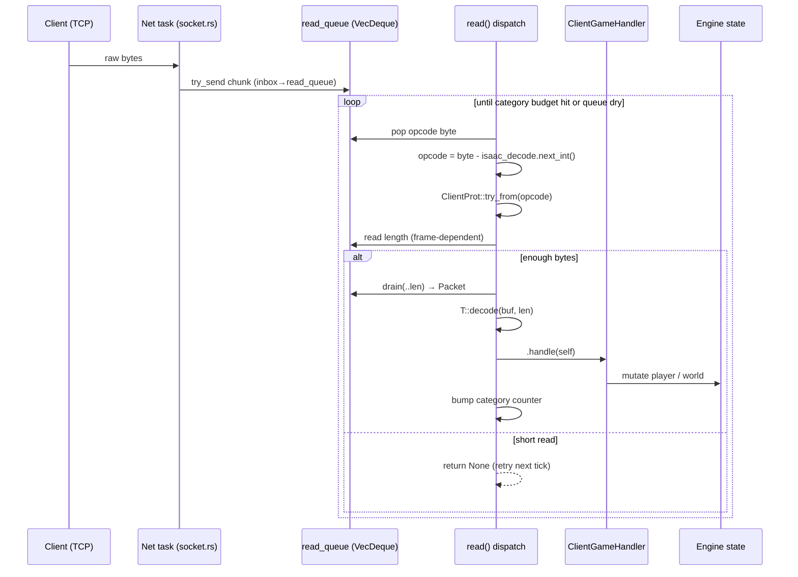
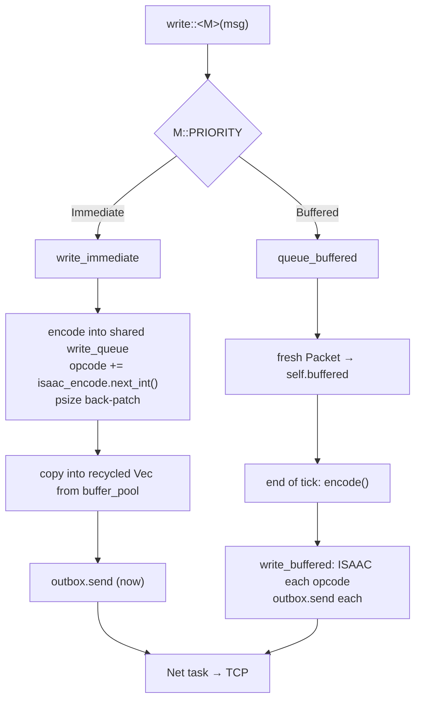
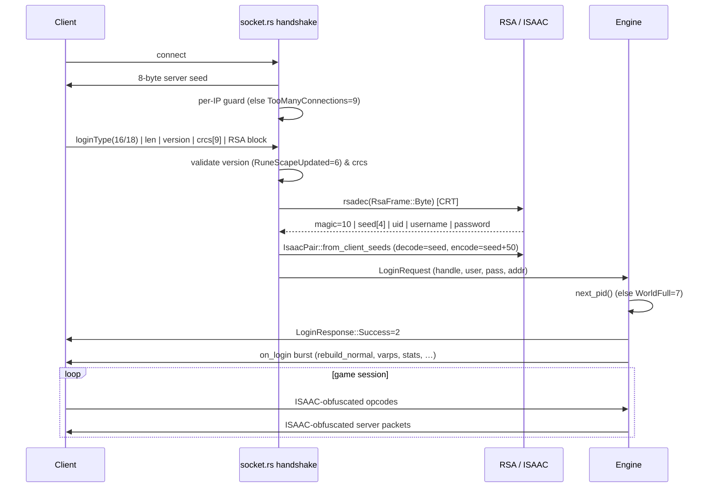
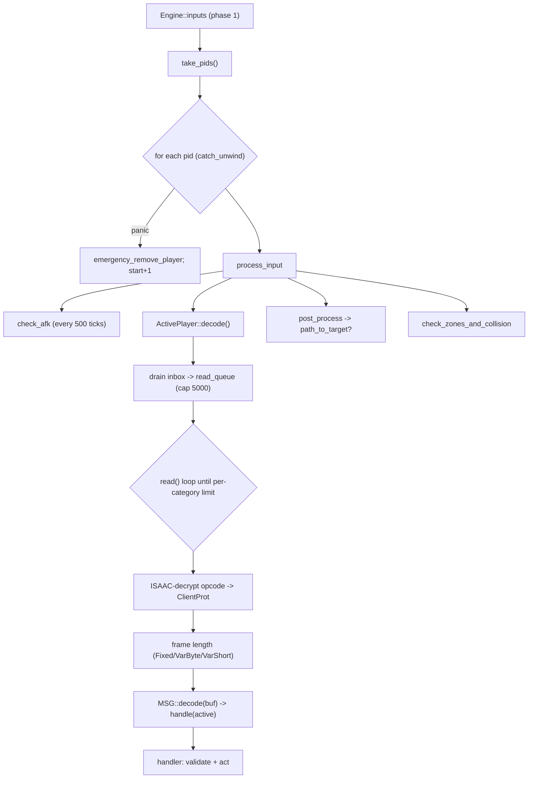
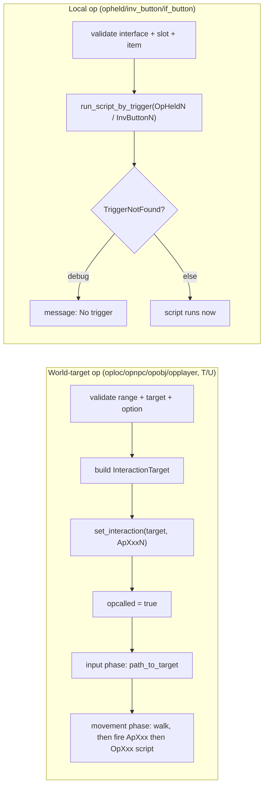

<a id="top"></a>

**[← Whitepaper index](../README.md)**  ·  [Single-file version](whitepaper-full.md)

# Part VI · Networking & the Wire

> *Turning world state into exact bytes, and client bytes into game actions.*


---

<a id="sec-18"></a>

## 18. Player & NPC Info Blocks — The Wire-Encoding Pipeline

The player-info and NPC-info packets are the single most expensive thing the server emits each tick. Every observing
player receives, every 600 ms, a bit-packed list describing the movement and state changes of *every other entity in
their viewport* — up to 250 players and 255 NPCs. With a target population of ~2000 concurrent players, the naive cost
is quadratic: 2000 observers × ~500 entities × per-entity encoding work. The original TS RuneScape servers absorbed this
cost by re-encoding each entity's update block once per observer; rs-engine instead encodes each entity's
*high-definition block exactly once per tick* into a reusable byte buffer, then slices/`memcpy`s that pre-built block
into each observer's packet. This is the architectural centerpiece of `rs-info` and the `info`/`output` engine phases,
and the focus of this section.

This subsystem spans three crates:

| Component                                                             | Location                                        | Role                                                                                 |
|-----------------------------------------------------------------------|-------------------------------------------------|--------------------------------------------------------------------------------------|
| `EntityMasks`, `Visibility`, `FocusKind`                              | `rs-info/src/lib.rs`                            | Per-entity mutable update state (the "what changed" record).                         |
| `PlayerRenderer`, `NpcRenderer`, `Slot`                               | `rs-info/src/renderer.rs`                       | Producer: serializes mask state into reusable per-entity byte buffers once per tick. |
| `PlayerInfoProt`, `NpcInfoProt`                                       | `rs-protocol/src/network/game/info_prot.rs`     | Wire bitmask + storage-index mapping.                                                |
| `PlayerInfo`, `NpcInfo`, `BitWriter`, `PlayerSnapshot`, `NpcSnapshot` | `rs-engine/src/info.rs`                         | Consumer: per-observer bit-packed packet encoder.                                    |
| `infos()` / `outputs()` / `cleanups()`                                | `rs-engine/src/phases/{info,output,cleanup}.rs` | Phase drivers.                                                                       |
| `BuildArea`, `IdBitSet`                                               | `rs-engine/rs-entity/src/build.rs`              | Per-observer viewport + tracked-entity set.                                          |

### 1. The producer/consumer split and where it sits in the tick

The pipeline is a strict producer→consumer pattern straddling two of the engine's thirteen ordered phases (
`engine.rs:582-594`):

```
... zones → info (phase 11) → out (phase 12) → cleanup (phase 13)
```

* **`info` phase** (`phases/info.rs`) is the *producer*. It runs exactly once and, for each active player and NPC,
  serializes that entity's `EntityMasks` into the renderer's per-entity byte buffers and records a compact
  `PlayerSnapshot`/`NpcSnapshot`. This is **O(entities)**, not O(observers × entities).
* **`out` phase** (`phases/output.rs`) is the *consumer*. For each observing player it calls `PlayerInfo::encode` /
  `NpcInfo::encode`, which build that observer's personal bit-packed packet by reading the pre-serialized buffers and
  snapshots. This is the O(observers × viewport) loop, but its per-entity body is reduced to a `memcpy` plus a handful
  of bit writes.
* **`cleanup` phase** (`phases/cleanup.rs`) calls `remove_temporary` to reset per-tick renderer state for reuse next
  tick (no deallocation).



This split is the chief improvement over the reference server: the appearance block, chat block, animation, damage, etc.
for player *N* are encoded **once** regardless of how many of the ~500 observers can see *N*.

### 2. `EntityMasks` — the per-entity update record

`EntityMasks` (`rs-info/src/lib.rs:105-146`) is the mutable scratchpad that game logic writes to during the
world/player/npc phases and the renderer reads during the info phase. It is embedded in both `Player` and `Npc` (
constructed via the `const fn new()` at `lib.rs:164`). The central field is `masks: u16` — a bitmask of which
`*InfoProt` updates are pending — followed by an `Option` per possible payload (`appearance`, `anim_id`, `say`,
`damage_*`, `chat_*`, `spotanim*`, `exactmove_*`, `face_*`, etc.).

The field set is partitioned into two lifetimes, enforced by `reset()` (`lib.rs:286-312`):

* **Temporary** (cleared every tick by `reset`): `masks`, `face_x/z`, `anim_id/delay`, `say`, all `damage_*`, all
  `chat_*`, all `spotanim*`, all `exactmove_*`, `changetype`. These describe a single-tick event.
* **Persistent** (survive `reset`): `appearance`, `last_appearance`, `last_appearance_info`, the seven
  walk/turn/ready/run animation IDs, `face_entity`, `orientation_x/z`, `anim_protect`, and `vis`. These describe durable
  state that a *newly arriving* observer must be told about even though it didn't change this tick.

That persistent/temporary distinction is precisely what makes the **low-definition** path (section 7) work: when a new
observer enters your viewport mid-game, the encoder must replay your persistent face-entity, face-coord, and (
conditionally) appearance state, even though `masks` for the tick was zero.

`Visibility` (`lib.rs:67-76`) has three levels — `Default`, `Soft`, `Hard` — and is persistent. `Hard` unconditionally
hides the entity from all observers; it is consulted both in the snapshot removal predicate and the add path (
`info.rs:480`).

`FocusKind` (`lib.rs:16-60`) exists purely to resolve the one place where the player and NPC protocols *disagree* on a
bit value: `FaceCoord` is `0x20` for players but `0x80` for NPCs (while `FaceEntity` is `0x4` for both). The shared
`focus`/`set_face_entity_check` helpers take a `FocusKind` and call `face_coord_mask()`/`face_entity_mask()` to pick the
right constant, avoiding duplicated logic.

`set_anim` (`lib.rs:240-260`) is illustrative of how mask state is gated: it is a no-op when `anim_protect` is set, and
otherwise applies an animation only if the new sequence's priority strictly exceeds the currently playing one (or none
is playing) — then it ORs the protocol bit into `masks`. Mask bits are only ever set when the corresponding payload
`Option` is populated, which is the invariant the renderer relies on when it calls `.unwrap()`.

### 3. The wire protocol mask enumerations

`PlayerInfoProt` and `NpcInfoProt` (`info_prot.rs`) are `#[repr(u16)]` enums whose discriminants *are* the wire mask
bits. Two distinct numbering schemes coexist:

**Player update mask (`PlayerInfoProt`)**

| Bit     | Variant      | `to_index()` | Storage                             | Payload size (bytes)                  |
|---------|--------------|--------------|-------------------------------------|---------------------------------------|
| `0x001` | `Appearance` | 0            | `appearances: Vec<Option<Vec<u8>>>` | `1 + len` (len-prefixed)              |
| `0x002` | `Anim`       | 1            | inline `Slot`                       | 3 (`p2` id, `p1` delay)               |
| `0x004` | `FaceEntity` | 2            | inline `Slot`                       | 2 (`p2`)                              |
| `0x008` | `Say`        | 3            | `says: Vec<Option<Vec<u8>>>`        | `len + 1` (NUL/`10`-terminated)       |
| `0x010` | `Damage`     | 4            | inline `Slot`                       | 4 (four `p1`)                         |
| `0x020` | `FaceCoord`  | 5            | inline `Slot`                       | 4 (two `p2`)                          |
| `0x040` | `Chat`       | 6            | `chats: Vec<Option<Vec<u8>>>`       | `4 + len`                             |
| `0x080` | `BigInfo`    | 255 (unused) | —                                   | header flag only                      |
| `0x100` | `SpotAnim`   | 7            | inline `Slot`                       | 6 (`p2` id, `p4` packed)              |
| `0x200` | `ExactMove`  | 255 (unused) | —                                   | 9 (written inline, observer-relative) |

**NPC update mask (`NpcInfoProt`)**

| Bit    | Variant      | `to_index()` | Storage                      | Payload size |
|--------|--------------|--------------|------------------------------|--------------|
| `0x02` | `Anim`       | 0            | inline `Slot`                | 3            |
| `0x04` | `FaceEntity` | 1            | inline `Slot`                | 2            |
| `0x08` | `Say`        | 2            | `says: Vec<Option<Vec<u8>>>` | `len + 1`    |
| `0x10` | `Damage`     | 3            | inline `Slot`                | 4            |
| `0x20` | `ChangeType` | 4            | inline `Slot`                | 2            |
| `0x40` | `SpotAnim`   | 5            | inline `Slot`                | 6            |
| `0x80` | `FaceCoord`  | 6            | inline `Slot`                | 4            |

`to_index()` (`info_prot.rs:18-32, 49-60`) maps each bit to a *dense* array index into the renderer's `fixed` storage.
The comment "the ordering here does not matter" is true *for storage* but **not** for emission: `write_blocks` (and the
pre-coalescer) must emit fields in strict bit order (LSB→MSB), because the client decodes them in that fixed sequence.

Two wire-fidelity rules are baked into both encoder and producer:

1. **`BigInfo` extended header.** The mask header is one byte if `masks <= 0xFF`, two bytes otherwise. When two bytes
   are needed, the `BigInfo` (`0x80`) bit is OR-ed in to signal the wide header (`renderer.rs:453-459`,
   `info.rs:865-869`). Player masks can exceed `0xFF` (the `SpotAnim` `0x100` and `ExactMove` `0x200` bits live in the
   high byte); NPC masks max out at `0xFE` and so always use a single-byte header (`renderer.rs:1096`).
2. **Bit-mask layout matches the client's decode order**, which is why `ExactMove` and `SpotAnim` occupy the high bits —
   they were appended late in the protocol's life and the original client reads them after the low-byte fields.

### 4. `Slot` — the inline fixed-size field buffer

Fixed-size fields are pre-serialized into a `Slot` (`renderer.rs:21-26`): an 8-byte `[u8; 8]` plus a `len: u8`,
`#[repr(C)]` and `Copy`. The point is **allocation avoidance and big-endian-once**: every fixed field (anim, damage,
face-entity, face-coord, spotanim, npc changetype) is encoded into its final wire bytes the moment it is computed, and
stored on the stack-resident slot array — never re-encoded per observer.

The `set_*` methods are `const fn` and write directly with `core::ptr::write_unaligned` after pre-byteswapping to
big-endian:

```rust
const fn set_p2_p1(&mut self, a: u16, b: u8) { // anim: id (BE) + delay
    let ptr = self.data.as_mut_ptr();
    core::ptr::write_unaligned(ptr as *mut u16, a.to_be());
    core::ptr::write(ptr.add(2), b);
    self.len = 3;
}
```

`set_p2_p4` packs the spot-anim's height (`<< 16`) and delay into a single `i32` before byteswapping; `set_p1_p1_p1_p1`
writes the four damage bytes as one `u32` store. The widest slot is 6 bytes (`SpotAnim`), comfortably inside the 8-byte
buffer, and the doc comments note the `#[repr(C)]` guarantee that `data` is at offset 0 so the pointer casts are sound.
`write_to` (`renderer.rs:79-81`) and `bytes()` (`renderer.rs:57-59`) emit exactly `data[0..len]`. `ExactMove` is the
deliberate exception — its 9-byte payload exceeds the slot, *and* it is observer-relative (deltas from the observer's
build-area origin), so it is never slotted; it is written field-by-field at encode time (`renderer.rs:614-632`,
`info.rs:726-739`).

### 5. The renderer storage layout

`PlayerRenderer` (`renderer.rs:217-225`):

```rust
fixed: Box<[[Slot; MAX_PLAYERS]; PLAYER_PROT_COUNT]>, // [8][2048] inline slots
appearances: Vec<Option<Vec<u8>>>,   // 2048 variable buffers, reused
says:        Vec<Option<Vec<u8>>>,
chats:       Vec<Option<Vec<u8>>>,
high_blocks: Vec<Vec<u8>>,           // 2048 pre-coalesced HD blocks
highs:       Box<[u16; MAX_PLAYERS]>,// per-pid HD byte size
lows:        Box<[u16; MAX_PLAYERS]>,// per-pid LD byte size
```

`NpcRenderer` (`renderer.rs:919-925`) is the same shape with `MAX_NPCS = 8192`, `NPC_PROT_COUNT = 7`, only a `says`
variable buffer (NPCs have no appearance or chat), and no `lows` distinction for appearance.

Key design decisions:

* **Indexed by entity id, not by observer.** Each of the 2048/8192 slots is the canonical storage for that entity this
  tick. This is the data structure that lets the consumer be observer-agnostic.
* **`fixed` is `Box`ed.** `[[Slot; 2048]; 8]` is ~144 KB; boxing keeps it off the stack and gives it a stable heap
  address for the `get_unchecked` pointer paths.
* **Variable buffers are `clear()`ed, not dropped.** When `compute_info` re-fills an appearance/say/chat buffer it
  reuses the existing `Vec`'s allocation if present (`renderer.rs:315-327`, `350-363`, `390-408`), so steady-state has
  zero heap churn for these fields.
* **All hot accesses are `get_unchecked`.** The engine guarantees `pid < MAX_PLAYERS` / `nid < MAX_NPCS` because indices
  come only from `active_players`/`active_npcs`, so bounds checks are elided throughout.

### 6. `compute_info` — the once-per-tick producer

`compute_info` (`renderer.rs:295-516` for players) is called from `phases/info.rs:74` for each active player. It returns
immediately if `masks == 0` (the overwhelmingly common case — most entities don't change most ticks), so the
slot/buffer/`high_block` arrays simply retain their cleared state. Otherwise `compute_info_inner` walks the bits in
protocol order and, for each set bit, serializes the payload into its slot/buffer and accumulates two running totals:

* `highs` — the high-definition byte size (every field that goes to existing observers).
* `lows` — the low-definition byte size (only the subset replayed to *new* observers: appearance + face-entity +
  face-coord).

After the per-field loop it writes `self.highs[pid] = highs + header(masks)` and (if any LD bytes)
`self.lows[pid] = header(LD-masks) + appearance_len + 2 + 4` (`renderer.rs:426-442`). These two `u16` size counters are
what the consumer's `fits()` capacity check reads (section 8) — the consumer never re-measures.

#### 6.1 The pre-coalesced high block — the central optimization

The second half of `compute_info_inner` (`renderer.rs:451-515`) builds `high_blocks[pid]`: the **exact byte sequence**
the consumer would otherwise assemble field-by-field per observer, built once. It:

1. Clears the reused `Vec`.
2. Writes the mask header (1 or 2 bytes, applying the `BigInfo` rule).
3. Appends, in bit order, every field's pre-serialized bytes (`appearances[pid]`, `Slot::bytes()` for
   anim/face-entity/damage/face-coord/spotanim, `says[pid]`, `chats[pid]`).

Crucially, for players this block **omits `ExactMove`** — that field is observer-relative and must be appended per
observer — but the *header* is still computed from the **full** `masks` (including the `ExactMove` and `BigInfo` bits,
`renderer.rs:454`). This is the subtle correctness guarantee documented at `renderer.rs:446-450`: because the header is
computed from the full mask, the pre-built prefix is byte-identical whether or not the encoder later appends the
`ExactMove` tail. For NPCs there are **no observer-relative fields**, so `high_blocks[nid]` is the *complete* block and
the consumer emits it with a single `pdata` and never touches the live `ActiveNpc` on the keep/move path (
`renderer.rs:1092-1153`).



### 7. Snapshots — decoupling the consumer from the live entity

Before encoding, the info phase records a `PlayerSnapshot` (`info.rs:123-131`) / `NpcSnapshot` (`info.rs:176-184`) for
every live entity. These are 12-byte `#[repr(C)]` structs:

```rust
pub struct PlayerSnapshot { coord: u32, len: u16, run_dir: i8, walk_dir: i8, flags: u8 }
```

`coord` is the packed grid coordinate, `len` is `highdefinitions(pid)` (whether an HD block exists and its size),
`run_dir`/`walk_dir` are the movement directions (`-1` = none), and `flags` is a bitfield: `PRESENT`, `ACTIVE`, `TELE`,
`VIS_HARD` (players only), `HAS_EXACTMOVE` (players only).

The rationale (`info.rs:108-122`) is cache locality. The full `ActivePlayer` is ~2.4 KB (3–4 cold cache lines);
`ActiveNpc` ~1.5 KB. The consumer's tracked-entity loop visits up to ~250 entries per observer, so chasing a random
`ActivePlayer` per entry would thrash the cache. The snapshot array is `Box<[PlayerSnapshot; 2048]>` (`engine.rs:390`) —
a dense, ~24 KB, sequentially-scanned table that stays L1/L2-resident. The full struct is dereferenced only for the
minority of entries needing the live data: self-observation (chat masking) or appending the `ExactMove` tail (
`info.rs:752-774`).

The phase fills both arrays with the `ABSENT` sentinel at the start of `infos()` (`phases/info.rs:27-28`), then
overwrites live entries in `compute_player_info`/`compute_npc_info`. The snapshot is byte-faithful because movement and
visibility are finalized *before* the info phase and never mutated through the output phase (`phases/info.rs:77-79`).
`should_remove` (`info.rs:161-168`) reproduces — bit-for-bit — the original removal predicate the reference server
evaluated against the live struct: not present, teleported, level changed, out of view distance, inactive, or
hard-hidden. Emergency removal mid-tick clears the snapshot (`engine.rs:1750`) so later observers in the same tick
correctly encode a *remove*.

### 8. The consumer — bit-packed per-observer encoding

`PlayerInfo::encode` (`info.rs:281-320`), called per observer from `process_output` (`phases/output.rs:75`), produces
one observer's packet. The packet has two regions concatenated at the end: `buf` (the bit-packed movement list) and
`updates` (the byte-packed update blocks). The structure mirrors the classic player-info packet exactly:

1. **`write_local_player`** — the observing player's own movement (teleport/run/walk/extend/idle) plus their own HD
   block (with `Chat` masked off, section 9).
2. **`write_players`** — for each currently tracked player (read from the build area's `IdBitSet`), encode movement from
   the snapshot and, if moving-with-update, append the HD block. Players failing `should_remove` get a 3-bit remove
   entry.
3. **`write_new_players`** — for nearby players not yet tracked, encode a 23-bit add entry plus the LD block, up to the
   `PREFERRED_PLAYERS = 250` cap or the buffer limit.
4. If any update blocks were written, emit the sentinel index (`pbit::<11>(2047)` for players, `pbit::<13>(8191)` for
   NPCs), flush the bit buffer, then `pdata` the entire `updates` buffer after it (`info.rs:312-318`).

The movement entry bit layouts (player domain — note the leading `1` "has-update-this-block" continuation bit and the
2-bit type selector):

```
idle      (1 bit) : 0
extend    (3 bits): 1 | 00                        (update block follows, no move)
walk      (7 bits): 1 | 01 | wdir(3)        | ext(1)
run      (10 bits): 1 | 10 | wdir(3) | rdir(3) | ext(1)
teleport (21 bits): 1 | 11 | ylvl(2) | x(7) | z(7) | jump(1) | ext(1)
remove    (3 bits): 1 | 11                         (special: marks removal)
add      (23 bits): pid(11) | dx(5) | dz(5) | jump(1) | 1
```

For NPCs the add entry is 35 bits split across two `pbit` calls (`info.rs:1203-1206`): `nid(13) | type(11)` then
`dx(5) | dz(5) | 1`. These bit widths are encoded as the `BITS_*` associated constants (`info.rs:233-237, 940-943`) and
asserted against the running bit position in `fits()`.

#### 8.1 `BitWriter` — the MSB-first bit accumulator

`BitWriter` (`info.rs:39-106`) replaces the original per-call `Packet::pbit`. `pbit::<N>` is generic over a
*compile-time-constant* bit count (always one of 1, 3, 7, 8, 10, 11, 13, 21, 23, 24 at the call sites), so the mask
folds and the flush loop unrolls:

```rust
const fn pbit<const N: usize>(&mut self, buf: &mut Packet, val: i32) {
    self.acc = (self.acc << N) | (val as u32 as u64 & ((1 << N) - 1));
    self.bits += N as u32;
    while self.bits >= 8 {
        self.bits -= 8;
        *buf.data.as_mut_ptr().add(self.byte) = (self.acc >> self.bits) as u8;
        self.byte += 1;
    }
}
```

It shifts each field MSB-first into a `u64` register and flushes only whole bytes, so a typical movement entry is a
couple of ALU ops plus an occasional store — versus `Packet::pbit`'s per-call cursor recompute and byte-by-byte
read-modify-write. At 2000 players this saves on the order of ~1M write paths per tick. The produced bytes are *
*bit-for-bit identical to a `pbit` sequence**, with one documented difference (`info.rs:25-31`): the unused low bits of
the final partial byte are zero-padded by `finish()` (`info.rs:96-105`) rather than carrying stale buffer contents — and
those padding bits are not part of the wire protocol. `bitpos()` reproduces the old `pos2`; `fits()` (`info.rs:921-924`)
uses it to ensure `(bits→bytes) + updates.pos + new <= BYTES_LIMIT - 3` (`BYTES_LIMIT = 5000`).

### 9. High-definition emission: the fast path and the two exceptions

`highdefinition_tracked` (`info.rs:752-774`) is the hot path and shows the payoff:

```rust
if pid == active.player.uid.pid() || flags & PlayerSnapshot::HAS_EXACTMOVE != 0 {
    let other = /* deref live ActivePlayer */;
    self.highdefinition(renderer, active, other); // slow, field-by-field or tail-append
} else {
    let blk = renderer.high_block(pid);
    self.updates.pdata(blk, 0, blk.len());        // ONE memcpy
}
```

The common case — a tracked player who is not the observer and has no `ExactMove` — is a single `pdata` of the
pre-coalesced block. The two exceptions:

1. **Self-observation** (`info.rs:710-718`): a player must not see their own overhead chat (the client renders self-chat
   from the input echo). Because `Chat` sits *in the middle* of the block, the pre-coalesced prefix cannot be reused, so
   `write_blocks` re-emits field-by-field with the `Chat` bit cleared. This happens at most once per packet (the local
   player), so its cost is irrelevant.
2. **`ExactMove` tail** (`info.rs:724-739`): the block prefix is `pdata`'d, then the 9-byte `ExactMove` is written with
   `write_exactmove`, its coordinates rebased to the observer's build-area zone origin via `CoordGrid::zone_origin`.

`write_blocks` (`info.rs:857-908`) is the canonical field-by-field encoder used for self-observation and all
low-definition blocks. It writes the header (with `BigInfo` for wide masks via `ip2`), then each field in bit order
through `renderer.write` (which dispatches variable buffers vs. slots, `renderer.rs:555-582`), ending with the inline
`ExactMove`. The pre-coalescer in `compute_info` is, by construction, a copy of this exact sequence sans `ExactMove` —
that is what makes the `memcpy` byte-identical.

### 10. Low-definition: replaying persistent state to new observers

When `add` encodes a newly visible entity, `lowdefinition` (`info.rs:786-839` players, `info.rs:1259-1289` NPCs)
computes a *fresh* mask describing the durable state the new observer hasn't seen:

* **Appearance** is included only if the observer's per-pid appearance clock (`build_area.appearances[pid]`,
  `build.rs:140`) does not already match the entity's `last_appearance` version. If sent, `save_appearance` records the
  new clock so it isn't re-sent. This is the appearance-caching mechanism: each observer tracks, per other-player, which
  appearance *version* it last received, and a 64-bit clock comparison (`has_appearance`, `build.rs:337-339`) decides
  re-transmission. Appearance bytes themselves are generated once per tick in `generateappearance` (
  `active_player.rs:1469-1544`) into a thread-local scratch `Packet`, boxed into `last_appearance_info`, and copied into
  the renderer's reused `appearances[pid]` buffer with a length prefix.
* **FaceEntity** is replayed from the persistent `face_entity` if the renderer doesn't already hold a fixed slot for it
  this tick; `cache_face_entity` writes it into the slot so the LD block can read it.
* **FaceCoord** is *always* included for an add — falling back through `face_x/z` → `orientation_x/z` → the entity's
  current fine coordinate (`info.rs:817-836`). A freshly-seen entity must have a defined facing.

This is exactly why those fields are persistent in `EntityMasks`: the per-tick `masks` may be zero, but a new observer
still needs them. `lowdefinitions(pid)` (the `lows` counter from `compute_info`) gives the consumer the LD size up front
for the `fits()` check.

### 11. The per-observer viewport — `BuildArea` and `IdBitSet`

Each observer owns a `BuildArea` (`build.rs:133-146`) holding two `IdBitSet`s — `players` and `npcs` — that are the
*tracked* sets (entities the client already knows about). `IdBitSet` (`build.rs:13-126`) pairs a `Vec<u32>` bit vector (
O(1) `contains`/`insert`/`remove_bit` via word-indexed bit ops) with an ordered `Vec<u16>` id list for iteration. The
hot encode loop uses three of its operations cleverly:

* **`swap_ids`** (`build.rs:104-106`) pointer-swaps the id list into the encoder's reusable `tracked: Vec<u16>` (no
  copy) so iteration happens on the encoder while the bit vector stays in the build area for `contains`/`remove_bit`.
* **`remove_bit`** (O(1)) clears a tracked entity's bit during the loop without the O(n) list splice.
* **`retain_bits`** (`build.rs:93-97`) reconciles the id list against the bit vector *once* after the loop, turning N
  individual removals into a single retain pass.

`view_distance` is dynamic (`build.rs:142`): `resize()` shrinks it when `>= PREFERRED_PLAYERS (250)` are tracked and
grows it back toward `PREFERRED_VIEW_DISTANCE (15)` every `INTERVAL (10)` ticks — a load-shedding valve that caps
per-observer cost under crowding. `encode` forces a full `rebuild_players`/`rebuild_npcs` when the observer moved more
than `view_distance` (players) / `PREFERRED_VIEW_DISTANCE` (NPCs) in either axis, or on an explicit `rebuild` (level
change), otherwise it just `resize()`s (`info.rs:300-304, 999-1004`).

### 12. Cleanup — reset without deallocation

After all observers are encoded, `cleanups()` → `reset_renderers()` (`phases/cleanup.rs:79-86`) calls `remove_temporary`
on both renderers over the active id lists. `PlayerRenderer::remove_temporary` (`renderer.rs:810-844`) zeroes
`highs[pid]`, resets the five temporary fixed slots (anim, face-entity, damage, face-coord, spotanim) to `Slot::EMPTY`,
`clear()`s the say/chat `Vec`s in place, and `clear()`s `high_blocks[pid]` — **preserving** `appearances` and `lows` (
which persist across ticks for the appearance-cache and LD replay). Separately, `EntityMasks::reset` (called in the
entity reset paths) clears the temporary mask fields on the entity itself. Permanent teardown (`remove_permanent`,
`renderer.rs:866-873`) on logout/despawn additionally drops the appearance `Vec` and zeroes `lows`. No per-tick
deallocation occurs anywhere on the steady-state path — every buffer is reused.

### 13. Allocation & performance summary

| Lever                   | Mechanism                                                                | Effect                                                       |
|-------------------------|--------------------------------------------------------------------------|--------------------------------------------------------------|
| Encode-once HD block    | `high_blocks[pid]` pre-coalesced in `compute_info`; consumer `pdata`s it | O(entities) serialization instead of O(observers × entities) |
| Inline fixed fields     | 8-byte `Slot` with const big-endian `set_*`                              | zero heap alloc for anim/damage/face/spotanim                |
| Reused variable buffers | `Vec::clear()` + reuse for appearance/say/chat                           | zero steady-state heap churn                                 |
| Compact snapshots       | 12-byte `PlayerSnapshot`/`NpcSnapshot`, dense `Box<[_; N]>`              | tracked loop stays L1/L2-resident, avoids ~2.4 KB derefs     |
| Register bit writer     | `BitWriter::pbit::<N>` MSB-first, byte-flush                             | replaces ~1M/tick read-modify-write `pbit` calls             |
| O(1) viewport set       | `IdBitSet` + `swap_ids`/`remove_bit`/`retain_bits`                       | constant-time membership, single retain pass per observer    |
| Precomputed sizes       | `highs`/`lows` counters                                                  | consumer never re-measures for `fits()`                      |
| Thread-local scratch    | appearance built in a reused `Packet`                                    | only the final boxed slice allocates                         |

The net result is a player-info/NPC-info pipeline whose per-tick cost is dominated by *one* serialization pass over
changed entities plus, per observer, a sequence of `memcpy`s and bit writes — byte-identical to what the reference
RuneScape client expects, but without the reference server's per-observer re-encoding.

---

*Cross-references:* the **engine tick / phase ordering** section (the 13-phase `cycle`); the **BuildArea / viewport**
section (zone-driven `get_nearby_players`/`rebuild_players`); the **packet/IO** section (`Packet`, `pdata`, `pbit`); the
**entity model** section (`Player`/`Npc` embedding `EntityMasks`, pathing fields); and the **zones** section (`ZoneMap`
spatial lookups feeding the add path).

<sub>[↑ Back to top](#top)</sub>


---

<a id="sec-19"></a>

## 19. The Network Protocol & Packet Model

The `rs-protocol` crate is the single source of truth for the RuneScape 2 (revision ~225) wire format. It defines every
opcode the client and server exchange, the framing rules that delimit packets on the byte stream, and the per-packet
`encode`/`decode` logic that translates Rust structs to and from the exact byte sequences the Java/NXT client expects.
The crate carries **no game logic and no I/O** — it is a pure codec layer. Buffers, channels, ISAAC opcode obfuscation,
and dispatch live in `rs-engine` (`active_player.rs`) and `rs-server` (`socket.rs`); the actual byte primitives (`p1`,
`p2`, `gjstr`, `psize2`, RSA, bit packing) live in the external `rs-io` crate (`Packet`, `PacketFrame`). This separation
mirrors the reference server's `src/network/game` package while letting the encode/decode hot path be a thin,
allocation-light shell over `rs-io`'s `unsafe`, `const fn` byte writers.

This section documents the structure of `ClientProt` (client→server) and `ServerProt` (server→client), the three frame
sizes, the proc-macro that attaches frame/category/priority metadata to each packet struct, the login handshake, the
integration of `info_prot` (the bit-packed player/NPC update payloads), the ISAAC opcode cipher, and representative byte
layouts. Source paths are relative to the repo root unless noted; `rs-io` paths refer to the pinned external crate
`rs-io 0.2.2`.

### 1. The byte substrate: `rs-io::Packet`

Every (de)serializer is written against one type, `rs_io::Packet` (`rs-io-0.2.2/src/packet.rs:22`):

```rust
#[repr(C)]
pub struct Packet {
    pub data: Vec<u8>,  // backing buffer
    pub pos: usize,     // byte cursor (read & write share it)
    pub pos2: usize,    // bit cursor, in bits, for gbit/pbit
}
```

`Packet` is a cursor over a flat `Vec<u8>`. There is no separate read/write head: `pos` advances on both `pX` (put) and
`gX` (get). The writers are deliberately `unsafe` and `#[inline(always)]` — they write through
`as_mut_ptr().add(self.pos)` with `core::ptr::write_unaligned`, so **bounds checks are skipped**. The caller is
responsible for sizing the buffer first; this is why `rs-engine` pre-computes `sizeof()` before allocating (Section 6).
The full primitive set:

| Method                           | Bytes      | Endianness / transform                    | Java/wire purpose             |
|----------------------------------|------------|-------------------------------------------|-------------------------------|
| `p1`/`g1`/`g1s`                  | 1          | identity (`g1s` sign-extends)             | byte                          |
| `p2`/`g2`/`g2s`                  | 2          | big-endian (`.to_be()`)                   | short                         |
| `ip2`/`ig2`                      | 2          | little-endian (`.to_le()`)                | "inverse" short               |
| `p3`/`g3`                        | 3          | big-endian 24-bit                         | medium int                    |
| `p4`/`g4s`                       | 4          | big-endian                                | int (always signed in Java)   |
| `ip4`/`ig4s`                     | 4          | little-endian                             | inverse int                   |
| `p8`/`g8s`                       | 8          | big-endian                                | long                          |
| `p1_alt1/2/3`, `g1_alt*`         | 1          | `-v`, `128-v`, `v+128`                    | obfuscated byte transforms    |
| `p2_alt1`, `ip2_alt1`, `g2_alt1` | 2          | mixed-endian + `+128` on low byte         | obfuscated short              |
| `p4_alt1/2/3`, `g4_alt1/2`       | 4          | byte-rotated orderings                    | obfuscated int                |
| `pjstr`/`gjstr`                  | var        | CP-1252, terminator byte                  | Java string (`\n`=10 or `\0`) |
| `psmart1or2(s)`                  | 1–2        | `<128`→1B, else 2B (`+32768`/`+49152`)    | "smart" varint                |
| `psmart2or4`                     | 2–4        | `<32767`→2B, else 4B with `0x80` flag     | extended smart                |
| `pdata`/`gdata`                  | var        | `memcpy`                                  | raw blob                      |
| `bits/bytes`, `pbit/gbit`        | bit        | MSB-first bit packing via `pos2`          | player/npc info movement bits |
| `psize1/psize2/psize4`           | back-patch | writes a length at `pos - size - {1,2,4}` | var-frame length prefix       |
| `rsaenc/rsadec`                  | var        | RSA via `num_bigint` (CRT on decode)      | login block                   |

Two design choices matter for fidelity. First, the **alt transforms** (`+128`, negate, mixed-endian) faithfully
reproduce the obfuscated byte orderings the original client uses on selected fields — they are not gratuitous, they are
byte-identity requirements. Second, `pjstr` transcodes UTF-8 to **CP-1252** (`encode_utf8_to_cp1252`) when a string is
non-ASCII; the RS client speaks Windows-1252, not UTF-8, so any non-ASCII byte must be re-encoded or chat/names corrupt.
The `gjstr` reader scans for the terminator and decodes CP-1252 back to a Rust `String`.

`psize2` is the keystone of variable framing: after a payload is written, `psize2(len)` seeks back `len + 2` bytes and
writes the 16-bit length into the two reserved header bytes. The engine reserves those bytes by advancing `pos` past
them before encoding (Section 6).

### 2. Framing: `PacketFrame`

Three frame kinds (`rs-io-0.2.2/src/packet.rs:7`, mirrored as `#[repr(u8)]`):

| `PacketFrame` | Value | Header after opcode                      | Max payload | Used for                                              |
|---------------|-------|------------------------------------------|-------------|-------------------------------------------------------|
| `Fixed`       | 0     | none (length implicit, known per-opcode) | n/a         | small constant-size packets                           |
| `VarByte`     | 1     | 1 length byte                            | 255         | small variable packets (chat, game messages)          |
| `VarShort`    | 2     | 2 length bytes (big-endian)              | 65535       | large/unbounded packets (map data, info, inventories) |

A server packet on the wire is therefore:

```
+--------+-----------------+------------------------------+
| opcode | [length header] |         payload …            |
| 1 byte | 0 / 1 / 2 bytes  | sizeof() bytes                |
+--------+-----------------+------------------------------+
   ^ ISAAC-encrypted
```

Only the **opcode byte** is ISAAC-mutated; the length header and payload are plaintext. The numeric value of the
`PacketFrame` enum doubles as the **header byte count** — `M::FRAME as usize` yields 0/1/2, which the engine uses both
to reserve header space and to choose the back-patch writer. This is a small but elegant trick that removes a `match`
from the allocation path.

### 3. The opcode tables

#### 3.1 `ClientProt` (client → server)

`client_prot.rs:115` declares all 75 inbound opcodes through a local `client_prot!` macro that simultaneously builds the
`#[repr(u8)] enum ClientProt`, a `TryFrom<u8>` (returning `Err(())` for unknown bytes), and an `info()` method that
pulls the per-variant `FRAME` and `CATEGORY` constants from the packet struct. Opcode numbers are the **real
revision-225 client values** (the comments note `// NXT naming` where the rust name was chosen to match the NXT client,
or `// name based on runescript trigger` where it follows the server-script convention). A selection (full set in
`client_prot.rs`):

| Opcode | `ClientProt`        | Frame     | Category        |
|--------|---------------------|-----------|-----------------|
| 245    | `OpLoc1`            | Fixed(6)  | UserEvent       |
| 172    | `OpLoc2`            | Fixed(6)  | UserEvent       |
| 75     | `OpLocU`            | Fixed(8)  | UserEvent       |
| 9      | `OpLocT`            | Fixed(8)  | UserEvent       |
| 194    | `OpNpc1`            | Fixed(2)  | UserEvent       |
| 248    | `OpPlayerU`         | Fixed(8)  | UserEvent       |
| 195    | `OpHeld1`           | Fixed(6)  | UserEvent       |
| 130    | `OpHeldU`           | Fixed(12) | UserEvent       |
| 155    | `IfButton`          | Fixed(2)  | UserEvent       |
| 31     | `InvButton1`        | Fixed(6)  | UserEvent       |
| 181    | `MoveGameClick`     | VarByte   | UserEvent       |
| 165    | `MoveMinimapClick`  | VarByte   | UserEvent       |
| 158    | `MessagePublic`     | VarByte   | UserEvent       |
| 148    | `MessagePrivate`    | VarByte   | UserEvent       |
| 231    | `CloseModal`        | Fixed(0)  | UserEvent       |
| 150    | `RebuildGetMaps`    | VarShort  | ClientEvent     |
| 108    | `NoTimeout`         | Fixed(0)  | ClientEvent     |
| 81     | `EventTracking`     | VarShort  | ClientEvent     |
| 2      | `AnticheatOpLogic8` | Fixed(2)  | ClientEvent     |
| 244    | `ChatSetMode`       | Fixed(3)  | RestrictedEvent |

The opcode space is intentionally sparse and scrambled (2, 4, 6, 7, 8, 9, 11, … 248). It is **not** a dense index — that
is the protocol's own anti-tamper measure, and the `TryFrom` rejects everything not explicitly listed.

#### 3.2 `ClientProtCategory` and rate limiting

`client_prot_category.rs` assigns each inbound packet one of three categories, whose `#[repr(u8)]` values double as *
*per-tick processing budgets**:

| Category          | Value (budget) | Meaning                                                      |
|-------------------|----------------|--------------------------------------------------------------|
| `ClientEvent`     | 20             | benign client housekeeping (anticheat, tracking, no-timeout) |
| `UserEvent`       | 5              | meaningful player actions (clicks, ops, chat)                |
| `RestrictedEvent` | 2              | sensitive/expensive (chat mode toggles)                      |

The decode loop (Section 5) processes packets until any one category's counter reaches its budget. This caps how many
actions a single client can force the single-threaded engine to run per tick — a denial-of-service mitigation that
mirrors the reference server's `opLowPriorityCount`/`opHighPriorityCount` scheme. A subtle correctness point: only *
*successfully handled** `UserEvent` packets increment the counter (`active_player.rs:1868`), so a handler that errors
does not consume the user's action budget, whereas `ClientEvent`/`RestrictedEvent` always count.

#### 3.3 `ServerProt` (server → client)

`server_prot.rs:11` declares ~68 outbound opcodes via a thinner `server_prot!` macro (it only builds the enum;
frame/priority metadata is attached per-struct by the proc-macro). Representative opcodes:

| Opcode | `ServerProt`                | Frame    | Priority     |
|--------|-----------------------------|----------|--------------|
| 237    | `RebuildNormal`             | VarShort | Immediate    |
| 184    | `PlayerInfo`                | VarShort | Immediate    |
| 1      | `NpcInfo`                   | VarShort | Immediate    |
| 98     | `UpdateInvFull`             | VarShort | Immediate    |
| 213    | `UpdateInvPartial`          | VarShort | Immediate    |
| 162    | `UpdateZonePartialEnclosed` | VarShort | Immediate    |
| 135    | `UpdateZoneFullFollows`     | Fixed    | Immediate    |
| 7      | `UpdateZonePartialFollows`  | Fixed    | Immediate    |
| 223    | `ObjAdd`                    | Fixed    | Immediate    |
| 59     | `LocAddChange`              | Fixed    | Immediate    |
| 23     | `LocMerge`                  | Fixed    | Immediate    |
| 69     | `MapProjAnim`               | Fixed    | Immediate    |
| 4      | `MessageGame`               | VarByte  | Immediate    |
| 150    | `VarpSmall`                 | Fixed    | Immediate    |
| 175    | `VarpLarge`                 | Fixed    | Immediate    |
| 44     | `UpdateStat`                | Fixed    | **Buffered** |
| 201    | `IfSetText`                 | VarShort | **Buffered** |
| 212    | `MidiJingle`                | VarShort | **Buffered** |
| 132    | `DataLand`                  | VarShort | Immediate    |
| 142    | `Logout`                    | Fixed    | Immediate    |

#### 3.4 `ServerProtPriority`

`server_prot_priority.rs` defines two priorities, and the choice changes the **send path**, not the byte format:

- **`Immediate`** packets are encoded into the client's shared `write_queue` and pushed to the network outbox the moment
  `write()` is called (`active_player.rs:272`).
- **`Buffered`** packets are appended to a per-player `Vec<Packet>` (`active_player.rs:221`) and flushed together at
  end-of-tick by `encode()` → `write_buffered()` (`active_player.rs:252`).

The rationale is ordering and batching: stat/interface-text/jingle updates can safely accumulate and ship once per tick,
whereas zone events and info updates must interleave in a precise order relative to each other (the client applies them
positionally), so they go out immediately as the engine produces them.

### 4. The metadata proc-macros

`rs-protocol/macros/src/lib.rs` provides two attribute macros that wire each packet struct to its metadata at **compile
time** — no runtime registry, no `HashMap<u8, fn>`, no vtable.

`#[client_prot(<frame>, <category>)]` (`macros/src/lib.rs:7`) parses its first argument as either a bare identifier (
`VarByte`, `VarShort`) → `(PacketFrame::VarByte, None)`, or a call `Fixed(6)` → `(PacketFrame::Fixed, Some(6))`, and its
second as a `ClientProtCategory`. It emits:

```rust
impl ClientProtMessageInfo for OpLoc1 {
    const FRAME: (PacketFrame, Option<u8>) = (PacketFrame::Fixed, Some(6));
    const CATEGORY: ClientProtCategory = ClientProtCategory::UserEvent;
}
```

`#[server_prot(<Prot>, <Priority>, <Frame>)]` (`macros/src/lib.rs:57`) emits, generics-aware (so borrowing packets like
`UpdateInvFull<'a>` work):

```rust
impl ServerProtMessageInfo for RebuildNormal {
    const PROT: ServerProt = ServerProt::RebuildNormal;
    const PRIORITY: ServerProtPriority = ServerProtPriority::Immediate;
    const FRAME: PacketFrame = PacketFrame::VarShort;
}
```

The hand-authored `encode`/`decode` bodies live in the same file as `impl ServerProtMessage`/`impl ClientProtMessage` (
the `*Info` traits carry only the consts; the message traits carry the logic). So each packet file is: a struct, a
one-line attribute (metadata), and a small `encode`+`sizeof` or `decode`. This is the central design decision of the
crate — **packet identity is type-level, dispatch is a monomorphized `match`** — which is why there is no dynamic
dispatch anywhere in the codec and why the compiler can inline an entire encode through `sizeof()` into the engine's
send routine.



### 5. Inbound lifecycle: bytes → opcode → handler

Inbound data crosses three stages: the async network task, the engine's read queue, and the per-opcode dispatch.

**Network task** (`rs-server/src/socket.rs:117` `network_loop`): a Tokio task reads raw `Vec<u8>` chunks off the socket
and `try_send`s them into a bounded channel (`INBOX_CAPACITY = 128`, `client_game.rs:9`). A full inbox means the engine
has fallen behind, so the client is disconnected — back-pressure, not unbounded buffering.

**Reassembly** (`active_player.rs:1681` `EnginePlayer::decode`): once per tick the engine drains the inbox into a
`VecDeque<u8> read_queue`. TCP gives a byte stream, not message boundaries, so a single socket read can contain a
partial packet or several packets. The engine appends whole chunks until the next would overflow the 5000-byte working
limit, holding the overflow in `pending_msg` for next tick.

**Opcode decode** (`active_player.rs:1738` `read`):

1. Pop one byte and **ISAAC-decrypt** it: `opcode = byte.wrapping_sub(handle.isaac_decode.next_int() as u8)` (
   `active_player.rs:1745`). Each opcode consumes exactly one ISAAC keystream word; client and server keystreams must
   stay in lock-step or every subsequent opcode mis-decodes.
2. `ClientProt::try_from(opcode)` → unknown opcodes are logged and the packet is skipped.
3. `prot.info()` yields the frame; the length is read accordingly: nothing for `Fixed` (use the const size), one byte
   for `VarByte`, two big-endian bytes for `VarShort` (`active_player.rs:1754`).
4. If fewer than `len` bytes are buffered, return `None` — the packet straddles a tick boundary and is retried next
   tick (the opcode/length were already consumed, so the engine keeps them implicitly by virtue of having advanced the
   queue only after the length check... note the queue is only drained at `drain(..len)` after the availability check at
   `:1764`).
5. `drain(..len)` copies the payload into a fresh `Packet`, and a **giant `match prot`** (`active_player.rs:1776`–
   `1853`, ~75 arms) calls `T::decode(&mut buf, len).handle(self)`. `decode` reconstructs the typed struct; `handle` (
   the `ClientGameHandler` trait in `rs-engine`) applies it to game state.
6. Handler `Err` is logged (and, in debug builds, surfaced to the player's chatbox); the category counter is bumped per
   the rules in 3.2.



#### Representative inbound packets

`OpLoc1` (opcode 245, `oploc1.rs`) — "click action 1 on a scenery object":

```
Fixed(6):  x:u16(g2)  z:u16(g2)  loc:u16(g2)
```

`OpHeldU` (opcode 130, `opheldu.rs`) — "use one held item on another", a 12-byte fixed packet of six `g2` reads (
`obj, slot, com, obj2, slot2, com2`). `MoveGameClick` (opcode 181, `move_gameclick.rs`) is the most interesting decoder:
it is `VarByte`, reads a `ctrl` flag and an absolute `(x,z)`, then derives `(len - pos)/2` waypoints, each a **signed
1-byte delta** from the base coordinate, packing them with `pack_coord` (`client/mod.rs:82`, a 14-bit-x|14-bit-z `u32`).
It caps the path at 24 waypoints (`.min(24)`) to bound work regardless of what the client sends. `MessagePublic` (opcode
158) reads `colour`, `effect`, then the remaining bytes as a raw (already client-compressed) chat blob via `gdata`.

### 6. Outbound lifecycle: struct → bytes → socket

The send path lives in `ActivePlayer` (`active_player.rs`). `write::<M>()` (`:197`) is the single entry point and routes
on the compile-time `M::PRIORITY`. Both the buffered and immediate writers share an identical encode prologue (`:221`,
`:272`):

```rust
let frame = M::FRAME as usize;            // 0/1/2 header bytes
let len = 1 + frame + message.sizeof();   // opcode + header + payload
if len > 5000 { return; }                 // hard cap: silently drop oversized
buf.pos = 0;
buf.p1((M::PROT as u32 + handle.isaac_encode.next_int()) as u8); // ISAAC opcode
buf.pos += frame;                         // reserve length header
let start = buf.pos;
message.encode(buf);                      // write payload
match M::FRAME {                          // back-patch the length
    PacketFrame::Fixed   => {}
    PacketFrame::VarByte  => buf.psize1((buf.pos - start) as u8),
    PacketFrame::VarShort => buf.psize2((buf.pos - start) as u16),
}
```

Three things to note. First, `sizeof()` is computed **before** allocation so the buffer is exactly right and the
`unsafe` writers never overrun — `sizeof` is hand-written per packet to match `encode` byte-for-byte (e.g.
`update_inv_full.rs:38` sums 3 bytes for an empty slot, 2+1 or 2+5 for a filled one depending on whether the count
exceeds 255). Second, the **opcode is the only ISAAC-encrypted byte**, added to the keystream word and truncated to
`u8`; this is the encode-side mirror of the decode subtraction in 5.1. Third, the 5000-byte cap is enforced identically
on both paths; a packet larger than that (a pathological map/info payload) is dropped rather than sent malformed.

`write_immediate` (`:272`) encodes into the client's reusable `write_queue` (`Packet::new(5000)`, allocated once per
client in `create_io`, `client_game.rs:71`) and copies the encoded slice into a recycled `Vec<u8>` pulled from
`buffer_pool` (refilled from `recycle_rx`, capped at `OUTPUT_POOL_CAP = 8`). This eliminates a per-message heap
allocation: the TCP net task returns drained buffers and the engine re-fills them, so steady-state immediate sends
allocate nothing.

`queue_buffered` (`:221`) instead allocates a fresh `Packet` per message and pushes it to `self.buffered`.
`write_buffered` (`:252`) drains that vec at end-of-tick, ISAAC-encrypting each opcode in place (
`buf.data[0] = (buf.data[0] as u32 + isaac_encode.next_int()) as u8`) and sending each `Vec<u8>` to the outbox.



#### Representative outbound byte layouts

**`RebuildNormal`** (opcode 237, VarShort, `rebuild_normal.rs`) — sent on login and on build-area crossings to tell the
client which map region to load and the CRCs to validate cached map files:

```
237 | LL LL | zoneX:p2 | zoneZ:p2 | { for each mapsquare:
                                       mx:p1  mz:p1
                                       map(m) crc:p4   (0 if unknown)
                                       loc(l) crc:p4   (0 if unknown) }
```

`sizeof` = `2 + 2 + mapsquares.len()*10` (`rebuild_normal.rs:38`). The engine builds the CRC map from `cache().mapcrcs`
keyed by `('m'|'l', x, z)` and emits 0 for any missing entry, exactly matching the encode loop.

**`UpdateInvFull`** (opcode 98, VarShort, `update_inv_full.rs`) — first transmission of an inventory to a bound
interface component:

```
98 | LL LL | com:p2 | count:p1 | for each slot:
                                   None  -> obj=0:p2, num=0:p1
                                   Some  -> (obj+1):p2,
                                            num<255 ? num:p1
                                                    : 255:p1, num:p4
```

The `obj.saturating_add(1)` offset and the `255`-escape for large stacks are exact revision-225 conventions: object id 0
is reserved as "empty", and counts ≥255 spill into a following 4-byte field. `UpdateInvPartial` (opcode 213) is
identical but prefixes each entry with a `slot:p1` and omits the leading count, sending only the changed slots from
`inv.collect_dirty()` (`active_player.rs:1066`).

**`MapProjAnim`** (opcode 69, Fixed, `map_projanim.rs`) — a projectile (e.g. a spell or arrow) flying between tiles:

```
69 | coord:p1 | dx:p1(i8) | dz:p1(i8) | target:p2 | spotanim:p2 |
     srcHeight:p1 | dstHeight:p1 | startDelay:p2 | endDelay:p2 | peak:p1 | arc:p1
```

14 bytes, no length header. `coord` is a packed tile offset within a zone; `target` is a signed entity reference (
NPC/player) cast through `as u16`.

**`LocMerge`** (opcode 23, Fixed, `loc_merge.rs`) — replaces a generic scenery object with a player-specific variant
inside a bounding box (used for things like a closed/open door appearing differently to the player who triggered it):

```
23 | coord:p1 | shapeAngle:p1 | id:p2 | start:p2 | end:p2 | pid:p2 |
     east:p1(i8) | south:p1(i8) | west:p1(i8) | north:p1(i8)
```

16 bytes; `pid` scopes the merge to a player, and east/south/west/north are signed bounding-box extents.

### 7. `info_prot`: the bit-packed player/NPC update channel

The player and NPC info packets (`PlayerInfo` opcode 184, `NpcInfo` opcode 1) are structurally different from every
other server packet: their `encode` is a single `pdata(self.bytes, …)` (`player_info.rs:14`, `npc_info.rs:14`). The
actual movement/appearance bit-stream is produced **elsewhere** — by `rs-info` — and handed to the protocol layer as an
opaque, already-encoded `&[u8]`. `rs-protocol` contributes two things to that pipeline:

**Mask enums** (`info_prot.rs`). `PlayerInfoProt` and `NpcInfoProt` are `#[repr(u16)]` bit-flags identifying which "
extended info" blocks a given entity carries this tick:

| `PlayerInfoProt` | Mask  | `to_index()` |
|------------------|-------|--------------|
| `Appearance`     | 0x001 | 0            |
| `Anim`           | 0x002 | 1            |
| `FaceEntity`     | 0x004 | 2            |
| `Say`            | 0x008 | 3            |
| `Damage`         | 0x010 | 4            |
| `FaceCoord`      | 0x020 | 5            |
| `Chat`           | 0x040 | 6            |
| `BigInfo`        | 0x080 | 255 (unused) |
| `SpotAnim`       | 0x100 | 7            |
| `ExactMove`      | 0x200 | 255 (unused) |

`NpcInfoProt` is the analogous set (`Anim`=0x2 … `FaceCoord`=0x80). The bit values are the **wire flags** OR-ed into the
entity's update header; `to_index()` is a separate, dense table index used by `rs-info` to slot pre-encoded info blocks
into a contiguous array (the comment "the ordering here does not matter" confirms the index space is internal, decoupled
from the wire bit value). `BigInfo`/`ExactMove` map to 255 because they are defined for wire compatibility but not
produced by this server.

**Block encoders** (`info_prot_message.rs`). The `InfoMessage` trait (`encode` + `test`, where `test` returns the byte
size — the info-layer analogue of `sizeof`) is implemented by one small struct per extended-info block, for both players
and NPCs:

- `PlayerInfoAnim`/`NpcInfoAnim`: `p2(anim) p1(delay)`.
- `PlayerInfoFaceCoord`/`NpcInfoFaceCoord`: `p2(x) p2(z)`.
- `PlayerInfoFaceEntity`/`NpcInfoFaceEntity`: `p2(entity)`.
- `PlayerInfoSay`/`NpcInfoSay`: `pjstr(say, 10)` — a CP-1252 forced-chat string.
- `PlayerInfoDamage`/`NpcInfoDamage`: four bytes `damage, type, curHP, maxHP`.
- `PlayerInfoSpotanim`/`NpcInfoSpotanim`: `p2(graphicId)` then `p4((height<<16)|delay)` — height and delay packed into
  one int, exactly as the client unpacks it.
- `PlayerInfoChat`: `p1(color) p1(effect) p1(ignored) p1(len) pdata(bytes)`.
- `PlayerInfoExactMove`: 7 fields for a tween between two tiles (`startX/Z, endX/Z, begin, finish, dir`).
- `PlayerInfoIdk`: a length-prefixed opaque appearance blob (`p1(len) pdata`).
- `NpcInfoChangeType`: `p2(changeType)` (NPC transmogrification).

`rs-info` concatenates the relevant blocks (gated by the `*InfoProt` flags), prepends the bit-packed movement section (
built with `Packet::bits()`/`pbit()`/`bytes()` from `rs-io`), caches the result per entity, and the engine ships the
whole thing as `PlayerInfo`/`NpcInfo`. Because the payload is opaque to `rs-protocol`, the protocol crate's only
obligations are (a) defining the canonical mask values and block byte layouts, and (b) wrapping the finished buffer in a
`VarShort` frame. See Section 14 (`rs-info`) for how the movement bits, viewport add/remove logic, and per-tick block
caching are assembled.

### 8. Login handshake & `LoginResponse`

Login is handled in `rs-server/src/socket.rs` (the engine is involved only at the very end, when it allocates a pid).
The flow in `handshake` (`socket.rs:14`):

1. **Server seed.** The server writes 8 random bytes (two `p4` words) as the session handshake seed (`socket.rs:16`).
2. **Connection guard.** A per-IP semaphore (`client.guard.try_acquire`) rejects with
   `LoginResponse::TooManyConnections` (9) if the limit is hit.
3. **Login type.** `LoginType::try_from(g1())` accepts only `New = 16` or `Reconnect = 18` (`login.rs:5`); anything else
   errors.
4. **Length & version.** The next byte is the payload length, validated against remaining bytes (mismatch → `Rejected` =
   11). The version byte must equal `client.version` (mismatch → `RuneScapeUpdated` = 6).
5. **CRC table.** Nine `g4s` cache CRCs are read and every one must exist in `cache.crctable`, else `RuneScapeUpdated`.
   This forces clients to run the exact cache revision the server serves.
6. **RSA block.** `buf.rsadec(RsaFrame::Byte, rsa)` (`packet.rs:597`) decrypts the RSA-enveloped tail using the private
   key via the **Chinese Remainder Theorem** (`dp/dq/qinv`) for speed. Inside: a magic byte (must be 10, else
   `Rejected`), four `g4s` ISAAC seed words, a discarded uid word, and two `gjstr(10)` strings — username (≤12 chars)
   and password (≤20). Bad credentials → `InvalidCredentials` = 3.
7. **ISAAC negotiation.** `IsaacPair::from_client_seeds(&seed)` (`isaac.rs:102`) builds the cipher pair: the **decode**
   cipher uses the four raw seed words, the **encode** cipher uses each word `+ 50`. This asymmetry is the protocol's
   standard: client and server derive matching but offset keystreams so inbound and outbound opcode streams use
   independent ISAAC sequences.
8. **Hand-off.** A `LoginRequest` (handle + username + password + low_memory + addr) is sent to the engine over
   `new_player_tx`. The engine's `accept_login` (`engine.rs:2139`) allocates a pid (or replies `WorldFull` = 7 if ≥2000
   players or no free slot), then writes the single `LoginResponse::Success = 2` byte (`engine.rs:2159`) and begins the
   on-login packet burst (`on_login`, `active_player.rs:390`: `rebuild_normal`, chat filter, `if_close`, `update_pid`,
   varcache reset, all varps, 21 stats, run energy, anim reset).

`LoginResponse` (`lib.rs:50`) is the full code table; codes are single bytes sent **before** the ISAAC stream is
active (they are not encrypted):

| Code | Variant              | Code | Variant            |
|------|----------------------|------|--------------------|
| 2    | `Success`            | 11   | `Rejected`         |
| 3    | `InvalidCredentials` | 12   | `MembersOnly`      |
| 4    | `AccountDisabled`    | 13   | `CouldNotComplete` |
| 5    | `AlreadyLoggedIn`    | 14   | `ServerUpdating`   |
| 6    | `RuneScapeUpdated`   | 16   | `TooManyAttempts`  |
| 7    | `WorldFull`          | 17   | `MembersArea`      |
| 8    | `LoginServerOffline` |      |                    |
| 9    | `TooManyConnections` |      |                    |
| 10   | `BadSession`         |      |                    |

`ServiceOpcode::GameLogin = 14` (`lib.rs:32`) is the top-level service byte; this codebase implements only the
game-login service.



### 9. ISAAC opcode obfuscation

ISAAC (`rs-crypto 0.2.0`, `isaac.rs`) is a CSPRNG used here purely as an **opcode whitener**. The Rust binding wraps a C
`RandCtx` (256-word `randrsl`/`randmem`) via FFI (`randinit`/`isaac`), exposing `next_int() -> u32` which yields one
keystream word per call, regenerating a fresh 256-word block when exhausted (`isaac.rs:65`). Each connection holds an
`IsaacPair { decode, encode }` (`isaac.rs:88`).

The obfuscation is one byte per packet on each direction:

- **Decode (inbound):** `real_opcode = wire_byte.wrapping_sub(isaac_decode.next_int() as u8)` (`active_player.rs:1745`).
- **Encode (outbound):** `wire_byte = (real_opcode as u32 + isaac_encode.next_int()) as u8` (`active_player.rs:284`,
  `:255`).

Only the opcode is touched; lengths and payloads are plaintext. The security property is not confidentiality of the
payload but **stream synchronization**: because every packet consumes exactly one keystream word, an attacker cannot
inject or reorder packets without knowing the per-connection seed, and any desync corrupts all subsequent opcodes. The
`+50` seed offset (8.7) guarantees the two directions never share keystream, so observing server→client opcodes leaks
nothing about the client→server stream. This is byte-identical to the reference server's `Isaac` usage; the FFI-backed C
core was chosen for exact numeric parity with the canonical implementation and for speed (a hot per-packet call).

### 10. Why this design

The crate's overarching choices all serve **byte-fidelity at minimum cost**:

- **Type-level metadata, monomorphized dispatch.** Frame, category, and priority are `const`s on the type, not runtime
  data. There is no opcode→handler map, no boxing, no dynamic dispatch on the codec hot path. The engine's `match prot`
  and `write::<M>` are fully inlinable, and `sizeof()`/`encode()` collapse into the send routine.
- **`sizeof` before allocate.** Hand-written `sizeof` lets the engine size each buffer exactly once, so `rs-io`'s
  bounds-check-free `unsafe` writers are safe by construction and zero bytes are wasted.
- **Allocation discipline.** Immediate sends recycle buffers from a per-client pool; the per-client `write_queue` is
  allocated once. The buffered path trades an allocation for end-of-tick batching where ordering permits.
- **Opaque info payloads.** By making `PlayerInfo`/`NpcInfo` thin `pdata` wrappers, the protocol crate stays decoupled
  from the bit-packing complexity in `rs-info`, which can cache and reuse encoded blocks across viewers.
- **Faithful obfuscation.** The alt byte transforms, CP-1252 strings, RSA-CRT login block, and ISAAC opcode whitening
  are not embellishments — they are the exact transformations the unmodified revision-225 client performs, and omitting
  any of them would desync the wire.

The result is a codec that is exhaustive (every revision-225 opcode this server speaks), precise (each `encode` has a
matching hand-verified `sizeof`), and cheap (no per-packet allocation in steady state, no dynamic dispatch), while
remaining a clean, logic-free layer that the engine drives.

<sub>[↑ Back to top](#top)</sub>


---

<a id="sec-20"></a>

## 20. Input Handlers — From Client Packet to Game Action

The input subsystem is the engine's intake valve: the single point at which untrusted bytes from a remote game client
become trusted mutations of authoritative game state. It is invoked once per tick by phase 1 of `Engine::cycle` (the
input phase, `rs-engine/src/phases/input.rs`), and it is the only place in the per-tick pipeline where the client is
permitted to *steer* the simulation. Everything else — movement resolution, AI, script execution, zone broadcast — is
downstream of decisions seeded here.

This section documents three layers in order: (1) the per-tick input phase that frames and rate-limits packets; (2) the
`read()` dispatcher that decrypts opcodes and routes them to the correct handler; (3) the handler taxonomy itself —
`op{held,loc,npc,obj,player}` with `t`/`u` suffixes, the interface clicks (`if_button`/`inv_button`/`inv_buttond`), the
dialogue/modal resume path, social/comms packets, and the housekeeping keepalives. The unifying engineering theme is *
*deferred, validated interaction**: a click does not run a script immediately. Instead it (a) revalidates every input
field against authoritative server state, then (b) either runs an interface/operate script *now* or arms an *approach*
interaction that the player movement phase resolves over subsequent ticks once the avatar reaches its target.

### The input phase: framing, panic isolation, and AFK rolls

`Engine::inputs` (`phases/input.rs:46`) iterates the active player id list (`take_pids`/`put_pids` borrow-and-return the
id buffer to avoid reallocation). The loop body is wrapped in `catch_unwind(AssertUnwindSafe(...))` (`input.rs:50`): if
any player's decode panics, the offending pid (`pids[start]`) is `emergency_remove_player`'d and processing resumes at
`start + 1`. This is the local manifestation of the workspace-wide invariant that the release profile keeps
`panic = "unwind"` precisely so a single malformed client cannot crash the whole world — a hostile or corrupt packet
costs exactly one player, not the tick.

Per-player work is `process_input` (`input.rs:69`), which records `prev_coord`, rolls the AFK random-event check,
decodes input, post-processes pathing, and finally reconciles zone membership/collision against the (possibly new)
coordinate:

```rust
let prev_coord = active.player.pathing.coord;
Self::check_afk(self.clock, active);
active.decode();                              // drain inbox -> run handlers
Self::post_process(active, self.client_pathfinder);
Engine::check_zones_and_collision(/* prev_coord -> new coord */);
```

`check_afk` (`input.rs:102`) fires only when `clock.is_multiple_of(500)`; the per-check probability is
`AFK_CHANCE1 = 1/(120/5)` in a normal zone and the steeper `AFK_CHANCE2 = 1/(60/5)` inside accelerated AFK zone `1000` (
`input.rs:10`, `:15`, `:104`). It sets `afk_event_ready`, consumed later by the queue/random-event machinery.

`post_process` (`input.rs:128`) is where decoded intent is converted into a server-side path *if needed*. It
early-returns unless the player has a non-empty `path` or has an `opcalled` interaction pending. If the player is
`state.delayed`, waypoints are cleared (a delayed player may not move). Otherwise, players currently *following* another
player — `target_op == ApPlayer3` or `OpPlayer3` (`input.rs:141`) — are skipped here because follow pathing is
recomputed live in the interaction phase. For everyone else, when `opcalled` is set and either there is no client path
or the server distrusts client paths (`!client_pathfinder`), `path_to_target` runs the server pathfinder toward the
interaction target.



### Decode loop: ISAAC decryption, framing, and rate limiting

`ActivePlayer::decode` (`active_player.rs:1681`) first drains the lock-free `inbox` channel into a contiguous
`read_queue`, stopping when adding the next message would exceed a **5000-byte** queue cap; the overflow message is
parked in `pending_msg` for the next tick (`active_player.rs:1692`). It then resets the three rate-limit counters and
calls `read()` repeatedly until a category limit is hit or the queue empties (`active_player.rs:1703`).

`read()` (`active_player.rs:1738`) performs the wire decode:

1. **Opcode decryption.** The first byte is `wrapping_sub`'d by `isaac_decode.next_int() as u8` (
   `active_player.rs:1745`). The server and client share a synchronized ISAAC keystream established at login; each
   opcode is masked by the next keystream byte, so an attacker replaying or guessing opcodes without the stream produces
   garbage. `ClientProt::try_from(opcode)` maps the cleartext byte to the enum; unknown opcodes log a warning and abort
   the read (`active_player.rs:1747`).
2. **Frame length.** `prot.info()` yields `(PacketFrame, Option<u8>)`. `Fixed` packets use the declared constant length;
   `VarByte` reads one length byte; `VarShort` reads a big-endian u16 (`active_player.rs:1754`). If fewer than `len`
   bytes remain, the read returns `None` and the partial frame waits for more network data.
3. **Dispatch.** The `len` payload bytes are drained into a `Packet`, and a single large `match prot { ... }` (
   `active_player.rs:1776`–`1853`) calls `T::decode(&mut buf, len).handle(self)` for the matching `ClientProt`.
   Unhandled-but-known opcodes fall through to `Err(ScriptError::Client("Unhandled opcode..."))`.

The dispatch is a `#[rustfmt::skip]` static match over ~80 arms. There is no `HashMap`/vtable indirection in the hot
path: the Rust compiler lowers `match` over a `#[repr(u8)]` enum into a jump table, so routing is O(1) with no
allocation. Each `decode` produces a concrete struct (e.g. `OpLoc1 { x, z, loc }` from `oploc1.rs:7`, decoded via
`g2()/g2()/g2()`), and each `handle` is monomorphized through the `ClientGameHandler` trait (`handlers/mod.rs:56`):

```rust
pub trait ClientGameHandler {
    fn handle(self, active: &mut ActivePlayer) -> Result<(), ScriptError>;
}
```

`handle` *consumes* `self` (the decoded message), which lets handlers move owned fields (e.g. the `Vec<u32>` path of a
move click) into game state without copying.

**Error and limit accounting.** A handler `Err` is logged (and, under `debug_assertions`, surfaced to the player via
`message_game_wrapped`); `success` is `false` (`active_player.rs:1857`). After the handler, the packet's category
increments its counter (`active_player.rs:1866`):

| Category          | Discriminant (per-tick budget) | Counted on      |
|-------------------|--------------------------------|-----------------|
| `ClientEvent`     | 20                             | always          |
| `UserEvent`       | 5                              | only on success |
| `RestrictedEvent` | 2                              | always          |

The discriminant value *is* the budget. `ClientEvent` (camera, idle keepalives, anticheat) is cheap and generously
throttled; `UserEvent` (the actual game actions — ops, moves, buttons) is capped at 5 *successful* actions per tick,
mirroring the reference server's anti-spam input quota; `RestrictedEvent` (e.g. design save, message-private) is the
tightest. Counting `UserEvent` only on success means failed/validation-rejected actions don't burn the player's budget —
a deliberate fairness choice so lag-induced rejects don't starve legitimate input.

### Opcode map and naming taxonomy

The wire opcode → variant mapping lives in the `client_prot!` macro invocation (
`rs-protocol/src/network/game/client_prot.rs:115`), which simultaneously generates the `ClientProt` enum, its
`TryFrom<u8>`, and the `info()` frame/category table. The opcode numbers are deliberately scrambled (e.g.
`OpLoc1 = 245`, `OpNpc1 = 194`, `CloseModal = 231`) to match the original 225-revision client's randomized opcode
assignment — wire fidelity, not server convenience, dictates these constants.

The handler names form a regular grammar. The `op` prefix means "the client performed menu **op**eration N on a target";
the target class is the next token; numeric suffix `1`–`5` is the right-click menu slot; and the trailing letter encodes
the *modifier*:

| Family     | Target                   | Plain `op1..5` | `…T` suffix (on-target / spell) | `…U` suffix (use item)        |
|------------|--------------------------|----------------|---------------------------------|-------------------------------|
| `opheld`   | held inventory item      | `OpHeld1..5`   | `OpHeldT` (cast spell on item)  | `OpHeldU` (use item on item)  |
| `oploc`    | world location (scenery) | `OpLoc1..5`    | `OpLocT` (spell on loc)         | `OpLocU` (item on loc)        |
| `opnpc`    | NPC                      | `OpNpc1..5`    | `OpNpcT` (spell on NPC)         | `OpNpcU` (item on NPC)        |
| `opobj`    | ground object            | `OpObj1..5`    | `OpObjT` (spell on ground obj)  | `OpObjU` (item on ground obj) |
| `opplayer` | player                   | `OpPlayer1..4` | `OpPlayerT` (spell on player)   | `OpPlayerU` (item on player)  |

- **`T` = on-Target / "spell-on"**: the *subject* is a magic/action interface component (`com`); the handler checks the
  component's `action_target` bitmask (`OBJ=0x1`, `NPC=0x2`, `LOC=0x4`, `PLAYER=0x8`, `HELD=0x10`; see `opobjt.rs:12`,
  `opnpct.rs:11`, `oploct.rs:11`, `opplayert.rs:10`, `opheldt.rs:12`) and records the spell into
  `interaction.target_subject_com`.
- **`U` = Use**: the subject is a held *item* (`obj`/`slot` in some `com` inventory); the handler validates the item
  exists at that slot before arming the interaction.
- **`inv_button`/`if_button`/`inv_buttond`** are *interface* clicks (no walk-to): a click on an inventory slot button, a
  generic interface button, and an inventory drag-and-drop respectively.

`opheld*` is the asymmetric one: there is no world target, so `OpHeld1..5`/`OpHeldT`/`OpHeldU` **run their script
immediately** rather than arming an approach interaction (you don't walk to an item in your own pack). All the
world-targeted `op*` handlers instead set an `Ap*` (approach) interaction and defer.

### The two resolution paths: immediate scripts vs. approach interactions

Every world-target handler follows the same skeleton, and the distinction between "run now" and "arm and approach" is
the single most important structural fact of this subsystem.

**Path A — arm an approach interaction (`oploc`, `opnpc`, `opobj`, `opplayer`, and all `T`/`U` world variants).** After
validation, the handler builds an `InteractionTarget` (`rs-entity`), then:

```rust
active.clear_pending_action()?;                       // cancel prior modal/interaction
active.player.set_interaction(target, mode as u8, true); // mode = ApLoc1.. / ApNpc1.. etc.
active.player.opcalled = true;                        // tells input phase to path toward target
```

(`oploc.rs:189`, `opnpc.rs:164`, `opobj.rs:189`, `opplayer.rs:122`.) Critically the stored `mode` is the **`Ap*`**
trigger (e.g. `ApLoc1`), *not* `OpLoc1`. `set_interaction` (`rs-entity/src/player.rs:466`) writes `target`, `target_op`,
resets `ap_range`, and faces the target via the info mask. Setting `opcalled = true` is the handshake back to
`post_process`: on the same tick, the input phase runs `path_to_target` (`phases/player.rs:664`), which queues server
waypoints toward `target_coord(target)` (memoized via `last_path_src`/`last_path_dst` so a re-issued identical op
doesn't recompute the path). On *subsequent* ticks the player movement/interaction phase steps the avatar along that
path; when it arrives within approach range it fires the `Ap*` script, and if that script doesn't consume the
interaction, the matching `Op*` script. This is the engine's faithful reproduction of RS2's "walk here, then do the
thing" semantics — the click commits intent, geometry resolves over time.

**Path B — run a script immediately (`opheld`, `inv_button`, `inv_buttond`, `if_button`, `opheldt`, `opheldu`).** These
have no spatial target, so after validation they invoke the VM directly:

```rust
let trigger = match op { 1 => OpHeld1, 2 => OpHeld2, ... };
engine_mut().run_script_by_trigger(
    (trigger, Some(obj.id), Some(category)),  // primary + secondary lookup keys
    Some(ScriptSubject::Player(uid)),
    None, Some(true) /* protect */, None, None,
);
```

(`opheld.rs:237`.) A `ScriptError::TriggerNotFound` is *non-fatal* — under `debug_assertions` the player gets a
`"No trigger for [opheld1,<obj>]"` diagnostic; in release it is silently swallowed (`opheld.rs:251`). This matches the
reference server, where an item with a right-click op but no registered script simply does nothing.



The op→trigger numbering exploits the regular layout of `ServerTriggerType` (`rs-vm/src/trigger.rs`): `ApNpc1 = 3`,
`OpNpc1 = 10`, `ApObj1 = 31`, `ApLoc1 = 59`, `OpLoc1 = 66`, `ApPlayer1 = 87`, `OpHeld1 = 140`, `IfButton = 147`,
`InvButton1 = 149`, `Tutorial = 159`. The movement phase exploits the same regularity arithmetically:
`npc_is_op_trigger`/`npc_is_ap_trigger` (`phases/npc.rs:1864`,`:1871`) classify a `target_op` by `(7..=46)` band parity
rather than a per-variant match.

### Validation discipline: what a handler checks before it acts

The handlers are written as defensive gauntlets; the inline comments (`// bad client`, `// bad client or lag`,
`// normal`) classify *why* each guard exists. The common checks, in order, for a world-target op:

1. **Delay gate.** `if active.player.state.delayed { unset_map_flag(); return Ok(()) }` — a stunned/busy player cannot
   start interactions (`oploc.rs:122`).
2. **Build-area bounds.** Target `x`/`z` must lie within ±52 tiles of `build_area.origin` (`oploc.rs:129`,
   `opobj.rs:133`, `oploct.rs:72`, `opobju.rs:48`). The client can only legitimately reference tiles inside its loaded
   build area; anything else is a forged or stale coordinate.
3. **Existence in the authoritative zone.** `engine().zones.zone(x, y, z)` then `zone.get_loc(...)` /
   `zone.get_obj(..., Some(receiver37))` (`oploc.rs:140`, `opobj.rs:150`). Ground-object lookups pass the requester's
   base-37 username so private/owned drops are only operable by their receiver.
4. **Entity visibility.** NPC/player ops require the target be in `build_area.npcs`/`build_area.players` (
   `opnpc.rs:133`, `opplayer.rs:107`) — the client can't act on an entity it was never told about — and NPC ops also
   reject `npc.state.delayed` targets.
5. **Option existence.** The requested menu slot must actually exist on the type definition: `lt.op[op-1]` for locs (
   `oploc.rs:156`), `nt.op[op-1]` for NPCs (`opnpc.rs:142`), `ot.op` for objects (with the nuance that obj ops 2/3/5 are
   implicit "take/lookat/examine" and only ops 1 and 4 require an explicit entry — `opobj.rs:160`).
6. **Interface/inventory consistency** (for `T`/`U` and `opheld`/`inv_button`): the component (`com`) must resolve to a
   cached interface, be `usable`/`operable`/`draggable` as appropriate, be currently *visible* (
   `is_interface_visible(root_layer)`), map to a transmitted inventory via `inv_transmits`, and the claimed `obj` must
   be present at `slot` (`inventory.has_at(slot, obj)`). Shared-scope invs are fetched from
   `engine_mut().get_shared_inv_mut` (`opheld.rs:169`).
7. **Members gating.** Using a members-only item on a non-members world emits
   `"To use this item please login to a members' server."` and aborts (`opnpcu.rs:121`, `oplocu.rs:143`,
   `opobju.rs:137`).

On failure, world-target handlers call `unset_map_flag()` (clears the client's yellow X movement flag) and usually
`clear_pending_action()` — i.e. they actively *undo* the client's optimistic UI rather than leaving it desynced. A
failed `inventory.has_at` is treated as benign lag and returns `Ok(())` silently rather than erroring (`opheld.rs:184`),
because the client's view of inventory can legitimately lag the server by a tick.

The `U`/`T` handlers additionally stash the subject so the eventual script can read it: `last_use_item`/`last_use_slot`
for "use item" (`opnpcu.rs:127`), `last_item`/`last_slot` for the operated item, and `interaction.target_subject_com`
for the spell component (`opnpct.rs:93`, `opplayeru.rs:131`).

### `OpHeldU`: priority-ordered "use item on item" matching

`OpHeldU` (`opheldu.rs:52`) is the richest local handler: it must find a script for two items in either order. After
validating both interfaces/slots, it records `last_item`/`last_use_item` then probes the script table by composite
lookup key `base | (subtype << 8) | (id << 10)` in four steps, preferring the *target* item, then the *source*, then
categories, swapping the `last_item`/`last_use_item` (and slot) pair whenever a match is found on the alternate object
so the script always reads "a on b" consistently:

| Order                     | Lookup key | On match |
|---------------------------|------------|----------|
| 1. `[opheldu,b]`          | `base      | 0x2<<8   | obj.id<<10` | use as-is |
| 2. `[opheldu,a]`          | `base      | 0x2<<8   | obj2.id<<10` | swap item/use_item + slot/use_slot |
| 3. `[opheldu,b_category]` | `base      | 0x1<<8   | obj.category<<10` | use as-is |
| 4. `[opheldu,a_category]` | `base      | 0x1<<8   | obj2.category<<10` | swap item/use_item + slot/use_slot |

No match yields `"Nothing interesting happens."` (`opheldu.rs:271`). A matched script is run via an explicitly
constructed `ScriptState::init` through `run_script_by_state`, rather than `run_script_by_trigger`, because the lookup
key was computed by hand.

### Interface clicks: `if_button`, `inv_button`, `inv_buttond`

`IfButton` (`if_button.rs:39`) handles a click on a non-inventory interface widget. It validates the component exists,
has a non-`None` `button_type`, and is visible. It then branches on whether the click is *resuming a paused script* or
*starting a new one*: if the player's `resume_buttons` set contains the component **and** an active script is parked in
`ExecutionState::PauseButton`, the paused script is resumed via `run_script_by_state` (`if_button.rs:74`); otherwise it
runs the `IfButton` trigger for the component. The `protect` flag passed to the VM is `!root.overlay` — modal (
non-overlay) interfaces run protected, overlays do not (`if_button.rs:82`). `last_com` is recorded for the script to
read.

`InvButton1..5` (`inv_button.rs`) is the inventory-slot analogue of `opheld`: validate interface visibility, that
`interface.iop[op-1]` exists, that the inv is transmitted and the item is at the slot, then run `InvButtonN` with the
same `protect = !overlay` rule. `InvButtonD` (`inv_buttond.rs:41`) handles drag-and-drop: it requires the interface be
`draggable`, validates *both* `slot` and `slot2`, records `last_slot`/`last_target_slot`, and runs `InvButtonD`. Its
standout behavior: **if the player is delayed**, instead of running the script it sends a *partial inventory resync* of
the two dragged slots (`update_inv_partial`, `inv_buttond.rs:116`) so the client's optimistic drag is visually
reverted — a clean, lag-correct UI rollback.

### Movement clicks

`MoveGameClick`, `MoveMinimapClick`, and `MoveOpClick` all funnel into one `handle(path, ctrl, op, active)` (
`move_click.rs:92`). The packet decodes a delta-compressed waypoint list: the first coordinate is absolute, subsequent
ones are signed single-byte deltas, capped at 24 hops (`move_gameclick.rs:19`). `handle` clears waypoints if delayed,
range-checks the first coord against the player (≤104 tiles), then chooses a pathing strategy:

- If `client_pathfinder` is enabled, the client's full path is trusted and stored verbatim (or cleared if it's a
  zero-length self-click).
- Otherwise only the *final* destination is kept and the server recomputes the route with `rsmod::find_path` (
  `move_click.rs:187`), capped at **25** waypoints, `CollisionType::Normal`.

The `op` parameter distinguishes a *pure* move (game/minimap click) from a *move-as-prelude-to-an-op* (`MoveOpClick`).
For pure moves only, the handler additionally `clear_pending_action()`s, sets the ctrl-toggled `temprun` flag, and runs
`process_walktrigger` if waypoints were queued (`move_click.rs:145`). `MoveOpClick` arrives bundled with an `Op*` packet
and must *not* clear the pending interaction it is the locomotion for — hence `op = true`. `process_walktrigger` (
`active_player.rs:1422`) itself bails if the player is `protect`ed or `delayed`, consumes the one-shot `walktrigger`,
and runs it as a fresh `ScriptState`.

### Dialogue / modal resume handlers

Three handlers cooperate with the script VM's pause/resume model. Scripts that block on player input park the active
`ScriptState` in a specific `ExecutionState`; the matching packet supplies the input and resumes it.

| Packet                                              | Required `ExecutionState`                     | Action                                                                          |
|-----------------------------------------------------|-----------------------------------------------|---------------------------------------------------------------------------------|
| `ResumePauseButton` (`resume_pause_button.rs:34`)   | `PauseButton`                                 | resume the parked script ("click to continue")                                  |
| `ResumePCountDialog` (`resume_p_countdialog.rs:35`) | `CountDialog`                                 | store `state.last_int = input.clamp(0, i32::MAX)`, then resume ("enter amount") |
| `IfButton` (resume branch)                          | `PauseButton` + component in `resume_buttons` | resume on a specific multi-choice button                                        |

`ResumePauseButton`/`ResumePCountDialog` return `Err(ScriptError::Client)` if no active script is parked in the expected
state — a forged resume cannot be used to re-enter an arbitrary script. The numeric input is clamped non-negative before
the script sees it.

`CloseModal` (`close_modal.rs:29`) is intentionally *deferred*: it sets `request_modal_close = true` rather than closing
immediately. The source comment documents the rationale, verified against OSRS behavior: a player who sends `CloseModal`
and is traded on the same tick *still receives the trade if they have PID priority*; closing eagerly would change
PID-ordered timing. The actual close happens later in the cycle.

### Social, comms, and cross-world (ether) handlers

Public chat is local; everything else is relayed cross-world through the **ether** channel (`EtherOutbound`), the
engine's bridge to the friends/login service.

- **`MessagePublic`** (`message_public.rs:35`): validates `colour ≤ 11`, `effect ≤ 2`, `bytes ≤ 100`, then `unpack`s the
  compressed text, runs it through `cache().wordenc.filter` (censorship), `pack`s it back, and writes `chat_bytes`/
  `chat_colour`/`chat_effects`/`chat_ignored` into the info block with `PlayerInfoProt::Chat` set — broadcast to nearby
  players in the next info update, never echoed cross-world.
- **`MessagePrivate`** (`message_private.rs:36`): filters identically, then
  `tx.send(EtherOutbound::PrivateMessage { sender37, target37, level, bytes })`. No ether connection ⇒ silent drop.
- **`FriendListAdd/Del`, `IgnoreListAdd/Del`** (`friendlist_add.rs` etc.): pure pass-throughs to
  `EtherOutbound::Friend{Add,Del}` / `Ignore{Add,Del}` keyed on base-37 usernames; persistence and online-status
  broadcast are the ether service's job.
- **`ChatSetMode`** (`chat_setmode.rs:40`): decodes the three filter settings into
  `ChatSettingsPublic/Private/TradeDuel` enums (returning early on any unrecognized value), updates the player, echoes a
  `chat_filter_settings` packet, and pushes `EtherOutbound::ChatModeUpdate` so other worlds can recompute friend-list
  visibility.

Usernames cross the wire and ether as base-37 packed `u64`s (`username37()`), the canonical RS2 name encoding — compact
and case-insensitive.

### Housekeeping, anticheat, and the cheat console

- **`NoTimeout`** (`no_timeout.rs`) and **`EventCameraPosition`** (`event_camera_position.rs`): accepted no-ops. The
  keepalive's value is purely that *a packet arrived* (connection liveness is tracked by receipt timing elsewhere);
  camera position is currently unused.
- **All 15 anticheat packets** (`AnticheatCycleLogic1..6`, `AnticheatOpLogic1..9`): every one routes to a shared
  `fn handle() -> Ok(())` no-op (`anticheat.rs:238`). They are decoded and accepted purely for protocol/byte fidelity
  with the original client, which emits them; the server derives nothing from them.
- **`IdleTimer`** (`idle_timer.rs:29`): in release, sets `logout_requested = true` (the genuine idle-logout); under
  `debug_assertions` it *clears* the flag instead, so a developer is never kicked mid-session.
- **`TutClickSide`** (`tut_clickside.rs:34`): validates the tab index `≤ 13`, then fires the single `Tutorial` trigger (
  no-op if unregistered) so tutorial content can react to side-tab clicks.
- **`IdkSaveDesign`** (`idk_savedesign.rs:58`): character-designer commit. Requires `allow_design`, `gender ≤ 1`,
  validates each of 7 identity-kit slots against the expected `body_type` (offset by 7 for female, with the female jaw
  slot `WOMAN_JAW = 8` allowed empty/`-1`) and each of 5 colour indices against the `DESIGN_BODY_COLORS` palettes ported
  verbatim from `Player.DESIGN_BODY_COLORS`. On success it writes gender/body/colours and rebuilds appearance from the
  `worn` inventory.
- **`RebuildGetMaps`** (`rebuild_get_maps.rs:90`): after a region rebuild the client requests map files. The handler
  caps the request at `MAPSQUARES_LIMIT = 9*2 = 18` (land + loc per mapsquare), and for each requested mapsquare *that
  is in the player's build area* streams the cached `m`/`l` file in `CHUNK_SIZE = 991`-byte slices via `data_land`/
  `data_loc`, terminated by a `*_done` packet (`rebuild_get_maps.rs:45`). It finishes by rebuilding the build-area zones
  around the current coord.
- **`ClientCheat`** (`client_cheat.rs:59`): the dev console. Caps input at 80 chars, lowercases, splits on space, and —
  *only* for `StaffModLevel::Developer` — dispatches in `cheat_developer` (`client_cheat.rs:127`). Commands include
  `~<name>` (run `[debugproc,<name>]` with typed args parsed by `ScriptVarType`: Int/String/Boolean/Stat/NpcStat),
  `reload`, `give <obj> [count]`, `setvar <varp> <value>`, `speed <ms>` (mutate the engine clock rate), `bots` (spawn up
  to 2000 bot players), and `pickup` (clear nearby ground objects). Non-developers fall through to a no-op match arm —
  the gate is staff level, enforced server-side regardless of what the client believes.

### Engineering rationale and fidelity notes

Several recurring decisions distinguish this port from a naive translation:

- **Static-match dispatch over a registry.** The reference TS/Java server uses a handler-table lookup; here the
  `match prot` jump table eliminates indirection and the `ClientGameHandler` trait monomorphizes each path, trading a
  small amount of code size for branch-predictable, allocation-free dispatch in the tightest per-player loop.
- **Consume-by-value handlers.** `fn handle(self, ...)` lets owned payloads (notably move paths) flow into game state
  move-only; nothing in the hot path clones a decoded packet.
- **Validation as UI-state repair, not just rejection.** Failed world ops actively `unset_map_flag` and
  `clear_pending_action`, and `InvButtonD` resyncs dragged slots when delayed. The server treats the client as an
  optimistic, occasionally-stale renderer to be corrected, rather than an adversary to merely refuse.
- **Deferred everything that touches PID ordering.** `CloseModal` and the approach interactions are deliberately not
  resolved inline, preserving the exact same-tick precedence semantics the original game exhibits.
- **Fidelity-preserving dead packets.** The anticheat and camera handlers exist solely so the byte stream the real
  client emits is fully consumed and framed correctly; dropping them would desync the ISAAC-keyed opcode stream.

### Cross-references

- **Player movement / interaction phase** consumes `opcalled`, `interaction.target`, and the `Ap*`/`Op*` op codes to
  walk-then-trigger (`phases/player.rs`, `phases/npc.rs`). See the phases section.
- **Script VM** (`rs-vm`): `run_script_by_trigger` / `run_script_by_state`, `ScriptState`, `ExecutionState`,
  `ServerTriggerType`. See the VM section.
- **Wire protocol** (`rs-protocol`): `ClientProt`, per-packet `decode`, `PacketFrame`, ISAAC cipher. See the protocol
  section.
- **Inventory / cache types** (`rs-inv`, `rs-pack`): `inv_transmits`, `InvScope::Shared`, `interfaces`, `objs`, `locs`,
  `npcs`.
- **Build area / zones** (`rs-zone`): `build_area`, `mapsquares`, `zone.get_loc/get_obj`.

### Caveats

- The `read()` dispatch `match` (`active_player.rs:1776`) does not include `EventTracking` (opcode 81) or
  `SendSnapshot` (opcode 190) even though both are declared in `ClientProt`; they fall through to the
  `Err("Unhandled opcode")` arm. Whether these are ever sent by the target client revision was not confirmed from the
  code read.
- The precise approach-range resolution (when an armed `Ap*`/`Op*` interaction actually fires its script, including
  `ap_range`/`ap_range_called` semantics) lives in the movement/interaction phase, not in the handlers, and is only
  summarized here.
- `path_to_target` and `entity_path_to_target` (`phases/player.rs:664`) were read for the op→path handshake but their
  full pathfinder integration is documented in the pathing/movement section.
- The exact set and argument grammar of every `client_cheat` developer subcommand beyond those enumerated (the file is ~
  900 lines) was sampled, not exhaustively transcribed; the dispatch entry points and parsing helpers are cited but
  individual parse_* bodies are not reproduced.

<sub>[↑ Back to top](#top)</sub>

---

[← Part V](part-05-player-state-and-items.md)  ·  [↑ Index](../README.md)  ·  [Part VII →](part-07-content-persistence-and-distribution.md)
