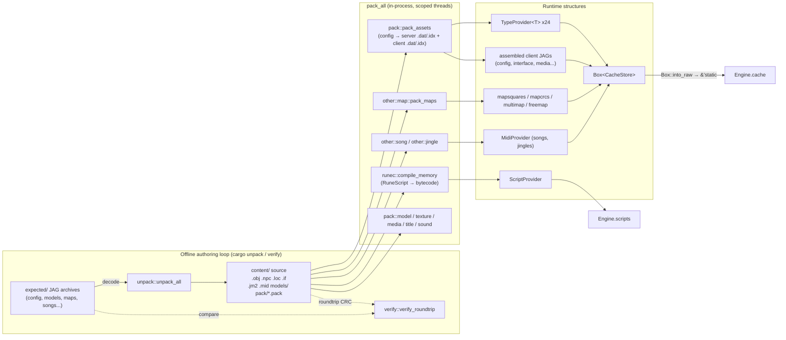
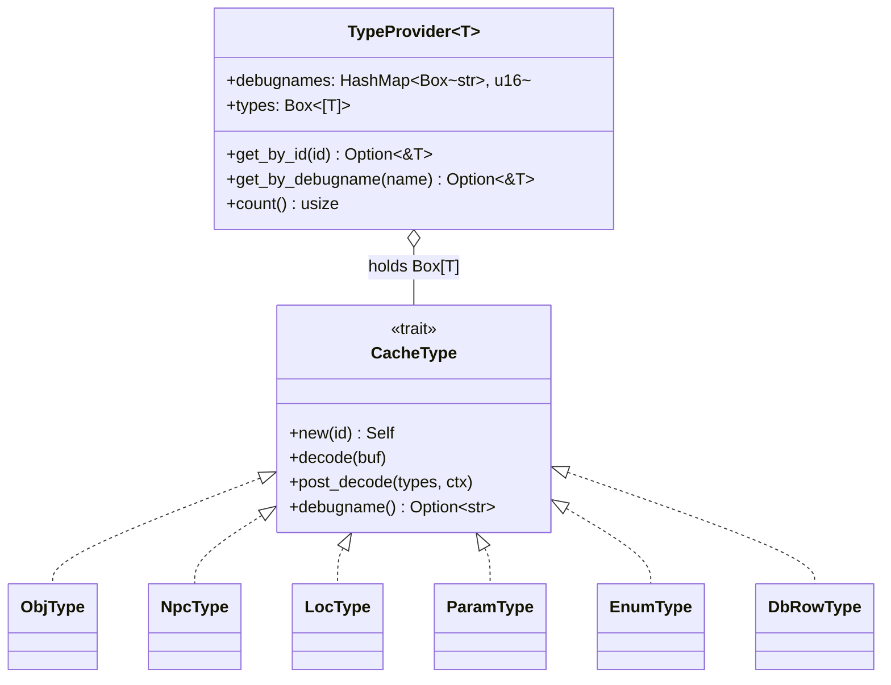
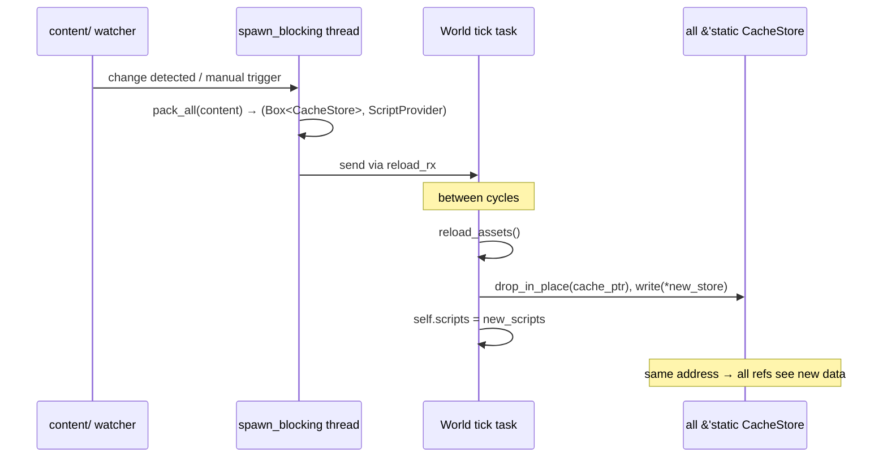
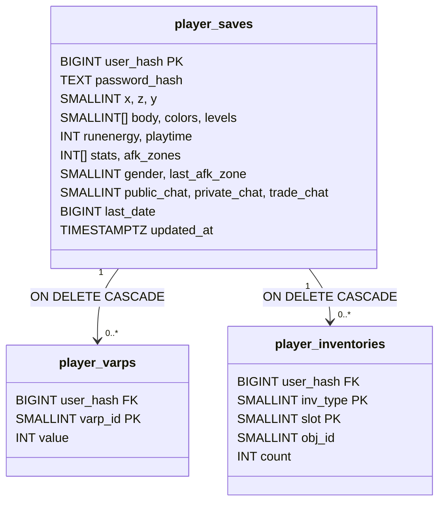
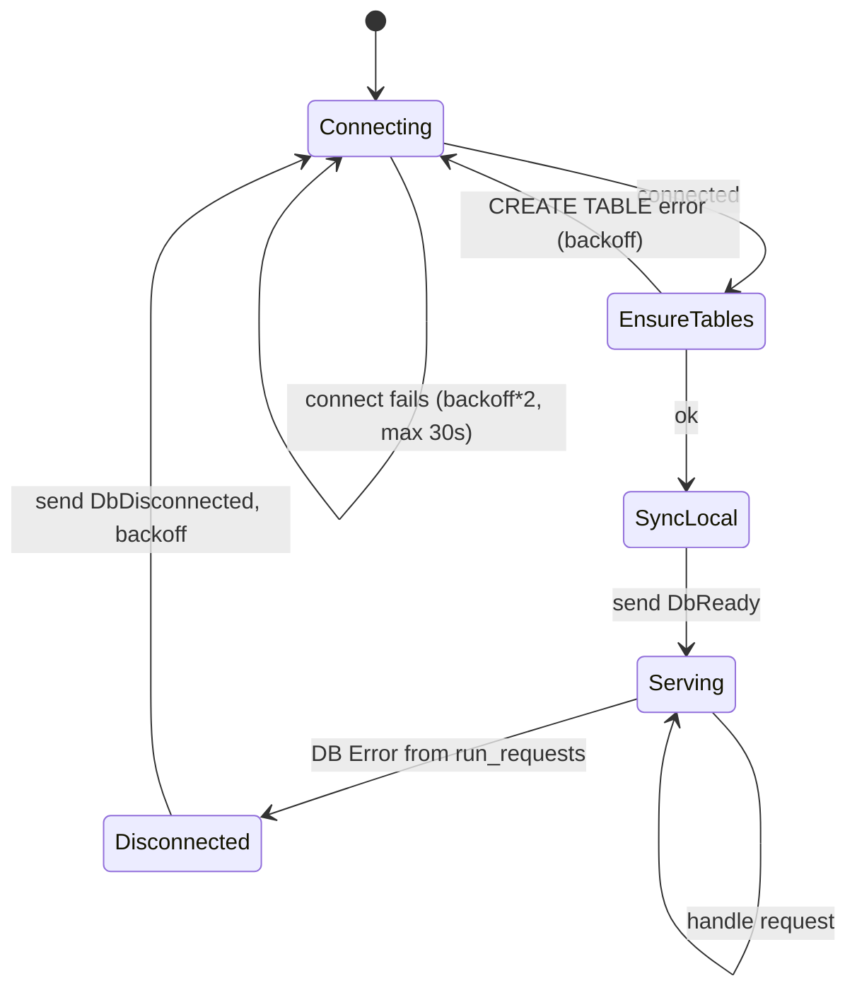
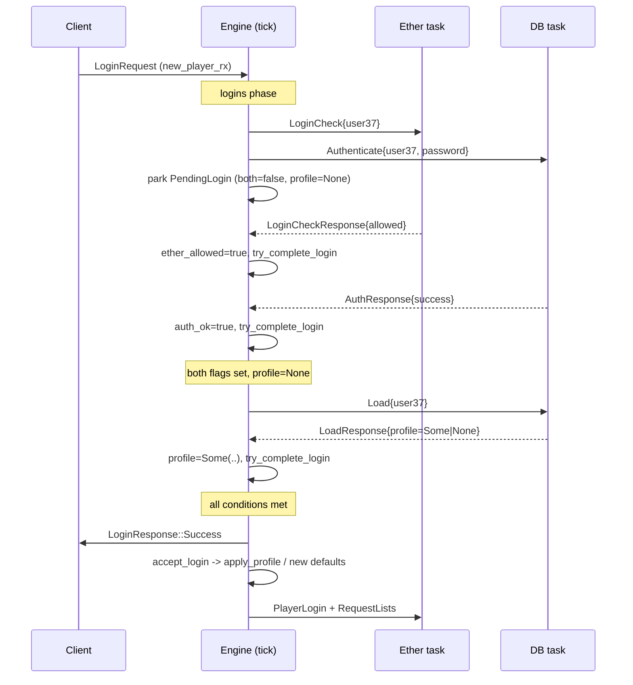
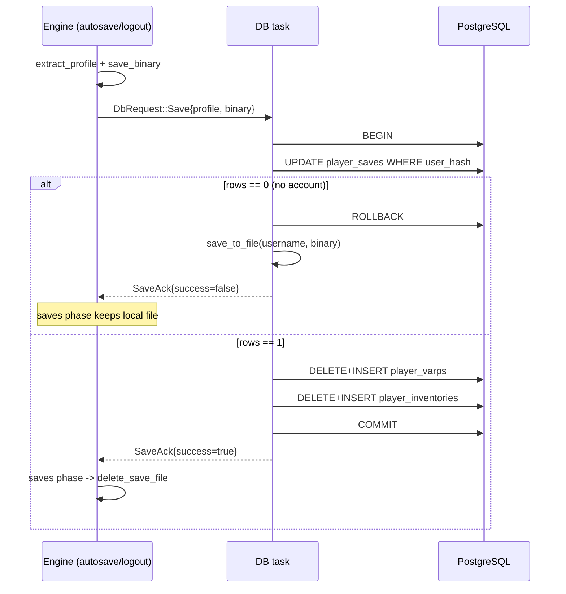
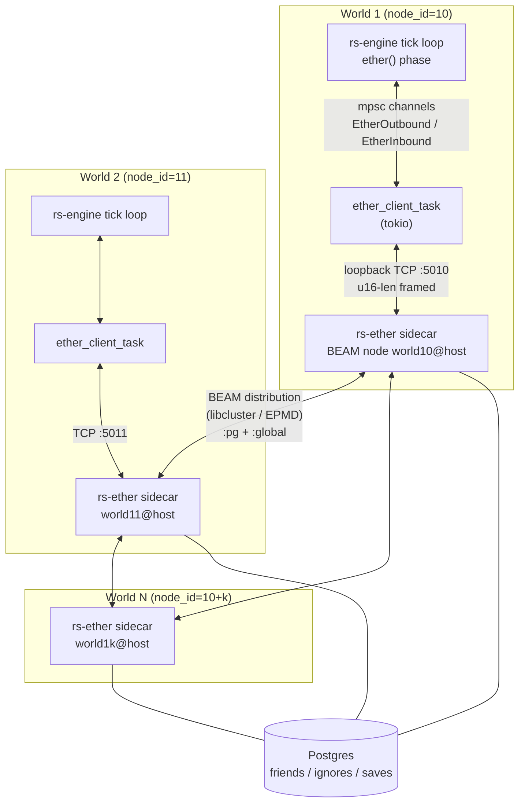
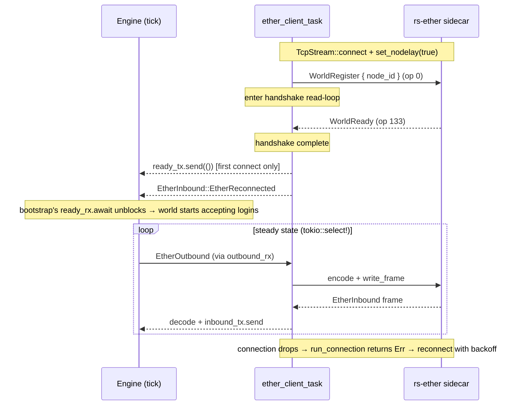
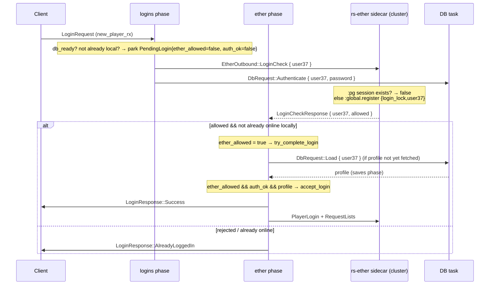

<a id="top"></a>

**[← Whitepaper index](../README.md)**  ·  [Single-file version](whitepaper-full.md)

# Part VII · Content, Persistence & Distribution

> *Where the game's data, player saves, and cross-world coordination live.*


---

<a id="sec-21"></a>

## 21. The Game Cache & Content Pipeline

The `rs-pack` crate is the content layer of rs-engine: it owns the *offline* toolchain that converts a directory of
human-readable source files (config text, RuneScript, `.jm2` maps, `.mid` music, models, sprites) into the binary JAG
archives a 2004-era RuneScape client downloads, and the *online* runtime structures (`CacheStore` + `ScriptProvider`)
that the tick loop queries millions of times per cycle. Unlike the classic LostCity/2004scape server — which keeps the
packer (a separate Node/Java tool) and the runtime cache strictly apart, persisting intermediate `.dat`/`.idx` files to
disk — rs-engine fuses both into a single Rust process. `pack_all` compiles everything *in memory* and hands the engine
a `Box<CacheStore>` plus a `ScriptProvider` directly. There is no on-disk cache the server reads at boot; the cache *is*
the in-process data structure. This section documents the build pipeline, the runtime store, the type-provider lookup
machinery, the compiled RuneScript provider, the word-encoding censor, MIDI handling, `VarValue` typing, the offline
`unpack`/`verify` tooling, and the in-place hot-reload mechanism.

### 17.1 Two Pipelines, One Crate

`rs-pack` exposes four top-level modules (`rs-pack/src/lib.rs:1-4`): `cache` (runtime types + providers), `pack` (
source → binary), `unpack` (binary → source), and `types` (config enums). The crate is consumed two ways:

- **As a library** by `rs-server`: `rs_pack::pack_all(Path::new("content"), Path::new("content/pack"), args.verify)` at
  server boot (`rs-server/src/main.rs:286-289`) returns `(Box<CacheStore>, ScriptProvider)`. The store is immediately
  `Box::into_raw`'d and reinterpreted as `&'static CacheStore` so every subsystem can hold a zero-cost shared
  reference (see §17.9).
- **As a CLI binary** (`rs-pack/src/main.rs`): a `clap` subcommand tool exposing `pack`, `unpack`, and `verify`. Cargo
  aliases in `.cargo/config.toml` wire `cargo unpack` → `run -p rs-pack -- unpack -e expected -o content_unpack` and
  `cargo verify` → `run -p rs-pack -- verify -e expected -u content_unpack`. (`pack` is exercised through the server,
  not aliased.)



### 17.2 The Pack Build: `pack_all`

`pack_all` (`rs-pack/src/lib.rs:79-326`) is the heart of the build. It loads a `PackRegistry`, fans out every
independent task across `std::thread::scope` scoped threads, then re-serializes the results into a `CacheStore`.

**Name→id resolution (`PackRegistry`).** Source config files reference each other by *name* (`obj_995`, `seq_808`,
`model_loc_1530_8`), not numeric id. `PackRegistry::load` (`rs-pack/src/pack/pack_registry.rs:99-177`) reads ~23
`*.pack` files from `content/pack/`, each a flat `id=debugname` text mapping, into bidirectional `HashMap`s (`PackFile`,
lines 8-63). Every config that mentions another type (`obj` referencing a `model`, an `npc` referencing a `seq`) goes
through `get_by_debugname` to bind the numeric id at pack time. This mirrors the LostCity packer's `.pack` registry
exactly, preserving byte-stable id assignment so output CRCs match the original cache.

**Parallel fan-out.** Independent producers run concurrently (`rs-pack/src/lib.rs:112-147`): RuneScript compilation (
`runec::compile_memory`), `pack_assets` (all text configs), media/textures/title/models/sounds JAGs, wordenc, jingles,
songs, and maps. Results are joined via `unwrap_thread` (lines 66-77), which downcasts a panicked thread's payload into
a readable message — a deliberate choice because the build *panics* on any malformed config rather than returning soft
errors (panics are caught and surfaced with the offending file/code). This is the "fail loud at pack time" philosophy
that keeps invalid data out of the running world. Note: this build-time parallelism does not violate the single-threaded
tick invariant — it happens before the engine starts and during hot-reload on a `spawn_blocking` thread, never inside
`Engine::cycle()`.

**JAG assembly.** Text configs produce *two* outputs per type: a server-side `.dat`/`.idx` (rich, server-only fields)
and an optional client-side `.dat`/`.idx` (only the subset the client needs). `assemble_config_jag` (
`rs-pack/src/lib.rs:370-384`) packs the client halves of `seq, loc, flo, spotanim, obj, npc, idk, varp` into a single
`config` JAG via `JagFile`; `assemble_interface_jag` (lines 386-397) wraps the interface client data into an `interface`
JAG. These plus the precompressed media/textures/title/models/sounds/wordenc JAGs are CRC-checked through `insert_jag` (
lines 43-64) against hard-coded expected CRCs (e.g. config = `511217062`, interface = `1614084464`) when `verify=true`,
then stored in `CacheStore.jags` keyed by `&'static str`.

**CRC table.** A `[i32; 9]` `crctable` (lines 184-207) is populated in the fixed client-expected order (
`title, config, interface, media, models, textures, wordenc, sounds`) — index 0 is reserved (the model/version slot) —
and flattened to big-endian `crctable_bytes`. The JS5/login handshake serves these to validate the client's cache
against the server.

**Provider construction.** The bulk of lines 210-249 builds 24 `TypeProvider<T>` instances plus the specialised
`IfTypeProvider`, `FontTypeProvider`, `WordEncProvider`, two `MidiProvider`s, a `SeqFrameProvider`, and a
`DbTableIndex`, each via `build_type_provider` (lines 359-368), which fetches a type's packed server `.dat` from the
`assets` map and calls `TypeProvider::from_bytes`. The `ObjType` provider is special-cased: it receives
`ObjContext { members: true }` so member-only items can be auto-disabled in `post_decode` (see §17.4). The compiled
script `dat`/`idx` becomes the `ScriptProvider` (line 283). Everything lands in the `Box<CacheStore>` at lines 286-322.

### 17.3 The Runtime `CacheStore`

`CacheStore` (`rs-pack/src/cache/mod.rs:57-93`) is the single owned blob of all immutable game content. Its fields:

| Field                         | Type                                          | Purpose                                                                                               |
|-------------------------------|-----------------------------------------------|-------------------------------------------------------------------------------------------------------|
| `crctable` / `crctable_bytes` | `[i32; 9]` / `Arc<[u8]>`                      | Per-archive CRCs for the login/JS5 handshake                                                          |
| `crcs` / `jags`               | `HashMap<&'static str, …>`                    | Per-JAG CRC and the JAG bytes (`Arc<[u8]>`) served to clients                                         |
| `mapsquares` / `mapcrcs`      | `HashMap<(char,u8,u8), Arc<[u8]>>` / `…,i32>` | Compressed map data keyed by `(prefix,mapX,mapZ)`, prefix ∈ {`m`,`l`,`n`,`o`} for terrain/loc/npc/obj |
| `objs … categories` (24)      | `TypeProvider<T>`                             | Per-config-type tables                                                                                |
| `db_index`                    | `DbTableIndex`                                | Inverted index for `db_find` script ops                                                               |
| `interfaces`                  | `IfTypeProvider`                              | UI component definitions                                                                              |
| `fonts`                       | `FontTypeProvider`                            | Glyph metrics for server-side text wrapping                                                           |
| `wordenc`                     | `WordEncProvider`                             | Chat censor tables                                                                                    |
| `songs` / `jingles`           | `MidiProvider`                                | Music with computed tick-lengths                                                                      |
| `static_assets`               | `HashMap<Box<str>, Arc<[u8]>>`                | Files under `public/` served verbatim (e.g. HTTP)                                                     |
| `multimap` / `freemap`        | `HashSet<u32>`                                | Packed zone-key sets for multiway/F2P flags                                                           |

`Arc<[u8]>` is used for every blob that is *sent to clients* (JAGs, map squares, MIDI) so the network layer can clone a
cheap reference-counted handle into an outbound packet queue without copying the payload. The `static_assets` map is
populated by `load_static_assets` (`rs-pack/src/lib.rs:328-357`), which recursively reads `public/` and keys files by
their web path (`/img/foo.png`).

Two helpers encode the zone-key bit layout used for both lookups and the map CSVs (`rs-pack/src/cache/mod.rs:97-109`):

```rust
pub fn is_multi(&self, x: u16, z: u16, y: u8) -> bool {
    let zone_key = ((x >> 3) & 0x7FF) as u32
        | ((((z >> 3) & 0x7FF) as u32) << 11)
        | (((y & 0x3) as u32) << 22);
    self.multimap.contains(&zone_key)
}
```

| Bits  | Field          | Meaning                                                   |
|-------|----------------|-----------------------------------------------------------|
| 0–10  | `(x>>3)&0x7FF` | zone X (mapsquare-relative, /8 tiles)                     |
| 11–21 | `(z>>3)&0x7FF` | zone Z                                                    |
| 22–23 | `y&0x3`        | plane (level) — *only set for multimap; freemap omits it* |

`is_free` deliberately drops the plane bits because free-to-play areas apply to all levels of a column.

### 17.4 `TypeProvider<T>` and the `CacheType` Trait

Every config family decodes through one generic mechanism. The `CacheType` trait (`rs-pack/src/cache/provider.rs:4-11`)
requires `new(id)`, `decode(buf)`, an optional two-pass `post_decode`, and a `debugname()` accessor.
`TypeProvider::from_bytes` (lines 18-45) reads a `g2` count, then for each id constructs a default `T`, calls `decode`
to overlay the opcode stream, registers the debugname in a `HashMap<Box<str>, u16>`, and finally runs `post_decode` over
the whole vector.

The on-wire format is the canonical RS *opcode/operand TLV*: `decode` loops `while buf.remaining() > 0`, reads a `u8`
opcode, `0` terminates, and each known opcode pulls a type-specific payload. `ObjType::decode` (
`rs-pack/src/cache/obj.rs:165-259`) is representative — opcode `1` = model id (`g2`), `2`/`3` = name/desc (`gjstr`,
NUL=10 terminated), `12` = cost (`g4s`), `30..=34`/`35..=39` = op/iop verb arrays, `40` = recolour pairs, `249` =
params (delegated to `ParamType::decode_params`), `250` = debugname. An unrecognised opcode *panics* (
`rs-pack/src/cache/obj.rs:256`) — there is no silent skip, guaranteeing decode fidelity.

**Two-pass post-decode** handles cross-references that need the full table. `ObjType::post_decode` (
`rs-pack/src/cache/obj.rs:261-305`) resolves *certificate* (banknote) items: a cert obj copies its template's 2D render
fields and inherits its linked item's name/cost/members/tradeable, then synthesises a "Swap this note at any bank for
a/an X." description. It also calls `disable(members)` to strip ops/tradeability from member items on a free world (the
`ObjContext.members` flag). `LocType` similarly back-fills its `active` flag in post-decode when not explicitly set (
`rs-pack/src/cache/loc.rs:167-181`).

Lookups are O(1) both ways: `get_by_id(id)` indexes the boxed slice; `get_by_debugname(name)` hits the hashmap then the
slice (`rs-pack/src/cache/provider.rs:47-57`). The boxed-slice (`Box<[T]>`) layout — not `Vec<T>` — drops the redundant
capacity word and yields a tight, immutable, cache-friendly array; ids are dense (0..count) so no sparse-map overhead.



### 17.5 Config Enums (`types.rs`)

`rs-pack/src/types.rs` centralises the small fixed-domain enums shared by config decode, the VM, and the gameplay
subsystems. All derive `num_enum::TryFromPrimitive` over a `#[repr(u8)]` so wire bytes convert to enums with a checked
`try_from`, and most expose `from_config_str` for the text packer. Notable members:

- **`LocAngle`** (West/North/East/South = 0..3) and **`LocLayer`** (Wall/WallDecor/Ground/GroundDecor) —
  `types.rs:40-56`.
- **`LocShape`** (`types.rs:58-142`) — the 23 RS loc shapes. Each carries a `suffix()` (`_1`, `_q`, `_8`…) used by the
  unpacker to name per-shape models (`model_loc_<id>_8`), and a `layer()` mapping shape→`LocLayer` used by the
  zone/collision system to decide which collision layer a loc occupies.
- **`BlockWalk`** (None/All/Npc) and **`MoveRestrict`** (Normal/Blocked/…/Player) — `types.rs:336-353`, `310-334` — feed
  the pathfinder's collision flags.
- **`NpcMode`** (`types.rs:355-500`) — the full 67-variant NPC AI state machine (Wander, Patrol, PlayerFollow, the
  `Op*/Ap*` interaction modes, and 20 `Queue` slots) consumed by the NPC AI phase.
- **`PlayerStat`** (21 skills, `types.rs:823-876`) and **`NpcStat`** (6, `types.rs:878-901`).
- **`ScriptVarType`** (`types.rs:172-266`) — the most load-bearing enum: its `#[repr(u8)]` discriminants are the
  *RuneScript type-prefix characters* (`Int=105='i'`, `String=115='s'`, `Obj=111='o'`, `DbRow=208='Ð'`). This single
  enum drives param/enum/dbtable value typing, `VarValue` construction, and the VM's type checks. `AutoInt=255` is a
  virtual type used only for enum keys.

The `Hunt*` family (`types.rs:504-629`) decomposes a hunt config into eight orthogonal `u8` enums (mode, vis check,
strength check, etc.) consumed by the NPC hunt system.

### 17.6 Params, Enums, DB — Dynamic Typed Values

Three config families store *typed key→value* data rather than fixed fields, and all funnel through `ParamValue` (
`Int(i32)` | `String(Box<str>)`, `types.rs:166-170`):

- **`ParamType`** (`rs-pack/src/cache/param.rs`) declares a single param's `var_type` (a `ScriptVarType`) and default.
  `decode_params` (lines 19-29) is the shared reader for inline param blocks on objs/locs/npcs/structs: a `g1` count,
  then per entry a `g3` key, a `g1` discriminator (`1`=string), and the value. `get_param_or_default` / `default_param`
  resolve a param against an entity's `params` map at runtime.
- **`EnumType`** (`rs-pack/src/cache/enum.rs`) carries `inputtype`/`outputtype` (`ScriptVarType`) and a
  `HashMap<i32, ParamValue>` of key→value pairs (opcodes 5=string values, 6=int values). This backs the `ENUM`/
  `ENUM_GETOUTPUTCOUNT` script ops.
- **`DbTableType` / `DbRowType` / `DbTableIndex`** (`rs-pack/src/cache/dbtable.rs`, `dbrow.rs`) model a tiny relational
  store. A table declares per-column type tuples and defaults; rows hold actual values. `DbTableIndex::build` (
  `dbtable.rs:148-226`) constructs an inverted index over columns flagged `INDEXED (0x1)` in the table's `props`,
  packing `(table_id<<12)|(column<<4)|tuple_id` into a `u32` index key and mapping each `DbIndexKey` (Int/String) →
  `Vec<u16>` of matching row ids. `find` (lines 228-240) answers the `db_find*` family of ops in O(1). This is a
  substantial elaboration over the reference server, which scans rows linearly — rs-engine pays the indexing cost once
  at pack time to make script `db_find` cheap on the hot path.

### 17.7 The Compiled RuneScript Provider

`ScriptProvider` (`rs-pack/src/cache/script.rs:6-87`) is the runtime home of compiled RuneScript bytecode (produced by
the external `runec` compiler during `pack_all`). It holds three structures tuned for the VM's three lookup patterns:

```rust
pub struct ScriptProvider {
    pub names: FxHashMap<Box<str>, i32>,    // by source name
    pub scripts: Box<[Option<Arc<Script>>]>, // by dense id (index)
    pub lookups: FxHashMap<i32, i32>,        // by trigger key → id
}
```

`from_bytes` (lines 13-61) parses the compiler's `dat`+`idx` pair: the `idx` gives each script's byte length; a zero
length means "no script at this id" (`None` slot). For each present script it decodes a `Script`, registers
`info.name → id` in `names`, and if `info.lookup != -1` registers `info.lookup → id` in `lookups`. Each `Script` is
wrapped in `Arc<Script>` so the VM can cheaply clone a handle into a `ScriptState` without copying the bytecode.
`FxHashMap` (rustc's fast non-cryptographic hash) is chosen because keys are small integers/short strings and the maps
are never exposed to untrusted input.

The three accessors (lines 70-86) are all `#[inline]`: `get_by_id` (slice index), `get_by_lookup` (trigger key → id →
slice), `get_by_name`. `get_by_lookup` is the trigger dispatch the engine uses: `Engine::trigger_lookup_key` (
`rs-engine/src/engine.rs:701-726`) builds a key from `trigger as i32`, optionally OR-ing in a *type-specialised* form
`base | (0x2<<8) | (t<<10)` (e.g. "opobj on obj id 995") or a *category* form `base | (0x1<<8) | (c<<10)`, probing the
most specific that exists and falling back to the bare trigger ordinal. This three-tier specificity (type → category →
default) is byte-for-byte the LostCity trigger-resolution scheme.

**`Script` bytecode layout** (`rs-pack/src/cache/script.rs:117-232`). Each script decodes from a trailer-first format:
the last 2 bytes give a trailer length; the trailer (read at `end - trailer_len - 14`) holds the instruction count,
int/string local+arg counts, and the switch tables. The header (read from `start`) holds name, path, lookup, the
param-type bytes, and the line-number table (`pcs`/`lines`, used by `ScriptInfo::line_number` for error backtraces). The
instruction stream between header and trailer is decoded into four parallel boxed slices indexed by program counter:

| Slice             | Type                        | Holds                                     |
|-------------------|-----------------------------|-------------------------------------------|
| `opcodes`         | `Box<[u16]>`                | the opcode per pc                         |
| `int_operands`    | `Box<[i32]>`                | int operand (or `g1` for small ops)       |
| `string_operands` | `Box<[Box<str>]>`           | string operand for `PUSH_CONSTANT_STRING` |
| `switch_tables`   | `Box<[FxHashMap<i32,i32>]>` | jump tables for `SWITCH`                  |

Operand width is decided by `is_large_operand` (lines 684-692): opcodes ≤ 100 take a 4-byte operand *unless* they are
`RETURN`/`GOSUB`/`JUMP`/`POP_INT_DISCARD`/`POP_STRING_DISCARD` (which take a 1-byte operand); opcodes > 100 (the "
command" ops) always take a 1-byte operand. `script.rs` also defines the **entire opcode constant table** (
`PUSH_CONSTANT_INT=0` … `LAST=11000`, lines 235-705): core stack/branch ops (0–46), then banded server commands —
World (1000s), Player (2000s), Npc (2500s), Loc (3000s), Obj (3500s), config getters `oc_*`/`nc_*`/`lc_*` (4000s),
Inventory (4300s), Enum/String/Number (4400–4699), DB (7500s), Debug (10000s). The struct stores parallel SoA slices
rather than an AoS `Vec<Instruction>`, so the VM's hot fetch loop touches only the `opcodes` array for dispatch and
pulls operands lazily, maximising cache density.

### 17.8 Word Encoding (Chat Censor)

`WordEncProvider` (`rs-pack/src/cache/wordenc.rs`) is a faithful Rust port of the original client's `WordPack`/
`WordFilter` censor. It loads four tables from the `wordenc` JAG (lines 18-50): `badenc.txt` (bad words + per-word
allowed letter-pair "combinations"), `fragmentsenc.txt` (a sorted i32 fragment table for binary search), `tldlist.txt` (
top-level domains with a type byte), and `domainenc.txt` (domain stems). `filter(&str)` (lines 52-79) runs the full
multi-stage pass: normalise/strip disallowed chars, lowercase, then filter TLDs → bad words → domains → fragments,
restore a small `WHITELIST` (`cook`, `seeks`, `sheet`…), re-apply original uppercase, and re-collapse case.

The censor reproduces the client's leet-speak normalisation: `get_emulated_bad_char_len` (lines 669-824) maps obfuscated
glyphs back to letters (`@`/`4`/`^`→`a`, `1`/`!`/`:`→`i`, `vv`→`w` as a 2-char match, `\/`→`v`, etc.), so `f4ck` and
`f@ck` are caught. `filter_bad_combinations` (lines 92-197) is the core matcher, with the original's symbol-boundary and
numeral-vs-alpha heuristics intact (a match is suppressed if the surrounding fragment is a legitimate word per
`is_bad_fragment`'s binary search over the fragment table, lines 462-491). Domain/TLD filtering (lines 269-414) masks
things like `foo.com` or `foo@bar` by detecting period/at-sign/slash neighbourhoods. The faithful port matters because
chat must censor *identically* to the original client's local filter, or players see inconsistent masking. The reasoning
is dense and index-arithmetic-heavy by necessity — it is intentionally a line-by-line transliteration rather than an
idiomatic rewrite, to guarantee output parity.

### 17.9 MIDI: Songs and Jingles

`MidiProvider` (`rs-pack/src/cache/midi.rs:19-61`) holds songs/jingles each as a
`MidiType { name, data: Arc<[u8]>, crc, length_ms }`. `from_compressed` keeps the *compressed* bytes (what the client
downloads) but decompresses once to measure the track length. `decompress_song` (lines 63-72) reads a 4-byte big-endian
uncompressed-size prefix and bzip2-decompresses the remainder.

The non-trivial part is `parse_midi_length` (lines 151-327), a full Standard MIDI File parser written purely to compute
playback duration. It optionally unwraps a `RIFF`/`RMID` container, reads the `MThd` header (
format/track-count/division), then walks every `MTrk` track, decoding variable-length delta times, running-status, meta
events, sysex, and channel messages purely to advance the tick counter and capture `0x51` tempo-change events. It
handles both PPQ timing (integrating tempo segments to microseconds) and SMPTE timing. `MidiType::tick_length` (lines
13-17) then converts `length_ms` into engine *ticks*: `ceil(length_ms / 600.0) + 1`. This is consumed by the
`MIDI_SONG`/`MIDI_JINGLE` script ops so the server knows when a jingle finishes — a detail the reference server
hard-codes per-song, but which rs-engine derives correctly from the file (see MEMORY: a prior bug had `midi_jingle`
ignoring `length_ms`).

### 17.10 `VarValue` Typing

`VarValue` (`rs-pack/src/cache/mod.rs:111-229`) is the runtime tagged union for player/npc variables. It has one variant
per `ScriptVarType` (Int, Obj, Loc, Npc, Coord, DbRow, …). Three constructors bridge wire ints and the VM:

- `from_int(var_type, value)` builds the correctly-tagged variant from a raw `i32`.
- `default_for(var_type)` yields the type's empty value — `0` for ints, `-1` for most reference types, `Boolean(-1)`,
  and an empty `String`. The `-1` default encodes "null/none" for entity-reference types, matching RS conventions.
- `as_int()` projects any variant back to its `i32` payload (`String` → `-1`).

The tag is preserved (rather than collapsing everything to `i32`) so the VM and varbit system can validate that, e.g., a
`varp` declared `obj` is never assigned a coord — a type-safety guarantee the original loosely-typed Java vars lacked.

### 17.11 Offline Toolchain: Unpack & Verify

The `unpack` module is the *reverse* pipeline, used to bootstrap `content/` from an authentic cache and to prove
byte-fidelity.

**`unpack_all`** (`rs-pack/src/unpack/mod.rs:41-149`) reads the `expected/` JAG archives and emits editable source.
Config is unpacked *first* (`config::unpack_config`) because it produces the `model_categories` map that the model
unpacker needs to name models. `unpack_config` (`rs-pack/src/unpack/config.rs:142-195`) decodes each client config type
back into `all.<type>` text files and regenerates the `*.pack` name registries, naming models per their referencing
config (`model_npc_<id>`, `model_loc_<id><shape-suffix>`) and reconstructing cert/template obj relationships. A
`build_reverse_hsl_table` (lines 230-237) inverts the client's RGB15→HSL16 colour quantisation so recolour values
round-trip to source RGB. The remaining JAGs (interface, media, textures, title, models, sounds, wordenc, songs, maps)
unpack in parallel scoped threads (lines 73-145).

**`verify_roundtrip`** (`rs-pack/src/unpack/verify.rs:9-180`) is the regression gate behind `cargo verify`: for each
archive it re-packs the unpacked content and compares the CRC (or, for maps/songs, the raw bytes) against the original
`expected/` file, logging per-type PASS/FAIL and bailing with an error if any mismatch remains. The `_raw` JAG dumps (
`dump_jag_entries`, `mod.rs:257-286`) plus a `_jag_order.txt` preserve the *original entry ordering* so a re-packed
JAG (`pack_jag_from_raw`, lines 288-303) is byte-identical, since JAG CRC depends on entry order. This roundtrip
discipline is how the project validates that its from-scratch decoders/encoders are wire-perfect against revision ~225.

**The map packer** (`rs-pack/src/pack/other/map.rs`) deserves a note as the highest-throughput text parser.
`pack_maps` (lines 449-557) parses `.jm2` text maps with a hand-rolled byte scanner (`fast_parse_int`, `next_word`,
manual section detection — no regex, no `split` allocation) into a flat `[TileData; 4*64*64]` plus loc/npc/obj placement
maps, then `encode_terrain`/`encode_locs`/`encode_npcs`/`encode_objs` produce the exact client wire format (delta-coded
ids and positions via `psmart1or2`), bzip2-compress each, CRC it, and key it by `(prefix, mapX, mapZ)`. It also loads
`multiway.csv`/`free2play.csv` into the packed-zone-key `HashSet`s. The SoA tile buffer is reused across all map squares
to avoid per-square allocation.

### 17.12 Hot-Reload In Place

Because the engine holds the cache as `&'static CacheStore` (obtained by `Box::into_raw` + transmute at boot,
`rs-server/src/main.rs:288-289`), the store cannot simply be replaced by reassigning a variable — thousands of
`&'static` references exist. Instead `Engine` retains the raw `cache_ptr: *mut CacheStore` alongside the shared
`&'static` (`rs-engine/src/engine.rs:382-383`), and `reload_assets` (lines 757-768) rebuilds *into the same allocation*:

```rust
pub fn reload_assets(&mut self, new_store: Box<CacheStore>, new_scripts: ScriptProvider) {
    unsafe {
        std::ptr::drop_in_place(self.cache_ptr);     // drop old contents
        std::ptr::write(self.cache_ptr, *new_store); // move new into same address
    }
    self.scripts = new_scripts;
    // (debug) broadcast "Hot-reload applied"
}
```

Every existing `&'static CacheStore` reference instantly observes the new data because the *address* is unchanged. This
is sound only under rs-engine's iron single-threaded invariant: the engine runs on exactly one tokio task,
`reload_assets` is invoked from that same task, and the cache is never read concurrently (`unsafe impl Send for Engine`,
lines 416-420, documents this). The reload itself is produced off-thread: in debug builds `reload_coordinator` (
`rs-server/src/main.rs:614-672`) watches `content/` and runs `pack_all` on a `spawn_blocking` thread, sending
`(Box<CacheStore>, ScriptProvider)` back to the world tick, which applies the swap between cycles (lines 718-722). The
net effect is live editing of configs *and* RuneScript with zero downtime — a developer-experience win the
disk-cache-based reference server cannot match without a restart and JS5 re-handshake.



<sub>[↑ Back to top](#top)</sub>


---

<a id="sec-22"></a>

## 22. Persistence — Player Saves & the Database Client

Persistence in rs-engine is the discipline of capturing a live `Player` entity's mutable state, reducing it to a stable
serialisable form, and getting it durably onto disk or into PostgreSQL — all without ever blocking the single-threaded
600 ms tick loop. The original TypeScript LostCity server persists players to flat `.sav` files written
synchronously on the game thread. rs-engine keeps a byte-compatible `.sav` format as a *fallback*, but promotes the
durable store to an asynchronous PostgreSQL client running on a separate Tokio task, communicating with the engine
purely through unbounded MPSC channels. This section dissects the on-disk format, the columnar SQL schema, the
request/response channel protocol, the scheduling of autosave/logout-save, the asynchronous login profile-load
handshake, and the Whirlpool-then-Argon2 password pipeline.

The entire subsystem is built around one principle: **the engine thread never does I/O and never blocks.** Every
database operation is fire-and-forget from the engine's perspective; results arrive later as messages drained during the
`saves` phase. This preserves the deterministic, allocation-conscious tick budget that the rest of the engine depends
on.

### 1. `PlayerProfile`: the canonical intermediate representation

All persistence flows through a single value type, `PlayerProfile` (`src/player_save.rs:37-56`). It is deliberately
*not* the live `Player` entity — it is a flattened, scope-filtered snapshot containing only persistent state, decoupling
the wire/DB representation from the in-memory entity layout. Both the binary `.sav` codec and the SQL codec read and
write this one struct, so there is exactly one definition of "what a player's saved state is."

| Field                                     | Type                    | Meaning                                                           |
|-------------------------------------------|-------------------------|-------------------------------------------------------------------|
| `x`, `z`                                  | `u16`                   | World coordinate (east/north)                                     |
| `y`                                       | `u8`                    | Plane / level (0–3)                                               |
| `body`                                    | `[i32; 7]`              | Appearance body-part model ids; `-1` = empty slot                 |
| `colors`                                  | `[u8; 5]`               | Appearance recolour indices                                       |
| `gender`                                  | `u8`                    | 0 = male, 1 = female                                              |
| `runenergy`                               | `u16`                   | Run energy, 0–10000 (one decimal place)                           |
| `playtime`                                | `i32`                   | Ticks played, incremented every tick                              |
| `stats`                                   | `[i32; 21]`             | Experience per skill (`STAT_COUNT = 21`, `src/player_save.rs:22`) |
| `levels`                                  | `[u8; 21]`              | Current (possibly boosted/drained) level per skill                |
| `varps`                                   | `Vec<(u16, i32)>`       | Perm-scope player variables: `(id, value)`                        |
| `invs`                                    | `Vec<PlayerProfileInv>` | Perm-scope inventories                                            |
| `afk_zones`                               | `[u32; 2]`              | Anti-macro zone tracking                                          |
| `last_afk_zone`                           | `u16`                   | Last AFK zone id                                                  |
| `public_chat`/`private_chat`/`trade_chat` | `u8`                    | Chat privacy settings (enum-as-byte)                              |
| `last_date`                               | `i64`                   | Unix epoch seconds of last login                                  |

`PlayerProfileInv` (`src/player_save.rs:28-31`) holds an `inv_type: u16` and `items: Vec<(u16, u16, u32)>` —
`(slot, obj_id, count)` tuples. Note the *sparse* representation: only occupied slots are stored, not a dense
capacity-sized array. This is the first of several space optimizations that distinguish the in-memory/DB form from the
on-disk binary form (which is dense — see §3).

#### 1.1 `extract_profile` — live entity → profile (scope filtering)

`extract_profile(player, cache)` (`src/player_save.rs:69-130`) walks the player's varps and inventories and applies the
cache's *scope* metadata to decide what is persistent:

- **Varps:** iterate every varp id, look up `VarPlayerScope` from `cache.varps`. Only `VarPlayerScope::Perm` varps are
  kept, and only if their value is non-zero (`src/player_save.rs:78-83`). Unknown ids default to `Temp` and are dropped.
  This is both a size win and a correctness guarantee — transient combat/UI state never leaks into a save.
- **Inventories:** iterate `player.invs`, look up `InvScope` from `cache.invs`, skip anything not `InvScope::Perm` (
  `src/player_save.rs:91-95`). Empty inventories (no occupied slots) are omitted entirely (`src/player_save.rs:102`).

Everything else (coords, appearance, stats, chat settings, AFK zones, `last_date`) is copied wholesale. The result is a
self-contained profile that can be serialised by either backend.

#### 1.2 `apply_profile` — profile → live entity (with derivation)

`apply_profile(profile, player, cache)` (`src/player_save.rs:150-215`) is the inverse, but it does *more* than copy
fields — it reconstructs derived state that is intentionally not persisted:

- Sets `pathing.coord`, and seeds `last_step_coord`/`follow_coord` to one tile west of spawn (`x-1`, saturating) so
  movement interpolation has a sane prior (`src/player_save.rs:151-155`).
- Restores `stats.xp` and `stats.levels`, then **recomputes** `base_levels[i]` from XP via `get_level_by_exp` (
  `src/player_save.rs:163-165`) and recomputes `combat_level` via `get_combat_level()` (`src/player_save.rs:166`). Base
  level and combat level are derived, never stored — eliminating a class of save corruption where stored level and
  stored XP disagree.
- Decodes the three chat-settings bytes into their typed enums (`ChatSettingsPublic`/`Private`/`TradeDuel`), with the
  numeric mapping inverse to `extract_profile`'s `as u8` cast (`src/player_save.rs:172-187`).
- Applies varps through `VarValue::from_int(varp_type.var_type, value)`, guarding `id < player.varps.len()` and skipping
  unknown ids (`src/player_save.rs:189-197`).
- Rebuilds each inventory using the cache's declared `size` and `stackall` flag, choosing `StackMode::Always` or
  `StackMode::Normal`, and refuses out-of-range slots (`src/player_save.rs:199-214`). Capacity defaults to 28 if the inv
  type is unknown.

Crucially, `last_date` is restored into *both* `player.last_date` and `player.last_login_date` (
`src/player_save.rs:169-170`) — the loaded value is the *previous* login, used to show "welcome back" timing, and is
then overwritten with `now()` at the end of `accept_login` (see §5.4).

### 2. The `.sav` binary format (TS-compatible fallback)

The binary codec (`save_binary`/`load_binary`, `src/player_save.rs:231-482`) exists so the server can persist players
even when PostgreSQL is unreachable, and so it can interoperate with the reference TypeScript server's save files. It is
written with `rs_io::Packet`, whose `p2`/`p4`/`p8` primitives emit **big-endian** integers (matching the JVM/RS wire
convention).

#### 2.1 Header and framing

| Const         | Value         | Source                  |
|---------------|---------------|-------------------------|
| `SAV_MAGIC`   | `0x2004`      | `src/player_save.rs:16` |
| `SAV_VERSION` | `6` (current) | `src/player_save.rs:19` |

The file is a flat byte stream terminated by a 4-byte CRC32 trailer. Layout (offsets relative to start; multi-byte
values big-endian):

```
+--------+------+----------------------------------------------+
| Offset | Size | Field                                        |
+--------+------+----------------------------------------------+
| 0      | 2    | magic = 0x2004                               |
| 2      | 2    | version (currently 6)                        |
| 4      | 2    | x                                            |
| 6      | 2    | z                                            |
| 8      | 1    | y (plane)                                    |
| 9      | 7    | body[0..7]  (each u8; 255 decodes to -1)     |
| 16     | 5    | colors[0..5]                                 |
| 21     | 1    | gender                                        |
| 22     | 2    | runenergy                                    |
| 24     | 4    | playtime (i32)                               |
| 28     | 5*21 | per skill: xp(i32) + level(u8) = 5 bytes ea  |
| ...    | 2    | varp_count = cache.varps.count()             |
| ...    | 4*N  | one i32 per varp slot (DENSE; 0 if temp)     |
| ...    | 1    | inv_count (back-patched)                      |
| ...    | var  | per inv: type(2) + capacity(2) + slots       |
| ...    | 1    | afk_zones.len() (=2)                          |
| ...    | 4*2  | afk_zones                                     |
| ...    | 2    | last_afk_zone                                |
| ...    | 1    | packed_chat = pub<<4 | priv<<2 | trade        |
| ...    | 8    | last_date (i64, v6+)                          |
| end-4  | 4    | CRC32 over bytes [0, end-4)                   |
+--------+------+----------------------------------------------+
```

Two encoding subtleties matter:

- **Varps are dense in the file** (`src/player_save.rs:257-276`): the writer emits one `i32` for *every* varp slot in
  the cache, writing the value if the slot is Perm-scope and 0 otherwise. This trades file size for positional
  addressing (no id stored per varp). The DB form, by contrast, is sparse. `load_binary` reverses this by reading
  `varp_count` consecutive `i32`s and keeping only the non-zero ones with their positional index (
  `src/player_save.rs:397-404`).
- **Inventories are dense per slot** (`src/player_save.rs:282-307`): for each saved inv, the writer emits `type`,
  `capacity`, then `capacity` entries. Each occupied slot writes `obj_id + 1` (so 0 is reserved for "empty"), then a
  count that is either a single byte (`< 255`) or a `255` sentinel followed by a full `i32` for large stacks (
  `src/player_save.rs:288-304`). Empty slots write a single `p2(0)`. The `inv_count` byte is back-patched after the loop
  via `sav.data[inv_count_pos] = inv_count` (`src/player_save.rs:278-307`).

The `+1` obj-id biasing and `255`-sentinel count encoding are exact mirrors of the TS reference server, preserving
binary interoperability.

#### 2.2 Versioned, forward-compatible reads

`load_binary` validates `magic`, rejects `version > SAV_VERSION`, then verifies the CRC32 trailer *before* parsing any
payload (`src/player_save.rs:346-366`). It reads older formats by gating fields on the version:

| Field                           | Introduced                      |
|---------------------------------|---------------------------------|
| `playtime` as `i32` (was `u16`) | v2 (`:384-388`)                 |
| AFK zones + `last_afk_zone`     | v3 (`:442-451`)                 |
| packed chat settings            | v4 (`:453-458`)                 |
| inventory capacity word         | v5 (`:410-414`; older rejected) |
| `last_date` (i64)               | v6 (`:460`)                     |

This monotonic versioning lets a running server upgrade old saves transparently on the next load→save round-trip.

#### 2.3 Local file I/O

Three thin helpers manage the `data/players/{username}.sav` path: `save_to_file` (creates the dir, writes, logs on
error — `src/player_save.rs:527-538`), `load_from_file` (returns `Option<Vec<u8>>` — `src/player_save.rs:547-552`), and
`delete_save_file` (best-effort `remove_file` — `src/player_save.rs:560-565`). The filename stem is the raw base37
username, so it round-trips through `to_userhash`/`to_raw_username`.

### 3. The PostgreSQL schema (columnar + relational)

The DB form normalises a profile across three tables, created idempotently by `ensure_tables` (
`src/clients/client_db.rs:224-264`) on every connect:



Design notes grounded in the schema:

- The PK of `player_saves` is `user_hash` — the base37 username hash stored as a signed `BIGINT` (the `u64` is
  reinterpreted via `user37 as i64`, `src/clients/client_db.rs:399`). There is no separate auto-increment id; the
  username *is* the identity.
- Fixed-arity arrays (`body`, `colors`, `stats`, `levels`, `afk_zones`) are stored as Postgres array columns with
  sensible `DEFAULT`s, so a freshly-inserted row already represents a valid new player (e.g. `stats` defaults to
  all-zero, `levels` to all-`1`, spawn coords `3094,3106,0`).
- `player_varps` and `player_inventories` are *sparse* child tables — one row per non-zero varp / occupied slot — with
  composite primary keys and `ON DELETE CASCADE`. This is the relational analogue of the profile's sparse `Vec`s, and it
  lets `save_profile` replace them with simple `DELETE … WHERE user_hash` + re-`INSERT`.
- `password_hash` lives only in the DB, never in the profile or the `.sav` file — passwords are never serialised to disk
  in the fallback path.

### 4. The async DB client task and channel protocol

The engine and the database live on opposite sides of two unbounded MPSC channels. The engine holds
`db_tx: Option<UnboundedSender<DbRequest>>` and `db_rx: UnboundedReceiver<DbResponse>` (`src/engine.rs:402-403`); the
task holds the mirror ends. `db_tx` is `Option` because the server can run DB-less (then no saves are attempted and
`db_ready` never flips — logins are rejected, see §5).

#### 4.1 Message types

`DbRequest` (`src/clients/client_db.rs:15-29`) and `DbResponse` (`src/clients/client_db.rs:32-48`):

| `DbRequest`    | Payload                                                                | Purpose                                              |
|----------------|------------------------------------------------------------------------|------------------------------------------------------|
| `Authenticate` | `user37`, `password: Box<str>`                                         | Verify/create credentials                            |
| `Save`         | `user37`, `username`, `profile: Box<PlayerProfile>`, `binary: Vec<u8>` | Persist; `binary` is the precomputed `.sav` fallback |
| `Load`         | `user37`                                                               | Fetch profile                                        |

| `DbResponse`     | Payload                                    | Meaning                                           |
|------------------|--------------------------------------------|---------------------------------------------------|
| `DbReady`        | —                                          | Connection up, tables ensured, local saves synced |
| `DbDisconnected` | —                                          | Connection lost; engine disables logins           |
| `AuthResponse`   | `user37`, `success`                        | Credential result                                 |
| `SaveAck`        | `user37`, `username`, `success`            | Persist result                                    |
| `LoadResponse`   | `user37`, `profile: Option<PlayerProfile>` | `None` = new player                               |

Note the engine pre-serializes the `.sav` `binary` blob *on the engine thread* inside `Save` (in
autosave/logout/emergency paths) and ships it alongside the profile. That is deliberate: the DB task can fall back to
`save_to_file` without re-running `save_binary`, and the engine has already paid the (cheap, CPU-bound) serialisation
cost. `profile` and `binary` thus carry redundant representations — the DB writes the profile, the file fallback writes
the binary.

#### 4.2 Task lifecycle: connect, ensure, sync, serve

`db_client_task` (`src/clients/client_db.rs:78-133`) is spawned once from `rs-server/src/main.rs:345-354` with the DB
connection params and the secret `pepper`. Its outer loop implements **exponential backoff** (1 s → 30 s cap, reset to 1
s on success, `src/clients/client_db.rs:88-131`):



On each successful connect the task: spawns the `tokio-postgres` `connection` future (the driver half) onto its own
task (`:102-106`); runs `ensure_tables`; runs `sync_local_saves`; emits `DbReady`; and finally enters `run_requests`,
the blocking-on-channel request loop. If `run_requests` returns an `Err` (a DB error escalated to "connection lost"),
the task emits `DbDisconnected` and falls back through to the backoff sleep and reconnect.

`run_requests` (`src/clients/client_db.rs:288-348`) is a `while let Some(req) = request_rx.recv().await` loop
dispatching to `authenticate`, `save_profile`, or `load_profile`. Two failure policies are notable:

- For `Save`, any non-`Ok(true)` result triggers a `save_to_file(&username, &binary)` fallback so the player is never
  lost even if the DB write fails (`src/clients/client_db.rs:319-324`). A `SaveAck { success }` is always sent.
- For `Authenticate` and `Load`, a DB `Err` sends a negative response *and then* `return Err(e)` — propagating the error
  up so the whole connection is torn down and rebuilt (`src/clients/client_db.rs:301-308`, `:336-343`). For `Save`, the
  error is similarly propagated via `result?` after the ack is sent (`:330`).

#### 4.3 `sync_local_saves` — crash-recovery reconciliation

On connect, `sync_local_saves` (`src/clients/client_db.rs:153-211`) scans `data/players/*.sav`, parses each with
`load_binary`, and attempts `save_profile`. The three outcomes are handled distinctly (`:191-205`):

- `Ok(true)` — synced; the local file is **deleted**.
- `Ok(false)` — no DB row exists for that user yet (the `UPDATE` matched 0 rows); the file is **kept** until the player
  authenticates and a row is created.
- `Err` — logged and the file kept.

This closes the loop opened by the `Save` fallback: a save that landed on disk because the DB was down is automatically
reconciled into the DB on the next successful connect.

### 5. Login: the two-phase async profile-load handshake

A login cannot complete synchronously because it needs *two* independent asynchronous confirmations: (a) cross-world
authorisation from the Ether sidecar (the player is not already online elsewhere) and (b) database credential
verification, followed by (c) the profile load. `PendingLogin` (`src/engine.rs:195-202`) is the accumulator:

```rust
pub struct PendingLogin {
    pub user37: u64,
    pub request: LoginRequest,
    pub clock: u64,
    pub ether_allowed: bool,
    pub auth_ok: bool,
    pub profile: Option<Option<PlayerProfile>>,
}
```

The tri-state `profile: Option<Option<PlayerProfile>>` is the key design detail (`src/engine.rs:191-194`): `None` = not
yet fetched; `Some(None)` = fetched, no row (new player); `Some(Some(p))` = fetched, existing player. This
distinguishes "still waiting" from "definitively a new account" without a separate flag.

#### 5.1 Phase 1 — `logins` (issue the async requests)

`logins` (`src/phases/login.rs:41-99`) drains `new_player_rx`. For each request it: rejects with `LoginServerOffline` if
`!db_ready` (`:45-51`); rejects with `AlreadyLoggedIn` if the user is already on this world (`:53-59`); otherwise fires
`EtherOutbound::LoginCheck` *and* `DbRequest::Authenticate` (cloning the password into the request), then parks a
`PendingLogin` with both flags `false` and `profile: None` (`:61-82`). If there is no `ether_tx`, the login is rejected
outright. A second pass evicts any pending login older than `LOGIN_TIMEOUT_TICKS = 10` (6 s) with `CouldNotComplete` (
`:85-98`).

#### 5.2 Phase 2 — responses arrive on three channels

The two confirmations and the load each arrive independently and call into `try_complete_login`:

- **Ether** (`src/phases/ether.rs:89-107`): `LoginCheckResponse { allowed }` sets `ether_allowed = true` (re-checking
  the player isn't online) and calls `try_complete_login`; if not allowed it rejects with `AlreadyLoggedIn`.
- **DB auth** (`src/phases/saves.rs:53-67`): `AuthResponse { success }` sets `auth_ok = true` and calls
  `try_complete_login`; on failure it `swap_remove`s the pending and replies `InvalidCredentials`.
- **DB load** (`src/phases/saves.rs:68-73`): `LoadResponse { profile }` stores `profile = Some(profile)` and calls
  `try_complete_login`.

#### 5.3 The gate — `try_complete_login`

`try_complete_login(idx)` (`src/engine.rs:2248-2264`) is idempotent and re-entrant-safe. It returns early unless **both
** `ether_allowed` and `auth_ok` are set. Once both hold, if `profile.is_none()` it lazily issues the
`DbRequest::Load` (deferring the read until after auth succeeds — no point loading a profile for a wrong password) and
returns. When all three are satisfied it `swap_remove`s the entry and calls `accept_login`.



#### 5.4 `accept_login` — new vs existing

`accept_login(request, profile)` (`src/engine.rs:2139-2225`) is where new-vs-existing diverges, but elegantly:

1. Capacity guard: `WorldFull` if `count() >= 2000` or no free pid (`:2140-2154`).
2. Send `LoginResponse::Success`, build the `ActivePlayer` (`:2156-2167`).
3. If a `profile` is present, `apply_profile` it (`:2169-2171`).
4. **New-player detection by content, not flag**: if after applying, all 21 XP values are zero,
   `apply_new_player_defaults` runs (`:2172-2174`). This catches both `Some(None)` (no DB row) *and* a degenerate
   all-zero existing row. `apply_new_player_defaults` (`src/player_save.rs:502-512`) zeroes all skills, sets all levels
   to 1, then sets Hitpoints to level 10 with the matching XP via `get_exp_by_level(10)`, and recomputes combat level —
   the canonical RS starting state.
5. Stamp `last_date = now()` (`:2176-2179`).
6. `add_player`, `on_login`, notify Ether (`PlayerLogin` + `RequestLists`), and run the `Login` trigger script (
   `:2200-2224`).

The pid-array key derives from the client IP (`u32::from(ipv4)` or the low 32 bits of an IPv6 address, `:2193-2199`),
feeding the engine's IP-based connection accounting.

### 6. Saving: autosave, logout, and emergency paths

There are three engine-side save call-sites, all producing a `DbRequest::Save` with a freshly `extract_profile`'d
profile and a `save_binary` fallback blob:

| Path      | Trigger                                                  | Source                         |
|-----------|----------------------------------------------------------|--------------------------------|
| Autosave  | Periodic, every `AUTOSAVE_INTERVAL = 250` ticks (~150 s) | `src/phases/autosave.rs:31-67` |
| Logout    | Clean disconnect after the `Logout` trigger runs         | `src/phases/logout.rs:135-146` |
| Emergency | Panic recovery for a single player                       | `src/engine.rs:1996-2018`      |

**Autosave** (`src/phases/autosave.rs`) does two things each tick. First, *unconditionally* every tick it increments
`playtime` for every non-bot active player (`:32-38`) — so playtime is accurate to the tick regardless of save cadence.
Second, when `clock.is_multiple_of(250) && clock != 0` (`:40`), it iterates `player_list.processing`, skips bots (
`:47-49`), and for each real player extracts + serializes + sends `DbRequest::Save` (`:50-59`). Bots are never persisted
in any path — they are ephemeral.

**Logout** (`src/phases/logout.rs:50-163`) is gated: a player is only removed once their `Logout` server-trigger script
has executed and they have no pending engine-queue work and `can_access()` (`:119-133`). Only then does it
`extract_profile`/`save_binary`/`DbRequest::Save` (`:135-146`), notify Ether `PlayerLogout`, and call `remove_player`.
The save happens *after* the logout script runs, so any script-driven state mutation (e.g. clearing a temporary effect)
is captured.

**Emergency removal** (`emergency_remove_player`, `src/engine.rs:1996-2018`) is the panic safety net. The tick loop
wraps every phase in `catch_unwind` (`src/engine.rs:571-580`); if a phase panics, `fatal` is set and after the cycle
every player is emergency-removed (`:597-604`). `emergency_remove_player` saves the profile (best-effort) and notifies
Ether before `remove_player`, so a per-player panic does not cost the player their progress. This depends on the release
profile keeping `panic = "unwind"` so `catch_unwind` can actually intercept.

#### 6.1 `save_profile` — one transaction, replace-all children

`save_profile` (`src/clients/client_db.rs:465-548`) runs inside a single `tokio-postgres` transaction:

1. Marshal arrays into the `i16`/`i32` Vec types Postgres expects (`:471-475`).
2. `UPDATE player_saves … WHERE user_hash=$1`. If it affects **0 rows** the player has no account row yet, so it
   `rollback`s and returns `Ok(false)` (`:479-511`) — the signal `sync_local_saves` and `run_requests` use to fall back
   to the file.
3. `DELETE` all `player_varps`, then re-`INSERT` each non-zero varp (`:513-522`).
4. `DELETE` all `player_inventories`, then re-`INSERT` each occupied slot (`:524-544`).
5. `commit` and return `Ok(true)` (`:546-547`).

The delete-then-insert replace-all strategy is simpler and more correct than diffing, and the transaction guarantees a
save is all-or-nothing — a crash mid-write never leaves a half-updated inventory. The trade-off is write amplification (
every save rewrites every varp/inv row), acceptable given the ~150 s autosave cadence and modest per-player row counts.



#### 6.2 `SaveAck` handling and file-fallback cleanup

The `saves` phase (`src/phases/saves.rs:35-87`) drains `db_rx` each tick. On `SaveAck { success: true }` it deletes the
local `.sav` (since the DB now holds the truth, `:79-81`); on `success: false` it keeps the file as a fallback (
`:81-83`). `DbDisconnected` flips `db_ready = false` and rejects *all* parked logins with `LoginServerOffline` (
`:42-52`) — the engine refuses to admit players while the store is down, preventing un-saveable sessions. `DbReady`
flips the flag back and re-enables logins (`:38-41`).

### 7. Authentication & the Whirlpool→Argon2 password pipeline

`authenticate` (`src/clients/client_db.rs:393-443`) implements a two-stage hash with a server-side **pepper** (a secret
passed from `main.rs` config, never stored in the DB):

1. `peppered(pepper, password)` (`src/clients/client_db.rs:362-367`) concatenates `pepper || password` and runs it
   through **Whirlpool** (`rs_crypto::whirlpool`, the external `rs-crypto` 0.2 crate), yielding a fixed 64-byte digest.
2. That digest is the *input* to **Argon2** (default params, `argon2` crate). Argon2 supplies the per-user random salt (
   `SaltString::generate(OsRng)`) and memory-hard work factor.

The two-stage design is intentional. The pepper is a global secret outside the database, so a DB-only breach cannot
mount an offline dictionary attack without also stealing the server config. Whirlpool normalises arbitrary-length
passwords to a fixed 64-byte input (and matches the reference server's password digesting), while Argon2 provides the
modern memory-hard, salted, slow KDF that actually resists brute force. The stored value is the full Argon2 PHC string (
`hashed.to_string()`), which embeds the salt and parameters.

Flow:

- **Existing user** (`:409-417`): `SELECT password_hash`, parse the PHC string with `PasswordHash::new` (a parse failure
  returns `Ok(false)`, not an error), and verify the peppered digest with `Argon2::default().verify_password`.
- **New user** (`:418-441`): no row → generate a salt, hash the peppered digest, `INSERT` a new `player_saves` row with
  just `user_hash` + `password_hash` (all other columns take their schema defaults — a valid new player). Then, if a
  local `.sav` exists for this username, it is `load_binary`'d and `save_profile`'d into the freshly created row, and
  the file deleted (`:431-438`). This is the migration hook that lets a file-only player become a DB player on their
  first DB-backed login.

Note that account creation is implicit: a previously-unknown username with any password *creates* the account. There is
no separate registration step — the first successful credential for a name claims it.

### 8. Cross-references and engineering rationale recap

Persistence touches several subsystems by design:

- **Tick loop ordering** (`src/engine.rs:582-595`): the relevant phases run in the order
  `logouts → autosave → logins → ether → saves` within a single cycle. Because `logins` runs *before* `ether` and
  `saves`, a login request issued this tick has its async replies processed in the *same* tick if they have already
  arrived, minimising login latency. `saves` draining DB responses after `logins` means an `AuthResponse`/`LoadResponse`
  that landed before the tick is consumed promptly.
- **Identity** depends on `rs-util`'s base37 codec (`to_userhash`/`to_raw_username`) and `rs-vm`'s `PlayerUid` (
  `username << 11 | pid`), so `user37` is stable across sessions while `pid` is per-session.
- **Cache scopes** (`VarPlayerScope`, `InvScope`) from `rs-pack` drive what is persistent — persistence is
  content-defined, not hard-coded.
- **Ether** (cross-world auth) is a co-prerequisite of login completion; the two async subsystems rendezvous in
  `PendingLogin`.

The net architecture moves all I/O off the deterministic game thread, keeps a byte-compatible offline fallback, and
reconciles the two stores automatically — achieving durability and crash-safety without ever spending a millisecond of
the 600 ms tick budget on blocking database calls.

<sub>[↑ Back to top](#top)</sub>


---

<a id="sec-23"></a>

## 23. Multi-World & the Ether

### 1. Overview and Rationale

A live RuneScape 2 deployment is not one server — it is a *cluster of worlds*. A
player picks "World 1", "World 2", and so on from a world-select screen, and each
world is an independent game simulation with its own population, its own NPCs, and
its own 600 ms tick. Yet certain pieces of state are inherently *global*: a
username may only be logged in on **one** world at a time (the login lock);
friends/ignore lists and private messages must work **across** worlds so that a
player on World 1 can whisper a friend on World 3 and see their online/world
number; and chat-privacy mode changes must propagate to everyone watching that
player's presence regardless of where they are.

rs-engine isolates all of this cross-world concern behind a single subsystem it
calls the **ether**. The ether is a message bus that connects every world node to
every other world node. The classic TypeScript LostCity lineage solves the
same problem with a dedicated "login/friend server" process that all worlds
connect to over TCP. rs-engine keeps that shape — each Rust world process talks to
a *local* sidecar over a private loopback TCP socket — but the sidecars themselves
are Elixir/OTP nodes joined into a **BEAM distribution cluster** (`rs-ether`,
`rs-ether/lib/rs_ether/`). The cluster mesh *is* the ether bus: a private message
or presence update originating on one world's sidecar is delivered to the target
player's session GenServer, which may be hosted on a different BEAM node entirely,
transparently routed by Erlang distribution.

This split is deliberate. The Rust engine is a hard-real-time, single-threaded,
deterministic tick loop (see "The Tick Loop"); it must never block on a network
round-trip to another world. The ether work — fan-out presence broadcasts,
cross-node PM routing, the login mutual-exclusion lock, friend/ignore persistence
— is naturally concurrent, fault-tolerant, and latency-tolerant, exactly the
workload BEAM excels at. By pushing it into a sidecar, the engine interacts with
the entire multi-world fabric through one non-blocking channel pair and a handful
of length-prefixed binary frames. The engine never knows or cares how many other
worlds exist; it only knows its own `node_id` and its local ether socket.



The remainder of this section documents, from the engine's point of view: the
node identity and cluster definition (§2), the wire protocol and the strongly
typed message enums (§3), the async ether client task and its connection
lifecycle (§4), the engine-side `ether` phase and how inbound messages are
applied (§5), the outbound call-sites scattered across handlers and phases (§6),
and the full login-authorization handshake that ties the ether into the login
pipeline (§7). The Elixir sidecar is summarized where it clarifies engine
behavior, but the authoritative subject here is the Rust side.

### 2. Node Identity and the Cluster Definition

#### 2.1 `node_id`

Every world is identified by a single `u8` **node id**. It is a command-line
argument with a default of `10` (`rs-server/src/main.rs:134-136`):

```rust
/// World node ID (10 = world 1, 11 = world 2, etc.)
#[arg(long, default_value = "10")]
node_id: u8,
```

The convention is `node_id = 10 + (world_number - 1)`, so World 1 is node 10,
World 2 is node 11, and so on. The offset of 10 is not arbitrary: it leaves room
for the lower ids and it lines up the HTTP world-list display, where the web
client is told its world number as `node_id - 10` (`rs-server/src/main.rs:408`).
The node id also seeds every default port so that multiple worlds can run on one
host without collision (`rs-server/src/main.rs:274-275, 300`):

| Resource               | Formula           | World 1 (node 10) |
|------------------------|-------------------|-------------------|
| HTTP port              | `8070 + node_id`  | 8080              |
| TCP game port          | `43584 + node_id` | 43594             |
| Ether sidecar TCP port | `5000 + node_id`  | 5010              |

The `node_id` is threaded into the `Engine` constructor (`engine.rs:468, 507`)
and stored as `pub node_id: u8` (`engine.rs:399`). Curiously, within the engine
itself `node_id` is largely *write-only* state — the cross-world routing logic
that consumes node ids lives in the sidecar. The engine's main use of the value
is the `WorldRegister` handshake frame (§7) and the `PlayerResync` re-sync after
an ether reconnect. The *friend-presence* node number that the client ultimately
renders (which world a friend is on) is computed entirely sidecar-side and
arrives back as the `node` byte of an `UpdateFriendList` message (§5).

#### 2.2 The cluster argument and how the ether mesh is formed

The set of *all* worlds is described by the `--cluster` argument
(`rs-server/src/main.rs:158-160`):

```rust
/// Comma-separated list of cluster node names
/// (e.g. "world10@127.0.0.1,world11@127.0.0.1").
#[arg(long, default_value = "")]
cluster: String,
```

Crucially, the Rust engine **does not parse or interpret this string**. It is
captured verbatim into `DbEnv.cluster` (`main.rs:106, 310`) and passed through as
the `RS_CLUSTER_HOSTS` environment variable to the spawned Elixir sidecar, both
when preparing the database (`prepare_ether_sidecar`, `main.rs:454`) and when
launching it (`supervise_ether_sidecar`, `main.rs:507`). The Rust side's only
contribution to cluster identity is the **BEAM node name** it gives the sidecar:

```rust
let node_name = format!("world{}@127.0.0.1", node_id);   // main.rs:303
```

and the launch invocation that names and cookies the Erlang VM
(`main.rs:486-498`):

```
elixir --name world10@127.0.0.1 --cookie rs_secret -S mix run --no-halt
```

Inside the sidecar, `RS_CLUSTER_HOSTS` is split on commas into a list of atoms
and handed to **libcluster** with the EPMD strategy
(`rs-ether/config/runtime.exs:19-37`). If the variable is empty, the sidecar
falls back to assuming a default mesh of `world10@127.0.0.1 .. world20@127.0.0.1`
(eleven potential worlds). libcluster then continuously tries to `Node.connect/1`
each listed name; whichever are actually running form a fully-connected BEAM
mesh. **That mesh is the ether bus.** Because the shared `--cookie rs_secret`
gates distribution, only sidecars sharing the cookie can join.

The cluster definition therefore lives in two cooperating layers:

* **Rust layer:** each world process is *self-aware* (`node_id`, derived
  `worldNN@127.0.0.1` name) but *cluster-blind* — it forwards the membership list
  opaquely.
* **Elixir layer:** the membership list drives libcluster, which builds the
  actual node-to-node connectivity; `RsEther.ClusterMonitor`
  (`rs-ether/lib/rs_ether/cluster_monitor.ex`) subscribes to
  `:net_kernel.monitor_nodes(true)` and, on every `:nodeup`/`:nodedown`, tells all
  local player sessions to re-evaluate their friends' presence and rebroadcast
  their own — so when an entire world joins or leaves the cluster, friend lists
  across all worlds self-heal.

This is a strict improvement over the single-login-server topology of the
original: there is no central single point of failure routing all friend/PM
traffic. Each world owns the sessions of *its own* logged-in players (started in
its sidecar via `RsEther.WorldLink.start_session`,
`rs-ether/lib/rs_ether/world_link.ex:152`), and cross-world delivery is a direct
node-to-node `GenServer.cast`. The bus is a peer mesh, not a hub.

### 3. The Wire Protocol

All engine↔sidecar communication is a **length-prefixed binary stream** over
loopback TCP. The framing is fixed and symmetric (`client_ether.rs:468-509`): a
2-byte **big-endian length** prefix, then exactly that many payload bytes. The
payload is `opcode:u8` followed by opcode-specific fields, all multi-byte
integers big-endian. The Elixir side uses `:gen_tcp` with `packet: 2`
(`world_link.ex:24`), which is Erlang's native u16-BE framing — so the two halves
agree on framing by construction, with no manual length math on the Elixir side.

```
Frame on the wire:
┌──────────────┬───────────┬──────────────────────────────┐
│ length (u16) │ opcode(u8)│ payload (length-1 bytes)      │
│  big-endian  │           │  opcode-specific, BE ints     │
└──────────────┴───────────┴──────────────────────────────┘
```

Opcodes are partitioned by direction. Outbound (engine → sidecar) opcodes occupy
`0..=12`; inbound (sidecar → engine) opcodes occupy `128..=133`. Keeping the two
ranges disjoint is a defensive design: a misrouted frame can never be silently
misinterpreted as the wrong direction's message. The split mirrors the sidecar's
`@op_*` module attributes exactly (`rs-ether/lib/rs_ether/protocol.ex:8-28`).

#### 3.1 Outbound opcodes — `EtherOutbound` (`client_ether.rs:9-24, 41-91`)

| Op | Variant          | Payload (after opcode)                                   | Origin                       |
|----|------------------|----------------------------------------------------------|------------------------------|
| 0  | `WorldRegister`  | `node_id:u8`                                             | handshake (`run_connection`) |
| 1  | `PlayerLogin`    | `user37:u64`, `pid:u16`                                  | `accept_login`               |
| 2  | `PlayerLogout`   | `user37:u64`                                             | logout / emergency removal   |
| 3  | `FriendAdd`      | `owner37:u64`, `friend37:u64`                            | `friendlist_add` handler     |
| 4  | `FriendDel`      | `owner37:u64`, `friend37:u64`                            | `friendlist_del` handler     |
| 5  | `IgnoreAdd`      | `owner37:u64`, `ignore37:u64`                            | `ignorelist_add` handler     |
| 6  | `IgnoreDel`      | `owner37:u64`, `ignore37:u64`                            | `ignorelist_del` handler     |
| 7  | `PrivateMessage` | `sender37:u64`, `target37:u64`, `level:u8`, `bytes:[u8]` | `message_private` handler    |
| 8  | `RequestLists`   | `user37:u64`                                             | `accept_login`               |
| 9  | `ChatModeUpdate` | `user37:u64`, `private_mode:u8`                          | `chat_setmode` handler       |
| 10 | `PlayerResync`   | `user37:u64`, `pid:u16`, `private_mode:u8`               | ether reconnect recovery     |
| 11 | `LoginCheck`     | `user37:u64`                                             | `logins` phase               |
| 12 | `RefreshAll`     | *(none)*                                                 | ether reconnect recovery     |

The encoder is a single `match` that pushes the opcode then `extend_from_slice`s
each field's `to_be_bytes()` (`EtherOutbound::encode`, `client_ether.rs:135-212`).
`user37`/`owner37`/`friend37`/etc. are all **Base37-encoded usernames** packed
into a `u64` — the canonical RS player identity that survives across worlds
without needing a database id lookup. `PrivateMessage` carries an opaque,
already-word-packed-and-censored `bytes` blob (the handler filters before
sending, §6).

#### 3.2 Inbound opcodes — `EtherInbound` (`client_ether.rs:27-35, 98-125`)

| Op  | Variant              | Payload                                                                   | Min len |
|-----|----------------------|---------------------------------------------------------------------------|---------|
| 128 | `UpdateFriendList`   | `target37:u64`, `friend37:u64`, `node:u8`                                 | 17      |
| 129 | `UpdateIgnoreList`   | `target37:u64`, `count:u16`, `count×u64`                                  | 10      |
| 130 | `MessagePrivate`     | `recipient37:u64`, `sender37:u64`, `msg_id:i32`, `level:u8`, `bytes:[u8]` | 22      |
| 131 | `FriendListComplete` | `target37:u64`                                                            | 8       |
| 132 | `LoginCheckResponse` | `user37:u64`, `allowed:u8`                                                | 9       |
| 133 | `WorldReady`         | *(none)*                                                                  | 0       |
| —   | `EtherReconnected`   | *(synthetic, not on the wire)*                                            | —       |

`EtherInbound::decode` (`client_ether.rs:227-304`) is a careful, defensive
parser: it checks `data.is_empty()` first, then bounds-checks each variant's
payload against a minimum length **before** slicing, and uses
`try_into().ok()?` so any malformed slice short-circuits to `None` rather than
panicking. `UpdateIgnoreList` parses a `count`-prefixed array but additionally
guards each element with `if offset + 8 > payload.len() { break; }`
(`client_ether.rs:256`) — so a truncated tail yields a *shorter* list instead of
a decode failure. An unknown opcode logs `Unknown ether inbound opcode` and
returns `None` (`client_ether.rs:299-302`). Returning `None` simply drops the
frame; the connection is not torn down. This robustness matters because the
sidecar is independently versioned and can be hot-restarted underneath the
engine.

`EtherReconnected` is special: it has no opcode and never appears on the wire. It
is a **locally synthesized** event the client task injects into the inbound
channel the moment a (re)connection's handshake completes (§4, §7).

### 4. The Async Ether Client Task

The bridge between the engine's synchronous tick world and the asynchronous TCP
socket is `ether_client_task` (`client_ether.rs:327-364`), a long-lived tokio
task spawned once at startup (`main.rs:326-332`). It owns the socket and two
unbounded mpsc channels:

* `outbound_rx: UnboundedReceiver<EtherOutbound>` — drained by the task, encoded,
  written to the socket. The matching `outbound_tx` sender becomes
  `Engine::ether_tx` (`engine.rs:400`).
* `inbound_tx: UnboundedSender<EtherInbound>` — fed by the task as frames decode.
  The matching `inbound_rx` becomes `Engine::ether_rx` (`engine.rs:401`).

Unbounded channels are chosen so the **engine never blocks** on a send: from any
handler or phase, pushing an `EtherOutbound` is a non-blocking `tx.send(...)` that
returns immediately; the actual socket write happens later on the tokio task.
This is what keeps the single-threaded tick loop free of network latency.

#### 4.1 Connect loop with exponential backoff

`ether_client_task` runs an infinite reconnect loop
(`client_ether.rs:339-363`). It `TcpStream::connect`s to `127.0.0.1:{port}`; on
failure it warns and retries after a backoff that starts at 1 s and doubles up to
a 30 s ceiling (`backoff = (backoff * 2).min(max_backoff)`,
`client_ether.rs:362`). On a successful connect the backoff resets to 1 s and the
task enters `run_connection`. When `run_connection` returns (channel closed or
I/O error) the outer loop simply tries again — the engine survives any number of
sidecar restarts.

The port itself is `5000 + node_id` unless overridden by `--ether-port`
(`Args.ether_port`). The ether sidecar is always started: the engine's
`ether_tx`/`ether_rx` channels are wired unconditionally at boot, so the
`if let Some(tx) = &self.ether_tx` guards are always live, and a player can log
in only once the cross-world transport has connected.

#### 4.2 Per-connection lifecycle (`run_connection`, `client_ether.rs:388-466`)



`run_connection` first sets `TCP_NODELAY` (`set_nodelay(true)`,
`client_ether.rs:395`) — ether frames are tiny and latency-sensitive (a login
check gates a player's entry), so Nagle batching is undesirable. It then writes
the `WorldRegister` frame and **blocks in a dedicated handshake read-loop** until
a `WorldReady` frame arrives (`client_ether.rs:406-432`). During the handshake,
any *non*-`WorldReady` frames that happen to arrive are still forwarded to the
engine (`client_ether.rs:423-425`) — robust against the sidecar pipelining data
ahead of the ready signal. If the socket closes mid-handshake it returns a
`ConnectionReset` error and the outer loop reconnects.

Two signals fire once the handshake completes:

1. **`ready_tx`** — a `oneshot::Sender<()>` consumed exactly once via
   `ready_tx.take()` (`client_ether.rs:434-436`). This is awaited in `bootstrap`
   (`main.rs:333`, `let _ = ready_rx.await;`) so the **server does not begin
   accepting game connections until the ether link is live on first boot**.
   Because it is `take()`n, subsequent reconnects do *not* re-signal it.
2. **`EtherReconnected`** — pushed onto the inbound channel on *every* successful
   handshake, including the first (`client_ether.rs:437`). The engine's `ether`
   phase treats this as a trigger to recover state (§5, §7).

Steady state is a `tokio::select!` over two arms (`client_ether.rs:439-465`):
the `outbound_rx.recv()` arm encodes and writes frames (a `None` from the
receiver means the engine dropped `ether_tx` during shutdown, so it returns
`Ok(())` cleanly); the `stream.read(...)` arm accumulates bytes into a `pending`
buffer and drains every complete frame via `try_read_frame`. `try_read_frame`
(`client_ether.rs:498-509`) peeks the u16 length, returns `None` if the full
frame is not yet buffered (partial read), and otherwise extracts the payload and
`drain`s the consumed bytes — a standard streaming-framer that correctly handles
TCP segmentation and coalescing.

### 5. The Engine `ether` Phase

Inbound ether messages are applied to game state in the **8th of the 13 tick
phases**, `Engine::ether` (`phases/ether.rs:40-139`), invoked from
`Engine::cycle` between `logins` and `saves` (`engine.rs:588-590`). Its placement
*after* `logins` in the same tick is significant: a `LoginCheck` sent during the
`logins` phase cannot possibly have a response yet this tick, but a response
parked from a *previous* tick is consumed here, and `EtherReconnected` recovery
(which can fail in-flight logins) runs after new logins have been registered.

The phase drains up to `MAX_PLAYERS` messages per tick
(`for _ in 0..MAX_PLAYERS`, `phases/ether.rs:41`), breaking early when
`ether_rx.try_recv()` returns `Err` (channel empty). The bound is a **starvation
cap**: a flood of ether traffic (e.g. a reconnect storm or a busy social hub
world) cannot make one phase run unboundedly long and blow the 600 ms budget;
excess messages are simply processed next tick. `try_recv` is non-blocking, so an
empty channel costs essentially nothing.

Dispatch is a `match` over `EtherInbound` (`phases/ether.rs:46-137`):

| Inbound                                                          | Engine action                                                                                                                                                     |
|------------------------------------------------------------------|-------------------------------------------------------------------------------------------------------------------------------------------------------------------|
| `UpdateFriendList { target37, friend37, node }`                  | Resolve `target37` → online pid via `find_pid_by_user37`; write a `server::UpdateFriendList { user37: friend37, node }` packet to that player (`ether.rs:47-60`). |
| `UpdateIgnoreList { target37, users37 }`                         | Resolve target; map `Vec<u64>` → `Vec<i64>` and write a `server::UpdateIgnoreList` packet (`ether.rs:61-68`).                                                     |
| `MessagePrivate { recipient37, sender37, msg_id, level, bytes }` | Resolve recipient; write a `server::MessagePrivate { user37: sender37, id: msg_id, level, bytes }` packet (`ether.rs:69-86`).                                     |
| `FriendListComplete`                                             | No-op in the engine (`ether.rs:87`).                                                                                                                              |
| `WorldReady`                                                     | No-op here — already consumed during handshake (`ether.rs:88`).                                                                                                   |
| `LoginCheckResponse { user37, allowed }`                         | Login authorization — see §7 (`ether.rs:89-107`).                                                                                                                 |
| `EtherReconnected`                                               | Reconnect recovery — see below and §7 (`ether.rs:108-135`).                                                                                                       |

Every social-list/PM delivery follows the same two-step pattern: translate the
cross-world `user37` identity into a *local* online pid with `find_pid_by_user37`
(`engine.rs:2278-2284`, a linear scan of `player_list.processing` comparing
`username37()`), and if the target is online on *this* world, write the
appropriate server packet into their output buffer. If the player is offline
locally the message is silently dropped — correct, because the sidecar only
routed it here believing the player was on this node; a race where they just
logged out is harmless. Note the `u64`→`i64` casts: the protocol layer's
username fields are signed `i64`, while the ether represents Base37 hashes as
unsigned `u64`; the bit pattern is preserved across the `as` cast
(`ether.rs:56, 65, 81`).

#### 5.1 Reconnect recovery

When `EtherReconnected` arrives (`ether.rs:108-135`), the engine assumes the
sidecar lost all in-memory session state (it may have crashed and restarted). It
performs two recovery actions:

1. **Fail stale in-flight logins.** It walks `pending_logins` backwards and, for
   any entry whose `clock < self.clock` (i.e. queued in a *prior* tick, so its
   `LoginCheck` was sent to the now-dead sidecar and will never be answered),
   `swap_remove`s it and sends the client `LoginResponse::CouldNotComplete`
   (`ether.rs:110-121`). Logins registered *this* tick are left alone — their
   `LoginCheck` will be re-delivered to the fresh sidecar.
2. **Re-sync every active player.** For each pid in
   `player_list.processing`, it sends a `PlayerResync { user37, pid,
   private_mode }` (`ether.rs:123-132`) so the sidecar re-creates each player's
   `PlayerSession` GenServer and re-loads their friend/ignore lists; then a single
   `RefreshAll` (`ether.rs:133`) tells the sidecar to recompute and rebroadcast
   presence for everyone. This rebuilds the entire social graph for this world's
   players after a sidecar restart, transparent to the players.

### 6. Outbound Call-Sites

Outbound ether messages originate from two places: **client-message handlers**
(player-initiated social actions) and **engine phases** (lifecycle events). Every
call-site is guarded by `if let Some(tx) = &self.ether_tx` / `&engine().ether_tx`,
so all are no-ops when ether is disabled.

| Trigger                   | Site                             | Message                                                      |
|---------------------------|----------------------------------|--------------------------------------------------------------|
| Player adds a friend      | `handlers/friendlist_add.rs:40`  | `FriendAdd { owner37, friend37 }`                            |
| Player removes a friend   | `handlers/friendlist_del.rs:40`  | `FriendDel { owner37, friend37 }`                            |
| Player adds an ignore     | `handlers/ignorelist_add.rs:40`  | `IgnoreAdd { owner37, ignore37 }`                            |
| Player removes an ignore  | `handlers/ignorelist_del.rs:39`  | `IgnoreDel { owner37, ignore37 }`                            |
| Player sends a whisper    | `handlers/message_private.rs:49` | `PrivateMessage { sender37, target37, level, bytes }`        |
| Player changes chat mode  | `handlers/chat_setmode.rs:71`    | `ChatModeUpdate { user37, private_mode }`                    |
| Login finalizes           | `engine.rs:2210-2211`            | `PlayerLogin { user37, pid }` then `RequestLists { user37 }` |
| Player logs out           | `phases/logout.rs:149`           | `PlayerLogout { user37 }`                                    |
| Emergency removal (panic) | `engine.rs:2013`                 | `PlayerLogout { user37 }`                                    |
| Login check (per attempt) | `phases/login.rs:62`             | `LoginCheck { user37 }`                                      |
| Ether reconnect           | `phases/ether.rs:126,133`        | `PlayerResync {..}` ×N + `RefreshAll`                        |

The whisper handler is the most involved. `MessagePrivate::handle`
(`handlers/message_private.rs:36-58`) rejects payloads over 100 bytes, then
`unpack`s the client's compressed text, runs it through the censorship word
encoder (`cache().wordenc.filter`), `pack`s it back, and ships the *filtered*
bytes — so cross-world PMs are censored at the **sender's** world before they ever
hit the bus (`message_private.rs:46-53`). The staff level travels with the message
so the recipient's client can render moderator crowns. `ChatSetMode`
(`handlers/chat_setmode.rs:40-77`) updates the player's local
public/private/trade settings, sends the client its filter-settings echo, and
*then* broadcasts only the `private_mode` to the ether — because private-chat
visibility is the only setting that affects how *other* worlds see this player's
presence; public/trade modes are purely local.

On the login lifecycle: `accept_login` fires `PlayerLogin` **and** `RequestLists`
back-to-back (`engine.rs:2209-2212`). `PlayerLogin` causes the sidecar to spawn
the player's `PlayerSession` GenServer; `RequestLists` then asks it to push the
full friend and ignore lists down to the freshly-logged-in client (resulting in a
stream of `UpdateFriendList`/`UpdateIgnoreList` and a terminal
`FriendListComplete`). Logout symmetrically fires `PlayerLogout`
(`phases/logout.rs:149`), which stops the session and broadcasts the player
offline to their reverse-friends. The emergency path
(`emergency_remove_player`, `engine.rs:1996-2018`) replicates the logout's ether
notification so that a player removed because their phase *panicked* still
disappears cleanly from everyone's friend list.

### 7. The Login Authorization Handshake

The ether's most consequential role is enforcing **one-login-per-username across
the entire cluster**, and gating each login on it. A login in rs-engine completes
only when *three* asynchronous prerequisites are all satisfied: the ether says no
one else is using the name (`ether_allowed`), the database authenticates the
password (`auth_ok`), and the profile has been loaded
(`profile: Some(_)`). These arrive independently and out of order, so the engine
parks the attempt in a `PendingLogin` (`engine.rs:195-202`) and re-evaluates it
each time a piece arrives.

```rust
pub struct PendingLogin {
    pub user37: u64,
    pub request: LoginRequest,
    pub clock: u64,
    pub ether_allowed: bool,                    // gated by ether LoginCheckResponse
    pub auth_ok: bool,                          // gated by DB Authenticate
    pub profile: Option<Option<PlayerProfile>>, // gated by DB Load
}
```

#### 7.1 The handshake flow



**Step 1 — `logins` phase (`phases/login.rs:41-99`).** For each drained
`LoginRequest`, the engine Base37-hashes the username (`to_userhash`,
`login.rs:43`). It rejects early with `LoginServerOffline` if the DB is not ready
(`login.rs:45-51`) or `AlreadyLoggedIn` if the name is already online *on this
world* (`find_pid_by_user37`, `login.rs:53-59`) — a cheap local check before
bothering the cluster. Otherwise, **only if `ether_tx` is present**
(`login.rs:61`), it fires `EtherOutbound::LoginCheck { user37 }` *and* a
`DbRequest::Authenticate`, then pushes a `PendingLogin` with both flags `false`
and `profile: None` (`login.rs:62-76`). If ether is *absent* it rejects with
`LoginServerOffline` (`login.rs:77-81`) — i.e. **a world with ether disabled
refuses all logins**, since it cannot guarantee the cross-world uniqueness
invariant. At the end of the phase, any `PendingLogin` older than
`LOGIN_TIMEOUT_TICKS = 10` (`login.rs:10, 89`) ticks (~6 s) is reaped with
`CouldNotComplete` (`login.rs:85-98`), preventing a lost ether/DB response from
leaking the slot forever.

**Step 2 — sidecar resolves the lock.** On the Elixir side, `login_check`
(`rs-ether/lib/rs_ether/world_link.ex:97-113`) checks the cluster-wide process
group `:pg.get_members(:social, {:player, user37})` for an existing session
*anywhere in the mesh*. If one exists it replies `allowed = false`. Otherwise it
takes a cluster-global mutex via `:global.register_name({:login_lock, user37},
lock_pid)`; `:yes` → `allowed = true`, `:no` (someone else just locked it) →
`false`. The `login_lock` is held by a throwaway process that self-terminates
after 10 s, and is released early when the session actually starts
(`:global.unregister_name`, `player_session.ex:29`). This is what makes the
uniqueness invariant *cluster-wide* and free of TOCTOU races between two worlds
logging in the same name simultaneously.

**Step 3 — `ether` phase applies `LoginCheckResponse` (`phases/ether.rs:89-107`).**
The engine finds the matching `PendingLogin` (by `user37` and `!ether_allowed`,
`ether.rs:91-94`). If `allowed` **and** a final `find_pid_by_user37` re-check
confirms the name is still not online locally (defending against a same-tick race),
it sets `ether_allowed = true` and calls `try_complete_login`
(`ether.rs:95-97`). Otherwise it `swap_remove`s the pending entry and sends the
client `LoginResponse::AlreadyLoggedIn` (`ether.rs:98-105`).

**Step 4 — `try_complete_login` (`engine.rs:2248-2264`).** This is the join point
called from *three* sites — the ether phase, the DB-authenticate response, and
the DB-load response — each time another flag flips. It is idempotent: it returns
immediately unless **both** `ether_allowed` and `auth_ok` are set
(`engine.rs:2250-2252`). If they are but the profile has not been fetched, it
fires `DbRequest::Load` and returns (`engine.rs:2253-2260`); when the loaded
profile later arrives it calls `try_complete_login` again. Once all three
conditions hold it `swap_remove`s the entry and calls `accept_login`
(`engine.rs:2261-2263`), which allocates a pid, sends `LoginResponse::Success`,
materializes the `ActivePlayer`, runs the `Login` trigger script, and emits the
`PlayerLogin`/`RequestLists` ether pair (§6).

The relevant `LoginResponse` codes used by this path are
`Success = 2`, `AlreadyLoggedIn = 5`, `WorldFull = 7`,
`LoginServerOffline = 8`, and `CouldNotComplete = 13`
(`rs-protocol/src/lib.rs:51-62`).

This three-flag, re-entrant design cleanly decouples three independent latencies
(cluster lock, password check, profile I/O) without ever blocking the tick. The
engine fans out the requests in one phase and lets the answers rendezvous in the
`PendingLogin` over subsequent ticks — the same eventual-consistency philosophy
the ether bus uses cluster-wide, applied locally to a single login.

### 8. Engineering Summary

The ether subsystem embodies a clean separation of concerns that the original
TS server only partially achieves. The hard-real-time, deterministic core
(the Rust tick) stays *pure*: it touches the multi-world fabric exclusively
through one pair of unbounded mpsc channels, never blocks, and degrades
gracefully to standalone operation when ether is off. All the genuinely
distributed, fault-tolerant work — the cluster-wide login lock, friend/PM routing
across BEAM nodes, presence fan-out, self-healing on node up/down — lives where it
belongs, in an OTP supervision tree built for exactly that. The wire contract
between the two halves is a tiny, disjoint-opcode, length-prefixed binary protocol
that both sides framing-match by construction (`packet: 2` ⇔ u16-BE), is
defensively parsed on the Rust side, and survives sidecar restarts via the
reconnect/`EtherReconnected`/`PlayerResync`/`RefreshAll` recovery dance. The net
result is a multi-world deployment whose individual worlds remain simple,
fast, and independent, while the cluster as a whole presents players a single
coherent social world.

<sub>[↑ Back to top](#top)</sub>

---

[← Part VI](part-06-networking-and-the-wire.md)  ·  [↑ Index](../README.md)  ·  [Part VIII →](part-08-runtime-and-host.md)
