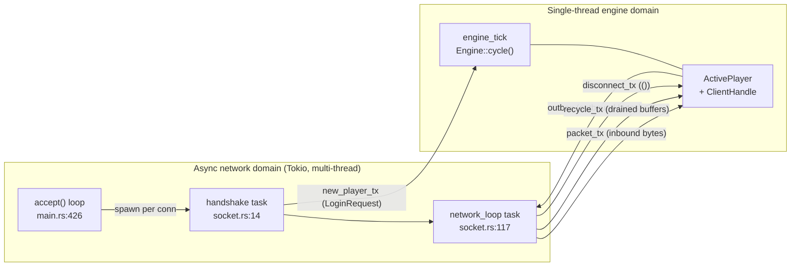
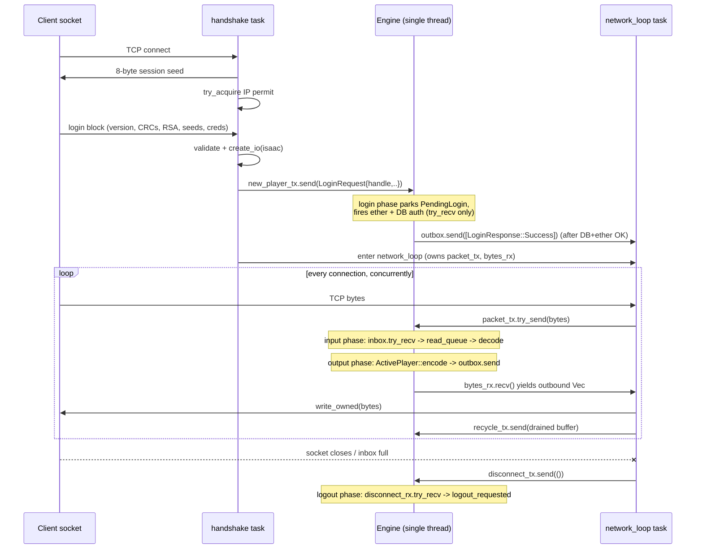
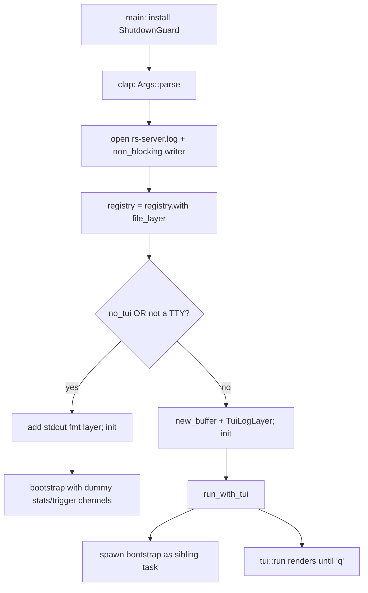
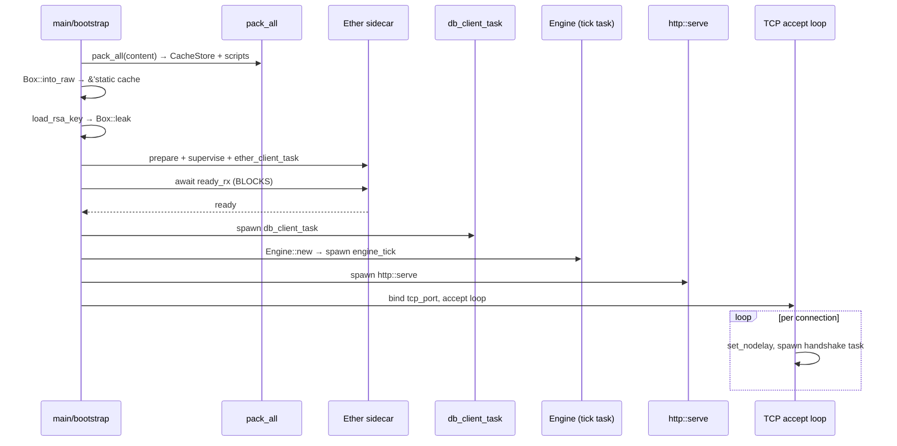
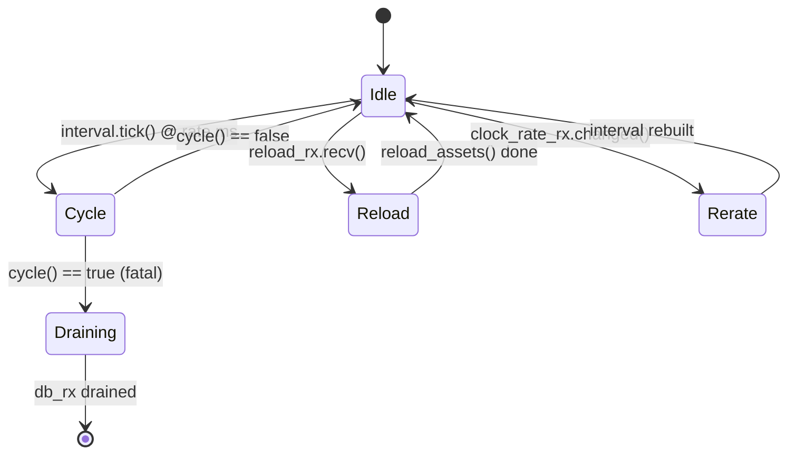
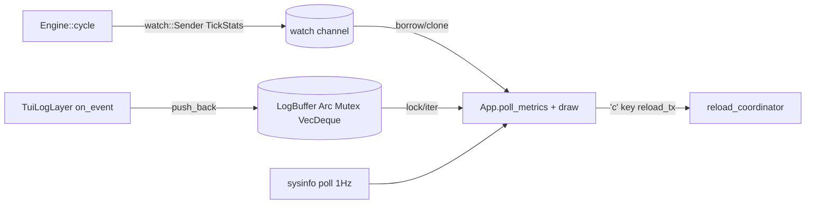
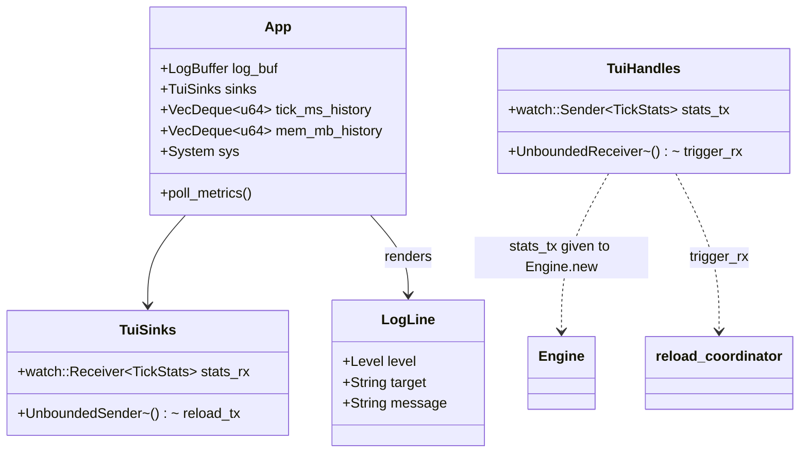
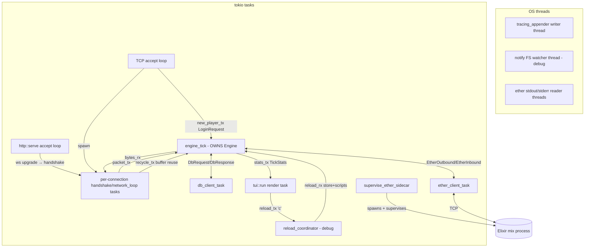

<a id="top"></a>

**[← Whitepaper index](../README.md)**  ·  [Single-file version](whitepaper-full.md)

# Part VIII · Runtime & Host

> *The async shell that hosts the single-threaded simulation.*


---

<a id="sec-24"></a>

## 24. The Async I/O Boundary & Client Lifecycle

rs-engine resolves a fundamental tension at the heart of any high-performance game server: the network is inherently
*concurrent* (hundreds or thousands of sockets, each readable or writable at unpredictable times), but the simulation
must be *deterministic and single-threaded* (one ordered tick loop, no locks on game state, no data races on the world).
The classic TypeScript reference server (LostCity/2004scape lineage) solves this with a Netty/`uWS` event loop
feeding a synchronized game queue. rs-engine solves it with a strict **channel boundary**: a multi-task Tokio runtime
owns all sockets, but the engine thread owns all game state, and the two communicate *only* through `tokio::sync::mpsc`
channels carrying owned `Vec<u8>` byte buffers. No game object is ever touched by a network task; no socket is ever
touched by the engine. This section documents that boundary end-to-end: the per-client async task model, the
`ClientHandle`/`ClientIO` split, the four channels wired by `create_io`, the read/decode and encode/write paths,
backpressure and buffer recycling, and the full connection lifecycle from `accept()` to logout.

### Architectural overview: two worlds, one channel seam

There are two execution domains:

- **The async network domain** — the Tokio multi-threaded runtime (`#[tokio::main]`, `rs-server/src/main.rs:173`). It
  runs the TCP `accept()` loop, the per-connection `handshake`/`network_loop` tasks (`rs-server/src/socket.rs`), the
  HTTP/JS-client server, and the ether/DB sidecar client tasks. Many tasks run truly in parallel across worker threads.
- **The single-threaded engine domain** — one Tokio task, `engine_tick` (`rs-server/src/main.rs:700`), which drives
  `Engine::cycle()` (`rs-engine/src/engine.rs:563`) on a 600 ms `tokio::time::interval` with `MissedTickBehavior::Skip`.
  Everything inside `cycle()` runs on a single task with exclusive `&mut Engine` access — there is no interior
  mutability over game state and no `Arc<Mutex<...>>` around the world.

The seam between them is a set of channels. The crucial design choice: **the engine never `.await`s on I/O**. Every
channel the engine touches is drained with non-blocking `try_recv()` (e.g. `new_player_rx.try_recv()` at
`rs-engine/src/phases/login.rs:42`, `inbox.try_recv()` at `rs-engine/src/active_player.rs:1687`,
`disconnect_rx.try_recv()` at `rs-engine/src/phases/logout.rs:58`) and fed with non-blocking `send()`/`try_send()`. The
engine task therefore never yields mid-tick waiting for a socket; it processes exactly what is available *right now*,
then moves on. This is what makes the tick wall-clock-bounded and deterministic, mirroring the reference server's "
process the queue as it stands at tick start" semantics.



### The handle/IO split: `ClientHandle` and `ClientIO`

The two endpoints of the boundary are two structs in `rs-engine/src/clients/client_game.rs`. `ClientHandle` (
`client_game.rs:19`) is the **engine-side** half; `ClientIO` (`client_game.rs:35`) bundles the handle together with the
**network-side** half so the socket task can be handed its endpoints.

```rust
pub struct ClientHandle {
    pub inbox: Receiver<Vec<u8>>,            // bounded (128); inbound decoded chunks
    pub outbox: UnboundedSender<Vec<u8>>,    // unbounded; outbound packets to socket
    pub recycle_rx: UnboundedReceiver<Vec<u8>>, // drained outbound buffers, returned for reuse
    pub buffer_pool: Vec<Vec<u8>>,           // per-client free-list of recycled buffers
    pub write_queue: Packet,                 // 5000-byte scratch for immediate encodes
    pub read_queue: VecDeque<u8>,            // reassembly buffer for fragmented inbound msgs
    pub pending_msg: Option<Vec<u8>>,        // one inbound chunk held back when read_queue is full
    pub isaac_encode: Isaac,                 // opcode encryption (server->client)
    pub isaac_decode: Isaac,                 // opcode decryption (client->server)
    pub disconnect_rx: Receiver<()>,         // capacity-1 disconnect signal
}
```

The deliberate asymmetry between the two channels carrying packet data is the central backpressure decision:

| Channel                           | Direction    | Type                      | Capacity                                                 | Backpressure behavior                                              |
|-----------------------------------|--------------|---------------------------|----------------------------------------------------------|--------------------------------------------------------------------|
| `inbox` / `packet_tx`             | net → engine | `mpsc::channel(128)`      | bounded, `INBOX_CAPACITY = 128` (`client_game.rs:9`)     | `try_send` fails when full → client disconnected                   |
| `outbox` / `bytes_rx`             | engine → net | `mpsc::unbounded_channel` | unbounded                                                | engine never blocks; bytes queue in memory until the socket drains |
| `recycle_tx` / `recycle_rx`       | net → engine | `mpsc::unbounded_channel` | unbounded                                                | best-effort buffer return; loss is harmless                        |
| `disconnect_tx` / `disconnect_rx` | net → engine | `mpsc::channel(1)`        | bounded, `DISCONNECT_CAPACITY = 1` (`client_game.rs:12`) | exactly one signal ever sent                                       |

The rationale is precise. Inbound is **bounded**: a flooding/malicious client cannot make the engine accumulate
unbounded memory; once 128 inbound chunks back up (because the engine only drains a rate-limited number per tick — see
decode), the network task's `try_send` fails and the client is forcibly disconnected (`socket.rs:129`). Outbound is *
*unbounded**: the engine produces output inside the single-threaded tick and *must not block* — blocking there would
stall every other player. If a client's socket is slow, its outbound `Vec<u8>`s simply accumulate in the channel and are
drained by that client's `network_loop` as the OS send buffer permits; a pathologically slow client only grows its own
queue, never the engine's tick time.

`create_io` (`client_game.rs:58`) constructs all four channel pairs and returns the `ClientIO`:

```rust
pub fn create_io(isaac: IsaacPair) -> ClientIO {
    let (packet_tx, packet_rx) = mpsc::channel(INBOX_CAPACITY);   // 128
    let (bytes_tx, bytes_rx) = mpsc::unbounded_channel();
    let (recycle_tx, recycle_rx) = mpsc::unbounded_channel();
    let (disconnect_tx, disconnect_rx) = mpsc::channel(DISCONNECT_CAPACITY); // 1
    ClientIO {
        handle: ClientHandle {
            inbox: packet_rx,
            outbox: bytes_tx,
            recycle_rx,
            buffer_pool: Vec::new(),
            write_queue: Packet::new(5000),
            read_queue: VecDeque::new(),
            pending_msg: None,
            isaac_encode: isaac.encode,
            isaac_decode: isaac.decode,
            disconnect_rx
        },
        packet_tx,
        bytes_rx,
        recycle_tx,
        disconnect_tx,
    }
}
```

Note the naming inversion that wires the seam: the engine's `inbox` is the *receiver* of `packet_tx`; the engine's
`outbox` is the *sender* into `bytes_rx`. After construction the `handle` travels into the engine (inside a
`LoginRequest`), while `packet_tx`, `bytes_rx`, `recycle_tx`, `disconnect_tx` stay with the socket task. The ISAAC
cipher pair is moved in at this point because it was negotiated during the login handshake and must be shared
identically by the encode path (server→client) and decode path (client→server).

### Connection acceptance and the handshake task

The TCP accept loop (`rs-server/src/main.rs:426`) is a thin dispatcher. For each accepted stream it sets `TCP_NODELAY` (
`set_nodelay(true)`, `main.rs:428`) — critical for a tick-based protocol, since Nagle's algorithm would otherwise
coalesce and delay the small per-tick packet bursts — clones the cheap `ServerIO` (a `Clone` struct of two `&'static`
references plus the `new_player_tx` sender, `main.rs:167`) and the `ConnectionGuard`, then spawns a dedicated task
running `handshake(connection)`:

```rust
loop {
let (stream, addr) = listener.accept().await ?;
stream.set_nodelay(true) ?;
let server_state = server_state.clone();
let guard = guard.clone();
tokio::spawn(async move {
let connection = Socket::from_tcp(stream, addr, server_state, args.version, guard);
if let Err(e) = handshake(connection).await { info ! ("... closed: {}", e); }
});
}
```

Each connection is thus **one independent Tokio task** owning its `Socket` (an enum over `Tcp(TcpStream)` or boxed
`WebSocket(...)`, `main.rs:742`). The boxing of the WebSocket variant is a documented memory micro-optimization: an
unboxed `WebSocketStream` makes the enum 328 bytes; boxing shrinks the variant to 8 bytes at the cost of one heap
allocation only taken on the WS path (`main.rs:744-747`). The same `Socket` abstraction therefore transparently serves
both the native TCP RS2 client and the in-browser JS/WebSocket client; the engine never knows or cares which transport a
player is on.

`handshake` (`socket.rs:14`) performs the synchronous-feeling but `.await`-driven RS2 login negotiation before any
channels exist:

1. Send an 8-byte server session seed (`socket.rs:16-18`).
2. Acquire a per-IP connection permit via `ConnectionGuard::try_acquire` (`socket.rs:20`); if the IP is at its limit (
   `MAX_CONNECTIONS_PER_IP` = 1 release / 2 debug, `main.rs:43-45`), reply `TooManyConnections` and bail. The permit is
   an RAII `ConnectionPermit` whose `Drop` (`main.rs:78`) decrements the per-IP count, so connection accounting is
   automatic even on panic.
3. Read the login block, validate `LoginType`, payload length, client version, and the 9 archive CRCs against
   `cache.crctable` (`socket.rs:34-60`), rejecting with the appropriate `LoginResponse`.
4. RSA-decrypt the encrypted block (`buf.rsadec(RsaFrame::Byte, ...)`, `socket.rs:61`), check the magic byte (`== 10`),
   read the 4 ISAAC seed words, the uid, and the Base37 username/password as `gjstr` strings (`socket.rs:67-82`).
5. Derive the ISAAC pair from the client seeds (`IsaacPair::from_client_seeds`, `socket.rs:84`) and call `create_io` (
   `socket.rs:85`).

Only *after* full validation does the task hand the engine half across the boundary. It sends a
`LoginRequest { handle, username, password, low_memory, remote_addr }` (`rs-engine/src/engine.rs:100`) over
`server_io.new_player_tx` (`socket.rs:93-106`). This is the *one* place a `ClientHandle` crosses into the engine. If
that send fails (engine receiver dropped), the task bails. Otherwise it transitions into the steady-state
`network_loop`, retaining `packet_tx`, `bytes_rx`, `recycle_tx`, and `&disconnect_tx`.



### Login completion across async services

The `LoginRequest` does not become a player immediately. The login phase (`rs-engine/src/phases/login.rs:41`) drains
`new_player_rx` with `try_recv`, and for each request it rejects fast-fail cases inline (DB not ready →
`LoginServerOffline`; already online via `find_pid_by_user37` → `AlreadyLoggedIn`) by sending a single response byte
directly on `request.handle.outbox` (`login.rs:48,56`). For viable logins it fires two asynchronous side requests —
`EtherOutbound::LoginCheck` (cross-world uniqueness) and `DbRequest::Authenticate` — then parks the request as a
`PendingLogin` (`login.rs:69`, struct at `engine.rs:195`) holding the `ClientHandle`, the arrival `clock`, and the
accumulating flags `ether_allowed`, `auth_ok`, and `profile: Option<Option<PlayerProfile>>`.

Responses arrive on later ticks via the ether phase (`phases/ether.rs`) and saves phase (`phases/saves.rs:35`), each
setting one flag and calling `try_complete_login` (`engine.rs:2248`). Completion requires `ether_allowed && auth_ok`; if
those hold but `profile` is unfetched it issues a `DbRequest::Load` and returns, completing on the subsequent
`LoadResponse`. Only when all three prerequisites are satisfied does `accept_login` (`engine.rs:2139`) run: it checks
world capacity (≥2000 → `WorldFull`), allocates a `pid`, sends `LoginResponse::Success` on the outbox, and finally moves
the `handle` out of the request into a freshly constructed `ActivePlayer` (`engine.rs:2161`). A pending login that
lingers past `LOGIN_TIMEOUT_TICKS = 10` (`login.rs:10`) is swept out with `CouldNotComplete` (`login.rs:89-97`). This
staged, channel-driven state machine is how rs-engine keeps even *login* — an inherently I/O-bound, multi-service
operation — off the engine's hot path: every step is a non-blocking `try_recv` drain, never an `.await`.

### `ActivePlayer` ownership of the handle

Once accepted, the handle lives inside `ActivePlayer` as `handle: Box<ClientHandle>` (
`rs-engine/src/active_player.rs:130`). The `Box` keeps `ActivePlayer` itself compact in the `Vec<Option<ActivePlayer>>`
player slab while the handle (with its 5000-byte `write_queue` and channel endpoints) sits behind one indirection. From
this point the engine treats the connection purely as the handle's four channels plus the two `VecDeque`/`Packet`
reassembly buffers; the socket itself is invisible.

### Inbound path: reassembly, rate-limiting, ISAAC decode

The inbound path runs in the **input phase** (`phases/input.rs:78` calls `active.decode()`), within a per-player
`catch_unwind` so a malformed packet that panics a handler emergency-removes only that one player (`input.rs:57-62`).

`decode` (`active_player.rs:1681`) has two stages. **Reassembly:** it pulls chunks — first any `pending_msg` held from
last tick, then `inbox.try_recv()` in a loop — and appends each to the `read_queue: VecDeque<u8>`, but only while
`read_queue.len() + msg.len() <= 5000`. The first chunk that would overflow is stashed back into `pending_msg` and the
drain stops (`active_player.rs:1692-1696`). This is the inbound counterpart to the bounded `inbox`: it caps a single
client's in-engine inbound memory at ~5000 bytes per tick and naturally throttles a flooder, since unconsumed chunks
remain in the 128-deep `inbox` and eventually trigger the `try_send` disconnect on the network side.

**Dispatch:** `decode` then loops `read()` until any of three per-category counters reaches its cap or the queue
empties (`active_player.rs:1703-1717`). The categories — `client_limit`, `user_limit`, `restricted_limit` — are reset to
0 each tick (`active_player.rs:1699-1701`) and compared against
`ClientProtCategory::{ClientEvent,UserEvent,RestrictedEvent}` thresholds. This faithfully reproduces the reference
server's per-tick packet-class budgets, preventing a client from monopolizing a tick with one expensive message class
while leaving slower-cadence classes starved.

`read` (`active_player.rs:1738`) decodes one framed message from the `read_queue`:

```
opcode_byte = read_queue.pop_front() - isaac_decode.next_int() as u8   // ISAAC opcode decryption
prot        = ClientProt::try_from(opcode)?                            // unknown -> warn + bail
len         = match prot.info().frame { Fixed(n) => n,
              VarByte => pop 1 byte, VarShort => pop 2 bytes (hi<<8 | lo) }
if read_queue.len() < len { return None }   // incomplete: wait for more bytes next tick
data        = read_queue.drain(..len).collect::<Vec<u8>>()
```

The opcode is decrypted by subtracting the next ISAAC keystream word (`wrapping_sub`, `active_player.rs:1745`) — the
inverse of the server's additive encode — keeping the wire byte-identical to the original protocol. The frame table
comes from `prot.info()`; the three frame kinds (`Fixed`, `VarByte`, `VarShort`) match the RS2 length-prefix conventions
exactly. An incomplete message (fewer bytes than `len` available) returns `None` and leaves the partial bytes in
`read_queue` for the next tick — the explicit, correct handling of TCP stream fragmentation. The decoded `data` is
wrapped in a `Packet` and dispatched through the large `match prot { ... }` to the matching `decode().handle(self)` (
`active_player.rs:1776+`), and on success the appropriate category counter is incremented.

### Outbound path: buffered vs immediate, ISAAC encode, the output flush

Outbound messages flow through `ActivePlayer::write<M: ServerProtMessage>` (`active_player.rs:197`), which branches on
the message type's compile-time `M::PRIORITY` (`ServerProtPriority`):

- **`Buffered`** → `queue_buffered` (`active_player.rs:221`): encode opcode + frame header + payload into a fresh
  `Packet`, length-patch via `psize1`/`psize2` for var frames, and push onto `self.buffered: Vec<Packet>`. These are
  *not* sent yet — they accumulate through the whole tick and flush at the end, preserving the reference server's "build
  the whole frame then ship it" ordering.
- **`Immediate`** → `write_immediate` (`active_player.rs:272`): encode into the shared, reused `handle.write_queue` (the
  5000-byte scratch `Packet`), encrypt the opcode in place (`(M::PROT + isaac_encode.next_int()) as u8`,
  `active_player.rs:284`), then copy the encoded bytes into a recycled `Vec<u8>` and `outbox.send` it right away.

Both paths drop any message whose `len > 5000` silently (`active_player.rs:227,279`).

The buffered packets are flushed in the **output phase**. `Engine::outputs` (`phases/output.rs:38`) iterates all pids
under `catch_unwind`, and for each `process_output` (`output.rs:62`) takes the `ActivePlayer` out of its slot, runs
player-info and npc-info encoding, map/zone/inventory/stat updates, and finally calls `active.encode()` (
`output.rs:105`) before restoring the slot. `encode` (`active_player.rs:330`) first emits any modal-interface open/close
packets implied by changed `modal_*` state, then calls `write_buffered` (`active_player.rs:252`):

```rust
fn write_buffered(&mut self) {
    let handle = &mut self.handle;
    for mut buf in self.buffered.drain(..) {
        buf.data[0] = (buf.data[0] as u32 + handle.isaac_encode.next_int()) as u8; // encrypt opcode
        let _ = handle.outbox.send(buf.data); // move the Vec into the channel; never blocks
    }
}
```

Each queued packet's opcode byte is ISAAC-encrypted at flush time (so the keystream advances in exact send order,
matching the client's decrypt order), and the packet's backing `Vec<u8>` is *moved* into the unbounded `outbox` — no
copy, no allocation, no blocking. The `let _ =` swallows send errors: a closed `outbox` just means the client is gone,
which the logout phase will reconcile.

### Buffer recycling: eliminating per-message allocation

A naive immediate-send would allocate a fresh `Vec<u8>` per message (the old `to_vec()` pattern). `write_immediate`
instead maintains a per-client free-list. After the TCP `network_loop` finishes writing an outbound buffer it returns
the now-drained `Vec<u8>` to the engine via `recycle_tx` (`socket.rs:145-146`). On the next immediate send,
`write_immediate` drains `recycle_rx` into `handle.buffer_pool` (capped at `OUTPUT_POOL_CAP = 8`,
`active_player.rs:116,299-303`), pops a recycled buffer (or `Vec::new()` if the pool is empty), `clear()`s it, copies
the encoded bytes from `write_queue`, and sends it (`active_player.rs:304-307`). Buffers beyond the cap are simply
dropped (freed), bounding per-client memory if the socket returns buffers faster than they are reused.

The transport asymmetry here is deliberate and documented (`socket.rs:142-147`): `write_owned` returns `Ok(Some(vec))`
for TCP (the slice was written, so the `Vec` is intact and recyclable) but `Ok(None)` for WebSocket (the buffer is
consumed into a `Message::Binary`/`Bytes`, so there is nothing to return). The recycle loop therefore only fires on the
TCP path; WebSocket clients simply allocate per message, which is acceptable because the JS client is the minority
transport and WS framing already allocates.

### Disconnect detection and logout

Disconnects originate in the network domain and surface to the engine through `disconnect_tx` (capacity 1). The
`network_loop` (`socket.rs:117`) is a `tokio::select!` over two arms:

```rust
tokio::select! {
    result = client.read() => match result {
        Ok(Some(bytes)) if !bytes.is_empty() =>
            if packet_tx.try_send(bytes).is_err() {       // inbox full or engine gone
                disconnect_tx.send(()).await?; bail!("inbox full or closed");
            },
        Ok(None) | Err(_) => { disconnect_tx.send(()).await?; bail!("disconnected"); }
        _ => {}
    },
    msg = bytes_rx.recv() => match msg {
        Some(bytes) => if let Some(returned) = client.write_owned(bytes).await? {
            let _ = recycle_tx.send(returned);            // recycle drained TCP buffer
        },
        None => bail!("engine closed write channel"),
    },
}
```

This single task is simultaneously the reader (socket → `packet_tx`) and the writer (`bytes_rx` → socket) for one
client, multiplexed by `select!`. A clean close (`Ok(None)`), a read error, or a *full inbox* (`try_send` failure — the
backpressure disconnect) all send a single `()` on `disconnect_tx` and bail out of the loop, ending the task. The engine
observes this in the **logout phase** (`phases/logout.rs:50`): for each active player it does `disconnect_rx.try_recv()`
and, on success, sets `logout_requested = true` (`logout.rs:58`). It will not interrupt a protected/in-combat player —
if `logout_prevented_until` is in the future it shows the prevention message and clears the request (`logout.rs:64-71`);
otherwise it calls `active.logout()` which sends the `Logout` server packet and sets `logout_sent` (
`active_player.rs:779`). A player with `logout_sent` is collected into `removals`, runs its `Logout` RuneScript trigger,
is persisted via `DbRequest::Save`, announced to ether via `EtherOutbound::PlayerLogout`, and finally dropped from the
world by `remove_player` (`logout.rs:151`, `engine.rs:1745`).

Dropping the `ActivePlayer` drops its `Box<ClientHandle>`, which drops `outbox` (the last `UnboundedSender` into
`bytes_rx`). That closure causes the network task's `bytes_rx.recv()` to yield `None` (`socket.rs:149`) and the task to
bail — so even if the network side initiated nothing, the engine-side teardown deterministically tears down the socket
task. The disconnect handshake is thus bidirectional and self-healing: net-initiated disconnects flow through
`disconnect_tx`; engine-initiated removals flow through the dropped `outbox`. The `ConnectionPermit`'s `Drop` then
releases the per-IP slot.

The same boundary also underwrites *fault isolation*. Both the input and output phases wrap their per-player loops in
`catch_unwind` (`phases/input.rs:50`, `phases/output.rs:42`), and a panic emergency-removes just the offending player (
`emergency_remove_player`, `engine.rs:1996`) — possible only because the release profile keeps `panic=unwind` (see
memory: *Release panic=unwind*). A whole-tick fatal panic in `cycle` triggers emergency save+removal of every player (
`engine.rs:597-604`). Because all player state, including the network handle, is owned by the engine task and reachable
from `&mut Engine`, the engine can synchronously persist and evict a misbehaving client without coordinating with any
network thread — the channel boundary guarantees no network task is concurrently mutating that player.

### Why this design wins

The whole architecture is an exercise in *moving concurrency to the edges*. The hard, lock-free, deterministic core
stays single-threaded and never `.await`s; all the inherently asynchronous work — accepting sockets, RSA/handshake
negotiation, byte read/write, DB and ether RPC — is pushed into independent Tokio tasks that communicate only by handing
the engine *owned byte buffers* through channels. Bounded inbound + unbounded outbound is the precise backpressure
policy a tick server wants: it caps adversarial inbound memory and forces fast disconnect of floods, while guaranteeing
the engine can always dump a tick's output without blocking on any one slow client. Buffer recycling and the shared
`write_queue` strip per-message allocation off the hot send path. ISAAC opcode crypto is applied at the exact
send/receive ordering points to keep the wire byte-identical to the original RS2 protocol. The result improves on the TS
reference (which serializes network and game work through a synchronized queue and a GC heap) by giving Rust-level
control over allocation, a strict single-writer model for game state, and per-player fault isolation — at the cost of a
slightly more elaborate four-channel handshake per connection.

<sub>[↑ Back to top](#top)</sub>


---

<a id="sec-25"></a>

## 25. The Server Binary — Bootstrap, HTTP & TUI

`rs-server` is the executable crate that turns the `rs-engine` library into a running game world. It is deliberately
thin: it owns no game logic. Its job is to (1) parse configuration, (2) build the immutable cache and script content, (

3) construct the `Engine`, (4) wire up the four long-lived background services the engine talks to (network accept
   loops, the Postgres DB client, the Elixir "ether" sidecar, and the HTTP web service), (5) drive `Engine::cycle()` on
   a
   precise 600 ms cadence, and (6) present an operator-facing dashboard. Everything in the binary is asynchronous tokio
   plumbing arranged around one strictly single-threaded mutable core — the `Engine` — which is reached only from a
   single
   task.

This mirrors the LostCity/2004scape lineage architecturally (one logical tick loop, a web endpoint that hands the client
the JS5 cache and config archives, a login handshake with RSA + ISAAC), but rebuilds the host process in Rust with
explicit task topology, zero-copy cache serving via `Arc<[u8]>`, and a `'static`-leaked engine that eliminates
per-access synchronization.

The four files covered here:

| File                                            | Lines      | Responsibility                                                                                                                                                                  |
|-------------------------------------------------|------------|---------------------------------------------------------------------------------------------------------------------------------------------------------------------------------|
| `rs-server/src/main.rs`                         | ~853       | CLI parsing, tracing setup, bootstrap sequence, task spawning, the tick scheduler, the ether sidecar supervisor, hot-reload coordinator, and the `Socket` transport abstraction |
| `rs-server/src/socket.rs`                       | ~156       | The login handshake (service byte, version/CRC/RSA/ISAAC validation) and the per-connection `network_loop` bridging the socket to engine channels                               |
| `rs-server/src/http.rs`                         | ~492       | The hand-rolled HTTP/1.1 service serving the web client, cache archives, and static assets; WebSocket upgrade detection                                                         |
| `rs-server/src/tui/mod.rs` + `tui/log_layer.rs` | ~855 + ~90 | The ratatui terminal dashboard and the `tracing` layer that buffers log lines into it                                                                                           |

---

### 25.1 Process Entry & Tracing Setup

`#[tokio::main] async fn main()` (`main.rs:173`) is the entry point. Its first act is to install an RAII
`ShutdownGuard` (`main.rs:175`, `89–97`) whose `Drop` impl runs three cleanup steps no matter how `main` exits: it kills
the ether sidecar process (`shutdown_sidecar`), disables crossterm raw mode, and leaves the alternate screen. Placing
this as the *first* local binding guarantees it is the *last* thing dropped, so terminal state is always restored and
the child Elixir process is never orphaned even on a panic-driven unwind.

CLI parsing is via `clap`'s derive macro on `struct Args` (`main.rs:109–164`). The argument surface is the server's
entire operational configuration:

| Arg                                 | Default                    | Purpose                                                                       |
|-------------------------------------|----------------------------|-------------------------------------------------------------------------------|
| `--version`                         | `225`                      | Protocol revision; checked against the client's reported version during login |
| `--host`                            | `0.0.0.0`                  | Bind address for both TCP game and HTTP                                       |
| `--http-port`                       | `8070 + node_id`           | Web/client port (8080 for node 10)                                            |
| `--tcp-port`                        | `43584 + node_id`          | Game port (43594 for node 10 — the canonical RS port)                         |
| `--private-key`                     | `keys/private.pem`         | RSA private key (PEM) for the login block                                     |
| `--members` / `--client-pathfinder` | `true`                     | World flags passed to `Engine::new`                                           |
| `--no-tui`                          | `false`                    | Force headless stdout logging                                                 |
| `--verify`                          | `true`                     | Validate packed cache byte-identity during `pack_all`                         |
| `--node-id`                         | `10`                       | World node (10 = world 1); offsets all derived ports                          |
| `--ether-port`                      | `5000 + node_id`           | Ether sidecar TCP port (5010 for node 10)                                     |
| `--db-host/port/name/user/pass`     | localhost:5432/postgres    | Postgres connection                                                           |
| `--cluster`                         | `""`                       | Comma-separated peer node list for multi-world                                |
| `--pepper`                          | `localhost`                | Server-side pepper for password hashing                                       |

The derived-port convention (`8070 + node_id`, `43584 + node_id`, `5000 + node_id`, `main.rs:274–275`, `300`) lets
multiple world nodes coexist on one host with only `--node-id` differing — `(args.node_id - 10)` becomes the `portoff`
handed to the web client so it computes the matching game port (`main.rs:408`).

#### Tracing topology

Three log destinations are composed via `tracing_subscriber::registry()`:

1. **File layer** (`main.rs:195–205`) — always installed. Opens `rs-server.log` in the cwd with `truncate(true)` (one
   file per run, no rotation, "log volume per session is bounded"). The writer is wrapped in
   `tracing_appender::non_blocking`, and the returned `_log_guard` is held for the life of `main` so the background
   drain thread stays alive until shutdown.
2. **Either** a plain `stdout` fmt layer (`main.rs:216–219`, headless) **or** a `TuiLogLayer` (`main.rs:234`) feeding
   the dashboard — never both.

The shared `EnvFilter` (`make_filter`, `main.rs:181–189`) honors `RUST_LOG` if present, else defaults to `info` globally
but downgrades `rs_engine::player_save` and `rs_protocol` to `warn` — these are the two chattiest targets and would
otherwise "flood during stress testing."

#### TUI auto-detection

Whether the dashboard runs is `!args.no_tui && std::io::stdout().is_terminal()` (`main.rs:212–213`). The `is_terminal()`
check is the key robustness feature: when stdout is piped, redirected to a file, or running under IntelliJ's Run tool
window (which doesn't interpret raw-mode/cursor escapes), the process silently falls back to headless logging rather
than emitting garbage escape sequences. If the user *wanted* the TUI but isn't on a real TTY, a one-line `info!`
explains the fallback (`main.rs:222–226`).



---

### 25.2 The Bootstrap Sequence

Both the headless and TUI paths converge on `async fn bootstrap` (`main.rs:269`), which runs the full startup sequence
and then *becomes* the TCP accept loop (it never returns under normal operation). The TUI path (`run_with_tui`,
`main.rs:244`) spawns `bootstrap` as a detached sibling task and runs the render loop in the foreground; when the user
presses `q`, it aborts the bootstrap task and shuts down the sidecar (`main.rs:262–264`). The headless path (
`main.rs:229–231`) calls `bootstrap` directly with throwaway `stats_tx`/`trigger_rx` channels whose receivers are
dropped — the engine still publishes `TickStats`, they simply have no consumer.

The numbered phases of `bootstrap`:

**1. Pack content & leak the cache (`main.rs:284–289`).** `rs_pack::pack_all(content, content/pack, verify)` returns
`(Box<CacheStore>, ScriptProvider)` — it builds the JS5 cache archives and compiles RuneScript from source. The
`CacheStore` is then leaked to `'static` via a deliberate two-step:

```rust
let cache_ptr_val = Box::into_raw(store) as usize;
let cache: & 'static CacheStore = unsafe { & * (cache_ptr_val as * const CacheStore) };
```

The raw address is preserved as a `usize` (`cache_ptr_val`) precisely because it must later be handed to `Engine::new`
as a `*mut CacheStore` for in-place hot-reload (`reload_assets` does `drop_in_place` + `write` through that pointer,
`engine.rs:758–760`). The `&'static` shared reference and the `*mut` are deliberate aliases of the same allocation; the
safety contract is that the `*mut` is only written during `reload_assets`, which runs exclusively on the single tick
task. Leaking (rather than `Arc`) means every cache read across the whole process — the HTTP file server, the login CRC
check, the engine — is a bare pointer dereference with no refcount traffic.

**2. RSA key (`main.rs:291–294`).** `load_rsa_key` is parsed once and `Box::leak`'d to `'static`; the login handshake
decrypts the RSA-enciphered login block with it.

**3. Ether sidecar (`main.rs:296`).** The server always:

- creates two unbounded channels (`EtherOutbound` out, `EtherInbound` in);
- runs `prepare_ether_sidecar` synchronously — a blocking `mix deps.get` / `ecto.create` / `ecto.migrate` against the
  `rs-ether` Elixir project, with DB credentials threaded through environment variables (`main.rs:441–475`);
- spawns `supervise_ether_sidecar` (a restart supervisor, §25.5);
- spawns `ether_client_task` with a `oneshot` `ready_tx`, and **blocks on `ready_rx.await`** (`main.rs:333`). Startup
  intentionally stalls until the cross-world transport is connected, so no player can log in before world-state
  messaging is live.

**4. DB client (`main.rs:341–357`).** A `DbRequest`/`DbResponse` channel pair is created and `db_client_task` is spawned
with the Postgres connection params plus `pepper`. The request sender goes into the engine; the response receiver too (
the engine drains saves during the cycle's `saves` phase). Note `db_tx` is `Some(req_tx)` — the engine nulls it on fatal
shutdown to signal the DB task to drain.

**5. Engine construction (`main.rs:359–380`).** Three more unbounded channels are created — `new_player` (login requests
from accept loop → engine), `reload` (packed assets → tick task), and `reload_world` (engine-initiated reload). Then:

```rust
let (engine, clock_rate_rx) = Engine::new(
members, client_pathfinder, new_player_rx, scripts,
cache, cache_ptr_val as * mut CacheStore, stats_tx,
reload_world_tx, node_id, ether_tx, ether_rx, db_tx, db_rx,
);
tokio::spawn(engine_tick(engine, reload_rx, clock_rate_rx));
```

`Engine::new` (`engine.rs:459`) loads the game map, registers VM opcodes, and spawns all static NPCs, returning the
engine plus a `watch::Receiver<u64>` carrying the clock rate (initialized to 600, `engine.rs:479`). The engine is *moved
into* the `engine_tick` task — it lives nowhere else, which is what makes the `unsafe impl Send for Engine` (
`engine.rs:420`) sound: it crosses the thread boundary exactly once (into the task) and is never shared.

**6. Hot-reload coordinator (`main.rs:382–391`).** In debug builds only, `reload_coordinator` is spawned to watch
`content/` and accept manual reload triggers; in release the `trigger_rx` is simply dropped, compiling the feature out (
§25.5).

**7. HTTP service (`main.rs:403–412`).** `http::serve` is spawned with the cache, node/port-offset strings, members
flag, a clone of `ServerIO`, and the shared `ConnectionGuard`.

**8. TCP accept loop (`main.rs:423–438`).** Binds `host:tcp_port`, then loops `listener.accept()`. Each connection gets
`set_nodelay(true)` (Nagle off — latency over throughput for a 600 ms tick game) and is spawned into its own task
running `handshake(Socket::from_tcp(...))`.



---

### 25.3 The Tick Scheduler — `engine_tick`

`async fn engine_tick` (`main.rs:696`) is the heartbeat. It owns the `Engine` by value and drives it with a
`tokio::time::interval` whose period starts at 600 ms and uses `MissedTickBehavior::Skip` (`main.rs:701–702`). `Skip` is
the correct choice for a game tick: if a cycle overruns its budget, the scheduler does *not* try to "catch up" by firing
back-to-back ticks (which would compound the lag and desync clients) — it simply waits for the next aligned tick
boundary, dropping the missed one.

The loop is a three-armed `tokio::select!`:

| Arm                       | Trigger                 | Action                                                                  |
|---------------------------|-------------------------|-------------------------------------------------------------------------|
| `interval.tick()`         | 600 ms elapsed          | Call `engine.cycle()`; on `true` (fatal panic), begin graceful shutdown |
| `reload_rx.recv()`        | hot-reload result ready | Swap `CacheStore` + scripts between ticks via `reload_assets`           |
| `clock_rate_rx.changed()` | clock rate changed      | Rebuild the `interval` at the new period                                |

**Fatal-shutdown path (`main.rs:706–716`).** `cycle()` returns `bool`; `true` means a phase panicked fatally and all
players have been emergency-removed. The scheduler then nulls `engine.ether_tx` and `engine.db_tx` (closing the outbound
channels so the DB and ether tasks observe the close and drain), logs, and `await`s `engine.db_rx.recv()` until it
returns `None` — i.e. it blocks until every pending database save has flushed before returning. This guarantees no
player save is lost even when the world is crashing.

**Hot-reload arm (`main.rs:718–723`).** When a fresh `(Box<CacheStore>, ScriptProvider)` arrives, the swap is performed
*inside* `with_engine`, which binds the engine into the VM's thread-local context for the duration. A raw
`&raw mut engine` pointer is taken and re-dereferenced inside the closure to satisfy the borrow checker while
`with_engine` simultaneously borrows the engine. The swap happens strictly between ticks, so the engine never observes a
torn cache.

**Clock-rate arm (`main.rs:724–729`).** The engine can change game speed at runtime (e.g. the `::speed` admin cheat
calls `engine().set_clock_rate(ms)`, which sends through `clock_rate_tx`, `engine.rs:675–676`). The scheduler watches
the `watch` channel and rebuilds its `interval` to the new millisecond period — the canonical mechanism for "double tick
speed" debugging without touching the engine's internal clock arithmetic.



The split between the *external* scheduler (this task, owning wall-clock cadence) and the engine's *internal*
`clock: u64` counter (incremented inside `cycle`, `engine.rs:595`) is a clean separation: the engine is a pure state
machine that advances one logical tick per `cycle()` call and is wholly agnostic to real time, which keeps it
deterministic and trivially testable, while the scheduler owns all the messy timing/`watch`/`select!` concerns.

---

### 25.4 The Transport Layer — `Socket`, Handshake, `network_loop`

#### The `Socket` abstraction (`main.rs:734–853`)

`Socket` unifies raw TCP and WebSocket transports behind one async interface (`read`, `write`, `write_owned`, `flush`,
`close`). The variant enum is size-optimized:

```rust
enum SocketType {
    Tcp(TcpStream),
    // without box, the enum becomes 328 bytes
    // so we reduce the size of WebSocket to 8 bytes
    WebSocket(Box<WebSocketStream<TcpStream>>),
}
```

The `WebSocketStream` is boxed deliberately (`main.rs:744–747`): a bare `WebSocketStream` would balloon the enum to 328
bytes (the variant size is dominated by the WS state), so it is heap-boxed to shrink that variant to a pointer (8
bytes). Since the vast majority of game traffic is the lighter `Tcp` variant, this trades one extra allocation on the
rarer WebSocket path for a much smaller, cache-friendlier `Socket` everywhere — a representative example of the
codebase's memory-layout discipline.

`read()` for TCP allocates a 512-byte buffer per call and truncates to bytes read (`main.rs:786–793`); for WebSocket it
maps `Message::Binary` to bytes, `Close`/`None` to EOF, and errors through. `write_owned()` (`main.rs:817–828`) is the
buffer-recycling write: for TCP it writes the slice and returns the `Vec` so the caller can recycle it; for WebSocket it
must copy into a `Bytes` and returns `None` (the buffer is consumed). This asymmetry is what powers the zero-allocation
outbound path on the dominant TCP transport (see `network_loop` below).

#### Login handshake (`socket.rs:14–114`)

`handshake` is the protocol-faithful login flow. The byte-level sequence:

1. **Server seed.** Write an 8-byte packet: two random ints (`p4`/`p4`) seeding the session (`socket.rs:15–18`).
2. **Connection limit.** `guard.try_acquire(ip)` — if the per-IP cap is hit, send `LoginResponse::TooManyConnections`
   and bail. The cap is `1` in release, `2` in debug (`main.rs:42–45`) to allow local two-client testing. The returned
   `ConnectionPermit` is RAII (its `Drop`, `main.rs:78–87`, decrements the count and removes the map entry at zero) and
   is held until `network_loop` ends (`socket.rs:108`).
3. **Login type.** Read service byte → `LoginType::try_from`. `New = 16`, `Reconnect = 18` (`login.rs:5–10`).
4. **Length + version.** Validate the declared payload length matches remaining bytes (else `Rejected`), then the client
   version against `args.version` (else `RuneScapeUpdated`) — exact wire fidelity with the original 225 client.
5. **CRC table.** Read 9 archive CRCs and verify every one is in `cache.crctable` (else `RuneScapeUpdated`,
   `socket.rs:48–60`). This is what forces a client with a stale cache to re-download.
6. **RSA block.** `buf.rsadec(RsaFrame::Byte, rsa)` decrypts the enciphered tail, then checks the magic byte `== 10` (
   `socket.rs:61–66`).
7. **ISAAC seeds + credentials.** Read four session seeds, a uid, then `username` (≤12) and `password` (≤20) as
   length-prefixed strings, with bounds enforced (`InvalidCredentials` on violation).
8. **Cipher + IO.** `IsaacPair::from_client_seeds(&seed)` derives the encode/decode ISAAC ciphers; `create_io` builds
   the `ClientIO` bundle (the client handle plus packet/bytes/recycle/disconnect channels).
9. **Enqueue login.** A `LoginRequest { handle, username, password, low_memory, remote_addr }` is sent on
   `new_player_tx` into the engine's `logins` phase. Then control passes to `network_loop`.

| Stage                 | Reject response      | Source            |
|-----------------------|----------------------|-------------------|
| IP cap                | `TooManyConnections` | `socket.rs:21–25` |
| payload length        | `Rejected`           | `socket.rs:37–40` |
| version mismatch      | `RuneScapeUpdated`   | `socket.rs:42–45` |
| CRC mismatch          | `RuneScapeUpdated`   | `socket.rs:49–60` |
| RSA magic ≠ 10        | `Rejected`           | `socket.rs:63–66` |
| bad username/password | `InvalidCredentials` | `socket.rs:70–82` |

#### The per-connection pump (`socket.rs:117–155`)

`network_loop` is a two-armed `select!` bridging the socket and the engine's per-client channels:

- **Inbound:** `client.read()` → `packet_tx.try_send(bytes)`. A *non-blocking* `try_send` into a bounded inbox (
  capacity = `INBOX_CAPACITY`); if it's full or closed, the loop sends a disconnect signal and bails — backpressure
  protection so a flooding client cannot grow the queue unbounded.
- **Outbound:** `bytes_rx.recv()` (drained engine output) → `client.write_owned(bytes)`. On TCP the buffer is returned
  and forwarded to `recycle_tx` for reuse by the engine; on WebSocket nothing is returned. This is the buffer-pooling
  loop: the engine's outbound `Vec<u8>` makes a round-trip (engine → socket write → engine), eliminating a
  per-tick-per-client allocation on the hot TCP path.

---

### 25.5 Sidecar Supervision & Hot Reload

#### Ether sidecar supervisor (`main.rs:477–582`)

`supervise_ether_sidecar` is a classic exponential-backoff restart supervisor for the external Elixir/`mix` process. It
loops forever:

- spawns `cmd /c elixir --name worldN@127.0.0.1 --cookie rs_secret -S mix run --no-halt` with DB/cluster config in the
  environment, stdout/stderr piped;
- on spawn, stores the child PID in the global `static SIDECAR_PID: AtomicU32` (`main.rs:40`, `516`) so the
  `ShutdownGuard` can later kill it, and resets backoff to 30 s;
- bridges the child's stdout/stderr into the tracing log under `target: "ether"` via two dedicated OS threads (
  `main.rs:520–541`), filtering a noisy `"erroneous line, SKIPPED"` message;
- `await`s the child via `spawn_blocking(child.wait())`, then on exit decides: clean exit → return (no restart);
  failure → log and restart after `backoff`, which doubles up to a 30 s ceiling (`main.rs:579–580`).

The PID lives in an `AtomicU32` rather than being threaded through channels precisely so that the synchronous `Drop` of
`ShutdownGuard` — which can't `await` — can read it and call `taskkill /F /T` (Windows) or `kill -TERM` (Unix) on
`shutdown_sidecar` (`main.rs:584–609`). The `/T` flag kills the whole process tree, ensuring the BEAM VM children die
with the launcher.

#### Hot-reload coordinator (`main.rs:614–690`, debug-only)

`#[cfg(debug_assertions)]`-gated, this task enables sub-second content iteration without restarting the server. It:

- starts a `notify` filesystem watcher on a dedicated thread (notify uses blocking I/O), recursively watching every
  immediate subdirectory of `content/` *except* `pack/` (the output dir — watching it would cause a feedback loop,
  `main.rs:642`);
- debounces bursts of FS events with a 300 ms sleep + drain (`main.rs:651–653`);
- on any of three triggers — a debounced file change, the TUI `c` key (`trigger_rx`), or an engine-initiated
  `reload_world_rx` — runs `pack_all` on a `spawn_blocking` thread, drains queued triggers, and sends the fresh
  `(store, scripts)` to `engine_tick`'s `reload_rx` for the between-tick swap.

In release builds the entire coordinator and the `c` key are compiled out (`main.rs:390–391`; the TUI hint and key
handler are `#[cfg(debug_assertions)]`, `tui/mod.rs:426`, `817`), so production has zero file-watching overhead and no
accidental reload surface.

---

### 25.6 The HTTP / Web Service (`http.rs`)

`http::serve` (`http.rs:73`) is a from-scratch HTTP/1.1 server — no `hyper`, no framework — because the surface it must
support is tiny and fixed: serve the web client HTML, the cache archives, and a handful of static assets. It binds, then
accept-loops, spawning `handle_connection` per socket.

`handle_connection` (`http.rs:122`) first `peek`s up to 1 KiB *without consuming* (`http.rs:135–142`) to detect a
WebSocket upgrade. If the lowercased request contains `upgrade: websocket`, it performs `accept_hdr_async` (echoing any
`Sec-WebSocket-Protocol`), wraps the result in `Socket::from_ws`, and hands it to the same `handshake` used by the TCP
path (`http.rs:146–168`) — so the *browser* web client and the *native* client share one login code path, differing only
in transport. Otherwise it enters a keep-alive HTTP loop with a 30 s idle read timeout (`http.rs:175`), rejecting any
non-GET with `400` and dispatching GETs through `route`.

#### Routing (`http.rs:235–321`)

| Path                                                                                                              | Response                                         | Notes                       |
|-------------------------------------------------------------------------------------------------------------------|--------------------------------------------------|-----------------------------|
| `/`                                                                                                               | `302 → /rs2.cgi?lowmem=0&plugin=0`               | Canonicalizes the entry URL |
| `/rs2.cgi`                                                                                                        | rendered client HTML (or `302` to fill defaults) | sailfish-templated          |
| `/crc`, `/title`, `/config`, `/interface`, `/media`, `/models`, `/textures`, `/wordenc`, `/sounds` (+ CRC suffix) | cache archive bytes                              | `application/octet-stream`  |
| `*.js`, `*.mjs`, `*.wasm`, `*.sf2`, `*.ico`, `*.mid`                                                              | static asset / MIDI                              | content-typed               |
| else                                                                                                              | `400 Bad Request`                                |                             |

The `Body` enum (`http.rs:16–38`) has three variants — `Empty`, `Owned(Vec<u8>)`, `Shared(Arc<[u8]>)` — and the
cache/asset routes deliberately return `Shared`, cloning an `Arc` (`http.rs:356`, `378`, `401`, `417`) rather than
copying bytes. Cache archives are large and served repeatedly to every connecting client; `Arc::clone` makes each
response a refcount bump and a pointer, not a memcpy. This is the HTTP analogue of the engine's leaked-cache strategy:
the JS5 archives are built once and shared everywhere by reference.

**Cache CRC validation.** `read_cache` (`http.rs:354–379`) parses an optional trailing CRC off the path (e.g.
`/config1234`); if present and it disagrees with the cache's expected CRC for that key, it returns `None` → `400`,
forcing the client to re-request. `/crc` itself serves the precomputed `cache.crctable_bytes`.

**MIDI lookup.** `read_asset` (`http.rs:390–402`) handles `.mid` specially: it splits `name_crc.mid`, parses the CRC,
and looks the track up by name in `cache.songs` then `cache.jingles`, accepting it only if the CRC matches (or the
wildcard `12345678`). Other static assets resolve through `cache.static_assets`.

#### Client templating (`http.rs:43–66`, `427–455`)

Two `sailfish::TemplateSimple` structs render the client launcher HTML at compile-time-checked paths:
`TypeScriptClient` (`public/client/client.ejs`) and `JavaClient` (`public/client/java.ejs`). `render_client` selects
Java when `plugin == "3"`, else the TypeScript client, injecting `plugin`, `nodeid`, `portoff`, `lowmem`, and `members`.
The `portoff` (= `node_id - 10`) lets the served client compute its game port from the HTTP port, completing the
multi-world port convention.

---

### 25.7 The TUI Dashboard (`tui/mod.rs`, `tui/log_layer.rs`)

The dashboard is a ratatui + crossterm full-screen terminal UI rendering live engine telemetry. It does **not** drive
the engine — it is a pure consumer of two channels handed back by `make_channels` (`tui/mod.rs:89`): a
`watch::Sender<TickStats>` the engine publishes to, and an `UnboundedReceiver<()>` for the manual reload trigger. The
complementary `TuiSinks` (a `watch::Receiver<TickStats>` and the reload sender) is moved into the render task.

#### Channel wiring & lifecycle



`run` (`tui/mod.rs:334`) installs a thread-aware panic hook: a panic *on the TUI thread* restores the terminal (disable
raw mode, leave alternate screen) and `process::exit(1)` so the user isn't left with a corrupted terminal; panics on
*other* threads are merely logged. It then enables raw mode, enters the alternate screen, and runs `run_app`, restoring
terminal state on the way out.

`run_app` (`tui/mod.rs:365`) is a ~50 ms (20 fps) render loop: each iteration calls `app.poll_metrics()`,
`terminal.draw(ui)`, then `event::poll` with the remaining frame budget so input is responsive without busy-spinning.
`q` or `Ctrl-C` returns `Ok(true)` to quit.

#### `poll_metrics` & the metric series (`tui/mod.rs:179–242`)

This is the data-collection heart. It maintains two `VecDeque` sparkline histories of length `HISTORY = 240` (≈ 2.4 min
at 600 ms/tick):

- **Tick-time series:** pushed only when `stats.clock` *advances* (tracked via `last_seen_clock`), so the sparkline is a
  true per-tick series and not a per-frame one (the render loop runs ~12× faster than ticks). Values are clamped to
  `min(600.0)` so a pathological spike doesn't crush the chart's vertical scale.
- **Memory (RSS) series:** polled at most once per second (sysinfo `refresh_processes_specifics` "isn't free",
  `tui/mod.rs:195–217`) for the current process PID only; tracks current RSS, peak, and the delta since the last poll.

It also drives two cosmetic state machines on timers: a 4-frame ASCII "tamagotchi" pet (800 ms cadence) and "Sir
Roastalot," a rotating commentary widget that every 4th cycle reacts to a recent log line instead of cycling a canned
roast (`pick_log_reaction` + `react_to_log`, `tui/mod.rs:244–332`). These are flavor, but `pick_log_reaction` is a real
consumer of the shared `LogBuffer`, scanning newest-first and prioritizing ERROR > WARN > INFO lines.

#### Layout & widgets (`ui`, `tui/mod.rs:447–466`)

The vertical layout stacks: banner (8 rows), stats+timings+graphs (6), Sir Roastalot (5), log (flex), search bar (3),
hints (1).

- **Stats column** (`draw_stats_column`) shows `Status` (`loading` until `clock>0`, then `RUNNING`), `Clock` as
  `{clock}  {total_ms:.2}ms/600ms ({pct}%)`, player/NPC counts, uptime, and current memory with delta.
- **Tick-phase panels** (`draw_timings_left`/`right`) render the 12 phase timings from `TickStats` —
  `input, npcs, players, logouts, logins` on the left and `zones, info, out, cleanup, world` on the right — color-coded
  by `phase_line` (`tui/mod.rs:623–635`): white < 10 ms, yellow 10–100 ms, red > 100 ms. This gives an at-a-glance read
  on which phase is eating the 600 ms budget.
- **Graphs** (`draw_graphs`) render the RSS sparkline with current/peak/delta in the title.
- **Log pane** (`draw_log`) renders the `LogBuffer` with optional substring filtering (the `/` search), scrollback (
  `PageUp/Down`, `Up/Down`, `End` to tail), per-level coloring, target trimming to 28 cols, and match highlighting.

The `TickStats` struct (`engine.rs:117–`) is the exact contract: every field the TUI reads (`clock`, `total_ms`,
`player_count`, `npc_count`, and the 12 phase floats) is populated in `cycle()` (`engine.rs:612–631`) and sent through
the `watch` channel. Using a `watch` channel (latest-value, lossy) rather than an unbounded queue is correct here — the
dashboard only ever wants the *most recent* tick's stats, and `watch` coalesces, so a slow render loop can never build a
backlog of stale `TickStats`.

#### The log layer (`tui/log_layer.rs`)

`TuiLogLayer` implements `tracing_subscriber::Layer::on_event`. For each event it skips `SUPPRESSED_TARGETS` (just
`"tick_stats"`, `log_layer.rs:39` — that data is already shown structurally in the stats panel, so the raw line would be
redundant clutter; it still reaches the *file* layer), runs a `MessageVisitor` to flatten the event's fields into a
single string (the `message` field verbatim, other fields as `key=value`), and pushes a
`LogLine { level, target, message }` into the shared `LogBuffer` (`Arc<Mutex<VecDeque<LogLine>>>`). The buffer is
capacity-bounded at `MAX_LOG_LINES = 5000` with FIFO eviction (`pop_front` on overflow, `log_layer.rs:57–60`), so memory
is bounded regardless of session length. The `Arc<Mutex<VecDeque>>` is the single synchronization point between the (
multi-threaded) tracing layer and the single-threaded render loop — a deliberately coarse but contention-light design
given log volume is modest and the render loop only locks once per frame.



---

### 25.8 Process / Task Topology

The running process is a small, fixed set of tokio tasks plus a few OS threads, all orbiting the single engine task.
Crucially, **only `engine_tick` ever touches the `Engine`** — every other task communicates with it exclusively through
channels, which is what makes the engine's single-threaded, unsynchronized mutable design sound.



| Component                                   | Kind       | Owns / bridges                              |
|---------------------------------------------|------------|---------------------------------------------|
| `engine_tick`                               | tokio task | The `Engine`; drives `cycle()` on the clock |
| TCP accept loop (`bootstrap` tail)          | tokio task | Binds game port, spawns connection tasks    |
| `http::serve`                               | tokio task | Binds web port, serves cache/client/assets  |
| per-connection (`handshake`→`network_loop`) | tokio task | One per client; socket ↔ engine channels    |
| `db_client_task`                            | tokio task | Postgres I/O off the tick thread            |
| `ether_client_task`                         | tokio task | TCP to the Elixir sidecar                   |
| `supervise_ether_sidecar`                   | tokio task | Spawns/restarts the `mix` process           |
| `reload_coordinator` (debug)                | tokio task | Repacks content, swaps assets               |
| `tui::run`                                  | tokio task | Renders `TickStats` + logs                  |
| appender writer                             | OS thread  | Drains file-log buffer                      |
| notify watcher (debug)                      | OS thread  | FS change events                            |
| ether stdout/stderr readers                 | OS threads | Pipe child output into tracing              |

The design intent is uniform: keep the engine task pure and never-blocking by pushing every form of I/O — disk (DB),
network (clients, ether), filesystem (reload), and rendering (TUI) — onto sibling tasks/threads that exchange only owned
messages with it. The engine itself performs no `await` inside `cycle()`; it drains and fills channels synchronously (
`try_recv`/`send`), which is what lets a single tick complete in well under the 600 ms budget and keeps the whole server
deterministic per tick.

<sub>[↑ Back to top](#top)</sub>

---

[← Part VII](part-07-content-persistence-and-distribution.md)  ·  [↑ Index](../README.md)  ·  [Part IX →](part-09-engineering-deep-dives.md)
