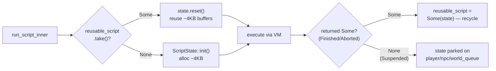
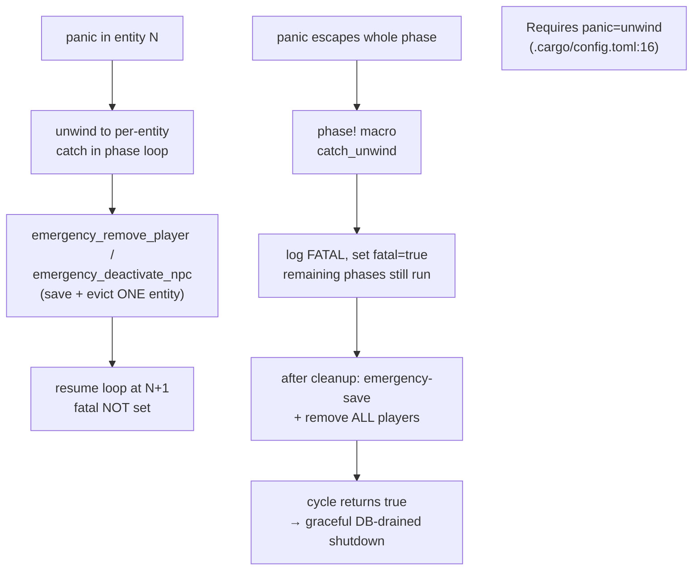
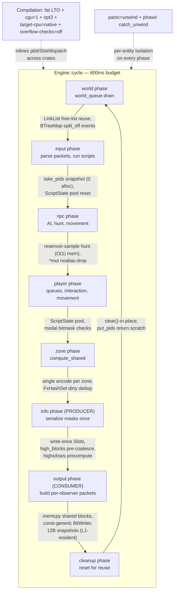
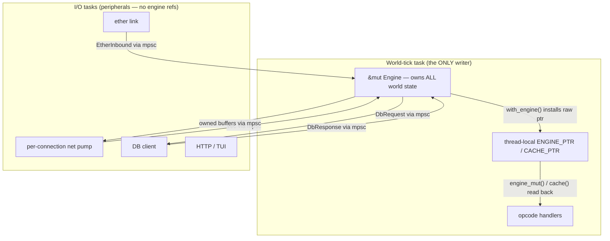
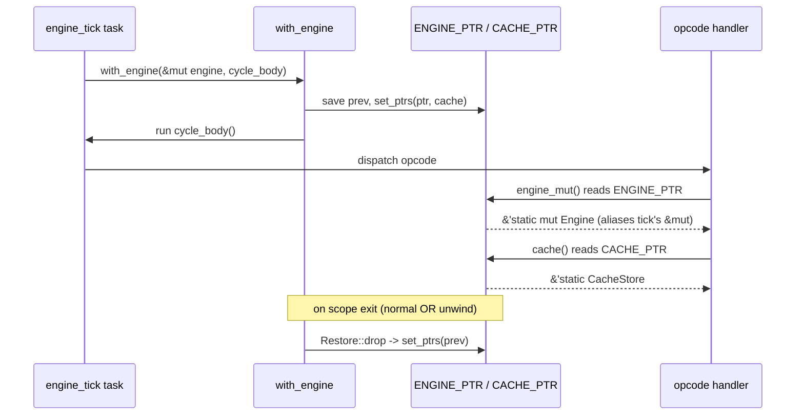
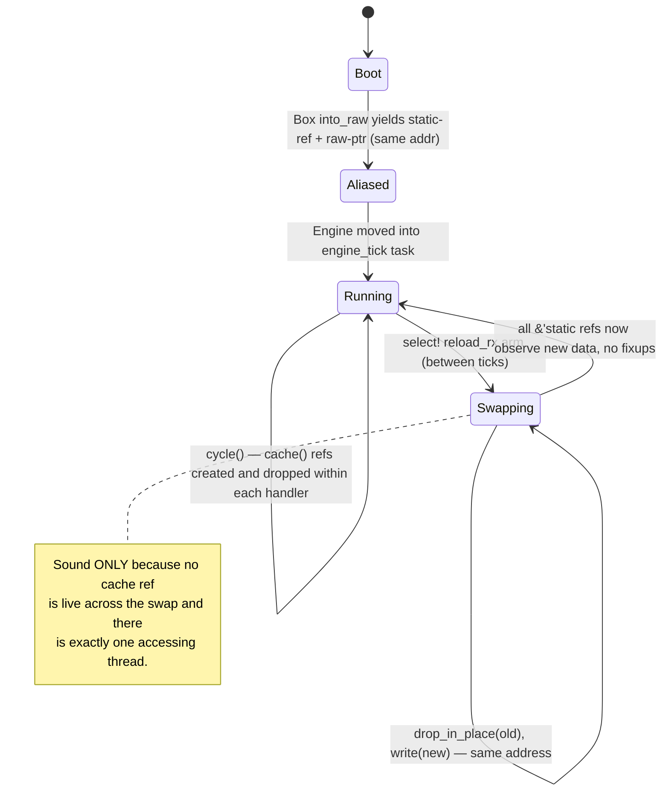
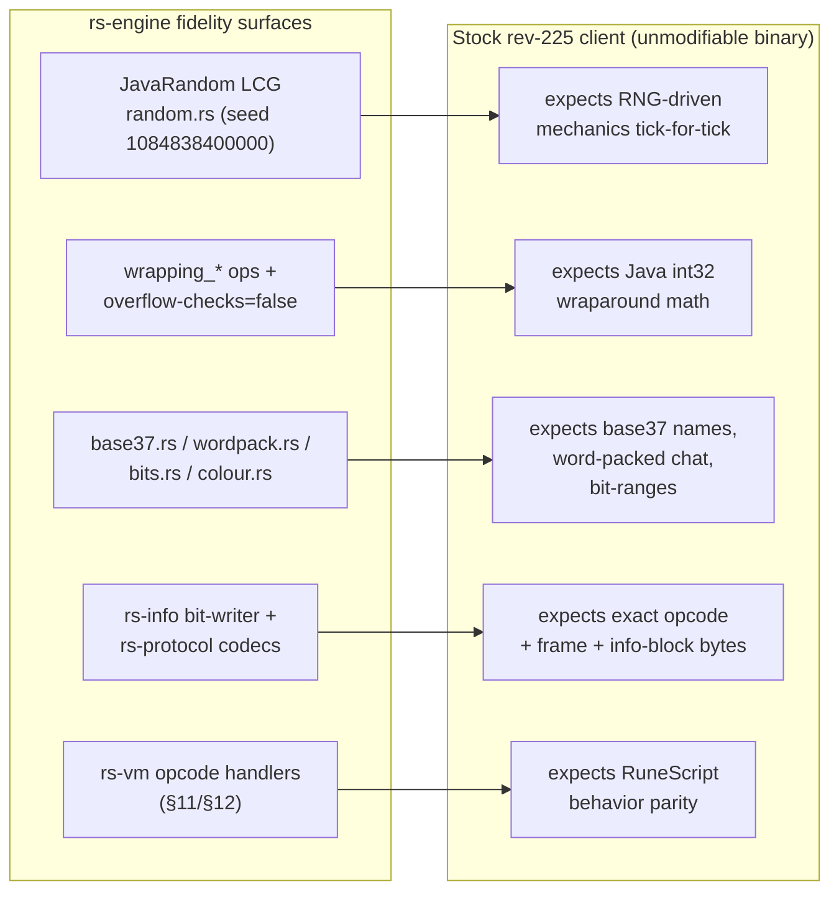
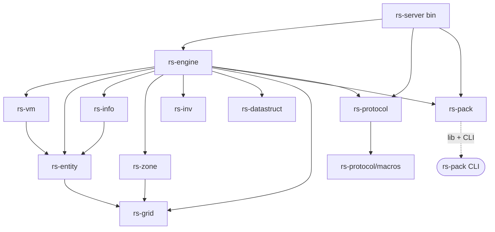
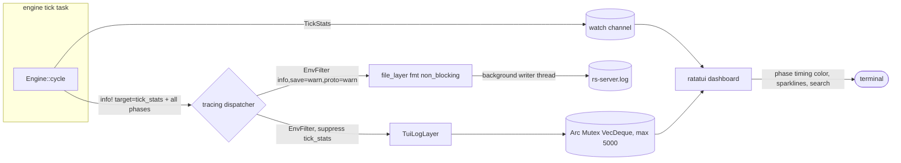
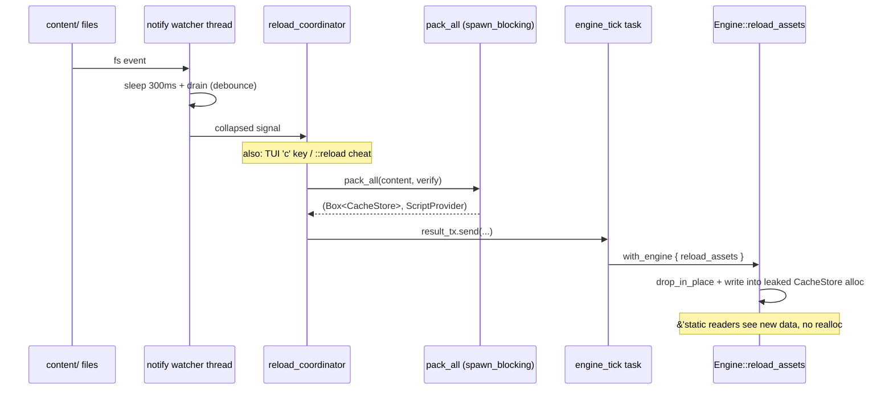

<a id="top"></a>

**[← Whitepaper index](../README.md)**  ·  [Single-file version](whitepaper-full.md)

# Part IX · Engineering Deep-Dives

> *The cross-cutting concerns: speed, safety, fidelity, and tooling.*


---

<a id="sec-26"></a>

## 26. Performance Engineering — The Optimization Playbook

rs-engine is a soft-real-time simulator with a hard deadline: every game tick must complete inside a 600 ms budget, and
every tick performs the *entire* world's input parsing, AI, movement, interaction, zone broadcasting, and per-observer
wire encoding. There is no way to "fall behind gracefully" — a tick that overruns simply delays the next one, and the
simulation's perceived speed degrades for every connected player. This chapter is the master synthesis of how the
codebase meets that deadline. It is not a list of micro-optimizations bolted onto an otherwise naive design; the
performance posture is *architectural* and pervades every subsystem documented in the rest of this whitepaper. The
recurring theme is the same one a database engine or a game console runtime lives by: **do the expensive thing exactly
once, place data so the CPU can stream through it, and never touch the allocator on the hot path.**

This section first establishes the cost model (§26.1), then walks the six pillars of the playbook: single-threaded
determinism (§26.1), allocation discipline (§26.2), data-structure selection (§26.3), wire-encoding efficiency (§26.4),
compilation strategy (§26.5), and the catch-unwind isolation model (§26.6). It closes with a consolidated technique
table (§26.7), a hot-path-to-optimization map (§26.8), and a candid accounting of remaining levers (§26.9).

---

### 26.1 Single-Threaded Determinism and the 600 ms Cost Model

#### The deadline

The heartbeat is a single tokio task running `Engine::cycle` (`rs-engine/src/engine.rs:563`) once per tick. The budget
is encoded directly into the tick-stats line: utilisation is reported as `(cycle.as_secs_f64() / 0.6) * 100.0` (
`engine.rs:642`), i.e. wall-clock milliseconds against a 600 ms ceiling. The scheduler drives the loop on a
`tokio::time::interval` with `MissedTickBehavior::Skip` so an overrun is *absorbed* (the next fire is skipped, not
queued), keeping the clock from spiralling. `Engine::clock` (`engine.rs:374`) is a `u64` monotonic counter advanced
exactly once per cycle at `engine.rs:595`, before any fatal-shutdown branch — every subsystem that timestamps events (
zone reveal/despawn, timers, objs) reads this single authoritative clock.

#### Why one thread

The entire `Engine` (`engine.rs:373`) is a single mutable container touched only on the world task. This is a deliberate
rejection of the lock-and-share model, justified by the workload's shape:

- **The work is a tight dependency graph, not embarrassingly parallel.** The thirteen phases form a strict
  producer→consumer chain (mutate fully → observe fully → transmit fully). A script run during the player phase can move
  an entity, change a loc, drop an obj, and queue a world-suspended continuation — mutating zones, inventories, and the
  collision map as side effects. Sharding players across threads would require locking essentially every shared
  structure (zones, the collision map, the inventory map, the script pool), and the lock traffic would dwarf the
  simulation work.
- **Determinism is a product requirement.** Byte-identical client emulation (§26.4) demands a *reproducible* ordering of
  events. Processing order is captured once per phase into an owned snapshot (see `take_pids`, §26.2) so iteration order
  is stable even as entities are removed mid-phase. A multi-threaded design would make this ordering nondeterministic
  without heavy synchronization that re-serializes everything anyway.
- **Memory-layout control.** Single-threaded ownership means the hot structures need no atomics, no `Arc` refcount churn
  on the per-tick path, and no false-sharing mitigation. Fields are plain values; the compiler is free to keep them in
  registers across calls (the `*mut`/noalias trick in §26.3 depends on this).

The cost of single-threadedness is that the engine cannot use more than one core for the simulation itself. The codebase
recovers parallelism only where it does *not* threaten determinism: all I/O (network, database, the ether sidecar) runs
on *other* tokio tasks and communicates with the engine exclusively through MPSC channels carrying owned `Vec<u8>`
buffers. The engine never `.await`s I/O — it drains channels with non-blocking `try_recv` and sends without blocking —
so `Engine::cycle` stays wall-clock-bounded and deterministic regardless of network latency. The memory of this design
decision is explicit: the engine is `unsafe impl Send` (`engine.rs:420`) so it can be *moved* into the world task, but
deliberately *not* `Sync`.

#### `unsafe impl Send` for `Engine`

```rust
// SAFETY: Engine is only accessed from the single world-tick tokio task.
unsafe impl Send for Engine {}   // engine.rs:420
```

The safety argument is the single-thread invariant itself: the raw `cache_ptr: *mut CacheStore` (`engine.rs:383`) that
makes `Engine` `!Sync` is only ever written during `reload_assets`, which runs on the same world task. This is the
load-bearing assumption behind nearly every other optimization in this chapter — there are no readers racing the tick
thread, so unchecked indexing, raw-pointer aliasing, and in-place mutation of "static" data are all sound.

---

### 26.2 Allocation Discipline

The single most important performance principle in rs-engine is that **the steady-state hot path allocates nothing.**
The allocator is treated as an off-budget resource to be amortized at startup. Four mechanisms enforce this.

#### (1) Fixed-capacity slabs

Player and NPC storage are slabs sized once at construction. `PlayerList` (`engine.rs:213`) holds
`players: Vec<Option<ActivePlayer>>` allocated via `Vec::with_capacity(MAX_PLAYERS)` then
`resize_with(MAX_PLAYERS, || None)` (`engine.rs:223-224`); `NpcList` (`engine.rs:287`) does the same with `MAX_NPCS` (
`engine.rs:297-298`). `MAX_PLAYERS = 2048`, `MAX_NPCS = 8192`. Entities are indexed *directly* by `pid`/`nid` — no
hashing, no probing, no resizing ever. The `node_map: Vec<usize>` reverse index (`engine.rs:216`) is likewise
`vec![0; MAX_PLAYERS]` allocated once. The `next_free_id` cursor (`engine.rs:204-211`) scans `(cursor+1..upper)` then
wraps to `(lower..=cursor)`, reusing freed slots without any free-list allocation.

The snapshot arrays for the info pipeline are the densest example:
`player_snapshots: Box<[PlayerSnapshot; MAX_PLAYERS]>` and `npc_snapshots: Box<[NpcSnapshot; MAX_NPCS]>` (
`engine.rs:390-391`) are heap-boxed fixed arrays of 12-byte `#[repr(C)]` structs (`info.rs:123-131`, `:176-184`), seeded
with the `ABSENT` sentinel (`engine.rs:498-499`). These exist precisely so the hot observer loop reads movement
decisions out of a cache-dense 12-byte struct rather than chasing a random ~2.4 KB `ActivePlayer` (3–4 cold cache lines)
per tracked entry (`info.rs:111-116`).

#### (2) Object pooling — the `ScriptState` pool

The marquee allocation optimization is the single-slot `ScriptState` pool. `ScriptState::new`/`init` allocates ~4 KB per
call: `int_stack` is `vec![0; 128]`, `string_stack` is `vec![String::new(); 128]`, plus two frame stacks each
`Vec::with_capacity(16)` (`rs-vm/src/state.rs:135-143`). The motivating fact is stated in the source: with **20,000+
script invocations per tick** (`state.rs:263-264`) this is multiple megabytes of allocator traffic *per tick* if done
naively.

The engine pools exactly one state in `reusable_script: Option<ScriptState>` (`engine.rs:413`). `run_script_inner` (
`engine.rs:982`) takes the pooled state and calls `reset` (`engine.rs:1010-1012`), falling back to `ScriptState::init`
only when the pool is empty (`engine.rs:1013-1014`). `ScriptState::reset` (`state.rs:289`) overwrites every field while
**reusing the heap buffers in place**: the comment is explicit that `int_stack` and `string_stack` are *not*
reallocated — `isp`/`ssp` are simply reset to 0 because stale values are overwritten before they are read (
`state.rs:321-323`), and string slots are `clear()`'d to release any large buffers without freeing the slot itself (
`state.rs:326-328`). `build_state` (`engine.rs:851`) mirrors the same take-or-init logic for timer/queue feeders.

The subtle correctness rule is the reclaim policy: the state is returned to the pool **only when the executor
returns `Some`** (`engine.rs:1029-1031`, and `run_script_by_state` at `:838-840`). A `Some` return means the script
Finished or Aborted; a suspended script (Suspended/PauseButton/CountDialog/NpcSuspended/WorldSuspended) returns `None`
because its state is *parked* on the player/NPC or enqueued in the world queue and must survive untouched until resumed.
Reclaiming a suspended state would corrupt the continuation. With one in-flight script at a time in the common case, a
single pooled state covers the overwhelming majority of the 20k+ invocations.



#### (3) Reused scratch buffers

Per-entity phase loops must iterate a *stable owned snapshot* of the processing order so that scripts can
emergency-remove the current entity mid-iteration without invalidating the iterator. The naive way (`pids()` at
`engine.rs:278`) collects a fresh `Vec` every call. The hot path instead uses `take_pids`/`put_pids` (
`engine.rs:238/246`): `take_pids` does `std::mem::take` on a `pid_scratch: Vec<u16>` that was reserved to `MAX_PLAYERS`
capacity at construction (`engine.rs:230`), `clear`s it, and refills it from `processing.iter()` — reusing the same
backing allocation every tick. `put_pids` hands it back. `NpcList` has the identical `nid_scratch` pair (
`engine.rs:311/319`). Five phases (input, npc, player, info, output) share this idiom, so across a full tick the
processing-order snapshot costs **zero allocations** despite being materialized ten times.

The same discipline appears in the renderer's variable-length buffers: `appearances`, `says`, and `chats` are
`Vec<Option<Vec<u8>>>` whose inner buffers are reused via `v.clear()` then refilled (`rs-info/src/renderer.rs:317`,
`:353`, `:392`), only allocating a fresh `Vec::with_capacity(len)` when no slot buffer exists yet (`renderer.rs:322`,
`:358`, `:400`). The `high_blocks: Vec<Vec<u8>>` pre-coalescing buffers are `clear()`'d in place each tick (
`renderer.rs:451-452`, `:836-841`).

#### (4) Write-once info buffers

The info renderer's `fixed` field is `Box<[[Slot; MAX_PLAYERS]; PLAYER_PROT_COUNT]>` (`renderer.rs:218`) — a ~144 KB
heap array of 8-byte inline `Slot`s allocated once (`renderer.rs:245`). A `Slot` (`renderer.rs:21-26`) is
`{ data: [u8;8], len: u8 }`, `#[repr(C)] Copy`, holding a pre-serialized big-endian protocol field with **no heap
allocation** for the fixed-size update fields (anim, face, damage, spot-anim). The NPC renderer uses the same scheme
sized to `MAX_NPCS`/`NPC_PROT_COUNT` (`renderer.rs:920`, `:945`). This converts per-field encoding from "allocate,
format, free" into "write 8 bytes into a pre-owned slot" — covered in depth in §26.4.

#### The known remaining lever — no custom global allocator

A grep of the entire workspace for `#[global_allocator]`, `mimalloc`, `jemalloc`, or any `GlobalAlloc` impl returns *
*nothing**: the binary uses the platform system allocator. This is the single largest *unaddressed* allocation lever.
Even with the pooling above, the engine still allocates on cold paths — login, logout-save, the occasional
`ScriptState::init` when the pool is in use by a suspended continuation, fresh appearance/chat buffers when a slot is
empty, and the per-tick zone `compute_shared` `to_vec` (§26.4). Dropping in a bump/arena-tuned allocator (mimalloc or
jemalloc) would cut the tail latency of those allocations and, because the platform allocator on Windows in particular
has heavier locking, likely shave the worst-case tick. It is called out in the project's own performance roadmap as a
top lever and remains deliberately unimplemented to avoid build-portability risk; it is a one-line change with
measurable upside (§26.9).

---

### 26.3 Data-Structure Choices

The data structures are chosen for *primitive-key hashing*, *branch-free arithmetic*, and *cache density*. Three
families dominate.

#### FxHashMap / FxHashSet for integer keys

Every map keyed by a small integer or a packed-integer newtype uses `rustc_hash`'s `FxHashMap`/`FxHashSet` (workspace
dep `rustc-hash = "2"`, `Cargo.toml:61`) rather than the default `SipHash`-backed `HashMap`. SipHash is
cryptographically strong and DoS-resistant but slow; for trusted internal integer keys it is pure overhead. Fx hashing
is a single multiply-xor per word — effectively free for a `u16` or `u32` key. The engine's Fx-keyed structures include:

| Structure                                                         | Key                          | Location                      |
|-------------------------------------------------------------------|------------------------------|-------------------------------|
| `invs: FxHashMap<u16, Inventory>` (world-shared inventories)      | `InvType.id` u16             | `engine.rs:392`               |
| `zones_tracking: FxHashSet<ZoneCoordGrid>` (per-tick dirty dedup) | packed 24-bit zone coord u32 | `engine.rs:394`               |
| `ZoneMap: FxHashMap<ZoneCoordGrid, Box<Zone>>`                    | packed zone coord            | `rs-zone/src/zone_map.rs`     |
| `ScriptProvider.lookups: FxHashMap<i32, i32>` (trigger keys)      | packed trigger key i32       | `rs-pack/src/cache/script.rs` |
| `ScriptTimer` normal/soft lanes `FxHashMap<i32, TimedScript>`     | script_id i32                | `rs-timer/src/lib.rs`         |

`zones_tracking` is a representative win: it is a per-tick *dedup* set hit every time a world mutation dirties a zone.
With Fx hashing the dedup is nearly free; the packed `ZoneCoordGrid` (a single `u32`) is a perfect Fx key, and "free
zone-mutation dedup" is exactly the property the packed-coordinate scheme was designed to deliver.

#### Packed-integer coordinates and UIDs

The coordinate newtypes (`CoordGrid` u32, `ZoneCoordGrid` u32, `MapsquareCoordGrid` u16) and the entity UIDs (
`PlayerUid` u128 = `(username37 << 11) | (pid & 0x7FF)`; `NpcUid` u32 = `(id << 16) | nid`) are all single-word, `Copy`,
branch-free-to-decode bit packings. The payoff is threefold: they are zero-cost `Copy` so they thread through script
subjects and active-entity slots without indirection; they are perfect hash keys (the dirty-tracking and zone-map cases
above); and the entity bit-packings (`Loc` into `u128`, `Obj` into `u64`) make the *numerous, cold* ground entities one
machine word each, so a zone's `locs`/`objs` vectors are contiguous arrays of words rather than pointer-chased structs.
The 11-bit `pid` field in `PlayerUid` is sized to exactly match the 2048 player slots — the mask `& 0x7FF` and the slab
capacity are the same number by construction.

#### Intrusive arena lists and handle-addressable tables

`rs-datastruct` relocates the reference server's intrusive pointer chains into contiguous `Vec` arenas where indices act
as pointers — giving GC-free O(1) removal, LIFO slot reuse with no shrink, and cache-dense traversal.

- **`LinkList<T>`** (`rs-datastruct/src/linklist.rs:24`) is an index-based intrusive doubly-linked ring:
  `entries: Vec<Entry<T>>`, a `free: Vec<usize>` LIFO free-list, and a single `cursor`. Index 0 is a permanent
  sentinel (`SENTINEL = 0`, `linklist.rs:10`). `alloc` pops from `free` before growing the `Vec` (`linklist.rs:84-93`),
  so steady-state enqueue/dequeue reuses slots without touching the global allocator. The cursor caches the *successor*
  one step ahead (`head` sets cursor to the head's successor, `linklist.rs:200-206`; `next` returns then advances,
  `:253`), which makes unlinking the current node during a walk safe and — by design — faithfully reproduces the
  reference server's cursor "speedup bug". It backs `world_queue: LinkList<ScriptState>` and `obj_delayed_queue` (
  `engine.rs:396-397`) and the triple-lane `ScriptQueue`.

- **`HashTable<T>`** (`rs-datastruct/src/hashtable.rs:8`) is a power-of-two bucketed intrusive table co-locating bucket
  sentinels and data nodes in one `Vec`. Hashing is `(key as usize) & (bucket_count - 1)` (correct only because bucket
  count is a power of two — no modulo). `put` returns the arena index as an **O(1) removal handle**; the engine captures
  that handle into `node_map` (`engine.rs:259`) so `remove` is `processing.unlink(node_map[pid])` (`engine.rs:265`) —
  constant-time deletion from the processing order with no scan. It is constructed with 8 buckets for both player and
  NPC processing lists (`engine.rs:227`, `:301`).

This two-level scheme (dense `Vec<Option<_>>` payload + ordered `HashTable<u16>` membership + `node_map` reverse index)
is what lets the per-phase snapshot be both *ordered* and *O(1)-mutable* mid-iteration.

#### BTreeMap for time-ordered events

`pending_zone_events: BTreeMap<u64, Vec<PendingZoneEvent>>` (`engine.rs:395`) keys scheduled world events (obj
despawn/reveal, loc respawn) by their firing `clock`. A `BTreeMap` is the right structure here precisely because the
workload is *range-by-time*: the zone phase does a `split_off` by the current clock to extract everything due *now or
earlier* in one ordered sweep, rather than scanning a flat list or polling per-event. The ordered keys give O(log n)
insert and an efficient "drain everything ≤ clock" operation that a hash map cannot, and the per-key `Vec` batches
multiple events landing on the same tick.

#### The `*mut`/noalias trick

A subtle but crucial micro-architectural choice: per-entity helpers take `*mut ActivePlayer`/`*mut ActiveNpc` rather
than `&mut` (e.g. `process_timers(clock, active: *mut ActivePlayer, ...)`, `rs-engine/src/phases/player.rs:165`). The
documented reason (`player.rs:154-158`): a `&mut` parameter carries LLVM's `noalias` attribute, which lets the optimizer
cache field reads in registers across calls. But script execution via `engine_mut()` re-enters the *same* entity slot
through the thread-local engine pointer, mutating fields the compiler thinks it has cached. Dropping to a raw pointer
drops `noalias`, forcing the compiler to re-read fields after each script call — trading a small amount of register
caching for correctness under re-entrant aliasing. This is a case where the *removal* of an optimization is the
performance-critical decision, because the alternative is miscompilation.

---

### 26.4 Wire-Encoding Efficiency

Per-tick output is the most expensive thing the server does, and it is where "compute once, share many" pays the largest
dividend. The reference TS server re-walks and re-encodes each observer's view of each entity for every observer;
rs-engine restructures this into a producer/consumer split that makes the cost **O(entities) for serialization** plus *
*O(observers × viewport) for memcpy**.

#### Producer/consumer split (info phase → output phase)

The phase ordering at `engine.rs:582-594` places `zones → info → out → cleanup`. The **info phase** (producer)
serializes each entity's `EntityMasks` into its reusable per-entity byte buffer exactly once — `compute_info` builds
`high_blocks[pid]` pre-coalesced once per tick (`renderer.rs:451`) and returns early when `masks == 0`. The **output
phase** (consumer) builds each observer's bit-packed packet by `memcpy`-ing those pre-coalesced blocks — the hot tracked
path is a single `pdata` of `high_block(pid)` (`renderer.rs:525`). An entity that animates is serialized once and copied
into the packets of all ~50 observers that can see it, instead of being re-encoded 50 times.

#### Write-once shared buffers, zero re-measurement

Two details make the consumer's loop nearly branch-free:

- The `Slot` encoder (§26.2) writes fixed fields big-endian into an 8-byte inline buffer via `write_unaligned` (
  `renderer.rs`), pre-coalesced into `high_blocks` so the consumer never re-encodes.
- The `highs`/`lows` `u16` counters precompute the HD/LD byte sizes during the producer pass (`renderer.rs:426-442`) so
  the consumer's `fits()` capacity check **never re-measures** the block length. The expensive size computation happens
  once, on the producer side.

The header subtlety that preserves byte-fidelity: the player block omits the observer-relative `ExactMove` field (it
depends on the observer's position) but computes its header from the **full** masks, so the shared `memcpy` is
byte-identical for every observer; the rare per-observer `ExactMove` tail is appended separately (`info.rs`
highdefinition path). This is the price of single-encode broadcast — a handful of fields genuinely *are*
observer-relative and get a fast-path exception, while everything else is shared.

#### Zone broadcast: single encode

The zone subsystem applies the identical philosophy. `Zone::compute_shared` (`rs-zone/src/zone.rs:273`) sums
`sizeof_zone` over the **Enclosed-only** events, allocates one exact-sized `Packet`, encodes all enclosed events into
`self.shared`, and returns early with no allocation if there are no enclosed events (`zone.rs:281-283`). During output,
every player observing that zone appends the same pre-serialized `shared_bytes()` slice — one encode, N memcpys.
Per-receiver `Follows` events are the only ones filtered per-observer. (The `to_vec` at `zone.rs:293` is one of the few
remaining steady-state allocations and is noted in §26.9.)

#### The MSB-first BitWriter

Movement and add/remove deltas are bit-packed by a custom `BitWriter` (`info.rs:39`): a `u64` accumulator with
`pbit::<const N: usize>` (`info.rs:75`). Because `N` is a compile-time constant at every call site (1, 3, 7, 8, 10, 11,
13, 21, 23, 24), the mask `(1 << N) - 1` folds to a constant and the flush loop unrolls. The accumulator-and-flush
design replaces what the digest notes as ~1M read-modify-write byte operations per tick with whole-`u64` shifts and
occasional byte stores via `as_mut_ptr().add(byte)` with no bounds check (`info.rs:80-83`) — capacity is guaranteed by
the upstream `fits()` check against the fixed `BYTES_LIMIT` buffer. The output is byte-identical to the reference
`Packet::pbit`, including the zero-padded trailing partial byte (`finish`, `info.rs:96-104`).

#### itoa for allocation-free integer formatting

Integer-to-string conversion in the VM's hot string opcodes uses the `itoa` crate (`Cargo.toml:64`,
`rs-vm/src/ops/string.rs:5`) with a stack `itoa::Buffer` (`string.rs:33`, `:53`, `:78`) — `APPEND_NUM`/`TOSTRING` format
directly into the buffer and `push_str` the result, avoiding the heap allocation that `format!`/`to_string` would incur
on every numeric-text path (chat, dialogue, scoreboards).

---

### 26.5 Compilation Strategy

The release profile (`.cargo/config.toml:12-18`) and build flags (`:8-10`) are tuned for a long-lived, latency-sensitive
single binary where compile time and binary size are secondary to steady-state throughput.

| Setting           | Value               | Location         | Rationale                                                                                                                                                                                                                                                                                              |
|-------------------|---------------------|------------------|--------------------------------------------------------------------------------------------------------------------------------------------------------------------------------------------------------------------------------------------------------------------------------------------------------|
| `opt-level`       | `3`                 | `config.toml:13` | Maximum optimization; the hot loops are arithmetic and memcpy-bound and benefit from full vectorization/unrolling.                                                                                                                                                                                     |
| `lto`             | `"fat"`             | `config.toml:14` | Whole-program LTO across all ~16 workspace crates. Critical because the hot path crosses crate boundaries constantly (engine → rs-vm opcodes → rs-info encoders → rs-io writers). Fat LTO lets the `#[inline(always)]` `pbit`, `Slot::write_to`, and `OpsRegistry::get` actually inline across crates. |
| `codegen-units`   | `1`                 | `config.toml:15` | Single codegen unit removes intra-crate inlining/optimization boundaries, at the cost of compile parallelism. Pairs with fat LTO for maximal cross-function optimization.                                                                                                                              |
| `panic`           | `"unwind"`          | `config.toml:16` | **Load-bearing, not default.** Release normally aborts on panic; keeping unwind is what makes the `catch_unwind` safety nets (§26.6) live code instead of dead branches.                                                                                                                               |
| `strip`           | `true`              | `config.toml:17` | Strips symbols; smaller binary, faster load, no debug-info bloat in production.                                                                                                                                                                                                                        |
| `overflow-checks` | `false`             | `config.toml:18` | Disables arithmetic overflow panics. The VM's integer ops use explicit `wrapping_*` semantics for Java overflow fidelity; implicit overflow checks would both slow arithmetic *and* be semantically wrong (the engine *wants* two's-complement wraparound to match the original).                      |
| `rustflags`       | `target-cpu=native` | `config.toml:10` | Compiles for the exact host microarchitecture, enabling the newest SIMD/bit-manipulation instructions (e.g. `popcnt`, BMI) the bit-packing and hashing code can use. Trade-off: the binary is not portable to older CPUs — acceptable because each world node is built on its deployment host.         |

A `dev-opt` profile (`config.toml:24-26`) inherits `dev` but sets `opt-level = 2`, giving a fast-enough-to-run
development build without the full LTO/codegen-units=1 link cost — used for iterating on logic where a 600 ms budget
still needs to be roughly met locally.

The combination of fat LTO + `codegen-units = 1` is the highest-leverage compilation choice: the architecture
deliberately spreads the hot path across many small crates for modularity, and only whole-program optimization recovers
the inlining that a monolithic crate would get for free. The `#[inline(always)]` annotations on `BitWriter::pbit`,
`Slot` accessors, and `OpsRegistry::get` (`register.rs:96`) are *requests* that LTO is required to honor across the
crate graph.

---

### 26.6 Catch-Unwind Isolation — Cost and Benefit

The engine wraps each phase in a `phase!` macro (`engine.rs:571-580`) that brackets the call with `Instant::now()`/
`elapsed()` timing **and** `catch_unwind(AssertUnwindSafe(|| { ... }))`. There are two tiers of recovery:

1. **Per-entity isolation (inside hot phases).** The five iterating phases (input, npc, player, info, output) catch a
   panic that unwinds out of a single entity's processing, emergency-remove *just that entity* (
   `emergency_remove_player` at `engine.rs:1996`, `emergency_deactivate_npc` at `:2043`), and resume the loop at the
   next entity. One buggy script or malformed packet takes down one player, not the world.
2. **Phase-level isolation (the `phase!` macro).** If a panic escapes an entire phase, the macro logs `FATAL`, sets
   `fatal = true`, but **other phases still run** (`engine.rs:574-577`). After all phases, if `fatal`, the engine
   emergency-saves and removes *all* players (`engine.rs:597-605`) and returns `true` to signal shutdown — durability
   over availability.

`AssertUnwindSafe` is required because the closures capture `&mut Engine`, which is not `UnwindSafe`. The justification
is that the recovery path explicitly *repairs* the inconsistent state by removing the offending entity or evacuating all
players, so the usual "you might observe a half-mutated value after a panic" hazard is neutralized by construction.

**The cost** is small but real. `catch_unwind` establishes a landing pad and inhibits some optimizations across the
boundary (the compiler must assume the guarded code may unwind). With the Itanium/SEH zero-cost-unless-thrown model, the
happy path is essentially free — there is no per-call overhead when nothing panics; the cost is paid only in code size (
landing pads) and the inability to hoist certain operations across the catch boundary. **The benefit** is enormous for a
single-threaded server: without it, a single `unwrap` on a corrupt packet, a stale `HashTable`/`LinkList` handle (both
panic on double-unlink), or an out-of-range script index would crash the *entire world*, disconnecting thousands of
players and losing all unsaved progress. The two-tier model degrades a would-be world crash into a single-entity
removal.

This benefit is **entirely contingent on `panic = "unwind"` in the release profile** (`config.toml:16`). If release used
the default `panic = "abort"`, `catch_unwind` would never catch anything — every safety net in the codebase would be
dead code, and any panic would `SIGABRT` the process. The profile setting and the recovery architecture are a single
coupled design decision.



---

### 26.7 Consolidated Technique → Mechanism → Payoff

| Technique               | Mechanism                                                                            | Payoff                                                                                                                   |
|-------------------------|--------------------------------------------------------------------------------------|--------------------------------------------------------------------------------------------------------------------------|
| Single tick thread      | All world state in one `!Sync` `Engine`; I/O on other tasks via MPSC                 | No locks/atomics/contention; deterministic, reproducible ordering for byte-identical emulation (`engine.rs:373`, `:420`) |
| Fixed-capacity slabs    | `Vec::with_capacity` + `resize_with` to `MAX_PLAYERS`/`MAX_NPCS`, direct index by id | O(1) entity access, zero resize/rehash ever (`engine.rs:223-224`, `:297-298`)                                            |
| ScriptState pool        | `reusable_script` take→`reset`→reclaim-if-not-suspended                              | Eliminates ~4 KB × 20k+ allocs/tick (`engine.rs:413`, `:1010-1031`; `state.rs:289`)                                      |
| Reused scratch vecs     | `take_pids`/`put_pids` `mem::take` of pre-reserved `pid_scratch`                     | Zero-alloc stable processing snapshots, materialized 10×/tick (`engine.rs:238-247`)                                      |
| Write-once Slots        | `Box<[[Slot;N];P]>` inline 8-byte big-endian fields                                  | No per-field heap alloc in info encode (`renderer.rs:218`, `:21-26`)                                                     |
| Single-encode broadcast | `high_blocks` / `Zone::compute_shared` encode once, memcpy to N observers            | Output from O(obs×view×encode) → O(entities)+O(obs×view×memcpy) (`renderer.rs:451`, `zone.rs:273`)                       |
| const-generic BitWriter | `pbit::<N>` folds masks, unrolls flush; unchecked byte store                         | Replaces ~1M RMW byte ops/tick with `u64` shifts (`info.rs:39-105`)                                                      |
| FxHashMap for int keys  | `rustc_hash` multiply-xor instead of SipHash                                         | Near-free hashing for `u16`/packed-`u32` keys (`engine.rs:392`, `:394`)                                                  |
| Packed coords/UIDs      | bit-packed `Copy` newtypes (u16/u32/u128)                                            | Perfect hash keys, branch-free decode, cache-dense entity vectors                                                        |
| Intrusive arena lists   | `LinkList`/`HashTable` index-as-pointer + free-list                                  | GC-free O(1) removal-by-handle, mid-iter mutation safe (`linklist.rs`, `hashtable.rs`; `node_map` `engine.rs:259`)       |
| BTreeMap event schedule | time-keyed `split_off` drain                                                         | Ordered "fire ≤ clock" without scanning (`engine.rs:395`)                                                                |
| `*mut` noalias drop     | raw-pointer entity params                                                            | Correctness under re-entrant `engine_mut()` aliasing (`player.rs:154-165`)                                               |
| itoa formatting         | stack `itoa::Buffer`                                                                 | Alloc-free int→string in hot VM ops (`string.rs:33`)                                                                     |
| Fat LTO + cgu=1         | whole-program optimization                                                           | Cross-crate inlining of hot path (`config.toml:14-15`)                                                                   |
| `target-cpu=native`     | host microarch codegen                                                               | Newest SIMD/bit-manip for packing/hashing (`config.toml:10`)                                                             |
| `overflow-checks=false` | no implicit overflow panics                                                          | Faster + semantically-correct Java wraparound (`config.toml:18`)                                                         |
| catch_unwind isolation  | `phase!` macro + `panic=unwind`                                                      | World crash → single-entity eviction (`engine.rs:571-580`, `config.toml:16`)                                             |

---

### 26.8 Hot-Path Stages Mapped to Their Optimizations



The pipeline reads as a single streaming pass: each phase mutates or reads dense, index-addressed arrays, snapshots its
processing order into reused scratch, and hands pre-computed results to the next phase. The two compilation/recovery
substrates (LTO and unwind-isolation) underlie every stage.

---

### 26.9 Remaining Opportunities (Candid Accounting)

The playbook is mature but not exhausted. The following levers are real and unaddressed in the current tree:

- **No custom global allocator (§26.2).** The largest single lever. Login/logout/save paths, fresh appearance/chat
  buffers, and the zone `compute_shared` `to_vec` (`zone.rs:293`) all hit the system allocator; on Windows this carries
  heavier locking. A `#[global_allocator]` of mimalloc/jemalloc is a one-line change with measurable worst-case-tick
  upside and is called out in the project's own roadmap as the top item.
- **`Zone::compute_shared` `to_vec` floor (`zone.rs:293`).** The shared buffer is built into a `Packet` then copied into
  a fresh `Vec` via `to_vec` every time a zone has enclosed events. A reusable per-zone buffer (mirroring the
  `high_blocks` clear-in-place pattern) would remove this steady-state allocation for active zones.
- **`ScriptState` pool depth of one.** The pool holds a *single* state (`engine.rs:413`). When a script suspends, its
  state is parked and the next invocation falls back to `ScriptState::init` until the suspended one resolves. A small
  free-list of states would cover bursty suspension without re-allocating, at the cost of a slightly more complex
  reclaim rule.
- **Single core for simulation.** By design the tick is single-threaded; genuinely independent sub-work (e.g. per-zone
  info pre-encoding) could in principle be fanned out to a scratch thread pool *if* determinism were preserved by a
  barrier before the consumer phase. This is a large, risky change explicitly out of scope for the current
  architecture — the memory note that the tick loop must stay single-threaded reflects a deliberate stance, not an
  oversight.

The honest summary: rs-engine has already paid down the allocation, data-layout, and encoding debt that dominates a
server of this shape, and the compilation profile extracts the rest. What remains is a short list of bounded, low-risk
wins (allocator swap, two specific buffer reuses) plus one architectural frontier (intra-tick parallelism) that the
project has consciously chosen not to cross.

---

**Cross-references:** §05 (tick loop, `phase!` macro, two-tier recovery), §06 (Engine core, slabs, `node_map`,
ScriptState pool), §11 (VM core, ScriptState fields, `reset` vs `init`), §14 (info pipeline, Slots, snapshots,
BitWriter), §08 (zones, `compute_shared`), §20 (LinkList/HashTable internals), §25 (compilation/bootstrap,
`Box::into_raw`, watch-channel scheduler).

<sub>[↑ Back to top](#top)</sub>


---

<a id="sec-27"></a>

## 27. Memory Safety & the Unsafe Inventory

rs-engine is a Rust reimplementation of a server whose reference implementations
(Java, TypeScript) lean on a managed runtime: a tracing garbage collector keeps
the object graph alive, a JIT erases the cost of pointer chasing, and a single
event loop makes data races a non-issue by construction. Rust gives none of that
for free. To match the reference server's design — one mutable world graph, an
ambient "current engine" reachable from any opcode handler, hot reload of the
content cache without dropping connections — rs-engine deploys a small, carefully
fenced set of `unsafe` blocks. This section is the complete audit of that set: it
enumerates every unsafe surface in the workspace, states the invariant that makes
each one sound, and is explicit about what would break it.

The central thesis is that **almost every unsafe construct in this codebase is
justified by exactly one global invariant: all mutable world state is touched by
exactly one thread, the world-tick task, and never concurrently.** The type
system cannot express "this `*mut` is fine because there is logically only one
writer in the process," so the code reaches for raw pointers and then re-imposes
the discipline by hand. Understanding the single-threaded invariant is therefore
the key that unlocks the soundness argument for the entire inventory.

### The single-threaded world invariant

The engine is constructed once at boot, leaked to `'static`, and moved into one
Tokio task that calls `Engine::cycle()` every ~600 ms (`rs-server/src/main.rs:696`,
`engine_tick`). Every other task in the process — per-connection network pumps,
the database client, the ether sidecar link, the HTTP server, the TUI — is
strictly an *I/O peripheral* that communicates with the engine only through MPSC
channels carrying owned `Vec<u8>` (see the I/O-boundary section). No other task
holds a reference into `Engine`, `PlayerList`, `ZoneMap`, the collision map, or
the cache. This is not merely a convention enforced by review; it is what makes
the `unsafe impl Send` below sound and what every raw-pointer dereference in the
hot path silently assumes.

The doc comment on `Engine` states the contract directly
(`rs-engine/src/engine.rs:368-372`):

```text
/// # Thread Safety
/// `Engine` is only ever accessed from the single world-tick task.
/// `unsafe impl Send` is provided so it can be moved into that task;
/// it is *not* `Sync` and must never be shared across threads.
```



### Why `!Sync`, and why `Send` must be hand-written

`Engine` contains a `cache_ptr: *mut CacheStore` field (`engine.rs:383`). A raw
pointer is neither `Send` nor `Sync`, so the auto-derivation of `Send` for
`Engine` is suppressed by that one field. Because the engine *must* be moved
across a thread boundary exactly once — from the bootstrap task that builds it
into the spawned `engine_tick` task — the code provides `Send` manually
(`engine.rs:416-420`):

```rust
// SAFETY: Engine is only accessed from the single world-tick task.
// The *mut CacheStore points to the same Box::leak'd allocation that all
// &'static CacheStore references share; it is only written during reload_assets
// which runs exclusively on that task.
unsafe impl Send for Engine {}
```

Crucially, `Sync` is **not** implemented. This is a deliberate, load-bearing
omission. `Send` permits a one-time *transfer* of ownership to another thread;
`Sync` would permit *shared* `&Engine` across threads simultaneously. Sharing the
engine — even immutably — across threads would instantly invalidate the
single-writer assumption that every raw pointer below relies on, because the
`cache_ptr` hot-swap (below) mutates through a shared-looking `&'static
CacheStore` and the per-entity `*mut` accesses assume no concurrent reader. By
leaving `Engine: !Sync`, the type system mechanically forbids `Arc<Engine>`,
`&Engine` in another task, or any structure that would replicate the reference
across threads. The single `unsafe impl Send` is the *only* `unsafe impl` in the
entire workspace (verified by grep), which is itself a useful signal: there is
exactly one place where the auto-trait safety net is overridden.

### The global-singleton pattern: thread-local engine pointer

The reference server lets any script primitive reach the world ("the active
player", "the current NPC", config tables) without threading a context object
through every call. rs-engine reproduces this ergonomics with a *thread-local raw
pointer* rather than a global mutable static, installed for the duration of a
`with_engine` scope.

#### Installation: `with_engine`

Two thread-local cells hold type-erased pointers
(`rs-vm/src/engine.rs:1620-1623`):

```rust
thread_local! {
    static ENGINE_PTR: Cell<*mut ()>            = const { Cell::new(std::ptr::null_mut()) };
    static CACHE_PTR:  Cell<*const CacheStore>  = const { Cell::new(std::ptr::null()) };
}
```

`with_engine<E: ScriptEngine, R>(engine: &mut E, f)` (`engine.rs:1671-1685`)
captures the cache pointer and a type-erased `*mut ()` of the engine, saves the
*previous* values of both cells, installs the new ones via `set_ptrs`, and arms a
`Restore` drop guard that writes the saved values back on scope exit:

```rust
pub fn with_engine<E: ScriptEngine, R>(engine: &mut E, f: impl FnOnce() -> R) -> R {
    let cache = engine.cache() as *const CacheStore;
    let ptr = engine as *mut E as *mut ();
    let prev_engine = ENGINE_PTR.get();
    let prev_cache = CACHE_PTR.get();
    set_ptrs(ptr, cache);
    struct Restore(*mut (), *const CacheStore);
    impl Drop for Restore {
        fn drop(&mut self) { set_ptrs(self.0, self.1); }
    }
    let _guard = Restore(prev_engine, prev_cache);
    f()
}
```

The save/restore-via-RAII design has three deliberate properties:

- **Re-entrancy / nestability.** Because the previous pointer is restored on
  exit, `with_engine` can be called inside another `with_engine` scope without
  corrupting the outer scope. This is exactly what happens in practice: `cycle`
  enters `with_engine` once around the whole tick (`engine.rs:565`), and
  `runescript_vm_execute` (`engine.rs:789-792`) enters it *again* per script
  invocation. Inside the tick the inner call is redundant (the same pointer is
  re-installed), but outside the tick — e.g. login-time script runs — the inner
  call is the one that establishes the scope.
- **Unwind safety.** The `Restore` guard runs on the unwinding path too, so a
  panic inside `f` still restores the prior pointers before the `catch_unwind`
  in the `phase!` macro or the per-entity loop catches it. A stale non-null
  pointer is never observed after an unwind.
- **No global mutable static.** Using a `thread_local!` `Cell` rather than a
  `static mut ENGINE: *mut Engine` means each thread has its own slot; the I/O
  tasks' slots stay null forever, so a stray `engine()` call off the world task
  trips the `debug_assert!` in debug builds rather than aliasing live state.

`set_ptrs` (`engine.rs:1639-1642`) is the single mutation point for both cells
and is called only by `with_engine` and `Restore::drop`.

#### Access: `cache()`, `engine_typed`, `engine_typed_mut`

Four accessors read the cells back. `cache()` (`engine.rs:1704-1708`) returns a
`&'static CacheStore` by dereferencing `CACHE_PTR`; `engine_typed::<E>()`
(`engine.rs:1778-1785`) and `engine_typed_mut::<E>()` (`engine.rs:1817-1824`)
cast `ENGINE_PTR` back to `*const E` / `*mut E` and dereference. The two typed
accessors are `pub unsafe fn` — their unsafety is part of the public contract —
while `cache()` is safe-looking because the cache is read-only through it. The
crate-internal wrappers `engine::<E>()` / `engine_mut::<E>()`
(`engine.rs:1726-1748`) and the rs-engine-level `engine()` / `engine_mut()`
(`rs-engine/src/engine.rs:67-93`) are thin monomorphizations pinned to the
concrete `Engine` type, hiding the type parameter from call sites.

Every accessor carries a `debug_assert!(!ptr.is_null())`. In **release** builds
the assert is compiled out: calling any accessor outside a `with_engine` scope is
undefined behavior (null deref). The contract is therefore "only call these from
inside the tick / a script run," which the architecture guarantees because the
only call sites are opcode handlers, phase code, and utility helpers that
themselves run under `with_engine`.

The two unsafe `fn`s spell out their two-part contract in the doc comment
(`engine.rs:1804-1808`):

> `E` must be the concrete type passed to the enclosing `with_engine` call.
> Calling this with a different type results in undefined behavior. The caller
> must also ensure no other reference (mutable or immutable) to the engine exists
> for the duration of the returned borrow.

The first clause (type identity) is upheld because there is exactly one
`ScriptEngine` implementor in the binary, `Engine`, and the type-erasure round
trip (`*mut E -> *mut () -> *mut E`) always uses the same `E`. The second clause
(no aliasing) is the interesting one — `engine_mut()` hands out a `&'static mut
Engine` that *aliases* the `&mut Engine` the tick already holds. That aliasing is
the whole point of the next subsection.



### The reborrow trick in `cycle` and the noalias problem

`engine_mut()` returns `&'static mut Engine`. But the tick is *already* holding
`&mut self: &mut Engine`. Two live `&mut` to the same object is instant UB under
Rust's aliasing model — unless the compiler can be told these are really
pointer-derived and may alias. The codebase solves this with a deliberate
*reborrow through a raw pointer*.

In `cycle` (`engine.rs:563-566`):

```rust
pub fn cycle(&mut self) -> bool {
    let engine = self as *mut Engine;          // launder &mut into *mut
    with_engine(self, || {
        let engine = unsafe { &mut *engine };  // reborrow a fresh &mut from the raw ptr
    // ... all phase calls go through `engine`, NOT `self`
```

The key move is that the `&mut self` is consumed by `with_engine` (it is passed
by `&mut`), and the *body* of the closure derives its own `&mut Engine` from the
raw `*mut Engine` captured *before* the closure. Both the closure's `engine` and
the thread-local's `ENGINE_PTR` now point at the same allocation, and any
`engine_mut()` inside a handler produces yet another `&mut` to it. By routing
everything through raw-pointer reborrows, the code keeps these accesses on the
"pointer provenance" path the optimizer treats as potentially-aliasing, rather
than the `&mut`-uniqueness path that would let LLVM assume no other write can
occur. The single-threaded invariant guarantees these aliases are never *active
simultaneously* in a way that races — control is strictly nested (a handler runs
to completion, mutating through `engine_mut()`, then returns to the phase loop),
so the temporal exclusivity that `&mut` normally enforces statically is instead
enforced dynamically by the call structure.

The same reborrow appears in `runescript_vm_execute` (`engine.rs:789-792`), where
the `OpsRegistry` is laundered through `*const OpsRegistry` so that the
dispatch table can be borrowed immutably while the VM mutates the engine through
`with_engine`:

```rust
pub fn runescript_vm_execute(&mut self, state: &mut ScriptState) -> ExecutionState {
    let ops = &self.ops as *const OpsRegistry;
    with_engine(self, move || vm::execute::<Engine>(state, unsafe { &*ops }))
}
```

Here `&self.ops` and the `&mut self` handed to `with_engine` both borrow
`self`. Without the raw-pointer launder this is a borrow-checker error (immutable
and mutable borrow of the same value). It is sound because `ops` is never mutated
during a script run — the registry is built once at boot and is logically
read-only for the life of the process — so the immutable view through `*const`
never observes a write.

#### Per-entity `*mut` to shed `noalias`

The same aliasing tension recurs one level down, in the per-entity processing
helpers. `process_player` reaches into the slab to get `&mut ActivePlayer`, but
the player-processing helpers that follow (timers, queues, interaction) take
`*mut ActivePlayer` rather than `&mut ActivePlayer` on purpose
(`rs-engine/src/phases/player.rs:165, 222, 442, ...`; mirrored in
`phases/npc.rs:180, 268, ...` with `*mut ActiveNpc`). The rationale is documented
inline (`player.rs:154-158`):

> Takes `*mut` to avoid noalias on the parameter — script execution through
> `engine_mut()` aliases the same player state, and noalias lets LLVM cache field
> values across those calls in release builds.

The mechanism: when these helpers run a RuneScript via `engine_mut()`, that
script can mutate the *same* player slot (e.g. a timer script that changes the
player's stats or coordinates). If the helper held a `&mut ActivePlayer`, LLVM —
trusting `noalias` — would be free to cache the player's fields in registers
across the opaque `engine_mut().run_script_by_state(...)` call and write back
stale values afterward, silently corrupting state. By taking `*mut ActivePlayer`
and re-deriving `&mut *active` only for short, script-call-free spans, the code
strips the `noalias` attribute from the parameter and forces the compiler to
re-read fields after every script call. The `*mut` here is not for "spooky"
aliasing — it is a precise tool to *disable a specific optimization* that the
single-writer-but-reentrant control flow makes unsound.

`process_interaction` shows the pattern in miniature (`player.rs:442-473`):
`active: *mut ActivePlayer` is reborrowed as `&mut *active` at entry, passed as
`active as *mut _` into `path_to_pathing_target`, then *re-reborrowed* as `unsafe
{ &mut *(active as *mut ActivePlayer) }` afterward — the second reborrow exists
precisely so that field reads after the pathing call are not cached across it.

### The in-place cache hot-swap

The most aggressive unsafe in the codebase is the content hot-reload. The goal
(matching the reference server's live-edit workflow) is to swap the entire
`CacheStore` — every obj/loc/npc/inv definition, every script — between two ticks
*without* invalidating the thousands of `&'static CacheStore` references that
opcode handlers obtained via `cache()`.

#### Aliasing setup at boot

At startup the freshly packed cache is leaked and its address is preserved as a
plain integer so that *the same allocation* can be aliased two ways
(`rs-server/src/main.rs:288-289`):

```rust
let cache_ptr_val = Box::into_raw(store) as usize;
let cache: & 'static CacheStore = unsafe { & * (cache_ptr_val as * const CacheStore) };
```

`cache` (a shared `&'static CacheStore`) and `cache_ptr_val as *mut CacheStore`
(`main.rs:370`, passed into `Engine::new`) name the *same bytes*. The engine
stores the shared reference in `cache: &'static CacheStore` (`engine.rs:382`,
public, what `with_engine` publishes to `CACHE_PTR`) and the raw mutable pointer
in `cache_ptr: *mut CacheStore` (`engine.rs:383`, private). This dual aliasing —
a shared `&'static` and a `*mut` to one allocation — is normally a textbook
soundness hazard, and is the reason `Engine` is `!Sync` and its `Send` is
hand-written.

#### The swap

`reload_assets` (`engine.rs:757-768`) performs a destructive in-place
replacement:

```rust
pub fn reload_assets(&mut self, new_store: Box<CacheStore>, new_scripts: ScriptProvider) {
    unsafe {
        std::ptr::drop_in_place(self.cache_ptr);     // run CacheStore::drop on old data
        std::ptr::write(self.cache_ptr, *new_store);  // move new data into the SAME bytes
    }
    self.scripts = new_scripts;
    // ...
}
```

`drop_in_place` runs the old store's destructor (freeing its `Arc<[u8]>` JAGs,
hash maps, etc.) *in situ*; `std::ptr::write` then moves the new store's bytes
into the same address without running a destructor on the (uninitialized after
the drop) target. After this returns, every previously-handed-out `&'static
CacheStore` — including the `CACHE_PTR` value and any reference an in-flight
opcode might hold — transparently observes the new data, because the *address*
never changed. This is the single feature that the whole `Box::leak` +
`*mut`/`&'static` aliasing dance exists to enable: zero-downtime content reload
with no pointer fix-ups and no reference invalidation.

#### Why it is sound (and the exact window)

The soundness argument rests entirely on the single-threaded invariant plus
*temporal* exclusivity:

1. `reload_assets` is only ever called from the `engine_tick` task, between
   ticks, in the dedicated `reload_rx` arm of the `tokio::select!`
   (`main.rs:718-723`):

   ```rust
   Some((store, scripts)) = reload_rx.recv() => {
       let ptr = &raw mut engine;
       rs_engine::with_engine(&mut engine, || {
           unsafe { &mut *ptr }.reload_assets(store, scripts);
       });
   }
   ```

   The same `&raw mut engine` / `&mut *ptr` reborrow trick is used so that
   `reload_assets` runs with the cache installed. Because `select!` runs one arm
   at a time and `cycle()` is not running concurrently, no opcode handler holds a
   live `&CacheStore` *across* the `drop_in_place`. The aliasing `&'static
   CacheStore` references are all dormant (they only exist for the duration of a
   handler, which has fully returned before the next `select!` iteration).
2. There is no other thread. A `&'static CacheStore` that another thread held
   while `drop_in_place` ran would be a use-after-free; the I/O peripherals never
   hold one, so this cannot happen.

The honest characterization: this is sound *only* under "single task, never
reentered while a cache reference is live." If a future change ran pathfinding or
config lookups on a worker thread holding a `&CacheStore`, or if `reload_assets`
could be invoked mid-`cycle`, the swap would be an immediate data race / UAF.
Notably the hot-reload broadcast line is `#[cfg(debug_assertions)]`
(`engine.rs:765-766`), signaling it is a development-time facility.



### Hot-path raw access: bounds-checks traded for guards

A second, much larger family of `unsafe` exists purely for throughput in the
20k+ scripts/tick and ~250-player info-encoding inner loops. These do not rely on
the single-thread invariant; they rely on *local* index/length invariants and
substitute `debug_assert!` for the elided bounds check.

| Site                                           | Operation                                                               | Invariant relied on                                      | Blast radius if violated              |
|------------------------------------------------|-------------------------------------------------------------------------|----------------------------------------------------------|---------------------------------------|
| `rs-vm/src/vm.rs:81`                           | `*script.opcodes.get_unchecked(pc)`                                     | `pc` range-checked at `vm.rs:71` immediately before      | OOB read of opcode stream             |
| `rs-vm/src/register.rs:98`                     | `*self.table.get_unchecked(opcode)`                                     | `opcode` is a `u16` from cache, table sized `LAST=11000` | OOB read of fn-ptr table (see caveat) |
| `rs-vm/src/state.rs:647`                       | `*int_operands.as_ptr().add(pc)`                                        | `pc` in bounds (debug-asserted)                          | OOB read of operand array             |
| `rs-vm/src/state.rs:682`                       | `*int_stack.as_mut_ptr().add(isp)`                                      | `isp < 128`, debug-asserted                              | OOB write past 128-slot stack         |
| `rs-vm/src/state.rs:720`                       | `*int_stack.as_ptr().add(isp)`                                          | `isp > 0`, debug-asserted                                | OOB read / wrap                       |
| `rs-vm/src/state.rs:779,820,866`               | `string_stack.get_unchecked_mut(ssp)` etc.                              | `ssp` in `[0,128)`                                       | OOB string-slot access                |
| `rs-vm/src/util.rs:553`                        | `name.as_bytes_mut()` in-place ASCII fold                               | string is owned; transform is byte-length-preserving     | invalid UTF-8 in an owned `String`    |
| `rs-info/src/renderer.rs:106-193`              | `write_unaligned` into `Slot.data: [u8;8]`                              | every encoder writes ≤8 bytes into the fixed buffer      | OOB write past the slot               |
| `rs-info/src/renderer.rs:58, 314-525, 759-871` | `get_unchecked[_mut](pid/nid)` into `fixed`/`appearances`/`high_blocks` | `pid<2048` / `nid<8192` by slab construction             | OOB into per-entity arrays            |
| `rs-entity/src/build.rs:39-96, 338-350`        | `IdBitSet` / appearance-clock raw word ops                              | `id>>5` within the fixed bit-vector                      | OOB bitset word access                |
| `rs-entity/src/loc.rs:132,141,153`             | `transmute` 5-/2-bit field → `LocShape`/`LocAngle`/`LocLayer`           | bits came from a value packed *from* a valid enum        | invalid enum discriminant             |
| `rs-engine/src/engine.rs:2737-2811, 4554-4820` | `transmute::<u8, LocShape/Angle/Layer>`                                 | decoded map/script value is a valid discriminant         | invalid enum discriminant             |
| `rs-engine/src/engine.rs:4380-4382`            | `get_inv_pair_mut` split-borrow via two `*mut Inventory`                | `assert_ne!(a,b)` ⇒ disjoint map slots                   | aliasing `&mut` to one inv (UB)       |

A few of these merit a note:

- **VM dispatch (`vm.rs:81` + `register.rs:98`).** The opcode is fetched
  `get_unchecked` *after* an explicit `pc` range check, so the opcode fetch is
  sound by construction. The subsequent `table.get_unchecked(opcode as usize)`
  is the jump-table equivalent of dense dispatch; its bound depends on every
  opcode in any compiled script being `< LAST`. This is the one entry I flag in
  caveats, because the bound is enforced by the *content packer*, not visibly at
  the dispatch site.
- **`Slot` writers (`renderer.rs:106-193`).** `Slot` is `#[repr(C)]` `{ data:
  [u8;8], len: u8 }`; the widest encoder writes 6 bytes (SpotAnim), so
  `write_unaligned` of a `u16`/`u32`/`i32` at offsets 0–4 always lands inside the
  8-byte buffer. The `write_unaligned` (rather than aligned `write`) is required
  because the big-endian field layout does not respect type alignment. These are
  `const fn`, so the byte layout is validated at compile time.
- **`get_inv_pair_mut` (`engine.rs:4378-4383`).** Splitting a `&mut FxHashMap`
  into two `&mut Inventory` is the classic disjoint-borrow problem the borrow
  checker cannot express. The `assert_ne!(a, b)` makes the two map lookups target
  provably distinct keys ⇒ distinct slots ⇒ non-aliasing pointers; the assert is
  a *release-active* `assert!`, not a `debug_assert!`, so the precondition is
  enforced even in production.
- **`transmute` to loc enums.** These are lossless round-trips: the bits were
  packed *from* a valid `LocShape`/`LocAngle`/`LocLayer`, masked to the exact
  field width, so the inverse `transmute` always yields a valid discriminant. The
  only risk is malformed cache data producing an out-of-range shape; that would
  be a content bug surfacing as an invalid enum, contained to that loc.

None of this family threatens the global invariant; each is a local
length/disjointness contract guarded by `debug_assert!`/`assert!` and validated
by the in-crate test suites.

### The recovery posture: panic = "unwind" as a safety net

Several of the above unsafes can, under a content or logic bug, push the engine
into an inconsistent state (a script panics mid-mutation, an emergency removal
runs). The engine's answer is not to abort the process but to *unwind and repair*.
This is why the release profile keeps `panic = "unwind"`
(`.cargo/config.toml:16`) alongside `lto = "fat"`, `codegen-units = 1`,
`opt-level = 3`, `strip = true`, `overflow-checks = false`. The `phase!` macro
wraps each phase in `catch_unwind(AssertUnwindSafe(...))` (`engine.rs:571-580`),
and the per-entity loops do the same at entity granularity
(`player.rs:54-68`, and the npc/input/info/output analogues).

`AssertUnwindSafe` is necessary because the closures capture `&mut Engine`, which
is not `UnwindSafe`. The assertion is justified because the recovery path
explicitly *repairs* the potentially-inconsistent state: a per-entity panic
emergency-removes the single offending entity and resumes at `start+1`, and a
phase-level panic sets `fatal`, then after `cleanup` evacuates all players via
`emergency_remove_player` (`engine.rs:597-605`) — durability-over-availability.
The `with_engine` `Restore` guard fires on the unwind path, so the thread-local
pointers are restored before `catch_unwind` returns control. If the profile were
ever switched to `panic = "abort"`, every one of these nets would become dead
code and a single bad script would terminate the whole world. The unsafe
inventory and the unwind posture are therefore coupled: the raw-pointer
shortcuts are tolerable in part *because* the engine can catch the rare blow-up
and amputate one entity instead of crashing.

### Summary: what would break the invariants

The entire inventory collapses to a small set of preconditions:

- **Concurrency.** Any `&Engine` or `&CacheStore` reaching a second thread
  breaks `unsafe impl Send`'s justification, the `cache_ptr` hot-swap, and every
  hot-path raw access simultaneously. The `!Sync` bound is the primary mechanical
  defense; the channel-only I/O boundary is the architectural one.
- **Reentrancy at the wrong granularity.** The per-entity `*mut`/`noalias`
  shedding assumes script calls fully return before the helper re-reads fields.
  Holding a `&mut ActivePlayer` across an `engine_mut()` script call (instead of
  `*mut`) would reintroduce the stale-cache hazard.
- **Cache reference outliving its scope.** Stashing a `&'static CacheStore`
  somewhere that survives across a `reload_assets` (e.g. in another task, or in
  long-lived engine state) turns the in-place swap into a use-after-free.
- **Index discipline.** The `get_unchecked`/raw-pointer family assume their local
  bounds; in release the `debug_assert!`s vanish, so an out-of-range `pid`,
  `isp`, `pc`, or opcode is UB rather than a panic.

Every one of these is currently upheld by construction — one writer task, slot
arrays sized to `MAX_PLAYERS`/`MAX_NPCS`, content-validated opcodes, and
RAII-scoped cache references — and each is the precise place a future refactor
would need to re-prove the soundness of this design.

<sub>[↑ Back to top](#top)</sub>


---

<a id="sec-28"></a>

## 28. Emulation Fidelity — Java Semantics & Byte-Identical Wire Format

rs-engine is not a "RuneScape-like" server; it is a *bit-for-bit re-host* of a specific artifact — the stock
revision-225 client and the unmodified content cache the original TypeScript reference server shipped. That
constraint is the single most important design pressure on the codebase. The client is a closed binary: it cannot be
patched, recompiled, or coerced into tolerating "close enough." Every value the server emits — every random roll that
drives a drop table, every packed username on a friend list, every chat nibble, every bit in a player-info block — must
be the value the original Java server would have produced for the same inputs, down to the byte and down to the tick.
Where the original used `java.util.Random`, rs-engine must reproduce that exact 48-bit LCG sequence. Where the original
relied on silent Java 32-bit overflow, rs-engine must wrap, not panic. Where the client expects a base-37 name hash or a
frequency-packed chat stream, rs-engine must encode it with the identical table and identical carry logic.

This section catalogs the four *fidelity surfaces* that sit between rs-engine and the stock client — the pseudo-random
number generator, integer arithmetic semantics, the encoding/packing layer (base-37 names, word-packed chat, bit
ranges), and the byte-identical wire format (cross-referenced to §14 Info Blocks and §18 Protocol) — plus the RuneScript
VM-semantics surface that determines whether unmodified content behaves identically. For each, it documents *what* is
replicated, *how* the Rust code achieves the replication, and *why* the fidelity is load-bearing rather than cosmetic.



The unifying engineering thesis: *fidelity is a correctness invariant, not a quality knob.* A one-bit divergence in a
player-info block desynchronizes the client's local entity list and corrupts the screen; a one-step divergence in the
RNG forks the entire world's future state from the reference. rs-engine therefore treats each of these surfaces as a
contract verified by exhaustive or golden-value unit tests, and reaches for raw integer/bit operations (rather than
idiomatic-but-different Rust) wherever idiom would diverge from Java.

### 1. `java.util.Random` Replicated Exactly

The reference server's entire stochastic behavior — NPC wander, hunt target selection, weighted drop rolls, spawn
jitter, combat hit chance — flows through `java.util.Random`. rs-engine reimplements that generator literally in
`rs-util/src/random.rs` as `JavaRandom`, a 48-bit linear congruential generator (LCG) carrying the J2SE 1.2 constants
verbatim:

| Constant     | Value                       | Source                  | `random.rs`    |
|--------------|-----------------------------|-------------------------|----------------|
| `MULTIPLIER` | `0x5DEECE66D` (25214903917) | `java.util.Random` spec | `random.rs:9`  |
| `ADDEND`     | `0xB` (11)                  | `java.util.Random` spec | `random.rs:16` |
| `MASK`       | `(1 << 48) - 1`             | 48-bit seed truncation  | `random.rs:22` |

#### The core LCG step

The whole generator is the `next(bits)` primitive (`random.rs:123`), which is `java.util.Random.next(int)` transcribed
one-to-one:

```rust
fn next(&mut self, bits: i32) -> i32 {
    let next_seed = (self.seed.wrapping_mul(MULTIPLIER).wrapping_add(ADDEND)) & MASK;
    self.seed = next_seed;
    ((next_seed as u64) >> (48 - bits)) as i32
}
```

Three details make this byte-exact rather than merely "an LCG":

1. **`wrapping_mul`/`wrapping_add` on `i64`.** The seed advance is computed in signed 64-bit arithmetic that *must* wrap
   silently (Java's `long` math overflows without exception). Using checked or panicking multiplication here would crash
   the world on the first roll under a debug build; using `u64` would change the masking semantics. The explicit
   `wrapping_*` calls (`random.rs:124`) make the Java overflow behavior unconditional regardless of the
   `overflow-checks` profile flag — a defense-in-depth choice that keeps the RNG correct even in debug builds where
   overflow checks are on (see §2).
2. **The `>> (48 - bits)` extraction casts through `u64`** so the shift is logical, not arithmetic — matching Java's
   unsigned `>>>` semantics on the masked 48-bit seed.
3. **Seed scrambling on construction.** `set_seed` (`random.rs:92`) applies `(seed ^ MULTIPLIER) & MASK`, exactly as
   `java.util.Random(long)` does, so a given construction seed produces the identical first output as the Java
   constructor.

#### Derived methods, including the bias-elimination loop

Every public method delegates to `next` with the same bit counts and the same post-processing as the JDK:

| Method              | `random.rs` | Java equivalent      | Bits / steps                             |
|---------------------|-------------|----------------------|------------------------------------------|
| `next_int`          | `:146`      | `nextInt()`          | `next(32)`                               |
| `next_int_bound(n)` | `:178`      | `nextInt(int bound)` | power-of-two fast path or rejection loop |
| `next_long`         | `:215`      | `nextLong()`         | two `next(32)` concatenated              |
| `next_boolean`      | `:236`      | `nextBoolean()`      | `next(1) != 0`                           |
| `next_float`        | `:258`      | `nextFloat()`        | `next(24) / 2^24`                        |
| `next_double`       | `:280`      | `nextDouble()`       | `(next(26) << 27) + next(27)) / 2^53`    |
| `next_bytes`        | `:305`      | `nextBytes(byte[])`  | one `next(32)` per 4 bytes, LSB-first    |
| `next_gaussian`     | `:346`      | `nextGaussian()`     | polar Box-Muller, cached second value    |

The most fidelity-critical of these is `next_int_bound` (`random.rs:178`), which reproduces the exact two-branch
structure of `Random.nextInt(int)`:

```rust
if (n & - n) == n {                               // power of two
return ((n as i64).wrapping_mul( self .next(31) as i64) > > 31) as i32;
}
let mut bits; let mut val;
loop {                                           // rejection sampling
bits = self.next(31);
val = bits % n;
if bits - val + (n - 1) > = 0 { break; }      // overflow check ⇒ reject
}
val
```

This matters because the *number of `next()` calls consumed* is part of the observable sequence. A naive `next(31) % n`
would consume one step per call and silently bias the distribution; the JDK's rejection loop occasionally consumes *two
or more* steps, advancing the seed differently. If rs-engine skipped the loop, every subsequent roll for the rest of the
world's life would diverge from the reference. The `bits - val + (n - 1) >= 0` test is itself a Java overflow idiom: it
detects the case where `bits` landed in the final, incomplete band of `[0, 2^31)` and rejects it. The `next_gaussian` (
`random.rs:346`) is similarly faithful: it uses the *polar* Box-Muller form (not the trigonometric one), caches the
second variate in `next_next_gaussian`, and clears that cache on `set_seed` (`random.rs:94`) — so two calls consume the
seed exactly as the JDK would.

#### Validation: golden values from a real JVM

Fidelity here is pinned by *golden-value* tests, not just self-consistency. `seed_zero_next_int` (`random.rs:372`)
asserts the first five `nextInt()` outputs for seed 0 are
`-1155484576, -723955400, 1033096058, -1690734402, -1557280266` — the literal values a JVM produces for
`new Random(0).nextInt()`. `seed_12345_next_int` (`random.rs:382`), `negative_seed_next_int` (`random.rs:392`), and
`seed_zero_next_long` (`random.rs:400`, asserting `-4962768465676381896`) extend the proof across seeds and methods.
These magic constants are only obtainable by running Java; their presence is the evidence that the port was verified
against the reference VM rather than reverse-engineered from a spec.

#### The fixed world seed

The engine instantiates exactly one generator, `Engine::random: JavaRandom` (`engine.rs:406`), constructed at world boot
with the hard-coded seed **`1084838400000`** (`engine.rs:514`):

```rust
random: JavaRandom::new(1084838400000),
```

This constant is itself an emulation artifact. `1084838400000` is a Unix epoch-millisecond timestamp (mid-May 2004), the
kind of value `new Random(System.currentTimeMillis())` would have captured at the reference server's launch. Fixing it
makes the world *deterministically replayable*: given the same login/input trace, two rs-engine processes produce the
identical sequence of drops, spawns, and wander steps. Because the generator is owned by the single-threaded `Engine`
and mutated only on the tick thread, every consumer draws from one totally-ordered stream — there is no per-entity RNG,
no thread-local generator, and therefore no source of nondeterminism from scheduling. This is the runtime expression of
the "single-threaded determinism" goal: the RNG is a serial resource precisely so its sequence is a function of game
logic alone.

#### Who draws from the stream

The generator is exposed to scripts and engine subsystems through the
`ScriptEngine::random(&mut self) -> &mut JavaRandom` trait method (`rs-vm/src/engine.rs:367`, implemented at
`engine.rs:2971`). Consumers fall into two classes:

- **Engine-internal mechanics** call `engine_mut().random` directly. NPC hunt target selection uses *reservoir
  sampling* — `if engine_mut().random.next_int_bound(count) == 0 { chosen = candidate }` (
  `phases/npc.rs:731, 837, 940, 1043`) — a single-pass, O(1)-memory selection that picks each candidate with probability
  `1/count`, exactly matching the reference's selection distribution *and its draw count*. NPC wander (
  `phases/npc.rs:1268`) rolls `next_int_bound(8) == 0` (a 1-in-8 chance to move each tick) then two
  `next_int_bound(range*2+1)` draws for the destination offset — note the draw *order* (chance, then dx, then dz) is
  preserved because it advances the shared seed in the reference's order.
- **RuneScript opcodes** in the `number` family. `RANDOM` (opcode 4604, `ops/number.rs:59`) computes
  `(random().next_double() * a) as i32`; `RANDOMINC` (4605, `ops/number.rs:65`) computes
  `(random().next_double() * (a+1)) as i32`. Combat hit-chance in `ops/player.rs:1118` rolls
  `(random().next_double() * 256.0) as i32`. These mirror the reference's idiom of scaling a `nextDouble()` rather than
  calling `nextInt(bound)` — a meaningful distinction, because `nextDouble()` consumes *two* seed steps (`next(26)` +
  `next(27)`) where `nextInt(bound)` consumes one or more `next(31)` steps. Using the wrong primitive would desync the
  stream even if the *distribution* looked similar.

> **Caveat.** The `RANDOM`/`RANDOMINC` opcodes use `next_double()`-scaling, which is the idiom the LostCity-lineage
> reference uses; this section asserts parity of the *primitive choice and draw count* but does not independently
> re-derive the reference opcode bodies (see §12 for the full opcode catalog).

### 2. Java 32-bit Integer Wraparound

RuneScript's value type is a Java `int` — a 32-bit two's-complement integer that overflows *silently*. Content scripts
and engine math were written assuming that `2_000_000_000 + 2_000_000_000` yields `-294967296`, not a thrown exception.
Rust's defaults are the opposite: in debug builds, `i32` overflow *panics*; in release it wraps but the language
reserves the right to do otherwise, and idiomatic `+`/`*` express *intent to not overflow*. rs-engine bridges this gap
with two complementary mechanisms.

#### Mechanism A — `overflow-checks = false` in the release profile

`.cargo/config.toml:18` sets `overflow-checks = false` on the release profile, alongside `opt-level = 3`, `lto = "fat"`,
`codegen-units = 1`, `panic = "unwind"` (see §5), and `strip = true`. With overflow checks disabled, the default
arithmetic operators wrap rather than panic, restoring Java `int` semantics globally for the shipped binary. This is the
profile-level safety net: even code that uses plain `+`/`-`/`*` (or that the authors forgot to mark `wrapping_`) cannot
crash the world on overflow in production.

#### Mechanism B — explicit `wrapping_*` in arithmetic opcodes

Relying on the profile flag alone would be fragile — debug and `dev-opt` builds re-enable overflow checks, and the RNG
must wrap even there. The arithmetic-opcode handlers in `rs-vm/src/ops/number.rs` therefore make wrapping
*unconditional* by spelling it out. Every binary integer op is a `wrapping_*` call:

| Opcode                        | #         | Body (`ops/number.rs`)                                        |
|-------------------------------|-----------|---------------------------------------------------------------|
| `ADD`                         | 4600      | `a.wrapping_add(b)` (`:34`)                                   |
| `SUB`                         | 4601      | `a.wrapping_sub(b)` (`:41`)                                   |
| `MULTIPLY`                    | 4602      | `a.wrapping_mul(b)` (`:48`)                                   |
| `DIVIDE`                      | 4603      | `a.wrapping_div(b)` (`:55`)                                   |
| `MODULO`                      | 4611      | `a.wrapping_rem(b)` (`:117`)                                  |
| `POW`                         | 4612      | `a.wrapping_pow(b as u32)` (`:124`)                           |
| `ADDPERCENT`                  | 4607      | `a.wrapping_mul(b).wrapping_div(100).wrapping_add(a)` (`:85`) |
| `SCALE`                       | 4618      | `a.wrapping_mul(c).wrapping_div(b)` (`:177`)                  |
| `SETBIT`/`CLEARBIT`/`TESTBIT` | 4608–4610 | `1i32.wrapping_shl(b as u32)` (`:96,103,110`)                 |

The module docstring states the intent directly: "All operations use wrapping semantics for overflow safety" (
`ops/number.rs:9`). The `wrapping_shl` matters specifically because Rust panics (debug) or masks-the-shift-amount (
release) on shifts ≥ 32, whereas the bit opcodes must tolerate any `b`. The same discipline appears in the shared
bit-range helpers (`rs-util/src/bits.rs`, §3) and in `JavaRandom::next` (§1). Together, Mechanisms A and B mean
rs-engine reproduces Java overflow *both* as a build-wide default *and* as an explicit, build-independent guarantee on
the hottest math.

A subtle fidelity win is the *division/remainder* family: Java's `int` division truncates toward zero and `int % int`
follows the sign of the dividend. Rust's `wrapping_div`/`wrapping_rem` have the same truncation and sign rules, so no
special-casing is needed — except the one overflow corner, `i32::MIN / -1`, which Java wraps to `i32::MIN` and which
`wrapping_div` also wraps (a plain `/` would panic). Choosing `wrapping_div` over `/` is therefore not cosmetic; it
closes the single divergent case.

> **Caveat.** `INVPOW` (4613, `ops/number.rs:128`) and the trig opcodes (`SIN_DEG`/`COS_DEG`/`ATAN2_DEG`, `:228–247`)
> route through `f64` and back to `i32`; their fidelity rests on IEEE-754 `f64` matching the reference's floating math (
> fixed-point `65536` scaling), which this section does not independently verify against the reference (see §12).

### 3. Encoding & Packing — Base-37 Names, Word-Packed Chat, Bit Ranges

The client speaks several compact encodings that the server must produce and consume identically. These live in
`rs-util` and are validated by round-trip and golden tests.

#### Base-37 username hashing (`base37.rs`)

A RuneScape username is a name of ≤12 characters drawn from `[a-z0-9_]` (case-insensitive), and the client/protocol
carries it not as text but as a single base-37 integer hash. `to_userhash` (`base37.rs:34`) reproduces the reference
encoding exactly:

- Iterate the first 12 chars; for each, `l *= 37` then add the digit (`base37.rs:43`).
- Digit map: `A–Z`/`a–z` → 1–26 (case-folded via the two ASCII ranges `0x41..=0x5a` and `0x61..=0x7a`,
  `base37.rs:45,47`), `0–9` → 27–36 (`base37.rs:49`), everything else → 0.
- After encoding, strip trailing zero-digits: `while l % 37 == 0 && l != 0 { l /= 37 }` (`base37.rs:54`). This collapses
  trailing underscores/specials so `"hello_"` and `"hello"` hash identically — the canonicalization the client relies
  on.

`to_raw_username` (`base37.rs:83`) is the exact inverse, dividing out base-37 digits into the `USERHASH_CHAR` table (
`base37.rs:7`) and returning `"invalid_name"` for the out-of-range/`%37==0` cases the reference rejects (valid hashes
occupy `1..6582952005840035281`, `base37.rs:84`). `to_safe_name` (`base37.rs:125`) round-trips through both to
normalize, and `to_screen_name` (`base37.rs:147`) applies title-casing for display. Bit-identity is pinned by exhaustive
per-character tests (`userhash_single_char_letters` `base37.rs:333`, `userhash_single_digit` `:342`) and the max-length
round-trip (`userhash_max_length_name` `:351`).

This hash is the keying primitive for the entire social layer and the player slab. `PlayerUid` (
`rs-vm/src/player_uid.rs:15`) packs it as `(to_userhash(name) << 11) | (pid & 0x7FF)` (`player_uid.rs:33`), reserving 11
bits for the 0–2047 player index (exactly `MAX_PLAYERS`) and the upper bits for the name hash. Friend/ignore lists,
private messages, and the cross-world ether protocol (§24) all transmit the `u64` base-37 hash, never the string — so
the encoding must match the client's and the reference's byte-for-byte or social lookups silently miss.

#### Word-packed chat (`wordpack.rs`)

Public/private chat is transmitted as a frequency-compressed nibble stream, and the server must both decode inbound chat
and re-encode the (censored) result for broadcast. `wordpack.rs` ports the reference codec around `CHAR_LOOKUP` (
`wordpack.rs:10`), a 61-entry frequency-ordered table: a leading space, then the most common English letters (
`e t a o i h n s r d l u m …`), digits, and punctuation. The compression scheme:

- The first **13** entries (indices 0–12) encode as a single 4-bit nibble.
- Indices ≥13 encode as **two** nibbles, offset by 195 (`(carry << 4) + next - 195`, `wordpack.rs:69`) — i.e. a high
  nibble of 13–15 signals "carry, combine with the next nibble."

`unpack` (`wordpack.rs:58`) walks each byte high-nibble-then-low, honoring the carry state machine and capping output at
`MAX_LENGTH = 100` (`wordpack.rs:24`); `pack` (`wordpack.rs:133`) is the inverse, lowercasing input, truncating to
`MAX_LENGTH - 20 = 80` chars (`wordpack.rs:136`), and flushing a trailing odd nibble as a high-nibble byte (
`wordpack.rs:163`). `unpack` finishes by applying `to_sentence_case` (`wordpack.rs:199`) — capitalizing the first letter
and any letter after `.`/`!` — which mirrors the client's display normalization so server-side and client-side rendering
of the same message agree.

The live integration is in the chat handlers: `message_public.rs:41` does `cache().wordenc.filter(&unpack(&self.bytes))`
then re-packs with `pack(&message)` (`:42`) for the outgoing info block; `message_private.rs:46–47` does the same for
PMs. The unpack→censor→repack round-trip means the broadcast bytes are the canonical packed form the *client* would have
produced for the censored text, preserving wire fidelity through the filtering step. (The censor table itself,
`WordEncProvider`, is a separate faithful port covered in §17.)

#### Bit-range helpers (`bits.rs`)

RuneScript exposes bit-field opcodes (`SETBIT_RANGE`, `CLEARBIT_RANGE`, `GETBIT_RANGE`, `SETBIT_RANGE_TOINT`) used
heavily by content to pack/unpack varp sub-fields. `bits.rs` implements the shared logic as `const fn`s with
Java-faithful shift behavior:

- `make_mask(bits)` (`bits.rs:32`) returns `-1` for `bits >= 32` (avoiding UB-equivalent over-shift) else
  `(1 << bits).wrapping_sub(1)`.
- `setbit_range`/`clearbit_range`/`setbit_range_toint` (`bits.rs:74,112,153`) all use `wrapping_shl(start as u32)` so
  out-of-range starts wrap as Java would, and `setbit_range_toint` clamps the value to the field maximum (
  `bits.rs:155`) — matching the opcode's clamp-on-overflow contract. The opcode handlers (`ops/number.rs:194–225`) call
  these directly, and note `CLEARBIT_RANGE` deliberately passes its popped operands reversed (`clearbit_range(c, b, a)`,
  `ops/number.rs:206`) to match the reference's pop order. The `GETBIT_RANGE` extraction (`ops/number.rs:210`) is itself
  a `wrapping_shl`/unsigned-`>>` pair reproducing the reference's `(a << (31-c)) >>> (b + 31-c)` formula.

A fourth, smaller encoding surface is colour: `colour::rgb24_to_15` (`rs-util/src/colour.rs:34`) reduces 24-bit RGB to
the client's 15-bit `R(15:10) G(9:5) B(4:0)` packing by `>> 3` per channel, used by chat-colour encoding in the info
path.

### 4. Byte-Identical Packet & Info-Block Encoding

The deepest fidelity surface is the wire format itself, and it is large enough to warrant its own sections — §14 (
Player & NPC Info Blocks) and §18 (The Network Protocol & Packet Model). The relevant point here is *how* the encoding
layer is structured to guarantee byte-identity:

- **Opcode numbers are real rev-225 values.** `ServerProt` and `ClientProt` carry the literal protocol opcodes (e.g.
  `RebuildNormal=237`, `PlayerInfo=184`, `NpcInfo=1`, `UpdateInvFull=98`), and each packet's `encode`/`sizeof` is
  hand-written to emit the exact byte sequence the client decoder expects (§18). There is no generic serializer that
  could drift; every layout is explicit.
- **The info bit-stream is MSB-first and byte-exact.** rs-info's `BitWriter` (§14) is a hand-rolled MSB-first u64
  accumulator whose output is asserted byte-identical to the reference's bit-packer, including the zero-padded final
  partial byte. Movement encodings have fixed bit widths (idle=1, walk=7, run=10, teleport=21, player-add=23,
  npc-add=35) chosen to match the client decoder precisely.
- **`should_remove` and mask layouts reproduce the original predicates bit-for-bit** (§14), and the `PlayerInfoProt`/
  `NpcInfoProt` mask values (e.g. player `FaceCoord=0x20` vs npc `FaceCoord=0x80`) are the client's mask bits.

The encoding utilities in this section (base-37, word-pack, bit-range, colour) feed directly into that wire layer: a
packed username appears in friend-list packets, a word-packed message appears inside a Chat info block, a 15-bit colour
appears in the chat-colour field. Fidelity at the `rs-util` layer is therefore a *precondition* for fidelity at the wire
layer — if the name hash or chat nibbles were wrong, the bytes would be wrong no matter how exact the bit-writer is. See
§14 and §18 for the full byte-layout tables (RebuildNormal, UpdateInvFull/Partial, MapProjAnim, LocMerge, info blocks).

### 5. RuneScript Bytecode Semantics

The content cache ships *compiled RuneScript* — bytecode produced by the original RuneScript compiler. For unmodified
content to behave identically, rs-vm must interpret that bytecode with the same opcode meanings, the same stack
discipline, and the same arithmetic as the reference VM. This is covered exhaustively in §11 (VM architecture) and §12 (
opcode catalog); the fidelity-relevant guarantees are:

- **Opcode numbering matches the compiler.** The dispatch table is sized by `LAST = 11000` and the opcode bands (core
  0–46, server 1000–1021, player 2000–2132, npc 2500–2547, number 4600–4628, etc.) are the compiler's numbering, so a
  `.rs2` script's opcodes index the correct handlers without remapping (§12).
- **Integer math is Java-faithful** via the `wrapping_*` discipline of §2 — the same bytecode arithmetic yields the same
  results.
- **The three-tier trigger lookup** (`Engine::trigger_lookup_key`, `engine.rs:701`) reproduces the reference's
  most-specific-first resolution (type → category → bare), so a trigger binds to the same script the reference would
  have run (§13).
- **Suspension/continuation semantics** (the eight `ExecutionState` variants, world-delay re-queue with `delay+1` bias)
  reproduce the reference's coroutine model so multi-tick scripts resume on the same tick (§11, §13).

The *rationale* for porting the VM rather than transpiling content is precisely fidelity-under-iteration: the live
content cache is authored against the original language and recompiled by the original toolchain, so the server must
consume that output unchanged. Reimplementing the VM in Rust removes JVM indirection and GC churn (the perf motivation)
while keeping the bytecode contract intact (the fidelity motivation).

### Why Fidelity Is the Governing Constraint

Every choice above — the literal LCG constants, the rejection-sampling loop, the fixed 2004 seed,
`overflow-checks = false` plus explicit `wrapping_*`, the 37-base name hash, the 61-entry chat table, the hand-written
packet codecs, the ported VM — exists because **the client and the content are fixed inputs.** rs-engine cannot ask the
client to tolerate a different RNG, a different name hash, or a different byte layout; the only degree of freedom is the
server's internal implementation language. The engineering payoff of accepting this constraint is threefold:

1. **Existing content "just works."** An unmodified rev-225 cache and an unmodified client connect and behave as they
   did on the reference — no content rewrites, no client patches.
2. **Determinism is free.** Because the RNG is a single serial stream seeded by a constant and integer math is exactly
   Java's, the world is reproducible tick-for-tick from an input trace — invaluable for debugging, replay, and the
   catch_unwind recovery model (§5/§5b) that assumes a repairable deterministic state.
3. **The performance rebuild is *safe*.** Re-hosting in Rust buys raw speed, packed memory layouts, and GC-free
   predictability (§14, §20), but only because each fidelity surface is a verified contract. The tests — golden RNG
   values from a real JVM, exhaustive base-37 character round-trips, info-block byte-identity assertions — are what let
   the authors aggressively optimize the *implementation* without ever changing the *observable behavior*.

In short: rs-engine is fast because it is Rust, and it is *correct* because, at every surface the stock client can
observe, it is bit-for-bit Java.

<sub>[↑ Back to top](#top)</sub>


---

<a id="sec-29"></a>

## 29. Build System, Toolchain & Observability

This section documents the engineering environment around rs-engine: how the
Cargo workspace is laid out and why it is split into ~19 crates, the pinned
toolchain and edition, the build/release profiles and what each flag buys, the
content-pipeline and world-runner cargo aliases, the workspace-wide lint policy,
and the full observability stack — the layered `tracing` pipeline (file +
stdout/TUI), the `tick_stats` instrumentation, the `TickStats` watch channel,
the ratatui dashboard, and the `notify`-driven hot-reload loop. Everything here
is the scaffolding that makes the single-threaded 600 ms tick loop *operable*:
fast to compile, deterministic to run, and observable without ever blocking the
heartbeat.

### Workspace Layout & the Case for Heavy Crate-Splitting

The repository is a single Cargo workspace (`Cargo.toml:1`, `resolver = "2"`)
with **19 members** (`Cargo.toml:2-22`):

| Member path               | Role                                                                                       |
|---------------------------|--------------------------------------------------------------------------------------------|
| `rs-engine`               | Host crate — `Engine` state container, the 13-phase `cycle`, phases, handlers, persistence |
| `rs-engine/rs-vm`         | RuneScript bytecode interpreter, `ScriptState`, `with_engine` bridge                       |
| `rs-engine/rs-entity`     | Player / Npc / Loc / Obj entity types, `BuildArea`, UIDs                                   |
| `rs-engine/rs-info`       | Player/NPC info wire-encoding pipeline (`EntityMasks`, renderers)                          |
| `rs-engine/rs-zone`       | 8×8 zone partitioning + per-tick event broadcasting                                        |
| `rs-engine/rs-grid`       | Packed-integer coordinate newtypes (`CoordGrid`, `ZoneCoordGrid`, …)                       |
| `rs-engine/rs-inv`        | Flat `Inventory` container reused for every container kind                                 |
| `rs-engine/rs-datastruct` | Arena-backed `LinkList<T>` and `HashTable<T>`                                              |
| `rs-engine/rs-var`        | `VarSet` varp/varn state                                                                   |
| `rs-engine/rs-stat`       | Const-generic `Stats<N>` levels/xp                                                         |
| `rs-engine/rs-timer`      | Dual-lane timer registry                                                                   |
| `rs-engine/rs-queue`      | Triple-lane script queue                                                                   |
| `rs-engine/rs-hero`       | Damage-attribution leaderboard                                                             |
| `rs-engine/rs-cam`        | Camera-op queue                                                                            |
| `rs-engine/rs-util`       | Misc helpers                                                                               |
| `rs-pack`                 | Cache/content pipeline (lib + `rs-pack` bin: pack/unpack/verify)                           |
| `rs-protocol`             | Wire protocol codec (rev-225 opcodes)                                                      |
| `rs-protocol/macros`      | The two `client_prot`/`server_prot` proc-macros                                            |
| `rs-server`               | The binary: bootstrap, async I/O, HTTP, TUI                                                |

The sub-crates physically nest under `rs-engine/` on disk but are declared as
**independent workspace members**, each with its own `Cargo.toml` carrying
`[lints] workspace = true` (all 19 manifests inherit the policy). Internal
dependency edges are wired through `[workspace.dependencies]` path entries
(`Cargo.toml:82-99`), e.g. `rs-vm = { path = "rs-engine/rs-vm" }`, and consumed
with `rs-vm = { workspace = true }` in `rs-engine/Cargo.toml:15`.

#### Why split this finely?

The reference TS server is a single large module graph; rs-engine
deliberately fractures it. The engineering payoff is fourfold:

1. **Compile-time parallelism.** Cargo compiles independent crates concurrently.
   With ~50k LOC, a monolithic crate would serialize on one `rustc` invocation
   and — critically — `codegen-units = 1` in release (`.cargo/config.toml:15`)
   would make that one unit enormous. Splitting lets the release build fan out
   across cores at the *crate* boundary even while each crate stays a single
   codegen unit internally. It also means a change inside, say, `rs-zone` only
   recompiles `rs-zone` and its dependents, not the whole world.
2. **Dependency hygiene.** Leaf crates pull only what they need. `rs-grid`,
   `rs-stat`, `rs-datastruct` have no async/Tokio surface at all; only
   `rs-engine`, `rs-server`, `rs-pack`, and the I/O-touching crates depend on
   `tokio`. This keeps incremental rebuilds of pure-logic crates fast and their
   APIs `#![no_std]`-adjacent in spirit.
3. **Clear ownership & testability.** Each crate is a unit of responsibility
   with its own in-crate `#[cfg(test)]` suite (e.g. the property tests in
   `rs-grid`, `rs-info`, `rs-vm`). Boundaries are enforced by the compiler:
   `rs-info` cannot reach into engine internals it was not handed.
4. **Reuse across the binary surface.** `rs-pack` is both a library (consumed by
   `rs-engine`/`rs-server`) and a standalone CLI (`rs-pack/Cargo.toml:12-14`),
   and `rs-protocol` is a logic-free codec shared by engine and server.

The trade-off is manifest bookkeeping and a slightly deeper dependency graph,
paid once and amortized over every subsequent build.



### Edition 2024, Pinned Rust 1.95 & a Minimal Toolchain

`[workspace.package]` (`Cargo.toml:25-31`) sets the shared crate metadata
inherited everywhere via `edition.workspace = true` /
`rust-version.workspace = true`:

- **`edition = "2024"`** — the newest edition, enabling 2024-edition semantics
  (notably stricter `unsafe` ergonomics, `gen` reservations, and the updated
  capture/temporary-lifetime rules). The codebase already uses 2024-isms such as
  the `&raw mut` raw-reference operator (`rs-server/src/main.rs:719`,
  `&raw mut engine`) instead of `&mut x as *mut _`.
- **`rust-version = "1.95"`** — a hard MSRV floor recorded in `Cargo.lock`
  resolution and surfaced to `cargo` so that a too-old toolchain fails fast with
  a clear message rather than an obscure feature error deep in a build.

The toolchain itself is pinned via `rust-toolchain.toml`:

```toml
[toolchain]
channel = "stable"
components = ["rustfmt", "clippy", "rust-src"]
profile = "minimal"
```

- **`channel = "stable"`** — no nightly features. The whole engine compiles on
  stable, which matters for reproducibility and CI simplicity.
- **`profile = "minimal"`** — `rustup` installs only the bare compiler, *not* the
  default docs/analysis bloat, then the explicit `components` list adds back
  exactly what the project needs.
- **`components`**: `rustfmt` (formatting — the codebase uses `#[rustfmt::skip]`
  on the giant inbound-dispatch `match`, so formatting is enforced elsewhere),
  `clippy` (lints — see the workspace lint policy below), and **`rust-src`**.
  `rust-src` is required because the release profile relies on
  `target-cpu=native` and the project leans on optimizer behavior; having the
  std source available also supports tooling and any future build-std experiments.

Pinning channel + components in-repo means every developer and CI runner
materializes the *same* toolchain on `cargo` invocation — there is no "works on
my machine" drift in the compiler version.

### Build & Release Profiles

`.cargo/config.toml` defines a global build flag and three profiles. The
`[build]` block applies to **all** profiles:

```toml
[build]
target-dir = "target"
rustflags = ["-C", "target-cpu=native"]
```

`target-cpu=native` instructs LLVM to emit instructions tuned for the exact CPU
doing the compile (AVX2/AVX-512, BMI, etc.). For a server that pre-encodes
millions of bytes per tick (info blocks, zone buffers) and does heavy
bit-twiddling, the autovectorization and wider integer ops this unlocks are
free throughput. The cost is binary non-portability — the artifact may
`SIGILL` on an older CPU — which is acceptable for a server deployed on known
hardware (and is the reason this is a project-local override, not a published
crate setting).

#### `[profile.release]` — production

```toml
[profile.release]
opt-level = 3
lto = "fat"
codegen-units = 1
panic = "unwind"
strip = true
overflow-checks = false
```

| Flag                      | Mechanic                                                   | What it buys                                                                                                                                                                    |
|---------------------------|------------------------------------------------------------|---------------------------------------------------------------------------------------------------------------------------------------------------------------------------------|
| `opt-level = 3`           | Max LLVM optimization                                      | Full inlining/vectorization for the hot tick path                                                                                                                               |
| `lto = "fat"`             | Whole-program link-time optimization across **all** crates | Cross-crate inlining — e.g. `rs-grid` coordinate math and `rs-info` `BitWriter` ops fold into engine call sites; this is what makes the heavy crate-splitting *free* at runtime |
| `codegen-units = 1`       | One codegen unit per crate                                 | Maximizes intra-crate optimization (no unit-boundary inlining barriers); fat LTO then stitches crates together. Slower to build, faster to run                                  |
| `panic = "unwind"`        | Keep stack-unwinding on panic instead of `abort`           | **Load-bearing for correctness** — the engine's `catch_unwind` safety nets are dead code under `panic = "abort"` (see below)                                                    |
| `strip = true`            | Remove symbols from the binary                             | Smaller artifact; faster load                                                                                                                                                   |
| `overflow-checks = false` | Drop arithmetic overflow checks                            | The VM intentionally uses `wrapping_*` for Java-overflow fidelity (`rs-vm` number ops); unchecked release arithmetic is both faster and the semantically-correct choice here    |

The `panic = "unwind"` line is the single most consequential profile decision.
The tick loop wraps every phase in a `phase!` macro that does
`catch_unwind(AssertUnwindSafe(...))` (`rs-engine/src/engine.rs:571-580`), and
the hot per-entity loops do the same to isolate a single misbehaving
player/NPC. Under the default release `panic = "abort"`, a panic would
terminate the process instead of unwinding into those `catch_unwind` frames —
turning the entire two-tier recovery model (per-entity emergency-removal and
fatal phase-level evacuation) into unreachable code. The profile therefore
*overrides* the conventional release default to preserve availability, at the
small cost of carrying unwind tables. (Cross-reference: the Tick-Loop and
Engine-Core sections detail the recovery model; this profile flag is its
foundation.)

#### `[profile.dev]` — fast iteration

```toml
[profile.dev]
opt-level = 0
debug = 2
```

Unoptimized with full debuginfo (`debug = 2`) for fast compiles and
breakpoint-friendly debugging. This is the default for `cargo build`/`cargo run`
and is what the debug-only hot-reload (`#[cfg(debug_assertions)]`) targets.

#### `[profile.dev-opt]` — the middle ground

```toml
[profile.dev-opt]
inherits = "dev"
opt-level = 2
```

`dev-opt` inherits everything from `dev` (so it keeps `debug = 2`) but bumps
`opt-level` to 2. This is the pragmatic profile for **running the world locally
with real load**: a fully-`opt-level=0` engine cannot keep a populated world
inside the 600 ms budget (the info/zone encoders are far too hot), but a full
`release` build is slow to compile and strips symbols. `dev-opt` gives
near-release runtime throughput while retaining debuginfo and `debug_assertions`
(so the `debug_assert!`-only bounds checks in `ScriptState`'s stack arithmetic
and the hot-reload `c` key remain active). Invoke it with
`cargo run --profile dev-opt -p rs-server`.

### Cargo Aliases — Worlds & the Content Toolchain

`[alias]` in `.cargo/config.toml:1-6` provides four ergonomic entry points:

```toml
[alias]
unpack = "run -p rs-pack -- unpack -e expected -o content_unpack"
verify = "run -p rs-pack -- verify -e expected -u content_unpack"
world1 = "run -p rs-server -- --node-id 10 --cluster world10@127.0.0.1,world11@127.0.0.1"
world2 = "run -p rs-server -- --node-id 11 --cluster world10@127.0.0.1,world11@127.0.0.1"
```

- **`cargo unpack`** runs the `rs-pack` CLI `unpack` subcommand
  (`rs-pack/src/main.rs:30-38`, `unpack::unpack_all`), extracting the original
  JAG archives in `expected/` into re-packable text/content files under
  `content_unpack/`.
- **`cargo verify`** runs the `verify` subcommand
  (`rs-pack/src/main.rs:39-47`, `verify::verify_roundtrip`), which performs the
  unpack → pack → CRC-compare roundtrip against `expected/` to prove byte-fidelity
  of the content pipeline. (Note: the third `pack` subcommand exists
  — `rs-pack/src/main.rs:16-29` — but has no alias; it is normally exercised
  in-process by the server at boot via `pack_all`, not from the CLI.)
- **`cargo world1` / `cargo world2`** launch two server processes as a
  two-node cluster. They set `--node-id 10` and `--node-id 11` respectively (the
  convention is `node_id = 10 + (world_number − 1)`, so world1 = node 10), and
  both pass the same `--cluster world10@127.0.0.1,world11@127.0.0.1` list so the
  Elixir ether sidecars mesh. The `--cluster` string is forwarded verbatim to
  the sidecar (it is *not* parsed by Rust); the node-id drives the derived port
  scheme (`http = 8070 + node_id`, `tcp = 43584 + node_id`,
  `ether = 5000 + node_id`).

These aliases encode the two everyday workflows — "bring up world N" and "prove
the cache is byte-correct" — as single words.

### Workspace Lint Policy

`[workspace.lints]` (`Cargo.toml:101-106`) centralizes lint configuration; every
crate opts in with `[lints] workspace = true`:

```toml
[workspace.lints]
rust.unused_must_use = "deny"
rust.missing_debug_implementations = "allow"
clippy.collapsible_if = "allow"
clippy.derivable_impls = "allow"
clippy.new_without_default = "allow"
```

The policy is deliberately small and intentional:

- **`unused_must_use = "deny"`** is the one *hard* rule. It is a correctness
  guard: the codebase is full of `#[must_use]` results and `Result`-returning
  channel sends / VM calls; silently dropping one (e.g. an un-handled
  `ExecutionState` or a swallowed channel error) is a class of bug this elevates
  to a compile error. Note the idiom `let _ = ...` appears throughout (e.g.
  `let _ = tx.send(...)` at `engine.rs:613`) — the explicit binding is the
  sanctioned way to *intentionally* discard, which satisfies the deny.
- The four **`allow`** relaxations switch off stylistic clippy/rustc lints that
  fight the codebase's chosen idioms:
    - `missing_debug_implementations` — many hot types deliberately omit `Debug`.
    - `collapsible_if` — nested `if`s are kept for readability in validation
      gauntlets.
    - `derivable_impls` — hand-written `Default`/trait impls are kept where the
      explicit form documents intent (e.g. sentinel defaults).
    - `new_without_default` — `new()` constructors that take no args but are not
      `Default` (because a default would be semantically wrong) are allowed.

Defining these once at the workspace root and inheriting them keeps the policy
uniform across all 19 crates and avoids per-crate drift.

### Observability — The Tracing Pipeline

rs-server builds its diagnostics on `tracing` + `tracing-subscriber` +
`tracing-appender` (`Cargo.toml:50-53`, `rs-server/Cargo.toml:23-25`). The
subscriber is assembled in `main` (`rs-server/src/main.rs:173-239`) as a
*layered registry*: a file layer is always present, and a second layer is chosen
at runtime between stdout (headless) and the TUI buffer.

#### The shared filter

A closure `make_filter` (`main.rs:181-189`) builds an `EnvFilter` per layer: it
honors `RUST_LOG` via `try_from_default_env()`, falling back to a curated
default that sets the global level to `info` but demotes two chatty targets:

```text
info,rs_engine::player_save=warn,rs_protocol=warn
```

This silences the per-save and per-packet logs that would otherwise flood under
load (stress testing), while keeping everything else at `info`. The closure is
*called twice* (once per layer) because `EnvFilter` is not `Clone` — each layer
gets its own independent filter instance.

#### File logging via `tracing-appender`

The file sink is wired unconditionally (`main.rs:195-207`):

```rust
let log_file = OpenOptions::new().create(true).write(true).truncate(true)
.open("rs-server.log") ?;
let (file_writer, _log_guard) = tracing_appender::non_blocking(log_file);
let file_layer = fmt::layer().with_writer(file_writer).with_ansi(false)
.with_filter(make_filter());
let registry = tracing_subscriber::registry().with(file_layer);
```

Key engineering points:

- **`non_blocking`** spawns a background writer thread; log calls on the tick
  thread enqueue and return immediately, so I/O latency never bleeds into the
  600 ms budget. The returned **`_log_guard`** is held in `main`'s scope for the
  process lifetime — dropping it flushes and stops the writer, so it must
  outlive all logging.
- The log file (`rs-server.log` in CWD) is opened with **`truncate(true)`** —
  overwritten each run, no rotation. The rationale (per the in-source comment,
  `main.rs:191-194`) is that per-session volume is bounded, so rotation is
  unnecessary complexity.
- **`with_ansi(false)`** — the file gets plain text (no color escapes), unlike
  the terminal layers.

#### The terminal layer: stdout vs TUI, with TTY auto-detection

The second layer is selected by whether stdout is a real terminal
(`main.rs:212-238`):

```rust
let tty = std::io::stdout().is_terminal();
let use_tui = ! args.no_tui & & tty;
```

- **Headless / non-TTY** (piped, redirected, or running under an IDE run window):
  a `fmt::layer().without_time()` stdout layer is attached and the registry is
  `.init()`'d; `bootstrap` runs with a dummy stats channel
  (`main.rs:215-231`). `without_time()` drops timestamps because the supervising
  environment usually adds its own.
- **TTY + TUI enabled**: a `TuiLogLayer` is attached instead
  (`main.rs:233-235`), feeding a shared in-memory `LogBuffer`, and
  `run_with_tui` takes over the terminal.

The `--no-tui` flag and the TTY check together guarantee the server never tries
to drive raw-mode escapes into a non-interactive stream.

#### The `tick_stats` instrumentation target

At the end of every `Engine::cycle`, two things are published
(`rs-engine/src/engine.rs:607-658`):

1. A **`TickStats`** struct is `send`'d on the watch channel (see below).
2. A single `info!(target: "tick_stats", ...)` line is emitted carrying the tick
   number, total cycle time, budget utilization `(cycle/0.6)*100 %`, player/NPC
   counts, and per-phase millisecond timings for all 13 phases.

The dedicated `target: "tick_stats"` is what lets the TUI *suppress* this line
from its scrolling log viewport while still letting it reach the file log. The
`TuiLogLayer` checks a `SUPPRESSED_TARGETS = ["tick_stats"]` list
(`rs-server/src/tui/log_layer.rs:39, 44-46`) and early-returns, because the TUI
renders the same data structurally in its live stats panel — the raw line would
be redundant clutter on screen but is still valuable in the persisted log.

#### `TickStats` and the watch channel

`TickStats` (`rs-engine/src/engine.rs:116-135`) is a `#[derive(Debug, Clone,
Default)]` struct of `clock: u64`, `total_ms: f64`, `player_count`/`npc_count:
usize`, and twelve `f64` per-phase fields (`world`, `logins`, `logouts`,
`input`, `npcs`, `players`, `zones`, `info`, `ether`, `saves`, `autosave`,
`out`, `cleanup`). It is pushed through a **`tokio::sync::watch` channel**
(`tick_stats_tx: Option<Sender<TickStats>>`, `engine.rs:384`, sent at
`engine.rs:612-632`). A watch channel is the right primitive here: it keeps only
the *latest* value, so a slow consumer (the TUI rendering at ~20 fps) never
backlogs stale stats — it always reads the most recent tick. The published clock
is `engine.clock - 1` because the clock is incremented *before* publication
(`engine.rs:595, 614`).

#### The TuiLogLayer

`TuiLogLayer` (`rs-server/src/tui/log_layer.rs:25-63`) is a custom
`tracing_subscriber::Layer`. On each event it (after the suppression check) runs
a `MessageVisitor` that flattens the event's `message` field and any structured
fields into a single `String` (`log_layer.rs:65-89`), wraps it in a `LogLine {
level, target, message }`, and pushes it into a shared
`Arc<Mutex<VecDeque<LogLine>>>` bounded at `MAX_LOG_LINES = 5000`
(`log_layer.rs:10, 19`) with FIFO eviction (`pop_front` when full). The bounded
deque is the back-pressure mechanism: the log buffer can never grow unboundedly
no matter how chatty the run gets.

#### The TUI dashboard

When a TTY is present, `tui::run` (`rs-server/src/tui/mod.rs:334-363`) enters
raw mode + the alternate screen and renders a ratatui dashboard at a 50 ms frame
rate (`mod.rs:374`). It installs a panic hook (`mod.rs:336-348`) that restores
the terminal (disable raw mode, leave alt-screen) before printing — so a panic
never leaves the user's shell in a broken state — and forwards non-TUI-thread
panics to `tracing::error!`. The dashboard layout (`mod.rs:447-466`) is:

- **Stats column** — status (`loading` until clock>0, then `RUNNING`), clock +
  `Xms/600ms (Y%)`, player/NPC counts, uptime, and live RSS memory
  (`mod.rs:490-547`).
- **Tick-phase panels** — every phase's milliseconds, **color-coded** by
  `phase_line` (`mod.rs:623-635`): white < 10 ms, yellow 10–100 ms, red > 100 ms,
  giving an at-a-glance read on which phase is eating the budget.
- **Sparklines** — an RSS-memory sparkline over `HISTORY = 240` ticks
  (`mod.rs:37, 677-700`) plus a per-tick `total_ms` history; the tick history is
  pushed *only when the clock advances* (`mod.rs:182-192`) so the sparkline is a
  true per-tick series, capped at 600 ms so spikes don't crush the vertical
  scale. Memory is polled via `sysinfo` at most once per second
  (`mod.rs:194-217`) because the refresh is not free.
- **Log viewport** — the `LogBuffer` rendered with level-colored lines
  (`mod.rs:741-762`), live `/`-search with match highlighting, and
  PgUp/PgDn/End scroll-back (`mod.rs:702-739`).
- A **flavor "Sir Roastalot" panel** that cycles commentary reacting to recent
  log lines (`mod.rs:549-621`) — cosmetic, but it does demonstrate the layer
  feeding back into the render loop.

The `TickStats` consumed by the dashboard arrive over the same watch channel the
engine publishes to; `make_channels` (`mod.rs:89-102`) constructs the
`watch::channel(TickStats::default())` pair and hands the `Sender` to the engine
and the `Receiver` to the TUI sinks.



### Hot-Reload — `notify` Watcher → `reload_tx` → `reload_assets`

In **debug builds only** (`#[cfg(debug_assertions)]`, `main.rs:383-391`), a
`reload_coordinator` task (`main.rs:614-690`) lets content and script changes be
applied to a *running* world with zero downtime. The mechanism has three
trigger sources and converges on an in-place cache swap.

#### Triggers

The coordinator `select!`s over three receivers (`main.rs:657-663`):

1. **The file watcher.** On a dedicated `std::thread` (because `notify` uses
   blocking I/O), `notify::recommended_watcher` watches every top-level
   subdirectory of `content/` recursively *except* `content/pack/`
   (`main.rs:626-648`). Raw filesystem events are **debounced**: on the first
   event the thread sleeps 300 ms and drains any further events
   (`main.rs:650-654`) before emitting a single collapsed signal, so saving a
   batch of files triggers exactly one reload.
2. **The TUI `c` key.** Pressing `c` in the dashboard (debug-only,
   `mod.rs:426-430`) sends on `reload_tx`, surfacing as `trigger_rx`.
3. **The in-game `::reload` cheat.** The cheat handler calls
   `engine_mut().reload_tx.send(())` (`rs-engine/src/handlers/client_cheat.rs:222-225`).
   The engine's `reload_tx` field (`engine.rs:385`) is the `reload_world_tx`
   passed into `Engine::new`, routed to the coordinator's `reload_world_rx`
   (`main.rs:362, 372, 661`).

#### The reload pipeline

On any trigger, the coordinator (`main.rs:665-688`):

1. Logs and times the operation, then runs `rs_pack::pack_all(content,
   content/pack, verify)` on a **`spawn_blocking`** thread — repacking the whole
   content tree off the async executor so it never stalls other tasks.
2. Drains any triggers that queued during the (potentially long) pack so a
   single repack absorbs a burst of edits.
3. On success, sends the resulting `(Box<CacheStore>, ScriptProvider)` over
   `result_tx`, which is the engine task's `reload_rx`.

The engine task's `select!` arm (`main.rs:718-723`) receives it and applies the
swap **between ticks**, inside `with_engine` so VM accessors stay valid:

```rust
Some((store, scripts)) = reload_rx.recv() => {
let ptr = & raw mut engine;
rs_engine::with_engine( & mut engine, | | {
unsafe { & mut * ptr }.reload_assets(store, scripts);
});
}
```

`Engine::reload_assets` (`rs-engine/src/engine.rs:757-768`) performs the
**in-place** cache replacement that is the crux of the design:

```rust
unsafe {
std::ptr::drop_in_place( self .cache_ptr);
std::ptr::write( self .cache_ptr, * new_store);
}
self .scripts = new_scripts;
```

The `CacheStore` was leaked to `'static` at boot via `Box::into_raw`
(`main.rs:288-289`), and the *same allocation address* is retained as both a
`&'static CacheStore` (read by VM opcodes) and a `*mut CacheStore`
(`self.cache_ptr`). Reload drops the old contents and writes the new
`CacheStore` *into the existing allocation*, so every outstanding
`&'static CacheStore` reference transparently observes the new data without any
pointer being invalidated. Because the engine is single-threaded and the swap
happens strictly between cycles (no VM frame is mid-flight), this is sound — no
reader can observe a torn write. The script table is a plain field assignment.

In release builds, `trigger_rx` is simply `drop`'d (`main.rs:390-391`) and the
whole coordinator is `#[cfg]`'d out — hot-reload is a development convenience,
not a production code path.



### Synthesis

The build environment is engineered around three invariants that the rest of the
manual depends on. **Compile-time scalability**: ~19 crates plus fat LTO give
parallel builds without sacrificing cross-crate inlining, and `dev-opt` provides
a debuggable-yet-fast middle profile for real-load local runs. **Runtime
determinism & recovery**: `panic = "unwind"` in release is non-negotiable
because the engine's two-tier `catch_unwind` recovery is otherwise dead code,
and `target-cpu=native` + `opt-level=3` keep the hot encoders inside budget.
**Non-blocking observability**: every diagnostic path — `non_blocking` file
appender, the lossy `watch` channel for `TickStats`, the bounded `VecDeque` log
buffer, and the `spawn_blocking` repack — is built so that nothing the operator
does, including watching the dashboard or hot-reloading content, can ever stall
the 600 ms heartbeat.

<sub>[↑ Back to top](#top)</sub>

---

[← Part VIII](part-08-runtime-and-host.md)  ·  [↑ Index](../README.md)  ·  [Part X →](part-10-reference.md)
