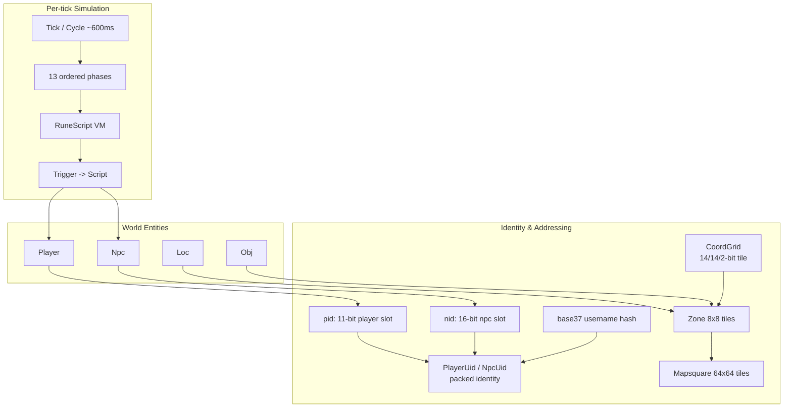

**[← Whitepaper index](../README.md)**  ·  [Single-file version](whitepaper-full.md)

# Part X · Reference

> *Definitions and the road ahead.*

---

## 30. Glossary of Domain & Engine Terms

This glossary defines the RuneScape/Jagex domain vocabulary and the rs-engine-specific
jargon a reader needs to navigate the rest of this whitepaper. Each entry is tied to how
*this* codebase uses the term, with a `relative/path.rs:LINE` citation where one anchors
the meaning. Terms fall into three loose buckets: **domain** concepts inherited from the
RuneScape 2 (~revision 225) protocol and the TypeScript reference server
("LostCity"/"2004scape" lineage), **engine** mechanics specific to rs-engine's
single-threaded Rust architecture, and **wire/crypto** terms governing the client
protocol. They are interleaved alphabetically below.

The relationships between the most heavily cross-referenced terms are sketched first, then
the alphabetized definitions follow.

### A--C

**anticheat** — A family of client-emitted diagnostic packets (`anticheat_cyclelogic1..6`,
`anticheat_oplogic1..9`, e.g. `rs-protocol/src/network/game/client/anticheat_oplogic1.rs`)
that the original client sends to prove it is executing genuine game logic. rs-engine
decodes them for protocol fidelity but treats them as effectively inert "dead packets" —
they are part of the `RestrictedEvent` rate-limited category. The term does *not* refer to
a behavioral cheat-detection subsystem in this server.

**AP / OP triggers (approach / operate)** — The two-stage interaction model. An **OP**
("operate") trigger fires when an entity stands adjacent to / on its interaction target;
an **AP** ("approach") trigger fires from a distance (within `ap_range`, default 10) and
typically requests the engine to walk closer. The engine enforces the invariant **OP = AP

+ 7** for every interactable class, with five sequential option slots each
  (`rs-entity/src/player.rs:1133`). World-target input handlers (oploc/opnpc/opobj/opplayer)
  arm an *approach* interaction and defer walk-to resolution to the movement phase
  (see *opXxx* and section 19).

**autosave** — The sixth of the thirteen tick phases (`rs-engine/src/phases/autosave.rs`).
It increments non-bot playtime every tick and performs a full save of every player every
`AUTOSAVE_INTERVAL = 250` ticks (~150 s, skipping tick 0). See *save* and section 23.

**base37** — A username encoding that packs up to 12 characters (`a`-`z` -> 1-26
case-insensitive, `0`-`9` -> 27-36, everything else -> 0) into a single `u64` in base 37,
stripping trailing zero-digits (`rs-util/src/base37.rs:34`, `to_userhash`). It is the
canonical, case-insensitive, allocation-free representation of a player name used in
friend/ignore lists, chat, and inside `PlayerUid`. The inverse `to_raw_username`
(`base37.rs:83`) reconstructs the lowercase name; `to_screen_name` (`base37.rs:147`)
produces a title-cased display name (`"hello_world"` -> `"Hello World"`).

**BigInfo** — A wide-header rule in the player-info update-mask protocol. When the set of
update masks exceeds what fits in a single byte, the `BigInfo = 0x80` flag
(`rs-protocol/src/network/game/info_prot.rs`) signals a two-byte mask header. The info
encoder computes the header from the *full* mask set so the per-observer memcpy stays
byte-identical (section 14).

**BlockWalk** — A loc/npc cache property describing what an entity blocks for pathing.
The npc variant is the enum `BlockWalk { None = 0, All = 1, Npc = 2 }`
(`rs-pack/src/types.rs:338`); loc types carry a simpler `blockwalk: bool`
(`rs-pack/src/cache/loc.rs:22`). It drives whether the entity writes collision flags and,
for npcs, maps through `MoveRestrict` to a `CollisionType`/extra-flag pair (section 21).

**BlockWalk vs zone membership decoupling** — A deliberate map-load invariant: a static loc
contributes to collision *only if* its type's `blockwalk` is set, but is added to a zone's
loc list *only if* its type's `active == Some(true)` — the two are independent
(`rs-engine/src/game_map.rs:239`).

**cam (camera)** — The `rs-cam` crate plus the `CamReset`/`CamShake`/etc. server packets.
Camera ops are queued in absolute world coordinates and localized to build-area-relative
coordinates during `update_map` (section 16). The client camera is purely a render concern;
the server only schedules ops.

**CacheStore** — The runtime in-memory content store (`rs-pack/src/cache/mod.rs:57`):
24+ `TypeProvider<T>` config tables (obj, loc, npc, inv, enum, struct, …) plus interface,
font, wordenc, MIDI, seq-frame, db-table-index, JAGs, mapsquares, CRC table, and static
assets. It is built once at boot by `pack_all` (which compiles content *in memory*, never
reading a disk cache), leaked to `'static` via `Box::into_raw`, and reachable from VM
handlers via the `CACHE_PTR` thread-local. In-place hot-reload writes new data into the same
leaked allocation (section 17).

**cert / noted (certificate)** — A "noted"/stackable proxy item. There is no special item
type; certs are resolved through the `ObjType` fields `certtemplate`/`certlink`
(`rs-vm/src/util.rs:886` `uncert`, `:907` `cert`). The VM ops `INV_MOVEITEM_CERT`/`UNCERT`
(`rs-vm/src/ops/inv.rs:436`/`:464`) compose a delete + add to swap between the unnoted item
and its noted form (section 15).

**cluster** — The set of world nodes that share the cross-world "ether" fabric. The
`--cluster` CLI argument (`rs-server/src/main.rs:158`) is *not* parsed by Rust; it is
forwarded verbatim as the `RS_CLUSTER_HOSTS` env var to the Elixir/OTP sidecar, whose
libcluster EPMD strategy actually meshes the `worldNN@127.0.0.1` BEAM nodes (section 24).

**CoordGrid** — The canonical absolute tile position: a `u32` newtype packing Z (bits 0-13,
mask `0x3FFF`), X (bits 14-27, mask `0x3FFF`), and Y level (bits 28-29, mask `0x3`)
(`rs-grid/src/coord.rs:22`). It is `Copy`, hashes as a primitive, round-trips losslessly to
`u32`/`i32` (top bits always zero), and is the universal currency for positions across the
engine. Zone = `pos >> 3`, mapsquare = `pos >> 6` (section 7).

**cluster-wide login lock** — An Elixir `:global` lock acquired during login so that the same
account cannot complete login on two worlds simultaneously; part of the three-flag login
authorization handshake (section 24).

**cycle** — One execution of `Engine::cycle` (`rs-engine/src/engine.rs:563`): the function
that runs all 13 phases in order, advances `engine.clock` once, and returns a `bool`
(`true` = fatal shutdown). One cycle = one **tick**. See *tick*, *phase*.

### D--H

**Despawn** — One of two `EntityLifeTime` values (`= 1`, `rs-entity/src/lifetime.rs:8`).
A Despawn loc/obj is a *runtime-spawned, temporary* entity: it is pushed into its zone's
list on add and `swap_remove`d on removal, and is visible only until its lifetime expires.
Contrast *Respawn*.

**dirty tracking** — The append-then-dedup pattern used to transmit only changed state.
Inventories append touched slot indices to `dirty_slots` and sort/dedup at flush
(`rs-inv/src/lib.rs:107` `mark_dirty`, `:123` `collect_dirty`); stats and varps use analogous
snapshot-diff logic; zones collect into a per-tick `zones_tracking` `FxHashSet` (section 8,
15, 16).

**emergency removal** — The per-entity fault-recovery path. When a hot phase's per-entity
`catch_unwind` traps a panic, the offending player is `emergency_remove_player`d (NPCs
`emergency_deactivate_npc`d) and iteration resumes at the next slot, *without* setting the
fatal flag (`rs-engine/src/phases/input.rs:49`). For players this still extracts the profile,
fires a DB save and an ether logout — durability over availability (`engine.rs:1996`).

**EntityLifeTime** — The two-state lifecycle enum `{ Respawn = 0, Despawn = 1 }`
(`rs-entity/src/lifetime.rs:8`) governing whether a loc/obj is a permanent map fixture or a
runtime spawn. See *Respawn*, *Despawn*.

**ether** — rs-engine's cross-world social/login bus. Each Rust world talks over a private
loopback TCP socket to a local Elixir/OTP `rs-ether` sidecar; the sidecars form the actual
distributed mesh. "Ether" is the 8th of 13 tick phases (`engine.rs:588`), draining the
inbound ether channel (friend/ignore updates, private messages, login checks). The outbound
opcodes are `0..12`, inbound `128..133` (section 24).

**force** — A modifier on script execution that *bypasses* the protection/delay skip. A
non-forced script bails if the active player is already protected or delayed; a forced one
runs regardless (`engine.rs:1081`). Pairs with *protect*.

**hero (hero points / damage attribution)** — The `rs-hero` crate: a fixed 16-slot
leaderboard tracking how much damage each attacker dealt to an entity, used to award loot/XP
to the top contributor. It is cleared on a full heal and sorted with a deliberately
non-stable parity-tiebreaker quicksort ported for bit-fidelity with the reference (section 16).

**high_blocks / info block** — A pre-coalesced per-entity byte buffer produced once per tick
in the info phase, holding that entity's serialized update masks (its "info block"). The
output phase memcpys these blocks into each observer's packet rather than re-encoding
(section 14). See *info block*, *update mask*.

**hunt** — The npc target-acquisition scan. `process_npc_hunt_players` (player-hunting only)
is hoisted into the *world* phase for a consistent pre-movement player-position snapshot;
npc-vs-npc/obj hunts run in the npc phase. Scans use single-pass reservoir sampling
(`count += 1; if rng.next_int_bound(count) == 0 { chosen = candidate }`,
`rs-entity/src/npc.rs:730`) over a radius of `1 + (hunt_range >> 3)` zones (section 5b).

### I--L

**if (interface)** — A client UI component definition (the `IfTypeProvider` in the cache).
"if" prefixes interface-related server packets (`IfSetText`, etc.) and input handlers
(`if_button`, `inv_button`). An interface may be opened as a **modal** (see *modal*) or as a
non-blocking overlay (section 19).

**info block** — See *high_blocks*. The serialized per-entity update-mask payload, the unit
that the player-info/npc-info pipeline coalesces once (producer = info phase) and replays
many times (consumer = output phase). This split is rs-engine's single-encode improvement
over the reference server's per-observer re-walk (section 14).

**inv (inventory)** — Any item container: backpack, bank, shop, equipment, trade. All are the
single flat `rs_inv::Inventory` type (`rs-inv/src/lib.rs:17`) — `capacity`, `slots:
Vec<Option<Item>>`, a `StackMode`, dirty tracking, and a `stockobj` shop list. `Item` is the
`Copy` pair `{ obj: u16, num: u32 }`. Keyed by `InvType.id`; `Temp`/`Perm` invs live on the
player, `Shared` invs in the world-level `Engine::invs` map (section 15).

**ISAAC** — The stream cipher (Indirection, Shift, Accumulate, Add, Count) used to *whiten
opcode bytes* on the game protocol. After login, an `IsaacPair { encode, decode }`
(`rs-crypto::isaac`, used at `rs-server/src/socket.rs:84`) is negotiated from client seeds;
the decode stream seeds are the raw seeds, the encode stream's are `seeds + 50`. Every
inbound opcode is recovered as `wire_byte.wrapping_sub(isaac_decode.next_int() as u8)`
(`active_player.rs:1745`) and every outbound opcode masked as
`(PROT + isaac_encode.next_int()) as u8` (`active_player.rs:284`). ISAAC lives in the
external `rs-crypto` crate, not the workspace.

**JAG / mapsquare data** — Packed cache archives (`Arc<[u8]>` in `CacheStore`). Mapsquare
ground/loc/npc/obj data is decompressed (BZip2) on map load to build the collision map and
static entity lists (`rs-engine/src/game_map.rs`).

**loc (location)** — A static or dynamic *scenery* object placed on a tile: trees, doors,
walls, etc. (the `l` in mapsquare data, `LocType` in the cache). At runtime a loc bit-packs
into a `u128` (coord, width, length, lifecycle bit, and dual base/current 25-bit info)
(`rs-entity/src/loc.rs:6`). The dual base/current info enables `change()`/`revert()`: layer
is read from base, id/shape/angle from current. Identity within a zone is `lid()` packing
local `x&7`, `z&7`, and layer (`loc.rs:204`).

**LocAngle** — The 2-bit rotation of a loc: `West = 0, North = 1, East = 2, South = 3`
(`rs-pack/src/types.rs:42`). On East/West angles, ground-loc collision swaps width/length
(`game_map.rs:572`).

**LocLayer** — Which of four render/collision layers a loc occupies:
`Wall = 0, WallDecor = 1, Ground = 2, GroundDecor = 3` (`rs-pack/src/types.rs:51`). The layer
selects the collision dispatch in `change_loc_collision` — Wall -> `change_wall`, WallDecor
-> no-op (decorations never block), Ground -> `change_loc`, GroundDecor -> `change_floor`
(`game_map.rs:553`).

**LocShape** — The geometric/visual sub-form of a loc within its layer (16 variants:
`WallStraight = 0`, `WallDiagonalCorner = 1`, `WallL = 2`, … `CentrepieceStraight = 10`, …)
(`rs-pack/src/types.rs:60`). Shape + angle determine which complementary wall-edge flag pairs
are written.

**low_memory** — A per-player client flag negotiated at login (`info & 0x1` in the handshake,
`rs-server/src/socket.rs:47`; stored at `rs-entity/src/player.rs:105`). It indicates a
memory-constrained client requesting reduced detail; carried through `LoginRequest` into the
player.

### M--O

**mapsquare** — A 64x64-tile region = 8x8 zones = 4096 tiles. Derived from a tile as
`pos >> 6` (`rs-grid/src/coord.rs:379`). `MapsquareCoordGrid` packs a mapsquare-*local* 6/6/2
offset into a `u16` usable directly as a dense `0..16383` array index into a `GameMap`'s flat
collision/terrain array (`rs-grid/src/mapsquare_coord.rs:22`, section 7, 21).

**members** — A boolean world/account property gating members-only content. It is a server
boot argument (`rs-server/src/main.rs:126`) threaded into the web client and the cache: on a
free-to-play world, `ObjType::post_decode` *disables* member items via `ObjContext { members }`
(section 17).

**modal** — A blocking interface that intercepts input. The player's `modal_state` is a `u8`
bitmask: `MODAL_MAIN = 1, MODAL_CHAT = 2, MODAL_SIDE = 4, MODAL_TUT = 8` (with
`MODAL_NONE = 0`) (`rs-entity/src/player.rs:20`). Only `MAIN | CHAT` actually block input —
`contains_modal_interface` tests `(modal_state & (MODAL_MAIN | MODAL_CHAT)) != 0`
(`player.rs:283`). Terminal script cleanup closes the main modal when `modal_state & MODAL_MAIN
== MODAL_NONE`.

**nid (npc index)** — The 16-bit slot index of an npc in the fixed `npcs[MAX_NPCS]` slab
(`MAX_NPCS = 8192`). It is the low 16 bits of an `NpcUid` and a direct array index
(`rs-vm/src/npc_uid.rs:54`).

**node / world** — A single world process. Its `node_id` is a `u8` CLI arg (default 10,
`rs-server/src/main.rs:136`); the world number shown to clients is `node_id - 10`, and ports
are node-derived (`http = 8070 + node_id`, `tcp = 43584 + node_id`, `ether = 5000 + node_id`).
Multiple nodes joined by the ether form a *cluster* (section 24, 25).

**npc (non-player character)** — A server-controlled mobile entity. Identified by `nid`
(slot) and `id` (type), packed together in an `NpcUid = (id << 16) | nid`
(`rs-vm/src/npc_uid.rs:26`). A "morph" keeps the `nid` but changes the `id`. NPCs are
processed in the third tick phase; their AI runs RuneScript triggers (hunt, mode, ai-spawn).

**obj (ground object / item-on-ground)** — A dropped/spawned item lying on a tile (distinct
from an *inventory item*, though both reference an `ObjType`). It bit-packs into a `u64`
(coord, lifecycle bit, 16-bit id) plus side fields count/`receiver37`/reveal/`last_clock`
(`rs-entity/src/obj.rs:5`). Public objs use `receiver = NO_RECEIVER` (`u64::MAX`). Visibility
is clock-gated (`visible(clock)`, `obj.rs:91`). Identity within a zone is `oid()`
(`obj.rs:108`). See *REVEAL_TICKS*.

**opcode** — A numeric instruction/message identifier. The term is overloaded across three
spaces in this engine: (1) **RuneScript opcodes** — VM instructions in a dense `0..LAST=11000`
dispatch table, banded by subsystem (core 0-46, player 2000-2132, npc 2500-2547, …)
(section 12); (2) **client/server protocol opcodes** — `ClientProt` (75 inbound) /
`ServerProt` (~68 outbound) revision-225 wire opcodes (section 18); (3) **cache TLV opcodes**
— per-config decode tags (section 17). Context disambiguates.

**opXxx / opXxxT / opXxxU (operate handlers)** — The input-handler naming taxonomy. The base
verb is `op{held,loc,npc,obj,player}` with a numbered option slot (1-5). A `T` suffix means a
*spell/on-target* op (the target is another entity, gated by an `action_target` bitmask: OBJ
`0x1`, NPC `0x2`, LOC `0x4`, PLAYER `0x8`, HELD `0x10`); a `U` suffix means *use-item-on*
(`rs-engine/src/handlers/...`, section 19).

**OpsRegistry** — The VM's flat dispatch table: `Box<[Option<Handler>; LAST]>` with
`Handler = fn(&mut ScriptState) -> Result<()>` and `LAST = 11000`
(`rs-vm/src/register.rs:9,21`). `get` uses unchecked indexing — a jump-table-equivalent dense
dispatch built by extending 16 sub-registries (section 11, 12).

### P--R

**phase** — One of the 13 ordered stages of a tick, executed in fixed order: **world, input,
npcs, players, logouts, autosave, logins, ether, saves, zones, info, out, cleanup**
(`rs-engine/src/engine.rs:582`). The ordering is dependency-driven: *mutate fully before
observing, observe fully before transmitting*. Each phase is bracketed by the `phase!` macro
for timing and `catch_unwind` panic isolation (section 5, 5b).

**pid (player index)** — The 11-bit slot index of a player in the fixed `players[MAX_PLAYERS]`
slab (`MAX_PLAYERS = 2048`, so `0..=2047` exactly fills 11 bits). It is the low 11 bits of a
`PlayerUid` (`& 0x7FF`, `rs-vm/src/player_uid.rs:62`) and the direct slab index. Iteration
order over pids is the canonical "PID order" preserved for client fidelity.

**player** — A human-controlled entity. Identified by `pid` (slot) and a base37 username,
packed into a `PlayerUid = (username37 << 11) | (pid & 0x7FF)`. Stored as
`Vec<Option<ActivePlayer>>`; `ActivePlayer` is the engine-side handle wrapping the entity plus
a boxed `ClientHandle` (network endpoints).

**PlayerUid** — The packed player identity: a `u128` = `(username37 << 11) | (pid & 0x7FF)`
(`rs-vm/src/player_uid.rs:15`). `pid()` returns the low 11 bits; `username37()` the upper
base37 hash, decodable back to the name. Used wherever a player must be named stably in
scripts/queues/interactions independent of slot reuse.

**protect / ProtectedActivePlayer** — A per-run guard that scopes "the active player is
protected" to a single script execution. The executor sets the `ProtectedActivePlayer`
pointer and `player.state.protect` before running and clears them afterward regardless of
outcome (`engine.rs:1091`, `:1104`). Protected mutating inventory/world ops require the
`PROTECTED_ACTIVE_PLAYER` pointer to be set (`rs-vm/src/ops/inv.rs:113`). Non-forced scripts
skip already-protected/delayed players. See *force*.

**queue (world queue / script queue)** — Two distinct queues. (1) The **world queue** is a
`LinkList<ScriptState>` intrusive arena (`engine.rs:396`) drained first in the world phase;
`WorldSuspended` scripts re-enqueue here with a `delay + 1` bias (section 13). (2) The
per-player/npc **script queue** (`rs-queue`) is a triple-lane `LinkList<QueuedScript>`
(queue/weak/engine lanes) with Strong-displaces-Weak and engine-delay-forced-to-0 rules,
drained in fixed phase order (section 16).

**rebuild (RebuildNormal)** — The server packet (`ServerProt::RebuildNormal = 237`) that tells
the client to load a new build-area window of mapsquares around the player. The engine
recomputes the player's build-area zones and re-sends zone state on rebuild (section 8, 18).

**REVEAL_TICKS** — The constant `100` (`rs-entity/src/obj.rs:5`): the number of ticks after
which a privately-dropped obj becomes visible to all players (its `last_clock` reveal point).
Drives the public/private visibility transition of ground objs.

**RuneScript** — The cache-compiled, stack-based scripting language that drives all game
content (npc AI, item use, dialogue, quests). Programs are stored SoA (parallel `opcodes`/
`int_operands`/`string_operands`/`switch_tables` slices) and run on the rs-vm interpreter
(`vm::execute`, `rs-vm/src/vm.rs:51`). Bound to game events via *triggers* (section 11, 12, 13).

**Respawn** — The `EntityLifeTime` value `= 0` (`rs-entity/src/lifetime.rs:8`): a *permanent
map fixture* loaded from cache data. A Respawn loc/obj is kept in its zone's Vec even when
"removed" — it is merely hidden via the clock and reverts to its base state after
modification. Contrast *Despawn*.

### S--U

**ScriptState** — The per-invocation VM register file (`rs-vm/src/state.rs`): two fixed-128
operand stacks (int + string), type-split int/string locals, gosub/goto frame stacks, eight
active-entity slots (primary/secondary pairs), the `execution: ExecutionState`, and
`root_script_id`. Init allocates ~4 KB; the engine pools a single `reusable_script` and calls
`reset()` (reusing heap buffers in place) to defeat that allocation across 20,000+
invocations/tick (`engine.rs:413`, section 11).

**skill** — See *stat*. "Skill" is the player-facing name (Attack, Mining, …); "stat" is the
engine type.

**snapshot** — Two senses. (1) **Info snapshots**: 12-byte `#[repr(C)]` `PlayerSnapshot`/
`NpcSnapshot` structs (coord, len, run/walk dir, flags) in dense arrays, taken in the info
phase to keep the ~250-entry tracked loop L1/L2-cache-resident instead of dereferencing
~2.4 KB `ActivePlayer`s (`rs-engine/src/phases/info.rs:123`). (2) **pid snapshot**: the
`take_pids`/`put_pids` recycled `Vec<u16>` of processing order, snapshotted so phases can
emergency-remove entities mid-iteration safely (`engine.rs:238`).

**stat (skill)** — A player/npc proficiency. `rs_stat::Stats<N>` is const-generic over count
(N = 21 for players, 6 for NPCs) holding `levels`/`base_levels: [u8; N]` and `xp: [i32; N]`
(`rs-stat/src/lib.rs:10`). XP follows the exact RS2 curve `points(L) = floor(L + 300·2^(L/7))`
with `xp = sum/4`, capping at level 99 and 200,000,000 XP. New players start level 1 / 0 XP
except Hitpoints at level 10 (section 16).

**suspension** — A RuneScript continuation/yield. A script may park mid-execution in one of
several `ExecutionState`s: `Suspended`/`PauseButton`/`CountDialog` park on the player,
`NpcSuspended` parks on an npc, `WorldSuspended` re-enqueues on the world queue with a popped
delay. The pooled `ScriptState` is *not* reclaimed while suspended (it holds the live
continuation) — only on `Finished`/`Aborted` (section 11, 13).

**StackMode** — The inventory stacking policy: `Normal` (defer to the item's `stackable` flag),
`Always` (banks/shops), `Never` (equipment/trade) (`rs-inv/src/lib.rs:3`). The `stackable`
bool is passed *in* by the VM; `rs-inv` never reads the item cache itself (section 15).

**tick** — One ~600ms heartbeat = one *cycle* of the single-threaded loop. Driven by a tokio
`interval` with `MissedTickBehavior::Skip` (so a slow tick does not burst-catch-up) and a
watch-channel-controlled clock rate (`rs-server/src/main.rs:696`). `engine.clock` is a `u64`
monotonic counter advanced exactly once per tick; the published tick number is
`engine.clock - 1`. See *cycle*, *phase*.

**timer** — A scheduled RuneScript invocation owned by an entity. `rs-timer::ScriptTimer` has
two lanes (`normal` + `soft`) of `FxHashMap<i32, TimedScript>` keyed by script id
(`rs-timer/src/lib.rs:8`). A firing timer re-arms `clock` from the firing tick; `Normal`
timers are gated on player accessibility, `Soft` timers are not (section 16).

**trigger** — The binding between a game event and a RuneScript program. The 168-variant
`ServerTriggerType` enum (`#[repr(u8)]`, `Proc = 0` .. `AiDespawn = 167`,
`rs-vm/src/trigger.rs:18`) names every event. `Engine::trigger_lookup_key` (`engine.rs:701`)
packs `base | (spec << 8) | (id << 10)` and probes most-specific-first — by-type
(`spec = 0x2`), then by-category (`spec = 0x1`), then the bare trigger — returning each tier
only if a script exists (section 13, 17).

**uid (PlayerUid / NpcUid)** — A packed unique identifier carrying both an entity's *type/name*
and its *slot index* in one integer, so scripts can name an entity stably across slot reuse.
`PlayerUid` (`u128`) = name+pid; `NpcUid` (`u32`) = type+nid (`rs-vm/src/player_uid.rs`,
`npc_uid.rs`). See *pid*, *nid*, *PlayerUid*, *NpcUid*.

**update mask (info mask)** — A per-entity bitset (`EntityMasks.masks: u16`,
`rs-info/src/lib.rs`) flagging which render aspects changed this tick (appearance, anim,
face-coord, say, damage, spotanim, exactmove, chat). The info pipeline delta-encodes only the
flagged blocks. Masks split into **temporary** fields (cleared by `reset()`) and
**persistent** fields (appearance, anims, face_entity, orientation, vis — replayed in
low-definition to new observers). The `FaceCoord` bit differs by entity type: player `0x20`,
npc `0x80` (section 9, 14).

### V--Z

**varbit (variable bit)** — In *RuneScript/cache terms*, a bit-field view over a portion of a
`varp` (a "variable bit"). In **this engine it is not implemented** as a runtime type:
`rs-var` has no bit-mask/shift/base-varp logic, and there is no `Varbit` variant in
`ScriptVarType` (`rs-pack/src/types.rs:174`). The word `varbit` appears only in the cache
opcode tables, content `.rs2` scripts, and the reference TypeScript — it is a content-language
concept the Rust engine does not model directly (section 16, 17).

**varp (player variable) / varn (npc variable)** — A persistent typed state slot. `rs_var::VarSet`
wraps a `Vec<VarValue>` indexed by id (`rs-var/src/lib.rs:18`); reference types
(obj/npc/loc/coord/boolean/enum/struct) default to `-1` (note: Boolean defaults to `-1`, not 0),
Int to 0, String to `""` (`rs-pack/src/cache/mod.rs:171`). Setting a varp also transmits it to
the client (`VarpSmall` if `val <= 255`, else `VarpLarge`), skipping varps whose cache
`transmit == false`; npc varns are never transmitted (section 16, 18).

**vis (visibility) / VIS_HARD** — Persistent visibility flags on an entity. A `VIS_HARD`
condition is one of the `should_remove` predicates that drops an entity from an observer's
tracked set (alongside not-present, teleport, level change, out-of-view-distance, not-active)
(`rs-engine/src/phases/info.rs:161`, section 14).

**world queue** — See *queue*. The `LinkList<ScriptState>` of delayed/suspended world scripts
drained at the start of every tick (world phase) with a `delay + 1` re-enqueue bias so
`delay = 0` fires next tick (`engine.rs:1303`).

**zone** — An 8x8-tile spatial partition: the area-of-interest unit. Each `Zone`
(`rs-zone/src/zone.rs:41`) owns its players/npcs/locs/objs lists, a per-tick `events` queue,
and a `shared: Option<Vec<u8>>` pre-encoded broadcast buffer. World mutations route to exactly
one zone as `ZoneEvent`s, are encoded *once* into the shared buffer (`compute_shared`), and
flushed during the output phase to only the ~49 zones in each player's 7x7 active window
(`update_zones`). Zones are stored sparsely as `FxHashMap<ZoneCoordGrid, Box<Zone>>` with lazy
allocation. Single-encode broadcast is rs-engine's improvement over the reference's per-player
re-walk (section 7, 8).

[↑ Back to top](#top)

---

## 31. Conclusion & Roadmap

### What Has Been Built

`rs-engine` is a complete, authoritative RuneScape 2 (build 225) server: it authenticates the stock client, simulates a
world of players, NPCs, locs, and objs on a single-threaded 600 ms heartbeat, runs original RuneScript content through
an embedded bytecode VM, encodes byte-identical wire output, persists to PostgreSQL, and federates across world nodes
through a cross-world ether — all inside a `tokio` async host that never lets network or database latency touch the
tick. Across nineteen crates and ~50,000 lines of Rust, it demonstrates a coherent thesis: that the reference server's
model can be preserved exactly while its performance and predictability ceilings are removed by a systems-language
substrate.

The engineering threads that run through every chapter of this document are worth restating as a whole:

- **A strict, compiler-checked architecture.** The crate graph is an acyclic DAG; the entity↔VM cycle is broken by trait
  inversion; the world is touched by exactly one thread and reached by every opcode through a single ambient bridge.
- **A data model designed for the cache.** Packed-integer coordinates and UIDs, slab-allocated registries, const-generic
  stat arrays, boxed-out cold fields, and per-tick snapshots keep the hot path small and contiguous.
- **A compute-once-broadcast-many wire pipeline.** Info blocks and zone events are encoded a single time per tick and
  copied into each observer's packet, validated byte-for-byte against reference encoders.
- **Resilience by construction.** `catch_unwind` phase boundaries and per-entity emergency removal mean a content bug
  costs one entity, not the world — which is why the release profile keeps `panic = "unwind"`.
- **Fidelity as a hard constraint.** Java-faithful arithmetic and RNG, exact string and bit encodings, and unmodified
  RuneScript semantics make the server substitutable for the original from the client's point of view.

### The Engineering Character

The recurring motif of the codebase is *disciplined aggression*: it reaches for the fast, low-level technique — a global
pointer, an in-place cache swap, a raw bit accumulator, a pooled script state — but each reach is paired with a stated
invariant (single-threaded access), a localisation (the `unsafe` is concentrated and documented), and a test (
differential byte-identity, exhaustive mask combinations, tens of thousands of random streams). It is fast *because* it
is careful, not in spite of it. That pairing — maximum mechanical sympathy under a maximally strict fidelity contract —
is the engine's signature.

### Performance Roadmap

The optimization work to date has focused on the per-tick hot path: the player/NPC info encode, zone updates, inventory
deltas, and script execution. The candidate levers that remain are documented in full
in [Performance Engineering](part-09-engineering-deep-dives.md#sec-26); the highlights, framed as forward work with an
explicit measurement-first discipline, are:

- **A custom global allocator — measured before adopted.** No `#[global_allocator]` is set anywhere in the workspace,
  which makes it the most-cited remaining lever (a segregating allocator such as mimalloc, chosen for Windows-MSVC
  compatibility). The strongest mechanism is that outbound packet buffers are allocated on the tick thread and freed on
  the socket threads — cross-thread alloc/free, the pathological case for a default heap. **But the recommendation is to
  instrument first, not swap first:** an opt-in counting allocator can report per-tick allocation counts, and on Windows
  the default heap's Low-Fragmentation Heap already segregates free-lists, while the tick itself is CPU-bound on encode
  and VM work. If allocations per tick are in the hundreds, the allocator is irrelevant to tick latency; if tens of
  thousands, it is worth adopting. The lever is real but unproven, and should be gated on data.
- **Wider buffer and state reuse.** Extending the pooled-`ScriptState` coverage to every per-tick script site, recycling
  the outbound write-immediate buffers, and reusing inventory-delta scratch all remove allocation from the hot path. The
  constraint is that any change touching the encoder must be proven byte-identical (or explicitly opted into as a wire
  change), since several of these paths sit directly on the wire.
- **Save scheduling.** Staggering autosaves and making the binary-serialisation path lazy spreads persistence cost
  across ticks rather than spiking it.
- **Profile-guided optimization (PGO).** With LTO and `opt-level` already maxed, PGO is the principal remaining *build*
  lever; the expected blended-tick win is low single-digit percent, so it is deferred behind the allocator and pooling
  work. (BOLT is not applicable — it does not support the Windows PE/COFF target.)

The honest bottom line carried throughout: allocation strategy, output/VM buffer reuse, and inventory dirty-gating are
the substantive wins; most other micro-levers are marginal and would be largely absorbed by a real allocator. The
roadmap is therefore short and prioritised, not a wish list.

### Verification Methodology

Because the engine optimises aggressively against a strict fidelity contract, *how* changes are validated is part of the
design, not an afterthought:

- **Differential encode tests.** The optimized `BitWriter` is checked against the reference `pbit` read-modify-write
  path over large random streams; the coalesced info blocks are checked against the field-by-field reference encoder
  exhaustively across all update-mask combinations; the per-tick snapshot's removal logic is checked against the
  field-level reference. These run under `cargo test` for `rs-engine`, `rs-info`, and `rs-pack`.
- **In-world load testing.** Because the tick is cache-coupled and hard to construct in a unit test, end-to-end
  behavior is confirmed with a large simulated-player run (bot movement gated behind a `bot` flag), reading the
  already-plumbed `TickStats` for median and p99 phase timings.
- **Live observability.** Every tick publishes per-phase timings to a watch channel surfaced in the terminal dashboard
  and the `tick_stats` tracing target, so regressions in the budget are visible immediately rather than discovered in
  production ([Build & Toolchain](part-09-engineering-deep-dives.md#sec-29)).

The standing constraints for all future work are the ones this whitepaper has documented: the tick stays
single-threaded, the wire bytes and tracked ordering stay unchanged unless a change is proven faithful, and the
`catch_unwind` safety nets stay live (`panic = "unwind"`).

### Closing

`rs-engine` set out to prove that a faithful RuneScape 2 server need not choose between the content workflow of the
reference engine and the performance headroom of a systems language — that, with care, you can keep RuneScript, the
phase model, hot reload, and byte-exact emulation while moving the substrate to Rust and buying deterministic latency,
layout control, and a checked-unsafe escape hatch in the bargain. The chapters above are the detailed account of how
that was done. What remains is incremental: measure the allocator, widen the pools, stagger the saves, and keep every
byte honest.

[↑ Back to top](#top)

---

[← Part IX](part-09-engineering-deep-dives.md)  ·  [↑ Index](../README.md)  · —
