<a id="top"></a>

# rs-engine — A Technical Whitepaper

> **A from-scratch Rust reimplementation of a build-225 RuneScape 2 game server.**
> This document is its complete engineering reference: the architecture, the algorithms, the wire formats, the unsafe
> surface, the performance engineering, and the rationale behind every load-bearing decision.

|                     |                                                                                                                   |
|---------------------|-------------------------------------------------------------------------------------------------------------------|
| **Project**         | `rs-engine` (workspace root: `rs-majula`)                                                                         |
| **Version**         | 0.1.0                                                                                                             |
| **Language**        | Rust, **edition 2024**, MSRV **1.95** (`stable` toolchain)                                                        |
| **License**         | MIT                                                                                                               |
| **Workspace**       | 19 crates · ~50,000 lines of Rust                                                                                 |
| **Execution model** | Single-threaded game loop — `Engine::cycle()` runs **13 ordered phases** every **600 ms**                         |
| **Target scale**    | ~2,000 concurrent players per world node                                                                          |
| **Protocol target** | RuneScape 2, **build 225** (circa 2004) — bit-for-bit compatible with the stock client and original cache content |
| **Host**            | `tokio` async shell (network/DB/ether I/O) wrapping a single-threaded deterministic simulation                    |

---

## Abstract

`rs-engine` is a complete, production-oriented game server for the *build 225* revision of RuneScape 2, written from
scratch in Rust. It is functionally modeled on the canonical open-source TypeScript reference server (the
*LostCity / 2004scape* lineage), but rebuilt around three uncompromising goals: **byte-identical protocol and content
emulation** (the stock, unmodified client must connect and play against unmodified cache data), **single-threaded
deterministic simulation** (one world advances in lockstep, 600 ms per tick), and **mechanical sympathy** (every data
layout, allocation, and hot path is chosen for cache locality and a bounded per-tick CPU budget at two thousand
players).

The system is a Cargo workspace of nineteen crates organised by responsibility: a host crate (`rs-engine`) that owns the
mutable world and the tick, fourteen narrow leaf libraries (coordinates, zones, entities, the RuneScript virtual
machine, inventories, info-block encoding, vars/stats/timers/queues/hero/camera, and intrusive data structures), a
content/cache compiler (`rs-pack`), a logic-free wire codec (`rs-protocol`), and the async binary (`rs-server`). The
architectural keystone is a strict acyclic dependency graph enforced by the compiler, broken out of the reference
server's monolithic object soup by inverting the entity↔VM relationship through traits and an ambient `with_engine`
bridge. This whitepaper documents all of it — from the `u32`-packed coordinate system and the slab-allocated entity
registries up through the stack-based RuneScript interpreter, the single-encode-broadcast info pipeline, the
channel-isolated I/O boundary, and the `catch_unwind` resilience model — together with the performance philosophy and
the unsafe invariants that make a `!Sync`, globally-reachable `Engine` sound.

## About This Whitepaper

**Audience.** Engineers who want to understand, extend, or learn from the engine: contributors, emulation researchers,
systems-programming students, and anyone studying how to push a soft-real-time simulation to its performance ceiling in
Rust. The document assumes fluency in Rust and general systems concepts; it does *not* assume prior knowledge of
RuneScape internals — domain jargon is defined inline and collected in the [Glossary](#sec-30).

**How it is organised.** The whitepaper is divided into ten parts that progress from motivation, to architecture, to
each subsystem in depth, to cross-cutting engineering concerns, to reference material:

- **Part I — Foundations & Motivation:** what the engine is, the design philosophy, and why it is written in Rust rather
  than reusing the TypeScript reference.
- **Part II — Architecture & the Tick:** the crate graph and data flow, the 600 ms cycle, the thirteen phases, the
  engine core, and the intrusive data structures beneath it.
- **Part III — The Spatial World & Entities:** coordinates, zones, the four entity kinds, and collision/pathfinding.
- **Part IV — The RuneScript Engine:** the virtual machine, the opcode instruction set, and the trigger/scheduling
  model.
- **Part V — Player State & Items:** inventories and the per-player sub-systems.
- **Part VI — Networking & the Wire:** the info-block encoder, the network protocol, and the input handlers.
- **Part VII — Content, Persistence & Distribution:** the cache pipeline, the database, and the multi-world ether.
- **Part VIII — Runtime & Host:** the async I/O boundary and the server binary.
- **Part IX — Engineering Deep-Dives:** performance, memory safety and the unsafe inventory, emulation fidelity, and the
  build/toolchain.
- **Part X — Reference:** a glossary and the forward roadmap.

**Conventions.** Every factual claim about behavior is anchored to the source as `path/to/file.rs:line` — these are
clickable in most editors. Diagrams are rendered with [Mermaid](https://mermaid.js.org/) (GitHub renders them natively);
wire/byte layouts are given as ASCII tables. Code excerpts are short and illustrative, not exhaustive copies. Where a
statement is an architectural inference rather than a directly-stated fact in the source, it is marked as such. Line
numbers reflect the codebase at the time of writing and may drift as the tree evolves; the surrounding identifiers
remain the durable reference.

**A note on completeness.** This is a deliberately exhaustive document. It is meant to be read in parts or consulted by
section, not necessarily front-to-back in one sitting. Readers who want the fastest possible mental model should read
Part II in full ([Architecture](#sec-04) → [The Game Tick](#sec-05) → [The Thirteen Phases](#sec-06)), then dip into the
subsystem they care about.

---

## Table of Contents

**Part I · Foundations & Motivation**

- [1. Introduction](#sec-01)
- [2. Design Philosophy & Goals](#sec-02)
- [3. Why Rust Over the TypeScript Reference Engine](#sec-03)

**Part II · Architecture & the Tick**

- [4. System Architecture — Topology, Crate Graph & Data Flow](#sec-04)
- [5. The Game Tick — Cycle Orchestration](#sec-05)
- [6. The Thirteen Phases in Detail](#sec-06)
- [7. The Engine Core — State Container, Registries & World Mutation](#sec-07)
- [8. Core Data Structures — Intrusive Lists & Open-Addressed Tables](#sec-08)

**Part III · The Spatial World & Entities**

- [9. The Coordinate System & Spatial Addressing](#sec-09)
- [10. Zones — Spatial Partitioning & Event Broadcasting](#sec-10)
- [11. Entities — Players, NPCs, Locs & Objs](#sec-11)
- [12. Collision & Pathfinding](#sec-12)

**Part IV · The RuneScript Engine**

- [13. The RuneScript Virtual Machine — Architecture & Execution Model](#sec-13)
- [14. The RuneScript Instruction Set — Opcode Catalog](#sec-14)
- [15. Triggers, Scheduling & the World Queue](#sec-15)

**Part V · Player State & Items**

- [16. Inventories & Items](#sec-16)
- [17. Player Sub-Systems — Vars, Stats, Timers, Queues, Hero, Camera](#sec-17)

**Part VI · Networking & the Wire**

- [18. Player & NPC Info Blocks — The Wire-Encoding Pipeline](#sec-18)
- [19. The Network Protocol & Packet Model](#sec-19)
- [20. Input Handlers — From Client Packet to Game Action](#sec-20)

**Part VII · Content, Persistence & Distribution**

- [21. The Game Cache & Content Pipeline](#sec-21)
- [22. Persistence — Player Saves & the Database Client](#sec-22)
- [23. Multi-World & the Ether](#sec-23)

**Part VIII · Runtime & Host**

- [24. The Async I/O Boundary & Client Lifecycle](#sec-24)
- [25. The Server Binary — Bootstrap, HTTP & TUI](#sec-25)

**Part IX · Engineering Deep-Dives**

- [26. Performance Engineering — The Optimization Playbook](#sec-26)
- [27. Memory Safety & the Unsafe Inventory](#sec-27)
- [28. Emulation Fidelity — Java Semantics & Byte-Identical Wire Format](#sec-28)
- [29. Build System, Toolchain & Observability](#sec-29)

**Part X · Reference**

- [30. Glossary of Domain & Engine Terms](#sec-30)
- [31. Conclusion & Roadmap](#sec-31)

---

# Part I · Foundations & Motivation

> *Why this engine exists, what it values, and why it is written in Rust rather than reusing the reference server.*


---

<a id="sec-01"></a>

## 1. Introduction

### What rs-engine Is

`rs-engine` is a complete authoritative game server: a long-running process that holds the entire mutable state of a
virtual world — every player, non-player character (NPC), ground item, scenery object, inventory, variable, and script
in flight — and advances that world one discrete *tick* at a time while streaming the results to connected game clients.
It is the server half of a client/server massively-multiplayer game, specifically the *build 225* revision of *
*RuneScape 2**, a tile-based 3D MMORPG whose original client dates to 2004.

Concretely, the engine:

- **Accepts and authenticates connections** from the stock game client over a custom binary protocol (RSA-secured login
  handshake, ISAAC-whitened opcode stream), as well as a WebSocket transport for browser clients.
- **Simulates the world** on a fixed 600 ms heartbeat: it resolves movement and pathfinding, runs NPC artificial
  intelligence, executes content scripts, applies combat and skills, manages ground items and scenery changes, and
  maintains each player's area of interest.
- **Encodes and transmits** the per-tick delta of everything each player can see — other players, NPCs, map changes,
  inventory updates, interface state — in the exact byte layout the 2004 client expects.
- **Persists** player profiles to PostgreSQL and **coordinates** across multiple world nodes through a cross-world
  messaging fabric (the "ether") for login arbitration, friends, and private messaging.
- **Runs content** written in **RuneScript**, the original server-side scripting language, compiled to bytecode and
  executed by an embedded stack-based virtual machine — so that quests, objects, NPCs, and skills are defined as
  data/scripts rather than hard-coded engine logic.

The defining adjective throughout is *authoritative*: the client is a thin renderer that trusts the server for all game
state. Every rule, every random roll, every collision check, and every byte on the wire is the server's responsibility,
and must match the original closely enough that a client built in 2004 cannot tell the difference.

### The Game It Emulates

RuneScape 2 (build 225) is a 2D-grid world rendered in 3D. The world is addressed as a lattice of **tiles**, grouped
into **8×8 zones**, grouped into **64×64 map squares**, across four vertical **levels** (height planes). Players and
NPCs occupy tiles and move between them; **locs** (scenery/location objects — doors, trees, walls, furniture) and **objs
** (ground items) populate the tiles. Interaction is verb-on-noun: a player clicks an *option* on a loc, npc, obj,
player, or inventory item, optionally with another item or target, and the server resolves the approach, validates it,
and dispatches the bound script.

Two external artifacts define the game and are treated by `rs-engine` as fixed inputs it must satisfy exactly:

1. **The cache** — the binary content archive: maps, models, animations, interfaces, and the configuration tables for
   every obj, npc, loc, and parameter. `rs-engine` reads (and can compile) this content but does not redefine its
   formats; see [The Game Cache & Content Pipeline](#sec-21).
2. **The client** — the unmodified 2004 executable/applet. Its expectations about packet structure, bit packing,
   RNG-driven visuals, and string encoding are the specification the server's wire layer is written against;
   see [Emulation Fidelity](#sec-28).

This is why "emulation" is the right word: `rs-engine` is not *a* game server that happens to look like RuneScape, it is
a re-implementation of *the* RuneScape 2 build-225 server contract, validated by the fact that real cache content and a
real client work against it without modification.

### Lineage: From Jagex to the Reference Server to Rust

The intellectual lineage of this project runs in three stages:

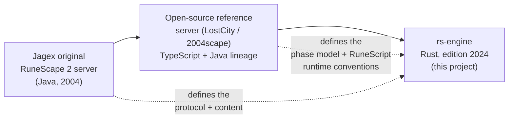
```mermaid
flowchart LR
    A["Jagex original\nRuneScape 2 server\n(Java, 2004)"] --> B["Open-source reference\nserver (LostCity / 2004scape)\nTypeScript + Java lineage"]
    B --> C["rs-engine\nRust, edition 2024\n(this project)"]
    A -. "defines the\nprotocol + content" .-> C
    B -. "defines the\nphase model + RuneScript\nruntime conventions" .-> C
```

1. **The original Jagex server** (Java, ~2004) defined the protocol, the cache formats, RuneScript, and the
   single-threaded tick model. It is not public; it is the *behavioral specification* that the community has
   reverse-engineered.
2. **The open-source reference server** — the *LostCity / 2004scape* lineage, written primarily in TypeScript (with Java
   antecedents) — is the public, documented, content-complete re-implementation that codified the phase ordering, the
   RuneScript trigger conventions, the info-block protocols, and the overall server shape that the community builds on.
3. **`rs-engine`** is a Rust re-implementation in that lineage. It deliberately preserves the *observable contract* (
   protocol, content, RuneScript semantics, phase ordering, single-threaded determinism) while replacing the
   *implementation substrate* to remove the performance and predictability ceilings of a garbage-collected,
   dynamically-typed runtime. The reasoning for that substrate change is the subject
   of [Why Rust Over the TypeScript Reference Engine](#sec-03).

### What "Emulation" Means Here

Emulation in this project is a hard, testable constraint, not an aesthetic. It has three faces:

- **Byte-identical wire output.** The player-info and NPC-info blocks, zone updates, inventory packets, and interface
  packets are bit-packed to the exact layout the client decodes. The encoder is validated by differential tests that
  compare optimized paths against field-by-field reference encoders over exhaustive mask combinations and tens of
  thousands of random streams (see [Emulation Fidelity](#sec-28) and [Info Blocks](#sec-18)).
- **Java-faithful arithmetic and randomness.** RuneScape's mechanics were computed with Java's 32-bit wrapping integer
  arithmetic and `java.util.Random`. `rs-engine` reproduces both: a hand-ported `JavaRandom` linear-congruential
  generator (seeded identically — `engine.rs` constructs `JavaRandom::new(1084838400000)`), and a release profile that
  disables overflow checks so Rust integers wrap exactly as Java's did. RNG-dependent mechanics therefore resolve the
  same way they did on the original server.
- **RuneScript semantics.** The same scripts, compiled to the same bytecode shape, executed with the same
  trigger-resolution and suspension rules. Content authored for the reference server runs unmodified.

When these three hold, the engine is *substitutable* for the original from the client's and content's point of view —
which is the whole point.

### Scope and Non-Goals

**In scope:** the authoritative world simulation; the wire protocol and login; content execution (RuneScript VM); the
cache/content pipeline; persistence; multi-world coordination; and the operational shell (HTTP service for the web
client and cache, a live terminal dashboard, hot-reload of content).

**Out of scope (by design):** the game client itself (unmodified, external); the cache *content* (maps, models, scripts
are inputs, authored separately, though `rs-engine` ships the compiler for them); and game-design balance decisions (
these live in content/RuneScript, not the engine). The engine's job is to be a fast, faithful, resilient *substrate* for
that content.

### The Shape of the System

At the highest level, `rs-engine` is a single-threaded deterministic simulation wrapped in a multi-threaded async host:

- A **`tokio` shell** (`rs-server`) owns the sockets, the HTTP service, the database client, the ether client, and the
  terminal UI. Every connection is an independent async task.
- A **single world task** runs the engine. It never blocks on I/O; it exchanges *owned byte buffers* with the async host
  exclusively through channels. This is the boundary that lets a lock-free single-threaded simulation coexist with
  concurrent network and database work — examined in [System Architecture](#sec-04)
  and [The Async I/O Boundary](#sec-24).
- Inside the world task, **`Engine::cycle()`** runs thirteen ordered phases per tick, each isolated by a `catch_unwind`
  boundary so that a panic in one player's logic removes that player rather than crashing the world.

The chapters that follow build this picture bottom-up and top-down at once: Part II lays out the architecture and the
tick; Parts III–VIII descend into each subsystem; Part IX steps back to the cross-cutting engineering — performance,
safety, fidelity, and tooling — that ties the whole together.

<sub>[↑ Back to top](#top)</sub>


---

<a id="sec-02"></a>

## 2. Design Philosophy & Goals

Every non-trivial system embodies a small number of priorities that, when they conflict, decide the design. `rs-engine`
has six, and they are remarkably consistent across the codebase — the same handful of principles explain the
slab-allocated registries, the single-encode info pipeline, the `catch_unwind` phase boundaries, and the global `Engine`
singleton alike. This section states them explicitly and ties each to the concrete mechanisms that follow.

### Pillar 1 — Emulation Fidelity Is Non-Negotiable

The first question asked of any change is: *does the client still see exactly the right bytes?* Fidelity is the
constraint that outranks everything else, because the entire value of the project is that real content and a real client
work against it.

This manifests as:

- **Byte-identical encoders**, validated by differential tests rather than trusted by
  inspection ([Info Blocks](#sec-18), [Emulation Fidelity](#sec-28)).
- **Java-semantics arithmetic and RNG** — wrapping 32-bit integers (`overflow-checks = false`) and a ported
  `java.util.Random` seeded identically to the original world — so probabilistic and arithmetic mechanics match
  tick-for-tick.
- **Preservation of observable ordering** where the client depends on it (e.g. the tracked-entity insertion order in
  info blocks), even when the internal algorithm that produces it is replaced with a faster one.

A performance optimization that changes a single wire byte is, by default, *rejected* — unless it is proven
reference-faithful or explicitly opted into as a wire change. This is the discipline that keeps a heavily-optimized hot
path trustworthy.

### Pillar 2 — Performance & Efficiency as a First-Class Feature

The engine is built to carry **~2,000 concurrent players on a single world thread within a 600 ms tick**. That budget is
the organising number of the whole project: at two thousand players, the per-player-per-tick info encode and the
per-zone broadcast dominate, and everything in the data model is shaped to keep those paths cache-resident and
allocation-light.

The performance posture is *mechanical sympathy*, not micro-optimization for its own sake:

- **Compact, packed data.** Coordinates are a single `u32`; entity UIDs, `Loc`s, and `Obj`s pack their fields into one
  integer; stats are const-generic fixed arrays. Hot structures are deliberately small so more of the working set fits
  in cache ([Coordinates](#sec-09), [Entities](#sec-11)).
- **Allocation discipline.** Fixed-capacity slab arrays for players and NPCs, a pooled `ScriptState`, reused scratch
  buffers, and write-once shared encode buffers replace per-operation heap
  traffic ([Engine Core](#sec-07), [Performance Engineering](#sec-26)).
- **Compute-once, broadcast-many.** Each entity's update block and each zone's event stream are encoded a single time
  per tick and then copied into every observer's packet — not re-derived per
  observer ([Info Blocks](#sec-18), [Zones](#sec-10)).
- **A release build tuned for throughput:** fat LTO, a single codegen unit, `target-cpu=native`, and stripped
  symbols ([Build & Toolchain](#sec-29)).

Performance is treated as correctness's equal partner: the optimization work is extensive, but it is always gated by the
fidelity tests of Pillar 1.

### Pillar 3 — Single-Threaded Determinism

The world advances on **one thread**. This is a deliberate, defended choice, not a limitation waiting to be removed. A
single-threaded tick gives:

- **Determinism** — given the same inputs and the same RNG seed, the world evolves identically, which makes the
  simulation reproducible and the fidelity tests meaningful.
- **No lock contention, no data races, no synchronization overhead** on the hot path — the engine holds plain `&mut`
  references to its registries, zones, renderers, and inventories with zero atomics.
- **A simple mental model** — phases run in a fixed order, each fully completing before the next begins, so "what is
  true right now" is always well-defined.

The cost — that the tick cannot use multiple cores — is accepted. Parallelising the output phase across cores was
evaluated as the single largest theoretical win at 2,000 players and **deliberately declined**; the design instead
pursues cache-locality and algorithmic wins within one thread. The single-threaded invariant is what licenses the
engine's most aggressive choices (the global `Engine` pointer, `unsafe impl Send` without `Sync`, the in-place cache
hot-swap); it is examined in [Memory Safety](#sec-27).

### Pillar 4 — Resilience: One Bad Entity Must Never Kill the World

At scale, content bugs are inevitable: a script divides by zero, an interaction dereferences a stale target. The
engine's stance is that **such a fault must cost at most one entity, never the whole world.**

This is implemented with `std::panic::catch_unwind` boundaries:

- Each of the thirteen phases is wrapped so a panic is caught, logged, and contained ([The Game Tick](#sec-05)).
- The hot per-entity loops (input, npcs, players, info, output) catch panics *per entity* and **emergency-remove** just
  the offending player or NPC — saving the player's profile first — then continue the loop.
- Only an unrecoverable phase-level panic escalates to a full, durable evacuation of all players.

This resilience model is the reason the release profile keeps **`panic = "unwind"`** rather than `abort`: under `abort`,
every `catch_unwind` net silently becomes dead code and a single content bug takes down two thousand sessions.
Preserving unwinding through an aggressive LTO build is a conscious trade of a little code size for production
survivability.

### Pillar 5 — Live Iteration

Content development is the day-to-day workload, and recompiling/restarting a stateful world server for every script
tweak is unacceptable. The engine therefore supports **hot reload**: a file-watcher (`notify`) detects content changes,
the cache and scripts are recompiled, and the new `CacheStore` is swapped *in place* into the same `'static` allocation
every reference already points to — under the single-threaded invariant that makes the raw-pointer swap
sound ([Cache Pipeline](#sec-21), [Build & Toolchain](#sec-29)). Online players keep playing across the reload.

This is the one place where the reference server's greatest strength — rapid, data-driven content iteration via
RuneScript — is explicitly preserved rather than traded away. Rust buys performance; it must not cost the content
workflow, and it doesn't.

### Pillar 6 — Documentation & Verifiability

The codebase is unusually heavily documented at the source level (the engine's core file carries extensive rustdoc on
every public item, including call-stack and side-effect notes), and the correctness-critical paths are covered by
*differential* tests that pin optimized code to reference implementations. The philosophy is that a system this
aggressive about performance and this strict about fidelity can only stay maintainable if its invariants are written
down and machine-checked. This whitepaper is the capstone of that principle.

### The Tick Budget as the Organizing Constraint

If one idea unifies all six pillars, it is the **600 ms tick budget**. Fidelity defines *what* must be produced each
tick; performance defines *how fast*; single-threading defines *on what*; resilience defines *what happens when a tick
goes wrong*; hot-reload defines *how the rules change between ticks*; and documentation/verification defines *how we
know it's still right*. Every chapter that follows can be read as an answer to the same question: **how does this
subsystem do its job within 600 ms, two thousand players at a time, without ever lying to the client?**

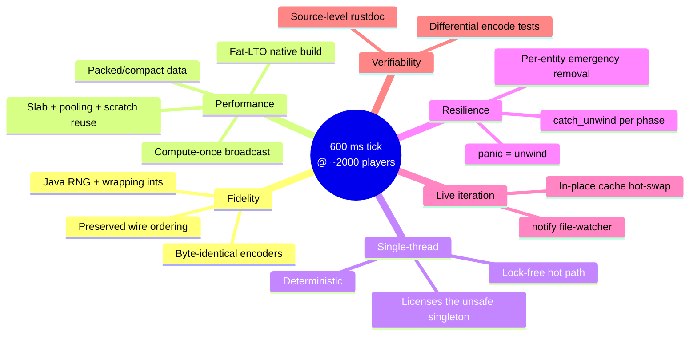
```mermaid
mindmap
  root((600 ms tick<br/>@ ~2000 players))
    Fidelity
      Byte-identical encoders
      Java RNG + wrapping ints
      Preserved wire ordering
    Performance
      Packed/compact data
      Slab + pooling + scratch reuse
      Compute-once broadcast
      Fat-LTO native build
    Single-thread
      Deterministic
      Lock-free hot path
      Licenses the unsafe singleton
    Resilience
      catch_unwind per phase
      Per-entity emergency removal
      panic = unwind
    Live iteration
      notify file-watcher
      In-place cache hot-swap
    Verifiability
      Source-level rustdoc
      Differential encode tests
```

<sub>[↑ Back to top](#top)</sub>


---

<a id="sec-03"></a>

## 3. Why Rust Over the TypeScript Reference Engine

The single most common question about this project is: *the reference server already exists and works — why rewrite it
in Rust?* This section answers it directly. The short version: the reference engine's substrate imposes a performance
and predictability ceiling that becomes the binding constraint at MMO scale, and Rust removes that ceiling **without**
forcing the project to give up the things the reference engine does well. The argument is not "Rust is better"; it is "
for an authoritative, latency-bounded, single-threaded simulation that must produce exact bytes, Rust's specific
trade-offs line up almost perfectly with the workload."

### The Reference Engine and Its Ceiling

The *LostCity / 2004scape* reference server is, at its core, a single-threaded tick loop written in TypeScript on
Node.js (with Java antecedents). That is a thoroughly reasonable choice: TypeScript is approachable, the iteration loop
is fast, and a single-threaded event loop maps naturally onto a single-threaded game tick. The reference server is
content-complete and authoritative; `rs-engine` owes it the entire phase model, the RuneScript conventions, and the
protocol knowledge.

But the substrate has structural costs that matter precisely in the hottest part of an MMO server:

- **Garbage collection introduces non-deterministic latency.** A tick must complete within 600 ms *every* time; a V8
  major GC pause lands whenever the allocator decides, not when the tick budget allows. At a few hundred players this is
  invisible; at two thousand, with thousands of short-lived encode buffers churned per tick, GC pressure and pause
  jitter eat into the budget unpredictably. The reference server's per-player-per-tick info encode is exactly the kind
  of high-allocation hot path that feeds the GC the most.
- **Dynamic typing and boxed values defeat cache locality.** A RuneScape world is millions of tile/zone/entity lookups
  per tick. In a JIT'd dynamic language, the "compact" representations the engine wants — a coordinate as one integer,
  an entity as a small struct in a dense array — are not guaranteed; objects are heap-boxed, fields are property-bag
  lookups, and arrays of objects are arrays of pointers. The working set balloons and the cache misses multiply.
- **No direct control over memory layout or allocation.** The reference engine cannot choose to pool a script state,
  slab-allocate its entity table, or write a single shared byte buffer and `memcpy` it into every observer's packet with
  confidence about the resulting machine code. These are the techniques that make the 2,000-player tick fit; they
  require a language that lets you say exactly where bytes live.
- **Bit-twiddling the wire format is unnatural.** The protocol is bit-packed and byte-exact. A systems language with
  `u8`/`u32`/`u128`, explicit wrapping arithmetic, and no hidden number coercions expresses the encoder more safely and
  more literally than a language whose only number is an IEEE double.

None of these make the reference engine *wrong* — they make it the wrong tool for pushing a single world to its absolute
scale ceiling while holding a hard per-tick deadline.

### What Rust Buys

Rust's value here is not abstract "speed"; it is a specific set of capabilities that map onto the six pillars
of [the design philosophy](#sec-02):

- **Total control of memory layout.** `CoordGrid` is a `u32`; `Loc` is a `u128`; `Obj` is a `u64`; player/NPC tables are
  `Vec<Option<T>>` slabs indexed by id; `Stats<N>` is a const-generic fixed array. Hot structures are small, contiguous,
  and cache-friendly *by construction*. The info optimization work — boxing cold fields out of `ActivePlayer` to shrink
  the players `Vec` from tens of megabytes to a cache-friendlier footprint, and reading a 12-byte per-tick snapshot
  instead of a large entity slot — is only expressible because the language exposes layout.
- **No garbage collector, no pause jitter.** Memory is freed deterministically at scope end. The 600 ms budget is spent
  on simulation, not on a collector that runs on its own schedule. Latency is a function of work done, not of allocator
  state.
- **Zero-cost abstractions and monomorphisation.** Generics, iterators, and trait dispatch compile down to the same
  machine code a hand-written specialization would produce. The const-generic `Stats<N>`, the width-generic
  `BitWriter::pbit::<N>`, and the trait-based VM bridge cost nothing at runtime.
- **Fearless, *checked* unsafe where it pays.** The single-threaded invariant lets the engine use a global `Engine`
  pointer and an in-place cache swap that would be reckless in a multi-threaded design. Rust makes these explicit (
  `unsafe`, `unsafe impl Send`, raw pointers) and lets the rest of the 50k-line codebase remain safe — the danger is
  *localized and documented* rather than ambient ([Memory Safety](#sec-27)).
- **The borrow checker enforces architecture.** The crate graph is a strict DAG because Cargo refuses to compile a
  path-dependency cycle. The reference server's natural entity↔VM cycle is broken in `rs-engine` by inverting it through
  traits — and that inversion is a *compiler-checked* invariant, not a style guideline ([Architecture](#sec-04)).
- **Native compilation with aggressive optimization.** Fat LTO across the whole workspace, one codegen unit, and
  `target-cpu=native` produce a binary tuned to the host's instruction set, with cross-crate inlining into the hot tick
  path ([Build & Toolchain](#sec-29)).
- **Honest integer types for an honest wire.** `wrapping_*` arithmetic, fixed-width integers, and
  `overflow-checks = false` in release reproduce Java's 32-bit semantics exactly, while debug builds still catch
  unintended overflow. The encoder reads like the specification.

### What Was Deliberately Kept

A rewrite is only worth it if it keeps the strengths of what it replaces. `rs-engine` is conservative about *what* it
changes:

- **RuneScript stays.** Content is still authored in the original scripting language, compiled to bytecode, and executed
  by an embedded VM ([VM Core](#sec-13), [Opcode Catalog](#sec-14)). The rewrite is of the *engine*, not the *content
  language* — quests and skills remain data, not Rust.
- **The phase model stays.** The same thirteen-phase ordering, the same trigger-resolution and suspension rules, the
  same area-of-interest and info-block protocols. A contributor who knows the reference server's tick will recognise
  this one.
- **Single-threaded determinism stays.** Rust is used to make the *single* thread faster, not to parallelise the tick.
  The model the reference server pioneered is preserved; only its execution speed and predictability change.
- **Rapid iteration stays.** Hot-reload of content/scripts keeps the edit-test loop tight despite the move to a compiled
  language ([Cache Pipeline](#sec-21)).

The thesis, then, is *substrate replacement*: keep the contract and the content workflow, swap the runtime for one that
can hold the deadline at scale.

### A Side-by-Side Comparison

| Dimension          | TypeScript / Node reference                 | `rs-engine` (Rust)                                          |
|--------------------|---------------------------------------------|-------------------------------------------------------------|
| Tick model         | Single-threaded event loop                  | Single-threaded deterministic loop (preserved)              |
| Latency profile    | Subject to V8 GC pause jitter               | No GC; latency ∝ work done                                  |
| Memory layout      | Heap-boxed objects, pointer arrays          | Packed integers, dense slabs, const-generic arrays          |
| Allocation control | Implicit, GC-managed                        | Explicit: pooling, slabs, scratch reuse, write-once buffers |
| Numeric model      | IEEE double everywhere                      | Fixed-width ints + explicit wrapping (Java-faithful)        |
| Concurrency safety | Single-threaded by runtime                  | Single-threaded by design; `unsafe` localized + checked     |
| Module boundaries  | Convention                                  | Compiler-enforced acyclic crate DAG                         |
| Wire encoding      | Manual on dynamic numbers                   | Bit-packed on native integer types, differentially tested   |
| Content language   | RuneScript                                  | RuneScript (preserved)                                      |
| Hot reload         | Yes                                         | Yes (in-place `'static` cache swap)                         |
| Build/runtime      | Interpreted/JIT, instant start              | Compiled, fat-LTO native, tuned to host CPU                 |
| Primary cost       | Performance/predictability ceiling at scale | Longer compile times; steeper language                      |

### The Honest Trade-offs

Choosing Rust is not free, and the project pays real costs:

- **Compile times.** A fat-LTO, single-codegen-unit release build of a 50k-line workspace is slow. This is mitigated
  structurally — fine-grained crates localise incremental recompiles, and a `dev-opt` profile offers a middle ground —
  but a release build is never instant ([Build & Toolchain](#sec-29)).
- **Language difficulty.** The borrow checker, lifetimes, and the discipline around `unsafe` raise the bar to contribute
  relative to TypeScript. The mitigation is that the dangerous parts are few, isolated, and documented, and the safe
  majority of the codebase is ordinary Rust.
- **The cost of the rewrite itself.** Re-implementing a content-complete server is a large undertaking, justified only
  because the performance ceiling is a genuine, binding problem for the target scale.

The conclusion is narrow and defensible: **for this specific workload — an authoritative, byte-exact, single-threaded
simulation under a hard per-tick deadline at MMO scale — Rust's control over layout, its absence of GC jitter, its
zero-cost abstractions, and its checked-unsafe escape hatch are worth the compile times and the learning curve.** The
rest of this whitepaper is the evidence for that claim, subsystem by subsystem.

<sub>[↑ Back to top](#top)</sub>


---

# Part II · Architecture & the Tick

> *The static crate graph and the dynamic 600 ms heartbeat that drives everything.*


---

<a id="sec-04"></a>

## 4. System Architecture — Topology, Crate Graph & Data Flow

This section is the reader's map of the whole engine. It establishes the *static* shape of rs-engine — the workspace
topology and the exact crate-dependency graph derived from every member `Cargo.toml` — and then the *dynamic* shape —
how bytes flow from a client socket through decode, handler, script/engine mutation, zone/info encoding, and back out as
bytes, and how a login traverses the network, engine, ether, and database boundaries. Everything below is grounded in
the workspace manifests and the subsystem behavior documented elsewhere in this whitepaper; the deep mechanics of each
subsystem live in its own dedicated section, cross-referenced here.

rs-engine is a Cargo workspace pinned to **edition 2024** with `rust-version = "1.95"` and `resolver = "2"` (
`Cargo.toml:23-28`). It is composed of **19 workspace members** (`Cargo.toml:2-22`): the host crate `rs-engine`,
fourteen focused subcrates nested under `rs-engine/`, the sibling content crate `rs-pack`, the wire-protocol crate
`rs-protocol` with its proc-macro helper `rs-protocol/macros`, and the binary crate `rs-server`. Versions are
centralised: every internal dependency and every third-party crate is declared once under `[workspace.dependencies]` (
`Cargo.toml:33-99`) and each member opts in via `{ workspace = true }`, so the entire tree resolves a single coherent
version set and a single lint policy (`[workspace.lints]`, `Cargo.toml:101-106`).

### Workspace Topology

The workspace is layered by *responsibility*, not by directory depth. The host crate `rs-engine` owns the mutable world
state and the 13-phase tick; the nested subcrates are leaf data/algorithm libraries with deliberately narrow APIs;
`rs-pack` and `rs-protocol` are the content and wire boundaries; `rs-server` is the async shell and process entry point.
LOC figures below are source-line counts across each crate's `src/` (including tests, which are extensive and
co-located).

| Crate                | Path                      | Purpose                                                                                                                                                                         | LOC (~) |
|----------------------|---------------------------|---------------------------------------------------------------------------------------------------------------------------------------------------------------------------------|---------|
| `rs-engine`          | `rs-engine`               | World-state container + 13-phase tick orchestrator; owns `Engine`, players/NPCs slabs, world mutation, login/logout/save/ether/zone/info phase code, the script executor bridge | 22,500  |
| `rs-pack`            | `rs-pack`                 | Game cache + content pipeline: `pack_all` compiler, `CacheStore`, `ScriptProvider`, RuneScript bytecode, config TLV decoders, MIDI/wordenc/DB index; also a `rs-pack` bin       | 16,200  |
| `rs-vm`              | `rs-engine/rs-vm`         | RuneScript stack-based bytecode interpreter: `vm::execute`, `ScriptState`, `OpsRegistry`, opcode handlers, `with_engine` thread-local bridge, suspension protocol               | 11,200  |
| `rs-protocol`        | `rs-protocol`             | Logic-free wire codec: `ClientProt`/`ServerProt` opcode enums, frame sizes, per-packet encode/decode, login handshake types, info-block wrappers                                | 4,500   |
| `rs-entity`          | `rs-engine/rs-entity`     | The four world-entity kinds (Player, Npc, Loc, Obj), `PathingEntity`, interaction state, masks, `BuildArea`, packed UIDs                                                        | 3,400   |
| `rs-info`            | `rs-engine/rs-info`       | Player/NPC info wire-encoding: `EntityMasks`, `BitWriter`, `Slot` renderer, pre-coalesced delta blocks                                                                          | 2,400   |
| `rs-zone`            | `rs-engine/rs-zone`       | Area-of-interest layer: 8×8-tile `Zone`, `ZoneMap`, `ZoneEvent`, single-encode broadcast buffer                                                                                 | 2,300   |
| `rs-grid`            | `rs-engine/rs-grid`       | Packed-integer coordinate newtypes: `CoordGrid`/`ZoneCoordGrid`/`MapsquareCoordGrid`, distance/AABB/wilderness predicates                                                       | 1,700   |
| `rs-util`            | `rs-engine/rs-util`       | Shared low-level helpers (e.g. base37, RNG, misc utilities) used across VM and engine                                                                                           | 1,800   |
| `rs-inv`             | `rs-engine/rs-inv`        | Single flat `Inventory` type for every container kind; `StackMode`, add/delete/move/transfer, certs                                                                             | 1,500   |
| `rs-datastruct`      | `rs-engine/rs-datastruct` | Arena-backed intrusive containers: `LinkList<T>` ring, bucketed `HashTable<T>`                                                                                                  | 1,200   |
| `rs-var`             | `rs-engine/rs-var`        | Per-entity `VarSet` (varps/varns) with type-aware defaults and client sync                                                                                                      | 366     |
| `rs-queue`           | `rs-engine/rs-queue`      | Triple-lane `LinkList`-based script queue (queue/weak/engine)                                                                                                                   | 448     |
| `rs-timer`           | `rs-engine/rs-timer`      | Dual-lane (Normal/Soft) timer registry keyed by script id                                                                                                                       | 378     |
| `rs-stat`            | `rs-engine/rs-stat`       | Const-generic `Stats<N>` (21 player / 6 NPC) levels/base/xp + RS2 XP curve                                                                                                      | 321     |
| `rs-hero`            | `rs-engine/rs-hero`       | Fixed 16-slot damage-attribution leaderboard                                                                                                                                    | 264     |
| `rs-cam`             | `rs-engine/rs-cam`        | Queued absolute-coordinate camera ops localized to build-area                                                                                                                   | 49      |
| `rs-server`          | `rs-server`               | Binary: tokio shell, bootstrap, `engine_tick` scheduler, HTTP/TUI, login handshake, sockets                                                                                     | 2,400   |
| `rs-protocol/macros` | `rs-protocol/macros`      | Proc-macros emitting `ClientProt`/`ServerProt` frame/category/priority consts                                                                                                   | 106     |

Two crates ship binaries in addition to libraries: `rs-server` is the game server (`[[bin]] name = "rs-server"`,
`rs-server/Cargo.toml:9-11`) and `rs-pack` exposes the offline content toolchain (`[[bin]] name = "rs-pack"`,
`rs-pack/Cargo.toml:12-14`) wired to the `cargo unpack`/`cargo verify` aliases (`.cargo/config.toml:2-3`).
`rs-protocol/macros` is a `proc-macro = true` crate (`rs-protocol/macros/Cargo.toml:8-9`) and is therefore a
compile-time-only dependency.

The defining structural choice is **fine-grained crate splitting**. Each subcrate compiles independently (parallel
`codegen-units` during dev builds, incremental recompiles scoped to one leaf), enforces module boundaries the
borrow-checker can reason about, and keeps the public surface of each data structure minimal. This is the Rust answer to
the reference TS server's single monolithic class graph: where the original keeps `Player`, `Npc`, `Zone`,
`Inventory`, and the VM in one process and one type namespace, rs-engine partitions them so that, e.g., `rs-grid` knows
nothing about entities and `rs-info` knows nothing about the cache. The penalty — more `Cargo.toml` files and explicit
re-exports — is paid once; the payoff is faster builds, clearer ownership, and the ability to unit-test a leaf (note the
extensive in-crate test suites inflating the LOC counts) without booting the world.

### The Crate-Dependency Graph

The following graph is derived **exactly** from the `[dependencies]` table of each member manifest. Internal edges are
solid; the external crates each subsystem pulls in are listed in the rationale below rather than drawn, except for the
load-bearing externals (`rs-io`, `rs-pathfinder`/`rsmod`, `rs-crypto`, `rs-runec`, `tokio`, `tokio-postgres`) which are
shown to make the trust boundaries explicit.

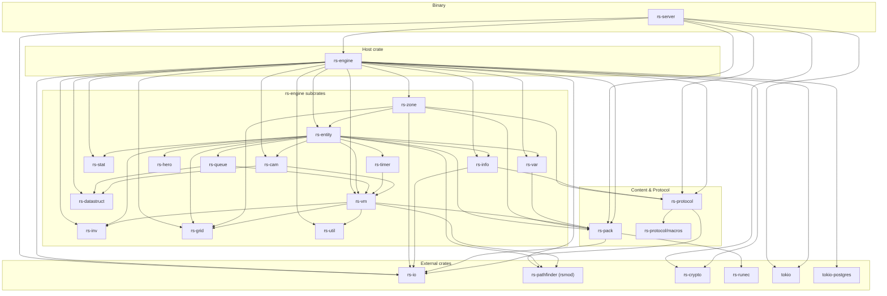
```mermaid
graph TD
    subgraph bin["Binary"]
        SERVER["rs-server"]
    end
    subgraph host["Host crate"]
        ENGINE["rs-engine"]
    end
    subgraph sub["rs-engine subcrates"]
        VM["rs-vm"]
        ENTITY["rs-entity"]
        ZONE["rs-zone"]
        INFO["rs-info"]
        INV["rs-inv"]
        VAR["rs-var"]
        STAT["rs-stat"]
        TIMER["rs-timer"]
        QUEUE["rs-queue"]
        HERO["rs-hero"]
        CAM["rs-cam"]
        GRID["rs-grid"]
        DS["rs-datastruct"]
        UTIL["rs-util"]
    end
    subgraph content["Content & Protocol"]
        PACK["rs-pack"]
        PROTO["rs-protocol"]
        PMACRO["rs-protocol/macros"]
    end
    subgraph ext["External crates"]
        IO["rs-io"]
        PATH["rs-pathfinder (rsmod)"]
        CRYPTO["rs-crypto"]
        RUNEC["rs-runec"]
        TOKIO["tokio"]
        PG["tokio-postgres"]
    end

    SERVER --> ENGINE
    SERVER --> PROTO
    SERVER --> PACK
    SERVER --> CRYPTO
    SERVER --> IO
    SERVER --> TOKIO

    ENGINE --> CAM
    ENGINE --> DS
    ENGINE --> ENTITY
    ENGINE --> GRID
    ENGINE --> INV
    ENGINE --> VM
    ENGINE --> ZONE
    ENGINE --> VAR
    ENGINE --> STAT
    ENGINE --> INFO
    ENGINE --> UTIL
    ENGINE --> PACK
    ENGINE --> PROTO
    ENGINE --> CRYPTO
    ENGINE --> IO
    ENGINE --> PATH
    ENGINE --> TOKIO
    ENGINE --> PG

    ENTITY --> CAM
    ENTITY --> GRID
    ENTITY --> HERO
    ENTITY --> INFO
    ENTITY --> INV
    ENTITY --> PACK
    ENTITY --> PATH
    ENTITY --> QUEUE
    ENTITY --> TIMER
    ENTITY --> VAR
    ENTITY --> VM
    ENTITY --> STAT

    ZONE --> ENTITY
    ZONE --> GRID
    ZONE --> PACK
    ZONE --> PROTO
    ZONE --> IO

    VM --> GRID
    VM --> INV
    VM --> PACK
    VM --> PATH
    VM --> UTIL

    QUEUE --> DS
    QUEUE --> VM
    TIMER --> VM
    CAM --> DS
    CAM --> VM
    VAR --> PACK
    INFO --> IO
    INFO --> PROTO

    PACK --> IO
    PACK --> RUNEC
    PROTO --> IO
    PROTO --> PMACRO
```

#### Reading the graph

- **`rs-server` is the only crate that touches `tokio` accept/listen and the only entry point.** Its dependencies are
  deliberately thin (`rs-server/Cargo.toml:13-33`): `rs-engine`, `rs-protocol`, `rs-pack`, `rs-io`, `rs-crypto`, plus
  the async/TUI stack (`tokio`, `tracing*`, `tokio-tungstenite`, `futures-util`, `sailfish`, `ratatui`, `crossterm`,
  `sysinfo`, `notify`, `clap`, `rand`). It depends on `rs-engine` for the world and on `rs-pack` only to call `pack_all`
  at boot. See [§25](#sec-25).
- **`rs-engine` is the convergence hub.** It pulls in **all** of `rs-cam`, `rs-datastruct`, `rs-entity`, `rs-grid`,
  `rs-inv`, `rs-vm`, `rs-zone`, `rs-var`, `rs-stat`, `rs-info`, `rs-util` plus `rs-pack`, `rs-protocol`, `rs-crypto`,
  `rs-io`, `rs-pathfinder` (under the import name `rsmod`), and the async crates `tokio`, `tokio-postgres`, `argon2`,
  `num_enum`, `rustc-hash` (`rs-engine/Cargo.toml:9-32`). It is the *only* subsystem that holds the `tokio-postgres` and
  `argon2` edges — persistence and password hashing live exclusively here (see [§22](#sec-22)).
- **`rs-entity` is the second-densest node.** It depends on twelve crates (`rs-entity/Cargo.toml:9-22`): `rs-cam`,
  `rs-grid`, `rs-hero`, `rs-info`, `rs-inv`, `rs-pack`, `rs-pathfinder`, `rs-queue`, `rs-timer`, `rs-var`, `rs-vm`,
  `rs-stat`. This reflects that a `Player`/`Npc` *aggregates* every per-entity subsystem (its stats, vars, timers,
  queues, inventory, hero list, camera, info masks, pathing). Notably `rs-entity` depends on `rs-vm` (entities own
  `ScriptState`-adjacent data and interaction targets), so the dependency runs entity → vm, not the reverse.
- **`rs-vm` sits below entities.** Its only edges are `rs-grid`, `rs-inv`, `rs-pack`, `rs-pathfinder`, `rs-util` (
  `rs-engine/rs-vm/Cargo.toml:9-19`). The VM does **not** depend on `rs-entity`; instead it defines the `ScriptEngine`/
  `ScriptPlayer`/`ScriptNpc` *traits* that `rs-engine` implements, inverting the dependency so opcode handlers reach
  world state through trait objects resolved via the `with_engine` thread-local bridge rather than through a concrete
  entity type. This is the keystone that breaks the entity↔vm cycle (see [§13](#sec-13)).
- **The pure leaves** are `rs-grid`, `rs-inv`, `rs-datastruct`, `rs-stat`, `rs-hero`, and `rs-util`, which have **no
  internal dependencies at all** (their manifests carry no `[dependencies]` section or only external ones). These are
  the foundation: packed coordinates, the flat inventory, the intrusive containers, the stat arrays, the hero
  leaderboard, and shared helpers. `rs-cam` is nearly a leaf (only `rs-datastruct` + `rs-vm`,
  `rs-engine/rs-cam/Cargo.toml:9-12`).
- **`rs-pack` is the content trust boundary.** It depends only on `rs-io` (byte cursor) and `rs-runec` (RuneScript
  compiler) plus tooling (`rs-engine/../rs-pack/Cargo.toml:16-26`: `clap`, `anyhow`, `tracing*`, `num_enum`,
  `rustc-hash`, `image`). Many subsystems depend *on* `rs-pack` (engine, vm, entity, zone, var) because they read static
  cache definitions; nothing in `rs-pack` depends back into the engine, keeping content decode acyclic.
- **`rs-protocol` is the wire trust boundary.** It depends on `rs-io` and the proc-macro crate `rs-protocol-macros` (
  `rs-protocol/Cargo.toml:10-13`), nothing else. `rs-info`, `rs-zone`, `rs-engine`, and `rs-server` consume it.
  Crucially `rs-protocol` carries **no game logic** — it is encode/decode only (see [§19](#sec-19)).
- **`rs-io` is the universal byte primitive.** It is the lowest external dependency, pulled by `rs-protocol`, `rs-info`,
  `rs-zone`, `rs-pack`, `rs-engine`, and `rs-server` — wherever bytes are read or written, `rs-io::Packet` is the
  cursor.

The graph is a **strict DAG**: every cycle the reference server tolerates (entities referencing the VM that references
entities) has been broken by trait inversion (`rs-vm` defines traits, `rs-engine` implements them) or by routing through
`rs-pack`/`rs-grid` leaves. This is enforced by Cargo — a dependency cycle between path crates fails to compile — so the
acyclic structure is a *checked* invariant, not a convention.

### The Layered Runtime Architecture

The crate graph is a build-time view. At runtime the system stratifies into five layers with a single hard rule: **only
the world task ever touches `Engine`**, and it communicates with every other thread exclusively through channels
carrying owned buffers. This is what makes the single-threaded tick deterministic and wall-clock-bounded despite a
multi-threaded host.

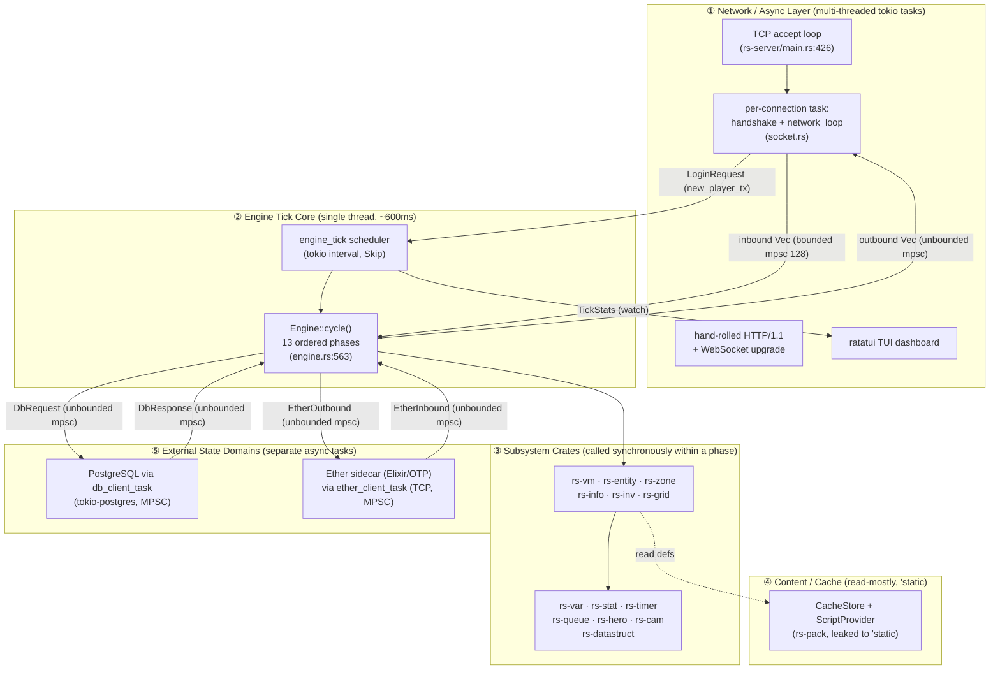
```mermaid
flowchart TB
    subgraph L1["① Network / Async Layer (multi-threaded tokio tasks)"]
        ACC["TCP accept loop\n(rs-server/main.rs:426)"]
        HS["per-connection task:\nhandshake + network_loop\n(socket.rs)"]
        HTTP["hand-rolled HTTP/1.1\n+ WebSocket upgrade"]
        TUI["ratatui TUI dashboard"]
    end
    subgraph L2["② Engine Tick Core (single thread, ~600ms)"]
        TICK["engine_tick scheduler\n(tokio interval, Skip)"]
        CYCLE["Engine::cycle()\n13 ordered phases\n(engine.rs:563)"]
    end
    subgraph L3["③ Subsystem Crates (called synchronously within a phase)"]
        S1["rs-vm · rs-entity · rs-zone\nrs-info · rs-inv · rs-grid"]
        S2["rs-var · rs-stat · rs-timer\nrs-queue · rs-hero · rs-cam\nrs-datastruct"]
    end
    subgraph L4["④ Content / Cache (read-mostly, 'static)"]
        CACHE["CacheStore + ScriptProvider\n(rs-pack, leaked to 'static)"]
    end
    subgraph L5["⑤ External State Domains (separate async tasks)"]
        DB["PostgreSQL via db_client_task\n(tokio-postgres, MPSC)"]
        ETHER["Ether sidecar (Elixir/OTP)\nvia ether_client_task (TCP, MPSC)"]
    end

    ACC --> HS
    HS -- "LoginRequest (new_player_tx)" --> TICK
    HS -- "inbound Vec<u8> (bounded mpsc 128)" --> CYCLE
    CYCLE -- "outbound Vec<u8> (unbounded mpsc)" --> HS
    TICK --> CYCLE
    CYCLE --> S1 --> S2
    S1 -. "read defs" .-> CACHE
    CYCLE -- "DbRequest (unbounded mpsc)" --> DB
    DB -- "DbResponse (unbounded mpsc)" --> CYCLE
    CYCLE -- "EtherOutbound (unbounded mpsc)" --> ETHER
    ETHER -- "EtherInbound (unbounded mpsc)" --> CYCLE
    TICK -- "TickStats (watch)" --> TUI
```

**Layer ① — Network / async.** One `tokio` task per connection runs `handshake` then `network_loop` (
`rs-server/src/socket.rs`). The accept loop sets `TCP_NODELAY` (`main.rs:428`) and spawns the per-connection task. These
tasks never see `Engine`; they push inbound bytes into a **bounded** mpsc (`INBOX_CAPACITY = 128`, which is the
backpressure policy) and receive outbound bytes from an **unbounded** mpsc. A successful handshake sends exactly one
`LoginRequest` over `new_player_tx` — the sole point at which a `ClientHandle` crosses into the engine. The same layer
hosts the hand-rolled HTTP/1.1 service (serving the web client and cache archives) and the ratatui TUI.
See [§24](#sec-24) and [§25](#sec-25).

**Layer ② — Engine tick core.** `engine_tick` (spawned at `main.rs:379`) drives `Engine::cycle()` on a
`tokio::time::interval` at 600 ms with `MissedTickBehavior::Skip` and a `watch`-channel clock-rate control. `cycle()` (
`engine.rs:563`) runs the 13 phases in fixed order — world, input, npcs, players, logouts, autosave, logins, ether,
saves, zones, info, out, cleanup (`engine.rs:582-594`) — each wrapped in the `phase!` macro's
`catch_unwind(AssertUnwindSafe(...))` panic boundary, then advances `engine.clock` once. The engine never `.await`s I/O;
it drains every channel with non-blocking `try_recv`. See [§5](#sec-05) and [§6](#sec-06).

**Layer ③ — Subsystem crates.** These are *called*, never *spawned*. Within a phase the engine invokes `rs-vm` to run
scripts, mutates `rs-entity` state, queues `rs-zone` events, encodes `rs-info` blocks, edits `rs-inv` containers, all
synchronously on the world thread. The const-generic and packed-integer designs in these crates (`Stats<N>`, `CoordGrid`
u32, `Loc` u128, `Obj` u64) exist precisely so this synchronous hot path stays cache-resident.

**Layer ④ — Content / cache.** `pack_all` compiles all content in memory at boot and the resulting `CacheStore` is
leaked to `'static` via `Box::into_raw` (`main.rs:288-289`). Subsystems read definitions through `&'static CacheStore`
while the raw `*mut CacheStore` is retained for in-place hot reload under the single-threaded invariant.
See [§21](#sec-21).

**Layer ⑤ — External state domains.** The database (`db_client_task`, spawned `main.rs:345`) and the ether sidecar (
`ether_client_task`, spawned `main.rs:326`) run as independent async tasks. They exchange owned messages with the engine
over unbounded MPSC channels (`DbRequest`/`DbResponse`, `EtherOutbound`/`EtherInbound`), so the 600 ms loop never blocks
on Postgres latency or BEAM round-trips. See [§22](#sec-22) and [§23](#sec-23).

The asymmetry between **bounded inbound** (128) and **unbounded outbound** channels is a deliberate backpressure design:
a slow or flooding client is throttled at ingest so it cannot bloat engine memory, while the engine itself must never
block when emitting, so its sends are unbounded and drained by the network tasks at their own pace.

### End-to-End Data Flow: A Client Action

The following sequence traces a single world-target action (e.g. clicking an NPC to attack, or an `oploc`-style "use
option on object"). It shows the full journey **bytes → decode → handler → script/engine mutation → zone/info → encode →
bytes**, and crucially shows that a world-target click does *not* execute immediately: it arms an *approach interaction*
in the input phase, which the *player phase* later resolves via pathfinding and trigger dispatch, with the results
surfacing in *zone* and *info* phases of the **same or a later** tick.

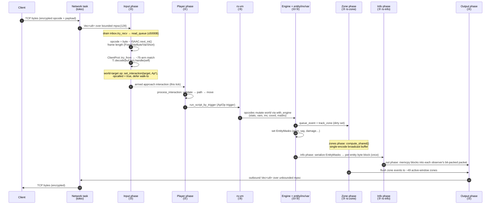
```mermaid
sequenceDiagram
    autonumber
    participant C as Client
    participant NET as Network task<br/>(tokio)
    participant IN as Input phase<br/>(②)
    participant PL as Player phase<br/>(②)
    participant VM as rs-vm<br/>(③)
    participant ENG as Engine + entity/inv/var<br/>(②/③)
    participant ZN as Zone phase<br/>(③ rs-zone)
    participant INF as Info phase<br/>(③ rs-info)
    participant OUT as Output phase<br/>(②)

    C->>NET: TCP bytes (encrypted opcode + payload)
    NET->>IN: Vec<u8> over bounded mpsc(128)
    Note over IN: drain inbox.try_recv → read_queue (≤5000B)
    IN->>IN: opcode = byte − ISAAC.next_int()<br/>frame length (Fixed/VarByte/VarShort)
    IN->>IN: ClientProt::try_from → ~75-arm match<br/>T::decode(buf,len).handle(self)
    Note over IN: world-target op: set_interaction(target, Ap*),<br/>opcalled = true, defer walk-to
    IN-->>PL: armed approach interaction (this tick)
    PL->>PL: process_interaction: validate → path → move
    PL->>VM: run_script_by_trigger (Ap/Op trigger)
    VM->>ENG: opcodes mutate world via with_engine<br/>(stats, vars, inv, coord, masks)
    ENG->>ZN: queue_event + track_zone (dirty set)
    ENG->>ENG: set EntityMasks (anim, say, damage…)
    Note over ZN: zones phase: compute_shared()<br/>single-encode broadcast buffer
    ENG->>INF: info phase: serialize EntityMasks → per-entity byte block (once)
    INF->>OUT: out phase: memcpy blocks into each observer's bit-packed packet
    ZN->>OUT: flush zone events to ~49 active-window zones
    OUT->>NET: outbound Vec<u8> over unbounded mpsc
    NET->>C: TCP bytes (encrypted)
```

Key points the diagram encodes (all detailed in [§20](#sec-20), [§15](#sec-15), [§10](#sec-10), [§18](#sec-18)):

- **Decode is ISAAC-whitened and frame-aware.** The opcode is recovered as
  `wire_byte.wrapping_sub(isaac_decode.next_int() as u8)`, then `ClientProt::try_from` selects one of ~75 match arms;
  frame size (Fixed / VarByte / VarShort) determines length parsing. Unknown bytes return `Err(())`.
- **Two handler families.** *Immediate* handlers (`opheld`, `inv_button`, `if_button`) run a script synchronously inside
  the input phase. *Approach* handlers (world-target `oploc`/`opnpc`/`opobj`/`opplayer` + T/U variants) only **arm** an
  interaction (`set_interaction`, `opcalled = true`) and defer the walk-to and trigger to the *player phase* — this is
  why the diagram routes them IN → PL.
- **Mutation is funnelled through the VM bridge.** Opcode handlers reach world state through `with_engine` thread-locals
  exposing the `ScriptEngine`/`ScriptPlayer`/`ScriptNpc` traits, so a handler signature stays parameter-free while still
  mutating the live `Engine`.
- **Producer/consumer split for output.** The *info* phase serializes each entity's `EntityMasks` into a reusable byte
  block **exactly once** (O(entities)); the *output* phase then `memcpy`s those pre-coalesced blocks into each
  observer's bit-packed packet (O(observers × viewport) but cheap per entry). Zone events are likewise pre-encoded once
  into a shared buffer (`compute_shared`) and flushed only to the ~49 zones in each player's 7×7 active window. This
  single-encode-broadcast contrasts sharply with the reference server's per-player re-walk.

### Login Flow: Network → Engine → Ether + DB → Session

Login is intrinsically asynchronous and spans every layer. The handshake validates and authenticates synchronously on
the network task, but *completing* a login requires two independent async confirmations — cross-world ether
authorisation and database credential/profile resolution — that the engine accumulates across ticks in a `PendingLogin`
before promoting the connection to a live `ActivePlayer`.

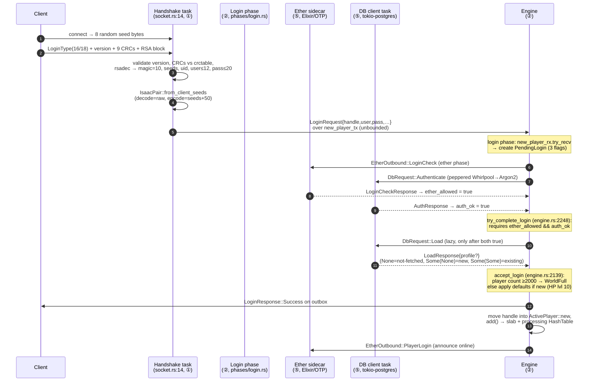
```mermaid
sequenceDiagram
    autonumber
    participant C as Client
    participant HS as Handshake task<br/>(socket.rs:14, ①)
    participant LOGIN as Login phase<br/>(②, phases/login.rs)
    participant ETH as Ether sidecar<br/>(⑤, Elixir/OTP)
    participant DB as DB client task<br/>(⑤, tokio-postgres)
    participant ENG as Engine<br/>(②)

    C->>HS: connect → 8 random seed bytes
    C->>HS: LoginType(16/18) + version + 9 CRCs + RSA block
    HS->>HS: validate version, CRCs vs crctable,<br/>rsadec → magic=10, seeds, uid, user≤12, pass≤20
    HS->>HS: IsaacPair::from_client_seeds<br/>(decode=raw, encode=seeds+50)
    HS->>ENG: LoginRequest{handle,user,pass,…}<br/>over new_player_tx (unbounded)
    Note over ENG: login phase: new_player_rx.try_recv<br/>→ create PendingLogin (3 flags)
    ENG->>ETH: EtherOutbound::LoginCheck (ether phase)
    ENG->>DB: DbRequest::Authenticate (peppered Whirlpool→Argon2)
    ETH-->>ENG: LoginCheckResponse → ether_allowed = true
    DB-->>ENG: AuthResponse → auth_ok = true
    Note over ENG: try_complete_login (engine.rs:2248):<br/>requires ether_allowed && auth_ok
    ENG->>DB: DbRequest::Load (lazy, only after both true)
    DB-->>ENG: LoadResponse{profile?}<br/>(None=not-fetched, Some(None)=new, Some(Some)=existing)
    Note over ENG: accept_login (engine.rs:2139):<br/>player count ≥2000 → WorldFull<br/>else apply defaults if new (HP lvl 10)
    ENG->>C: LoginResponse::Success on outbox
    ENG->>ENG: move handle into ActivePlayer::new,<br/>add() → slab + processing HashTable
    ENG->>ETH: EtherOutbound::PlayerLogin (announce online)
```

The mechanics, grounded in source:

- **Handshake (Layer ①).** `socket.rs:14` writes 8 random seed bytes, reads `LoginType` (New=16 / Reconnect=18),
  validates payload length, version (mismatch → `RuneScapeUpdated`), and 9 cache CRCs against `cache.crctable`; `rsadec`
  reveals `magic=10`, 4 seed words, the uid, username (≤12) and password (≤20). It derives
  `IsaacPair::from_client_seeds` (decode = raw seeds, encode = seeds **+50**), calls `create_io` to build the four
  channel pairs, and emits a single `LoginRequest` over `new_player_tx`.
- **Three-flag accumulation (Layer ②/⑤).** The login phase drains `new_player_rx.try_recv` and creates a `PendingLogin`
  tracking `ether_allowed`, `auth_ok`, and a **tri-state** `profile: Option<Option<PlayerProfile>>` (`None` = not
  fetched, `Some(None)` = new player, `Some(Some)` = existing). The ether phase pushes an `EtherOutbound::LoginCheck`
  and the DB task verifies credentials (two-stage peppered Whirlpool→Argon2). Their responses set the two booleans on
  later ticks.
- **`try_complete_login` (`engine.rs:2248`).** This gate requires `ether_allowed && auth_ok`; only then does it *lazily*
  issue `DbRequest::Load` if the profile is still unfetched, and once the profile arrives it calls `accept_login`.
- **`accept_login` (`engine.rs:2139`).** Rejects with `WorldFull` if the active count is ≥2000; otherwise detects a new
  player *by content* (all 21 XP == 0), applies new-player defaults (Hitpoints set to level 10), sends
  `LoginResponse::Success` on the outbox, moves the `ClientHandle` into `ActivePlayer::new`, and inserts the player into
  the fixed-capacity slab plus the processing `HashTable`. From the next tick the player is iterated by the
  input/player/info/output phases like any other.

The engineering payoff of this design is that **login latency is fully decoupled from the tick budget**. Postgres and
the BEAM mesh can take hundreds of milliseconds; the engine simply observes the boolean flags flip on whichever tick the
responses land, never stalling the 600 ms heartbeat. This is the same channel-and-accumulate pattern used for saves and
ether messaging — the unifying architectural motif that lets a single-threaded simulation coexist with a multi-threaded,
network- and database-bound host.

### Cross-Subsystem Consistency Notes

- The **`with_engine` bridge** (defined in `rs-vm`, installed once per `cycle` and again per script invocation) is what
  unifies layers ② and ③: it lets `rs-vm` opcode handlers mutate `rs-engine` state without `rs-engine` and `rs-vm`
  having a cyclic crate dependency. The trait-based inversion in `rs-vm`'s manifest (no `rs-entity` edge) is the
  build-time half of this story.
- **`rs-io::Packet`** is the single byte-cursor type threading through decode (Layer ①), zone/info encode (Layer ③),
  persistence blobs (Layer ⑤), and cache decode (Layer ④). Its presence in five manifests is why wire/disk/cache formats
  stay byte-consistent.
- The **`panic = "unwind"`** release profile (`.cargo/config.toml:16`) is an architecture-level dependency, not a
  subsystem detail: the `catch_unwind` panic boundaries in every phase (Layer ②) and the per-entity emergency-removal
  nets depend on unwinding being preserved through `lto = "fat"`, `codegen-units = 1`, `opt-level = 3`, `strip = true`,
  `overflow-checks = false`.

<sub>[↑ Back to top](#top)</sub>


---

<a id="sec-05"></a>

## 5. The Game Tick — Cycle Orchestration

The beating heart of rs-engine is a single function: `Engine::cycle` (`rs-engine/src/engine.rs:563`). Once every game
tick — nominally every 600 milliseconds — the world-tick task invokes `cycle`, which drives the entire simulation
forward by exactly one quantum: it reads all queued client input, advances every NPC and player, materializes world
changes, computes the per-client view of the world, serializes it to the wire, and resets transient state for the next
tick. Everything the server does is, ultimately, a side effect of one `cycle` call.

This section is an exhaustive reference for that orchestration layer: the heartbeat scheduler that calls `cycle`, the
thirteen ordered phases and *why* they run in that order, the `phase!` timing-and-panic-isolation harness, the
fatal-panic emergency recovery, clock advance, and the `TickStats` telemetry that is published every tick. It
deliberately treats each phase as a black box (their internals are documented in their own sections) and focuses on the
*orchestration*: sequencing, isolation, timing, and lifecycle.

### Design philosophy: deterministic single-threaded simulation

rs-engine inherits its execution model wholesale from the classic TypeScript RuneScape 2 reference servers (the
*LostCity* / *2004scape* lineage): a single thread owns all mutable world state and processes the world in a fixed,
ordered sequence of phases per tick. There is no locking, no parallelism, no message-passing *within* a tick. This is a
deliberate and load-bearing design decision, not an accident of porting.

The rationale is threefold:

1. **Determinism.** A single thread visiting entities in a stable order produces byte-identical output for identical
   input. This is essential both for protocol fidelity (the original client expects a specific update ordering) and for
   debuggability — a desync is reproducible.
2. **Zero synchronization overhead.** With no locks or atomics on the hot path, the engine can touch shared structures (
   `ZoneMap`, renderers, inventories, the collision map) through raw `&mut` references. The cost of the classic "actor
   per entity" or "lock per zone" model — contention, cache-line bouncing, false sharing — is simply absent.
3. **Memory-layout control.** Because exactly one thread accesses `Engine`, fields can be laid out for cache locality
   and accessed via a thread-local raw pointer (`with_engine`, below) rather than threaded through every call as an
   explicit argument.

The `Engine` struct itself encodes this contract in its type signature:

```rust
// rs-engine/src/engine.rs:420
unsafe impl Send for Engine {}
```

`Engine` is `Send` (so it can be *moved* into the tokio task that owns it) but is deliberately **not** `Sync` — it must
never be shared across threads. The SAFETY comment at `engine.rs:416` states this explicitly: "Engine is only accessed
from the single world-tick tokio task." The project's standing engineering guidance reinforces this: parallelising the
tick (e.g. rayon over `outputs()`) was evaluated as the single largest throughput win at 2000 players and **deliberately
declined**, because the entire design — thread-local accessors, shared `&mut` renderers/zones/invs — assumes
single-threaded access.

### The heartbeat: `engine_tick` scheduler

`cycle` does not schedule itself. The driving loop lives in the binary crate, `engine_tick` (
`rs-server/src/main.rs:696`), spawned as a tokio task at startup (`main.rs:379`). It is the only caller of
`Engine::cycle`.

```rust
// rs-server/src/main.rs:701-730 (condensed)
let mut interval = time::interval(Duration::from_millis(600));
interval.set_missed_tick_behavior(time::MissedTickBehavior::Skip);
loop {
tokio::select ! {
_ = interval.tick() => {
if engine.cycle() {            // fatal-panic signalled
error ! ("Engine shutting down due to fatal phase panic");
engine.ether_tx = None;    // close outbound channels
engine.db_tx = None;
while engine.db_rx.recv().await.is_some() {} // drain saves
return;                    // task exits -> server stops
}
},
Some((store, scripts)) = reload_rx.recv() => { /* hot-reload */ }
Ok(()) = clock_rate_rx.changed() => { /* re-rate */ }
}
}
```

Three things deserve emphasis:

- **`MissedTickBehavior::Skip`.** A tokio `Interval` would, by default, attempt to "catch up" if a tick overran its
  budget, firing back-to-back ticks until it caught up to wall-clock. That would be catastrophic for a game server: an
  overloaded tick that took 1200ms would immediately trigger two more ticks with no gap, compounding the overload.
  `Skip` instead drops the missed deadlines and resumes on the next aligned boundary, trading temporal accuracy for
  stability under load. Game logic measures time in *ticks*, not wall-clock, so a skipped real-time deadline does not
  corrupt game state — it only means players experience a momentary slowdown.
- **The boolean return of `cycle` is a fatal-shutdown signal.** `cycle` returns `true` only on a fatal phase panic (see
  below). The scheduler reacts by tearing the channels down and draining outstanding DB saves before exiting — a
  graceful, durability-preserving shutdown rather than a hard crash.
- **The same `select!` arm-set handles hot-reload and clock-rate changes**, so asset reloads and speed changes are
  interleaved *between* ticks, never during one.

#### Clock rate as a watch channel

The tick interval is not a constant. `Engine` holds a `clock_rate_tx: Sender<u64>` (`engine.rs:398`), the sending half
of a tokio `watch` channel created in `Engine::new` (`engine.rs:479`) with an initial value of `600`. The receiving
half (`clock_rate_rx`) is returned from `Engine::new` and handed to `engine_tick`. `Engine::set_clock_rate` (
`engine.rs:675`) sends a new interval in milliseconds:

```rust
// rs-engine/src/engine.rs:675-677
pub fn set_clock_rate(&self, ms: u64) {
    let _ = self.clock_rate_tx.send(ms);
}
```

When the scheduler observes `clock_rate_rx.changed()`, it rebuilds the `Interval` at the new rate (`main.rs:724-728`). A
`watch` channel is the right primitive here: it is lossy-but-latest (only the most recent value matters, intermediate
values can be coalesced) and the receiver can cheaply poll the current value. This mechanism backs developer/admin speed
controls — e.g. accelerating ticks for testing, or throttling under emergency load — without touching the tick logic
itself. The original Java server hard-codes a 600ms loop; expressing the rate as a runtime-tunable channel is a modest
improvement in operability.

### `cycle`: anatomy of one tick

`cycle` is structured as: (1) install the global engine pointer, (2) run thirteen phases under a timing-and-panic
harness, (3) advance the clock, (4) branch to fatal recovery if needled, otherwise (5) publish telemetry. The full flow:

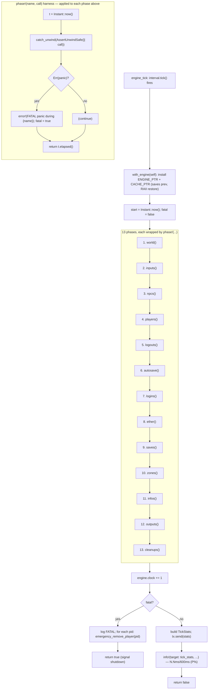
```mermaid
flowchart TD
    sched["engine_tick: interval.tick() fires"] --> we["with_engine(self): install ENGINE_PTR + CACHE_PTR (saves prev, RAII restore)"]
    we --> start["start = Instant::now(); fatal = false"]
    start --> P

    subgraph P["13 phases, each wrapped by phase!(...)"]
        direction TB
        p1["1. world()"] --> p2["2. inputs()"]
        p2 --> p3["3. npcs()"]
        p3 --> p4["4. players()"]
        p4 --> p5["5. logouts()"]
        p5 --> p6["6. autosave()"]
        p6 --> p7["7. logins()"]
        p7 --> p8["8. ether()"]
        p8 --> p9["9. saves()"]
        p9 --> p10["10. zones()"]
        p10 --> p11["11. infos()"]
        p11 --> p12["12. outputs()"]
        p12 --> p13["13. cleanups()"]
    end

    P --> clk["engine.clock += 1"]
    clk --> fb{"fatal?"}
    fb -- "yes" --> em["log FATAL; for each pid: emergency_remove_player(pid)"]
    em --> ret_true["return true (signal shutdown)"]
    fb -- "no" --> stats["build TickStats; tx.send(stats)"]
    stats --> log["info!(target: tick_stats, ...) — N.Nms/600ms (P%)"]
    log --> ret_false["return false"]

    subgraph PH["phase!(name, call) harness — applied to each phase above"]
        direction TB
        h1["t = Instant::now()"] --> h2["catch_unwind(AssertUnwindSafe(|| call))"]
        h2 --> h3{"Err(panic)?"}
        h3 -- "yes" --> h4["error!(FATAL panic during {name}); fatal = true"]
        h3 -- "no" --> h5["(continue)"]
        h4 --> h6["return t.elapsed()"]
        h5 --> h6
    end
```

#### Installing the global engine: `with_engine`

The very first thing `cycle` does is capture a raw self-pointer and wrap the entire body in `with_engine`:

```rust
// rs-engine/src/engine.rs:563-566
pub fn cycle(&mut self) -> bool {
    let engine = self as *mut Engine;
    with_engine(self, || {
        let engine = unsafe { &mut *engine };
        ...
```

`with_engine` (`rs-engine/rs-vm/src/engine.rs:1671`) installs `self` (and its `CacheStore`) into two thread-local `Cell`
s, `ENGINE_PTR` and `CACHE_PTR` (`rs-vm/src/engine.rs:1620-1623`):

```rust
// rs-engine/rs-vm/src/engine.rs:1671-1685 (condensed)
pub fn with_engine<E: ScriptEngine, R>(engine: &mut E, f: impl FnOnce() -> R) -> R {
    let cache = engine.cache() as *const CacheStore;
    let ptr = engine as *mut E as *mut ();
    let prev_engine = ENGINE_PTR.get();
    let prev_cache = CACHE_PTR.get();
    set_ptrs(ptr, cache);
    struct Restore(*mut (), *const CacheStore);
    impl Drop for Restore { fn drop(&mut self) { set_ptrs(self.0, self.1); } }
    let _guard = Restore(prev_engine, prev_cache);
    f()
}
```

This is the mechanism by which the *entire* call tree beneath `cycle` — every phase, every opcode handler, every
utility — can reach world state via the free functions `engine()` / `engine_mut()` (`engine.rs:67`, `:91`) and
`cache()` (`rs-vm/src/engine.rs:1704`) **without threading an `&mut Engine` argument through hundreds of signatures**.
The RuneScript VM in particular is full of opcode handlers that need ambient access to the world; passing the engine
explicitly would pollute every signature. The thread-local indirection is the price paid for that ergonomics, and it is
sound *because* the engine is single-threaded: there is exactly one writer, and the pointer is only ever read on the
same thread that installed it.

Key properties of `with_engine`:

- **Save/restore via RAII.** The previous pointer values are captured and restored by the `Restore` drop guard, even on
  unwind. This makes `with_engine` **re-entrant**: scripts that themselves call back into `runescript_vm_execute` (which
  calls `with_engine` again, `engine.rs:789-792`) nest correctly, and the outer pointer is restored when the inner scope
  ends. During the top-level `cycle`, the "previous" values are null, so they are restored to null when the tick ends —
  outside a tick, `engine()` is a null-pointer deref (UB in release, a `debug_assert` failure in debug; see
  `rs-vm/src/engine.rs:1780`).
- **Type erasure.** The pointer is stored as `*mut ()` and recovered as the concrete `Engine` type by
  `engine_typed::<Engine>()` (`engine.rs:67-69`). The `unsafe impl` of `ScriptEngine for Engine` is what makes the
  generic accessor monomorphise to the right type. Calling with a mismatched `E` is UB — but there is only ever one
  engine type in this binary.
- **Note the double install.** `cycle` calls `with_engine` once around the whole tick, and the per-script
  `runescript_vm_execute` calls it *again* around each VM invocation. The inner install is redundant during a tick (the
  pointer is already set) but harmless (it installs the same pointer and restores it), and is necessary for script
  invocations that originate *outside* `cycle` (e.g. `reload_assets` broadcasts, `main.rs:720`). The cost is two
  thread-local writes per script — negligible.

#### The `phase!` macro: timing + panic isolation

Each of the thirteen phases is invoked through a single hygienic macro, `phase!`, defined inline inside `cycle` (
`engine.rs:571-580`):

```rust
// rs-engine/src/engine.rs:571-580
macro_rules! phase {
    ($name:expr, $call:expr) => {{
        let t = Instant::now();
        if let Err(panic) = catch_unwind(AssertUnwindSafe(|| { $call; })) {
            error!("FATAL panic during {} phase: {}", $name, panic_message(&panic));
            fatal = true;
        }
        t.elapsed()
    }};
}
```

The macro does two jobs at once:

1. **Timing.** It brackets the phase call with `Instant::now()` / `t.elapsed()` and *returns* the `Duration`. Each phase
   site binds that duration to a named local (`let world = phase!("world", engine.world());`, `engine.rs:582`), which is
   later read into `TickStats`. Timing every phase, every tick, costs two `Instant::now()` calls per phase (26 per
   tick) — cheap, and the visibility it buys is invaluable for diagnosing which phase is eating the budget.
2. **Panic isolation.** It wraps the call in `std::panic::catch_unwind(AssertUnwindSafe(...))`. If the phase panics, the
   panic is *caught* at the phase boundary, logged as `FATAL panic during {name} phase`, and a `fatal` flag is set — but
   the remaining phases still run, the clock still advances, and the recovery path (below) executes in an orderly
   fashion rather than the whole process aborting.

`AssertUnwindSafe` is required because the closure captures `&mut Engine` (via the `engine` raw-deref), and `&mut T` is
not `UnwindSafe` by default — the standard library worries that a panic could leave the borrowed state in a torn,
inconsistent condition. Here the assertion is justified by design: the recovery path *expects* possibly-inconsistent
state and repairs it by removing the offending entity (or, at the tick level, evacuating all players). `panic_message` (
`rs-engine/src/phases/shared.rs:710`) extracts a human-readable string from the type-erased `Box<dyn Any>` payload by
attempting downcasts to `&str` then `String`, falling back to `"unknown panic"`:

```rust
// rs-engine/src/phases/shared.rs:710-718
pub(crate) fn panic_message(panic: &Box<dyn std::any::Any + Send>) -> Cow<'_, str> {
    if let Some(s) = panic.downcast_ref::<&str>() { Cow::Borrowed(*s) } else if let Some(s) = panic.downcast_ref::<String>() { Cow::Borrowed(s.as_str()) } else { Cow::Borrowed("unknown panic") }
}
```

##### Why panic isolation matters — and the release-profile dependency

A RuneScript-driven game server runs an enormous amount of content code: thousands of scripts, edge cases, off-by-ones,
and integer overflows that no test suite fully covers. In the original Java server an uncaught exception in one player's
processing is caught per-entity and that player is booted; the world survives. rs-engine reproduces that resilience with
`catch_unwind`, at two granularities:

- **Phase granularity** (`phase!` in `cycle`): a coarse safety net. If a panic escapes *past* a phase's own per-entity
  handling, the phase boundary catches it and triggers full evacuation.
- **Entity granularity** (inside the phases): the hot phases that iterate over entities — `inputs` (
  `phases/input.rs:50`), `npcs` (`phases/npc.rs:61`), `players` (`phases/player.rs:54`), `infos` (`phases/info.rs:38`),
  `outputs` (`phases/output.rs:42`) — each wrap their per-entity loop in their *own* `catch_unwind`, and on a caught
  panic call `emergency_remove_player(pid)` / `emergency_deactivate_npc(nid)`, then resume the loop from the *next*
  entity (`start += 1`). One bad player or NPC is surgically removed; the other 1999 keep ticking, in the very same
  tick.

This entire mechanism is silently dead under `panic = "abort"`: an aborting panic terminates the process before
`catch_unwind` can run, turning every safety net into a no-op. The release profile therefore **must** keep
`panic = "unwind"` — and it does (`.cargo/config.toml:16`), alongside `lto = "fat"`, `codegen-units = 1`,
`opt-level = 3`, `strip = true`, and `overflow-checks = false`. This is a non-obvious coupling: a well-meaning attempt
to shave binary size or gain a sliver of speed by switching to `panic = "abort"` would silently convert a fault-tolerant
server into a fragile one where a single content bug crashes the entire world. The unwind requirement is a hard
constraint, not a preference.

The per-entity loops use a reusable, *owned* pid/nid snapshot to make this safe. `take_pids`/`put_pids` (
`engine.rs:238-248`) lend out a `Vec<u16>` filled from the processing list; the loop iterates the snapshot, not the live
structure, so an emergency removal *during* iteration cannot invalidate the iterator. The buffer is returned for reuse
to avoid a per-tick allocation. This is a small but characteristic rs-engine pattern: own a stable snapshot, mutate the
live structure freely, recycle the allocation.

### The thirteen phases, in order, and why that order

`cycle` runs the phases in exactly this sequence (`engine.rs:582-594`):

| #  | Phase        | Call site           | Responsibility (one line)                                                   |
|----|--------------|---------------------|-----------------------------------------------------------------------------|
| 1  | **world**    | `engine.world()`    | Drain world-script queue, spawn delayed objs, run player-hunt acquisition   |
| 2  | **input**    | `engine.inputs()`   | Decode client packets, AFK roll, server-side pathing, zone/collision update |
| 3  | **npcs**     | `engine.npcs()`     | NPC delay/resume/respawn, hunt, regen, AI timers/queues, movement           |
| 4  | **players**  | `engine.players()`  | Player delay/resume, queues, timers, interaction, movement                  |
| 5  | **logouts**  | `engine.logouts()`  | Finalise disconnects/voluntary logouts, run `Logout` trigger, save, remove  |
| 6  | **autosave** | `engine.autosave()` | Increment playtime; every 250 ticks persist all profiles                    |
| 7  | **logins**   | `engine.logins()`   | Accept new sessions, fire ether/DB auth, park pending logins                |
| 8  | **ether**    | `engine.ether()`    | Drain cross-world messages (friends/PMs/login-checks/resync)                |
| 9  | **saves**    | `engine.saves()`    | Drain DB responses (ready/auth/load/save-ack), complete logins              |
| 10 | **zones**    | `engine.zones()`    | Apply timed zone events; recompute encoded shared zone buffers              |
| 11 | **info**     | `engine.infos()`    | Compute per-player/NPC info snapshots (appearance, movement masks)          |
| 12 | **out**      | `engine.outputs()`  | Encode + flush all per-client packets to the network                        |
| 13 | **cleanup**  | `engine.cleanups()` | Reset per-tick transient state; free despawned slots; restock shops         |

The ordering is not arbitrary; it is a dependency-respecting pipeline that mirrors the original Java server's
`World.cycle` structure. The governing principle is: **mutate the world fully before observing it, and observe it fully
before transmitting it.**

- **World before entities (1 → 3,4).** The world phase drains the world-script queue and the delayed-obj queue, and —
  critically — runs *player-type hunts* (`process_npc_hunt_players`, `phases/world.rs:140`). Player hunts are pulled
  forward into the world phase, *before* per-NPC processing, "so that every NPC sees a consistent snapshot of player
  positions before individual NPC processing begins" (`phases/world.rs:131-135`). This is a determinism guarantee: all
  NPCs hunt against the same frozen view of player positions, rather than each NPC seeing positions partially mutated by
  earlier NPCs in the same tick.
- **Input before entity processing (2 → 3,4).** Client packets are decoded first so that the movement/interaction state
  they set (paths, op-calls, target selection) is in place before `npcs()` and `players()` act on it. The input phase
  also performs server-side pathfinding (`post_process`, `phases/input.rs:128`) so that the players phase finds queued
  waypoints ready to consume.
- **NPCs before players (3 → 4).** This matches the reference server's ordering. NPCs resolve their AI and movement
  first; players then process interactions and movement against NPC positions. (The relative order is a fidelity
  choice — the original server processes NPC tick logic ahead of player movement so that, e.g., aggressive NPCs and
  combat resolve in a fixed order.)
- **Lifecycle housekeeping in the middle (5 → 9).** Logouts run after entity processing (a player who died or finished a
  queued action this tick can now be cleanly removed), and *before* logins, so a slot freed by a logout can be reused by
  a login in the same tick. Autosave (6) increments playtime every tick and bulk-saves on the interval. Logins (7),
  ether (8), and saves (9) are the asynchronous-I/O integration points: they drain inbound channels (new connections,
  cross-world messages, DB responses) and advance the multi-step login state machine. Their placement after entity
  processing but before zone/info/out means any state they mutate (a newly-logged-in player) is correctly reflected in
  this tick's outbound view.
- **Zone → info → out (10 → 11 → 12).** This is the rigid observe-then-transmit ordering. The zones phase first
  *applies* all due timed events (obj reveals/deletes/respawns, loc reverts) and then *recomputes* the encoded
  shared-zone buffers for every dirty zone (`phases/zone.rs:27-30`). The info phase computes per-entity info snapshots (
  it begins by resetting all snapshots to `ABSENT`, `phases/info.rs:27-28`). The out phase encodes player-info,
  NPC-info, map rebuilds, zone updates, inventory deltas, and stat deltas into each client's buffer and flushes it (
  `phases/output.rs:9-21`). Each stage strictly consumes the output of the previous: out reads the snapshots info
  produced, which describe the world zones produced. Reordering any of these three would transmit a stale or half-built
  view.
- **Cleanup last (13).** Cleanup is the symmetric counterpart to the per-tick mutations: it drains the dirty-zone
  tracking set and resets those zones (`reset_zones`, `phases/cleanup.rs:61`), removes single-tick renderer entries (
  `reset_renderers`), resets per-tick pathing flags on every player and NPC (`reset_players`/`reset_npcs`), frees the
  slots of despawned `Despawn`-lifecycle NPCs (`remove_despawned_npcs`), and ticks shop restock timers (`restock_invs`).
  It runs *after* out precisely because the transient state it clears (dirty inventory slots, movement deltas, temporary
  renderer entries) must survive long enough to be transmitted. The ordering within cleanup is itself load-bearing:
  `reset_shared_invs` runs *before* `restock_invs`, because restocking re-dirties inventories and those new dirty marks
  must survive into the next tick's output (`phases/cleanup.rs:158-167`).

#### Phase-by-phase, in brief

- **world** (`phases/world.rs:31`): `process_world_queue` decrements each queued world script's delay and runs those
  reaching zero, redispatching `WorldSuspended`/`Suspended`/`NpcSuspended` results; `process_obj_delayed_queue` spawns
  timed objects; `process_npc_hunt_players` runs player-target hunts against a frozen position snapshot.
- **input** (`phases/input.rs:46`): per-player (panic-isolated) — record previous coord, AFK roll (`check_afk`, once per
  500 ticks, `phases/input.rs:102`), `decode()` client packets, `post_process` server-side pathing, then
  `check_zones_and_collision` to migrate the player between zones and update the collision map.
- **npcs** (`phases/npc.rs:57`): per-NPC (panic-isolated) — check delay, resume `NpcSuspended` scripts, respawn dead
  NPCs and fire `ai_spawn`, revert temporary type changes, then (if alive and not delayed) hunt, regen, AI timers,
  script queue, face-entity, and movement/mode AI; finally zone/collision update.
- **players** (`phases/player.rs:50`): per-player (panic-isolated) — check delay, resume `Suspended` scripts (with
  protect+force), process primary/weak queues, normal+soft timers, engine queue, face-entity, interaction/movement,
  zone/collision update.
- **logouts** (`phases/logout.rs:50`): poll each player's `disconnect_rx`; honour logout-prevention windows (e.g. in
  combat); for players cleared to leave, close modals, run the `Logout` trigger, persist via `DbRequest::Save`, notify
  ether via `EtherOutbound::PlayerLogout`, and `remove_player`.
- **autosave** (`phases/autosave.rs:31`): increment non-bot `playtime` every tick; every `AUTOSAVE_INTERVAL = 250`
  ticks (~150s) bulk-extract and save every non-bot profile for crash durability.
- **logins** (`phases/login.rs:41`): drain `new_player_rx`; reject if DB not ready or already logged in; otherwise fire
  `EtherOutbound::LoginCheck` + `DbRequest::Authenticate` and park a `PendingLogin`; expire entries older than
  `LOGIN_TIMEOUT_TICKS = 10`.
- **ether** (`phases/ether.rs:40`): drain up to `MAX_PLAYERS` inbound cross-world messages (cap prevents starvation) —
  friend/ignore-list updates, private messages, login-check responses, and ether-reconnect resync.
- **saves** (`phases/saves.rs:35`): drain DB responses — `DbReady`/`DbDisconnected` toggle `db_ready`, `AuthResponse`/
  `LoadResponse` advance pending logins toward completion, `SaveAck` deletes the local backup save on success.
- **zones** (`phases/zone.rs:27`): `process_pending_zone_events` (a `BTreeMap` `split_off` at `clock+1` selects all due
  events) then `compute_zone_shared` rebuilds encoded buffers for dirty zones.
- **info** (`phases/info.rs:26`): reset all player/NPC snapshots to `ABSENT`, then compute per-entity info (appearance
  rebuilds, reorientation, movement masks), per-entity panic-isolated.
- **out** (`phases/output.rs:38`): per-player, panic-isolated, the player is `take()`-n out of its slot for the duration
  of encoding and always restored. Encodes player-info, NPC-info, conditional map rebuild on level change, zone updates,
  inventory and stat deltas, AFK-zone tracking, then flushes the buffer to the network.
- **cleanup** (`phases/cleanup.rs:42`): reset dirty zones, remove temporary renderer entries, reset per-tick player/NPC
  pathing flags and clear dirty inventory sets, free despawned NPC slots, clear shared-inv change sets, and tick shop
  restock.

### Clock advance and the fatal-panic recovery path

After all thirteen phases return, the clock advances unconditionally:

```rust
// rs-engine/src/engine.rs:595
engine.clock += 1;
```

`Engine::clock` is a `u64` (`engine.rs:374`) — the monotonic tick counter that is the engine's sole notion of time.
Every scheduled event in the system is keyed off it: zone-event `BTreeMap` keys, respawn timers, autosave/login
timeouts, obj despawn clocks, AFK checks. It advances *exactly once per `cycle`*, after the phases and **before** the
fatal branch, so the clock value is consistent regardless of whether the tick succeeded or is about to evacuate.

A subtlety in telemetry: because the clock is already incremented, the published tick number is `engine.clock - 1` (
`engine.rs:614`, `:640`) — the tick that *just ran*, not the one about to run.

If any phase set `fatal` (a panic escaped a phase's own per-entity handling and was caught by `phase!`), `cycle` enters
emergency recovery (`engine.rs:597-605`):

```rust
// rs-engine/src/engine.rs:597-605
if fatal {
error!("Fatal phase panic detected -- emergency saving and removing all players");
let pids = engine.player_list.pids();
for pid in pids {
error!("emergency removing player {pid} due to fatal phase panic");
engine.emergency_remove_player(pid);
}
return true;
}
```

The philosophy is **durability over availability**: a phase-level panic means engine state is suspect, so rather than
risk corrupting saves by continuing, the engine snapshots and persists *every* online player, then signals shutdown.
`emergency_remove_player` (`engine.rs:1996`) is the last-resort persistence path: it extracts the player's profile,
serializes it to a binary blob, and fires a `DbRequest::Save` and an `EtherOutbound::PlayerLogout`, then calls
`remove_player` for full cleanup:

```rust
// rs-engine/src/engine.rs:1996-2018 (condensed)
pub fn emergency_remove_player(&mut self, pid: u16) {
    if let Some(active) = self.player_list.players[pid as usize].as_ref() {
        let user37 = active.uid().username37();
        let username = active.uid().username();
        if let Some(tx) = &self.db_tx {
            let profile = extract_profile(&active.player, self.cache);
            let binary = save_binary(&profile, self.cache);
            let _ = tx.send(DbRequest::Save {
                user37,
                username,
                profile: Box::new(profile),
                binary
            });
        }
        if let Some(tx) = &self.ether_tx {
            let _ = tx.send(EtherOutbound::PlayerLogout { user37 });
        }
    }
    self.remove_player(pid);
}
```

The `return true` propagates to `engine_tick`, which (as shown above) nulls `ether_tx`/`db_tx` to close the outbound
channels — signalling the background DB task to drain — then awaits `db_rx` until all saves are flushed before the task
exits (`main.rs:706-715`). The result is a clean, no-data-loss shutdown even from an unanticipated panic deep in content
code.

Note the two tiers of recovery and how they relate. The *common* case is the **entity-level** `catch_unwind` inside a
phase: it removes one player/NPC and the tick continues normally — `fatal` is never set, the server stays up. The
*fatal* tier is reached only when a panic escapes *past* a phase's own per-entity loop (e.g. a panic in `world()` or
`zones()`, which have no per-entity isolation, or a panic in the phase scaffolding itself). That coarser failure is
treated as unrecoverable, triggering the world-wide evacuate-and-shutdown. The same emergency-save routine (
`emergency_remove_player`) services both tiers — at the entity tier it is called for the single offender; at the fatal
tier it is called for every online player.

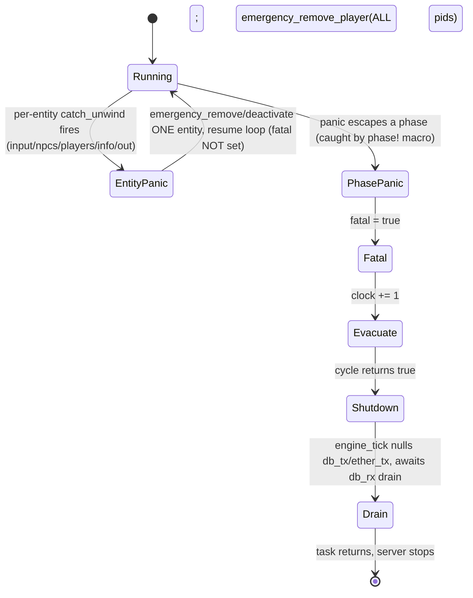
```mermaid
stateDiagram-v2
    [*] --> Running
    Running --> EntityPanic : per-entity catch_unwind fires (input/npcs/players/info/out)
    EntityPanic --> Running : emergency_remove/deactivate ONE entity, resume loop (fatal NOT set)
    Running --> PhasePanic : panic escapes a phase (caught by phase! macro)
    PhasePanic --> Fatal : fatal = true
    Fatal --> Evacuate : clock += 1; emergency_remove_player(ALL pids)
    Evacuate --> Shutdown : cycle returns true
    Shutdown --> Drain : engine_tick nulls db_tx/ether_tx, awaits db_rx drain
    Drain --> [*] : task returns, server stops
```

### Telemetry: `TickStats` and the `tick_stats` trace line

On the non-fatal path, `cycle` measures total cycle time and publishes a full breakdown. `start.elapsed()` (
`engine.rs:607`) captures end-to-end wall time; `player_count`/`npc_count` are read from the processing-list lengths (
`engine.rs:609-610`).

`TickStats` (`engine.rs:116-135`) is a flat, `Clone`/`Default`/`Debug` struct of `f64` millisecond timings — one field
per phase — plus `clock`, `total_ms`, `player_count`, and `npc_count`:

| Field                                                                                                                     | Meaning                                     |
|---------------------------------------------------------------------------------------------------------------------------|---------------------------------------------|
| `clock`                                                                                                                   | The tick that just ran (`engine.clock - 1`) |
| `total_ms`                                                                                                                | End-to-end cycle wall time                  |
| `player_count`, `npc_count`                                                                                               | Active entity counts this tick              |
| `world`, `input`, `npcs`, `players`, `logouts`, `autosave`, `logins`, `ether`, `saves`, `zones`, `info`, `out`, `cleanup` | Per-phase wall time (ms), one per phase     |

Each `f64` is computed from the corresponding `Duration` as `d.as_secs_f64() * 1000.0`. The struct is sent through
`tick_stats_tx` — an `Option<Sender<TickStats>>` over a tokio `watch` channel (`engine.rs:384`):

```rust
// rs-engine/src/engine.rs:612-632 (condensed)
if let Some(tx) = & engine.tick_stats_tx {
let _ = tx.send(TickStats {
clock: engine.clock - 1,
total_ms: cycle.as_secs_f64() * 1000.0,
player_count, npc_count,
world: world.as_secs_f64() * 1000.0, /* ...one field per phase... */
cleanup: cleanup.as_secs_f64() * 1000.0,
});
}
```

A `watch` channel is again the apt choice: a monitoring consumer (an admin dashboard or the project's terminal UI) only
cares about the *latest* tick's stats; if it falls behind it should skip to current, not replay history. The send is
best-effort (`let _ =`) — if no receiver is listening, the tick is unaffected. `tick_stats_tx` being `Option` allows the
engine to run head-less (e.g. in tests) with no telemetry consumer.

Independently of the channel, `cycle` emits a structured tracing line under the dedicated target `tick_stats` (
`engine.rs:634-658`):

```text
Tick 14320 | 3.42ms/600ms (0.6%) | players=187 npcs=4213 |
 world=0.12 logins=0.00 logouts=0.01 autosave=0.00 input=0.34 npcs=1.05
 players=0.88 zones=0.07 ether=0.00 saves=0.00 info=0.41 clients_out=0.51 cleanup=0.03ms
```

The headline metric is **budget utilisation**: `(cycle.as_secs_f64() / 0.6) * 100.0` (`engine.rs:642`) — the fraction of
the 600ms tick budget consumed, hard-coded to the nominal rate. A line reading `3.42ms/600ms (0.6%)` says the tick used
0.6% of its budget; the engine could absorb roughly 175× more load before missing deadlines. This single number is the
primary capacity signal. Because every phase is timed separately, the line *also* tells operators exactly *where* time
goes when utilisation climbs — typically `npcs`, `players`, `info`, and `clients_out` (the `out` phase, labelled
`clients_out` in the message) dominate at scale, since those scale with entity and viewer counts. Using a dedicated
tracing target (`target: "tick_stats"`) lets operators route this high-frequency line to its own appender/filter without
drowning the main log.

The 600ms budget is the same quantum the original RuneScape 2 server used; rs-engine's value proposition is doing the
*same* per-tick work — same ordering, same byte-output — in a tiny fraction of that budget, leaving enormous headroom
for player and NPC counts far beyond what the Java original could sustain on one thread.

### Lifecycle summary

One full revolution of the heartbeat, end to end: the tokio interval fires; `cycle` installs the engine pointer via
`with_engine`; thirteen phases run in order, each timed and panic-isolated by `phase!`; the clock ticks once; if a
phase-level panic occurred, every player is emergency-saved and the engine signals shutdown; otherwise a `TickStats`
snapshot and a `tick_stats` trace line are published; control returns to the scheduler, which sleeps until the next
aligned 600ms boundary (skipping any it missed). The thread-local engine pointer is restored to its prior (null, between
ticks) value by the `with_engine` drop guard. Nothing carries across the boundary except `Engine`'s own persistent
fields and the queues/maps that phases populated for future ticks — the cleanup phase has scrubbed all single-tick
transient state. The world is now exactly one tick older, deterministically, on one thread, with full byte-fidelity to
the protocol the original client expects.

<sub>[↑ Back to top](#top)</sub>


---

<a id="sec-06"></a>

## 6. The Thirteen Phases in Detail

The engine heartbeat is a single function, `Engine::cycle` (`rs-engine/src/engine.rs:563`), that executes thirteen
ordered phases per ~600 ms tick and then increments `engine.clock` (`engine.rs:595`). Each phase is invoked through a
`phase!` macro (`engine.rs:571`) that wraps the call in `catch_unwind(AssertUnwindSafe(...))` and times it with
`Instant::now()`. The macro classifies any escaped panic as *fatal* — a panic that the phase's own per-entity recovery
did not absorb — and sets a `fatal` flag; after the cleanup phase, a fatal tick emergency-saves and removes every
player (`engine.rs:597-605`) rather than risk continuing on corrupted state. The phases, in source order, are:

| #  | Phase    | Method       | File                 |
|----|----------|--------------|----------------------|
| 1  | World    | `world()`    | `phases/world.rs`    |
| 2  | Input    | `inputs()`   | `phases/input.rs`    |
| 3  | NPC      | `npcs()`     | `phases/npc.rs`      |
| 4  | Player   | `players()`  | `phases/player.rs`   |
| 5  | Logout   | `logouts()`  | `phases/logout.rs`   |
| 6  | Autosave | `autosave()` | `phases/autosave.rs` |
| 7  | Login    | `logins()`   | `phases/login.rs`    |
| 8  | Ether    | `ether()`    | `phases/ether.rs`    |
| 9  | Saves    | `saves()`    | `phases/saves.rs`    |
| 10 | Zone     | `zones()`    | `phases/zone.rs`     |
| 11 | Info     | `infos()`    | `phases/info.rs`     |
| 12 | Output   | `outputs()`  | `phases/output.rs`   |
| 13 | Cleanup  | `cleanups()` | `phases/cleanup.rs`  |

This ordering is the defining invariant of the engine. It encodes a strict producer→consumer pipeline: **decisions →
world mutations → derived/encoded snapshots → client transmission → reset**. Phase *N* may only read state that earlier
phases have finalized, and may only mutate state that later phases consume. The remainder of this section dissects each
phase and then walks the cross-phase data dependencies that force the order.

### The shared iteration and recovery idiom

Five phases (input, npc, player, info, output) iterate over every active entity, and all five share an identical
structure that is worth describing once. Each calls `self.player_list.take_pids()` / `npc_list.take_nids()` (
`engine.rs:238`), which clears a reusable `pid_scratch` Vec and copies the current `processing` set into it, returning
the Vec by value. The phase iterates the *snapshot*, not the live `processing` set, so that scripts run during the phase
may freely add or remove entities from `processing` without invalidating the iteration. At the end, `put_pids` (
`engine.rs:246`) returns the Vec to `pid_scratch`, so the snapshot buffer is allocated once for the process lifetime and
reused every tick — zero per-tick allocation for the hot iteration path.

Around the inner loop, each phase wraps the body in `catch_unwind` with a `start` cursor:

```rust
let mut start = 0;
loop {
let result = catch_unwind(AssertUnwindSafe( | | {
for & pid in & pids[start..] { Self::process_input( self, pid); }
}));
match result {
Ok(()) => break,
Err(panic) => {
self.emergency_remove_player(pids[start]);
start += 1; // skip the offender, resume after it
}
}
}
```

This is the *emergency-remove* idiom (`input.rs:49-66`, `npc.rs:60-77`, `player.rs:53-70`, `info.rs:37-54`,
`output.rs:41-58`). If a single entity panics — a malformed script, an out-of-range index — the catch boundary unwinds
to the loop, the offending pid (which is always `pids[start]`, because the panic aborts at the first unprocessed entry)
is emergency-removed (NPCs are *emergency-deactivated*), and processing resumes at `start + 1`. One toxic entity cannot
abort the whole phase; only an escape past *this* boundary (e.g. a panic inside `emergency_remove_player` itself, or in
a non-looping phase) reaches the outer `phase!` macro and becomes fatal. This depends on the release profile keeping
`panic=unwind` so `catch_unwind` actually catches rather than aborting.

> Note: many per-entity helpers take `*mut ActivePlayer` / `*mut ActiveNpc` and immediately re-`&mut` it (e.g.
`player.rs:165-166`). This is deliberate. Script execution re-enters the engine through `engine_mut()`, which aliases
> the very same entity slot; passing a raw pointer drops the `noalias` LLVM attribute that a `&mut` would carry, so the
> compiler must not cache field reads across the `engine_mut()` calls — without it, release builds would observe stale
> fields after a script mutates the entity.

### Phase 1 — World (`world.rs`)

The world phase runs global logic that belongs to no single entity, in three steps (`world.rs:31-38`):

1. **`process_world_queue`** (`world.rs:59`) walks the intrusive `world_queue` linked list. Each entry's `delay` is
   decremented; when it hits zero the script is `unlink`ed and run via `runescript_vm_execute`. The result is
   dispatched: `WorldSuspended` re-enqueues with a freshly popped delay (`pop_int()`); `Suspended` / `NpcSuspended` park
   the half-run `ScriptState` as `active_script` on the owning player/NPC for the relevant phase to resume; anything
   else means the script finished and is dropped (`world.rs:73-93`).
2. **`process_obj_delayed_queue`** (`world.rs:107`) ticks down delayed ground-item spawns; on expiry it builds an `Obj`
   with `EntityLifeTime::Despawn` and calls `add_obj` with the configured receiver and despawn duration (
   `world.rs:119-125`).
3. **`process_npc_hunt_players`** (`world.rs:140`) runs *only* `HuntModeType::Player` hunts, for every active NPC with a
   hunt mode and at least one observer.

The ordering rationale for step 3 is explicit in the code comment (`world.rs:14-17`, `129-136`): player-target hunts are
pulled out of the per-NPC phase and run *first*, against a single consistent snapshot of player positions taken before
any NPC moves this tick. If each NPC hunted players during its own turn (phase 3), NPC #2 would see player positions
already perturbed by whatever NPC #1 did, breaking determinism and fairness. All non-player hunts (Npc/Obj/Scenery,
which target entities that *do* change during phase 3) are deferred into the per-NPC phase. World runs first overall
because its queued scripts can suspend onto players and NPCs, and those parked scripts must be in place before phases 3
and 4 look for them.

### Phase 2 — Input (`input.rs`)

Input decodes each player's buffered client packets and translates them into server-side intent. Per player (
`input.rs:69-89`):

1. Record `prev_coord` (used later for zone/collision diffing).
2. **`check_afk`** (`input.rs:102`): once every 500 ticks, roll a random AFK event. The probability differs for the
   accelerated AFK zone 1000 (`AFK_CHANCE2 = 1/12`) versus a normal zone (`AFK_CHANCE1 = 1/24`), and the result is
   stored in `afk_event_ready` for hunt filters and random-event scripts to read.
3. **`active.decode()`**: drains the client's inbound packet queue, mutating coordinate intent, the waypoint path, and
   interaction targets.
4. **`post_process`** (`input.rs:128`): if the player has a path or a pending `opcalled` and is not `delayed`, it
   computes a server-side path toward the interaction target via `path_to_target`. Crucially it *skips* players
   following another player (`ApPlayer3`/`OpPlayer3`, `input.rs:141-142`) — their pathing is recomputed in phase 4
   against the leader's live position, which input cannot yet know. A delayed player has its waypoints cleared instead (
   `input.rs:135-138`).
5. **`check_zones_and_collision`** (shared, `input.rs:81`): updates zone membership and the collision map if the decode
   moved the player.

Input must precede NPC and player processing because it establishes *this tick's* player intent (where they want to
walk, what they want to interact with). NPC AI in phase 3 reads player positions and busy/AFK state; player movement in
phase 4 consumes the paths built here. Input runs after world so that any world-queued scripts that affect players are
already applied.

### Phase 3 — NPC (`npc.rs`)

The NPC phase is the largest (≈2000 lines). Per NPC (`npc.rs:80-155`), after recording `prev_coord`:

1. **Delay check** (`check_delay`) and **suspended-script resume**: if not delayed and an `active_script` is parked in
   `NpcSuspended`, it is `take`n and resumed via `run_script_by_state` (`npc.rs:91-111`).
2. **Respawn**: a dead (inactive) NPC whose `respawn_at <= clock` is respawned by `respawn_npc` (`npc.rs:180`), which
   restores spawn coordinate, base combat levels from the NPC type, resets pathing/vars/defaults, re-adds it to its
   zone, and re-applies collision flags per `block_walk`; then `ai_spawn` fires its spawn script (`npc.rs:114-121`).
3. **Type revert**: a temporary `changetype` whose `revert_at` elapsed is undone (`revert_type`, `npc.rs:124-128`).
4. If alive and not delayed, the AI pipeline runs in a fixed order (`npc.rs:135-141`): `npc_process_hunt` →
   `npc_consume_hunt_target` → `npc_process_regen` → `npc_process_timers` → `npc_process_queue` → `set_face_entity` →
   `npc_process_movement_interaction`.
5. If the coordinate changed, stamp `last_movement = clock + 1`; then `check_zones_and_collision` (`npc.rs:143-154`).

**Hunt acquisition** (`npc_process_hunt`, `npc.rs:444`) scans nearby zones in a radius of `1 + (hunt_range >> 3)` zones,
choosing a uniformly random qualifying target by *reservoir sampling*:
`count += 1; if random.next_int_bound(count) == 0 { chosen = candidate }` — single pass, O(1) memory, no candidate
list (`npc.rs:730-733`). Player hunts are the most elaborate filter (`npc_hunt_players`, `npc.rs:546`): distance,
line-of-sight/walk via `rsmod`, not-busy, not-AFK, not-too-strong (outside-wilderness vislevel gate),
multi-combat-zone + recent-combat varp/varn windows (`+8` ticks), arbitrary extra-var conditions, and
inventory/inv-param quantity checks. NPC/Obj/Scenery scanners (`npc.rs:752`, `859`, `967`) are simpler
ID/category/visibility filters. `npc_consume_hunt_target` (`npc.rs:1084`) then either fires a queue script (when
`find_newmode` is `Queue1..=Queue20`) or sets the interaction; if `find_keephunting` is off, `hunt_mode` is cleared.

**Mode dispatch** (`npc_process_movement_interaction`, `npc.rs:1167`) reads `interaction.target_op` and routes to
`npc_no_mode`, `npc_wander_mode` (1/8 chance to pick a tile within `wanderrange` of spawn; teleport home after 500 idle
ticks), `npc_patrol_mode` (route points with per-point delay and a 30-tick stuck-teleport), `npc_player_escape_mode` (
flee one tile opposite the player, single-axis fallback at `maxrange`), `npc_player_follow_mode`, `PlayerFace`/
`PlayerFaceClose`, or the generic `npc_ai_mode` (`npc.rs:1541`) which interacts-then-moves-then-interacts and drops the
target if `givechase` is false. The Op/Ap classification (`npc_is_op_trigger`/`npc_is_ap_trigger`, `npc.rs:1864-1872`)
is pure arithmetic over the `target_op` range 7..=46 and is property-tested against the `NpcMode` enum (`npc.rs:1985`).

NPCs are processed *before* players because the reference server processes NPC movement and AI ahead of player
interaction, and because a player interacting with an NPC in phase 4 reads that NPC's just-finalized position. NPCs are
processed *after* input so they see the player intent established in phase 2.

### Phase 4 — Player (`player.rs`)

Per player (`player.rs:73-142`), after `prev_coord`:

1. `check_delay`, then **resume suspended script** (`Suspended` state, `player.rs:84-104`).
2. **`process_queues`** (`player.rs:222`): scans the primary queue for any `Strong` entry; if found, requests a modal
   close before scripts run. Then drains the **primary** queue (`process_queue`, `player.rs:265`), the **weak** queue (
   `process_weak_queue`, `player.rs:331`). Each entry decrements `delay` and executes when `delay == 0` and
   `can_access()`. `Long` queue entries strip their leading int arg and are force-expired during logout when that arg is
   `0` (`player.rs:270-291`).
3. **Timers**: `process_timers` for `Normal` then `Soft` priority (`player.rs:111-112`). Normal timers require
   `can_access()`; soft timers fire unconditionally (`player.rs:172-173`). A timer fires when
   `clock >= timer.clock + interval`.
4. **`process_engine_queue`** (`player.rs:382`): system-generated entries, same delay/execute pattern.
5. `set_face_entity`, bot-movement simulation (test harness, `player.rs:1063`), then set
   `follow_coord = last_step_coord`.
6. **Interaction vs. movement** (`player.rs:124-128`): if an interaction target is set, `process_interaction` (
   `player.rs:442`); otherwise `process_movement` (`player.rs:1040`). `process_interaction` validates the target, fires
   the walktrigger (unless following), tries to interact, and if not yet reachable paths toward the target, moves one
   tick, and retries — showing "I can't reach that!" when out of waypoints with zero steps taken. Scripts can set
   `next_target` (e.g. `p_oploc`) to chain into the next cycle (`player.rs:498-503`).
7. `last_movement` stamp and `check_zones_and_collision` (`player.rs:130-141`).

`try_interact` (`player.rs:861`) resolves OP (offset 7) and AP (offset 0) triggers via `get_trigger` (`player.rs:727`)
and executes whichever applies given operable/approach distance; `p_aprange` causes saved waypoints to be restored for
continued approach (`player.rs:944-950`). Player runs after NPC so interactions and follows resolve against NPCs' final
positions; it runs before logout so a logging-out player completes one final tick of queued actions.

### Phase 5 — Logout (`logout.rs`)

Logout (`logout.rs:50`) iterates `processing` and, per player: latches `logout_requested` from the non-blocking
`disconnect_rx` channel; if logout is already `logout_sent`, schedules removal; if requested but
`logout_prevented_until` is in the future (e.g. recent combat), shows the prevention message and cancels; otherwise
calls `active.logout()` (`logout.rs:58-74`). For each removal, it closes the modal, checks that the player is
`can_access()`, has an empty engine queue, and that the primary queue contains only discardable `Long`-with-arg-`1`
entries (`queue_discard`, `logout.rs:94-119`). Only then does it run the `Logout` trigger with the
`ProtectedActivePlayer` pointer, send a `DbRequest::Save` (extracting the profile and `save_binary`), notify the ether
with `EtherOutbound::PlayerLogout`, and finally `remove_player` (`logout.rs:119-160`). Logout runs after player
processing so the player's last tick of scripts/queues completed, and before login so a freed pid/slot can be reused the
same tick.

### Phase 6 — Autosave (`autosave.rs`)

Autosave (`autosave.rs:31`) increments every non-bot player's `playtime` every tick, then every
`AUTOSAVE_INTERVAL = 250` ticks (~150 s, skipping tick 0) extracts and `save_binary`-serializes each non-bot profile and
ships it via `DbRequest::Save` (`autosave.rs:40-62`). This is durability insurance: a crash loses at most ~2.5 minutes
of progress. It runs after logout so a just-logged-out player is not redundantly autosaved (its slot is already gone).

### Phase 7 — Login (`login.rs`)

Login (`login.rs:41`) drains `new_player_rx`. Each request is rejected immediately if `!db_ready` (`LoginServerOffline`)
or already logged in on this world (`AlreadyLoggedIn`); otherwise it fans out an `EtherOutbound::LoginCheck` (
cross-world duplicate detection) and a `DbRequest::Authenticate`, then parks a `PendingLogin` with `clock`,
`ether_allowed=false`, `auth_ok=false`, `profile=None` (`login.rs:42-83`). Pending logins older than
`LOGIN_TIMEOUT_TICKS = 10` are swept and rejected with `CouldNotComplete` (`login.rs:85-98`). Login is *initiated* here
but only *completed* asynchronously in phases 8/9 once all three preconditions (ether-allowed, auth-ok, profile-loaded)
arrive, via `try_complete_login`.

### Phase 8 — Ether (`ether.rs`) and Phase 9 — Saves (`saves.rs`)

These two phases drain the cross-server and database response channels respectively; they are the *completion* half of
the asynchronous login/social plumbing initiated in phase 7.

**Ether** (`ether.rs:40`) processes up to `MAX_PLAYERS` inbound messages per tick (a starvation cap):
`UpdateFriendList`/`UpdateIgnoreList`/`MessagePrivate` write packets to the target player's output buffer;
`LoginCheckResponse` flips `ether_allowed` and calls `try_complete_login` (or rejects with `AlreadyLoggedIn`);
`EtherReconnected` fails all in-flight logins and re-syncs every active player with `PlayerResync` + `RefreshAll` (
`ether.rs:89-135`).

**Saves** (`saves.rs:35`) drains `db_rx`: `DbReady`/`DbDisconnected` toggle `db_ready` (the latter rejecting all pending
logins); `AuthResponse` sets `auth_ok` and tries completion; `LoadResponse` attaches the loaded `profile` and tries
completion; `SaveAck` deletes the local backup save on success or keeps it on failure (`saves.rs:36-86`).

Ether and saves run after login (which created the pending entries this tick) and write into player output buffers, so
they must precede the info/output phases (11/12) for their packets to ship this tick. Their relative order (ether before
saves) is immaterial because they touch disjoint channels.

### Phase 10 — Zone (`zone.rs`)

The zone phase finalizes world geometry/items and pre-encodes it. Two steps (`zone.rs:27-30`):

1. **`process_pending_zone_events`** (`zone.rs:54`): events live in a `BTreeMap` keyed by tick; `split_off(&(clock+1))`
   cleanly partitions everything *due* (≤ clock). It handles `ObjReveal` (private→public), `ObjDelete` (by creation
   clock), `ObjAdd` (respawn static obj), and `LocDelete` — which despawns temporary locs, respawns hidden static locs (
   restoring collision via `apply_loc_collision`), or reverts changed locs (`zone.rs:61-117`). Every touched zone is
   `track_zone`d.
2. **`compute_zone_shared`** (`zone.rs:131`): for every zone in `zones_tracking`, calls `zone.compute_shared()` (
   `rs-zone/src/zone.rs:273`) to pre-encode the zone's per-tick update bytes once, so the output phase can broadcast the
   same buffer to every observer without re-encoding.

Zone runs after all entity movement (phases 2-4) so the dirty-zone set is complete, and after the network-drain phases
so any obj/loc changes those triggered are included. It must precede info and output, which read the freshly computed
shared buffers.

### Phase 11 — Info (`info.rs`)

Info computes the per-entity *render snapshots* the output phase will encode, but transmits nothing. It first resets the
snapshot arrays to `ABSENT` (`info.rs:27-28`), then runs `process_player_info` and `process_npc_info`. Per player (
`compute_player_info`, `info.rs:58`): resolve the live facing coordinate of any pathing-entity target (
`resolve_pathing_face`, `info.rs:173` — needed because `InteractionTarget::{Player,Npc}` store only an index),
`reorient`, `rebuild_normal`, regenerate appearance bytes if the `Appearance` mask is set, then
`player_renderer.compute_info` (`info.rs:69-75`). It records a compact `PlayerSnapshot` capturing exactly the fields
`write_players` branches on — packed coord, high-definition length, run/walk dirs, and flags (`PRESENT`, `ACTIVE`,
`TELE`, `VIS_HARD`, `HAS_EXACTMOVE`) (`info.rs:80-104`). The comment is explicit (`info.rs:77-79`): movement and
visibility are *frozen* after info and unchanged through output, so these value copies are byte-identical to reading the
live `ActivePlayer` — but reading the flat snapshot array avoids a cold pointer-chase per observed entity in output's
inner loops. NPC snapshots are the analogous, smaller `NpcSnapshot`.

Info must run after zones (the observed world is settled) and immediately before output (its sole consumer). Splitting
compute (info) from encode (output) is the key performance lever: each entity's info is computed *once* per tick, then
the cheap snapshot is read by *every* observer during encoding.

### Phase 12 — Output (`output.rs`)

Output encodes and flushes one player's entire outbound packet stream. Per player (`process_output`, `output.rs:62`),
the `ActivePlayer` is `take()`-n out of its slot for the duration (so encoding holds an owned `&mut active` while still
reading the global `player_list`/`npc_list` immutably) and *always* restored afterward (`output.rs:63`, `107`), even on
the panic path via emergency-remove. It computes `dx`/`dz`/`rebuild` from `last_coord` vs `coord`, encodes player info
and NPC info from the renderers + snapshot arrays, then in fixed order: `update_map` (if level changed), `player_info`,
`npc_info`, `update_zones` (shared zone buffers, `output.rs:100`), `update_invs` / `update_other_invs`, `update_stats`,
`update_afk_zones`, and finally `encode()` which flushes the assembled buffer to the network channel (
`output.rs:97-105`). Output is the terminal *producer*: it consumes everything every prior phase finalized and is the
only phase that writes to the wire.

### Phase 13 — Cleanup (`cleanup.rs`)

Cleanup resets per-tick transient state so tick *N+1* starts clean (`cleanup.rs:42-50`): `reset_zones` drains
`zones_tracking` and resets each modified zone; `reset_renderers` removes single-tick temporary renderer entries (now
that output transmitted them); `reset_players`/`reset_npcs` call `reset_pathing_entity(false)` to clear step
counters/movement deltas and clear per-player inventory dirty sets; `remove_despawned_npcs` frees slots of inactive
`Despawn`-lifetime NPCs; `reset_shared_invs` clears shared-inventory change sets; `restock_invs` ticks shared-shop
restock timers toward base stock. The ordering inside cleanup matters in one place: `reset_shared_invs` must run
*before* `restock_invs` (`cleanup.rs:48-49`, `158-167`), because restocking re-dirties inventories and those changes
must survive into next tick's output. Cleanup runs dead last because every reset target was read by output earlier this
tick; resetting any sooner would erase data the wire still needed.

### Cross-phase data dependencies

The thirteen phases form a directed acyclic data-flow. The spine is: **input establishes intent → NPC/player AI mutate
world state (movement, interactions, items) → zone finalizes geometry and pre-encodes → info snapshots entities → output
transmits → cleanup resets**. The async login/social phases (7-9) are a side-channel that feeds packets into player
buffers before output. The diagram below shows the load-bearing producer→consumer edges (not every phase pair).

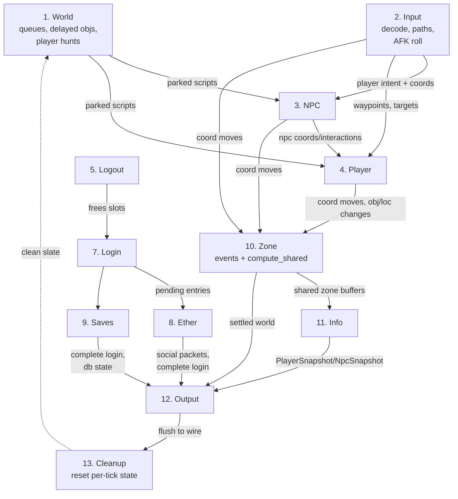
```mermaid
flowchart TD
    W[1. World<br/>queues, delayed objs,<br/>player hunts] -->|parked scripts| N[3. NPC]
    W -->|parked scripts| P[4. Player]
    I[2. Input<br/>decode, paths,<br/>AFK roll] -->|player intent + coords| N
    I -->|waypoints, targets| P
    I -->|coord moves| Z
    N -->|npc coords/interactions| P
    N -->|coord moves| Z[10. Zone<br/>events + compute_shared]
    P -->|coord moves, obj/loc changes| Z
    LO[5. Logout] -->|frees slots| LG
    LG[7. Login] -->|pending entries| E[8. Ether]
    LG --> S[9. Saves]
    E -->|social packets,<br/>complete login| OUT
    S -->|complete login,<br/>db state| OUT
    Z -->|shared zone buffers| INF[11. Info]
    Z -->|settled world| OUT[12. Output]
    INF -->|PlayerSnapshot/NpcSnapshot| OUT
    OUT -->|flush to wire| C[13. Cleanup<br/>reset per-tick state]
    C -.->|clean slate| W
```

The hard constraints, restated as *why each edge cannot be reversed*:

- **Input before NPC/Player.** AI reads player coordinates, `busy`/`afk_event_ready` state, and the paths input built (
  `npc.rs:574-688`, `player.rs` interaction). Reversing would make AI act on stale, last-tick intent.
- **World player-hunts before NPC.** All NPCs must hunt players against one frozen snapshot (`world.rs:129-136`);
  folding it into phase 3 would let earlier NPCs perturb the positions later NPCs hunt against.
- **NPC before Player.** A player following/interacting with an NPC in phase 4 reads the NPC's just-finalized position (
  `player.rs:546-556`); the follow-coord propagation (`player.rs:120`) depends on the NPC's movement being done.
- **Movement (2-4) before Zone (10).** `zones_tracking` and the collision map must be complete before `compute_shared`
  pre-encodes them. A zone modified after `compute_shared` would ship stale bytes (or none).
- **Login (7) before Ether/Saves (8-9).** The pending-login entry must exist before its async responses can complete
  it (`login.rs:69`, `ether.rs:97`, `saves.rs:55`).
- **Ether/Saves before Output (12).** They write packets into player output buffers (`ether.rs:55-85`); those buffers
  flush in phase 12.
- **Zone (10) before Info (11) before Output (12).** Info reads a settled world and produces snapshots; output reads the
  shared zone buffers *and* the snapshots. This compute-once/encode-per-observer split is the engine's central scaling
  decision.
- **Output (12) before Cleanup (13).** Every structure cleanup resets (renderers, dirty inv sets, zone tracking, pathing
  deltas) was just read by output; resetting earlier would corrupt the wire output.

### Batching, buffering, and deferral

Several deliberate deferrals reduce per-tick work and preserve determinism:

- **World player-hunt deferral** (`world.rs`): player hunts hoisted to phase 1 for snapshot consistency; non-player
  hunts deferred into phase 3 because their targets move during phase 3.
- **Zone pre-encode batching** (`zone.rs:131`): each dirty zone is encoded once into a shared buffer, then broadcast to
  N observers in output — O(zones) encode instead of O(zones × observers).
- **Info snapshot batching** (`info.rs`): each entity's render data is computed once into a flat `PlayerSnapshot`/
  `NpcSnapshot` array; output reads the array, never the cold `ActivePlayer`, in its per-observer inner loops.
- **Channel-drain caps** (`ether.rs:41`): ether drains at most `MAX_PLAYERS` messages per tick to bound worst-case phase
  time and prevent a flooded ether from starving the heartbeat.
- **Autosave staggering** (`autosave.rs:9`): full saves every 250 ticks, not every tick.
- **Async login completion** (phases 7-9): login never blocks the tick on DB/ether I/O; it parks a request and completes
  it whenever the responses arrive, with a 10-tick timeout sweep.
- **Scratch-buffer reuse** (`engine.rs:238-248`): `take_pids`/`put_pids` recycle one Vec for all five iterating phases,
  eliminating per-tick allocation on the hottest loops.

<sub>[↑ Back to top](#top)</sub>


---

<a id="sec-07"></a>

## 7. The Engine Core — State Container, Registries & World Mutation

The `Engine` struct (`rs-engine/src/engine.rs:373`) is the single mutable
container for the entire game world. It owns every player, every NPC, the zone
map, every shared inventory, the script provider, the collision-aware cache, and
the bookkeeping for deferred world mutations. There is exactly one `Engine` per
world process; it is driven by a single tokio task that calls
`Engine::cycle` (`engine.rs:563`) once per game tick (nominally every 600 ms).
This section documents the container itself, the two slab-backed entity
registries (`PlayerList`/`NpcList`), the engine-level world-mutation API
(ground objects, locs, zone events), and the reusable `ScriptState` pool. Deep
VM internals are deferred to the VM sections; here we cover only how the engine
*drives* the VM and recycles its state.

The design philosophy throughout is the same one that made the original
single-threaded TypeScript server (the LostCity/2004scape lineage)
tractable: **a single owner of mutable state, processed deterministically in a
fixed phase order, with no locks and no cross-thread sharing.** rs-engine keeps
that determinism but rebuilds the state container around fixed-capacity slab
arrays, intrusive linked lists, and scratch-buffer reuse, eliminating the
per-tick garbage that the JVM/V8 versions hide behind a GC.

### 1. The single-instance, thread-local-pointer model

#### 1.1 Ownership and the `'static` accessor

`Engine` is constructed once in `Engine::new` (`engine.rs:459`), moved into the
world-tick task, and accessed everywhere else through two free functions:

```rust
pub fn engine() -> &'static Engine { unsafe { engine_typed::<Engine>() } }
pub fn engine_mut() -> &'static mut Engine { unsafe { engine_typed_mut::<Engine>() } }
```

(`engine.rs:67`, `engine.rs:91`). A subtle but important fidelity point: the
"global" engine reference is **not** a leaked `static` variable. The pointer is
stashed in *thread-local storage* by `with_engine`
(`rs-vm/src/engine.rs:1671`), which writes `self as *mut Engine` into a TLS
`Cell<*mut ()>` (`ENGINE_PTR`, `engine.rs:1621`) for the duration of a closure,
then restores the previous value via an RAII `Restore` guard. `engine_typed`
/`engine_typed_mut` (`engine.rs:1778`, `engine.rs:1817`) read that TLS pointer
back and reconstitute a typed reference, `debug_assert!`-ing it is non-null
("called outside with_engine scope").

This indirection exists so that the RuneScript VM — which calls back into the
engine through the `ScriptEngine` trait from deep inside opcode handlers — can
reach world state without threading an `&mut Engine` through every VM frame.
`Engine::cycle` installs the pointer once for the whole tick
(`with_engine(self, …)` at `engine.rs:565`), and each script invocation
re-installs it (`runescript_vm_execute`, `engine.rs:789`) so nested
`engine()`/`engine_mut()` calls resolve to the same live object.

#### 1.2 `unsafe impl Send`, `!Sync`

```rust
// SAFETY: Engine is only accessed from the single world-tick tokio task.
unsafe impl Send for Engine {}
```

(`engine.rs:416`). The struct holds a raw `cache_ptr: *mut CacheStore`
(`engine.rs:383`), which makes it auto-`!Send` and `!Sync`. The manual `Send`
impl is required only so the engine can be *moved into* the spawned world task;
it is deliberately **not** `Sync`, and the safety contract is that it is touched
from that one task and nowhere else. The raw pointer aliases the same
`Box::leak`'d allocation that every `&'static CacheStore` reference shares, and
it is written exclusively by `reload_assets` (`engine.rs:757`), which runs on
the same task. This is the Rust-idiomatic encoding of an invariant the Java
server got for free from its single game thread: there is no shared mutable
state to race on because there is only one accessor.

#### 1.3 The `Engine` field groups

| Group           | Fields                                                                                                                                                              | Purpose                                                              |
|-----------------|---------------------------------------------------------------------------------------------------------------------------------------------------------------------|----------------------------------------------------------------------|
| Clock / mode    | `clock: u64`, `members: bool`, `client_pathfinder: bool`, `node_id: u8`                                                                                             | Tick counter, world flags, multi-world node id                       |
| Entities        | `player_list: PlayerList`, `npc_list: NpcList`                                                                                                                      | Slab registries (§2)                                                 |
| World map       | `zones: ZoneMap`, `zones_tracking: FxHashSet<ZoneCoordGrid>`, `pending_zone_events: BTreeMap<u64, Vec<PendingZoneEvent>>`                                           | Zone storage, dirty set, time-ordered deferred mutations (§4)        |
| Cache / scripts | `cache: &'static CacheStore`, `cache_ptr: *mut CacheStore`, `scripts: ScriptProvider`, `ops: OpsRegistry`                                                           | Static content, hot-reload handle, compiled scripts, VM opcode table |
| Info / render   | `player_renderer`, `npc_renderer`, `player_info`, `npc_info`, `player_snapshots: Box<[PlayerSnapshot; MAX_PLAYERS]>`, `npc_snapshots: Box<[NpcSnapshot; MAX_NPCS]>` | Appearance-block builders and hot-field snapshot arrays              |
| Inventories     | `invs: FxHashMap<u16, Inventory>`                                                                                                                                   | World-level *shared* inventories (keyed by inv id)                   |
| Queues          | `world_queue: LinkList<ScriptState>`, `obj_delayed_queue: LinkList<ObjDelayedRequest>`                                                                              | Deferred world scripts / delayed obj spawns (§3, §4)                 |
| I/O channels    | `new_player_rx`, `ether_tx/rx`, `db_tx/rx`, `db_ready`, `pending_logins`, `clock_rate_tx`, `tick_stats_tx`, `reload_tx`                                             | Login, cross-world (ether), database, scheduler, stats, reload       |
| Misc            | `random: JavaRandom`, `reusable_script: Option<ScriptState>`                                                                                                        | Java-compatible RNG, pooled script state (§5)                        |

Two design notes stand out. First, `player_snapshots`/`npc_snapshots` are
heap-boxed fixed-size arrays (`Box<[PlayerSnapshot; MAX_PLAYERS]>`,
`engine.rs:390`) initialised to the `ABSENT` sentinel; they are the hot,
cache-friendly mirror of each entity's position used by the info encoders,
cleared on removal (`engine.rs:1750`, `engine.rs:1938`). Second, `invs` holds
only *shared* (world-scoped) inventories — per-player inventories live on the
`Player` itself — which is why `update_invs` distinguishes `InvScope::Shared`
from private inventories (`active_player.rs:1026`).

The `JavaRandom` is seeded with the literal `1084838400000`
(`engine.rs:514`) to reproduce the Java `java.util.Random` sequence
bit-for-bit, preserving spawn/loot determinism against the reference server.

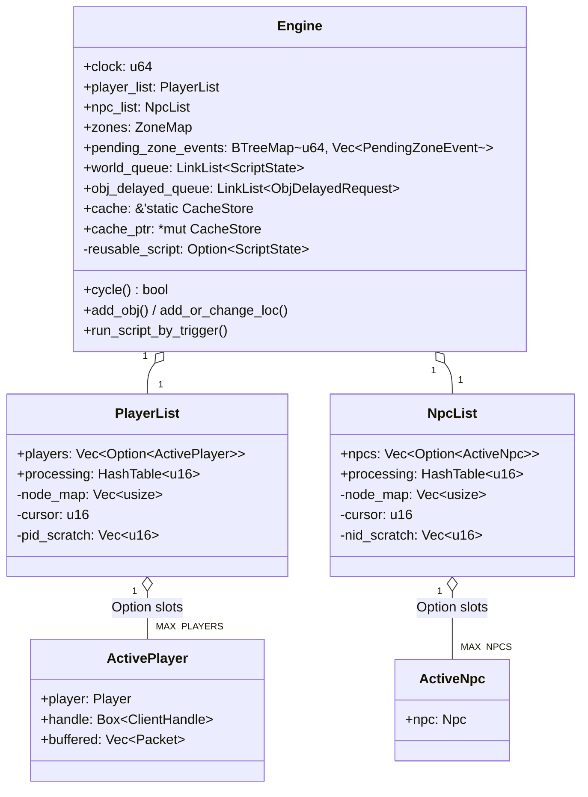
```mermaid
classDiagram
    class Engine {
        +clock: u64
        +player_list: PlayerList
        +npc_list: NpcList
        +zones: ZoneMap
        +pending_zone_events: BTreeMap~u64, Vec~PendingZoneEvent~~
        +world_queue: LinkList~ScriptState~
        +obj_delayed_queue: LinkList~ObjDelayedRequest~
        +cache: &'static CacheStore
        +cache_ptr: *mut CacheStore
        -reusable_script: Option~ScriptState~
        +cycle() bool
        +add_obj() / add_or_change_loc()
        +run_script_by_trigger()
    }
    class PlayerList {
        +players: Vec~Option~ActivePlayer~~
        +processing: HashTable~u16~
        -node_map: Vec~usize~
        -cursor: u16
        -pid_scratch: Vec~u16~
    }
    class NpcList {
        +npcs: Vec~Option~ActiveNpc~~
        +processing: HashTable~u16~
        -node_map: Vec~usize~
        -cursor: u16
        -nid_scratch: Vec~u16~
    }
    class ActivePlayer {
        +player: Player
        +handle: Box~ClientHandle~
        +buffered: Vec~Packet~
    }
    class ActiveNpc {
        +npc: Npc
    }
    Engine "1" o-- "1" PlayerList
    Engine "1" o-- "1" NpcList
    PlayerList "1" o-- "MAX_PLAYERS" ActivePlayer : Option slots
    NpcList "1" o-- "MAX_NPCS" ActiveNpc : Option slots
```

### 2. `PlayerList` / `NpcList` — slab registry + intrusive processing list

The two registries are structurally identical (`PlayerList` at `engine.rs:213`,
`NpcList` at `engine.rs:287`), so the discussion below covers both, naming the
player variant. Capacities are compile-time constants: `MAX_PLAYERS = 2048`,
`MAX_NPCS = 8192` (`rs-entity/src/build.rs:4`).

#### 2.1 Three cooperating structures

```rust
pub struct PlayerList {
    pub players: Vec<Option<ActivePlayer>>, // fixed-capacity slab, indexed by pid
    pub processing: HashTable<u16>,         // intrusive list giving iteration order
    node_map: Vec<usize>,                   // pid -> HashTable handle, for O(1) unlink
    cursor: u16,                            // free-id allocation cursor (last assigned)
    pid_scratch: Vec<u16>,                  // reusable pid snapshot buffer
}
```

- **`players` — the slab.** A `Vec<Option<ActivePlayer>>` of exactly
  `MAX_PLAYERS` slots, allocated once in `PlayerList::new` via
  `resize_with(MAX_PLAYERS, || None)` (`engine.rs:223`). The *index is the
  pid*. `Some` = occupied, `None` = free. Direct `players[pid as usize]`
  indexing is O(1) and never reallocates, so `&mut` borrows of a player are a
  single bounds-checked array access — the engine relies on this throughout
  (e.g. `runescript_execute_script_player` indexes `self.player_list.players[pid]`
  directly, `engine.rs:1082`). This mirrors the Java server's fixed
  `Player[2048]` "world list" but with Rust's `Option` encoding occupancy in
  the niche of the slot rather than a parallel boolean array.

- **`processing` — the intrusive iteration order.** A `HashTable<u16>`
  (an intrusive doubly-linked hash list, §2.3) holding the pids that should be
  *processed* this tick, in insertion order. The slab gives random access; the
  hash table gives an ordered, cheaply-mutable traversal set. `count()` returns
  `processing.len()` (`engine.rs:282`), so "online player count" is the size of
  the processing list, not a scan of the slab.

- **`node_map` — O(1) unlink.** `Vec<usize>` of `MAX_PLAYERS` entries mapping
  `pid -> HashTable node handle`. When a player is added, `processing.put`
  returns the arena index of its node, which is stored at
  `node_map[pid]` (`engine.rs:258`). Removal then unlinks in O(1) via
  `processing.unlink(node_map[pid])` (`engine.rs:265`) instead of searching the
  list. This is the key data-structure trick: it decouples "find by pid" (slab)
  from "remove from processing order" (intrusive handle) so both are constant
  time.

#### 2.2 The free-id cursor with wraparound

New ids are assigned by `next_pid`/`next_nid`, which delegate to the
free-function `next_free_id` (`engine.rs:204`):

```rust
fn next_free_id(cursor, upper, lower, is_free) -> Option<u16> {
    for i in (cursor + 1)..upper {          // scan forward from last assignment
        if is_free(i) { return Some(i); }
    }
    (lower..=cursor).find(|&i| is_free(i))   // wrap around to the bottom
}
```

`cursor` records the *last assigned* id. Allocation scans upward from
`cursor+1` to `upper`, then wraps to scan `lower..=cursor`. `add` sets
`self.cursor = pid` (`engine.rs:257`), so consecutive logins get monotonically
increasing pids until the top of the range is reached, at which point the search
recycles freed low slots. The ranges differ deliberately:

| List         | `lower` | `upper`                | initial `cursor`       |
|--------------|---------|------------------------|------------------------|
| `PlayerList` | `1`     | `MAX_PLAYERS-1` = 2047 | `MAX_PLAYERS-2` = 2046 |
| `NpcList`    | `0`     | `MAX_NPCS-1` = 8191    | `MAX_NPCS-2` = 8190    |

Players start at pid `1` (pid `0` is reserved — the client treats pid `0`
specially / as the local-player sentinel), while NPCs start at nid `0`. Both
exclude the top index from the assignable range (`upper` is exclusive). Starting
the cursor near the top means the very first allocation immediately wraps to the
low end, so ids begin at the bottom of the range and climb — matching the
original server's id-reuse behavior, which is observable on the wire (pid
appears in player-info ordering and hint arrows). The wraparound spreads reuse
across the whole range rather than aggressively reusing the just-freed slot,
which reduces the chance a client confuses a departed player with a freshly
joined one occupying the same pid in the same tick window.

`PlayerUid` packs the pid into its low 11 bits: `(username37 << 11) | (pid &
0x7FF)` (`rs-vm/src/player_uid.rs:6`), so `pid()` is `self.0 & 0x7FF`
(`player_uid.rs:62`) — 11 bits hold 0..2047, exactly `MAX_PLAYERS`. `NpcUid`
packs `(id << 16) | nid` (`rs-vm/src/npc_uid.rs:4`); `nid()` is the low 16 bits
(`npc_uid.rs:54`), `id()` the high 16 (the NPC *type*, so morphing an NPC keeps
its nid but changes its id — see §6).

#### 2.3 `HashTable<T>` — the intrusive processing list

`HashTable<T>` (`rs-datastruct/src/hashtable.rs:8`) is a closed-arena,
bucketed, doubly-linked list. It is constructed with `HashTable::new(8)`
(`engine.rs:227`) — 8 sentinel buckets — and `bucket_count` is required to be a
power of two so `(key as usize) & (bucket_count - 1)` is a fast mask
(`hashtable.rs:69`). Each `HashEntry` carries `value: Option<T>`, `key`, and
intrusive `prev`/`next` indices (`hashtable.rs:1`). Indices `0..bucket_count`
are permanent self-looping sentinels; real entries are appended after them.

- `put(key, value)` (`hashtable.rs:67`) allocates a slot (reusing the internal
  `free` list first — `alloc`, `hashtable.rs:34`), links it at the tail of its
  bucket's ring, increments `len`, and **returns the arena index** — this is the
  handle stored in `node_map`.
- `unlink(handle)` (`hashtable.rs:91`) splices the node out of its ring in O(1),
  `take`s the value, and pushes the slot onto `free` for reuse.
- `iter()` (`hashtable.rs:106`) walks bucket by bucket, yielding values in a
  stable order.

For the player/NPC processing list the *key* is the entity's packed coordinate
(`coord.packed() as i64`, e.g. `engine.rs:1785` for NPCs); players pass a `key:
i64` supplied by the caller (`add`, `engine.rs:256`). The arena + free-list
design means adding/removing players never allocates after warm-up, and the
intrusive `prev`/`next` make mid-tick removal safe and cheap.

#### 2.4 Scratch-buffer reuse: `take_pids`/`put_pids`

Phase loops iterate over a *snapshot* of the processing order rather than the
live list, because a phase may remove an entity mid-iteration (notably emergency
removal). To avoid allocating that snapshot `Vec<u16>` every tick,
`PlayerList` keeps a reusable `pid_scratch` buffer:

```rust
pub fn take_pids(&mut self) -> Vec<u16> {
    let mut v = std::mem::take(&mut self.pid_scratch); // steal the allocation
    v.clear();
    v.extend(self.processing.iter().copied());          // refill in processing order
    v
}
pub fn put_pids(&mut self, v: Vec<u16>) { self.pid_scratch = v; } // give it back
```

(`engine.rs:238`, `engine.rs:246`). The caller `take`s the buffer, iterates the
owned snapshot, then `put`s it back so its capacity (`MAX_PLAYERS`, reserved up
front at `engine.rs:230`) is reused next tick. `NpcList` has the symmetric
`take_nids`/`put_nids` (`engine.rs:311`, `engine.rs:319`). The plain
`pids()`/`nids()` methods (`engine.rs:278`) still allocate a fresh `Vec` and are
used where a throwaway list is acceptable (e.g. the fatal-panic emergency loop,
`engine.rs:599`).

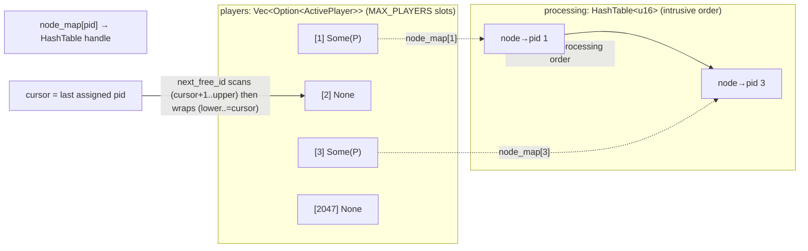
```mermaid
flowchart LR
    subgraph slab["players: Vec&lt;Option&lt;ActivePlayer&gt;&gt;  (MAX_PLAYERS slots)"]
      s1["[1] Some(P)"]
      s2["[2] None"]
      s3["[3] Some(P)"]
      sN["[2047] None"]
    end
    subgraph proc["processing: HashTable&lt;u16&gt;  (intrusive order)"]
      n1["node→pid 1"] --> n3["node→pid 3"]
    end
    nm["node_map[pid] → HashTable handle"]
    cur["cursor = last assigned pid"]
    s1 -. node_map[1] .-> n1
    s3 -. node_map[3] .-> n3
    cur -->|"next_free_id scans (cursor+1..upper) then wraps (lower..=cursor)"| s2
    n1 -. iter() yields processing order .-> proc
```

#### 2.5 Add / remove lifecycle and zone coupling

The list-level `add`/`remove` only touch the three structures
(`engine.rs:256`–`268`). The engine-level wrappers additionally maintain zone
membership and collision:

- `add_player` (`engine.rs:1732`) inserts into the list, then registers the pid
  in the destination zone's player set (`zone.add_player(pid)`).
- `remove_player` (`engine.rs:1745`) is heavier: it removes the renderer's
  permanent entry, `clear()`s the hot-field snapshot
  (`player_snapshots[pid].clear()`, `engine.rs:1750` — so any observer still
  processed later this tick encodes a *remove*), removes the player from its
  zone, **decrements the `observers` counter on every NPC in the player's build
  area** (`engine.rs:1764`, saturating) so unwatched NPCs can idle, and finally
  unlinks the slot.
- `add_npc` (`engine.rs:1779`) allocates a nid (`next_nid()?` — returns `None`
  if the world is NPC-full), rewrites the NPC's uid with the assigned nid, adds
  it to the list keyed by packed coord, registers it in its zone, then fires the
  `ai_spawn` trigger (`engine.rs:1797`).

### 3. Driving the VM: the reusable `ScriptState` pool

Scripts are the bulk of per-tick work — the comment at `state.rs:264` notes
"20,000+ script invocations per tick". A fresh `ScriptState::init`
(`rs-vm/src/state.rs:198`) allocates roughly **4 KB** (a 128-entry int stack,
128 `String`s for the string stack, plus gosub/goto frame stacks). Allocating
and freeing that per invocation would dominate the tick. The engine therefore
keeps **one** pooled state in `reusable_script: Option<ScriptState>`
(`engine.rs:413`) and cycles it.

#### 3.1 Build / run / reclaim

The pool has three touch points:

1. **Build.** `build_state` (`engine.rs:851`) and the private
   `run_script_inner` (`engine.rs:982`) both do: if `reusable_script.take()`
   yields a state, call `state.reset(script, subject, target, args)`
   (`state.rs:289`) to overwrite all fields *in place* — reusing the int/string
   stack buffers and only `clear()`+`resize()`-ing the variable-size local
   vectors; otherwise fall back to `ScriptState::init`. `reset` resets the stack
   pointers (`isp`/`ssp`) to 0 rather than zeroing the buffers (stale values are
   overwritten before read) and `clear()`s string-stack slots to release any
   large string buffers (`state.rs:321`).

2. **Run.** `run_script_inner` dispatches on subject kind to
   `runescript_execute_script_player` (`engine.rs:1073`) or
   `runescript_execute_script_npc` (`engine.rs:1191`), which call
   `runescript_vm_execute` (`engine.rs:789`) → `vm::execute`.

3. **Reclaim.** The executors return `Some(state)` **only when the script
   finished or aborted** (i.e., was *not* suspended), `None` otherwise. The
   caller then stores the returned state back:
   `self.reusable_script = Some(returned_state)` (`engine.rs:1029`,
   `engine.rs:838`). Suspended states must **not** be pooled — they are parked
   on the player, NPC, or world queue and resumed later, so reusing their
   buffers would corrupt a live suspension.

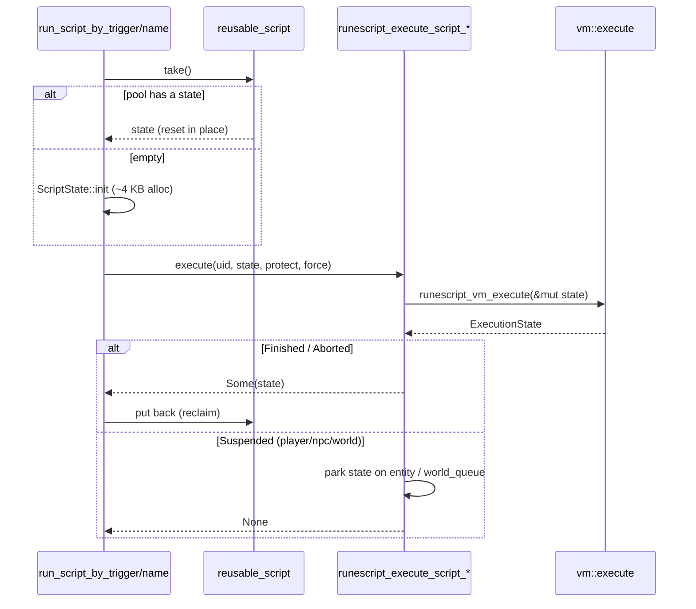
```mermaid
sequenceDiagram
    participant Caller as run_script_by_trigger/name
    participant Pool as reusable_script
    participant Exec as runescript_execute_script_*
    participant VM as vm::execute
    Caller->>Pool: take()
    alt pool has a state
        Pool-->>Caller: state (reset in place)
    else empty
        Caller->>Caller: ScriptState::init (~4 KB alloc)
    end
    Caller->>Exec: execute(uid, state, protect, force)
    Exec->>VM: runescript_vm_execute(&mut state)
    VM-->>Exec: ExecutionState
    alt Finished / Aborted
        Exec-->>Caller: Some(state)
        Caller->>Pool: put back (reclaim)
    else Suspended (player/npc/world)
        Exec->>Exec: park state on entity / world_queue
        Exec-->>Caller: None
    end
```

#### 3.2 Trigger lookup and suspension routing

`trigger_lookup_key` (`engine.rs:701`) encodes a trigger into the `i32` script
lookup key the provider uses. It tries most-specific first: a *type-id* key
`base | (0x2 << 8) | (t << 10)`, then a *category* key `base | (0x1 << 8) | (c
<< 10)` (only if `c != -1`), and finally the bare trigger ordinal `base`. Each
candidate is probed against `scripts.get_by_lookup` and the first that resolves
wins — exactly the three-level specialization (`[trigger,obj]` > `[trigger,_category]`
> `[trigger,_]`) of the RuneScript engine.

After VM execution, the executors interpret the returned `ExecutionState`
(`engine.rs:1125`):

| Result                    | Routing                                                                                                                                                |
|---------------------------|--------------------------------------------------------------------------------------------------------------------------------------------------------|
| `Finished` / `Aborted`    | clear the entity's `active_script` (if it matches `root_script_id`), close a stale modal if appropriate; reclaim the state                             |
| `WorldSuspended`          | `delay = state.pop_int()`; `enqueue_world_script(state, delay)` (`engine.rs:1303`), which sets `script.delay = delay + 1` and appends to `world_queue` |
| `NpcSuspended`            | park on the referenced NPC's `state.active_script` (the NPC is chosen by `int_operand()`: 0 → `active_npc`, else `active_npc2`)                        |
| other suspension (player) | park on the player's `state.active_script`, re-set `protect`                                                                                           |

The player executor also enforces **protection**: if `protect && !force` and the
player is already `protect` or `delayed`, execution is skipped entirely
(`engine.rs:1081`); otherwise it sets the flag and a `ProtectedActivePlayer`
script pointer for the duration, clearing both afterward — including chasing
down `ProtectedActivePlayer`/`ProtectedActivePlayer2` flags on any *other*
players the script touched (`engine.rs:1104`–`1123`) so no stale protection
lingers. This is the engine's encoding of the original "delay/protect"
single-action guard that prevents a player from running two competing scripts in
one tick.

### 4. Engine-level world mutation

All mutations that change the visible world go through engine methods that
(a) update the authoritative zone/collision state immediately, (b) schedule any
*future* reversal/despawn into a time-ordered queue, and (c) mark the affected
zone dirty so the zones phase flushes deltas to clients.

#### 4.1 Dirty-tracking and time-ordered events

- `track_zone(x, y, z)` (`engine.rs:1267`) inserts a `ZoneCoordGrid` into the
  `zones_tracking: FxHashSet`. The zones phase iterates this set and flushes
  each dirty zone's queued messages, then clears it. Using a *set* deduplicates
  many mutations to the same zone within one tick into a single flush.
- `schedule_zone_event(clock, event)` (`engine.rs:1282`) pushes a
  `PendingZoneEvent` into `pending_zone_events: BTreeMap<u64, Vec<…>>` keyed by
  the tick it should fire. The `BTreeMap` keeps events in chronological order so
  the world phase can drain all entries with `key <= clock` cheaply; the `Vec`
  value batches multiple events landing on the same tick.

`PendingZoneEvent` (`engine.rs:147`) has four variants, all describing deferred
world changes:

| Variant                               | Meaning                                                |
|---------------------------------------|--------------------------------------------------------|
| `ObjReveal { coord, id, receiver37 }` | promote a receiver-only ground obj to globally visible |
| `ObjDelete { coord, id, clock }`      | despawn a ground obj after its lifetime                |
| `ObjAdd { coord, id }`                | respawn an obj that was picked up/removed              |
| `LocDelete { coord, layer, clock }`   | revert/remove a temporary loc change                   |

#### 4.2 Ground objects: stacking, reveal, despawn

`add_obj(obj, receiver37, duration)` (`engine.rs:1340`) is the core spawn path:

1. **Merge.** If the obj type is `stackable`, the obj's lifetime is `Despawn`,
   and a `receiver37` is given, it first tries `merge_obj` (`engine.rs:1414`).
   `merge_obj` finds an existing same-id stack owned by the same receiver at the
   tile (`get_obj_of_receiver`), checks it is also `Despawn`, and that the
   combined count `<= STACK_LIMIT` (`engine.rs:1427`). On success it bumps the
   existing stack's `count` and `last_clock`, emits an `ObjCount` zone message
   (so clients see the new total) via `zone.queue_event`, reschedules the
   `ObjDelete`, marks the zone dirty, and returns `true` — the new obj is *not*
   created. This is the wire-faithful "drops merge into one stack" behavior.
2. **Reveal scheduling.** If a `receiver37` is present, the obj starts
   receiver-only; `reveal` is set to `clock + REVEAL_TICKS` (`REVEAL_TICKS =
   100`, `rs-entity/src/obj.rs:5`) and an `ObjReveal` event is scheduled — but
   **only if the reveal happens before the despawn** (`reveal_clock < clock`,
   `engine.rs:1361`), avoiding a pointless reveal of an obj that despawns first.
3. **Despawn scheduling.** An `ObjDelete` is *always* scheduled at `clock =
   self.clock + duration` (`engine.rs:1355`).
4. Finally the obj is inserted into its zone (`zone.add_obj`) and the zone is
   tracked.

`remove_obj(coord, id, receiver37, duration)` (`engine.rs:1481`) removes the obj
from its zone, and — if `duration > 0` — schedules an `ObjAdd` respawn at
`clock + scale_by_player_count(duration)`. `scale_by_player_count`
(`engine.rs:2300`) returns `(4000 - min(players, 2000)) * rate / 4000`, so
respawn delays shorten as population grows (full delay at 0 players, halved at

2000) — a load-aware resource-respawn knob inherited from the original server.

#### 4.3 Locs: add/change, remove, revert

`add_or_change_loc(coord, id, shape, angle, duration)` (`engine.rs:1541`)
resolves the loc layer from the shape (`shape.layer()`) and looks for an
existing loc on that layer at the tile:

- **Change path** (existing found, `engine.rs:1561`): if the old loc is
  `visible()`, its collision is removed (`apply_loc_collision(…, false)`), the
  loc is mutated in place (`zone.locs[idx].change(…)`), new collision is applied
  by id (`apply_collision_by_id(…, true)`), and `zone.change_loc(idx)` queues
  the client delta. If the result is a *change* or a `Despawn`, a `LocDelete` is
  scheduled at `clock + duration` and `last_clock` recorded; otherwise
  `last_clock` is cleared.
- **Add path** (none found, `engine.rs:1591`): a brand-new `Despawn` `Loc` is
  built (width/length from the cache type, defaulting to 1×1), collision is
  applied, the loc is appended to the zone, and — if `duration > 0` — a
  `LocDelete` is scheduled.

`remove_loc` (`engine.rs:1654`) clears a visible loc's collision and marks it
removed; if the loc is `Respawn` and `duration > 0` it schedules a `LocDelete`
that will *restore* it. `revert_loc` (`engine.rs:1703`) undoes a prior `change`:
remove current collision → `loc.revert()` → apply the reverted loc's collision →
`change_loc` → clear `last_clock`. In every loc path the collision map
(`rsmod`/`apply_loc_collision`) is kept in lockstep with the zone's loc list,
so the pathfinder never sees stale geometry — a correctness invariant the engine
upholds eagerly rather than lazily.

#### 4.4 Hot-reload in place

`reload_assets(new_store, new_scripts)` (`engine.rs:757`) swaps content live:

```rust
unsafe {
std::ptr::drop_in_place( self .cache_ptr);     // drop the old CacheStore
std::ptr::write( self .cache_ptr, * new_store);  // write the new one in the SAME alloc
}
self .scripts = new_scripts;
```

Because every `&'static CacheStore` reference (and `self.cache`) points at the
*same* `Box::leak`'d allocation that `cache_ptr` addresses, overwriting that
allocation in place atomically updates all references without invalidating any
of them. This is sound only because the operation runs on the single world task
while no borrow of the cache is live. In debug builds it also broadcasts a
"Hot-reload applied" chat line to all players (`engine.rs:766`).

### 5. The tick loop and fault isolation

`Engine::cycle` (`engine.rs:563`) installs the engine pointer via `with_engine`
and runs **13 phases** in a fixed order, each wrapped in the `phase!` macro
(`engine.rs:571`) which times it and runs it inside
`catch_unwind(AssertUnwindSafe(…))`:

`world → input → npcs → players → logouts → autosave → logins → ether → saves
→ zones → info → out → cleanup`

(`engine.rs:582`–`594`). A panic in any phase is caught, logged as `FATAL`, and
sets a `fatal` flag instead of crashing the process — relying on the release
profile keeping `panic = "unwind"` so `catch_unwind` can actually intercept. If
`fatal` is set, the engine emergency-saves and removes **every** player via
`emergency_remove_player` (`engine.rs:599`) and returns `true` to signal the
host to recycle the world. `emergency_remove_player` (`engine.rs:1996`) extracts
and saves the player's profile (`extract_profile`/`save_binary` → `DbRequest::Save`),
notifies ether (`EtherOutbound::PlayerLogout`), then calls `remove_player`. The
NPC analogue `emergency_deactivate_npc` (`engine.rs:2043`) skips the
`ai_despawn` script (to avoid re-panicking) and frees `Despawn` NPCs outright.

After the phases, `clock` is incremented (`engine.rs:595`) and a `TickStats`
snapshot (`engine.rs:117`) — per-phase millisecond timings plus player/NPC
counts — is published to `tick_stats_tx` and logged under the `tick_stats`
target for live monitoring.

### 6. `ActivePlayer` and `ActiveNpc` — the engine-side entity handles

The registries hold `ActivePlayer`/`ActiveNpc`, the engine-side wrappers around
the pure `Player`/`Npc` data entities.

#### 6.1 `ActivePlayer`

```rust
pub struct ActivePlayer {
    pub player: Player,
    pub handle: Box<ClientHandle>,
    pub buffered: Vec<Packet>,
    pub client_limit: u8,
    pub user_limit: u8,
    pub restricted_limit: u8,
}
```

(`active_player.rs:128`). It pairs the `Player` entity with its network
`ClientHandle` (boxed to keep `ActivePlayer` small in the slab) and a per-tick
`buffered` packet vector. The three `*_limit` counters rate-limit inbound
messages per category each tick (reset in `decode`, `active_player.rs:1679`).

`ActivePlayer` is the home of all *server protocol* output. `write<M>`
(`active_player.rs:197`) routes by `M::PRIORITY`: `Buffered` messages are
encoded into a `Packet` and pushed onto `self.buffered` (`queue_buffered`,
`active_player.rs:221`), flushed at end-of-tick by `encode`→`write_buffered`
(`active_player.rs:330`, `active_player.rs:252`); `Immediate` messages bypass
the queue via `write_immediate` (`active_player.rs:272`). Both paths
ISAAC-encrypt the opcode byte (`buf.data[0] + isaac_encode.next_int()`) and drop
oversized (>5000 byte) messages. `write_immediate` notably **recycles outbound
buffers**: it drains returned buffers from `recycle_rx` into a `buffer_pool`
(capped at `OUTPUT_POOL_CAP = 8`, `active_player.rs:116`) and reuses one instead
of allocating a fresh `Vec` per immediate message — the same
allocation-avoidance philosophy as the script pool, applied to the network path.

`encode` (`active_player.rs:330`) also reconciles modal UI state: it diffs
`modal_main`/`modal_chat`/`modal_side` against their `last_*` shadows and emits
the appropriate `if_open_*`/`if_close` packets only on change. The dozens of
`if_set*`, `cam_*`, `update_*`, `varp_*` helpers are thin typed wrappers over
`write`. Higher-level helpers (`update_invs`, `update_other_invs`,
`sync_varps`, `update_map`) implement the per-tick sync logic and lean heavily
on `thread_local!` scratch buffers and `std::mem::take` of player sub-maps to
iterate while holding `&mut self` without cloning (e.g. `active_player.rs:1016`,
`active_player.rs:1127`).

#### 6.2 `ActiveNpc`

```rust
pub struct ActiveNpc {
    pub npc: Npc
}
```

(`active_npc.rs:14`) — a thin newtype over `Npc`, carrying engine behavior as
methods. `ActiveNpc::new` (`active_npc.rs:39`) seeds combat stats
(attack/defence/strength/hitpoints/ranged/magic), hunt config
(`hunt_mode`/`hunt_range`), movement restriction, and the recurring timer from
the cache NPC type. Key methods:

- `anim` (`active_npc.rs:82`) plays a sequence respecting priority (a new anim
  replaces the current only if its seq priority is `>=`).
- `damage` (`active_npc.rs:122`) subtracts saturating from `Hitpoints` and
  populates the `NpcInfoProt::Damage` info fields.
- `change_type` (`active_npc.rs:200`) morphs the NPC into another type for a
  duration: it rewrites `uid = NpcUid::new(new_type, nid)` (keeping the *nid*,
  changing the *id*), sets the `ChangeType` info mask, optionally recomputes
  combat levels preserving buff/debuff deltas, and schedules a revert via
  `revert_at = clock + duration` — unless reverting to base on a `Respawn` NPC,
  in which case `revert_at` is cleared. `revert_type` (`active_npc.rs:245`)
  restores the base type and, if `revert_reset`, fully restores stats and clears
  hero points.
- `tele` (`active_npc.rs:277`) moves the NPC and sets `pathing.tele = true` (so
  the info encoder transmits a remove+add), but **silently no-ops if the target
  zone isn't allocated** in the collision map — defensive against teleporting
  into unloaded space.

Both wrappers implement the VM's `ScriptPlayer`/`ScriptNpc` and (via `Engine`)
`ScriptSubject` plumbing; `ActivePlayer::uid()`/`ActiveNpc::uid()`
(`engine.rs:2997`, `engine.rs:4668`) expose the packed identifier the registries
and snapshots key on.

### Summary of engineering rationale

The Engine Core trades a small amount of `unsafe` (one manual `Send`, one raw
cache pointer, a TLS engine pointer) for three concrete wins over the GC-backed
reference server: **zero per-tick allocation on the hot paths** (slab arrays,
intrusive lists with internal free lists, scratch-buffer and `ScriptState`
reuse, output-buffer recycling), **O(1) random-access *and* O(1) ordered
removal** of entities (slab index + `node_map` handle into the intrusive
`HashTable`), and **deterministic, fault-isolated mutation** (time-ordered
`BTreeMap` zone events, eager collision coupling, `catch_unwind` per phase with
emergency save). Every wire-visible behavior — pid reuse order, drop stacking,
reveal/despawn timing, NPC morph identity, population-scaled respawns — is
preserved byte-for-byte against the TS original while the underlying memory
layout is rebuilt for Rust.

<sub>[↑ Back to top](#top)</sub>


---

<a id="sec-08"></a>

## 8. Core Data Structures — Intrusive Lists & Open-Addressed Tables

The `rs-datastruct` crate is small — three files (`lib.rs`, `hashtable.rs`, `linklist.rs`) totalling roughly 450 lines
of non-test code — but it is load-bearing for the entire tick loop. It supplies two arena-backed containers,
`HashTable<T>` and `LinkList<T>`, that the engine uses wherever it needs **stable iteration order that survives
mid-iteration mutation**, **O(1) removal by a previously-handed-out handle**, and **zero per-element heap allocation**.
Both are deliberate re-implementations of structures from the TypeScript reference server,
not thin wrappers over `std` collections, and the divergence is
intentional: the reference server's semantics — including one specific iteration *bug* — are part of the
wire-and-behavior contract this server must reproduce.

This section dissects both structures field-by-field, derives their invariants, walks the hot call sites (`PlayerList`/
`NpcList` processing order, `world_queue`, `obj_delayed_queue`, the per-entity `ScriptQueue` lanes), and explains the
engineering rationale against the `std` alternatives that were *not* used.

### 20.1 Design thesis: why not `HashMap`, `LinkedList`, or `Vec`?

The reference server is written in a garbage-collected language where every `Player`, `Npc`, `Obj`, and queued script is
a heap object threaded into intrusive doubly-linked lists. Iteration walks pointer chains; removal is O(1) because the
node already knows its neighbors; and the GC hides the allocation cost. A naive Rust port cannot replicate this
directly — intrusive pointers fight the borrow checker, and `std::collections::LinkedList` neither exposes node handles
nor permits safe removal during iteration.

`rs-datastruct` resolves the tension by **moving the intrusiveness into an arena**. Instead of pointers embedded in the
value, each container owns a contiguous `Vec` of nodes; "pointers" become `usize` indices into that `Vec`; and a node
*handle* is just an index. This buys the engine four properties that the `std` types cannot jointly provide:

| Requirement                                 | `std::HashMap`   | `std::collections::LinkedList` | `Vec` + swap_remove   | `rs-datastruct`                   |
|---------------------------------------------|------------------|--------------------------------|-----------------------|-----------------------------------|
| O(1) removal by stored handle               | no (key only)    | no handle API                  | yes, but **reorders** | **yes, order-preserving**         |
| Stable iteration order across removals      | no (no order)    | yes                            | no                    | **yes**                           |
| Safe `unlink` of current node mid-iteration | n/a              | unsafe/awkward                 | invalidates indices   | **yes (cursor caches successor)** |
| No per-element heap alloc; slot reuse       | per-bucket nodes | per-node alloc                 | flat, but shifts      | **flat arena + free list**        |
| Reproduces reference iteration quirks       | n/a              | n/a                            | n/a                   | **yes (by construction)**         |

The "stable iteration order across removals" row is the one that motivates `HashTable` specifically: the engine must
process players and NPCs in a deterministic order every tick even as entities log out or are emergency-removed
mid-phase, and that order must not depend on the hashing of their identifiers.

### 20.2 `LinkList<T>` — arena-backed intrusive ring with a caching cursor

#### 20.2.1 Layout

`LinkList<T>` (`rs-datastruct/src/linklist.rs:24`) is three fields:

```rust
pub struct LinkList<T> {
    entries: Vec<Entry<T>>,  // node arena; index 0 is the sentinel
    free: Vec<usize>,        // LIFO stack of recycled slot indices
    cursor: usize,           // single traversal cursor (0 = exhausted)
}
```

The node type is shared with the hash table's conceptual model and lives in `lib.rs`:

```rust
pub(crate) struct Entry<T> {
    pub(crate) value: Option<T>,  // None = sentinel or freed slot
    pub(crate) prev: usize,
    pub(crate) next: usize,
}
```

Index **0 is a permanent sentinel** (`const SENTINEL: usize = 0`, `linklist.rs:10`). `new()` (`linklist.rs:45`) seeds
`entries` with exactly one node whose `prev` and `next` both point at itself — the canonical empty circular ring. The
sentinel's `value` is always `None`, and callers never receive index 0 as a handle: every handle returned by `head`/
`tail`/`next`/`prev` is `>= 1`.

Memory layout consequence: nodes are dense in a single `Vec`, so a forward walk touches contiguous-ish cache lines
rather than chasing GC-scattered heap objects as the reference does. `Entry<T>` is `Option<T>` plus two `usize`, so for
a small `T` the node is a handful of words and many nodes share a cache line.

#### 20.2.2 The ring and the operations

The list is a circular doubly-linked ring closed through the sentinel. `add_tail` (`linklist.rs:118`) splices a freshly
allocated node between the old tail (`entries[SENTINEL].prev`) and the sentinel; `add_head` (`linklist.rs:144`) splices
between the sentinel and the old head. Both are four pointer writes and run in O(1). `remove_head` (`linklist.rs:170`)
reads `entries[SENTINEL].next`, returns `None` if it is the sentinel (empty), else delegates to `unlink`.

`unlink` (`linklist.rs:355`) is the core O(1)-removal primitive:

```rust
pub fn unlink(&mut self, handle: usize) -> T {
    let prev = self.entries[handle].prev;
    let next = self.entries[handle].next;
    self.entries[prev].next = next;          // patch neighbors to skip us
    self.entries[next].prev = prev;
    self.entries[handle].prev = SENTINEL;    // detach
    self.entries[handle].next = SENTINEL;
    let value = self.entries[handle].value.take().expect("double unlink");
    self.free.push(handle);                  // recycle slot
    value
}
```

Three invariants are enforced here. First, **slot recycling**: the freed index is pushed onto `free`, and the next
`alloc` (`linklist.rs:80`) pops it LIFO before ever growing the `Vec`. The arena therefore reaches a steady-state size
equal to the high-water mark of *concurrently live* nodes and never reallocates again. Second, **double-unlink detection
**: `value.take().expect("double unlink")` panics if the slot's `Option` is already `None`, catching use-after-free of a
stale handle. Third, **`unlink` never touches `cursor`** — this is what makes mid-iteration removal safe (next
subsection).

`clear()` (`linklist.rs:415`) resets the sentinel to self-referential, clears the cursor, and pushes every index
`1..len` onto `free` without shrinking the `Vec` — a bulk recycle that preserves capacity for the next fill. The doc
note at `linklist.rs:406` makes the no-shrink behavior explicit; this is what lets a per-entity `ScriptQueue` lane be
reused tick after tick with no reallocation.

#### 20.2.3 The caching cursor and the authentic "speedup bug"

`LinkList` carries a **single** `cursor` field, not an iterator object, and forward/reverse traversal share it.
`head()` (`linklist.rs:200`) returns the head handle but sets `cursor` to the head's *successor* — it reads one step
ahead. `next()` (`linklist.rs:253`) then returns the current `cursor` and advances it to that node's `next`. The crucial
property: **by the time a node's handle is yielded, the cursor has already moved past it.** Removing the just-yielded
node only repatches its neighbors (`unlink` doesn't touch `cursor`), so the cached successor is still valid and
iteration proceeds correctly. This is exactly why the phase loops can `unlink` the current entry while walking — see
`process_world_queue` (`rs-engine/src/phases/world.rs:59`), which calls `next()` to advance *before* it calls
`unlink(idx)`:

```rust
h = self .world_queue.next();           // cursor already advanced
let mut script = self .world_queue.unlink(idx);   // safe to remove now
```

The same one-step-ahead caching reproduces a famous reference-server quirk, documented verbatim at the top of
`linklist.rs:1-6`. If a node is appended to the tail **while iterating**, behavior depends on where the cursor is:

- If the cursor already points at the sentinel (iteration was on the last element), the newly appended node is **skipped
  this tick** — the cursor never reaches it.
- If there are still nodes ahead, the cursor chain naturally walks through them and *also* reaches the freshly appended
  tail node, giving it an **early execution this same tick** — the "speedup bug."

The crate's own tests pin this down: `speedup_bug_add_at_last_element_no_speedup` (`linklist.rs:623`) asserts a node
added while processing the last element is not visited, whereas `speedup_bug_two_elements_speedup` (`linklist.rs:605`)
and `speedup_bug_middle_insert_speedup` (`linklist.rs:641`) assert the appended node *is* visited. This is not an
accident to be fixed — it is **byte-and-behavior fidelity** with the original `LinkList.ts` cursor semantics,
where `head()`/`next()` likewise cache `node.next` before yielding. Reproducing
it matters because scripts re-queue themselves into `world_queue` (`world.rs:76`, `enqueue_world_script` on
`ExecutionState::WorldSuspended`), and the exact tick on which a re-queued world script next runs must match the
reference.

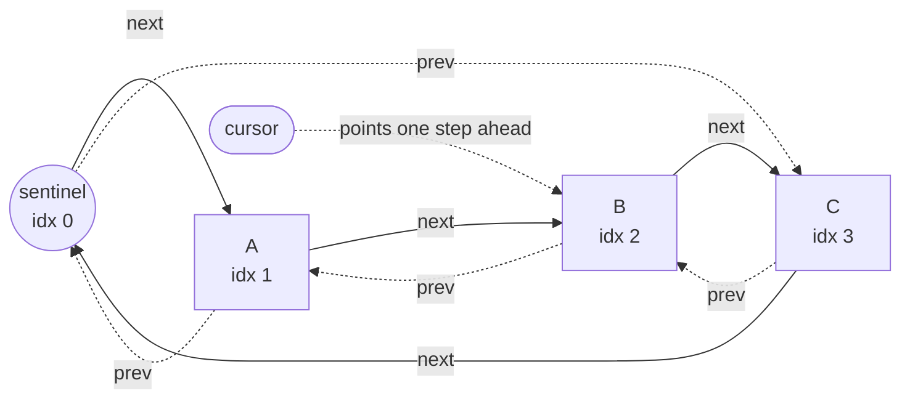
```mermaid
flowchart LR
    S(("sentinel<br/>idx 0")) -->|next| A["A<br/>idx 1"]
    A -->|next| B["B<br/>idx 2"]
    B -->|next| C["C<br/>idx 3"]
    C -->|next| S
    S -.->|prev| C
    C -.->|prev| B
    B -.->|prev| A
    A -.->|prev| S
    cur(["cursor"]) -.points one step ahead.-> B
```

The diagram shows the state immediately after `head()` returned A: the loop holds handle A, but `cursor` already
references B, so `unlink(A)` cannot strand the walk.

#### 20.2.4 `iter()` vs the cursor

`iter()` (`linklist.rs:389`) returns a `std::iter::from_fn` closure that walks the `next` chain from the sentinel *
*without touching `self.cursor`**. This is the *re-entrant* read path: it is safe to call while a cursor-based `head`/
`next` loop is already in flight (e.g. a queued script that inspects the queue during the drain). The two iteration
modes are complementary — cursor-based for mutating drains, `iter()` for nested read-only passes. The reference's
generator-based saves/restores the cursor to achieve nestability;
`rs-datastruct` instead sidesteps the cursor entirely for the read path, which is simpler and allocation-free.

#### 20.2.5 Where `LinkList` is used

- **`Engine::world_queue: LinkList<ScriptState>`** (`rs-engine/src/engine.rs:396`) — deferred world scripts. Pushed via
  `enqueue_world_script`/`add_tail` (`engine.rs:1305`), drained by `process_world_queue` with per-entry `delay`
  countdown and conditional `unlink` (`world.rs:59-95`).
- **`Engine::obj_delayed_queue: LinkList<ObjDelayedRequest>`** (`engine.rs:397`) — delayed ground-object spawns.
  `ObjDelayedRequest` (`engine.rs:174`) carries `coord/id/count/receiver37/duration/delay`; appended by
  `add_obj_delayed`/`add_tail` (`engine.rs:2602`), drained identically by `process_obj_delayed_queue` (`world.rs:107`).
- **`ScriptQueue` lanes** (`rs-engine/rs-queue/src/lib.rs:12-16`) — three lanes (`queue`, `weak`, `engine`), each a
  `LinkList<QueuedScript>`, owned per entity. `unlink_matching` (`rs-queue/src/lib.rs:133`) walks a lane with `head`/
  `next` and `unlink`s every entry matching a `script_id`, relying precisely on the cursor-caches-successor guarantee to
  remove mid-walk while preserving relative order.

### 20.3 `HashTable<T>` — open-bucketed table with arena chains and stable processing order

#### 20.3.1 Layout and the power-of-two bucket array

`HashTable<T>` (`hashtable.rs:8`) co-locates the bucket sentinels and the data nodes in a single `Vec`:

```rust
struct HashEntry<T> {
    value: Option<T>,
    key: i64,
    prev: usize,
    next: usize
}

pub struct HashTable<T> {
    bucket_count: usize,        // must be a power of two
    entries: Vec<HashEntry<T>>, // [0..bucket_count) are bucket sentinels; rest are data
    free: Vec<usize>,           // recycled data-slot indices
    len: usize,                 // live element count
}
```

`new(bucket_count)` (`hashtable.rs:16`) pre-fills `entries[0..bucket_count]` with sentinel nodes, each
self-referential (`prev = next = i`). Indices `0..bucket_count` are therefore the **bucket heads**; every chain is a
circular doubly-linked ring closed through its own bucket sentinel — the same arena-intrusive scheme as `LinkList`, but
with `bucket_count` independent rings instead of one.

Hashing is `(key as usize) & (bucket_count - 1)` (`hashtable.rs:56,69`). This is a raw bit-mask, which is **only correct
because `bucket_count` is a power of two** — the mask `bucket_count - 1` keeps the low bits. There is no rehashing and
no resize: the table is open-addressed in the sense of fixed buckets with chaining, and load factor is allowed to exceed
1 (chains simply lengthen). The engine instantiates these tables at `bucket_count = 8` (`engine.rs:227,301`), which the
chaining strategy tolerates gracefully even at thousands of entries.

#### 20.3.2 put / get / unlink

`put` (`hashtable.rs:67`) allocates a data slot via `alloc` (reusing a freed index or growing the `Vec`), then **appends
to the tail of its bucket chain** — splicing between `entries[sentinel].prev` and the sentinel. Tail insertion is the
detail that makes processing order *insertion order within a bucket*, which the tests verify (`iter_bucket_order`,
`hashtable.rs:240`). `put` returns the slot index as a stable **handle**.

`get` (`hashtable.rs:55`) hashes the key to its sentinel and walks `next` until it either finds a matching `key` or
returns to the sentinel (chain exhausted → `None`). Average cost is O(chain length), i.e. O(1) under reasonable load.

`unlink` (`hashtable.rs:91`) is the O(1)-by-handle removal:

```rust
pub fn unlink(&mut self, handle: usize) -> T {
    let prev = self.entries[handle].prev;
    let next = self.entries[handle].next;
    self.entries[prev].next = next;
    self.entries[next].prev = prev;
    let value = self.entries[handle].value.take().expect("double unlink");
    self.free.push(handle);
    self.len -= 1;
    value
}
```

Note the asymmetry with `LinkList::unlink`: the hash-table version does **not** reset the removed node's own `prev`/
`next` to the sentinel, because it is taken straight onto the free list and `alloc` fully overwrites it on reuse — a
micro-optimization that drops two writes. The `expect("double unlink")` guard is retained.

`value`/`value_mut` (`hashtable.rs:83,87`) and the `Index`/`IndexMut` impls (`hashtable.rs:148-160`) dereference a
handle to its payload, panicking on a vacated slot. `iter()` (`hashtable.rs:106`) walks **all buckets in order** (bucket
0, then bucket 1, …), and within each bucket follows the chain head-to-tail; the `Iter` state machine (
`hashtable.rs:126`) advances `current` along a chain and steps `bucket` forward when it returns to that bucket's
sentinel. The yielded order is therefore *deterministic*: a function purely of `(key & mask)` and per-bucket insertion
order, **never of insertion time across buckets**.

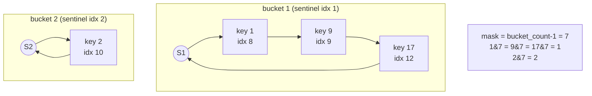
```mermaid
flowchart TB
    subgraph bucket1 ["bucket 1  (sentinel idx 1)"]
        S1(("S1")) --> N1["key 1<br/>idx 8"] --> N9["key 9<br/>idx 9"] --> N17["key 17<br/>idx 12"] --> S1
    end
    subgraph bucket2 ["bucket 2  (sentinel idx 2)"]
        S2(("S2")) --> N2["key 2<br/>idx 10"] --> S2
    end
    note["mask = bucket_count-1 = 7<br/>1&7 = 9&7 = 17&7 = 1<br/>2&7 = 2"]
```

#### 20.3.3 The handle indirection: `node_map`, and why this beats a plain `HashMap`

`HashTable` alone gives a key→handle map; the engine layers a **reverse index** on top to get O(1) removal *without*
re-hashing. In `PlayerList` (`engine.rs:213`) and `NpcList` (`engine.rs:287`):

```rust
pub struct PlayerList {
    pub players: Vec<Option<ActivePlayer>>, // dense array indexed by pid
    pub processing: HashTable<u16>,         // key (e.g. user37) -> pid, in processing order
    node_map: Vec<usize>,                   // pid -> HashTable handle
    cursor: u16,                            // round-robin pid allocator
    pid_scratch: Vec<u16>,                  // reusable snapshot buffer
}
```

`add(pid, active, key)` (`engine.rs:256`) does three writes: store the active entity in the dense `players[pid]` slot,
`put(key, pid)` into `processing` (capturing the returned handle), and record `node_map[pid] = handle`. `remove(pid)` (
`engine.rs:263`) then unlinks in O(1) **by handle** — `self.processing.unlink(self.node_map[pid])` — with no need to
recompute the hash or re-find the chain node. This two-level scheme (dense `Vec` for payload + `HashTable` for ordered
membership + `node_map` for handle lookup) is the Rust equivalent of the reference's intrusive `Player.next/prev`
pointers, achieving the same O(1) splice-out while keeping the payload in a flat, cache-friendly array indexed by the
wire `pid`/`nid`.

A plain `std::HashMap<i64, u16>` would lose the deterministic ordering entirely (its iteration order is randomised
per-process by the default hasher) and would not yield a stable handle for O(1) removal. The deterministic order matters
because **player/NPC processing order is observable** — script side effects, combat resolution, and info-block ordering
can depend on it, and the reference server's order must be matched tick-for-tick.

#### 20.3.4 Stable iteration through emergency removal: `take_pids`/`put_pids`

The processing-order snapshot is taken via `take_pids` (`engine.rs:238`) / `take_nids` (`engine.rs:311`):

```rust
pub fn take_pids(&mut self) -> Vec<u16> {
    let mut v = std::mem::take(&mut self.pid_scratch); // steal the reusable buffer
    v.clear();
    v.extend(self.processing.iter().copied());          // ordered snapshot
    v
}
```

The phase loops iterate this **owned `Vec` snapshot**, not the live table, because an entity may be emergency-removed (
e.g. via `catch_unwind`) mid-phase; mutating `processing` while iterating it would otherwise be unsound. The snapshot
decouples "the set we decided to process this tick" from concurrent mutation. Critically the buffer is **recycled**:
`pid_scratch`/`nid_scratch` is `mem::take`-n out, refilled, and handed back via `put_pids`/`put_nids` (
`engine.rs:246,319`), so the per-tick processing snapshot costs zero steady-state allocation. (The older `pids()`/
`nids()` helpers at `engine.rs:278,351` allocate a fresh `Vec` each call and survive only for non-hot paths.) This
mirrors the engine-wide allocation discipline noted in the perf roadmap — the tick loop avoids per-cycle heap churn.

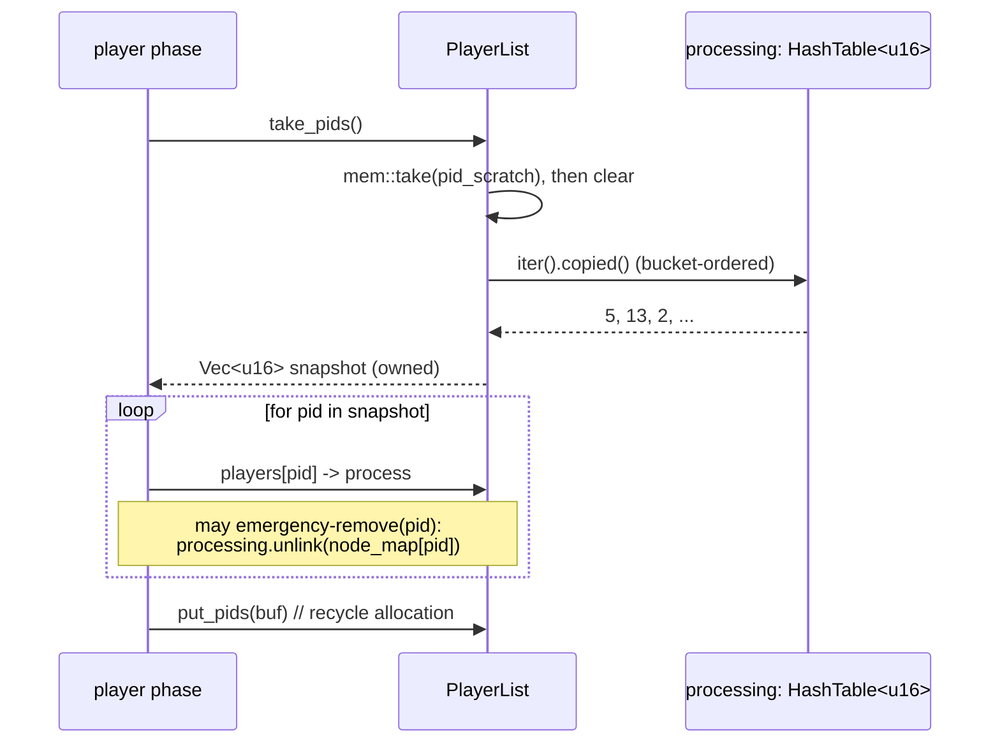
```mermaid
sequenceDiagram
    participant Phase as player phase
    participant PL as PlayerList
    participant HT as processing: HashTable<u16>
    Phase->>PL: take_pids()
    PL->>PL: mem::take(pid_scratch), then clear
    PL->>HT: iter().copied()  (bucket-ordered)
    HT-->>PL: 5, 13, 2, ...
    PL-->>Phase: Vec<u16> snapshot (owned)
    loop for pid in snapshot
        Phase->>PL: players[pid] -> process
        Note over Phase,PL: may emergency-remove(pid):<br/>processing.unlink(node_map[pid])
    end
    Phase->>PL: put_pids(buf)  // recycle allocation
```

#### 20.3.5 Bit-layout reference: the bucket mask

```
key (i64) ───────────────────────────────────────────────────────────┐
                                                                       │
            cast to usize, then AND with (bucket_count - 1)            ▼
bucket_count = 8  →  mask = 0b0000_0111                                │
   key = 17 = 0b...0001_0001  &  0b0111  =  0b001  = bucket 1          │
   key =  9 = 0b...0000_1001  &  0b0111  =  0b001  = bucket 1          │  collide → same chain
   key =  2 = 0b...0000_0010  &  0b0111  =  0b010  = bucket 2          │
negative key: e.g. -5 cast to usize wraps to 0xFFFF...FFFB,            │
   low 3 bits = 0b011 = bucket 3  (handled; see test negative_key)     ┘
```

Negative keys are well-defined: the `i64 → usize` cast reinterprets the two's-complement bit pattern, and masking the
low bits still selects a valid bucket. `hashtable.rs:232` (`negative_key` test) exercises this.

### 20.4 Shared invariants and failure modes

Both structures share a tightly specified contract:

| Invariant                                               | `LinkList<T>`           | `HashTable<T>`            |
|---------------------------------------------------------|-------------------------|---------------------------|
| Sentinel(s) at low indices, `value = None`              | index 0                 | indices `0..bucket_count` |
| Handles are always `>= sentinel_count`                  | `>= 1`                  | `>= bucket_count`         |
| Freed slot pushed to `free`, reused LIFO before growth  | yes (`linklist.rs:363`) | yes (`hashtable.rs:97`)   |
| Double-unlink panics via `Option::take().expect`        | yes (`linklist.rs:362`) | yes (`hashtable.rs:96`)   |
| Stale-handle deref panics `"invalid handle"`            | yes (`get`/`get_mut`)   | yes (`value`/`value_mut`) |
| O(1) removal by handle, order-preserving                | yes                     | yes (within bucket)       |
| No `Vec` shrink on `clear`/`unlink` (capacity retained) | yes                     | yes                       |

The panic-on-misuse posture is deliberate: handles are plain `usize` with no generational tag, so the structures cannot
*statically* prevent use-after-free, but they *dynamically* trap it at the first dereference or second unlink. Given the
engine runs each entity's tick inside `catch_unwind` (release builds keep `panic=unwind` precisely so a corrupted entity
can be emergency-removed rather than crashing the process), a panic here degrades to removing one bad entity, not a
server outage — turning an otherwise-`unsafe` intrusive design into a recoverable one.

A subtle non-invariant worth flagging: neither container resizes or rehashes. `HashTable` chains lengthen without bound
as `len` grows past `bucket_count`; the fixed `bucket_count = 8` works because the engine's tables are small relative to
chain-walk cost and lookups are O(chain). And `LinkList` has no length counter at all — emptiness is tested structurally
via `entries[SENTINEL].next == SENTINEL` (`linklist.rs:375`), so a `len()` query would be O(n). Callers that need a
count (player/NPC totals) read it from `HashTable::len` instead (`count()` at `engine.rs:282,355`).

### 20.5 Summary

`rs-datastruct` is the substrate that lets `rs-engine` be both *deterministic* and *fast*. By relocating the reference
server's intrusive pointers into index-based arenas, it delivers GC-free O(1) handle removal, allocation-free slot
reuse, cache-dense traversal, and — uniquely — **byte-and-behavior-faithful iteration semantics**, including the
cursor "speedup bug" that the original RuneScape 2 server exhibits. `HashTable<T>` supplies the ordered,
handle-addressable membership set behind `PlayerList`/`NpcList`; `LinkList<T>` supplies the mutable-during-drain queues
behind `world_queue`, `obj_delayed_queue`, and the per-entity `ScriptQueue` lanes. The two together encode the single
most important property of the tick loop: that the same inputs produce the same ordering of effects, every cycle, on
every machine.

<sub>[↑ Back to top](#top)</sub>


---

# Part III · The Spatial World & Entities

> *How the world is addressed, partitioned, populated, and navigated.*


---

<a id="sec-09"></a>

## 9. The Coordinate System & Spatial Addressing

Every entity, tile, collision flag, map file, network update, and pathfinding query in rs-engine ultimately resolves to
a position in a single global tile grid. The `rs-grid` crate (`rs-engine/rs-grid/`) defines the canonical addressing
scheme for that grid. It is deliberately tiny — three packed-integer newtypes and a leaf set of `const fn` accessors —
but it is load-bearing: it is the lingua franca that lets the zone subsystem, the collision/map subsystem, the
player/NPC info encoders, and the scripting VM all agree, byte-for-byte, on where things are. This section dissects the
three coordinate types, their exact bit layouts, the conversion arithmetic between the three nested spatial scales (
world → mapsquare → zone → tile), and the engineering rationale for representing positions as packed integers rather
than structs.

The crate's public surface is intentionally narrow. `rs-grid/src/lib.rs:1-6` declares three modules and re-exports
exactly two types:

```rust
mod coord;
pub mod mapsquare_coord;
mod zone_coord;

pub use coord::CoordGrid;
pub use zone_coord::ZoneCoordGrid;
```

`CoordGrid` and `ZoneCoordGrid` are flattened to the crate root; `MapsquareCoordGrid` is reachable only through its
module path `rs_grid::mapsquare_coord::MapsquareCoordGrid` (`rs-grid/src/mapsquare_coord.rs:22`). That asymmetry is not
an accident: `MapsquareCoordGrid` is an *internal* addressing primitive used almost exclusively inside the map decoder (
`rs-engine/src/game_map.rs`), whereas the other two are pervasive engine-wide types. The module visibility encodes the
intended blast radius of each type.

### The three spatial scales

The world is a regular grid of tiles. Three nested partitions sit on top of it, each a power-of-two subdivision so that
conversion is a single shift, never a divide:

| Scale           | Tile span    | Shift from tile  | Type                    | Backing int | Purpose                                                 |
|-----------------|--------------|------------------|-------------------------|-------------|---------------------------------------------------------|
| Tile            | 1×1          | —                | `CoordGrid`             | `u32`       | Absolute entity/tile position, the universal currency   |
| Zone            | 8×8          | `>> 3`           | `ZoneCoordGrid`         | `u32`       | Spatial partition for streaming, events, dirty-tracking |
| Mapsquare       | 64×64        | `>> 6`           | (index via `CoordGrid`) | —           | Cache map-file granularity; one square = 8×8 zones      |
| Mapsquare-local | within 64×64 | masked to 6 bits | `MapsquareCoordGrid`    | `u16`       | Per-tile index into a single map file's flag arrays     |

A mapsquare is `64×64 = 4096` tiles and exactly `8×8 = 64` zones. The hierarchy is strictly nested because `64 = 8 × 8`
and `8 = 8 × 1`: the high bits of a tile coordinate name the mapsquare, the next bits name the zone within it, and the
low 3 bits name the tile within the zone. This is the same partitioning the TS reference server uses (`>> 3` for
zones, `>> 6` for mapsquares), reproduced here so map files, collision data, and client build-area packets line up
byte-identically.

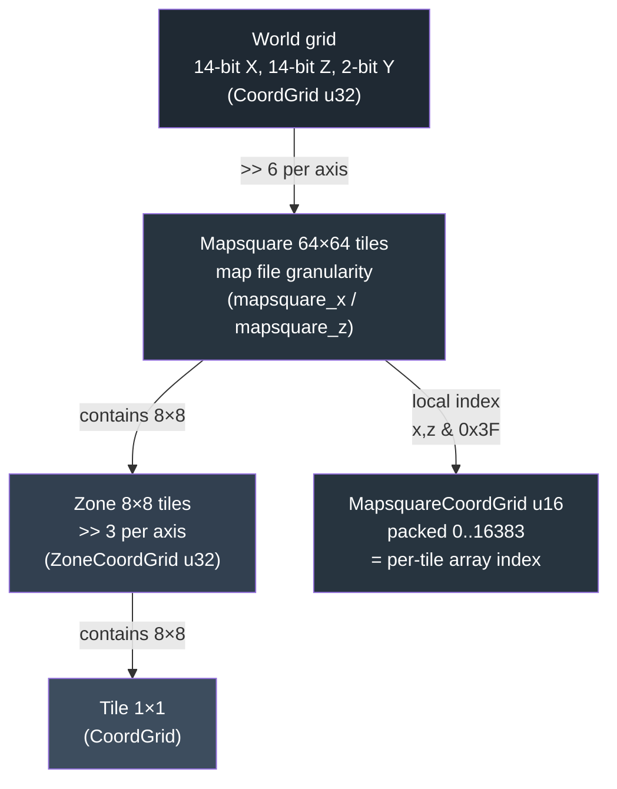
```mermaid
flowchart TD
    W["World grid<br/>14-bit X, 14-bit Z, 2-bit Y<br/>(CoordGrid u32)"]
    W -->|">> 6 per axis"| M["Mapsquare 64×64 tiles<br/>map file granularity<br/>(mapsquare_x / mapsquare_z)"]
    M -->|"contains 8×8"| Z["Zone 8×8 tiles<br/>>> 3 per axis<br/>(ZoneCoordGrid u32)"]
    Z -->|"contains 8×8"| T["Tile 1×1<br/>(CoordGrid)"]
    M -->|"local index<br/>x,z & 0x3F"| ML["MapsquareCoordGrid u16<br/>packed 0..16383<br/>= per-tile array index"]
    style W fill:#1f2933,color:#fff
    style M fill:#27343f,color:#fff
    style Z fill:#324050,color:#fff
    style T fill:#3d4d5e,color:#fff
    style ML fill:#27343f,color:#fff
```

### `CoordGrid`: the 30-bit packed tile coordinate

`CoordGrid` (`rs-grid/src/coord.rs:22`) is a tuple struct wrapping a single `u32` and deriving
`Debug, Clone, Copy, PartialEq, Eq, Hash, Default`. Those derives are the entire point of the design — more on that
below. It packs three axes into 30 of the 32 bits; the top 2 bits are always zero.

#### Bit layout

```text
 bit  31 30 | 29 28 | 27 26 25 ............... 15 14 | 13 12 11 ............... 1  0
      ─────── ─────── ────────────────────────────── ──────────────────────────────
       0  0  |  y  y |  x  x  x  ...............  x  x |  z  z  z  ...............  z  z
      unused | level |        X  (north-south)        |        Z  (east-west)
      (zero) | 2 bit |            14 bit              |            14 bit

 packed = (z & 0x3FFF) | ((x & 0x3FFF) << 14) | ((y & 0x3) << 28)
```

| Field | Bits  | Mask     | Width | Range    | Axis meaning           |
|-------|-------|----------|-------|----------|------------------------|
| Z     | 0–13  | `0x3FFF` | 14    | 0–16383  | east–west tile column  |
| X     | 14–27 | `0x3FFF` | 14    | 0–16383  | north–south tile row   |
| Y     | 28–29 | `0x3`    | 2     | 0–3      | vertical plane / floor |
| —     | 30–31 | —        | 2     | always 0 | unused headroom        |

The constructor masks each component to its field width, so out-of-range inputs wrap silently rather than corrupting
neighbouring fields (`coord.rs:48-53`):

```rust
pub const fn new(x: u16, y: u8, z: u16) -> Self {
    CoordGrid(((z & 0x3FFF) as u32) | (((x & 0x3FFF) as u32) << 14) | (((y & 0x3) as u32) << 28))
}
```

The test suite pins this wrapping behavior: `x_z_overflow_masked` (`coord.rs:751`) asserts `new(0x4000, 0, 0x4000)`
yields `x() == 0`, and `y_wraps_at_4` (`coord.rs:734`) asserts `y == 4` reads back as `0`. Masking-on-construct is a
defensive choice — the engine never has to validate a coordinate it constructed, and a malformed script offset degrades
to a wrapped (still in-bounds) tile instead of bleeding into the level field.

`from(packed: u32)` (`coord.rs:77`) is the unchecked counterpart: it wraps a pre-packed `u32` with no masking, for the
hot path of deserializing coordinates that are already in layout (map data, packets, script variables). `packed()` (
`coord.rs:98`) returns the raw `u32`. The accessors are pure shift-and-mask:

| Accessor  | Expression                         | Returns |
|-----------|------------------------------------|---------|
| `x()`     | `((self.0 >> 14) & 0x3FFF) as u16` | `u16`   |
| `y()`     | `((self.0 >> 28) & 0x3) as u8`     | `u8`    |
| `z()`     | `(self.0 & 0x3FFF) as u16`         | `u16`   |
| `index()` | `(self.x(), self.y(), self.z())`   | tuple   |

Every accessor is `#[inline(always)]` and `const fn`, so they collapse to a couple of machine instructions at the call
site and can be evaluated at compile time (e.g. for `const` spawn points).

#### Why packed integers, not a struct

A naive `struct { x: u16, y: u8, z: u16 }` would occupy 6 bytes (8 padded) and would not be a viable hash-map key or a
cheap equality target. `CoordGrid`'s `u32` representation buys, concretely:

- **One-word copy.** `CoordGrid` is `Copy` and fits in a register. Passing it by value is free; it never touches the
  heap and never aliases.
- **Trivial, collision-free hashing.** Because the whole position is one `u32`, `Hash` hashes a single word. This is
  what makes `FxHashMap<ZoneCoordGrid, Box<Zone>>` (`rs-zone/src/zone_map.rs:17`) and `FxHashSet<ZoneCoordGrid>` (the
  engine's `zones_tracking`) fast — the key is a primitive, not a multi-field struct, and FxHash over a `u32` is a
  single multiply-xor.
- **Single-instruction equality and ordering.** `==` is a `u32` compare; the `inzone`/zone-change patterns in the test
  module reduce to integer comparisons.
- **Branch-free axis math.** Distance, zone, and mapsquare derivations are shifts and masks on one register with no
  field loads.
- **Round-trips through integer channels.** `packed()` lets a coordinate ride inside a script `int`, a network field, or
  a cache key with no serialization logic. The test `packed_to_i32_and_back` (`coord.rs:1114`) confirms the value
  survives a `u32 → i32 → u32` round-trip unchanged, which matters because the scripting VM stores coordinates as signed
  32-bit ints.

The 2 bits of headroom (30–31) are why a coordinate can be cast to `i32` and back without sign-bit contamination: a
valid `CoordGrid` never sets bit 31, so the `i32` reinterpretation is always non-negative. This mirrors the Java
reference, where coordinates are likewise a single packed `int`.

### Derived addressing: zones, mapsquares, build area

`CoordGrid` carries the conversion arithmetic for the coarser scales as `const fn` helpers, in both a static (
single-axis) and an instance form.

#### Zone derivation (`>> 3`)

| Method      | Definition      | Meaning                |
|-------------|-----------------|------------------------|
| `zone(pos)` | `pos >> 3`      | zone index of one axis |
| `zone_x()`  | `self.x() >> 3` | zone index along X     |
| `zone_z()`  | `self.z() >> 3` | zone index along Z     |

A zone is 8×8 tiles, so the zone index is the tile coordinate with its low 3 bits dropped. Zone-change detection
compares `zone_x`/`zone_z`/`y` between successive ticks: two tiles in the same 8×8 block produce identical zone indices
and so do not trigger a rebuild (test `zone_change_detection_same_zone`, `coord.rs:1039`), whereas crossing an 8-tile
boundary or changing level does (`coord.rs:1049`, `coord.rs:1059`).

#### Build-area / "center zone" arithmetic (`- 6`, `<< 3`)

The client renders a 13×13 zone build area around the player. The engine computes its origin from the player's zone with
a fixed `-6` offset (half of `13 - 1`), then converts back to tile space with `<< 3`:

| Method              | Definition               | Result                                          |
|---------------------|--------------------------|-------------------------------------------------|
| `zone_center(pos)`  | `zone(pos) - 6`          | origin zone index of the 13×13 build area       |
| `zone_center_x/z()` | `zone_x/z() - 6`         | per-axis origin zone index                      |
| `zone_origin(pos)`  | `zone_center(pos) << 3`  | south-west *tile* of the build-area origin zone |
| `zone_origin_x/z()` | `zone_center_x/z() << 3` | per-axis origin tile                            |

The composition `(>> 3) - 6) << 3` re-quantizes a tile to the south-west corner of the build-area origin zone, exactly
the value the client expects in a map-rebuild packet. Test `zone_origin_calculations` (`coord.rs:783`) pins
`zone_origin(3200) == ((3200 >> 3) - 6) << 3`. The build-area code in `rs-entity` consumes these:
`BuildArea::rebuild_zones` (`rs-entity/src/build.rs:209-232`) walks a 7×7 window centered on `coord.zone_x()/zone_z()`,
clips it to the `±6` build-area extent, and pushes `ZoneCoordGrid::new(x << 3, coord.y(), z << 3)` for each surviving
cell — converting back from zone index to a zone-aligned tile coordinate via `<< 3`.

These helpers do **not** guard against underflow: `zone_center` subtracts 6 from an unsigned zone index, so a coordinate
within 6 zones of the world origin would underflow. In practice no live content sits near tile (0,0); callers in the
build path use `saturating_sub(6)` explicitly (`build.rs:218-221`) where clipping is required, leaving the raw helper as
the fast unchecked form.

#### Mapsquare derivation (`>> 6`)

| Method           | Definition      | Meaning                     |
|------------------|-----------------|-----------------------------|
| `mapsquare(pos)` | `pos >> 6`      | mapsquare index of one axis |
| `mapsquare_x()`  | `self.x() >> 6` | mapsquare index along X     |
| `mapsquare_z()`  | `self.z() >> 6` | mapsquare index along Z     |

`>> 6` drops the low 6 bits (the 64-tile intra-mapsquare offset). For tile 3200, `mapsquare(3200) == 50` and the local
offset is `3200 & 0x3F == 0` (test `mapsquare_calculations`, `coord.rs:793`; `mapsquare_boundary`, `coord.rs:1104`). The
map loader keys cache map files by `(mapsquare_x, mapsquare_z)` and, having located the file, addresses individual tiles
inside it with `MapsquareCoordGrid` (below).

#### "Fine" coordinates for info packets

`fine(pos, size)` (`coord.rs:442`) computes `pos * 2 + size`, producing a half-tile-resolution position whose anchor
sits at the *center* of a `size`-wide entity rather than its south-west corner. This is the sub-tile granularity the
client expects in player/NPC info updates. It is called from the info encoders — `phases/info.rs:178-186` passes
`CoordGrid::fine(coord.x(), size)` / `fine(coord.z(), size)` for both players and NPCs, and `info.rs:830-831`/
`info.rs:1280-1281` use the size-1 form for relative position deltas. This is a direct port of the reference server's
`CoordGrid.fine`, preserving wire fidelity for the build-area-relative coordinate system the client decodes.

### Distance, area, and region predicates

`CoordGrid` carries the engine's spatial geometry. All of it operates on the X–Z plane and **ignores Y** — combat range,
visibility, and search never cross floors implicitly.

- **`in_distance(other, distance)`** (`coord.rs:471`) — Chebyshev (L-∞, "king-move") box test: true iff
  `|Δx| ≤ distance` and `|Δz| ≤ distance`. Branch-free, returns `bool`. Used for visibility and interaction-range
  gating. Test `in_distance_ignores_y` (`coord.rs:850`) confirms Y is disregarded.
- **`distance(other)`** (`coord.rs:498`) — Chebyshev distance `max(|Δx|, |Δz|)` as `i32`. The pathfinding/interaction
  range metric.
- **`euclidean_squared_distance(other)`** (`coord.rs:627`) — `Δx² + Δz²`, no `sqrt`. Used where only relative ordering
  matters (nearest-entity sorting), avoiding a floating-point root.
- **`distance_to(...)`** (`coord.rs:535`) — Chebyshev distance between two axis-aligned bounding boxes, each given as
  origin + `(w, l)`. It calls the private `closest(...)` (`coord.rs:577`) twice to find the nearest perimeter point on
  each rectangle (each axis independently clamped to `[src, src + size - 1]`), then takes the Chebyshev distance between
  them. Overlapping boxes yield 0. This is the metric for "can this player reach that large NPC/loc," where multi-tile
  footprints make point distance wrong.
- **`intersects(...)`** (`coord.rs:687`) — AABB overlap test using strict inequality, so edge-touching boxes do **not**
  intersect (test `intersects_touching_edge_no_overlap`, `coord.rs:867`). Note it takes `u16` args and computes
  `src_x + src_w` without widening, so callers must keep `origin + extent ≤ 65535`.
- **`is_in_wilderness()`** (`coord.rs:653`) — hard-coded membership in two rectangles: overworld
  `X∈[2944,3392), Z∈[3520,6400)` and the mirrored instance `X∈[2944,3392), Z∈[9920,12800)`. A `const fn` predicate
  gating PvP eligibility and multi-combat rules.

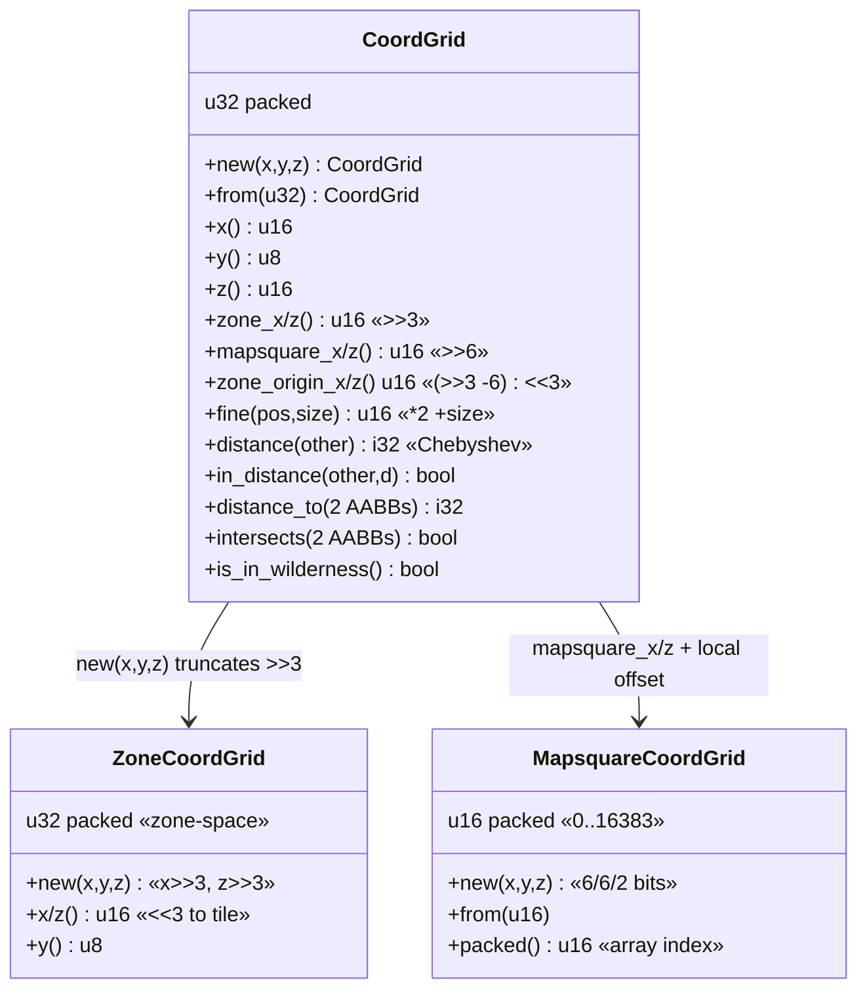
```mermaid
classDiagram
    class CoordGrid {
        u32 packed
        +new(x,y,z) CoordGrid
        +from(u32) CoordGrid
        +x() u16
        +y() u8
        +z() u16
        +zone_x/z() u16  «>>3»
        +mapsquare_x/z() u16  «>>6»
        +zone_origin_x/z() u16  «(>>3 -6) <<3»
        +fine(pos,size) u16  «*2 +size»
        +distance(other) i32  «Chebyshev»
        +in_distance(other,d) bool
        +distance_to(2 AABBs) i32
        +intersects(2 AABBs) bool
        +is_in_wilderness() bool
    }
    class ZoneCoordGrid {
        u32 packed «zone-space»
        +new(x,y,z) «x>>3, z>>3»
        +x/z() u16 «<<3 to tile»
        +y() u8
    }
    class MapsquareCoordGrid {
        u16 packed «0..16383»
        +new(x,y,z) «6/6/2 bits»
        +from(u16)
        +packed() u16 «array index»
    }
    CoordGrid --> ZoneCoordGrid : new(x,y,z) truncates >>3
    CoordGrid --> MapsquareCoordGrid : mapsquare_x/z + local offset
```

### `ZoneCoordGrid`: the 24-bit zone-space key

`ZoneCoordGrid` (`rs-grid/src/zone_coord.rs:23`) is the canonical key for everything zone-scoped. It packs zone
indices (not tile coordinates) into a `u32` and derives `Debug, Clone, Copy, PartialEq, Eq, Hash` — but notably **not**
`Default`, since a zero zone is a meaningful real location and the type is only ever constructed from an explicit
coordinate.

#### Bit layout

```text
 bit  31 ... 24 | 23 22 | 21 20 ............... 11 | 10 9 ................. 1  0
      ────────── ─────── ───────────────────────── ───────────────────────────────
       0  ...  0 |  y  y |  zZ  zZ  ...........  zZ |  zX  zX  ...........  zX  zX
       unused    | level |     zone Z (z >> 3)      |       zone X (x >> 3)
                 | 2 bit |        11 bit            |          11 bit

 packed = ((x>>3) & 0x7FF) | (((z>>3) & 0x7FF) << 11) | ((y & 0x3) << 22)
```

| Field   | Bits  | Mask    | Width | Range  | Meaning                      |
|---------|-------|---------|-------|--------|------------------------------|
| zone X  | 0–10  | `0x7FF` | 11    | 0–2047 | `x >> 3`, zone index along X |
| zone Z  | 11–21 | `0x7FF` | 11    | 0–2047 | `z >> 3`, zone index along Z |
| level Y | 22–23 | `0x3`   | 2     | 0–3    | vertical plane               |

`new(x, y, z)` takes **tile** coordinates and shifts them into zone space inside the constructor (
`zone_coord.rs:49-55`):

```rust
pub const fn new(x: u16, y: u8, z: u16) -> Self {
    ZoneCoordGrid(
        (((x >> 3) & 0x7FF) as u32)
            | ((((z >> 3) & 0x7FF) as u32) << 11)
            | (((y & 0x3) as u32) << 22),
    )
}
```

This `>> 3`-on-construct is the type's defining behavior: **every tile inside the same 8×8 zone produces the
same `ZoneCoordGrid`**. Tests `zone_coord_truncates_to_zone_boundary` (`zone_coord.rs:180`) and `zone_coord_alignment` (
`zone_coord.rs:258`) confirm `new(3200,…)` and `new(3207,…)` are equal, while `new(3208,…)` differs. The 11-bit zone
fields cover 0–2047 zones per axis = 0–16376 tiles in steps of 8, matching `CoordGrid`'s 14-bit tile range (
`2047 << 3 == 16376`).

The accessors invert the packing back to **zone-aligned tile** coordinates: `x()` is `(self.0 & 0x7FF) << 3` and `z()`
is `((self.0 >> 11) & 0x7FF) << 3` (`zone_coord.rs:114-155`), so they always return a multiple of 8 — the south-west
tile of the zone. `y()` is `(self.0 >> 22) as u8`; because the 2-bit field is the top occupied region with nothing above
it, no mask is needed.

#### Role in the engine

`ZoneCoordGrid` is the hash key that ties the spatial world together:

- **Zone storage.** `ZoneMap` holds `FxHashMap<ZoneCoordGrid, Box<Zone>>` (`rs-zone/src/zone_map.rs:17`).
  `ZoneMap::zone` / `zone_mut` (`zone_map.rs:52,75`) accept raw tile `(x, y, z)`, build a `ZoneCoordGrid::new(...)` (
  which auto-truncates to the zone), and look up the `Box<Zone>`. Each `Zone` also stores its own
  `coord: ZoneCoordGrid` (`rs-zone/src/zone.rs:42`).
- **Dirty tracking.** `Engine::track_zone(x, y, z)` (`rs-engine/src/engine.rs:1267`) inserts
  `ZoneCoordGrid::new(x, y, z)` into a `FxHashSet<ZoneCoordGrid>` of zones that changed this tick. Because the key
  truncates to the zone, multiple obj/loc mutations within the same 8×8 block coalesce into one set entry — the
  deduplication is free, a direct consequence of the packing. The zone phase (`rs-engine/src/phases/zone.rs:74-110`)
  calls `track_zone` whenever map state mutates.
- **Build-area streaming.** `BuildArea::rebuild_zones` pushes `ZoneCoordGrid::new(x << 3, …)` into `active_zones` (
  `rs-entity/src/build.rs:229`), the list of zones streamed to a player's client.

Using a packed `u32` here is what makes the per-tick zone set and the zone map cheap: insertion, lookup, and dedup all
hinge on hashing and comparing a single word.

### `MapsquareCoordGrid`: the 14-bit per-mapsquare array index

`MapsquareCoordGrid` (`rs-grid/src/mapsquare_coord.rs:22`) addresses one tile *within* a single 64×64 mapsquare, packed
into a `u16`. It derives the full set including `Default` (a zero offset is a valid corner tile). Its decisive property:
the packed value is a dense index `0–16383` usable directly as an array subscript.

#### Bit layout

```text
 bit  15 14 | 13 12 | 11 10 9 8 7 6 | 5 4 3 2 1 0
      ─────── ─────── ─────────────── ─────────────
       0  0  |  y  y |  x x x x x x  |  z z z z z z
      unused | level |   X (0..63)   |   Z (0..63)
             | 2 bit |    6 bit      |    6 bit

 packed = (z & 0x3F) | ((x & 0x3F) << 6) | ((y & 0x3) << 12)
```

| Field   | Bits  | Mask   | Width | Range | Meaning               |
|---------|-------|--------|-------|-------|-----------------------|
| Z       | 0–5   | `0x3F` | 6     | 0–63  | local Z within square |
| X       | 6–11  | `0x3F` | 6     | 0–63  | local X within square |
| level Y | 12–13 | `0x3`  | 2     | 0–3   | vertical plane        |
| —       | 14–15 | —      | 2     | zero  | unused                |

The 14 occupied bits give the full index range `0..=16383 == 64 × 64 × 4` — every tile across all four levels of one
mapsquare. The constructor `new(x, y, z)` masks each field (`mapsquare_coord.rs:48-52`), so `x = 64` wraps to `0` (test
`overflow_masked`, `mapsquare_coord.rs:189`). `from(packed)` (`mapsquare_coord.rs:76`) wraps an already-accumulated
`u16` with no masking — used by the sequential map decoder, which builds coordinate offsets arithmetically rather than
from discrete axes. Accessors `x()`, `y()`, `z()` (`mapsquare_coord.rs:116-156`) take `self` by value (the type is 2
bytes, so by-value is optimal) and shift-and-mask out each field.

#### Role in map decoding

The whole purpose of this type is to be a `usize` array index. In `GameMap` (`rs-engine/src/game_map.rs`), the
per-mapsquare collision/terrain flag array `lands` is indexed by `coord.packed() as usize`:

- `load_lands` decodes terrain opcodes and writes `lands[coord.packed() as usize] = opcode - 49` (
  `game_map.rs:160-172`).
- `load_locs` reads the bridge flag with `(lands[coord.packed() as usize] & LINK_BELOW) == LINK_BELOW` (
  `game_map.rs:183-204`, `255-266`). When a tile is bridged, it reconstructs the level-1 lookup coordinate via
  `MapsquareCoordGrid::new(coord.x(), 1, coord.z())` — re-using the decoded X/Z but forcing the level to 1 to read the
  flag below the bridge.
- `load_locs` / `load_objs` rebuild a typed coordinate from an accumulated offset with
  `MapsquareCoordGrid::from(coord as u16)` (`game_map.rs:257,365,426`).

Because the packed layout is contiguous and dense, the `lands` table is a flat `[_; 16384]`-style array rather than a
hash map: indexing is a bounds-checked array read with no hashing, which is exactly what a per-tile flag lookup hammered
during map load and collision queries needs. The 6/6/2 bit split mirrors the cache's own map-file coordinate encoding,
so the decoder reads cache bytes straight into this layout without remapping — preserving byte-fidelity with the
reference content pipeline.

### Conversions and the round-trip invariant

The three types form a one-way refinement chain from fine to coarse, with `CoordGrid` as the hub:

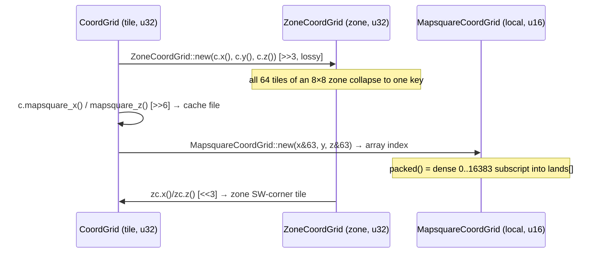
```mermaid
sequenceDiagram
    participant Tile as CoordGrid (tile, u32)
    participant Zone as ZoneCoordGrid (zone, u32)
    participant MS as MapsquareCoordGrid (local, u16)
    Tile->>Zone: ZoneCoordGrid::new(c.x(), c.y(), c.z())  [>>3, lossy]
    Note over Zone: all 64 tiles of an 8×8 zone collapse to one key
    Tile->>Tile: c.mapsquare_x() / mapsquare_z()  [>>6] → cache file
    Tile->>MS: MapsquareCoordGrid::new(x&63, y, z&63)  → array index
    Note over MS: packed() = dense 0..16383 subscript into lands[]
    Zone->>Tile: zc.x()/zc.z()  [<<3] → zone SW-corner tile
```

The conversions are deliberately **lossy in one direction**: tile → zone discards the intra-zone offset, tile →
mapsquare-local discards the mapsquare identity. They are reconstructible only with external context (the zone-aligned
`<<3` returns the SW corner; the mapsquare-local index is meaningful only paired with its `(mapsquare_x, mapsquare_z)`
file). The one *lossless* round-trip is `CoordGrid` ↔ `u32` via `packed()`/`from()`, the invariant the entire
serialization story rests on. The cross-type construction is exercised end-to-end by tests
`zone_coord_from_coord_grid` (`zone_coord.rs:249`) and `mapsquare_from_coord_grid` (`mapsquare_coord.rs:253`), the
latter confirming `CoordGrid::new(3200,1,3200)` → `mapsquare_x/z() == 50` → `MapsquareCoordGrid` local `(50, 1, 50)`.

### Design summary and trade-offs

The grid crate makes a single, consistent bet: **positions are integers, and spatial scale is a shift.** The pay-offs
are pervasive — `Copy` register-width values, primitive-key hash maps, branch-free axis math, lossless integer
serialization, and free deduplication of zone mutations. The costs are accepted deliberately: silent wrap-on-overflow
instead of validation (mitigated by masking-on-construct and the absence of live content near the world origin),
unchecked underflow in the raw `zone_center` helpers (mitigated by callers using `saturating_sub`), and `u16` arithmetic
in `intersects` that assumes bounded inputs. None of these can corrupt a *valid* coordinate, and every one trades a
runtime check for a cycle saved in code that runs for every entity, every tile, every tick. The layout choices — 14/14/2
for tiles, 11/11/2 for zones, 6/6/2 for mapsquare-local — are not arbitrary: they are the minimal bit widths that cover
the world's `16384`-tile span, `2048`-zone span, and `64`-tile mapsquare span respectively, and they reproduce the
reference server's encodings exactly so that map files, collision flags, and client build-area packets remain
byte-identical.

<sub>[↑ Back to top](#top)</sub>


---

<a id="sec-10"></a>

## 10. Zones — Spatial Partitioning & Event Broadcasting

The zone subsystem (`rs-zone`) is rs-engine's **area-of-interest (AOI) layer**. It answers one question very
efficiently, every tick, for every player: *"what changed in the patch of the world I can currently see, and who needs
to hear about it?"* The world is statically partitioned into a grid of **8×8-tile zones**; every dynamic world
mutation — a dropped item, a felled tree, an opened door, a fired projectile — is routed to exactly one zone,
accumulated there as a `ZoneEvent`, and flushed once per tick into the output buffers of only those players whose render
window overlaps the zone. This is the same locality-of-interest discipline used by the TS reference server (
LostCity/2004scape), where the unit is also an 8×8 `Zone`, but here it is rebuilt around bit-packed coordinates, boxed
hash-map storage, and a per-zone *pre-serialized shared buffer* so that a broadcast event is encoded **once** and
memcpy'd into N players rather than re-encoded per player.

This section covers the `ZoneMap` container and its `pack_zone_coord` keying, the `Zone` struct and its entity lists,
the `ZoneEvent` / `ZoneEventType` / `ZoneMessage` event model, the enclosed-vs-follows delivery split, the
buffer-then-flush tick discipline, and the full obj/loc lifecycle within a zone.

---

### Why 8×8? Locality of interest and bandwidth

A RS2 client at revision ~225 renders a window of roughly 104×104 tiles (13×13 zones), but the *build area* it is told
about is a 13×13 zone grid centred on the player, and the actively-streamed inner window is a **7×7 zone** ring (
`BuildArea::rebuild_zones`, `rs-entity/src/build.rs:209`, iterating `center ± 3` zones, i.e. 7 across). The 8×8 zone is
the quantum that makes this tractable:

- **Coarse enough** that the per-zone bookkeeping (entity `Vec`s, an event `Vec`) is tiny and the number of zones a
  player observes is a fixed ~49, not thousands of tiles.
- **Fine enough** that an event in one corner of the world is never serialized to, or even considered by, a player on
  the other side. A mutation touches exactly one zone; broadcasting it costs work proportional to *observers of that
  zone*, not *players online*.
- **Cheap to address**: an 8×8 partition means tile→zone is a 3-bit right shift (`>> 3`), and tile-within-zone is a
  3-bit mask (`& 7`). Both the zone key and the intra-zone packet coordinate fall out of pure bit ops with no division.
  The 8-tile size is also baked into the wire protocol — `pack_zone_coord` packs `x&7` and `z&7` into a single byte (
  `zone_message.rs:122`), so the geometry choice *is* a protocol constant, not a tunable.

The trade-off is the classic AOI one: a player standing on a zone boundary must observe up to 4 zones to see entities a
few tiles away, and the 7×7 active window deliberately over-covers the 13×13 build area so border movement does not pop
entities in and out. The engine accepts a slightly larger observed-zone set in exchange for never having to do per-tile
visibility math.

---

### ZoneCoordGrid — the 24-bit packed zone key

Zones are keyed by `ZoneCoordGrid` (`rs-grid/src/zone_coord.rs:23`), a newtype over a single `u32`. Tile coordinates are
shifted into zone space (`>> 3`) and packed:

```
bit:  23 22 | 21 ............ 11 | 10 ............. 0
      [ Y  ] [   zone Z (z>>3)   ] [  zone X (x>>3)  ]
       2 bit        11 bit               11 bit
```

Construction is a single `const fn` of shifts and masks (`zone_coord.rs:49`):

```rust
ZoneCoordGrid(
(((x > > 3) & 0x7FF) as u32)
| ((((z > > 3) & 0x7FF) as u32) < < 11)
| (((y & 0x3) as u32) < < 22),
)
```

| Field   | Bits  | Width  | Range  | Encodes                 |
|---------|-------|--------|--------|-------------------------|
| zone X  | 0–10  | 11 bit | 0–2047 | `x >> 3` (tile X / 8)   |
| zone Z  | 11–21 | 11 bit | 0–2047 | `z >> 3` (tile Z / 8)   |
| level Y | 22–23 | 2 bit  | 0–3    | height plane (no shift) |

Because the low 3 bits of X and Z are discarded, **every tile inside the same 8×8×1 cell maps to the
identical `ZoneCoordGrid`** — this is the property that makes the type usable directly as a hash key (it derives `Hash`,
`Eq`, `Copy`). The accessors `x()` / `z()` re-shift left by 3, so they always return *zone-origin tile coordinates* (
multiples of 8), which is exactly what the build-area offset math in `update_zones` expects. Note the level is masked to
2 bits and **wraps** at 4 (`y_wraps_at_4` test, `zone_coord.rs:187`) — there are only 4 height planes.

---

### ZoneMap — lazy, boxed, FxHashMap-backed storage

The global zone table is `ZoneMap` (`zone_map.rs:16`):

```rust
pub struct ZoneMap {
    pub zones: FxHashMap<ZoneCoordGrid, Box<Zone>>,
}
```

Three deliberate choices:

1. **`FxHashMap`, not a flat array.** A fully-dense world is 2048×2048×4 ≈ 16.7M zones; the overwhelming majority are
   empty water/void. A sparse hash map allocates storage only for zones that actually hold entities or fire events. The
   key is already a packed `u32`, and `FxHashMap` (rustc's `fxhash`) is the fast non-cryptographic hasher — ideal for an
   integer key on the hot lookup path.

2. **`Box<Zone>` values.** A `Zone` inlines five `Vec`s plus an `Option<Vec<u8>>` (~170 B). Boxing means each hash-map
   slot stores only a pointer (~8–12 B), so the open-addressing probe array stays compact and cache-resident. The
   lookup-heavy info phase (`get_nearby_*`, `update_zones`) walks many zones per tick; keeping the probe sequence in
   cache matters more than the one pointer indirection per *hit* (documented rationale at `zone_map.rs:11`).

3. **Lazy creation via `or_insert_with`.** `zone_mut` (`zone_map.rs:75`) only constructs a `Zone` on an actual insert:
   ```rust
   self.zones.entry(coord).or_insert_with(|| Box::new(Zone::new(coord)))
   ```
   The comment notes the prior eager `or_insert` built a throwaway `Zone` on *every* call even on a hit; the closure
   form avoids that allocation. The read path `zone()` (`zone_map.rs:52`) returns `Option<&Zone>` and **never**
   instantiates — critical because `update_zones` (below) deliberately uses the read path so that merely *observing* an
   empty zone does not litter the map with empty entries.

---

### The Zone struct

```rust
pub struct Zone {
    pub coord: ZoneCoordGrid,
    pub players: Vec<u16>,   // PIDs present
    pub npcs: Vec<u16>,      // NPC indices present
    pub locs: Vec<Loc>,      // map objects / scenery
    pub objs: Vec<Obj>,      // ground items
    events: Vec<ZoneEvent>,  // pending, this-tick only
    shared: Option<Vec<u8>>, // pre-encoded enclosed bytes
}
```

(`zone.rs:41`)

`players` and `npcs` are occupancy registries. They use **linear `contains` on add and `swap_remove` on delete** (
`add_player` `zone.rs:92`; `remove_player` `zone.rs:112`) — O(n) but n is tiny (a handful of entities per 8×8 cell), and
`swap_remove` is O(1) with order irrelevant. `locs` and `objs` are the authoritative storage for *dynamic* world
geometry and ground items in this cell. `events` is the per-tick mutation log; `shared` is its pre-serialized broadcast
form. Both `events` and `shared` are transient — wiped every tick by `reset()`.

#### Loc and Obj entity identity

Each entity carries a **zone-local identity** used to cancel superseded events:

- `Loc::lid()` (`rs-entity/src/loc.rs:204`) packs local `x&7` (3 bits), `z&7` (3 bits) and the 2-bit collision `layer` →
  a `u64`. Two locs at the same tile on different layers have distinct lids (`loc_entity_key_differs_by_layer` test).
- `Obj::oid()` (`rs-entity/src/obj.rs:108`) packs local `x&7`, `z&7`, the 16-bit type `id`, **and** the receiver's lower
  32 bits. So the same item type at the same tile owned by two different players is two distinct oids (
  `obj_entity_key_differs_by_receiver`). Public objs use receiver `0` in the key.

These ids are the join key for `clear_queued_events` (below). They intentionally collapse to the *tile*, not an instance
handle, because the protocol addresses zone updates by tile-within-zone — a second `LocAddChange` at a tile *replaces*
the first on the client, so the server must cancel the stale queued event rather than send both.

#### Lifetime semantics: Respawn vs Despawn

`EntityLifeTime` (`rs-entity/src/lifetime.rs:8`, `#[repr(u8)]`, `Respawn = 0`, `Despawn = 1`) governs storage and
visibility:

| Lifetime  | Origin             | On add to zone                               | On remove                                    | Visibility rule                                                                    |
|-----------|--------------------|----------------------------------------------|----------------------------------------------|------------------------------------------------------------------------------------|
| `Respawn` | map cache (static) | **not** re-pushed (already in `locs`/`objs`) | stays in storage, hidden until respawn clock | locs: visible iff changed or never-clocked; objs: visible iff `clock ≥ last_clock` |
| `Despawn` | runtime (scripts)  | pushed into `locs`/`objs`                    | `swap_remove`d from storage                  | locs: always visible while present; objs: visible iff `clock < last_clock`         |

The asymmetry is the heart of the design: **static map entities never leave their `Vec`** — removing a respawnable tree
just reverts/hides it and arms a respawn timer, so the slot is reused — whereas **runtime entities are physically
inserted and swap-removed**. `Obj::visible(clock)` (`obj.rs:91`) encodes this: `last_clock == u64::MAX` ⇒ always
visible; otherwise despawn objs are visible *before* their clock, respawn objs *at/after* it. `Loc::visible()` (
`loc.rs:82`) is clockless: despawn locs are always visible, respawn locs are visible only when `is_changed()` or
`last_clock.is_none()`.

---

### The event model: ZoneEvent, ZoneEventType, ZoneMessage

A queued mutation is a `ZoneEvent` (`zone_event.rs:21`):

```rust
pub struct ZoneEvent {
    pub event_type: ZoneEventType,   // Enclosed | Follows
    pub receiver37: Option<u64>,     // target player UID (lower 37 bits) for Follows
    pub message: ZoneMessage,        // the wire payload
    pub id: Option<u64>,             // oid/lid for cancellation, None for map anims
}
```

`ZoneEventType` (`zone_event_type.rs:7`) is a two-variant enum that is the **delivery-scope discriminator**:

- **`Enclosed`** — broadcast to *every* player observing the zone. Batched into the shared buffer and written once.
- **`Follows`** — delivered to a *single* receiver identified by `receiver37`. Filtered per-player at flush time.

`ZoneMessage` (`zone_message.rs:21`) is a closed enum wrapping the ten server-protocol payload structs that a zone can
emit:

| Variant        | Meaning                                       | Queued by                              |
|----------------|-----------------------------------------------|----------------------------------------|
| `ObjAdd`       | ground item appears                           | `add_obj`, `respawn_obj`               |
| `ObjDel`       | ground item removed                           | `remove_obj_at`                        |
| `ObjCount`     | stack count changed (merge/stack)             | engine merge paths                     |
| `ObjReveal`    | private item becomes public                   | `reveal_obj`                           |
| `LocAddChange` | loc placed or its type/shape/angle changed    | `add_loc`, `change_loc`, `respawn_loc` |
| `LocDel`       | loc removed/hidden                            | `remove_loc`                           |
| `LocAnim`      | loc plays an animation sequence               | `anim_loc`                             |
| `LocMerge`     | multi-tile loc render merge across boundary   | `merge_loc`                            |
| `MapAnim`      | tile spot animation (entity-less)             | `anim_map`                             |
| `MapProjAnim`  | projectile flight between tiles (entity-less) | `map_proj_anim`                        |

`ZoneMessage` carries the **self-serialization contract** for zone updates. `sizeof_zone()` returns
`1 + message.sizeof()` (the `+1` is the protocol opcode byte) and `encode_zone()` writes `p1(PROT)` then the payload (
`zone_message.rs:73`, `:49`, free fn `encode` at `:99`). This pairing is what lets `compute_shared` size the buffer
exactly before encoding — no reallocation, no over-allocation.

Two free packers complete the wire contract:

- `pack_zone_coord(x, z) = (x&7)<<4 | (z&7)` (`zone_message.rs:122`) — intra-zone tile into one byte (high nibble X, low
  nibble Z).
- `pack_shape_angle(shape, angle) = (shape<<2) | (angle&3)` (`zone_message.rs:141`) — loc shape (6 bits) + angle (2
  bits).

---

### Enclosed vs Follows — receiver-scoped privacy

The enclosed/follows split exists because RS2 ground items are **per-player private on drop**. When a player drops loot,
only they (the `receiver37`) see it for `REVEAL_TICKS = 100` ticks (`rs-entity/src/obj.rs:5`); after that it "reveals"
to everyone. The zone models this directly:

- `add_obj(obj, receiver37)` (`zone.rs:714`): if `receiver37.is_none()` ⇒ `Enclosed` event (public); else ⇒ `Follows`
  event targeted at that UID. The obj's `oid()` (which folds in the receiver) is the cancellation key.
- `reveal_obj(...)` (`zone.rs:820`): clears `receiver37` to `NO_RECEIVER`, sets `reveal = u64::MAX`, and queues an *
  *`Enclosed`** `ObjReveal` — the item flips from private to public, so its update must now reach all observers.
- `remove_obj_at(...)` (`zone.rs:955`): mirrors current visibility — a still-private obj emits a `Follows` `ObjDel` (
  only the owner sees the removal), a public obj emits `Enclosed`. The test pair
  `remove_obj_revealed_then_delete_uses_enclosed` / `remove_obj_unrevealed_delete_uses_follows` pins this exactly.

Visibility is enforced again at read time. `visible_objs(user37, clock)` (`zone.rs:378`) yields an obj only if
`obj.visible(clock) && (receiver37 == NO_RECEIVER || receiver37 == user37)`. `visible_follows_events(user37)` (
`zone.rs:401`) filters queued follows events by `receiver37.is_none_or(|r| r == user37)`. So privacy is
belt-and-suspenders: at queue time (event type), at flush time (per-player follows filter), and at zone-entry snapshot
time (`visible_objs`).

---

### Per-tick discipline: buffer → compute shared → flush → reset

Zone events are **double-buffered against the tick**: mutations accumulate during the world/script phases, are
pre-serialized in the zones phase, flushed during output, then cleared in cleanup. This maps onto four distinct points
in `Engine::cycle()`'s 13-phase loop.

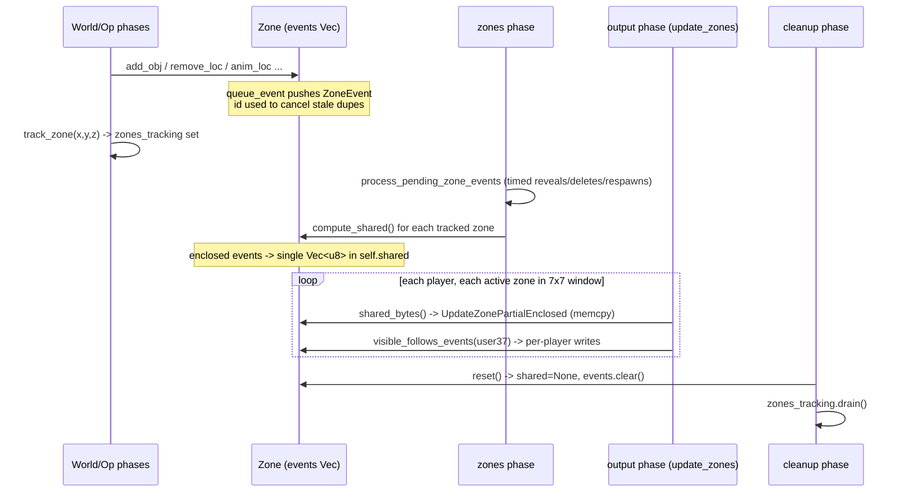
```mermaid
sequenceDiagram
    participant Script as World/Op phases
    participant Zone as Zone (events Vec)
    participant ZPhase as zones phase
    participant Out as output phase (update_zones)
    participant Clean as cleanup phase

    Script->>Zone: add_obj / remove_loc / anim_loc ...
    Note over Zone: queue_event pushes ZoneEvent<br/>id used to cancel stale dupes
    Script->>Script: track_zone(x,y,z) -> zones_tracking set

    ZPhase->>ZPhase: process_pending_zone_events (timed reveals/deletes/respawns)
    ZPhase->>Zone: compute_shared() for each tracked zone
    Note over Zone: enclosed events -> single Vec<u8> in self.shared

    loop each player, each active zone in 7x7 window
        Out->>Zone: shared_bytes() -> UpdateZonePartialEnclosed (memcpy)
        Out->>Zone: visible_follows_events(user37) -> per-player writes
    end

    Clean->>Zone: reset() -> shared=None, events.clear()
    Clean->>Clean: zones_tracking.drain()
```

#### 1. Queue (world / op / script phases)

Every mutating `Zone` method funnels through `queue_event` (`zone.rs:223`), which simply pushes a `ZoneEvent`.
Crucially, the engine also calls `track_zone(x, y, z)` (`engine.rs:1267`) to insert the `ZoneCoordGrid` into
`self.zones_tracking: FxHashSet<ZoneCoordGrid>` (`engine.rs:394`). **Only tracked zones are ever serialized or reset** —
a zone that fired no events this tick is skipped entirely, so the per-tick work is proportional to *dirty* zones, not
loaded zones.

**Event cancellation** is the subtle correctness mechanism. `clear_queued_events(id)` (`zone.rs:253`) does
`self.events.retain(|e| e.id != Some(id))`. Before queuing a `LocDel`, `remove_loc` first cancels any pending
`LocAddChange` for the same `lid` (`zone.rs:533`); `reveal_obj` and `remove_obj_at` do the same on `oid`. Without this,
a loc added and removed in the *same tick* would send the client a phantom add followed by a delete (the test
`remove_loc_cancels_previous_events` asserts only the `LocDel` survives). Because the protocol is tile-addressed and
idempotent-by-replacement, the server must coalesce to the *final* state per entity per tick.

#### 2. Timed events + compute_shared (zones phase)

`Engine::zones()` (`phases/zone.rs:27`) runs two steps. First, `process_pending_zone_events` (`:54`) drains the
`BTreeMap<u64, Vec<PendingZoneEvent>>` (`engine.rs:395`) of events whose tick has arrived — using
`split_off(&(clock+1))` to cleanly partition due-vs-future in log time. These deferred events (
`PendingZoneEvent::{ObjReveal, ObjDelete, ObjAdd, LocDelete}`, `engine.rs:147`) call back into the zone (`reveal_obj`,
`remove_obj_by_clock`, `respawn_obj`, and the loc despawn/respawn/revert logic) and **re-`track_zone`** the affected
cells, so their freshly-queued `ZoneEvent`s get serialized this same tick. This is how a 100-tick reveal timer or a
respawn delay surfaces as a wire update.

Then `compute_zone_shared` (`phases/zone.rs:131`) iterates `zones_tracking` and calls `Zone::compute_shared()` on each.
`compute_shared` (`zone.rs:273`):

1. Sums `sizeof_zone()` over **enclosed-only** events.
2. If 0, leaves `shared = None` and returns (no allocation for follows-only zones — see
   `compute_shared_empty_when_no_enclosed`).
3. Allocates one `Packet` of exact length and `encode_zone`s every enclosed event into it.
4. Stores `Some(buf.data[..buf.pos].to_vec())`.

This is the **single most important performance lever in the subsystem**: a zone observed by 30 players encodes its
broadcast payload **once**, not 30 times. The Java reference re-walks the event list per player; here the byte buffer is
computed in the zones phase and every observer just memcpy's it. Follows events are intentionally *excluded* from the
shared buffer because they are receiver-specific.

#### 3. Flush (output phase → `update_zones`)

`Engine::outputs()` calls `ActivePlayer::update_zones(&self.zones, self.clock)` per player (`phases/output.rs:100`; impl
at `active_player.rs:1944`). For each of the player's `active_zones` (the 7×7 window, `rs-entity/src/build.rs:228`):

- It prunes `loaded_zones` to those still active, then for each active zone computes the build-area-relative `(x, z)`
  offset from the zone-origin coordinate (`active_player.rs:1965`).
- Zones not allocated in `rsmod` are skipped (`is_zone_allocated`, `:1959`).
- It uses the **read-only** `zones.zone(...)` (`:1974`). A `None` (never-instantiated) zone newly entering the window
  emits only `UpdateZoneFullFollows` (a clear) — it has no entities or events, so nothing else is needed, and no empty
  `Zone` is created.
- **Newly loaded** zones get a full snapshot: `UpdateZoneFullFollows`, then a `visible_objs` walk emitting `ObjAdd`s,
  then a `locs` walk emitting `LocDel` for hidden respawn locs or `LocAddChange` for despawn/changed locs (`:1976`–
  `:2014`). This is the "you just walked into view, here is everything" path.
- **Every** in-window zone then appends incremental updates: if `shared_bytes()` is `Some`, one
  `UpdateZonePartialEnclosed { x, z, bytes }` memcpy's the whole broadcast blob (`:2017`); if `has_follows_events()`, an
  `UpdateZonePartialFollows` header is written followed by per-message writes for the events
  `visible_follows_events(user37)` yields (`:2021`).

So a single player's zone output is: full snapshots for zones just entered + a memcpy'd enclosed blob + filtered follows
messages, for ~49 zones.

#### 4. Reset (cleanup phase)

`Engine::cleanups()` → `reset_zones()` (`phases/cleanup.rs:61`) **drains** `zones_tracking` and calls `Zone::reset()` (
`zone.rs:418`) on each: `shared = None; events.clear()`. Draining the tracking set means next tick starts with zero
dirty zones. The entity `Vec`s (`locs`, `objs`, `players`, `npcs`) are *not* touched — only the transient per-tick
event/shared state is wiped. This is the buffer flip: the zone's authoritative state persists, its tick journal resets.

---

### Obj lifecycle within a zone

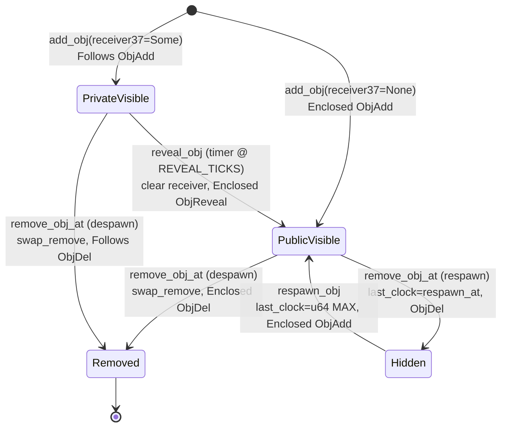
```mermaid
stateDiagram-v2
    [*] --> PrivateVisible: add_obj(receiver37=Some)<br/>Follows ObjAdd
    [*] --> PublicVisible: add_obj(receiver37=None)<br/>Enclosed ObjAdd
    PrivateVisible --> PublicVisible: reveal_obj (timer @ REVEAL_TICKS)<br/>clear receiver, Enclosed ObjReveal
    PublicVisible --> Removed: remove_obj_at (despawn)<br/>swap_remove, Enclosed ObjDel
    PrivateVisible --> Removed: remove_obj_at (despawn)<br/>swap_remove, Follows ObjDel
    PublicVisible --> Hidden: remove_obj_at (respawn)<br/>last_clock=respawn_at, ObjDel
    Hidden --> PublicVisible: respawn_obj<br/>last_clock=u64 MAX, Enclosed ObjAdd
    Removed --> [*]
```

Key invariants enforced in code:

- **Clock-guarded deletion.** `remove_obj_by_clock(x, z, id, expected_clock)` (`zone.rs:864`) only matches an obj whose
  `last_clock == expected_clock`. If a merge/stack updated the clock since the despawn was scheduled, the stale delete
  is a **no-op** (`merge_obj_stale_delete_ignored`). This prevents a scheduled despawn from deleting a freshly-merged
  stack that legitimately reset its timer.
- **Receiver-aware lookup.** `get_obj(..., Some(r))` (`zone.rs:780`) matches public objs *or* the receiver's own;
  `get_obj_of_receiver` (`:754`) requires an exact receiver match. `remove_obj` additionally requires `Despawn` lifetime
  *or* `last_clock == u64::MAX` (currently-visible respawn obj) so it never "removes" an already-hidden respawn obj (
  `remove_obj_skips_already_hidden_respawn`).
- **Respawn objs persist.** `add_obj` only pushes `Despawn` objs into the `Vec` (`zone.rs:723`); respawn objs are
  assumed already present (loaded as statics). Removal of a respawn obj sets `last_clock = respawn_at` rather than
  deleting (`:969`), and `respawn_obj` flips it back to `u64::MAX`.

`ObjReveal` after `clear_queued_events` is what makes the private→public transition atomic on the wire: any
still-pending `Follows ObjAdd` for that oid is cancelled, and a single `Enclosed ObjReveal` carrying the original
owner's `receiver_pid` (for client-side render attribution) is sent (`zone.rs:826`–`:841`).

---

### Loc lifecycle within a zone

Locs are world geometry (walls, doors, scenery). Their lifecycle interacts with the **collision map**, so the zone phase
couples loc transitions with `apply_loc_collision` / `revert_loc` / `remove_loc` in the engine:

- `add_loc(loc)` (`zone.rs:444`): reverts the loc to base, clears `last_clock`, pushes it (despawn only), queues
  `Enclosed LocAddChange`.
- `change_loc(idx)` (`zone.rs:486`): caller has already mutated the loc via `Loc::change` (e.g. door open); this clears
  the clock and emits the changed `LocAddChange`.
- `remove_loc(idx)` (`zone.rs:527`): cancels stale events; despawn locs are `swap_remove`d, respawn locs are `revert()`
  ed in place (kept for later respawn); emits `Enclosed LocDel`.
- `respawn_loc(idx)` (`zone.rs:613`): reverts, clears clock, emits `LocAddChange` to re-show the static loc.
- `anim_loc` / `merge_loc` (`:645`, `:683`): emit `LocAnim` / a pre-built `LocMerge` without changing storage.

The deferred `PendingZoneEvent::LocDelete` handler (`phases/zone.rs:88`) shows the three-way fork: a despawn loc whose
timer fired is fully removed (`remove_loc`); a hidden respawn loc is respawned and its **collision re-applied** (
`apply_loc_collision(..., true)`, `:109`); a changed-but-still-visible loc is reverted (`revert_loc`). This is why locs
and the collision grid must stay in lock-step — a respawned wall must re-block movement the same tick it reappears.

Static locs/objs loaded at startup use `add_static_loc` / `add_static_obj` (`zone.rs:174`, `:194`) which push to storage
**without queuing any event** — the client receives static geometry through the map-load / build-area protocol, not the
per-tick zone-update stream, so emitting events for them would be redundant wire traffic.

---

### End-to-end: a world mutation becomes per-player packets

```mermaid
flowchart TD
    A["Script/op: drop item, open door, fire projectile"] --> B["Engine helper resolves tile -> ZoneCoordGrid<br/>zones.zone_mut(x,y,z)"]
    B --> C["Zone mutator: add_obj / change_loc / map_proj_anim ...<br/>clear_queued_events(id) cancels stale dupes"]
    C --> D["queue_event -> events.push(ZoneEvent)"]
    B --> E["Engine.track_zone -> zones_tracking insert"]
    D --> F["zones phase: process_pending_zone_events<br/>(timed reveals/deletes/respawns re-queue + re-track)"]
    F --> G["compute_zone_shared: for each tracked zone<br/>compute_shared() -> self.shared = exact-sized Vec u8"]
    G --> H["output phase: per player, per active zone (7x7)"]
    H --> I{"zone exists?"}
    I -- no, newly loaded --> J["UpdateZoneFullFollows (clear only)"]
    I -- yes --> K["newly loaded: full snapshot<br/>visible_objs + locs walk"]
    I -- yes --> L["shared_bytes() -> UpdateZonePartialEnclosed (memcpy blob)"]
    I -- yes --> M["visible_follows_events(user37)<br/>-> UpdateZonePartialFollows + per-message"]
    J --> N["player output buffer"]
    K --> N
    L --> N
    M --> N
    N --> O["cleanup: reset_zones -> shared=None, events.clear()<br/>zones_tracking.drain()"]
```

The throughline: **one mutation → one zone → one queued event → one shared encode → N memcpy flushes → wipe.** Work
scales with dirty zones and their observers, never with world size or total player count, and the broadcast payload is
encoded exactly once per tick per zone.

---

### Engineering rationale & fidelity notes

- **Single encode, many sends.** The `shared: Option<Vec<u8>>` cache is the rs-engine improvement over the reference
  server's per-player re-walk. The cost is one heap `Vec` per dirty zone per tick (allocated exact-sized via the
  pre-sum), amortized across all observers; for a zone seen by even a few players this is a clear win, and follows-only
  zones skip the allocation entirely.
- **Tile-addressed idempotency drives cancellation.** Because zone updates are addressed by tile-within-zone and the
  client replaces state per tile, the server must collapse to final per-entity state each tick — hence
  `clear_queued_events` keyed on `lid`/`oid`. This faithfully reproduces the reference behavior where re-adding a loc
  supersedes the prior add.
- **Dirty-set, not full-scan.** `zones_tracking` (an `FxHashSet`) means `compute_zone_shared` and `reset_zones` touch
  only mutated zones. The reference server similarly tracks "active zones"; rs-engine makes the set explicit and
  integer-keyed.
- **Lazy + boxed map.** Sparse `FxHashMap<_, Box<Zone>>` trades a pointer indirection for a cache-resident probe array
  and zero storage for the millions of empty world cells — the read path never instantiates, so observation is
  allocation-free.
- **Privacy is triple-checked.** Event type at queue time, follows filter at flush time, and `visible_objs` receiver
  check at zone-entry snapshot — matching the original's per-player ground-item visibility while keeping broadcast items
  on the cheap shared path.

<sub>[↑ Back to top](#top)</sub>


---

<a id="sec-11"></a>

## 11. Entities — Players, NPCs, Locs & Objs

The `rs-entity` crate (`rs-engine/rs-entity/src/`) defines the four world-entity
kinds the engine simulates — **players**, **NPCs**, **locs** (placed scenery /
"locations"), and **objs** (ground items) — together with the shared building
blocks they are composed from: the movement/pathing model (`pathing.rs`), the
interaction state machine (`interaction.rs`), the script/delay state
(`state.rs`), the update-mask container (`rs-info::EntityMasks`), the packed
unique identifiers (`PlayerUid`/`NpcUid`, defined in `rs-vm`), and the viewport
tracker (`BuildArea`). This is the data layer the 13-phase tick loop mutates;
every other subsystem (the VM, the info renderer, the zone broadcaster) reads or
writes the structs described here.

The design philosophy throughout is *aggressive struct-of-fields composition for
the active, mutating entities* (Player, Npc) and *bit-packing for the dense,
mostly-immutable ground entities* (Loc, Obj). Players and NPCs are large,
heap-resident, individually-owned structs touched dozens of times per tick;
clarity and cache-friendly direct field access win. Locs and objs exist by the
hundreds of thousands across the map, are copied around freely, and have a
small, fixed set of fields — so they collapse into a single `u128`/`u64` word.
This split mirrors the TS reference server's logical model while replacing
its object-graph-of-class-instances representation with flat, allocation-light
Rust types.

### 1. Entity taxonomy and the two representation strategies

```mermaid
classDiagram
    class Player {
        +PlayerUid uid
        +EntityMasks info
        +PathingEntity pathing
        +EntityState state
        +InteractionState interaction
        +BuildArea build_area
        +Stats~21~ stats
        +u8 modal_state
        +Option~InteractionTarget~ next_target
        +bool run / temprun / active / bot
    }
    class Npc {
        +NpcUid uid
        +EntityMasks info
        +PathingEntity pathing
        +EntityState state
        +InteractionState interaction
        +EntityLifeTime lifecycle
        +CoordGrid spawn_coord
        +NpcMode default_mode
        +Option~u64~ respawn_at
        +Stats~6~ stats
    }
    class PathingEntity {
        +CoordGrid coord
        +u32[25] waypoints
        +i32 waypoint_index
        +i8 walk_dir / run_dir
        +u8 steps_taken / size
        +MoveSpeed move_speed
        +bool tele / jump
    }
    class InteractionState {
        +Option~InteractionTarget~ target
        +Option~u8~ target_op
        +Option~u16~ ap_range
        +bool ap_range_called
        +i32 target_x / target_z
    }
    class EntityMasks {
        +u16 masks
        +Option fields per update kind
    }
    class Loc {
        +u128 packed
        +Option~u64~ last_clock
    }
    class Obj {
        +u64 packed
        +u32 count
        +u64 receiver37 / reveal / last_clock
    }
    Player *-- PathingEntity
    Player *-- InteractionState
    Player *-- EntityMasks
    Npc *-- PathingEntity
    Npc *-- InteractionState
    Npc *-- EntityMasks
    InteractionState ..> InteractionTarget
    InteractionTarget ..> Loc : Loc variant mirrors loc fields
    InteractionTarget ..> Obj : Obj variant mirrors obj fields
```

Player and Npc both *embed* (by value, no indirection) a `PathingEntity`, an
`EntityState`, an `InteractionState`, and an `EntityMasks`. The same four
components reused across both means the movement, interaction, delay, and
update-encoding logic is written once and shared via the `FocusKind`
discriminator (`rs-info/src/lib.rs:16`) rather than duplicated per entity type —
the Rust analogue of the reference server's `PathingEntity` base class, but with
composition instead of inheritance.

### 2. Identity: packed UIDs

Both UID types are single-integer newtypes (`rs-vm/src/player_uid.rs`,
`rs-vm/src/npc_uid.rs`) so they are `Copy`, fit in a register, and can be pushed
onto the script VM stack as an `i32`/`i64` without allocation.

`PlayerUid(u128)` packs the base37 username hash with the player slot index:

```
PlayerUid bit layout (u128)
┌─────────────────────────────────────────┬───────────────┐
│ username37  (base37 hash, upper bits)    │ pid  (11 bits)│
└─────────────────────────────────────────┴───────────────┘
 packed = (to_userhash(name) << 11) | (pid & 0x7FF)
```

`pid()` masks the low 11 bits → range `0..=2047`, which is exactly
`MAX_PLAYERS = 2048` (`build.rs:4`). `username37()` shifts right 11 to recover
the hash, decodable back to a string via `username()`/`screen_name()`
(`player_uid.rs:73,88`). Packing identity *and* slot in one value lets the engine
carry "who and where" in a single comparison; the base37 hash is also how
receiver-only objs are matched to a player (`find_pid_by_user37`).

`NpcUid(u32)` packs the NPC **type id** in the high 16 bits and the **slot
index** (`nid`) in the low 16 bits: `packed = (id << 16) | nid`
(`npc_uid.rs:26`). `nid()` is a direct index into the engine's NPC array
(`npcs[nid as usize]`), bounded by `MAX_NPCS = 8192` (`build.rs:6`). Storing the
type id in the UID is what makes `Npc::reset_pathing_entity(respawn=true)` able to
*restore the original type* after a polymorph: `self.uid = NpcUid::new(self.base_type, self.uid.nid())`
(`npc.rs:238`) rebuilds the UID from the immutable `base_type` while keeping the
slot.

| Constant       | Value      | Source       | Meaning                                |
|----------------|------------|--------------|----------------------------------------|
| `MAX_PLAYERS`  | 2048       | `build.rs:4` | player slots; matches 11-bit pid       |
| `MAX_NPCS`     | 8192       | `build.rs:6` | NPC slots; low 16 bits of `nid`        |
| `REVEAL_TICKS` | 100        | `obj.rs:5`   | ticks before a private obj goes public |
| `NO_RECEIVER`  | `u64::MAX` | `obj.rs:7`   | sentinel: obj visible to all           |

### 3. The Player struct

`Player` (`player.rs:103`) is the largest and most heavily-mutated struct in the
engine — ~70 fields. It is *not* bit-packed: it is touched many times per tick by
input decoding, the VM, movement, interaction, and info encoding, so direct named
field access (and the cache locality of one contiguous allocation) matters more
than shrinking it. Fields group into:

- **Identity / flags**: `uid`, `bot`, `active`, `low_memory`, `is_member`,
  `staff_mod_level` (defaults to `Developer` under `debug_assertions`, `Normal`
  otherwise — `player.rs:217-220`), `allow_design`.
- **Embedded components**: `info: EntityMasks`, `pathing: PathingEntity`,
  `state: EntityState`, `interaction: InteractionState`, `build_area: BuildArea`,
  `cam_queue: CamQueue`.
- **Stats / progression**: `stats: Stats<21>` (21 skills), `combat_level`,
  `hero_points`, `runenergy` (starts 10000 — `player.rs:203`), `runweight`,
  `varps: VarSet`, `playtime`.
- **Movement intent**: `run`, `temprun`, `run_step`, `move_request`,
  `path: Option<Vec<CoordGrid>>` (the smart-path result, separate from the
  pathing waypoint ring).
- **Interface / modal state**: `modal_state: u8` bitmask plus per-slot component
  ids (`modal_main`, `modal_chat`, `modal_side`, `modal_tutorial`), `last_*`
  shadow copies for delta detection, the 14-element `tabs` array, and refresh
  flags.
- **Interaction continuation**: `next_target: Option<InteractionTarget>`,
  `opcalled`, `walktrigger`.
- **Inventories / interface listeners**: `invs: HashMap<u16, Inventory>` plus
  three transmit-tracking maps and an `inv_first_seen` set.
- **AFK / anti-macro**: `afk_zones: [u32; 2]`, `last_afk_zone`,
  `afk_event_ready`.
- **Logout**: `logout_requested`, `logout_prevented_until`,
  `logout_prevented_message`, `logout_sent`.

#### 3.1 Modal state as a bitmask

The five `MODAL_*` constants (`player.rs:20-28`) are a one-byte bitfield:

| Flag         | Bit    | Blocks input? |
|--------------|--------|---------------|
| `MODAL_NONE` | `0`    | —             |
| `MODAL_MAIN` | `1<<0` | **yes**       |
| `MODAL_CHAT` | `1<<1` | **yes**       |
| `MODAL_SIDE` | `1<<2` | no            |
| `MODAL_TUT`  | `1<<3` | no            |

`contains_modal_interface()` tests only `MODAL_MAIN | MODAL_CHAT`
(`player.rs:282`); those two are the *blocking* modals. This feeds the central
gate `busy() = delayed || contains_modal_interface()` and
`can_access() = !protect && !busy()` (`player.rs:390-398`), which the interaction
phase consults before letting a player act. The `open_*_modal` helpers
(`player.rs:536-649`) enforce mutual exclusion: opening a chat modal clears
`MODAL_MAIN`/`MODAL_SIDE`; opening a main modal clears `MODAL_CHAT`/`MODAL_SIDE`;
the side modal *coexists* (no eviction). Each opener also calls
`clear_suspended_script()` (`player.rs:375`), which drops an `active_script`
whose `ExecutionState` is `CountDialog` or `PauseButton` — opening a new
interface invalidates a dialog that was waiting for the old one's input.

#### 3.2 Per-tick reset

`reset_pathing_entity(respawn)` (`player.rs:741`) is the per-tick "clear the
slate" called at the top of the cycle. It resets the info masks
(`info.reset()`), nulls the pathing step/dir/tele/jump fields, records
`last_coord = coord`, zeroes `steps_taken`, drops `protect`/`opcalled`/
`ap_range_called`, and sets `move_speed` from the `run` flag. When `respawn` is
true it additionally `unfocus()`es (resets orientation south). Crucially it does
**not** clear `interaction.target` or the waypoint queue — the tests
`reset_does_not_clear_interaction` / `reset_does_not_clear_waypoints`
(`player.rs:1075,1083`) pin this, because interactions must persist across ticks
while the player walks toward the target.

#### 3.3 Combat level — verified integer rewrite

`get_combat_level()` (`player.rs:412`) is a noteworthy fidelity case. The
original RS formula is floating-point: `floor(0.25*base + 0.325*max(melee,
range, magic))`. The Rust version factors out the irrational-in-binary constant
`0.325` into exact integer arithmetic — `0.25 = 10/40`, `0.325 = 13/40` — and
computes `floor((10*base_sum + 13*max_sum) / 40)` using only shifts and one
divide (`player.rs:433`). The module `combat_level_tests` (`player.rs:766`)
*exhaustively* proves bit-identity against the `f64` reference over the entire
reachable domain (`base_sum 0..=247`, `max_sum 0..=198`), guarding against any
rounding boundary where `0.325`'s f64 representation would diverge.

### 4. The Npc struct

`Npc` (`npc.rs:20`) mirrors the Player's component layout (`pathing`, `state`,
`interaction`, `info`, `vars`, `stats: Stats<6>`, `hero_points`) plus AI-specific
state:

- **Spawn / lifecycle**: `spawn_coord`, `base_type`, `lifecycle: EntityLifeTime`
  (defaults `Respawn` — `npc.rs:91`), `respawn_at: Option<u64>`, `active`.
- **AI modes**: `default_mode: NpcMode`, `wander_range`, `max_range`,
  `wander_counter`, `target_player`.
- **Hunt**: `hunt_mode`, `hunt_range`, `hunt_clock`, `hunt_target`.
- **Patrol**: `next_patrol_point`, `next_patrol_tick`, `delayed_patrol`.
- **Timers / regen**: `timer_interval`, `timer_clock`, `regen_clock`.
- **Polymorph / revert**: `revert_at: Option<u64>`, `revert_reset`.
- **Visibility bookkeeping**: `observers: u16` (how many players currently track
  this NPC).

NPCs default to `MoveStrategy::Naive` and `MoveRestrict::Normal`
(`npc.rs:78`), versus players which use `MoveStrategy::Smart` and
`MoveRestrict::Player` (`player.rs:197`). NPC interactions are keyed by
`NpcMode` rather than the player `ServerTriggerType`: `clear_interaction()` resets
`target_op` to `NpcMode::None` (`npc.rs:122`) rather than fully `None`, since an
NPC is always *in* some behavior mode. `reset_defaults()` (`npc.rs:183`)
reconfigures hunt/timer settings from config when an NPC returns to its default
mode.

`Npc::reset_pathing_entity(respawn)` (`npc.rs:236`) splits sharply by branch. On
`respawn` it does a **full restore**: rebuild the UID from `base_type`,
`unfocus`, `stats.reset()`, clear hero points, clear the script `queues`, set
`tele = true` (so the client snaps to the respawn position), and clear
`revert_at`/`revert_reset`. The non-respawn branch is the lightweight per-tick
reset (info masks, walk step/dirs, steps, protect, `ap_range_called`,
`set_face_entity`).

### 5. Movement and pathing (`pathing.rs`)

`PathingEntity` (`pathing.rs:24`) owns all movement state. The waypoint store is
a **fixed inline array `waypoints: [u32; 25]`** with an `i32 waypoint_index`
acting as a LIFO stack pointer (`-1` = empty). Each waypoint is a packed coord
`(x << 14) | z` (`pathing.rs:150`). The fixed array avoids per-step heap traffic;
25 is the protocol's path-length ceiling.

```mermaid
flowchart TD
    A["process_movement(info, kind)"] --> B{move_restrict == NoMove?}
    B -- yes --> Z["return false"]
    B -- no --> C{has_waypoints?<br/>index != -1}
    C -- no --> Z
    C -- yes --> D{move_speed}
    D -- Crawl --> E["toggle last_crawl;<br/>step only every other tick"]
    D -- Walk --> F["walk_dir = try_step()"]
    D -- Run --> G["walk_dir = try_step();<br/>if moved: run_dir = try_step()"]
    E --> H["try_step → take_step"]
    F --> H
    G --> H
    H --> I["face_dir(src,dest)<br/>can_travel collision check"]
    I --> J["advance coord; steps_taken++;<br/>decrement waypoint_index on arrival"]
    J --> K["return steps_taken > 0"]
```

**Speed model** (`MoveSpeed`, `player.rs:48`): `Stationary=0` (no move),
`Crawl=1` (one tile every *other* tick, via the `last_crawl` toggle —
`pathing.rs:113`), `Walk=2` (one tile/tick), `Run=3` (two tiles/tick — a second
`try_step` populates `run_dir`, `pathing.rs:120`). The two direction outputs
`walk_dir`/`run_dir` (`i8`, `-1` = none) are exactly what the info protocol
encodes per tick.

**`take_step()`** (`pathing.rs:315`) is the collision-aware stepper. It computes
the octant toward the current waypoint with `face_dir()` (sign-of-delta lookup,
`pathing.rs:442`), gets the tile delta from `dir_delta()` (`pathing.rs:465`), and
validates the move via `rsmod::can_travel` using a `CollisionType` and an extra
collision flag both derived from `MoveRestrict`:

| `MoveRestrict`  | `collision_type`     | `block_walk_extra_flag` |
|-----------------|----------------------|-------------------------|
| `Normal`        | `Normal`             | `CollisionFlag::Npc`    |
| `Player`        | `Normal`             | `CollisionFlag::Player` |
| `Blocked`       | `Blocked`            | `Open`                  |
| `BlockedNormal` | `LineOfSight`        | `Npc`                   |
| `Indoors`       | `Indoors`            | `Npc`                   |
| `Outdoors`      | `Outdoors`           | `Npc`                   |
| `Passthru`      | `Normal`             | `Open`                  |
| `NoMove`        | `None` (cannot move) | `Null`                  |

(`pathing.rs:195,219`). For 1×1 entities a blocked diagonal falls back to an
axis-aligned step (try x-only, then z-only — `pathing.rs:385-423`). For
multi-tile NPCs (`size > 1`) the diagonal is never attempted; x and z are tried
independently (`pathing.rs:333`). `try_step()` (`pathing.rs:254`) applies the
delta, updates `info.focus(...)` so the entity looks where it walks, increments
`steps_taken`, and decrements `waypoint_index` on arrival — recursing to skip
already-reached waypoints.

**Teleport vs jump**: `tele` snaps the entity to a new coord and forces a full
client reposition; `jump` marks an instantaneous non-walked relocation. Both are
cleared every tick in the reset. A new `Player`/`PathingEntity` starts with
`tele = true`, `jump = true` (`pathing.rs:71`, `player.rs:198`) so the very first
info block sends an absolute position.

`MoveStrategy` selects *who computes the route*: `Smart` (players —
`pathing.rs:13`) runs full A*-style pathfinding upstream, depositing the result
in `Player::path` and the waypoint ring; `Naive` (NPCs) steps greedily toward the
destination each tick with no precomputed route. `queue_waypoints()`
(`pathing.rs:165`) stores the path **reversed** so the LIFO `waypoint_index`
consumes it in travel order — verified by `queue_waypoints_reverses_input`
(`player.rs:1116`).

### 6. Interaction model (`interaction.rs`)

`InteractionTarget` (`interaction.rs:13`) is a four-variant enum naming what an
entity is acting on:

| Variant                                                 | Carries           | `is_pathing_entity` | `fine_coord`               |
|---------------------------------------------------------|-------------------|---------------------|----------------------------|
| `Obj { coord, id, count }`                              | full obj snapshot | false               | `Some` (1×1 center)        |
| `Loc { coord, id, width, length, shape, angle, layer }` | full loc snapshot | false               | `Some` (size-aware center) |
| `Npc { nid }`                                           | index only        | **true**            | `None` (resolved live)     |
| `Player { pid }`                                        | index only        | **true**            | `None` (resolved live)     |

The split between *snapshot* targets (obj/loc carry their full geometry) and
*index-only* targets (npc/player carry just a slot) is deliberate: a static obj or
loc cannot move, so its face coordinate is computed once via `fine_coord()`
(`interaction.rs:66`). A pathing target *can* move, so `fine_coord()` returns
`None` and the caller must read the live position each tick from the target's
`PathingEntity` (see `Engine::resolve_pathing_face`, referenced at
`interaction.rs:65`). `coord()` returns origin `(0,0,0)` for pathing variants
(`interaction.rs:43`) for the same reason.

`InteractionState` (`interaction.rs:91`) is the per-entity machine:

- `target`, `target_op` (the trigger opcode), `target_subject_type` (the obj/loc
  type id, or `None` for npc/player — `interaction.rs:140`), `target_subject_com`
  (an attached interface component).
- `ap_range: Option<u16>` (approach range, default `10`) and `ap_range_called`
  (did a script set the range *this tick*).
- `target_x`/`target_z` (stationary fine face coord, `-1` sentinel) and the
  `last_path_src`/`last_path_dst` path-dedup keys.

`set()` (`interaction.rs:130`) installs a target, resets `ap_range` to 10, clears
`ap_range_called`, records the subject type for obj/loc, and returns the fine
coord for non-pathing targets (so the caller can `focus_*` immediately).
`has_interaction()` (`interaction.rs:177`) returns `false` for the *follow*
op (`ApPlayer3`/`OpPlayer3`) because pure-follow does nothing on the server.

#### 6.1 The AP→OP and `next_target` lifecycle

The interaction lifecycle is the subtlest part of the entity layer, and the test
suite in `player.rs:847-1506` documents it precisely. Two trigger families fire
as a player approaches a target: **AP** ("approach", fires while in approach
range but before adjacency) and **OP** ("operate", fires on adjacency). They are
laid out so `OP = AP + 7` for every interaction class
(`ap_to_op_offset_is_7`, `player.rs:1133`), and each class has 5 sequential
slots (`ApObj1..5`, `OpLoc1..5`, …).

```mermaid
stateDiagram-v2
    [*] --> Targeted: set_interaction(target, op)
    Targeted --> Walking: not in range
    Walking --> Walking: steps_taken>0, target persists
    Walking --> CantReach: !interacted && !has_waypoints && steps_taken==0
    Walking --> InRange: adjacency / ap_range met
    Targeted --> InRange: already adjacent
    InRange --> Fired: AP/OP trigger runs script
    Fired --> Chained: script set next_target (p_oploc/p_opobj)
    Fired --> Held: ap_range_called this tick
    Fired --> Cleared: interacted && !ap_range_called && next_target None
    Chained --> Targeted: next_target swapped in next tick
    Held --> Targeted: persists for re-fire
    Cleared --> [*]
    CantReach --> [*]
```

The end-of-tick cleanup (modeled by `simulate_interaction_cleanup`,
`player.rs:1200`) is: **if `next_target` is set, swap it in; else if the entity
interacted and `ap_range_called` is false, clear the interaction.** This single
rule expresses every gameplay pattern:

- **Woodcutting / door chains**: the OP script calls `p_oploc`, which sets
  `next_target` → interaction persists and re-fires next tick
  (`woodcutting_p_oploc_persists_interaction`, `player.rs:1210`).
- **Firemaking / `world_delay`**: the OP script suspends to the world queue
  *without* re-setting the target → `next_target` is `None`, interaction clears,
  so the OP does not spuriously re-trigger (`world_delay_no_p_opobj_clears_interaction`,
  `player.rs:1241`).
- **`ap_range_called` hold**: an AP script that sets the approach range keeps the
  interaction alive *within the tick* even though OP fired
  (`ap_range_called_survives_within_tick`, `player.rs:1281`); the flag is reset
  between ticks by `reset_pathing_entity`, so it must be re-asserted each tick.
- **"I can't reach that!"**: emitted only when all three of `!interacted`,
  `!has_waypoints`, and `steps_taken == 0` hold (`cant_reach_requires_all_three_conditions`,
  `player.rs:1389`) — i.e. the player neither acted, has nowhere left to walk, nor
  moved this tick.

#### 6.2 Orientation and the face masks

Facing is split between *continuous tracking of a moving target* and *one-shot
facing of a static one*. `set_face_entity()` (`interaction.rs:190`) encodes the
`FaceEntity` info mask: a player target becomes `pid + 32768`, an NPC target the
raw `nid`, anything else clears it — and the mask bit is set only if the value
*changed*, minimizing wire churn. `reorient()` (`interaction.rs:226`) prefers a
live `pathing_face` (re-faced every tick with `client=false`, since the client
already tracks the entity via `FaceEntity`); only if there is no live target and
the entity stopped moving this tick does it face the stored stationary coord once
(`client=true`, broadcasting a `FaceCoord`) and then clear it. `unfocus()`
(`interaction.rs:211`) faces south by setting the orientation one tile to the
`-z`.

### 7. Update masks — the basis of delta encoding

`EntityMasks` (`rs-info/src/lib.rs:105`) is the per-entity "what changed this
tick" container that drives the info-block delta protocol. The `masks: u16`
field is a bitset of pending update kinds; each set bit tells the
`PlayerRenderer`/`NpcRenderer` which payload fields to serialize. The bit values
differ between the two entity protocols, abstracted by `FocusKind`:

| Update     | `PlayerInfoProt` | `NpcInfoProt` |
|------------|------------------|---------------|
| Appearance | `0x1`            | —             |
| Anim       | `0x2`            | `0x2`         |
| FaceEntity | `0x4`            | `0x4`         |
| Say        | `0x8`            | `0x8`         |
| Damage     | `0x10`           | `0x10`        |
| FaceCoord  | `0x20`           | `0x80`        |
| ChangeType | —                | `0x20`        |
| Chat       | `0x40`           | —             |
| SpotAnim   | `0x100`          | `0x40`        |
| ExactMove  | `0x200`          | —             |
| BigInfo    | `0x80`           | —             |

(`rs-protocol/src/network/game/info_prot.rs`). Note `FaceCoord` is `0x20` for
players but `0x80` for NPCs — exactly why `FocusKind::face_coord_mask()`
(`rs-info/src/lib.rs:54`) exists. `face_entity_mask()` returns `0x4` for both.

The critical lifecycle distinction is **persistent vs temporary** fields
(`rs-info/src/lib.rs:90-104`). `reset()` (`lib.rs:286`), called by the engine's
cleanup phase, zeroes `masks` and all *temporary* payloads (anim, say, damage,
chat, spotanim, exactmove, changetype, `face_x`/`face_z`) but **preserves**
persistent ones (`appearance`, the walk/run/turn/ready anims, `face_entity`,
`orientation_x/z`, `anim_protect`, `vis`). This is what makes the delta encoding
correct: a newly-arriving observer needs the persistent orientation/appearance
even on a tick where nothing changed, while transient events (a hit splat, a
chat line) are sent once and cleared. `set_anim()` (`lib.rs:240`) shows the
priority/`anim_protect` gate that decides whether an animation overrides the
current one before OR-ing its mask bit. The `Visibility` enum (`Default`/`Soft`/
`Hard`, `lib.rs:69`) is persistent and governs whether the entity is rendered at
all.

`Player::reset_pathing_entity` calls `info.reset()` then `set_face_entity()`
(`player.rs:745,762`), re-deriving the face mask from the current interaction
every tick — so the face follows the target without the game logic re-issuing it.

### 8. Locs — packed placed scenery (`loc.rs`)

A `Loc` (`loc.rs:26`) is **two fields**: a `u128 packed` and an
`Option<u64> last_clock`. Everything geometric and type-related lives in the
`u128`:

```
Loc packed (u128) layout
bits   0..31   coord (CoordGrid::packed u32)
bits  32..39   width  (u8)
bits  40..47   length (u8)
bit      48    lifecycle (0=Respawn, 1=Despawn)
bits  49..73   base_info    (25 bits) — original map state
bits  74..98   current_info (25 bits) — possibly modified state

info (25 bits): id[0..15] | shape[16..20] | angle[21..22] | layer[23..24]
```

(`loc.rs:6-17,231`). The **dual base/current info** is the heart of loc
semantics: opening a door, mining a rock, etc. mutate `current_info` via
`change()` (`loc.rs:179`) while leaving `base_info` untouched, so `revert()`
(`loc.rs:193`) can copy base→current to restore the original. `is_changed()`
(`loc.rs:161`) is a single `u128` comparison of the two 25-bit fields. Accessors
read `id`/`shape`/`angle` from *current* info but `layer` from *base*
(`loc.rs:152`) — the collision layer never changes under a runtime modification.
`shape()`/`angle()`/`layer()` use `transmute` on the masked bits to the
`LocShape`/`LocAngle`/`LocLayer` enums (the documented unsafety, `loc.rs:129`).

Helper packers produce wire-ready bytes directly: `packed_zone_coord()` packs
`(x&7)<<4 | (z&7)` (`loc.rs:214`), `packed_shape_angle()` packs `shape<<2 | angle`
(`loc.rs:223`), and `lid()` builds a zone-local key from local x/z (3 bits each)
plus layer (`loc.rs:204`).

### 9. Objs — packed ground items (`obj.rs`)

An `Obj` (`obj.rs:23`) packs `coord | lifecycle | id` into a `u64` and keeps four
side fields:

```
Obj packed (u64) layout
bits  0..31   coord (CoordGrid::packed u32)
bit      32   lifecycle (0=Respawn, 1=Despawn)
bits 33..48   id (u16)

side fields:
  count: u32          stack size
  receiver37: u64     base37 hash of the only player who sees it (NO_RECEIVER = all)
  reveal: u64         tick it becomes public
  last_clock: u64     tick of scheduled state change (u64::MAX = none)
```

(`obj.rs:9-14,46`). `oid()` (`obj.rs:108`) builds a dedup key from local x/z
(3 bits each), the id (16 bits), and the receiver's low 32 bits (22-bit shift) so
a player's "already seen" tracking distinguishes private drops.

### 10. EntityLifeTime and the obj/loc lifecycle state machine

`EntityLifeTime` (`lifetime.rs:8`) is the two-state discriminant that governs
every ground entity:

- **`Respawn = 0`** — a *permanent map fixture*. It is removed/changed
  temporarily but reverts to its base state. Loaded from the map cache.
- **`Despawn = 1`** — a *runtime spawn*. It exists until its timer expires, then
  is gone for good. A dropped item or scripted scenery.

Visibility is time-driven and lifecycle-dependent. For locs, `visible()`
(`loc.rs:82`) returns `true` for `Despawn`, and for `Respawn` returns
`is_changed() || last_clock.is_none()` — i.e. a static loc is only "visible" (an
override the client must be told about) when it differs from the map or has never
been clocked. For objs, `visible(clock)` (`obj.rs:91`) returns `true` when
`last_clock == u64::MAX` (no pending transition); otherwise `Despawn` is visible
while `clock < last_clock` and `Respawn` becomes visible once `clock >= last_clock`.

The engine drives the transitions through scheduled zone events
(`rs-engine/src/phases/zone.rs:54`, `PendingZoneEvent`):

```mermaid
stateDiagram-v2
    direction LR
    [*] --> ObjLive: add_obj()
    ObjLive --> ObjPrivate: receiver37 set
    ObjPrivate --> ObjPublic: clock >= reveal (ObjReveal, REVEAL_TICKS)
    ObjPublic --> Gone: clock >= last_clock (ObjDelete)
    ObjLive --> Gone: Despawn timer (ObjDelete)
    Gone --> ObjLive: ObjAdd (Respawn only)

    [*] --> LocBase: map load (Respawn)
    LocBase --> LocChanged: change()
    LocChanged --> LocBase: revert() on LocDelete (is_changed)
    LocBase --> LocHidden: removed (respawn timer)
    LocHidden --> LocBase: respawn_loc + restore collision
    [*] --> LocTemp: spawn (Despawn)
    LocTemp --> Gone2: LocDelete removes it
```

When a script drops a private item, `Engine::add_obj`
(`rs-engine/src/engine.rs:1340`) sets `last_clock = clock + duration`, and if a
receiver is given sets `receiver37`, `reveal = clock + REVEAL_TICKS`
(`engine.rs:1359`), and schedules an `ObjReveal` to fire at `reveal_clock` (when
it precedes deletion) plus always an `ObjDelete` at `last_clock`. The
`LocDelete` handler (`zone.rs:88-114`) routes by lifecycle: a `Despawn` loc is
removed outright; a hidden `Respawn` loc is respawned and its collision
re-applied; a `is_changed()` loc is reverted to base. NPC respawn uses the same
clock pattern: on death the engine sets `npc.respawn_at = Some(clock + respawnrate)`
(`engine.rs:1947`), and `reset_pathing_entity(respawn=true)` performs the full
restore.

### 11. BuildArea — the per-player viewport

`BuildArea` (`build.rs:133`) is each player's view of the world: which zones are
loaded/active, which players and NPCs are in range, cached appearance clocks, and
a *dynamic* view distance. It contains two `IdBitSet`s (`players`, `npcs`) and a
boxed `[u64; MAX_PLAYERS]` appearance-clock cache.

`IdBitSet` (`build.rs:13`) is a hybrid: a `Vec<u32>` bit vector for O(1)
membership (`contains`/`insert`/`remove` via raw-pointer word arithmetic,
`build.rs:38-54`) plus a `Vec<u16> ids` insertion-ordered list for iteration. The
unusual `remove_bit` + `retain_bits` pair (`build.rs:84,93`) lets the engine bulk
clear bits during a rebuild and reconcile the ordered list afterward in one pass,
and `swap_ids` (`build.rs:104`) hands the list out for iteration without copying
— allocation-conscious patterns for the hot info-tracking loop.

The **dynamic view distance** (`resize()`, `build.rs:300`) is an adaptive
load-shedder: if `>= PREFERRED_PLAYERS` (250) are tracked it shrinks
`view_distance` by 1 (min 1) immediately; otherwise it grows by 1 (up to
`PREFERRED_VIEW_DISTANCE = 15`) every `INTERVAL = 10` ticks. This keeps per-tick
info-encoding cost bounded in crowded areas while restoring full range as
crowds disperse — the same congestion control the reference server applies, here
expressed as plain counters. `needs_rebuild()` (`build.rs:281`) triggers a full
13×13-zone rebuild when the player drifts more than 4 zones from the build
origin; `rebuild_zones()` recomputes the 7×7 active window each zone crossing
(`update_map`, `player.rs:659`). `has_appearance`/`save_appearance`
(`build.rs:337,348`) compare a stored per-player appearance "clock" so a player's
appearance block is re-sent only when it actually changed.

### 12. EntityState — script and delay state (`state.rs`)

`EntityState` (`state.rs:10`), embedded in both Player and Npc, holds the
script-execution glue: `delayed`/`delayed_until` (the entity is blocked until a
future tick), `protect` (shielded from new interactions mid-script),
`active_script: Option<Box<ScriptState>>` (the suspended VM frame, boxed to keep
the parent struct small and moves cheap), and the `queues: ScriptQueue` /
`timers: ScriptTimer` collections. `check_delay(clock)` (`state.rs:43`) lifts the
delay once the clock reaches `delayed_until`. Together with the Player's
`can_access()`/`busy()` gates, this is the mechanism by which scripts pause an
entity for a number of ticks and resume it deterministically — the foundation the
single-threaded VM relies on for reproducible behavior.

### Cross-cutting design rationale

The recurring theme is **representation chosen per access pattern**: hot,
individually-owned, frequently-mutated entities (Player/Npc) are wide structs of
named fields embedding shared components; cold, numerous, copy-heavy ground
entities (Loc/Obj) are single packed words with bit-accessor methods. Identity
and small enums are packed integers so they live in registers and cross the VM
boundary without allocation. The update-mask split into persistent/temporary
fields is what makes the delta-encoded info protocol both correct (late joiners
get persistent state) and cheap (transient events sent once). And the
interaction state machine's `next_target` + `ap_range_called` rules reproduce the
reference server's exact multi-tick gameplay timing — pinned by an unusually
thorough in-crate test suite — while running on flat, deterministic,
single-threaded Rust state.

<sub>[↑ Back to top](#top)</sub>


---

<a id="sec-12"></a>

## 12. Collision & Pathfinding

Movement in rs-engine is governed by a single, authoritative, server-side **collision map** and a family of grid
algorithms that read it: step validation, line-of-sight/line-of-walk, reachability, and a BFS flood-fill route finder.
Unlike the rendering-oriented original client, the server treats the collision grid as a *correctness* substrate — every
wall, ground decoration, floor block, NPC, and player occupies one or more 32-bit flag words, and every movement
decision is a bitmask test against those words. Crucially, none of the collision/pathfinding *algorithms* live in the
engine crates: they are supplied by two external crates, `rs-pathfinder` (version `0.1`, `Cargo.toml:68`) and `rsmod`.
rs-engine owns only the **integration surface** — how the cache map data is decoded into collision flags, how loc/entity
mutations toggle those flags, and how movement phases call into the pathfinder. This section documents that surface
exhaustively and characterizes the external crates only to the depth needed to read the engine's calls correctly.

### The two external crates and how they are wired

The dependency declared in the workspace is `rs-pathfinder = "0.1"` (`Cargo.toml:68`), re-exported into `rs-engine`,
`rs-entity`, and `rs-vm` via `rs-pathfinder = { workspace = true }` (`rs-engine/Cargo.toml:24`,
`rs-engine/rs-entity/Cargo.toml:16`, `rs-engine/rs-vm/Cargo.toml:13`). The crate is imported under the name **`rsmod`
** — every call site in the engine is `rsmod::<fn>(...)` and every type import is `rsmod::rsmod::<...>`. The doubled
path is not a typo: the *crate* is aliased to `rsmod`, and inside it there is a public module `pub mod rsmod` (
`rs-pathfinder-0.1.0/src/lib.rs:14`) that holds the strategy/flag/algorithm types. Thus:

- `rsmod::find_path`, `rsmod::can_travel`, `rsmod::reached`, `rsmod::change_wall`, … are the **free functions** at the
  crate root (`lib.rs`), which the engine calls directly.
- `rsmod::rsmod::collision::collision_strategy::CollisionType`, `rsmod::rsmod::flag::collision_flag::CollisionFlag` are
  the **enums** the engine imports for typing those calls (e.g. `pathing.rs:6-7`, `phases/shared.rs:11`).

These crates are external; their A\*/BFS internals are out of scope and are summarized, not reproduced. What follows
documents the *engine's* obligations: build the map, keep it coherent, and call the right entry point with the right
arguments.

```mermaid
flowchart LR
  subgraph cache["Game cache (rs-pack)"]
    M["'m' ground"]:::c
    L["'l' locs"]:::c
    N["'n' npcs"]:::c
    O["'o' objs"]:::c
  end
  subgraph load["GameMap::load (game_map.rs:81)"]
    LG["load_ground -> change_floor / change_roof"]
    LL["load_locations -> change_loc_collision"]
  end
  CFM[["rsmod COLLISION_FLAGS\nCollisionFlagMap (global)"]]:::g
  M --> LG --> CFM
  L --> LL --> CFM
  subgraph runtime["Per-tick mutation"]
    MV["entity move\ncheck_zones_and_collision\n-> change_npc / change_player"]
    LOC["loc add/change/revert/remove\napply_loc_collision /\napply_collision_by_id"]
  end
  MV --> CFM
  LOC --> CFM
  subgraph query["Movement / interaction reads"]
    CT["can_travel (step)"]
    FP["find_path / find_naive_path"]
    RE["reached"]
    LOS["has_line_of_sight / _of_walk"]
  end
  CFM --> CT
  CFM --> FP
  CFM --> RE
  CFM --> LOS
  classDef c fill:#1f3247,color:#fff;
  classDef g fill:#3a234a,color:#fff;
```

### The collision map: storage model

The map is a single process-global, owned by the `rsmod` crate, not by `Engine`:

```rust
// rs-pathfinder-0.1.0/src/lib.rs:20
static mut COLLISION_FLAGS: Lazy<CollisionFlagMap> = Lazy::new(CollisionFlagMap::new);
static mut PATHFINDER: Lazy<PathFinder> = Lazy::new(PathFinder::new); // lib.rs:26
```

`CollisionFlagMap` (`collision/collision.rs:4`) is `flags: Vec<Option<Box<[u32; 64]>>>`. The world is partitioned into *
*8×8-tile zones**; each zone is one heap-allocated array of 64 `u32` tile-flag words, lazily boxed on first write (
`None` until allocated). The outer `Vec` is sized `256 * 256 * 4 * 64` slots (`TOTAL_ZONE_COUNT`, `collision.rs:10`)
covering the 16384×16384 tile / 4-level world.

Addressing is pure bit-arithmetic (`collision.rs:13-20`):

```
zone_index = ((x>>3) & 0x7ff) | (((z>>3) & 0x7ff) << 11) | ((y & 0x3) << 22)
tile_index = (x & 0x7) | ((z & 0x7) << 3)
```

Design consequences the engine relies on:

- **Sparse, lazy allocation.** A zone array is materialized only when a flag is first added (
  `allocate_if_absent_return`, `collision.rs:71`, fills with `CollisionFlag::Open = 0`). An unallocated zone reads back
  as `CollisionFlag::Null = 0x7FFF_FFFF` (`collision.rs:38`) — i.e. *every* bit but the sign set, so any walkability
  test against it fails closed. This is why `load_ground` explicitly calls `rsmod::allocate_if_absent` on a sparse 7×7
  stride (`game_map.rs:186-188`): it pre-materializes the zones touched by a mapsquare so that genuinely open tiles read
  `Open`, not `Null`. Players also probe `is_zone_allocated` before allowing movement into a region (
  `active_player.rs:1959`, `:2202`; `active_npc.rs:278`).
- **`u32` per tile, bit-packed.** All wall, projectile, route-blocker, floor, roof, npc, and player state for a tile fit
  in one word; a step test is a single `tile_flag & block_flag == 0`.
- **Single-threaded writer invariant.** The comment at `lib.rs:16-19` is the load-bearing safety argument: writes happen
  only on the engine tick thread (loc/npc/player add/remove); reads may also come from a pooled/async pathfinding phase,
  but no writer runs during an async phase, so concurrent reads are sound. This is the same determinism guarantee the
  whole engine is built on (see *Engine single-threaded* memory note) projected onto the collision map.

### CollisionFlag bit layout

`CollisionFlag` (`flag/collision_flag.rs:5`) is `#[repr(u32)]`. The low bits encode walls in 8 compass directions, then
a `Loc` blocker, then projectile-blocker mirrors, then the custom `Npc`/`Player`/`Floor`/`Roof` flags and route-blocker
mirrors:

| Bit                 | Flag                         | Meaning                                     |
|---------------------|------------------------------|---------------------------------------------|
| 0x1–0x80            | `WallNorthWest` … `WallWest` | Movement-blocking wall edges (8 directions) |
| 0x100               | `Loc`                        | Full-tile loc blocker                       |
| 0x200–0x10000       | `Wall*ProjBlocker`           | Projectile-blocking wall mirrors            |
| 0x20000             | `LocProjBlocker`             | Projectile-blocking loc                     |
| 0x40000             | `FloorDecoration`            | Floor decoration                            |
| 0x80000             | `Npc`                        | Custom: blocks NPCs                         |
| 0x100000            | `Player`                     | Custom: blocks players/projectiles          |
| 0x200000            | `Floor`                      | Floor present (walkable ground)             |
| 0x400000–0x20000000 | `Wall*RouteBlocker`          | Route-finding wall mirrors                  |
| 0x40000000          | `locRouteBlocker`            | Route-finding loc mirror                    |
| 0x80000000          | `Roof`                       | Custom: roof (keeps NPCs indoors)           |
| —                   | `WalkBlocked = 0x240100`     | Shorthand: `Floor                           | FloorDecoration | Loc` |
| —                   | `Null = 0x7FFFFFFF`          | Returned for unallocated zones              |

The triple mirroring — a wall has a *movement* flag (low bits), a *projectile* flag (0x200 range), and a *route-blocker*
flag (0x400000 range) — is what lets the same grid answer "can I walk here", "can an arrow pass", and "can the route
finder path through this (e.g. a banker's booth)" with different masks. The engine never composes these masks by hand
for walls; it passes semantic parameters (`blockrange`, `breakroutefinding`) and lets `change_wall` choose the right
bit (see below). It *does* use the composite masks directly in a few script ops: `is_flagged(..., WalkBlocked)` for "is
this tile walkable" (`rs-vm/src/ops/server.rs:105`, `:135`, `:159`) and `is_flagged(..., Roof)` for "is this tile
indoors" (`:178`).

### Building the collision map at load

`GameMap::load` (`game_map.rs:81`) is called once at startup. It enumerates every `'m'` mapsquare key in the cache, and
for each `(mx, mz)` computes the tile origin `originx = mx << 6`, `originz = mz << 6` (64 tiles per mapsquare; constants
`X = Z = 64`, `Y = 4`, `game_map.rs:14-18`). It then decompresses and loads up to four data layers per square — ground (
`'m'`), locations (`'l'`), npcs (`'n'`), objects (`'o'`) — each a BZip2 blob prefixed with a 4-byte big-endian
uncompressed size (`decompress_map`, `game_map.rs:49`).

#### Ground → floor and roof flags

`load_ground` (`game_map.rs:156`) runs two passes over the 64×4×64 = `MAPSQUARE` tiles:

1. **Decode pass.** A per-tile opcode stream populates a local `lands: [u8; MAPSQUARE]` of land flags. Opcodes ≤ 49
   carry skippable height/overlay bytes; opcodes 50–81 store `opcode - 49` as the land flag (`game_map.rs:161-174`).
   Only the *flags* survive into collision; heights/overlays are rendering data the server discards.
2. **Apply pass.** For each tile it (a) sparsely allocates the zone on a 7×7 stride (`game_map.rs:186`), (b) sets `Roof`
   if `REMOVE_ROOFS (0x4)` is set (`change_roof`, `:193`), and (c) if `BLOCK_MAP_SQUARE (0x1)` is set, sets `Floor` via
   `change_floor` — but with **bridge logic**: if the level-1 tile carries `LINK_BELOW (0x2)`, the floor flag is pushed
   down one level (`bridge = y - 1`), and a resulting negative level is skipped (`:200-212`).

The land-flag constants (`game_map.rs:23-33`) are: `BLOCK_MAP_SQUARE 0x1`, `LINK_BELOW 0x2`, `REMOVE_ROOFS 0x4`,
`VISIBLE_BELOW 0x8`, `NOT_LOW_DETAIL 0x10`. Only the first three affect collision; the rest are rendering hints retained
for completeness but never written to the grid.

This is a direct, byte-faithful port of the reference `GameMap.ts` decode, but the output target differs: the original
feeds a `CollisionFlagMap` written in TypeScript; rs-engine writes the Rust `rsmod` grid. The bridge handling (
`LINK_BELOW` collapsing collision down a level) is preserved exactly because path determinism depends on it — a bridge's
walkable surface must live on the lower level's grid.

#### Locations → wall / loc / decoration flags

`load_locations` (`game_map.rs:239`) walks the delta-encoded loc stream (`gsmart1or2` deltas for both id and packed
coord, `:248-260`), applies the same bridge adjustment per loc (`:262-276`), and for each loc resolves its `LocType`
from the cache. It extracts geometry directly from the 8-bit `info` byte:

```rust
let shape = LocShape::try_from_primitive(info > > 2).unwrap();   // game_map.rs:285
let layer = shape.layer();                                       // :286 (LocShape::layer())
let angle = LocAngle::try_from_primitive(info & 0x3).unwrap();   // :287
```

If `loc_type.blockwalk` is true, it calls `change_loc_collision` to write flags (`:294-306`); independently, if
`loc_type.active == Some(true)`, the loc is also added to the zone map as a static loc (`:308-324`). Collision and zone
membership are deliberately decoupled — a `blockwalk` non-`active` loc blocks movement but is never a per-tick
interactable, and vice versa.

### The `change_loc_collision` dispatch — the heart of loc collision

`change_loc_collision` (`game_map.rs:553`) is the single funnel that turns a
`(shape, layer, angle, blockrange, width, length, active)` tuple into `rsmod` writes. It switches on **layer** (
`game_map.rs:567`):

| `LocLayer`    | rsmod call                                                       | behavior                                                      |
|---------------|------------------------------------------------------------------|---------------------------------------------------------------|
| `Wall`        | `change_wall(x,z,y, angle, shape as i8, blockrange, false, add)` | Edge flags chosen by wall shape + angle                       |
| `WallDecor`   | *(none)*                                                         | Decorations never block; the arm is empty (`game_map.rs:571`) |
| `Ground`      | `change_loc(x,z,y, len/wid, wid/len, blockrange, false, add)`    | Full-tile rectangle; **width/length swap on E/W angles**      |
| `GroundDecor` | `change_floor(x,z,y, add)` *only if* `active == Some(true)`      | Treated as floor for collision                                |

Two engineering details:

- **The angle-driven dimension swap** (`game_map.rs:572-579`): for a `Ground` loc, North/South orientation passes
  `(length, width)`; West/East passes `(width, length)`. This rotates the loc's footprint without rotating the data —
  the rectangle the route finder blocks matches the loc's on-screen orientation.
- **`change_wall` shape decoding lives in `rsmod`** (`lib.rs:203`). It maps `LocShape` to one of three wall geometries —
  straight (`WallStraight`), corner (`WallDiagonalCorner`/`WallSquareCorner`), or L (`WallL`) — and for each angle sets
  the *pair* of complementary edge flags on the two tiles a wall separates (e.g. a West wall sets `WallWest` on the tile
  and `WallEast` on `x-1`, `lib.rs:270-277`). It also handles the `blockrange`/`breakroutefinding` mirrors by
  *recursing* to lay down the movement, projectile, and route-blocker copies in one call (`lib.rs:307-312`). The engine
  passes `breakroutefinding = false` and `blockrange = loc_type.blockrange` at every site, so route-blocker bits come
  only from the wall-mirror recursion, never from the engine directly.

The same dispatch serves three callers, which is the key to runtime coherence:

- `GameMap::load_locations` — static map load (`:295`).
- `apply_loc_collision(cache, loc, coord, add)` (`game_map.rs:469`) — looks up the live loc's type, and only if
  `blockwalk`, forwards `loc.shape()/layer()/angle()`. Used by every dynamic loc transition.
- `apply_collision_by_id(cache, id, shape, layer, angle, coord, add)` (`game_map.rs:503`) — same, but with
  caller-supplied shape/angle (used when a loc *changes* into a different type).

### Dynamic loc changes keep the grid in lock-step

The collision grid must never lag the zone's loc list, or the pathfinder would route through a wall that visually
exists (or stop at a door that visually opened). The engine enforces this *eagerly* on every loc mutation (`engine.rs`):

- **`add_or_change_loc`** (`engine.rs:1541`): if an existing visible loc is being replaced, remove its collision (
  `apply_loc_collision(..., false)`, `:1564`), mutate `zone.locs[idx].change(...)`, then add the new type's collision (
  `apply_collision_by_id(..., true)`, `:1570`). A brand-new loc just adds collision (`apply_loc_collision(..., true)`,
  `:1608`).
- **`remove_loc`** (`engine.rs:1654`): remove collision (`:1665`) before removing the loc from the zone.
- **`revert_loc`** (`engine.rs:1703`): remove current collision (`:1714`), `loc.revert()`, then re-apply the reverted
  loc's collision (`:1719`).
- **Deferred respawn** (`phases/zone.rs:106-110`): when a `LocDelete` event fires for a hidden static loc, the loc is
  respawned and its collision re-applied the *same tick* (`apply_loc_collision(&reverted, coord, true)`).

The ordering is invariant: **remove-old-collision → mutate-storage → add-new-collision**. Because all of this runs
inside the single-threaded tick, there is no window in which the grid and the zone disagree.

### Entity occupancy: NPCs and players on the grid

Moving entities also occupy the grid. `change_npc`/`change_player` (`lib.rs:152`, `:172`) stamp a `size × size` square
of `Npc`/`Player` bits. The engine toggles them in `check_zones_and_collision` (`phases/shared.rs:656`), called whenever
an entity's tile changes, driven by the loc/npc `BlockWalk` setting (`rs-pack/src/types.rs:338`):

| `BlockWalk` | Old tile                                 | New tile                                |
|-------------|------------------------------------------|-----------------------------------------|
| `Npc`       | `change_npc(prev,false)`                 | `change_npc(next,true)`                 |
| `All`       | `change_npc + change_player(prev,false)` | `change_npc + change_player(next,true)` |
| `None`      | —                                        | —                                       |

The same toggling happens on spawn/despawn (`engine.rs:1928-1932`, `:2065-2069`, `phases/npc.rs:224-240`). Players are
stamped `Player`, NPCs `Npc`; this asymmetry is what `block_walk_extra_flag` exploits below — an NPC pathing through the
world adds `Npc` to its block mask (so it won't walk through other NPCs) while a player adds `Player`.

### `MoveRestrict` → `CollisionType` and extra-flag mapping

Every pathing entity carries a `MoveRestrict` (`rs-pack/src/types.rs:310`). `PathingEntity` maps it to the pathfinder's
`CollisionType` and to an extra block flag, both in `pathing.rs`:

| `MoveRestrict`     | `collision_type()` → `CollisionType` (`pathing.rs:195`) | `block_walk_extra_flag()` (`pathing.rs:219`) |
|--------------------|---------------------------------------------------------|----------------------------------------------|
| `Normal`, `Player` | `Normal`                                                | `Npc` / `Player` respectively                |
| `Blocked`          | `Blocked`                                               | `Open (0)`                                   |
| `BlockedNormal`    | `LineOfSight`                                           | `Npc`                                        |
| `Indoors`          | `Indoors`                                               | `Npc`                                        |
| `Outdoors`         | `Outdoors`                                              | `Npc`                                        |
| `Passthru`         | `Normal`                                                | `Open (0)`                                   |
| `NoMove`           | `None` → cannot move                                    | `Null`                                       |

`CollisionType` (`collision_strategy.rs:6`) selects which *strategy function* the pathfinder applies to each
`(tile_flag, block_flag)` pair (`collision_strategy.rs:16-57`): `Normal` is plain `tile & block == 0`; `Blocked`
additionally *requires* `Floor` to be present (used by entities that must stay on solid ground); `Indoors`/`Outdoors`
require/forbid the `Roof` bit; `LineOfSight` shifts wall/route bits to test sight rather than walk. The `None` arm for
`NoMove` is checked first in both `process_movement` (`pathing.rs:105`) and `take_step` (`pathing.rs:321`) — a `NoMove`
entity returns before any grid access.

### Per-step movement validation (`take_step` / `can_travel`)

`PathingEntity` (`pathing.rs:24`) holds the live movement state: `coord`, a 25-slot `waypoints: [u32; 25]` ring (packed
`(x<<14)|z`), a `waypoint_index`, `walk_dir`/`run_dir` outputs, `size`, `move_restrict`, `move_strategy`, and
`move_speed`. Waypoints are stored **reversed** so the destination is consumed last as a LIFO (`queue_waypoints`,
`pathing.rs:165-177`).

Each tick `process_movement` (`pathing.rs:104`) consumes waypoints into `walk_dir` and (for `Run`) `run_dir`, honoring
`MoveSpeed` (`rs-entity/src/player.rs:48`: `Stationary 0`, `Crawl 1` moves every other tick, `Walk 2` one step, `Run 3`
two steps). The actual collision gate is `take_step` (`pathing.rs:315`):

1. Compute the desired direction toward the current waypoint via `face_dir` (`pathing.rs:442`, signum-of-delta → octant
   0–7), and the tile delta via `dir_delta` (`pathing.rs:465`).
2. **Size > 1**: try X-axis then Z-axis cardinal moves separately, each validated by `rsmod::can_travel` (
   `pathing.rs:333-362`). Large entities never move diagonally through the validator.
3. **Size 1**: try the diagonal `can_travel` first; if blocked, fall back to X-only, then Z-only (`pathing.rs:365-425`).
   This reproduces the classic "slide along the wall" behavior.

`can_travel` (`lib.rs:514`) takes `(y, x, z, offset_x, offset_z, size, extra_flag, collision)` and delegates to
`rsmod::step_validator::can_travel`, OR-ing the entity's `extra_flag` (its `Npc`/`Player` block bit) into the strategy's
block mask. NPC AI wandering uses the identical gate before committing a step (`phases/npc.rs:1433`). The result of a
valid step is applied by `try_step` (`pathing.rs:254`): advance `coord`, update the entity's facing focus, increment
`steps_taken`, and decrement `waypoint_index` when the waypoint tile is reached (recursing to skip already-reached
waypoints).

### Route finding: `find_path` (BFS) vs `find_naive_path`

The pathfinder proper is `rsmod::find_path` (`lib.rs:36`). It is **not** a heap-based A\*; it is a breadth-first flood
fill over a fixed **128×128 local search window** (`PathFinder::DEFAULT_SEARCH_MAP_SIZE = 128`) using a **4096-entry
power-of-two ring buffer** as the frontier queue (`DEFAULT_RING_BUFFER_SIZE = 4096`; `pathfinder.rs:24-25`). It keeps
two flat `Vec`s of `directions` and `distances` (`pathfinder.rs:11-12`), and dispatches to one of three specialized
inner kernels by source size — `find_path_1`, `find_path_2`, `find_path_n` (`pathfinder.rs:233`, `:443`, `:699`) — so
the common 1×1 player case has no size loop. If the exact destination is unreachable it can return a best-effort
*alternative* route within bounded tolerances (`MAX_ALTERNATIVE_ROUTE_*` constants, `pathfinder.rs:28-30`). It returns a
`&'static [u32]` slice of packed waypoints (zero-copy from the reused `PATHFINDER` instance), which the engine feeds
straight into `queue_waypoints`.

`find_naive_path` (`lib.rs:74`) is the cheap straight-line stepper used when no obstacle avoidance is wanted (NPC
strategy, or when source already overlaps target).

The engine chooses between them in `entity_path_to_target` (`phases/shared.rs:513`):

- **Naive** when `move_strategy == MoveStrategy::Naive` (`pathing.rs:12`; NPCs default to `Naive`, players to `Smart`),
  or when `client_pathfinder` is on *and* source/target footprints already intersect (`CoordGrid::intersects`,
  `shared.rs:594-605`).
- **Full BFS** otherwise, threading the target's `width/length/angle/shape` and — for locs — its `forceapproach` flag
  into `find_path` so the route stops at a tile from which the target is operable (`shared.rs:566-587`).

Note the **shape sentinels** the engine passes as the `shape: i8` argument to `find_path`/`reached`: `-1` for default
reach (Obj, move-click; `shared.rs:546`, `move_click.rs:198`), `-2` for entity targets / melee reach (`shared.rs:612`,
`:630`). These negative shapes are not `LocShape` values; they are reach-strategy selectors consumed by `rsmod`'s
`ReachStrategy`.

### Server-side vs client-side pathfinding (`client_pathfinder`)

`Engine` carries a boolean `client_pathfinder` (`engine.rs:376`), wired from a CLI argument at startup (
`rs-server/src/main.rs:128`, `:366`). It selects who is trusted to compute routes:

```mermaid
sequenceDiagram
  participant C as Client
  participant H as move_click::handle (move_click.rs:92)
  participant PF as rsmod::find_path
  participant PE as PathingEntity.waypoints
  C->>H: MoveGameClick(path[], ctrl)
  H->>H: range check (<=104 tiles, :110)
  alt client_pathfinder = true
    H->>PE: queue full client path verbatim (<=25) (:204-209)
  else client_pathfinder = false (server authoritative)
    H->>PF: find_path(src -> path[last], Normal) (:187)
    PF-->>PE: server BFS waypoints (<=25)
  end
```

When `client_pathfinder` is **true**, the engine trusts the client's per-tile path: it stores the full unpacked path (
`move_click.rs:127-134`) and queues it verbatim (`path_to_move_click`, `:204-209`), only re-validating later via
`can_travel` as each step is taken. When **false** (server-authoritative), the engine discards the intermediate client
coordinates, keeps only the *final* destination (`:139-140`), and recomputes the entire route server-side with
`find_path(..., CollisionType::Normal)` (`:187-202`). The same fork appears in `entity_path_to_target` for
interaction-driven movement: `client_pathfinder` only short-circuits to a naive path when footprints already overlap;
the heavy BFS path is taken regardless of the flag for non-overlapping interaction targets. The trade-off is explicit —
`true` offloads routing CPU to clients (cheaper server, but trusts client geometry, mitigated by per-step `can_travel`);
`false` is fully authoritative and immune to path spoofing at the cost of one BFS per click. Both modes cap waypoints at
25 (`move_click.rs:205`, the `find_path` `max_waypoints` arg).

### Reachability and line-of-sight

Two further families of grid queries gate interactions rather than movement:

- **`reached`** (`lib.rs:660`) answers "is the entity adjacent enough to *operate* on the target", honoring the target's
  footprint, `angle`, reach `shape`, and `forceapproach`. The engine uses it in `entity_in_operable_distance` (
  `phases/shared.rs:218`): Obj targets test both shape `-2` and `-1` (`:232-233`); Loc targets thread
  `width/length/shape/angle/forceapproach` (`:252-264`); entity targets use an NxN default (`:272`, `:294`).
- **`has_line_of_sight` / `has_line_of_walk`** (`lib.rs:540`, `:570`) Bresenham-walk the grid testing wall/loc
  projectile or movement bits. The engine uses LoS for approach-distance checks (`entity_in_approach_distance`,
  `shared.rs:354`, `:389`, `:435`, `:474`, always OR-ing `CollisionFlag::Player` as the extra flag), for NPC hunt/target
  validation (`phases/npc.rs:584`, `:600`, …), for script iterators (`rs-vm/src/iterators.rs:141`, `:157`, …), and for
  the `huntmode`/LoS script ops (`rs-vm/src/ops/server.rs:80`, `:95`). `line_of_sight`/`line_of_walk` (`lib.rs:600`,
  `:630`) return the full traced path slice for callers that need it.

Approach distance is the conjunction of a Chebyshev-distance bound (`CoordGrid::distance_to`, size-aware) **and**
line-of-sight, with an explicit non-overlap requirement for entity targets (`shared.rs:410-420`, `:458`) — you cannot "
approach" a target you are standing on top of.

### Engineering rationale and fidelity notes

- **Bitmask grid over object graph.** Representing collision as one `u32` per tile (vs. the reference server's per-tile
  flag object) collapses every walkability question to a single AND, and packs an 8×8 zone into 256 bytes that stays
  L1-resident during a BFS flood. Lazy zone boxing keeps the resident set proportional to *loaded* world, not the 16k²
  address space.
- **Externalizing the algorithms.** Pinning route finding, LoS, and reach in `rs-pathfinder`/`rsmod` keeps the
  byte-for-byte-fidelity-critical grid math in one audited crate shared across `rs-engine`, `rs-entity`, and `rs-vm`,
  and lets the engine's responsibility shrink to *decode + mutate + call*. The doubled `rsmod::rsmod::` path is the
  visible seam of that split.
- **Eager coherence.** Toggling collision on the same tick as every loc/entity mutation (never deferred) is what
  guarantees the pathfinder "never sees stale geometry" — a correctness invariant the engine pays for up front rather
  than reconciling lazily.
- **Fidelity to the reference.** The ground/loc decode (`load_ground`, `load_locations`), bridge handling (
  `LINK_BELOW`), wall edge-pairing, the width/length swap on E/W angles, and the negative reach-shape sentinels all
  mirror the LostCity/2004scape `GameMap.ts`/`PathingEntity.ts` semantics so that server routes are byte-compatible with
  client expectations.

<sub>[↑ Back to top](#top)</sub>


---

# Part IV · The RuneScript Engine

> *The embedded virtual machine, its instruction set, and how game events reach it.*


---

<a id="sec-13"></a>

## 13. The RuneScript Virtual Machine — Architecture & Execution Model

The RuneScript virtual machine (the `rs-vm` crate) is the beating heart of game-logic
execution in rs-engine. Every piece of content behavior — NPC AI, dialogue, combat,
skilling, queues, timers, login/logout, zone transitions — is authored in *RuneScript*,
compiled offline into a compact bytecode, and interpreted at runtime by a **stack-based
bytecode interpreter**. This section documents that interpreter as if it were a CPU
instruction-set reference: the fetch-decode-dispatch core, the per-invocation register
file (`ScriptState`), the opcode dispatch table (`OpsRegistry`), the suspension/resumption
protocol, the global-engine bridge that lets opcode handlers reach world state, the
pointer-guard system that protects against stale entity references, and the packed UID
encodings that identify entities on the operand stack.

The design goal is byte-identical emulation of the classic single-threaded TypeScript
reference server (the LostCity / 2004scape lineage) while exploiting Rust's control over
memory layout to eliminate the allocator pressure and indirection that dominate the JVM
implementation. The VM runs ~20,000+ script invocations per 600 ms tick on a single thread;
the architecture below is engineered around that number.

### 1. The VM as a stack-based bytecode interpreter

RuneScript has no general-purpose registers. Computation flows through two **operand
stacks** — an integer stack and a string stack — plus two **local-variable arrays** (one
per type). An opcode consumes its operands from the top of a stack, computes, and pushes
its result back. Arguments to subroutines are likewise passed on the stacks and copied into
the callee's locals on entry. This is a textbook stack machine, but with a crucial
optimized: the integer and string domains are *physically separate*. A given opcode
operates on one domain or the other, never a tagged union. This mirrors the reference
server exactly (where ints and strings have distinct stacks) and lets the Rust port store
ints as a dense `Vec<i32>` and strings as a `Vec<String>` with no per-value type tag.

A compiled script is the `Script` struct (`rs-pack/src/cache/script.rs:118`). Its bytecode
is **decoded ahead of time** into three parallel, index-aligned arrays so the interpreter
never re-parses bytes at runtime:

| Field                                    | Type                        | Role                                                    |
|------------------------------------------|-----------------------------|---------------------------------------------------------|
| `opcodes`                                | `Box<[u16]>`                | The opcode for each instruction (`script.rs:124`)       |
| `int_operands`                           | `Box<[i32]>`                | The inline integer operand at each pc (`script.rs:125`) |
| `string_operands`                        | `Box<[Box<str>]>`           | The inline string operand at each pc (`script.rs:126`)  |
| `switch_tables`                          | `Box<[FxHashMap<i32,i32>]>` | Jump tables for `switch` opcodes (`script.rs:127`)      |
| `int_arg_count` / `string_arg_count`     | `u16`                       | How many stack args this script consumes on entry       |
| `int_local_count` / `string_local_count` | `u16`                       | Sizes of the locals arrays                              |
| `info`                                   | `ScriptInfo`                | Name, source path, pc→line map (`script.rs:90`)         |

The program counter `pc` indexes all three operand arrays simultaneously: at pc `i`,
`opcodes[i]` is the instruction and `int_operands[i]` / `string_operands[i]` are its inline
operand. Because the arrays are `Box<[T]>` (fixed-length, contiguous, no capacity slack),
the layout is cache-friendly and the operand fetch is a single bounds-checked (debug) or
unchecked (release) load. This is the first major departure from the JVM reference, where
the equivalent data lives in separately-allocated `int[]` / `String[]` arrays inside a
`Script` object behind a reference — same logical shape, but the Rust version owns the bytes
inline behind a single `Arc<Script>`.

### 2. The fetch-decode-dispatch loop

The interpreter core is `vm::execute` (`rs-vm/src/vm.rs:51`). It is a single tight `while`
loop gated on `state.execution == ExecutionState::Running`:

```mermaid
flowchart TD
    Start([execute called]) --> SetRun[state.execution = Running]
    SetRun --> Loop{execution == Running?}
    Loop -- no --> Return([return state.execution])
    Loop -- yes --> LimitChk{opcount >= 500_000?}
    LimitChk -- yes --> Abort1[execution = Aborted] --> Return
    LimitChk -- no --> Incr["pc += 1; opcount += 1"]
    Incr --> PcChk{"pc in 0..opcodes.len()?"}
    PcChk -- no --> Abort2[execution = Aborted] --> Return
    PcChk -- yes --> Fetch["opcode = opcodes.get_unchecked pc"]
    Fetch --> Dispatch{"ops.get opcode"}
    Dispatch -- None --> Abort3[report_error; Aborted] --> Return
    Dispatch -- "Some handler" --> Run["handler state"]
    Run -- Err --> Abort4[report_error; Aborted] --> Return
    Run -- "Ok(())" --> Effect[handler may set execution<br/>to Finished/Suspended/...]
    Effect --> Loop
```

The decode step is trivial because decoding happened at load time: the loop reads a `u16`
opcode and immediately dispatches. Each iteration performs, in order:

1. **Instruction-limit guard** (`vm.rs:59`). If `opcount` reaches `MAX_INSTRUCTIONS`
   (`500_000`, `vm.rs:9`), the script is `Aborted`. This is a hard runaway-loop fuse: a
   buggy `while`/`goto` cycle cannot wedge the single tick thread forever. It mirrors the
   reference server's opcount ceiling.
2. **Pre-increment** of `pc` and `opcount` (`vm.rs:68`). Critically, `pc` starts at `-1`
   (set in `ScriptState::new`, `state.rs:133`) and is incremented *before* fetch, so the
   first fetched instruction is at index 0. Jump opcodes set `pc` to *one less than* their
   target so the subsequent pre-increment lands correctly.
3. **PC range check** (`vm.rs:71`). An out-of-range `pc` aborts — this catches a jump to a
   bad offset before the unchecked fetch below would invoke UB.
4. **Fetch** (`vm.rs:81`): `unsafe { *state.script.opcodes.get_unchecked(pc) }`. The
   preceding range check makes the unchecked access sound while shaving the bounds check off
   the hottest line in the engine.
5. **Dispatch** (`vm.rs:83`): `ops.get(opcode)` returns `Option<Handler>`. A `None`
   (unregistered opcode) is reported and aborts.
6. **Invoke** (`vm.rs:94`): `handler(state)`. The handler returns `crate::Result<()>`; an
   `Err` is reported via `report_error` and aborts.

The loop continues until a handler mutates `state.execution` away from `Running`. There is
no explicit "halt" branch in the loop body for the normal cases — termination is *data-driven*
through the `execution` field, which is the single source of truth the engine reads
afterward. This keeps the hot loop branch-minimal: the only per-iteration branches are the
limit check, the pc check, the dispatch `Option`, and the handler `Result`.

#### 2.1 Error reporting and stack backtraces

On an unhandled opcode or a handler error, `report_error` (`vm.rs:184`) emits a full
RuneScript stack backtrace. It walks `goto_frame_stack[..gtfsp]` in reverse (`vm.rs:188`),
producing one frame per `(script name, source file, line number)` triple. The line number
is recovered from `ScriptInfo::line_number(pc)` (`script.rs:100`), which binary-walks the
`pcs`/`lines` debug tables. In debug builds the same backtrace is mirrored to every active
player as a wrapped game message via `report` (`vm.rs:146`), so content authors see script
faults in-game. `report` iterates both the primary and secondary active-player slots
(`vm.rs:150`), skipping empty slots.

#### 2.2 CPU-time watchdog (debug only)

Behind `#[cfg(debug_assertions)]`, `execute` timestamps entry with `Instant::now()`
(`vm.rs:56`) and, on exit, warns if the script ran longer than 1000 µs (`vm.rs:108`),
emitting `time` and `opcount` to the log and to active players. This is a development-only
profiling aid; it compiles to nothing in release.

### 3. ScriptState — the per-invocation register file

`ScriptState` (`state.rs:30`) is the complete machine context for one script run. Think of
it as the VM's register file plus its stacks, frames, and entity bindings. It is `Clone` so
suspended states can be boxed and parked.

```mermaid
classDiagram
    class ScriptState {
        +Arc~Script~ script
        +i32 root_script_id
        -i32 pc
        -i32 opcount
        -Vec~i32~ int_stack
        -i32 isp
        -Vec~String~ string_stack
        -i32 ssp
        -Vec~i32~ int_locals
        -Vec~String~ string_locals
        -Vec~GoSubFrame~ gosub_frame_stack
        -i32 gsfsp
        -Vec~GoToFrame~ goto_frame_stack
        -i32 gtfsp
        +ExecutionState execution
        +Option~ServerTriggerType~ trigger
        +ScriptPointerSet pointers
        +Option~PlayerUid~ active_player
        +Option~PlayerUid~ active_player2
        +Option~NpcUid~ active_npc
        +Option~NpcUid~ active_npc2
        +Option~LocRef~ active_loc
        +Option~LocRef~ active_loc2
        +Option~ObjRef~ active_obj
        +Option~ObjRef~ active_obj2
        +Option~i32~ last_int
        +i32 delay
    }
    class GoSubFrame {
        +Arc~Script~ script
        +i32 pc
        +Vec~i32~ int_locals
        +Vec~String~ string_locals
    }
    class GoToFrame {
        +Arc~Script~ script
        +i32 pc
    }
    ScriptState "1" o-- "*" GoSubFrame : gosub_frame_stack
    ScriptState "1" o-- "*" GoToFrame : goto_frame_stack
    ScriptState ..> ScriptPointerSet : pointers
```

#### 3.1 The operand stacks: preallocated, unchecked, pointer-tracked

Both operand stacks are **preallocated to a fixed capacity of 128** in `ScriptState::new`
(`state.rs:135`): `int_stack: vec![0; 128]` and `string_stack: vec![String::new(); 128]`.
They are *never* resized at runtime. Instead, `isp` and `ssp` (the integer and string stack
pointers, `state.rs:36`, `state.rs:38`) track the logical top, and push/pop write/read into
the fixed buffer via raw pointer arithmetic:

```rust
pub(crate) fn push_int(&mut self, value: i32) {
    debug_assert!((self.isp as usize) < self.int_stack.len(), ...);
    unsafe { *self.int_stack.as_mut_ptr().add(self.isp as usize) = value };
    self.isp += 1;
}
pub fn pop_int(&mut self) -> i32 {
    self.isp -= 1;
    debug_assert!(self.isp >= 0, ...);
    unsafe { *self.int_stack.as_ptr().add(self.isp as usize) }
}
```

(`state.rs:676`, `state.rs:713`.) The bounds are checked **only in debug builds** via
`debug_assert!`; release builds elide them. This is the central performance decision of the
stack machine: with 128 slots reserved up front and a compiler that knows scripts never
overflow in practice, every push/pop is a register-relative store/load with no bounds check,
no capacity check, and no reallocation. A 128-deep operand stack is far beyond what any
real RuneScript reaches, so the fixed bound is effectively infinite for valid content while
the underflow/overflow `debug_assert!`s catch compiler/content bugs during development.

The string stack adds a second optimization: **slot reuse**. `push_string` (`state.rs:773`)
does not allocate a new `String`; it `clear()`s the existing slot and `push_str`s into it,
reusing the slot's heap buffer. `push_string_local` (`state.rs:812`) copies a local into the
slot the same way, using a `*const str` raw pointer to dodge the borrow checker (both
`string_locals` and `string_stack` are fields of `self`). `pop_string` (`state.rs:959`) uses
`std::mem::take` to move the owned `String` out, leaving an empty string behind rather than
cloning. `join_strings` (`state.rs:856`) concatenates the top `count` strings into the
bottom-most slot in place. These tricks keep string-heavy scripts (dialogue, `tostring`,
`append`) close to allocation-free.

The `i32` choice for `isp`/`ssp`/`pc` (rather than `usize`) is deliberate: it matches the
reference server's signed counters, allows the `-1` initial `pc`, and lets underflow be
detected by a `>= 0` assert rather than a wrap-to-huge-`usize`.

#### 3.2 Locals: the only resizable arrays

`int_locals` and `string_locals` (`state.rs:39`–`40`) are sized to the script's declared
local counts. In `new` (`state.rs:116`) they are constructed `with_capacity` from
`script.int_local_count` / `string_local_count`, pre-filled from the caller's `args`, then
`resize`d to the full count with defaults (`0` / `String::new()`). Arguments are positional:
`ScriptArgument::Int` values fill the int locals in order, `String` values fill the string
locals. This is exactly the reference server's local-frame model.

#### 3.3 Call frames: gosub vs goto

RuneScript has two control-transfer primitives, modeled by two frame stacks:

- **`gosub`** (subroutine call, returns). `gosub_frame` (`state.rs:554`) saves the current
  `script`, `pc`, and *both* locals arrays into a `GoSubFrame` and pushes it. It uses
  `std::mem::replace` on `self.script` and `std::mem::take` on the locals so the save is a
  cheap move, not a clone (`state.rs:555`, `state.rs:564`). The callee's new locals are then
  populated by popping its declared args off the operand stacks in reverse. `Return`
  restores via `pop_frame` (`state.rs:515`), which pops the `GoSubFrame` and moves the saved
  `script`/`pc`/locals back. Locals *are* preserved across a gosub because control returns.

- **`goto`** (tail jump, never returns). `goto_frame` (`state.rs:616`) pushes a lightweight
  `GoToFrame` (only `script` + `pc`, no locals — `state.rs:1070`) *for the backtrace*, then
  **clears the entire gosub stack** (`state.rs:622`) because there is no return path, and
  calls `new_program` to swap in the target script and reset locals from its args
  (`state.rs:472`). Locals are *not* preserved across a goto.

Both stacks are seeded `with_capacity(16)` (`state.rs:141`, `state.rs:143`) — deep enough
for typical call nesting without reallocation. `gsfsp`/`gtfsp` are the matching stack-pointer
counters. The two-stack split is what lets `report_error` reconstruct a full backtrace
(`goto_frame_stack` records every script entered, even tail jumps) while keeping the active
return chain (`gosub_frame_stack`) precise.

A subtle but important detail: `gosub_frame` pushes onto *both* stacks (`state.rs:556` and
`state.rs:561`) — the goto stack gets a backtrace entry and the gosub stack gets the return
frame. `goto_frame` pushes only the backtrace entry and wipes the return chain. This keeps
the debugging backtrace complete across both call styles.

#### 3.4 Active-entity bindings and the subject/target convention

Eight `Option<…>` fields hold the entities the script operates on, in primary/secondary
pairs: `active_player`/`active_player2`, `active_npc`/`active_npc2`, `active_loc`/`active_loc2`,
`active_obj`/`active_obj2` (`state.rs:49`–`56`). The **convention** is: the primary slot holds
the *subject* entity, the secondary the *target* — **unless** subject and target are the same
entity type, in which case the target goes into the `2` slot so it does not clobber the
subject. `ScriptState::init` (`state.rs:198`) and `reset` (`state.rs:289`) both implement this
with identical `matches!` logic: bind subject to primary, then bind target to secondary iff
`subject` is the same `ScriptSubject` variant, otherwise to primary (`state.rs:213`–`243`).
This is how, e.g., a player-on-player interaction puts the initiator in `active_player` and
the target in `active_player2`, while a player-on-NPC puts the player in `active_player` and
the NPC in `active_npc`.

`last_int` (`state.rs:58`) caches the most recent integer result for opcodes like
`last_int`. The iterator-state fields (`npc_iterator`, `loc_iterator`, `obj_iterator`,
`player_iterator`, `state.rs:67`–`70`) hold search cursors (see §7). The `db_*` fields hold
the current database row/table cursor for `db_find`-style opcodes. `delay` (`state.rs:72`) is
the suspension duration written by delay opcodes and read by the engine on suspension.

### 4. ScriptState lifecycle and pooling

A script run begins with a `ScriptState` and ends with one of the terminal/suspension
states. Because the engine fires **tens of thousands of scripts per tick**, the construction
cost matters enormously.

`ScriptState::init` (`state.rs:198`) is the fresh constructor: it allocates a 128-slot
`int_stack` (512 bytes), 128 empty `String`s (`string_stack`), two 16-deep frame stacks, and
the locals arrays — roughly **4 KB of heap per call** as the doc comment notes (`state.rs:262`).
At 20,000 invocations/tick that is ~80 MB/tick of churn through the allocator.

The fix is `ScriptState::reset` (`state.rs:289`), which **reuses an existing state's heap
buffers in place**. It clears and repopulates the locals, swaps in the new `script`, resets
`pc` to `-1` and `opcount`/`isp`/`ssp` to `0`, clears the string-stack slots (to free any
large string buffers that accumulated, `state.rs:326`), `clear()`s the frame stacks
*retaining their capacity*, re-nulls all entity bindings, re-binds subject/target, resets
misc state, and rebuilds the pointer bitset. Crucially, the `int_stack` and `string_stack`
**backing buffers are never reallocated** — `reset` only resets the stack pointers, since
stale values are overwritten before they are read (`state.rs:321`).

The engine maintains a single-slot pool: `Engine::reusable_script: Option<ScriptState>`
(`rs-engine/src/engine.rs:413`). `run_script_inner` (`engine.rs:982`) takes the pooled state
if present and calls `reset`, otherwise falls back to `init` (`engine.rs:1010`–`1015`). After
execution, if the script *finished or aborted* (i.e. did not suspend), the state is reclaimed
back into the pool (`engine.rs:1029`). If it *suspended*, the state is boxed and parked on the
entity instead (see §6) and the pool stays empty for the next allocation. Because per-tick
timer/queue scripts dominate and almost always finish synchronously, this single-slot pool
cycles one buffer through the vast majority of invocations, eliminating nearly all of the
4 KB/call allocation. This is a Rust-specific optimization with no analog in the JVM
reference, where the GC absorbs the equivalent garbage.

```mermaid
sequenceDiagram
    participant Eng as Engine
    participant Pool as reusable_script
    participant St as ScriptState
    participant VM as vm::execute

    Eng->>Pool: take()
    alt pool has a state
        Pool-->>St: reuse buffers
        Eng->>St: reset(script, subject, target, args)
    else pool empty
        Eng->>St: ScriptState::init(...)  (~4 KB alloc)
    end
    Eng->>VM: with_engine(self, || execute(state, ops))
    VM-->>Eng: ExecutionState
    alt Finished / Aborted
        Eng->>Pool: reusable_script = Some(state)
    else Suspended / WorldSuspended / NpcSuspended
        Eng->>St: Box and park on entity (pool stays empty)
    end
```

### 5. OpsRegistry — the instruction-set dispatch table

`OpsRegistry` (`rs-vm/src/register.rs:21`) is the VM's instruction-set: a **function-pointer
table indexed by opcode**. Internally it is a `Box<[Option<Handler>; LAST]>` plus a populated
`count`, where `LAST = 11000` (`script.rs:680`) is the opcode-space size and `Handler` is
`fn(&mut ScriptState) -> crate::Result<()>` (`register.rs:9`).

| Method                      | Behavior                                           | Cost                  |
|-----------------------------|----------------------------------------------------|-----------------------|
| `new` (`register.rs:31`)    | All `LAST` slots `None`                            | one boxed array       |
| `insert` (`register.rs:50`) | Set slot, bump `count` if newly filled             | O(1)                  |
| `extend` (`register.rs:69`) | Merge another registry, no double-count            | O(LAST)               |
| `get` (`register.rs:97`)    | `unsafe get_unchecked(opcode)` → `Option<Handler>` | O(1), no bounds check |

The table is built once at engine startup by `register_ops` (which composes per-module
sub-registries via `extend`) and is thereafter immutable for the engine's lifetime. Because
the opcode is a `u16` and `LAST` is the table length, `get` uses `get_unchecked` (`register.rs:98`)
— the dispatch is a single array load and an `Option` branch, with the array kept hot in
cache across the tens of thousands of invocations per tick. Using a dense array indexed by
opcode (rather than a `HashMap`) is the single most important dispatch decision: it turns
opcode dispatch into pointer-table indirection identical in cost to a C `switch` compiled to
a jump table, with no hashing and no collision handling.

The choice of `Option<Handler>` (rather than a default "abort" handler in empty slots) means
an unregistered opcode is distinguishable at dispatch and produces a precise diagnostic
("unhandled opcode N at pc=…", `vm.rs:84`) rather than a generic abort. This matters during
development as opcode coverage is filled in. The reference server uses a parallel-arrays /
command-id dispatch; the dense function-pointer table is the idiomatic Rust equivalent and
removes the JVM's virtual-call/megamorphic-dispatch overhead.

### 6. ExecutionState and the suspension/resumption protocol

`ExecutionState` (`state.rs:1017`) is the eight-state status enum that controls the loop and
signals the engine how a run ended:

| State            | Meaning                                  | Engine response                            |
|------------------|------------------------------------------|--------------------------------------------|
| `Running`        | Actively interpreting                    | loop continues                             |
| `Finished`       | Completed normally                       | clear active script, reclaim state to pool |
| `Aborted`        | Error / instruction-limit / bad pc       | clear active script, reclaim state         |
| `Suspended`      | Awaiting player movement/interaction     | park boxed state on the player             |
| `PauseButton`    | Player paused a message dialog           | park on the player                         |
| `CountDialog`    | Awaiting numeric input in a count dialog | park on the player                         |
| `NpcSuspended`   | Awaiting NPC movement/interaction        | park boxed state on the NPC                |
| `WorldSuspended` | Awaiting a world-level event/delay       | enqueue into the world queue               |

Only `Running` keeps the loop alive (`vm.rs:58`); every other value yields control back to
the engine, which then inspects the value. The terminal vs. suspended distinction drives the
state-pooling logic (§4): `Finished`/`Aborted` reclaim the buffer; the rest move the state
into storage.

The engine's response is in `runescript_execute_script_player` (`engine.rs:1073`). After
`runescript_vm_execute` returns (`engine.rs:1096`), if the result is neither `Finished` nor
`Aborted` (`engine.rs:1125`) it routes by suspension kind:

- **`WorldSuspended`** (`engine.rs:1126`): the delay is popped off the int stack
  (`state.pop_int() as u16`) and the state is enqueued via `enqueue_world_script(state, delay)`.
  The world queue resumes it after `delay` ticks. This is how `delay`-style world events that
  must run after a fixed number of ticks suspend and resume.
- **`NpcSuspended`** (`engine.rs:1129`): the relevant NPC is chosen by the current
  `int_operand()` (`0` → `active_npc`, else `active_npc2`, `engine.rs:1130`) and the boxed
  state is parked on that NPC's `active_script` (`engine.rs:1137`). It resumes when the NPC's
  pending movement/interaction completes.
- **Player suspension** (`Suspended`/`PauseButton`/`CountDialog`, `engine.rs:1140`): the boxed
  state is parked on the player's `state.active_script` and the player's `protect` flag is
  set to the script's protect value (`engine.rs:1141`–`1142`). It resumes when the player's
  movement/dialog/interaction completes.

When a script **finishes or aborts** (`engine.rs:1146`), the engine checks whether the
player's parked `active_script` belongs to the *same root script* (`root_script_id` match,
`engine.rs:1148`). If so it clears the parked script and, if no main modal is open, closes any
open modal (`engine.rs:1150`). `root_script_id` (`state.rs:32`, set from `script.id` in `new`
and preserved across `goto`/`gosub`) is the identity used to match a resumption against the
script that originally suspended — even after the running `script` has changed via `goto`.

Suspension is fundamentally a **continuation**: the entire `ScriptState` (pc, both stacks,
locals, both frame stacks, entity bindings) is preserved exactly, boxed, and stashed.
Resumption later calls `execute` again on the same state; because `pc` already points past
the suspending opcode and the stacks are intact, execution continues seamlessly. This is the
RuneScript analog of a coroutine yield, and it is why the reference server (and this port)
can express multi-tick interactions as straight-line scripts with embedded `delay`/`walk`/
`arrivedelay` calls rather than explicit state machines.

The delay mechanism on the player side is illustrated by `ScriptPlayer::arrivedelay`
(`engine.rs:1018` in the trait): it records an arrive timestamp and returns `true` only if a
delay was actually applied (the player moved this/last tick) — `true` tells the caller to
suspend, `false` means continue this same tick. This avoids a spurious one-tick stall when a
script's `walk` target is already reached.

### 7. The global-engine bridge — `with_engine` and the trait triad

Opcode handlers receive only `&mut ScriptState`. They have no engine parameter — yet they
must read and mutate world state (players, NPCs, zones, the cache, the RNG). The bridge is a
**thread-local raw-pointer install** (`engine.rs:1620` in `rs-vm`):

```rust
thread_local! {
    static ENGINE_PTR: Cell<*mut ()> = const { Cell::new(null_mut()) };
    static CACHE_PTR:  Cell<*const CacheStore> = const { Cell::new(null()) };
}
```

`with_engine(engine, f)` (`engine.rs:1671`) stores a type-erased `*mut E` for the engine and
a `*const CacheStore` into these cells, runs the closure `f`, and restores the previous
values via an RAII `Restore` drop guard (`engine.rs:1677`) — so the previous pointers are
restored even if `f` unwinds, and nested `with_engine` calls are safe (they save/restore
correctly). The engine enters this scope exactly once around `vm::execute`
(`rs-engine/src/engine.rs:791`):

```rust
with_engine( self , move | | vm::execute::<Engine>(state, unsafe { & * ops }))
```

Inside that scope, any handler reaches the engine through four accessors:

| Accessor                                                                    | Returns               | Safety                                  |
|-----------------------------------------------------------------------------|-----------------------|-----------------------------------------|
| `cache()` (`engine.rs:1704`)                                                | `&'static CacheStore` | debug-asserts non-null                  |
| `engine::<E>()` (`engine.rs:1726`)                                          | `&'static E`          | safe wrapper over `engine_typed`        |
| `engine_mut::<E>()` (`engine.rs:1746`)                                      | `&'static mut E`      | safe wrapper over `engine_typed_mut`    |
| `engine_typed::<E>()` / `engine_typed_mut::<E>()` (`engine.rs:1778`/`1817`) | typed refs            | `unsafe`: caller must pass the same `E` |

The type parameter `E` flows from `vm::execute::<E>` down to the handlers' `engine::<E>()`
calls, recovering the concrete type that was type-erased into `*mut ()`. The `'static`
lifetime is a deliberate lie of convenience: the reference is *logically* scoped to the
enclosing `with_engine` call, but expressed as `'static` because it comes from a thread-local
cell. The soundness obligation — that `E` matches and that no aliasing reference exists — is
upheld by the single call site (`engine.rs:791` always passes `Engine`) and by the
single-threaded tick model (no concurrent access, so the `&mut` is genuinely unique).

This pattern trades a small amount of `unsafe` for a large ergonomic and performance win:
handlers do not thread an engine reference through every signature, and the engine is a
plain thread-local load rather than a passed-and-borrowed parameter. It is the Rust port's
answer to the reference server's ambient `World.getWorld()` singleton — same "reach the world
from anywhere in a script handler" capability, but scoped and unwind-safe via RAII.

The three traits define the world surface scripts can touch:

- **`ScriptEngine`** (`engine.rs:19`): clock, cache, script lookup, player/NPC lookup by
  slot, zone queries, NPC/obj/loc spawn-mutate-remove, projectile/map anims, the `JavaRandom`
  RNG (`engine.rs:367`, deterministic to match Java), and `members()`.
- **`ScriptPlayer`** (`engine.rs:385`): the large per-player surface — coords, the
  `last_*` interaction fields, vars (varp), stats/xp, inventories, interfaces (`if_*`),
  movement (`walk`/`teleport`/`telejump`), interaction targets (`set_interaction_*`),
  camera, queues/timers, hint arrows, and the suspension primitives `delay`/`arrivedelay`/
  `countdialog`.
- **`ScriptNpc`** (`engine.rs:1366`): the per-NPC surface — coords/size, vars (varn),
  stats, AI mode/hunt, movement (`walk`/`tele`), interaction targets, `change_type`
  transforms, queues/timers, and `delay`.

Active entities are resolved from the state's UID fields in `util.rs`:
`get_active_player_mut` (`util.rs:44`) reads `active_player`/`active_player2` based on the
`secondary` flag, extracts `uid.pid()`, and calls `engine_mut::<E>().get_player_mut(pid)` —
turning the stored UID into a live `&mut dyn ScriptPlayer`. `set_active_player`
(`util.rs:111`) does the inverse and updates the pointer bitset. Parallel helpers exist for
NPCs, locs, and objs.

### 8. ScriptPointer guards — protecting against stale entity references

Storing entities as `Option<Uid>` is necessary but not sufficient: an opcode that requires
`active_npc` must fail cleanly if no NPC is bound, and certain player references must survive
nested script calls. This is the job of the **pointer guard system**.

`ScriptPointer` (`pointer.rs:14`) is a `#[repr(u8)]` enum whose discriminants are bit
indices:

| Variant                  | Bit | Name (diagnostic)  |
|--------------------------|-----|--------------------|
| `ActivePlayer`           | 0   | `active_player`    |
| `ActivePlayer2`          | 1   | `.active_player`   |
| `ProtectedActivePlayer`  | 2   | `p_active_player`  |
| `ProtectedActivePlayer2` | 3   | `.p_active_player` |
| `ActiveNpc`              | 4   | `active_npc`       |
| `ActiveNpc2`             | 5   | `.active_npc`      |
| `ActiveLoc`              | 6   | `active_loc`       |
| `ActiveLoc2`             | 7   | `.active_loc`      |
| `ActiveObj`              | 8   | `active_obj`       |
| `ActiveObj2`             | 9   | `.active_obj`      |

`ScriptPointerSet` (`pointer.rs:64`) wraps a single `u32` as a bitset over these indices,
with `const`-fn `add`/`remove`/`has`/`clear` doing one bit op each (`pointer.rs:93`–`200`).
`ScriptState::sync_pointers` (`state.rs:425`) rebuilds the set from the eight `Option`
fields: clear, then set the bit for each `Some` field. It runs after every `init`/`reset`
entity binding so the bitset is always a faithful mirror of which entities are present. A
`u32` bitset is chosen over eight `bool`s because the whole "which entities are bound" state
fits in one word, copies trivially (the set is `Copy`), and `check`/`has` is a single
mask-and-test.

The enforcement entry point is `ScriptPointerSet::check` (`pointer.rs:155`): it returns
`Ok(())` if the bit is set, else `Err(ScriptError::Runtime("required pointer not set: <name>"))`
with the human-readable pointer name for diagnostics. Handlers call this *before* touching an
entity. The `require_active_*` helpers in `util.rs` wire this to the **current opcode's
operand**: `require_active_player` (`util.rs:328`) does
`pointers.check(ACTIVE_PLAYER[int_operand() as usize])` — the int operand (`0` or `1`)
selects primary vs. secondary, so a single opcode form can address either slot and is checked
against the matching bit. Parallel `require_active_npc`/`loc`/`obj` exist, plus
`require_protected_active_player` (`util.rs:396`) which checks the *protected* bits.

The `Protected` variants (bits 2–3) are the mechanism that prevents nested scripts from
invalidating a player reference. When a script runs with `protect`, the engine sets
`ProtectedActivePlayer` on the state's pointer set and marks the live player's `protect` flag
(`rs-engine/src/engine.rs:1091`–`1092`). After execution the engine clears these protected
bits and the players' `protect` flags (`engine.rs:1104`–`1123`) regardless of outcome,
ensuring protection is strictly scoped to the run. The pre-execution guard
(`engine.rs:1081`–`1086`) is the other half: if `force` is false and the target player is
already `protect`ed or `delayed`, the script is *not* run and its state is returned to the
pool — a busy/protected player cannot be hijacked by a non-forced script. This is a direct
port of the reference server's `protect`/`p_*` pointer semantics, which exist to stop one
script's `gosub`/queue from corrupting another script's active-player binding mid-flight.

The `ScriptState` exposes the slot-pair constants `ACTIVE_PLAYER`, `ACTIVE_NPC`, `ACTIVE_LOC`,
`ACTIVE_OBJ`, and `PROTECTED_ACTIVE_PLAYER` (`state.rs:76`–`91`) — `[primary, secondary]`
arrays indexed by the `bool`/operand selector, used throughout `util.rs` to pick the right bit.

### 9. UID encoding — packing entity identity onto the operand stack

Because the operand stack holds only `i32`s, entity identity must be packable into integers.
Two packed UID types do this.

**`NpcUid`** (`npc_uid.rs:13`) packs a `u32` as `(id << 16) | nid`:

```
NpcUid  (u32)
 31                16 15                 0
+--------------------+--------------------+
|  NPC type/config id |   NPC index (nid)  |
+--------------------+--------------------+
```

`id()` returns the upper 16 bits — the NPC *type* (config/definition) — and `nid()` the lower
16 bits — the slot index into the engine's NPC array (`npc_uid.rs:44`, `npc_uid.rs:54`;
`MAX_NPCS = 8192`). Packing the type alongside the index lets a script both index the live
NPC (`npcs[nid]`) and validate it is still the *same kind* of NPC, catching the case where the
slot was recycled to a different NPC since the UID was captured.

**`PlayerUid`** (`player_uid.rs:15`) packs a `u128` as `(username37 << 11) | (pid & 0x7FF)`:

```
PlayerUid  (u128)
127                              11 10            0
+----------------------------------+--------------+
|  base37 username hash (u64-range) |  pid (11 bit) |
+----------------------------------+--------------+
```

The low **11 bits** are the player index (`0..=2047`, since `MAX_PLAYERS = 2048`), and the
upper bits are the base37-encoded username hash (`player_uid.rs:33`). `pid()` masks `& 0x7FF`
(`player_uid.rs:62`); `username37()` shifts right 11 (`player_uid.rs:52`) and can be decoded
back to a display name via `username()`/`screen_name()` (`player_uid.rs:73`/`88`). Embedding
the username hash (not just the slot) makes the UID *identity-stable*: a script can verify
the player in slot `pid` is still the same human, since slots are reused across logins. The
base37 hash is the classic RuneScape username encoding, preserved here for wire and
save-file fidelity.

`ScriptSubject` (`subject.rs:15`) is the tagged sum the engine hands to `ScriptState::init` —
`Player(PlayerUid)`, `Npc(NpcUid)`, `Loc(LocRef)`, `Obj(ObjRef)` — translated into the
appropriate active-entity slot by the subject/target binding logic of §3.4.
`LocRef`/`ObjRef`/`NpcRef` (`state.rs:1139`–`1167`) are the small `Copy` snapshot structs
(`coord`, `id`, plus shape/angle/layer or count/size) that opcodes read; they are captured
into the active slots and into iterator result sets.

### 10. Search iterators

Multi-result opcodes (`npc_findnext`, `loc_find`, hunt) materialize a result set once and
then walk a cursor. The four iterator-state structs (`iterators.rs:14`–`48`) each hold a
`Vec` of refs (`NpcRef`/`LocRef`/`ObjRef` or bare `pid` `u16` for players) plus a `cursor:
usize`. They are stored in the corresponding `ScriptState` fields (`state.rs:67`–`70`). The
collection functions live in `iterators.rs`: zone collectors (`npc_zone`/`loc_zone`/`obj_zone`,
`iterators.rs:62`/`69`/`87`) call `engine::<E>().get_zone_*`, and distance searches
(`npc_distance_inner`, `iterators.rs:110`; `hunt_players`, `iterators.rs:251`) sweep a square
of zones whose radius is `1 + (distance >> 3)` (one zone is 8 tiles), filter by exact
Chebyshev `coord.distance()` and an optional `HuntCheckVis` line-of-sight/line-of-walk check
(via `rsmod`), and collect matches **in reverse zone order**. Iterating reverse-zone-order is
a fidelity detail: it reproduces the reference server's NPC/player enumeration order so that
"find nearest"-style scripts pick the same entity the original would.

### Engineering summary

The rs-vm core is a deliberately spartan stack machine wrapped in performance-critical Rust
idioms. The hot loop (`vm::execute`) does the absolute minimum per instruction: a pre-increment,
a range check that licenses an unchecked fetch, a single dense-array dispatch, and a handler
call. `ScriptState` keeps its operand stacks fixed-size and pointer-tracked so push/pop are
register-relative memory ops with debug-only bounds checks, and the engine recycles a single
`ScriptState` through `reset` to defeat the ~4 KB/invocation allocation that would otherwise
dominate. Dispatch is a function-pointer table indexed by `u16` opcode — a jump table in all
but name. The world is reached through a thread-local, RAII-scoped, type-erased engine
pointer so handlers stay parameter-free. Suspension is full-continuation: the entire machine
context is preserved and parked, letting multi-tick game logic read as straight-line script.
And the pointer-guard bitset plus `Protected` flags reproduce the reference server's
active-entity safety model precisely. Every one of these choices either matches the
TypeScript reference for byte- and behavior-fidelity, or improves on it by removing JVM
indirection and GC churn that the single-threaded 600 ms heartbeat cannot afford.

<sub>[↑ Back to top](#top)</sub>


---

<a id="sec-14"></a>

## 14. The RuneScript Instruction Set — Opcode Catalog

This section is the instruction-set reference for the `rs-vm` RuneScript interpreter. It catalogs the opcode
*families* — one per source module under `rs-vm/src/ops/` — and documents, per family, how each opcode consumes and
produces operands on the script stacks, how it mutates the world (almost always through the `ScriptEngine`/
`ScriptPlayer`/`ScriptNpc` traits in `rs-vm/src/engine.rs`), and how the config-type families (`oc`/`nc`/`lc`/`enum`/
`struct`/`db`) read static definitions out of the cache. The opcode numeric space is partitioned into contiguous ranges
by category; the `LAST` sentinel (`11000`, `rs-pack/src/cache/script.rs:680`) bounds the whole space and sizes the
dispatch table.

RuneScript is the in-house scripting language of the LostCity/2004scape lineage. Each compiled `Script` is a flat array
of `u16` opcodes paired with parallel arrays of int and string operands (one per program-counter slot). The VM is a
register-poor, stack-rich machine: there is a 128-deep int stack, a 128-deep string stack, two local-variable arrays,
and a set of "active entity" pointers. `rs-vm` re-implements the reference server's `ScriptRunner` dispatch model but
trades the Java `switch`-on-opcode and `instanceof`/`HashMap` lookups for a flat function-pointer table, closures
captured at startup, and unchecked stack arithmetic.

### Opcode definition: the `handlers!` / `none!` macros

Opcodes are not defined by a giant `match`. Each `ops` module exposes a `build()` that returns an `OpsRegistry` (
`rs-vm/src/register.rs:21`) populated through three macros declared in `rs-vm/src/macros.rs`.

`OpsRegistry` is the heart of dispatch. It is a `Box<[Option<Handler>; LAST as usize]>` plus a populated-slot `count` (
`register.rs:21-24`), where `Handler = fn(&mut ScriptState) -> crate::Result<()>` (`register.rs:9`). A direct-indexed
array of `11000` function-pointer slots is chosen over a hash map precisely because dispatch is on the VM hot path:
`get()` is `#[inline(always)]` and uses `get_unchecked` (`register.rs:96-99`), turning opcode dispatch into a single
bounds-free load. `insert()` increments `count` only on a transition from empty (`register.rs:50-56`), and `extend()`
merges a sub-registry without double-counting (`register.rs:69-78`).

The `handlers!` macro opens a build block by creating a fresh `OpsRegistry` named by the caller, runs the body, and
returns the registry (`macros.rs:115-122`):

```rust
handlers! { |m|
    none!(m, ADD => |s| { /* ... */ });
}
```

`none!` is the workhorse for opcodes that need no active-entity guard. It wraps the body so the closure returns `Ok(())`
automatically (`macros.rs:124-132`):

```rust
none!(m, PUSH_CONSTANT_INT => |s| { s.push_int(s.int_operand()); });
```

The entity-scoped macros — `active_player!`, `active_player_mut!`, `active_npc!`, `active_npc_mut!`, `active_loc!`,
`active_loc_mut!`, `active_obj!`, `active_obj_mut!`, and the two `protected_active_player*!` variants (
`macros.rs:134-288`) — do three things before running the body: (1) call a `require_*` guard (`util.rs:328-400`) that
checks the `ScriptPointerSet` bit for the operand-selected slot; (2) resolve the active entity via
`engine_typed::<E>()` / `engine_typed_mut::<E>()` and `get_player(_mut)` / `get_npc(_mut)`; and (3) bind it as a named
variable for the body. For example:

```rust
active_player_mut!(m, MES => |s, player| {
    let text = s.pop_string();
    player.mes(&text);
});
```

Two design choices in these macros are worth noting. First, the *secondary*-slot selection is driven by `int_operand()`:
`active_player_pid` (`macros.rs:22-31`) reads the operand, and a non-zero value selects `active_player2` instead of
`active_player`. This mirrors the reference engine's `.active_player` vs `active_player` dual-pointer convention encoded
directly into the compiled operand. Second, the `protected_active_player*!` macros check `PROTECTED_ACTIVE_PLAYER` bits
instead of `ACTIVE_PLAYER` (`macros.rs:251-288`, `util.rs:396-400`); only opcodes that hold a *protected* (
logout/movement-safe) lock on the player — `P_WALK`, `P_TELEPORT`, `P_OPLOC`, `P_LOCMERGE`, etc. — are gated this way,
which is how the VM prevents one player's script from issuing protected actions against a stale player reference.

```mermaid
flowchart TD
  subgraph Startup["Engine::new (rs-engine/src/engine.rs:5111-5126)"]
    A["register_ops()"] --> B["ops::core::build()"]
    A --> C["ops::number::build()"]
    A --> D["ops::string::build()"]
    A --> E["ops::player::build()"]
    A --> F["ops::npc::build()"]
    A --> G["ops::inv/obj/loc::build()"]
    A --> H["ops::server::build()"]
    A --> I["ops::db/enum/struct::build()"]
    A --> J["ops::oc/nc/lc::build()"]
    A --> K["ops::debug::build()"]
    B & C & D & E & F & G & H & I & J & K --> M["OpsRegistry::extend → table[Option Handler; 11000]"]
  end
  M --> N["vm::execute loop"]
  N -->|"ops.get(opcode)"| O["Handler(&mut ScriptState)"]
```

### Registry assembly and dispatch

`Engine::new` calls `register_ops` (`rs-engine/src/engine.rs:5111-5126`), which builds every sub-registry and `extend`s
them into one flat table. The families are merged in fixed order (core, db, debug, enum, inv, lc, loc, nc, npc, number,
obj, oc, player, server, string, struct); because opcode ranges are disjoint, merge order is immaterial for correctness.
Note that only the families touching live entities or the engine are generic over `E: ScriptEngine` — `db`, `debug`,
`enum`, `lc`, `nc`, `oc`, `struct` are *non-generic* `build()` functions (`db.rs:27`, `enum.rs:21`, `struct.rs:19`,
`oc.rs:25`, `nc.rs:23`, `lc.rs:8`, `debug.rs:19`) because they only read the cache, which is reached through the
thread-local `cache()` accessor rather than the typed engine pointer.

The interpreter loop is `vm::execute` (`rs-vm/src/vm.rs:51-121`). Each iteration: bumps the instruction counter (capped
at `MAX_INSTRUCTIONS = 500_000`, `vm.rs:9`), pre-increments `pc`, range-checks `pc` against `script.opcodes.len()`,
fetches the opcode with `get_unchecked` (`vm.rs:81`), looks up the handler, and invokes it. Termination conditions: the
handler sets `state.execution` to a non-`Running` value (`Finished`, `Suspended`, `PauseButton`, `CountDialog`,
`NpcSuspended`, `WorldSuspended`), the instruction cap is hit, `pc` leaves range, an opcode has no handler, or a handler
returns `Err` (the latter three all set `Aborted`). Errors flow to `report_error` (`vm.rs:184-226`), which walks
`goto_frame_stack` to print a script-level backtrace; in debug builds the same trace is mirrored to active players as
in-game messages.

The engine is reached from handlers through thread-local pointers installed by `with_engine` (`engine.rs:1671-1685`): a
RAII guard stashes the prior engine/cache pointers, installs the new ones, and restores on drop, making nested
`with_engine` calls (and unwinds) safe. Handlers then read them through `cache()` (`engine.rs:1704`), `engine::<E>()` (
`engine.rs:1726`), and `engine_mut::<E>()` (`engine.rs:1746`). This is the mechanism that lets a `fn(&mut ScriptState)`
mutate the whole world without threading the engine through every call.

### Opcode-number space

Each family owns a contiguous numeric block, defined as `pub const` opcode IDs in `rs-pack/src/cache/script.rs`. The
table below is grounded in the first/last constants observed in that file and the per-module handler ranges.

| Family (module)                      | Numeric range | First → last (script.rs)                        | Reaches                                      |
|--------------------------------------|---------------|-------------------------------------------------|----------------------------------------------|
| `core` — control flow / stack / vars | 0–46          | `PUSH_CONSTANT_INT=0` … `POP_ARRAY_INT=46`      | ScriptState, varp/varn cache, engine scripts |
| `server` — world/map                 | 1000–1021     | `COORDX=1000` … `WORLD_DELAY=1021`              | engine, cache, `rsmod` pathfinding           |
| `player` — live player               | 2000–2132     | `AFK_EVENT=2000` … `WEIGHT=2132`                | `ScriptPlayer`, engine, cache                |
| `npc` — live NPC                     | 2500–2547     | `NPC_ADD=2500` … `SPOTANIM_NPC=2547`            | `ScriptNpc`, engine, cache, iterators        |
| `loc` — locations                    | 3000–3013     | `LOC_ADD=3000` … `LOC_TYPE=3013`                | engine, cache, iterators                     |
| `obj` — ground items                 | 3500–3511     | `OBJ_ADD=3500` … `OBJ_TYPE=3511`                | engine, cache, iterators                     |
| `nc` — NPC config                    | 4000–4007     | `NC_CATEGORY=4000` … `NC_VISLEVEL=4007`         | cache (`npcs`)                               |
| `lc` — Loc config                    | 4100–4107     | `LC_CATEGORY=4100` … `LC_WIDTH=4107`            | cache (`locs`)                               |
| `oc` — Obj config                    | 4200–4215     | `OC_CATEGORY=4200` … `OC_WEARPOS3=4215`         | cache (`objs`)                               |
| `inv` — inventory                    | 4300–4332     | `BOTH_DROPSLOT=4300` … `INVOTHER_TRANSMIT=4332` | `ScriptPlayer` invs, engine, cache           |
| `enum` — enum lookup                 | 4400–4401     | `ENUM=4400`, `ENUM_GETOUTPUTCOUNT=4401`         | cache (`enums`)                              |
| `string` — strings                   | 4500–4517     | `APPEND_NUM=4500` … `SPLIT_PAGECOUNT=4517`      | ScriptState, cache (`fonts`/`mesanims`)      |
| `number` — math/bitwise              | 4600–4628     | `ADD=4600` … `ABS=4628`                         | ScriptState, engine RNG                      |
| `struct` — struct param              | 4700          | `STRUCT_PARAM=4700`                             | cache (`structs`/`params`)                   |
| `db` — database                      | 7501–7508     | `DB_FINDNEXT=7501` … `DB_FIND=7508`             | cache (`dbtables`/`dbrows`/`db_index`)       |
| `debug`                              | 10000–10003   | `CONSOLE=10000` … `TIMESPENT=10003`             | tracing log, ScriptState                     |

### `core` — control flow, stack housekeeping, variables

`core` (`ops/core.rs`) is the irreducible VM substrate: constants, branches, subroutine calls, locals, discards, and
player/NPC variable access. All branch opcodes funnel through `branch_if` (`core.rs:262-269`), which pops two ints and
conditionally adds `int_operand()` to `pc`. The unconditional `BRANCH` simply does `s.pc += s.int_operand()` (
`core.rs:110-112`).

| Opcode                                                  | Operands / stack     | Effect                                                                                        |
|---------------------------------------------------------|----------------------|-----------------------------------------------------------------------------------------------|
| `PUSH_CONSTANT_INT` (0)                                 | → int                | Push `int_operand()`                                                                          |
| `PUSH_CONSTANT_STRING` (3)                              | → str                | Push `string_operand()`                                                                       |
| `PUSH_VARP` (1) / `POP_VARP` (2)                        | int/str ↔ player var | Read/write a player varp; `id` is `operand & 0xFFFF`, secondary-slot bit is `(operand>>16)&1` |
| `PUSH_VARN` (4) / `POP_VARN` (5)                        | int/str ↔ NPC var    | Read/write an NPC varn                                                                        |
| `BRANCH` (6)                                            | —                    | `pc += operand`                                                                               |
| `BRANCH_NOT/EQUALS/LESS_THAN/GREATER_THAN` (7–10)       | int,int →            | Conditional jump (`!=`,`==`,`<`,`>`)                                                          |
| `BRANCH_LESS_THAN_OR_EQUALS/…GREATER…` (31,32)          | int,int →            | Conditional jump (`<=`,`>=`)                                                                  |
| `RETURN` (21)                                           | —                    | Pop gosub frame, or `Finished` if `gsfsp==0`                                                  |
| `GOSUB` (22) / `GOSUB_WITH_PARAMS` (40)                 | script id →          | Push a call frame, enter subroutine (overflow at `gsfsp>=50`)                                 |
| `JUMP` (23) / `JUMP_WITH_PARAMS` (41)                   | script id →          | One-way tail jump, clearing the gosub stack                                                   |
| `SWITCH` (24)                                           | key →                | Jump via `script.switch_tables[operand][key]`, default 0                                      |
| `PUSH/POP_INT_LOCAL` (33,34)                            | int ↔ local          | Local int read/write                                                                          |
| `PUSH/POP_STRING_LOCAL` (35,36)                         | str ↔ local          | Local string read/write                                                                       |
| `JOIN_STRING` (37)                                      | n strs → str         | Concatenate top `operand` strings                                                             |
| `POP_INT_DISCARD/POP_STRING_DISCARD` (38,39)            | x →                  | Drop one stack entry                                                                          |
| `PUSH_VARS/POP_VARS` (11,12), `PUSH/POP_VARBIT` (25,27) | —                    | No-op stubs                                                                                   |
| `DEFINE_ARRAY`/`PUSH_ARRAY_INT`/`POP_ARRAY_INT` (44–46) | —                    | Error stub ("Not implemented")                                                                |

`POP_VARP` (`core.rs:54-71`) is the most instructive: it looks up the varp definition in `cache().varps`, enforces
protection (if the varp's `protect` flag is set and the operand-selected slot lacks the `PROTECTED_ACTIVE_PLAYER`
pointer it errors), decodes a typed `VarValue` (string vs `from_int`), and writes through
`ScriptPlayer::set_var(id, value, varp.transmit)` so the client is notified only when the def says to. Subroutine
management (`GOSUB`, `JUMP`, `RETURN`) is delegated to `ScriptState::gosub_frame`/`goto_frame`/`pop_frame` (
`state.rs:514-625`), which preserve locals across gosub and clear the gosub stack across goto.

### `number` — arithmetic, bitwise, trigonometry, RNG

`number` (`ops/number.rs`, opcodes 4600–4628) is a pure stack calculator. Every binary op pops `b` then `a` (note the
order) and pushes the result, and all integer arithmetic uses *wrapping* semantics (`wrapping_add`, `wrapping_mul`,
`wrapping_div`, `wrapping_rem`, `wrapping_pow`, `core.rs`/`number.rs`) — a deliberate fidelity choice so results
bit-match the original Java's silent 32-bit overflow rather than panicking in debug or saturating.

| Opcode                                                                    | Stack         | Effect                                                                   |
|---------------------------------------------------------------------------|---------------|--------------------------------------------------------------------------|
| `ADD/SUB/MULTIPLY/DIVIDE/MODULO` (4600–4603,4611)                         | a,b → r       | `a (op) b`, wrapping                                                     |
| `RANDOM` (4604) / `RANDOMINC` (4605)                                      | a → r         | `floor(rng.next_double()*a)` / `*(a+1)`; uses engine `JavaRandom`        |
| `INTERPOLATE` (4606)                                                      | a,b,c,d,e → r | Linear interpolation `floor((b-a)/(d-c))*(e-c)+a`                        |
| `ADDPERCENT` (4607)                                                       | a,b → r       | `a*b/100 + a`                                                            |
| `SETBIT/CLEARBIT/TESTBIT/TOGGLEBIT` (4608–4610,4620)                      | a,b → r       | Single-bit ops on `a` at position `b`                                    |
| `POW` (4612) / `INVPOW` (4613)                                            | a,b → r       | `a^b` / integer b-th root (special-cased for 1–4)                        |
| `AND/OR` (4614,4615)                                                      | a,b → r       | Bitwise                                                                  |
| `MIN/MAX` (4616,4617)                                                     | a,b → r       | `a.min(b)` / `a.max(b)`                                                  |
| `SCALE` (4618)                                                            | a,b,c → r     | `a*c/b`                                                                  |
| `BITCOUNT` (4619)                                                         | a → r         | `a.count_ones()`                                                         |
| `SETBIT_RANGE/CLEARBIT_RANGE/GETBIT_RANGE/SETBIT_RANGE_TOINT` (4621–4624) | …             | Multi-bit field ops (delegates to `rs_util::bits`)                       |
| `SIN_DEG/COS_DEG/ATAN2_DEG` (4625–4627)                                   | … → r         | Fixed-point trig scaled by `65536`, RS angle units (`/ (180.0*65536.0)`) |
| `ABS` (4628)                                                              | a → r         | `a.abs()`                                                                |

The trig opcodes (`number.rs:228-247`) reproduce RuneScape's fixed-point angle encoding: inputs/outputs are scaled by
`65536` and degrees are pre-divided so that the same integer values the client expects come back out.

### `string` — text manipulation and pagination

`string` (`ops/string.rs`, 4500–4517) handles concatenation, conversion, comparison, search, substring, and the
message-splitting machinery used for dialogue boxes. Integer-to-string conversion uses the `itoa` crate to avoid
allocation in the hot `APPEND_NUM`/`TOSTRING` paths (`string.rs:30-79`). `COMPARE` (4506) is notable for using raw
`*const str` pointers to compare two stack strings before dropping both, sidestepping the borrow checker without
copying (`string.rs:82-88`).

| Opcode                                                                          | Stack                   | Effect                                                            |
|---------------------------------------------------------------------------------|-------------------------|-------------------------------------------------------------------|
| `APPEND_NUM/APPEND/APPEND_SIGNNUM/APPEND_CHAR` (4500,4501,4502,4508)            | … → str                 | Append int / string / signed int / char                           |
| `LOWERCASE` (4503) / `TOSTRING` (4505)                                          | … → str                 | Lowercase / int→string                                            |
| `TEXT_GENDER` (4504)                                                            | male,female → str       | Pick by `player.gender()` (active player)                         |
| `COMPARE` (4506)                                                                | a,b → int               | `a.cmp(b)` as int                                                 |
| `TEXT_SWITCH` (4507)                                                            | a,b,c → str             | Pick `a` if `c==1` else `b`                                       |
| `STRING_LENGTH` (4509) / `SUBSTRING` (4510)                                     | …                       | Byte length / `s[a..b]`                                           |
| `STRING_INDEXOF_CHAR/STRING_INDEXOF_STRING` (4511,4512)                         | … → int                 | First index or `-1`                                               |
| `SPLIT_INIT` (4515)                                                             | text,width,lines,font → | Paginate via `FontType::split`; detects `<p,name>` mesanim prefix |
| `SPLIT_GET/SPLIT_GETANIM/SPLIT_LINECOUNT/SPLIT_PAGECOUNT` (4513,4514,4516,4517) | …                       | Read paginated pages/lines/anim                                   |

The `SPLIT_*` family stores results on the `ScriptState` itself (`split_pages: Option<Vec<Vec<String>>>`,
`split_mesanim: Option<u16>`, `state.rs:60-61`). `SPLIT_INIT` (`string.rs:193-213`) pops a font (`pop_font` →
`cache().fonts`), word-wraps the text to a pixel width, chunks lines into pages, and — if the text begins with a
`<p,NAME>` tag — resolves a message animation (`cache().mesanims`). This is exactly how scripted NPC dialogue paginates
and gestures in lockstep with the client.

### `player` — the largest family

`player` (`ops/player.rs`, 2000–2132) is by far the broadest family and the primary surface for `ScriptPlayer` (the
trait spans `engine.rs:385-1355`). Handlers cover identity/state reads, stats, animations, all `IF_*` interface
manipulation, movement, combat/hero points, queues and timers, hint arrows, audio, camera, and player search. Almost
every mutating opcode is wrapped in `active_player_mut!` or `protected_active_player_mut!`; pure reads use
`active_player!`.

Representative opcodes by sub-group:

| Sub-group      | Opcodes                                                                                                                                                                                                 | Effect                                                                                                                                     |
|----------------|---------------------------------------------------------------------------------------------------------------------------------------------------------------------------------------------------------|--------------------------------------------------------------------------------------------------------------------------------------------|
| Identity/state | `UID`, `COORD`, `NAME`, `DISPLAYNAME`, `GENDER`, `BUSY`, `BUSY2`, `LOWMEM`, `PLAYERMEMBER`, `STAFFMODLEVEL`, `RUNENERGY`, `WEIGHT`                                                                      | Push player state; `BUSY` ORs `busy()` with `logging_out()`, `BUSY2` ORs `has_interaction()` with `has_waypoints()`                        |
| Stats          | `STAT`, `STAT_BASE`, `STAT_TOTAL`, `STAT_ADD/SUB/HEAL/BOOST/DRAIN`, `STAT_ADVANCE`, `STAT_RANDOM`                                                                                                       | Read/modify skills via `ScriptPlayer::stat_*`; `STAT_RANDOM` computes a level-scaled success roll against `rng*256`                        |
| Interfaces     | `IF_CLOSE`, `IF_OPENCHAT/OPENMAIN/OPENMAIN_SIDE/OPENSIDE`, `IF_SETANIM/SETCOLOUR/SETHIDE/SETMODEL/SETNPCHEAD/SETOBJECT/SETPLAYERHEAD/SETPOSITION/SETRECOL/SETTAB/SETTABACTIVE/SETTEXT/SETRESUMEBUTTONS` | Drive client interfaces; `IF_SETANIM` validates the seq id against `cache().seqs`; colors pass through `rgb24_to_15`                       |
| Movement       | `P_WALK`, `P_TELEJUMP`, `P_TELEPORT`, `P_EXACTMOVE`, `P_RUN`, `P_ARRIVEDELAY`, `FACESQUARE`, `WALKTRIGGER`, `GETWALKTRIGGER`                                                                            | Protected movement; `P_ARRIVEDELAY` suspends the script if `arrivedelay()` reports motion in-flight                                        |
| Interactions   | `P_OPLOC`, `P_OPNPC(T)`, `P_OPOBJ`, `P_OPPLAYER(T)`, `P_STOPACTION`, `P_CLEARPENDINGACTION`, `P_LOCMERGE`, `P_APRANGE`                                                                                  | Set protected interaction targets after a `stopaction()`; opcodes validate the op index ∈ 0..5 and that the target type defines that op    |
| Queues/timers  | `QUEUE`, `QUEUEVARARG`, `WEAKQUEUE(VARARG)`, `STRONGQUEUE(VARARG)`, `LONGQUEUE(VARARG)`, `SETTIMER`, `SOFTTIMER`, `CLEARTIMER`, `CLEARSOFTTIMER`, `CLEARQUEUE`, `GETQUEUE`, `GETTIMER`                  | Schedule deferred scripts with a `QueuePriority`/`TimerPriority`; vararg variants use `pop_script_args` to decode a type-descriptor string |
| Delays/dialog  | `P_DELAY`, `P_COUNTDIALOG`, `P_PAUSEBUTTON`                                                                                                                                                             | Suspend with `Suspended`/`CountDialog`/`PauseButton` execution states                                                                      |
| Search         | `FINDUID`, `P_FINDUID`, `FINDHERO`, `HUNTALL`, `HUNTNEXT`                                                                                                                                               | Bind an active player by uid/hero/hunt; `P_FINDUID` additionally acquires the protected pointer and respects `can_access()`                |
| Combat/hero    | `DAMAGE`, `BOTH_HEROPOINTS`, `FINDHERO`, `HEADICONS_GET/SET`, `P_ANIMPROTECT`, `PROJANIM_PL`                                                                                                            | Apply damage / award hero points / projectile graphics                                                                                     |
| Audio/camera   | `MES`, `SAY`, `MIDI_JINGLE`, `MIDI_SONG`, `SOUND_SYNTH`, `CAM_LOOKAT/MOVETO/SHAKE/RESET`                                                                                                                | Push messages/sound/music/camera; jingle/song/synth are skipped when `player.lowmem()`                                                     |

Two patterns recur. First, `P_OP*` opcodes (`player.rs:710-869`) consistently: validate the op index, look up the
target's config to confirm the op exists (`cache().locs`/`npcs`/`objs`), call `player.stopaction()`, optionally enqueue
a waypoint toward the target, then `set_interaction_*` with a `ServerTriggerType` computed as `ApLoc1 as u8 + op`. This
is the script-driven equivalent of a player clicking an entity. Second, the suspension opcodes don't return special
values — they set `s.execution` to a non-`Running` variant (`player.rs:601,614,624,874`), and the `vm::execute` loop
observes that and yields, letting the engine resume the script on a later tick.

### `npc` — live NPC control and AI

`npc` (`ops/npc.rs`, 2500–2547) is the `ScriptNpc` surface (trait at `engine.rs:1366+`). It covers lifecycle (`NPC_ADD`/
`NPC_DEL`/`NPC_CHANGETYPE`), identity/config reads, movement, combat, AI mode and hunting, and a rich family of search
iterators. `NPC_ADD` (`npc.rs:41-48`) goes through `engine_mut().add_npc_spawned` and, on success, binds the new NPC as
active. `NPC_SETMODE` (`npc.rs:466-514`) is the AI dispatcher: it maps a mode integer onto `NpcMode` ranges and wires up
the corresponding interaction (`set_interaction_npc/obj/loc/player`) or, for `None`/`Wander`/`Patrol`, just sets the
mode; `-1` resets to defaults.

| Sub-group        | Opcodes                                                                                                                                                | Effect                                                                            |
|------------------|--------------------------------------------------------------------------------------------------------------------------------------------------------|-----------------------------------------------------------------------------------|
| Lifecycle        | `NPC_ADD`, `NPC_DEL`, `NPC_CHANGETYPE`, `NPC_CHANGETYPE_KEEPALL`                                                                                       | Spawn/despawn/transform                                                           |
| Identity/config  | `NPC_UID`, `NPC_TYPE`, `NPC_NAME`, `NPC_CATEGORY`, `NPC_COORD`, `NPC_STAT`, `NPC_BASESTAT`, `NPC_HASOP`, `NPC_GETMODE`, `NPC_PARAM`, `NPC_ATTACKRANGE` | Read live + cached NPC state                                                      |
| Movement         | `NPC_WALK`, `NPC_TELE`, `NPC_FACESQUARE`, `NPC_ARRIVEDELAY`, `NPC_RANGE`, `NPC_INRANGE`, `NPC_WALKTRIGGER`                                             | Movement + range checks; `NPC_ARRIVEDELAY` suspends with `NpcSuspended`           |
| Combat           | `NPC_ANIM`, `NPC_DAMAGE`, `NPC_HEROPOINTS`, `NPC_SAY`, `PROJANIM_NPC`, `SPOTANIM_NPC`                                                                  | Animations, damage, hero points, graphics                                         |
| AI/behavior      | `NPC_SETMODE`, `NPC_SETHUNT`, `NPC_SETHUNTMODE`, `NPC_SETTIMER`, `NPC_QUEUE`                                                                           | AI mode, hunt range/type, timers, queues                                          |
| Stats            | `NPC_STAT`, `NPC_STATADD/STATHEAL/STATSUB`                                                                                                             | Stat read/modify                                                                  |
| Search/iterators | `NPC_FIND`, `NPC_FINDALL(ANY/ZONE/CAT/EXACT)`, `NPC_FINDNEXT`, `NPC_FINDUID`, `NPC_FINDHERO`, `NPC_HUNT`, `NPC_HUNTALL`                                | Spatial/zone/category search; results stored in `npc_iterator` for `NPC_FINDNEXT` |

The search opcodes delegate the heavy lifting to the `iterators` module (`npc_distance`, `npc_distance_any`, `npc_zone`,
`hunt_players`) and store match cursors on the `ScriptState` (`npc_iterator`, `player_iterator`, etc.,
`state.rs:67-70`). `NPC_QUEUE` (`npc.rs:412-418`) is a good example of cache-config-to-trigger mapping: it converts a
queue id into `ServerTriggerType::AiQueue1 + queue_id - 1` before enqueuing.

### `inv` — inventory management

`inv` (`ops/inv.rs`, 4300–4332) is the densest mutating family and is the most security-conscious. Nearly every handler
begins with the same protected-access guard: if the operand-selected `PROTECTED_ACTIVE_PLAYER` bit is unset *and* the
inventory's `protect` flag is set *and* its scope isn't `Shared`, the op errors (e.g. `inv.rs:113-117`). This is the
literal Rust transcription of the reference server's inventory-access rule and prevents a script holding a non-protected
reference from silently editing protected inventories.

| Sub-group   | Opcodes                                                                                                                                                                              | Effect                                                                         |
|-------------|--------------------------------------------------------------------------------------------------------------------------------------------------------------------------------------|--------------------------------------------------------------------------------|
| Add/remove  | `INV_ADD`, `INV_DEL`, `INV_DELSLOT`, `INV_CLEAR`, `INV_SETSLOT`, `INV_CHANGESLOT`                                                                                                    | Mutate slots; overflow drops to the ground via `engine.add_obj`                |
| Movement    | `INV_MOVEITEM`, `INV_MOVEITEM_CERT`, `INV_MOVEITEM_UNCERT`, `INV_MOVEFROMSLOT`, `INV_MOVETOSLOT`, `BOTH_MOVEINV`                                                                     | Transfer between invs/slots/players; cert/uncert remap via `cert()`/`uncert()` |
| Drops       | `INV_DROPITEM`, `INV_DROPSLOT`, `INV_DROPALL`, `INV_DROPITEM_DELAYED`, `BOTH_DROPSLOT`                                                                                               | Spawn ground objects; respects `tradeable`, splits non-stackables one-per-tile |
| Queries     | `INV_TOTAL`, `INV_TOTALCAT`, `INV_TOTALPARAM(_STACK)`, `INV_GETOBJ`, `INV_GETNUM`, `INV_FREESPACE`, `INV_ITEMSPACE(2)`, `INV_SIZE`, `INV_STOCKBASE`, `INV_ALLSTOCK`, `INV_DEBUGNAME` | Read item totals, free space, stock data                                       |
| Client sync | `INV_TRANSMIT`, `INV_STOPTRANSMIT`, `INVOTHER_TRANSMIT`                                                                                                                              | Bind/unbind an inventory to an interface component for client updates          |

Overflow handling is uniform and faithful to the original: when `Inventory::add` returns leftover items, the handler
drops them at the player's coordinate, looping one obj per unit for non-stackables (`inv.rs:124-133`). `INV_TRANSMIT` (
`inv.rs:643-660`) routes by `InvScope`: `Temp`/`Perm` invs are created on the player via `get_or_create_inv`, `Shared`
invs through `engine.get_shared_inv`, then bound to the component with `add_inv_transmit`. The inventory routing helpers
`get_inv`/`get_inv_mut`/`get_inv_pair_mut` (`util.rs:747-835`) centralize the scope decision so individual opcodes never
special-case shared vs personal inventories.

### `obj` and `loc` — world entities

`obj` (`ops/obj.rs`, 3500–3511) manages ground items. `OBJ_ADD` (3500) spawns an item visible only to the active
player (`receiver37 = active_player.username37()`), while `OBJ_ADDALL` (3501) spawns a globally visible item (
`receiver37 = None`) — both split non-stackables across the floor and bind the result as the active obj. `OBJ_DEL` (

3504) and `OBJ_TAKEITEM` (3510) remove via `engine.remove_obj` using the obj type's `respawnrate` as the removal
      duration, and `OBJ_TAKEITEM` adds the item into a target inventory with the same overflow-to-floor handling as
      `inv`.
      Search uses `OBJ_FIND` / `OBJ_FINDALLZONE` / `OBJ_FINDNEXT` with an `obj_iterator`.

`loc` (`ops/loc.rs`, 3000–3013) manages scenery. `LOC_ADD` (3000) computes the collision layer from the shape via
`LocShape::layer()` and calls `engine.add_or_change_loc`, then binds an `active_loc`. `LOC_CHANGE` (3004) and
`LOC_DEL` (3006) mutate or remove an already-active loc, `LOC_ANIM` (3002) plays a sequence on it, and the query ops (
`LOC_ANGLE`, `LOC_SHAPE`, `LOC_COORD`, `LOC_TYPE`, `LOC_CATEGORY`, `LOC_NAME`, `LOC_PARAM`) read from either the bound
`LocRef` or the cache's `LocType`. Both families lean on `set_active_*` helpers (`util.rs:253,300`) that also set the
corresponding pointer bit, so subsequent `active_loc!`/`active_obj!` guards pass.

### `server` — world/map utilities

`server` (`ops/server.rs`, 1000–1021) provides coordinate decoding, distance/zone tests, pathfinding bridges,
world-state reads, map effects, and a world-level suspend.

| Opcode                                                                                                                                 | Effect                                                       |
|----------------------------------------------------------------------------------------------------------------------------------------|--------------------------------------------------------------|
| `COORDX/COORDY/COORDZ` (1000–1002), `MOVECOORD` (1016)                                                                                 | Decode/offset packed `CoordGrid`                             |
| `DISTANCE` (1003), `INZONE` (1004)                                                                                                     | Tile distance / bounding-box test                            |
| `LINEOFSIGHT/LINEOFWALK` (1005,1006), `MAP_FINDSQUARE` (1009)                                                                          | `rsmod` LoS/LoW; free-world tiles gated by `cache().is_free` |
| `MAP_BLOCKED/MAP_INDOORS/MAP_MULTIWAY` (1007,1010,1014)                                                                                | Collision-flag/roof/multiway tests                           |
| `MAP_CLOCK` (1008), `PLAYERCOUNT` (1017), `MAP_PLAYERCOUNT` (1015), `MAP_MEMBERS` (1013), `MAP_LIVE` (1011), `MAP_LOCADDUNSAFE` (1012) | World-state reads                                            |
| `PROJANIM_MAP` (1018), `SPOTANIM_MAP` (1020), `SEQLENGTH` (1019)                                                                       | Map graphics + seq duration                                  |
| `WORLD_DELAY` (1021)                                                                                                                   | Set `WorldSuspended`                                         |

Pathfinding opcodes call into the external `rsmod` crate (`has_line_of_sight`, `has_line_of_walk`, `is_flagged`) and
consistently short-circuit on free-to-play worlds when the target tile isn't free (`server.rs:76-95`), reproducing
members-only map gating. `MAP_PLAYERCOUNT` (`server.rs:205-228`) iterates the zone grid covering the query box and
filters by `get_zone_player_coords`, illustrating how a script reaches the spatial index without holding any entity
pointer.

### Config-lookup families — `oc`, `nc`, `lc`, `enum`, `struct`, `db`

These families never touch live entities; they translate a numeric/string id into static cache data. This is why their
`build()` functions are non-generic — they only need `cache()`. All of them share the same shape: pop an id, `get_by_id`
against a `CacheType` provider, push a field. Param lookups everywhere use the identical idiom —
`params.get_param_or_default(p)` with a fallback to `param.default_param()` (`oc.rs:75-87`, `nc.rs:62-74`,
`lc.rs:46-58`, `loc.rs:139-154`, `struct.rs:22-34`).

- **`oc` (Obj config, 4200–4215)** reads `ObjType`: `OC_NAME`, `OC_DEBUGNAME`, `OC_DESC`, `OC_CATEGORY`, `OC_COST`,
  `OC_STACKABLE`, `OC_TRADEABLE`, `OC_MEMBERS`, `OC_WEARPOS(2/3)`, `OC_CERT`/`OC_UNCERT` (via `cert()`/`uncert()`),
  `OC_PARAM`. `OC_IOP` (4205) is an unimplemented stub.
- **`nc` (NPC config, 4000–4007)** reads `NpcType`: `NC_NAME`, `NC_DEBUGNAME`, `NC_DESC`, `NC_CATEGORY`, `NC_SIZE`,
  `NC_VISLEVEL`, `NC_OP` (the right-click op label), `NC_PARAM`.
- **`lc` (Loc config, 4100–4107)** reads `LocType`: `LC_CATEGORY`, `LC_DEBUGNAME`, `LC_DESC`, `LC_NAME`, `LC_LENGTH`,
  `LC_WIDTH`, `LC_PARAM`. `LC_OP` (4105) is an unimplemented stub.
- **`enum` (4400–4401)** reads `EnumType`: `ENUM` validates the input/output types against the def, looks up the key in
  `e.values`, and pushes the matching int/string or `default_int` (`enum.rs:24-49`); `ENUM_GETOUTPUTCOUNT` pushes
  `values.len()`.
- **`struct` (4700)** reads `StructType`: `STRUCT_PARAM` pops a param + struct id and pushes the struct's param value (
  or default).
- **`db` (7501–7508)** is the richest: `DB_FIND` (7508) queries `cache().db_index` with an int or string key and a
  packed table/column descriptor, caching the matching row ids into `db_row_query` on the `ScriptState`; `DB_FINDNEXT` (
    7501) advances the row cursor; `DB_GETFIELD` (7502) unpacks `(table, column, tuple)` from a packed int and pushes
          typed values from the row (or the table default); `DB_GETFIELDCOUNT` (7503) pushes the multi-value count. The
          `(packed >> 12) & 0xFFFF` / `>> 4 & 0x7F` / `& 0xF` bit layout in `db.rs:49-51` is the wire-faithful column
          descriptor
          encoding from the reference cache format.

```mermaid
flowchart LR
  H["Opcode handler (closure)"]
  H -->|"reads/writes"| ST["ScriptState\nint/str stacks, locals,\nactive_* pointers, iterators"]
  H -->|"world mutation"| ENG["engine_mut::E()\nScriptEngine"]
  H -->|"player ops"| PL["ScriptPlayer\n(active_player slot)"]
  H -->|"npc ops"| NP["ScriptNpc\n(active_npc slot)"]
  H -->|"static defs"| CA["cache()\nCacheStore (objs/npcs/locs/\nenums/structs/dbtables/params)"]
  ENG --> ZN["Zones / Grid / Inventories / RNG"]
  ENG --> CA
  PL --> ENG
  classDef s fill:#eef
  class ST s
```

### `debug` — diagnostics

`debug` (`ops/debug.rs`, 10000–10003) is the smallest family: `CONSOLE` (10000) logs a popped string at info level,
`ERROR` (10001) at error level, `GETTIMESPENT` (10002) pushes `0` (per-script profiling is not tracked), and
`TIMESPENT` (10003) is a no-op marker. These mirror the reference engine's profiling/diagnostic opcodes but are
intentionally inert in `rs-vm` because the host engine measures CPU time at the `vm::execute` level instead (the
debug-build >1000µs warning at `vm.rs:105-118`).

### Engineering notes

Three cross-cutting design decisions characterize this ISA implementation. First, **closures-as-handlers over a `switch`
**: each opcode is a `fn` pointer in a flat 11000-slot table, so dispatch is one unchecked array load and an indirect
call — no `match` jump-table, no per-opcode branch prediction tax beyond the indirect call. Second, **the active-entity
macro layer** factors out the repetitive pointer-guard + resolve + bind boilerplate, so the body of every
player/NPC/loc/obj opcode reads as if it had the entity in hand, while still enforcing the protected-pointer security
model byte-for-byte with the original. Third, **state-as-the-only-mutable-argument**: handlers receive only
`&mut ScriptState` and reach the world through thread-local engine/cache pointers installed by `with_engine`, which
keeps `Handler` a plain `fn` (cheaply table-stored, no captured environment) while still allowing arbitrary world
mutation. The cost is `unsafe`: stack access, operand reads, and the engine/cache accessors are all unchecked in release
and guarded only by `debug_assert!` — the same speed-for-safety trade the reference server makes implicitly in the JVM,
made explicit here.

<sub>[↑ Back to top](#top)</sub>


---

<a id="sec-15"></a>

## 15. Triggers, Scheduling & the World Queue

This section documents how game events are bound to RuneScript programs, how the engine resolves an event to a concrete
script, how a script invocation is constructed and dispatched, and how scripts that cannot complete in a single pass are
*suspended* and later *resumed*. It is the connective tissue between the discrete, data-driven event sources (player
input, NPC AI, timers, queues, lifecycle hooks) and the RuneScript virtual machine (`rs-vm`). Three artifacts carry the
load: the `ServerTriggerType` enum (`rs-vm/src/trigger.rs`), the trigger-resolution and dispatch machinery on `Engine` (
`rs-engine/src/engine.rs:684-1306`), and the world script queue drained in the world phase (
`rs-engine/src/phases/world.rs`).

### 13.1 Binding events to scripts: `ServerTriggerType`

Every script in the cache is compiled with a 32-bit `lookup` field (`rs-pack/src/cache/script.rs:93`). A script is "
bound" to an event by encoding a *trigger key* into that field; at startup the `ScriptProvider` indexes every script
whose `lookup != -1` into a `FxHashMap<i32, i32>` mapping key → script id (`rs-pack/src/cache/script.rs:43-45, 76-78`).
The low byte of every trigger key is a `ServerTriggerType` ordinal, the single source of truth for "what kind of event
can run a script."

`ServerTriggerType` is a `#[repr(u8)]` enum of 168 explicit discriminants (`rs-vm/src/trigger.rs:18-182`). It derives
`TryFromPrimitive`, which is load-bearing: the engine reconstructs trigger variants from raw `u8` values pulled out of
NPC queue entries and hunt modes (`phases/npc.rs:392, 1108`). The discriminants are *not* contiguous — gaps at 22-23,
29-30, 50-51, etc. mirror the original RuneScript trigger table layout so that ordinals stay byte-stable against the
reference compiler's output.

The variants partition into families by naming convention (documented at `trigger.rs:9-16`):

| Prefix / Suffix              | Meaning                                                 | Example variants                                                      |
|------------------------------|---------------------------------------------------------|-----------------------------------------------------------------------|
| `Proc`, `Label`, `DebugProc` | Internal callable procedures, not event-bound           | `Proc=0`, `Label=1`, `DebugProc=2`                                    |
| `Ap*`                        | "Approach" — fires as the player walks toward an entity | `ApNpc1=3`, `ApLocU=64`                                               |
| `Op*`                        | "Operate" — menu option click (1-5) on an entity        | `OpNpc1=10`, `OpObj5=42`                                              |
| `*U`                         | "Use item on" variant                                   | `OpNpcU=15`, `ApLocU=64`                                              |
| `*T`                         | "Spell/target" variant                                  | `OpNpcT=16`, `ApObjT=37`                                              |
| `Ai*`                        | NPC-AI-initiated mirror of a player trigger             | `AiApNpc1=17`, `AiOpLoc5=84`                                          |
| `AiQueue1..20`               | Deferred AI scripts, 20 priority slots                  | `AiQueue1=117 .. AiQueue20=136`                                       |
| Timers                       | Per-entity periodic triggers                            | `SoftTimer=137`, `Timer=138`, `AiTimer=139`                           |
| Held / Inventory             | Item interaction in the inventory                       | `OpHeld1=140`, `InvButtonD=154`                                       |
| Interface                    | Modal/widget events                                     | `IfButton=147`, `IfClose=148`                                         |
| Walk                         | Tile-step triggers                                      | `WalkTrigger=155`, `AiWalkTrigger=156`                                |
| Lifecycle / world            | Login, zones, stats, spawn/despawn                      | `Login=157`, `Logout=158`, `Zone=163`, `AiSpawn=166`, `AiDespawn=167` |

The four target families (`Npc`, `Obj`, `Loc`, `Player`) each repeat the full `Ap1-5/ApU/ApT/Op1-5/OpU/OpT`
cross-product, plus their `Ai`-prefixed counterparts. This symmetry is what lets the same lookup-key formula serve
player-driven and AI-driven interactions uniformly.

#### Trigger capability predicates

A handful of `pub(crate)` predicates on `ServerTriggerType` gate which *last-* context variables a script may legally
read (`trigger.rs:184-312`). These are consulted by the corresponding `last_useitem` / `last_slot` / `last_targetslot`
opcodes to decide whether the value is meaningful for the firing trigger:

| Predicate                                                         | True for                                                 | Backs opcode                                 |
|-------------------------------------------------------------------|----------------------------------------------------------|----------------------------------------------|
| `allows_last_use` / `allows_last_useitem` / `allows_last_useslot` | all 9 `*U` variants                                      | `LAST_USEITEM` (2057), `LAST_USESLOT` (2058) |
| `allows_last_slot`                                                | `OpHeld1-5/U/T` + `InvButton1-5/D`                       | `LAST_SLOT` (2055)                           |
| `allows_last_item`                                                | `OpHeld1-5/U/T` + `InvButton1-5` (excludes `InvButtonD`) | `LAST_ITEM` (2053)                           |
| `allows_last_targetslot`                                          | `InvButtonD` only                                        | `LAST_TARGETSLOT` (2056)                     |

The asymmetry at `allows_last_item` is deliberate: a drag-drop (`InvButtonD`) has a destination slot but no single "
source item," so it grants `last_slot` and `last_targetslot` but not `last_item` (`trigger.rs:233-267`).

### 13.2 The lookup-key encoding and most-specific-first fallback

`Engine::trigger_lookup_key` (`engine.rs:701-726`) is the heart of trigger resolution. It packs a trigger ordinal, a
2-bit *specificity tag*, and an entity *type* or *category* id into one `i32`:

```
key = base | (specificity << 8) | (id << 10)
      └ base = trigger as i32 (low 8 bits)
        specificity: 0x2 = "by type", 0x1 = "by category", absent = bare
```

Bit layout of a resolved key:

```
 31                         10  9   8   7        0
+-----------------------------+---+---+----------+
|        type or category     | spec  |  trigger |   (spec occupies bits 8-9)
+-----------------------------+---+---+----------+
        id << 10               0x2/0x1   base
```

The method probes in strict most-specific-to-least order, and — critically — **each probe is conditional on the key
actually existing in the provider**:

```rust
pub fn trigger_lookup_key(&self, trigger, t: Option<u16>, c: Option<i32>) -> i32 {
    let base = trigger as i32;
    if let Some(t) = t {
        let key = base | (0x2 << 8) | ((t as i32) << 10);   // by type
        if self.scripts.get_by_lookup(key).is_some() { return key; }
    }
    if let Some(c) = c && c != -1 {
        let key = base | (0x1 << 8) | (c << 10);             // by category
        if self.scripts.get_by_lookup(key).is_some() { return key; }
    }
    base                                                     // bare trigger
}
```

This yields a three-tier override system. A content author can bind a script to one specific NPC type (
`[opnpc1,goblin]`), or to a whole NPC category (`[opnpc1,_undead]`), or as a global default (`[opnpc1,_]`). The engine
prefers the most specific *that exists*: a type-bound script wins, else a category-bound script, else the bare-trigger
default. Returning `base` unconditionally as the final fallback means the caller still gets a well-formed key even when
nothing is bound — the subsequent `get_by_lookup(base)` simply returns `None`, surfacing as
`ScriptError::TriggerNotFound` (`engine.rs:901-902`).

Two implementation notes matter for fidelity and cost:

- **The `c != -1` guard** (`engine.rs:716-718`) treats `-1` as the sentinel "no category," matching how the cache stores
  `category: Option<u8>` and maps the absence to `-1` upstream. Without it, `(-1) << 10` would form a garbage key.
- **The double lookup.** When a type-bound script exists, the key is hashed twice — once here to validate, once at the
  call site (`get_by_lookup(lookup)` in `run_script_by_trigger`). The hot AI paths sidestep this: `npc_process_timers` (
  `phases/npc.rs:331-332`) and `npc_process_queue` (`phases/npc.rs:395-396`) call `trigger_lookup_key` once and then
  `get_by_lookup(key)` directly, fusing the existence check with the fetch.

### 13.3 Three invocation entry points

Once a key (or name) resolves to an `Arc<Script>`, execution flows through one of three public methods, all converging
on `run_script_inner`:

```mermaid
flowchart TD
    A["run_script_by_trigger(trigger, ...)"] -->|trigger_lookup_key + get_by_lookup| B{script?}
    C["run_script_by_name(name, ...)"] -->|get_by_name| B
    B -- "No" --> E["Err(TriggerNotFound / ScriptNotFoundName)"]
    B -- "Yes (Arc&lt;Script&gt;)" --> F["run_script_inner"]
    D["run_script_by_state(state, subject, ...)"] -->|prebuilt ScriptState| G{subject kind}
    F --> G
    G -- "Player(uid)" --> H["runescript_execute_script_player"]
    G -- "Npc(uid)" --> I["runescript_execute_script_npc"]
    G -- "Loc / Obj" --> J["no-op: return state for reuse"]
    H --> K["runescript_vm_execute → vm::execute"]
    I --> K
```

- **`run_script_by_trigger`** (`engine.rs:891-906`) — resolves an event tuple
  `(ServerTriggerType, Option<type_id>, Option<category>)` to a key, clones the `Arc<Script>`, and delegates to
  `run_script_inner`. This is the workhorse for input handlers, AI timers, hunt-queue dispatch, and lifecycle hooks.
- **`run_script_by_name`** (`engine.rs:932-946`) — resolves by the script's string name via `get_by_name`. Used for
  explicit invocations where there is no event binding: cheat/command handlers (`handlers/client_cheat.rs:213`) and
  quest/proc calls.
- **`run_script_by_state`** (`engine.rs:819-842`) — accepts an already-constructed `ScriptState`. This is the path for
  *prebuilt* states: timers, queues, and resumed (suspended) scripts where the caller has already populated locals/args,
  and for `AiSpawn`/`AiDespawn` (`engine.rs:1830-1832, 1866-1868`).

`run_script_inner` (`engine.rs:982-1034`) is the shared core. It classifies the subject into a small `SubjectKind`
enum (`Player`/`Npc`/`Other`) *before* moving the subject into the state — `PlayerUid`/`NpcUid` are `Copy`, so the kind
survives the move. It then builds the state and routes to the per-entity executor. A `None` subject short-circuits to
`ScriptError::NoSubject` (`engine.rs:991-993`); `Loc`/`Obj` subjects are presently no-ops that simply hand the state
back (`engine.rs:1006, 1025`) — a documented gap, since loc/obj scripts in the reference run with no entity "self."

#### State pooling: `build_state` / `reusable_script`

A per-tick allocation hazard lurks here: a `ScriptState` carries fixed-capacity int/string stacks (128 each) plus local
vectors and frame stacks, roughly 4 KB of heap per construction. Per-tick timer and queue scripts would otherwise
allocate and free one of these every fire. The engine pools exactly **one** state in
`self.reusable_script: Option<ScriptState>` (`engine.rs:413`). `build_state` (`engine.rs:851-864`) and the inline logic
in `run_script_inner` (`engine.rs:1010-1015`) both *take* the pooled state and call `ScriptState::reset` (
`rs-vm/src/state.rs:289-348`) — which clears locals, repopulates from args, resets stack pointers, clears string
buffers (freeing large allocations) while retaining capacity, and re-derives `trigger` from
`script.info.lookup & 0xFF` — falling back to `ScriptState::init` only when the pool is empty.

After execution, any state that *finished or aborted* is reclaimed into `reusable_script` (
`engine.rs:838-840, 1029-1031`). Suspended states are deliberately **not** reclaimed — they are moved into per-entity or
world storage and must not be reused until they complete. Because the pool holds a single slot, this optimization is
single-threaded by design and pairs with the engine's overall single-threaded tick model; reuse cycles one buffer rather
than allocating ~4 KB per timer/queue fire.

### 13.4 The VM execution boundary

`runescript_vm_execute` (`engine.rs:789-792`) installs `self` as the thread-global engine (`with_engine`) so VM opcodes
can reach world state through the `ScriptEngine` trait, then calls `vm::execute` (`rs-vm/src/vm.rs:51-121`). The
interpreter loop runs while `execution == Running`, pre-incrementing `pc`, fetching the opcode, and dispatching through
`OpsRegistry`. It exits with a terminal `ExecutionState` when a handler sets one, when `opcount` exceeds
`MAX_INSTRUCTIONS` (500,000 — an anti-infinite-loop guard, `vm.rs:9, 59-66`), when `pc` leaves the opcode range, on an
unhandled opcode, or on a handler `Err` (all → `Aborted`, `vm.rs:64-101`).

The six non-`Running` outcomes drive every scheduling decision downstream:

| `ExecutionState`             | Set by                                                 | Meaning / routing                                       |
|------------------------------|--------------------------------------------------------|---------------------------------------------------------|
| `Finished`                   | `RETURN` at root (`ops/core.rs:135`)                   | Clean completion; state reclaimed                       |
| `Aborted`                    | VM guards / handler errors (`vm.rs`)                   | Error termination; treated like Finished for cleanup    |
| `Suspended`                  | `P_*` player-action opcodes (`ops/player.rs:601, 624`) | Park on player; resume next tick                        |
| `NpcSuspended`               | NPC-action opcodes (`ops/npc.rs:69, 134`)              | Park on NPC; resume next tick                           |
| `WorldSuspended`             | `WORLD_DELAY` opcode 1021 (`ops/server.rs:293-296`)    | Enqueue into world queue                                |
| `PauseButton`, `CountDialog` | dialog opcodes                                         | Player-modal suspensions (routed via the player branch) |

### 13.5 Suspension routing and protection semantics

After the VM returns, `runescript_execute_script_player` (`engine.rs:1073-1162`) and `runescript_execute_script_npc` (
`engine.rs:1191-1247`) decide the fate of the state. Both return `Option<ScriptState>`: `Some(state)` when the script
terminated (caller may reclaim), `None` when it was parked.

```mermaid
flowchart TD
    EV["game event / timer / queue / AI"] --> LK["trigger_lookup_key (type→category→bare)"]
    LK --> FET["scripts.get_by_lookup / get_by_name"]
    FET --> ST["build_state (pool reuse / init)"]
    ST --> EXEC["runescript_vm_execute"]
    EXEC --> RES{ExecutionState}
    RES -- "Finished / Aborted" --> FIN["clear active_script; close modal if owner;\nreturn Some(state) → reusable_script"]
    RES -- "WorldSuspended" --> WQ["delay = pop_int; enqueue_world_script\n→ world_queue (LinkList&lt;ScriptState&gt;)"]
    RES -- "NpcSuspended" --> NPC["park on active_npc(.2) .state.active_script"]
    RES -- "Suspended / PauseButton / CountDialog" --> PL["park on player.state.active_script;\nprotect = protect"]
    WQ -. "world phase, delay→0" .-> EXEC
    NPC -. "npc phase, !delayed" .-> EXEC
    PL -. "player phase, !delayed" .-> EXEC
```

**Protection (`protect`)** prevents a player from being interrupted by another script while a protected one runs. When
`protect` is set and `force` is false, the player executor *bails early* if the player is already `protect`ed or
`delayed` (`engine.rs:1081-1087`), returning the unused state for reuse. Otherwise it raises the
`ScriptPointer::ProtectedActivePlayer` flag on the state and sets `player.state.protect = true` for the duration (
`engine.rs:1089-1094`), clearing it afterward (`engine.rs:1098-1102`). NPCs have no protection concept —
`runescript_execute_script_npc` takes neither flag.

**Force (`force`)** bypasses the protection/delay guard entirely. It is set when *resuming* a suspended player script (
`phases/player.rs:96-97` passes `protect=Some(true), force=Some(true)`), because the script already owns the player and
must be allowed to continue even though the player is mid-action.

**Protected-pointer cleanup.** A script can mark a *secondary* player (`active_player`/`active_player2`) as protected
via the `ProtectedActivePlayer`/`ProtectedActivePlayer2` pointer flags (e.g. a trade or combat script touching another
player). Both executors defensively clear `protect` on any such referenced player after execution and strip the pointer
flag (`engine.rs:1104-1123` for players, `1198-1217` for NPCs), guaranteeing no stale protection survives a script that
touched a second player.

**Suspension dispatch (player executor, `engine.rs:1125-1144`):**

- `WorldSuspended` → pop the delay int off the stack and `enqueue_world_script(state, delay)`.
- `NpcSuspended` → choose `active_npc` if `int_operand() == 0` else `active_npc2` (`engine.rs:1130-1134`); the
  suspending opcode's immediate operand selects which NPC slot owns the parked script. Park it on that NPC's
  `state.active_script` as a `Box<ScriptState>`.
- any other suspension → park on the *player's* `state.active_script` and write back `protect` so the protection state
  is restored on resume (`engine.rs:1140-1143`).

**Suspension dispatch (NPC executor, `engine.rs:1219-1236`):** `WorldSuspended` enqueues (clamping delay to `>= 0` with
`.max(0)`, `engine.rs:1221`); `NpcSuspended` parks on the subject NPC; otherwise it parks on `active_player` then
`active_player2` — an NPC script that suspended on a player action stores itself on that player.

**Terminal cleanup.** On `Finished`/`Aborted`, the player executor clears the player's `active_script` *only if* its
`root_script_id` matches the state that just ran (`engine.rs:1146-1149`) — guarding against clobbering a different,
newer parked script — and closes the modal if the player owns no main modal (`engine.rs:1150-1156`). The NPC executor
performs the same `root_script_id`-guarded clear (`engine.rs:1238-1244`). `root_script_id` is captured at `init`/`reset`
from `script.id` (`state.rs:128, 312`) and is the identity used throughout to correlate a parked state with its owner.

### 13.6 The world script queue

The world queue is the only scheduler that is neither per-player nor per-NPC. It is
`Engine::world_queue: LinkList<ScriptState>` (`engine.rs:396`), an arena-backed intrusive doubly-linked ring (
`rs-datastruct/src/linklist.rs:24-28`) — index-based `Entry { value, prev, next }` slots with a free-list, a sentinel
node at index 0, and an internal `cursor` for in-place iteration. Storing the `ScriptState` *inline* (not boxed) keeps
world entries in one contiguous arena and lets the free-list recycle slots, avoiding per-enqueue allocation.

**Enqueue.** `enqueue_world_script(state, delay)` (`engine.rs:1303-1306`) sets `state.delay = (delay + 1) as i32` and
appends to the tail. The `+1` bias is the documented semantic that `delay = 0` fires on the *next* tick, never the
current one (`engine.rs:1293`) — a script that calls `~world_delay(0)` yields exactly one tick.

**Drain.** `process_world_queue` (`phases/world.rs:59-95`) runs first in the world phase (`phases/world.rs:31-38`),
which is itself the **first** of the 13 ordered phases of `Engine::cycle` (`engine.rs:582`). It walks the ring with the
`head`/`next` cursor protocol. Crucially, it advances the cursor *before* unlinking the current node (`world.rs:69-70`),
so removing the node mid-iteration cannot strand the walk — a known hazard the `LinkList` cursor design is built to
tolerate. Per entry:

1. Decrement `entry.delay`. If still `> 0`, advance and continue (`world.rs:62-67`).
2. Otherwise unlink the `ScriptState` out of the arena and run it via `runescript_vm_execute` (`world.rs:70-71`).
3. Re-dispatch on the result (`world.rs:73-93`):
    - `WorldSuspended` → pop a fresh delay and re-enqueue (a world script can yield repeatedly).
    - `Suspended` → park on `active_player.state.active_script`.
    - `NpcSuspended` → park on `active_npc.state.active_script`.
    - anything else → discard (finished).

Running the world phase first means delayed world scripts observe a *consistent pre-tick snapshot* and can set up
state (spawn NPCs, fire global effects) before player/NPC phases consume it — mirroring the reference server's "world
queue runs at the top of the cycle" ordering.

### 13.7 How timers, queues, and AI feed triggers

The trigger system has many upstream feeders. Each constructs an invocation and routes it through one of the three entry
points:

| Source                    | Location                   | Trigger / path                                                           | Notes                                                                                |
|---------------------------|----------------------------|--------------------------------------------------------------------------|--------------------------------------------------------------------------------------|
| Player normal/soft timers | `phases/player.rs:165-204` | prebuilt state via `run_script_by_state`, `protect = (priority==Normal)` | soft timers fire even when inaccessible; normal require `can_access`                 |
| Player primary queue      | `phases/player.rs:265-314` | prebuilt state, `protect=true`                                           | `Long` entries strip the leading int arg; logout force-expires `Long(0)` entries     |
| Player weak queue         | `phases/player.rs:331-365` | prebuilt state, `protect=true`                                           | drained after primary                                                                |
| Player engine queue       | `phases/player.rs:382+`    | prebuilt state                                                           | system-generated callbacks                                                           |
| Suspended player resume   | `phases/player.rs:84-104`  | `run_script_by_state(protect=true, force=true)`                          | only when `!delayed` and parked state is `Suspended`                                 |
| NPC AI timer              | `phases/npc.rs:311-345`    | `run_script_by_trigger(AiTimer, type, category)`                         | pre-checks key existence; resets `timer_clock`                                       |
| NPC queue                 | `phases/npc.rs:365-422`    | `script_id` → `ServerTriggerType::try_from` → `AiQueue*` key             | extracts `last_int` from args, sets `state.last_int`; skipped while `delayed`        |
| NPC hunt-queue            | `phases/npc.rs:1102-1126`  | `find_newmode` in `Queue1..20` → `AiQueue1 + offset`                     | hunt result routed to a queue trigger instead of an interaction                      |
| Suspended NPC resume      | `phases/npc.rs:91-111`     | `run_script_by_state`                                                    | only when `!delayed` and parked state is `NpcSuspended`                              |
| `AiSpawn` / `AiDespawn`   | `engine.rs:1821-1873`      | `run_script_by_state(AiSpawn/AiDespawn key)`                             | fired from `add_npc` / `deactivate_npc`                                              |
| Login                     | `engine.rs:2215`           | `run_script_by_trigger(Login, None, None)`                               | bare trigger, no type/category                                                       |
| Logout                    | `phases/logout.rs:120-133` | direct `get_by_lookup(Logout key)` + `runescript_vm_execute`             | runs only when accessible with empty engine queue; pre-flags `ProtectedActivePlayer` |

Two reconstruction patterns are worth isolating because they invert the normal "name → key" flow. The NPC queue stores a
*trigger ordinal* directly in its `script_id` field; `npc_process_queue` does
`ServerTriggerType::try_from(request.script_id as u8)` to recover the `AiQueue*` variant, then re-resolves it by
type/category (`phases/npc.rs:392-396`). The hunt system does arithmetic on the enum: a hunt's `find_newmode` of
`NpcMode::Queue1..Queue20` is converted to a trigger by adding the offset to `ServerTriggerType::AiQueue1 as u8` (
`phases/npc.rs:1106-1108`). Both rely on `TryFromPrimitive` and on the `AiQueue1..20` discriminants being contiguous (
117-136), which they are by construction.

### 13.8 Lifecycle of a suspended script — worked example

Consider a player clicking "Talk-to" on an NPC, where the script walks the player to the NPC (`~p_opnpc`, a `Suspended`
-producing op) before continuing dialogue:

```mermaid
sequenceDiagram
    participant IN as input handler (tick N)
    participant E as Engine
    participant VM as vm::execute
    participant PS as player.state
    participant PP as player phase (tick N+1)

    IN->>E: run_script_by_trigger(OpNpc1, npc_type, cat, subject=Player)
    E->>E: trigger_lookup_key → key → get_by_lookup → Arc<Script>
    E->>E: build_state (reuse reusable_script)
    E->>VM: runescript_vm_execute
    VM-->>E: Suspended (p_opnpc set walk + delay)
    E->>PS: active_script = Box(state), protect = protect
    Note over E: returns None — state NOT reclaimed
    PP->>PS: check_delay, !delayed && active_script.execution==Suspended?
    PP->>E: run_script_by_state(state, protect=true, force=true)
    E->>VM: runescript_vm_execute (resumes at saved pc)
    VM-->>E: Finished
    E->>PS: active_script = None (root_script_id matches), close modal
    Note over E: returns Some(state) → reusable_script
```

The key invariants: the parked `Box<ScriptState>` preserves `pc`, the operand stacks, locals, and active-entity pointers
across the tick boundary, so resumption continues exactly where `p_opnpc` yielded. The resume path forces execution (
`force=true`) past the protection guard because the script legitimately owns the player. Terminal cleanup is
`root_script_id`-gated so that if a *newer* script displaced this one between ticks, the stale completion does not wipe
it.

### 13.9 Engineering rationale and trade-offs

- **One enum, one key formula, every event.** Collapsing 168 event kinds into a single `u8`-keyed lookup with a uniform
  `type → category → bare` fallback means content authors bind scripts declaratively and the engine never needs
  per-event dispatch code. The cost is a hash lookup per resolution; the hot AI paths fuse the existence check into the
  fetch to halve that.
- **Suspension as a first-class state, not a thread.** Rather than blocking a coroutine or spawning a task, a "waiting"
  script is a plain `Box<ScriptState>` parked on its owning entity and re-entered next tick. This is what keeps the
  entire engine single-threaded and deterministic: there is no scheduler races, no async runtime, just a `pc` and a
  stack frozen between ticks (consistent with the engine's single-threaded mandate).
- **Pooling one state.** A single `reusable_script` slot is enough because, within a tick, script invocations are
  strictly nested/sequential — only one non-suspended state is "in flight" at a time. This trades a microscopic amount
  of complexity (reclaim-only-if-terminal) for the elimination of the dominant per-tick allocation.
- **World-first phase ordering.** Draining `world_queue` at the top of the cycle reproduces the reference server's
  global-event-before-entities ordering, ensuring delayed world effects are visible to that tick's player and NPC
  processing.
- **Intrusive arena lists.** `LinkList<ScriptState>` stores states inline with a free-list and cursor-stable iteration,
  so enqueue/dequeue are allocation-free after warm-up and unlinking during a drain walk is safe.

### Cross-references

- The opcodes that *set* the suspension states (`P_*`, NPC actions, `WORLD_DELAY`) and the `OpsRegistry` dispatch live
  in the VM core (see the "RuneScript VM" section).
- `ScriptState` field-level layout, stack mechanics, and `init`/`reset` are detailed in the "Script State & Calling
  Convention" section.
- Per-player and per-NPC timer/queue data structures (`QueueSet`, `TimerSet`) are covered in the entity-state sections;
  this section only documents how they *feed* triggers.
- The 13-phase `Engine::cycle` ordering and the world phase's sibling steps (`process_obj_delayed_queue`,
  `process_npc_hunt_players`) are covered in the tick-loop section.

<sub>[↑ Back to top](#top)</sub>


---

# Part V · Player State & Items

> *The containers and per-entity sub-systems that make up a character.*


---

<a id="sec-16"></a>

## 16. Inventories & Items

Every container in rs-engine — the 28-slot player backpack, the 800-slot bank, a shop's stock, equipment worn slots, the
trade/exchange screens — is a single concrete type: `rs_inv::Inventory`. There is no class hierarchy, no
`PlayerInventory` versus `ShopInventory` split. The differences between a bank and a backpack are encoded entirely in
three values: the slot count (`capacity`), the stacking policy (`stack_mode`), and an optional restock template (
`stockobj`). This is a deliberate departure from the TS reference, which
carries behavior on the object; rs-engine keeps the container a flat, `Copy`-friendly data structure and pushes all
*policy* into the cache-driven `InvType` and the VM ops that drive it. The result is one tested, branch-light
implementation (`rs-inv/src/lib.rs` is ~510 lines of logic plus ~950 lines of tests) reused for every container kind.

This section covers the `Inventory` data structure field by field, the add/remove/move/transfer algorithms and their
overflow semantics, the `StackMode` policy, certs/notes, how inventories are keyed and shared between players and the
world, and how mutations are converted into partial-versus-full client update packets.

### The `Inventory` data structure

`rs-inv/src/lib.rs:17` defines the container:

```rust
pub struct Inventory {
    pub capacity: usize,
    pub slots: Vec<Option<Item>>,
    pub stack_mode: StackMode,
    pub dirty: bool,
    pub dirty_slots: Vec<u16>,
    pub stockobj: Box<[u16]>,
}
```

| Field         | Type                | Purpose                                                                                                     |
|---------------|---------------------|-------------------------------------------------------------------------------------------------------------|
| `capacity`    | `usize`             | Fixed slot count, set at construction; never grows. Used by `valid_slot` and dirty-slot filtering.          |
| `slots`       | `Vec<Option<Item>>` | The backing store, length `== capacity`. `None` is an empty slot, `Some(Item)` an occupied one.             |
| `stack_mode`  | `StackMode`         | The stacking policy (`rs-inv/src/lib.rs:3`); see below.                                                     |
| `dirty`       | `bool`              | Coarse "something changed this tick" flag.                                                                  |
| `dirty_slots` | `Vec<u16>`          | Append-only log of every slot index touched this tick (duplicates allowed).                                 |
| `stockobj`    | `Box<[u16]>`        | The set of item IDs that are this inventory's *base stock* (shops). Empties to count-0 instead of clearing. |

`Item` (`rs-inv/src/lib.rs:512`) is the per-slot payload and is intentionally tiny and `Copy`:

```rust
#[derive(Debug, Clone, Copy, PartialEq, Eq)]
pub struct Item {
    pub obj: u16,
    pub num: u32
}
```

`obj` is the object/item ID (a `u16`, matching the cache's `ObjType` key space), and `num` is the stack count. Because
`Item` is `Copy`, the entire `Slots` vector is `Vec<Option<Item>>` of 6-byte-payload `Option`s (8 bytes with
alignment/niche), and every read path uses `.copied()` rather than borrowing — see `inventory.get(slot).copied()`
throughout `rs-vm/src/ops/inv.rs`. This makes slot reads allocation-free and lets ops snapshot an item, mutate the
container, and still hold the old value without borrow-checker friction.

`capacity` is stored separately from `slots.len()` even though they are always equal after construction (`new`/
`with_stack_mode` both do `vec![None; capacity]`). The duplication lets `valid_slot` and `collect_dirty` bound-check
against a `usize` field without re-reading the vector's length, and documents the invariant that the backing vector is
never resized.

### StackMode: the stacking policy

`StackMode` (`rs-inv/src/lib.rs:2`) is a three-state enum that decides whether two items of the same ID merge into one
slot:

| Variant            | Meaning                                          | Used by                         |
|--------------------|--------------------------------------------------|---------------------------------|
| `Normal` (default) | Stack iff the item's `ObjType.stackable` is true | Player backpack                 |
| `Always`           | Stack unconditionally, ignoring `stackable`      | Bank, shop (any `stackall` inv) |
| `Never`            | Never stack; every unit takes its own slot       | Equipment, trade                |

The policy is applied by `should_stack` (`rs-inv/src/lib.rs:94`), a `const fn` that collapses the three modes against
the per-item `stackable` flag the caller supplies:

```rust
const fn should_stack(&self, stackable: bool) -> bool {
    match self.stack_mode {
        StackMode::Normal => stackable,
        StackMode::Always => true,
        StackMode::Never => false,
    }
}
```

The crucial design point is that `Inventory` itself never reads the item cache. The `stackable` bit is *passed in* by
the VM op (which has already resolved the `ObjType`). This keeps `rs-inv` a zero-dependency leaf crate with no knowledge
of `rs-pack`, and means the stacking decision is a single branch on a `Copy` enum plus one bool — no map lookup. The
mode is chosen at the call site by `stackmode(inv)` (`rs-vm/src/util.rs:725`): `StackMode::Always` when
`InvType.stackall` is set, else `Normal`. `StackMode::Never` is reserved for containers constructed directly (
equipment/trade) rather than via the generic `stackall` path.

`STACK_LIMIT` (`rs-inv/src/lib.rs:14`) is `0x7FFF_FFFF` (2 147 483 647) — `i32::MAX`. A single stacked slot can never
exceed this; the protocol transmits counts as `i32` (`num as i32`), so the limit is a wire-format constraint as much as
a gameplay one.

### Adding items: stack-or-slot resolution

`Inventory::add` (`rs-inv/src/lib.rs:136`) is the heart of the container. It takes `(item_id, count, stackable)` and
returns the count that could **not** be placed (0 = full success). The return-the-overflow convention is uniform across
the API and is what lets every VM op spill leftovers onto the ground without a second capacity query.

```mermaid
flowchart TD
    A["add(item_id, count, stackable)"] --> Z{"count == 0?"}
    Z -->|yes| R0["return 0"]
    Z -->|no| S{"should_stack(stackable)?"}
    S -->|"stacking"| F["find slot holding item_id"]
    F -->|found| M{"existing.num + count<br/>> STACK_LIMIT?"}
    M -->|no| MA["num += count<br/>mark_dirty(slot)<br/>return 0"]
    M -->|yes| MB["num = STACK_LIMIT<br/>mark_dirty(slot)<br/>return count - can_add"]
    F -->|none| E["find first empty slot"]
    E -->|found| EA["place min(count, STACK_LIMIT)<br/>mark_dirty(slot)<br/>return count - actual"]
    E -->|none| EF["return count (no room)"]
    S -->|"not stacking"| L["loop empty slots:<br/>place 1 each until count<br/>exhausted or full"]
    L --> LR["return remaining"]
```

**Stacking path** (`should_stack` true): a linear `position` scan finds an existing slot of the same `obj`. If found,
the new total is computed in `u64` to avoid overflow, clamped to `STACK_LIMIT`, and the surplus returned. If no matching
stack exists, the first empty slot receives `min(count, STACK_LIMIT)` and any excess is returned. If neither a matching
stack nor a free slot exists, the whole `count` is returned.

**Non-stacking path**: a loop walks empty slots, dropping exactly one unit (`num: 1`) into each, decrementing `count`,
until `count` hits zero or the inventory is full. The leftover `remaining` is returned. This is how a `Never`-mode
equipment container or a non-stackable item like a sword behaves — five swords occupy five slots.

The linear scans are O(capacity). For a 28-slot backpack this is trivially fast; for an 800-slot bank in `Always` mode
the first-match scan still walks up to 800 slots per add. This mirrors the reference server's `Inventory.ts` (which also
scans), and is acceptable because adds are not on the per-tick hot path — they are driven by discrete player actions,
not the movement/info loop. The memory layout (`Vec` of `Copy` options) keeps the scan cache-friendly: it is a single
contiguous sweep of 8-byte cells.

### Removing items

There are three removal entry points with distinct contracts:

- **`delete(item_id, count)`** (`rs-inv/src/lib.rs:194`) — remove up to `count` of an ID *by scanning all slots*,
  draining stacks/units front-to-back, and returns the amount actually removed. This is the workhorse used by `INV_DEL`,
  drops, and the delete-half of every transfer.
- **`remove(slot, count)`** (`rs-inv/src/lib.rs:222`) — remove `count` from one specific slot; clears the slot if
  `num <= count`. Returns `true`/`false` for found/not-found.
- **`delete_slot(slot)`** (`rs-inv/src/lib.rs:323`) — unconditionally empty one slot.

`delete` carries the only piece of shop-aware logic inside `rs-inv`. Before scanning, it checks
`self.stockobj.contains(&item_id)`. If the ID is a base-stock item, a slot drained to zero is **kept occupied
at `num = 0`** rather than set to `None`:

```rust
if new_count == 0 & & ! stock_obj {
self .slots[i] = None;          // ordinary item: clear the slot
} else {
self.slots[i].as_mut().unwrap().num = new_count;  // stock item: keep the empty slot
}
```

This is the mechanism that lets a sold-out shop slot show "out of stock" and then restock over time: the slot stays in
place at count 0 so the cleanup-phase `restock_invs` (`rs-engine/src/phases/cleanup.rs:194`) can find it and increment
it back toward its base count. A non-stock item that hits zero is simply removed. The unit test
`delete_keeps_stock_obj_slot_at_zero` (`rs-inv/src/lib.rs:697`) pins this behavior.

### Moving and transferring

`Inventory` provides four move primitives, split by whether the source and destination are the same container:

| Method                                              | Scope     | Semantics                                                                    |
|-----------------------------------------------------|-----------|------------------------------------------------------------------------------|
| `move_to_slot(a, b)` (`:299`)                       | same inv  | Swap two slots (`slots.swap`); marks both dirty. Empty slots swap as `None`. |
| `move_from_slot(slot, stackable)` (`:425`)          | same inv  | Lift the item out and re-`add` it (restacks/re-slots); returns overflow.     |
| `move_from_slot_to(dest, slot, stackable)` (`:438`) | cross inv | Delete from self, `add` to `dest`; returns overflow.                         |
| `move_to_slot_to(dest, from, to)` (`:451`)          | cross inv | Positional swap between two containers (read both, write each to the other). |

`move_from_slot`/`move_from_slot_to` go through `add`, so they inherit stacking and overflow behavior: dragging a
stackable item back into the same inventory will merge it into an existing stack (test `move_from_slot_restacks`,
`:880`), while in a non-stackable case it lands in the first free slot. `move_to_slot_to` is a *positional* swap that
bypasses stacking entirely — it is used for drag-and-drop between, e.g., inventory and bank-tab interfaces where the
client dictates exact slot positions.

The cross-inventory variants require two simultaneous mutable borrows. The engine supplies them through
`get_inv_pair_mut` (`rs-engine/src/engine.rs:4378`), which `assert_ne!(a, b)` then splits the `FxHashMap` borrow via raw
pointers:

```rust
let pa = self .player.invs.get_mut( & a) ? as * mut Inventory;
let pb = self .player.invs.get_mut( & b) ? as * mut Inventory;
Some( unsafe { ( & mut * pa, & mut * pb) })
```

This is sound precisely because the keys are asserted distinct, so the two `&mut` never alias. It is the idiomatic Rust
answer to a problem the Java reference never had (Java aliases freely); the `assert_ne!` is the safety contract made
explicit.

### Certs and notes (certificate items)

rs-engine has no special "noted" container or item subtype. A note is just a different `ObjType` linked to its real form
via two cache fields, `certtemplate` and `certlink` (decoded in `rs-pack/src/unpack/config.rs:909`). Two helpers in
`rs-vm/src/util.rs` resolve between forms:

- `uncert(obj)` (`:886`) — if `obj` *is* a note (`certtemplate.is_some()`), return its `certlink` (the real item); else
  return `obj.id`.
- `cert(obj)` (`:907`) — if `obj` is *not* a note (`certtemplate.is_none()`) and has a `certlink`, return the note form;
  else `obj.id`.

The VM ops `INV_MOVEITEM_CERT` (`rs-vm/src/ops/inv.rs:436`) and `INV_MOVEITEM_UNCERT` (`:464`) compose these with
`delete` + `add`: cert deletes the real item from the source and adds the cert form (forced `stackable = true`, since
notes always stack) to the destination; uncert does the reverse, looking up the real item's true `stackable` flag. This
matches the TS reference note/unnote branch exactly, but as a pair of free functions over a
flat container rather than a method on the inventory.

### Keying and sharing: who owns an inventory

Inventories live in two places, selected by the cache-defined `InvScope` (`rs-pack/src/types.rs:272`):

| Scope    | Value | Storage                                                                               | Lifetime                       |
|----------|-------|---------------------------------------------------------------------------------------|--------------------------------|
| `Temp`   | 0     | Per-player `player.invs: FxHashMap<u16, Inventory>`                                   | Cleared between sessions/areas |
| `Perm`   | 1     | Per-player `player.invs`                                                              | Persisted to the player save   |
| `Shared` | 2     | World-level `Engine::invs: FxHashMap<u16, Inventory>` (`rs-engine/src/engine.rs:392`) | World lifetime                 |

Both maps are keyed by the `InvType.id` (`u16`). A player's backpack and bank are distinct keys in *their own* map; a
shop is a single key in the *world's* map, so every player who opens that shop reads and mutates the same `Inventory`
instance. This is the structural mechanism for shops and the global exchange: there is one container, many viewers.

Routing is centralized in `rs-vm/src/util.rs`: `get_inv`/`get_inv_mut`/`get_inv_pair_mut` look up the `InvType`, compute
the `StackMode` from `stackall`, and dispatch on scope — `engine_mut().get_shared_inv(...)` for `Shared`,
`player.get_or_create_inv(...)` for `Temp`/`Perm`. Both creation paths (`Engine::get_shared_inv` at `engine.rs:2377`,
`get_or_create_inv` at `engine.rs:4395`) lazily insert via `entry(id).or_insert_with(...)` and, if the cache `InvType`
defines `stockobj`/`stockcount`, pre-populate slots and copy `stockobj` into the container so the restock/sold-out
machinery works. Inventories are therefore created on first access, not at login — a player who never opens a shop never
allocates that container.

```mermaid
flowchart LR
    OP["VM op<br/>(INV_ADD, INV_DEL, ...)"] --> POP["pop_inv → &InvType"]
    POP --> SC{"InvType.scope"}
    SC -->|Shared| ENG["engine.invs[id]<br/>(world-shared)"]
    SC -->|"Temp / Perm"| PLR["player.invs[id]<br/>(per-player)"]
    ENG --> MUT["Inventory::add / delete / move"]
    PLR --> MUT
    MUT --> MD["mark_dirty(slot)"]
```

### Protected-access guard

Most mutating ops begin with a uniform guard (e.g. `rs-vm/src/ops/inv.rs:113`):

```rust
if ! s.pointers.has(PROTECTED_ACTIVE_PLAYER[secondary])
& & inv.protect
& & inv.scope != InvScope::Shared {
return Err(/* requires protected access */);
}
```

An inventory whose `InvType.protect` is true (the default — `protect: true` at `cache/inv.rs:37`, cleared only by config
code 7) may only be mutated when the script holds the protected-active-player lock. Shared inventories are exempt, since
they are not tied to a single player's protected state. This prevents a non-protected script (e.g. one running during
another player's tick) from silently corrupting a player's backpack mid-action, replicating the reference server's
protected-access discipline.

### Overflow handling: spill to ground

Because `add` returns the un-placed count, ops handle a full inventory uniformly: drop the overflow as a ground object
owned by the player. `INV_ADD` (`rs-vm/src/ops/inv.rs:123`) is the canonical pattern:

```rust
let overflow = get_inv_mut::<E>(inv.id, player) ?.add(obj_id, count, obj.stackable);
if overflow > 0 {
if ! obj.stackable | | overflow == 1 {
for _ in 0..overflow {
engine_mut().add_obj(coord, obj_id, 1, receiver37, LOOTDROP_DURATION);
}
} else {
engine_mut().add_obj(coord, obj_id, overflow, receiver37, LOOTDROP_DURATION);
}
}
```

Non-stackable overflow becomes N separate single-item ground piles; stackable overflow becomes one pile of `overflow`.
The same idiom appears in `BOTH_MOVEINV`, `INV_MOVEITEM`, `INV_MOVEFROMSLOT`, and the drop ops, always with
`LOOTDROP_DURATION` (`rs-vm/src/util.rs:22`, `= (200*3)>>1 = 300` ticks). The capacity-prediction op `INV_ITEMSPACE`/
`INV_ITEMSPACE2` (`:353`/`:369`) lets scripts pre-check via `inv_itemspace` (`rs-vm/src/util.rs:855`): for
stackable/cert/stockall items it computes `count - (STACK_LIMIT - total)`, for non-stackable items
`count - (freespace - (inv.size - size))`, both clamped to `max(0)`.

### Dirty tracking and client update packets

Every mutator calls `mark_dirty(slot)` (`rs-inv/src/lib.rs:107`), which sets `dirty` and *appends* the slot index to
`dirty_slots` — duplicates and all. Deduplication is deferred to read time in `collect_dirty` (`rs-inv/src/lib.rs:123`),
which sorts, dedups, bound-filters against `capacity`, and maps each surviving slot to its *current* contents:

```rust
slots.into_iter()
.filter( | & s| (s as usize) < self .capacity)
.map( | s| (s, self .get(s).map( | i| (i.obj, i.num as i32))))
.collect()
```

Appending-then-deduping is cheaper than maintaining a set on the hot mutation path: a slot touched five times in one
tick costs five `Vec::push`es and one dedup, not five hash probes. Reading current contents (rather than logging old
values) means a slot edited twice reports only its final state — test `collect_dirty_reflects_current_value` (`:1352`)
confirms a slot set then emptied reports `None`.

The output phase (`rs-engine/src/phases/output.rs:101`) calls `ActivePlayer::update_invs` (
`rs-engine/src/active_player.rs:1003`) once per player. For each registered transmit binding it decides **partial vs
full** per interface component:

- **First time** a component (`com`) sees an inventory → a **full** update (`update_inv_full`, every slot) and the `com`
  is recorded in `player.inv_first_seen`.
- **Subsequent ticks** with changes → a **partial** update (`update_inv_partial`, only `collect_dirty()` slots).

```mermaid
sequenceDiagram
    participant Op as VM op
    participant Inv as Inventory
    participant Out as update_invs (output phase)
    participant Net as Client
    Op->>Inv: add / delete / set
    Inv->>Inv: mark_dirty(slot) → dirty_slots.push
    Note over Out: once per tick, per player
    Out->>Inv: collect_dirty() / full slots
    alt component first-seen
        Out->>Net: UpdateInvFull(com, all slots)
        Out->>Out: inv_first_seen.insert(com)
    else already seen & has dirty
        Out->>Net: UpdateInvPartial(com, changed slots)
    end
```

The payload buffers are reused per-player via `thread_local!` scratch `Vec`s (`FULL`, `PARTIAL`) so the per-tick
transmit allocates nothing. The whole `inv_transmits` map is taken out with `std::mem::take` and put back after the
loop, sidestepping a clone-the-map borrow conflict against the `&mut self` send calls. `update_invs` also feeds
`runweight`: if any transmitted player inventory has `InvType.runweight` set and changed (or was first-seen), it
recomputes and sends `UpdateRunWeight`.

#### Wire layout

`UpdateInvFull` (`rs-protocol/.../update_inv_full.rs`) is a `VarShort`-length `Immediate` packet:

```
p2  com                       (interface component id)
p1  count = objs.len()        (slot count)
repeat count times:
    p2  obj == 0 ? 0 : id+1   (item id, +1 so 0 means "empty")
    if count < 255:  p1  count
    else:            p1 0xFF; p4 count   (4-byte extended count)
```

`UpdateInvPartial` is identical *per entry* but prefixes each with the absolute slot index and omits the leading count,
since only changed slots are sent:

```
p2  com
repeat per changed slot:
    p1  slot                  (actual slot index, not sequential)
    p2  id+1 (0 = empty)
    count: p1, or 0xFF + p4 if >= 255
```

Two fidelity details: item IDs are written `id+1` so the wire value 0 unambiguously means "empty slot" (matching the
original client), and counts ≥ 255 escape to a 4-byte form via the `0xFF` sentinel — which is exactly why `STACK_LIMIT`
is `i32::MAX` and counts are carried as `i32`. `INV_STOPTRANSMIT`/`update_inv_stop_transmit` (`:907`) tears the binding
down and tells the client to stop expecting updates; `clear_inv_transmits` also drops the component from
`inv_first_seen` so a later re-bind starts with a full update again.

### Cross-player viewing (invother)

`INVOTHER_TRANSMIT` (`rs-vm/src/ops/inv.rs:663`) registers a listener that mirrors *another* player's inventory onto a
component (used for trade/duel screens). `update_other_invs` (`rs-engine/src/active_player.rs:1115`) resolves the source
player by script-uid each tick, sending a full update on first sight and partials thereafter from the *source's* dirty
set — which survives until the cleanup phase, so every viewer this tick sees the same changes. Listeners whose source
player logged out (or whose slot was reused, detected by uid mismatch) are skipped.

### Tick lifecycle and restock

The dirty set is per-tick. After output transmits everything, cleanup (`rs-engine/src/phases/cleanup.rs`) runs
`reset_shared_invs` (`:168`) which `clear_dirty()`s every shared inventory, then `restock_invs` (`:194`). The ordering
is deliberate and documented: restock must run *after* the reset, because restocking re-dirties slots that must survive
into next tick's output. Per-player inventories are cleared implicitly — `collect_dirty` is read once per tick and the
dirty log is overwritten/cleared on the next mutation cycle. `restock_invs` walks each restockable inventory's slots,
comparing each `num` against its base `stockcount` and, when `tick.is_multiple_of(stockrate)`, nudging it one unit
toward base (up if under-stocked, down if over-stocked); `allstock` inventories shed excess at the default
`INV_STOCKRATE = 100` (`cleanup.rs:6`). This, combined with `delete`'s keep-at-zero behavior for stock items, is the
complete shop economy loop.

### Why this design

The single-`Inventory`-type approach trades the reference server's object-oriented polymorphism for a flat, `Copy`
-dense, dependency-free data structure whose policy is injected (stack mode, stackable flag) rather than inherited. The
wins are concrete: slot reads are allocation-free `Copy`s; the stacking decision is one enum branch plus one bool, no
cache lookup inside the container; transmit buffers are thread-local and reused; dirty tracking is append-then-dedup to
keep the mutation path branch-light; and the overflow-return convention lets every op spill to ground uniformly. The
cost is O(capacity) linear scans on add/delete, which is acceptable because container mutations are action-driven, not
part of the per-tick movement/info hot loop. Byte-level wire fidelity (`id+1` empty encoding, `0xFF` extended-count
escape, `i32` counts capped at `STACK_LIMIT`) is preserved exactly so the original client cannot tell it is talking to a
Rust server.

<sub>[↑ Back to top](#top)</sub>


---

<a id="sec-17"></a>

## 17. Player Sub-Systems — Vars, Stats, Timers, Queues, Hero, Camera

This section documents six small, single-purpose crates that hold the mutable per-entity state a RuneScript needs to act
on a player or NPC: `rs-var` (variables), `rs-stat` (skills/levels/experience), `rs-timer` (recurring scheduled
scripts), `rs-queue` (delayed one-shot scripts), `rs-hero` (damage attribution), and `rs-cam` (camera control). Each
crate is deliberately tiny — none exceeds a few hundred lines of logic — and each is a pure data structure with *no*
engine dependencies beyond shared cache/VM value types. The integration logic (transmission to the client, draining
during a tick, script dispatch) lives in `rs-engine` and is documented inline below so this section is self-contained.

The design philosophy these crates share is the same one that governs the whole engine: **separate the storage primitive
from the policy**. The crates own the bytes and the arithmetic; `rs-engine`'s phase code and trait `impl`s own *when*
and *how often* those bytes are read, mutated, and flushed. This keeps the data structures trivially testable (each
crate ships an extensive `#[cfg(test)]` block) and keeps the hot per-tick loops in one place where the ordering
invariants are visible.

---

### rs-var — Player and NPC Variables (varps / varns)

#### Storage model

`VarSet` (`rs-var/src/lib.rs:18`) is a single newtype over `Vec<VarValue>`:

```rust
pub struct VarSet {
    values: Vec<VarValue>,
}
```

`VarValue` is the type-tagged value enum defined in the cache crate (`rs-pack/src/cache/mod.rs:112`). It has one variant
per `ScriptVarType` (`Int(i32)`, `String(String)`, `Obj(i32)`, `Coord(i32)`, `Npc(i32)`, `Boolean(i32)`, …). Every
variant except `String` wraps an `i32`; `as_int()` (`rs-pack/src/cache/mod.rs:200`) collapses any non-string variant to
its inner `i32` and maps `String` to `-1`.

A `VarSet` is constructed from an iterator of `ScriptVarType` (`VarSet::new`, `rs-var/src/lib.rs:46`); the iterator
length fixes the slot count, and each slot is seeded by `VarValue::default_for` (`rs-pack/src/cache/mod.rs:171`). The
default is **type-aware**, which is the key fidelity detail:

| Var type                                                                                                                          | Default value   | Rationale                                       |
|-----------------------------------------------------------------------------------------------------------------------------------|-----------------|-------------------------------------------------|
| `Int`, `AutoInt`                                                                                                                  | `Int(0)`        | numeric counters start at zero                  |
| `String`                                                                                                                          | `String("")`    | empty text                                      |
| `Boolean`                                                                                                                         | `Boolean(-1)`   | "unset" tri-state, distinct from false=0        |
| `Obj`, `NamedObj`, `Npc`, `Loc`, `Component`, `Enum`, `Struct`, `Coord`, `Category`, `Spotanim`, `Inv`, `Synth`, `Seq`, `Stat`, … | `<variant>(-1)` | `-1` is the universal "null reference" sentinel |

Using `-1` (not `0`) for reference types matches the TS reference server, where `-1` is the canonical "no object /
no coordinate" marker; a `0` would be a *valid* id and would silently corrupt script logic.

`VarSet` is used in two contexts, both noted in the doc comment at `rs-var/src/lib.rs:11`:

- **varps** (player variables): one `VarSet` lives on each `Player`, built from `cache().varps` type definitions.
- **varns** (NPC variables): one `VarSet` lives on each NPC, built from `cache().varns`.

#### API surface

The whole crate is six methods: `get(id: u16) -> &VarValue` (`:76`), `set(id, value)` (`:105`), `len`/`is_empty`,
`reset(types)` (`:148`), plus `new`. `get`/`set` index directly into the `Vec` with `id as usize` and are `#[inline]`;
they **panic on out-of-bounds** rather than returning `Option`, because the var id space is fixed at construction from
the cache and an out-of-range id indicates a content/compile bug, not a runtime condition. `reset` re-seeds existing
slots from a fresh type iterator (capped at `min(types.count(), len)`), used on login/save-load to clear transient varps
back to defaults before persisted values are layered in.

Crucially, `set` does **no** type checking against the original `ScriptVarType` (`rs-var/src/lib.rs:84`): the caller is
trusted to supply a compatible `VarValue`. The engine's `set_var` paths enforce this — for a string-typed varp the
engine constructs `VarValue::String(s)`, otherwise it routes through `VarValue::from_int(var_type, value)` (the pattern
exercised in the `string_varp_pattern` test at `:306`).

#### Engine integration and client sync

The VM reaches varps/varns through trait methods on the engine. For players:

- `PlayerEngine::get_var` (`rs-engine/src/engine.rs:3157`) → `self.player.varps.get(id).clone()`.
- `PlayerEngine::set_var` (`rs-engine/src/engine.rs:3167`) → `ActivePlayer::set_varp` (
  `rs-engine/src/active_player.rs:1620`).

For NPCs the analogous `get_var`/`set_var` (`rs-engine/src/engine.rs:4698`, `:4708`) read/write `self.npc.vars`; **NPC
varns are never transmitted** — there is no client representation of an NPC's private variables.

`set_varp` is where storage meets the wire (`rs-engine/src/active_player.rs:1620`):

```rust
pub fn set_varp(&mut self, id: u16, value: VarValue, transmit: bool) {
    self.player.varps.set(id, value.clone());
    if transmit {
        self.varp_transmit(id, value.as_int());
    }
}
```

`varp_transmit` (`:970`) picks the wire encoding by magnitude — this is the byte-fidelity rule:

| Condition                | Packet               | Payload               |
|--------------------------|----------------------|-----------------------|
| `val <= u8::MAX` (≤ 255) | `VarpSmall` (`:984`) | `id: u16`, `val: u8`  |
| `val > 255`              | `VarpLarge` (`:979`) | `id: u16`, `val: i32` |

The original client expects exactly this split (a one-byte "small" varp opcode and a four-byte "large" one); choosing
the smaller form for the common case (most varps are small flags/counters) minimizes per-tick bandwidth. On login,
`sync_varps` (`rs-engine/src/active_player.rs:1229`) walks every slot, skips varps whose cache definition has
`transmit == false`, and pushes the rest via `varp_transmit` — a full resync so the client's var table matches the
server before any gameplay runs.

#### Varbits — a cache/script concept, not an rs-var concept

It is important to state precisely what `rs-var` does **and does not** do. `rs-var` stores *raw varps* only. **Varbits
** — the RS2 mechanism of packing a small bit-range into a host varp so many boolean/small-range flags share one 32-bit
player variable — are **not** implemented inside `rs-var`. A repository-wide search finds `varbit` only in cache type
definitions (`ScriptVarType`, `rs-pack/src/types.rs:174`), script opcode tables, and content `.rs2` scripts; there is no
bit-masking, shifting, or `base_varp`/`low_bit`/`high_bit` logic in `rs-var/src/lib.rs` or in the engine's `get_var`/
`set_var`. (See caveats.) Consequently the diagram below shows the *raw varp* path that `rs-var` actually owns; varbit
decode/encode, where present, would resolve to a host varp id + value before reaching `VarSet::set`.

```mermaid
flowchart LR
    subgraph VM["RuneScript VM op"]
        OP["%var write / .varp"]
    end
    OP -->|"set_var(id, value, transmit)"| SV["ActivePlayer::set_varp"]
    SV -->|"varps.set(id, value)"| VS["VarSet (Vec&lt;VarValue&gt;)"]
    SV -->|"if transmit"| VT{"val &le; 255 ?"}
    VT -->|yes| SM["VarpSmall: id:u16, val:u8"]
    VT -->|no| LG["VarpLarge: id:u16, val:i32"]
    SM --> CL["Client var table"]
    LG --> CL
    LOGIN["on_login / sync_varps"] -->|"each transmittable varp"| VT
```

---

### rs-stat — Skills, Levels, Experience

#### The `Stats<N>` block

`Stats<N>` (`rs-stat/src/lib.rs:10`) is a const-generic fixed-size stat block. `N` is a compile-time constant — **21 for
players, 6 for NPCs** — so the entire structure is five stack-allocated arrays with zero heap allocation:

```rust
pub struct Stats<const N: usize> {
    pub levels: [u8; N],        // current (boosted/drained) level
    pub base_levels: [u8; N],   // permanent level derived from xp
    pub xp: [i32; N],           // cumulative experience (players; zeroed for NPCs)
    pub last_xp: [Option<i32>; N],   // delta-tracking snapshot
    pub last_levels: [Option<u8>; N], // delta-tracking snapshot
}
```

The player stat indices are fixed by `PlayerStat` (`rs-pack/src/types.rs:825`):
`Attack=0, Defence=1, Strength=2, Hitpoints=3, Ranged=4, Prayer=5, Magic=6, Cooking=7 … Runecraft=20`. New players are
seeded by `apply_new_player_defaults` (`rs-engine/src/player_save.rs:502`): all stats xp=0/level=1 *except* Hitpoints,
which is set to level 10 with `get_exp_by_level(10)` xp and base level 10 — exactly mirroring the canonical RS2 starting
account.

`levels` vs `base_levels` is the boost/drain split: `base_levels[i]` is the "real" level computed from xp; `levels[i]`
is what the player currently shows after potions, prayers, poison, etc. `reset()` (`:116`) snaps every current level
back to base in one array copy (`self.levels = self.base_levels`).

#### Level/XP arithmetic — the seven mutators

All level adjustments are flat-plus-percentage and clamp into `u8` range. The percentage base differs by operation,
which is a subtle but load-bearing distinction faithfully copied from the original:

| Method (`rs-stat/src/lib.rs`) | Formula                                                | Clamp     | % is taken of |
|-------------------------------|--------------------------------------------------------|-----------|---------------|
| `add` (`:60`)                 | `current + (c + base·p/100)`                           | `[0,255]` | **base**      |
| `sub` (`:71`)                 | `current − (c + base·p/100)`                           | `≥0`      | **base**      |
| `heal` (`:83`)                | `min(current + (c + base·p/100), base)` (never lowers) | ≤ base    | **base**      |
| `boost` (`:96`)               | `min(current + amt, base + amt)` (never lowers)        | `[0,255]` | **base**      |
| `drain` (`:108`)              | `current − (c + current·p/100)`                        | `≥0`      | **current**   |

`drain` uniquely scales by *current* level (so successive drains compound on the diminishing value), whereas `boost`/
`add`/`sub`/`heal` scale by *base* (so a boost is stable regardless of prior boosts). `heal` and `boost` both guard
against *lowering* an already-elevated stat (`.max(current)`), so a weak heal cannot undo a strong potion. These exact
semantics let RuneScript `%stat` operations map 1:1 onto the original server's `Player.addStat/boostStat/healStat`
family.

#### Experience curve

`get_level_by_exp` (`rs-stat/src/lib.rs:162`) and `get_exp_by_level` (`:186`) implement the standard RuneScape XP curve:

```
points(L) = floor(L + 300 · 2^(L/7))
xp_to_reach(level) = (Σ_{L=1}^{level-1} points(L)) / 4
```

`get_level_by_exp` accumulates `points` until the running threshold exceeds `exp`, returning 1..99. The
`exp_level_roundtrip` test (`:298`) pins the full 99-entry table (level 2 = 83 xp, … level 99 = 13,034,431 xp) and
verifies both directions are inverse, guaranteeing byte-identical leveling to the reference client's local XP display.

`add_xp` (`:143`) is the write path: it caps cumulative xp at **200,000,000**, recomputes the base level from the curve,
and reconciles the current level:

- if `current == old_base`, the current level tracks the new base (an unboosted player levels up normally);
- else if the base rose *and* `current < old_base`, the gap is preserved by adding the delta (a *drained* player still
  gets the level-up's worth of points).

It returns `true` iff the base level increased — the signal the caller uses to fire level-up side effects.

#### Engine integration: triggers and client sync

`add_xp` on the engine (`rs-engine/src/engine.rs:3287`) delegates to `Stats::add_xp`; on a `true` return it calls
`change_stat`, enqueues the `AdvanceStat` trigger script for that stat, and rebuilds appearance if combat level changed.
The `stat_add/boost/heal/sub/drain` engine wrappers (`:3320` onward) each capture `prev = level(stat)`, apply the
mutator, and — if Hitpoints was *restored to or above base* — clear `hero_points` (so a fully-healed entity drops its
damage-attribution table; see Hero). When the displayed level actually changed they call `update_stat` (push to client)
and `change_stat` (fire the `ChangeStat` trigger, `:3420`).

Client transmission uses the dirty-tracking snapshot. `Stats::collect_dirty` (`rs-stat/src/lib.rs:122`) yields the
indices where `xp` *or* `levels` differs from `last_xp`/`last_levels`, updating the snapshot as it goes — so each
changed stat is reported exactly once. `ActivePlayer::update_stats` (`rs-engine/src/active_player.rs:930`) drains that
iterator and sends an `UpdateStat { stat, exp, lvl }` packet per dirty stat (`update_stat`, `:945`), and
opportunistically pushes run-energy when its 0–100 percentage bucket changes. On login all 21 stats are force-sent (
`on_login`, `:401`).

```mermaid
sequenceDiagram
    participant S as RuneScript (%giveexp)
    participant E as Engine::add_xp
    participant ST as Stats::add_xp
    participant TR as Trigger system
    participant C as Client
    S->>E: add_xp(stat, xp)
    E->>ST: add_xp(stat, xp)
    ST->>ST: cap xp at 2e8, recompute base from curve
    ST-->>E: leveled_up: bool
    alt base level increased
        E->>TR: change_stat(stat)  [ChangeStat trigger]
        E->>TR: queue AdvanceStat script
        E->>E: rebuild appearance if combat level changed
    end
    Note over E,C: end-of-tick output phase
    E->>ST: collect_dirty()  (xp or level changed)
    ST-->>E: dirty stat indices (snapshot updated)
    E->>C: UpdateStat{stat, exp, lvl} per dirty stat
```

---

### rs-timer — Recurring Scheduled Scripts

#### Dual-lane registry

`ScriptTimer` (`rs-timer/src/lib.rs:8`) holds two `FxHashMap<i32, TimedScript>` lanes keyed by script id:

```rust
pub struct ScriptTimer {
    pub normal: FxHashMap<i32, TimedScript>,
    pub soft: FxHashMap<i32, TimedScript>,
}
```

`TimedScript` (`rs-vm/src/state.rs:1126`) is
`{ clock: u64, args: Option<Vec<ScriptArgument>>, script_id: i32, interval: u16, priority: TimerPriority }`.
`TimerPriority` (`:1113`) has exactly two variants, `Normal` and `Soft`. The lane split is the whole point: **Normal**
timers run only when the player is accessible (not mid-modal, not busy), whereas **Soft** timers run unconditionally —
they are for cosmetic/idle effects that must keep ticking regardless of player state.

The `FxHashMap` (rustc-hash) choice over `std::HashMap` is deliberate: keys are small `i32` script ids, the map is hot
every tick, and `FxHashMap`'s non-cryptographic hash is markedly faster for this workload. Keying by `script_id`
enforces the **at-most-one-timer-per-script-per-lane** invariant for free: `add` (`:52`) is an `insert`, so
re-registering the same script id replaces its interval/clock/args (test `add_replaces_existing_same_id`, `:182`). The
same id *can* exist in both lanes simultaneously (test `same_id_different_priorities`, `:233`); `get` (`:125`) checks
`normal` first, then `soft`.

Removal: `remove(id, priority)` (`:89`) targets one lane; `remove_any(id)` (`:107`) clears both — `remove_any` is what
the engine's `cleartimer` calls (`rs-engine/src/engine.rs:4282`), since RuneScript's `cleartimer` op is
priority-agnostic.

#### Firing semantics

A timer is **ready** when `clock >= timer.clock + timer.interval`, where `timer.clock` is the tick at which it was last
set/fired and `interval` is the cadence in ticks. `Player::process_timers` (`rs-engine/src/phases/player.rs:165`) drives
it:

```rust
let accessible = priority == TimerPriority::Soft | | can_access;
for timer in timers.values_mut() {
if clock < timer.clock + timer.interval as u64 | | ! accessible { continue; }
timer.clock = clock;                 // re-arm: next fire is +interval from NOW
// build_state(...) + run_script_by_state(...)
}
```

Two important behaviors fall out of this. First, **`timer.clock = clock` re-arms from the firing tick**, not from
`clock + interval`, so timers do not "drift forward" or batch-catch-up after a stall — a missed window simply fires once
and reschedules. Second, the accessibility gate (`accessible`) applies *only* to the `Normal` lane; soft timers fire
even while the player is in a modal or otherwise inaccessible. Logged-out players are skipped entirely (`logout_sent`
early-return, `:167`).

Both lanes are processed back-to-back in phase order — `process_timers(Normal)` then `process_timers(Soft)` (
`rs-engine/src/phases/player.rs:111`–`112`) — and the run flag passed to `run_script_by_state` distinguishes them (
`Some(priority == TimerPriority::Normal)`, `:197`).

The pointer-passing convention (`active: *mut ActivePlayer`, `:165`) is a recurring engine idiom: the raw pointer
sidesteps Rust's `noalias`/borrow rules so a timer script can re-enter and mutate the same player it was fired from.
This is sound here because the engine is single-threaded and the script runs to completion before the loop advances.

---

### rs-queue — Delayed One-Shot Scripts

#### Triple-lane queue over a `LinkList`

`ScriptQueue` (`rs-queue/src/lib.rs:12`) routes scripts by priority into three intrusive linked lists:

```rust
pub struct ScriptQueue {
    pub queue: LinkList<QueuedScript>,  // Normal | Strong | Long
    pub weak: LinkList<QueuedScript>,  // Weak
    pub engine: LinkList<QueuedScript>,  // Engine (delay forced to 0)
}
```

`LinkList` is the engine's intrusive doubly-linked list from `rs-datastruct`, chosen over `Vec` because queue entries
are unlinked from arbitrary positions mid-iteration (a `Vec` would force O(n) shifts or tombstones). `QueuedScript` (
`rs-vm/src/state.rs:1103`) is
`{ priority: QueuePriority, script_id: i32, delay: u16, args: Option<Vec<ScriptArgument>> }`. `QueuePriority` (`:1081`)
has six variants: `Normal, Long, Engine, Weak, Strong, Soft`.

`add` (`rs-queue/src/lib.rs:66`) is the router:

| Priority                   | Lane     | Special handling                                                   |
|----------------------------|----------|--------------------------------------------------------------------|
| `Normal`, `Strong`, `Long` | `queue`  | appended to tail                                                   |
| `Engine`                   | `engine` | **`delay` forced to 0**                                            |
| `Weak`                     | `weak`   | appended to tail                                                   |
| `Soft`                     | —        | returns `Err(ScriptError::Runtime)` — soft queueing is unsupported |

Forcing Engine delay to 0 (`:84`) reflects that engine-internal scripts (login, zone entry, interface callbacks) must
run *this* tick, not on a content-author-chosen delay. `Soft` is explicitly rejected with the script id in the message (
test `soft_error_message_contains_script_id`, `:324`).

Two query/mutation helpers: `remove_any(id)` (`:103`) unlinks every matching entry from `queue` and `weak` (not
`engine`); `count_by_script(id)` (`:156`) counts matches across `queue` + `weak`. `remove_any` delegates to
`unlink_matching` (`:133`), whose correctness rests on a precise `LinkList` cursor invariant documented in the source:
`head()`/`next()` return a node *after* advancing the cursor to that node's successor, and `unlink` only repatches
neighbors (never the cursor), so unlinking the just-yielded node mid-walk is safe and every survivor is visited once.

#### Draining order and the Strong→Weak displacement rule

The player phase drains queues in a fixed order (`Player::process_queues`, `rs-engine/src/phases/player.rs:222`):

1. **Pre-scan for `Strong`.** If any primary-queue entry is `Strong`, set `request_modal_close` and `close_modal(true)`
   *before* running anything (`:226`–`241`). Closing the modal with `clear_weak_queue = true` is the engine's
   realization of the "strong action displaces weak actions" rule from the original server — a deliberate player
   action (Strong) cancels pending low-priority (Weak) scripts.
2. **`process_queue`** (`:265`) — primary lane.
3. **`process_weak_queue`** (`:331`) — weak lane.

Later in the tick, **`process_engine_queue`** (`:382`) drains the engine lane. The drain loop is identical across lanes:
decrement `delay` (saturating), and when the *pre-decrement* delay was `0` **and** `can_access()`, unlink the entry and
run its script. Two nuances live in the primary lane (`process_queue`):

- **Logout force-expiry**: if `logout_sent` and the entry is `Long` with a leading `Int(0)` arg, its delay is zeroed so
  it runs immediately during logout drain (`:270`–`280`).
- **Long arg stripping**: `Long` entries have their first argument removed before execution (`:288`–`292`) — that
  leading int is the logout-control flag, not a script argument.

```mermaid
stateDiagram-v2
    [*] --> Queued: queue(priority, id, delay, args)
    Queued --> RouteNormal: Normal/Strong/Long
    Queued --> RouteWeak: Weak
    Queued --> RouteEngine: Engine (delay:=0)
    Queued --> Rejected: Soft -> Err
    state "Per-tick drain" as Drain {
        RouteNormal --> ScanStrong: pre-scan
        ScanStrong --> CloseModal: Strong present -> close_modal(clear_weak)
        ScanStrong --> Tick
        CloseModal --> Tick
        RouteWeak --> Tick
        RouteEngine --> TickEngine
        Tick --> Decrement: delay-=1 (saturating)
        Decrement --> Fire: delay==0 AND can_access
        Decrement --> Tick: else, wait next tick
        TickEngine --> Fire
    }
    Fire --> [*]: unlink + run_script
```

---

### rs-hero — Damage Attribution ("who gets the kill")

#### Fixed-capacity leaderboard

`HeroPoints` (`rs-hero/src/lib.rs:25`) is a 16-slot array of `Hero { user37: u64, points: i32 }`:

```rust
const MAX_HEROES: usize = 16;
pub struct HeroPoints {
    heroes: [Hero; MAX_HEROES]
}
```

Each `Hero` maps a contributor's **base37-encoded username** (`user37`) to cumulative contribution points. The
empty-slot sentinel is `Hero { user37: u64::MAX, points: 0 }` (`Hero::EMPTY`, `:16`) — `u64::MAX` is chosen because it
can never collide with a real base37 username hash. The fixed 16-entry array means `HeroPoints` is a flat ~192-byte
value with **no heap allocation** and is `const`-constructible (`new`, `:40`), so it can be embedded directly in
`Player`/`Npc` structs and created in `const` contexts.

`add_hero(user37, points)` (`:81`):

- ignores `points < 1` (the original ignores zero/negative contribution);
- if `user37` already has a slot, accumulates into it;
- else fills the first empty slot;
- if all 16 slots are full and the user is new, **silently drops** the contribution.

The 16-cap matches the reference server: only the top contributors matter for loot/XP, and the cap bounds the per-entity
memory and the sort cost.

`find_hero()` (`:108`) answers "who dealt the most damage": it clones the array, `quicksort`s it descending by `points`,
and returns `Some(top.user37)` unless the top slot is still the empty sentinel (in which case `None`). Cloning before
sorting keeps the insertion-order array intact for future `add_hero` accumulation.

`quicksort`/`quicksort_inner` (`:138`, `:172`) is a bespoke middle-pivot quicksort. It carries a curious tiebreaker —
the partition predicate is `compare(...) < (loop_index & 1)` — that uses index parity to break ties non-stably. This is
a faithful port of the reference server's exact sort (the JS server's hand-rolled quicksort with the same parity trick);
reproducing it bit-for-bit guarantees that when two players have *equal* contribution the *same* one is awarded the kill
as on the original, preserving behavioral fidelity even in this edge case.

#### Engine integration and lifecycle

The VM reaches the table through `heropoints` and `findhero` trait methods on both player and NPC engines:

- player: `heropoints` → `self.player.hero_points.add_hero` (`rs-engine/src/engine.rs:3438`); `findhero` →
  `self.player.hero_points.find_hero()` (`:3459`).
- NPC: `heropoints` → `self.npc.hero_points.add_hero` (`:4896`).

The table is **cleared on full heal**: when a stat heal/boost/add restores Hitpoints to ≥ its base level, the engine
calls `hero_points.clear()` (`rs-engine/src/engine.rs:3327`, `:3350`, `:3373`; NPC equivalent at
`rs-engine/src/active_npc.rs:262`). Rationale: once an entity is back to full health, prior aggressors have "lost" their
claim — a subsequent killer should get the kill. Typical flow: each hit a script calls `~heropoints` with the attacker's
`user37` and the damage as points; on death the death script calls `~findhero` to decide loot/XP recipient.

---

### rs-cam — Camera Control

`rs-cam` is the smallest crate — a queue of camera operations flushed to the client each tick. `CamKind` (
`rs-cam/src/lib.rs:4`) is `#[repr(u8)]` with `MoveTo = 0` and `LookAt = 1` (the wire opcodes). `CamInfo` (`:10`) carries
`{ kind, x: u16, z: u16, height: u16, rate: u8, rate2: u8 }` — **absolute** world tile coordinates plus a vertical
height and two interpolation rates. `CamQueue` (`:19`) wraps a single `LinkList<CamInfo>`; `add` (`:30`) appends to the
tail.

The VM enqueues via `cam_lookat`/`cam_moveto` (`rs-engine/src/engine.rs:4319`, `:4332`), each a thin
`self.player.cam_queue.add(CamKind::…, x, z, height, rate, rate2)`. `cam_shake` (`:4345`) bypasses the queue and writes
its packet immediately (it has no coordinate to localize).

The queue exists because camera packets carry **build-area-local** coordinates, but scripts specify **absolute** world
coordinates — and the local origin isn't known until the output phase fixes the player's build area for the tick.
Draining happens in `ActivePlayer::update_map` (`rs-engine/src/active_player.rs:453`), once per tick in the output
phase:

```rust
let origin_x = CoordGrid::zone_origin( self .player.build_area.origin.x());
let origin_z = CoordGrid::zone_origin( self .player.build_area.origin.z());
while let Some(idx) = h {
let info = self.cam_queue.queue.unlink(idx);
let local_x = info.x.wrapping_sub(origin_x) as u8;  // absolute -> local
let local_z = info.z.wrapping_sub(origin_z) as u8;
match info.kind {
CamKind::MoveTo => self.cam_moveto(local_x, local_z, info.height, info.rate, info.rate2),
CamKind::LookAt => self.cam_lookat(local_x, local_z, info.height, info.rate, info.rate2),
}
}
```

Each `CamInfo` is converted to a build-area-local `(u8, u8)` via `wrapping_sub(origin)` and emitted as the matching
`CamMoveTo`/`CamLookAt` packet (`rs-engine/src/active_player.rs:410`, `:420`), whose payload is
`{ x: u8, z: u8, height: u16, rate: u8, rate2: u8 }`. Deferring the localization to `update_map` guarantees the camera
coordinates are consistent with the *same* build-area origin used for the rest of the zone/scene update in that tick —
emitting them at script time could use a stale origin if the player crossed a zone boundary mid-tick. `add` returns
`Result<(), ScriptError>` for signature uniformity with the other queue crates even though it is currently infallible (
always `Ok`).

---

### Cross-cutting design notes

- **No heap in the hot path.** `Stats<N>` and `HeroPoints` are fixed arrays; `VarSet` allocates once at construction and
  never grows. Only timer/queue maps/lists allocate, and only on `add`.
- **Sentinels over `Option`.** `-1` for null var references, `u64::MAX` for empty hero slots, `Option<i32>`/`Option<u8>`
  only where "never seen" must differ from a real zero (stat delta snapshots). This keeps values copyable and packs them
  densely.
- **Storage vs policy split.** Every crate here is a passive data structure; the *scheduling*, *accessibility gating*,
  *displacement rules*, and *client transmission* all live in `rs-engine`'s phase code and trait `impl`s, where the
  single-threaded tick ordering makes the invariants auditable in one place.
- **Byte- and behavior-fidelity.** Type-aware var defaults, the exact XP curve, the small/large varp encoding split, and
  even the non-stable hero quicksort tiebreaker are reproduced precisely so the Rust server is observationally identical
  to the TS reference.

<sub>[↑ Back to top](#top)</sub>


---

# Part VI · Networking & the Wire

> *Turning world state into exact bytes, and client bytes into game actions.*


---

<a id="sec-18"></a>

## 18. Player & NPC Info Blocks — The Wire-Encoding Pipeline

The player-info and NPC-info packets are the single most expensive thing the server emits each tick. Every observing
player receives, every 600 ms, a bit-packed list describing the movement and state changes of *every other entity in
their viewport* — up to 250 players and 255 NPCs. With a target population of ~2000 concurrent players, the naive cost
is quadratic: 2000 observers × ~500 entities × per-entity encoding work. The original TS RuneScape servers absorbed
this cost by re-encoding each entity's update block once per observer; rs-engine instead encodes each entity's
*high-definition block exactly once per tick* into a reusable byte buffer, then slices/`memcpy`s that pre-built block
into each observer's packet. This is the architectural centerpiece of `rs-info` and the `info`/`output` engine phases,
and the focus of this section.

This subsystem spans three crates:

| Component                                                             | Location                                        | Role                                                                                 |
|-----------------------------------------------------------------------|-------------------------------------------------|--------------------------------------------------------------------------------------|
| `EntityMasks`, `Visibility`, `FocusKind`                              | `rs-info/src/lib.rs`                            | Per-entity mutable update state (the "what changed" record).                         |
| `PlayerRenderer`, `NpcRenderer`, `Slot`                               | `rs-info/src/renderer.rs`                       | Producer: serializes mask state into reusable per-entity byte buffers once per tick. |
| `PlayerInfoProt`, `NpcInfoProt`                                       | `rs-protocol/src/network/game/info_prot.rs`     | Wire bitmask + storage-index mapping.                                                |
| `PlayerInfo`, `NpcInfo`, `BitWriter`, `PlayerSnapshot`, `NpcSnapshot` | `rs-engine/src/info.rs`                         | Consumer: per-observer bit-packed packet encoder.                                    |
| `infos()` / `outputs()` / `cleanups()`                                | `rs-engine/src/phases/{info,output,cleanup}.rs` | Phase drivers.                                                                       |
| `BuildArea`, `IdBitSet`                                               | `rs-engine/rs-entity/src/build.rs`              | Per-observer viewport + tracked-entity set.                                          |

### 1. The producer/consumer split and where it sits in the tick

The pipeline is a strict producer→consumer pattern straddling two of the engine's thirteen ordered phases (
`engine.rs:582-594`):

```
... zones → info (phase 11) → out (phase 12) → cleanup (phase 13)
```

* **`info` phase** (`phases/info.rs`) is the *producer*. It runs exactly once and, for each active player and NPC,
  serializes that entity's `EntityMasks` into the renderer's per-entity byte buffers and records a compact
  `PlayerSnapshot`/`NpcSnapshot`. This is **O(entities)**, not O(observers × entities).
* **`out` phase** (`phases/output.rs`) is the *consumer*. For each observing player it calls `PlayerInfo::encode` /
  `NpcInfo::encode`, which build that observer's personal bit-packed packet by reading the pre-serialized buffers and
  snapshots. This is the O(observers × viewport) loop, but its per-entity body is reduced to a `memcpy` plus a handful
  of bit writes.
* **`cleanup` phase** (`phases/cleanup.rs`) calls `remove_temporary` to reset per-tick renderer state for reuse next
  tick (no deallocation).

```mermaid
flowchart LR
    subgraph INFO["info phase (once/tick, O(entities))"]
        EM["EntityMasks per entity<br/>(masks u16 + payload fields)"]
        EM -->|compute_info| RND["Renderer slots + high_blocks[pid]<br/>(pre-serialized, reusable)"]
        EM -->|snapshot| SNAP["PlayerSnapshot[pid] / NpcSnapshot[nid]<br/>(12-byte movement record)"]
    end
    subgraph OUT["out phase (per observer, O(obs × viewport))"]
        RND --> ENC["PlayerInfo::encode / NpcInfo::encode"]
        SNAP --> ENC
        ENC -->|BitWriter movement bits| BUF["buf (bit-packed)"]
        ENC -->|pdata high_block / write_blocks| UPD["updates (byte-packed)"]
        BUF --> PKT["per-observer packet = buf ++ updates"]
        UPD --> PKT
    end
    PKT -->|player_info / npc_info| CLIENT["client output buffer"]
    subgraph CLEAN["cleanup phase"]
        RND -->|remove_temporary| RESET["slots → EMPTY, high_blocks cleared,<br/>highs=0 (appearance/lows preserved)"]
    end
```

This split is the chief improvement over the reference server: the appearance block, chat block, animation, damage, etc.
for player *N* are encoded **once** regardless of how many of the ~500 observers can see *N*.

### 2. `EntityMasks` — the per-entity update record

`EntityMasks` (`rs-info/src/lib.rs:105-146`) is the mutable scratchpad that game logic writes to during the
world/player/npc phases and the renderer reads during the info phase. It is embedded in both `Player` and `Npc` (
constructed via the `const fn new()` at `lib.rs:164`). The central field is `masks: u16` — a bitmask of which
`*InfoProt` updates are pending — followed by an `Option` per possible payload (`appearance`, `anim_id`, `say`,
`damage_*`, `chat_*`, `spotanim*`, `exactmove_*`, `face_*`, etc.).

The field set is partitioned into two lifetimes, enforced by `reset()` (`lib.rs:286-312`):

* **Temporary** (cleared every tick by `reset`): `masks`, `face_x/z`, `anim_id/delay`, `say`, all `damage_*`, all
  `chat_*`, all `spotanim*`, all `exactmove_*`, `changetype`. These describe a single-tick event.
* **Persistent** (survive `reset`): `appearance`, `last_appearance`, `last_appearance_info`, the seven
  walk/turn/ready/run animation IDs, `face_entity`, `orientation_x/z`, `anim_protect`, and `vis`. These describe durable
  state that a *newly arriving* observer must be told about even though it didn't change this tick.

That persistent/temporary distinction is precisely what makes the **low-definition** path (section 7) work: when a new
observer enters your viewport mid-game, the encoder must replay your persistent face-entity, face-coord, and (
conditionally) appearance state, even though `masks` for the tick was zero.

`Visibility` (`lib.rs:67-76`) has three levels — `Default`, `Soft`, `Hard` — and is persistent. `Hard` unconditionally
hides the entity from all observers; it is consulted both in the snapshot removal predicate and the add path (
`info.rs:480`).

`FocusKind` (`lib.rs:16-60`) exists purely to resolve the one place where the player and NPC protocols *disagree* on a
bit value: `FaceCoord` is `0x20` for players but `0x80` for NPCs (while `FaceEntity` is `0x4` for both). The shared
`focus`/`set_face_entity_check` helpers take a `FocusKind` and call `face_coord_mask()`/`face_entity_mask()` to pick the
right constant, avoiding duplicated logic.

`set_anim` (`lib.rs:240-260`) is illustrative of how mask state is gated: it is a no-op when `anim_protect` is set, and
otherwise applies an animation only if the new sequence's priority strictly exceeds the currently playing one (or none
is playing) — then it ORs the protocol bit into `masks`. Mask bits are only ever set when the corresponding payload
`Option` is populated, which is the invariant the renderer relies on when it calls `.unwrap()`.

### 3. The wire protocol mask enumerations

`PlayerInfoProt` and `NpcInfoProt` (`info_prot.rs`) are `#[repr(u16)]` enums whose discriminants *are* the wire mask
bits. Two distinct numbering schemes coexist:

**Player update mask (`PlayerInfoProt`)**

| Bit     | Variant      | `to_index()` | Storage                             | Payload size (bytes)                  |
|---------|--------------|--------------|-------------------------------------|---------------------------------------|
| `0x001` | `Appearance` | 0            | `appearances: Vec<Option<Vec<u8>>>` | `1 + len` (len-prefixed)              |
| `0x002` | `Anim`       | 1            | inline `Slot`                       | 3 (`p2` id, `p1` delay)               |
| `0x004` | `FaceEntity` | 2            | inline `Slot`                       | 2 (`p2`)                              |
| `0x008` | `Say`        | 3            | `says: Vec<Option<Vec<u8>>>`        | `len + 1` (NUL/`10`-terminated)       |
| `0x010` | `Damage`     | 4            | inline `Slot`                       | 4 (four `p1`)                         |
| `0x020` | `FaceCoord`  | 5            | inline `Slot`                       | 4 (two `p2`)                          |
| `0x040` | `Chat`       | 6            | `chats: Vec<Option<Vec<u8>>>`       | `4 + len`                             |
| `0x080` | `BigInfo`    | 255 (unused) | —                                   | header flag only                      |
| `0x100` | `SpotAnim`   | 7            | inline `Slot`                       | 6 (`p2` id, `p4` packed)              |
| `0x200` | `ExactMove`  | 255 (unused) | —                                   | 9 (written inline, observer-relative) |

**NPC update mask (`NpcInfoProt`)**

| Bit    | Variant      | `to_index()` | Storage                      | Payload size |
|--------|--------------|--------------|------------------------------|--------------|
| `0x02` | `Anim`       | 0            | inline `Slot`                | 3            |
| `0x04` | `FaceEntity` | 1            | inline `Slot`                | 2            |
| `0x08` | `Say`        | 2            | `says: Vec<Option<Vec<u8>>>` | `len + 1`    |
| `0x10` | `Damage`     | 3            | inline `Slot`                | 4            |
| `0x20` | `ChangeType` | 4            | inline `Slot`                | 2            |
| `0x40` | `SpotAnim`   | 5            | inline `Slot`                | 6            |
| `0x80` | `FaceCoord`  | 6            | inline `Slot`                | 4            |

`to_index()` (`info_prot.rs:18-32, 49-60`) maps each bit to a *dense* array index into the renderer's `fixed` storage.
The comment "the ordering here does not matter" is true *for storage* but **not** for emission: `write_blocks` (and the
pre-coalescer) must emit fields in strict bit order (LSB→MSB), because the client decodes them in that fixed sequence.

Two wire-fidelity rules are baked into both encoder and producer:

1. **`BigInfo` extended header.** The mask header is one byte if `masks <= 0xFF`, two bytes otherwise. When two bytes
   are needed, the `BigInfo` (`0x80`) bit is OR-ed in to signal the wide header (`renderer.rs:453-459`,
   `info.rs:865-869`). Player masks can exceed `0xFF` (the `SpotAnim` `0x100` and `ExactMove` `0x200` bits live in the
   high byte); NPC masks max out at `0xFE` and so always use a single-byte header (`renderer.rs:1096`).
2. **Bit-mask layout matches the client's decode order**, which is why `ExactMove` and `SpotAnim` occupy the high bits —
   they were appended late in the protocol's life and the original client reads them after the low-byte fields.

### 4. `Slot` — the inline fixed-size field buffer

Fixed-size fields are pre-serialized into a `Slot` (`renderer.rs:21-26`): an 8-byte `[u8; 8]` plus a `len: u8`,
`#[repr(C)]` and `Copy`. The point is **allocation avoidance and big-endian-once**: every fixed field (anim, damage,
face-entity, face-coord, spotanim, npc changetype) is encoded into its final wire bytes the moment it is computed, and
stored on the stack-resident slot array — never re-encoded per observer.

The `set_*` methods are `const fn` and write directly with `core::ptr::write_unaligned` after pre-byteswapping to
big-endian:

```rust
const fn set_p2_p1(&mut self, a: u16, b: u8) { // anim: id (BE) + delay
    let ptr = self.data.as_mut_ptr();
    core::ptr::write_unaligned(ptr as *mut u16, a.to_be());
    core::ptr::write(ptr.add(2), b);
    self.len = 3;
}
```

`set_p2_p4` packs the spot-anim's height (`<< 16`) and delay into a single `i32` before byteswapping; `set_p1_p1_p1_p1`
writes the four damage bytes as one `u32` store. The widest slot is 6 bytes (`SpotAnim`), comfortably inside the 8-byte
buffer, and the doc comments note the `#[repr(C)]` guarantee that `data` is at offset 0 so the pointer casts are sound.
`write_to` (`renderer.rs:79-81`) and `bytes()` (`renderer.rs:57-59`) emit exactly `data[0..len]`. `ExactMove` is the
deliberate exception — its 9-byte payload exceeds the slot, *and* it is observer-relative (deltas from the observer's
build-area origin), so it is never slotted; it is written field-by-field at encode time (`renderer.rs:614-632`,
`info.rs:726-739`).

### 5. The renderer storage layout

`PlayerRenderer` (`renderer.rs:217-225`):

```rust
fixed: Box<[[Slot; MAX_PLAYERS]; PLAYER_PROT_COUNT] >, // [8][2048] inline slots
appearances: Vec<Option<Vec<u8> > >,   // 2048 variable buffers, reused
says:        Vec<Option<Vec<u8> > >,
chats:       Vec<Option<Vec<u8> > >,
high_blocks: Vec<Vec<u8> >,           // 2048 pre-coalesced HD blocks
highs:       Box<[u16; MAX_PLAYERS] >, // per-pid HD byte size
lows:        Box<[u16; MAX_PLAYERS] >, // per-pid LD byte size
```

`NpcRenderer` (`renderer.rs:919-925`) is the same shape with `MAX_NPCS = 8192`, `NPC_PROT_COUNT = 7`, only a `says`
variable buffer (NPCs have no appearance or chat), and no `lows` distinction for appearance.

Key design decisions:

* **Indexed by entity id, not by observer.** Each of the 2048/8192 slots is the canonical storage for that entity this
  tick. This is the data structure that lets the consumer be observer-agnostic.
* **`fixed` is `Box`ed.** `[[Slot; 2048]; 8]` is ~144 KB; boxing keeps it off the stack and gives it a stable heap
  address for the `get_unchecked` pointer paths.
* **Variable buffers are `clear()`ed, not dropped.** When `compute_info` re-fills an appearance/say/chat buffer it
  reuses the existing `Vec`'s allocation if present (`renderer.rs:315-327`, `350-363`, `390-408`), so steady-state has
  zero heap churn for these fields.
* **All hot accesses are `get_unchecked`.** The engine guarantees `pid < MAX_PLAYERS` / `nid < MAX_NPCS` because indices
  come only from `active_players`/`active_npcs`, so bounds checks are elided throughout.

### 6. `compute_info` — the once-per-tick producer

`compute_info` (`renderer.rs:295-516` for players) is called from `phases/info.rs:74` for each active player. It returns
immediately if `masks == 0` (the overwhelmingly common case — most entities don't change most ticks), so the
slot/buffer/`high_block` arrays simply retain their cleared state. Otherwise `compute_info_inner` walks the bits in
protocol order and, for each set bit, serializes the payload into its slot/buffer and accumulates two running totals:

* `highs` — the high-definition byte size (every field that goes to existing observers).
* `lows` — the low-definition byte size (only the subset replayed to *new* observers: appearance + face-entity +
  face-coord).

After the per-field loop it writes `self.highs[pid] = highs + header(masks)` and (if any LD bytes)
`self.lows[pid] = header(LD-masks) + appearance_len + 2 + 4` (`renderer.rs:426-442`). These two `u16` size counters are
what the consumer's `fits()` capacity check reads (section 8) — the consumer never re-measures.

#### 6.1 The pre-coalesced high block — the central optimization

The second half of `compute_info_inner` (`renderer.rs:451-515`) builds `high_blocks[pid]`: the **exact byte sequence**
the consumer would otherwise assemble field-by-field per observer, built once. It:

1. Clears the reused `Vec`.
2. Writes the mask header (1 or 2 bytes, applying the `BigInfo` rule).
3. Appends, in bit order, every field's pre-serialized bytes (`appearances[pid]`, `Slot::bytes()` for
   anim/face-entity/damage/face-coord/spotanim, `says[pid]`, `chats[pid]`).

Crucially, for players this block **omits `ExactMove`** — that field is observer-relative and must be appended per
observer — but the *header* is still computed from the **full** `masks` (including the `ExactMove` and `BigInfo` bits,
`renderer.rs:454`). This is the subtle correctness guarantee documented at `renderer.rs:446-450`: because the header is
computed from the full mask, the pre-built prefix is byte-identical whether or not the encoder later appends the
`ExactMove` tail. For NPCs there are **no observer-relative fields**, so `high_blocks[nid]` is the *complete* block and
the consumer emits it with a single `pdata` and never touches the live `ActiveNpc` on the keep/move path (
`renderer.rs:1092-1153`).

```mermaid
sequenceDiagram
    participant Game as game logic (world/player/npc phases)
    participant EM as EntityMasks
    participant CI as compute_info (info phase)
    participant Store as renderer storage

    Game->>EM: set_anim / focus / chat / damage (set masks bit + payload)
    Note over CI: once per tick per entity
    CI->>EM: read masks
    alt masks == 0
        CI-->>Store: no-op (slots stay cleared)
    else masks != 0
        CI->>Store: serialize each field → Slot / Vec buffer
        CI->>Store: highs[pid], lows[pid] = sizes
        CI->>Store: build high_blocks[pid] (header + fields, minus ExactMove for players)
    end
```

### 7. Snapshots — decoupling the consumer from the live entity

Before encoding, the info phase records a `PlayerSnapshot` (`info.rs:123-131`) / `NpcSnapshot` (`info.rs:176-184`) for
every live entity. These are 12-byte `#[repr(C)]` structs:

```rust
pub struct PlayerSnapshot {
    coord: u32,
    len: u16,
    run_dir: i8,
    walk_dir: i8,
    flags: u8
}
```

`coord` is the packed grid coordinate, `len` is `highdefinitions(pid)` (whether an HD block exists and its size),
`run_dir`/`walk_dir` are the movement directions (`-1` = none), and `flags` is a bitfield: `PRESENT`, `ACTIVE`, `TELE`,
`VIS_HARD` (players only), `HAS_EXACTMOVE` (players only).

The rationale (`info.rs:108-122`) is cache locality. The full `ActivePlayer` is ~2.4 KB (3–4 cold cache lines);
`ActiveNpc` ~1.5 KB. The consumer's tracked-entity loop visits up to ~250 entries per observer, so chasing a random
`ActivePlayer` per entry would thrash the cache. The snapshot array is `Box<[PlayerSnapshot; 2048]>` (`engine.rs:390`) —
a dense, ~24 KB, sequentially-scanned table that stays L1/L2-resident. The full struct is dereferenced only for the
minority of entries needing the live data: self-observation (chat masking) or appending the `ExactMove` tail (
`info.rs:752-774`).

The phase fills both arrays with the `ABSENT` sentinel at the start of `infos()` (`phases/info.rs:27-28`), then
overwrites live entries in `compute_player_info`/`compute_npc_info`. The snapshot is byte-faithful because movement and
visibility are finalized *before* the info phase and never mutated through the output phase (`phases/info.rs:77-79`).
`should_remove` (`info.rs:161-168`) reproduces — bit-for-bit — the original removal predicate the reference server
evaluated against the live struct: not present, teleported, level changed, out of view distance, inactive, or
hard-hidden. Emergency removal mid-tick clears the snapshot (`engine.rs:1750`) so later observers in the same tick
correctly encode a *remove*.

### 8. The consumer — bit-packed per-observer encoding

`PlayerInfo::encode` (`info.rs:281-320`), called per observer from `process_output` (`phases/output.rs:75`), produces
one observer's packet. The packet has two regions concatenated at the end: `buf` (the bit-packed movement list) and
`updates` (the byte-packed update blocks). The structure mirrors the classic player-info packet exactly:

1. **`write_local_player`** — the observing player's own movement (teleport/run/walk/extend/idle) plus their own HD
   block (with `Chat` masked off, section 9).
2. **`write_players`** — for each currently tracked player (read from the build area's `IdBitSet`), encode movement from
   the snapshot and, if moving-with-update, append the HD block. Players failing `should_remove` get a 3-bit remove
   entry.
3. **`write_new_players`** — for nearby players not yet tracked, encode a 23-bit add entry plus the LD block, up to the
   `PREFERRED_PLAYERS = 250` cap or the buffer limit.
4. If any update blocks were written, emit the sentinel index (`pbit::<11>(2047)` for players, `pbit::<13>(8191)` for
   NPCs), flush the bit buffer, then `pdata` the entire `updates` buffer after it (`info.rs:312-318`).

The movement entry bit layouts (player domain — note the leading `1` "has-update-this-block" continuation bit and the
2-bit type selector):

```
idle      (1 bit) : 0
extend    (3 bits): 1 | 00                        (update block follows, no move)
walk      (7 bits): 1 | 01 | wdir(3)        | ext(1)
run      (10 bits): 1 | 10 | wdir(3) | rdir(3) | ext(1)
teleport (21 bits): 1 | 11 | ylvl(2) | x(7) | z(7) | jump(1) | ext(1)
remove    (3 bits): 1 | 11                         (special: marks removal)
add      (23 bits): pid(11) | dx(5) | dz(5) | jump(1) | 1
```

For NPCs the add entry is 35 bits split across two `pbit` calls (`info.rs:1203-1206`): `nid(13) | type(11)` then
`dx(5) | dz(5) | 1`. These bit widths are encoded as the `BITS_*` associated constants (`info.rs:233-237, 940-943`) and
asserted against the running bit position in `fits()`.

#### 8.1 `BitWriter` — the MSB-first bit accumulator

`BitWriter` (`info.rs:39-106`) replaces the original per-call `Packet::pbit`. `pbit::<N>` is generic over a
*compile-time-constant* bit count (always one of 1, 3, 7, 8, 10, 11, 13, 21, 23, 24 at the call sites), so the mask
folds and the flush loop unrolls:

```rust
const fn pbit<const N: usize>(&mut self, buf: &mut Packet, val: i32) {
    self.acc = (self.acc << N) | (val as u32 as u64 & ((1 << N) - 1));
    self.bits += N as u32;
    while self.bits >= 8 {
        self.bits -= 8;
        *buf.data.as_mut_ptr().add(self.byte) = (self.acc >> self.bits) as u8;
        self.byte += 1;
    }
}
```

It shifts each field MSB-first into a `u64` register and flushes only whole bytes, so a typical movement entry is a
couple of ALU ops plus an occasional store — versus `Packet::pbit`'s per-call cursor recompute and byte-by-byte
read-modify-write. At 2000 players this saves on the order of ~1M write paths per tick. The produced bytes are *
*bit-for-bit identical to a `pbit` sequence**, with one documented difference (`info.rs:25-31`): the unused low bits of
the final partial byte are zero-padded by `finish()` (`info.rs:96-105`) rather than carrying stale buffer contents — and
those padding bits are not part of the wire protocol. `bitpos()` reproduces the old `pos2`; `fits()` (`info.rs:921-924`)
uses it to ensure `(bits→bytes) + updates.pos + new <= BYTES_LIMIT - 3` (`BYTES_LIMIT = 5000`).

### 9. High-definition emission: the fast path and the two exceptions

`highdefinition_tracked` (`info.rs:752-774`) is the hot path and shows the payoff:

```rust
if pid == active.player.uid.pid() | | flags & PlayerSnapshot::HAS_EXACTMOVE != 0 {
let other = /* deref live ActivePlayer */;
self.highdefinition(renderer, active, other); // slow, field-by-field or tail-append
} else {
let blk = renderer.high_block(pid);
self.updates.pdata(blk, 0, blk.len());        // ONE memcpy
}
```

The common case — a tracked player who is not the observer and has no `ExactMove` — is a single `pdata` of the
pre-coalesced block. The two exceptions:

1. **Self-observation** (`info.rs:710-718`): a player must not see their own overhead chat (the client renders self-chat
   from the input echo). Because `Chat` sits *in the middle* of the block, the pre-coalesced prefix cannot be reused, so
   `write_blocks` re-emits field-by-field with the `Chat` bit cleared. This happens at most once per packet (the local
   player), so its cost is irrelevant.
2. **`ExactMove` tail** (`info.rs:724-739`): the block prefix is `pdata`'d, then the 9-byte `ExactMove` is written with
   `write_exactmove`, its coordinates rebased to the observer's build-area zone origin via `CoordGrid::zone_origin`.

`write_blocks` (`info.rs:857-908`) is the canonical field-by-field encoder used for self-observation and all
low-definition blocks. It writes the header (with `BigInfo` for wide masks via `ip2`), then each field in bit order
through `renderer.write` (which dispatches variable buffers vs. slots, `renderer.rs:555-582`), ending with the inline
`ExactMove`. The pre-coalescer in `compute_info` is, by construction, a copy of this exact sequence sans `ExactMove` —
that is what makes the `memcpy` byte-identical.

### 10. Low-definition: replaying persistent state to new observers

When `add` encodes a newly visible entity, `lowdefinition` (`info.rs:786-839` players, `info.rs:1259-1289` NPCs)
computes a *fresh* mask describing the durable state the new observer hasn't seen:

* **Appearance** is included only if the observer's per-pid appearance clock (`build_area.appearances[pid]`,
  `build.rs:140`) does not already match the entity's `last_appearance` version. If sent, `save_appearance` records the
  new clock so it isn't re-sent. This is the appearance-caching mechanism: each observer tracks, per other-player, which
  appearance *version* it last received, and a 64-bit clock comparison (`has_appearance`, `build.rs:337-339`) decides
  re-transmission. Appearance bytes themselves are generated once per tick in `generateappearance` (
  `active_player.rs:1469-1544`) into a thread-local scratch `Packet`, boxed into `last_appearance_info`, and copied into
  the renderer's reused `appearances[pid]` buffer with a length prefix.
* **FaceEntity** is replayed from the persistent `face_entity` if the renderer doesn't already hold a fixed slot for it
  this tick; `cache_face_entity` writes it into the slot so the LD block can read it.
* **FaceCoord** is *always* included for an add — falling back through `face_x/z` → `orientation_x/z` → the entity's
  current fine coordinate (`info.rs:817-836`). A freshly-seen entity must have a defined facing.

This is exactly why those fields are persistent in `EntityMasks`: the per-tick `masks` may be zero, but a new observer
still needs them. `lowdefinitions(pid)` (the `lows` counter from `compute_info`) gives the consumer the LD size up front
for the `fits()` check.

### 11. The per-observer viewport — `BuildArea` and `IdBitSet`

Each observer owns a `BuildArea` (`build.rs:133-146`) holding two `IdBitSet`s — `players` and `npcs` — that are the
*tracked* sets (entities the client already knows about). `IdBitSet` (`build.rs:13-126`) pairs a `Vec<u32>` bit vector (
O(1) `contains`/`insert`/`remove_bit` via word-indexed bit ops) with an ordered `Vec<u16>` id list for iteration. The
hot encode loop uses three of its operations cleverly:

* **`swap_ids`** (`build.rs:104-106`) pointer-swaps the id list into the encoder's reusable `tracked: Vec<u16>` (no
  copy) so iteration happens on the encoder while the bit vector stays in the build area for `contains`/`remove_bit`.
* **`remove_bit`** (O(1)) clears a tracked entity's bit during the loop without the O(n) list splice.
* **`retain_bits`** (`build.rs:93-97`) reconciles the id list against the bit vector *once* after the loop, turning N
  individual removals into a single retain pass.

`view_distance` is dynamic (`build.rs:142`): `resize()` shrinks it when `>= PREFERRED_PLAYERS (250)` are tracked and
grows it back toward `PREFERRED_VIEW_DISTANCE (15)` every `INTERVAL (10)` ticks — a load-shedding valve that caps
per-observer cost under crowding. `encode` forces a full `rebuild_players`/`rebuild_npcs` when the observer moved more
than `view_distance` (players) / `PREFERRED_VIEW_DISTANCE` (NPCs) in either axis, or on an explicit `rebuild` (level
change), otherwise it just `resize()`s (`info.rs:300-304, 999-1004`).

### 12. Cleanup — reset without deallocation

After all observers are encoded, `cleanups()` → `reset_renderers()` (`phases/cleanup.rs:79-86`) calls `remove_temporary`
on both renderers over the active id lists. `PlayerRenderer::remove_temporary` (`renderer.rs:810-844`) zeroes
`highs[pid]`, resets the five temporary fixed slots (anim, face-entity, damage, face-coord, spotanim) to `Slot::EMPTY`,
`clear()`s the say/chat `Vec`s in place, and `clear()`s `high_blocks[pid]` — **preserving** `appearances` and `lows` (
which persist across ticks for the appearance-cache and LD replay). Separately, `EntityMasks::reset` (called in the
entity reset paths) clears the temporary mask fields on the entity itself. Permanent teardown (`remove_permanent`,
`renderer.rs:866-873`) on logout/despawn additionally drops the appearance `Vec` and zeroes `lows`. No per-tick
deallocation occurs anywhere on the steady-state path — every buffer is reused.

### 13. Allocation & performance summary

| Lever                   | Mechanism                                                                | Effect                                                       |
|-------------------------|--------------------------------------------------------------------------|--------------------------------------------------------------|
| Encode-once HD block    | `high_blocks[pid]` pre-coalesced in `compute_info`; consumer `pdata`s it | O(entities) serialization instead of O(observers × entities) |
| Inline fixed fields     | 8-byte `Slot` with const big-endian `set_*`                              | zero heap alloc for anim/damage/face/spotanim                |
| Reused variable buffers | `Vec::clear()` + reuse for appearance/say/chat                           | zero steady-state heap churn                                 |
| Compact snapshots       | 12-byte `PlayerSnapshot`/`NpcSnapshot`, dense `Box<[_; N]>`              | tracked loop stays L1/L2-resident, avoids ~2.4 KB derefs     |
| Register bit writer     | `BitWriter::pbit::<N>` MSB-first, byte-flush                             | replaces ~1M/tick read-modify-write `pbit` calls             |
| O(1) viewport set       | `IdBitSet` + `swap_ids`/`remove_bit`/`retain_bits`                       | constant-time membership, single retain pass per observer    |
| Precomputed sizes       | `highs`/`lows` counters                                                  | consumer never re-measures for `fits()`                      |
| Thread-local scratch    | appearance built in a reused `Packet`                                    | only the final boxed slice allocates                         |

The net result is a player-info/NPC-info pipeline whose per-tick cost is dominated by *one* serialization pass over
changed entities plus, per observer, a sequence of `memcpy`s and bit writes — byte-identical to what the reference
RuneScape client expects, but without the reference server's per-observer re-encoding.

---

*Cross-references:* the **engine tick / phase ordering** section (the 13-phase `cycle`); the **BuildArea / viewport**
section (zone-driven `get_nearby_players`/`rebuild_players`); the **packet/IO** section (`Packet`, `pdata`, `pbit`); the
**entity model** section (`Player`/`Npc` embedding `EntityMasks`, pathing fields); and the **zones** section (`ZoneMap`
spatial lookups feeding the add path).

<sub>[↑ Back to top](#top)</sub>


---

<a id="sec-19"></a>

## 19. The Network Protocol & Packet Model

The `rs-protocol` crate is the single source of truth for the RuneScape 2 (revision ~225) wire format. It defines every
opcode the client and server exchange, the framing rules that delimit packets on the byte stream, and the per-packet
`encode`/`decode` logic that translates Rust structs to and from the exact byte sequences the Java/NXT client expects.
The crate carries **no game logic and no I/O** — it is a pure codec layer. Buffers, channels, ISAAC opcode obfuscation,
and dispatch live in `rs-engine` (`active_player.rs`) and `rs-server` (`socket.rs`); the actual byte primitives (`p1`,
`p2`, `gjstr`, `psize2`, RSA, bit packing) live in the external `rs-io` crate (`Packet`, `PacketFrame`). This separation
mirrors the reference server's `src/network/game` package while letting the encode/decode hot path be a thin,
allocation-light shell over `rs-io`'s `unsafe`, `const fn` byte writers.

This section documents the structure of `ClientProt` (client→server) and `ServerProt` (server→client), the three frame
sizes, the proc-macro that attaches frame/category/priority metadata to each packet struct, the login handshake, the
integration of `info_prot` (the bit-packed player/NPC update payloads), the ISAAC opcode cipher, and representative byte
layouts. Source paths are relative to the repo root unless noted; `rs-io` paths refer to the pinned external crate
`rs-io 0.2.2`.

### 1. The byte substrate: `rs-io::Packet`

Every (de)serializer is written against one type, `rs_io::Packet` (`rs-io-0.2.2/src/packet.rs:22`):

```rust
#[repr(C)]
pub struct Packet {
    pub data: Vec<u8>,  // backing buffer
    pub pos: usize,     // byte cursor (read & write share it)
    pub pos2: usize,    // bit cursor, in bits, for gbit/pbit
}
```

`Packet` is a cursor over a flat `Vec<u8>`. There is no separate read/write head: `pos` advances on both `pX` (put) and
`gX` (get). The writers are deliberately `unsafe` and `#[inline(always)]` — they write through
`as_mut_ptr().add(self.pos)` with `core::ptr::write_unaligned`, so **bounds checks are skipped**. The caller is
responsible for sizing the buffer first; this is why `rs-engine` pre-computes `sizeof()` before allocating (Section 6).
The full primitive set:

| Method                           | Bytes      | Endianness / transform                    | Java/wire purpose             |
|----------------------------------|------------|-------------------------------------------|-------------------------------|
| `p1`/`g1`/`g1s`                  | 1          | identity (`g1s` sign-extends)             | byte                          |
| `p2`/`g2`/`g2s`                  | 2          | big-endian (`.to_be()`)                   | short                         |
| `ip2`/`ig2`                      | 2          | little-endian (`.to_le()`)                | "inverse" short               |
| `p3`/`g3`                        | 3          | big-endian 24-bit                         | medium int                    |
| `p4`/`g4s`                       | 4          | big-endian                                | int (always signed in Java)   |
| `ip4`/`ig4s`                     | 4          | little-endian                             | inverse int                   |
| `p8`/`g8s`                       | 8          | big-endian                                | long                          |
| `p1_alt1/2/3`, `g1_alt*`         | 1          | `-v`, `128-v`, `v+128`                    | obfuscated byte transforms    |
| `p2_alt1`, `ip2_alt1`, `g2_alt1` | 2          | mixed-endian + `+128` on low byte         | obfuscated short              |
| `p4_alt1/2/3`, `g4_alt1/2`       | 4          | byte-rotated orderings                    | obfuscated int                |
| `pjstr`/`gjstr`                  | var        | CP-1252, terminator byte                  | Java string (`\n`=10 or `\0`) |
| `psmart1or2(s)`                  | 1–2        | `<128`→1B, else 2B (`+32768`/`+49152`)    | "smart" varint                |
| `psmart2or4`                     | 2–4        | `<32767`→2B, else 4B with `0x80` flag     | extended smart                |
| `pdata`/`gdata`                  | var        | `memcpy`                                  | raw blob                      |
| `bits/bytes`, `pbit/gbit`        | bit        | MSB-first bit packing via `pos2`          | player/npc info movement bits |
| `psize1/psize2/psize4`           | back-patch | writes a length at `pos - size - {1,2,4}` | var-frame length prefix       |
| `rsaenc/rsadec`                  | var        | RSA via `num_bigint` (CRT on decode)      | login block                   |

Two design choices matter for fidelity. First, the **alt transforms** (`+128`, negate, mixed-endian) faithfully
reproduce the obfuscated byte orderings the original client uses on selected fields — they are not gratuitous, they are
byte-identity requirements. Second, `pjstr` transcodes UTF-8 to **CP-1252** (`encode_utf8_to_cp1252`) when a string is
non-ASCII; the RS client speaks Windows-1252, not UTF-8, so any non-ASCII byte must be re-encoded or chat/names corrupt.
The `gjstr` reader scans for the terminator and decodes CP-1252 back to a Rust `String`.

`psize2` is the keystone of variable framing: after a payload is written, `psize2(len)` seeks back `len + 2` bytes and
writes the 16-bit length into the two reserved header bytes. The engine reserves those bytes by advancing `pos` past
them before encoding (Section 6).

### 2. Framing: `PacketFrame`

Three frame kinds (`rs-io-0.2.2/src/packet.rs:7`, mirrored as `#[repr(u8)]`):

| `PacketFrame` | Value | Header after opcode                      | Max payload | Used for                                              |
|---------------|-------|------------------------------------------|-------------|-------------------------------------------------------|
| `Fixed`       | 0     | none (length implicit, known per-opcode) | n/a         | small constant-size packets                           |
| `VarByte`     | 1     | 1 length byte                            | 255         | small variable packets (chat, game messages)          |
| `VarShort`    | 2     | 2 length bytes (big-endian)              | 65535       | large/unbounded packets (map data, info, inventories) |

A server packet on the wire is therefore:

```
+--------+-----------------+------------------------------+
| opcode | [length header] |         payload …            |
| 1 byte | 0 / 1 / 2 bytes  | sizeof() bytes                |
+--------+-----------------+------------------------------+
   ^ ISAAC-encrypted
```

Only the **opcode byte** is ISAAC-mutated; the length header and payload are plaintext. The numeric value of the
`PacketFrame` enum doubles as the **header byte count** — `M::FRAME as usize` yields 0/1/2, which the engine uses both
to reserve header space and to choose the back-patch writer. This is a small but elegant trick that removes a `match`
from the allocation path.

### 3. The opcode tables

#### 3.1 `ClientProt` (client → server)

`client_prot.rs:115` declares all 75 inbound opcodes through a local `client_prot!` macro that simultaneously builds the
`#[repr(u8)] enum ClientProt`, a `TryFrom<u8>` (returning `Err(())` for unknown bytes), and an `info()` method that
pulls the per-variant `FRAME` and `CATEGORY` constants from the packet struct. Opcode numbers are the **real
revision-225 client values** (the comments note `// NXT naming` where the rust name was chosen to match the NXT client,
or `// name based on runescript trigger` where it follows the server-script convention). A selection (full set in
`client_prot.rs`):

| Opcode | `ClientProt`        | Frame     | Category        |
|--------|---------------------|-----------|-----------------|
| 245    | `OpLoc1`            | Fixed(6)  | UserEvent       |
| 172    | `OpLoc2`            | Fixed(6)  | UserEvent       |
| 75     | `OpLocU`            | Fixed(8)  | UserEvent       |
| 9      | `OpLocT`            | Fixed(8)  | UserEvent       |
| 194    | `OpNpc1`            | Fixed(2)  | UserEvent       |
| 248    | `OpPlayerU`         | Fixed(8)  | UserEvent       |
| 195    | `OpHeld1`           | Fixed(6)  | UserEvent       |
| 130    | `OpHeldU`           | Fixed(12) | UserEvent       |
| 155    | `IfButton`          | Fixed(2)  | UserEvent       |
| 31     | `InvButton1`        | Fixed(6)  | UserEvent       |
| 181    | `MoveGameClick`     | VarByte   | UserEvent       |
| 165    | `MoveMinimapClick`  | VarByte   | UserEvent       |
| 158    | `MessagePublic`     | VarByte   | UserEvent       |
| 148    | `MessagePrivate`    | VarByte   | UserEvent       |
| 231    | `CloseModal`        | Fixed(0)  | UserEvent       |
| 150    | `RebuildGetMaps`    | VarShort  | ClientEvent     |
| 108    | `NoTimeout`         | Fixed(0)  | ClientEvent     |
| 81     | `EventTracking`     | VarShort  | ClientEvent     |
| 2      | `AnticheatOpLogic8` | Fixed(2)  | ClientEvent     |
| 244    | `ChatSetMode`       | Fixed(3)  | RestrictedEvent |

The opcode space is intentionally sparse and scrambled (2, 4, 6, 7, 8, 9, 11, … 248). It is **not** a dense index — that
is the protocol's own anti-tamper measure, and the `TryFrom` rejects everything not explicitly listed.

#### 3.2 `ClientProtCategory` and rate limiting

`client_prot_category.rs` assigns each inbound packet one of three categories, whose `#[repr(u8)]` values double as *
*per-tick processing budgets**:

| Category          | Value (budget) | Meaning                                                      |
|-------------------|----------------|--------------------------------------------------------------|
| `ClientEvent`     | 20             | benign client housekeeping (anticheat, tracking, no-timeout) |
| `UserEvent`       | 5              | meaningful player actions (clicks, ops, chat)                |
| `RestrictedEvent` | 2              | sensitive/expensive (chat mode toggles)                      |

The decode loop (Section 5) processes packets until any one category's counter reaches its budget. This caps how many
actions a single client can force the single-threaded engine to run per tick — a denial-of-service mitigation that
mirrors the reference server's `opLowPriorityCount`/`opHighPriorityCount` scheme. A subtle correctness point: only *
*successfully handled** `UserEvent` packets increment the counter (`active_player.rs:1868`), so a handler that errors
does not consume the user's action budget, whereas `ClientEvent`/`RestrictedEvent` always count.

#### 3.3 `ServerProt` (server → client)

`server_prot.rs:11` declares ~68 outbound opcodes via a thinner `server_prot!` macro (it only builds the enum;
frame/priority metadata is attached per-struct by the proc-macro). Representative opcodes:

| Opcode | `ServerProt`                | Frame    | Priority     |
|--------|-----------------------------|----------|--------------|
| 237    | `RebuildNormal`             | VarShort | Immediate    |
| 184    | `PlayerInfo`                | VarShort | Immediate    |
| 1      | `NpcInfo`                   | VarShort | Immediate    |
| 98     | `UpdateInvFull`             | VarShort | Immediate    |
| 213    | `UpdateInvPartial`          | VarShort | Immediate    |
| 162    | `UpdateZonePartialEnclosed` | VarShort | Immediate    |
| 135    | `UpdateZoneFullFollows`     | Fixed    | Immediate    |
| 7      | `UpdateZonePartialFollows`  | Fixed    | Immediate    |
| 223    | `ObjAdd`                    | Fixed    | Immediate    |
| 59     | `LocAddChange`              | Fixed    | Immediate    |
| 23     | `LocMerge`                  | Fixed    | Immediate    |
| 69     | `MapProjAnim`               | Fixed    | Immediate    |
| 4      | `MessageGame`               | VarByte  | Immediate    |
| 150    | `VarpSmall`                 | Fixed    | Immediate    |
| 175    | `VarpLarge`                 | Fixed    | Immediate    |
| 44     | `UpdateStat`                | Fixed    | **Buffered** |
| 201    | `IfSetText`                 | VarShort | **Buffered** |
| 212    | `MidiJingle`                | VarShort | **Buffered** |
| 132    | `DataLand`                  | VarShort | Immediate    |
| 142    | `Logout`                    | Fixed    | Immediate    |

#### 3.4 `ServerProtPriority`

`server_prot_priority.rs` defines two priorities, and the choice changes the **send path**, not the byte format:

- **`Immediate`** packets are encoded into the client's shared `write_queue` and pushed to the network outbox the moment
  `write()` is called (`active_player.rs:272`).
- **`Buffered`** packets are appended to a per-player `Vec<Packet>` (`active_player.rs:221`) and flushed together at
  end-of-tick by `encode()` → `write_buffered()` (`active_player.rs:252`).

The rationale is ordering and batching: stat/interface-text/jingle updates can safely accumulate and ship once per tick,
whereas zone events and info updates must interleave in a precise order relative to each other (the client applies them
positionally), so they go out immediately as the engine produces them.

### 4. The metadata proc-macros

`rs-protocol/macros/src/lib.rs` provides two attribute macros that wire each packet struct to its metadata at **compile
time** — no runtime registry, no `HashMap<u8, fn>`, no vtable.

`#[client_prot(<frame>, <category>)]` (`macros/src/lib.rs:7`) parses its first argument as either a bare identifier (
`VarByte`, `VarShort`) → `(PacketFrame::VarByte, None)`, or a call `Fixed(6)` → `(PacketFrame::Fixed, Some(6))`, and its
second as a `ClientProtCategory`. It emits:

```rust
impl ClientProtMessageInfo for OpLoc1 {
    const FRAME: (PacketFrame, Option<u8>) = (PacketFrame::Fixed, Some(6));
    const CATEGORY: ClientProtCategory = ClientProtCategory::UserEvent;
}
```

`#[server_prot(<Prot>, <Priority>, <Frame>)]` (`macros/src/lib.rs:57`) emits, generics-aware (so borrowing packets like
`UpdateInvFull<'a>` work):

```rust
impl ServerProtMessageInfo for RebuildNormal {
    const PROT: ServerProt = ServerProt::RebuildNormal;
    const PRIORITY: ServerProtPriority = ServerProtPriority::Immediate;
    const FRAME: PacketFrame = PacketFrame::VarShort;
}
```

The hand-authored `encode`/`decode` bodies live in the same file as `impl ServerProtMessage`/`impl ClientProtMessage` (
the `*Info` traits carry only the consts; the message traits carry the logic). So each packet file is: a struct, a
one-line attribute (metadata), and a small `encode`+`sizeof` or `decode`. This is the central design decision of the
crate — **packet identity is type-level, dispatch is a monomorphized `match`** — which is why there is no dynamic
dispatch anywhere in the codec and why the compiler can inline an entire encode through `sizeof()` into the engine's
send routine.

```mermaid
classDiagram
    class ClientProtMessageInfo {
        <<trait>>
        +const FRAME: (PacketFrame, Option~u8~)
        +const CATEGORY: ClientProtCategory
    }
    class ClientProtMessage {
        <<trait>>
        +decode(buf, len) Self
    }
    class ServerProtMessageInfo {
        <<trait>>
        +const PROT: ServerProt
        +const PRIORITY: ServerProtPriority
        +const FRAME: PacketFrame
    }
    class ServerProtMessage {
        <<trait>>
        +encode(buf)
        +sizeof() usize
    }
    ClientProtMessage --|> ClientProtMessageInfo
    ServerProtMessage --|> ServerProtMessageInfo
    OpLoc1 ..|> ClientProtMessage : #[client_prot(Fixed(6),UserEvent)]
    RebuildNormal ..|> ServerProtMessage : #[server_prot(RebuildNormal,Immediate,VarShort)]
```

### 5. Inbound lifecycle: bytes → opcode → handler

Inbound data crosses three stages: the async network task, the engine's read queue, and the per-opcode dispatch.

**Network task** (`rs-server/src/socket.rs:117` `network_loop`): a Tokio task reads raw `Vec<u8>` chunks off the socket
and `try_send`s them into a bounded channel (`INBOX_CAPACITY = 128`, `client_game.rs:9`). A full inbox means the engine
has fallen behind, so the client is disconnected — back-pressure, not unbounded buffering.

**Reassembly** (`active_player.rs:1681` `EnginePlayer::decode`): once per tick the engine drains the inbox into a
`VecDeque<u8> read_queue`. TCP gives a byte stream, not message boundaries, so a single socket read can contain a
partial packet or several packets. The engine appends whole chunks until the next would overflow the 5000-byte working
limit, holding the overflow in `pending_msg` for next tick.

**Opcode decode** (`active_player.rs:1738` `read`):

1. Pop one byte and **ISAAC-decrypt** it: `opcode = byte.wrapping_sub(handle.isaac_decode.next_int() as u8)` (
   `active_player.rs:1745`). Each opcode consumes exactly one ISAAC keystream word; client and server keystreams must
   stay in lock-step or every subsequent opcode mis-decodes.
2. `ClientProt::try_from(opcode)` → unknown opcodes are logged and the packet is skipped.
3. `prot.info()` yields the frame; the length is read accordingly: nothing for `Fixed` (use the const size), one byte
   for `VarByte`, two big-endian bytes for `VarShort` (`active_player.rs:1754`).
4. If fewer than `len` bytes are buffered, return `None` — the packet straddles a tick boundary and is retried next
   tick (the opcode/length were already consumed, so the engine keeps them implicitly by virtue of having advanced the
   queue only after the length check... note the queue is only drained at `drain(..len)` after the availability check at
   `:1764`).
5. `drain(..len)` copies the payload into a fresh `Packet`, and a **giant `match prot`** (`active_player.rs:1776`–
   `1853`, ~75 arms) calls `T::decode(&mut buf, len).handle(self)`. `decode` reconstructs the typed struct; `handle` (
   the `ClientGameHandler` trait in `rs-engine`) applies it to game state.
6. Handler `Err` is logged (and, in debug builds, surfaced to the player's chatbox); the category counter is bumped per
   the rules in 3.2.

```mermaid
sequenceDiagram
    participant C as Client (TCP)
    participant N as Net task (socket.rs)
    participant Q as read_queue (VecDeque)
    participant D as read() dispatch
    participant H as ClientGameHandler
    participant E as Engine state
    C->>N: raw bytes
    N->>Q: try_send chunk (inbox→read_queue)
    loop until category budget hit or queue dry
        D->>Q: pop opcode byte
        D->>D: opcode = byte - isaac_decode.next_int()
        D->>D: ClientProt::try_from(opcode)
        D->>Q: read length (frame-dependent)
        alt enough bytes
            D->>Q: drain(..len) → Packet
            D->>D: T::decode(buf, len)
            D->>H: .handle(self)
            H->>E: mutate player / world
            D->>D: bump category counter
        else short read
            D-->>D: return None (retry next tick)
        end
    end
```

#### Representative inbound packets

`OpLoc1` (opcode 245, `oploc1.rs`) — "click action 1 on a scenery object":

```
Fixed(6):  x:u16(g2)  z:u16(g2)  loc:u16(g2)
```

`OpHeldU` (opcode 130, `opheldu.rs`) — "use one held item on another", a 12-byte fixed packet of six `g2` reads (
`obj, slot, com, obj2, slot2, com2`). `MoveGameClick` (opcode 181, `move_gameclick.rs`) is the most interesting decoder:
it is `VarByte`, reads a `ctrl` flag and an absolute `(x,z)`, then derives `(len - pos)/2` waypoints, each a **signed
1-byte delta** from the base coordinate, packing them with `pack_coord` (`client/mod.rs:82`, a 14-bit-x|14-bit-z `u32`).
It caps the path at 24 waypoints (`.min(24)`) to bound work regardless of what the client sends. `MessagePublic` (opcode

158) reads `colour`, `effect`, then the remaining bytes as a raw (already client-compressed) chat blob via `gdata`.

### 6. Outbound lifecycle: struct → bytes → socket

The send path lives in `ActivePlayer` (`active_player.rs`). `write::<M>()` (`:197`) is the single entry point and routes
on the compile-time `M::PRIORITY`. Both the buffered and immediate writers share an identical encode prologue (`:221`,
`:272`):

```rust
let frame = M::FRAME as usize;            // 0/1/2 header bytes
let len = 1 + frame + message.sizeof();   // opcode + header + payload
if len > 5000 { return; }                 // hard cap: silently drop oversized
buf.pos = 0;
buf.p1((M::PROT as u32 + handle.isaac_encode.next_int()) as u8); // ISAAC opcode
buf.pos += frame;                         // reserve length header
let start = buf.pos;
message.encode(buf);                      // write payload
match M::FRAME {                          // back-patch the length
PacketFrame::Fixed   => {}
PacketFrame::VarByte  => buf.psize1((buf.pos - start) as u8),
PacketFrame::VarShort => buf.psize2((buf.pos - start) as u16),
}
```

Three things to note. First, `sizeof()` is computed **before** allocation so the buffer is exactly right and the
`unsafe` writers never overrun — `sizeof` is hand-written per packet to match `encode` byte-for-byte (e.g.
`update_inv_full.rs:38` sums 3 bytes for an empty slot, 2+1 or 2+5 for a filled one depending on whether the count
exceeds 255). Second, the **opcode is the only ISAAC-encrypted byte**, added to the keystream word and truncated to
`u8`; this is the encode-side mirror of the decode subtraction in 5.1. Third, the 5000-byte cap is enforced identically
on both paths; a packet larger than that (a pathological map/info payload) is dropped rather than sent malformed.

`write_immediate` (`:272`) encodes into the client's reusable `write_queue` (`Packet::new(5000)`, allocated once per
client in `create_io`, `client_game.rs:71`) and copies the encoded slice into a recycled `Vec<u8>` pulled from
`buffer_pool` (refilled from `recycle_rx`, capped at `OUTPUT_POOL_CAP = 8`). This eliminates a per-message heap
allocation: the TCP net task returns drained buffers and the engine re-fills them, so steady-state immediate sends
allocate nothing.

`queue_buffered` (`:221`) instead allocates a fresh `Packet` per message and pushes it to `self.buffered`.
`write_buffered` (`:252`) drains that vec at end-of-tick, ISAAC-encrypting each opcode in place (
`buf.data[0] = (buf.data[0] as u32 + isaac_encode.next_int()) as u8`) and sending each `Vec<u8>` to the outbox.

```mermaid
flowchart TD
    A["write::&lt;M&gt;(msg)"] --> B{M::PRIORITY}
    B -->|Immediate| C["write_immediate"]
    B -->|Buffered| D["queue_buffered"]
    C --> E["encode into shared write_queue\nopcode += isaac_encode.next_int()\npsize back-patch"]
    E --> F["copy into recycled Vec from buffer_pool"]
    F --> G["outbox.send (now)"]
    D --> H["fresh Packet → self.buffered"]
    H --> I["end of tick: encode()"]
    I --> J["write_buffered: ISAAC each opcode\noutbox.send each"]
    G --> K["Net task → TCP"]
    J --> K
```

#### Representative outbound byte layouts

**`RebuildNormal`** (opcode 237, VarShort, `rebuild_normal.rs`) — sent on login and on build-area crossings to tell the
client which map region to load and the CRCs to validate cached map files:

```
237 | LL LL | zoneX:p2 | zoneZ:p2 | { for each mapsquare:
                                       mx:p1  mz:p1
                                       map(m) crc:p4   (0 if unknown)
                                       loc(l) crc:p4   (0 if unknown) }
```

`sizeof` = `2 + 2 + mapsquares.len()*10` (`rebuild_normal.rs:38`). The engine builds the CRC map from `cache().mapcrcs`
keyed by `('m'|'l', x, z)` and emits 0 for any missing entry, exactly matching the encode loop.

**`UpdateInvFull`** (opcode 98, VarShort, `update_inv_full.rs`) — first transmission of an inventory to a bound
interface component:

```
98 | LL LL | com:p2 | count:p1 | for each slot:
                                   None  -> obj=0:p2, num=0:p1
                                   Some  -> (obj+1):p2,
                                            num<255 ? num:p1
                                                    : 255:p1, num:p4
```

The `obj.saturating_add(1)` offset and the `255`-escape for large stacks are exact revision-225 conventions: object id 0
is reserved as "empty", and counts ≥255 spill into a following 4-byte field. `UpdateInvPartial` (opcode 213) is
identical but prefixes each entry with a `slot:p1` and omits the leading count, sending only the changed slots from
`inv.collect_dirty()` (`active_player.rs:1066`).

**`MapProjAnim`** (opcode 69, Fixed, `map_projanim.rs`) — a projectile (e.g. a spell or arrow) flying between tiles:

```
69 | coord:p1 | dx:p1(i8) | dz:p1(i8) | target:p2 | spotanim:p2 |
     srcHeight:p1 | dstHeight:p1 | startDelay:p2 | endDelay:p2 | peak:p1 | arc:p1
```

14 bytes, no length header. `coord` is a packed tile offset within a zone; `target` is a signed entity reference (
NPC/player) cast through `as u16`.

**`LocMerge`** (opcode 23, Fixed, `loc_merge.rs`) — replaces a generic scenery object with a player-specific variant
inside a bounding box (used for things like a closed/open door appearing differently to the player who triggered it):

```
23 | coord:p1 | shapeAngle:p1 | id:p2 | start:p2 | end:p2 | pid:p2 |
     east:p1(i8) | south:p1(i8) | west:p1(i8) | north:p1(i8)
```

16 bytes; `pid` scopes the merge to a player, and east/south/west/north are signed bounding-box extents.

### 7. `info_prot`: the bit-packed player/NPC update channel

The player and NPC info packets (`PlayerInfo` opcode 184, `NpcInfo` opcode 1) are structurally different from every
other server packet: their `encode` is a single `pdata(self.bytes, …)` (`player_info.rs:14`, `npc_info.rs:14`). The
actual movement/appearance bit-stream is produced **elsewhere** — by `rs-info` — and handed to the protocol layer as an
opaque, already-encoded `&[u8]`. `rs-protocol` contributes two things to that pipeline:

**Mask enums** (`info_prot.rs`). `PlayerInfoProt` and `NpcInfoProt` are `#[repr(u16)]` bit-flags identifying which "
extended info" blocks a given entity carries this tick:

| `PlayerInfoProt` | Mask  | `to_index()` |
|------------------|-------|--------------|
| `Appearance`     | 0x001 | 0            |
| `Anim`           | 0x002 | 1            |
| `FaceEntity`     | 0x004 | 2            |
| `Say`            | 0x008 | 3            |
| `Damage`         | 0x010 | 4            |
| `FaceCoord`      | 0x020 | 5            |
| `Chat`           | 0x040 | 6            |
| `BigInfo`        | 0x080 | 255 (unused) |
| `SpotAnim`       | 0x100 | 7            |
| `ExactMove`      | 0x200 | 255 (unused) |

`NpcInfoProt` is the analogous set (`Anim`=0x2 … `FaceCoord`=0x80). The bit values are the **wire flags** OR-ed into the
entity's update header; `to_index()` is a separate, dense table index used by `rs-info` to slot pre-encoded info blocks
into a contiguous array (the comment "the ordering here does not matter" confirms the index space is internal, decoupled
from the wire bit value). `BigInfo`/`ExactMove` map to 255 because they are defined for wire compatibility but not
produced by this server.

**Block encoders** (`info_prot_message.rs`). The `InfoMessage` trait (`encode` + `test`, where `test` returns the byte
size — the info-layer analogue of `sizeof`) is implemented by one small struct per extended-info block, for both players
and NPCs:

- `PlayerInfoAnim`/`NpcInfoAnim`: `p2(anim) p1(delay)`.
- `PlayerInfoFaceCoord`/`NpcInfoFaceCoord`: `p2(x) p2(z)`.
- `PlayerInfoFaceEntity`/`NpcInfoFaceEntity`: `p2(entity)`.
- `PlayerInfoSay`/`NpcInfoSay`: `pjstr(say, 10)` — a CP-1252 forced-chat string.
- `PlayerInfoDamage`/`NpcInfoDamage`: four bytes `damage, type, curHP, maxHP`.
- `PlayerInfoSpotanim`/`NpcInfoSpotanim`: `p2(graphicId)` then `p4((height<<16)|delay)` — height and delay packed into
  one int, exactly as the client unpacks it.
- `PlayerInfoChat`: `p1(color) p1(effect) p1(ignored) p1(len) pdata(bytes)`.
- `PlayerInfoExactMove`: 7 fields for a tween between two tiles (`startX/Z, endX/Z, begin, finish, dir`).
- `PlayerInfoIdk`: a length-prefixed opaque appearance blob (`p1(len) pdata`).
- `NpcInfoChangeType`: `p2(changeType)` (NPC transmogrification).

`rs-info` concatenates the relevant blocks (gated by the `*InfoProt` flags), prepends the bit-packed movement section (
built with `Packet::bits()`/`pbit()`/`bytes()` from `rs-io`), caches the result per entity, and the engine ships the
whole thing as `PlayerInfo`/`NpcInfo`. Because the payload is opaque to `rs-protocol`, the protocol crate's only
obligations are (a) defining the canonical mask values and block byte layouts, and (b) wrapping the finished buffer in a
`VarShort` frame. See Section 14 (`rs-info`) for how the movement bits, viewport add/remove logic, and per-tick block
caching are assembled.

### 8. Login handshake & `LoginResponse`

Login is handled in `rs-server/src/socket.rs` (the engine is involved only at the very end, when it allocates a pid).
The flow in `handshake` (`socket.rs:14`):

1. **Server seed.** The server writes 8 random bytes (two `p4` words) as the session handshake seed (`socket.rs:16`).
2. **Connection guard.** A per-IP semaphore (`client.guard.try_acquire`) rejects with
   `LoginResponse::TooManyConnections` (9) if the limit is hit.
3. **Login type.** `LoginType::try_from(g1())` accepts only `New = 16` or `Reconnect = 18` (`login.rs:5`); anything else
   errors.
4. **Length & version.** The next byte is the payload length, validated against remaining bytes (mismatch → `Rejected` =
   11). The version byte must equal `client.version` (mismatch → `RuneScapeUpdated` = 6).
5. **CRC table.** Nine `g4s` cache CRCs are read and every one must exist in `cache.crctable`, else `RuneScapeUpdated`.
   This forces clients to run the exact cache revision the server serves.
6. **RSA block.** `buf.rsadec(RsaFrame::Byte, rsa)` (`packet.rs:597`) decrypts the RSA-enveloped tail using the private
   key via the **Chinese Remainder Theorem** (`dp/dq/qinv`) for speed. Inside: a magic byte (must be 10, else
   `Rejected`), four `g4s` ISAAC seed words, a discarded uid word, and two `gjstr(10)` strings — username (≤12 chars)
   and password (≤20). Bad credentials → `InvalidCredentials` = 3.
7. **ISAAC negotiation.** `IsaacPair::from_client_seeds(&seed)` (`isaac.rs:102`) builds the cipher pair: the **decode**
   cipher uses the four raw seed words, the **encode** cipher uses each word `+ 50`. This asymmetry is the protocol's
   standard: client and server derive matching but offset keystreams so inbound and outbound opcode streams use
   independent ISAAC sequences.
8. **Hand-off.** A `LoginRequest` (handle + username + password + low_memory + addr) is sent to the engine over
   `new_player_tx`. The engine's `accept_login` (`engine.rs:2139`) allocates a pid (or replies `WorldFull` = 7 if ≥2000
   players or no free slot), then writes the single `LoginResponse::Success = 2` byte (`engine.rs:2159`) and begins the
   on-login packet burst (`on_login`, `active_player.rs:390`: `rebuild_normal`, chat filter, `if_close`, `update_pid`,
   varcache reset, all varps, 21 stats, run energy, anim reset).

`LoginResponse` (`lib.rs:50`) is the full code table; codes are single bytes sent **before** the ISAAC stream is
active (they are not encrypted):

| Code | Variant              | Code | Variant            |
|------|----------------------|------|--------------------|
| 2    | `Success`            | 11   | `Rejected`         |
| 3    | `InvalidCredentials` | 12   | `MembersOnly`      |
| 4    | `AccountDisabled`    | 13   | `CouldNotComplete` |
| 5    | `AlreadyLoggedIn`    | 14   | `ServerUpdating`   |
| 6    | `RuneScapeUpdated`   | 16   | `TooManyAttempts`  |
| 7    | `WorldFull`          | 17   | `MembersArea`      |
| 8    | `LoginServerOffline` |      |                    |
| 9    | `TooManyConnections` |      |                    |
| 10   | `BadSession`         |      |                    |

`ServiceOpcode::GameLogin = 14` (`lib.rs:32`) is the top-level service byte; this codebase implements only the
game-login service.

```mermaid
sequenceDiagram
    participant C as Client
    participant S as socket.rs handshake
    participant K as RSA / ISAAC
    participant Eng as Engine
    C->>S: connect
    S->>C: 8-byte server seed
    S->>S: per-IP guard (else TooManyConnections=9)
    C->>S: loginType(16/18) | len | version | crcs[9] | RSA block
    S->>S: validate version (RuneScapeUpdated=6) & crcs
    S->>K: rsadec(RsaFrame::Byte) [CRT]
    K-->>S: magic=10 | seed[4] | uid | username | password
    S->>K: IsaacPair::from_client_seeds (decode=seed, encode=seed+50)
    S->>Eng: LoginRequest (handle, user, pass, addr)
    Eng->>Eng: next_pid() (else WorldFull=7)
    Eng->>C: LoginResponse::Success=2
    Eng->>C: on_login burst (rebuild_normal, varps, stats, …)
    loop game session
        C->>Eng: ISAAC-obfuscated opcodes
        Eng->>C: ISAAC-obfuscated server packets
    end
```

### 9. ISAAC opcode obfuscation

ISAAC (`rs-crypto 0.2.0`, `isaac.rs`) is a CSPRNG used here purely as an **opcode whitener**. The Rust binding wraps a C
`RandCtx` (256-word `randrsl`/`randmem`) via FFI (`randinit`/`isaac`), exposing `next_int() -> u32` which yields one
keystream word per call, regenerating a fresh 256-word block when exhausted (`isaac.rs:65`). Each connection holds an
`IsaacPair { decode, encode }` (`isaac.rs:88`).

The obfuscation is one byte per packet on each direction:

- **Decode (inbound):** `real_opcode = wire_byte.wrapping_sub(isaac_decode.next_int() as u8)` (`active_player.rs:1745`).
- **Encode (outbound):** `wire_byte = (real_opcode as u32 + isaac_encode.next_int()) as u8` (`active_player.rs:284`,
  `:255`).

Only the opcode is touched; lengths and payloads are plaintext. The security property is not confidentiality of the
payload but **stream synchronization**: because every packet consumes exactly one keystream word, an attacker cannot
inject or reorder packets without knowing the per-connection seed, and any desync corrupts all subsequent opcodes. The
`+50` seed offset (8.7) guarantees the two directions never share keystream, so observing server→client opcodes leaks
nothing about the client→server stream. This is byte-identical to the reference server's `Isaac` usage; the FFI-backed C
core was chosen for exact numeric parity with the canonical implementation and for speed (a hot per-packet call).

### 10. Why this design

The crate's overarching choices all serve **byte-fidelity at minimum cost**:

- **Type-level metadata, monomorphized dispatch.** Frame, category, and priority are `const`s on the type, not runtime
  data. There is no opcode→handler map, no boxing, no dynamic dispatch on the codec hot path. The engine's `match prot`
  and `write::<M>` are fully inlinable, and `sizeof()`/`encode()` collapse into the send routine.
- **`sizeof` before allocate.** Hand-written `sizeof` lets the engine size each buffer exactly once, so `rs-io`'s
  bounds-check-free `unsafe` writers are safe by construction and zero bytes are wasted.
- **Allocation discipline.** Immediate sends recycle buffers from a per-client pool; the per-client `write_queue` is
  allocated once. The buffered path trades an allocation for end-of-tick batching where ordering permits.
- **Opaque info payloads.** By making `PlayerInfo`/`NpcInfo` thin `pdata` wrappers, the protocol crate stays decoupled
  from the bit-packing complexity in `rs-info`, which can cache and reuse encoded blocks across viewers.
- **Faithful obfuscation.** The alt byte transforms, CP-1252 strings, RSA-CRT login block, and ISAAC opcode whitening
  are not embellishments — they are the exact transformations the unmodified revision-225 client performs, and omitting
  any of them would desync the wire.

The result is a codec that is exhaustive (every revision-225 opcode this server speaks), precise (each `encode` has a
matching hand-verified `sizeof`), and cheap (no per-packet allocation in steady state, no dynamic dispatch), while
remaining a clean, logic-free layer that the engine drives.

<sub>[↑ Back to top](#top)</sub>


---

<a id="sec-20"></a>

## 20. Input Handlers — From Client Packet to Game Action

The input subsystem is the engine's intake valve: the single point at which untrusted bytes from a remote game client
become trusted mutations of authoritative game state. It is invoked once per tick by phase 1 of `Engine::cycle` (the
input phase, `rs-engine/src/phases/input.rs`), and it is the only place in the per-tick pipeline where the client is
permitted to *steer* the simulation. Everything else — movement resolution, AI, script execution, zone broadcast — is
downstream of decisions seeded here.

This section documents three layers in order: (1) the per-tick input phase that frames and rate-limits packets; (2) the
`read()` dispatcher that decrypts opcodes and routes them to the correct handler; (3) the handler taxonomy itself —
`op{held,loc,npc,obj,player}` with `t`/`u` suffixes, the interface clicks (`if_button`/`inv_button`/`inv_buttond`), the
dialogue/modal resume path, social/comms packets, and the housekeeping keepalives. The unifying engineering theme is *
*deferred, validated interaction**: a click does not run a script immediately. Instead it (a) revalidates every input
field against authoritative server state, then (b) either runs an interface/operate script *now* or arms an *approach*
interaction that the player movement phase resolves over subsequent ticks once the avatar reaches its target.

### The input phase: framing, panic isolation, and AFK rolls

`Engine::inputs` (`phases/input.rs:46`) iterates the active player id list (`take_pids`/`put_pids` borrow-and-return the
id buffer to avoid reallocation). The loop body is wrapped in `catch_unwind(AssertUnwindSafe(...))` (`input.rs:50`): if
any player's decode panics, the offending pid (`pids[start]`) is `emergency_remove_player`'d and processing resumes at
`start + 1`. This is the local manifestation of the workspace-wide invariant that the release profile keeps
`panic = "unwind"` precisely so a single malformed client cannot crash the whole world — a hostile or corrupt packet
costs exactly one player, not the tick.

Per-player work is `process_input` (`input.rs:69`), which records `prev_coord`, rolls the AFK random-event check,
decodes input, post-processes pathing, and finally reconciles zone membership/collision against the (possibly new)
coordinate:

```rust
let prev_coord = active.player.pathing.coord;
Self::check_afk( self .clock, active);
active.decode();                              // drain inbox -> run handlers
Self::post_process(active, self .client_pathfinder);
Engine::check_zones_and_collision(/* prev_coord -> new coord */);
```

`check_afk` (`input.rs:102`) fires only when `clock.is_multiple_of(500)`; the per-check probability is
`AFK_CHANCE1 = 1/(120/5)` in a normal zone and the steeper `AFK_CHANCE2 = 1/(60/5)` inside accelerated AFK zone `1000` (
`input.rs:10`, `:15`, `:104`). It sets `afk_event_ready`, consumed later by the queue/random-event machinery.

`post_process` (`input.rs:128`) is where decoded intent is converted into a server-side path *if needed*. It
early-returns unless the player has a non-empty `path` or has an `opcalled` interaction pending. If the player is
`state.delayed`, waypoints are cleared (a delayed player may not move). Otherwise, players currently *following* another
player — `target_op == ApPlayer3` or `OpPlayer3` (`input.rs:141`) — are skipped here because follow pathing is
recomputed live in the interaction phase. For everyone else, when `opcalled` is set and either there is no client path
or the server distrusts client paths (`!client_pathfinder`), `path_to_target` runs the server pathfinder toward the
interaction target.

```mermaid
flowchart TD
  A["Engine::inputs (phase 1)"] --> B["take_pids()"]
  B --> C{"for each pid (catch_unwind)"}
  C -->|panic| Z["emergency_remove_player; start+1"]
  C --> D["process_input"]
  D --> E["check_afk (every 500 ticks)"]
  D --> F["ActivePlayer::decode()"]
  F --> G["drain inbox -> read_queue (cap 5000)"]
  G --> H{"read() loop until per-category limit"}
  H --> I["ISAAC-decrypt opcode -> ClientProt"]
  I --> J["frame length (Fixed/VarByte/VarShort)"]
  J --> K["MSG::decode(buf) -> handle(active)"]
  K --> L["handler: validate + act"]
  D --> M["post_process -> path_to_target?"]
  D --> N["check_zones_and_collision"]
```

### Decode loop: ISAAC decryption, framing, and rate limiting

`ActivePlayer::decode` (`active_player.rs:1681`) first drains the lock-free `inbox` channel into a contiguous
`read_queue`, stopping when adding the next message would exceed a **5000-byte** queue cap; the overflow message is
parked in `pending_msg` for the next tick (`active_player.rs:1692`). It then resets the three rate-limit counters and
calls `read()` repeatedly until a category limit is hit or the queue empties (`active_player.rs:1703`).

`read()` (`active_player.rs:1738`) performs the wire decode:

1. **Opcode decryption.** The first byte is `wrapping_sub`'d by `isaac_decode.next_int() as u8` (
   `active_player.rs:1745`). The server and client share a synchronized ISAAC keystream established at login; each
   opcode is masked by the next keystream byte, so an attacker replaying or guessing opcodes without the stream produces
   garbage. `ClientProt::try_from(opcode)` maps the cleartext byte to the enum; unknown opcodes log a warning and abort
   the read (`active_player.rs:1747`).
2. **Frame length.** `prot.info()` yields `(PacketFrame, Option<u8>)`. `Fixed` packets use the declared constant length;
   `VarByte` reads one length byte; `VarShort` reads a big-endian u16 (`active_player.rs:1754`). If fewer than `len`
   bytes remain, the read returns `None` and the partial frame waits for more network data.
3. **Dispatch.** The `len` payload bytes are drained into a `Packet`, and a single large `match prot { ... }` (
   `active_player.rs:1776`–`1853`) calls `T::decode(&mut buf, len).handle(self)` for the matching `ClientProt`.
   Unhandled-but-known opcodes fall through to `Err(ScriptError::Client("Unhandled opcode..."))`.

The dispatch is a `#[rustfmt::skip]` static match over ~80 arms. There is no `HashMap`/vtable indirection in the hot
path: the Rust compiler lowers `match` over a `#[repr(u8)]` enum into a jump table, so routing is O(1) with no
allocation. Each `decode` produces a concrete struct (e.g. `OpLoc1 { x, z, loc }` from `oploc1.rs:7`, decoded via
`g2()/g2()/g2()`), and each `handle` is monomorphized through the `ClientGameHandler` trait (`handlers/mod.rs:56`):

```rust
pub trait ClientGameHandler {
    fn handle(self, active: &mut ActivePlayer) -> Result<(), ScriptError>;
}
```

`handle` *consumes* `self` (the decoded message), which lets handlers move owned fields (e.g. the `Vec<u32>` path of a
move click) into game state without copying.

**Error and limit accounting.** A handler `Err` is logged (and, under `debug_assertions`, surfaced to the player via
`message_game_wrapped`); `success` is `false` (`active_player.rs:1857`). After the handler, the packet's category
increments its counter (`active_player.rs:1866`):

| Category          | Discriminant (per-tick budget) | Counted on      |
|-------------------|--------------------------------|-----------------|
| `ClientEvent`     | 20                             | always          |
| `UserEvent`       | 5                              | only on success |
| `RestrictedEvent` | 2                              | always          |

The discriminant value *is* the budget. `ClientEvent` (camera, idle keepalives, anticheat) is cheap and generously
throttled; `UserEvent` (the actual game actions — ops, moves, buttons) is capped at 5 *successful* actions per tick,
mirroring the reference server's anti-spam input quota; `RestrictedEvent` (e.g. design save, message-private) is the
tightest. Counting `UserEvent` only on success means failed/validation-rejected actions don't burn the player's budget —
a deliberate fairness choice so lag-induced rejects don't starve legitimate input.

### Opcode map and naming taxonomy

The wire opcode → variant mapping lives in the `client_prot!` macro invocation (
`rs-protocol/src/network/game/client_prot.rs:115`), which simultaneously generates the `ClientProt` enum, its
`TryFrom<u8>`, and the `info()` frame/category table. The opcode numbers are deliberately scrambled (e.g.
`OpLoc1 = 245`, `OpNpc1 = 194`, `CloseModal = 231`) to match the original 225-revision client's randomized opcode
assignment — wire fidelity, not server convenience, dictates these constants.

The handler names form a regular grammar. The `op` prefix means "the client performed menu **op**eration N on a target";
the target class is the next token; numeric suffix `1`–`5` is the right-click menu slot; and the trailing letter encodes
the *modifier*:

| Family     | Target                   | Plain `op1..5` | `…T` suffix (on-target / spell) | `…U` suffix (use item)        |
|------------|--------------------------|----------------|---------------------------------|-------------------------------|
| `opheld`   | held inventory item      | `OpHeld1..5`   | `OpHeldT` (cast spell on item)  | `OpHeldU` (use item on item)  |
| `oploc`    | world location (scenery) | `OpLoc1..5`    | `OpLocT` (spell on loc)         | `OpLocU` (item on loc)        |
| `opnpc`    | NPC                      | `OpNpc1..5`    | `OpNpcT` (spell on NPC)         | `OpNpcU` (item on NPC)        |
| `opobj`    | ground object            | `OpObj1..5`    | `OpObjT` (spell on ground obj)  | `OpObjU` (item on ground obj) |
| `opplayer` | player                   | `OpPlayer1..4` | `OpPlayerT` (spell on player)   | `OpPlayerU` (item on player)  |

- **`T` = on-Target / "spell-on"**: the *subject* is a magic/action interface component (`com`); the handler checks the
  component's `action_target` bitmask (`OBJ=0x1`, `NPC=0x2`, `LOC=0x4`, `PLAYER=0x8`, `HELD=0x10`; see `opobjt.rs:12`,
  `opnpct.rs:11`, `oploct.rs:11`, `opplayert.rs:10`, `opheldt.rs:12`) and records the spell into
  `interaction.target_subject_com`.
- **`U` = Use**: the subject is a held *item* (`obj`/`slot` in some `com` inventory); the handler validates the item
  exists at that slot before arming the interaction.
- **`inv_button`/`if_button`/`inv_buttond`** are *interface* clicks (no walk-to): a click on an inventory slot button, a
  generic interface button, and an inventory drag-and-drop respectively.

`opheld*` is the asymmetric one: there is no world target, so `OpHeld1..5`/`OpHeldT`/`OpHeldU` **run their script
immediately** rather than arming an approach interaction (you don't walk to an item in your own pack). All the
world-targeted `op*` handlers instead set an `Ap*` (approach) interaction and defer.

### The two resolution paths: immediate scripts vs. approach interactions

Every world-target handler follows the same skeleton, and the distinction between "run now" and "arm and approach" is
the single most important structural fact of this subsystem.

**Path A — arm an approach interaction (`oploc`, `opnpc`, `opobj`, `opplayer`, and all `T`/`U` world variants).** After
validation, the handler builds an `InteractionTarget` (`rs-entity`), then:

```rust
active.clear_pending_action() ?;                       // cancel prior modal/interaction
active.player.set_interaction(target, mode as u8, true); // mode = ApLoc1.. / ApNpc1.. etc.
active.player.opcalled = true;                        // tells input phase to path toward target
```

(`oploc.rs:189`, `opnpc.rs:164`, `opobj.rs:189`, `opplayer.rs:122`.) Critically the stored `mode` is the **`Ap*`**
trigger (e.g. `ApLoc1`), *not* `OpLoc1`. `set_interaction` (`rs-entity/src/player.rs:466`) writes `target`, `target_op`,
resets `ap_range`, and faces the target via the info mask. Setting `opcalled = true` is the handshake back to
`post_process`: on the same tick, the input phase runs `path_to_target` (`phases/player.rs:664`), which queues server
waypoints toward `target_coord(target)` (memoized via `last_path_src`/`last_path_dst` so a re-issued identical op
doesn't recompute the path). On *subsequent* ticks the player movement/interaction phase steps the avatar along that
path; when it arrives within approach range it fires the `Ap*` script, and if that script doesn't consume the
interaction, the matching `Op*` script. This is the engine's faithful reproduction of RS2's "walk here, then do the
thing" semantics — the click commits intent, geometry resolves over time.

**Path B — run a script immediately (`opheld`, `inv_button`, `inv_buttond`, `if_button`, `opheldt`, `opheldu`).** These
have no spatial target, so after validation they invoke the VM directly:

```rust
let trigger = match op { 1 => OpHeld1, 2 => OpHeld2, ... };
engine_mut().run_script_by_trigger(
(trigger, Some(obj.id), Some(category)),  // primary + secondary lookup keys
Some(ScriptSubject::Player(uid)),
None, Some(true) /* protect */, None, None,
);
```

(`opheld.rs:237`.) A `ScriptError::TriggerNotFound` is *non-fatal* — under `debug_assertions` the player gets a
`"No trigger for [opheld1,<obj>]"` diagnostic; in release it is silently swallowed (`opheld.rs:251`). This matches the
reference server, where an item with a right-click op but no registered script simply does nothing.

```mermaid
flowchart LR
  subgraph world["World-target op (oploc/opnpc/opobj/opplayer, T/U)"]
    W1["validate range + target + option"] --> W2["build InteractionTarget"]
    W2 --> W3["set_interaction(target, ApXxxN)"]
    W3 --> W4["opcalled = true"]
    W4 --> W5["input phase: path_to_target"]
    W5 --> W6["movement phase: walk, then fire ApXxx then OpXxx script"]
  end
  subgraph local["Local op (opheld/inv_button/if_button)"]
    L1["validate interface + slot + item"] --> L2["run_script_by_trigger(OpHeldN / InvButtonN)"]
    L2 --> L3{"TriggerNotFound?"}
    L3 -->|debug| L4["message: No trigger"]
    L3 -->|else| L5["script runs now"]
  end
```

The op→trigger numbering exploits the regular layout of `ServerTriggerType` (`rs-vm/src/trigger.rs`): `ApNpc1 = 3`,
`OpNpc1 = 10`, `ApObj1 = 31`, `ApLoc1 = 59`, `OpLoc1 = 66`, `ApPlayer1 = 87`, `OpHeld1 = 140`, `IfButton = 147`,
`InvButton1 = 149`, `Tutorial = 159`. The movement phase exploits the same regularity arithmetically:
`npc_is_op_trigger`/`npc_is_ap_trigger` (`phases/npc.rs:1864`,`:1871`) classify a `target_op` by `(7..=46)` band parity
rather than a per-variant match.

### Validation discipline: what a handler checks before it acts

The handlers are written as defensive gauntlets; the inline comments (`// bad client`, `// bad client or lag`,
`// normal`) classify *why* each guard exists. The common checks, in order, for a world-target op:

1. **Delay gate.** `if active.player.state.delayed { unset_map_flag(); return Ok(()) }` — a stunned/busy player cannot
   start interactions (`oploc.rs:122`).
2. **Build-area bounds.** Target `x`/`z` must lie within ±52 tiles of `build_area.origin` (`oploc.rs:129`,
   `opobj.rs:133`, `oploct.rs:72`, `opobju.rs:48`). The client can only legitimately reference tiles inside its loaded
   build area; anything else is a forged or stale coordinate.
3. **Existence in the authoritative zone.** `engine().zones.zone(x, y, z)` then `zone.get_loc(...)` /
   `zone.get_obj(..., Some(receiver37))` (`oploc.rs:140`, `opobj.rs:150`). Ground-object lookups pass the requester's
   base-37 username so private/owned drops are only operable by their receiver.
4. **Entity visibility.** NPC/player ops require the target be in `build_area.npcs`/`build_area.players` (
   `opnpc.rs:133`, `opplayer.rs:107`) — the client can't act on an entity it was never told about — and NPC ops also
   reject `npc.state.delayed` targets.
5. **Option existence.** The requested menu slot must actually exist on the type definition: `lt.op[op-1]` for locs (
   `oploc.rs:156`), `nt.op[op-1]` for NPCs (`opnpc.rs:142`), `ot.op` for objects (with the nuance that obj ops 2/3/5 are
   implicit "take/lookat/examine" and only ops 1 and 4 require an explicit entry — `opobj.rs:160`).
6. **Interface/inventory consistency** (for `T`/`U` and `opheld`/`inv_button`): the component (`com`) must resolve to a
   cached interface, be `usable`/`operable`/`draggable` as appropriate, be currently *visible* (
   `is_interface_visible(root_layer)`), map to a transmitted inventory via `inv_transmits`, and the claimed `obj` must
   be present at `slot` (`inventory.has_at(slot, obj)`). Shared-scope invs are fetched from
   `engine_mut().get_shared_inv_mut` (`opheld.rs:169`).
7. **Members gating.** Using a members-only item on a non-members world emits
   `"To use this item please login to a members' server."` and aborts (`opnpcu.rs:121`, `oplocu.rs:143`,
   `opobju.rs:137`).

On failure, world-target handlers call `unset_map_flag()` (clears the client's yellow X movement flag) and usually
`clear_pending_action()` — i.e. they actively *undo* the client's optimistic UI rather than leaving it desynced. A
failed `inventory.has_at` is treated as benign lag and returns `Ok(())` silently rather than erroring (`opheld.rs:184`),
because the client's view of inventory can legitimately lag the server by a tick.

The `U`/`T` handlers additionally stash the subject so the eventual script can read it: `last_use_item`/`last_use_slot`
for "use item" (`opnpcu.rs:127`), `last_item`/`last_slot` for the operated item, and `interaction.target_subject_com`
for the spell component (`opnpct.rs:93`, `opplayeru.rs:131`).

### `OpHeldU`: priority-ordered "use item on item" matching

`OpHeldU` (`opheldu.rs:52`) is the richest local handler: it must find a script for two items in either order. After
validating both interfaces/slots, it records `last_item`/`last_use_item` then probes the script table by composite
lookup key `base | (subtype << 8) | (id << 10)` in four steps, preferring the *target* item, then the *source*, then
categories, swapping the `last_item`/`last_use_item` (and slot) pair whenever a match is found on the alternate object
so the script always reads "a on b" consistently:

| Order                     | Lookup key | On match |
|---------------------------|------------|----------|
| 1. `[opheldu,b]`          | `base      | 0x2<<8   | obj.id<<10` | use as-is |
| 2. `[opheldu,a]`          | `base      | 0x2<<8   | obj2.id<<10` | swap item/use_item + slot/use_slot |
| 3. `[opheldu,b_category]` | `base      | 0x1<<8   | obj.category<<10` | use as-is |
| 4. `[opheldu,a_category]` | `base      | 0x1<<8   | obj2.category<<10` | swap item/use_item + slot/use_slot |

No match yields `"Nothing interesting happens."` (`opheldu.rs:271`). A matched script is run via an explicitly
constructed `ScriptState::init` through `run_script_by_state`, rather than `run_script_by_trigger`, because the lookup
key was computed by hand.

### Interface clicks: `if_button`, `inv_button`, `inv_buttond`

`IfButton` (`if_button.rs:39`) handles a click on a non-inventory interface widget. It validates the component exists,
has a non-`None` `button_type`, and is visible. It then branches on whether the click is *resuming a paused script* or
*starting a new one*: if the player's `resume_buttons` set contains the component **and** an active script is parked in
`ExecutionState::PauseButton`, the paused script is resumed via `run_script_by_state` (`if_button.rs:74`); otherwise it
runs the `IfButton` trigger for the component. The `protect` flag passed to the VM is `!root.overlay` — modal (
non-overlay) interfaces run protected, overlays do not (`if_button.rs:82`). `last_com` is recorded for the script to
read.

`InvButton1..5` (`inv_button.rs`) is the inventory-slot analogue of `opheld`: validate interface visibility, that
`interface.iop[op-1]` exists, that the inv is transmitted and the item is at the slot, then run `InvButtonN` with the
same `protect = !overlay` rule. `InvButtonD` (`inv_buttond.rs:41`) handles drag-and-drop: it requires the interface be
`draggable`, validates *both* `slot` and `slot2`, records `last_slot`/`last_target_slot`, and runs `InvButtonD`. Its
standout behavior: **if the player is delayed**, instead of running the script it sends a *partial inventory resync* of
the two dragged slots (`update_inv_partial`, `inv_buttond.rs:116`) so the client's optimistic drag is visually
reverted — a clean, lag-correct UI rollback.

### Movement clicks

`MoveGameClick`, `MoveMinimapClick`, and `MoveOpClick` all funnel into one `handle(path, ctrl, op, active)` (
`move_click.rs:92`). The packet decodes a delta-compressed waypoint list: the first coordinate is absolute, subsequent
ones are signed single-byte deltas, capped at 24 hops (`move_gameclick.rs:19`). `handle` clears waypoints if delayed,
range-checks the first coord against the player (≤104 tiles), then chooses a pathing strategy:

- If `client_pathfinder` is enabled, the client's full path is trusted and stored verbatim (or cleared if it's a
  zero-length self-click).
- Otherwise only the *final* destination is kept and the server recomputes the route with `rsmod::find_path` (
  `move_click.rs:187`), capped at **25** waypoints, `CollisionType::Normal`.

The `op` parameter distinguishes a *pure* move (game/minimap click) from a *move-as-prelude-to-an-op* (`MoveOpClick`).
For pure moves only, the handler additionally `clear_pending_action()`s, sets the ctrl-toggled `temprun` flag, and runs
`process_walktrigger` if waypoints were queued (`move_click.rs:145`). `MoveOpClick` arrives bundled with an `Op*` packet
and must *not* clear the pending interaction it is the locomotion for — hence `op = true`. `process_walktrigger` (
`active_player.rs:1422`) itself bails if the player is `protect`ed or `delayed`, consumes the one-shot `walktrigger`,
and runs it as a fresh `ScriptState`.

### Dialogue / modal resume handlers

Three handlers cooperate with the script VM's pause/resume model. Scripts that block on player input park the active
`ScriptState` in a specific `ExecutionState`; the matching packet supplies the input and resumes it.

| Packet                                              | Required `ExecutionState`                     | Action                                                                          |
|-----------------------------------------------------|-----------------------------------------------|---------------------------------------------------------------------------------|
| `ResumePauseButton` (`resume_pause_button.rs:34`)   | `PauseButton`                                 | resume the parked script ("click to continue")                                  |
| `ResumePCountDialog` (`resume_p_countdialog.rs:35`) | `CountDialog`                                 | store `state.last_int = input.clamp(0, i32::MAX)`, then resume ("enter amount") |
| `IfButton` (resume branch)                          | `PauseButton` + component in `resume_buttons` | resume on a specific multi-choice button                                        |

`ResumePauseButton`/`ResumePCountDialog` return `Err(ScriptError::Client)` if no active script is parked in the expected
state — a forged resume cannot be used to re-enter an arbitrary script. The numeric input is clamped non-negative before
the script sees it.

`CloseModal` (`close_modal.rs:29`) is intentionally *deferred*: it sets `request_modal_close = true` rather than closing
immediately. The source comment documents the rationale, verified against OSRS behavior: a player who sends `CloseModal`
and is traded on the same tick *still receives the trade if they have PID priority*; closing eagerly would change
PID-ordered timing. The actual close happens later in the cycle.

### Social, comms, and cross-world (ether) handlers

Public chat is local; everything else is relayed cross-world through the **ether** channel (`EtherOutbound`), the
engine's bridge to the friends/login service.

- **`MessagePublic`** (`message_public.rs:35`): validates `colour ≤ 11`, `effect ≤ 2`, `bytes ≤ 100`, then `unpack`s the
  compressed text, runs it through `cache().wordenc.filter` (censorship), `pack`s it back, and writes `chat_bytes`/
  `chat_colour`/`chat_effects`/`chat_ignored` into the info block with `PlayerInfoProt::Chat` set — broadcast to nearby
  players in the next info update, never echoed cross-world.
- **`MessagePrivate`** (`message_private.rs:36`): filters identically, then
  `tx.send(EtherOutbound::PrivateMessage { sender37, target37, level, bytes })`. No ether connection ⇒ silent drop.
- **`FriendListAdd/Del`, `IgnoreListAdd/Del`** (`friendlist_add.rs` etc.): pure pass-throughs to
  `EtherOutbound::Friend{Add,Del}` / `Ignore{Add,Del}` keyed on base-37 usernames; persistence and online-status
  broadcast are the ether service's job.
- **`ChatSetMode`** (`chat_setmode.rs:40`): decodes the three filter settings into
  `ChatSettingsPublic/Private/TradeDuel` enums (returning early on any unrecognized value), updates the player, echoes a
  `chat_filter_settings` packet, and pushes `EtherOutbound::ChatModeUpdate` so other worlds can recompute friend-list
  visibility.

Usernames cross the wire and ether as base-37 packed `u64`s (`username37()`), the canonical RS2 name encoding — compact
and case-insensitive.

### Housekeeping, anticheat, and the cheat console

- **`NoTimeout`** (`no_timeout.rs`) and **`EventCameraPosition`** (`event_camera_position.rs`): accepted no-ops. The
  keepalive's value is purely that *a packet arrived* (connection liveness is tracked by receipt timing elsewhere);
  camera position is currently unused.
- **All 15 anticheat packets** (`AnticheatCycleLogic1..6`, `AnticheatOpLogic1..9`): every one routes to a shared
  `fn handle() -> Ok(())` no-op (`anticheat.rs:238`). They are decoded and accepted purely for protocol/byte fidelity
  with the original client, which emits them; the server derives nothing from them.
- **`IdleTimer`** (`idle_timer.rs:29`): in release, sets `logout_requested = true` (the genuine idle-logout); under
  `debug_assertions` it *clears* the flag instead, so a developer is never kicked mid-session.
- **`TutClickSide`** (`tut_clickside.rs:34`): validates the tab index `≤ 13`, then fires the single `Tutorial` trigger (
  no-op if unregistered) so tutorial content can react to side-tab clicks.
- **`IdkSaveDesign`** (`idk_savedesign.rs:58`): character-designer commit. Requires `allow_design`, `gender ≤ 1`,
  validates each of 7 identity-kit slots against the expected `body_type` (offset by 7 for female, with the female jaw
  slot `WOMAN_JAW = 8` allowed empty/`-1`) and each of 5 colour indices against the `DESIGN_BODY_COLORS` palettes ported
  verbatim from `Player.DESIGN_BODY_COLORS`. On success it writes gender/body/colours and rebuilds appearance from the
  `worn` inventory.
- **`RebuildGetMaps`** (`rebuild_get_maps.rs:90`): after a region rebuild the client requests map files. The handler
  caps the request at `MAPSQUARES_LIMIT = 9*2 = 18` (land + loc per mapsquare), and for each requested mapsquare *that
  is in the player's build area* streams the cached `m`/`l` file in `CHUNK_SIZE = 991`-byte slices via `data_land`/
  `data_loc`, terminated by a `*_done` packet (`rebuild_get_maps.rs:45`). It finishes by rebuilding the build-area zones
  around the current coord.
- **`ClientCheat`** (`client_cheat.rs:59`): the dev console. Caps input at 80 chars, lowercases, splits on space, and —
  *only* for `StaffModLevel::Developer` — dispatches in `cheat_developer` (`client_cheat.rs:127`). Commands include
  `~<name>` (run `[debugproc,<name>]` with typed args parsed by `ScriptVarType`: Int/String/Boolean/Stat/NpcStat),
  `reload`, `give <obj> [count]`, `setvar <varp> <value>`, `speed <ms>` (mutate the engine clock rate), `bots` (spawn up
  to 2000 bot players), and `pickup` (clear nearby ground objects). Non-developers fall through to a no-op match arm —
  the gate is staff level, enforced server-side regardless of what the client believes.

### Engineering rationale and fidelity notes

Several recurring decisions distinguish this port from a naive translation:

- **Static-match dispatch over a registry.** The reference TS/Java server uses a handler-table lookup; here the
  `match prot` jump table eliminates indirection and the `ClientGameHandler` trait monomorphizes each path, trading a
  small amount of code size for branch-predictable, allocation-free dispatch in the tightest per-player loop.
- **Consume-by-value handlers.** `fn handle(self, ...)` lets owned payloads (notably move paths) flow into game state
  move-only; nothing in the hot path clones a decoded packet.
- **Validation as UI-state repair, not just rejection.** Failed world ops actively `unset_map_flag` and
  `clear_pending_action`, and `InvButtonD` resyncs dragged slots when delayed. The server treats the client as an
  optimistic, occasionally-stale renderer to be corrected, rather than an adversary to merely refuse.
- **Deferred everything that touches PID ordering.** `CloseModal` and the approach interactions are deliberately not
  resolved inline, preserving the exact same-tick precedence semantics the original game exhibits.
- **Fidelity-preserving dead packets.** The anticheat and camera handlers exist solely so the byte stream the real
  client emits is fully consumed and framed correctly; dropping them would desync the ISAAC-keyed opcode stream.

### Cross-references

- **Player movement / interaction phase** consumes `opcalled`, `interaction.target`, and the `Ap*`/`Op*` op codes to
  walk-then-trigger (`phases/player.rs`, `phases/npc.rs`). See the phases section.
- **Script VM** (`rs-vm`): `run_script_by_trigger` / `run_script_by_state`, `ScriptState`, `ExecutionState`,
  `ServerTriggerType`. See the VM section.
- **Wire protocol** (`rs-protocol`): `ClientProt`, per-packet `decode`, `PacketFrame`, ISAAC cipher. See the protocol
  section.
- **Inventory / cache types** (`rs-inv`, `rs-pack`): `inv_transmits`, `InvScope::Shared`, `interfaces`, `objs`, `locs`,
  `npcs`.
- **Build area / zones** (`rs-zone`): `build_area`, `mapsquares`, `zone.get_loc/get_obj`.

### Caveats

- The `read()` dispatch `match` (`active_player.rs:1776`) does not include `EventTracking` (opcode 81) or
  `SendSnapshot` (opcode 190) even though both are declared in `ClientProt`; they fall through to the
  `Err("Unhandled opcode")` arm. Whether these are ever sent by the target client revision was not confirmed from the
  code read.
- The precise approach-range resolution (when an armed `Ap*`/`Op*` interaction actually fires its script, including
  `ap_range`/`ap_range_called` semantics) lives in the movement/interaction phase, not in the handlers, and is only
  summarized here.
- `path_to_target` and `entity_path_to_target` (`phases/player.rs:664`) were read for the op→path handshake but their
  full pathfinder integration is documented in the pathing/movement section.
- The exact set and argument grammar of every `client_cheat` developer subcommand beyond those enumerated (the file is ~
  900 lines) was sampled, not exhaustively transcribed; the dispatch entry points and parsing helpers are cited but
  individual parse_* bodies are not reproduced.

<sub>[↑ Back to top](#top)</sub>


---

# Part VII · Content, Persistence & Distribution

> *Where the game's data, player saves, and cross-world coordination live.*


---

<a id="sec-21"></a>

## 21. The Game Cache & Content Pipeline

The `rs-pack` crate is the content layer of rs-engine: it owns the *offline* toolchain that converts a directory of
human-readable source files (config text, RuneScript, `.jm2` maps, `.mid` music, models, sprites) into the binary JAG
archives a 2004-era RuneScape client downloads, and the *online* runtime structures (`CacheStore` + `ScriptProvider`)
that the tick loop queries millions of times per cycle. Unlike the classic LostCity/2004scape server — which keeps the
packer (a separate Node/Java tool) and the runtime cache strictly apart, persisting intermediate `.dat`/`.idx` files to
disk — rs-engine fuses both into a single Rust process. `pack_all` compiles everything *in memory* and hands the engine
a `Box<CacheStore>` plus a `ScriptProvider` directly. There is no on-disk cache the server reads at boot; the cache *is*
the in-process data structure. This section documents the build pipeline, the runtime store, the type-provider lookup
machinery, the compiled RuneScript provider, the word-encoding censor, MIDI handling, `VarValue` typing, the offline
`unpack`/`verify` tooling, and the in-place hot-reload mechanism.

### 17.1 Two Pipelines, One Crate

`rs-pack` exposes four top-level modules (`rs-pack/src/lib.rs:1-4`): `cache` (runtime types + providers), `pack` (
source → binary), `unpack` (binary → source), and `types` (config enums). The crate is consumed two ways:

- **As a library** by `rs-server`: `rs_pack::pack_all(Path::new("content"), Path::new("content/pack"), args.verify)` at
  server boot (`rs-server/src/main.rs:286-289`) returns `(Box<CacheStore>, ScriptProvider)`. The store is immediately
  `Box::into_raw`'d and reinterpreted as `&'static CacheStore` so every subsystem can hold a zero-cost shared
  reference (see §17.9).
- **As a CLI binary** (`rs-pack/src/main.rs`): a `clap` subcommand tool exposing `pack`, `unpack`, and `verify`. Cargo
  aliases in `.cargo/config.toml` wire `cargo unpack` → `run -p rs-pack -- unpack -e expected -o content_unpack` and
  `cargo verify` → `run -p rs-pack -- verify -e expected -u content_unpack`. (`pack` is exercised through the server,
  not aliased.)

```mermaid
flowchart LR
  subgraph Offline["Offline authoring loop (cargo unpack / verify)"]
    JAG["expected/ JAG archives<br/>(config, models, maps, songs...)"]
    UNP["unpack::unpack_all"]
    SRC["content/ source<br/>.obj .npc .loc .if<br/>.jm2 .mid models/ pack/*.pack"]
    JAG -->|decode| UNP --> SRC
    SRC -. roundtrip CRC .-> VER["verify::verify_roundtrip"]
    JAG -. compare .-> VER
  end
  subgraph Build["pack_all (in-process, scoped threads)"]
    SRC --> RUNEC["runec::compile_memory<br/>(RuneScript → bytecode)"]
    SRC --> PA["pack::pack_assets<br/>(config → server .dat/.idx + client .dat/.idx)"]
    SRC --> MAPS["other::map::pack_maps"]
    SRC --> MIDI["other::song / other::jingle"]
    SRC --> MODELS["pack::model / texture / media / title / sound"]
  end
  subgraph Runtime["Runtime structures"]
    PA --> TP["TypeProvider&lt;T&gt; x24"]
    PA --> JAGS["assembled client JAGs<br/>(config, interface, media...)"]
    RUNEC --> SP["ScriptProvider"]
    MAPS --> MS["mapsquares / mapcrcs / multimap / freemap"]
    MIDI --> MID["MidiProvider (songs, jingles)"]
    TP --> CS["Box&lt;CacheStore&gt;"]
    JAGS --> CS
    MS --> CS
    MID --> CS
  end
  CS -->|Box::into_raw → &'static| ENGINE["Engine.cache"]
  SP --> ENGINE2["Engine.scripts"]
```

### 17.2 The Pack Build: `pack_all`

`pack_all` (`rs-pack/src/lib.rs:79-326`) is the heart of the build. It loads a `PackRegistry`, fans out every
independent task across `std::thread::scope` scoped threads, then re-serializes the results into a `CacheStore`.

**Name→id resolution (`PackRegistry`).** Source config files reference each other by *name* (`obj_995`, `seq_808`,
`model_loc_1530_8`), not numeric id. `PackRegistry::load` (`rs-pack/src/pack/pack_registry.rs:99-177`) reads ~23
`*.pack` files from `content/pack/`, each a flat `id=debugname` text mapping, into bidirectional `HashMap`s (`PackFile`,
lines 8-63). Every config that mentions another type (`obj` referencing a `model`, an `npc` referencing a `seq`) goes
through `get_by_debugname` to bind the numeric id at pack time. This mirrors the LostCity packer's `.pack` registry
exactly, preserving byte-stable id assignment so output CRCs match the original cache.

**Parallel fan-out.** Independent producers run concurrently (`rs-pack/src/lib.rs:112-147`): RuneScript compilation (
`runec::compile_memory`), `pack_assets` (all text configs), media/textures/title/models/sounds JAGs, wordenc, jingles,
songs, and maps. Results are joined via `unwrap_thread` (lines 66-77), which downcasts a panicked thread's payload into
a readable message — a deliberate choice because the build *panics* on any malformed config rather than returning soft
errors (panics are caught and surfaced with the offending file/code). This is the "fail loud at pack time" philosophy
that keeps invalid data out of the running world. Note: this build-time parallelism does not violate the single-threaded
tick invariant — it happens before the engine starts and during hot-reload on a `spawn_blocking` thread, never inside
`Engine::cycle()`.

**JAG assembly.** Text configs produce *two* outputs per type: a server-side `.dat`/`.idx` (rich, server-only fields)
and an optional client-side `.dat`/`.idx` (only the subset the client needs). `assemble_config_jag` (
`rs-pack/src/lib.rs:370-384`) packs the client halves of `seq, loc, flo, spotanim, obj, npc, idk, varp` into a single
`config` JAG via `JagFile`; `assemble_interface_jag` (lines 386-397) wraps the interface client data into an `interface`
JAG. These plus the precompressed media/textures/title/models/sounds/wordenc JAGs are CRC-checked through `insert_jag` (
lines 43-64) against hard-coded expected CRCs (e.g. config = `511217062`, interface = `1614084464`) when `verify=true`,
then stored in `CacheStore.jags` keyed by `&'static str`.

**CRC table.** A `[i32; 9]` `crctable` (lines 184-207) is populated in the fixed client-expected order (
`title, config, interface, media, models, textures, wordenc, sounds`) — index 0 is reserved (the model/version slot) —
and flattened to big-endian `crctable_bytes`. The JS5/login handshake serves these to validate the client's cache
against the server.

**Provider construction.** The bulk of lines 210-249 builds 24 `TypeProvider<T>` instances plus the specialised
`IfTypeProvider`, `FontTypeProvider`, `WordEncProvider`, two `MidiProvider`s, a `SeqFrameProvider`, and a
`DbTableIndex`, each via `build_type_provider` (lines 359-368), which fetches a type's packed server `.dat` from the
`assets` map and calls `TypeProvider::from_bytes`. The `ObjType` provider is special-cased: it receives
`ObjContext { members: true }` so member-only items can be auto-disabled in `post_decode` (see §17.4). The compiled
script `dat`/`idx` becomes the `ScriptProvider` (line 283). Everything lands in the `Box<CacheStore>` at lines 286-322.

### 17.3 The Runtime `CacheStore`

`CacheStore` (`rs-pack/src/cache/mod.rs:57-93`) is the single owned blob of all immutable game content. Its fields:

| Field                         | Type                                          | Purpose                                                                                               |
|-------------------------------|-----------------------------------------------|-------------------------------------------------------------------------------------------------------|
| `crctable` / `crctable_bytes` | `[i32; 9]` / `Arc<[u8]>`                      | Per-archive CRCs for the login/JS5 handshake                                                          |
| `crcs` / `jags`               | `HashMap<&'static str, …>`                    | Per-JAG CRC and the JAG bytes (`Arc<[u8]>`) served to clients                                         |
| `mapsquares` / `mapcrcs`      | `HashMap<(char,u8,u8), Arc<[u8]>>` / `…,i32>` | Compressed map data keyed by `(prefix,mapX,mapZ)`, prefix ∈ {`m`,`l`,`n`,`o`} for terrain/loc/npc/obj |
| `objs … categories` (24)      | `TypeProvider<T>`                             | Per-config-type tables                                                                                |
| `db_index`                    | `DbTableIndex`                                | Inverted index for `db_find` script ops                                                               |
| `interfaces`                  | `IfTypeProvider`                              | UI component definitions                                                                              |
| `fonts`                       | `FontTypeProvider`                            | Glyph metrics for server-side text wrapping                                                           |
| `wordenc`                     | `WordEncProvider`                             | Chat censor tables                                                                                    |
| `songs` / `jingles`           | `MidiProvider`                                | Music with computed tick-lengths                                                                      |
| `static_assets`               | `HashMap<Box<str>, Arc<[u8]>>`                | Files under `public/` served verbatim (e.g. HTTP)                                                     |
| `multimap` / `freemap`        | `MapSquareCsv`                                | Packed zone-key sets for multiway/F2P flags                                                           |

`Arc<[u8]>` is used for every blob that is *sent to clients* (JAGs, map squares, MIDI) so the network layer can clone a
cheap reference-counted handle into an outbound packet queue without copying the payload. The `static_assets` map is
populated by `load_static_assets` (`rs-pack/src/lib.rs:328-357`), which recursively reads `public/` and keys files by
their web path (`/img/foo.png`).

Two helpers encode the zone-key bit layout used for both lookups and the map CSVs (`rs-pack/src/cache/mod.rs:97-109`):

```rust
pub fn is_multi(&self, x: u16, z: u16, y: u8) -> bool {
    let zone_key = ((x >> 3) & 0x7FF) as u32
        | ((((z >> 3) & 0x7FF) as u32) << 11)
        | (((y & 0x3) as u32) << 22);
    self.multimap.contains(&zone_key)
}
```

| Bits  | Field          | Meaning                                                   |
|-------|----------------|-----------------------------------------------------------|
| 0–10  | `(x>>3)&0x7FF` | zone X (mapsquare-relative, /8 tiles)                     |
| 11–21 | `(z>>3)&0x7FF` | zone Z                                                    |
| 22–23 | `y&0x3`        | plane (level) — *only set for multimap; freemap omits it* |

`is_free` deliberately drops the plane bits because free-to-play areas apply to all levels of a column.

### 17.4 `TypeProvider<T>` and the `CacheType` Trait

Every config family decodes through one generic mechanism. The `CacheType` trait (`rs-pack/src/cache/provider.rs:4-11`)
requires `new(id)`, `decode(buf)`, an optional two-pass `post_decode`, and a `debugname()` accessor.
`TypeProvider::from_bytes` (lines 18-45) reads a `g2` count, then for each id constructs a default `T`, calls `decode`
to overlay the opcode stream, registers the debugname in a `HashMap<Box<str>, u16>`, and finally runs `post_decode` over
the whole vector.

The on-wire format is the canonical RS *opcode/operand TLV*: `decode` loops `while buf.remaining() > 0`, reads a `u8`
opcode, `0` terminates, and each known opcode pulls a type-specific payload. `ObjType::decode` (
`rs-pack/src/cache/obj.rs:165-259`) is representative — opcode `1` = model id (`g2`), `2`/`3` = name/desc (`gjstr`,
NUL=10 terminated), `12` = cost (`g4s`), `30..=34`/`35..=39` = op/iop verb arrays, `40` = recolour pairs, `249` =
params (delegated to `ParamType::decode_params`), `250` = debugname. An unrecognised opcode *panics* (
`rs-pack/src/cache/obj.rs:256`) — there is no silent skip, guaranteeing decode fidelity.

**Two-pass post-decode** handles cross-references that need the full table. `ObjType::post_decode` (
`rs-pack/src/cache/obj.rs:261-305`) resolves *certificate* (banknote) items: a cert obj copies its template's 2D render
fields and inherits its linked item's name/cost/members/tradeable, then synthesises a "Swap this note at any bank for
a/an X." description. It also calls `disable(members)` to strip ops/tradeability from member items on a free world (the
`ObjContext.members` flag). `LocType` similarly back-fills its `active` flag in post-decode when not explicitly set (
`rs-pack/src/cache/loc.rs:167-181`).

Lookups are O(1) both ways: `get_by_id(id)` indexes the boxed slice; `get_by_debugname(name)` hits the hashmap then the
slice (`rs-pack/src/cache/provider.rs:47-57`). The boxed-slice (`Box<[T]>`) layout — not `Vec<T>` — drops the redundant
capacity word and yields a tight, immutable, cache-friendly array; ids are dense (0..count) so no sparse-map overhead.

```mermaid
classDiagram
  class CacheType {
    <<trait>>
    +new(id) Self
    +decode(buf)
    +post_decode(types, ctx)
    +debugname() Option~str~
  }
  class TypeProvider~T~ {
    +debugnames: HashMap~Box~str~, u16~
    +types: Box~[T]~
    +get_by_id(id) Option~&T~
    +get_by_debugname(name) Option~&T~
    +count() usize
  }
  CacheType <|.. ObjType
  CacheType <|.. NpcType
  CacheType <|.. LocType
  CacheType <|.. ParamType
  CacheType <|.. EnumType
  CacheType <|.. DbRowType
  TypeProvider~T~ o-- CacheType : holds Box[T]
```

### 17.5 Config Enums (`types.rs`)

`rs-pack/src/types.rs` centralises the small fixed-domain enums shared by config decode, the VM, and the gameplay
subsystems. All derive `num_enum::TryFromPrimitive` over a `#[repr(u8)]` so wire bytes convert to enums with a checked
`try_from`, and most expose `from_config_str` for the text packer. Notable members:

- **`LocAngle`** (West/North/East/South = 0..3) and **`LocLayer`** (Wall/WallDecor/Ground/GroundDecor) —
  `types.rs:40-56`.
- **`LocShape`** (`types.rs:58-142`) — the 23 RS loc shapes. Each carries a `suffix()` (`_1`, `_q`, `_8`…) used by the
  unpacker to name per-shape models (`model_loc_<id>_8`), and a `layer()` mapping shape→`LocLayer` used by the
  zone/collision system to decide which collision layer a loc occupies.
- **`BlockWalk`** (None/All/Npc) and **`MoveRestrict`** (Normal/Blocked/…/Player) — `types.rs:336-353`, `310-334` — feed
  the pathfinder's collision flags.
- **`NpcMode`** (`types.rs:355-500`) — the full 67-variant NPC AI state machine (Wander, Patrol, PlayerFollow, the
  `Op*/Ap*` interaction modes, and 20 `Queue` slots) consumed by the NPC AI phase.
- **`PlayerStat`** (21 skills, `types.rs:823-876`) and **`NpcStat`** (6, `types.rs:878-901`).
- **`ScriptVarType`** (`types.rs:172-266`) — the most load-bearing enum: its `#[repr(u8)]` discriminants are the
  *RuneScript type-prefix characters* (`Int=105='i'`, `String=115='s'`, `Obj=111='o'`, `DbRow=208='Ð'`). This single
  enum drives param/enum/dbtable value typing, `VarValue` construction, and the VM's type checks. `AutoInt=255` is a
  virtual type used only for enum keys.

The `Hunt*` family (`types.rs:504-629`) decomposes a hunt config into eight orthogonal `u8` enums (mode, vis check,
strength check, etc.) consumed by the NPC hunt system.

### 17.6 Params, Enums, DB — Dynamic Typed Values

Three config families store *typed key→value* data rather than fixed fields, and all funnel through `ParamValue` (
`Int(i32)` | `String(Box<str>)`, `types.rs:166-170`):

- **`ParamType`** (`rs-pack/src/cache/param.rs`) declares a single param's `var_type` (a `ScriptVarType`) and default.
  `decode_params` (lines 19-29) is the shared reader for inline param blocks on objs/locs/npcs/structs: a `g1` count,
  then per entry a `g3` key, a `g1` discriminator (`1`=string), and the value. `get_param_or_default` / `default_param`
  resolve a param against an entity's `params` map at runtime.
- **`EnumType`** (`rs-pack/src/cache/enum.rs`) carries `inputtype`/`outputtype` (`ScriptVarType`) and a
  `HashMap<i32, ParamValue>` of key→value pairs (opcodes 5=string values, 6=int values). This backs the `ENUM`/
  `ENUM_GETOUTPUTCOUNT` script ops.
- **`DbTableType` / `DbRowType` / `DbTableIndex`** (`rs-pack/src/cache/dbtable.rs`, `dbrow.rs`) model a tiny relational
  store. A table declares per-column type tuples and defaults; rows hold actual values. `DbTableIndex::build` (
  `dbtable.rs:148-226`) constructs an inverted index over columns flagged `INDEXED (0x1)` in the table's `props`,
  packing `(table_id<<12)|(column<<4)|tuple_id` into a `u32` index key and mapping each `DbIndexKey` (Int/String) →
  `Vec<u16>` of matching row ids. `find` (lines 228-240) answers the `db_find*` family of ops in O(1). This is a
  substantial elaboration over the reference server, which scans rows linearly — rs-engine pays the indexing cost once
  at pack time to make script `db_find` cheap on the hot path.

### 17.7 The Compiled RuneScript Provider

`ScriptProvider` (`rs-pack/src/cache/script.rs:6-87`) is the runtime home of compiled RuneScript bytecode (produced by
the external `runec` compiler during `pack_all`). It holds three structures tuned for the VM's three lookup patterns:

```rust
pub struct ScriptProvider {
    pub names: FxHashMap<Box<str>, i32>,    // by source name
    pub scripts: Box<[Option<Arc<Script>>]>, // by dense id (index)
    pub lookups: FxHashMap<i32, i32>,        // by trigger key → id
}
```

`from_bytes` (lines 13-61) parses the compiler's `dat`+`idx` pair: the `idx` gives each script's byte length; a zero
length means "no script at this id" (`None` slot). For each present script it decodes a `Script`, registers
`info.name → id` in `names`, and if `info.lookup != -1` registers `info.lookup → id` in `lookups`. Each `Script` is
wrapped in `Arc<Script>` so the VM can cheaply clone a handle into a `ScriptState` without copying the bytecode.
`FxHashMap` (rustc's fast non-cryptographic hash) is chosen because keys are small integers/short strings and the maps
are never exposed to untrusted input.

The three accessors (lines 70-86) are all `#[inline]`: `get_by_id` (slice index), `get_by_lookup` (trigger key → id →
slice), `get_by_name`. `get_by_lookup` is the trigger dispatch the engine uses: `Engine::trigger_lookup_key` (
`rs-engine/src/engine.rs:701-726`) builds a key from `trigger as i32`, optionally OR-ing in a *type-specialised* form
`base | (0x2<<8) | (t<<10)` (e.g. "opobj on obj id 995") or a *category* form `base | (0x1<<8) | (c<<10)`, probing the
most specific that exists and falling back to the bare trigger ordinal. This three-tier specificity (type → category →
default) is byte-for-byte the LostCity trigger-resolution scheme.

**`Script` bytecode layout** (`rs-pack/src/cache/script.rs:117-232`). Each script decodes from a trailer-first format:
the last 2 bytes give a trailer length; the trailer (read at `end - trailer_len - 14`) holds the instruction count,
int/string local+arg counts, and the switch tables. The header (read from `start`) holds name, path, lookup, the
param-type bytes, and the line-number table (`pcs`/`lines`, used by `ScriptInfo::line_number` for error backtraces). The
instruction stream between header and trailer is decoded into four parallel boxed slices indexed by program counter:

| Slice             | Type                        | Holds                                     |
|-------------------|-----------------------------|-------------------------------------------|
| `opcodes`         | `Box<[u16]>`                | the opcode per pc                         |
| `int_operands`    | `Box<[i32]>`                | int operand (or `g1` for small ops)       |
| `string_operands` | `Box<[Box<str>]>`           | string operand for `PUSH_CONSTANT_STRING` |
| `switch_tables`   | `Box<[FxHashMap<i32,i32>]>` | jump tables for `SWITCH`                  |

Operand width is decided by `is_large_operand` (lines 684-692): opcodes ≤ 100 take a 4-byte operand *unless* they are
`RETURN`/`GOSUB`/`JUMP`/`POP_INT_DISCARD`/`POP_STRING_DISCARD` (which take a 1-byte operand); opcodes > 100 (the "
command" ops) always take a 1-byte operand. `script.rs` also defines the **entire opcode constant table** (
`PUSH_CONSTANT_INT=0` … `LAST=11000`, lines 235-705): core stack/branch ops (0–46), then banded server commands —
World (1000s), Player (2000s), Npc (2500s), Loc (3000s), Obj (3500s), config getters `oc_*`/`nc_*`/`lc_*` (4000s),
Inventory (4300s), Enum/String/Number (4400–4699), DB (7500s), Debug (10000s). The struct stores parallel SoA slices
rather than an AoS `Vec<Instruction>`, so the VM's hot fetch loop touches only the `opcodes` array for dispatch and
pulls operands lazily, maximising cache density.

### 17.8 Word Encoding (Chat Censor)

`WordEncProvider` (`rs-pack/src/cache/wordenc.rs`) is a faithful Rust port of the original client's `WordPack`/
`WordFilter` censor. It loads four tables from the `wordenc` JAG (lines 18-50): `badenc.txt` (bad words + per-word
allowed letter-pair "combinations"), `fragmentsenc.txt` (a sorted i32 fragment table for binary search), `tldlist.txt` (
top-level domains with a type byte), and `domainenc.txt` (domain stems). `filter(&str)` (lines 52-79) runs the full
multi-stage pass: normalise/strip disallowed chars, lowercase, then filter TLDs → bad words → domains → fragments,
restore a small `WHITELIST` (`cook`, `seeks`, `sheet`…), re-apply original uppercase, and re-collapse case.

The censor reproduces the client's leet-speak normalisation: `get_emulated_bad_char_len` (lines 669-824) maps obfuscated
glyphs back to letters (`@`/`4`/`^`→`a`, `1`/`!`/`:`→`i`, `vv`→`w` as a 2-char match, `\/`→`v`, etc.), so `f4ck` and
`f@ck` are caught. `filter_bad_combinations` (lines 92-197) is the core matcher, with the original's symbol-boundary and
numeral-vs-alpha heuristics intact (a match is suppressed if the surrounding fragment is a legitimate word per
`is_bad_fragment`'s binary search over the fragment table, lines 462-491). Domain/TLD filtering (lines 269-414) masks
things like `foo.com` or `foo@bar` by detecting period/at-sign/slash neighbourhoods. The faithful port matters because
chat must censor *identically* to the original client's local filter, or players see inconsistent masking. The reasoning
is dense and index-arithmetic-heavy by necessity — it is intentionally a line-by-line transliteration rather than an
idiomatic rewrite, to guarantee output parity.

### 17.9 MIDI: Songs and Jingles

`MidiProvider` (`rs-pack/src/cache/midi.rs:19-61`) holds songs/jingles each as a
`MidiType { name, data: Arc<[u8]>, crc, length_ms }`. `from_compressed` keeps the *compressed* bytes (what the client
downloads) but decompresses once to measure the track length. `decompress_song` (lines 63-72) reads a 4-byte big-endian
uncompressed-size prefix and bzip2-decompresses the remainder.

The non-trivial part is `parse_midi_length` (lines 151-327), a full Standard MIDI File parser written purely to compute
playback duration. It optionally unwraps a `RIFF`/`RMID` container, reads the `MThd` header (
format/track-count/division), then walks every `MTrk` track, decoding variable-length delta times, running-status, meta
events, sysex, and channel messages purely to advance the tick counter and capture `0x51` tempo-change events. It
handles both PPQ timing (integrating tempo segments to microseconds) and SMPTE timing. `MidiType::tick_length` (lines
13-17) then converts `length_ms` into engine *ticks*: `ceil(length_ms / 600.0) + 1`. This is consumed by the
`MIDI_SONG`/`MIDI_JINGLE` script ops so the server knows when a jingle finishes — a detail the reference server
hard-codes per-song, but which rs-engine derives correctly from the file (see MEMORY: a prior bug had `midi_jingle`
ignoring `length_ms`).

### 17.10 `VarValue` Typing

`VarValue` (`rs-pack/src/cache/mod.rs:111-229`) is the runtime tagged union for player/npc variables. It has one variant
per `ScriptVarType` (Int, Obj, Loc, Npc, Coord, DbRow, …). Three constructors bridge wire ints and the VM:

- `from_int(var_type, value)` builds the correctly-tagged variant from a raw `i32`.
- `default_for(var_type)` yields the type's empty value — `0` for ints, `-1` for most reference types, `Boolean(-1)`,
  and an empty `String`. The `-1` default encodes "null/none" for entity-reference types, matching RS conventions.
- `as_int()` projects any variant back to its `i32` payload (`String` → `-1`).

The tag is preserved (rather than collapsing everything to `i32`) so the VM and varbit system can validate that, e.g., a
`varp` declared `obj` is never assigned a coord — a type-safety guarantee the original loosely-typed Java vars lacked.

### 17.11 Offline Toolchain: Unpack & Verify

The `unpack` module is the *reverse* pipeline, used to bootstrap `content/` from an authentic cache and to prove
byte-fidelity.

**`unpack_all`** (`rs-pack/src/unpack/mod.rs:41-149`) reads the `expected/` JAG archives and emits editable source.
Config is unpacked *first* (`config::unpack_config`) because it produces the `model_categories` map that the model
unpacker needs to name models. `unpack_config` (`rs-pack/src/unpack/config.rs:142-195`) decodes each client config type
back into `all.<type>` text files and regenerates the `*.pack` name registries, naming models per their referencing
config (`model_npc_<id>`, `model_loc_<id><shape-suffix>`) and reconstructing cert/template obj relationships. A
`build_reverse_hsl_table` (lines 230-237) inverts the client's RGB15→HSL16 colour quantisation so recolour values
round-trip to source RGB. The remaining JAGs (interface, media, textures, title, models, sounds, wordenc, songs, maps)
unpack in parallel scoped threads (lines 73-145).

**`verify_roundtrip`** (`rs-pack/src/unpack/verify.rs:9-180`) is the regression gate behind `cargo verify`: for each
archive it re-packs the unpacked content and compares the CRC (or, for maps/songs, the raw bytes) against the original
`expected/` file, logging per-type PASS/FAIL and bailing with an error if any mismatch remains. The `_raw` JAG dumps (
`dump_jag_entries`, `mod.rs:257-286`) plus a `_jag_order.txt` preserve the *original entry ordering* so a re-packed
JAG (`pack_jag_from_raw`, lines 288-303) is byte-identical, since JAG CRC depends on entry order. This roundtrip
discipline is how the project validates that its from-scratch decoders/encoders are wire-perfect against revision ~225.

**The map packer** (`rs-pack/src/pack/other/map.rs`) deserves a note as the highest-throughput text parser.
`pack_maps` (lines 449-557) parses `.jm2` text maps with a hand-rolled byte scanner (`fast_parse_int`, `next_word`,
manual section detection — no regex, no `split` allocation) into a flat `[TileData; 4*64*64]` plus loc/npc/obj placement
maps, then `encode_terrain`/`encode_locs`/`encode_npcs`/`encode_objs` produce the exact client wire format (delta-coded
ids and positions via `psmart1or2`), bzip2-compress each, CRC it, and key it by `(prefix, mapX, mapZ)`. It also loads
`multiway.csv`/`free2play.csv` into the packed-zone-key `HashSet`s. The SoA tile buffer is reused across all map squares
to avoid per-square allocation.

### 17.12 Hot-Reload In Place

Because the engine holds the cache as `&'static CacheStore` (obtained by `Box::into_raw` + transmute at boot,
`rs-server/src/main.rs:288-289`), the store cannot simply be replaced by reassigning a variable — thousands of
`&'static` references exist. Instead `Engine` retains the raw `cache_ptr: *mut CacheStore` alongside the shared
`&'static` (`rs-engine/src/engine.rs:382-383`), and `reload_assets` (lines 757-768) rebuilds *into the same allocation*:

```rust
pub fn reload_assets(&mut self, new_store: Box<CacheStore>, new_scripts: ScriptProvider) {
    unsafe {
        std::ptr::drop_in_place(self.cache_ptr);     // drop old contents
        std::ptr::write(self.cache_ptr, *new_store); // move new into same address
    }
    self.scripts = new_scripts;
    // (debug) broadcast "Hot-reload applied"
}
```

Every existing `&'static CacheStore` reference instantly observes the new data because the *address* is unchanged. This
is sound only under rs-engine's iron single-threaded invariant: the engine runs on exactly one tokio task,
`reload_assets` is invoked from that same task, and the cache is never read concurrently (`unsafe impl Send for Engine`,
lines 416-420, documents this). The reload itself is produced off-thread: in debug builds `reload_coordinator` (
`rs-server/src/main.rs:614-672`) watches `content/` and runs `pack_all` on a `spawn_blocking` thread, sending
`(Box<CacheStore>, ScriptProvider)` back to the world tick, which applies the swap between cycles (lines 718-722). The
net effect is live editing of configs *and* RuneScript with zero downtime — a developer-experience win the
disk-cache-based reference server cannot match without a restart and JS5 re-handshake.

```mermaid
sequenceDiagram
  participant FS as content/ watcher
  participant BG as spawn_blocking thread
  participant Tick as World tick task
  participant Refs as all &'static CacheStore
  FS->>BG: change detected / manual trigger
  BG->>BG: pack_all(content) → (Box<CacheStore>, ScriptProvider)
  BG->>Tick: send via reload_rx
  Note over Tick: between cycles
  Tick->>Tick: reload_assets()
  Tick->>Refs: drop_in_place(cache_ptr), write(*new_store)
  Tick->>Tick: self.scripts = new_scripts
  Note over Refs: same address → all refs see new data
```

<sub>[↑ Back to top](#top)</sub>


---

<a id="sec-22"></a>

## 22. Persistence — Player Saves & the Database Client

Persistence in rs-engine is the discipline of capturing a live `Player` entity's mutable state, reducing it to a stable
serialisable form, and getting it durably onto disk or into PostgreSQL — all without ever blocking the single-threaded
600 ms tick loop. The original TypeScript LostCity server persists players to flat `.sav` files written
synchronously on the game thread. rs-engine keeps a byte-compatible `.sav` format as a *fallback*, but promotes the
durable store to an asynchronous PostgreSQL client running on a separate Tokio task, communicating with the engine
purely through unbounded MPSC channels. This section dissects the on-disk format, the columnar SQL schema, the
request/response channel protocol, the scheduling of autosave/logout-save, the asynchronous login profile-load
handshake, and the Whirlpool-then-Argon2 password pipeline.

The entire subsystem is built around one principle: **the engine thread never does I/O and never blocks.** Every
database operation is fire-and-forget from the engine's perspective; results arrive later as messages drained during the
`saves` phase. This preserves the deterministic, allocation-conscious tick budget that the rest of the engine depends
on.

### 1. `PlayerProfile`: the canonical intermediate representation

All persistence flows through a single value type, `PlayerProfile` (`src/player_save.rs:37-56`). It is deliberately
*not* the live `Player` entity — it is a flattened, scope-filtered snapshot containing only persistent state, decoupling
the wire/DB representation from the in-memory entity layout. Both the binary `.sav` codec and the SQL codec read and
write this one struct, so there is exactly one definition of "what a player's saved state is."

| Field                                     | Type                    | Meaning                                                           |
|-------------------------------------------|-------------------------|-------------------------------------------------------------------|
| `x`, `z`                                  | `u16`                   | World coordinate (east/north)                                     |
| `y`                                       | `u8`                    | Plane / level (0–3)                                               |
| `body`                                    | `[i32; 7]`              | Appearance body-part model ids; `-1` = empty slot                 |
| `colors`                                  | `[u8; 5]`               | Appearance recolour indices                                       |
| `gender`                                  | `u8`                    | 0 = male, 1 = female                                              |
| `runenergy`                               | `u16`                   | Run energy, 0–10000 (one decimal place)                           |
| `playtime`                                | `i32`                   | Ticks played, incremented every tick                              |
| `stats`                                   | `[i32; 21]`             | Experience per skill (`STAT_COUNT = 21`, `src/player_save.rs:22`) |
| `levels`                                  | `[u8; 21]`              | Current (possibly boosted/drained) level per skill                |
| `varps`                                   | `Vec<(u16, i32)>`       | Perm-scope player variables: `(id, value)`                        |
| `invs`                                    | `Vec<PlayerProfileInv>` | Perm-scope inventories                                            |
| `afk_zones`                               | `[u32; 2]`              | Anti-macro zone tracking                                          |
| `last_afk_zone`                           | `u16`                   | Last AFK zone id                                                  |
| `public_chat`/`private_chat`/`trade_chat` | `u8`                    | Chat privacy settings (enum-as-byte)                              |
| `last_date`                               | `i64`                   | Unix epoch seconds of last login                                  |

`PlayerProfileInv` (`src/player_save.rs:28-31`) holds an `inv_type: u16` and `items: Vec<(u16, u16, u32)>` —
`(slot, obj_id, count)` tuples. Note the *sparse* representation: only occupied slots are stored, not a dense
capacity-sized array. This is the first of several space optimizations that distinguish the in-memory/DB form from the
on-disk binary form (which is dense — see §3).

#### 1.1 `extract_profile` — live entity → profile (scope filtering)

`extract_profile(player, cache)` (`src/player_save.rs:69-130`) walks the player's varps and inventories and applies the
cache's *scope* metadata to decide what is persistent:

- **Varps:** iterate every varp id, look up `VarPlayerScope` from `cache.varps`. Only `VarPlayerScope::Perm` varps are
  kept, and only if their value is non-zero (`src/player_save.rs:78-83`). Unknown ids default to `Temp` and are dropped.
  This is both a size win and a correctness guarantee — transient combat/UI state never leaks into a save.
- **Inventories:** iterate `player.invs`, look up `InvScope` from `cache.invs`, skip anything not `InvScope::Perm` (
  `src/player_save.rs:91-95`). Empty inventories (no occupied slots) are omitted entirely (`src/player_save.rs:102`).

Everything else (coords, appearance, stats, chat settings, AFK zones, `last_date`) is copied wholesale. The result is a
self-contained profile that can be serialised by either backend.

#### 1.2 `apply_profile` — profile → live entity (with derivation)

`apply_profile(profile, player, cache)` (`src/player_save.rs:150-215`) is the inverse, but it does *more* than copy
fields — it reconstructs derived state that is intentionally not persisted:

- Sets `pathing.coord`, and seeds `last_step_coord`/`follow_coord` to one tile west of spawn (`x-1`, saturating) so
  movement interpolation has a sane prior (`src/player_save.rs:151-155`).
- Restores `stats.xp` and `stats.levels`, then **recomputes** `base_levels[i]` from XP via `get_level_by_exp` (
  `src/player_save.rs:163-165`) and recomputes `combat_level` via `get_combat_level()` (`src/player_save.rs:166`). Base
  level and combat level are derived, never stored — eliminating a class of save corruption where stored level and
  stored XP disagree.
- Decodes the three chat-settings bytes into their typed enums (`ChatSettingsPublic`/`Private`/`TradeDuel`), with the
  numeric mapping inverse to `extract_profile`'s `as u8` cast (`src/player_save.rs:172-187`).
- Applies varps through `VarValue::from_int(varp_type.var_type, value)`, guarding `id < player.varps.len()` and skipping
  unknown ids (`src/player_save.rs:189-197`).
- Rebuilds each inventory using the cache's declared `size` and `stackall` flag, choosing `StackMode::Always` or
  `StackMode::Normal`, and refuses out-of-range slots (`src/player_save.rs:199-214`). Capacity defaults to 28 if the inv
  type is unknown.

Crucially, `last_date` is restored into *both* `player.last_date` and `player.last_login_date` (
`src/player_save.rs:169-170`) — the loaded value is the *previous* login, used to show "welcome back" timing, and is
then overwritten with `now()` at the end of `accept_login` (see §5.4).

### 2. The `.sav` binary format (TS-compatible fallback)

The binary codec (`save_binary`/`load_binary`, `src/player_save.rs:231-482`) exists so the server can persist players
even when PostgreSQL is unreachable, and so it can interoperate with the reference TypeScript server's save files. It is
written with `rs_io::Packet`, whose `p2`/`p4`/`p8` primitives emit **big-endian** integers (matching the JVM/RS wire
convention).

#### 2.1 Header and framing

| Const         | Value         | Source                  |
|---------------|---------------|-------------------------|
| `SAV_MAGIC`   | `0x2004`      | `src/player_save.rs:16` |
| `SAV_VERSION` | `6` (current) | `src/player_save.rs:19` |

The file is a flat byte stream terminated by a 4-byte CRC32 trailer. Layout (offsets relative to start; multi-byte
values big-endian):

```
+--------+------+----------------------------------------------+
| Offset | Size | Field                                        |
+--------+------+----------------------------------------------+
| 0      | 2    | magic = 0x2004                               |
| 2      | 2    | version (currently 6)                        |
| 4      | 2    | x                                            |
| 6      | 2    | z                                            |
| 8      | 1    | y (plane)                                    |
| 9      | 7    | body[0..7]  (each u8; 255 decodes to -1)     |
| 16     | 5    | colors[0..5]                                 |
| 21     | 1    | gender                                        |
| 22     | 2    | runenergy                                    |
| 24     | 4    | playtime (i32)                               |
| 28     | 5*21 | per skill: xp(i32) + level(u8) = 5 bytes ea  |
| ...    | 2    | varp_count = cache.varps.count()             |
| ...    | 4*N  | one i32 per varp slot (DENSE; 0 if temp)     |
| ...    | 1    | inv_count (back-patched)                      |
| ...    | var  | per inv: type(2) + capacity(2) + slots       |
| ...    | 1    | afk_zones.len() (=2)                          |
| ...    | 4*2  | afk_zones                                     |
| ...    | 2    | last_afk_zone                                |
| ...    | 1    | packed_chat = pub<<4 | priv<<2 | trade        |
| ...    | 8    | last_date (i64, v6+)                          |
| end-4  | 4    | CRC32 over bytes [0, end-4)                   |
+--------+------+----------------------------------------------+
```

Two encoding subtleties matter:

- **Varps are dense in the file** (`src/player_save.rs:257-276`): the writer emits one `i32` for *every* varp slot in
  the cache, writing the value if the slot is Perm-scope and 0 otherwise. This trades file size for positional
  addressing (no id stored per varp). The DB form, by contrast, is sparse. `load_binary` reverses this by reading
  `varp_count` consecutive `i32`s and keeping only the non-zero ones with their positional index (
  `src/player_save.rs:397-404`).
- **Inventories are dense per slot** (`src/player_save.rs:282-307`): for each saved inv, the writer emits `type`,
  `capacity`, then `capacity` entries. Each occupied slot writes `obj_id + 1` (so 0 is reserved for "empty"), then a
  count that is either a single byte (`< 255`) or a `255` sentinel followed by a full `i32` for large stacks (
  `src/player_save.rs:288-304`). Empty slots write a single `p2(0)`. The `inv_count` byte is back-patched after the loop
  via `sav.data[inv_count_pos] = inv_count` (`src/player_save.rs:278-307`).

The `+1` obj-id biasing and `255`-sentinel count encoding are exact mirrors of the TS reference server, preserving
binary interoperability.

#### 2.2 Versioned, forward-compatible reads

`load_binary` validates `magic`, rejects `version > SAV_VERSION`, then verifies the CRC32 trailer *before* parsing any
payload (`src/player_save.rs:346-366`). It reads older formats by gating fields on the version:

| Field                           | Introduced                      |
|---------------------------------|---------------------------------|
| `playtime` as `i32` (was `u16`) | v2 (`:384-388`)                 |
| AFK zones + `last_afk_zone`     | v3 (`:442-451`)                 |
| packed chat settings            | v4 (`:453-458`)                 |
| inventory capacity word         | v5 (`:410-414`; older rejected) |
| `last_date` (i64)               | v6 (`:460`)                     |

This monotonic versioning lets a running server upgrade old saves transparently on the next load→save round-trip.

#### 2.3 Local file I/O

Three thin helpers manage the `data/players/{username}.sav` path: `save_to_file` (creates the dir, writes, logs on
error — `src/player_save.rs:527-538`), `load_from_file` (returns `Option<Vec<u8>>` — `src/player_save.rs:547-552`), and
`delete_save_file` (best-effort `remove_file` — `src/player_save.rs:560-565`). The filename stem is the raw base37
username, so it round-trips through `to_userhash`/`to_raw_username`.

### 3. The PostgreSQL schema (columnar + relational)

The DB form normalises a profile across three tables, created idempotently by `ensure_tables` (
`src/clients/client_db.rs:224-264`) on every connect:

```mermaid
classDiagram
    class player_saves {
        BIGINT user_hash PK
        TEXT password_hash
        SMALLINT x, z, y
        SMALLINT[] body, colors, levels
        INT runenergy, playtime
        INT[] stats, afk_zones
        SMALLINT gender, last_afk_zone
        SMALLINT public_chat, private_chat, trade_chat
        BIGINT last_date
        TIMESTAMPTZ updated_at
    }
    class player_varps {
        BIGINT user_hash FK
        SMALLINT varp_id PK
        INT value
    }
    class player_inventories {
        BIGINT user_hash FK
        SMALLINT inv_type PK
        SMALLINT slot PK
        SMALLINT obj_id
        INT count
    }
    player_saves "1" --> "0..*" player_varps : ON DELETE CASCADE
    player_saves "1" --> "0..*" player_inventories : ON DELETE CASCADE
```

Design notes grounded in the schema:

- The PK of `player_saves` is `user_hash` — the base37 username hash stored as a signed `BIGINT` (the `u64` is
  reinterpreted via `user37 as i64`, `src/clients/client_db.rs:399`). There is no separate auto-increment id; the
  username *is* the identity.
- Fixed-arity arrays (`body`, `colors`, `stats`, `levels`, `afk_zones`) are stored as Postgres array columns with
  sensible `DEFAULT`s, so a freshly-inserted row already represents a valid new player (e.g. `stats` defaults to
  all-zero, `levels` to all-`1`, spawn coords `3094,3106,0`).
- `player_varps` and `player_inventories` are *sparse* child tables — one row per non-zero varp / occupied slot — with
  composite primary keys and `ON DELETE CASCADE`. This is the relational analogue of the profile's sparse `Vec`s, and it
  lets `save_profile` replace them with simple `DELETE … WHERE user_hash` + re-`INSERT`.
- `password_hash` lives only in the DB, never in the profile or the `.sav` file — passwords are never serialised to disk
  in the fallback path.

### 4. The async DB client task and channel protocol

The engine and the database live on opposite sides of two unbounded MPSC channels. The engine holds
`db_tx: Option<UnboundedSender<DbRequest>>` and `db_rx: UnboundedReceiver<DbResponse>` (`src/engine.rs:402-403`); the
task holds the mirror ends. `db_tx` is `Option` because the server can run DB-less (then no saves are attempted and
`db_ready` never flips — logins are rejected, see §5).

#### 4.1 Message types

`DbRequest` (`src/clients/client_db.rs:15-29`) and `DbResponse` (`src/clients/client_db.rs:32-48`):

| `DbRequest`    | Payload                                                                | Purpose                                              |
|----------------|------------------------------------------------------------------------|------------------------------------------------------|
| `Authenticate` | `user37`, `password: Box<str>`                                         | Verify/create credentials                            |
| `Save`         | `user37`, `username`, `profile: Box<PlayerProfile>`, `binary: Vec<u8>` | Persist; `binary` is the precomputed `.sav` fallback |
| `Load`         | `user37`                                                               | Fetch profile                                        |

| `DbResponse`     | Payload                                    | Meaning                                           |
|------------------|--------------------------------------------|---------------------------------------------------|
| `DbReady`        | —                                          | Connection up, tables ensured, local saves synced |
| `DbDisconnected` | —                                          | Connection lost; engine disables logins           |
| `AuthResponse`   | `user37`, `success`                        | Credential result                                 |
| `SaveAck`        | `user37`, `username`, `success`            | Persist result                                    |
| `LoadResponse`   | `user37`, `profile: Option<PlayerProfile>` | `None` = new player                               |

Note the engine pre-serializes the `.sav` `binary` blob *on the engine thread* inside `Save` (in
autosave/logout/emergency paths) and ships it alongside the profile. That is deliberate: the DB task can fall back to
`save_to_file` without re-running `save_binary`, and the engine has already paid the (cheap, CPU-bound) serialisation
cost. `profile` and `binary` thus carry redundant representations — the DB writes the profile, the file fallback writes
the binary.

#### 4.2 Task lifecycle: connect, ensure, sync, serve

`db_client_task` (`src/clients/client_db.rs:78-133`) is spawned once from `rs-server/src/main.rs:345-354` with the DB
connection params and the secret `pepper`. Its outer loop implements **exponential backoff** (1 s → 30 s cap, reset to 1
s on success, `src/clients/client_db.rs:88-131`):

```mermaid
stateDiagram-v2
    [*] --> Connecting
    Connecting --> Connecting: connect fails (backoff*2, max 30s)
    Connecting --> EnsureTables: connected
    EnsureTables --> Connecting: CREATE TABLE error (backoff)
    EnsureTables --> SyncLocal: ok
    SyncLocal --> Serving: send DbReady
    Serving --> Serving: handle request
    Serving --> Disconnected: DB Error from run_requests
    Disconnected --> Connecting: send DbDisconnected, backoff
```

On each successful connect the task: spawns the `tokio-postgres` `connection` future (the driver half) onto its own
task (`:102-106`); runs `ensure_tables`; runs `sync_local_saves`; emits `DbReady`; and finally enters `run_requests`,
the blocking-on-channel request loop. If `run_requests` returns an `Err` (a DB error escalated to "connection lost"),
the task emits `DbDisconnected` and falls back through to the backoff sleep and reconnect.

`run_requests` (`src/clients/client_db.rs:288-348`) is a `while let Some(req) = request_rx.recv().await` loop
dispatching to `authenticate`, `save_profile`, or `load_profile`. Two failure policies are notable:

- For `Save`, any non-`Ok(true)` result triggers a `save_to_file(&username, &binary)` fallback so the player is never
  lost even if the DB write fails (`src/clients/client_db.rs:319-324`). A `SaveAck { success }` is always sent.
- For `Authenticate` and `Load`, a DB `Err` sends a negative response *and then* `return Err(e)` — propagating the error
  up so the whole connection is torn down and rebuilt (`src/clients/client_db.rs:301-308`, `:336-343`). For `Save`, the
  error is similarly propagated via `result?` after the ack is sent (`:330`).

#### 4.3 `sync_local_saves` — crash-recovery reconciliation

On connect, `sync_local_saves` (`src/clients/client_db.rs:153-211`) scans `data/players/*.sav`, parses each with
`load_binary`, and attempts `save_profile`. The three outcomes are handled distinctly (`:191-205`):

- `Ok(true)` — synced; the local file is **deleted**.
- `Ok(false)` — no DB row exists for that user yet (the `UPDATE` matched 0 rows); the file is **kept** until the player
  authenticates and a row is created.
- `Err` — logged and the file kept.

This closes the loop opened by the `Save` fallback: a save that landed on disk because the DB was down is automatically
reconciled into the DB on the next successful connect.

### 5. Login: the two-phase async profile-load handshake

A login cannot complete synchronously because it needs *two* independent asynchronous confirmations: (a) cross-world
authorisation from the Ether sidecar (the player is not already online elsewhere) and (b) database credential
verification, followed by (c) the profile load. `PendingLogin` (`src/engine.rs:195-202`) is the accumulator:

```rust
pub struct PendingLogin {
    pub user37: u64,
    pub request: LoginRequest,
    pub clock: u64,
    pub ether_allowed: bool,
    pub auth_ok: bool,
    pub profile: Option<Option<PlayerProfile>>,
}
```

The tri-state `profile: Option<Option<PlayerProfile>>` is the key design detail (`src/engine.rs:191-194`): `None` = not
yet fetched; `Some(None)` = fetched, no row (new player); `Some(Some(p))` = fetched, existing player. This
distinguishes "still waiting" from "definitively a new account" without a separate flag.

#### 5.1 Phase 1 — `logins` (issue the async requests)

`logins` (`src/phases/login.rs:41-99`) drains `new_player_rx`. For each request it: rejects with `LoginServerOffline` if
`!db_ready` (`:45-51`); rejects with `AlreadyLoggedIn` if the user is already on this world (`:53-59`); otherwise fires
`EtherOutbound::LoginCheck` *and* `DbRequest::Authenticate` (cloning the password into the request), then parks a
`PendingLogin` with both flags `false` and `profile: None` (`:61-82`). If there is no `ether_tx`, the login is rejected
outright. A second pass evicts any pending login older than `LOGIN_TIMEOUT_TICKS = 10` (6 s) with `CouldNotComplete` (
`:85-98`).

#### 5.2 Phase 2 — responses arrive on three channels

The two confirmations and the load each arrive independently and call into `try_complete_login`:

- **Ether** (`src/phases/ether.rs:89-107`): `LoginCheckResponse { allowed }` sets `ether_allowed = true` (re-checking
  the player isn't online) and calls `try_complete_login`; if not allowed it rejects with `AlreadyLoggedIn`.
- **DB auth** (`src/phases/saves.rs:53-67`): `AuthResponse { success }` sets `auth_ok = true` and calls
  `try_complete_login`; on failure it `swap_remove`s the pending and replies `InvalidCredentials`.
- **DB load** (`src/phases/saves.rs:68-73`): `LoadResponse { profile }` stores `profile = Some(profile)` and calls
  `try_complete_login`.

#### 5.3 The gate — `try_complete_login`

`try_complete_login(idx)` (`src/engine.rs:2248-2264`) is idempotent and re-entrant-safe. It returns early unless **both
** `ether_allowed` and `auth_ok` are set. Once both hold, if `profile.is_none()` it lazily issues the
`DbRequest::Load` (deferring the read until after auth succeeds — no point loading a profile for a wrong password) and
returns. When all three are satisfied it `swap_remove`s the entry and calls `accept_login`.

```mermaid
sequenceDiagram
    participant C as Client
    participant E as Engine (tick)
    participant Eth as Ether task
    participant DB as DB task

    C->>E: LoginRequest (new_player_rx)
    Note over E: logins phase
    E->>Eth: LoginCheck{user37}
    E->>DB: Authenticate{user37, password}
    E->>E: park PendingLogin (both=false, profile=None)

    Eth-->>E: LoginCheckResponse{allowed}
    E->>E: ether_allowed=true, try_complete_login
    DB-->>E: AuthResponse{success}
    E->>E: auth_ok=true, try_complete_login
    Note over E: both flags set, profile=None
    E->>DB: Load{user37}
    DB-->>E: LoadResponse{profile=Some|None}
    E->>E: profile=Some(..), try_complete_login
    Note over E: all conditions met
    E->>C: LoginResponse::Success
    E->>E: accept_login -> apply_profile / new defaults
    E->>Eth: PlayerLogin + RequestLists
```

#### 5.4 `accept_login` — new vs existing

`accept_login(request, profile)` (`src/engine.rs:2139-2225`) is where new-vs-existing diverges, but elegantly:

1. Capacity guard: `WorldFull` if `count() >= 2000` or no free pid (`:2140-2154`).
2. Send `LoginResponse::Success`, build the `ActivePlayer` (`:2156-2167`).
3. If a `profile` is present, `apply_profile` it (`:2169-2171`).
4. **New-player detection by content, not flag**: if after applying, all 21 XP values are zero,
   `apply_new_player_defaults` runs (`:2172-2174`). This catches both `Some(None)` (no DB row) *and* a degenerate
   all-zero existing row. `apply_new_player_defaults` (`src/player_save.rs:502-512`) zeroes all skills, sets all levels
   to 1, then sets Hitpoints to level 10 with the matching XP via `get_exp_by_level(10)`, and recomputes combat level —
   the canonical RS starting state.
5. Stamp `last_date = now()` (`:2176-2179`).
6. `add_player`, `on_login`, notify Ether (`PlayerLogin` + `RequestLists`), and run the `Login` trigger script (
   `:2200-2224`).

The pid-array key derives from the client IP (`u32::from(ipv4)` or the low 32 bits of an IPv6 address, `:2193-2199`),
feeding the engine's IP-based connection accounting.

### 6. Saving: autosave, logout, and emergency paths

There are three engine-side save call-sites, all producing a `DbRequest::Save` with a freshly `extract_profile`'d
profile and a `save_binary` fallback blob:

| Path      | Trigger                                                  | Source                         |
|-----------|----------------------------------------------------------|--------------------------------|
| Autosave  | Periodic, every `AUTOSAVE_INTERVAL = 250` ticks (~150 s) | `src/phases/autosave.rs:31-67` |
| Logout    | Clean disconnect after the `Logout` trigger runs         | `src/phases/logout.rs:135-146` |
| Emergency | Panic recovery for a single player                       | `src/engine.rs:1996-2018`      |

**Autosave** (`src/phases/autosave.rs`) does two things each tick. First, *unconditionally* every tick it increments
`playtime` for every non-bot active player (`:32-38`) — so playtime is accurate to the tick regardless of save cadence.
Second, when `clock.is_multiple_of(250) && clock != 0` (`:40`), it iterates `player_list.processing`, skips bots (
`:47-49`), and for each real player extracts + serializes + sends `DbRequest::Save` (`:50-59`). Bots are never persisted
in any path — they are ephemeral.

**Logout** (`src/phases/logout.rs:50-163`) is gated: a player is only removed once their `Logout` server-trigger script
has executed and they have no pending engine-queue work and `can_access()` (`:119-133`). Only then does it
`extract_profile`/`save_binary`/`DbRequest::Save` (`:135-146`), notify Ether `PlayerLogout`, and call `remove_player`.
The save happens *after* the logout script runs, so any script-driven state mutation (e.g. clearing a temporary effect)
is captured.

**Emergency removal** (`emergency_remove_player`, `src/engine.rs:1996-2018`) is the panic safety net. The tick loop
wraps every phase in `catch_unwind` (`src/engine.rs:571-580`); if a phase panics, `fatal` is set and after the cycle
every player is emergency-removed (`:597-604`). `emergency_remove_player` saves the profile (best-effort) and notifies
Ether before `remove_player`, so a per-player panic does not cost the player their progress. This depends on the release
profile keeping `panic = "unwind"` so `catch_unwind` can actually intercept.

#### 6.1 `save_profile` — one transaction, replace-all children

`save_profile` (`src/clients/client_db.rs:465-548`) runs inside a single `tokio-postgres` transaction:

1. Marshal arrays into the `i16`/`i32` Vec types Postgres expects (`:471-475`).
2. `UPDATE player_saves … WHERE user_hash=$1`. If it affects **0 rows** the player has no account row yet, so it
   `rollback`s and returns `Ok(false)` (`:479-511`) — the signal `sync_local_saves` and `run_requests` use to fall back
   to the file.
3. `DELETE` all `player_varps`, then re-`INSERT` each non-zero varp (`:513-522`).
4. `DELETE` all `player_inventories`, then re-`INSERT` each occupied slot (`:524-544`).
5. `commit` and return `Ok(true)` (`:546-547`).

The delete-then-insert replace-all strategy is simpler and more correct than diffing, and the transaction guarantees a
save is all-or-nothing — a crash mid-write never leaves a half-updated inventory. The trade-off is write amplification (
every save rewrites every varp/inv row), acceptable given the ~150 s autosave cadence and modest per-player row counts.

```mermaid
sequenceDiagram
    participant E as Engine (autosave/logout)
    participant DB as DB task
    participant PG as PostgreSQL

    E->>E: extract_profile + save_binary
    E->>DB: DbRequest::Save{profile, binary}
    DB->>PG: BEGIN
    DB->>PG: UPDATE player_saves WHERE user_hash
    alt rows == 0 (no account)
        DB->>PG: ROLLBACK
        DB->>DB: save_to_file(username, binary)
        DB-->>E: SaveAck{success=false}
        Note over E: saves phase keeps local file
    else rows == 1
        DB->>PG: DELETE+INSERT player_varps
        DB->>PG: DELETE+INSERT player_inventories
        DB->>PG: COMMIT
        DB-->>E: SaveAck{success=true}
        E->>E: saves phase -> delete_save_file
    end
```

#### 6.2 `SaveAck` handling and file-fallback cleanup

The `saves` phase (`src/phases/saves.rs:35-87`) drains `db_rx` each tick. On `SaveAck { success: true }` it deletes the
local `.sav` (since the DB now holds the truth, `:79-81`); on `success: false` it keeps the file as a fallback (
`:81-83`). `DbDisconnected` flips `db_ready = false` and rejects *all* parked logins with `LoginServerOffline` (
`:42-52`) — the engine refuses to admit players while the store is down, preventing un-saveable sessions. `DbReady`
flips the flag back and re-enables logins (`:38-41`).

### 7. Authentication & the Whirlpool→Argon2 password pipeline

`authenticate` (`src/clients/client_db.rs:393-443`) implements a two-stage hash with a server-side **pepper** (a secret
passed from `main.rs` config, never stored in the DB):

1. `peppered(pepper, password)` (`src/clients/client_db.rs:362-367`) concatenates `pepper || password` and runs it
   through **Whirlpool** (`rs_crypto::whirlpool`, the external `rs-crypto` 0.2 crate), yielding a fixed 64-byte digest.
2. That digest is the *input* to **Argon2** (default params, `argon2` crate). Argon2 supplies the per-user random salt (
   `SaltString::generate(OsRng)`) and memory-hard work factor.

The two-stage design is intentional. The pepper is a global secret outside the database, so a DB-only breach cannot
mount an offline dictionary attack without also stealing the server config. Whirlpool normalises arbitrary-length
passwords to a fixed 64-byte input (and matches the reference server's password digesting), while Argon2 provides the
modern memory-hard, salted, slow KDF that actually resists brute force. The stored value is the full Argon2 PHC string (
`hashed.to_string()`), which embeds the salt and parameters.

Flow:

- **Existing user** (`:409-417`): `SELECT password_hash`, parse the PHC string with `PasswordHash::new` (a parse failure
  returns `Ok(false)`, not an error), and verify the peppered digest with `Argon2::default().verify_password`.
- **New user** (`:418-441`): no row → generate a salt, hash the peppered digest, `INSERT` a new `player_saves` row with
  just `user_hash` + `password_hash` (all other columns take their schema defaults — a valid new player). Then, if a
  local `.sav` exists for this username, it is `load_binary`'d and `save_profile`'d into the freshly created row, and
  the file deleted (`:431-438`). This is the migration hook that lets a file-only player become a DB player on their
  first DB-backed login.

Note that account creation is implicit: a previously-unknown username with any password *creates* the account. There is
no separate registration step — the first successful credential for a name claims it.

### 8. Cross-references and engineering rationale recap

Persistence touches several subsystems by design:

- **Tick loop ordering** (`src/engine.rs:582-595`): the relevant phases run in the order
  `logouts → autosave → logins → ether → saves` within a single cycle. Because `logins` runs *before* `ether` and
  `saves`, a login request issued this tick has its async replies processed in the *same* tick if they have already
  arrived, minimising login latency. `saves` draining DB responses after `logins` means an `AuthResponse`/`LoadResponse`
  that landed before the tick is consumed promptly.
- **Identity** depends on `rs-util`'s base37 codec (`to_userhash`/`to_raw_username`) and `rs-vm`'s `PlayerUid` (
  `username << 11 | pid`), so `user37` is stable across sessions while `pid` is per-session.
- **Cache scopes** (`VarPlayerScope`, `InvScope`) from `rs-pack` drive what is persistent — persistence is
  content-defined, not hard-coded.
- **Ether** (cross-world auth) is a co-prerequisite of login completion; the two async subsystems rendezvous in
  `PendingLogin`.

The net architecture moves all I/O off the deterministic game thread, keeps a byte-compatible offline fallback, and
reconciles the two stores automatically — achieving durability and crash-safety without ever spending a millisecond of
the 600 ms tick budget on blocking database calls.

<sub>[↑ Back to top](#top)</sub>


---

<a id="sec-23"></a>

## 23. Multi-World & the Ether

### 1. Overview and Rationale

A live RuneScape 2 deployment is not one server — it is a *cluster of worlds*. A
player picks "World 1", "World 2", and so on from a world-select screen, and each
world is an independent game simulation with its own population, its own NPCs, and
its own 600 ms tick. Yet certain pieces of state are inherently *global*: a
username may only be logged in on **one** world at a time (the login lock);
friends/ignore lists and private messages must work **across** worlds so that a
player on World 1 can whisper a friend on World 3 and see their online/world
number; and chat-privacy mode changes must propagate to everyone watching that
player's presence regardless of where they are.

rs-engine isolates all of this cross-world concern behind a single subsystem it
calls the **ether**. The ether is a message bus that connects every world node to
every other world node. The classic TypeScript LostCity lineage solves the
same problem with a dedicated "login/friend server" process that all worlds
connect to over TCP. rs-engine keeps that shape — each Rust world process talks to
a *local* sidecar over a private loopback TCP socket — but the sidecars themselves
are Elixir/OTP nodes joined into a **BEAM distribution cluster** (`rs-ether`,
`rs-ether/lib/rs_ether/`). The cluster mesh *is* the ether bus: a private message
or presence update originating on one world's sidecar is delivered to the target
player's session GenServer, which may be hosted on a different BEAM node entirely,
transparently routed by Erlang distribution.

This split is deliberate. The Rust engine is a hard-real-time, single-threaded,
deterministic tick loop (see "The Tick Loop"); it must never block on a network
round-trip to another world. The ether work — fan-out presence broadcasts,
cross-node PM routing, the login mutual-exclusion lock, friend/ignore persistence
— is naturally concurrent, fault-tolerant, and latency-tolerant, exactly the
workload BEAM excels at. By pushing it into a sidecar, the engine interacts with
the entire multi-world fabric through one non-blocking channel pair and a handful
of length-prefixed binary frames. The engine never knows or cares how many other
worlds exist; it only knows its own `node_id` and its local ether socket.

```mermaid
flowchart TB
    subgraph W1["World 1 (node_id=10)"]
        E1["rs-engine tick loop<br/>ether() phase"]
        C1["ether_client_task<br/>(tokio)"]
        S1["rs-ether sidecar<br/>BEAM node world10@host"]
        E1 <-->|"mpsc channels<br/>EtherOutbound / EtherInbound"| C1
        C1 <-->|"loopback TCP :5010<br/>u16-len framed"| S1
    end
    subgraph W2["World 2 (node_id=11)"]
        E2["rs-engine tick loop"]
        C2["ether_client_task"]
        S2["rs-ether sidecar<br/>world11@host"]
        E2 <--> C2
        C2 <-->|"TCP :5011"| S2
    end
    subgraph W3["World N (node_id=10+k)"]
        S3["rs-ether sidecar<br/>world1k@host"]
    end
    S1 <-->|"BEAM distribution<br/>(libcluster / EPMD)<br/>:pg + :global"| S2
    S2 <--> S3
    S1 <--> S3
    DB[("Postgres<br/>friends / ignores / saves")]
    S1 --- DB
    S2 --- DB
    S3 --- DB
```

The remainder of this section documents, from the engine's point of view: the
node identity and cluster definition (§2), the wire protocol and the strongly
typed message enums (§3), the async ether client task and its connection
lifecycle (§4), the engine-side `ether` phase and how inbound messages are
applied (§5), the outbound call-sites scattered across handlers and phases (§6),
and the full login-authorization handshake that ties the ether into the login
pipeline (§7). The Elixir sidecar is summarized where it clarifies engine
behavior, but the authoritative subject here is the Rust side.

### 2. Node Identity and the Cluster Definition

#### 2.1 `node_id`

Every world is identified by a single `u8` **node id**. It is a command-line
argument with a default of `10` (`rs-server/src/main.rs:134-136`):

```rust
/// World node ID (10 = world 1, 11 = world 2, etc.)
#[arg(long, default_value = "10")]
node_id: u8,
```

The convention is `node_id = 10 + (world_number - 1)`, so World 1 is node 10,
World 2 is node 11, and so on. The offset of 10 is not arbitrary: it leaves room
for the lower ids and it lines up the HTTP world-list display, where the web
client is told its world number as `node_id - 10` (`rs-server/src/main.rs:408`).
The node id also seeds every default port so that multiple worlds can run on one
host without collision (`rs-server/src/main.rs:274-275, 300`):

| Resource               | Formula           | World 1 (node 10) |
|------------------------|-------------------|-------------------|
| HTTP port              | `8070 + node_id`  | 8080              |
| TCP game port          | `43584 + node_id` | 43594             |
| Ether sidecar TCP port | `5000 + node_id`  | 5010              |

The `node_id` is threaded into the `Engine` constructor (`engine.rs:468, 507`)
and stored as `pub node_id: u8` (`engine.rs:399`). Curiously, within the engine
itself `node_id` is largely *write-only* state — the cross-world routing logic
that consumes node ids lives in the sidecar. The engine's main use of the value
is the `WorldRegister` handshake frame (§7) and the `PlayerResync` re-sync after
an ether reconnect. The *friend-presence* node number that the client ultimately
renders (which world a friend is on) is computed entirely sidecar-side and
arrives back as the `node` byte of an `UpdateFriendList` message (§5).

#### 2.2 The cluster argument and how the ether mesh is formed

The set of *all* worlds is described by the `--cluster` argument
(`rs-server/src/main.rs:158-160`):

```rust
/// Comma-separated list of cluster node names
/// (e.g. "world10@127.0.0.1,world11@127.0.0.1").
#[arg(long, default_value = "")]
cluster: String,
```

Crucially, the Rust engine **does not parse or interpret this string**. It is
captured verbatim into `DbEnv.cluster` (`main.rs:106, 310`) and passed through as
the `RS_CLUSTER_HOSTS` environment variable to the spawned Elixir sidecar, both
when preparing the database (`prepare_ether_sidecar`, `main.rs:454`) and when
launching it (`supervise_ether_sidecar`, `main.rs:507`). The Rust side's only
contribution to cluster identity is the **BEAM node name** it gives the sidecar:

```rust
let node_name = format!("world{}@127.0.0.1", node_id);   // main.rs:303
```

and the launch invocation that names and cookies the Erlang VM
(`main.rs:486-498`):

```
elixir --name world10@127.0.0.1 --cookie rs_secret -S mix run --no-halt
```

Inside the sidecar, `RS_CLUSTER_HOSTS` is split on commas into a list of atoms
and handed to **libcluster** with the EPMD strategy
(`rs-ether/config/runtime.exs:19-37`). If the variable is empty, the sidecar
falls back to assuming a default mesh of `world10@127.0.0.1 .. world20@127.0.0.1`
(eleven potential worlds). libcluster then continuously tries to `Node.connect/1`
each listed name; whichever are actually running form a fully-connected BEAM
mesh. **That mesh is the ether bus.** Because the shared `--cookie rs_secret`
gates distribution, only sidecars sharing the cookie can join.

The cluster definition therefore lives in two cooperating layers:

* **Rust layer:** each world process is *self-aware* (`node_id`, derived
  `worldNN@127.0.0.1` name) but *cluster-blind* — it forwards the membership list
  opaquely.
* **Elixir layer:** the membership list drives libcluster, which builds the
  actual node-to-node connectivity; `RsEther.ClusterMonitor`
  (`rs-ether/lib/rs_ether/cluster_monitor.ex`) subscribes to
  `:net_kernel.monitor_nodes(true)` and, on every `:nodeup`/`:nodedown`, tells all
  local player sessions to re-evaluate their friends' presence and rebroadcast
  their own — so when an entire world joins or leaves the cluster, friend lists
  across all worlds self-heal.

This is a strict improvement over the single-login-server topology of the
original: there is no central single point of failure routing all friend/PM
traffic. Each world owns the sessions of *its own* logged-in players (started in
its sidecar via `RsEther.WorldLink.start_session`,
`rs-ether/lib/rs_ether/world_link.ex:152`), and cross-world delivery is a direct
node-to-node `GenServer.cast`. The bus is a peer mesh, not a hub.

### 3. The Wire Protocol

All engine↔sidecar communication is a **length-prefixed binary stream** over
loopback TCP. The framing is fixed and symmetric (`client_ether.rs:468-509`): a
2-byte **big-endian length** prefix, then exactly that many payload bytes. The
payload is `opcode:u8` followed by opcode-specific fields, all multi-byte
integers big-endian. The Elixir side uses `:gen_tcp` with `packet: 2`
(`world_link.ex:24`), which is Erlang's native u16-BE framing — so the two halves
agree on framing by construction, with no manual length math on the Elixir side.

```
Frame on the wire:
┌──────────────┬───────────┬──────────────────────────────┐
│ length (u16) │ opcode(u8)│ payload (length-1 bytes)      │
│  big-endian  │           │  opcode-specific, BE ints     │
└──────────────┴───────────┴──────────────────────────────┘
```

Opcodes are partitioned by direction. Outbound (engine → sidecar) opcodes occupy
`0..=12`; inbound (sidecar → engine) opcodes occupy `128..=133`. Keeping the two
ranges disjoint is a defensive design: a misrouted frame can never be silently
misinterpreted as the wrong direction's message. The split mirrors the sidecar's
`@op_*` module attributes exactly (`rs-ether/lib/rs_ether/protocol.ex:8-28`).

#### 3.1 Outbound opcodes — `EtherOutbound` (`client_ether.rs:9-24, 41-91`)

| Op | Variant          | Payload (after opcode)                                   | Origin                       |
|----|------------------|----------------------------------------------------------|------------------------------|
| 0  | `WorldRegister`  | `node_id:u8`                                             | handshake (`run_connection`) |
| 1  | `PlayerLogin`    | `user37:u64`, `pid:u16`                                  | `accept_login`               |
| 2  | `PlayerLogout`   | `user37:u64`                                             | logout / emergency removal   |
| 3  | `FriendAdd`      | `owner37:u64`, `friend37:u64`                            | `friendlist_add` handler     |
| 4  | `FriendDel`      | `owner37:u64`, `friend37:u64`                            | `friendlist_del` handler     |
| 5  | `IgnoreAdd`      | `owner37:u64`, `ignore37:u64`                            | `ignorelist_add` handler     |
| 6  | `IgnoreDel`      | `owner37:u64`, `ignore37:u64`                            | `ignorelist_del` handler     |
| 7  | `PrivateMessage` | `sender37:u64`, `target37:u64`, `level:u8`, `bytes:[u8]` | `message_private` handler    |
| 8  | `RequestLists`   | `user37:u64`                                             | `accept_login`               |
| 9  | `ChatModeUpdate` | `user37:u64`, `private_mode:u8`                          | `chat_setmode` handler       |
| 10 | `PlayerResync`   | `user37:u64`, `pid:u16`, `private_mode:u8`               | ether reconnect recovery     |
| 11 | `LoginCheck`     | `user37:u64`                                             | `logins` phase               |
| 12 | `RefreshAll`     | *(none)*                                                 | ether reconnect recovery     |

The encoder is a single `match` that pushes the opcode then `extend_from_slice`s
each field's `to_be_bytes()` (`EtherOutbound::encode`, `client_ether.rs:135-212`).
`user37`/`owner37`/`friend37`/etc. are all **Base37-encoded usernames** packed
into a `u64` — the canonical RS player identity that survives across worlds
without needing a database id lookup. `PrivateMessage` carries an opaque,
already-word-packed-and-censored `bytes` blob (the handler filters before
sending, §6).

#### 3.2 Inbound opcodes — `EtherInbound` (`client_ether.rs:27-35, 98-125`)

| Op  | Variant              | Payload                                                                   | Min len |
|-----|----------------------|---------------------------------------------------------------------------|---------|
| 128 | `UpdateFriendList`   | `target37:u64`, `friend37:u64`, `node:u8`                                 | 17      |
| 129 | `UpdateIgnoreList`   | `target37:u64`, `count:u16`, `count×u64`                                  | 10      |
| 130 | `MessagePrivate`     | `recipient37:u64`, `sender37:u64`, `msg_id:i32`, `level:u8`, `bytes:[u8]` | 22      |
| 131 | `FriendListComplete` | `target37:u64`                                                            | 8       |
| 132 | `LoginCheckResponse` | `user37:u64`, `allowed:u8`                                                | 9       |
| 133 | `WorldReady`         | *(none)*                                                                  | 0       |
| —   | `EtherReconnected`   | *(synthetic, not on the wire)*                                            | —       |

`EtherInbound::decode` (`client_ether.rs:227-304`) is a careful, defensive
parser: it checks `data.is_empty()` first, then bounds-checks each variant's
payload against a minimum length **before** slicing, and uses
`try_into().ok()?` so any malformed slice short-circuits to `None` rather than
panicking. `UpdateIgnoreList` parses a `count`-prefixed array but additionally
guards each element with `if offset + 8 > payload.len() { break; }`
(`client_ether.rs:256`) — so a truncated tail yields a *shorter* list instead of
a decode failure. An unknown opcode logs `Unknown ether inbound opcode` and
returns `None` (`client_ether.rs:299-302`). Returning `None` simply drops the
frame; the connection is not torn down. This robustness matters because the
sidecar is independently versioned and can be hot-restarted underneath the
engine.

`EtherReconnected` is special: it has no opcode and never appears on the wire. It
is a **locally synthesized** event the client task injects into the inbound
channel the moment a (re)connection's handshake completes (§4, §7).

### 4. The Async Ether Client Task

The bridge between the engine's synchronous tick world and the asynchronous TCP
socket is `ether_client_task` (`client_ether.rs:327-364`), a long-lived tokio
task spawned once at startup (`main.rs:326-332`). It owns the socket and two
unbounded mpsc channels:

* `outbound_rx: UnboundedReceiver<EtherOutbound>` — drained by the task, encoded,
  written to the socket. The matching `outbound_tx` sender becomes
  `Engine::ether_tx` (`engine.rs:400`).
* `inbound_tx: UnboundedSender<EtherInbound>` — fed by the task as frames decode.
  The matching `inbound_rx` becomes `Engine::ether_rx` (`engine.rs:401`).

Unbounded channels are chosen so the **engine never blocks** on a send: from any
handler or phase, pushing an `EtherOutbound` is a non-blocking `tx.send(...)` that
returns immediately; the actual socket write happens later on the tokio task.
This is what keeps the single-threaded tick loop free of network latency.

#### 4.1 Connect loop with exponential backoff

`ether_client_task` runs an infinite reconnect loop
(`client_ether.rs:339-363`). It `TcpStream::connect`s to `127.0.0.1:{port}`; on
failure it warns and retries after a backoff that starts at 1 s and doubles up to
a 30 s ceiling (`backoff = (backoff * 2).min(max_backoff)`,
`client_ether.rs:362`). On a successful connect the backoff resets to 1 s and the
task enters `run_connection`. When `run_connection` returns (channel closed or
I/O error) the outer loop simply tries again — the engine survives any number of
sidecar restarts.

The port itself is `5000 + node_id` unless overridden by `--ether-port`
(`Args.ether_port`). The ether sidecar is always started: the engine's
`ether_tx`/`ether_rx` channels are wired unconditionally at boot, so the
`if let Some(tx) = &self.ether_tx` guards are always live, and a player can log
in only once the cross-world transport has connected.

#### 4.2 Per-connection lifecycle (`run_connection`, `client_ether.rs:388-466`)

```mermaid
sequenceDiagram
    participant E as Engine (tick)
    participant T as ether_client_task
    participant S as rs-ether sidecar

    Note over T,S: TcpStream::connect + set_nodelay(true)
    T->>S: WorldRegister { node_id }  (op 0)
    Note over T: enter handshake read-loop
    S-->>T: WorldReady (op 133)
    Note over T: handshake complete
    T-->>E: ready_tx.send(())  [first connect only]
    T-->>E: EtherInbound::EtherReconnected
    Note over E: bootstrap's ready_rx.await unblocks → world starts accepting logins
    loop steady state (tokio::select!)
        E->>T: EtherOutbound (via outbound_rx)
        T->>S: encode + write_frame
        S-->>T: EtherInbound frame
        T-->>E: decode + inbound_tx.send
    end
    Note over T,S: connection drops → run_connection returns Err → reconnect with backoff
```

`run_connection` first sets `TCP_NODELAY` (`set_nodelay(true)`,
`client_ether.rs:395`) — ether frames are tiny and latency-sensitive (a login
check gates a player's entry), so Nagle batching is undesirable. It then writes
the `WorldRegister` frame and **blocks in a dedicated handshake read-loop** until
a `WorldReady` frame arrives (`client_ether.rs:406-432`). During the handshake,
any *non*-`WorldReady` frames that happen to arrive are still forwarded to the
engine (`client_ether.rs:423-425`) — robust against the sidecar pipelining data
ahead of the ready signal. If the socket closes mid-handshake it returns a
`ConnectionReset` error and the outer loop reconnects.

Two signals fire once the handshake completes:

1. **`ready_tx`** — a `oneshot::Sender<()>` consumed exactly once via
   `ready_tx.take()` (`client_ether.rs:434-436`). This is awaited in `bootstrap`
   (`main.rs:333`, `let _ = ready_rx.await;`) so the **server does not begin
   accepting game connections until the ether link is live on first boot**.
   Because it is `take()`n, subsequent reconnects do *not* re-signal it.
2. **`EtherReconnected`** — pushed onto the inbound channel on *every* successful
   handshake, including the first (`client_ether.rs:437`). The engine's `ether`
   phase treats this as a trigger to recover state (§5, §7).

Steady state is a `tokio::select!` over two arms (`client_ether.rs:439-465`):
the `outbound_rx.recv()` arm encodes and writes frames (a `None` from the
receiver means the engine dropped `ether_tx` during shutdown, so it returns
`Ok(())` cleanly); the `stream.read(...)` arm accumulates bytes into a `pending`
buffer and drains every complete frame via `try_read_frame`. `try_read_frame`
(`client_ether.rs:498-509`) peeks the u16 length, returns `None` if the full
frame is not yet buffered (partial read), and otherwise extracts the payload and
`drain`s the consumed bytes — a standard streaming-framer that correctly handles
TCP segmentation and coalescing.

### 5. The Engine `ether` Phase

Inbound ether messages are applied to game state in the **8th of the 13 tick
phases**, `Engine::ether` (`phases/ether.rs:40-139`), invoked from
`Engine::cycle` between `logins` and `saves` (`engine.rs:588-590`). Its placement
*after* `logins` in the same tick is significant: a `LoginCheck` sent during the
`logins` phase cannot possibly have a response yet this tick, but a response
parked from a *previous* tick is consumed here, and `EtherReconnected` recovery
(which can fail in-flight logins) runs after new logins have been registered.

The phase drains up to `MAX_PLAYERS` messages per tick
(`for _ in 0..MAX_PLAYERS`, `phases/ether.rs:41`), breaking early when
`ether_rx.try_recv()` returns `Err` (channel empty). The bound is a **starvation
cap**: a flood of ether traffic (e.g. a reconnect storm or a busy social hub
world) cannot make one phase run unboundedly long and blow the 600 ms budget;
excess messages are simply processed next tick. `try_recv` is non-blocking, so an
empty channel costs essentially nothing.

Dispatch is a `match` over `EtherInbound` (`phases/ether.rs:46-137`):

| Inbound                                                          | Engine action                                                                                                                                                     |
|------------------------------------------------------------------|-------------------------------------------------------------------------------------------------------------------------------------------------------------------|
| `UpdateFriendList { target37, friend37, node }`                  | Resolve `target37` → online pid via `find_pid_by_user37`; write a `server::UpdateFriendList { user37: friend37, node }` packet to that player (`ether.rs:47-60`). |
| `UpdateIgnoreList { target37, users37 }`                         | Resolve target; map `Vec<u64>` → `Vec<i64>` and write a `server::UpdateIgnoreList` packet (`ether.rs:61-68`).                                                     |
| `MessagePrivate { recipient37, sender37, msg_id, level, bytes }` | Resolve recipient; write a `server::MessagePrivate { user37: sender37, id: msg_id, level, bytes }` packet (`ether.rs:69-86`).                                     |
| `FriendListComplete`                                             | No-op in the engine (`ether.rs:87`).                                                                                                                              |
| `WorldReady`                                                     | No-op here — already consumed during handshake (`ether.rs:88`).                                                                                                   |
| `LoginCheckResponse { user37, allowed }`                         | Login authorization — see §7 (`ether.rs:89-107`).                                                                                                                 |
| `EtherReconnected`                                               | Reconnect recovery — see below and §7 (`ether.rs:108-135`).                                                                                                       |

Every social-list/PM delivery follows the same two-step pattern: translate the
cross-world `user37` identity into a *local* online pid with `find_pid_by_user37`
(`engine.rs:2278-2284`, a linear scan of `player_list.processing` comparing
`username37()`), and if the target is online on *this* world, write the
appropriate server packet into their output buffer. If the player is offline
locally the message is silently dropped — correct, because the sidecar only
routed it here believing the player was on this node; a race where they just
logged out is harmless. Note the `u64`→`i64` casts: the protocol layer's
username fields are signed `i64`, while the ether represents Base37 hashes as
unsigned `u64`; the bit pattern is preserved across the `as` cast
(`ether.rs:56, 65, 81`).

#### 5.1 Reconnect recovery

When `EtherReconnected` arrives (`ether.rs:108-135`), the engine assumes the
sidecar lost all in-memory session state (it may have crashed and restarted). It
performs two recovery actions:

1. **Fail stale in-flight logins.** It walks `pending_logins` backwards and, for
   any entry whose `clock < self.clock` (i.e. queued in a *prior* tick, so its
   `LoginCheck` was sent to the now-dead sidecar and will never be answered),
   `swap_remove`s it and sends the client `LoginResponse::CouldNotComplete`
   (`ether.rs:110-121`). Logins registered *this* tick are left alone — their
   `LoginCheck` will be re-delivered to the fresh sidecar.
2. **Re-sync every active player.** For each pid in
   `player_list.processing`, it sends a `PlayerResync { user37, pid,
   private_mode }` (`ether.rs:123-132`) so the sidecar re-creates each player's
   `PlayerSession` GenServer and re-loads their friend/ignore lists; then a single
   `RefreshAll` (`ether.rs:133`) tells the sidecar to recompute and rebroadcast
   presence for everyone. This rebuilds the entire social graph for this world's
   players after a sidecar restart, transparent to the players.

### 6. Outbound Call-Sites

Outbound ether messages originate from two places: **client-message handlers**
(player-initiated social actions) and **engine phases** (lifecycle events). Every
call-site is guarded by `if let Some(tx) = &self.ether_tx` / `&engine().ether_tx`,
so all are no-ops when ether is disabled.

| Trigger                   | Site                             | Message                                                      |
|---------------------------|----------------------------------|--------------------------------------------------------------|
| Player adds a friend      | `handlers/friendlist_add.rs:40`  | `FriendAdd { owner37, friend37 }`                            |
| Player removes a friend   | `handlers/friendlist_del.rs:40`  | `FriendDel { owner37, friend37 }`                            |
| Player adds an ignore     | `handlers/ignorelist_add.rs:40`  | `IgnoreAdd { owner37, ignore37 }`                            |
| Player removes an ignore  | `handlers/ignorelist_del.rs:39`  | `IgnoreDel { owner37, ignore37 }`                            |
| Player sends a whisper    | `handlers/message_private.rs:49` | `PrivateMessage { sender37, target37, level, bytes }`        |
| Player changes chat mode  | `handlers/chat_setmode.rs:71`    | `ChatModeUpdate { user37, private_mode }`                    |
| Login finalizes           | `engine.rs:2210-2211`            | `PlayerLogin { user37, pid }` then `RequestLists { user37 }` |
| Player logs out           | `phases/logout.rs:149`           | `PlayerLogout { user37 }`                                    |
| Emergency removal (panic) | `engine.rs:2013`                 | `PlayerLogout { user37 }`                                    |
| Login check (per attempt) | `phases/login.rs:62`             | `LoginCheck { user37 }`                                      |
| Ether reconnect           | `phases/ether.rs:126,133`        | `PlayerResync {..}` ×N + `RefreshAll`                        |

The whisper handler is the most involved. `MessagePrivate::handle`
(`handlers/message_private.rs:36-58`) rejects payloads over 100 bytes, then
`unpack`s the client's compressed text, runs it through the censorship word
encoder (`cache().wordenc.filter`), `pack`s it back, and ships the *filtered*
bytes — so cross-world PMs are censored at the **sender's** world before they ever
hit the bus (`message_private.rs:46-53`). The staff level travels with the message
so the recipient's client can render moderator crowns. `ChatSetMode`
(`handlers/chat_setmode.rs:40-77`) updates the player's local
public/private/trade settings, sends the client its filter-settings echo, and
*then* broadcasts only the `private_mode` to the ether — because private-chat
visibility is the only setting that affects how *other* worlds see this player's
presence; public/trade modes are purely local.

On the login lifecycle: `accept_login` fires `PlayerLogin` **and** `RequestLists`
back-to-back (`engine.rs:2209-2212`). `PlayerLogin` causes the sidecar to spawn
the player's `PlayerSession` GenServer; `RequestLists` then asks it to push the
full friend and ignore lists down to the freshly-logged-in client (resulting in a
stream of `UpdateFriendList`/`UpdateIgnoreList` and a terminal
`FriendListComplete`). Logout symmetrically fires `PlayerLogout`
(`phases/logout.rs:149`), which stops the session and broadcasts the player
offline to their reverse-friends. The emergency path
(`emergency_remove_player`, `engine.rs:1996-2018`) replicates the logout's ether
notification so that a player removed because their phase *panicked* still
disappears cleanly from everyone's friend list.

### 7. The Login Authorization Handshake

The ether's most consequential role is enforcing **one-login-per-username across
the entire cluster**, and gating each login on it. A login in rs-engine completes
only when *three* asynchronous prerequisites are all satisfied: the ether says no
one else is using the name (`ether_allowed`), the database authenticates the
password (`auth_ok`), and the profile has been loaded
(`profile: Some(_)`). These arrive independently and out of order, so the engine
parks the attempt in a `PendingLogin` (`engine.rs:195-202`) and re-evaluates it
each time a piece arrives.

```rust
pub struct PendingLogin {
    pub user37: u64,
    pub request: LoginRequest,
    pub clock: u64,
    pub ether_allowed: bool,                    // gated by ether LoginCheckResponse
    pub auth_ok: bool,                          // gated by DB Authenticate
    pub profile: Option<Option<PlayerProfile>>, // gated by DB Load
}
```

#### 7.1 The handshake flow

```mermaid
sequenceDiagram
    participant C as Client
    participant L as logins phase
    participant Et as ether phase
    participant Side as rs-ether sidecar (cluster)
    participant DB as DB task

    C->>L: LoginRequest (new_player_rx)
    Note over L: db_ready? not already local? → park PendingLogin{ether_allowed=false, auth_ok=false}
    L->>Side: EtherOutbound::LoginCheck { user37 }
    L->>DB: DbRequest::Authenticate { user37, password }
    Note over Side: :pg session exists? → false<br/>else :global.register {login_lock,user37}
    Side-->>Et: LoginCheckResponse { user37, allowed }
    alt allowed && not already online locally
        Note over Et: ether_allowed = true → try_complete_login
        Et->>DB: DbRequest::Load { user37 } (if profile not yet fetched)
        DB-->>Et: profile (saves phase)
        Note over Et: ether_allowed && auth_ok && profile → accept_login
        Et->>C: LoginResponse::Success
        Et->>Side: PlayerLogin + RequestLists
    else rejected / already online
        Et->>C: LoginResponse::AlreadyLoggedIn
    end
```

**Step 1 — `logins` phase (`phases/login.rs:41-99`).** For each drained
`LoginRequest`, the engine Base37-hashes the username (`to_userhash`,
`login.rs:43`). It rejects early with `LoginServerOffline` if the DB is not ready
(`login.rs:45-51`) or `AlreadyLoggedIn` if the name is already online *on this
world* (`find_pid_by_user37`, `login.rs:53-59`) — a cheap local check before
bothering the cluster. Otherwise, **only if `ether_tx` is present**
(`login.rs:61`), it fires `EtherOutbound::LoginCheck { user37 }` *and* a
`DbRequest::Authenticate`, then pushes a `PendingLogin` with both flags `false`
and `profile: None` (`login.rs:62-76`). If ether is *absent* it rejects with
`LoginServerOffline` (`login.rs:77-81`) — i.e. **a world with ether disabled
refuses all logins**, since it cannot guarantee the cross-world uniqueness
invariant. At the end of the phase, any `PendingLogin` older than
`LOGIN_TIMEOUT_TICKS = 10` (`login.rs:10, 89`) ticks (~6 s) is reaped with
`CouldNotComplete` (`login.rs:85-98`), preventing a lost ether/DB response from
leaking the slot forever.

**Step 2 — sidecar resolves the lock.** On the Elixir side, `login_check`
(`rs-ether/lib/rs_ether/world_link.ex:97-113`) checks the cluster-wide process
group `:pg.get_members(:social, {:player, user37})` for an existing session
*anywhere in the mesh*. If one exists it replies `allowed = false`. Otherwise it
takes a cluster-global mutex via `:global.register_name({:login_lock, user37},
lock_pid)`; `:yes` → `allowed = true`, `:no` (someone else just locked it) →
`false`. The `login_lock` is held by a throwaway process that self-terminates
after 10 s, and is released early when the session actually starts
(`:global.unregister_name`, `player_session.ex:29`). This is what makes the
uniqueness invariant *cluster-wide* and free of TOCTOU races between two worlds
logging in the same name simultaneously.

**Step 3 — `ether` phase applies `LoginCheckResponse` (`phases/ether.rs:89-107`).**
The engine finds the matching `PendingLogin` (by `user37` and `!ether_allowed`,
`ether.rs:91-94`). If `allowed` **and** a final `find_pid_by_user37` re-check
confirms the name is still not online locally (defending against a same-tick race),
it sets `ether_allowed = true` and calls `try_complete_login`
(`ether.rs:95-97`). Otherwise it `swap_remove`s the pending entry and sends the
client `LoginResponse::AlreadyLoggedIn` (`ether.rs:98-105`).

**Step 4 — `try_complete_login` (`engine.rs:2248-2264`).** This is the join point
called from *three* sites — the ether phase, the DB-authenticate response, and
the DB-load response — each time another flag flips. It is idempotent: it returns
immediately unless **both** `ether_allowed` and `auth_ok` are set
(`engine.rs:2250-2252`). If they are but the profile has not been fetched, it
fires `DbRequest::Load` and returns (`engine.rs:2253-2260`); when the loaded
profile later arrives it calls `try_complete_login` again. Once all three
conditions hold it `swap_remove`s the entry and calls `accept_login`
(`engine.rs:2261-2263`), which allocates a pid, sends `LoginResponse::Success`,
materializes the `ActivePlayer`, runs the `Login` trigger script, and emits the
`PlayerLogin`/`RequestLists` ether pair (§6).

The relevant `LoginResponse` codes used by this path are
`Success = 2`, `AlreadyLoggedIn = 5`, `WorldFull = 7`,
`LoginServerOffline = 8`, and `CouldNotComplete = 13`
(`rs-protocol/src/lib.rs:51-62`).

This three-flag, re-entrant design cleanly decouples three independent latencies
(cluster lock, password check, profile I/O) without ever blocking the tick. The
engine fans out the requests in one phase and lets the answers rendezvous in the
`PendingLogin` over subsequent ticks — the same eventual-consistency philosophy
the ether bus uses cluster-wide, applied locally to a single login.

### 8. Engineering Summary

The ether subsystem embodies a clean separation of concerns that the original
TS server only partially achieves. The hard-real-time, deterministic core
(the Rust tick) stays *pure*: it touches the multi-world fabric exclusively
through one pair of unbounded mpsc channels, never blocks, and degrades
gracefully to standalone operation when ether is off. All the genuinely
distributed, fault-tolerant work — the cluster-wide login lock, friend/PM routing
across BEAM nodes, presence fan-out, self-healing on node up/down — lives where it
belongs, in an OTP supervision tree built for exactly that. The wire contract
between the two halves is a tiny, disjoint-opcode, length-prefixed binary protocol
that both sides framing-match by construction (`packet: 2` ⇔ u16-BE), is
defensively parsed on the Rust side, and survives sidecar restarts via the
reconnect/`EtherReconnected`/`PlayerResync`/`RefreshAll` recovery dance. The net
result is a multi-world deployment whose individual worlds remain simple,
fast, and independent, while the cluster as a whole presents players a single
coherent social world.

<sub>[↑ Back to top](#top)</sub>


---

# Part VIII · Runtime & Host

> *The async shell that hosts the single-threaded simulation.*


---

<a id="sec-24"></a>

## 24. The Async I/O Boundary & Client Lifecycle

rs-engine resolves a fundamental tension at the heart of any high-performance game server: the network is inherently
*concurrent* (hundreds or thousands of sockets, each readable or writable at unpredictable times), but the simulation
must be *deterministic and single-threaded* (one ordered tick loop, no locks on game state, no data races on the world).
The classic TypeScript reference server (LostCity/2004scape lineage) solves this with a Netty/`uWS` event loop
feeding a synchronized game queue. rs-engine solves it with a strict **channel boundary**: a multi-task Tokio runtime
owns all sockets, but the engine thread owns all game state, and the two communicate *only* through `tokio::sync::mpsc`
channels carrying owned `Vec<u8>` byte buffers. No game object is ever touched by a network task; no socket is ever
touched by the engine. This section documents that boundary end-to-end: the per-client async task model, the
`ClientHandle`/`ClientIO` split, the four channels wired by `create_io`, the read/decode and encode/write paths,
backpressure and buffer recycling, and the full connection lifecycle from `accept()` to logout.

### Architectural overview: two worlds, one channel seam

There are two execution domains:

- **The async network domain** — the Tokio multi-threaded runtime (`#[tokio::main]`, `rs-server/src/main.rs:173`). It
  runs the TCP `accept()` loop, the per-connection `handshake`/`network_loop` tasks (`rs-server/src/socket.rs`), the
  HTTP/JS-client server, and the ether/DB sidecar client tasks. Many tasks run truly in parallel across worker threads.
- **The single-threaded engine domain** — one Tokio task, `engine_tick` (`rs-server/src/main.rs:700`), which drives
  `Engine::cycle()` (`rs-engine/src/engine.rs:563`) on a 600 ms `tokio::time::interval` with `MissedTickBehavior::Skip`.
  Everything inside `cycle()` runs on a single task with exclusive `&mut Engine` access — there is no interior
  mutability over game state and no `Arc<Mutex<...>>` around the world.

The seam between them is a set of channels. The crucial design choice: **the engine never `.await`s on I/O**. Every
channel the engine touches is drained with non-blocking `try_recv()` (e.g. `new_player_rx.try_recv()` at
`rs-engine/src/phases/login.rs:42`, `inbox.try_recv()` at `rs-engine/src/active_player.rs:1687`,
`disconnect_rx.try_recv()` at `rs-engine/src/phases/logout.rs:58`) and fed with non-blocking `send()`/`try_send()`. The
engine task therefore never yields mid-tick waiting for a socket; it processes exactly what is available *right now*,
then moves on. This is what makes the tick wall-clock-bounded and deterministic, mirroring the reference server's "
process the queue as it stands at tick start" semantics.

```mermaid
flowchart LR
    subgraph net["Async network domain (Tokio, multi-thread)"]
        ACC["accept() loop\nmain.rs:426"]
        HS["handshake task\nsocket.rs:14"]
        NL["network_loop task\nsocket.rs:117"]
    end
    subgraph eng["Single-thread engine domain"]
        TICK["engine_tick\nEngine::cycle()"]
        AP["ActivePlayer\n+ ClientHandle"]
    end
    ACC -->|spawn per conn| HS --> NL
    HS -->|"new_player_tx (LoginRequest)"| TICK
    NL -->|"packet_tx (inbound bytes)"| AP
    AP -->|"outbox (outbound bytes)"| NL
    NL -->|"recycle_tx (drained buffers)"| AP
    NL -->|"disconnect_tx (())"| AP
    TICK --- AP
```

### The handle/IO split: `ClientHandle` and `ClientIO`

The two endpoints of the boundary are two structs in `rs-engine/src/clients/client_game.rs`. `ClientHandle` (
`client_game.rs:19`) is the **engine-side** half; `ClientIO` (`client_game.rs:35`) bundles the handle together with the
**network-side** half so the socket task can be handed its endpoints.

```rust
pub struct ClientHandle {
    pub inbox: Receiver<Vec<u8>>,            // bounded (128); inbound decoded chunks
    pub outbox: UnboundedSender<Vec<u8>>,    // unbounded; outbound packets to socket
    pub recycle_rx: UnboundedReceiver<Vec<u8>>, // drained outbound buffers, returned for reuse
    pub buffer_pool: Vec<Vec<u8>>,           // per-client free-list of recycled buffers
    pub write_queue: Packet,                 // 5000-byte scratch for immediate encodes
    pub read_queue: VecDeque<u8>,            // reassembly buffer for fragmented inbound msgs
    pub pending_msg: Option<Vec<u8>>,        // one inbound chunk held back when read_queue is full
    pub isaac_encode: Isaac,                 // opcode encryption (server->client)
    pub isaac_decode: Isaac,                 // opcode decryption (client->server)
    pub disconnect_rx: Receiver<()>,         // capacity-1 disconnect signal
}
```

The deliberate asymmetry between the two channels carrying packet data is the central backpressure decision:

| Channel                           | Direction    | Type                      | Capacity                                                 | Backpressure behavior                                              |
|-----------------------------------|--------------|---------------------------|----------------------------------------------------------|--------------------------------------------------------------------|
| `inbox` / `packet_tx`             | net → engine | `mpsc::channel(128)`      | bounded, `INBOX_CAPACITY = 128` (`client_game.rs:9`)     | `try_send` fails when full → client disconnected                   |
| `outbox` / `bytes_rx`             | engine → net | `mpsc::unbounded_channel` | unbounded                                                | engine never blocks; bytes queue in memory until the socket drains |
| `recycle_tx` / `recycle_rx`       | net → engine | `mpsc::unbounded_channel` | unbounded                                                | best-effort buffer return; loss is harmless                        |
| `disconnect_tx` / `disconnect_rx` | net → engine | `mpsc::channel(1)`        | bounded, `DISCONNECT_CAPACITY = 1` (`client_game.rs:12`) | exactly one signal ever sent                                       |

The rationale is precise. Inbound is **bounded**: a flooding/malicious client cannot make the engine accumulate
unbounded memory; once 128 inbound chunks back up (because the engine only drains a rate-limited number per tick — see
decode), the network task's `try_send` fails and the client is forcibly disconnected (`socket.rs:129`). Outbound is *
*unbounded**: the engine produces output inside the single-threaded tick and *must not block* — blocking there would
stall every other player. If a client's socket is slow, its outbound `Vec<u8>`s simply accumulate in the channel and are
drained by that client's `network_loop` as the OS send buffer permits; a pathologically slow client only grows its own
queue, never the engine's tick time.

`create_io` (`client_game.rs:58`) constructs all four channel pairs and returns the `ClientIO`:

```rust
pub fn create_io(isaac: IsaacPair) -> ClientIO {
    let (packet_tx, packet_rx) = mpsc::channel(INBOX_CAPACITY);   // 128
    let (bytes_tx, bytes_rx) = mpsc::unbounded_channel();
    let (recycle_tx, recycle_rx) = mpsc::unbounded_channel();
    let (disconnect_tx, disconnect_rx) = mpsc::channel(DISCONNECT_CAPACITY); // 1
    ClientIO {
        handle: ClientHandle {
            inbox: packet_rx,
            outbox: bytes_tx,
            recycle_rx,
            buffer_pool: Vec::new(),
            write_queue: Packet::new(5000),
            read_queue: VecDeque::new(),
            pending_msg: None,
            isaac_encode: isaac.encode,
            isaac_decode: isaac.decode,
            disconnect_rx
        },
        packet_tx,
        bytes_rx,
        recycle_tx,
        disconnect_tx,
    }
}
```

Note the naming inversion that wires the seam: the engine's `inbox` is the *receiver* of `packet_tx`; the engine's
`outbox` is the *sender* into `bytes_rx`. After construction the `handle` travels into the engine (inside a
`LoginRequest`), while `packet_tx`, `bytes_rx`, `recycle_tx`, `disconnect_tx` stay with the socket task. The ISAAC
cipher pair is moved in at this point because it was negotiated during the login handshake and must be shared
identically by the encode path (server→client) and decode path (client→server).

### Connection acceptance and the handshake task

The TCP accept loop (`rs-server/src/main.rs:426`) is a thin dispatcher. For each accepted stream it sets `TCP_NODELAY` (
`set_nodelay(true)`, `main.rs:428`) — critical for a tick-based protocol, since Nagle's algorithm would otherwise
coalesce and delay the small per-tick packet bursts — clones the cheap `ServerIO` (a `Clone` struct of two `&'static`
references plus the `new_player_tx` sender, `main.rs:167`) and the `ConnectionGuard`, then spawns a dedicated task
running `handshake(connection)`:

```rust
loop {
let (stream, addr) = listener.accept().await ?;
stream.set_nodelay(true) ?;
let server_state = server_state.clone();
let guard = guard.clone();
tokio::spawn(async move {
let connection = Socket::from_tcp(stream, addr, server_state, args.version, guard);
if let Err(e) = handshake(connection).await { info ! ("... closed: {}", e); }
});
}
```

Each connection is thus **one independent Tokio task** owning its `Socket` (an enum over `Tcp(TcpStream)` or boxed
`WebSocket(...)`, `main.rs:742`). The boxing of the WebSocket variant is a documented memory micro-optimization: an
unboxed `WebSocketStream` makes the enum 328 bytes; boxing shrinks the variant to 8 bytes at the cost of one heap
allocation only taken on the WS path (`main.rs:744-747`). The same `Socket` abstraction therefore transparently serves
both the native TCP RS2 client and the in-browser JS/WebSocket client; the engine never knows or cares which transport a
player is on.

`handshake` (`socket.rs:14`) performs the synchronous-feeling but `.await`-driven RS2 login negotiation before any
channels exist:

1. Send an 8-byte server session seed (`socket.rs:16-18`).
2. Acquire a per-IP connection permit via `ConnectionGuard::try_acquire` (`socket.rs:20`); if the IP is at its limit (
   `MAX_CONNECTIONS_PER_IP` = 1 release / 2 debug, `main.rs:43-45`), reply `TooManyConnections` and bail. The permit is
   an RAII `ConnectionPermit` whose `Drop` (`main.rs:78`) decrements the per-IP count, so connection accounting is
   automatic even on panic.
3. Read the login block, validate `LoginType`, payload length, client version, and the 9 archive CRCs against
   `cache.crctable` (`socket.rs:34-60`), rejecting with the appropriate `LoginResponse`.
4. RSA-decrypt the encrypted block (`buf.rsadec(RsaFrame::Byte, ...)`, `socket.rs:61`), check the magic byte (`== 10`),
   read the 4 ISAAC seed words, the uid, and the Base37 username/password as `gjstr` strings (`socket.rs:67-82`).
5. Derive the ISAAC pair from the client seeds (`IsaacPair::from_client_seeds`, `socket.rs:84`) and call `create_io` (
   `socket.rs:85`).

Only *after* full validation does the task hand the engine half across the boundary. It sends a
`LoginRequest { handle, username, password, low_memory, remote_addr }` (`rs-engine/src/engine.rs:100`) over
`server_io.new_player_tx` (`socket.rs:93-106`). This is the *one* place a `ClientHandle` crosses into the engine. If
that send fails (engine receiver dropped), the task bails. Otherwise it transitions into the steady-state
`network_loop`, retaining `packet_tx`, `bytes_rx`, `recycle_tx`, and `&disconnect_tx`.

```mermaid
sequenceDiagram
    participant C as Client socket
    participant H as handshake task
    participant E as Engine (single thread)
    participant N as network_loop task

    C->>H: TCP connect
    H->>C: 8-byte session seed
    H->>H: try_acquire IP permit
    C->>H: login block (version, CRCs, RSA, seeds, creds)
    H->>H: validate + create_io(isaac)
    H->>E: new_player_tx.send(LoginRequest{handle,..})
    Note over E: login phase parks PendingLogin,<br/>fires ether + DB auth (try_recv only)
    E->>N: outbox.send([LoginResponse::Success]) (after DB+ether OK)
    H->>N: enter network_loop (owns packet_tx, bytes_rx)
    loop every connection, concurrently
        C->>N: TCP bytes
        N->>E: packet_tx.try_send(bytes)
        Note over E: input phase: inbox.try_recv -> read_queue -> decode
        Note over E: output phase: ActivePlayer::encode -> outbox.send
        E->>N: bytes_rx.recv() yields outbound Vec
        N->>C: write_owned(bytes)
        N->>E: recycle_tx.send(drained buffer)
    end
    C--xN: socket closes / inbox full
    N->>E: disconnect_tx.send(())
    Note over E: logout phase: disconnect_rx.try_recv -> logout_requested
```

### Login completion across async services

The `LoginRequest` does not become a player immediately. The login phase (`rs-engine/src/phases/login.rs:41`) drains
`new_player_rx` with `try_recv`, and for each request it rejects fast-fail cases inline (DB not ready →
`LoginServerOffline`; already online via `find_pid_by_user37` → `AlreadyLoggedIn`) by sending a single response byte
directly on `request.handle.outbox` (`login.rs:48,56`). For viable logins it fires two asynchronous side requests —
`EtherOutbound::LoginCheck` (cross-world uniqueness) and `DbRequest::Authenticate` — then parks the request as a
`PendingLogin` (`login.rs:69`, struct at `engine.rs:195`) holding the `ClientHandle`, the arrival `clock`, and the
accumulating flags `ether_allowed`, `auth_ok`, and `profile: Option<Option<PlayerProfile>>`.

Responses arrive on later ticks via the ether phase (`phases/ether.rs`) and saves phase (`phases/saves.rs:35`), each
setting one flag and calling `try_complete_login` (`engine.rs:2248`). Completion requires `ether_allowed && auth_ok`; if
those hold but `profile` is unfetched it issues a `DbRequest::Load` and returns, completing on the subsequent
`LoadResponse`. Only when all three prerequisites are satisfied does `accept_login` (`engine.rs:2139`) run: it checks
world capacity (≥2000 → `WorldFull`), allocates a `pid`, sends `LoginResponse::Success` on the outbox, and finally moves
the `handle` out of the request into a freshly constructed `ActivePlayer` (`engine.rs:2161`). A pending login that
lingers past `LOGIN_TIMEOUT_TICKS = 10` (`login.rs:10`) is swept out with `CouldNotComplete` (`login.rs:89-97`). This
staged, channel-driven state machine is how rs-engine keeps even *login* — an inherently I/O-bound, multi-service
operation — off the engine's hot path: every step is a non-blocking `try_recv` drain, never an `.await`.

### `ActivePlayer` ownership of the handle

Once accepted, the handle lives inside `ActivePlayer` as `handle: Box<ClientHandle>` (
`rs-engine/src/active_player.rs:130`). The `Box` keeps `ActivePlayer` itself compact in the `Vec<Option<ActivePlayer>>`
player slab while the handle (with its 5000-byte `write_queue` and channel endpoints) sits behind one indirection. From
this point the engine treats the connection purely as the handle's four channels plus the two `VecDeque`/`Packet`
reassembly buffers; the socket itself is invisible.

### Inbound path: reassembly, rate-limiting, ISAAC decode

The inbound path runs in the **input phase** (`phases/input.rs:78` calls `active.decode()`), within a per-player
`catch_unwind` so a malformed packet that panics a handler emergency-removes only that one player (`input.rs:57-62`).

`decode` (`active_player.rs:1681`) has two stages. **Reassembly:** it pulls chunks — first any `pending_msg` held from
last tick, then `inbox.try_recv()` in a loop — and appends each to the `read_queue: VecDeque<u8>`, but only while
`read_queue.len() + msg.len() <= 5000`. The first chunk that would overflow is stashed back into `pending_msg` and the
drain stops (`active_player.rs:1692-1696`). This is the inbound counterpart to the bounded `inbox`: it caps a single
client's in-engine inbound memory at ~5000 bytes per tick and naturally throttles a flooder, since unconsumed chunks
remain in the 128-deep `inbox` and eventually trigger the `try_send` disconnect on the network side.

**Dispatch:** `decode` then loops `read()` until any of three per-category counters reaches its cap or the queue
empties (`active_player.rs:1703-1717`). The categories — `client_limit`, `user_limit`, `restricted_limit` — are reset to
0 each tick (`active_player.rs:1699-1701`) and compared against
`ClientProtCategory::{ClientEvent,UserEvent,RestrictedEvent}` thresholds. This faithfully reproduces the reference
server's per-tick packet-class budgets, preventing a client from monopolizing a tick with one expensive message class
while leaving slower-cadence classes starved.

`read` (`active_player.rs:1738`) decodes one framed message from the `read_queue`:

```
opcode_byte = read_queue.pop_front() - isaac_decode.next_int() as u8   // ISAAC opcode decryption
prot        = ClientProt::try_from(opcode)?                            // unknown -> warn + bail
len         = match prot.info().frame { Fixed(n) => n,
              VarByte => pop 1 byte, VarShort => pop 2 bytes (hi<<8 | lo) }
if read_queue.len() < len { return None }   // incomplete: wait for more bytes next tick
data        = read_queue.drain(..len).collect::<Vec<u8>>()
```

The opcode is decrypted by subtracting the next ISAAC keystream word (`wrapping_sub`, `active_player.rs:1745`) — the
inverse of the server's additive encode — keeping the wire byte-identical to the original protocol. The frame table
comes from `prot.info()`; the three frame kinds (`Fixed`, `VarByte`, `VarShort`) match the RS2 length-prefix conventions
exactly. An incomplete message (fewer bytes than `len` available) returns `None` and leaves the partial bytes in
`read_queue` for the next tick — the explicit, correct handling of TCP stream fragmentation. The decoded `data` is
wrapped in a `Packet` and dispatched through the large `match prot { ... }` to the matching `decode().handle(self)` (
`active_player.rs:1776+`), and on success the appropriate category counter is incremented.

### Outbound path: buffered vs immediate, ISAAC encode, the output flush

Outbound messages flow through `ActivePlayer::write<M: ServerProtMessage>` (`active_player.rs:197`), which branches on
the message type's compile-time `M::PRIORITY` (`ServerProtPriority`):

- **`Buffered`** → `queue_buffered` (`active_player.rs:221`): encode opcode + frame header + payload into a fresh
  `Packet`, length-patch via `psize1`/`psize2` for var frames, and push onto `self.buffered: Vec<Packet>`. These are
  *not* sent yet — they accumulate through the whole tick and flush at the end, preserving the reference server's "build
  the whole frame then ship it" ordering.
- **`Immediate`** → `write_immediate` (`active_player.rs:272`): encode into the shared, reused `handle.write_queue` (the
  5000-byte scratch `Packet`), encrypt the opcode in place (`(M::PROT + isaac_encode.next_int()) as u8`,
  `active_player.rs:284`), then copy the encoded bytes into a recycled `Vec<u8>` and `outbox.send` it right away.

Both paths drop any message whose `len > 5000` silently (`active_player.rs:227,279`).

The buffered packets are flushed in the **output phase**. `Engine::outputs` (`phases/output.rs:38`) iterates all pids
under `catch_unwind`, and for each `process_output` (`output.rs:62`) takes the `ActivePlayer` out of its slot, runs
player-info and npc-info encoding, map/zone/inventory/stat updates, and finally calls `active.encode()` (
`output.rs:105`) before restoring the slot. `encode` (`active_player.rs:330`) first emits any modal-interface open/close
packets implied by changed `modal_*` state, then calls `write_buffered` (`active_player.rs:252`):

```rust
fn write_buffered(&mut self) {
    let handle = &mut self.handle;
    for mut buf in self.buffered.drain(..) {
        buf.data[0] = (buf.data[0] as u32 + handle.isaac_encode.next_int()) as u8; // encrypt opcode
        let _ = handle.outbox.send(buf.data); // move the Vec into the channel; never blocks
    }
}
```

Each queued packet's opcode byte is ISAAC-encrypted at flush time (so the keystream advances in exact send order,
matching the client's decrypt order), and the packet's backing `Vec<u8>` is *moved* into the unbounded `outbox` — no
copy, no allocation, no blocking. The `let _ =` swallows send errors: a closed `outbox` just means the client is gone,
which the logout phase will reconcile.

### Buffer recycling: eliminating per-message allocation

A naive immediate-send would allocate a fresh `Vec<u8>` per message (the old `to_vec()` pattern). `write_immediate`
instead maintains a per-client free-list. After the TCP `network_loop` finishes writing an outbound buffer it returns
the now-drained `Vec<u8>` to the engine via `recycle_tx` (`socket.rs:145-146`). On the next immediate send,
`write_immediate` drains `recycle_rx` into `handle.buffer_pool` (capped at `OUTPUT_POOL_CAP = 8`,
`active_player.rs:116,299-303`), pops a recycled buffer (or `Vec::new()` if the pool is empty), `clear()`s it, copies
the encoded bytes from `write_queue`, and sends it (`active_player.rs:304-307`). Buffers beyond the cap are simply
dropped (freed), bounding per-client memory if the socket returns buffers faster than they are reused.

The transport asymmetry here is deliberate and documented (`socket.rs:142-147`): `write_owned` returns `Ok(Some(vec))`
for TCP (the slice was written, so the `Vec` is intact and recyclable) but `Ok(None)` for WebSocket (the buffer is
consumed into a `Message::Binary`/`Bytes`, so there is nothing to return). The recycle loop therefore only fires on the
TCP path; WebSocket clients simply allocate per message, which is acceptable because the JS client is the minority
transport and WS framing already allocates.

### Disconnect detection and logout

Disconnects originate in the network domain and surface to the engine through `disconnect_tx` (capacity 1). The
`network_loop` (`socket.rs:117`) is a `tokio::select!` over two arms:

```rust
tokio::select! {
    result = client.read() => match result {
        Ok(Some(bytes)) if !bytes.is_empty() =>
            if packet_tx.try_send(bytes).is_err() {       // inbox full or engine gone
                disconnect_tx.send(()).await?; bail!("inbox full or closed");
            },
        Ok(None) | Err(_) => { disconnect_tx.send(()).await?; bail!("disconnected"); }
        _ => {}
    },
    msg = bytes_rx.recv() => match msg {
        Some(bytes) => if let Some(returned) = client.write_owned(bytes).await? {
            let _ = recycle_tx.send(returned);            // recycle drained TCP buffer
        },
        None => bail!("engine closed write channel"),
    },
}
```

This single task is simultaneously the reader (socket → `packet_tx`) and the writer (`bytes_rx` → socket) for one
client, multiplexed by `select!`. A clean close (`Ok(None)`), a read error, or a *full inbox* (`try_send` failure — the
backpressure disconnect) all send a single `()` on `disconnect_tx` and bail out of the loop, ending the task. The engine
observes this in the **logout phase** (`phases/logout.rs:50`): for each active player it does `disconnect_rx.try_recv()`
and, on success, sets `logout_requested = true` (`logout.rs:58`). It will not interrupt a protected/in-combat player —
if `logout_prevented_until` is in the future it shows the prevention message and clears the request (`logout.rs:64-71`);
otherwise it calls `active.logout()` which sends the `Logout` server packet and sets `logout_sent` (
`active_player.rs:779`). A player with `logout_sent` is collected into `removals`, runs its `Logout` RuneScript trigger,
is persisted via `DbRequest::Save`, announced to ether via `EtherOutbound::PlayerLogout`, and finally dropped from the
world by `remove_player` (`logout.rs:151`, `engine.rs:1745`).

Dropping the `ActivePlayer` drops its `Box<ClientHandle>`, which drops `outbox` (the last `UnboundedSender` into
`bytes_rx`). That closure causes the network task's `bytes_rx.recv()` to yield `None` (`socket.rs:149`) and the task to
bail — so even if the network side initiated nothing, the engine-side teardown deterministically tears down the socket
task. The disconnect handshake is thus bidirectional and self-healing: net-initiated disconnects flow through
`disconnect_tx`; engine-initiated removals flow through the dropped `outbox`. The `ConnectionPermit`'s `Drop` then
releases the per-IP slot.

The same boundary also underwrites *fault isolation*. Both the input and output phases wrap their per-player loops in
`catch_unwind` (`phases/input.rs:50`, `phases/output.rs:42`), and a panic emergency-removes just the offending player (
`emergency_remove_player`, `engine.rs:1996`) — possible only because the release profile keeps `panic=unwind` (see
memory: *Release panic=unwind*). A whole-tick fatal panic in `cycle` triggers emergency save+removal of every player (
`engine.rs:597-604`). Because all player state, including the network handle, is owned by the engine task and reachable
from `&mut Engine`, the engine can synchronously persist and evict a misbehaving client without coordinating with any
network thread — the channel boundary guarantees no network task is concurrently mutating that player.

### Why this design wins

The whole architecture is an exercise in *moving concurrency to the edges*. The hard, lock-free, deterministic core
stays single-threaded and never `.await`s; all the inherently asynchronous work — accepting sockets, RSA/handshake
negotiation, byte read/write, DB and ether RPC — is pushed into independent Tokio tasks that communicate only by handing
the engine *owned byte buffers* through channels. Bounded inbound + unbounded outbound is the precise backpressure
policy a tick server wants: it caps adversarial inbound memory and forces fast disconnect of floods, while guaranteeing
the engine can always dump a tick's output without blocking on any one slow client. Buffer recycling and the shared
`write_queue` strip per-message allocation off the hot send path. ISAAC opcode crypto is applied at the exact
send/receive ordering points to keep the wire byte-identical to the original RS2 protocol. The result improves on the
TS reference (which serializes network and game work through a synchronized queue and a GC heap) by giving
Rust-level control over allocation, a strict single-writer model for game state, and per-player fault isolation — at the
cost of a slightly more elaborate four-channel handshake per connection.

<sub>[↑ Back to top](#top)</sub>


---

<a id="sec-25"></a>

## 25. The Server Binary — Bootstrap, HTTP & TUI

`rs-server` is the executable crate that turns the `rs-engine` library into a running game world. It is deliberately
thin: it owns no game logic. Its job is to (1) parse configuration, (2) build the immutable cache and script content, (

3) construct the `Engine`, (4) wire up the four long-lived background services the engine talks to (network accept
   loops, the Postgres DB client, the Elixir "ether" sidecar, and the HTTP web service), (5) drive `Engine::cycle()` on
   a
   precise 600 ms cadence, and (6) present an operator-facing dashboard. Everything in the binary is asynchronous tokio
   plumbing arranged around one strictly single-threaded mutable core — the `Engine` — which is reached only from a
   single
   task.

This mirrors the LostCity/2004scape lineage architecturally (one logical tick loop, a web endpoint that hands the client
the JS5 cache and config archives, a login handshake with RSA + ISAAC), but rebuilds the host process in Rust with
explicit task topology, zero-copy cache serving via `Arc<[u8]>`, and a `'static`-leaked engine that eliminates
per-access synchronization.

The four files covered here:

| File                                            | Lines      | Responsibility                                                                                                                                                                  |
|-------------------------------------------------|------------|---------------------------------------------------------------------------------------------------------------------------------------------------------------------------------|
| `rs-server/src/main.rs`                         | ~853       | CLI parsing, tracing setup, bootstrap sequence, task spawning, the tick scheduler, the ether sidecar supervisor, hot-reload coordinator, and the `Socket` transport abstraction |
| `rs-server/src/socket.rs`                       | ~156       | The login handshake (service byte, version/CRC/RSA/ISAAC validation) and the per-connection `network_loop` bridging the socket to engine channels                               |
| `rs-server/src/http.rs`                         | ~492       | The hand-rolled HTTP/1.1 service serving the web client, cache archives, and static assets; WebSocket upgrade detection                                                         |
| `rs-server/src/tui/mod.rs` + `tui/log_layer.rs` | ~855 + ~90 | The ratatui terminal dashboard and the `tracing` layer that buffers log lines into it                                                                                           |

---

### 25.1 Process Entry & Tracing Setup

`#[tokio::main] async fn main()` (`main.rs:173`) is the entry point. Its first act is to install an RAII
`ShutdownGuard` (`main.rs:175`, `89–97`) whose `Drop` impl runs three cleanup steps no matter how `main` exits: it kills
the ether sidecar process (`shutdown_sidecar`), disables crossterm raw mode, and leaves the alternate screen. Placing
this as the *first* local binding guarantees it is the *last* thing dropped, so terminal state is always restored and
the child Elixir process is never orphaned even on a panic-driven unwind.

CLI parsing is via `clap`'s derive macro on `struct Args` (`main.rs:109–164`). The argument surface is the server's
entire operational configuration:

| Arg                                 | Default                    | Purpose                                                                       |
|-------------------------------------|----------------------------|-------------------------------------------------------------------------------|
| `--version`                         | `225`                      | Protocol revision; checked against the client's reported version during login |
| `--host`                            | `0.0.0.0`                  | Bind address for both TCP game and HTTP                                       |
| `--http-port`                       | `8070 + node_id`           | Web/client port (8080 for node 10)                                            |
| `--tcp-port`                        | `43584 + node_id`          | Game port (43594 for node 10 — the canonical RS port)                         |
| `--private-key`                     | `keys/private.pem`         | RSA private key (PEM) for the login block                                     |
| `--members` / `--client-pathfinder` | `true`                     | World flags passed to `Engine::new`                                           |
| `--no-tui`                          | `false`                    | Force headless stdout logging                                                 |
| `--verify`                          | `true`                     | Validate packed cache byte-identity during `pack_all`                         |
| `--node-id`                         | `10`                       | World node (10 = world 1); offsets all derived ports                          |
| `--ether-port`                      | `5000 + node_id`           | Ether sidecar TCP port (5010 for node 10)                                     |
| `--db-host/port/name/user/pass`     | localhost:5432/postgres    | Postgres connection                                                           |
| `--cluster`                         | `""`                       | Comma-separated peer node list for multi-world                                |
| `--pepper`                          | `localhost`                | Server-side pepper for password hashing                                       |

The derived-port convention (`8070 + node_id`, `43584 + node_id`, `5000 + node_id`, `main.rs:274–275`, `300`) lets
multiple world nodes coexist on one host with only `--node-id` differing — `(args.node_id - 10)` becomes the `portoff`
handed to the web client so it computes the matching game port (`main.rs:408`).

#### Tracing topology

Three log destinations are composed via `tracing_subscriber::registry()`:

1. **File layer** (`main.rs:195–205`) — always installed. Opens `rs-server.log` in the cwd with `truncate(true)` (one
   file per run, no rotation, "log volume per session is bounded"). The writer is wrapped in
   `tracing_appender::non_blocking`, and the returned `_log_guard` is held for the life of `main` so the background
   drain thread stays alive until shutdown.
2. **Either** a plain `stdout` fmt layer (`main.rs:216–219`, headless) **or** a `TuiLogLayer` (`main.rs:234`) feeding
   the dashboard — never both.

The shared `EnvFilter` (`make_filter`, `main.rs:181–189`) honors `RUST_LOG` if present, else defaults to `info` globally
but downgrades `rs_engine::player_save` and `rs_protocol` to `warn` — these are the two chattiest targets and would
otherwise "flood during stress testing."

#### TUI auto-detection

Whether the dashboard runs is `!args.no_tui && std::io::stdout().is_terminal()` (`main.rs:212–213`). The `is_terminal()`
check is the key robustness feature: when stdout is piped, redirected to a file, or running under IntelliJ's Run tool
window (which doesn't interpret raw-mode/cursor escapes), the process silently falls back to headless logging rather
than emitting garbage escape sequences. If the user *wanted* the TUI but isn't on a real TTY, a one-line `info!`
explains the fallback (`main.rs:222–226`).

```mermaid
flowchart TD
    A[main: install ShutdownGuard] --> B[clap: Args::parse]
    B --> C[open rs-server.log + non_blocking writer]
    C --> D[registry = registry.with file_layer]
    D --> E{no_tui OR not a TTY?}
    E -- yes --> F[add stdout fmt layer; init]
    F --> G[bootstrap with dummy stats/trigger channels]
    E -- no --> H[new_buffer + TuiLogLayer; init]
    H --> I[run_with_tui]
    I --> J[spawn bootstrap as sibling task]
    I --> K[tui::run renders until 'q']
```

---

### 25.2 The Bootstrap Sequence

Both the headless and TUI paths converge on `async fn bootstrap` (`main.rs:269`), which runs the full startup sequence
and then *becomes* the TCP accept loop (it never returns under normal operation). The TUI path (`run_with_tui`,
`main.rs:244`) spawns `bootstrap` as a detached sibling task and runs the render loop in the foreground; when the user
presses `q`, it aborts the bootstrap task and shuts down the sidecar (`main.rs:262–264`). The headless path (
`main.rs:229–231`) calls `bootstrap` directly with throwaway `stats_tx`/`trigger_rx` channels whose receivers are
dropped — the engine still publishes `TickStats`, they simply have no consumer.

The numbered phases of `bootstrap`:

**1. Pack content & leak the cache (`main.rs:284–289`).** `rs_pack::pack_all(content, content/pack, verify)` returns
`(Box<CacheStore>, ScriptProvider)` — it builds the JS5 cache archives and compiles RuneScript from source. The
`CacheStore` is then leaked to `'static` via a deliberate two-step:

```rust
let cache_ptr_val = Box::into_raw(store) as usize;
let cache: & 'static CacheStore = unsafe { & * (cache_ptr_val as * const CacheStore) };
```

The raw address is preserved as a `usize` (`cache_ptr_val`) precisely because it must later be handed to `Engine::new`
as a `*mut CacheStore` for in-place hot-reload (`reload_assets` does `drop_in_place` + `write` through that pointer,
`engine.rs:758–760`). The `&'static` shared reference and the `*mut` are deliberate aliases of the same allocation; the
safety contract is that the `*mut` is only written during `reload_assets`, which runs exclusively on the single tick
task. Leaking (rather than `Arc`) means every cache read across the whole process — the HTTP file server, the login CRC
check, the engine — is a bare pointer dereference with no refcount traffic.

**2. RSA key (`main.rs:291–294`).** `load_rsa_key` is parsed once and `Box::leak`'d to `'static`; the login handshake
decrypts the RSA-enciphered login block with it.

**3. Ether sidecar (`main.rs:296`).** The server always:

- creates two unbounded channels (`EtherOutbound` out, `EtherInbound` in);
- runs `prepare_ether_sidecar` synchronously — a blocking `mix deps.get` / `ecto.create` / `ecto.migrate` against the
  `rs-ether` Elixir project, with DB credentials threaded through environment variables (`main.rs:441–475`);
- spawns `supervise_ether_sidecar` (a restart supervisor, §25.5);
- spawns `ether_client_task` with a `oneshot` `ready_tx`, and **blocks on `ready_rx.await`** (`main.rs:333`). Startup
  intentionally stalls until the cross-world transport is connected, so no player can log in before world-state
  messaging is live.

**4. DB client (`main.rs:341–357`).** A `DbRequest`/`DbResponse` channel pair is created and `db_client_task` is spawned
with the Postgres connection params plus `pepper`. The request sender goes into the engine; the response receiver too (
the engine drains saves during the cycle's `saves` phase). Note `db_tx` is `Some(req_tx)` — the engine nulls it on fatal
shutdown to signal the DB task to drain.

**5. Engine construction (`main.rs:359–380`).** Three more unbounded channels are created — `new_player` (login requests
from accept loop → engine), `reload` (packed assets → tick task), and `reload_world` (engine-initiated reload). Then:

```rust
let (engine, clock_rate_rx) = Engine::new(
members, client_pathfinder, new_player_rx, scripts,
cache, cache_ptr_val as * mut CacheStore, stats_tx,
reload_world_tx, node_id, ether_tx, ether_rx, db_tx, db_rx,
);
tokio::spawn(engine_tick(engine, reload_rx, clock_rate_rx));
```

`Engine::new` (`engine.rs:459`) loads the game map, registers VM opcodes, and spawns all static NPCs, returning the
engine plus a `watch::Receiver<u64>` carrying the clock rate (initialized to 600, `engine.rs:479`). The engine is *moved
into* the `engine_tick` task — it lives nowhere else, which is what makes the `unsafe impl Send for Engine` (
`engine.rs:420`) sound: it crosses the thread boundary exactly once (into the task) and is never shared.

**6. Hot-reload coordinator (`main.rs:382–391`).** In debug builds only, `reload_coordinator` is spawned to watch
`content/` and accept manual reload triggers; in release the `trigger_rx` is simply dropped, compiling the feature out (
§25.5).

**7. HTTP service (`main.rs:403–412`).** `http::serve` is spawned with the cache, node/port-offset strings, members
flag, a clone of `ServerIO`, and the shared `ConnectionGuard`.

**8. TCP accept loop (`main.rs:423–438`).** Binds `host:tcp_port`, then loops `listener.accept()`. Each connection gets
`set_nodelay(true)` (Nagle off — latency over throughput for a 600 ms tick game) and is spawned into its own task
running `handshake(Socket::from_tcp(...))`.

```mermaid
sequenceDiagram
    participant M as main/bootstrap
    participant P as pack_all
    participant E as Ether sidecar
    participant DB as db_client_task
    participant EN as Engine (tick task)
    participant H as http::serve
    participant L as TCP accept loop

    M->>P: pack_all(content) → CacheStore + scripts
    M->>M: Box::into_raw → &'static cache
    M->>M: load_rsa_key → Box::leak
    M->>E: prepare + supervise + ether_client_task
    M->>E: await ready_rx (BLOCKS)
    E-->>M: ready
    M->>DB: spawn db_client_task
    M->>EN: Engine::new → spawn engine_tick
    M->>H: spawn http::serve
    M->>L: bind tcp_port, accept loop
    loop per connection
        L->>L: set_nodelay, spawn handshake task
    end
```

---

### 25.3 The Tick Scheduler — `engine_tick`

`async fn engine_tick` (`main.rs:696`) is the heartbeat. It owns the `Engine` by value and drives it with a
`tokio::time::interval` whose period starts at 600 ms and uses `MissedTickBehavior::Skip` (`main.rs:701–702`). `Skip` is
the correct choice for a game tick: if a cycle overruns its budget, the scheduler does *not* try to "catch up" by firing
back-to-back ticks (which would compound the lag and desync clients) — it simply waits for the next aligned tick
boundary, dropping the missed one.

The loop is a three-armed `tokio::select!`:

| Arm                       | Trigger                 | Action                                                                  |
|---------------------------|-------------------------|-------------------------------------------------------------------------|
| `interval.tick()`         | 600 ms elapsed          | Call `engine.cycle()`; on `true` (fatal panic), begin graceful shutdown |
| `reload_rx.recv()`        | hot-reload result ready | Swap `CacheStore` + scripts between ticks via `reload_assets`           |
| `clock_rate_rx.changed()` | clock rate changed      | Rebuild the `interval` at the new period                                |

**Fatal-shutdown path (`main.rs:706–716`).** `cycle()` returns `bool`; `true` means a phase panicked fatally and all
players have been emergency-removed. The scheduler then nulls `engine.ether_tx` and `engine.db_tx` (closing the outbound
channels so the DB and ether tasks observe the close and drain), logs, and `await`s `engine.db_rx.recv()` until it
returns `None` — i.e. it blocks until every pending database save has flushed before returning. This guarantees no
player save is lost even when the world is crashing.

**Hot-reload arm (`main.rs:718–723`).** When a fresh `(Box<CacheStore>, ScriptProvider)` arrives, the swap is performed
*inside* `with_engine`, which binds the engine into the VM's thread-local context for the duration. A raw
`&raw mut engine` pointer is taken and re-dereferenced inside the closure to satisfy the borrow checker while
`with_engine` simultaneously borrows the engine. The swap happens strictly between ticks, so the engine never observes a
torn cache.

**Clock-rate arm (`main.rs:724–729`).** The engine can change game speed at runtime (e.g. the `::speed` admin cheat
calls `engine().set_clock_rate(ms)`, which sends through `clock_rate_tx`, `engine.rs:675–676`). The scheduler watches
the `watch` channel and rebuilds its `interval` to the new millisecond period — the canonical mechanism for "double tick
speed" debugging without touching the engine's internal clock arithmetic.

```mermaid
stateDiagram-v2
    [*] --> Idle
    Idle --> Cycle: interval.tick() @ rate ms
    Cycle --> Idle: cycle() == false
    Cycle --> Draining: cycle() == true (fatal)
    Draining --> [*]: db_rx drained
    Idle --> Reload: reload_rx.recv()
    Reload --> Idle: reload_assets() done
    Idle --> Rerate: clock_rate_rx.changed()
    Rerate --> Idle: interval rebuilt
```

The split between the *external* scheduler (this task, owning wall-clock cadence) and the engine's *internal*
`clock: u64` counter (incremented inside `cycle`, `engine.rs:595`) is a clean separation: the engine is a pure state
machine that advances one logical tick per `cycle()` call and is wholly agnostic to real time, which keeps it
deterministic and trivially testable, while the scheduler owns all the messy timing/`watch`/`select!` concerns.

---

### 25.4 The Transport Layer — `Socket`, Handshake, `network_loop`

#### The `Socket` abstraction (`main.rs:734–853`)

`Socket` unifies raw TCP and WebSocket transports behind one async interface (`read`, `write`, `write_owned`, `flush`,
`close`). The variant enum is size-optimized:

```rust
enum SocketType {
    Tcp(TcpStream),
    // without box, the enum becomes 328 bytes
    // so we reduce the size of WebSocket to 8 bytes
    WebSocket(Box<WebSocketStream<TcpStream>>),
}
```

The `WebSocketStream` is boxed deliberately (`main.rs:744–747`): a bare `WebSocketStream` would balloon the enum to 328
bytes (the variant size is dominated by the WS state), so it is heap-boxed to shrink that variant to a pointer (8
bytes). Since the vast majority of game traffic is the lighter `Tcp` variant, this trades one extra allocation on the
rarer WebSocket path for a much smaller, cache-friendlier `Socket` everywhere — a representative example of the
codebase's memory-layout discipline.

`read()` for TCP allocates a 512-byte buffer per call and truncates to bytes read (`main.rs:786–793`); for WebSocket it
maps `Message::Binary` to bytes, `Close`/`None` to EOF, and errors through. `write_owned()` (`main.rs:817–828`) is the
buffer-recycling write: for TCP it writes the slice and returns the `Vec` so the caller can recycle it; for WebSocket it
must copy into a `Bytes` and returns `None` (the buffer is consumed). This asymmetry is what powers the zero-allocation
outbound path on the dominant TCP transport (see `network_loop` below).

#### Login handshake (`socket.rs:14–114`)

`handshake` is the protocol-faithful login flow. The byte-level sequence:

1. **Server seed.** Write an 8-byte packet: two random ints (`p4`/`p4`) seeding the session (`socket.rs:15–18`).
2. **Connection limit.** `guard.try_acquire(ip)` — if the per-IP cap is hit, send `LoginResponse::TooManyConnections`
   and bail. The cap is `1` in release, `2` in debug (`main.rs:42–45`) to allow local two-client testing. The returned
   `ConnectionPermit` is RAII (its `Drop`, `main.rs:78–87`, decrements the count and removes the map entry at zero) and
   is held until `network_loop` ends (`socket.rs:108`).
3. **Login type.** Read service byte → `LoginType::try_from`. `New = 16`, `Reconnect = 18` (`login.rs:5–10`).
4. **Length + version.** Validate the declared payload length matches remaining bytes (else `Rejected`), then the client
   version against `args.version` (else `RuneScapeUpdated`) — exact wire fidelity with the original 225 client.
5. **CRC table.** Read 9 archive CRCs and verify every one is in `cache.crctable` (else `RuneScapeUpdated`,
   `socket.rs:48–60`). This is what forces a client with a stale cache to re-download.
6. **RSA block.** `buf.rsadec(RsaFrame::Byte, rsa)` decrypts the enciphered tail, then checks the magic byte `== 10` (
   `socket.rs:61–66`).
7. **ISAAC seeds + credentials.** Read four session seeds, a uid, then `username` (≤12) and `password` (≤20) as
   length-prefixed strings, with bounds enforced (`InvalidCredentials` on violation).
8. **Cipher + IO.** `IsaacPair::from_client_seeds(&seed)` derives the encode/decode ISAAC ciphers; `create_io` builds
   the `ClientIO` bundle (the client handle plus packet/bytes/recycle/disconnect channels).
9. **Enqueue login.** A `LoginRequest { handle, username, password, low_memory, remote_addr }` is sent on
   `new_player_tx` into the engine's `logins` phase. Then control passes to `network_loop`.

| Stage                 | Reject response      | Source            |
|-----------------------|----------------------|-------------------|
| IP cap                | `TooManyConnections` | `socket.rs:21–25` |
| payload length        | `Rejected`           | `socket.rs:37–40` |
| version mismatch      | `RuneScapeUpdated`   | `socket.rs:42–45` |
| CRC mismatch          | `RuneScapeUpdated`   | `socket.rs:49–60` |
| RSA magic ≠ 10        | `Rejected`           | `socket.rs:63–66` |
| bad username/password | `InvalidCredentials` | `socket.rs:70–82` |

#### The per-connection pump (`socket.rs:117–155`)

`network_loop` is a two-armed `select!` bridging the socket and the engine's per-client channels:

- **Inbound:** `client.read()` → `packet_tx.try_send(bytes)`. A *non-blocking* `try_send` into a bounded inbox (
  capacity = `INBOX_CAPACITY`); if it's full or closed, the loop sends a disconnect signal and bails — backpressure
  protection so a flooding client cannot grow the queue unbounded.
- **Outbound:** `bytes_rx.recv()` (drained engine output) → `client.write_owned(bytes)`. On TCP the buffer is returned
  and forwarded to `recycle_tx` for reuse by the engine; on WebSocket nothing is returned. This is the buffer-pooling
  loop: the engine's outbound `Vec<u8>` makes a round-trip (engine → socket write → engine), eliminating a
  per-tick-per-client allocation on the hot TCP path.

---

### 25.5 Sidecar Supervision & Hot Reload

#### Ether sidecar supervisor (`main.rs:477–582`)

`supervise_ether_sidecar` is a classic exponential-backoff restart supervisor for the external Elixir/`mix` process. It
loops forever:

- spawns `cmd /c elixir --name worldN@127.0.0.1 --cookie rs_secret -S mix run --no-halt` with DB/cluster config in the
  environment, stdout/stderr piped;
- on spawn, stores the child PID in the global `static SIDECAR_PID: AtomicU32` (`main.rs:40`, `516`) so the
  `ShutdownGuard` can later kill it, and resets backoff to 30 s;
- bridges the child's stdout/stderr into the tracing log under `target: "ether"` via two dedicated OS threads (
  `main.rs:520–541`), filtering a noisy `"erroneous line, SKIPPED"` message;
- `await`s the child via `spawn_blocking(child.wait())`, then on exit decides: clean exit → return (no restart);
  failure → log and restart after `backoff`, which doubles up to a 30 s ceiling (`main.rs:579–580`).

The PID lives in an `AtomicU32` rather than being threaded through channels precisely so that the synchronous `Drop` of
`ShutdownGuard` — which can't `await` — can read it and call `taskkill /F /T` (Windows) or `kill -TERM` (Unix) on
`shutdown_sidecar` (`main.rs:584–609`). The `/T` flag kills the whole process tree, ensuring the BEAM VM children die
with the launcher.

#### Hot-reload coordinator (`main.rs:614–690`, debug-only)

`#[cfg(debug_assertions)]`-gated, this task enables sub-second content iteration without restarting the server. It:

- starts a `notify` filesystem watcher on a dedicated thread (notify uses blocking I/O), recursively watching every
  immediate subdirectory of `content/` *except* `pack/` (the output dir — watching it would cause a feedback loop,
  `main.rs:642`);
- debounces bursts of FS events with a 300 ms sleep + drain (`main.rs:651–653`);
- on any of three triggers — a debounced file change, the TUI `c` key (`trigger_rx`), or an engine-initiated
  `reload_world_rx` — runs `pack_all` on a `spawn_blocking` thread, drains queued triggers, and sends the fresh
  `(store, scripts)` to `engine_tick`'s `reload_rx` for the between-tick swap.

In release builds the entire coordinator and the `c` key are compiled out (`main.rs:390–391`; the TUI hint and key
handler are `#[cfg(debug_assertions)]`, `tui/mod.rs:426`, `817`), so production has zero file-watching overhead and no
accidental reload surface.

---

### 25.6 The HTTP / Web Service (`http.rs`)

`http::serve` (`http.rs:73`) is a from-scratch HTTP/1.1 server — no `hyper`, no framework — because the surface it must
support is tiny and fixed: serve the web client HTML, the cache archives, and a handful of static assets. It binds, then
accept-loops, spawning `handle_connection` per socket.

`handle_connection` (`http.rs:122`) first `peek`s up to 1 KiB *without consuming* (`http.rs:135–142`) to detect a
WebSocket upgrade. If the lowercased request contains `upgrade: websocket`, it performs `accept_hdr_async` (echoing any
`Sec-WebSocket-Protocol`), wraps the result in `Socket::from_ws`, and hands it to the same `handshake` used by the TCP
path (`http.rs:146–168`) — so the *browser* web client and the *native* client share one login code path, differing only
in transport. Otherwise it enters a keep-alive HTTP loop with a 30 s idle read timeout (`http.rs:175`), rejecting any
non-GET with `400` and dispatching GETs through `route`.

#### Routing (`http.rs:235–321`)

| Path                                                                                                              | Response                                         | Notes                       |
|-------------------------------------------------------------------------------------------------------------------|--------------------------------------------------|-----------------------------|
| `/`                                                                                                               | `302 → /rs2.cgi?lowmem=0&plugin=0`               | Canonicalizes the entry URL |
| `/rs2.cgi`                                                                                                        | rendered client HTML (or `302` to fill defaults) | sailfish-templated          |
| `/crc`, `/title`, `/config`, `/interface`, `/media`, `/models`, `/textures`, `/wordenc`, `/sounds` (+ CRC suffix) | cache archive bytes                              | `application/octet-stream`  |
| `*.js`, `*.mjs`, `*.wasm`, `*.sf2`, `*.ico`, `*.mid`                                                              | static asset / MIDI                              | content-typed               |
| else                                                                                                              | `400 Bad Request`                                |                             |

The `Body` enum (`http.rs:16–38`) has three variants — `Empty`, `Owned(Vec<u8>)`, `Shared(Arc<[u8]>)` — and the
cache/asset routes deliberately return `Shared`, cloning an `Arc` (`http.rs:356`, `378`, `401`, `417`) rather than
copying bytes. Cache archives are large and served repeatedly to every connecting client; `Arc::clone` makes each
response a refcount bump and a pointer, not a memcpy. This is the HTTP analogue of the engine's leaked-cache strategy:
the JS5 archives are built once and shared everywhere by reference.

**Cache CRC validation.** `read_cache` (`http.rs:354–379`) parses an optional trailing CRC off the path (e.g.
`/config1234`); if present and it disagrees with the cache's expected CRC for that key, it returns `None` → `400`,
forcing the client to re-request. `/crc` itself serves the precomputed `cache.crctable_bytes`.

**MIDI lookup.** `read_asset` (`http.rs:390–402`) handles `.mid` specially: it splits `name_crc.mid`, parses the CRC,
and looks the track up by name in `cache.songs` then `cache.jingles`, accepting it only if the CRC matches (or the
wildcard `12345678`). Other static assets resolve through `cache.static_assets`.

#### Client templating (`http.rs:43–66`, `427–455`)

Two `sailfish::TemplateSimple` structs render the client launcher HTML at compile-time-checked paths:
`TypeScriptClient` (`public/client/client.ejs`) and `JavaClient` (`public/client/java.ejs`). `render_client` selects
Java when `plugin == "3"`, else the TypeScript client, injecting `plugin`, `nodeid`, `portoff`, `lowmem`, and `members`.
The `portoff` (= `node_id - 10`) lets the served client compute its game port from the HTTP port, completing the
multi-world port convention.

---

### 25.7 The TUI Dashboard (`tui/mod.rs`, `tui/log_layer.rs`)

The dashboard is a ratatui + crossterm full-screen terminal UI rendering live engine telemetry. It does **not** drive
the engine — it is a pure consumer of two channels handed back by `make_channels` (`tui/mod.rs:89`): a
`watch::Sender<TickStats>` the engine publishes to, and an `UnboundedReceiver<()>` for the manual reload trigger. The
complementary `TuiSinks` (a `watch::Receiver<TickStats>` and the reload sender) is moved into the render task.

#### Channel wiring & lifecycle

```mermaid
flowchart LR
    EN[Engine::cycle] -- watch::Sender TickStats --> SR[(watch channel)]
    SR -- borrow/clone --> APP[App.poll_metrics + draw]
    TL[TuiLogLayer on_event] -- push_back --> LB[(LogBuffer Arc Mutex VecDeque)]
    LB -- lock/iter --> APP
    APP -- 'c' key reload_tx --> RC[reload_coordinator]
    SYS[sysinfo poll 1Hz] --> APP
```

`run` (`tui/mod.rs:334`) installs a thread-aware panic hook: a panic *on the TUI thread* restores the terminal (disable
raw mode, leave alternate screen) and `process::exit(1)` so the user isn't left with a corrupted terminal; panics on
*other* threads are merely logged. It then enables raw mode, enters the alternate screen, and runs `run_app`, restoring
terminal state on the way out.

`run_app` (`tui/mod.rs:365`) is a ~50 ms (20 fps) render loop: each iteration calls `app.poll_metrics()`,
`terminal.draw(ui)`, then `event::poll` with the remaining frame budget so input is responsive without busy-spinning.
`q` or `Ctrl-C` returns `Ok(true)` to quit.

#### `poll_metrics` & the metric series (`tui/mod.rs:179–242`)

This is the data-collection heart. It maintains two `VecDeque` sparkline histories of length `HISTORY = 240` (≈ 2.4 min
at 600 ms/tick):

- **Tick-time series:** pushed only when `stats.clock` *advances* (tracked via `last_seen_clock`), so the sparkline is a
  true per-tick series and not a per-frame one (the render loop runs ~12× faster than ticks). Values are clamped to
  `min(600.0)` so a pathological spike doesn't crush the chart's vertical scale.
- **Memory (RSS) series:** polled at most once per second (sysinfo `refresh_processes_specifics` "isn't free",
  `tui/mod.rs:195–217`) for the current process PID only; tracks current RSS, peak, and the delta since the last poll.

It also drives two cosmetic state machines on timers: a 4-frame ASCII "tamagotchi" pet (800 ms cadence) and "Sir
Roastalot," a rotating commentary widget that every 4th cycle reacts to a recent log line instead of cycling a canned
roast (`pick_log_reaction` + `react_to_log`, `tui/mod.rs:244–332`). These are flavor, but `pick_log_reaction` is a real
consumer of the shared `LogBuffer`, scanning newest-first and prioritizing ERROR > WARN > INFO lines.

#### Layout & widgets (`ui`, `tui/mod.rs:447–466`)

The vertical layout stacks: banner (8 rows), stats+timings+graphs (6), Sir Roastalot (5), log (flex), search bar (3),
hints (1).

- **Stats column** (`draw_stats_column`) shows `Status` (`loading` until `clock>0`, then `RUNNING`), `Clock` as
  `{clock}  {total_ms:.2}ms/600ms ({pct}%)`, player/NPC counts, uptime, and current memory with delta.
- **Tick-phase panels** (`draw_timings_left`/`right`) render the 12 phase timings from `TickStats` —
  `input, npcs, players, logouts, logins` on the left and `zones, info, out, cleanup, world` on the right — color-coded
  by `phase_line` (`tui/mod.rs:623–635`): white < 10 ms, yellow 10–100 ms, red > 100 ms. This gives an at-a-glance read
  on which phase is eating the 600 ms budget.
- **Graphs** (`draw_graphs`) render the RSS sparkline with current/peak/delta in the title.
- **Log pane** (`draw_log`) renders the `LogBuffer` with optional substring filtering (the `/` search), scrollback (
  `PageUp/Down`, `Up/Down`, `End` to tail), per-level coloring, target trimming to 28 cols, and match highlighting.

The `TickStats` struct (`engine.rs:117–`) is the exact contract: every field the TUI reads (`clock`, `total_ms`,
`player_count`, `npc_count`, and the 12 phase floats) is populated in `cycle()` (`engine.rs:612–631`) and sent through
the `watch` channel. Using a `watch` channel (latest-value, lossy) rather than an unbounded queue is correct here — the
dashboard only ever wants the *most recent* tick's stats, and `watch` coalesces, so a slow render loop can never build a
backlog of stale `TickStats`.

#### The log layer (`tui/log_layer.rs`)

`TuiLogLayer` implements `tracing_subscriber::Layer::on_event`. For each event it skips `SUPPRESSED_TARGETS` (just
`"tick_stats"`, `log_layer.rs:39` — that data is already shown structurally in the stats panel, so the raw line would be
redundant clutter; it still reaches the *file* layer), runs a `MessageVisitor` to flatten the event's fields into a
single string (the `message` field verbatim, other fields as `key=value`), and pushes a
`LogLine { level, target, message }` into the shared `LogBuffer` (`Arc<Mutex<VecDeque<LogLine>>>`). The buffer is
capacity-bounded at `MAX_LOG_LINES = 5000` with FIFO eviction (`pop_front` on overflow, `log_layer.rs:57–60`), so memory
is bounded regardless of session length. The `Arc<Mutex<VecDeque>>` is the single synchronization point between the (
multi-threaded) tracing layer and the single-threaded render loop — a deliberately coarse but contention-light design
given log volume is modest and the render loop only locks once per frame.

```mermaid
classDiagram
    class App {
        +LogBuffer log_buf
        +TuiSinks sinks
        +VecDeque~u64~ tick_ms_history
        +VecDeque~u64~ mem_mb_history
        +System sys
        +poll_metrics()
    }
    class TuiSinks {
        +watch::Receiver~TickStats~ stats_rx
        +UnboundedSender~()~ reload_tx
    }
    class TuiHandles {
        +watch::Sender~TickStats~ stats_tx
        +UnboundedReceiver~()~ trigger_rx
    }
    class LogLine {
        +Level level
        +String target
        +String message
    }
    App --> TuiSinks
    App --> LogLine : renders
    TuiHandles ..> Engine : stats_tx given to Engine.new
    TuiHandles ..> reload_coordinator : trigger_rx
```

---

### 25.8 Process / Task Topology

The running process is a small, fixed set of tokio tasks plus a few OS threads, all orbiting the single engine task.
Crucially, **only `engine_tick` ever touches the `Engine`** — every other task communicates with it exclusively through
channels, which is what makes the engine's single-threaded, unsynchronized mutable design sound.

```mermaid
flowchart TB
    subgraph Threads["OS threads"]
        LOGW[tracing_appender writer thread]
        WATCH[notify FS watcher thread - debug]
        ESTD[ether stdout/stderr reader threads]
    end

    subgraph Tasks["tokio tasks"]
        TICK[engine_tick - OWNS Engine]
        ACCEPT[TCP accept loop]
        HTTP[http::serve accept loop]
        CONN[per-connection handshake/network_loop tasks]
        DBT[db_client_task]
        ETHC[ether_client_task]
        ETHS[supervise_ether_sidecar]
        RELOAD[reload_coordinator - debug]
        TUI[tui::run render task]
    end

    ACCEPT -->|new_player_tx LoginRequest| TICK
    HTTP -->|ws upgrade → handshake| CONN
    ACCEPT -->|spawn| CONN
    CONN -->|packet_tx| TICK
    TICK -->|bytes_rx| CONN
    CONN -->|recycle_tx buffer reuse| TICK
    TICK <-->|DbRequest/DbResponse| DBT
    TICK <-->|EtherOutbound/EtherInbound| ETHC
    ETHS -->|spawns + supervises| EtherProc[(Elixir mix process)]
    ETHC <-->|TCP| EtherProc
    RELOAD -->|reload_rx store+scripts| TICK
    TICK -->|stats_tx TickStats| TUI
    TUI -->|reload_tx 'c'| RELOAD
```

| Component                                   | Kind       | Owns / bridges                              |
|---------------------------------------------|------------|---------------------------------------------|
| `engine_tick`                               | tokio task | The `Engine`; drives `cycle()` on the clock |
| TCP accept loop (`bootstrap` tail)          | tokio task | Binds game port, spawns connection tasks    |
| `http::serve`                               | tokio task | Binds web port, serves cache/client/assets  |
| per-connection (`handshake`→`network_loop`) | tokio task | One per client; socket ↔ engine channels    |
| `db_client_task`                            | tokio task | Postgres I/O off the tick thread            |
| `ether_client_task`                         | tokio task | TCP to the Elixir sidecar                   |
| `supervise_ether_sidecar`                   | tokio task | Spawns/restarts the `mix` process           |
| `reload_coordinator` (debug)                | tokio task | Repacks content, swaps assets               |
| `tui::run`                                  | tokio task | Renders `TickStats` + logs                  |
| appender writer                             | OS thread  | Drains file-log buffer                      |
| notify watcher (debug)                      | OS thread  | FS change events                            |
| ether stdout/stderr readers                 | OS threads | Pipe child output into tracing              |

The design intent is uniform: keep the engine task pure and never-blocking by pushing every form of I/O — disk (DB),
network (clients, ether), filesystem (reload), and rendering (TUI) — onto sibling tasks/threads that exchange only owned
messages with it. The engine itself performs no `await` inside `cycle()`; it drains and fills channels synchronously (
`try_recv`/`send`), which is what lets a single tick complete in well under the 600 ms budget and keeps the whole server
deterministic per tick.

<sub>[↑ Back to top](#top)</sub>


---

# Part IX · Engineering Deep-Dives

> *The cross-cutting concerns: speed, safety, fidelity, and tooling.*


---

<a id="sec-26"></a>

## 26. Performance Engineering — The Optimization Playbook

rs-engine is a soft-real-time simulator with a hard deadline: every game tick must complete inside a 600 ms budget, and
every tick performs the *entire* world's input parsing, AI, movement, interaction, zone broadcasting, and per-observer
wire encoding. There is no way to "fall behind gracefully" — a tick that overruns simply delays the next one, and the
simulation's perceived speed degrades for every connected player. This chapter is the master synthesis of how the
codebase meets that deadline. It is not a list of micro-optimizations bolted onto an otherwise naive design; the
performance posture is *architectural* and pervades every subsystem documented in the rest of this whitepaper. The
recurring theme is the same one a database engine or a game console runtime lives by: **do the expensive thing exactly
once, place data so the CPU can stream through it, and never touch the allocator on the hot path.**

This section first establishes the cost model (§26.1), then walks the six pillars of the playbook: single-threaded
determinism (§26.1), allocation discipline (§26.2), data-structure selection (§26.3), wire-encoding efficiency (§26.4),
compilation strategy (§26.5), and the catch-unwind isolation model (§26.6). It closes with a consolidated technique
table (§26.7), a hot-path-to-optimization map (§26.8), and a candid accounting of remaining levers (§26.9).

---

### 26.1 Single-Threaded Determinism and the 600 ms Cost Model

#### The deadline

The heartbeat is a single tokio task running `Engine::cycle` (`rs-engine/src/engine.rs:563`) once per tick. The budget
is encoded directly into the tick-stats line: utilisation is reported as `(cycle.as_secs_f64() / 0.6) * 100.0` (
`engine.rs:642`), i.e. wall-clock milliseconds against a 600 ms ceiling. The scheduler drives the loop on a
`tokio::time::interval` with `MissedTickBehavior::Skip` so an overrun is *absorbed* (the next fire is skipped, not
queued), keeping the clock from spiralling. `Engine::clock` (`engine.rs:374`) is a `u64` monotonic counter advanced
exactly once per cycle at `engine.rs:595`, before any fatal-shutdown branch — every subsystem that timestamps events (
zone reveal/despawn, timers, objs) reads this single authoritative clock.

#### Why one thread

The entire `Engine` (`engine.rs:373`) is a single mutable container touched only on the world task. This is a deliberate
rejection of the lock-and-share model, justified by the workload's shape:

- **The work is a tight dependency graph, not embarrassingly parallel.** The thirteen phases form a strict
  producer→consumer chain (mutate fully → observe fully → transmit fully). A script run during the player phase can move
  an entity, change a loc, drop an obj, and queue a world-suspended continuation — mutating zones, inventories, and the
  collision map as side effects. Sharding players across threads would require locking essentially every shared
  structure (zones, the collision map, the inventory map, the script pool), and the lock traffic would dwarf the
  simulation work.
- **Determinism is a product requirement.** Byte-identical client emulation (§26.4) demands a *reproducible* ordering of
  events. Processing order is captured once per phase into an owned snapshot (see `take_pids`, §26.2) so iteration order
  is stable even as entities are removed mid-phase. A multi-threaded design would make this ordering nondeterministic
  without heavy synchronization that re-serializes everything anyway.
- **Memory-layout control.** Single-threaded ownership means the hot structures need no atomics, no `Arc` refcount churn
  on the per-tick path, and no false-sharing mitigation. Fields are plain values; the compiler is free to keep them in
  registers across calls (the `*mut`/noalias trick in §26.3 depends on this).

The cost of single-threadedness is that the engine cannot use more than one core for the simulation itself. The codebase
recovers parallelism only where it does *not* threaten determinism: all I/O (network, database, the ether sidecar) runs
on *other* tokio tasks and communicates with the engine exclusively through MPSC channels carrying owned `Vec<u8>`
buffers. The engine never `.await`s I/O — it drains channels with non-blocking `try_recv` and sends without blocking —
so `Engine::cycle` stays wall-clock-bounded and deterministic regardless of network latency. The memory of this design
decision is explicit: the engine is `unsafe impl Send` (`engine.rs:420`) so it can be *moved* into the world task, but
deliberately *not* `Sync`.

#### `unsafe impl Send` for `Engine`

```rust
// SAFETY: Engine is only accessed from the single world-tick tokio task.
unsafe impl Send for Engine {}   // engine.rs:420
```

The safety argument is the single-thread invariant itself: the raw `cache_ptr: *mut CacheStore` (`engine.rs:383`) that
makes `Engine` `!Sync` is only ever written during `reload_assets`, which runs on the same world task. This is the
load-bearing assumption behind nearly every other optimization in this chapter — there are no readers racing the tick
thread, so unchecked indexing, raw-pointer aliasing, and in-place mutation of "static" data are all sound.

---

### 26.2 Allocation Discipline

The single most important performance principle in rs-engine is that **the steady-state hot path allocates nothing.**
The allocator is treated as an off-budget resource to be amortized at startup. Four mechanisms enforce this.

#### (1) Fixed-capacity slabs

Player and NPC storage are slabs sized once at construction. `PlayerList` (`engine.rs:213`) holds
`players: Vec<Option<ActivePlayer>>` allocated via `Vec::with_capacity(MAX_PLAYERS)` then
`resize_with(MAX_PLAYERS, || None)` (`engine.rs:223-224`); `NpcList` (`engine.rs:287`) does the same with `MAX_NPCS` (
`engine.rs:297-298`). `MAX_PLAYERS = 2048`, `MAX_NPCS = 8192`. Entities are indexed *directly* by `pid`/`nid` — no
hashing, no probing, no resizing ever. The `node_map: Vec<usize>` reverse index (`engine.rs:216`) is likewise
`vec![0; MAX_PLAYERS]` allocated once. The `next_free_id` cursor (`engine.rs:204-211`) scans `(cursor+1..upper)` then
wraps to `(lower..=cursor)`, reusing freed slots without any free-list allocation.

The snapshot arrays for the info pipeline are the densest example:
`player_snapshots: Box<[PlayerSnapshot; MAX_PLAYERS]>` and `npc_snapshots: Box<[NpcSnapshot; MAX_NPCS]>` (
`engine.rs:390-391`) are heap-boxed fixed arrays of 12-byte `#[repr(C)]` structs (`info.rs:123-131`, `:176-184`), seeded
with the `ABSENT` sentinel (`engine.rs:498-499`). These exist precisely so the hot observer loop reads movement
decisions out of a cache-dense 12-byte struct rather than chasing a random ~2.4 KB `ActivePlayer` (3–4 cold cache lines)
per tracked entry (`info.rs:111-116`).

#### (2) Object pooling — the `ScriptState` pool

The marquee allocation optimization is the single-slot `ScriptState` pool. `ScriptState::new`/`init` allocates ~4 KB per
call: `int_stack` is `vec![0; 128]`, `string_stack` is `vec![String::new(); 128]`, plus two frame stacks each
`Vec::with_capacity(16)` (`rs-vm/src/state.rs:135-143`). The motivating fact is stated in the source: with **20,000+
script invocations per tick** (`state.rs:263-264`) this is multiple megabytes of allocator traffic *per tick* if done
naively.

The engine pools exactly one state in `reusable_script: Option<ScriptState>` (`engine.rs:413`). `run_script_inner` (
`engine.rs:982`) takes the pooled state and calls `reset` (`engine.rs:1010-1012`), falling back to `ScriptState::init`
only when the pool is empty (`engine.rs:1013-1014`). `ScriptState::reset` (`state.rs:289`) overwrites every field while
**reusing the heap buffers in place**: the comment is explicit that `int_stack` and `string_stack` are *not*
reallocated — `isp`/`ssp` are simply reset to 0 because stale values are overwritten before they are read (
`state.rs:321-323`), and string slots are `clear()`'d to release any large buffers without freeing the slot itself (
`state.rs:326-328`). `build_state` (`engine.rs:851`) mirrors the same take-or-init logic for timer/queue feeders.

The subtle correctness rule is the reclaim policy: the state is returned to the pool **only when the executor
returns `Some`** (`engine.rs:1029-1031`, and `run_script_by_state` at `:838-840`). A `Some` return means the script
Finished or Aborted; a suspended script (Suspended/PauseButton/CountDialog/NpcSuspended/WorldSuspended) returns `None`
because its state is *parked* on the player/NPC or enqueued in the world queue and must survive untouched until resumed.
Reclaiming a suspended state would corrupt the continuation. With one in-flight script at a time in the common case, a
single pooled state covers the overwhelming majority of the 20k+ invocations.

```mermaid
flowchart LR
    A["run_script_inner"] --> B{"reusable_script\n.take()?"}
    B -- "Some" --> C["state.reset()\nreuse ~4KB buffers"]
    B -- "None" --> D["ScriptState::init()\nalloc ~4KB"]
    C --> E["execute via VM"]
    D --> E
    E --> F{"returned Some?\n(Finished/Aborted)"}
    F -- "Some" --> G["reusable_script =\nSome(state) — recycle"]
    F -- "None\n(Suspended)" --> H["state parked on\nplayer/npc/world_queue"]
```

#### (3) Reused scratch buffers

Per-entity phase loops must iterate a *stable owned snapshot* of the processing order so that scripts can
emergency-remove the current entity mid-iteration without invalidating the iterator. The naive way (`pids()` at
`engine.rs:278`) collects a fresh `Vec` every call. The hot path instead uses `take_pids`/`put_pids` (
`engine.rs:238/246`): `take_pids` does `std::mem::take` on a `pid_scratch: Vec<u16>` that was reserved to `MAX_PLAYERS`
capacity at construction (`engine.rs:230`), `clear`s it, and refills it from `processing.iter()` — reusing the same
backing allocation every tick. `put_pids` hands it back. `NpcList` has the identical `nid_scratch` pair (
`engine.rs:311/319`). Five phases (input, npc, player, info, output) share this idiom, so across a full tick the
processing-order snapshot costs **zero allocations** despite being materialized ten times.

The same discipline appears in the renderer's variable-length buffers: `appearances`, `says`, and `chats` are
`Vec<Option<Vec<u8>>>` whose inner buffers are reused via `v.clear()` then refilled (`rs-info/src/renderer.rs:317`,
`:353`, `:392`), only allocating a fresh `Vec::with_capacity(len)` when no slot buffer exists yet (`renderer.rs:322`,
`:358`, `:400`). The `high_blocks: Vec<Vec<u8>>` pre-coalescing buffers are `clear()`'d in place each tick (
`renderer.rs:451-452`, `:836-841`).

#### (4) Write-once info buffers

The info renderer's `fixed` field is `Box<[[Slot; MAX_PLAYERS]; PLAYER_PROT_COUNT]>` (`renderer.rs:218`) — a ~144 KB
heap array of 8-byte inline `Slot`s allocated once (`renderer.rs:245`). A `Slot` (`renderer.rs:21-26`) is
`{ data: [u8;8], len: u8 }`, `#[repr(C)] Copy`, holding a pre-serialized big-endian protocol field with **no heap
allocation** for the fixed-size update fields (anim, face, damage, spot-anim). The NPC renderer uses the same scheme
sized to `MAX_NPCS`/`NPC_PROT_COUNT` (`renderer.rs:920`, `:945`). This converts per-field encoding from "allocate,
format, free" into "write 8 bytes into a pre-owned slot" — covered in depth in §26.4.

#### The known remaining lever — no custom global allocator

A grep of the entire workspace for `#[global_allocator]`, `mimalloc`, `jemalloc`, or any `GlobalAlloc` impl returns *
*nothing**: the binary uses the platform system allocator. This is the single largest *unaddressed* allocation lever.
Even with the pooling above, the engine still allocates on cold paths — login, logout-save, the occasional
`ScriptState::init` when the pool is in use by a suspended continuation, fresh appearance/chat buffers when a slot is
empty, and the per-tick zone `compute_shared` `to_vec` (§26.4). Dropping in a bump/arena-tuned allocator (mimalloc or
jemalloc) would cut the tail latency of those allocations and, because the platform allocator on Windows in particular
has heavier locking, likely shave the worst-case tick. It is called out in the project's own performance roadmap as a
top lever and remains deliberately unimplemented to avoid build-portability risk; it is a one-line change with
measurable upside (§26.9).

---

### 26.3 Data-Structure Choices

The data structures are chosen for *primitive-key hashing*, *branch-free arithmetic*, and *cache density*. Three
families dominate.

#### FxHashMap / FxHashSet for integer keys

Every map keyed by a small integer or a packed-integer newtype uses `rustc_hash`'s `FxHashMap`/`FxHashSet` (workspace
dep `rustc-hash = "2"`, `Cargo.toml:61`) rather than the default `SipHash`-backed `HashMap`. SipHash is
cryptographically strong and DoS-resistant but slow; for trusted internal integer keys it is pure overhead. Fx hashing
is a single multiply-xor per word — effectively free for a `u16` or `u32` key. The engine's Fx-keyed structures include:

| Structure                                                         | Key                          | Location                      |
|-------------------------------------------------------------------|------------------------------|-------------------------------|
| `invs: FxHashMap<u16, Inventory>` (world-shared inventories)      | `InvType.id` u16             | `engine.rs:392`               |
| `zones_tracking: FxHashSet<ZoneCoordGrid>` (per-tick dirty dedup) | packed 24-bit zone coord u32 | `engine.rs:394`               |
| `ZoneMap: FxHashMap<ZoneCoordGrid, Box<Zone>>`                    | packed zone coord            | `rs-zone/src/zone_map.rs`     |
| `ScriptProvider.lookups: FxHashMap<i32, i32>` (trigger keys)      | packed trigger key i32       | `rs-pack/src/cache/script.rs` |
| `ScriptTimer` normal/soft lanes `FxHashMap<i32, TimedScript>`     | script_id i32                | `rs-timer/src/lib.rs`         |

`zones_tracking` is a representative win: it is a per-tick *dedup* set hit every time a world mutation dirties a zone.
With Fx hashing the dedup is nearly free; the packed `ZoneCoordGrid` (a single `u32`) is a perfect Fx key, and "free
zone-mutation dedup" is exactly the property the packed-coordinate scheme was designed to deliver.

#### Packed-integer coordinates and UIDs

The coordinate newtypes (`CoordGrid` u32, `ZoneCoordGrid` u32, `MapsquareCoordGrid` u16) and the entity UIDs (
`PlayerUid` u128 = `(username37 << 11) | (pid & 0x7FF)`; `NpcUid` u32 = `(id << 16) | nid`) are all single-word, `Copy`,
branch-free-to-decode bit packings. The payoff is threefold: they are zero-cost `Copy` so they thread through script
subjects and active-entity slots without indirection; they are perfect hash keys (the dirty-tracking and zone-map cases
above); and the entity bit-packings (`Loc` into `u128`, `Obj` into `u64`) make the *numerous, cold* ground entities one
machine word each, so a zone's `locs`/`objs` vectors are contiguous arrays of words rather than pointer-chased structs.
The 11-bit `pid` field in `PlayerUid` is sized to exactly match the 2048 player slots — the mask `& 0x7FF` and the slab
capacity are the same number by construction.

#### Intrusive arena lists and handle-addressable tables

`rs-datastruct` relocates the reference server's intrusive pointer chains into contiguous `Vec` arenas where indices act
as pointers — giving GC-free O(1) removal, LIFO slot reuse with no shrink, and cache-dense traversal.

- **`LinkList<T>`** (`rs-datastruct/src/linklist.rs:24`) is an index-based intrusive doubly-linked ring:
  `entries: Vec<Entry<T>>`, a `free: Vec<usize>` LIFO free-list, and a single `cursor`. Index 0 is a permanent
  sentinel (`SENTINEL = 0`, `linklist.rs:10`). `alloc` pops from `free` before growing the `Vec` (`linklist.rs:84-93`),
  so steady-state enqueue/dequeue reuses slots without touching the global allocator. The cursor caches the *successor*
  one step ahead (`head` sets cursor to the head's successor, `linklist.rs:200-206`; `next` returns then advances,
  `:253`), which makes unlinking the current node during a walk safe and — by design — faithfully reproduces the
  reference server's cursor "speedup bug". It backs `world_queue: LinkList<ScriptState>` and `obj_delayed_queue` (
  `engine.rs:396-397`) and the triple-lane `ScriptQueue`.

- **`HashTable<T>`** (`rs-datastruct/src/hashtable.rs:8`) is a power-of-two bucketed intrusive table co-locating bucket
  sentinels and data nodes in one `Vec`. Hashing is `(key as usize) & (bucket_count - 1)` (correct only because bucket
  count is a power of two — no modulo). `put` returns the arena index as an **O(1) removal handle**; the engine captures
  that handle into `node_map` (`engine.rs:259`) so `remove` is `processing.unlink(node_map[pid])` (`engine.rs:265`) —
  constant-time deletion from the processing order with no scan. It is constructed with 8 buckets for both player and
  NPC processing lists (`engine.rs:227`, `:301`).

This two-level scheme (dense `Vec<Option<_>>` payload + ordered `HashTable<u16>` membership + `node_map` reverse index)
is what lets the per-phase snapshot be both *ordered* and *O(1)-mutable* mid-iteration.

#### BTreeMap for time-ordered events

`pending_zone_events: BTreeMap<u64, Vec<PendingZoneEvent>>` (`engine.rs:395`) keys scheduled world events (obj
despawn/reveal, loc respawn) by their firing `clock`. A `BTreeMap` is the right structure here precisely because the
workload is *range-by-time*: the zone phase does a `split_off` by the current clock to extract everything due *now or
earlier* in one ordered sweep, rather than scanning a flat list or polling per-event. The ordered keys give O(log n)
insert and an efficient "drain everything ≤ clock" operation that a hash map cannot, and the per-key `Vec` batches
multiple events landing on the same tick.

#### The `*mut`/noalias trick

A subtle but crucial micro-architectural choice: per-entity helpers take `*mut ActivePlayer`/`*mut ActiveNpc` rather
than `&mut` (e.g. `process_timers(clock, active: *mut ActivePlayer, ...)`, `rs-engine/src/phases/player.rs:165`). The
documented reason (`player.rs:154-158`): a `&mut` parameter carries LLVM's `noalias` attribute, which lets the optimizer
cache field reads in registers across calls. But script execution via `engine_mut()` re-enters the *same* entity slot
through the thread-local engine pointer, mutating fields the compiler thinks it has cached. Dropping to a raw pointer
drops `noalias`, forcing the compiler to re-read fields after each script call — trading a small amount of register
caching for correctness under re-entrant aliasing. This is a case where the *removal* of an optimization is the
performance-critical decision, because the alternative is miscompilation.

---

### 26.4 Wire-Encoding Efficiency

Per-tick output is the most expensive thing the server does, and it is where "compute once, share many" pays the largest
dividend. The reference TS server re-walks and re-encodes each observer's view of each entity for every observer;
rs-engine restructures this into a producer/consumer split that makes the cost **O(entities) for serialization** plus *
*O(observers × viewport) for memcpy**.

#### Producer/consumer split (info phase → output phase)

The phase ordering at `engine.rs:582-594` places `zones → info → out → cleanup`. The **info phase** (producer)
serializes each entity's `EntityMasks` into its reusable per-entity byte buffer exactly once — `compute_info` builds
`high_blocks[pid]` pre-coalesced once per tick (`renderer.rs:451`) and returns early when `masks == 0`. The **output
phase** (consumer) builds each observer's bit-packed packet by `memcpy`-ing those pre-coalesced blocks — the hot tracked
path is a single `pdata` of `high_block(pid)` (`renderer.rs:525`). An entity that animates is serialized once and copied
into the packets of all ~50 observers that can see it, instead of being re-encoded 50 times.

#### Write-once shared buffers, zero re-measurement

Two details make the consumer's loop nearly branch-free:

- The `Slot` encoder (§26.2) writes fixed fields big-endian into an 8-byte inline buffer via `write_unaligned` (
  `renderer.rs`), pre-coalesced into `high_blocks` so the consumer never re-encodes.
- The `highs`/`lows` `u16` counters precompute the HD/LD byte sizes during the producer pass (`renderer.rs:426-442`) so
  the consumer's `fits()` capacity check **never re-measures** the block length. The expensive size computation happens
  once, on the producer side.

The header subtlety that preserves byte-fidelity: the player block omits the observer-relative `ExactMove` field (it
depends on the observer's position) but computes its header from the **full** masks, so the shared `memcpy` is
byte-identical for every observer; the rare per-observer `ExactMove` tail is appended separately (`info.rs`
highdefinition path). This is the price of single-encode broadcast — a handful of fields genuinely *are*
observer-relative and get a fast-path exception, while everything else is shared.

#### Zone broadcast: single encode

The zone subsystem applies the identical philosophy. `Zone::compute_shared` (`rs-zone/src/zone.rs:273`) sums
`sizeof_zone` over the **Enclosed-only** events, allocates one exact-sized `Packet`, encodes all enclosed events into
`self.shared`, and returns early with no allocation if there are no enclosed events (`zone.rs:281-283`). During output,
every player observing that zone appends the same pre-serialized `shared_bytes()` slice — one encode, N memcpys.
Per-receiver `Follows` events are the only ones filtered per-observer. (The `to_vec` at `zone.rs:293` is one of the few
remaining steady-state allocations and is noted in §26.9.)

#### The MSB-first BitWriter

Movement and add/remove deltas are bit-packed by a custom `BitWriter` (`info.rs:39`): a `u64` accumulator with
`pbit::<const N: usize>` (`info.rs:75`). Because `N` is a compile-time constant at every call site (1, 3, 7, 8, 10, 11,
13, 21, 23, 24), the mask `(1 << N) - 1` folds to a constant and the flush loop unrolls. The accumulator-and-flush
design replaces what the digest notes as ~1M read-modify-write byte operations per tick with whole-`u64` shifts and
occasional byte stores via `as_mut_ptr().add(byte)` with no bounds check (`info.rs:80-83`) — capacity is guaranteed by
the upstream `fits()` check against the fixed `BYTES_LIMIT` buffer. The output is byte-identical to the reference
`Packet::pbit`, including the zero-padded trailing partial byte (`finish`, `info.rs:96-104`).

#### itoa for allocation-free integer formatting

Integer-to-string conversion in the VM's hot string opcodes uses the `itoa` crate (`Cargo.toml:64`,
`rs-vm/src/ops/string.rs:5`) with a stack `itoa::Buffer` (`string.rs:33`, `:53`, `:78`) — `APPEND_NUM`/`TOSTRING` format
directly into the buffer and `push_str` the result, avoiding the heap allocation that `format!`/`to_string` would incur
on every numeric-text path (chat, dialogue, scoreboards).

---

### 26.5 Compilation Strategy

The release profile (`.cargo/config.toml:12-18`) and build flags (`:8-10`) are tuned for a long-lived, latency-sensitive
single binary where compile time and binary size are secondary to steady-state throughput.

| Setting           | Value               | Location         | Rationale                                                                                                                                                                                                                                                                                              |
|-------------------|---------------------|------------------|--------------------------------------------------------------------------------------------------------------------------------------------------------------------------------------------------------------------------------------------------------------------------------------------------------|
| `opt-level`       | `3`                 | `config.toml:13` | Maximum optimization; the hot loops are arithmetic and memcpy-bound and benefit from full vectorization/unrolling.                                                                                                                                                                                     |
| `lto`             | `"fat"`             | `config.toml:14` | Whole-program LTO across all ~16 workspace crates. Critical because the hot path crosses crate boundaries constantly (engine → rs-vm opcodes → rs-info encoders → rs-io writers). Fat LTO lets the `#[inline(always)]` `pbit`, `Slot::write_to`, and `OpsRegistry::get` actually inline across crates. |
| `codegen-units`   | `1`                 | `config.toml:15` | Single codegen unit removes intra-crate inlining/optimization boundaries, at the cost of compile parallelism. Pairs with fat LTO for maximal cross-function optimization.                                                                                                                              |
| `panic`           | `"unwind"`          | `config.toml:16` | **Load-bearing, not default.** Release normally aborts on panic; keeping unwind is what makes the `catch_unwind` safety nets (§26.6) live code instead of dead branches.                                                                                                                               |
| `strip`           | `true`              | `config.toml:17` | Strips symbols; smaller binary, faster load, no debug-info bloat in production.                                                                                                                                                                                                                        |
| `overflow-checks` | `false`             | `config.toml:18` | Disables arithmetic overflow panics. The VM's integer ops use explicit `wrapping_*` semantics for Java overflow fidelity; implicit overflow checks would both slow arithmetic *and* be semantically wrong (the engine *wants* two's-complement wraparound to match the original).                      |
| `rustflags`       | `target-cpu=native` | `config.toml:10` | Compiles for the exact host microarchitecture, enabling the newest SIMD/bit-manipulation instructions (e.g. `popcnt`, BMI) the bit-packing and hashing code can use. Trade-off: the binary is not portable to older CPUs — acceptable because each world node is built on its deployment host.         |

A `dev-opt` profile (`config.toml:24-26`) inherits `dev` but sets `opt-level = 2`, giving a fast-enough-to-run
development build without the full LTO/codegen-units=1 link cost — used for iterating on logic where a 600 ms budget
still needs to be roughly met locally.

The combination of fat LTO + `codegen-units = 1` is the highest-leverage compilation choice: the architecture
deliberately spreads the hot path across many small crates for modularity, and only whole-program optimization recovers
the inlining that a monolithic crate would get for free. The `#[inline(always)]` annotations on `BitWriter::pbit`,
`Slot` accessors, and `OpsRegistry::get` (`register.rs:96`) are *requests* that LTO is required to honor across the
crate graph.

---

### 26.6 Catch-Unwind Isolation — Cost and Benefit

The engine wraps each phase in a `phase!` macro (`engine.rs:571-580`) that brackets the call with `Instant::now()`/
`elapsed()` timing **and** `catch_unwind(AssertUnwindSafe(|| { ... }))`. There are two tiers of recovery:

1. **Per-entity isolation (inside hot phases).** The five iterating phases (input, npc, player, info, output) catch a
   panic that unwinds out of a single entity's processing, emergency-remove *just that entity* (
   `emergency_remove_player` at `engine.rs:1996`, `emergency_deactivate_npc` at `:2043`), and resume the loop at the
   next entity. One buggy script or malformed packet takes down one player, not the world.
2. **Phase-level isolation (the `phase!` macro).** If a panic escapes an entire phase, the macro logs `FATAL`, sets
   `fatal = true`, but **other phases still run** (`engine.rs:574-577`). After all phases, if `fatal`, the engine
   emergency-saves and removes *all* players (`engine.rs:597-605`) and returns `true` to signal shutdown — durability
   over availability.

`AssertUnwindSafe` is required because the closures capture `&mut Engine`, which is not `UnwindSafe`. The justification
is that the recovery path explicitly *repairs* the inconsistent state by removing the offending entity or evacuating all
players, so the usual "you might observe a half-mutated value after a panic" hazard is neutralized by construction.

**The cost** is small but real. `catch_unwind` establishes a landing pad and inhibits some optimizations across the
boundary (the compiler must assume the guarded code may unwind). With the Itanium/SEH zero-cost-unless-thrown model, the
happy path is essentially free — there is no per-call overhead when nothing panics; the cost is paid only in code size (
landing pads) and the inability to hoist certain operations across the catch boundary. **The benefit** is enormous for a
single-threaded server: without it, a single `unwrap` on a corrupt packet, a stale `HashTable`/`LinkList` handle (both
panic on double-unlink), or an out-of-range script index would crash the *entire world*, disconnecting thousands of
players and losing all unsaved progress. The two-tier model degrades a would-be world crash into a single-entity
removal.

This benefit is **entirely contingent on `panic = "unwind"` in the release profile** (`config.toml:16`). If release used
the default `panic = "abort"`, `catch_unwind` would never catch anything — every safety net in the codebase would be
dead code, and any panic would `SIGABRT` the process. The profile setting and the recovery architecture are a single
coupled design decision.

```mermaid
flowchart TD
    P["panic in entity N"] --> U1["unwind to per-entity\ncatch in phase loop"]
    U1 --> R1["emergency_remove_player /\nemergency_deactivate_npc\n(save + evict ONE entity)"]
    R1 --> C1["resume loop at N+1\nfatal NOT set"]
    PE["panic escapes whole phase"] --> U2["phase! macro\ncatch_unwind"]
    U2 --> R2["log FATAL, set fatal=true\nremaining phases still run"]
    R2 --> R3["after cleanup: emergency-save\n+ remove ALL players"]
    R3 --> SD["cycle returns true\n→ graceful DB-drained shutdown"]
    note["Requires panic=unwind\n(.cargo/config.toml:16)"]
```

---

### 26.7 Consolidated Technique → Mechanism → Payoff

| Technique               | Mechanism                                                                            | Payoff                                                                                                                   |
|-------------------------|--------------------------------------------------------------------------------------|--------------------------------------------------------------------------------------------------------------------------|
| Single tick thread      | All world state in one `!Sync` `Engine`; I/O on other tasks via MPSC                 | No locks/atomics/contention; deterministic, reproducible ordering for byte-identical emulation (`engine.rs:373`, `:420`) |
| Fixed-capacity slabs    | `Vec::with_capacity` + `resize_with` to `MAX_PLAYERS`/`MAX_NPCS`, direct index by id | O(1) entity access, zero resize/rehash ever (`engine.rs:223-224`, `:297-298`)                                            |
| ScriptState pool        | `reusable_script` take→`reset`→reclaim-if-not-suspended                              | Eliminates ~4 KB × 20k+ allocs/tick (`engine.rs:413`, `:1010-1031`; `state.rs:289`)                                      |
| Reused scratch vecs     | `take_pids`/`put_pids` `mem::take` of pre-reserved `pid_scratch`                     | Zero-alloc stable processing snapshots, materialized 10×/tick (`engine.rs:238-247`)                                      |
| Write-once Slots        | `Box<[[Slot;N];P]>` inline 8-byte big-endian fields                                  | No per-field heap alloc in info encode (`renderer.rs:218`, `:21-26`)                                                     |
| Single-encode broadcast | `high_blocks` / `Zone::compute_shared` encode once, memcpy to N observers            | Output from O(obs×view×encode) → O(entities)+O(obs×view×memcpy) (`renderer.rs:451`, `zone.rs:273`)                       |
| const-generic BitWriter | `pbit::<N>` folds masks, unrolls flush; unchecked byte store                         | Replaces ~1M RMW byte ops/tick with `u64` shifts (`info.rs:39-105`)                                                      |
| FxHashMap for int keys  | `rustc_hash` multiply-xor instead of SipHash                                         | Near-free hashing for `u16`/packed-`u32` keys (`engine.rs:392`, `:394`)                                                  |
| Packed coords/UIDs      | bit-packed `Copy` newtypes (u16/u32/u128)                                            | Perfect hash keys, branch-free decode, cache-dense entity vectors                                                        |
| Intrusive arena lists   | `LinkList`/`HashTable` index-as-pointer + free-list                                  | GC-free O(1) removal-by-handle, mid-iter mutation safe (`linklist.rs`, `hashtable.rs`; `node_map` `engine.rs:259`)       |
| BTreeMap event schedule | time-keyed `split_off` drain                                                         | Ordered "fire ≤ clock" without scanning (`engine.rs:395`)                                                                |
| `*mut` noalias drop     | raw-pointer entity params                                                            | Correctness under re-entrant `engine_mut()` aliasing (`player.rs:154-165`)                                               |
| itoa formatting         | stack `itoa::Buffer`                                                                 | Alloc-free int→string in hot VM ops (`string.rs:33`)                                                                     |
| Fat LTO + cgu=1         | whole-program optimization                                                           | Cross-crate inlining of hot path (`config.toml:14-15`)                                                                   |
| `target-cpu=native`     | host microarch codegen                                                               | Newest SIMD/bit-manip for packing/hashing (`config.toml:10`)                                                             |
| `overflow-checks=false` | no implicit overflow panics                                                          | Faster + semantically-correct Java wraparound (`config.toml:18`)                                                         |
| catch_unwind isolation  | `phase!` macro + `panic=unwind`                                                      | World crash → single-entity eviction (`engine.rs:571-580`, `config.toml:16`)                                             |

---

### 26.8 Hot-Path Stages Mapped to Their Optimizations

```mermaid
flowchart TD
    subgraph TICK["Engine::cycle — 600ms budget"]
      direction TB
      W["world phase\nworld_queue drain"] -->|"LinkList free-list reuse,\nBTreeMap split_off events"| IN
      IN["input phase\nparse packets, run scripts"] -->|"take_pids snapshot (0 alloc),\nScriptState pool reset"| NPC
      NPC["npc phase\nAI, hunt, movement"] -->|"reservoir-sample hunt (O(1) mem),\n*mut noalias-drop"| PL
      PL["player phase\nqueues, interaction, movement"] -->|"ScriptState pool,\nmodal bitmask checks"| ZN
      ZN["zone phase\ncompute_shared"] -->|"single encode per zone,\nFxHashSet dirty dedup"| INFO
      INFO["info phase (PRODUCER)\nserialize masks once"] -->|"write-once Slots,\nhigh_blocks pre-coalesce,\nhighs/lows precompute"| OUT
      OUT["output phase (CONSUMER)\nbuild per-observer packets"] -->|"memcpy shared blocks,\nconst-generic BitWriter,\n12B snapshots (L1-resident)"| CU
      CU["cleanup phase\nreset for reuse"] -->|"clear()-in-place,\nput_pids return scratch"| W
    end
    COMP["Compilation: fat LTO + cgu=1 + opt3 +\ntarget-cpu=native + overflow-checks=off"]
    COMP -.->|"inlines pbit/Slot/dispatch\nacross crates"| TICK
    UNW["panic=unwind + phase! catch_unwind"]
    UNW -.->|"per-entity isolation\non every phase"| TICK
```

The pipeline reads as a single streaming pass: each phase mutates or reads dense, index-addressed arrays, snapshots its
processing order into reused scratch, and hands pre-computed results to the next phase. The two compilation/recovery
substrates (LTO and unwind-isolation) underlie every stage.

---

### 26.9 Remaining Opportunities (Candid Accounting)

The playbook is mature but not exhausted. The following levers are real and unaddressed in the current tree:

- **No custom global allocator (§26.2).** The largest single lever. Login/logout/save paths, fresh appearance/chat
  buffers, and the zone `compute_shared` `to_vec` (`zone.rs:293`) all hit the system allocator; on Windows this carries
  heavier locking. A `#[global_allocator]` of mimalloc/jemalloc is a one-line change with measurable worst-case-tick
  upside and is called out in the project's own roadmap as the top item.
- **`Zone::compute_shared` `to_vec` floor (`zone.rs:293`).** The shared buffer is built into a `Packet` then copied into
  a fresh `Vec` via `to_vec` every time a zone has enclosed events. A reusable per-zone buffer (mirroring the
  `high_blocks` clear-in-place pattern) would remove this steady-state allocation for active zones.
- **`ScriptState` pool depth of one.** The pool holds a *single* state (`engine.rs:413`). When a script suspends, its
  state is parked and the next invocation falls back to `ScriptState::init` until the suspended one resolves. A small
  free-list of states would cover bursty suspension without re-allocating, at the cost of a slightly more complex
  reclaim rule.
- **Single core for simulation.** By design the tick is single-threaded; genuinely independent sub-work (e.g. per-zone
  info pre-encoding) could in principle be fanned out to a scratch thread pool *if* determinism were preserved by a
  barrier before the consumer phase. This is a large, risky change explicitly out of scope for the current
  architecture — the memory note that the tick loop must stay single-threaded reflects a deliberate stance, not an
  oversight.

The honest summary: rs-engine has already paid down the allocation, data-layout, and encoding debt that dominates a
server of this shape, and the compilation profile extracts the rest. What remains is a short list of bounded, low-risk
wins (allocator swap, two specific buffer reuses) plus one architectural frontier (intra-tick parallelism) that the
project has consciously chosen not to cross.

---

**Cross-references:** §05 (tick loop, `phase!` macro, two-tier recovery), §06 (Engine core, slabs, `node_map`,
ScriptState pool), §11 (VM core, ScriptState fields, `reset` vs `init`), §14 (info pipeline, Slots, snapshots,
BitWriter), §08 (zones, `compute_shared`), §20 (LinkList/HashTable internals), §25 (compilation/bootstrap,
`Box::into_raw`, watch-channel scheduler).

<sub>[↑ Back to top](#top)</sub>


---

<a id="sec-27"></a>

## 27. Memory Safety & the Unsafe Inventory

rs-engine is a Rust reimplementation of a server whose reference implementations
(Java, TypeScript) lean on a managed runtime: a tracing garbage collector keeps
the object graph alive, a JIT erases the cost of pointer chasing, and a single
event loop makes data races a non-issue by construction. Rust gives none of that
for free. To match the reference server's design — one mutable world graph, an
ambient "current engine" reachable from any opcode handler, hot reload of the
content cache without dropping connections — rs-engine deploys a small, carefully
fenced set of `unsafe` blocks. This section is the complete audit of that set: it
enumerates every unsafe surface in the workspace, states the invariant that makes
each one sound, and is explicit about what would break it.

The central thesis is that **almost every unsafe construct in this codebase is
justified by exactly one global invariant: all mutable world state is touched by
exactly one thread, the world-tick task, and never concurrently.** The type
system cannot express "this `*mut` is fine because there is logically only one
writer in the process," so the code reaches for raw pointers and then re-imposes
the discipline by hand. Understanding the single-threaded invariant is therefore
the key that unlocks the soundness argument for the entire inventory.

### The single-threaded world invariant

The engine is constructed once at boot, leaked to `'static`, and moved into one
Tokio task that calls `Engine::cycle()` every ~600 ms (`rs-server/src/main.rs:696`,
`engine_tick`). Every other task in the process — per-connection network pumps,
the database client, the ether sidecar link, the HTTP server, the TUI — is
strictly an *I/O peripheral* that communicates with the engine only through MPSC
channels carrying owned `Vec<u8>` (see the I/O-boundary section). No other task
holds a reference into `Engine`, `PlayerList`, `ZoneMap`, the collision map, or
the cache. This is not merely a convention enforced by review; it is what makes
the `unsafe impl Send` below sound and what every raw-pointer dereference in the
hot path silently assumes.

The doc comment on `Engine` states the contract directly
(`rs-engine/src/engine.rs:368-372`):

```text
/// # Thread Safety
/// `Engine` is only ever accessed from the single world-tick task.
/// `unsafe impl Send` is provided so it can be moved into that task;
/// it is *not* `Sync` and must never be shared across threads.
```

```mermaid
flowchart TB
    subgraph world["World-tick task (the ONLY writer)"]
        E["&mut Engine — owns ALL world state"]
        TL["thread-local ENGINE_PTR / CACHE_PTR"]
        E -- "with_engine() installs raw ptr" --> TL
        TL -- "engine_mut() / cache() read back" --> OPS["opcode handlers"]
    end
    subgraph io["I/O tasks (peripherals — no engine refs)"]
        NET["per-connection net pump"]
        DB["DB client"]
        ETH["ether link"]
        HTTP["HTTP / TUI"]
    end
    NET -- "Vec<u8> via mpsc" --> E
    DB -- "DbResponse via mpsc" --> E
    ETH -- "EtherInbound via mpsc" --> E
    E -- "owned buffers via mpsc" --> NET
    E -- "DbRequest via mpsc" --> DB
```

### Why `!Sync`, and why `Send` must be hand-written

`Engine` contains a `cache_ptr: *mut CacheStore` field (`engine.rs:383`). A raw
pointer is neither `Send` nor `Sync`, so the auto-derivation of `Send` for
`Engine` is suppressed by that one field. Because the engine *must* be moved
across a thread boundary exactly once — from the bootstrap task that builds it
into the spawned `engine_tick` task — the code provides `Send` manually
(`engine.rs:416-420`):

```rust
// SAFETY: Engine is only accessed from the single world-tick task.
// The *mut CacheStore points to the same Box::leak'd allocation that all
// &'static CacheStore references share; it is only written during reload_assets
// which runs exclusively on that task.
unsafe impl Send for Engine {}
```

Crucially, `Sync` is **not** implemented. This is a deliberate, load-bearing
omission. `Send` permits a one-time *transfer* of ownership to another thread;
`Sync` would permit *shared* `&Engine` across threads simultaneously. Sharing the
engine — even immutably — across threads would instantly invalidate the
single-writer assumption that every raw pointer below relies on, because the
`cache_ptr` hot-swap (below) mutates through a shared-looking `&'static
CacheStore` and the per-entity `*mut` accesses assume no concurrent reader. By
leaving `Engine: !Sync`, the type system mechanically forbids `Arc<Engine>`,
`&Engine` in another task, or any structure that would replicate the reference
across threads. The single `unsafe impl Send` is the *only* `unsafe impl` in the
entire workspace (verified by grep), which is itself a useful signal: there is
exactly one place where the auto-trait safety net is overridden.

### The global-singleton pattern: thread-local engine pointer

The reference server lets any script primitive reach the world ("the active
player", "the current NPC", config tables) without threading a context object
through every call. rs-engine reproduces this ergonomics with a *thread-local raw
pointer* rather than a global mutable static, installed for the duration of a
`with_engine` scope.

#### Installation: `with_engine`

Two thread-local cells hold type-erased pointers
(`rs-vm/src/engine.rs:1620-1623`):

```rust
thread_local! {
    static ENGINE_PTR: Cell<*mut ()>            = const { Cell::new(std::ptr::null_mut()) };
    static CACHE_PTR:  Cell<*const CacheStore>  = const { Cell::new(std::ptr::null()) };
}
```

`with_engine<E: ScriptEngine, R>(engine: &mut E, f)` (`engine.rs:1671-1685`)
captures the cache pointer and a type-erased `*mut ()` of the engine, saves the
*previous* values of both cells, installs the new ones via `set_ptrs`, and arms a
`Restore` drop guard that writes the saved values back on scope exit:

```rust
pub fn with_engine<E: ScriptEngine, R>(engine: &mut E, f: impl FnOnce() -> R) -> R {
    let cache = engine.cache() as *const CacheStore;
    let ptr = engine as *mut E as *mut ();
    let prev_engine = ENGINE_PTR.get();
    let prev_cache = CACHE_PTR.get();
    set_ptrs(ptr, cache);
    struct Restore(*mut (), *const CacheStore);
    impl Drop for Restore {
        fn drop(&mut self) { set_ptrs(self.0, self.1); }
    }
    let _guard = Restore(prev_engine, prev_cache);
    f()
}
```

The save/restore-via-RAII design has three deliberate properties:

- **Re-entrancy / nestability.** Because the previous pointer is restored on
  exit, `with_engine` can be called inside another `with_engine` scope without
  corrupting the outer scope. This is exactly what happens in practice: `cycle`
  enters `with_engine` once around the whole tick (`engine.rs:565`), and
  `runescript_vm_execute` (`engine.rs:789-792`) enters it *again* per script
  invocation. Inside the tick the inner call is redundant (the same pointer is
  re-installed), but outside the tick — e.g. login-time script runs — the inner
  call is the one that establishes the scope.
- **Unwind safety.** The `Restore` guard runs on the unwinding path too, so a
  panic inside `f` still restores the prior pointers before the `catch_unwind`
  in the `phase!` macro or the per-entity loop catches it. A stale non-null
  pointer is never observed after an unwind.
- **No global mutable static.** Using a `thread_local!` `Cell` rather than a
  `static mut ENGINE: *mut Engine` means each thread has its own slot; the I/O
  tasks' slots stay null forever, so a stray `engine()` call off the world task
  trips the `debug_assert!` in debug builds rather than aliasing live state.

`set_ptrs` (`engine.rs:1639-1642`) is the single mutation point for both cells
and is called only by `with_engine` and `Restore::drop`.

#### Access: `cache()`, `engine_typed`, `engine_typed_mut`

Four accessors read the cells back. `cache()` (`engine.rs:1704-1708`) returns a
`&'static CacheStore` by dereferencing `CACHE_PTR`; `engine_typed::<E>()`
(`engine.rs:1778-1785`) and `engine_typed_mut::<E>()` (`engine.rs:1817-1824`)
cast `ENGINE_PTR` back to `*const E` / `*mut E` and dereference. The two typed
accessors are `pub unsafe fn` — their unsafety is part of the public contract —
while `cache()` is safe-looking because the cache is read-only through it. The
crate-internal wrappers `engine::<E>()` / `engine_mut::<E>()`
(`engine.rs:1726-1748`) and the rs-engine-level `engine()` / `engine_mut()`
(`rs-engine/src/engine.rs:67-93`) are thin monomorphizations pinned to the
concrete `Engine` type, hiding the type parameter from call sites.

Every accessor carries a `debug_assert!(!ptr.is_null())`. In **release** builds
the assert is compiled out: calling any accessor outside a `with_engine` scope is
undefined behavior (null deref). The contract is therefore "only call these from
inside the tick / a script run," which the architecture guarantees because the
only call sites are opcode handlers, phase code, and utility helpers that
themselves run under `with_engine`.

The two unsafe `fn`s spell out their two-part contract in the doc comment
(`engine.rs:1804-1808`):

> `E` must be the concrete type passed to the enclosing `with_engine` call.
> Calling this with a different type results in undefined behavior. The caller
> must also ensure no other reference (mutable or immutable) to the engine exists
> for the duration of the returned borrow.

The first clause (type identity) is upheld because there is exactly one
`ScriptEngine` implementor in the binary, `Engine`, and the type-erasure round
trip (`*mut E -> *mut () -> *mut E`) always uses the same `E`. The second clause
(no aliasing) is the interesting one — `engine_mut()` hands out a `&'static mut
Engine` that *aliases* the `&mut Engine` the tick already holds. That aliasing is
the whole point of the next subsection.

```mermaid
sequenceDiagram
    participant Tick as engine_tick task
    participant WE as with_engine
    participant TL as ENGINE_PTR / CACHE_PTR
    participant H as opcode handler
    Tick->>WE: with_engine(&mut engine, cycle_body)
    WE->>TL: save prev, set_ptrs(ptr, cache)
    WE->>Tick: run cycle_body()
    Tick->>H: dispatch opcode
    H->>TL: engine_mut() reads ENGINE_PTR
    TL-->>H: &'static mut Engine (aliases tick's &mut)
    H->>TL: cache() reads CACHE_PTR
    TL-->>H: &'static CacheStore
    Note over WE,TL: on scope exit (normal OR unwind)
    WE->>TL: Restore::drop -> set_ptrs(prev)
```

### The reborrow trick in `cycle` and the noalias problem

`engine_mut()` returns `&'static mut Engine`. But the tick is *already* holding
`&mut self: &mut Engine`. Two live `&mut` to the same object is instant UB under
Rust's aliasing model — unless the compiler can be told these are really
pointer-derived and may alias. The codebase solves this with a deliberate
*reborrow through a raw pointer*.

In `cycle` (`engine.rs:563-566`):

```rust
pub fn cycle(&mut self) -> bool {
    let engine = self as *mut Engine;          // launder &mut into *mut
    with_engine(self, || {
        let engine = unsafe { &mut *engine };  // reborrow a fresh &mut from the raw ptr
    // ... all phase calls go through `engine`, NOT `self`
```

The key move is that the `&mut self` is consumed by `with_engine` (it is passed
by `&mut`), and the *body* of the closure derives its own `&mut Engine` from the
raw `*mut Engine` captured *before* the closure. Both the closure's `engine` and
the thread-local's `ENGINE_PTR` now point at the same allocation, and any
`engine_mut()` inside a handler produces yet another `&mut` to it. By routing
everything through raw-pointer reborrows, the code keeps these accesses on the
"pointer provenance" path the optimizer treats as potentially-aliasing, rather
than the `&mut`-uniqueness path that would let LLVM assume no other write can
occur. The single-threaded invariant guarantees these aliases are never *active
simultaneously* in a way that races — control is strictly nested (a handler runs
to completion, mutating through `engine_mut()`, then returns to the phase loop),
so the temporal exclusivity that `&mut` normally enforces statically is instead
enforced dynamically by the call structure.

The same reborrow appears in `runescript_vm_execute` (`engine.rs:789-792`), where
the `OpsRegistry` is laundered through `*const OpsRegistry` so that the
dispatch table can be borrowed immutably while the VM mutates the engine through
`with_engine`:

```rust
pub fn runescript_vm_execute(&mut self, state: &mut ScriptState) -> ExecutionState {
    let ops = &self.ops as *const OpsRegistry;
    with_engine(self, move || vm::execute::<Engine>(state, unsafe { &*ops }))
}
```

Here `&self.ops` and the `&mut self` handed to `with_engine` both borrow
`self`. Without the raw-pointer launder this is a borrow-checker error (immutable
and mutable borrow of the same value). It is sound because `ops` is never mutated
during a script run — the registry is built once at boot and is logically
read-only for the life of the process — so the immutable view through `*const`
never observes a write.

#### Per-entity `*mut` to shed `noalias`

The same aliasing tension recurs one level down, in the per-entity processing
helpers. `process_player` reaches into the slab to get `&mut ActivePlayer`, but
the player-processing helpers that follow (timers, queues, interaction) take
`*mut ActivePlayer` rather than `&mut ActivePlayer` on purpose
(`rs-engine/src/phases/player.rs:165, 222, 442, ...`; mirrored in
`phases/npc.rs:180, 268, ...` with `*mut ActiveNpc`). The rationale is documented
inline (`player.rs:154-158`):

> Takes `*mut` to avoid noalias on the parameter — script execution through
> `engine_mut()` aliases the same player state, and noalias lets LLVM cache field
> values across those calls in release builds.

The mechanism: when these helpers run a RuneScript via `engine_mut()`, that
script can mutate the *same* player slot (e.g. a timer script that changes the
player's stats or coordinates). If the helper held a `&mut ActivePlayer`, LLVM —
trusting `noalias` — would be free to cache the player's fields in registers
across the opaque `engine_mut().run_script_by_state(...)` call and write back
stale values afterward, silently corrupting state. By taking `*mut ActivePlayer`
and re-deriving `&mut *active` only for short, script-call-free spans, the code
strips the `noalias` attribute from the parameter and forces the compiler to
re-read fields after every script call. The `*mut` here is not for "spooky"
aliasing — it is a precise tool to *disable a specific optimization* that the
single-writer-but-reentrant control flow makes unsound.

`process_interaction` shows the pattern in miniature (`player.rs:442-473`):
`active: *mut ActivePlayer` is reborrowed as `&mut *active` at entry, passed as
`active as *mut _` into `path_to_pathing_target`, then *re-reborrowed* as `unsafe
{ &mut *(active as *mut ActivePlayer) }` afterward — the second reborrow exists
precisely so that field reads after the pathing call are not cached across it.

### The in-place cache hot-swap

The most aggressive unsafe in the codebase is the content hot-reload. The goal
(matching the reference server's live-edit workflow) is to swap the entire
`CacheStore` — every obj/loc/npc/inv definition, every script — between two ticks
*without* invalidating the thousands of `&'static CacheStore` references that
opcode handlers obtained via `cache()`.

#### Aliasing setup at boot

At startup the freshly packed cache is leaked and its address is preserved as a
plain integer so that *the same allocation* can be aliased two ways
(`rs-server/src/main.rs:288-289`):

```rust
let cache_ptr_val = Box::into_raw(store) as usize;
let cache: & 'static CacheStore = unsafe { & * (cache_ptr_val as * const CacheStore) };
```

`cache` (a shared `&'static CacheStore`) and `cache_ptr_val as *mut CacheStore`
(`main.rs:370`, passed into `Engine::new`) name the *same bytes*. The engine
stores the shared reference in `cache: &'static CacheStore` (`engine.rs:382`,
public, what `with_engine` publishes to `CACHE_PTR`) and the raw mutable pointer
in `cache_ptr: *mut CacheStore` (`engine.rs:383`, private). This dual aliasing —
a shared `&'static` and a `*mut` to one allocation — is normally a textbook
soundness hazard, and is the reason `Engine` is `!Sync` and its `Send` is
hand-written.

#### The swap

`reload_assets` (`engine.rs:757-768`) performs a destructive in-place
replacement:

```rust
pub fn reload_assets(&mut self, new_store: Box<CacheStore>, new_scripts: ScriptProvider) {
    unsafe {
        std::ptr::drop_in_place(self.cache_ptr);     // run CacheStore::drop on old data
        std::ptr::write(self.cache_ptr, *new_store);  // move new data into the SAME bytes
    }
    self.scripts = new_scripts;
    // ...
}
```

`drop_in_place` runs the old store's destructor (freeing its `Arc<[u8]>` JAGs,
hash maps, etc.) *in situ*; `std::ptr::write` then moves the new store's bytes
into the same address without running a destructor on the (uninitialized after
the drop) target. After this returns, every previously-handed-out `&'static
CacheStore` — including the `CACHE_PTR` value and any reference an in-flight
opcode might hold — transparently observes the new data, because the *address*
never changed. This is the single feature that the whole `Box::leak` +
`*mut`/`&'static` aliasing dance exists to enable: zero-downtime content reload
with no pointer fix-ups and no reference invalidation.

#### Why it is sound (and the exact window)

The soundness argument rests entirely on the single-threaded invariant plus
*temporal* exclusivity:

1. `reload_assets` is only ever called from the `engine_tick` task, between
   ticks, in the dedicated `reload_rx` arm of the `tokio::select!`
   (`main.rs:718-723`):

   ```rust
   Some((store, scripts)) = reload_rx.recv() => {
       let ptr = &raw mut engine;
       rs_engine::with_engine(&mut engine, || {
           unsafe { &mut *ptr }.reload_assets(store, scripts);
       });
   }
   ```

   The same `&raw mut engine` / `&mut *ptr` reborrow trick is used so that
   `reload_assets` runs with the cache installed. Because `select!` runs one arm
   at a time and `cycle()` is not running concurrently, no opcode handler holds a
   live `&CacheStore` *across* the `drop_in_place`. The aliasing `&'static
   CacheStore` references are all dormant (they only exist for the duration of a
   handler, which has fully returned before the next `select!` iteration).
2. There is no other thread. A `&'static CacheStore` that another thread held
   while `drop_in_place` ran would be a use-after-free; the I/O peripherals never
   hold one, so this cannot happen.

The honest characterization: this is sound *only* under "single task, never
reentered while a cache reference is live." If a future change ran pathfinding or
config lookups on a worker thread holding a `&CacheStore`, or if `reload_assets`
could be invoked mid-`cycle`, the swap would be an immediate data race / UAF.
Notably the hot-reload broadcast line is `#[cfg(debug_assertions)]`
(`engine.rs:765-766`), signaling it is a development-time facility.

```mermaid
stateDiagram-v2
    [*] --> Boot
    Boot --> Aliased: Box into_raw yields static-ref + raw-ptr (same addr)
    Aliased --> Running: Engine moved into engine_tick task
    Running --> Running: cycle() — cache() refs created and dropped within each handler
    Running --> Swapping: select! reload_rx arm (between ticks)
    Swapping --> Swapping: drop_in_place(old), write(new) — same address
    Swapping --> Running: all &'static refs now observe new data, no fixups
    note right of Swapping
      Sound ONLY because no cache ref
      is live across the swap and there
      is exactly one accessing thread.
    end note
```

### Hot-path raw access: bounds-checks traded for guards

A second, much larger family of `unsafe` exists purely for throughput in the
20k+ scripts/tick and ~250-player info-encoding inner loops. These do not rely on
the single-thread invariant; they rely on *local* index/length invariants and
substitute `debug_assert!` for the elided bounds check.

| Site                                           | Operation                                                               | Invariant relied on                                      | Blast radius if violated              |
|------------------------------------------------|-------------------------------------------------------------------------|----------------------------------------------------------|---------------------------------------|
| `rs-vm/src/vm.rs:81`                           | `*script.opcodes.get_unchecked(pc)`                                     | `pc` range-checked at `vm.rs:71` immediately before      | OOB read of opcode stream             |
| `rs-vm/src/register.rs:98`                     | `*self.table.get_unchecked(opcode)`                                     | `opcode` is a `u16` from cache, table sized `LAST=11000` | OOB read of fn-ptr table (see caveat) |
| `rs-vm/src/state.rs:647`                       | `*int_operands.as_ptr().add(pc)`                                        | `pc` in bounds (debug-asserted)                          | OOB read of operand array             |
| `rs-vm/src/state.rs:682`                       | `*int_stack.as_mut_ptr().add(isp)`                                      | `isp < 128`, debug-asserted                              | OOB write past 128-slot stack         |
| `rs-vm/src/state.rs:720`                       | `*int_stack.as_ptr().add(isp)`                                          | `isp > 0`, debug-asserted                                | OOB read / wrap                       |
| `rs-vm/src/state.rs:779,820,866`               | `string_stack.get_unchecked_mut(ssp)` etc.                              | `ssp` in `[0,128)`                                       | OOB string-slot access                |
| `rs-vm/src/util.rs:553`                        | `name.as_bytes_mut()` in-place ASCII fold                               | string is owned; transform is byte-length-preserving     | invalid UTF-8 in an owned `String`    |
| `rs-info/src/renderer.rs:106-193`              | `write_unaligned` into `Slot.data: [u8;8]`                              | every encoder writes ≤8 bytes into the fixed buffer      | OOB write past the slot               |
| `rs-info/src/renderer.rs:58, 314-525, 759-871` | `get_unchecked[_mut](pid/nid)` into `fixed`/`appearances`/`high_blocks` | `pid<2048` / `nid<8192` by slab construction             | OOB into per-entity arrays            |
| `rs-entity/src/build.rs:39-96, 338-350`        | `IdBitSet` / appearance-clock raw word ops                              | `id>>5` within the fixed bit-vector                      | OOB bitset word access                |
| `rs-entity/src/loc.rs:132,141,153`             | `transmute` 5-/2-bit field → `LocShape`/`LocAngle`/`LocLayer`           | bits came from a value packed *from* a valid enum        | invalid enum discriminant             |
| `rs-engine/src/engine.rs:2737-2811, 4554-4820` | `transmute::<u8, LocShape/Angle/Layer>`                                 | decoded map/script value is a valid discriminant         | invalid enum discriminant             |
| `rs-engine/src/engine.rs:4380-4382`            | `get_inv_pair_mut` split-borrow via two `*mut Inventory`                | `assert_ne!(a,b)` ⇒ disjoint map slots                   | aliasing `&mut` to one inv (UB)       |

A few of these merit a note:

- **VM dispatch (`vm.rs:81` + `register.rs:98`).** The opcode is fetched
  `get_unchecked` *after* an explicit `pc` range check, so the opcode fetch is
  sound by construction. The subsequent `table.get_unchecked(opcode as usize)`
  is the jump-table equivalent of dense dispatch; its bound depends on every
  opcode in any compiled script being `< LAST`. This is the one entry I flag in
  caveats, because the bound is enforced by the *content packer*, not visibly at
  the dispatch site.
- **`Slot` writers (`renderer.rs:106-193`).** `Slot` is `#[repr(C)]` `{ data:
  [u8;8], len: u8 }`; the widest encoder writes 6 bytes (SpotAnim), so
  `write_unaligned` of a `u16`/`u32`/`i32` at offsets 0–4 always lands inside the
  8-byte buffer. The `write_unaligned` (rather than aligned `write`) is required
  because the big-endian field layout does not respect type alignment. These are
  `const fn`, so the byte layout is validated at compile time.
- **`get_inv_pair_mut` (`engine.rs:4378-4383`).** Splitting a `&mut FxHashMap`
  into two `&mut Inventory` is the classic disjoint-borrow problem the borrow
  checker cannot express. The `assert_ne!(a, b)` makes the two map lookups target
  provably distinct keys ⇒ distinct slots ⇒ non-aliasing pointers; the assert is
  a *release-active* `assert!`, not a `debug_assert!`, so the precondition is
  enforced even in production.
- **`transmute` to loc enums.** These are lossless round-trips: the bits were
  packed *from* a valid `LocShape`/`LocAngle`/`LocLayer`, masked to the exact
  field width, so the inverse `transmute` always yields a valid discriminant. The
  only risk is malformed cache data producing an out-of-range shape; that would
  be a content bug surfacing as an invalid enum, contained to that loc.

None of this family threatens the global invariant; each is a local
length/disjointness contract guarded by `debug_assert!`/`assert!` and validated
by the in-crate test suites.

### The recovery posture: panic = "unwind" as a safety net

Several of the above unsafes can, under a content or logic bug, push the engine
into an inconsistent state (a script panics mid-mutation, an emergency removal
runs). The engine's answer is not to abort the process but to *unwind and repair*.
This is why the release profile keeps `panic = "unwind"`
(`.cargo/config.toml:16`) alongside `lto = "fat"`, `codegen-units = 1`,
`opt-level = 3`, `strip = true`, `overflow-checks = false`. The `phase!` macro
wraps each phase in `catch_unwind(AssertUnwindSafe(...))` (`engine.rs:571-580`),
and the per-entity loops do the same at entity granularity
(`player.rs:54-68`, and the npc/input/info/output analogues).

`AssertUnwindSafe` is necessary because the closures capture `&mut Engine`, which
is not `UnwindSafe`. The assertion is justified because the recovery path
explicitly *repairs* the potentially-inconsistent state: a per-entity panic
emergency-removes the single offending entity and resumes at `start+1`, and a
phase-level panic sets `fatal`, then after `cleanup` evacuates all players via
`emergency_remove_player` (`engine.rs:597-605`) — durability-over-availability.
The `with_engine` `Restore` guard fires on the unwind path, so the thread-local
pointers are restored before `catch_unwind` returns control. If the profile were
ever switched to `panic = "abort"`, every one of these nets would become dead
code and a single bad script would terminate the whole world. The unsafe
inventory and the unwind posture are therefore coupled: the raw-pointer
shortcuts are tolerable in part *because* the engine can catch the rare blow-up
and amputate one entity instead of crashing.

### Summary: what would break the invariants

The entire inventory collapses to a small set of preconditions:

- **Concurrency.** Any `&Engine` or `&CacheStore` reaching a second thread
  breaks `unsafe impl Send`'s justification, the `cache_ptr` hot-swap, and every
  hot-path raw access simultaneously. The `!Sync` bound is the primary mechanical
  defense; the channel-only I/O boundary is the architectural one.
- **Reentrancy at the wrong granularity.** The per-entity `*mut`/`noalias`
  shedding assumes script calls fully return before the helper re-reads fields.
  Holding a `&mut ActivePlayer` across an `engine_mut()` script call (instead of
  `*mut`) would reintroduce the stale-cache hazard.
- **Cache reference outliving its scope.** Stashing a `&'static CacheStore`
  somewhere that survives across a `reload_assets` (e.g. in another task, or in
  long-lived engine state) turns the in-place swap into a use-after-free.
- **Index discipline.** The `get_unchecked`/raw-pointer family assume their local
  bounds; in release the `debug_assert!`s vanish, so an out-of-range `pid`,
  `isp`, `pc`, or opcode is UB rather than a panic.

Every one of these is currently upheld by construction — one writer task, slot
arrays sized to `MAX_PLAYERS`/`MAX_NPCS`, content-validated opcodes, and
RAII-scoped cache references — and each is the precise place a future refactor
would need to re-prove the soundness of this design.

<sub>[↑ Back to top](#top)</sub>


---

<a id="sec-28"></a>

## 28. Emulation Fidelity — Java Semantics & Byte-Identical Wire Format

rs-engine is not a "RuneScape-like" server; it is a *bit-for-bit re-host* of a specific artifact — the stock
revision-225 client and the unmodified content cache the original TypeScript reference server shipped. That
constraint is the single most important design pressure on the codebase. The client is a closed binary: it cannot be
patched, recompiled, or coerced into tolerating "close enough." Every value the server emits — every random roll that
drives a drop table, every packed username on a friend list, every chat nibble, every bit in a player-info block — must
be the value the original Java server would have produced for the same inputs, down to the byte and down to the tick.
Where the original used `java.util.Random`, rs-engine must reproduce that exact 48-bit LCG sequence. Where the original
relied on silent Java 32-bit overflow, rs-engine must wrap, not panic. Where the client expects a base-37 name hash or a
frequency-packed chat stream, rs-engine must encode it with the identical table and identical carry logic.

This section catalogs the four *fidelity surfaces* that sit between rs-engine and the stock client — the pseudo-random
number generator, integer arithmetic semantics, the encoding/packing layer (base-37 names, word-packed chat, bit
ranges), and the byte-identical wire format (cross-referenced to §14 Info Blocks and §18 Protocol) — plus the RuneScript
VM-semantics surface that determines whether unmodified content behaves identically. For each, it documents *what* is
replicated, *how* the Rust code achieves the replication, and *why* the fidelity is load-bearing rather than cosmetic.

```mermaid
flowchart LR
    subgraph SC["Stock rev-225 client (unmodifiable binary)"]
        direction TB
        CRNG["expects RNG-driven\nmechanics tick-for-tick"]
        CINT["expects Java int32\nwraparound math"]
        CENC["expects base37 names,\nword-packed chat,\nbit-ranges"]
        CWIRE["expects exact opcode\n+ frame + info-block bytes"]
        CVM["expects RuneScript\nbehavior parity"]
    end
    subgraph RE["rs-engine fidelity surfaces"]
        direction TB
        SRNG["JavaRandom LCG\nrandom.rs (seed 1084838400000)"]
        SINT["wrapping_* ops +\noverflow-checks=false"]
        SENC["base37.rs / wordpack.rs /\nbits.rs / colour.rs"]
        SWIRE["rs-info bit-writer +\nrs-protocol codecs"]
        SVM["rs-vm opcode handlers\n(§11/§12)"]
    end
    SRNG --> CRNG
    SINT --> CINT
    SENC --> CENC
    SWIRE --> CWIRE
    SVM --> CVM
```

The unifying engineering thesis: *fidelity is a correctness invariant, not a quality knob.* A one-bit divergence in a
player-info block desynchronizes the client's local entity list and corrupts the screen; a one-step divergence in the
RNG forks the entire world's future state from the reference. rs-engine therefore treats each of these surfaces as a
contract verified by exhaustive or golden-value unit tests, and reaches for raw integer/bit operations (rather than
idiomatic-but-different Rust) wherever idiom would diverge from Java.

### 1. `java.util.Random` Replicated Exactly

The reference server's entire stochastic behavior — NPC wander, hunt target selection, weighted drop rolls, spawn
jitter, combat hit chance — flows through `java.util.Random`. rs-engine reimplements that generator literally in
`rs-util/src/random.rs` as `JavaRandom`, a 48-bit linear congruential generator (LCG) carrying the J2SE 1.2 constants
verbatim:

| Constant     | Value                       | Source                  | `random.rs`    |
|--------------|-----------------------------|-------------------------|----------------|
| `MULTIPLIER` | `0x5DEECE66D` (25214903917) | `java.util.Random` spec | `random.rs:9`  |
| `ADDEND`     | `0xB` (11)                  | `java.util.Random` spec | `random.rs:16` |
| `MASK`       | `(1 << 48) - 1`             | 48-bit seed truncation  | `random.rs:22` |

#### The core LCG step

The whole generator is the `next(bits)` primitive (`random.rs:123`), which is `java.util.Random.next(int)` transcribed
one-to-one:

```rust
fn next(&mut self, bits: i32) -> i32 {
    let next_seed = (self.seed.wrapping_mul(MULTIPLIER).wrapping_add(ADDEND)) & MASK;
    self.seed = next_seed;
    ((next_seed as u64) >> (48 - bits)) as i32
}
```

Three details make this byte-exact rather than merely "an LCG":

1. **`wrapping_mul`/`wrapping_add` on `i64`.** The seed advance is computed in signed 64-bit arithmetic that *must* wrap
   silently (Java's `long` math overflows without exception). Using checked or panicking multiplication here would crash
   the world on the first roll under a debug build; using `u64` would change the masking semantics. The explicit
   `wrapping_*` calls (`random.rs:124`) make the Java overflow behavior unconditional regardless of the
   `overflow-checks` profile flag — a defense-in-depth choice that keeps the RNG correct even in debug builds where
   overflow checks are on (see §2).
2. **The `>> (48 - bits)` extraction casts through `u64`** so the shift is logical, not arithmetic — matching Java's
   unsigned `>>>` semantics on the masked 48-bit seed.
3. **Seed scrambling on construction.** `set_seed` (`random.rs:92`) applies `(seed ^ MULTIPLIER) & MASK`, exactly as
   `java.util.Random(long)` does, so a given construction seed produces the identical first output as the Java
   constructor.

#### Derived methods, including the bias-elimination loop

Every public method delegates to `next` with the same bit counts and the same post-processing as the JDK:

| Method              | `random.rs` | Java equivalent      | Bits / steps                             |
|---------------------|-------------|----------------------|------------------------------------------|
| `next_int`          | `:146`      | `nextInt()`          | `next(32)`                               |
| `next_int_bound(n)` | `:178`      | `nextInt(int bound)` | power-of-two fast path or rejection loop |
| `next_long`         | `:215`      | `nextLong()`         | two `next(32)` concatenated              |
| `next_boolean`      | `:236`      | `nextBoolean()`      | `next(1) != 0`                           |
| `next_float`        | `:258`      | `nextFloat()`        | `next(24) / 2^24`                        |
| `next_double`       | `:280`      | `nextDouble()`       | `(next(26) << 27) + next(27)) / 2^53`    |
| `next_bytes`        | `:305`      | `nextBytes(byte[])`  | one `next(32)` per 4 bytes, LSB-first    |
| `next_gaussian`     | `:346`      | `nextGaussian()`     | polar Box-Muller, cached second value    |

The most fidelity-critical of these is `next_int_bound` (`random.rs:178`), which reproduces the exact two-branch
structure of `Random.nextInt(int)`:

```rust
if (n & - n) == n {                               // power of two
return ((n as i64).wrapping_mul( self .next(31) as i64) > > 31) as i32;
}
let mut bits; let mut val;
loop {                                           // rejection sampling
bits = self.next(31);
val = bits % n;
if bits - val + (n - 1) > = 0 { break; }      // overflow check ⇒ reject
}
val
```

This matters because the *number of `next()` calls consumed* is part of the observable sequence. A naive `next(31) % n`
would consume one step per call and silently bias the distribution; the JDK's rejection loop occasionally consumes *two
or more* steps, advancing the seed differently. If rs-engine skipped the loop, every subsequent roll for the rest of the
world's life would diverge from the reference. The `bits - val + (n - 1) >= 0` test is itself a Java overflow idiom: it
detects the case where `bits` landed in the final, incomplete band of `[0, 2^31)` and rejects it. The `next_gaussian` (
`random.rs:346`) is similarly faithful: it uses the *polar* Box-Muller form (not the trigonometric one), caches the
second variate in `next_next_gaussian`, and clears that cache on `set_seed` (`random.rs:94`) — so two calls consume the
seed exactly as the JDK would.

#### Validation: golden values from a real JVM

Fidelity here is pinned by *golden-value* tests, not just self-consistency. `seed_zero_next_int` (`random.rs:372`)
asserts the first five `nextInt()` outputs for seed 0 are
`-1155484576, -723955400, 1033096058, -1690734402, -1557280266` — the literal values a JVM produces for
`new Random(0).nextInt()`. `seed_12345_next_int` (`random.rs:382`), `negative_seed_next_int` (`random.rs:392`), and
`seed_zero_next_long` (`random.rs:400`, asserting `-4962768465676381896`) extend the proof across seeds and methods.
These magic constants are only obtainable by running Java; their presence is the evidence that the port was verified
against the reference VM rather than reverse-engineered from a spec.

#### The fixed world seed

The engine instantiates exactly one generator, `Engine::random: JavaRandom` (`engine.rs:406`), constructed at world boot
with the hard-coded seed **`1084838400000`** (`engine.rs:514`):

```rust
random: JavaRandom::new(1084838400000),
```

This constant is itself an emulation artifact. `1084838400000` is a Unix epoch-millisecond timestamp (mid-May 2004), the
kind of value `new Random(System.currentTimeMillis())` would have captured at the reference server's launch. Fixing it
makes the world *deterministically replayable*: given the same login/input trace, two rs-engine processes produce the
identical sequence of drops, spawns, and wander steps. Because the generator is owned by the single-threaded `Engine`
and mutated only on the tick thread, every consumer draws from one totally-ordered stream — there is no per-entity RNG,
no thread-local generator, and therefore no source of nondeterminism from scheduling. This is the runtime expression of
the "single-threaded determinism" goal: the RNG is a serial resource precisely so its sequence is a function of game
logic alone.

#### Who draws from the stream

The generator is exposed to scripts and engine subsystems through the
`ScriptEngine::random(&mut self) -> &mut JavaRandom` trait method (`rs-vm/src/engine.rs:367`, implemented at
`engine.rs:2971`). Consumers fall into two classes:

- **Engine-internal mechanics** call `engine_mut().random` directly. NPC hunt target selection uses *reservoir
  sampling* — `if engine_mut().random.next_int_bound(count) == 0 { chosen = candidate }` (
  `phases/npc.rs:731, 837, 940, 1043`) — a single-pass, O(1)-memory selection that picks each candidate with probability
  `1/count`, exactly matching the reference's selection distribution *and its draw count*. NPC wander (
  `phases/npc.rs:1268`) rolls `next_int_bound(8) == 0` (a 1-in-8 chance to move each tick) then two
  `next_int_bound(range*2+1)` draws for the destination offset — note the draw *order* (chance, then dx, then dz) is
  preserved because it advances the shared seed in the reference's order.
- **RuneScript opcodes** in the `number` family. `RANDOM` (opcode 4604, `ops/number.rs:59`) computes
  `(random().next_double() * a) as i32`; `RANDOMINC` (4605, `ops/number.rs:65`) computes
  `(random().next_double() * (a+1)) as i32`. Combat hit-chance in `ops/player.rs:1118` rolls
  `(random().next_double() * 256.0) as i32`. These mirror the reference's idiom of scaling a `nextDouble()` rather than
  calling `nextInt(bound)` — a meaningful distinction, because `nextDouble()` consumes *two* seed steps (`next(26)` +
  `next(27)`) where `nextInt(bound)` consumes one or more `next(31)` steps. Using the wrong primitive would desync the
  stream even if the *distribution* looked similar.

> **Caveat.** The `RANDOM`/`RANDOMINC` opcodes use `next_double()`-scaling, which is the idiom the LostCity-lineage
> reference uses; this section asserts parity of the *primitive choice and draw count* but does not independently
> re-derive the reference opcode bodies (see §12 for the full opcode catalog).

### 2. Java 32-bit Integer Wraparound

RuneScript's value type is a Java `int` — a 32-bit two's-complement integer that overflows *silently*. Content scripts
and engine math were written assuming that `2_000_000_000 + 2_000_000_000` yields `-294967296`, not a thrown exception.
Rust's defaults are the opposite: in debug builds, `i32` overflow *panics*; in release it wraps but the language
reserves the right to do otherwise, and idiomatic `+`/`*` express *intent to not overflow*. rs-engine bridges this gap
with two complementary mechanisms.

#### Mechanism A — `overflow-checks = false` in the release profile

`.cargo/config.toml:18` sets `overflow-checks = false` on the release profile, alongside `opt-level = 3`, `lto = "fat"`,
`codegen-units = 1`, `panic = "unwind"` (see §5), and `strip = true`. With overflow checks disabled, the default
arithmetic operators wrap rather than panic, restoring Java `int` semantics globally for the shipped binary. This is the
profile-level safety net: even code that uses plain `+`/`-`/`*` (or that the authors forgot to mark `wrapping_`) cannot
crash the world on overflow in production.

#### Mechanism B — explicit `wrapping_*` in arithmetic opcodes

Relying on the profile flag alone would be fragile — debug and `dev-opt` builds re-enable overflow checks, and the RNG
must wrap even there. The arithmetic-opcode handlers in `rs-vm/src/ops/number.rs` therefore make wrapping
*unconditional* by spelling it out. Every binary integer op is a `wrapping_*` call:

| Opcode                        | #         | Body (`ops/number.rs`)                                        |
|-------------------------------|-----------|---------------------------------------------------------------|
| `ADD`                         | 4600      | `a.wrapping_add(b)` (`:34`)                                   |
| `SUB`                         | 4601      | `a.wrapping_sub(b)` (`:41`)                                   |
| `MULTIPLY`                    | 4602      | `a.wrapping_mul(b)` (`:48`)                                   |
| `DIVIDE`                      | 4603      | `a.wrapping_div(b)` (`:55`)                                   |
| `MODULO`                      | 4611      | `a.wrapping_rem(b)` (`:117`)                                  |
| `POW`                         | 4612      | `a.wrapping_pow(b as u32)` (`:124`)                           |
| `ADDPERCENT`                  | 4607      | `a.wrapping_mul(b).wrapping_div(100).wrapping_add(a)` (`:85`) |
| `SCALE`                       | 4618      | `a.wrapping_mul(c).wrapping_div(b)` (`:177`)                  |
| `SETBIT`/`CLEARBIT`/`TESTBIT` | 4608–4610 | `1i32.wrapping_shl(b as u32)` (`:96,103,110`)                 |

The module docstring states the intent directly: "All operations use wrapping semantics for overflow safety" (
`ops/number.rs:9`). The `wrapping_shl` matters specifically because Rust panics (debug) or masks-the-shift-amount (
release) on shifts ≥ 32, whereas the bit opcodes must tolerate any `b`. The same discipline appears in the shared
bit-range helpers (`rs-util/src/bits.rs`, §3) and in `JavaRandom::next` (§1). Together, Mechanisms A and B mean
rs-engine reproduces Java overflow *both* as a build-wide default *and* as an explicit, build-independent guarantee on
the hottest math.

A subtle fidelity win is the *division/remainder* family: Java's `int` division truncates toward zero and `int % int`
follows the sign of the dividend. Rust's `wrapping_div`/`wrapping_rem` have the same truncation and sign rules, so no
special-casing is needed — except the one overflow corner, `i32::MIN / -1`, which Java wraps to `i32::MIN` and which
`wrapping_div` also wraps (a plain `/` would panic). Choosing `wrapping_div` over `/` is therefore not cosmetic; it
closes the single divergent case.

> **Caveat.** `INVPOW` (4613, `ops/number.rs:128`) and the trig opcodes (`SIN_DEG`/`COS_DEG`/`ATAN2_DEG`, `:228–247`)
> route through `f64` and back to `i32`; their fidelity rests on IEEE-754 `f64` matching the reference's floating math (
> fixed-point `65536` scaling), which this section does not independently verify against the reference (see §12).

### 3. Encoding & Packing — Base-37 Names, Word-Packed Chat, Bit Ranges

The client speaks several compact encodings that the server must produce and consume identically. These live in
`rs-util` and are validated by round-trip and golden tests.

#### Base-37 username hashing (`base37.rs`)

A RuneScape username is a name of ≤12 characters drawn from `[a-z0-9_]` (case-insensitive), and the client/protocol
carries it not as text but as a single base-37 integer hash. `to_userhash` (`base37.rs:34`) reproduces the reference
encoding exactly:

- Iterate the first 12 chars; for each, `l *= 37` then add the digit (`base37.rs:43`).
- Digit map: `A–Z`/`a–z` → 1–26 (case-folded via the two ASCII ranges `0x41..=0x5a` and `0x61..=0x7a`,
  `base37.rs:45,47`), `0–9` → 27–36 (`base37.rs:49`), everything else → 0.
- After encoding, strip trailing zero-digits: `while l % 37 == 0 && l != 0 { l /= 37 }` (`base37.rs:54`). This collapses
  trailing underscores/specials so `"hello_"` and `"hello"` hash identically — the canonicalization the client relies
  on.

`to_raw_username` (`base37.rs:83`) is the exact inverse, dividing out base-37 digits into the `USERHASH_CHAR` table (
`base37.rs:7`) and returning `"invalid_name"` for the out-of-range/`%37==0` cases the reference rejects (valid hashes
occupy `1..6582952005840035281`, `base37.rs:84`). `to_safe_name` (`base37.rs:125`) round-trips through both to
normalize, and `to_screen_name` (`base37.rs:147`) applies title-casing for display. Bit-identity is pinned by exhaustive
per-character tests (`userhash_single_char_letters` `base37.rs:333`, `userhash_single_digit` `:342`) and the max-length
round-trip (`userhash_max_length_name` `:351`).

This hash is the keying primitive for the entire social layer and the player slab. `PlayerUid` (
`rs-vm/src/player_uid.rs:15`) packs it as `(to_userhash(name) << 11) | (pid & 0x7FF)` (`player_uid.rs:33`), reserving 11
bits for the 0–2047 player index (exactly `MAX_PLAYERS`) and the upper bits for the name hash. Friend/ignore lists,
private messages, and the cross-world ether protocol (§24) all transmit the `u64` base-37 hash, never the string — so
the encoding must match the client's and the reference's byte-for-byte or social lookups silently miss.

#### Word-packed chat (`wordpack.rs`)

Public/private chat is transmitted as a frequency-compressed nibble stream, and the server must both decode inbound chat
and re-encode the (censored) result for broadcast. `wordpack.rs` ports the reference codec around `CHAR_LOOKUP` (
`wordpack.rs:10`), a 61-entry frequency-ordered table: a leading space, then the most common English letters (
`e t a o i h n s r d l u m …`), digits, and punctuation. The compression scheme:

- The first **13** entries (indices 0–12) encode as a single 4-bit nibble.
- Indices ≥13 encode as **two** nibbles, offset by 195 (`(carry << 4) + next - 195`, `wordpack.rs:69`) — i.e. a high
  nibble of 13–15 signals "carry, combine with the next nibble."

`unpack` (`wordpack.rs:58`) walks each byte high-nibble-then-low, honoring the carry state machine and capping output at
`MAX_LENGTH = 100` (`wordpack.rs:24`); `pack` (`wordpack.rs:133`) is the inverse, lowercasing input, truncating to
`MAX_LENGTH - 20 = 80` chars (`wordpack.rs:136`), and flushing a trailing odd nibble as a high-nibble byte (
`wordpack.rs:163`). `unpack` finishes by applying `to_sentence_case` (`wordpack.rs:199`) — capitalizing the first letter
and any letter after `.`/`!` — which mirrors the client's display normalization so server-side and client-side rendering
of the same message agree.

The live integration is in the chat handlers: `message_public.rs:41` does `cache().wordenc.filter(&unpack(&self.bytes))`
then re-packs with `pack(&message)` (`:42`) for the outgoing info block; `message_private.rs:46–47` does the same for
PMs. The unpack→censor→repack round-trip means the broadcast bytes are the canonical packed form the *client* would have
produced for the censored text, preserving wire fidelity through the filtering step. (The censor table itself,
`WordEncProvider`, is a separate faithful port covered in §17.)

#### Bit-range helpers (`bits.rs`)

RuneScript exposes bit-field opcodes (`SETBIT_RANGE`, `CLEARBIT_RANGE`, `GETBIT_RANGE`, `SETBIT_RANGE_TOINT`) used
heavily by content to pack/unpack varp sub-fields. `bits.rs` implements the shared logic as `const fn`s with
Java-faithful shift behavior:

- `make_mask(bits)` (`bits.rs:32`) returns `-1` for `bits >= 32` (avoiding UB-equivalent over-shift) else
  `(1 << bits).wrapping_sub(1)`.
- `setbit_range`/`clearbit_range`/`setbit_range_toint` (`bits.rs:74,112,153`) all use `wrapping_shl(start as u32)` so
  out-of-range starts wrap as Java would, and `setbit_range_toint` clamps the value to the field maximum (
  `bits.rs:155`) — matching the opcode's clamp-on-overflow contract. The opcode handlers (`ops/number.rs:194–225`) call
  these directly, and note `CLEARBIT_RANGE` deliberately passes its popped operands reversed (`clearbit_range(c, b, a)`,
  `ops/number.rs:206`) to match the reference's pop order. The `GETBIT_RANGE` extraction (`ops/number.rs:210`) is itself
  a `wrapping_shl`/unsigned-`>>` pair reproducing the reference's `(a << (31-c)) >>> (b + 31-c)` formula.

A fourth, smaller encoding surface is colour: `colour::rgb24_to_15` (`rs-util/src/colour.rs:34`) reduces 24-bit RGB to
the client's 15-bit `R(15:10) G(9:5) B(4:0)` packing by `>> 3` per channel, used by chat-colour encoding in the info
path.

### 4. Byte-Identical Packet & Info-Block Encoding

The deepest fidelity surface is the wire format itself, and it is large enough to warrant its own sections — §14 (
Player & NPC Info Blocks) and §18 (The Network Protocol & Packet Model). The relevant point here is *how* the encoding
layer is structured to guarantee byte-identity:

- **Opcode numbers are real rev-225 values.** `ServerProt` and `ClientProt` carry the literal protocol opcodes (e.g.
  `RebuildNormal=237`, `PlayerInfo=184`, `NpcInfo=1`, `UpdateInvFull=98`), and each packet's `encode`/`sizeof` is
  hand-written to emit the exact byte sequence the client decoder expects (§18). There is no generic serializer that
  could drift; every layout is explicit.
- **The info bit-stream is MSB-first and byte-exact.** rs-info's `BitWriter` (§14) is a hand-rolled MSB-first u64
  accumulator whose output is asserted byte-identical to the reference's bit-packer, including the zero-padded final
  partial byte. Movement encodings have fixed bit widths (idle=1, walk=7, run=10, teleport=21, player-add=23,
  npc-add=35) chosen to match the client decoder precisely.
- **`should_remove` and mask layouts reproduce the original predicates bit-for-bit** (§14), and the `PlayerInfoProt`/
  `NpcInfoProt` mask values (e.g. player `FaceCoord=0x20` vs npc `FaceCoord=0x80`) are the client's mask bits.

The encoding utilities in this section (base-37, word-pack, bit-range, colour) feed directly into that wire layer: a
packed username appears in friend-list packets, a word-packed message appears inside a Chat info block, a 15-bit colour
appears in the chat-colour field. Fidelity at the `rs-util` layer is therefore a *precondition* for fidelity at the wire
layer — if the name hash or chat nibbles were wrong, the bytes would be wrong no matter how exact the bit-writer is. See
§14 and §18 for the full byte-layout tables (RebuildNormal, UpdateInvFull/Partial, MapProjAnim, LocMerge, info blocks).

### 5. RuneScript Bytecode Semantics

The content cache ships *compiled RuneScript* — bytecode produced by the original RuneScript compiler. For unmodified
content to behave identically, rs-vm must interpret that bytecode with the same opcode meanings, the same stack
discipline, and the same arithmetic as the reference VM. This is covered exhaustively in §11 (VM architecture) and §12 (
opcode catalog); the fidelity-relevant guarantees are:

- **Opcode numbering matches the compiler.** The dispatch table is sized by `LAST = 11000` and the opcode bands (core
  0–46, server 1000–1021, player 2000–2132, npc 2500–2547, number 4600–4628, etc.) are the compiler's numbering, so a
  `.rs2` script's opcodes index the correct handlers without remapping (§12).
- **Integer math is Java-faithful** via the `wrapping_*` discipline of §2 — the same bytecode arithmetic yields the same
  results.
- **The three-tier trigger lookup** (`Engine::trigger_lookup_key`, `engine.rs:701`) reproduces the reference's
  most-specific-first resolution (type → category → bare), so a trigger binds to the same script the reference would
  have run (§13).
- **Suspension/continuation semantics** (the eight `ExecutionState` variants, world-delay re-queue with `delay+1` bias)
  reproduce the reference's coroutine model so multi-tick scripts resume on the same tick (§11, §13).

The *rationale* for porting the VM rather than transpiling content is precisely fidelity-under-iteration: the live
content cache is authored against the original language and recompiled by the original toolchain, so the server must
consume that output unchanged. Reimplementing the VM in Rust removes JVM indirection and GC churn (the perf motivation)
while keeping the bytecode contract intact (the fidelity motivation).

### Why Fidelity Is the Governing Constraint

Every choice above — the literal LCG constants, the rejection-sampling loop, the fixed 2004 seed,
`overflow-checks = false` plus explicit `wrapping_*`, the 37-base name hash, the 61-entry chat table, the hand-written
packet codecs, the ported VM — exists because **the client and the content are fixed inputs.** rs-engine cannot ask the
client to tolerate a different RNG, a different name hash, or a different byte layout; the only degree of freedom is the
server's internal implementation language. The engineering payoff of accepting this constraint is threefold:

1. **Existing content "just works."** An unmodified rev-225 cache and an unmodified client connect and behave as they
   did on the reference — no content rewrites, no client patches.
2. **Determinism is free.** Because the RNG is a single serial stream seeded by a constant and integer math is exactly
   Java's, the world is reproducible tick-for-tick from an input trace — invaluable for debugging, replay, and the
   catch_unwind recovery model (§5/§5b) that assumes a repairable deterministic state.
3. **The performance rebuild is *safe*.** Re-hosting in Rust buys raw speed, packed memory layouts, and GC-free
   predictability (§14, §20), but only because each fidelity surface is a verified contract. The tests — golden RNG
   values from a real JVM, exhaustive base-37 character round-trips, info-block byte-identity assertions — are what let
   the authors aggressively optimize the *implementation* without ever changing the *observable behavior*.

In short: rs-engine is fast because it is Rust, and it is *correct* because, at every surface the stock client can
observe, it is bit-for-bit Java.

<sub>[↑ Back to top](#top)</sub>


---

<a id="sec-29"></a>

## 29. Build System, Toolchain & Observability

This section documents the engineering environment around rs-engine: how the
Cargo workspace is laid out and why it is split into ~19 crates, the pinned
toolchain and edition, the build/release profiles and what each flag buys, the
content-pipeline and world-runner cargo aliases, the workspace-wide lint policy,
and the full observability stack — the layered `tracing` pipeline (file +
stdout/TUI), the `tick_stats` instrumentation, the `TickStats` watch channel,
the ratatui dashboard, and the `notify`-driven hot-reload loop. Everything here
is the scaffolding that makes the single-threaded 600 ms tick loop *operable*:
fast to compile, deterministic to run, and observable without ever blocking the
heartbeat.

### Workspace Layout & the Case for Heavy Crate-Splitting

The repository is a single Cargo workspace (`Cargo.toml:1`, `resolver = "2"`)
with **19 members** (`Cargo.toml:2-22`):

| Member path               | Role                                                                                       |
|---------------------------|--------------------------------------------------------------------------------------------|
| `rs-engine`               | Host crate — `Engine` state container, the 13-phase `cycle`, phases, handlers, persistence |
| `rs-engine/rs-vm`         | RuneScript bytecode interpreter, `ScriptState`, `with_engine` bridge                       |
| `rs-engine/rs-entity`     | Player / Npc / Loc / Obj entity types, `BuildArea`, UIDs                                   |
| `rs-engine/rs-info`       | Player/NPC info wire-encoding pipeline (`EntityMasks`, renderers)                          |
| `rs-engine/rs-zone`       | 8×8 zone partitioning + per-tick event broadcasting                                        |
| `rs-engine/rs-grid`       | Packed-integer coordinate newtypes (`CoordGrid`, `ZoneCoordGrid`, …)                       |
| `rs-engine/rs-inv`        | Flat `Inventory` container reused for every container kind                                 |
| `rs-engine/rs-datastruct` | Arena-backed `LinkList<T>` and `HashTable<T>`                                              |
| `rs-engine/rs-var`        | `VarSet` varp/varn state                                                                   |
| `rs-engine/rs-stat`       | Const-generic `Stats<N>` levels/xp                                                         |
| `rs-engine/rs-timer`      | Dual-lane timer registry                                                                   |
| `rs-engine/rs-queue`      | Triple-lane script queue                                                                   |
| `rs-engine/rs-hero`       | Damage-attribution leaderboard                                                             |
| `rs-engine/rs-cam`        | Camera-op queue                                                                            |
| `rs-engine/rs-util`       | Misc helpers                                                                               |
| `rs-pack`                 | Cache/content pipeline (lib + `rs-pack` bin: pack/unpack/verify)                           |
| `rs-protocol`             | Wire protocol codec (rev-225 opcodes)                                                      |
| `rs-protocol/macros`      | The two `client_prot`/`server_prot` proc-macros                                            |
| `rs-server`               | The binary: bootstrap, async I/O, HTTP, TUI                                                |

The sub-crates physically nest under `rs-engine/` on disk but are declared as
**independent workspace members**, each with its own `Cargo.toml` carrying
`[lints] workspace = true` (all 19 manifests inherit the policy). Internal
dependency edges are wired through `[workspace.dependencies]` path entries
(`Cargo.toml:82-99`), e.g. `rs-vm = { path = "rs-engine/rs-vm" }`, and consumed
with `rs-vm = { workspace = true }` in `rs-engine/Cargo.toml:15`.

#### Why split this finely?

The reference TS server is a single large module graph; rs-engine
deliberately fractures it. The engineering payoff is fourfold:

1. **Compile-time parallelism.** Cargo compiles independent crates concurrently.
   With ~50k LOC, a monolithic crate would serialize on one `rustc` invocation
   and — critically — `codegen-units = 1` in release (`.cargo/config.toml:15`)
   would make that one unit enormous. Splitting lets the release build fan out
   across cores at the *crate* boundary even while each crate stays a single
   codegen unit internally. It also means a change inside, say, `rs-zone` only
   recompiles `rs-zone` and its dependents, not the whole world.
2. **Dependency hygiene.** Leaf crates pull only what they need. `rs-grid`,
   `rs-stat`, `rs-datastruct` have no async/Tokio surface at all; only
   `rs-engine`, `rs-server`, `rs-pack`, and the I/O-touching crates depend on
   `tokio`. This keeps incremental rebuilds of pure-logic crates fast and their
   APIs `#![no_std]`-adjacent in spirit.
3. **Clear ownership & testability.** Each crate is a unit of responsibility
   with its own in-crate `#[cfg(test)]` suite (e.g. the property tests in
   `rs-grid`, `rs-info`, `rs-vm`). Boundaries are enforced by the compiler:
   `rs-info` cannot reach into engine internals it was not handed.
4. **Reuse across the binary surface.** `rs-pack` is both a library (consumed by
   `rs-engine`/`rs-server`) and a standalone CLI (`rs-pack/Cargo.toml:12-14`),
   and `rs-protocol` is a logic-free codec shared by engine and server.

The trade-off is manifest bookkeeping and a slightly deeper dependency graph,
paid once and amortized over every subsequent build.

```mermaid
flowchart TD
    server[rs-server bin] --> engine[rs-engine]
    server --> protocol[rs-protocol]
    server --> pack[rs-pack]
    engine --> vm[rs-vm]
    engine --> entity[rs-entity]
    engine --> info[rs-info]
    engine --> zone[rs-zone]
    engine --> inv[rs-inv]
    engine --> ds[rs-datastruct]
    engine --> grid[rs-grid]
    engine --> pack
    engine --> protocol
    vm --> entity
    entity --> grid
    zone --> grid
    info --> entity
    protocol --> pmac[rs-protocol/macros]
    pack -.->|lib + CLI| packbin([rs-pack CLI])
```

### Edition 2024, Pinned Rust 1.95 & a Minimal Toolchain

`[workspace.package]` (`Cargo.toml:25-31`) sets the shared crate metadata
inherited everywhere via `edition.workspace = true` /
`rust-version.workspace = true`:

- **`edition = "2024"`** — the newest edition, enabling 2024-edition semantics
  (notably stricter `unsafe` ergonomics, `gen` reservations, and the updated
  capture/temporary-lifetime rules). The codebase already uses 2024-isms such as
  the `&raw mut` raw-reference operator (`rs-server/src/main.rs:719`,
  `&raw mut engine`) instead of `&mut x as *mut _`.
- **`rust-version = "1.95"`** — a hard MSRV floor recorded in `Cargo.lock`
  resolution and surfaced to `cargo` so that a too-old toolchain fails fast with
  a clear message rather than an obscure feature error deep in a build.

The toolchain itself is pinned via `rust-toolchain.toml`:

```toml
[toolchain]
channel = "stable"
components = ["rustfmt", "clippy", "rust-src"]
profile = "minimal"
```

- **`channel = "stable"`** — no nightly features. The whole engine compiles on
  stable, which matters for reproducibility and CI simplicity.
- **`profile = "minimal"`** — `rustup` installs only the bare compiler, *not* the
  default docs/analysis bloat, then the explicit `components` list adds back
  exactly what the project needs.
- **`components`**: `rustfmt` (formatting — the codebase uses `#[rustfmt::skip]`
  on the giant inbound-dispatch `match`, so formatting is enforced elsewhere),
  `clippy` (lints — see the workspace lint policy below), and **`rust-src`**.
  `rust-src` is required because the release profile relies on
  `target-cpu=native` and the project leans on optimizer behavior; having the
  std source available also supports tooling and any future build-std experiments.

Pinning channel + components in-repo means every developer and CI runner
materializes the *same* toolchain on `cargo` invocation — there is no "works on
my machine" drift in the compiler version.

### Build & Release Profiles

`.cargo/config.toml` defines a global build flag and three profiles. The
`[build]` block applies to **all** profiles:

```toml
[build]
target-dir = "target"
rustflags = ["-C", "target-cpu=native"]
```

`target-cpu=native` instructs LLVM to emit instructions tuned for the exact CPU
doing the compile (AVX2/AVX-512, BMI, etc.). For a server that pre-encodes
millions of bytes per tick (info blocks, zone buffers) and does heavy
bit-twiddling, the autovectorization and wider integer ops this unlocks are
free throughput. The cost is binary non-portability — the artifact may
`SIGILL` on an older CPU — which is acceptable for a server deployed on known
hardware (and is the reason this is a project-local override, not a published
crate setting).

#### `[profile.release]` — production

```toml
[profile.release]
opt-level = 3
lto = "fat"
codegen-units = 1
panic = "unwind"
strip = true
overflow-checks = false
```

| Flag                      | Mechanic                                                   | What it buys                                                                                                                                                                    |
|---------------------------|------------------------------------------------------------|---------------------------------------------------------------------------------------------------------------------------------------------------------------------------------|
| `opt-level = 3`           | Max LLVM optimization                                      | Full inlining/vectorization for the hot tick path                                                                                                                               |
| `lto = "fat"`             | Whole-program link-time optimization across **all** crates | Cross-crate inlining — e.g. `rs-grid` coordinate math and `rs-info` `BitWriter` ops fold into engine call sites; this is what makes the heavy crate-splitting *free* at runtime |
| `codegen-units = 1`       | One codegen unit per crate                                 | Maximizes intra-crate optimization (no unit-boundary inlining barriers); fat LTO then stitches crates together. Slower to build, faster to run                                  |
| `panic = "unwind"`        | Keep stack-unwinding on panic instead of `abort`           | **Load-bearing for correctness** — the engine's `catch_unwind` safety nets are dead code under `panic = "abort"` (see below)                                                    |
| `strip = true`            | Remove symbols from the binary                             | Smaller artifact; faster load                                                                                                                                                   |
| `overflow-checks = false` | Drop arithmetic overflow checks                            | The VM intentionally uses `wrapping_*` for Java-overflow fidelity (`rs-vm` number ops); unchecked release arithmetic is both faster and the semantically-correct choice here    |

The `panic = "unwind"` line is the single most consequential profile decision.
The tick loop wraps every phase in a `phase!` macro that does
`catch_unwind(AssertUnwindSafe(...))` (`rs-engine/src/engine.rs:571-580`), and
the hot per-entity loops do the same to isolate a single misbehaving
player/NPC. Under the default release `panic = "abort"`, a panic would
terminate the process instead of unwinding into those `catch_unwind` frames —
turning the entire two-tier recovery model (per-entity emergency-removal and
fatal phase-level evacuation) into unreachable code. The profile therefore
*overrides* the conventional release default to preserve availability, at the
small cost of carrying unwind tables. (Cross-reference: the Tick-Loop and
Engine-Core sections detail the recovery model; this profile flag is its
foundation.)

#### `[profile.dev]` — fast iteration

```toml
[profile.dev]
opt-level = 0
debug = 2
```

Unoptimized with full debuginfo (`debug = 2`) for fast compiles and
breakpoint-friendly debugging. This is the default for `cargo build`/`cargo run`
and is what the debug-only hot-reload (`#[cfg(debug_assertions)]`) targets.

#### `[profile.dev-opt]` — the middle ground

```toml
[profile.dev-opt]
inherits = "dev"
opt-level = 2
```

`dev-opt` inherits everything from `dev` (so it keeps `debug = 2`) but bumps
`opt-level` to 2. This is the pragmatic profile for **running the world locally
with real load**: a fully-`opt-level=0` engine cannot keep a populated world
inside the 600 ms budget (the info/zone encoders are far too hot), but a full
`release` build is slow to compile and strips symbols. `dev-opt` gives
near-release runtime throughput while retaining debuginfo and `debug_assertions`
(so the `debug_assert!`-only bounds checks in `ScriptState`'s stack arithmetic
and the hot-reload `c` key remain active). Invoke it with
`cargo run --profile dev-opt -p rs-server`.

### Cargo Aliases — Worlds & the Content Toolchain

`[alias]` in `.cargo/config.toml:1-6` provides four ergonomic entry points:

```toml
[alias]
unpack = "run -p rs-pack -- unpack -e expected -o content_unpack"
verify = "run -p rs-pack -- verify -e expected -u content_unpack"
world1 = "run -p rs-server -- --node-id 10 --cluster world10@127.0.0.1,world11@127.0.0.1"
world2 = "run -p rs-server -- --node-id 11 --cluster world10@127.0.0.1,world11@127.0.0.1"
```

- **`cargo unpack`** runs the `rs-pack` CLI `unpack` subcommand
  (`rs-pack/src/main.rs:30-38`, `unpack::unpack_all`), extracting the original
  JAG archives in `expected/` into re-packable text/content files under
  `content_unpack/`.
- **`cargo verify`** runs the `verify` subcommand
  (`rs-pack/src/main.rs:39-47`, `verify::verify_roundtrip`), which performs the
  unpack → pack → CRC-compare roundtrip against `expected/` to prove byte-fidelity
  of the content pipeline. (Note: the third `pack` subcommand exists
  — `rs-pack/src/main.rs:16-29` — but has no alias; it is normally exercised
  in-process by the server at boot via `pack_all`, not from the CLI.)
- **`cargo world1` / `cargo world2`** launch two server processes as a
  two-node cluster. They set `--node-id 10` and `--node-id 11` respectively (the
  convention is `node_id = 10 + (world_number − 1)`, so world1 = node 10), and
  both pass the same `--cluster world10@127.0.0.1,world11@127.0.0.1` list so the
  Elixir ether sidecars mesh. The `--cluster` string is forwarded verbatim to
  the sidecar (it is *not* parsed by Rust); the node-id drives the derived port
  scheme (`http = 8070 + node_id`, `tcp = 43584 + node_id`,
  `ether = 5000 + node_id`).

These aliases encode the two everyday workflows — "bring up world N" and "prove
the cache is byte-correct" — as single words.

### Workspace Lint Policy

`[workspace.lints]` (`Cargo.toml:101-106`) centralizes lint configuration; every
crate opts in with `[lints] workspace = true`:

```toml
[workspace.lints]
rust.unused_must_use = "deny"
rust.missing_debug_implementations = "allow"
clippy.collapsible_if = "allow"
clippy.derivable_impls = "allow"
clippy.new_without_default = "allow"
```

The policy is deliberately small and intentional:

- **`unused_must_use = "deny"`** is the one *hard* rule. It is a correctness
  guard: the codebase is full of `#[must_use]` results and `Result`-returning
  channel sends / VM calls; silently dropping one (e.g. an un-handled
  `ExecutionState` or a swallowed channel error) is a class of bug this elevates
  to a compile error. Note the idiom `let _ = ...` appears throughout (e.g.
  `let _ = tx.send(...)` at `engine.rs:613`) — the explicit binding is the
  sanctioned way to *intentionally* discard, which satisfies the deny.
- The four **`allow`** relaxations switch off stylistic clippy/rustc lints that
  fight the codebase's chosen idioms:
    - `missing_debug_implementations` — many hot types deliberately omit `Debug`.
    - `collapsible_if` — nested `if`s are kept for readability in validation
      gauntlets.
    - `derivable_impls` — hand-written `Default`/trait impls are kept where the
      explicit form documents intent (e.g. sentinel defaults).
    - `new_without_default` — `new()` constructors that take no args but are not
      `Default` (because a default would be semantically wrong) are allowed.

Defining these once at the workspace root and inheriting them keeps the policy
uniform across all 19 crates and avoids per-crate drift.

### Observability — The Tracing Pipeline

rs-server builds its diagnostics on `tracing` + `tracing-subscriber` +
`tracing-appender` (`Cargo.toml:50-53`, `rs-server/Cargo.toml:23-25`). The
subscriber is assembled in `main` (`rs-server/src/main.rs:173-239`) as a
*layered registry*: a file layer is always present, and a second layer is chosen
at runtime between stdout (headless) and the TUI buffer.

#### The shared filter

A closure `make_filter` (`main.rs:181-189`) builds an `EnvFilter` per layer: it
honors `RUST_LOG` via `try_from_default_env()`, falling back to a curated
default that sets the global level to `info` but demotes two chatty targets:

```text
info,rs_engine::player_save=warn,rs_protocol=warn
```

This silences the per-save and per-packet logs that would otherwise flood under
load (stress testing), while keeping everything else at `info`. The closure is
*called twice* (once per layer) because `EnvFilter` is not `Clone` — each layer
gets its own independent filter instance.

#### File logging via `tracing-appender`

The file sink is wired unconditionally (`main.rs:195-207`):

```rust
let log_file = OpenOptions::new().create(true).write(true).truncate(true)
.open("rs-server.log") ?;
let (file_writer, _log_guard) = tracing_appender::non_blocking(log_file);
let file_layer = fmt::layer().with_writer(file_writer).with_ansi(false)
.with_filter(make_filter());
let registry = tracing_subscriber::registry().with(file_layer);
```

Key engineering points:

- **`non_blocking`** spawns a background writer thread; log calls on the tick
  thread enqueue and return immediately, so I/O latency never bleeds into the
  600 ms budget. The returned **`_log_guard`** is held in `main`'s scope for the
  process lifetime — dropping it flushes and stops the writer, so it must
  outlive all logging.
- The log file (`rs-server.log` in CWD) is opened with **`truncate(true)`** —
  overwritten each run, no rotation. The rationale (per the in-source comment,
  `main.rs:191-194`) is that per-session volume is bounded, so rotation is
  unnecessary complexity.
- **`with_ansi(false)`** — the file gets plain text (no color escapes), unlike
  the terminal layers.

#### The terminal layer: stdout vs TUI, with TTY auto-detection

The second layer is selected by whether stdout is a real terminal
(`main.rs:212-238`):

```rust
let tty = std::io::stdout().is_terminal();
let use_tui = ! args.no_tui & & tty;
```

- **Headless / non-TTY** (piped, redirected, or running under an IDE run window):
  a `fmt::layer().without_time()` stdout layer is attached and the registry is
  `.init()`'d; `bootstrap` runs with a dummy stats channel
  (`main.rs:215-231`). `without_time()` drops timestamps because the supervising
  environment usually adds its own.
- **TTY + TUI enabled**: a `TuiLogLayer` is attached instead
  (`main.rs:233-235`), feeding a shared in-memory `LogBuffer`, and
  `run_with_tui` takes over the terminal.

The `--no-tui` flag and the TTY check together guarantee the server never tries
to drive raw-mode escapes into a non-interactive stream.

#### The `tick_stats` instrumentation target

At the end of every `Engine::cycle`, two things are published
(`rs-engine/src/engine.rs:607-658`):

1. A **`TickStats`** struct is `send`'d on the watch channel (see below).
2. A single `info!(target: "tick_stats", ...)` line is emitted carrying the tick
   number, total cycle time, budget utilization `(cycle/0.6)*100 %`, player/NPC
   counts, and per-phase millisecond timings for all 13 phases.

The dedicated `target: "tick_stats"` is what lets the TUI *suppress* this line
from its scrolling log viewport while still letting it reach the file log. The
`TuiLogLayer` checks a `SUPPRESSED_TARGETS = ["tick_stats"]` list
(`rs-server/src/tui/log_layer.rs:39, 44-46`) and early-returns, because the TUI
renders the same data structurally in its live stats panel — the raw line would
be redundant clutter on screen but is still valuable in the persisted log.

#### `TickStats` and the watch channel

`TickStats` (`rs-engine/src/engine.rs:116-135`) is a `#[derive(Debug, Clone,
Default)]` struct of `clock: u64`, `total_ms: f64`, `player_count`/`npc_count:
usize`, and twelve `f64` per-phase fields (`world`, `logins`, `logouts`,
`input`, `npcs`, `players`, `zones`, `info`, `ether`, `saves`, `autosave`,
`out`, `cleanup`). It is pushed through a **`tokio::sync::watch` channel**
(`tick_stats_tx: Option<Sender<TickStats>>`, `engine.rs:384`, sent at
`engine.rs:612-632`). A watch channel is the right primitive here: it keeps only
the *latest* value, so a slow consumer (the TUI rendering at ~20 fps) never
backlogs stale stats — it always reads the most recent tick. The published clock
is `engine.clock - 1` because the clock is incremented *before* publication
(`engine.rs:595, 614`).

#### The TuiLogLayer

`TuiLogLayer` (`rs-server/src/tui/log_layer.rs:25-63`) is a custom
`tracing_subscriber::Layer`. On each event it (after the suppression check) runs
a `MessageVisitor` that flattens the event's `message` field and any structured
fields into a single `String` (`log_layer.rs:65-89`), wraps it in a `LogLine {
level, target, message }`, and pushes it into a shared
`Arc<Mutex<VecDeque<LogLine>>>` bounded at `MAX_LOG_LINES = 5000`
(`log_layer.rs:10, 19`) with FIFO eviction (`pop_front` when full). The bounded
deque is the back-pressure mechanism: the log buffer can never grow unboundedly
no matter how chatty the run gets.

#### The TUI dashboard

When a TTY is present, `tui::run` (`rs-server/src/tui/mod.rs:334-363`) enters
raw mode + the alternate screen and renders a ratatui dashboard at a 50 ms frame
rate (`mod.rs:374`). It installs a panic hook (`mod.rs:336-348`) that restores
the terminal (disable raw mode, leave alt-screen) before printing — so a panic
never leaves the user's shell in a broken state — and forwards non-TUI-thread
panics to `tracing::error!`. The dashboard layout (`mod.rs:447-466`) is:

- **Stats column** — status (`loading` until clock>0, then `RUNNING`), clock +
  `Xms/600ms (Y%)`, player/NPC counts, uptime, and live RSS memory
  (`mod.rs:490-547`).
- **Tick-phase panels** — every phase's milliseconds, **color-coded** by
  `phase_line` (`mod.rs:623-635`): white < 10 ms, yellow 10–100 ms, red > 100 ms,
  giving an at-a-glance read on which phase is eating the budget.
- **Sparklines** — an RSS-memory sparkline over `HISTORY = 240` ticks
  (`mod.rs:37, 677-700`) plus a per-tick `total_ms` history; the tick history is
  pushed *only when the clock advances* (`mod.rs:182-192`) so the sparkline is a
  true per-tick series, capped at 600 ms so spikes don't crush the vertical
  scale. Memory is polled via `sysinfo` at most once per second
  (`mod.rs:194-217`) because the refresh is not free.
- **Log viewport** — the `LogBuffer` rendered with level-colored lines
  (`mod.rs:741-762`), live `/`-search with match highlighting, and
  PgUp/PgDn/End scroll-back (`mod.rs:702-739`).
- A **flavor "Sir Roastalot" panel** that cycles commentary reacting to recent
  log lines (`mod.rs:549-621`) — cosmetic, but it does demonstrate the layer
  feeding back into the render loop.

The `TickStats` consumed by the dashboard arrive over the same watch channel the
engine publishes to; `make_channels` (`mod.rs:89-102`) constructs the
`watch::channel(TickStats::default())` pair and hands the `Sender` to the engine
and the `Receiver` to the TUI sinks.

```mermaid
flowchart LR
    subgraph engine_thread[engine tick task]
        cyc[Engine::cycle]
    end
    cyc -->|info! target=tick_stats + all phases| disp{tracing dispatcher}
    cyc -->|TickStats| watch[(watch channel)]

    disp -->|EnvFilter info,save=warn,proto=warn| filelyr[file_layer fmt non_blocking]
    disp -->|EnvFilter, suppress tick_stats| tuilyr[TuiLogLayer]

    filelyr -->|background writer thread| logfile[(rs-server.log)]
    tuilyr --> logbuf[(Arc Mutex VecDeque, max 5000)]

    watch --> dash[ratatui dashboard]
    logbuf --> dash
    dash -->|phase timing color, sparklines, search| screen([terminal])
```

### Hot-Reload — `notify` Watcher → `reload_tx` → `reload_assets`

In **debug builds only** (`#[cfg(debug_assertions)]`, `main.rs:383-391`), a
`reload_coordinator` task (`main.rs:614-690`) lets content and script changes be
applied to a *running* world with zero downtime. The mechanism has three
trigger sources and converges on an in-place cache swap.

#### Triggers

The coordinator `select!`s over three receivers (`main.rs:657-663`):

1. **The file watcher.** On a dedicated `std::thread` (because `notify` uses
   blocking I/O), `notify::recommended_watcher` watches every top-level
   subdirectory of `content/` recursively *except* `content/pack/`
   (`main.rs:626-648`). Raw filesystem events are **debounced**: on the first
   event the thread sleeps 300 ms and drains any further events
   (`main.rs:650-654`) before emitting a single collapsed signal, so saving a
   batch of files triggers exactly one reload.
2. **The TUI `c` key.** Pressing `c` in the dashboard (debug-only,
   `mod.rs:426-430`) sends on `reload_tx`, surfacing as `trigger_rx`.
3. **The in-game `::reload` cheat.** The cheat handler calls
   `engine_mut().reload_tx.send(())` (`rs-engine/src/handlers/client_cheat.rs:222-225`).
   The engine's `reload_tx` field (`engine.rs:385`) is the `reload_world_tx`
   passed into `Engine::new`, routed to the coordinator's `reload_world_rx`
   (`main.rs:362, 372, 661`).

#### The reload pipeline

On any trigger, the coordinator (`main.rs:665-688`):

1. Logs and times the operation, then runs `rs_pack::pack_all(content,
   content/pack, verify)` on a **`spawn_blocking`** thread — repacking the whole
   content tree off the async executor so it never stalls other tasks.
2. Drains any triggers that queued during the (potentially long) pack so a
   single repack absorbs a burst of edits.
3. On success, sends the resulting `(Box<CacheStore>, ScriptProvider)` over
   `result_tx`, which is the engine task's `reload_rx`.

The engine task's `select!` arm (`main.rs:718-723`) receives it and applies the
swap **between ticks**, inside `with_engine` so VM accessors stay valid:

```rust
Some((store, scripts)) = reload_rx.recv() => {
let ptr = & raw mut engine;
rs_engine::with_engine( & mut engine, | | {
unsafe { & mut * ptr }.reload_assets(store, scripts);
});
}
```

`Engine::reload_assets` (`rs-engine/src/engine.rs:757-768`) performs the
**in-place** cache replacement that is the crux of the design:

```rust
unsafe {
std::ptr::drop_in_place( self .cache_ptr);
std::ptr::write( self .cache_ptr, * new_store);
}
self .scripts = new_scripts;
```

The `CacheStore` was leaked to `'static` at boot via `Box::into_raw`
(`main.rs:288-289`), and the *same allocation address* is retained as both a
`&'static CacheStore` (read by VM opcodes) and a `*mut CacheStore`
(`self.cache_ptr`). Reload drops the old contents and writes the new
`CacheStore` *into the existing allocation*, so every outstanding
`&'static CacheStore` reference transparently observes the new data without any
pointer being invalidated. Because the engine is single-threaded and the swap
happens strictly between cycles (no VM frame is mid-flight), this is sound — no
reader can observe a torn write. The script table is a plain field assignment.

In release builds, `trigger_rx` is simply `drop`'d (`main.rs:390-391`) and the
whole coordinator is `#[cfg]`'d out — hot-reload is a development convenience,
not a production code path.

```mermaid
sequenceDiagram
    participant FS as content/ files
    participant W as notify watcher thread
    participant C as reload_coordinator
    participant P as pack_all (spawn_blocking)
    participant T as engine_tick task
    participant E as Engine::reload_assets

    FS->>W: fs event
    W->>W: sleep 300ms + drain (debounce)
    W->>C: collapsed signal
    Note over C: also: TUI 'c' key / ::reload cheat
    C->>P: pack_all(content, verify)
    P-->>C: (Box<CacheStore>, ScriptProvider)
    C->>T: result_tx.send(...)
    T->>E: with_engine { reload_assets }
    E->>E: drop_in_place + write into leaked CacheStore alloc
    Note over E: &'static readers see new data, no realloc
```

### Synthesis

The build environment is engineered around three invariants that the rest of the
manual depends on. **Compile-time scalability**: ~19 crates plus fat LTO give
parallel builds without sacrificing cross-crate inlining, and `dev-opt` provides
a debuggable-yet-fast middle profile for real-load local runs. **Runtime
determinism & recovery**: `panic = "unwind"` in release is non-negotiable
because the engine's two-tier `catch_unwind` recovery is otherwise dead code,
and `target-cpu=native` + `opt-level=3` keep the hot encoders inside budget.
**Non-blocking observability**: every diagnostic path — `non_blocking` file
appender, the lossy `watch` channel for `TickStats`, the bounded `VecDeque` log
buffer, and the `spawn_blocking` repack — is built so that nothing the operator
does, including watching the dashboard or hot-reloading content, can ever stall
the 600 ms heartbeat.

<sub>[↑ Back to top](#top)</sub>


---

# Part X · Reference

> *Definitions and the road ahead.*


---

<a id="sec-30"></a>

## 30. Glossary of Domain & Engine Terms

This glossary defines the RuneScape/Jagex domain vocabulary and the rs-engine-specific
jargon a reader needs to navigate the rest of this whitepaper. Each entry is tied to how
*this* codebase uses the term, with a `relative/path.rs:LINE` citation where one anchors
the meaning. Terms fall into three loose buckets: **domain** concepts inherited from the
RuneScape 2 (~revision 225) protocol and the TypeScript reference server
("LostCity"/"2004scape" lineage), **engine** mechanics specific to rs-engine's
single-threaded Rust architecture, and **wire/crypto** terms governing the client
protocol. They are interleaved alphabetically below.

The relationships between the most heavily cross-referenced terms are sketched first, then
the alphabetized definitions follow.

```mermaid
flowchart TD
    subgraph Identity["Identity & Addressing"]
        PID[pid: 11-bit player slot]
        NID[nid: 16-bit npc slot]
        UID[PlayerUid / NpcUid<br/>packed identity]
        B37[base37 username hash]
        COORD[CoordGrid<br/>14/14/2-bit tile]
        ZONE[Zone 8x8 tiles]
        MSQ[Mapsquare 64x64 tiles]
    end
    subgraph Sim["Per-tick Simulation"]
        TICK[Tick / Cycle ~600ms]
        PHASE[13 ordered phases]
        VM[RuneScript VM]
        TRIG[Trigger -> Script]
    end
    subgraph World["World Entities"]
        PLAYER[Player]
        NPC[Npc]
        LOC[Loc]
        OBJ[Obj]
    end
    B37 --> UID
    PID --> UID
    NID --> UID
    COORD --> ZONE --> MSQ
    PLAYER --> PID
    NPC --> NID
    TICK --> PHASE --> VM --> TRIG
    TRIG --> PLAYER
    TRIG --> NPC
    LOC --> ZONE
    OBJ --> ZONE
```

### A--C

**anticheat** — A family of client-emitted diagnostic packets (`anticheat_cyclelogic1..6`,
`anticheat_oplogic1..9`, e.g. `rs-protocol/src/network/game/client/anticheat_oplogic1.rs`)
that the original client sends to prove it is executing genuine game logic. rs-engine
decodes them for protocol fidelity but treats them as effectively inert "dead packets" —
they are part of the `RestrictedEvent` rate-limited category. The term does *not* refer to
a behavioral cheat-detection subsystem in this server.

**AP / OP triggers (approach / operate)** — The two-stage interaction model. An **OP**
("operate") trigger fires when an entity stands adjacent to / on its interaction target;
an **AP** ("approach") trigger fires from a distance (within `ap_range`, default 10) and
typically requests the engine to walk closer. The engine enforces the invariant **OP = AP

+ 7** for every interactable class, with five sequential option slots each
  (`rs-entity/src/player.rs:1133`). World-target input handlers (oploc/opnpc/opobj/opplayer)
  arm an *approach* interaction and defer walk-to resolution to the movement phase
  (see *opXxx* and section 19).

**autosave** — The sixth of the thirteen tick phases (`rs-engine/src/phases/autosave.rs`).
It increments non-bot playtime every tick and performs a full save of every player every
`AUTOSAVE_INTERVAL = 250` ticks (~150 s, skipping tick 0). See *save* and section 23.

**base37** — A username encoding that packs up to 12 characters (`a`-`z` -> 1-26
case-insensitive, `0`-`9` -> 27-36, everything else -> 0) into a single `u64` in base 37,
stripping trailing zero-digits (`rs-util/src/base37.rs:34`, `to_userhash`). It is the
canonical, case-insensitive, allocation-free representation of a player name used in
friend/ignore lists, chat, and inside `PlayerUid`. The inverse `to_raw_username`
(`base37.rs:83`) reconstructs the lowercase name; `to_screen_name` (`base37.rs:147`)
produces a title-cased display name (`"hello_world"` -> `"Hello World"`).

**BigInfo** — A wide-header rule in the player-info update-mask protocol. When the set of
update masks exceeds what fits in a single byte, the `BigInfo = 0x80` flag
(`rs-protocol/src/network/game/info_prot.rs`) signals a two-byte mask header. The info
encoder computes the header from the *full* mask set so the per-observer memcpy stays
byte-identical (section 14).

**BlockWalk** — A loc/npc cache property describing what an entity blocks for pathing.
The npc variant is the enum `BlockWalk { None = 0, All = 1, Npc = 2 }`
(`rs-pack/src/types.rs:338`); loc types carry a simpler `blockwalk: bool`
(`rs-pack/src/cache/loc.rs:22`). It drives whether the entity writes collision flags and,
for npcs, maps through `MoveRestrict` to a `CollisionType`/extra-flag pair (section 21).

**BlockWalk vs zone membership decoupling** — A deliberate map-load invariant: a static loc
contributes to collision *only if* its type's `blockwalk` is set, but is added to a zone's
loc list *only if* its type's `active == Some(true)` — the two are independent
(`rs-engine/src/game_map.rs:239`).

**cam (camera)** — The `rs-cam` crate plus the `CamReset`/`CamShake`/etc. server packets.
Camera ops are queued in absolute world coordinates and localized to build-area-relative
coordinates during `update_map` (section 16). The client camera is purely a render concern;
the server only schedules ops.

**CacheStore** — The runtime in-memory content store (`rs-pack/src/cache/mod.rs:57`):
24+ `TypeProvider<T>` config tables (obj, loc, npc, inv, enum, struct, …) plus interface,
font, wordenc, MIDI, seq-frame, db-table-index, JAGs, mapsquares, CRC table, and static
assets. It is built once at boot by `pack_all` (which compiles content *in memory*, never
reading a disk cache), leaked to `'static` via `Box::into_raw`, and reachable from VM
handlers via the `CACHE_PTR` thread-local. In-place hot-reload writes new data into the same
leaked allocation (section 17).

**cert / noted (certificate)** — A "noted"/stackable proxy item. There is no special item
type; certs are resolved through the `ObjType` fields `certtemplate`/`certlink`
(`rs-vm/src/util.rs:886` `uncert`, `:907` `cert`). The VM ops `INV_MOVEITEM_CERT`/`UNCERT`
(`rs-vm/src/ops/inv.rs:436`/`:464`) compose a delete + add to swap between the unnoted item
and its noted form (section 15).

**cluster** — The set of world nodes that share the cross-world "ether" fabric. The
`--cluster` CLI argument (`rs-server/src/main.rs:158`) is *not* parsed by Rust; it is
forwarded verbatim as the `RS_CLUSTER_HOSTS` env var to the Elixir/OTP sidecar, whose
libcluster EPMD strategy actually meshes the `worldNN@127.0.0.1` BEAM nodes (section 24).

**CoordGrid** — The canonical absolute tile position: a `u32` newtype packing Z (bits 0-13,
mask `0x3FFF`), X (bits 14-27, mask `0x3FFF`), and Y level (bits 28-29, mask `0x3`)
(`rs-grid/src/coord.rs:22`). It is `Copy`, hashes as a primitive, round-trips losslessly to
`u32`/`i32` (top bits always zero), and is the universal currency for positions across the
engine. Zone = `pos >> 3`, mapsquare = `pos >> 6` (section 7).

**cluster-wide login lock** — An Elixir `:global` lock acquired during login so that the same
account cannot complete login on two worlds simultaneously; part of the three-flag login
authorization handshake (section 24).

**cycle** — One execution of `Engine::cycle` (`rs-engine/src/engine.rs:563`): the function
that runs all 13 phases in order, advances `engine.clock` once, and returns a `bool`
(`true` = fatal shutdown). One cycle = one **tick**. See *tick*, *phase*.

### D--H

**Despawn** — One of two `EntityLifeTime` values (`= 1`, `rs-entity/src/lifetime.rs:8`).
A Despawn loc/obj is a *runtime-spawned, temporary* entity: it is pushed into its zone's
list on add and `swap_remove`d on removal, and is visible only until its lifetime expires.
Contrast *Respawn*.

**dirty tracking** — The append-then-dedup pattern used to transmit only changed state.
Inventories append touched slot indices to `dirty_slots` and sort/dedup at flush
(`rs-inv/src/lib.rs:107` `mark_dirty`, `:123` `collect_dirty`); stats and varps use analogous
snapshot-diff logic; zones collect into a per-tick `zones_tracking` `FxHashSet` (section 8,
15, 16).

**emergency removal** — The per-entity fault-recovery path. When a hot phase's per-entity
`catch_unwind` traps a panic, the offending player is `emergency_remove_player`d (NPCs
`emergency_deactivate_npc`d) and iteration resumes at the next slot, *without* setting the
fatal flag (`rs-engine/src/phases/input.rs:49`). For players this still extracts the profile,
fires a DB save and an ether logout — durability over availability (`engine.rs:1996`).

**EntityLifeTime** — The two-state lifecycle enum `{ Respawn = 0, Despawn = 1 }`
(`rs-entity/src/lifetime.rs:8`) governing whether a loc/obj is a permanent map fixture or a
runtime spawn. See *Respawn*, *Despawn*.

**ether** — rs-engine's cross-world social/login bus. Each Rust world talks over a private
loopback TCP socket to a local Elixir/OTP `rs-ether` sidecar; the sidecars form the actual
distributed mesh. "Ether" is the 8th of 13 tick phases (`engine.rs:588`), draining the
inbound ether channel (friend/ignore updates, private messages, login checks). The outbound
opcodes are `0..12`, inbound `128..133` (section 24).

**force** — A modifier on script execution that *bypasses* the protection/delay skip. A
non-forced script bails if the active player is already protected or delayed; a forced one
runs regardless (`engine.rs:1081`). Pairs with *protect*.

**hero (hero points / damage attribution)** — The `rs-hero` crate: a fixed 16-slot
leaderboard tracking how much damage each attacker dealt to an entity, used to award loot/XP
to the top contributor. It is cleared on a full heal and sorted with a deliberately
non-stable parity-tiebreaker quicksort ported for bit-fidelity with the reference (section 16).

**high_blocks / info block** — A pre-coalesced per-entity byte buffer produced once per tick
in the info phase, holding that entity's serialized update masks (its "info block"). The
output phase memcpys these blocks into each observer's packet rather than re-encoding
(section 14). See *info block*, *update mask*.

**hunt** — The npc target-acquisition scan. `process_npc_hunt_players` (player-hunting only)
is hoisted into the *world* phase for a consistent pre-movement player-position snapshot;
npc-vs-npc/obj hunts run in the npc phase. Scans use single-pass reservoir sampling
(`count += 1; if rng.next_int_bound(count) == 0 { chosen = candidate }`,
`rs-entity/src/npc.rs:730`) over a radius of `1 + (hunt_range >> 3)` zones (section 5b).

### I--L

**if (interface)** — A client UI component definition (the `IfTypeProvider` in the cache).
"if" prefixes interface-related server packets (`IfSetText`, etc.) and input handlers
(`if_button`, `inv_button`). An interface may be opened as a **modal** (see *modal*) or as a
non-blocking overlay (section 19).

**info block** — See *high_blocks*. The serialized per-entity update-mask payload, the unit
that the player-info/npc-info pipeline coalesces once (producer = info phase) and replays
many times (consumer = output phase). This split is rs-engine's single-encode improvement
over the reference server's per-observer re-walk (section 14).

**inv (inventory)** — Any item container: backpack, bank, shop, equipment, trade. All are the
single flat `rs_inv::Inventory` type (`rs-inv/src/lib.rs:17`) — `capacity`, `slots:
Vec<Option<Item>>`, a `StackMode`, dirty tracking, and a `stockobj` shop list. `Item` is the
`Copy` pair `{ obj: u16, num: u32 }`. Keyed by `InvType.id`; `Temp`/`Perm` invs live on the
player, `Shared` invs in the world-level `Engine::invs` map (section 15).

**ISAAC** — The stream cipher (Indirection, Shift, Accumulate, Add, Count) used to *whiten
opcode bytes* on the game protocol. After login, an `IsaacPair { encode, decode }`
(`rs-crypto::isaac`, used at `rs-server/src/socket.rs:84`) is negotiated from client seeds;
the decode stream seeds are the raw seeds, the encode stream's are `seeds + 50`. Every
inbound opcode is recovered as `wire_byte.wrapping_sub(isaac_decode.next_int() as u8)`
(`active_player.rs:1745`) and every outbound opcode masked as
`(PROT + isaac_encode.next_int()) as u8` (`active_player.rs:284`). ISAAC lives in the
external `rs-crypto` crate, not the workspace.

**JAG / mapsquare data** — Packed cache archives (`Arc<[u8]>` in `CacheStore`). Mapsquare
ground/loc/npc/obj data is decompressed (BZip2) on map load to build the collision map and
static entity lists (`rs-engine/src/game_map.rs`).

**loc (location)** — A static or dynamic *scenery* object placed on a tile: trees, doors,
walls, etc. (the `l` in mapsquare data, `LocType` in the cache). At runtime a loc bit-packs
into a `u128` (coord, width, length, lifecycle bit, and dual base/current 25-bit info)
(`rs-entity/src/loc.rs:6`). The dual base/current info enables `change()`/`revert()`: layer
is read from base, id/shape/angle from current. Identity within a zone is `lid()` packing
local `x&7`, `z&7`, and layer (`loc.rs:204`).

**LocAngle** — The 2-bit rotation of a loc: `West = 0, North = 1, East = 2, South = 3`
(`rs-pack/src/types.rs:42`). On East/West angles, ground-loc collision swaps width/length
(`game_map.rs:572`).

**LocLayer** — Which of four render/collision layers a loc occupies:
`Wall = 0, WallDecor = 1, Ground = 2, GroundDecor = 3` (`rs-pack/src/types.rs:51`). The layer
selects the collision dispatch in `change_loc_collision` — Wall -> `change_wall`, WallDecor
-> no-op (decorations never block), Ground -> `change_loc`, GroundDecor -> `change_floor`
(`game_map.rs:553`).

**LocShape** — The geometric/visual sub-form of a loc within its layer (16 variants:
`WallStraight = 0`, `WallDiagonalCorner = 1`, `WallL = 2`, … `CentrepieceStraight = 10`, …)
(`rs-pack/src/types.rs:60`). Shape + angle determine which complementary wall-edge flag pairs
are written.

**low_memory** — A per-player client flag negotiated at login (`info & 0x1` in the handshake,
`rs-server/src/socket.rs:47`; stored at `rs-entity/src/player.rs:105`). It indicates a
memory-constrained client requesting reduced detail; carried through `LoginRequest` into the
player.

### M--O

**mapsquare** — A 64x64-tile region = 8x8 zones = 4096 tiles. Derived from a tile as
`pos >> 6` (`rs-grid/src/coord.rs:379`). `MapsquareCoordGrid` packs a mapsquare-*local* 6/6/2
offset into a `u16` usable directly as a dense `0..16383` array index into a `GameMap`'s flat
collision/terrain array (`rs-grid/src/mapsquare_coord.rs:22`, section 7, 21).

**members** — A boolean world/account property gating members-only content. It is a server
boot argument (`rs-server/src/main.rs:126`) threaded into the web client and the cache: on a
free-to-play world, `ObjType::post_decode` *disables* member items via `ObjContext { members }`
(section 17).

**modal** — A blocking interface that intercepts input. The player's `modal_state` is a `u8`
bitmask: `MODAL_MAIN = 1, MODAL_CHAT = 2, MODAL_SIDE = 4, MODAL_TUT = 8` (with
`MODAL_NONE = 0`) (`rs-entity/src/player.rs:20`). Only `MAIN | CHAT` actually block input —
`contains_modal_interface` tests `(modal_state & (MODAL_MAIN | MODAL_CHAT)) != 0`
(`player.rs:283`). Terminal script cleanup closes the main modal when `modal_state & MODAL_MAIN
== MODAL_NONE`.

**nid (npc index)** — The 16-bit slot index of an npc in the fixed `npcs[MAX_NPCS]` slab
(`MAX_NPCS = 8192`). It is the low 16 bits of an `NpcUid` and a direct array index
(`rs-vm/src/npc_uid.rs:54`).

**node / world** — A single world process. Its `node_id` is a `u8` CLI arg (default 10,
`rs-server/src/main.rs:136`); the world number shown to clients is `node_id - 10`, and ports
are node-derived (`http = 8070 + node_id`, `tcp = 43584 + node_id`, `ether = 5000 + node_id`).
Multiple nodes joined by the ether form a *cluster* (section 24, 25).

**npc (non-player character)** — A server-controlled mobile entity. Identified by `nid`
(slot) and `id` (type), packed together in an `NpcUid = (id << 16) | nid`
(`rs-vm/src/npc_uid.rs:26`). A "morph" keeps the `nid` but changes the `id`. NPCs are
processed in the third tick phase; their AI runs RuneScript triggers (hunt, mode, ai-spawn).

**obj (ground object / item-on-ground)** — A dropped/spawned item lying on a tile (distinct
from an *inventory item*, though both reference an `ObjType`). It bit-packs into a `u64`
(coord, lifecycle bit, 16-bit id) plus side fields count/`receiver37`/reveal/`last_clock`
(`rs-entity/src/obj.rs:5`). Public objs use `receiver = NO_RECEIVER` (`u64::MAX`). Visibility
is clock-gated (`visible(clock)`, `obj.rs:91`). Identity within a zone is `oid()`
(`obj.rs:108`). See *REVEAL_TICKS*.

**opcode** — A numeric instruction/message identifier. The term is overloaded across three
spaces in this engine: (1) **RuneScript opcodes** — VM instructions in a dense `0..LAST=11000`
dispatch table, banded by subsystem (core 0-46, player 2000-2132, npc 2500-2547, …)
(section 12); (2) **client/server protocol opcodes** — `ClientProt` (75 inbound) /
`ServerProt` (~68 outbound) revision-225 wire opcodes (section 18); (3) **cache TLV opcodes**
— per-config decode tags (section 17). Context disambiguates.

**opXxx / opXxxT / opXxxU (operate handlers)** — The input-handler naming taxonomy. The base
verb is `op{held,loc,npc,obj,player}` with a numbered option slot (1-5). A `T` suffix means a
*spell/on-target* op (the target is another entity, gated by an `action_target` bitmask: OBJ
`0x1`, NPC `0x2`, LOC `0x4`, PLAYER `0x8`, HELD `0x10`); a `U` suffix means *use-item-on*
(`rs-engine/src/handlers/...`, section 19).

**OpsRegistry** — The VM's flat dispatch table: `Box<[Option<Handler>; LAST]>` with
`Handler = fn(&mut ScriptState) -> Result<()>` and `LAST = 11000`
(`rs-vm/src/register.rs:9,21`). `get` uses unchecked indexing — a jump-table-equivalent dense
dispatch built by extending 16 sub-registries (section 11, 12).

### P--R

**phase** — One of the 13 ordered stages of a tick, executed in fixed order: **world, input,
npcs, players, logouts, autosave, logins, ether, saves, zones, info, out, cleanup**
(`rs-engine/src/engine.rs:582`). The ordering is dependency-driven: *mutate fully before
observing, observe fully before transmitting*. Each phase is bracketed by the `phase!` macro
for timing and `catch_unwind` panic isolation (section 5, 5b).

**pid (player index)** — The 11-bit slot index of a player in the fixed `players[MAX_PLAYERS]`
slab (`MAX_PLAYERS = 2048`, so `0..=2047` exactly fills 11 bits). It is the low 11 bits of a
`PlayerUid` (`& 0x7FF`, `rs-vm/src/player_uid.rs:62`) and the direct slab index. Iteration
order over pids is the canonical "PID order" preserved for client fidelity.

**player** — A human-controlled entity. Identified by `pid` (slot) and a base37 username,
packed into a `PlayerUid = (username37 << 11) | (pid & 0x7FF)`. Stored as
`Vec<Option<ActivePlayer>>`; `ActivePlayer` is the engine-side handle wrapping the entity plus
a boxed `ClientHandle` (network endpoints).

**PlayerUid** — The packed player identity: a `u128` = `(username37 << 11) | (pid & 0x7FF)`
(`rs-vm/src/player_uid.rs:15`). `pid()` returns the low 11 bits; `username37()` the upper
base37 hash, decodable back to the name. Used wherever a player must be named stably in
scripts/queues/interactions independent of slot reuse.

**protect / ProtectedActivePlayer** — A per-run guard that scopes "the active player is
protected" to a single script execution. The executor sets the `ProtectedActivePlayer`
pointer and `player.state.protect` before running and clears them afterward regardless of
outcome (`engine.rs:1091`, `:1104`). Protected mutating inventory/world ops require the
`PROTECTED_ACTIVE_PLAYER` pointer to be set (`rs-vm/src/ops/inv.rs:113`). Non-forced scripts
skip already-protected/delayed players. See *force*.

**queue (world queue / script queue)** — Two distinct queues. (1) The **world queue** is a
`LinkList<ScriptState>` intrusive arena (`engine.rs:396`) drained first in the world phase;
`WorldSuspended` scripts re-enqueue here with a `delay + 1` bias (section 13). (2) The
per-player/npc **script queue** (`rs-queue`) is a triple-lane `LinkList<QueuedScript>`
(queue/weak/engine lanes) with Strong-displaces-Weak and engine-delay-forced-to-0 rules,
drained in fixed phase order (section 16).

**rebuild (RebuildNormal)** — The server packet (`ServerProt::RebuildNormal = 237`) that tells
the client to load a new build-area window of mapsquares around the player. The engine
recomputes the player's build-area zones and re-sends zone state on rebuild (section 8, 18).

**REVEAL_TICKS** — The constant `100` (`rs-entity/src/obj.rs:5`): the number of ticks after
which a privately-dropped obj becomes visible to all players (its `last_clock` reveal point).
Drives the public/private visibility transition of ground objs.

**RuneScript** — The cache-compiled, stack-based scripting language that drives all game
content (npc AI, item use, dialogue, quests). Programs are stored SoA (parallel `opcodes`/
`int_operands`/`string_operands`/`switch_tables` slices) and run on the rs-vm interpreter
(`vm::execute`, `rs-vm/src/vm.rs:51`). Bound to game events via *triggers* (section 11, 12, 13).

**Respawn** — The `EntityLifeTime` value `= 0` (`rs-entity/src/lifetime.rs:8`): a *permanent
map fixture* loaded from cache data. A Respawn loc/obj is kept in its zone's Vec even when
"removed" — it is merely hidden via the clock and reverts to its base state after
modification. Contrast *Despawn*.

### S--U

**ScriptState** — The per-invocation VM register file (`rs-vm/src/state.rs`): two fixed-128
operand stacks (int + string), type-split int/string locals, gosub/goto frame stacks, eight
active-entity slots (primary/secondary pairs), the `execution: ExecutionState`, and
`root_script_id`. Init allocates ~4 KB; the engine pools a single `reusable_script` and calls
`reset()` (reusing heap buffers in place) to defeat that allocation across 20,000+
invocations/tick (`engine.rs:413`, section 11).

**skill** — See *stat*. "Skill" is the player-facing name (Attack, Mining, …); "stat" is the
engine type.

**snapshot** — Two senses. (1) **Info snapshots**: 12-byte `#[repr(C)]` `PlayerSnapshot`/
`NpcSnapshot` structs (coord, len, run/walk dir, flags) in dense arrays, taken in the info
phase to keep the ~250-entry tracked loop L1/L2-cache-resident instead of dereferencing
~2.4 KB `ActivePlayer`s (`rs-engine/src/phases/info.rs:123`). (2) **pid snapshot**: the
`take_pids`/`put_pids` recycled `Vec<u16>` of processing order, snapshotted so phases can
emergency-remove entities mid-iteration safely (`engine.rs:238`).

**stat (skill)** — A player/npc proficiency. `rs_stat::Stats<N>` is const-generic over count
(N = 21 for players, 6 for NPCs) holding `levels`/`base_levels: [u8; N]` and `xp: [i32; N]`
(`rs-stat/src/lib.rs:10`). XP follows the exact RS2 curve `points(L) = floor(L + 300·2^(L/7))`
with `xp = sum/4`, capping at level 99 and 200,000,000 XP. New players start level 1 / 0 XP
except Hitpoints at level 10 (section 16).

**suspension** — A RuneScript continuation/yield. A script may park mid-execution in one of
several `ExecutionState`s: `Suspended`/`PauseButton`/`CountDialog` park on the player,
`NpcSuspended` parks on an npc, `WorldSuspended` re-enqueues on the world queue with a popped
delay. The pooled `ScriptState` is *not* reclaimed while suspended (it holds the live
continuation) — only on `Finished`/`Aborted` (section 11, 13).

**StackMode** — The inventory stacking policy: `Normal` (defer to the item's `stackable` flag),
`Always` (banks/shops), `Never` (equipment/trade) (`rs-inv/src/lib.rs:3`). The `stackable`
bool is passed *in* by the VM; `rs-inv` never reads the item cache itself (section 15).

**tick** — One ~600ms heartbeat = one *cycle* of the single-threaded loop. Driven by a tokio
`interval` with `MissedTickBehavior::Skip` (so a slow tick does not burst-catch-up) and a
watch-channel-controlled clock rate (`rs-server/src/main.rs:696`). `engine.clock` is a `u64`
monotonic counter advanced exactly once per tick; the published tick number is
`engine.clock - 1`. See *cycle*, *phase*.

**timer** — A scheduled RuneScript invocation owned by an entity. `rs-timer::ScriptTimer` has
two lanes (`normal` + `soft`) of `FxHashMap<i32, TimedScript>` keyed by script id
(`rs-timer/src/lib.rs:8`). A firing timer re-arms `clock` from the firing tick; `Normal`
timers are gated on player accessibility, `Soft` timers are not (section 16).

**trigger** — The binding between a game event and a RuneScript program. The 168-variant
`ServerTriggerType` enum (`#[repr(u8)]`, `Proc = 0` .. `AiDespawn = 167`,
`rs-vm/src/trigger.rs:18`) names every event. `Engine::trigger_lookup_key` (`engine.rs:701`)
packs `base | (spec << 8) | (id << 10)` and probes most-specific-first — by-type
(`spec = 0x2`), then by-category (`spec = 0x1`), then the bare trigger — returning each tier
only if a script exists (section 13, 17).

**uid (PlayerUid / NpcUid)** — A packed unique identifier carrying both an entity's *type/name*
and its *slot index* in one integer, so scripts can name an entity stably across slot reuse.
`PlayerUid` (`u128`) = name+pid; `NpcUid` (`u32`) = type+nid (`rs-vm/src/player_uid.rs`,
`npc_uid.rs`). See *pid*, *nid*, *PlayerUid*, *NpcUid*.

**update mask (info mask)** — A per-entity bitset (`EntityMasks.masks: u16`,
`rs-info/src/lib.rs`) flagging which render aspects changed this tick (appearance, anim,
face-coord, say, damage, spotanim, exactmove, chat). The info pipeline delta-encodes only the
flagged blocks. Masks split into **temporary** fields (cleared by `reset()`) and
**persistent** fields (appearance, anims, face_entity, orientation, vis — replayed in
low-definition to new observers). The `FaceCoord` bit differs by entity type: player `0x20`,
npc `0x80` (section 9, 14).

### V--Z

**varbit (variable bit)** — In *RuneScript/cache terms*, a bit-field view over a portion of a
`varp` (a "variable bit"). In **this engine it is not implemented** as a runtime type:
`rs-var` has no bit-mask/shift/base-varp logic, and there is no `Varbit` variant in
`ScriptVarType` (`rs-pack/src/types.rs:174`). The word `varbit` appears only in the cache
opcode tables, content `.rs2` scripts, and the reference TypeScript — it is a content-language
concept the Rust engine does not model directly (section 16, 17).

**varp (player variable) / varn (npc variable)** — A persistent typed state slot. `rs_var::VarSet`
wraps a `Vec<VarValue>` indexed by id (`rs-var/src/lib.rs:18`); reference types
(obj/npc/loc/coord/boolean/enum/struct) default to `-1` (note: Boolean defaults to `-1`, not 0),
Int to 0, String to `""` (`rs-pack/src/cache/mod.rs:171`). Setting a varp also transmits it to
the client (`VarpSmall` if `val <= 255`, else `VarpLarge`), skipping varps whose cache
`transmit == false`; npc varns are never transmitted (section 16, 18).

**vis (visibility) / VIS_HARD** — Persistent visibility flags on an entity. A `VIS_HARD`
condition is one of the `should_remove` predicates that drops an entity from an observer's
tracked set (alongside not-present, teleport, level change, out-of-view-distance, not-active)
(`rs-engine/src/phases/info.rs:161`, section 14).

**world queue** — See *queue*. The `LinkList<ScriptState>` of delayed/suspended world scripts
drained at the start of every tick (world phase) with a `delay + 1` re-enqueue bias so
`delay = 0` fires next tick (`engine.rs:1303`).

**zone** — An 8x8-tile spatial partition: the area-of-interest unit. Each `Zone`
(`rs-zone/src/zone.rs:41`) owns its players/npcs/locs/objs lists, a per-tick `events` queue,
and a `shared: Option<Vec<u8>>` pre-encoded broadcast buffer. World mutations route to exactly
one zone as `ZoneEvent`s, are encoded *once* into the shared buffer (`compute_shared`), and
flushed during the output phase to only the ~49 zones in each player's 7x7 active window
(`update_zones`). Zones are stored sparsely as `FxHashMap<ZoneCoordGrid, Box<Zone>>` with lazy
allocation. Single-encode broadcast is rs-engine's improvement over the reference's per-player
re-walk (section 7, 8).

<sub>[↑ Back to top](#top)</sub>


---

<a id="sec-31"></a>

## 31. Conclusion & Roadmap

### What Has Been Built

`rs-engine` is a complete, authoritative RuneScape 2 (build 225) server: it authenticates the stock client, simulates a
world of players, NPCs, locs, and objs on a single-threaded 600 ms heartbeat, runs original RuneScript content through
an embedded bytecode VM, encodes byte-identical wire output, persists to PostgreSQL, and federates across world nodes
through a cross-world ether — all inside a `tokio` async host that never lets network or database latency touch the
tick. Across nineteen crates and ~50,000 lines of Rust, it demonstrates a coherent thesis: that the reference server's
model can be preserved exactly while its performance and predictability ceilings are removed by a systems-language
substrate.

The engineering threads that run through every chapter of this document are worth restating as a whole:

- **A strict, compiler-checked architecture.** The crate graph is an acyclic DAG; the entity↔VM cycle is broken by trait
  inversion; the world is touched by exactly one thread and reached by every opcode through a single ambient bridge.
- **A data model designed for the cache.** Packed-integer coordinates and UIDs, slab-allocated registries, const-generic
  stat arrays, boxed-out cold fields, and per-tick snapshots keep the hot path small and contiguous.
- **A compute-once-broadcast-many wire pipeline.** Info blocks and zone events are encoded a single time per tick and
  copied into each observer's packet, validated byte-for-byte against reference encoders.
- **Resilience by construction.** `catch_unwind` phase boundaries and per-entity emergency removal mean a content bug
  costs one entity, not the world — which is why the release profile keeps `panic = "unwind"`.
- **Fidelity as a hard constraint.** Java-faithful arithmetic and RNG, exact string and bit encodings, and unmodified
  RuneScript semantics make the server substitutable for the original from the client's point of view.

### The Engineering Character

The recurring motif of the codebase is *disciplined aggression*: it reaches for the fast, low-level technique — a global
pointer, an in-place cache swap, a raw bit accumulator, a pooled script state — but each reach is paired with a stated
invariant (single-threaded access), a localisation (the `unsafe` is concentrated and documented), and a test (
differential byte-identity, exhaustive mask combinations, tens of thousands of random streams). It is fast *because* it
is careful, not in spite of it. That pairing — maximum mechanical sympathy under a maximally strict fidelity contract —
is the engine's signature.

### Performance Roadmap

The optimization work to date has focused on the per-tick hot path: the player/NPC info encode, zone updates, inventory
deltas, and script execution. The candidate levers that remain are documented in full
in [Performance Engineering](#sec-26); the highlights, framed as forward work with an explicit measurement-first
discipline, are:

- **A custom global allocator — measured before adopted.** No `#[global_allocator]` is set anywhere in the workspace,
  which makes it the most-cited remaining lever (a segregating allocator such as mimalloc, chosen for Windows-MSVC
  compatibility). The strongest mechanism is that outbound packet buffers are allocated on the tick thread and freed on
  the socket threads — cross-thread alloc/free, the pathological case for a default heap. **But the recommendation is to
  instrument first, not swap first:** an opt-in counting allocator can report per-tick allocation counts, and on Windows
  the default heap's Low-Fragmentation Heap already segregates free-lists, while the tick itself is CPU-bound on encode
  and VM work. If allocations per tick are in the hundreds, the allocator is irrelevant to tick latency; if tens of
  thousands, it is worth adopting. The lever is real but unproven, and should be gated on data.
- **Wider buffer and state reuse.** Extending the pooled-`ScriptState` coverage to every per-tick script site, recycling
  the outbound write-immediate buffers, and reusing inventory-delta scratch all remove allocation from the hot path. The
  constraint is that any change touching the encoder must be proven byte-identical (or explicitly opted into as a wire
  change), since several of these paths sit directly on the wire.
- **Save scheduling.** Staggering autosaves and making the binary-serialisation path lazy spreads persistence cost
  across ticks rather than spiking it.
- **Profile-guided optimization (PGO).** With LTO and `opt-level` already maxed, PGO is the principal remaining *build*
  lever; the expected blended-tick win is low single-digit percent, so it is deferred behind the allocator and pooling
  work. (BOLT is not applicable — it does not support the Windows PE/COFF target.)

The honest bottom line carried throughout: allocation strategy, output/VM buffer reuse, and inventory dirty-gating are
the substantive wins; most other micro-levers are marginal and would be largely absorbed by a real allocator. The
roadmap is therefore short and prioritised, not a wish list.

### Verification Methodology

Because the engine optimises aggressively against a strict fidelity contract, *how* changes are validated is part of the
design, not an afterthought:

- **Differential encode tests.** The optimized `BitWriter` is checked against the reference `pbit` read-modify-write
  path over large random streams; the coalesced info blocks are checked against the field-by-field reference encoder
  exhaustively across all update-mask combinations; the per-tick snapshot's removal logic is checked against the
  field-level reference. These run under `cargo test` for `rs-engine`, `rs-info`, and `rs-pack`.
- **In-world load testing.** Because the tick is cache-coupled and hard to construct in a unit test, end-to-end
  behavior is confirmed with a large simulated-player run (bot movement gated behind a `bot` flag), reading the
  already-plumbed `TickStats` for median and p99 phase timings.
- **Live observability.** Every tick publishes per-phase timings to a watch channel surfaced in the terminal dashboard
  and the `tick_stats` tracing target, so regressions in the budget are visible immediately rather than discovered in
  production ([Build & Toolchain](#sec-29)).

The standing constraints for all future work are the ones this whitepaper has documented: the tick stays
single-threaded, the wire bytes and tracked ordering stay unchanged unless a change is proven faithful, and the
`catch_unwind` safety nets stay live (`panic = "unwind"`).

### Closing

`rs-engine` set out to prove that a faithful RuneScape 2 server need not choose between the content workflow of the
reference engine and the performance headroom of a systems language — that, with care, you can keep RuneScript, the
phase model, hot reload, and byte-exact emulation while moving the substrate to Rust and buying deterministic latency,
layout control, and a checked-unsafe escape hatch in the bargain. The chapters above are the detailed account of how
that was done. What remains is incremental: measure the allocator, widen the pools, stagger the saves, and keep every
byte honest.

<sub>[↑ Back to top](#top)</sub>
